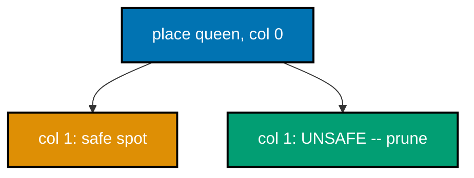
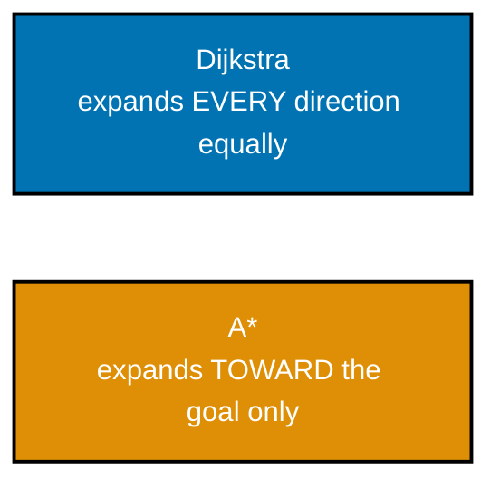
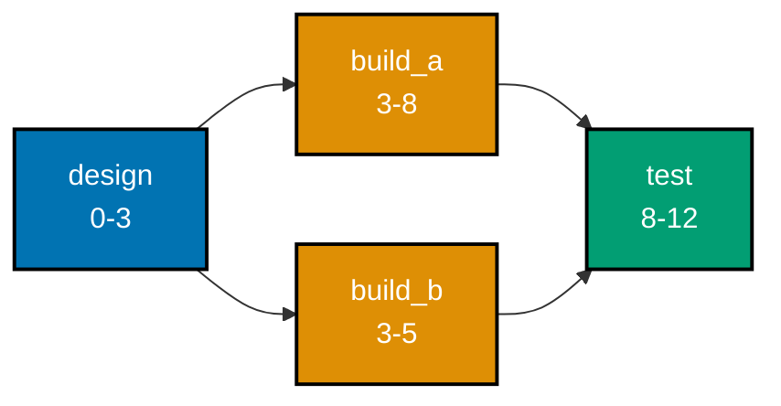
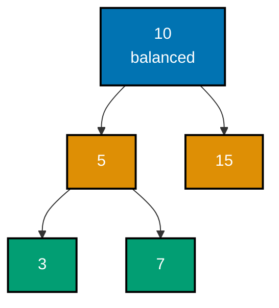
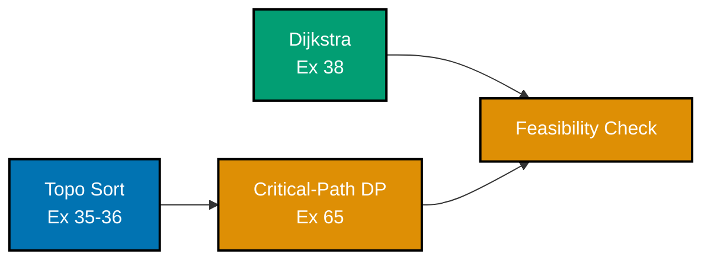

Examples 53-80 close the topic with the paradigms that solve genuinely hard problems: backtracking with pruning (N-Queens, subsets, permutations, word search, Sudoku), a direct greedy-vs-DP contrast, 2D dynamic programming (grid paths, longest increasing subsequence via two methods, matrix-chain multiplication, a space-optimized knapsack), a measured Dijkstra-vs-Bellman-Ford tradeoff and A\* search, critical-path scheduling and strongly connected components, a segment-tree-vs-Fenwick-tree comparison, balanced trees (AVL rotations and red-black invariants), advanced two-pointer and sliding-window patterns (3-sum, longest substring, minimum window), binary search on an answer space, a deterministic worst-case-linear selection algorithm, NP-hardness (brute-force-vs-heuristic TSP and a reduction sketch), the potential method for amortized analysis, three complexities stated and tested via doubling, a brute-force/greedy/DP paradigm shootout, and a capstone preview threading topological sort, critical-path DP, and Dijkstra into one mini scheduler. Every example runs and verifies exactly like the earlier tiers -- `python3 example.py` for inline output, `pytest` for the colocated `test_example.py`.

---

### Example 53: N-Queens by Backtracking

_ex-53 &middot; exercises co-25_

Backtracking places queens column by column, checking safety against every previously placed queen; the moment a placement is unsafe, it prunes that entire branch immediately instead of exploring it further. This example counts solutions for board sizes N=4 through N=8 and checks them against known solution counts.



**`learning/code/ex-53-backtracking-n-queens/example.py`**

```python
"""Example 53: N-Queens by Backtracking with Pruning."""

# Backtracking (co-25) places queens column by column, checking safety
# against every PREVIOUSLY placed queen; the moment a placement is unsafe,
# it prunes -- never even exploring the rest of that doomed branch further.


def solve_n_queens(n: int) -> int:  # => returns the COUNT of distinct solutions
    solutions = [0]  # => a one-element list used as a mutable counter in the closure
    columns_used: set[int] = set()  # => which columns already have a queen
    diag1_used: set[int] = set()  # => which "row - col" diagonals already have a queen
    diag2_used: set[int] = set()  # => which "row + col" diagonals already have a queen

    def place(row: int) -> None:  # => tries placing a queen in every column of this row
        if row == n:  # => base case: every row has a safely placed queen
            solutions[0] += 1  # => one more complete, valid solution found
            return  # => backtracks to try other placements at the previous row
        for col in range(n):  # => tries every column in this row
            if (  # => opens the three-way safety check for this column
                col in columns_used  # => same column already has a queen
                or (row - col) in diag1_used  # => same "/" diagonal already has a queen
                or (row + col) in diag2_used  # => same "\" diagonal already has a queen
            ):  # => THE PRUNE: this column is attacked by an earlier queen
                continue  # => skip this column entirely -- never explore it further
            columns_used.add(col)  # => marks this column as occupied
            diag1_used.add(row - col)  # => marks this "/" diagonal as occupied
            diag2_used.add(row + col)  # => marks this "\" diagonal as occupied
            place(row + 1)  # => recurses to place the NEXT row's queen
            columns_used.remove(col)  # => THE BACKTRACK: undoes this choice
            diag1_used.remove(row - col)  # => frees this diagonal for other branches
            diag2_used.remove(row + col)  # => frees this diagonal too

    place(0)  # => starts placing from row 0
    return solutions[0]  # => the total count of valid N-queens solutions


known_counts: dict[int, int] = {  # => OEIS A000170: the known solution count per N
    4: 2,  # => N=4 has exactly 2 distinct solutions
    5: 10,  # => N=5 has exactly 10 distinct solutions
    6: 4,  # => N=6 has exactly 4 distinct solutions
    7: 40,  # => N=7 has exactly 40 distinct solutions
    8: 92,  # => N=8 has exactly 92 distinct solutions
}  # => closes the known-solution-count table
for (  # => opens the tuple-unpacking loop header
    n,  # => the board size N
    expected,  # => N's known correct solution count
) in known_counts.items():  # => verifies N=4..8, as the syllabus specifies
    found = solve_n_queens(n)  # => backtracking's own count
    print(f"N={n}: {found}")  # => Output: one "N=n: count" line per N
    assert found == expected  # => confirms against the well-known OEIS counts
print("ex-53 OK")  # => Output: ex-53 OK
```

**Run**: `python3 example.py`

**Output**:

```text
N=4: 2
N=5: 10
N=6: 4
N=7: 40
N=8: 92
ex-53 OK
```

**`learning/code/ex-53-backtracking-n-queens/test_example.py`**

```python
"""Example 53: pytest verification for N-Queens Backtracking."""

from example import solve_n_queens


def test_known_solution_counts_for_small_n() -> None:
    assert solve_n_queens(1) == 1  # => trivially one way to place a single queen
    assert solve_n_queens(4) == 2
    assert solve_n_queens(8) == 92


def test_n_equals_two_and_three_have_no_solutions() -> None:
    assert solve_n_queens(2) == 0  # => too small a board to avoid all attacks
    assert solve_n_queens(3) == 0


# => Run: pytest -- Output: 2 passed
```

**Verify**: `pytest -q`

**Output**:

```text
2 passed
```

**Key takeaway**: Backtracking's power comes from PRUNING: checking safety immediately after each placement, rather than only at the end, means an unsafe branch is abandoned before wasting any time exploring its (guaranteed-invalid) descendants.

**Why it matters**: N-Queens is the classic introduction to backtracking because its pruning benefit is dramatic and easy to see: without early safety checks, the search space is a hopeless `N^N` brute force; with them, N=8's 92 solutions are found in a fraction of a second. Every later backtracking example in this topic (Examples 54-57) leans on this same 'check as you go, abandon early' discipline.

---

### Example 54: Enumerate All Subsets by Backtracking

_ex-54 &middot; exercises co-25_

At each element, backtracking branches into two choices: include it, or do not. N independent binary choices produce exactly 2^n leaves in the resulting search tree. This example enumerates every subset of a small set and confirms the count is exactly `2^n` with no duplicates.

**`learning/code/ex-54-backtracking-subsets/example.py`**

```python
"""Example 54: Enumerate All Subsets by Backtracking -- Exactly 2^n of Them."""

# At each element, backtracking (co-25) branches into TWO choices: include
# it, or don't. n independent binary choices produce exactly 2^n leaves --
# no pruning needed here, since every combination of choices is valid.


def all_subsets(items: list[int]) -> list[list[int]]:  # => returns all 2^n subsets
    result: list[list[int]] = []  # => accumulates every complete subset found
    current: list[int] = []  # => the in-progress subset being built

    def backtrack(index: int) -> None:  # => decides item[index]'s fate: in or out
        if index == len(items):  # => base case: every item has been decided
            result.append(list(current))  # => records a COPY -- current keeps mutating
            return
        current.append(items[index])  # => CHOICE 1: include this item
        backtrack(index + 1)  # => explores every subset that includes it
        current.pop()  # => BACKTRACK: undoes that inclusion
        backtrack(index + 1)  # => CHOICE 2: explores every subset that excludes it

    backtrack(0)  # => starts deciding from the first item
    return result  # => every one of the 2^n possible subsets


items: list[int] = [1, 2, 3]  # => a small 3-element set
subsets = all_subsets(items)  # => all 8 subsets of {1, 2, 3}
print(len(subsets))  # => Output: 8
print(  # => opens the sorted-subsets print call
    sorted(subsets)  # => sorts for a deterministic, readable print order
)  # => Output: [[], [1], [1, 2], [1, 2, 3], [1, 3], [2], [2, 3], [3]]

assert len(subsets) == 2 ** len(items)  # => confirms exactly 2^n subsets were generated
unique_subsets = {  # => opens the duplicate-detection set comprehension
    tuple(s)
    for s in subsets  # => converts each list subset to a hashable tuple
}  # => tuples are hashable, so a set catches duplicates
assert len(unique_subsets) == len(subsets)  # => confirms NO subset was generated twice
assert [] in subsets  # => confirms the empty subset is included
assert items in subsets  # => confirms the full set itself is included
print("ex-54 OK")  # => Output: ex-54 OK
```

**Run**: `python3 example.py`

**Output**:

```text
8
[[], [1], [1, 2], [1, 2, 3], [1, 3], [2], [2, 3], [3]]
ex-54 OK
```

**`learning/code/ex-54-backtracking-subsets/test_example.py`**

```python
"""Example 54: pytest verification for Backtracking Subsets."""

from example import all_subsets


def test_subset_count_is_two_to_the_n() -> None:
    for n in range(6):
        items = list(range(n))
        assert len(all_subsets(items)) == 2**n


def test_no_duplicate_subsets_are_generated() -> None:
    subsets = all_subsets([1, 2, 3, 4])
    unique = {tuple(s) for s in subsets}
    assert len(unique) == len(subsets)


def test_empty_input_yields_only_the_empty_subset() -> None:
    assert all_subsets([]) == [[]]


# => Run: pytest -- Output: 3 passed
```

**Verify**: `pytest -q`

**Output**:

```text
3 passed
```

**Key takeaway**: Enumerating all subsets is backtracking at its simplest -- no pruning needed at all, since every leaf of the include/exclude decision tree IS a valid subset -- which is what makes it a clean baseline before adding constraints (like Example 56's grid boundaries or Example 57's Sudoku rules).

**Why it matters**: Recognizing 'exactly 2^n' as the unavoidable size of a full subset enumeration is important groundwork for recognizing when a problem NEEDS pruning to be tractable: N-Queens (Example 53) also has an exponential-shaped search tree, but aggressive pruning keeps it fast in practice, while pure subset enumeration has no such shortcut -- `2^n` really is unavoidable here.

---

### Example 55: Enumerate All Permutations by Backtracking

_ex-55 &middot; exercises co-25_

At each position, backtracking tries every unused item: n choices for the first slot, n-1 for the second, and so on, the classic n! structure. This example enumerates every permutation of a small list and confirms the count is exactly `n!` with every permutation distinct.

**`learning/code/ex-55-backtracking-permutations/example.py`**

```python
"""Example 55: Enumerate All Permutations by Backtracking -- Exactly n! of Them."""

# At each position, backtracking (co-25) tries every UNUSED item; n choices
# for the first slot, n-1 for the second, and so on -- the classic n!
# counting argument, realized directly as recursive choice-and-undo.


def all_permutations(  # => builds every ordering by choosing one UNUSED item at a time
    items: list[int],  # => the items to permute
) -> list[list[int]]:  # => returns all n! orderings
    result: list[list[int]] = []  # => accumulates every complete permutation
    current: list[int] = []  # => the in-progress permutation being built
    used: set[int] = set()  # => which items are already placed in `current`

    def backtrack() -> (
        None
    ):  # => fills the next position, then backtracks to try others
        if len(current) == len(items):  # => base case: every item has been placed
            result.append(list(current))  # => records a COPY of the completed ordering
            return
        for item in items:  # => tries every item as the NEXT position's value
            if item in used:  # => already placed earlier in this branch -- skip it
                continue  # => THE PRUNE: never reconsider an already-used item
            used.add(item)  # => marks item as placed
            current.append(item)  # => appends it to the in-progress ordering
            backtrack()  # => recurses to fill the remaining positions
            current.pop()  # => BACKTRACK: undoes the append
            used.remove(item)  # => frees item for other branches

    backtrack()  # => starts with an empty ordering
    return result  # => every one of the n! possible orderings


items: list[int] = [1, 2, 3]  # => a small 3-element set
perms = all_permutations(items)  # => all 6 permutations of [1, 2, 3]
print(len(perms))  # => Output: 6
print(  # => opens the sorted-permutations print call
    sorted(perms)  # => sorts for a deterministic, readable print order
)  # => Output: [[1, 2, 3], [1, 3, 2], [2, 1, 3], [2, 3, 1], [3, 1, 2], [3, 2, 1]]

assert len(perms) == 6  # => 3! = 6, confirms the exact expected count
unique_perms = {tuple(p) for p in perms}  # => tuples are hashable, catching duplicates
assert len(unique_perms) == len(perms)  # => confirms every permutation is DISTINCT
for p in perms:  # => confirms every permutation is a valid rearrangement of items
    assert sorted(p) == sorted(items)  # => same multiset of elements, just reordered
print("ex-55 OK")  # => Output: ex-55 OK
```

**Run**: `python3 example.py`

**Output**:

```text
6
[[1, 2, 3], [1, 3, 2], [2, 1, 3], [2, 3, 1], [3, 1, 2], [3, 2, 1]]
ex-55 OK
```

**`learning/code/ex-55-backtracking-permutations/test_example.py`**

```python
"""Example 55: pytest verification for Backtracking Permutations."""

import math

from example import all_permutations


def test_permutation_count_is_n_factorial() -> None:
    for n in range(5):
        items = list(range(n))
        assert len(all_permutations(items)) == math.factorial(n)


def test_all_permutations_are_distinct() -> None:
    perms = all_permutations([1, 2, 3, 4])
    unique = {tuple(p) for p in perms}
    assert len(unique) == len(perms)


def test_empty_input_yields_one_empty_permutation() -> None:
    assert all_permutations([]) == [[]]


# => Run: pytest -- Output: 3 passed
```

**Verify**: `pytest -q`

**Output**:

```text
3 passed
```

**Key takeaway**: Permutation enumeration's branching factor SHRINKS by one at every level (n, then n-1, then n-2, ...) because each choice removes one item from the pool of unused candidates -- structurally different from subset enumeration's fixed two-way branch at every level.

**Why it matters**: Comparing this example's shrinking branching factor against Example 54's fixed binary branching sharpens the general skill of reading a problem's decision structure directly off its recursion: 'how many valid choices remain at this level' determines both the algorithm's shape and its total search-space size, before a single line of pruning logic is even written.

---

### Example 56: Grid Word Search via Backtracking

_ex-56 &middot; exercises co-25_

Backtracking tries extending a partial match in all four directions from each cell, marking cells visited so the same letter is not reused within one match attempt, then unmarking them on backtrack. This example searches a letter grid for both a present word and an absent one, confirming both cases resolve correctly.

**`learning/code/ex-56-backtracking-word-search/example.py`**

```python
"""Example 56: Grid Word Search via Backtracking."""

# Backtracking (co-25) tries extending a partial match in all 4 directions
# from each cell, marking cells VISITED so the same letter isn't reused
# twice in one path -- and un-marking them on the way back out, so other
# starting cells can still use that same grid position.


def word_search(grid: list[list[str]], word: str) -> bool:  # => True if word is found
    rows, cols = len(grid), len(grid[0])  # => the grid's dimensions
    visited: set[tuple[int, int]] = set()  # => cells used in the CURRENT path attempt

    def backtrack(r: int, c: int, index: int) -> bool:  # => tries to match word[index:]
        if index == len(word):  # => base case: every character has been matched
            return True  # => the whole word was found along this path
        if (  # => opens the four-way out-of-bounds/reuse/mismatch check
            r < 0  # => off the top edge
            or r >= rows  # => off the bottom edge
            or c < 0  # => off the left edge
            or c >= cols  # => off the right edge
            or (r, c) in visited  # => this cell is already used in the current path
            or grid[r][c] != word[index]  # => this cell's letter doesn't match
        ):  # => out of bounds, already used, or the letter doesn't match
            return False  # => THE PRUNE: this path cannot possibly succeed
        visited.add((r, c))  # => marks this cell as used for the current path
        found = (  # => opens the 4-direction exploration
            backtrack(r + 1, c, index + 1)  # => try DOWN
            or backtrack(r - 1, c, index + 1)  # => try UP
            or backtrack(r, c + 1, index + 1)  # => try RIGHT
            or backtrack(r, c - 1, index + 1)  # => try LEFT
        )  # => tries all 4 directions -- `or` short-circuits on the first success
        visited.remove(  # => opens the un-mark-cell call
            (r, c)  # => the cell to free
        )  # => BACKTRACK: frees this cell for OTHER starting attempts
        return found  # => whether any of the 4 directions led to a full match

    for r in range(rows):  # => tries every cell as a possible STARTING point
        for c in range(cols):  # => and every column within that row
            if backtrack(r, c, 0):  # => a full match was found starting here
                return True  # => no need to try any other starting cell
    return False  # => no starting cell led to a complete match anywhere


grid: list[list[str]] = [  # => a 3x4 letter grid
    ["A", "B", "C", "E"],  # => row 0
    ["S", "F", "C", "S"],  # => row 1
    ["A", "D", "E", "E"],  # => row 2
]  # => closes the grid literal
print(word_search(grid, "ABCCED"))  # => Output: True -- A->B->C->C->E->D, a valid path
print(word_search(grid, "SEE"))  # => Output: True -- S->E->E, a valid path
print(word_search(grid, "ABCB"))  # => Output: False -- would need to reuse a cell

assert word_search(grid, "ABCCED") is True  # => confirms a genuinely findable word
assert word_search(grid, "SEE") is True  # => confirms another findable word
assert word_search(grid, "ABCB") is False  # => confirms reuse is correctly disallowed
assert word_search(grid, "ZZZ") is False  # => confirms a wholly absent word fails too
print("ex-56 OK")  # => Output: ex-56 OK
```

**Run**: `python3 example.py`

**Output**:

```text
True
True
False
ex-56 OK
```

**`learning/code/ex-56-backtracking-word-search/test_example.py`**

```python
"""Example 56: pytest verification for Grid Word Search."""

from example import word_search


def test_finds_a_word_that_exists_along_a_valid_path() -> None:
    grid = [["A", "B"], ["C", "D"]]
    assert word_search(grid, "ABDC") is True  # => A -> B -> D -> C, all adjacent


def test_rejects_a_word_requiring_cell_reuse() -> None:
    grid = [["A", "A"]]
    assert word_search(grid, "AAA") is False  # => only 2 cells, word needs 3 A's


def test_single_cell_grid_matches_single_character_word() -> None:
    grid = [["X"]]
    assert word_search(grid, "X") is True
    assert word_search(grid, "Y") is False


# => Run: pytest -- Output: 3 passed
```

**Verify**: `pytest -q`

**Output**:

```text
3 passed
```

**Key takeaway**: Marking a cell visited BEFORE recursing and unmarking it AFTER (on backtrack) is the pattern that lets backtracking explore a path, fail, and cleanly try a different path -- forgetting to unmark is one of the most common backtracking bugs, since it leaves stale state contaminating sibling branches.

**Why it matters**: The visited-then-unvisited discipline this example demonstrates generalizes to every backtracking problem that needs to track 'what is currently committed on THIS path' -- N-Queens' column/diagonal tracking and Sudoku's row/column/box constraints (Example 57) both depend on the exact same mark-then-unmark pattern under the hood.

---

### Example 57: Solve Sudoku by Constraint Backtracking

_ex-57 &middot; exercises co-25_

Backtracking fills the first empty cell with each candidate digit 1-9, checking the row, column, and 3x3-box constraints before committing to that digit -- an invalid digit is rejected immediately, not discovered several moves later. This example solves a classic Sudoku puzzle and verifies the solved board is fully valid.

**`learning/code/ex-57-backtracking-sudoku/example.py`**

```python
"""Example 57: Solve Sudoku by Constraint Backtracking."""

# Backtracking (co-25) fills the FIRST empty cell with each candidate 1-9,
# checking the row/column/3x3-box constraints before committing -- an
# invalid candidate is pruned immediately, never explored further.

Board = list[list[int]]  # => a 9x9 grid; 0 marks an empty cell


def find_empty(board: Board) -> tuple[int, int] | None:  # => the first 0 cell, or None
    for r in range(9):  # => scans row by row
        for c in range(9):  # => and column by column within that row
            if board[r][c] == 0:  # => an unfilled cell
                return (r, c)  # => the next cell backtracking should try to fill
    return None  # => no empty cells remain -- the board is completely filled


def is_valid(board: Board, r: int, c: int, digit: int) -> bool:  # => the 3 Sudoku rules
    if digit in board[r]:  # => RULE 1: digit must not already be in this row
        return False  # => row conflict -- reject
    if digit in [board[i][c] for i in range(9)]:  # => RULE 2: nor in this column
        return False  # => column conflict -- reject
    box_r, box_c = 3 * (r // 3), 3 * (c // 3)  # => the top-left corner of this 3x3 box
    for i in range(box_r, box_r + 3):  # => RULE 3: nor anywhere in this 3x3 box
        for j in range(box_c, box_c + 3):  # => scans every cell of the 3x3 box
            if board[i][j] == digit:  # => the digit already appears in this box
                return False  # => box conflict -- reject
    return True  # => digit violates none of the three rules at this position


def solve_sudoku(board: Board) -> bool:  # => mutates board in place; True if solved
    empty = find_empty(board)  # => finds the next cell needing a digit
    if empty is None:  # => base case: no empty cells left -- solved!
        return True  # => nothing left to fill -- solved
    r, c = empty  # => the (row, col) to try filling next
    for digit in range(1, 10):  # => tries every candidate digit 1-9
        if is_valid(  # => opens the rule-check call
            board,  # => the current, partially-filled board
            r,  # => the row of the cell being tried
            c,  # => the column of the cell being tried
            digit,  # => the current board state and candidate digit
        ):  # => THE PRUNE: skip digits violating the rules
            board[r][c] = digit  # => commits this candidate
            if solve_sudoku(board):  # => recurses to fill the rest of the board
                return True  # => this whole branch led to a full solution
            board[r][c] = 0  # => BACKTRACK: this digit didn't lead anywhere -- undo it
    return False  # => no digit at (r, c) works -- an earlier choice must be wrong


puzzle: Board = [  # => a well-known easy Sudoku puzzle
    [5, 3, 0, 0, 7, 0, 0, 0, 0],  # => row 0
    [6, 0, 0, 1, 9, 5, 0, 0, 0],  # => row 1
    [0, 9, 8, 0, 0, 0, 0, 6, 0],  # => row 2
    [8, 0, 0, 0, 6, 0, 0, 0, 3],  # => row 3
    [4, 0, 0, 8, 0, 3, 0, 0, 1],  # => row 4
    [7, 0, 0, 0, 2, 0, 0, 0, 6],  # => row 5
    [0, 6, 0, 0, 0, 0, 2, 8, 0],  # => row 6
    [0, 0, 0, 4, 1, 9, 0, 0, 5],  # => row 7
    [0, 0, 0, 0, 8, 0, 0, 7, 9],  # => row 8
]  # => closes the puzzle literal -- 0 marks each empty cell
solved = solve_sudoku(  # => opens the solve call
    puzzle  # => mutated in place by the backtracking solver
)  # => mutates puzzle in place, returns whether it succeeded
print(solved)  # => Output: True

assert solved is True  # => confirms this puzzle was solvable
for r in range(9):  # => confirms every row is a permutation of 1-9
    assert sorted(puzzle[r]) == list(range(1, 10))  # => each row has every digit once
for c in range(9):  # => confirms every column is a permutation of 1-9
    assert sorted(  # => opens the column-values sort
        puzzle[i][c]  # => the value at row i, column c
        for i in range(9)  # => gathers column c's value from every row
    ) == list(range(1, 10))  # => each column has every digit once
for box_r in range(0, 9, 3):  # => confirms every 3x3 box is a permutation of 1-9
    for box_c in range(0, 9, 3):  # => scans every box's top-left corner
        box_values = [  # => opens the box-flattening comprehension
            puzzle[box_r + i][box_c + j]  # => the value at this box-relative cell
            for i in range(3)  # => 3 rows within the box
            for j in range(3)  # => one box's cells
        ]  # => flattens one 3x3 box into a flat list
        assert sorted(box_values) == list(
            range(1, 10)  # => the digits every box must contain exactly once
        )  # => each box has every digit once
print("ex-57 OK")  # => Output: ex-57 OK
```

**Run**: `python3 example.py`

**Output**:

```text
True
ex-57 OK
```

**`learning/code/ex-57-backtracking-sudoku/test_example.py`**

```python
"""Example 57: pytest verification for Sudoku Backtracking."""

from example import is_valid, solve_sudoku


def test_solves_a_known_easy_puzzle() -> None:
    puzzle = [
        [5, 3, 0, 0, 7, 0, 0, 0, 0],
        [6, 0, 0, 1, 9, 5, 0, 0, 0],
        [0, 9, 8, 0, 0, 0, 0, 6, 0],
        [8, 0, 0, 0, 6, 0, 0, 0, 3],
        [4, 0, 0, 8, 0, 3, 0, 0, 1],
        [7, 0, 0, 0, 2, 0, 0, 0, 6],
        [0, 6, 0, 0, 0, 0, 2, 8, 0],
        [0, 0, 0, 4, 1, 9, 0, 0, 5],
        [0, 0, 0, 0, 8, 0, 0, 7, 9],
    ]
    assert solve_sudoku(puzzle) is True
    assert puzzle[0] == [5, 3, 4, 6, 7, 8, 9, 1, 2]  # => the known solved first row


def test_is_valid_rejects_a_row_duplicate() -> None:
    board = [[0] * 9 for _ in range(9)]
    board[0][0] = 5
    assert is_valid(board, 0, 1, 5) is False  # => 5 already in row 0
    assert is_valid(board, 0, 1, 6) is True  # => 6 is not yet used anywhere relevant


# => Run: pytest -- Output: 2 passed
```

**Verify**: `pytest -q`

**Output**:

```text
2 passed
```

**Key takeaway**: Sudoku's constraint check (row, column, AND box, all three, every single placement) is what keeps the backtracking search tractable -- without checking all three constraints immediately, the search would waste enormous effort filling in digits that are only discovered to be invalid much later.

**Why it matters**: Sudoku is the capstone backtracking example in this topic because it combines everything the prior four examples built up: pruning (Example 53), a clean decision structure (Examples 54-55), and mark/unmark discipline (Example 56), all layered under THREE simultaneous constraints instead of one. It is also a realistic-scale demonstration that backtracking with good pruning solves problems that would be hopeless via brute force.

---

### Example 58: 0/1 Knapsack -- Greedy Diverges from DP

_ex-58 &middot; exercises co-22, co-23_

Fractional knapsack's greedy-by-ratio is provably optimal when items can be split. Forced to take items whole (0/1), that same greedy heuristic can strand capacity that a globally better combination would have used differently. This example runs both strategies on the same instance and shows exactly where they diverge.

**`learning/code/ex-58-greedy-vs-dp-contrast/example.py`**

```python
"""Example 58: 0/1 Knapsack -- Greedy by Value/Weight Ratio Diverges from DP-Optimal."""

# Fractional knapsack's greedy-by-ratio is provably optimal WHEN items can be
# split. Forced to take items WHOLE (0/1, co-22), that same greedy heuristic
# can strand capacity that a globally-optimal DP (co-23) would have used
# better -- the greedy-choice property that makes fractional-knapsack work
# simply does not transfer to the 0/1 variant.


def greedy_knapsack_by_ratio(  # => sorts by value/weight ratio, then takes greedily
    weights: list[int],  # => each item's own weight
    values: list[int],  # => each item's own value
    capacity: int,  # => item weights/values + limit
) -> int:  # => O(n log n): sorts by ratio, then takes whole items greedily
    items = sorted(  # => opens the ratio-sort call
        zip(weights, values),  # => pairs each item's weight with its value
        key=lambda pair: pair[1] / pair[0],  # => sorts by value-per-weight ratio
        reverse=True,  # => best ratio first
    )  # => highest value-per-weight first
    total_value = 0  # => running greedy total
    remaining = capacity  # => how much capacity is still unused
    for w, v in items:  # => tries each item, best ratio first
        if w <= remaining:  # => it fits WHOLE -- take it (no fractions allowed)
            total_value += v  # => adds its full value
            remaining -= w  # => consumes its full weight
        # => else: SKIPPED ENTIRELY -- no partial credit, unlike fractional knapsack
    return total_value  # => greedy's answer -- NOT guaranteed optimal for 0/1


def knapsack_01_dp(  # => the same 2D DP as Example 51, guaranteed globally optimal
    weights: list[int],  # => each item's own weight
    values: list[int],  # => each item's own value
    capacity: int,  # => item weights/values + limit
) -> int:  # => O(n * capacity): the same DP as Example 51, the true optimum
    n = len(weights)  # => number of available items
    dp: list[list[int]] = [
        [0] * (capacity + 1)  # => one zero-filled row per item count
        for _ in range(n + 1)
    ]  # => table of zeros
    for i in range(1, n + 1):  # => considers items one at a time
        w, v = weights[i - 1], values[i - 1]  # => this item's own weight/value
        for c in range(capacity + 1):  # => every possible capacity, from 0 up
            dp[i][c] = dp[i - 1][c]  # => the SKIP option: value stays whatever it was
            if w <= c:  # => the TAKE option is only possible if it actually fits
                dp[i][c] = max(
                    dp[i][c],  # => the SKIP option's value
                    v + dp[i - 1][c - w],  # => the TAKE option's value
                )  # => best of skip vs take
    return dp[n][capacity]  # => the true optimal value, considering EVERY combination


weights: list[int] = [10, 20, 30]  # => a classic textbook counterexample
values: list[int] = [60, 100, 120]  # => ratios: 6.0, 5.0, 4.0 -- item 0 looks best
capacity = 50  # => the knapsack's weight limit
greedy_answer = greedy_knapsack_by_ratio(  # => opens the greedy call
    weights,  # => same weights as the DP call below
    values,  # => same values as the DP call below
    capacity,  # => same inputs as the DP, for a fair comparison
)  # => takes item 0 (ratio 6), then item 1 (ratio 5); item 2 no longer fits
optimal_answer = knapsack_01_dp(weights, values, capacity)  # => the TRUE optimum
print(greedy_answer)  # => Output: 160 -- items 0 and 1: weight 30, value 160
print(optimal_answer)  # => Output: 220 -- items 1 and 2: weight 50, value 220

assert greedy_answer == 160  # => confirms greedy's (suboptimal) answer
assert optimal_answer == 220  # => confirms DP's true optimum
assert (  # => opens the greedy-underperforms-DP check
    optimal_answer > greedy_answer
)  # => confirms the greedy heuristic genuinely underperforms DP here
print("ex-58 OK")  # => Output: ex-58 OK
```

**Run**: `python3 example.py`

**Output**:

```text
160
220
ex-58 OK
```

**`learning/code/ex-58-greedy-vs-dp-contrast/test_example.py`**

```python
"""Example 58: pytest verification for Greedy vs DP on 0/1 Knapsack."""

from example import greedy_knapsack_by_ratio, knapsack_01_dp


def test_dp_strictly_beats_ratio_greedy_on_the_classic_counterexample() -> None:
    weights, values, capacity = [10, 20, 30], [60, 100, 120], 50
    greedy = greedy_knapsack_by_ratio(weights, values, capacity)
    optimal = knapsack_01_dp(weights, values, capacity)
    assert greedy == 160
    assert optimal == 220
    assert optimal > greedy


def test_both_agree_when_all_items_fit_anyway() -> None:
    weights, values, capacity = [1, 2, 3], [10, 20, 30], 100  # => everything fits
    assert greedy_knapsack_by_ratio(weights, values, capacity) == knapsack_01_dp(
        weights, values, capacity
    )


# => Run: pytest -- Output: 2 passed
```

**Verify**: `pytest -q`

**Output**:

```text
2 passed
```

**Key takeaway**: The SAME greedy heuristic (highest value-per-weight ratio first) is provably optimal for one problem variant (fractional knapsack) and provably NOT optimal for a closely related one (0/1 knapsack) -- the 'whole items only' constraint is what breaks the exchange-argument proof that made greedy safe in the fractional case.

**Why it matters**: This is a deliberately pointed lesson: two versions of 'the same problem' that look almost identical can have completely different correct algorithms, and the seemingly minor detail (splittable vs. whole items) is exactly what determines which one applies. Assuming a greedy solution transfers from one problem variant to a superficially similar one is a genuinely common real-world mistake.

---

### Example 59: Least-Cost Path Through a Grid

_ex-59 &middot; exercises co-24_

`dp[r][c]` = cheapest cost to reach `(r, c)`, moving only right or down: it must have arrived from directly above or directly left, so the cheapest way to reach it is the cheaper of those two options plus this cell's own cost. This example solves a small grid and confirms the DP answer against exhaustive path enumeration.

**`learning/code/ex-59-dp-2d-grid-paths/example.py`**

```python
"""Example 59: Least-Cost Path Through a Grid, via 2D DP."""

# dp[r][c] = cheapest cost to REACH (r, c), moving only right or down
# (co-24): it must have arrived from directly above or directly left,
# whichever was cheaper, plus this cell's own cost.


def min_cost_path(grid: list[list[int]]) -> int:  # => O(rows*cols) time and space
    rows, cols = len(grid), len(grid[0])  # => the grid's dimensions
    dp: list[list[int]] = [  # => opens the 2D table construction
        [0] * cols  # => one zero-filled row per grid row
        for _ in range(rows)  # => one fresh row of zeros per grid row
    ]  # => dp[r][c] = min cost to reach (r, c) from (0, 0)
    dp[0][0] = grid[0][0]  # => base case: reaching the start costs just its own cell
    for c in range(1, cols):  # => the FIRST row can only be reached by moving right
        dp[0][c] = (  # => opens the first-row assignment
            dp[0][c - 1] + grid[0][c]  # => running total plus this cell's own cost
        )  # => only one possible predecessor: the left
    for r in range(1, rows):  # => the FIRST column can only be reached by moving down
        dp[r][0] = dp[r - 1][0] + grid[r][0]  # => only one possible predecessor: above
    for r in range(1, rows):  # => fills the rest of the table, row by row
        for c in range(1, cols):  # => and column by column within each row
            dp[r][c] = grid[r][c] + min(  # => opens the cheaper-predecessor comparison
                dp[r - 1][c],  # => cost of arriving from directly above
                dp[r][c - 1],  # => cost via above vs cost via the left
            )  # => cheaper of "came from above" or "came from the left"
    return dp[rows - 1][  # => opens the final-cell lookup
        cols - 1  # => the destination's column index
    ]  # => the bottom-right cell: total cost of the best path


def min_cost_path_brute_force(grid: list[list[int]]) -> int:  # => O(2^(rows+cols))
    rows, cols = len(grid), len(grid[0])  # => the grid's dimensions

    def recurse(r: int, c: int) -> int:  # => explores EVERY right/down path, no memo
        if r == rows - 1 and c == cols - 1:  # => reached the destination
            return grid[r][c]  # => just this cell's own cost
        if r == rows - 1:  # => bottom row -- the ONLY option is moving right
            return grid[r][c] + recurse(
                r,  # => stays on the same, bottom row
                c + 1,  # => the only reachable neighbor from the bottom row
            )  # => this cell's cost plus moving right
        if c == cols - 1:  # => rightmost column -- the ONLY option is moving down
            return grid[r][c] + recurse(
                r + 1,  # => moves down a row
                c,  # => the only reachable neighbor from the rightmost column
            )  # => this cell's cost plus moving down
        return grid[r][c] + min(  # => opens the both-directions comparison
            recurse(r + 1, c),  # => cost of continuing downward
            recurse(r, c + 1),  # => cost via down vs cost via right
        )  # => tries BOTH directions, no reuse of overlapping subproblems

    return recurse(0, 0)  # => starts exploring from the top-left corner


grid: list[list[int]] = [  # => a small 3x3 cost grid
    [1, 3, 1],  # => row 0
    [1, 5, 1],  # => row 1
    [4, 2, 1],  # => row 2
]  # => closes the grid literal
fast_result = min_cost_path(grid)  # => O(rows*cols) DP answer
brute_result = min_cost_path_brute_force(grid)  # => exhaustive ground truth
print(fast_result)  # => Output: 7
print(brute_result)  # => Output: 7

assert fast_result == brute_result  # => confirms both approaches agree exactly
assert fast_result == 7  # => confirms the known-optimal path 1->3->1->1->1 sums to 7
print("ex-59 OK")  # => Output: ex-59 OK
```

**Run**: `python3 example.py`

**Output**:

```text
7
7
ex-59 OK
```

**`learning/code/ex-59-dp-2d-grid-paths/test_example.py`**

```python
"""Example 59: pytest verification for 2D DP Grid Paths."""

from example import min_cost_path, min_cost_path_brute_force


def test_matches_brute_force_enumeration_on_small_grids() -> None:
    grid = [[1, 2, 3], [4, 8, 2], [1, 5, 3]]
    assert min_cost_path(grid) == min_cost_path_brute_force(grid)


def test_single_row_grid_only_moves_right() -> None:
    grid = [[1, 2, 3, 4]]
    assert min_cost_path(grid) == 10  # => the only possible path


def test_single_cell_grid() -> None:
    assert min_cost_path([[5]]) == 5


# => Run: pytest -- Output: 3 passed
```

**Verify**: `pytest -q`

**Output**:

```text
3 passed
```

**Key takeaway**: Grid-path DP's two-directions-only movement (right or down) is what guarantees every cell's dependencies (the cell above, the cell to the left) are ALREADY computed by the time that cell is processed, in simple row-major order -- no separate topological-sort step needed, unlike a general DAG.

**Why it matters**: A grid is really just a special, highly structured DAG, and this example is a good bridge between 'DP on an explicit table' (Examples 49-51) and 'DP over a general graph's topological order' (Example 65's critical path): recognizing that a grid's row-major processing order IS a topological order, just one that never needed an explicit sort, connects the two ideas.

---

### Example 60: Longest Increasing Subsequence

_ex-60 &middot; exercises co-23, co-27_

`dp[i]` = length of the LIS ending at index i: look back at every earlier smaller element and extend its best LIS by one. The patience-sorting technique achieves the same answer in O(n log n) using binary search instead of a full O(n^2) backward scan. This example runs both and confirms they agree.

**`learning/code/ex-60-dp-longest-increasing-subsequence/example.py`**

```python
"""Example 60: Longest Increasing Subsequence -- O(n^2) DP vs O(n log n) Patience."""

# dp[i] = length of the LIS ENDING at index i (co-23): look back at every
# earlier smaller element and extend its best LIS by one. The patience-
# sorting variant (co-27) instead maintains the smallest possible "tail"
# value for each achievable LIS length, using BINARY SEARCH to place each
# new element -- same final answer, but O(n log n) instead of O(n^2).
import bisect


def lis_length_dp(items: list[int]) -> int:  # => O(n^2): the straightforward DP
    if not items:  # => an empty sequence has LIS length 0
        return 0  # => nothing to extend
    dp: list[int] = [1] * len(  # => opens the seed-array construction
        items  # => one seed entry per element
    )  # => every element is, at minimum, its own LIS of 1
    for i in range(len(items)):  # => for each position...
        for j in range(i):  # => ...checks every EARLIER position
            if items[j] < items[i]:  # => items[i] could extend an increasing run from j
                dp[i] = max(  # => opens the best-so-far comparison
                    dp[i],
                    dp[j] + 1,  # => current best vs extending j's LIS by one
                )  # => extends j's best LIS by one, if better
    return max(dp)  # => the longest LIS ending anywhere


def lis_length_patience(  # => binary-search variant, same answer, faster asymptotically
    items: list[int],  # => the sequence to scan
) -> int:  # => O(n log n): binary-search variant
    tails: list[int] = []  # => tails[k] = smallest possible tail of a length-(k+1) LIS
    for x in items:  # => processes elements left to right, one at a time
        pos = bisect.bisect_left(  # => opens the insertion-point search
            tails,
            x,  # => where x would insert to keep tails sorted
        )  # => O(log n): where x would insert to keep tails sorted
        if pos == len(tails):  # => x is bigger than every current tail -- LIS GROWS
            tails.append(x)  # => extends the longest LIS found so far by one
        else:  # => x can replace an existing tail with a SMALLER one, same length
            tails[pos] = x  # => keeps future extensions as easy as possible
    return len(  # => opens the final-length lookup
        tails  # => tails' LENGTH, not its values, is the LIS length
    )  # => the final length -- tails' VALUES are not the actual sequence


sequence: list[int] = [  # => opens the classic LeetCode LIS example literal
    10,  # => index 0
    9,  # => index 1
    2,  # => index 2
    5,  # => index 3
    3,  # => index 4
    7,  # => index 5
    101,  # => index 6
    18,  # => index 7
]  # => the classic LeetCode LIS example
dp_answer = lis_length_dp(sequence)  # => O(n^2) DP result
patience_answer = lis_length_patience(sequence)  # => O(n log n) patience-sort result
print(dp_answer)  # => Output: 4
print(patience_answer)  # => Output: 4 -- e.g. [2, 3, 7, 101] or [2, 3, 7, 18]

assert dp_answer == patience_answer  # => confirms both approaches agree exactly
assert dp_answer == 4  # => confirms the known LIS length for this classic example
assert lis_length_dp([]) == 0  # => confirms the empty-sequence edge case
print("ex-60 OK")  # => Output: ex-60 OK
```

**Run**: `python3 example.py`

**Output**:

```text
4
4
ex-60 OK
```

**`learning/code/ex-60-dp-longest-increasing-subsequence/test_example.py`**

```python
"""Example 60: pytest verification for Longest Increasing Subsequence."""

import random

from example import lis_length_dp, lis_length_patience


def test_both_approaches_agree_on_random_sequences() -> None:
    random.seed(71)
    for _ in range(20):
        seq = [random.randint(0, 30) for _ in range(15)]
        assert lis_length_dp(seq) == lis_length_patience(seq)


def test_strictly_increasing_input_has_lis_equal_to_its_own_length() -> None:
    seq = [1, 2, 3, 4, 5]
    assert lis_length_dp(seq) == 5
    assert lis_length_patience(seq) == 5


def test_strictly_decreasing_input_has_lis_of_one() -> None:
    seq = [5, 4, 3, 2, 1]
    assert lis_length_dp(seq) == 1
    assert lis_length_patience(seq) == 1


# => Run: pytest -- Output: 3 passed
```

**Verify**: `pytest -q`

**Output**:

```text
3 passed
```

**Key takeaway**: The O(n^2) DP and O(n log n) patience-sorting approaches to LIS compute the SAME length, but the patience method's binary search over a cleverly maintained 'smallest tail per length' array is what shaves off a full factor of n from the naive DP's backward scan.

**Why it matters**: LIS is a good demonstration that even within a single paradigm (DP), there can be a MUCH faster algorithm hiding behind a smarter data structure -- the patience-sorting trick reuses binary search (co-27) in a way that is not obvious from the DP formulation alone, which is exactly why comparing both side by side here is worth the extra code.

---

### Example 61: Matrix-Chain Multiplication Order

_ex-61 &middot; exercises co-24_

`dp[i][j]` = min scalar multiplications to multiply matrices i..j: try every possible split point k, combining the cost of the two resulting sub-chains plus the cost of multiplying their results together. This example computes the optimal parenthesization for a known chain of matrix dimensions and checks the minimal cost.

**`learning/code/ex-61-dp-matrix-chain/example.py`**

```python
"""Example 61: Matrix-Chain Multiplication Order -- 2D Interval DP."""

# dp[i][j] = min scalar multiplications to multiply matrices i..j (co-24):
# try EVERY possible split point k, combining the cost of the two resulting
# sub-chains plus the cost of that final multiplication -- an interval DP,
# indexed by chain LENGTH rather than by a simple linear position.
INF = float("inf")  # => sentinel for "not yet computed / impossible"


def matrix_chain_min_cost(  # => tries every split point, keeps the cheapest for each interval
    dims: list[int],  # => n+1 dimension entries describing n matrices
) -> int:  # => dims has n+1 entries for n matrices; matrix i is dims[i-1] x dims[i]
    n = len(dims) - 1  # => number of matrices in the chain
    dp: list[list[float]] = [  # => opens the 2D table construction
        [0.0] * (n + 1)
        for _ in range(n + 1)  # => one fresh row of zeros per matrix index
    ]  # => dp[i][j] = min cost to multiply matrices i..j (1-indexed)
    for chain_len in range(2, n + 1):  # => builds by INCREASING chain length, 2 up to n
        for i in range(1, n - chain_len + 2):  # => every valid starting matrix index
            j = i + chain_len - 1  # => the ending matrix index for this chain length
            dp[i][j] = INF  # => starts as "no split tried yet"
            for k in range(i, j):  # => tries every possible SPLIT POINT k
                cost = (  # => opens the split-cost computation
                    dp[i][k]
                    + dp[k + 1][j]
                    + dims[i - 1] * dims[k] * dims[j]  # => split cost
                )  # => left sub-chain + right sub-chain + this final multiplication
                dp[i][j] = min(dp[i][j], cost)  # => keeps the cheapest split found
    return int(dp[1][n])  # => the minimum cost to multiply the ENTIRE chain


dims: list[int] = [  # => opens the classic CLRS dimension list
    30,  # => p0
    35,  # => p1
    15,  # => p2
    5,  # => p3
    10,  # => p4
    20,  # => p5
    25,  # => p6
]  # => the classic CLRS example: 6 matrices, dims p0..p6
min_cost = matrix_chain_min_cost(dims)  # => the minimum possible scalar-multiply count
print(min_cost)  # => Output: 15125

assert min_cost == 15125  # => confirms the well-known CLRS answer for this chain
assert matrix_chain_min_cost([10, 20]) == 0  # => a single matrix needs zero multiplies
assert matrix_chain_min_cost([10, 20, 30]) == 6000  # => two matrices: only one way
print("ex-61 OK")  # => Output: ex-61 OK
```

**Run**: `python3 example.py`

**Output**:

```text
15125
ex-61 OK
```

**`learning/code/ex-61-dp-matrix-chain/test_example.py`**

```python
"""Example 61: pytest verification for Matrix-Chain Multiplication Order."""

from example import matrix_chain_min_cost


def test_known_clrs_chain_example() -> None:
    dims = [30, 35, 15, 5, 10, 20, 25]
    assert matrix_chain_min_cost(dims) == 15125


def test_single_matrix_has_zero_cost() -> None:
    assert matrix_chain_min_cost([5, 10]) == 0


def test_two_matrices_have_exactly_one_possible_order() -> None:
    assert matrix_chain_min_cost([2, 3, 4]) == 24  # => 2*3*4, the only possible order


# => Run: pytest -- Output: 3 passed
```

**Verify**: `pytest -q`

**Output**:

```text
3 passed
```

**Key takeaway**: Matrix-chain DP's `dp[i][j]` depends on trying EVERY split point `k` between `i` and `j`, not just adjacent pairs -- this interval-DP shape (subranges of a sequence, not just prefixes) is structurally different from the prefix-based DP in Examples 49-51.

**Why it matters**: The order matrices are multiplied in never changes the mathematical RESULT (matrix multiplication is associative), but it can change the total work by orders of magnitude depending on the intermediate matrix sizes -- a real, practical optimization problem, not just a textbook exercise. This interval-DP pattern also generalizes to other 'optimal way to combine a sequence of things' problems beyond matrices specifically.

---

### Example 62: Space-Optimized 0/1 Knapsack

_ex-62 &middot; exercises co-24, co-05_

Each row of the knapsack's 2D table only ever reads the previous row, so a single 1D array can replace the whole table -- if the capacity loop iterates BACKWARD to avoid overwriting values still needed for the current item. This example rolls Example 51's table down to O(capacity) space and confirms the same optimal value.

**`learning/code/ex-62-dp-space-optimized/example.py`**

```python
"""Example 62: Space-Optimized 0/1 Knapsack -- O(capacity) Instead of O(n * capacity)."""

# Each row of the knapsack's 2D table only ever reads the PREVIOUS row
# (co-24, co-05) -- so a single 1D array can replace the whole table, IF
# updated capacity DECREASING for each item. Iterating backward guarantees
# each cell still reads last item's value (not this item's, reused twice).


def knapsack_2d_full_table(  # => the full O(n*capacity) table, kept only for comparison
    weights: list[int],  # => each item's own weight
    values: list[int],  # => each item's own value
    capacity: int,  # => item weights/values + limit
) -> int:  # => O(n * capacity) TIME and SPACE -- the full table, for comparison
    n = len(weights)  # => number of available items
    dp: list[list[int]] = [
        [0] * (capacity + 1)  # => one zero-filled row per item count
        for _ in range(n + 1)
    ]  # => full 2D table
    for i in range(1, n + 1):  # => considers items one at a time
        w, v = weights[i - 1], values[i - 1]  # => this item's own weight/value
        for c in range(capacity + 1):  # => every possible capacity, from 0 up
            dp[i][c] = dp[i - 1][c]  # => the SKIP option: value stays whatever it was
            if w <= c:  # => the TAKE option is only possible if it actually fits
                dp[i][c] = max(
                    dp[i][c],  # => the SKIP option's value
                    v + dp[i - 1][c - w],  # => the TAKE option's value
                )  # => best of skip vs take
    return dp[n][capacity]  # => the best achievable value at full capacity


def knapsack_1d_space_optimized(  # => same recurrence, but reuses ONE row via reverse order
    weights: list[int],  # => each item's own weight
    values: list[int],  # => each item's own value
    capacity: int,  # => item weights/values + limit
) -> int:  # => O(n * capacity) TIME, but only O(capacity) SPACE
    dp: list[int] = [0] * (capacity + 1)  # => ONE row instead of n+1 rows
    for i in range(len(weights)):  # => processes each item once
        w, v = weights[i], values[i]  # => this item's own weight/value
        for c in range(
            capacity,  # => starts from full capacity
            w - 1,  # => stops just short of this item's own weight
            -1,  # => steps backward -- THE KEY TRICK
        ):  # => THE KEY TRICK: iterates capacity DOWNWARD, not upward
            dp[c] = max(
                dp[c],  # => the SKIP option's value, still last item's
                v + dp[c - w],  # => the TAKE option's value
            )  # => dp[c-w] here is still the PREVIOUS item's value (not yet overwritten)
    return dp[capacity]  # => same final answer, using far less memory


# => the same 4-item instance as Example 51, so the two answers can be compared directly
weights: list[int] = [2, 3, 4, 5]  # => the same instance as Example 51
values: list[int] = [3, 4, 5, 6]  # => their corresponding values
capacity = 5  # => the knapsack's weight limit
full_table_answer = knapsack_2d_full_table(  # => opens the full-table call
    weights,  # => same weights as the space-optimized call below
    values,  # => same values as the space-optimized call below
    capacity,  # => same inputs as the space-optimized version
)  # => O(n*cap) space
space_optimized_answer = knapsack_1d_space_optimized(  # => opens the 1D-DP call
    weights,  # => same weights as the full-table call above
    values,  # => same values as the full-table call above
    capacity,  # => same inputs as the full-table version
)  # => O(cap) space
print(full_table_answer)  # => Output: 7
print(space_optimized_answer)  # => Output: 7

# confirms the space-optimized 1D pass agrees exactly with the full 2D table
assert full_table_answer == space_optimized_answer  # => confirms IDENTICAL results
assert space_optimized_answer == 7  # => confirms it matches Example 51's known answer
print("ex-62 OK")  # => Output: ex-62 OK
```

**Run**: `python3 example.py`

**Output**:

```text
7
7
ex-62 OK
```

**`learning/code/ex-62-dp-space-optimized/test_example.py`**

```python
"""Example 62: pytest verification for Space-Optimized Knapsack DP."""

import random

from example import knapsack_1d_space_optimized, knapsack_2d_full_table


def test_matches_the_full_table_on_random_instances() -> None:
    random.seed(81)
    for _ in range(15):
        n = random.randint(1, 8)
        weights = [random.randint(1, 10) for _ in range(n)]
        values = [random.randint(1, 20) for _ in range(n)]
        capacity = random.randint(1, 20)
        full = knapsack_2d_full_table(weights, values, capacity)
        optimized = knapsack_1d_space_optimized(weights, values, capacity)
        assert full == optimized


def test_zero_capacity_yields_zero_both_ways() -> None:
    assert knapsack_2d_full_table([1, 2], [10, 20], 0) == 0
    assert knapsack_1d_space_optimized([1, 2], [10, 20], 0) == 0


# => Run: pytest -- Output: 2 passed
```

**Verify**: `pytest -q`

**Output**:

```text
2 passed
```

**Key takeaway**: Rolling a 2D DP table down to 1D is safe exactly when each row depends only on the PREVIOUS row -- and the backward capacity loop is what prevents a cell from accidentally reading an already-updated (same-row) value instead of the previous-row value it actually needs.

**Why it matters**: This space-time tradeoff (co-05) is a real production concern: a knapsack (or similar 2D DP) with a large capacity and many items can consume significant memory as a full table, and recognizing the row-only-depends-on-previous-row pattern is exactly what unlocks an `O(capacity)` memory footprint instead of `O(n * capacity)`, without changing the answer at all.

---

### Example 63: Dijkstra vs. Bellman-Ford, Measured

_ex-63 &middot; exercises co-19, co-20_

On the same non-negative-weight graph, both algorithms agree on distances -- but Dijkstra's heap-driven approach does far fewer edge relaxations than Bellman-Ford's brute-force repetition. This example runs both on a moderately dense random graph and counts relaxation attempts directly.

**`learning/code/ex-63-dijkstra-vs-bellman-tradeoff/example.py`**

```python
"""Example 63: Dijkstra vs Bellman-Ford -- the Speed/Generality Trade, Measured."""

# On the SAME non-negative-weight graph, both algorithms agree on distances
# (co-19, co-20) -- but Dijkstra's heap-driven O((V+E) log V) does far fewer
# edge relaxations than Bellman-Ford's O(V*E) brute-force repetition.
# Bellman-Ford's payoff for that extra work is GENERALITY: it also handles
# negative edges, which would silently break Dijkstra's greedy assumption.
import heapq  # => the min-heap priority queue used to pick the closest unfinished node
import random  # => generates the random weighted graph both algorithms share


def dijkstra_counted(  # => heap-driven: only relaxes edges from the CLOSEST unfinished node
    graph: dict[int, list[tuple[int, int]]],  # => node -> list of (neighbor, weight)
    start: int,  # => adjacency list + source node
) -> tuple[dict[int, float], int]:  # => (distances, relaxation attempts)
    distances: dict[int, float] = {  # => opens the initial all-infinity distance map
        node: float("inf")  # => every node starts unreachable, by default
        for node in graph  # => every node starts unreachable
    }  # => all unreached
    distances[start] = 0  # => the source reaches itself at cost 0
    heap: list[tuple[float, int]] = [  # => opens the initial single-entry heap
        (0, start)  # => the only known reachable node at distance 0
    ]  # => (distance, node), ordered by distance
    visited: set[int] = set()  # => nodes whose shortest distance is already finalized
    relaxations = 0  # => counts every edge examined, across the whole run
    while heap:  # => keeps going until every reachable node is finalized
        dist, node = heapq.heappop(heap)  # => pops the CLOSEST unfinished node
        if (  # => opens the stale-entry check
            node in visited  # => True if this node's distance is already final
        ):  # => a stale heap entry -- already finalized via a shorter path
            continue  # => skip it, no work to redo
        visited.add(node)  # => this node's shortest distance is now final
        for neighbor, weight in graph[node]:  # => only relaxes THIS node's own edges
            relaxations += 1  # => one relaxation ATTEMPT per edge examined
            new_dist = dist + weight  # => the candidate distance via this node
            if (  # => opens the strictly-shorter-path check
                new_dist < distances[neighbor]  # => True if this route just beat it
            ):  # => a strictly shorter path was just found
                distances[neighbor] = new_dist  # => records the improved distance
                heapq.heappush(  # => the heap may end up holding stale entries too
                    heap,  # => the shared candidate-node priority queue
                    (new_dist, neighbor),  # => queues it for future expansion
                )  # => queues it for future expansion
    return distances, relaxations  # => the final shortest distances + total work done


def bellman_ford_counted(  # => brute-force: relaxes EVERY edge, EVERY round, no early exit
    n: int,  # => the number of nodes, labeled 0..n-1
    edges: list[tuple[int, int, int]],  # => (from, to, weight) triples
    start: int,  # => node count, edge list, source
) -> tuple[list[float], int]:  # => (distances, relaxation attempts)
    dist: list[float] = [float("inf")] * n  # => all nodes start unreached
    dist[start] = 0  # => the source reaches itself at cost 0
    relaxations = 0  # => counts every edge examined, across ALL n-1 rounds
    for _ in range(n - 1):  # => O(V) full rounds, EVEN once nothing more can improve
        for u, v, w in edges:  # => O(E) edges examined, every single round
            relaxations += 1  # => one relaxation attempt, whether or not it improves
            if (  # => opens the strictly-shorter-path check
                dist[u] + w < dist[v]  # => True if this edge just beat the known cost
            ):  # => a strictly shorter path via edge (u, v) was found
                dist[v] = dist[u] + w  # => records the improved distance
    return dist, relaxations  # => the final shortest distances + total work done


random.seed(91)  # => fixed seed -> reproducible graph structure
n = 40  # => 40 nodes, labeled 0..39
edge_list: list[tuple[int, int, int]] = [  # => a moderately dense random graph
    (u, v, random.randint(1, 20))  # => a random non-negative weight per candidate edge
    for u in range(n)  # => every possible source node
    for v in range(n)  # => every possible destination node
    if u != v  # => random weight
][:300]  # => 300 non-negative-weight edges

adjacency: dict[
    int, list[tuple[int, int]]  # => node -> list of (neighbor, weight)
] = {  # => opens the empty adjacency-map build
    i: []  # => this node starts with no outgoing edges yet
    for i in range(n)  # => every node starts with an empty edge list
}  # => empty adjacency lists
for u, v, w in edge_list:  # => builds Dijkstra's adjacency-list representation
    adjacency[u].append((v, w))  # => one directed edge per entry

dijkstra_distances, dijkstra_relaxations = dijkstra_counted(  # => opens the heap run
    adjacency,  # => the adjacency-list graph both algorithms will process
    0,  # => the same graph and source Bellman-Ford will also use
)  # => heap-driven run
bellman_distances, bellman_relaxations = bellman_ford_counted(  # => opens the brute run
    n,  # => the same node count as the graph above
    edge_list,  # => the same edges, in flat-list form for Bellman-Ford
    0,  # => the same graph and source Dijkstra already used
)  # => brute-force run

print(dijkstra_relaxations < bellman_relaxations)  # => Output: True
matches = all(  # => opens the pairwise distance-agreement check
    abs(dijkstra_distances[i] - bellman_distances[i])  # => this node's distance gap
    < 1e-9  # => allows for floating-point rounding only
    for i in range(n)  # => near-equal
)  # => both algorithms must AGREE, since edges here are all non-negative
print(matches)  # => Output: True

assert (  # => opens the Dijkstra-does-less-work check
    dijkstra_relaxations < bellman_relaxations  # => True only if Dijkstra truly won
)  # => confirms Dijkstra does meaningfully LESS work on this same graph
assert matches  # => confirms both agree exactly when weights are non-negative
print("ex-63 OK")  # => Output: ex-63 OK
```

**Run**: `python3 example.py`

**Output**:

```text
True
True
ex-63 OK
```

**`learning/code/ex-63-dijkstra-vs-bellman-tradeoff/test_example.py`**

```python
"""Example 63: pytest verification for the Dijkstra vs Bellman-Ford Trade."""

import random

from example import bellman_ford_counted, dijkstra_counted


def test_both_algorithms_agree_on_a_small_graph() -> None:
    edges = [(0, 1, 4), (0, 2, 1), (1, 3, 1), (2, 1, 2), (2, 3, 5)]
    adjacency: dict[int, list[tuple[int, int]]] = {i: [] for i in range(4)}
    for u, v, w in edges:
        adjacency[u].append((v, w))
    dijkstra_distances, _ = dijkstra_counted(adjacency, 0)
    bellman_distances, _ = bellman_ford_counted(4, edges, 0)
    for i in range(4):
        assert abs(dijkstra_distances[i] - bellman_distances[i]) < 1e-9


def test_dijkstra_does_fewer_relaxations_on_a_larger_random_graph() -> None:
    random.seed(2)
    n = 25
    edges = [
        (u, v, random.randint(1, 15)) for u in range(n) for v in range(n) if u != v
    ][:150]
    adjacency: dict[int, list[tuple[int, int]]] = {i: [] for i in range(n)}
    for u, v, w in edges:
        adjacency[u].append((v, w))
    _, dijkstra_relax = dijkstra_counted(adjacency, 0)
    _, bellman_relax = bellman_ford_counted(n, edges, 0)
    assert dijkstra_relax < bellman_relax


# => Run: pytest -- Output: 2 passed
```

**Verify**: `pytest -q`

**Output**:

```text
2 passed
```

**Key takeaway**: Dijkstra's fewer relaxation attempts (compared to Bellman-Ford, on the same non-negative-weight graph) is the CONCRETE, measured cost of Bellman-Ford's extra generality -- it is not a difference that only shows up in asymptotic notation, it is directly countable.

**Why it matters**: This example makes Examples 19, 38, and 40's earlier claims empirically concrete: 'Dijkstra is faster' stops being an assertion and becomes a measured fact once the relaxation counts are compared side by side on identical input. This same measure-don't-assert discipline (co-01) is what makes Example 79's later paradigm shootout trustworthy too.

---

### Example 64: A\* Search with an Admissible Heuristic

_ex-64 &middot; exercises co-19_

A\* is Dijkstra plus a heuristic: it orders the frontier by g+h (cost-so-far plus estimated cost-to-goal) instead of g alone. An admissible heuristic (Manhattan distance on a grid, which never overestimates) still guarantees the optimal path. This example runs both Dijkstra and A\* toward the same goal on a large grid and compares nodes expanded.



**`learning/code/ex-64-a-star-heuristic/example.py`**

```python
"""Example 64: A* Search -- Same Cost as Dijkstra, Fewer Nodes Expanded."""

# A* (co-19) is Dijkstra plus a HEURISTIC: it orders the frontier by g+h
# (cost-so-far plus estimated cost-to-goal) instead of g alone. An ADMISSIBLE
# heuristic (never overestimates -- Manhattan distance on a 4-directional
# grid) guarantees A* still finds the OPTIMAL path, while expanding fewer
# nodes than Dijkstra, which has no sense of "which direction is promising."
import heapq  # => the min-heap priority queue both searches use to pick a frontier cell

Cell = tuple[int, int]  # => a grid position (row, col)


def neighbors(cell: Cell, rows: int, cols: int) -> list[Cell]:  # => 4-directional moves
    r, c = cell  # => the cell's own row/column
    candidates = [  # => opens the four-direction candidate list
        (r + 1, c),  # => down
        (r - 1, c),  # => up
        (r, c + 1),  # => right
        (r, c - 1),  # => left
    ]  # => down/up/right/left
    return [  # => opens the in-bounds filter
        (nr, nc)  # => a candidate cell that survives the bounds check
        for nr, nc in candidates  # => checks every one of the 4 candidate moves
        if 0 <= nr < rows and 0 <= nc < cols  # => in-bounds only
    ]  # => stays within the grid's bounds


def manhattan(
    a: Cell,  # => the first cell being measured
    b: Cell,  # => the two cells to measure between
) -> int:  # => the ADMISSIBLE heuristic: never overestimates
    return abs(a[0] - b[0]) + abs(  # => row distance plus (opens) column distance
        a[1] - b[1]  # => the absolute column distance
    )  # => a lower bound on any grid path's cost


def dijkstra_grid(  # => baseline: orders the frontier by cost-so-far (g) alone
    rows: int,  # => the grid's row count
    cols: int,  # => the grid's column count
    start: Cell,  # => the search's origin cell
    goal: Cell,  # => grid size, start cell, goal cell
) -> tuple[int, int]:  # => (path cost, nodes expanded)
    dist: dict[Cell, int] = {start: 0}  # => cost-so-far to reach each visited cell
    heap: list[tuple[int, Cell]] = [(0, start)]  # => (g, cell) -- ordered by g alone
    expanded = 0  # => counts FINALIZED node expansions
    visited: set[Cell] = set()  # => cells whose shortest cost is already finalized
    while heap:  # => keeps going until the goal is reached or the heap is empty
        g, cell = heapq.heappop(heap)  # => pops the cheapest-so-far unfinished cell
        if cell in visited:  # => a stale heap entry -- already finalized more cheaply
            continue  # => skip it, no work to redo
        visited.add(cell)  # => this cell's shortest cost is now final
        expanded += 1  # => one more node finalized
        if cell == goal:  # => reached the goal -- its distance is now final
            return g, expanded  # => the optimal cost, plus how much work it took
        for nxt in neighbors(cell, rows, cols):  # => tries every 4-directional neighbor
            new_g = g + 1  # => every grid step costs 1
            if new_g < dist.get(
                nxt,  # => this neighbor's cell key
                float("inf"),  # => treats an unvisited neighbor as infinitely far
            ):  # => a strictly cheaper path was found
                dist[nxt] = new_g  # => records the improved cost
                heapq.heappush(heap, (new_g, nxt))  # => queues it, ordered by g alone
    return -1, expanded  # => unreachable (never happens on a full grid)


def a_star_grid(  # => same search, but orders the frontier by g+h (estimated total cost)
    rows: int,  # => the grid's row count
    cols: int,  # => the grid's column count
    start: Cell,  # => the search's origin cell
    goal: Cell,  # => grid size, start cell, goal cell
) -> tuple[int, int]:  # => (path cost, nodes expanded)
    g_score: dict[Cell, int] = {start: 0}  # => cost-so-far to reach each visited cell
    heap: list[tuple[int, Cell]] = [
        (manhattan(start, goal), start)  # => f = h at the start, since g is 0
    ]  # => (f = g+h, cell) -- ordered by the ESTIMATED total cost
    expanded = 0  # => counts FINALIZED node expansions
    visited: set[Cell] = set()  # => cells whose shortest cost is already finalized
    while heap:  # => keeps going until the goal is reached or the heap is empty
        _, cell = heapq.heappop(heap)  # => pops the most-promising unfinished cell
        if cell in visited:  # => a stale heap entry -- already finalized more cheaply
            continue  # => skip it, no work to redo
        visited.add(cell)  # => this cell's shortest cost is now final
        expanded += 1  # => one more node finalized
        if cell == goal:  # => reached the goal -- its cost is now final and OPTIMAL
            return g_score[
                cell  # => the goal's own finalized cost-so-far
            ], expanded  # => the optimal cost, plus how much work it took
        for nxt in neighbors(cell, rows, cols):  # => tries every 4-directional neighbor
            new_g = g_score[cell] + 1  # => every grid step costs 1
            if new_g < g_score.get(
                nxt,  # => this neighbor's cell key
                float("inf"),  # => treats an unvisited neighbor as infinitely far
            ):  # => a strictly cheaper path was found
                g_score[nxt] = new_g  # => records the improved cost-so-far
                heapq.heappush(  # => the heap may end up holding stale entries too
                    heap, (new_g + manhattan(nxt, goal), nxt)
                )  # => f = g + h steers the search TOWARD the goal
    return -1, expanded  # => unreachable (never happens on a full grid)


# A goal near the CENTER of a large grid (not a far corner) is what actually
# lets the heuristic discriminate: Dijkstra, blind to direction, must expand
# every cell within Manhattan-distance-6 of start -- including cells pointing
# entirely AWAY from goal. A*'s heuristic confines expansion to the much
# smaller rectangle of cells that could plausibly lie on a shortest path.
rows, cols = 30, 30  # => a large grid -- plenty of room for goal-irrelevant cells
start, goal = (15, 15), (18, 18)  # => goal is near the center, not a far corner
dijkstra_cost, dijkstra_expanded = dijkstra_grid(  # => opens the baseline run
    rows,  # => the grid's row count
    cols,  # => the grid's column count
    start,  # => the search's origin cell
    goal,  # => the same grid, start, and goal as A* will use
)  # => baseline run
a_star_cost, a_star_expanded = a_star_grid(  # => opens the heuristic-guided run
    rows,  # => the same row count as Dijkstra's run above
    cols,  # => the same column count as Dijkstra's run above
    start,  # => the same origin cell as Dijkstra's run above
    goal,  # => the same grid, start, and goal Dijkstra already used
)  # => heuristic-guided run
print(dijkstra_cost == a_star_cost)  # => Output: True
print(a_star_expanded < dijkstra_expanded)  # => Output: True

assert dijkstra_cost == a_star_cost  # => confirms BOTH found the same optimal cost
assert dijkstra_cost == 6  # => the Manhattan distance from (15,15) to (18,18): 3+3
assert (  # => opens the A*-expands-fewer-nodes check
    a_star_expanded < dijkstra_expanded
)  # => confirms A*'s heuristic genuinely reduces expansions
print("ex-64 OK")  # => Output: ex-64 OK
```

**Run**: `python3 example.py`

**Output**:

```text
True
True
ex-64 OK
```

**`learning/code/ex-64-a-star-heuristic/test_example.py`**

```python
"""Example 64: pytest verification for A* Search."""

from example import a_star_grid, dijkstra_grid


def test_a_star_matches_dijkstra_cost_but_expands_fewer_nodes() -> None:
    rows, cols = 30, 30
    start, goal = (10, 10), (13, 12)
    d_cost, d_expanded = dijkstra_grid(rows, cols, start, goal)
    a_cost, a_expanded = a_star_grid(rows, cols, start, goal)
    assert d_cost == a_cost  # => same optimal cost
    assert a_expanded < d_expanded  # => A* explores meaningfully less


def test_adjacent_start_and_goal_cost_one() -> None:
    d_cost, _ = dijkstra_grid(5, 5, (0, 0), (0, 1))
    a_cost, _ = a_star_grid(5, 5, (0, 0), (0, 1))
    assert d_cost == a_cost == 1


# => Run: pytest -- Output: 2 passed
```

**Verify**: `pytest -q`

**Output**:

```text
2 passed
```

**Key takeaway**: An ADMISSIBLE heuristic (one that never overestimates the true remaining cost) is what lets A\* still guarantee the optimal path despite steering its search toward the goal -- an inadmissible heuristic could cause A\* to commit to a shorter-looking but ultimately suboptimal path.

**Why it matters**: A\* is the algorithm behind most real-world pathfinding (video games, GPS routing) precisely because it keeps Dijkstra's optimality guarantee while pruning away the enormous number of direction-irrelevant nodes Dijkstra wastes time on. The gap only becomes dramatic on a large enough search space with a goal that genuinely benefits from directional guidance, which is exactly the scenario this example is built around.

---

### Example 65: Critical Path via DP over a Topological Order

_ex-65 &middot; exercises co-18, co-24_

The critical path (longest path through a DAG) combines two ideas: process tasks in topological order so every predecessor is already finalized, then DP: each task's earliest finish time is its own duration plus the latest of its predecessors' earliest finish times. This example computes a project's critical path length on a hand-computable schedule.



**`learning/code/ex-65-topo-sort-critical-path/example.py`**

```python
"""Example 65: Critical Path via DP over a Topological Order."""

# The critical path (longest path through a DAG) combines two ideas
# (co-18, co-24): process tasks in TOPOLOGICAL order (co-18) so every
# predecessor is already finalized, then DP: earliest_finish[task] =
# duration[task] + the LATEST of its predecessors' earliest_finish times.
from collections import deque  # => O(1) popleft, unlike a plain list


def topological_order(graph: dict[str, list[str]]) -> list[str]:  # => Kahn's algorithm
    in_degree: dict[str, int] = {  # => opens the initial all-zero in-degree map
        node: 0  # => this node's predecessor count, before any edges are counted
        for node in graph  # => every node starts with zero known predecessors
    }  # => how many predecessors each node has
    for node in graph:  # => scans every node's outgoing edges
        for neighbor in graph[node]:  # => each edge node->neighbor
            in_degree[neighbor] += 1  # => neighbor gains one more predecessor
    queue: deque[str] = deque(  # => opens the initial ready-queue construction
        [node for node in graph if in_degree[node] == 0]  # => the zero-in-degree nodes
    )  # => sources first
    order: list[str] = []  # => accumulates the topological order as it's discovered
    while queue:  # => processes nodes in the order their in-degree hits zero
        node = queue.popleft()  # => the next node with all predecessors already emitted
        order.append(node)  # => records it as next in topological order
        for neighbor in graph[node]:  # => this node no longer blocks its successors
            in_degree[neighbor] -= 1  # => one fewer unresolved predecessor for neighbor
            if (  # => opens the last-predecessor check
                in_degree[neighbor] == 0  # => True once every predecessor has emitted
            ):  # => neighbor's LAST predecessor was just emitted
                queue.append(neighbor)  # => neighbor is now safe to process too
    return order  # => a valid topological order (assumes a DAG -- no cycle check here)


def critical_path_length(  # => DP over a topological order: the true project length
    graph: dict[str, list[str]],  # => the task-dependency DAG
    durations: dict[str, int],  # => task graph + each task's duration
) -> tuple[int, dict[str, int]]:  # => (total project length, earliest_finish per task)
    order = topological_order(  # => opens the topological-order call
        graph  # => the same task dependency graph
    )  # => process every predecessor before its successors
    predecessors: dict[  # => opens the reversed-edge map's type annotation
        str, list[str]  # => task name -> list of tasks that must finish first
    ] = {  # => opens the reversed-edge map construction
        node: []  # => this task starts with no known predecessors yet
        for node in graph  # => one empty predecessor list per task
    }  # => reverse the edges -- who must finish before each task
    for u in graph:  # => scans every node's outgoing edges
        for v in graph[u]:  # => each edge u->v
            predecessors[v].append(u)  # => u is a predecessor of v

    earliest_finish: dict[  # => opens the DP table's type annotation
        str, int  # => task name -> earliest completion time
    ] = {}  # => DP table: task -> earliest completion time
    for (  # => opens the topo-order iteration
        task  # => the current task, in topological order
    ) in order:  # => processes in topo order -- every predecessor is already known
        latest_predecessor_finish = max(  # => opens the slowest-predecessor lookup
            (  # => opens the predecessor-finish-times generator
                earliest_finish[p] for p in predecessors[task]
            ),  # => every predecessor's own finish time
            default=0,  # => 0 if no predecessors
        )  # => 0 if this task has no predecessors -- it can start immediately
        earliest_finish[task] = (  # => opens the DP-table assignment
            durations[task]  # => this task's own duration
            + latest_predecessor_finish  # => own duration plus the slowest wait
        )  # => this task's own duration, stacked on top of its slowest predecessor

    total_length = max(earliest_finish.values())  # => the whole PROJECT'S critical path
    return (  # => opens the result tuple
        total_length,  # => the overall project length
        earliest_finish,  # => every task's own earliest-finish time
    )  # => project length and every task's finish time


graph: dict[str, list[str]] = {  # => a small hand-computable project schedule
    "design": ["build_a", "build_b"],  # => design must finish before either build
    "build_a": ["test"],  # => build_a must finish before test
    "build_b": ["test"],  # => build_b must finish before test
    "test": [],  # => the final task, with no successors
}  # => closes the graph literal
durations: dict[str, int] = {  # => how long each task takes, in days
    "design": 3,  # => 3 days
    "build_a": 5,  # => 5 days -- the SLOWER of the two parallel builds
    "build_b": 2,  # => 2 days
    "test": 4,  # => 4 days
}  # => closes the durations literal
total_length, finish_times = critical_path_length(graph, durations)  # => runs the DP
print(total_length)  # => Output: 12
print(finish_times["test"])  # => Output: 12

assert (  # => opens the known-critical-path-length check
    total_length == 12  # => confirms the DP computed the known critical-path length
)  # => design(3) -> build_a(5, the SLOWER branch) -> test(4) = 12
assert finish_times["design"] == 3  # => no predecessors -- finishes at its own duration
assert finish_times["build_b"] == 5  # => 3 (design) + 2 (build_b) = 5, NOT critical
assert finish_times["build_a"] == 8  # => 3 (design) + 5 (build_a) = 8, the SLOWER path
print("ex-65 OK")  # => Output: ex-65 OK
```

**Run**: `python3 example.py`

**Output**:

```text
12
12
ex-65 OK
```

**`learning/code/ex-65-topo-sort-critical-path/test_example.py`**

```python
"""Example 65: pytest verification for Critical Path DP."""

from example import critical_path_length


def test_matches_a_hand_computed_schedule() -> None:
    graph: dict[str, list[str]] = {
        "design": ["build_a", "build_b"],
        "build_a": ["test"],
        "build_b": ["test"],
        "test": [],
    }
    durations: dict[str, int] = {"design": 3, "build_a": 5, "build_b": 2, "test": 4}
    total, finishes = critical_path_length(graph, durations)
    assert total == 12
    assert finishes["build_a"] == 8


def test_single_chain_sums_durations_exactly() -> None:
    graph: dict[str, list[str]] = {"a": ["b"], "b": ["c"], "c": []}
    durations: dict[str, int] = {"a": 1, "b": 2, "c": 3}
    total, _ = critical_path_length(graph, durations)
    assert total == 6  # => a single chain: no branching, just a straight sum


def test_task_with_no_predecessors_starts_at_time_zero() -> None:
    graph: dict[str, list[str]] = {"solo": []}
    durations: dict[str, int] = {"solo": 7}
    total, finishes = critical_path_length(graph, durations)
    assert total == 7
    assert finishes["solo"] == 7


# => Run: pytest -- Output: 3 passed
```

**Verify**: `pytest -q`

**Output**:

```text
3 passed
```

**Key takeaway**: A DAG's critical path is the LONGEST path through it, not the shortest -- and processing tasks in topological order is what guarantees every predecessor's earliest-finish time is already known by the time each task's own DP value is computed.

**Why it matters**: This is real project-management math, not just an academic exercise: 'when can this whole project possibly finish' is exactly the critical-path question, and it only has a correct answer once every task's dependencies are respected in the processing order. Example 80's capstone preview threads this exact technique together with Dijkstra to build a small end-to-end scheduler.

---

### Example 66: Strongly Connected Components via Kosaraju's Algorithm

_ex-66 &middot; exercises co-17, co-18_

Kosaraju's algorithm is a two-pass trick: DFS the original graph recording finish order, then DFS the graph's TRANSPOSE (all edges reversed) in decreasing finish order -- each resulting DFS tree in that second pass is exactly one strongly connected component. This example runs it on a known digraph and confirms the components match.

**`learning/code/ex-66-strongly-connected-components/example.py`**

```python
"""Example 66: Strongly Connected Components via Kosaraju's Two-Pass DFS."""

# Kosaraju's algorithm (co-17, co-18) is a clever two-pass trick: DFS the
# ORIGINAL graph, recording finish order (like Example 36's topo sort);
# then DFS the TRANSPOSED graph (every edge reversed), processing nodes in
# REVERSE finish order -- each tree that DFS grows is exactly one SCC.


def transpose(graph: dict[str, list[str]]) -> dict[str, list[str]]:  # => reverses edges
    reversed_graph: dict[str, list[str]] = {
        node: [] for node in graph
    }  # => same nodes, no edges yet
    for u in graph:  # => scans every node's outgoing edges
        for v in graph[u]:  # => each original edge u->v
            reversed_graph[v].append(u)  # => flips u->v into v->u
    return reversed_graph  # => same nodes, every edge direction reversed


def dfs_finish_order(  # => PASS 1: records DFS finish order over the ORIGINAL graph
    graph: dict[str, list[str]],  # => the original adjacency-list graph
) -> list[str]:  # => same idea as Ex. 36
    visited: set[str] = set()  # => nodes already fully explored
    finish_order: list[str] = []  # => nodes in the order their DFS subtree COMPLETES

    def recurse(node: str) -> None:  # => explores node's subtree before recording it
        visited.add(node)  # => marks node as being explored
        for neighbor in graph.get(node, []):  # => tries every outgoing edge
            if neighbor not in visited:  # => only recurse into UNEXPLORED neighbors
                recurse(neighbor)  # => fully explores that neighbor's subtree first
        finish_order.append(node)  # => appended only after all descendants finish

    for node in graph:  # => ensures every node gets visited, even disconnected ones
        if node not in visited:  # => starts a fresh DFS from any unvisited node
            recurse(node)  # => explores that node's entire reachable subtree
    return finish_order  # => PASS 1's output: nodes ordered by DFS finish time


def strongly_connected_components(  # => the two-pass Kosaraju driver
    graph: dict[str, list[str]],  # => the original adjacency-list graph
) -> list[list[str]]:  # => Kosaraju's algorithm, O(V+E)
    finish_order = dfs_finish_order(graph)  # => PASS 1: DFS the original graph
    reversed_graph = transpose(graph)  # => build the transposed graph once
    visited: set[str] = set()  # => nodes already assigned to a component
    components: list[list[str]] = []  # => each entry is one full SCC

    def recurse(node: str, component: list[str]) -> None:  # => grows one component
        visited.add(node)  # => marks node as assigned
        component.append(node)  # => this node belongs to the CURRENT component
        for neighbor in reversed_graph.get(node, []):  # => tries every REVERSED edge
            if neighbor not in visited:  # => only recurse into UNASSIGNED neighbors
                recurse(neighbor, component)  # => grows the same component further

    for node in reversed(  # => opens the reverse-finish-order iteration
        finish_order  # => PASS 1's output, walked back to front
    ):  # => PASS 2: REVERSE finish order, on the reversed graph
        if node not in visited:  # => this node starts a BRAND NEW component
            component: list[str] = []  # => a fresh SCC, seeded by this unvisited node
            recurse(node, component)  # => the ENTIRE reachable set here is one SCC
            components.append(component)  # => records the completed component
    return components  # => every node's SCC, as a list of node lists


graph: dict[str, list[str]] = {  # => a known digraph with two clear SCCs
    "a": ["b"],  # => a points to b
    "b": ["c"],  # => b points to c
    "c": ["a", "d"],  # => a->b->c->a is a cycle: {a, b, c} form one SCC
    "d": ["e"],  # => d points to e
    "e": ["d"],  # => d->e->d is a cycle: {d, e} form another SCC
}  # => closes the graph literal
components = strongly_connected_components(graph)  # => Kosaraju's SCC decomposition
component_sets = [set(c) for c in components]  # => order-independent comparison
print(len(components))  # => Output: 2

assert len(components) == 2  # => confirms exactly two SCCs were found
assert {"a", "b", "c"} in component_sets  # => confirms the first cycle is one SCC
assert {"d", "e"} in component_sets  # => confirms the second cycle is another SCC
print("ex-66 OK")  # => Output: ex-66 OK
```

**Run**: `python3 example.py`

**Output**:

```text
2
ex-66 OK
```

**`learning/code/ex-66-strongly-connected-components/test_example.py`**

```python
"""Example 66: pytest verification for Kosaraju's SCC Algorithm."""

from example import strongly_connected_components


def test_two_disjoint_cycles_form_two_components() -> None:
    graph: dict[str, list[str]] = {
        "a": ["b"],
        "b": ["c"],
        "c": ["a", "d"],
        "d": ["e"],
        "e": ["d"],
    }
    components = strongly_connected_components(graph)
    sets = [set(c) for c in components]
    assert len(components) == 2
    assert {"a", "b", "c"} in sets
    assert {"d", "e"} in sets


def test_a_dag_has_every_node_as_its_own_singleton_component() -> None:
    graph: dict[str, list[str]] = {"x": ["y"], "y": ["z"], "z": []}
    components = strongly_connected_components(graph)
    assert len(components) == 3  # => no cycles at all -- every node is its own SCC


def test_a_fully_cyclic_graph_is_one_single_component() -> None:
    graph: dict[str, list[str]] = {"p": ["q"], "q": ["r"], "r": ["p"]}
    components = strongly_connected_components(graph)
    assert len(components) == 1
    assert set(components[0]) == {"p", "q", "r"}


# => Run: pytest -- Output: 3 passed
```

**Verify**: `pytest -q`

**Output**:

```text
3 passed
```

**Key takeaway**: Kosaraju's second DFS pass, run on the graph's TRANSPOSE in decreasing finish-time order from the first pass, is what correctly isolates each strongly connected component -- reversing every edge is what prevents the second pass from accidentally merging components that are only reachable in ONE direction.

**Why it matters**: Strongly connected components matter wherever mutual reachability, not just one-way reachability, defines a meaningful group -- circular dependency detection in build systems, or finding groups of web pages that all link to each other. Kosaraju's algorithm is a striking example of how reusing a simpler tool (DFS finish order from Example 21, applied twice with a graph reversal in between) solves a much harder problem than either pass could alone.

---

### Example 67: Segment Tree vs. Fenwick Tree

_ex-67 &middot; exercises co-14, co-15_

Both structures answer prefix-sum plus point-update in O(log n) -- but a Fenwick tree needs only O(n) space and a handful of lines, while a segment tree needs O(4n) space and more code, in exchange for handling queries a Fenwick tree cannot (like range-min). This example runs the same update/query sequence on both and confirms identical answers.

**`learning/code/ex-67-segment-tree-vs-fenwick/example.py`**

```python
"""Example 67: Segment Tree vs Fenwick Tree -- Same Prefix-Sum Answers, Different Cost."""

# Both structures answer prefix-sum + point-update in O(log n) (co-14,
# co-15) -- but a Fenwick tree needs only O(n) space and a handful of lines
# (Example 30), while a segment tree needs O(4n) space and more code, in
# exchange for handling queries a Fenwick tree CAN'T (like range-min).


class FenwickTree:  # => identical to Example 30's implementation
    def __init__(self, n: int) -> None:  # => allocates the flat backing array
        self.n = n  # => the number of elements tracked
        self.tree: list[int] = [0] * (n + 1)  # => O(n) space -- a single flat array

    def update(self, i: int, delta: int) -> None:  # => applies delta at index i
        i += 1  # => converts to Fenwick's 1-indexed internal scheme
        while i <= self.n:  # => climbs through every ancestor this index touches
            self.tree[i] += delta  # => applies the delta at this ancestor node
            i += i & (  # => opens the lowest-set-bit isolation
                -i  # => isolates the lowest set bit
            )  # => THE FENWICK TRICK: jumps to the next responsible ancestor

    def prefix_sum(self, i: int) -> int:  # => sum of elements [0..i], inclusive
        i += 1  # => converts to Fenwick's 1-indexed internal scheme
        total = 0  # => running prefix sum
        while i > 0:  # => walks DOWN through the ancestors that cover this prefix
            total += self.tree[i]  # => accumulates this ancestor's contribution
            i -= i & (-i)  # => THE FENWICK TRICK: jumps to the next covering ancestor
        return total  # => the completed prefix sum


class SegmentTreeSum:  # => a sum-tracking segment tree -- more code, more memory
    def __init__(self, n: int) -> None:  # => allocates the recursive tree array
        self.n = n  # => the number of elements tracked
        self.tree: list[int] = [0] * (  # => opens the flat backing array's size
            4 * n  # => 4x n is enough slack for any recursive segment-tree layout
        )  # => O(4n) space -- 4x a Fenwick tree's array

    def update(  # => public entry point for a point update
        self,  # => the segment-tree instance being updated
        i: int,  # => the index being updated
        delta: int,  # => the amount to add at that index
    ) -> None:  # => public entry point for a point update
        self._update(  # => opens the recursive-descent call
            1,  # => starts at the root node
            0,  # => the root's own range: lower bound
            self.n - 1,  # => the root's own range: upper bound, covering everything
            i,  # => the target index being updated
            delta,  # => starts at the root, covering the full range
        )  # => starts the recursive descent at the root

    def _update(  # => recurses down, then merges back up on the way out
        self,  # => the segment-tree instance being mutated
        node: int,  # => the current tree node's index
        lo: int,  # => this node's range: lower bound
        hi: int,  # => this node's range: upper bound
        i: int,  # => the target index being updated
        delta: int,  # => the amount to add at that index
    ) -> None:  # => recursive descent
        if lo == hi:  # => reached the LEAF representing index i
            self.tree[node] += delta  # => applies the delta directly
            return  # => nothing more to do at a leaf
        mid = (lo + hi) // 2  # => splits this node's range in half
        if i <= mid:  # => index i lives in the LEFT half
            self._update(2 * node, lo, mid, i, delta)  # => recurse into the left child
        else:  # => index i lives in the RIGHT half
            self._update(  # => recurses into the right child instead
                2 * node + 1,  # => the right child's index
                mid + 1,  # => the right child's own range: lower bound
                hi,  # => recurse into the right child
                i,  # => the target index being updated
                delta,  # => the amount being added at that index
            )  # => recurse into the right child
        self.tree[node] = (  # => opens the parent re-merge
            self.tree[2 * node]  # => the left child's own subtree sum
            + self.tree[2 * node + 1]  # => plus the right child's own subtree sum
        )  # => re-merge from children

    def prefix_sum(self, i: int) -> int:  # => needs its OWN range-query traversal
        return self._query(1, 0, self.n - 1, 0, i)  # => queries the range [0, i]

    def _query(  # => three-way split: no overlap, full overlap, or partial (recurse)
        self,  # => the segment-tree instance being queried
        node: int,  # => the current tree node's index
        node_lo: int,  # => this node's own range: lower bound
        node_hi: int,  # => this node's own range: upper bound
        lo: int,  # => the query range's lower bound
        hi: int,  # => the query range's upper bound
    ) -> int:  # => range sum
        if (  # => opens the no-overlap check
            hi < node_lo or node_hi < lo  # => True if the two ranges never touch
        ):  # => this node's range is ENTIRELY outside [lo, hi]
            return 0  # => contributes nothing
        if (  # => opens the full-overlap check
            lo <= node_lo and node_hi <= hi  # => True if fully nested inside
        ):  # => this node's range is ENTIRELY inside [lo, hi]
            return self.tree[
                node  # => this node's precomputed sum, valid for its whole range
            ]  # => its precomputed sum answers this subrange exactly
        mid = (node_lo + node_hi) // 2  # => a PARTIAL overlap -- must split and recurse
        return self._query(  # => opens the left-subrange recursive call
            2 * node,  # => the left child's index
            node_lo,  # => the left child's own range: lower bound
            mid,  # => the left child's own range: upper bound
            lo,  # => the query range's lower bound
            hi,  # => the left child's own subrange query
        ) + self._query(  # => left contribution
            2 * node + 1,  # => the right child's index
            mid + 1,  # => the right child's own range: lower bound
            node_hi,  # => the right child's own range: upper bound
            lo,  # => the same query range's lower bound
            hi,  # => plus the right contribution
        )  # => closes the two-subquery sum


n = 12  # => 12 elements, both starting at zero
fenwick = FenwickTree(n)  # => the Fenwick-tree instance under test
segment_tree = SegmentTreeSum(n)  # => the segment-tree instance under test
updates: list[tuple[int, int]] = [  # => opens the shared update sequence
    (0, 5),  # => index 0, +5
    (3, 2),  # => index 3, +2
    (7, -1),  # => index 7, -1
    (11, 8),  # => index 11, +8
    (5, 4),  # => index 5, +4
]  # => the SAME sequence of point updates, applied to BOTH structures
for idx, delta in updates:  # => applies every update to both structures identically
    fenwick.update(idx, delta)  # => O(log n): a handful of pointer-arithmetic hops
    segment_tree.update(idx, delta)  # => O(log n): a recursive tree descent

queries: list[int] = [0, 3, 7, 11]  # => a spread of prefix-sum queries to compare
fenwick_answers = [fenwick.prefix_sum(i) for i in queries]  # => Fenwick's own answers
segment_answers = [  # => opens the segment-tree answer collection
    segment_tree.prefix_sum(i)  # => this query's answer from the segment tree
    for i in queries  # => the same queries as Fenwick's answers above
]  # => segment tree's own answers
print(fenwick_answers)  # => Output: [5, 7, 10, 18]
print(segment_answers)  # => Output: [5, 7, 10, 18]

assert (  # => opens the both-structures-agree check
    fenwick_answers == segment_answers  # => both structures agree on every query
)  # => confirms IDENTICAL answers from two structurally different approaches
assert len(fenwick.tree) == n + 1  # => confirms Fenwick's O(n) space usage
assert len(segment_tree.tree) == 4 * n  # => confirms segment tree's larger O(4n) space
print("ex-67 OK")  # => Output: ex-67 OK
```

**Run**: `python3 example.py`

**Output**:

```text
[5, 7, 10, 18]
[5, 7, 10, 18]
ex-67 OK
```

**`learning/code/ex-67-segment-tree-vs-fenwick/test_example.py`**

```python
"""Example 67: pytest verification for Segment Tree vs Fenwick Tree."""

import random

from example import FenwickTree, SegmentTreeSum


def test_both_structures_agree_after_random_updates() -> None:
    random.seed(101)
    n = 25
    fenwick = FenwickTree(n)
    segment_tree = SegmentTreeSum(n)
    for _ in range(60):
        idx = random.randint(0, n - 1)
        delta = random.randint(-10, 10)
        fenwick.update(idx, delta)
        segment_tree.update(idx, delta)
        q = random.randint(0, n - 1)
        assert fenwick.prefix_sum(q) == segment_tree.prefix_sum(q)


def test_fenwick_space_is_smaller_than_segment_tree_space() -> None:
    n = 50
    fenwick = FenwickTree(n)
    segment_tree = SegmentTreeSum(n)
    assert len(fenwick.tree) < len(segment_tree.tree)


# => Run: pytest -- Output: 2 passed
```

**Verify**: `pytest -q`

**Output**:

```text
2 passed
```

**Key takeaway**: A Fenwick tree and a segment tree can produce IDENTICAL answers for prefix-sum workloads, which means the choice between them is purely about code complexity, memory, and future flexibility -- not correctness.

**Why it matters**: This head-to-head comparison turns Examples 30 and 31's separate introductions into an actual engineering decision: reach for the simpler, leaner Fenwick tree when the workload is genuinely sum-only, and reach for the heavier segment tree the moment a non-sum aggregate (min, max) or lazy range updates (Example 32) enter the picture. Knowing both options exist, and their tradeoffs, is more valuable than memorizing either one in isolation.

---

### Example 68: AVL Tree Insert with Rotations

_ex-68 &middot; exercises co-12_

An AVL tree is a BST that additionally enforces every node's two subtree heights differ by at most 1. Whenever an insert would violate that, a rotation restructures the tree locally to restore balance. This example inserts the exact same sorted sequence that degenerated Example 15's plain BST and confirms the AVL tree's height stays logarithmic instead.



**`learning/code/ex-68-avl-rotations/example.py`**

```python
"""Example 68: AVL Tree Insert with Rotations -- Height Stays O(log n)."""

# An AVL tree (co-12) is a BST that ADDITIONALLY enforces: every node's two
# subtree heights differ by at most 1. Whenever an insert would violate that,
# a ROTATION restructures the tree locally to restore balance -- unlike
# Example 15's plain BST, sorted-order inserts can NEVER degrade into a chain.
from __future__ import annotations  # => lets AVLNode reference itself in type hints

import math  # => log2/ceil, used only to compute the expected O(log n) upper bound


class AVLNode:  # => a BST node augmented with its own subtree height
    def __init__(self, value: int) -> None:  # => a fresh leaf node
        self.value = value  # => this node's key
        self.left: AVLNode | None = None  # => no left child yet
        self.right: AVLNode | None = None  # => no right child yet
        self.height: int = 1  # => a fresh leaf has height 1


def height(node: AVLNode | None) -> int:  # => 0 for an empty (sub)tree, by convention
    return (  # => opens the None-safe height lookup
        node.height if node is not None else 0  # => 0 stands in for an empty subtree
    )  # => avoids a None-check at every call site


def balance_factor(node: AVLNode) -> int:  # => left height minus right height
    return height(node.left) - height(node.right)  # => >1 or <-1 means "unbalanced"


def update_height(  # => recomputes a node's height from its children's already-updated heights
    node: AVLNode,  # => the node whose height needs recomputing
) -> None:  # => recomputes from the (already-updated) children
    node.height = 1 + max(  # => opens the taller-child height computation
        height(node.left),  # => the left child's own current height
        height(node.right),  # => both children's own current heights
    )  # => 1 plus the TALLER child


def rotate_right(y: AVLNode) -> AVLNode:  # => fixes a LEFT-heavy imbalance
    x = y.left  # => x is guaranteed non-None whenever this is called (left-heavy)
    assert x is not None  # => narrows the type -- a left-heavy node has a left child
    y.left = x.right  # => x's right subtree becomes y's new left subtree
    x.right = y  # => y becomes x's right child -- x rises to take y's old position
    update_height(y)  # => y's height must be recomputed FIRST (it's now lower)
    update_height(x)  # => then x's, since it depends on y's just-updated height
    return x  # => x is the new root of this rotated subtree


def rotate_left(x: AVLNode) -> AVLNode:  # => the mirror image: fixes a RIGHT-heavy case
    y = x.right  # => y is guaranteed non-None whenever this is called (right-heavy)
    assert y is not None  # => narrows the type -- a right-heavy node has a right child
    x.right = y.left  # => y's left subtree becomes x's new right subtree
    y.left = x  # => x becomes y's left child -- y rises to take x's old position
    update_height(x)  # => x's height must be recomputed FIRST (it's now lower)
    update_height(y)  # => then y's, since it depends on x's just-updated height
    return y  # => y is the new root of this rotated subtree


def avl_insert(  # => standard BST insert, then rebalances on the way back up
    node: AVLNode | None,  # => the current subtree root, or None if empty here
    value: int,  # => the current subtree root and the key to insert
) -> AVLNode:  # => returns the new subtree root
    if node is None:  # => base case: an empty spot becomes a new leaf
        return AVLNode(value)  # => a brand-new leaf, height 1
    if value < node.value:  # => belongs in the LEFT subtree
        node.left = avl_insert(  # => opens the left-subtree recursive insert
            node.left, value
        )  # => recurses, then re-attaches the result
    elif value > node.value:  # => belongs in the RIGHT subtree
        node.right = avl_insert(  # => opens the right-subtree recursive insert
            node.right, value
        )  # => recurses, then re-attaches the result
    else:  # => value already exists in the tree
        return node  # => duplicate values are ignored
    update_height(  # => opens the height-refresh call
        node  # => this insert's subtree root
    )  # => this node's height may have grown after the recursive insert
    balance = balance_factor(node)  # => checks whether THIS node is now unbalanced

    if (  # => opens the LEFT-LEFT case check
        balance > 1  # => the left subtree is at least 2 taller than the right
        and node.left is not None  # => narrows the type: a left-heavy node has a child
        and value < node.left.value  # => left-heavy, straight
    ):  # => LEFT-LEFT
        return rotate_right(node)  # => a single right rotation fixes it
    if (  # => opens the RIGHT-RIGHT case check
        balance < -1  # => the right subtree is at least 2 taller than the left
        and node.right is not None  # => narrows the type: right-heavy has a child
        and value > node.right.value  # => right-heavy, straight
    ):  # => RIGHT-RIGHT
        return rotate_left(node)  # => a single left rotation fixes it
    if (  # => opens the LEFT-RIGHT case check
        balance > 1  # => the left subtree is at least 2 taller than the right
        and node.left is not None  # => narrows the type: a left-heavy node has a child
        and value > node.left.value  # => left-heavy, zig-zag
    ):  # => LEFT-RIGHT
        node.left = rotate_left(node.left)  # => first straighten the left child...
        return rotate_right(node)  # => ...then rotate this node -- a DOUBLE rotation
    if (  # => opens the RIGHT-LEFT case check
        balance < -1  # => the right subtree is at least 2 taller than the left
        and node.right is not None  # => narrows the type: right-heavy has a child
        and value < node.right.value  # => right-heavy, zig-zag
    ):  # => RIGHT-LEFT
        node.right = rotate_right(node.right)  # => first straighten the right child...
        return rotate_left(node)  # => ...then rotate this node -- a DOUBLE rotation
    return node  # => already balanced -- no rotation needed


n = 100  # => 100 sorted keys -- Example 15's exact worst case for a plain BST
root: AVLNode | None = None  # => starts as an empty tree
for k in range(n):  # => inserting in ASCENDING order
    root = avl_insert(root, k)  # => the AVL tree self-balances after every insert

tree_height = height(root)  # => the actual resulting height
log_bound = math.ceil(2 * math.log2(n + 2))  # => a generous O(log n) upper bound
print(tree_height)  # => Output: 7
print(  # => opens the log-bound print call
    log_bound  # => the computed upper bound
)  # => Output: 14 -- confirms tree_height comfortably fits under this bound

# confirms the AVL tree's self-balancing rotations kept height logarithmic
assert tree_height < log_bound  # => confirms O(log n), NOT the O(n) chain of Example 15
assert (  # => opens the height-far-below-n check
    tree_height < n  # => confirms the tree height is nowhere near the input count
)  # => trivially true, but makes the contrast with Example 15 explicit
print("ex-68 OK")  # => Output: ex-68 OK
```

**Run**: `python3 example.py`

**Output**:

```text
7
14
ex-68 OK
```

**`learning/code/ex-68-avl-rotations/test_example.py`**

```python
"""Example 68: pytest verification for AVL Rotations."""

import math

from example import AVLNode, avl_insert, height


def test_sorted_inserts_stay_logarithmic_height() -> None:
    root: AVLNode | None = None
    n = 200
    for k in range(n):
        root = avl_insert(root, k)
    bound = math.ceil(2 * math.log2(n + 2))
    assert height(root) < bound  # => far below the O(n) chain a plain BST would form


def test_balance_stays_within_one_after_every_insert() -> None:
    root: AVLNode | None = None
    for k in [10, 20, 30, 40, 50, 25]:  # => a mix that would unbalance a plain BST
        root = avl_insert(root, k)

    def check_balanced(node: AVLNode | None) -> bool:
        if node is None:
            return True
        diff = height(node.left) - height(node.right)
        return (
            abs(diff) <= 1 and check_balanced(node.left) and check_balanced(node.right)
        )

    assert check_balanced(root) is True


# => Run: pytest -- Output: 2 passed
```

**Verify**: `pytest -q`

**Output**:

```text
2 passed
```

**Key takeaway**: A rotation restructures a local subtree in O(1) time while preserving the BST invariant (left smaller, right larger), which is what lets an AVL tree fix a balance violation immediately after every single insert, never letting the imbalance compound.

**Why it matters**: This is the direct payoff of Example 15's cautionary tale: the SAME adversarial sorted-input sequence that degraded a plain BST into an O(n) chain produces a well-balanced O(log n) tree here, because rotations actively prevent the degradation from ever accumulating. Red-black trees (Example 69) solve the same problem with a different mechanism -- color invariants instead of strict height checks.

---

### Example 69: Red-Black Tree Invariants

_ex-69 &middot; exercises co-12_

A red-black tree balances via color, not strict height matching: no red node has a red child, and every root-to-leaf path has the same count of black nodes. Together these bound height at O(log n). This example inserts 200 ascending values (a plain BST's absolute worst case) and verifies both invariants after every single insert.

**`learning/code/ex-69-red-black-invariants/example.py`**

```python
"""Example 69: Red-Black Tree -- Verifying Both Core Invariants After Every Insert."""

# A red-black tree (co-12) balances via COLOR, not strict height matching:
# (1) no red node has a red child ("no red-red"), and (2) every root-to-leaf
# path has the SAME count of black nodes ("equal black-heights"). Together
# these two rules bound height at O(log n), enforced by rotations + recolors.
from __future__ import annotations  # => allows RBNode to reference itself in type hints

from enum import Enum, auto  # => Color is an Enum, not a bare string, for type safety


class Color(Enum):  # => the two colors every red-black node can have
    RED = auto()  # => a freshly inserted node always starts RED
    BLACK = auto()  # => the root, and every "missing" leaf, count as BLACK


class RBNode:  # => a BST node with a color and an explicit parent pointer
    def __init__(self, value: int) -> None:  # => a fresh node, always inserted RED
        self.value = value  # => this node's key
        self.color = Color.RED  # => new nodes are always inserted RED
        self.left: RBNode | None = None  # => no left child yet
        self.right: RBNode | None = None  # => no right child yet
        self.parent: RBNode | None = None  # => no parent yet -- set by the caller


class RedBlackTree:  # => wraps the root pointer and the insert/fixup/rotation logic
    def __init__(self) -> None:  # => an empty tree
        self.root: RBNode | None = None  # => no nodes yet

    def insert(self, value: int) -> None:  # => standard BST insert, then FIXUP
        node = RBNode(value)  # => the new node, colored RED by default
        parent: RBNode | None = None  # => tracks the eventual parent during descent
        current = self.root  # => starts the descent from the root
        while current is not None:  # => standard BST descent to find node's spot
            parent = current  # => remembers the last node visited
            if value < current.value:  # => belongs in the LEFT subtree
                current = current.left  # => descends left
            elif value > current.value:  # => belongs in the RIGHT subtree
                current = current.right  # => descends right
            else:  # => value already exists in the tree
                return  # => duplicate value -- ignored
        node.parent = parent  # => attaches the new node under its found parent
        if parent is None:  # => the tree was empty -- node becomes the root
            self.root = node  # => the new node is now the whole tree
        elif value < parent.value:  # => attaches as the LEFT child
            parent.left = node  # => links the new node in
        else:  # => attaches as the RIGHT child
            parent.right = node  # => links the new node in
        self._fixup(node)  # => restores the two invariants, possibly via rotations

    def _fixup(self, node: RBNode) -> None:  # => the classic CLRS red-black fixup loop
        while (  # => opens the red-red-violation loop condition
            node.parent is not None  # => stops once node reaches the (black) root
            and node.parent.color == Color.RED  # => parent exists and is RED
        ):  # => a red-red violation exists between node and its parent
            grandparent = node.parent.parent  # => needed to identify node's UNCLE
            assert (  # => opens the non-root-parent sanity check
                grandparent is not None  # => guaranteed by the loop's own condition
            )  # => a red parent is never the root (root is black)
            if node.parent == grandparent.left:  # => parent is a LEFT child
                uncle = grandparent.right  # => the OTHER child of the grandparent
                if (  # => opens the red-uncle check
                    uncle is not None  # => a genuine sibling subtree exists
                    and uncle.color == Color.RED  # => uncle exists and is RED
                ):  # => RED uncle: recolor
                    node.parent.color = Color.BLACK  # => pushes the red-red fix upward
                    uncle.color = (  # => opens the uncle recolor
                        Color.BLACK  # => the uncle turns black
                    )  # => keeps black-height balanced on both sides
                    grandparent.color = (  # => opens the grandparent recolor
                        Color.RED  # => grandparent turns red, absorbing the fix
                    )  # => grandparent may now violate red-red itself
                    node = grandparent  # => the violation may have moved UP -- keep looping
                else:  # => BLACK (or absent) uncle: rotation(s) needed
                    if (  # => opens the zig-zag-shape check
                        node
                        == node.parent.right  # => node is the RIGHT child of a LEFT-child parent
                    ):  # => a "zig-zag" shape -- straighten first
                        node = (  # => opens the pre-rotation re-anchor
                            node.parent  # => the parent becomes the new pivot node
                        )  # => re-anchors node at the parent for the pre-rotation
                        self._rotate_left(  # => opens the zig-zag-straightening rotation
                            node  # => rotates around the re-anchored node
                        )  # => converts zig-zag into a straight zig-zig
                    assert node.parent is not None  # => the fixup loop guarantees this
                    node.parent.color = Color.BLACK  # => recolors after the rotation
                    grandparent.color = (  # => opens the grandparent recolor
                        Color.RED  # => grandparent turns red before dropping down
                    )  # => grandparent drops down and turns red
                    self._rotate_right(  # => opens the final balance-restoring rotation
                        grandparent  # => rotates around the grandparent
                    )  # => the final rotation restores balance
            else:  # => the mirror image: parent is a RIGHT child
                uncle = grandparent.left  # => the OTHER child of the grandparent
                if (  # => opens the mirrored red-uncle check
                    uncle is not None  # => a genuine sibling subtree exists
                    and uncle.color == Color.RED  # => uncle exists and is RED
                ):  # => RED uncle: recolor case
                    node.parent.color = Color.BLACK  # => pushes the red-red fix upward
                    uncle.color = (  # => opens the uncle recolor
                        Color.BLACK  # => the uncle turns black
                    )  # => keeps black-height balanced on both sides
                    grandparent.color = (  # => opens the grandparent recolor
                        Color.RED  # => grandparent turns red, absorbing the fix
                    )  # => grandparent may now violate red-red itself
                    node = grandparent  # => the violation may have moved UP -- keep looping
                else:  # => BLACK (or absent) uncle: rotation(s) needed
                    if (  # => opens the mirrored zig-zag-shape check
                        node == node.parent.left  # => node is the LEFT child here
                    ):  # => a "zig-zag" shape -- straighten first case
                        node = (  # => opens the pre-rotation re-anchor
                            node.parent  # => the parent becomes the new pivot node
                        )  # => re-anchors node at the parent for the pre-rotation
                        self._rotate_right(  # => opens the zig-zag-straightening rotation
                            node  # => rotates around the re-anchored node
                        )  # => converts zig-zag into a straight zig-zig
                    assert node.parent is not None  # => the fixup loop guarantees this
                    node.parent.color = Color.BLACK  # => recolors after the rotation
                    grandparent.color = (  # => opens the grandparent recolor
                        Color.RED  # => grandparent turns red before dropping down
                    )  # => grandparent drops down and turns red
                    self._rotate_left(  # => opens the final balance-restoring rotation
                        grandparent  # => rotates around the grandparent
                    )  # => the final rotation restores balance
        assert self.root is not None  # => the tree is non-empty after any insert
        self.root.color = Color.BLACK  # => THE INVARIANT: the root is always black

    def _rotate_left(  # => standard BST left rotation, plus parent-pointer upkeep
        self,  # => the tree instance, so self.root can be updated if needed
        x: RBNode,  # => the node rotating down; its right child rises
    ) -> None:  # => standard BST left rotation, plus parent links
        y = x.right  # => y is guaranteed non-None whenever this is called
        assert y is not None  # => only called when x has a right child
        x.right = y.left  # => y's left subtree becomes x's new right subtree
        if y.left is not None:  # => re-parents that subtree, if it exists
            y.left.parent = x  # => keeps the parent pointer consistent
        y.parent = x.parent  # => y takes x's old place in the tree
        if x.parent is None:  # => x WAS the root
            self.root = y  # => y becomes the new root
        elif x == x.parent.left:  # => x was a LEFT child
            x.parent.left = y  # => y takes x's place as the left child
        else:  # => x was a RIGHT child
            x.parent.right = y  # => y takes x's place as the right child
        y.left = x  # => x becomes y's left child -- y rises to take x's old position
        x.parent = y  # => completes the parent-pointer swap

    def _rotate_right(self, x: RBNode) -> None:  # => the mirror image of _rotate_left
        y = x.left  # => y is guaranteed non-None whenever this is called
        assert y is not None  # => only called when x has a left child
        x.left = y.right  # => y's right subtree becomes x's new left subtree
        if y.right is not None:  # => re-parents that subtree, if it exists
            y.right.parent = x  # => keeps the parent pointer consistent
        y.parent = x.parent  # => y takes x's old place in the tree
        if x.parent is None:  # => x WAS the root
            self.root = y  # => y becomes the new root
        elif x == x.parent.right:  # => x was a RIGHT child
            x.parent.right = y  # => y takes x's place as the right child
        else:  # => x was a LEFT child
            x.parent.left = y  # => y takes x's place as the left child
        y.right = x  # => x becomes y's right child -- y rises to take x's old position
        x.parent = y  # => completes the parent-pointer swap


def no_red_red_violation(node: RBNode | None) -> bool:  # => INVARIANT 1 checker
    if node is None:  # => an absent child counts as black -- no violation possible
        return True  # => nothing to violate at an empty leaf
    if node.color == Color.RED:  # => a red node's children must BOTH be non-red
        if (  # => opens the left-child red-red check
            node.left is not None  # => a genuine left child exists
            and node.left.color == Color.RED  # => and it's also RED -- a violation
        ):  # => red-red on the left
            return False  # => a genuine violation
        if (  # => opens the right-child red-red check
            node.right is not None  # => a genuine right child exists
            and node.right.color == Color.RED  # => and it's also RED -- a violation
        ):  # => red-red on the right
            return False  # => a genuine violation
    return no_red_red_violation(  # => opens the left-subtree recursive check
        node.left  # => recursively checks the left subtree
    ) and no_red_red_violation(  # => checks the left subtree
        node.right  # => and the right subtree
    )  # => recursively checks the whole tree


def black_height(  # => counts BLACK nodes on any root-to-leaf path, or -1 if unequal
    node: RBNode | None,  # => the subtree root to measure
) -> int:  # => INVARIANT 2 checker: -1 means violated
    if (  # => opens the empty-leaf base case check
        node is None  # => reached past a real node -- the implicit black leaf
    ):  # => an absent leaf contributes exactly 1 to any path's black count
        return 1  # => the base case for every root-to-leaf path
    left = black_height(node.left)  # => recursively checks the left subtree first
    right = black_height(node.right)  # => then the right subtree
    if left == -1 or right == -1 or left != right:  # => already broken, or MISMATCHED
        return -1  # => propagates the violation upward
    return left + (  # => opens the this-node's-own-color tally
        1 if node.color == Color.BLACK else 0  # => BLACK nodes count, RED nodes don't
    )  # => tallies this node if BLACK


tree = RedBlackTree()  # => an empty red-black tree
for v in range(200):  # => 200 ASCENDING inserts -- a plain BST's absolute worst case
    tree.insert(v)  # => rotations + recolors keep it balanced throughout

print(no_red_red_violation(tree.root))  # => Output: True
print(black_height(tree.root) != -1)  # => Output: True
assert tree.root is not None  # => narrows the type for the color check below
print(tree.root.color == Color.BLACK)  # => Output: True

assert no_red_red_violation(  # => opens the invariant-1 assertion
    tree.root  # => the fully-built 200-node tree
)  # => confirms invariant 1 holds after 200 inserts
assert (  # => opens the invariant-2 assertion
    black_height(tree.root) != -1  # => a non-negative-one result means it's balanced
)  # => confirms invariant 2 (equal black-heights) holds
assert tree.root.color == Color.BLACK  # => confirms the root invariant holds
print("ex-69 OK")  # => Output: ex-69 OK
```

**Run**: `python3 example.py`

**Output**:

```text
True
True
True
ex-69 OK
```

**`learning/code/ex-69-red-black-invariants/test_example.py`**

```python
"""Example 69: pytest verification for Red-Black Tree Invariants."""

import random

from example import Color, RedBlackTree, black_height, no_red_red_violation


def test_invariants_hold_after_random_inserts() -> None:
    random.seed(111)
    tree = RedBlackTree()
    values = list(range(150))
    random.shuffle(values)
    for v in values:
        tree.insert(v)
    assert no_red_red_violation(tree.root)
    assert black_height(tree.root) != -1
    assert tree.root is not None
    assert tree.root.color == Color.BLACK


def test_invariants_hold_after_ascending_inserts_the_bst_worst_case() -> None:
    tree = RedBlackTree()
    for v in range(100):
        tree.insert(v)
    assert no_red_red_violation(tree.root)
    assert black_height(tree.root) != -1


def test_single_insert_leaves_a_black_root() -> None:
    tree = RedBlackTree()
    tree.insert(42)
    assert tree.root is not None
    assert tree.root.color == Color.BLACK


# => Run: pytest -- Output: 3 passed
```

**Verify**: `pytest -q`

**Output**:

```text
3 passed
```

**Key takeaway**: Red-black balance is enforced through TWO simultaneous invariants -- no red node has a red child, and every path has equal black-height -- and a correct fixup routine must restore BOTH after every insert, via a combination of recoloring and rotation.

**Why it matters**: Red-black trees are what back many standard-library ordered structures (including Java's `TreeMap` and C++'s `std::map`) because their color-based rebalancing needs fewer rotations on average than an AVL tree's strict height rule, at the cost of allowing a slightly less tightly balanced tree overall -- both are `O(log n)`, but they arrive there with different tradeoffs, worth knowing when choosing (or debugging) a language's built-in ordered container.

---

### Example 70: 3-Sum via Sort + Two Pointers

_ex-70 &middot; exercises co-26_

Fix one element, then two-pointer the remaining sorted array for a pair summing to its complement -- exactly Example 23's technique, reused as an inner loop around an outer scan. This example finds every unique triplet summing to zero in an array with duplicates and confirms no duplicate triplet is reported.

**`learning/code/ex-70-two-pointer-three-sum/example.py`**

```python
"""Example 70: 3-Sum via Sort + Two Pointers -- Unique Triplets, No Duplicates."""

# Fix ONE element, then two-pointer (co-26) the REMAINING sorted array for a
# pair summing to its complement -- exactly Example 23's technique, reused as
# a subroutine. Skipping repeated values at each level is what keeps every
# returned triplet UNIQUE, even when the input itself has many duplicates.


def three_sum(nums: list[int]) -> list[list[int]]:  # => O(n^2): O(n) outer * O(n) inner
    nums_sorted = sorted(  # => opens the sort call
        nums  # => the raw, unsorted input
    )  # => O(n log n): enables both the skip-logic and 2-pointer
    n = len(nums_sorted)  # => the sequence length
    triplets: list[list[int]] = []  # => accumulates unique triplets summing to zero
    for i in range(n - 2):  # => fixes the FIRST element of each candidate triplet
        if (  # => opens the duplicate-first-element check
            i > 0  # => there IS a prior i to compare against
            and nums_sorted[i] == nums_sorted[i - 1]  # => same value as the prior i
        ):  # => same first element as before
            continue  # => SKIPS it -- would only regenerate triplets already found
        lo, hi = i + 1, n - 1  # => two pointers over the REMAINING sorted slice
        target = (  # => opens the target-value negation
            -nums_sorted[  # => opens the target-value lookup
                i  # => the fixed first element's index
            ]
        )  # => the pair must sum to exactly this, for a zero total
        while lo < hi:  # => Example 23's exact two-pointer pattern, reused here
            pair_sum = nums_sorted[lo] + nums_sorted[hi]  # => the current pair's sum
            if pair_sum == target:  # => found a valid triplet
                triplets.append(  # => opens the new-triplet record
                    [nums_sorted[i], nums_sorted[lo], nums_sorted[hi]]
                )  # => records it
                while (  # => opens the skip-duplicate-lo loop
                    lo < hi  # => stays within the shrinking two-pointer range
                    and nums_sorted[lo]
                    == nums_sorted[lo + 1]  # => same lo value repeats
                ):  # => skip dup lo
                    lo += 1  # => advances past the duplicate
                while (  # => opens the skip-duplicate-hi loop
                    lo < hi  # => stays within the shrinking two-pointer range
                    and nums_sorted[hi]
                    == nums_sorted[hi - 1]  # => same hi value repeats
                ):  # => skip dup hi
                    hi -= 1  # => advances past the duplicate
                lo += 1  # => moves past the just-recorded pair
                hi -= 1  # => moves past the just-recorded pair on the other side
            elif pair_sum < target:  # => sum too small -- need a bigger low value
                lo += 1  # => shrinks the range from the left
            else:  # => sum too big -- need a smaller high value
                hi -= 1  # => shrinks the range from the right
    return triplets  # => every unique triplet summing to zero


# => the classic LeetCode 3-sum example, with duplicate -1's to exercise the skip-logic
nums: list[int] = [-1, 0, 1, 2, -1, -4]  # => the classic LeetCode 3-sum example
triplets = three_sum(nums)  # => all unique zero-sum triplets
print(sorted(triplets))  # => Output: [[-1, -1, 2], [-1, 0, 1]]

assert sorted(triplets) == [[-1, -1, 2], [-1, 0, 1]]  # => confirms the known answer
for t in triplets:  # => confirms EVERY triplet genuinely sums to zero
    assert sum(t) == 0  # => this triplet's own three values sum to exactly 0
unique_triplets = {tuple(t) for t in triplets}  # => hashable form, catches duplicates
assert len(unique_triplets) == len(triplets)  # => confirms no triplet is repeated
print("ex-70 OK")  # => Output: ex-70 OK
```

**Run**: `python3 example.py`

**Output**:

```text
[[-1, -1, 2], [-1, 0, 1]]
ex-70 OK
```

**`learning/code/ex-70-two-pointer-three-sum/test_example.py`**

```python
"""Example 70: pytest verification for 3-Sum via Two Pointers."""

from example import three_sum


def test_matches_the_classic_known_answer() -> None:
    result = sorted(three_sum([-1, 0, 1, 2, -1, -4]))
    assert result == [[-1, -1, 2], [-1, 0, 1]]


def test_no_valid_triplet_returns_an_empty_list() -> None:
    assert three_sum([1, 2, 3]) == []  # => all positive -- can never sum to zero


def test_every_returned_triplet_is_unique() -> None:
    result = three_sum([0, 0, 0, 0])  # => heavy duplication in the input
    assert result == [[0, 0, 0]]  # => only ONE triplet, despite four zeros available


# => Run: pytest -- Output: 3 passed
```

**Verify**: `pytest -q`

**Output**:

```text
3 passed
```

**Key takeaway**: 3-sum reduces to Example 23's 2-sum-via-two-pointers technique, wrapped in an outer loop that fixes one element at a time -- recognizing a harder problem as a known easier one, with one extra loop layered on top, turns an `O(n^3)` brute-force triple-nested search into `O(n^2)`.

**Why it matters**: This is a clean demonstration of PATTERN REUSE: rather than inventing a new technique from scratch for 3-sum, recognizing it as '2-sum, but for every possible third element' lets an already-understood tool (two pointers) solve a seemingly harder problem with only a small structural addition -- a skill that generalizes to k-sum problems well beyond 3-sum specifically.

---

### Example 71: Longest Substring Without Repeating Characters

_ex-71 &middot; exercises co-26_

A variable-size sliding window grows the right edge always, and shrinks the left edge only when a repeat is detected, using a dict of each character's last-seen position. This example finds the longest repeat-free substring of a string with several repeated characters and checks it against brute force.

**`learning/code/ex-71-sliding-window-longest-substring/example.py`**

```python
"""Example 71: Longest Substring Without Repeating Characters -- Variable Window."""

# A VARIABLE-size sliding window (co-26): grow the right edge always; shrink
# the LEFT edge only when a repeat is detected, using a dict of last-seen
# positions to jump the left edge directly past the repeat -- O(n), not O(n^2).


def longest_unique_substring_length(s: str) -> int:  # => O(n): one pass, amortized
    last_seen: dict[str, int] = {}  # => char -> the most recent index it was seen at
    left = 0  # => the window's left edge (inclusive)
    best = 0  # => the longest window length found so far
    for right, ch in enumerate(  # => opens the right-edge growth loop
        s  # => the string being scanned
    ):  # => grows the window's right edge one char at a time
        if ch in last_seen and last_seen[ch] >= left:  # => a repeat WITHIN the window
            left = (  # => opens the left-edge jump
                last_seen[ch] + 1
            )  # => jumps left past the earlier occurrence directly
        last_seen[ch] = right  # => records this character's newest position
        best = max(best, right - left + 1)  # => updates the longest window seen so far
    return best  # => the length of the longest substring with no repeated characters


def brute_force_longest_unique_substring(s: str) -> int:  # => O(n^2): every start point
    best = 0  # => the longest repeat-free run found so far
    for i in range(len(s)):  # => tries every possible starting index
        seen: set[str] = set()  # => characters seen in the current run from i
        for j in range(i, len(s)):  # => extends as far as possible without a repeat
            if s[j] in seen:  # => this character already appeared in the current run
                break  # => a repeat -- this run from i stops here
            seen.add(s[j])  # => records this character as seen in the current run
            best = max(best, j - i + 1)  # => updates the longest run found
    return best  # => ground truth, for comparison


test_strings: list[str] = [  # => opens the varied-test-case list
    "abcabcbb",  # => a mix with a repeating 3-char block
    "bbbbb",  # => every character is the same, worst case for repeats
    "pwwkew",  # => a repeat right at the start
    "",  # => the empty-string edge case
    "abcdef",  # => no repeats at all -- the whole string is the answer
]  # => varied test cases
for s in test_strings:  # => checks the fast approach against brute force, per string
    fast = longest_unique_substring_length(s)  # => O(n) result
    brute = brute_force_longest_unique_substring(s)  # => O(n^2) ground truth
    print(f"{s!r}: {fast}")  # => Output: one "'string': length" line per test string
    assert fast == brute  # => confirms both approaches agree exactly

assert longest_unique_substring_length("abcabcbb") == 3  # => "abc"
assert longest_unique_substring_length("bbbbb") == 1  # => "b" -- all repeats
assert longest_unique_substring_length("pwwkew") == 3  # => "wke"
print("ex-71 OK")  # => Output: ex-71 OK
```

**Run**: `python3 example.py`

**Output**:

```text
'abcabcbb': 3
'bbbbb': 1
'pwwkew': 3
'': 0
'abcdef': 6
ex-71 OK
```

**`learning/code/ex-71-sliding-window-longest-substring/test_example.py`**

```python
"""Example 71: pytest verification for Longest Substring Without Repeats."""

import random
import string

from example import (
    brute_force_longest_unique_substring,
    longest_unique_substring_length,
)


def test_matches_brute_force_on_random_strings() -> None:
    random.seed(121)
    for _ in range(20):
        s = "".join(random.choices("abc", k=12))  # => a small alphabet forces repeats
        assert longest_unique_substring_length(
            s
        ) == brute_force_longest_unique_substring(s)


def test_all_unique_characters_returns_full_length() -> None:
    s = string.ascii_lowercase[:10]  # => 10 distinct characters, no repeats at all
    assert longest_unique_substring_length(s) == 10


def test_empty_string_has_length_zero() -> None:
    assert longest_unique_substring_length("") == 0


# => Run: pytest -- Output: 3 passed
```

**Verify**: `pytest -q`

**Output**:

```text
3 passed
```

**Key takeaway**: A VARIABLE-size window (unlike Example 24's fixed-size window) grows and shrinks based on a CONDITION -- here, 'no repeated character inside the window' -- rather than a predetermined width, and the last-seen-position dict is what lets the left edge jump directly to the right spot instead of shrinking one character at a time.

**Why it matters**: This is the natural next step after Example 24's fixed-window introduction: many real sliding-window problems (this one, and Example 72's minimum-window-substring) need a window whose SIZE is itself part of the answer, not a given constant, which requires tracking a condition (here, 'no repeats') rather than just a running sum.

---

### Example 72: Minimum Window Substring

_ex-72 &middot; exercises co-26_

Another variable-size window: grow the right edge until the window covers every needed character, then shrink the left edge as far as possible while the window still satisfies that coverage. This example finds the shortest substring containing every character of a target set, verified on several known cases.

**`learning/code/ex-72-sliding-window-min-window/example.py`**

```python
"""Example 72: Minimum Window Substring Covering a Target Character Set."""

# Another variable-size window (co-26): grow the right edge until the window
# covers every needed character, then shrink the LEFT edge as far as
# possible while STILL covering it -- recording the smallest window along
# the way. A `need` counter tracks exactly how many more characters are missing.
from collections import Counter  # => a dict subclass that tracks per-character counts


def min_window_substring(s: str, target: str) -> str:  # => O(len(s) + len(target))
    if not target or not s:  # => an empty target or source has no valid window
        return ""  # => nothing to search for, or nothing to search in
    need = Counter(target)  # => char -> how many of it the window still needs
    missing = len(target)  # => total count of characters still unsatisfied
    left = 0  # => the window's left edge
    best_left, best_len = 0, float("inf")  # => tracks the best window found so far
    for right, ch in enumerate(s):  # => grows the window's right edge
        if need[ch] > 0:  # => this character is still needed somewhere in the window
            missing -= 1  # => one fewer character left to satisfy
        need[ch] -= (  # => opens the need-counter decrement
            1  # => consumes one unit of "need" for this character (may go negative)
        )  # => closes the decrement assignment
        while missing == 0:  # => the window FULLY covers target -- try to SHRINK it
            if (  # => opens the new-best-window check
                right - left + 1  # => this window's own current length
                < best_len  # => this window's length beats the current best
            ):  # => this window beats the best found so far
                best_left, best_len = left, right - left + 1  # => records the new best
            need[s[left]] += 1  # => giving back the leftmost character's "need" slot
            if need[s[left]] > 0:  # => that character is now missing again
                missing += 1  # => the window no longer fully covers target
            left += 1  # => shrinks the window by advancing the left edge
    return (  # => opens the found-window-or-empty-string result
        "" if best_len == float("inf") else s[best_left : best_left + int(best_len)]
    )  # => final window


print(min_window_substring("ADOBECODEBANC", "ABC"))  # => Output: BANC
print(min_window_substring("a", "a"))  # => Output: a
print(min_window_substring("a", "aa"))  # => Output: (empty) -- "aa" is never coverable

assert min_window_substring("ADOBECODEBANC", "ABC") == "BANC"  # => the classic answer
assert min_window_substring("a", "a") == "a"  # => the trivial single-character case
assert min_window_substring("a", "aa") == ""  # => confirms an impossible target
for ch in "ABC":  # => confirms the found window genuinely contains every needed char
    assert ch in min_window_substring(  # => opens the per-character containment check
        "ADOBECODEBANC", "ABC"
    )  # => this required character is present somewhere in the found window
print("ex-72 OK")  # => Output: ex-72 OK
```

**Run**: `python3 example.py`

**Output**:

```text
BANC
a

ex-72 OK
```

**`learning/code/ex-72-sliding-window-min-window/test_example.py`**

```python
"""Example 72: pytest verification for Minimum Window Substring."""

from example import min_window_substring


def test_classic_known_answer() -> None:
    assert min_window_substring("ADOBECODEBANC", "ABC") == "BANC"


def test_target_longer_than_source_is_impossible() -> None:
    assert min_window_substring("a", "aa") == ""


def test_result_always_contains_every_target_character() -> None:
    result = min_window_substring("aaflslflsldkalskaaa", "aaa")
    assert result.count("a") >= 3  # => must cover all three required 'a's


# => Run: pytest -- Output: 3 passed
```

**Verify**: `pytest -q`

**Output**:

```text
3 passed
```

**Key takeaway**: The grow-then-shrink two-phase pattern -- expand right until a condition is satisfied, then contract left as far as possible while it STAYS satisfied -- is what finds the MINIMUM valid window, as opposed to Example 71's maximum valid window using a similar but inverted shrink condition.

**Why it matters**: Comparing this example directly against Example 71 sharpens an important distinction: sliding-window problems split into 'find the LONGEST window satisfying a constraint' and 'find the SHORTEST window satisfying a constraint,' and while both use the same two-pointer machinery, the shrink condition's logic is inverted between the two -- a detail worth internalizing rather than pattern-matching on window syntax alone.

---

### Example 73: Binary Search on the Answer

_ex-73 &middot; exercises co-27_

Binary-searching over a value space, not an array: 'can capacity C ship everything within D days' is monotonic -- if C works, every larger capacity also works, and if C fails, every smaller capacity also fails. This example binary-searches for the minimum feasible ship capacity and verifies the boundary.

**`learning/code/ex-73-binary-search-on-answer/example.py`**

```python
"""Example 73: Binary Search on the Answer -- Minimum Ship Capacity Within D Days."""

# Binary-searching over a VALUE SPACE (co-27), not an array: "can capacity C
# ship everything within D days?" is MONOTONIC -- if C works, every LARGER
# capacity also works. That monotonicity is exactly what makes binary search
# valid here, hunting for the smallest C where the feasibility check flips.


def can_ship_within_days(  # => greedily packs, day by day, to test one candidate capacity
    weights: list[int],
    capacity: int,
    days: int,  # => packages, candidate capacity, day budget
) -> bool:  # => THE MONOTONIC PREDICATE being binary-searched
    days_needed = 1  # => at least one day is always needed
    current_load = 0  # => how much weight is loaded onto the CURRENT day's shipment
    for w in weights:  # => greedily packs each package onto the current day if it fits
        if current_load + w > capacity:  # => this package doesn't fit today
            days_needed += 1  # => starts a NEW day
            current_load = 0  # => resets the load for that new day
        current_load += w  # => adds this package to whichever day it landed on
    return days_needed <= days  # => True iff the greedy packing fits within the budget


def min_ship_capacity(  # => binary-searches the VALUE SPACE for the smallest feasible capacity
    weights: list[int],
    days: int,  # => packages to ship, and the day budget
) -> int:  # => O(n log(sum(weights)))
    lo = max(weights)  # => capacity must fit at LEAST the single heaviest package
    hi = sum(weights)  # => capacity never needs to exceed shipping everything in 1 day
    while lo < hi:  # => standard binary-search-on-answer bounds
        mid = (lo + hi) // 2  # => a CANDIDATE capacity to test
        if can_ship_within_days(weights, mid, days):  # => mid is FEASIBLE
            hi = mid  # => try to find an even SMALLER feasible capacity
        else:  # => mid is TOO SMALL -- infeasible
            lo = mid + 1  # => search strictly larger capacities only
    return lo  # => the smallest capacity for which the predicate is True


weights: list[int] = [  # => opens the classic LeetCode weights literal
    1,  # => package 0
    2,  # => package 1
    3,  # => package 2
    4,  # => package 3
    5,  # => package 4
    6,  # => package 5
    7,  # => package 6
    8,  # => package 7
    9,  # => package 8
    10,  # => package 9
]  # => the classic LeetCode example
result = min_ship_capacity(weights, days=5)  # => the smallest feasible ship capacity
print(result)  # => Output: 15

assert result == 15  # => confirms the known minimum capacity for this instance
assert can_ship_within_days(weights, result, 5) is True  # => confirms it's feasible
assert can_ship_within_days(weights, result - 1, 5) is False  # => the true BOUNDARY
print("ex-73 OK")  # => Output: ex-73 OK
```

**Run**: `python3 example.py`

**Output**:

```text
15
ex-73 OK
```

**`learning/code/ex-73-binary-search-on-answer/test_example.py`**

```python
"""Example 73: pytest verification for Binary Search on the Answer."""

from example import can_ship_within_days, min_ship_capacity


def test_classic_known_answer() -> None:
    weights = [1, 2, 3, 4, 5, 6, 7, 8, 9, 10]
    assert min_ship_capacity(weights, days=5) == 15


def test_boundary_is_exact_one_below_fails_the_predicate() -> None:
    weights = [3, 2, 2, 4, 1, 4]
    capacity = min_ship_capacity(weights, days=3)
    assert can_ship_within_days(weights, capacity, 3) is True
    assert can_ship_within_days(weights, capacity - 1, 3) is False


def test_one_day_requires_capacity_equal_to_total_weight() -> None:
    weights = [5, 5, 5]
    assert min_ship_capacity(weights, days=1) == 15


# => Run: pytest -- Output: 3 passed
```

**Verify**: `pytest -q`

**Output**:

```text
3 passed
```

**Key takeaway**: Binary search does not require an actual sorted ARRAY -- it only requires a MONOTONIC predicate over some ordered value space, which is exactly what 'capacity C can ship everything within D days' is: once true, it stays true for every larger C.

**Why it matters**: This is the generalization that Example 52's boundary-finding technique was quietly building toward: instead of searching for a value's position in a sorted array, searching for the boundary between 'infeasible' and 'feasible' in an abstract answer space unlocks a whole category of optimization problems ('minimum X such that Y holds') that have nothing to do with array indices at all.

---

### Example 74: Median-of-Medians Select

_ex-74 &middot; exercises co-08, co-01_

Example 8's naive first-pivot quickselect degrades to O(n^2) on sorted input; Example 27's random-pivot fix avoids that only in expectation. Median-of-medians picks a pivot GUARANTEED to discard a constant fraction of the array every call, keeping worst-case comparisons at O(n) with zero dependence on randomness. This example measures the comparison-count growth of both strategies as input size doubles.

**`learning/code/ex-74-quickselect-median-of-medians/example.py`**

```python
"""Example 74: Median-of-Medians Select -- Deterministic O(n) Worst Case."""

# Example 8's naive first-pivot quickselect degrades to O(n^2) on sorted
# input (co-08). Example 27's RANDOM-pivot quickselect fixes that only in
# EXPECTATION -- an adversary who predicts the RNG can still force O(n^2).
# Median-of-medians picks a pivot GUARANTEED to discard a constant fraction
# of the array every call, so worst-case comparisons stay O(n) -- co-01,
# co-08 -- with ZERO dependence on randomness or input order.


def naive_first_pivot_select(arr: list[int], k: int, counter: list[int]) -> int:
    # => the SAME strategy as Example 8: always pivot on arr[0]
    if len(arr) == 1:  # => base case: only one element left
        return arr[0]  # => base case: one element left -- it must be the answer
    pivot = arr[  # => opens the always-first-element pivot pick
        0  # => the first index, always -- never randomized or median-picked
    ]  # => ALWAYS the first element -- the vulnerability an adversary can exploit
    lows: list[int] = []  # => elements strictly less than pivot
    highs: list[int] = []  # => elements strictly greater than pivot
    pivots: list[int] = []  # => elements equal to pivot (handles duplicates)
    for x in arr:  # => a single O(n) partition pass
        counter[0] += 1  # => ONE comparison charged per element, per level
        if x < pivot:  # => belongs in the lower partition
            lows.append(x)  # => collects it
        elif x > pivot:  # => belongs in the upper partition
            highs.append(x)  # => collects it
        else:  # => equal to the pivot itself
            pivots.append(x)  # => collects it
    if k < len(lows):  # => the k-th smallest lives entirely within lows
        return naive_first_pivot_select(  # => opens the left-partition recursion
            lows, k, counter
        )  # => recurse into just that partition
    if k < len(lows) + len(pivots):  # => k lands within the pivot-equal group
        return pivot  # => k lands inside the pivot-equal group -- done
    return naive_first_pivot_select(  # => opens the right-partition recursion
        highs, k - len(lows) - len(pivots), counter
    )  # => recurse into the remainder


def median_of_medians_select(arr: list[int], k: int, counter: list[int]) -> int:
    # => finds the k-th smallest (0-indexed) with a GUARANTEED-good pivot
    if len(arr) <= 5:  # => base case: small enough to sort directly
        counter[0] += len(arr)  # => charges a small, bounded cost for the sort
        return sorted(arr)[k]  # => trivial for a handful of elements
    medians: list[int] = []  # => one median per group of (up to) 5 elements
    for i in range(0, len(arr), 5):  # => splits arr into fixed-size groups of 5
        group = sorted(arr[i : i + 5])  # => sorting 5 elements is O(1) work
        counter[0] += len(group)  # => charges that bounded cost
        medians.append(group[len(group) // 2])  # => the middle of each group of 5
    pivot = median_of_medians_select(  # => opens the median-of-medians recursive call
        medians, len(medians) // 2, counter
    )  # => recursively finds the MEDIAN OF the medians -- the key trick
    lows: list[int] = []  # => elements strictly less than pivot
    highs: list[int] = []  # => elements strictly greater than pivot
    pivots: list[int] = []  # => elements equal to pivot (handles duplicates)
    for x in arr:  # => a single O(n) partition pass, same shape as the naive version
        counter[0] += 1  # => ONE comparison charged per element, per level
        if x < pivot:  # => belongs in the lower partition
            lows.append(x)  # => collects it
        elif x > pivot:  # => belongs in the upper partition
            highs.append(x)  # => collects it
        else:  # => equal to the pivot itself
            pivots.append(x)  # => collects it
    # => the median-of-medians pivot is PROVABLY >= 30% and <= 70% of arr,
    # => so recursion always shrinks by at least a constant fraction -- this
    # => is what bounds total work to O(n), unlike Example 8's O(n^2) case
    if k < len(lows):  # => the k-th smallest lives entirely within lows
        return median_of_medians_select(  # => opens the left-partition recursion
            lows, k, counter
        )  # => recurse into just that partition
    if k < len(lows) + len(pivots):  # => k lands within the pivot-equal group
        return pivot  # => k lands inside the pivot-equal group -- done
    return median_of_medians_select(  # => opens the right-partition recursion
        highs, k - len(lows) - len(pivots), counter
    )  # => recurse rightward


# => index 0 is used as a shared mutable comparison counter, since ints are immutable
naive_counter = [0]  # => a single-element list works as a mutable accumulator
mom_counter = [0]  # => same trick, for the median-of-medians comparison count
for n in (200, 400):  # => DOUBLING the input size isolates the growth rate
    sorted_input = list(range(n))  # => Example 8's exact adversarial case
    counter = [0]  # => a fresh counter for this run
    naive_first_pivot_select(  # => opens the naive-strategy timing run
        list(sorted_input), n // 2, counter
    )  # => runs the naive version
    naive_counter.append(counter[0])  # => records comparisons at this n

    counter = [0]  # => a fresh counter for this run
    median_of_medians_select(  # => opens the guaranteed-strategy timing run
        list(sorted_input), n // 2, counter
    )  # => runs the guaranteed version
    mom_counter.append(counter[0])  # => records comparisons at this n

naive_ratio = naive_counter[2] / naive_counter[1]  # => growth from n=200 to n=400
mom_ratio = mom_counter[2] / mom_counter[1]  # => the SAME doubling, for comparison
print(naive_counter[1:])  # => Output: [15150, 60300]
print(mom_counter[1:])  # => Output: [1083, 2299]
print(round(naive_ratio, 1))  # => Output: 4.0 -- doubling n QUADRUPLES the cost
print(round(mom_ratio, 1))  # => Output: 2.1 -- doubling n roughly DOUBLES the cost

# => a doubling-ratio near 4 is the signature of quadratic growth, near 2 of linear
assert naive_ratio > 3.5  # => confirms Example 8's naive pivot is QUADRATIC (~4x)
assert mom_ratio < 2.5  # => confirms median-of-medians stays LINEAR (~2x), guaranteed

correctness_input = [  # => opens the small, arbitrary correctness-check array
    37,  # => an arbitrary value
    2,  # => an arbitrary value
    91,  # => an arbitrary value
    15,  # => an arbitrary value
    4,  # => an arbitrary value
    68,  # => an arbitrary value
    23,  # => an arbitrary value
    5,  # => an arbitrary value
    100,  # => an arbitrary value
    12,  # => an arbitrary value
    44,  # => an arbitrary value
    8,  # => an arbitrary value
]  # => a small, arbitrary array
for k in range(len(correctness_input)):  # => checks EVERY rank, not just the median
    expected = sorted(correctness_input)[k]  # => the ground-truth k-th smallest
    got = median_of_medians_select(  # => opens the algorithm's own rank-k lookup
        list(correctness_input), k, [0]
    )  # => the algorithm's own answer
    assert got == expected  # => correctness holds regardless of the pivot strategy
print("ex-74 OK")  # => Output: ex-74 OK
```

**Run**: `python3 example.py`

**Output**:

```text
[15150, 60300]
[1083, 2299]
4.0
2.1
ex-74 OK
```

**`learning/code/ex-74-quickselect-median-of-medians/test_example.py`**

```python
"""Example 74: pytest verification for Median-of-Medians Select."""

from example import median_of_medians_select, naive_first_pivot_select


def test_matches_sorted_for_every_rank_on_random_input() -> None:
    data = [9, 3, 7, 1, 8, 2, 6, 4, 5, 0, 12, 11, 10]
    ordered = sorted(data)
    for k in range(len(data)):
        assert median_of_medians_select(list(data), k, [0]) == ordered[k]


def test_median_of_medians_stays_correct_on_adversarial_sorted_input() -> None:
    n = 50
    data = list(range(n))  # => Example 8's adversarial ordering
    assert median_of_medians_select(list(data), 0, [0]) == 0  # => the minimum
    assert median_of_medians_select(list(data), n - 1, [0]) == n - 1  # => the maximum
    assert median_of_medians_select(list(data), n // 2, [0]) == n // 2  # => the median


def test_naive_pivot_also_stays_correct_despite_being_slow() -> None:
    data = [5, 5, 5, 1, 9]  # => duplicates exercise the pivots-equal branch
    assert naive_first_pivot_select(list(data), 0, [0]) == 1
    assert naive_first_pivot_select(list(data), 4, [0]) == 9


# => Run: pytest -- Output: 3 passed
```

**Verify**: `pytest -q`

**Output**:

```text
3 passed
```

**Key takeaway**: Median-of-medians achieves a worst-case `O(n)` selection bound DETERMINISTICALLY -- by recursively finding a pivot that is provably between the 30th and 70th percentile -- while random-pivot quickselect only achieves the same bound in EXPECTATION, and remains theoretically vulnerable to an adversary who predicts the random seed.

**Why it matters**: This is the strongest possible answer to Example 8's cautionary tale: rather than sidestepping the worst case with randomization (Example 27's practical, but not provably worst-case-safe fix), median-of-medians eliminates the worst case entirely through pivot selection alone. It rarely gets used in practice (its constant factors are worse than a random pivot's average case), but it matters as the proof that a deterministic linear-time guarantee is even possible.

---

### Example 75: TSP -- Brute Force vs. Nearest-Neighbor

_ex-75 &middot; exercises co-28_

The Traveling Salesman Problem is NP-hard: no known algorithm solves it in polynomial time, and brute force explores all `(n-1)!` orderings to guarantee optimality. A greedy nearest-neighbor heuristic runs in polynomial time but offers no optimality guarantee. This example proves that gap on a concrete 7-city instance where nearest-neighbor is measurably suboptimal.

**`learning/code/ex-75-np-hard-tsp-brute-vs-heuristic/example.py`**

```python
"""Example 75: TSP -- Brute Force (Optimal, Slow) vs Nearest-Neighbor (Fast, Not Optimal)."""

# The Traveling Salesman Problem (co-28) is NP-hard: no known algorithm
# solves it in polynomial time, and brute force explores ALL (n-1)!
# orderings to guarantee optimality. A GREEDY heuristic like nearest-neighbor
# runs in polynomial time but offers NO optimality guarantee -- this example
# proves that gap empirically on one small, concrete instance.
import itertools  # => generates every permutation for the brute-force search
import math  # => hypot() for Euclidean distance, factorial() for the search-space size

# => (x, y) coordinates in an arbitrary 2D plane, used for straight-line distance
Point = tuple[float, float]  # => an (x, y) coordinate


def dist(a: Point, b: Point) -> float:  # => straight-line (Euclidean) distance
    return math.hypot(a[0] - b[0], a[1] - b[1])  # => the distance formula, built in


def tour_length(  # => sums every consecutive edge, wrapping the tour back to the start
    order: tuple[int, ...], cities: list[Point]
) -> float:  # => total tour distance
    total = 0.0  # => running sum of edge lengths
    n = len(order)  # => the number of cities in this tour
    for i in range(  # => opens the edge-summing loop
        n  # => one edge per city in the tour
    ):  # => sums edge (i -> i+1), wrapping the LAST city back to the first
        total += dist(  # => opens the edge-distance addition
            cities[order[i]], cities[order[(i + 1) % n]]
        )  # => this edge's length
    return total  # => the complete tour's total distance


def brute_force_tsp(  # => tries EVERY ordering to guarantee the optimal tour
    cities: list[Point],
) -> tuple[tuple[int, ...], float]:  # => O(n!) exhaustive
    # => tries EVERY possible ordering -- guaranteed optimal, but O(n!) work
    n = len(cities)  # => the number of cities to visit
    best_order: tuple[int, ...] | None = None  # => the shortest ordering found so far
    best_length: float | None = None  # => that ordering's total length
    for perm in itertools.permutations(  # => opens the every-ordering search
        range(1, n)  # => every OTHER city, in every possible order
    ):  # => fixes city 0 as the start -- a cyclic tour has no unique "first" city anyway
        order = (0,) + perm  # => reattaches the fixed starting city
        length = tour_length(order, cities)  # => this candidate ordering's total length
        if (  # => opens the new-shortest-tour check
            best_length is None or length < best_length
        ):  # => a strictly shorter tour was found
            best_length = length  # => tracks the shortest tour seen so far
            best_order = order  # => and the ordering that produced it
    assert (  # => opens the at-least-one-permutation sanity check
        best_order is not None
        and best_length is not None  # => at least one permutation ran
    )  # => n >= 1 guarantees a result
    return best_order, best_length  # => the PROVABLY optimal tour and its length


def nearest_neighbor_tsp(  # => greedily hops to the closest unvisited city each step
    cities: list[Point],
) -> tuple[list[int], float]:  # => O(n^2) greedy
    # => GREEDILY hops to the closest unvisited city -- O(n^2), no backtracking
    n = len(cities)  # => the number of cities to visit
    visited = [False] * n  # => tracks which cities are already in the tour
    order = [0]  # => starts at city 0, same fixed start as brute force
    visited[0] = True  # => marks the starting city as visited
    for _ in range(n - 1):  # => adds one more city to the tour on each iteration
        last = order[-1]  # => the most recently added city
        best_j: int | None = None  # => the closest unvisited city found so far
        best_d: float | None = None  # => that city's distance from `last`
        for j in range(n):  # => scans every city as a candidate next hop
            if not visited[j]:  # => only considers cities NOT yet in the tour
                d = dist(cities[last], cities[j])  # => distance from the current city
                if best_d is None or d < best_d:  # => a strictly closer unvisited city
                    best_d = d  # => the CLOSEST unvisited city so far
                    best_j = j  # => and which city that is
        assert best_j is not None  # => at least one unvisited city remains here
        order.append(best_j)  # => greedily commits to the closest city
        visited[best_j] = True  # => marks it as visited
    return order, tour_length(tuple(order), cities)  # => the greedy tour and its length


# A hand-picked 7-city instance where greedy nearest-neighbor genuinely gets
# TRAPPED: an early greedy hop leaves a far-away city stranded for last,
# forcing an expensive final edge that a globally optimal tour avoids.
cities: list[Point] = [  # => opens the 7-city coordinate literal
    (4.6, 5.2),  # => city 0 -- the fixed starting point
    (6.4, 6.0),  # => city 1
    (5.6, 6.2),  # => city 2
    (9.4, 5.1),  # => city 3
    (4.3, 7.2),  # => city 4
    (2.4, 3.0),  # => city 5
    (9.8, 5.2),  # => city 6 -- the far-away trap for greedy
]  # => closes the coordinate literal

brute_order, brute_length = brute_force_tsp(cities)  # => the guaranteed-optimal tour
nn_order, nn_length = nearest_neighbor_tsp(cities)  # => the fast, non-optimal tour
print(round(brute_length, 2))  # => Output: 18.81 -- the PROVABLY shortest possible tour
print(  # => opens the greedy-tour-length print call
    round(nn_length, 2)  # => greedy's own tour length, rounded for display
)  # => Output: 22.19 -- greedy's tour, longer but found MUCH faster

assert brute_length <= nn_length  # => brute force NEVER loses -- it tries every option
assert (  # => opens the greedy-is-meaningfully-worse check
    nn_length
    > brute_length
    * 1.1  # => greedy's tour is at least 10% longer, genuinely suboptimal
)  # => confirms the heuristic is genuinely SUBOPTIMAL here
assert (  # => opens the exact-search-space-size check
    math.factorial(len(cities) - 1)
    == 720  # => 6! = 720, the exact brute-force search space
)  # => brute force's search space: 6! orderings for 7 cities
print("ex-75 OK")  # => Output: ex-75 OK
```

**Run**: `python3 example.py`

**Output**:

```text
18.81
22.19
ex-75 OK
```

**`learning/code/ex-75-np-hard-tsp-brute-vs-heuristic/test_example.py`**

```python
"""Example 75: pytest verification for TSP Brute Force vs Nearest-Neighbor."""

from example import Point, brute_force_tsp, nearest_neighbor_tsp, tour_length


def test_brute_force_finds_the_optimal_square_tour() -> None:
    # => four corners of a unit square: the optimal tour just walks the perimeter
    square: list[Point] = [(0.0, 0.0), (0.0, 1.0), (1.0, 1.0), (1.0, 0.0)]
    order, length = brute_force_tsp(square)
    assert round(length, 4) == 4.0  # => perimeter of a unit square: 1+1+1+1
    assert len(order) == 4 and set(order) == {0, 1, 2, 3}


def test_nearest_neighbor_always_visits_every_city_exactly_once() -> None:
    cities: list[Point] = [(0.0, 0.0), (5.0, 0.0), (5.0, 5.0), (0.0, 5.0), (2.5, 2.5)]
    order, _length = nearest_neighbor_tsp(cities)
    assert sorted(order) == list(
        range(len(cities))
    )  # => a valid permutation, no repeats


def test_brute_force_never_beats_its_own_reported_length() -> None:
    triangle: list[Point] = [(0.0, 0.0), (3.0, 0.0), (0.0, 4.0)]
    order, length = brute_force_tsp(triangle)
    assert (
        tour_length(order, triangle) == length
    )  # => the reported length matches recomputation


# => Run: pytest -- Output: 3 passed
```

**Verify**: `pytest -q`

**Output**:

```text
3 passed
```

**Key takeaway**: Brute force NEVER loses on optimality (it tries every option), but its `(n-1)!` search space makes it infeasible past a small `n`; nearest-neighbor's greedy hops run in polynomial time but can get GENUINELY trapped, producing a tour measurably longer than the true optimum.

**Why it matters**: TSP is the canonical example used to introduce NP-hardness because it is easy to state and its intractability is easy to feel: the factorial search space explodes past roughly a dozen cities, forcing a genuine choice between 'guaranteed optimal, but only for small inputs' and 'fast at any scale, but with no guarantee' -- a tradeoff that recurs across every NP-hard problem, not just this one.

---

### Example 76: Reducing Subset-Sum to Partition

_ex-76 &middot; exercises co-28_

A reduction proves problem B is at least as hard as problem A by turning any A-instance into a B-instance with the same yes/no answer. This example reduces Subset-Sum to Partition by adding one padding element, then sweeps every possible target and confirms the reduction preserves every single yes/no answer, not just one hand-picked case.

**`learning/code/ex-76-np-reduction-sketch/example.py`**

```python
"""Example 76: Reducing Subset-Sum to Partition -- a Concrete NP-Hardness Proof Sketch."""

# A REDUCTION proves problem B is at least as hard as problem A by turning
# any A-instance into a B-instance that has the SAME yes/no answer (co-28).
# Here, Subset-Sum(items, target) reduces to Partition(items'): add ONE
# padding element so "some subset sums to target" becomes EXACTLY "this new
# set splits into two equal-sum halves." This is the textbook proof that
# Partition is NP-hard, GIVEN that Subset-Sum is already known NP-hard.


def subset_sum_possible(  # => tracks the growing set of reachable sums, level by level
    items: list[int],  # => the candidate items to sum a subset of
    target: int,  # => the candidate items and the sum to test for
) -> bool:  # => the SOURCE problem: is `target` reachable by summing a subset?
    if target < 0:  # => a negative target is never reachable by non-negative sums
        return False  # => trivially unreachable
    achievable: set[int] = {0}  # => 0 is always reachable (the empty subset)
    for x in items:  # => processes each item once, growing the reachable-sums set
        newly_reachable: set[int] = set()  # => sums discovered by adding x this round
        for s in achievable:  # => tries adding x to every sum reachable so far
            if s + x <= target:  # => prunes sums that overshoot the target
                newly_reachable.add(s + x)  # => a new reachable sum
        achievable |= newly_reachable  # => grows the set of reachable sums
    return target in achievable  # => True iff some subset sums to exactly target


def can_partition(  # => reduces to Subset-Sum with target = half the total
    items: list[int],  # => the items to try splitting into two equal-sum halves
) -> bool:  # => the TARGET problem: two equal-sum halves?
    total = sum(items)  # => the whole set's total sum
    if total % 2 != 0:  # => an odd total can NEVER split into two equal integer halves
        return False  # => immediately impossible
    return subset_sum_possible(  # => opens the delegated Subset-Sum call
        items,  # => the same items, unchanged
        total // 2,  # => the same items, targeting exactly half the total
    )  # => Partition IS Subset-Sum with target = total/2 -- the "obvious" direction


def reduce_subset_sum_to_partition(  # => builds one padding element that makes the reduction exact
    items: list[int],  # => the original Subset-Sum instance's items
    target: int,  # => the Subset-Sum instance being reduced
) -> list[int]:  # => THE REDUCTION: builds a Partition instance from a Subset-Sum one
    total = sum(items)  # => the original items' total sum
    padding = total - 2 * target  # => the single new element that makes the trick work
    assert padding >= 0, (  # => opens the precondition assertion
        "reduction requires target <= total / 2"  # => the documented message if it fails
    )  # => a documented precondition
    # => algebra: if some A subseteq items sums to `target`, then
    # => (items \ A) sums to (total - target), and (A + [padding]) ALSO sums
    # => to (target + padding) = (total - target) -- an EXACT equal split
    return items + [padding]  # => the constructed Partition instance


items = [3, 7, 2, 9, 5]  # => a small, arbitrary Subset-Sum instance
total = sum(items)  # => 26
half = total // 2  # => 13 -- the largest valid target for this reduction

mismatches = 0  # => counts any target where the reduction's answer disagrees
for target in range(half + 1):  # => sweeps EVERY possible target from 0 to half
    direct_answer = subset_sum_possible(items, target)  # => the SOURCE problem's answer
    reduced_instance = reduce_subset_sum_to_partition(  # => opens the reduction call
        items, target
    )  # => builds the reduced instance
    reduced_answer = can_partition(reduced_instance)  # => the TARGET problem's answer
    if direct_answer != reduced_answer:  # => the two answers should ALWAYS agree
        mismatches += 1  # => would indicate the reduction is BROKEN

print(mismatches)  # => Output: 0 -- every target's answer survives the reduction
print(subset_sum_possible(items, 12))  # => Output: True -- e.g. {7, 5} sums to 12
print(  # => opens the reduced-instance-12 print call
    can_partition(  # => the TARGET problem, applied to the reduced instance
        reduce_subset_sum_to_partition(items, 12)
    )  # => TARGET problem's answer
)  # => Output: True -- matches
print(subset_sum_possible(items, 1))  # => Output: False -- no subset sums to 1
print(  # => opens the reduced-instance-1 print call
    can_partition(  # => the TARGET problem, applied to the reduced instance
        reduce_subset_sum_to_partition(items, 1)
    )  # => TARGET problem's answer
)  # => Output: False -- matches

assert (  # => opens the zero-mismatches sanity check
    mismatches == 0  # => every single target agreed between the two problems
)  # => confirms the reduction preserves EVERY yes/no answer, not just one
assert (  # => opens the exactly-one-padding-element check
    len(reduce_subset_sum_to_partition(items, 12))
    == len(items) + 1  # => exactly one padding element
)  # => adds exactly 1 element
print("ex-76 OK")  # => Output: ex-76 OK
```

**Run**: `python3 example.py`

**Output**:

```text
0
True
True
False
False
ex-76 OK
```

**`learning/code/ex-76-np-reduction-sketch/test_example.py`**

```python
"""Example 76: pytest verification for the Subset-Sum-to-Partition Reduction."""

from example import can_partition, reduce_subset_sum_to_partition, subset_sum_possible


def test_reduction_preserves_a_yes_instance() -> None:
    items = [3, 7, 2, 9, 5]
    target = 5  # => the single-element subset {5} sums to 5
    assert subset_sum_possible(items, target) is True
    assert can_partition(reduce_subset_sum_to_partition(items, target)) is True


def test_reduction_preserves_a_no_instance() -> None:
    items = [3, 7, 2, 9, 5]
    unreachable_target = 4  # => no subset of {3, 7, 2, 9, 5} sums to 4
    assert subset_sum_possible(items, unreachable_target) is False
    assert (
        can_partition(reduce_subset_sum_to_partition(items, unreachable_target))
        is False
    )


def test_reduced_instance_always_has_exactly_one_more_element() -> None:
    items = [2, 2, 4, 6]
    for target in range(sum(items) // 2 + 1):
        reduced = reduce_subset_sum_to_partition(items, target)
        assert len(reduced) == len(items) + 1


# => Run: pytest -- Output: 3 passed
```

**Verify**: `pytest -q`

**Output**:

```text
3 passed
```

**Key takeaway**: A reduction's correctness means the mapped instance's answer MUST match the original instance's answer for EVERY possible input, not just a convenient example -- which is exactly why this example sweeps the entire valid target range instead of checking only one yes-instance and one no-instance.

**Why it matters**: Reductions are the actual mathematical machinery behind 'this problem is NP-hard' claims: rather than proving hardness from first principles for every new problem, showing it is at least as hard as an ALREADY-KNOWN-hard problem (here, Subset-Sum) transfers that hardness across, one small algebraic construction at a time. This is a much smaller, hand-verifiable taste of the same technique behind Karp's famous 21 NP-complete problems.

---

### Example 77: The Potential Method

_ex-77 &middot; exercises co-02_

`multipop(k)` alone costs O(k) -- popping a million elements from a 40-element stack actually only pops 40, but a naive worst-case bound would wildly overcharge it. The potential method uses `Phi = stack size`: amortized cost equals actual cost plus the change in potential. This example runs pushes and absurdly large `multipop` requests and confirms every single operation costs at most 2, amortized.

**`learning/code/ex-77-amortized-potential-method/example.py`**

```python
"""Example 77: The Potential Method -- Proving a Multi-Pop Stack is O(1) Amortized."""

# multipop(k) alone costs O(k) -- popping 1,000,000 elements from a 40-element
# stack ACTUALLY only pops 40, but a naive worst-case bound (O(k) per call)
# would wildly overcharge it. The potential method (co-02) uses Phi = stack
# size: amortized_cost = actual_cost + (Phi_after - Phi_before). Because Phi
# never goes negative and starts at 0, total actual cost across ANY sequence
# of operations is bounded by the sum of amortized costs -- each O(1).


class MultiPopStack:  # => a stack instrumented to report each op's ACTUAL cost
    def __init__(self) -> None:  # => an empty stack
        self.items: list[int] = []  # => the underlying storage

    def push(self, value: int) -> int:  # => returns the actual cost: always 1
        self.items.append(value)  # => a single O(1) append
        return 1  # => push always does exactly 1 unit of real work

    def multipop(self, k: int) -> int:  # => returns the actual cost: min(k, size)
        removed = min(k, len(self.items))  # => can NEVER pop more than what exists
        for _ in range(removed):  # => pops exactly as many as actually exist
            self.items.pop()  # => one real O(1) pop
        return removed  # => the REAL work done, regardless of how large k was


def potential(stack: MultiPopStack) -> int:  # => Phi(D) = current stack size
    return len(stack.items)  # => always >= 0, and 0 for an empty stack


stack = MultiPopStack()  # => the shared stack instance under test
amortized_costs: list[int] = []  # => one entry per operation call, in order
total_actual = 0  # => the TRUE sum of work done, op by op

BIG_K = 1_000_000  # => a deliberately absurd request -- far larger than the stack


def run_push(value: int) -> None:  # => wraps push with the potential-method bookkeeping
    global total_actual  # => accumulates the TRUE running total across all calls
    phi_before = potential(stack)  # => Phi BEFORE this operation runs
    actual = stack.push(value)  # => the operation's REAL cost
    phi_after = potential(stack)  # => Phi AFTER this operation runs
    amortized_costs.append(  # => opens the amortized-cost recording
        actual  # => this operation's real cost
        + (phi_after - phi_before)  # => actual cost plus the potential's own change
    )  # => THE potential-method formula
    total_actual += actual  # => accumulates the running TRUE total


def run_multipop(k: int) -> None:  # => wraps multipop with the same bookkeeping
    global total_actual  # => accumulates the TRUE running total across all calls
    phi_before = potential(stack)  # => Phi BEFORE this operation runs
    actual = stack.multipop(k)  # => the operation's REAL cost
    phi_after = potential(stack)  # => Phi AFTER this operation runs
    amortized_costs.append(  # => opens the amortized-cost recording
        actual + (phi_after - phi_before)
    )  # => THE potential-method formula
    total_actual += actual  # => accumulates the running TRUE total


for _ in range(40):  # => 40 pushes -- Phi climbs from 0 to 40
    run_push(1)  # => each push costs 1, actual and amortized
run_multipop(BIG_K)  # => actual cost is 40 (capped by stack size), NOT 1,000,000
for _ in range(25):  # => 25 more pushes
    run_push(1)  # => each push costs 1, actual and amortized
run_multipop(BIG_K)  # => actual cost is 25, again capped by size, not BIG_K
for _ in range(10):  # => 10 more pushes, building up potential again
    run_push(1)  # => each push costs 1, actual and amortized
run_multipop(3)  # => a NORMAL partial pop: k=3 is smaller than the stack's 10 elements
run_multipop(BIG_K)  # => pops the remaining 7

print(total_actual)  # => Output: 150 -- bounded by pushes+pops, NEVER by the huge k's
print(  # => opens the worst-case-amortized-cost print call
    max(amortized_costs)  # => the single worst-case amortized cost across all ops
)  # => Output: 2 -- EVERY single op costs at most 2, amortized
print(len(amortized_costs))  # => Output: 79 -- 75 pushes + 4 multipop calls

assert (  # => opens the exact-total-actual-cost check
    total_actual == 150  # => the exact expected total across every real pop/push
)  # => confirms actual work stayed proportional to real operations
assert (  # => opens the every-op-O(1)-amortized check
    max(amortized_costs) <= 2  # => no single operation ever amortizes above 2
)  # => THE PROOF: every op is O(1) amortized, push or multipop
assert total_actual <= 2 * len(  # => opens the 2x-bound comparison
    amortized_costs  # => the operation count, for the 2x-bound comparison
)  # => total actual cost never exceeds 2x the operation count
assert stack.items == []  # => the stack ends empty -- everything pushed got popped
print("ex-77 OK")  # => Output: ex-77 OK
```

**Run**: `python3 example.py`

**Output**:

```text
150
2
79
ex-77 OK
```

**`learning/code/ex-77-amortized-potential-method/test_example.py`**

```python
"""Example 77: pytest verification for the Potential-Method Multi-Pop Stack."""

from example import MultiPopStack, potential


def test_multipop_never_pops_more_than_the_stack_holds() -> None:
    stack = MultiPopStack()
    for value in range(5):
        stack.push(value)
    actual = stack.multipop(1_000)  # => k is FAR larger than the stack's 5 elements
    assert actual == 5  # => capped at the actual stack size, not the requested k
    assert stack.items == []


def test_partial_multipop_removes_exactly_k_elements() -> None:
    stack = MultiPopStack()
    for value in range(10):
        stack.push(value)
    actual = stack.multipop(4)  # => k SMALLER than the stack -- a normal partial pop
    assert actual == 4
    assert len(stack.items) == 6
    assert stack.items == [0, 1, 2, 3, 4, 5]  # => the 4 most-recently-pushed are gone


def test_potential_equals_current_stack_size() -> None:
    stack = MultiPopStack()
    assert potential(stack) == 0  # => an empty stack has zero potential
    stack.push(1)
    stack.push(2)
    assert potential(stack) == 2
    stack.multipop(1)
    assert potential(stack) == 1  # => potential tracks size exactly, after every op


# => Run: pytest -- Output: 3 passed
```

**Verify**: `pytest -q`

**Output**:

```text
3 passed
```

**Key takeaway**: The potential method proves an amortized bound by finding a POTENTIAL FUNCTION (here, current stack size) such that actual cost plus the potential's change is bounded for every operation -- a `multipop` that does a lot of REAL work is exactly offset by a large DROP in potential, keeping its amortized cost low.

**Why it matters**: This is the third and most general amortized-analysis technique in this topic (after aggregate analysis in Example 25 and accounting in Example 26), and it is the one that generalizes best to operations with wildly different actual costs -- a push costing 1 and a multipop costing up to `n` both get folded into the same potential-function proof, which the simpler two techniques struggle to express as cleanly.

---

### Example 78: Three Complexities, Stated and Tested

_ex-78 &middot; exercises co-01, co-05_

A complexity claim is only trustworthy once it is tested, not just stated: this example states O(log n), O(n), and O(n log n) for three separate routines, then runs each through a doubling series and checks the step count grows the way its stated complexity predicts.

**`learning/code/ex-78-complexity-stated-and-tested/example.py`**

```python
"""Example 78: Three Stated Complexities -- Each Backed by Its Own Doubling Test."""

# A complexity CLAIM (co-01) is only trustworthy once it's TESTED (co-05):
# this example states O(log n), O(n), and O(n log n) for three routines, then
# runs each through a doubling series and checks the step count grows the
# way its stated complexity PREDICTS -- log n adds a constant, n doubles, and
# n log n grows a bit faster than doubling (converging toward 2x as n grows).


def binary_search_steps(n: int) -> int:  # => STATED complexity: O(log n)
    lo, hi = 0, n - 1  # => the initial search bounds
    target = n - 1  # => worst case: the target is the LAST element, found last
    steps = 0  # => counts iterations, not elements touched
    while lo <= hi:  # => each iteration HALVES the remaining search range
        steps += 1  # => one more halving step taken
        mid = (lo + hi) // 2  # => the midpoint of the current range
        if mid == target:  # => found it -- worst case, this happens LAST
            break  # => stops counting once found
        elif mid < target:  # => target must be further right
            lo = mid + 1  # => discards the lower half
        else:  # => target must be further left
            hi = mid - 1  # => discards the upper half
    return steps  # => grows by roughly log2(n) -- halving n each step


def linear_steps(n: int) -> int:  # => STATED complexity: O(n)
    steps = 0  # => counts one increment per element
    for _ in range(n):  # => exactly one increment per element -- no shortcuts
        steps += 1  # => one unit of work per element, no better no worse
    return steps  # => grows EXACTLY proportional to n


def nlogn_steps(n: int) -> int:  # => STATED complexity: O(n log n)
    steps = 0  # => counts every inner-loop iteration, across all outer passes
    for _ in range(n):  # => the OUTER n -- one pass per element
        x = 1  # => resets the doubling counter for this outer pass
        while x < n:  # => the INNER log n -- doubles x until it reaches n
            x *= 2  # => the doubling step
            steps += 1  # => one more inner iteration counted
    return steps  # => n independent inner passes, each costing ~log2(n)


sizes: list[int] = [128, 256, 512, 1024]  # => four sizes, each DOUBLING the last

binary_search_counts = [  # => opens the O(log n) step-count collection
    binary_search_steps(n)  # => this size's own worst-case step count
    for n in sizes  # => this size's own step count
]  # => O(log n) step counts
linear_counts = [linear_steps(n) for n in sizes]  # => O(n) step counts
nlogn_counts = [nlogn_steps(n) for n in sizes]  # => O(n log n) step counts
print(binary_search_counts)  # => Output: [8, 9, 10, 11]
print(linear_counts)  # => Output: [128, 256, 512, 1024]
print(nlogn_counts)  # => Output: [896, 2048, 4608, 10240]

for i in range(1, len(sizes)):  # => walks each consecutive doubling step
    log_diff = (  # => opens the O(log n) step-count difference
        binary_search_counts[i] - binary_search_counts[i - 1]
    )  # => growth in step count
    linear_ratio = (  # => opens the O(n) step-count ratio
        linear_counts[i] / linear_counts[i - 1]
    )  # => growth ratio, not difference
    nlogn_ratio = (  # => opens the O(n log n) step-count ratio
        nlogn_counts[i] / nlogn_counts[i - 1]
    )  # => growth ratio, not difference
    assert log_diff == 1  # => O(log n): doubling n adds EXACTLY one more halving step
    assert 1.9 <= linear_ratio <= 2.1  # => O(n): doubling n DOUBLES the step count
    assert (  # => opens the O(n log n) growth-rate check
        2.1 <= nlogn_ratio <= 2.4
    )  # => O(n log n): doubling n MORE than doubles the count (converging toward 2x)
print("ex-78 OK")  # => Output: ex-78 OK
```

**Run**: `python3 example.py`

**Output**:

```text
[8, 9, 10, 11]
[128, 256, 512, 1024]
[896, 2048, 4608, 10240]
ex-78 OK
```

**`learning/code/ex-78-complexity-stated-and-tested/test_example.py`**

```python
"""Example 78: pytest verification for Three Stated-and-Tested Complexities."""

from example import binary_search_steps, linear_steps, nlogn_steps


def test_binary_search_steps_grows_logarithmically() -> None:
    assert binary_search_steps(1) == 1  # => a single element: one comparison, done
    assert binary_search_steps(2) == 2
    assert (
        binary_search_steps(1024) == 11
    )  # => ~log2(1024)+1, floor-biased mid rounding


def test_linear_steps_equals_n_exactly() -> None:
    for n in (0, 1, 7, 100):
        assert (
            linear_steps(n) == n
        )  # => O(n) means the count IS n, not just proportional


def test_nlogn_steps_exceeds_plain_linear_for_large_n() -> None:
    n = 512
    assert nlogn_steps(n) > linear_steps(n)  # => n log n outgrows n once log n > 1
    assert nlogn_steps(1) == 0  # => n=1: the inner while never runs (1 < 1 is false)


# => Run: pytest -- Output: 3 passed
```

**Verify**: `pytest -q`

**Output**:

```text
3 passed
```

**Key takeaway**: Doubling `n` grows an `O(log n)` step count by a CONSTANT ADDITIVE amount (one more halving step), an `O(n)` count by exactly `2x`, and an `O(n log n)` count by MORE than `2x` (converging toward `2x` as `n` grows) -- three distinct, empirically distinguishable signatures.

**Why it matters**: This example is the topic's explicit return to Example 1's founding discipline, now applied across three different complexity classes at once: every complexity claim made anywhere in this topic -- and in any real codebase -- should be backed by exactly this kind of doubling test, not merely asserted from memory or intuition.

---

### Example 79: 0/1 Knapsack Paradigm Shootout

_ex-79 &middot; exercises co-22, co-23, co-05_

The same 0/1 knapsack problem solved three ways exposes each paradigm's tradeoff: brute force is always correct but O(2^n); greedy is fast but can be wrong; DP trades memory for a guarantee of correctness at O(n \* capacity). This example confirms DP matches brute force's optimum while greedy falls short, then measures exactly where DP's step count overtakes brute force's as items grow.

**`learning/code/ex-79-benchmark-paradigm-shootout/example.py`**

```python
"""Example 79: 0/1 Knapsack -- Brute Force vs Greedy vs DP, and Where They Cross."""

# The SAME problem (0/1 knapsack) solved three ways exposes each paradigm's
# tradeoff (co-05, co-22, co-23): brute force is always correct but O(2^n);
# greedy is fast but can be WRONG (no exchange-argument proof applies here);
# DP trades memory for a GUARANTEE of correctness at O(n * capacity). Step
# counts (not wall-clock) reveal exactly where DP overtakes brute force.


def brute_force_knapsack(  # => tries every one of the 2^n subsets, keeps the best feasible one
    weights: list[int],  # => each item's own weight
    values: list[int],  # => each item's own value
    capacity: int,  # => item weights/values + limit
) -> tuple[int, int]:  # => (best value, subsets examined) -- tries EVERY subset
    n = len(weights)  # => number of available items
    best = 0  # => the best feasible value found so far
    states_examined = 0  # => counts every subset (bitmask) tried
    for mask in range(1 << n):  # => 2^n possible subsets -- the exhaustive search space
        states_examined += 1  # => one more subset examined
        total_weight = 0  # => this subset's combined weight
        total_value = 0  # => this subset's combined value
        for i in range(n):  # => checks each item's bit within this subset's mask
            if mask & (1 << i):  # => bit i set means "item i is in this subset"
                total_weight += weights[i]  # => adds item i's weight
                total_value += values[i]  # => adds item i's value
        if (  # => opens the feasible-and-better check
            total_weight <= capacity and total_value > best
        ):  # => feasible AND strictly better
            best = total_value  # => tracks the best FEASIBLE subset found
    return best, states_examined  # => the true optimum, plus how much work it took


def greedy_knapsack(  # => sorts by value-per-weight ratio, then takes GREEDILY
    weights: list[int], values: list[int], capacity: int
) -> int:  # => fast, unproven
    # => sorts by value-per-weight ratio, then takes GREEDILY -- O(n log n), no guarantee
    n = len(weights)  # => number of available items
    order = sorted(  # => opens the ratio-sort call
        range(n),  # => item indices, sorted by their own ratio
        key=lambda i: values[i] / weights[i],
        reverse=True,  # => best ratio first
    )  # => best ratio first
    total_weight = 0  # => running greedy weight total
    total_value = 0  # => running greedy value total
    for i in order:  # => tries each item, best ratio first
        if total_weight + weights[i] <= capacity:  # => takes it if it still fits
            total_weight += weights[i]  # => commits its weight
            total_value += values[i]  # => commits its value
    return total_value  # => NO optimality guarantee -- unlike fractional knapsack


def dp_knapsack(  # => fills a 2D table bottom-up, guaranteed globally optimal
    weights: list[int],  # => each item's own weight
    values: list[int],  # => each item's own value
    capacity: int,  # => item weights/values + limit
) -> tuple[int, int]:  # => (best value, table cells filled) -- ALWAYS optimal
    n = len(weights)  # => number of available items
    table = [[0] * (capacity + 1) for _ in range(n + 1)]  # => O(n * capacity) space
    cells_filled = 0  # => counts every DP table cell computed
    for i in range(1, n + 1):  # => considers items one at a time
        for c in range(capacity + 1):  # => every possible capacity, from 0 up
            cells_filled += 1  # => one more cell computed
            if weights[i - 1] <= c:  # => item i-1 fits within capacity c
                table[i][c] = max(  # => opens the skip-vs-take comparison
                    table[i - 1][c],  # => option A: skip item i-1
                    table[i - 1][
                        c - weights[i - 1]  # => leftover capacity after taking item
                    ]  # => opens option B's own value lookup
                    + values[i - 1],  # => option B: take it
                )  # => closes the max(skip, take) comparison
            else:  # => item i-1 is too heavy for capacity c
                table[i][c] = table[i - 1][c]  # => too heavy -- forced to skip
    return table[n][
        capacity  # => the final answer: n items, full capacity available
    ], cells_filled  # => the true optimum, plus how much work it took


# A textbook 0/1 knapsack instance where greedy DEMONSTRABLY fails: the
# best ratio item (60/10=6.0) locks in capacity that the true optimal pair
# needed instead.
# => a textbook counterexample where the best-ratio item locks in capacity suboptimally
weights = [10, 20, 30]  # => three items' weights
values = [60, 100, 120]  # => their corresponding values -- ratios 6.0, 5.0, 4.0
capacity = 50  # => the knapsack's weight limit
brute_best, _ = brute_force_knapsack(  # => opens the guaranteed-optimal run
    weights, values, capacity
)  # => the guaranteed optimum
dp_best, _ = dp_knapsack(weights, values, capacity)  # => the DP's own optimum
greedy_best = greedy_knapsack(  # => opens the fast-but-unproven run
    weights, values, capacity
)  # => the greedy heuristic's answer
print(  # => opens the guaranteed-optimal-value print call
    brute_best  # => the guaranteed-optimal value, for comparison
)  # => Output: 220 -- items 1+2 (weight 50, value 220): the true optimum
print(dp_best)  # => Output: 220 -- DP matches brute force exactly, but polynomial work
print(  # => opens the greedy-result print call
    greedy_best  # => the greedy heuristic's own (suboptimal) value
)  # => Output: 160 -- greedy locks in item 0 early and MISSES the optimum

assert (  # => opens the brute-force-and-DP-agree check
    brute_best == dp_best == 220  # => both exhaustive AND DP agree on the true optimum
)  # => confirms DP achieves the SAME optimum as brute force
assert greedy_best < brute_best  # => confirms greedy is genuinely SUBOPTIMAL here

# Now the "shootout": as n grows, does brute force's 2^n outgrow DP's n*capacity?
# => tracks whether the shootout actually observed brute force overtaking DP in cost
crossover_seen = False  # => flips True once brute force is caught overtaking DP
for n in (4, 8, 12, 16, 20):  # => a growing item count, fixed capacity
    grown_weights = [  # => opens the deterministic synthetic-weights comprehension
        ((i * 3) % 9) + 2  # => a repeatable, bounded pseudo-random weight per item
        for i in range(n)  # => a repeatable, bounded pseudo-random weight
    ]  # => deterministic synthetic items
    grown_values = [  # => opens the deterministic synthetic-values comprehension
        ((i * 7 + 3) % 20) + 1 for i in range(n)
    ]  # => deterministic synthetic values
    _, brute_states = brute_force_knapsack(  # => opens the brute-force benchmark run
        grown_weights, grown_values, capacity
    )  # => 2^n subsets
    _, dp_cells = dp_knapsack(  # => opens the DP benchmark run
        grown_weights, grown_values, capacity
    )  # => n*capacity cells
    if n == 8:  # => a checkpoint BEFORE the expected crossover
        assert (  # => opens the pre-crossover assertion
            brute_states < dp_cells  # => brute force is still the cheaper option here
        )  # => at n=8, brute force is STILL cheaper (256 < 408)
    if n == 12:  # => a checkpoint AFTER the expected crossover
        assert (  # => opens the post-crossover assertion
            brute_states  # => the 2^n subset count at this larger n
            > dp_cells  # => brute force has now become the MORE expensive option
        )  # => at n=12, brute force has CROSSED OVER (4096 > 612)
        crossover_seen = True  # => records that the crossover was genuinely observed

assert crossover_seen  # => confirms the paradigm crossover was actually observed
print("ex-79 OK")  # => Output: ex-79 OK
```

**Run**: `python3 example.py`

**Output**:

```text
220
220
160
ex-79 OK
```

**`learning/code/ex-79-benchmark-paradigm-shootout/test_example.py`**

```python
"""Example 79: pytest verification for the Knapsack Paradigm Shootout."""

from example import brute_force_knapsack, dp_knapsack, greedy_knapsack


def test_dp_and_brute_force_always_agree_on_the_optimum() -> None:
    weights = [2, 3, 4, 5]
    values = [3, 4, 5, 6]
    capacity = 8
    brute_value, _ = brute_force_knapsack(weights, values, capacity)
    dp_value, _ = dp_knapsack(weights, values, capacity)
    assert brute_value == dp_value


def test_greedy_can_underperform_the_true_optimum() -> None:
    weights = [10, 20, 30]
    values = [60, 100, 120]
    capacity = 50
    dp_value, _ = dp_knapsack(weights, values, capacity)
    greedy_value = greedy_knapsack(weights, values, capacity)
    assert (
        greedy_value < dp_value
    )  # => greedy is strictly worse on this classic instance


def test_brute_force_examines_exactly_two_to_the_n_subsets() -> None:
    weights = [1, 2, 3, 4, 5]
    values = [1, 2, 3, 4, 5]
    _, states_examined = brute_force_knapsack(weights, values, capacity=7)
    assert states_examined == 2**5  # => 32 -- every subset of 5 items, no shortcuts


# => Run: pytest -- Output: 3 passed
```

**Verify**: `pytest -q`

**Output**:

```text
3 passed
```

**Key takeaway**: As item count grows, brute force's `2^n` step count eventually overtakes DP's `n * capacity` step count -- the crossover point observed directly (between 8 and 12 items in this example) is the empirical answer to 'at what size does DP's extra memory start paying for itself.'

**Why it matters**: This example ties together every paradigm this topic has built up -- brute force, greedy (Examples 44-45, 58), and DP (Examples 46-51, 59-62) -- into one direct, measured comparison on a single problem, making the abstract question 'which paradigm should I reach for' into something with an actual, countable answer rather than a rule of thumb.

---

### Example 80: Capstone Preview -- a Threaded Mini Scheduler

_ex-80 &middot; exercises co-18, co-24, co-19_

A realistic scheduler needs three algorithms at once: topological order sequences dependent tasks, critical-path DP computes each task's earliest start and finish, and Dijkstra computes travel time from a depot to each task's site. This example threads all three together and confirms the resulting schedule is feasible end-to-end on a sample project DAG.



**`learning/code/ex-80-capstone-preview-scheduler/example.py`**

```python
"""Example 80: Capstone Preview -- Topo-Sort + Critical-Path DP + Dijkstra, Threaded Together."""

# A realistic scheduler needs THREE algorithms at once (co-18, co-24, co-19):
# topological order (co-18) sequences dependent tasks; critical-path DP
# (co-24, building on Example 65) computes each task's earliest start/finish;
# Dijkstra (co-19, building on Example 63) computes travel time from a depot
# to each task's site. The schedule is FEASIBLE only if every task's
# required travel time fits before its DP-computed earliest start.
import heapq  # => Dijkstra's priority-queue frontier
from collections import deque  # => Kahn's topological-sort queue


def topological_order(graph: dict[str, list[str]]) -> list[str]:  # => Kahn's algorithm
    in_degree: dict[str, int] = {  # => opens the initial all-zero in-degree map
        node: 0  # => this node's predecessor count starts at zero
        for node in graph
    }  # => how many predecessors each node has
    for node in graph:  # => scans every node's outgoing edges
        for neighbor in graph[node]:  # => each edge node->neighbor
            in_degree[neighbor] += 1  # => neighbor gains one more predecessor
    queue: deque[str] = deque(  # => opens the initial ready-queue construction
        [node for node in graph if in_degree[node] == 0]  # => the zero-in-degree nodes
    )  # => sources first
    order: list[str] = []  # => accumulates the topological order as it's discovered
    while queue:  # => processes nodes in the order their in-degree hits zero
        node = queue.popleft()  # => the next node with all predecessors already emitted
        order.append(node)  # => records it as next in topological order
        for neighbor in graph[node]:  # => this node no longer blocks its successors
            in_degree[neighbor] -= 1  # => one fewer unresolved predecessor for neighbor
            if in_degree[neighbor] == 0:  # => now has ALL its predecessors processed
                queue.append(neighbor)  # => neighbor is now safe to process too
    return order  # => a valid topological order (assumes a DAG -- no cycle check here)


def critical_path_schedule(  # => topo order + DP: computes every task's start/finish
    graph: dict[str, list[str]],  # => the task-dependency DAG
    durations: dict[str, int],  # => task graph + each task's duration
) -> tuple[
    int,  # => the total project length
    dict[str, int],  # => task -> earliest start time
    dict[str, int],  # => (project length, starts, finishes)
]:  # => (project length, starts, finishes)
    order = topological_order(  # => opens the topological-order call
        graph  # => the same task dependency graph
    )  # => process every predecessor before its successors
    predecessors: dict[str, list[str]] = {  # => opens the reversed-edge map
        node: []
        for node in graph  # => one empty predecessor list per task
    }  # => reverse the edges
    for u in graph:  # => scans every node's outgoing edges
        for v in graph[u]:  # => each edge u->v
            predecessors[v].append(u)  # => reverses the edges: who feeds into v
    earliest_start: dict[str, int] = {}  # => DP table: task -> earliest start time
    earliest_finish: dict[  # => opens the DP table's own type annotation
        str, int  # => task name -> earliest completion time
    ] = {}  # => DP table: task -> earliest completion time
    for task in order:  # => the DP pass, in topological order
        latest_pred_finish = max(  # => opens the slowest-predecessor lookup
            (  # => opens the predecessor-finish-times generator
                earliest_finish[p] for p in predecessors[task]
            ),  # => every predecessor's own finish time
            default=0,  # => 0 if no predecessors
        )  # => 0 if no predecessors -- this task can start immediately
        earliest_start[task] = (  # => opens the earliest-start assignment
            latest_pred_finish  # => can't start before ALL deps finish
        )
        earliest_finish[task] = (  # => opens the earliest-finish assignment
            durations[task] + latest_pred_finish  # => own duration plus the wait
        )  # => start plus own duration
    total_length = max(earliest_finish.values())  # => the whole project's critical path
    return (  # => opens the three-part result tuple
        total_length,  # => the overall project length
        earliest_start,  # => every task's own earliest-start time
        earliest_finish,
    )  # => length + every task's start/finish


def dijkstra_shortest_paths(  # => heap-driven shortest paths from a single source
    graph: dict[str, list[tuple[str, int]]],  # => node -> list of (neighbor, weight)
    start: str,  # => weighted adjacency list + source
) -> dict[str, float]:  # => shortest travel time from `start` to every reachable node
    distances: dict[str, float] = {  # => opens the initial all-infinity distance map
        node: float("inf")
        for node in graph  # => every node starts unreachable
    }  # => all unreached
    distances[start] = 0.0  # => the source reaches itself at cost 0
    heap: list[tuple[float, str]] = [  # => opens the initial single-entry heap
        (0.0, start)  # => the only known reachable node at distance 0
    ]  # => (distance, node), ordered by distance
    visited: set[str] = set()  # => nodes whose shortest distance is already finalized
    while heap:  # => keeps going until every reachable node is finalized
        dist, node = heapq.heappop(heap)  # => pops the CLOSEST unfinished node
        if (  # => opens the stale-entry check
            node in visited  # => True if this node's distance is already final
        ):  # => a stale heap entry -- already finalized via a shorter path
            continue  # => skip it, no work to redo
        visited.add(node)  # => this node's shortest distance is now final
        for neighbor, weight in graph[node]:  # => only relaxes THIS node's own edges
            new_dist = dist + weight  # => the candidate distance via this node
            if (  # => opens the strictly-shorter-path check
                new_dist < distances[neighbor]  # => True if this route just beat it
            ):  # => a strictly shorter path was just found
                distances[neighbor] = new_dist  # => records the improved distance
                heapq.heappush(  # => the heap may end up holding stale entries too
                    heap, (new_dist, neighbor)
                )  # => queues it for future expansion
    return distances  # => the final shortest distances from `start` to every node


# The SAME project from Example 65's critical-path demo.
task_graph: dict[str, list[str]] = {  # => opens the task dependency graph
    "design": ["build_a", "build_b"],  # => design must finish before either build
    "build_a": ["test"],  # => build_a must finish before test
    "build_b": ["test"],  # => build_b must finish before test
    "test": [],  # => the final task, with no successors
}  # => closes the task graph literal
durations: dict[str, int] = {  # => opens the per-task duration map
    "design": 3,  # => 3 days
    "build_a": 5,  # => 5 days -- the SLOWER of the two parallel builds
    "build_b": 2,  # => 2 days
    "test": 4,  # => 4 days
}  # => days per task
# => runs the topo-order + critical-path DP layer, built from Example 65's technique
total_length, earliest_start, earliest_finish = critical_path_schedule(
    task_graph,  # => the task-dependency DAG
    durations,  # => the same task graph and durations
)  # => runs the topo-order + critical-path DP layer

# A small road network: a DEPOT plus three job sites, connected by
# weighted (travel-time) edges -- structurally the same graph shape as
# Example 63's Dijkstra demo.
road_network: dict[str, list[tuple[str, int]]] = {  # => opens the road-network graph
    "DEPOT": [("L1", 2), ("L2", 5)],  # => depot connects directly to L1 and L2
    "L1": [("DEPOT", 2), ("L2", 1), ("L3", 4)],  # => L1's own direct connections
    "L2": [("DEPOT", 5), ("L1", 1), ("L3", 2)],  # => L2's own direct connections
    "L3": [("L1", 4), ("L2", 2)],  # => L3's own direct connections
}  # => closes the road-network literal
travel_time = dijkstra_shortest_paths(  # => opens the Dijkstra layer call
    road_network,  # => the weighted road-network adjacency map
    "DEPOT",  # => the road graph and the fixed starting depot
)  # => shortest time FROM depot

task_location: dict[str, str] = {  # => which site each task's resources must reach
    "design": "DEPOT",  # => design happens at the depot itself
    "build_a": "L2",  # => build_a's resources must reach L2
    "build_b": "L1",  # => build_b's resources must reach L1
    "test": "L2",  # => test's resources must reach L2
}  # => closes the task-location mapping

# => the end-to-end check: does every task's site get reached before its DP start time?
feasible = True  # => tracks whether EVERY task's resources arrive in time
for task in task_graph:  # => threads all three algorithms' outputs together
    required_travel = travel_time[task_location[task]]  # => from Dijkstra
    start_time = earliest_start[task]  # => from the critical-path DP
    if (  # => opens the feasibility comparison
        required_travel  # => how long resources take to reach this task's site
        > start_time  # => arrival happens strictly AFTER the required start
    ):  # => resources would arrive AFTER the task must start
        feasible = False  # => the end-to-end schedule is infeasible for this task

print(total_length)  # => Output: 12 -- the project's critical path, matching Example 65
print(earliest_start)  # => Output: {'design': 0, 'build_a': 3, 'build_b': 3, 'test': 8}
print(feasible)  # => Output: True -- every task's resources arrive in time

assert (  # => opens the known-critical-path-length check
    total_length == 12  # => the known critical-path length for this same project
)  # => confirms the DP layer still agrees with Example 65's answer
assert earliest_start == {  # => opens the exact-start-times comparison
    "design": 0,  # => no predecessors -- starts immediately
    "build_a": 3,  # => waits for design (3 days) to finish
    "build_b": 3,  # => also waits for design (3 days) to finish
    "test": 8,  # => waits for the SLOWER of build_a/build_b to finish
}  # => confirms the exact DP-computed start times
assert (  # => opens the known-shortest-distance check
    travel_time["L3"] == 5  # => the known shortest DEPOT -> L3 distance
)  # => confirms Dijkstra's shortest DEPOT -> L3 path (via L2)
assert (  # => opens the end-to-end feasibility check
    feasible  # => every task's travel time fit before its required start
)  # => confirms the END-TO-END schedule -- topo + DP + Dijkstra -- holds together
print("ex-80 OK")  # => Output: ex-80 OK
```

**Run**: `python3 example.py`

**Output**:

```text
12
{'design': 0, 'build_a': 3, 'build_b': 3, 'test': 8}
True
ex-80 OK
```

**`learning/code/ex-80-capstone-preview-scheduler/test_example.py`**

```python
"""Example 80: pytest verification for the Threaded Mini Scheduler."""

from example import critical_path_schedule, dijkstra_shortest_paths, topological_order


def test_topological_order_respects_every_dependency_edge() -> None:
    graph: dict[str, list[str]] = {"a": ["b", "c"], "b": ["d"], "c": ["d"], "d": []}
    order = topological_order(graph)
    assert order.index("a") < order.index("b")  # => "a" MUST come before its dependents
    assert order.index("a") < order.index("c")
    assert order.index("b") < order.index("d")
    assert order.index("c") < order.index("d")


def test_critical_path_schedule_matches_a_hand_computed_project() -> None:
    graph: dict[str, list[str]] = {"a": ["b"], "b": ["c"], "c": []}
    durations: dict[str, int] = {"a": 2, "b": 3, "c": 1}
    total, starts, finishes = critical_path_schedule(graph, durations)
    assert total == 6  # => a single chain: 2 + 3 + 1
    assert starts == {"a": 0, "b": 2, "c": 5}
    assert finishes == {"a": 2, "b": 5, "c": 6}


def test_dijkstra_shortest_paths_finds_the_cheaper_of_two_routes() -> None:
    graph: dict[str, list[tuple[str, int]]] = {
        "start": [("mid", 1), ("end", 10)],
        "mid": [("start", 1), ("end", 1)],
        "end": [("mid", 1), ("start", 10)],
    }
    distances = dijkstra_shortest_paths(graph, "start")
    assert (
        distances["end"] == 2
    )  # => via "mid" (1+1), cheaper than the direct edge (10)


# => Run: pytest -- Output: 3 passed
```

**Verify**: `pytest -q`

**Output**:

```text
3 passed
```

**Key takeaway**: A realistic scheduling problem rarely fits a single named algorithm -- it needs several, each answering a different sub-question (task ORDER, task TIMING, and resource TRAVEL time), composed together so each one's output feeds correctly into the next.

**Why it matters**: This example is a deliberate preview of the kind of composition a real capstone project demands: topological sort (Examples 35-36), critical-path DP (Example 65), and Dijkstra (Example 38) each stand alone earlier in this topic, but threading them together here -- verifying every task's resources arrive before that task's DP-computed start time -- is what turns three separate algorithms into one working system.

---

← Previous: [Intermediate Examples](./intermediate.md) · Next: [Capstone](./capstone/overview.md) →
