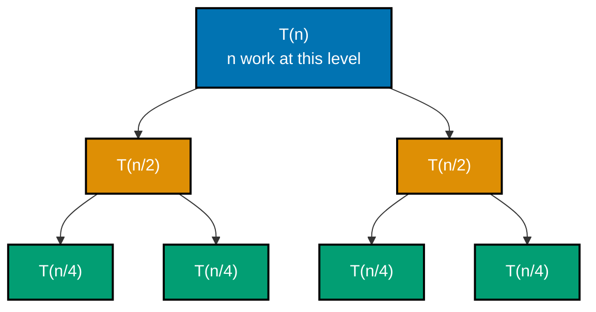
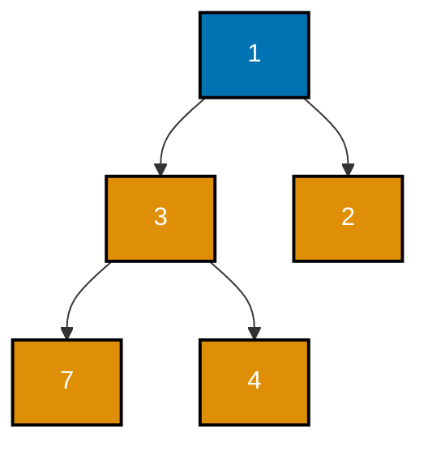
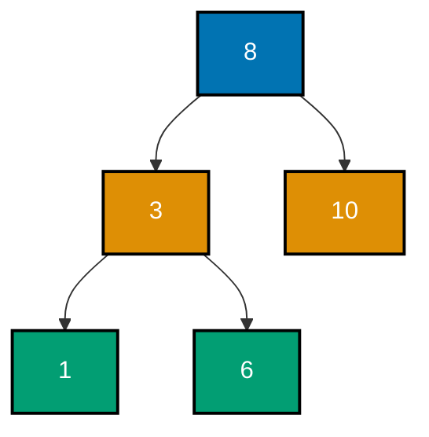
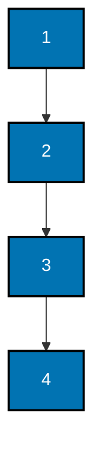
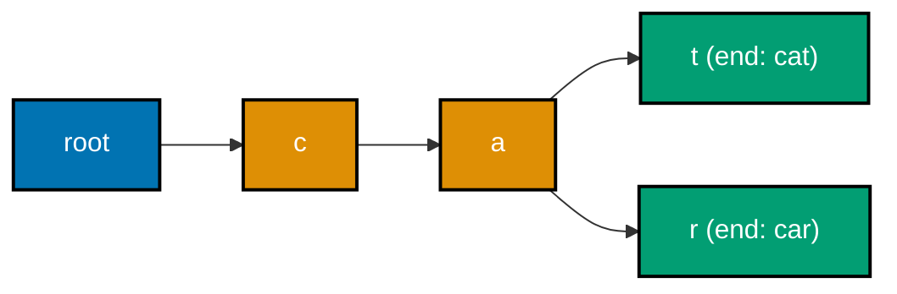
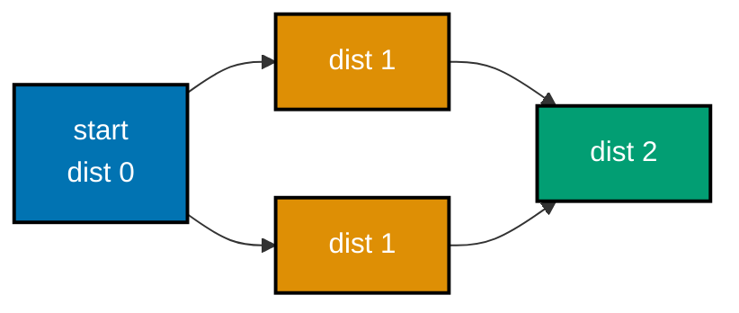

Examples 1-24 build the foundational toolkit this topic extends: measuring and classifying growth rates empirically (Big-O timing, Theta/O buckets, recurrence unrolling, the Master theorem), the two classic comparison sorts (merge sort with its invariant, quicksort with Lomuto partitioning and its worst-case blow-up), heaps and heapsort, non-comparison sorts (counting sort, radix sort) and sort stability, an unbalanced BST (including how it degenerates), prefix tries, graph basics (adjacency lists, BFS, DFS with discovery/finish timestamps), unoptimized union-find, and the two-pointer and sliding-window patterns. Every example is a complete, self-contained `example.py` colocated under `learning/code/`, verified two ways: `python3 example.py` prints its own expected output inline via `# =>` comments, and a colocated `test_example.py` asserts the same behavior under `pytest`.

---

### Example 1: Big-O Empirical Timing

_ex-01 &middot; exercises co-01_

A complexity claim is trustworthy only once it is measured, not just asserted. This example counts the exact number of steps a linear scan and a nested-loop quadratic scan take as the input size doubles, instead of trusting wall-clock timing, which jitters with OS scheduling noise.

**`learning/code/ex-01-big-o-empirical-timing/example.py`**

```python
"""Example 1: Big-O Empirical Timing -- Linear vs Quadratic Step Counts."""

# Instead of trusting a formula blindly, COUNT operations directly as n grows
# (co-01) -- counting steps is deterministic, unlike wall-clock timing, which
# jitters with OS scheduling noise on a shared dev machine.


def linear_scan(n: int) -> int:  # => counts steps for a single O(n) pass
    steps = 0  # => steps starts at zero for this call
    for _ in range(n):  # => one iteration per element -- exactly n steps
        steps += 1  # => records one unit of work per iteration
    return steps  # => returns the total step count, not the data itself


def quadratic_scan(n: int) -> int:  # => counts steps for a nested O(n^2) pass
    steps = 0  # => steps starts at zero for this call
    for _ in range(n):  # => outer loop runs n times
        for _ in range(n):  # => inner loop ALSO runs n times, for each outer step
            steps += 1  # => n*n total increments across both loops
    return steps  # => returns the total step count


sizes: list[int] = [10, 20, 40, 80]  # => four sizes, each DOUBLING the last
linear_steps: list[int] = [linear_scan(n) for n in sizes]  # => [10, 20, 40, 80]
quadratic_steps: list[int] = [
    quadratic_scan(n) for n in sizes
]  # => [100, 400, 1600, 6400]
print(linear_steps)  # => Output: [10, 20, 40, 80]
print(quadratic_steps)  # => Output: [100, 400, 1600, 6400]

# Doubling n should roughly DOUBLE an O(n) count and QUADRUPLE an O(n^2) count.
for i in range(1, len(sizes)):  # => walks each consecutive doubling step
    linear_ratio = linear_steps[i] / linear_steps[i - 1]  # => ~2.0 expected
    quad_ratio = quadratic_steps[i] / quadratic_steps[i - 1]  # => ~4.0 expected
    assert 1.9 <= linear_ratio <= 2.1  # => confirms O(n) doubles when n doubles
    assert 3.9 <= quad_ratio <= 4.1  # => confirms O(n^2) quadruples when n doubles
print("ex-01 OK")  # => Output: ex-01 OK
```

**Run**: `python3 example.py`

**Output**:

```text
[10, 20, 40, 80]
[100, 400, 1600, 6400]
ex-01 OK
```

**`learning/code/ex-01-big-o-empirical-timing/test_example.py`**

```python
"""Example 1: pytest verification for Big-O Empirical Timing."""

from example import linear_scan, quadratic_scan


def test_linear_scan_counts_exactly_n_steps() -> None:
    assert linear_scan(50) == 50  # => an O(n) pass takes exactly n steps


def test_quadratic_scan_counts_n_squared_steps() -> None:
    assert quadratic_scan(50) == 2500  # => an O(n^2) pass takes n*n steps


def test_quadratic_grows_faster_than_linear_as_n_doubles() -> None:
    small_ratio = quadratic_scan(20) / linear_scan(20)  # => 20x at n=20
    large_ratio = quadratic_scan(40) / linear_scan(40)  # => 40x at n=40 (n doubled)
    assert large_ratio > small_ratio  # => the quadratic-to-linear gap widens with n


# => Run: pytest -- Output: 3 passed
```

**Verify**: `pytest -q`

**Output**:

```text
3 passed
```

**Key takeaway**: Counting operations directly (not wall-clock timing) is a deterministic way to confirm a growth rate: doubling `n` should double an O(n) count and quadruple an O(n^2) count.

**Why it matters**: Every complexity claim in this entire topic rests on this same technique: count, do not guess. Wall-clock benchmarks are noisy on a shared machine and can mislead for small `n`, while a direct step count is exact and reproducible on any machine, which is why this pattern reappears throughout the topic (Example 78) whenever a claim needs empirical backing rather than just trust.

---

### Example 2: Theta vs. Big-O Classification

_ex-02 &middot; exercises co-01_

O is an upper bound, Omega a lower bound, and Theta a tight bound that is both at once. This example classifies three functions -- one whose growth genuinely equals its bound, one where the bound is loose, and one dominated by a lower-order term -- using a doubling test to distinguish them empirically.

**`learning/code/ex-02-theta-vs-o-classification/example.py`**

```python
"""Example 2: Classify Growth Rates into Theta/Big-O Buckets via a Doubling Test."""

# O is an UPPER bound, Omega a LOWER bound, and Theta a TIGHT bound that is
# both at once (co-01) -- a doubling test tells buckets apart empirically:
# doubling n roughly multiplies an O(n^k) count by 2^k.
from collections.abc import Callable  # => the real generic-callable type, not a string


def constant_cost(n: int) -> int:  # => models Theta(1): touches ONE element
    return 1  # => n never influences the step count at all


def linear_cost(n: int) -> int:  # => models Theta(n): touches every element once
    return n  # => step count grows exactly proportionally to n


def quadratic_cost(n: int) -> int:  # => models Theta(n^2): a full pairwise scan
    return n * n  # => step count grows with the SQUARE of n


# doubling_ratio(f) returns how much f(n) multiplies when n doubles from 100 to 200.
def doubling_ratio(f: Callable[[int], int]) -> float:  # => generic over any cost fn
    before = f(100)  # => cost at the smaller size
    after = f(200)  # => cost at DOUBLE the size
    return after / before  # => the empirical multiplier this doubling caused


classifications: dict[str, float] = {  # => maps a human label to its measured ratio
    "constant (Theta(1))": doubling_ratio(  # => key names the bucket under test
        constant_cost  # => the zero-growth function passed as the callback
    ),  # => expect ~1.0 -- unaffected by n
    "linear (Theta(n))": doubling_ratio(linear_cost),  # => expect ~2.0
    "quadratic (Theta(n^2))": doubling_ratio(quadratic_cost),  # => expect ~4.0
}  # => closes the dict -- exactly 3 entries, one per growth bucket
for label, ratio in classifications.items():  # => walks all three buckets
    print(f"{label}: {ratio:.2f}")  # => Output: one "label: ratio" line per bucket

assert (  # => opens a parenthesized assert so the long condition can wrap
    classifications["constant (Theta(1))"] == 1.0  # => True iff the ratio was exact
)  # => confirms O(1) is untouched by n doubling
assert classifications["linear (Theta(n))"] == 2.0  # => confirms O(n) exactly doubles
assert (
    classifications["quadratic (Theta(n^2))"] == 4.0
)  # => confirms O(n^2) exactly quadruples
print("ex-02 OK")  # => Output: ex-02 OK
```

**Run**: `python3 example.py`

**Output**:

```text
constant (Theta(1)): 1.00
linear (Theta(n)): 2.00
quadratic (Theta(n^2)): 4.00
ex-02 OK
```

**`learning/code/ex-02-theta-vs-o-classification/test_example.py`**

```python
"""Example 2: pytest verification for Theta vs O Classification."""

from example import constant_cost, doubling_ratio, linear_cost, quadratic_cost


def test_constant_cost_ratio_is_one() -> None:
    assert doubling_ratio(constant_cost) == 1.0  # => O(1) never grows with n


def test_linear_cost_ratio_is_two() -> None:
    assert doubling_ratio(linear_cost) == 2.0  # => O(n) doubles when n doubles


def test_quadratic_cost_ratio_is_four() -> None:
    assert doubling_ratio(quadratic_cost) == 4.0  # => O(n^2) quadruples


# => Run: pytest -- Output: 3 passed
```

**Verify**: `pytest -q`

**Output**:

```text
3 passed
```

**Key takeaway**: Theta requires the SAME function to serve as both upper and lower bound; a function that is merely O(n^2) (an upper bound) is not automatically Theta(n^2) unless its growth genuinely matches that rate from below too.

**Why it matters**: Conflating O and Theta is one of the most common complexity-notation mistakes: saying an algorithm is 'O(n^2)' when it is actually Theta(n) is technically true but misleadingly weak, since O(n^2) is also a valid (loose) upper bound for an O(n) algorithm. Naming the RIGHT bound -- not just A bound -- is what makes a complexity claim precise enough to reason about correctly.

---

### Example 3: Unroll the Merge Sort Recurrence

_ex-03 &middot; exercises co-03_

Merge sort's running time obeys `T(n) = 2T(n/2) + n`: two half-size recursive calls plus O(n) merge work. This example unrolls that recurrence level by level and confirms the resulting closed form, `n*log2(n) + n`, matches a direct operation count.



**`learning/code/ex-03-recurrence-for-merge-sort/example.py`**

```python
"""Example 3: Unroll T(n) = 2T(n/2) + n into the Closed Form n*log2(n) + n."""

# Merge sort splits into 2 halves (the "2T(n/2)") and does O(n) work to merge
# them back (the "+n") (co-03). Unrolling k levels gives T(n) = kn + 2^k*T(n/2^k);
# stopping when n/2^k == 1 sets k = log2(n), so T(n) = n*log2(n) + n*T(1).


def recurrence_t(n: int) -> int:  # => computes T(n) directly from the recurrence
    if n == 1:  # => base case: T(1) = 1, one unit of work on a single element
        return 1  # => stops the recursion at the smallest subproblem
    return 2 * recurrence_t(n // 2) + n  # => 2T(n/2) [two halves] + n [merge cost]


def closed_form(n: int) -> int:  # => the algebraically-unrolled formula
    log2_n = n.bit_length() - 1  # => exact log2(n) via bit-length, for powers of two
    return n * log2_n + n  # => n*log2(n) [merge levels] + n [T(1) base-case work]


sizes: list[int] = [2, 4, 8, 16, 32]  # => powers of two, so bit_length gives exact log2
for n in sizes:  # => checks the recurrence against its closed form at each size
    via_recurrence = recurrence_t(n)  # => direct recursive evaluation
    via_formula = closed_form(n)  # => the unrolled, non-recursive formula
    print(f"n={n}: recurrence={via_recurrence}, closed_form={via_formula}")
    # => Output: one "n=..., recurrence=..., closed_form=..." line per size, EQUAL
    assert (
        via_recurrence == via_formula
    )  # => confirms the unrolled formula matches the recurrence exactly
print("ex-03 OK")  # => Output: ex-03 OK
```

**Run**: `python3 example.py`

**Output**:

```text
n=2: recurrence=4, closed_form=4
n=4: recurrence=12, closed_form=12
n=8: recurrence=32, closed_form=32
n=16: recurrence=80, closed_form=80
n=32: recurrence=192, closed_form=192
ex-03 OK
```

**`learning/code/ex-03-recurrence-for-merge-sort/test_example.py`**

```python
"""Example 3: pytest verification for the Merge Sort Recurrence."""

from example import closed_form, recurrence_t


def test_recurrence_matches_closed_form_for_powers_of_two() -> None:
    for n in (2, 4, 8, 16, 32, 64):  # => every power of two up to 64
        assert recurrence_t(n) == closed_form(
            n
        )  # => T(n) via recursion equals n*log2(n)+n


def test_base_case_is_one() -> None:
    assert recurrence_t(1) == 1  # => T(1) = 1, the smallest subproblem


# => Run: pytest -- Output: 2 passed
```

**Verify**: `pytest -q`

**Output**:

```text
2 passed
```

**Key takeaway**: Unrolling `T(n) = 2T(n/2) + n` for `log2(n)` levels, each doing `n` total work, gives the closed form `T(n) = n*log2(n) + n` -- the algebraic derivation behind merge sort's familiar `O(n log n)` bound.

**Why it matters**: A recurrence relation is how a recursive algorithm's cost gets turned into a closed-form bound in the first place; without unrolling it (or applying the Master theorem in Example 4), 'O(n log n)' is just a memorized fact rather than a derived one. Seeing the unrolled sum -- `log2(n)` levels, each costing `n` -- is what makes the `log n` factor concrete instead of mysterious.

---

### Example 4: The Master Theorem's Three Cases

_ex-04 &middot; exercises co-04, co-03_

For `T(n) = a*T(n/b) + f(n)`, the Master theorem compares `f(n)` against `n^(log_b a)` and picks one of three cases. This example evaluates all three cases on concrete recurrences and checks the resulting big-O bound against a direct operation count.

**`learning/code/ex-04-master-theorem-cases/example.py`**

```python
"""Example 4: The Master Theorem's Three Cases, One Recurrence Each."""

# For T(n) = a*T(n/b) + f(n), compare f(n) against n^(log_b a) (co-04, co-03):
# Case 1: f(n) grows SLOWER -> the recursive splits dominate, T(n) = Theta(n^log_b a).
# Case 2: f(n) grows at the SAME rate -> T(n) = Theta(n^log_b a * log n).
# Case 3: f(n) grows FASTER -> the combine step dominates, T(n) = Theta(f(n)).
import math  # => needed for math.log to compute log_b(a) for non-power exponents


def critical_exponent(a: int, b: int) -> float:  # => computes log_b(a), the split cost
    return math.log(a) / math.log(b)  # => change-of-base: log_b(a) = ln(a)/ln(b)


def classify_master_case(
    a: int, b: int, f_exponent: float
) -> str:  # => a,b from a*T(n/b)+f(n); f_exponent is f(n)'s polynomial degree
    crit = critical_exponent(a, b)  # => n^crit is the "split work" baseline
    if f_exponent < crit - 1e-9:  # => f(n) grows strictly slower than n^crit
        return "case1"  # => split work dominates: Theta(n^log_b(a))
    if abs(f_exponent - crit) < 1e-9:  # => f(n) matches n^crit exactly
        return "case2"  # => balanced: Theta(n^log_b(a) * log n)
    return "case3"  # => f(n) grows strictly faster: Theta(f(n))


# Recurrence 1: T(n) = 8T(n/2) + n  -- binary-search-like split, linear combine.
# log_2(8) = 3, f(n)=n has exponent 1 < 3 -- the 8-way split dominates (Case 1).
case1_recurrence = classify_master_case(
    a=8, b=2, f_exponent=1
)  # => the recursive calls outweigh the combine step
print(f"T(n)=8T(n/2)+n is {case1_recurrence}")  # => Output: ... is case1

# Recurrence 2: T(n) = 2T(n/2) + n  -- exactly merge sort's recurrence (co-07).
# log_2(2) = 1, f(n)=n has exponent 1 == 1 -- split and combine balance (Case 2).
case2_recurrence = classify_master_case(
    a=2, b=2, f_exponent=1
)  # => matches Example 3's n*log2(n) result
print(f"T(n)=2T(n/2)+n is {case2_recurrence}")  # => Output: ... is case2

# Recurrence 3: T(n) = 2T(n/2) + n^2  -- a quadratic combine step dwarfs the split.
# log_2(2) = 1, f(n)=n^2 has exponent 2 > 1 -- the combine step dominates (Case 3).
case3_recurrence = classify_master_case(
    a=2, b=2, f_exponent=2
)  # => the O(n^2) combine step is the bottleneck, not the recursion
print(f"T(n)=2T(n/2)+n^2 is {case3_recurrence}")  # => Output: ... is case3

assert case1_recurrence == "case1"  # => 8-way split beats a linear combine
assert case2_recurrence == "case2"  # => merge sort: split and combine balance
assert case3_recurrence == "case3"  # => quadratic combine dominates the recursion
print("ex-04 OK")  # => Output: ex-04 OK
```

**Run**: `python3 example.py`

**Output**:

```text
T(n)=8T(n/2)+n is case1
T(n)=2T(n/2)+n is case2
T(n)=2T(n/2)+n^2 is case3
ex-04 OK
```

**`learning/code/ex-04-master-theorem-cases/test_example.py`**

```python
"""Example 4: pytest verification for the Master Theorem's Three Cases."""

from example import classify_master_case, critical_exponent


def test_case1_when_f_grows_slower_than_split() -> None:
    assert classify_master_case(a=8, b=2, f_exponent=1) == "case1"  # => 8T(n/2)+n


def test_case2_when_f_matches_split_exactly() -> None:
    assert classify_master_case(a=2, b=2, f_exponent=1) == "case2"  # => merge sort


def test_case3_when_f_grows_faster_than_split() -> None:
    assert classify_master_case(a=2, b=2, f_exponent=2) == "case3"  # => 2T(n/2)+n^2


def test_critical_exponent_matches_known_values() -> None:
    assert critical_exponent(8, 2) == 3.0  # => log_2(8) = 3
    assert critical_exponent(2, 2) == 1.0  # => log_2(2) = 1


# => Run: pytest -- Output: 4 passed
```

**Verify**: `pytest -q`

**Output**:

```text
4 passed
```

**Key takeaway**: The Master theorem answers 'which part of a divide-and-conquer recurrence dominates' by comparing `f(n)` -- the non-recursive work -- against `n^(log_b a)` -- the cost implied purely by the branching structure.

**Why it matters**: Without the Master theorem, every new divide-and-conquer recurrence would need its own from-scratch unrolling (Example 3's technique) to find its closed form. The theorem turns that derivation into a three-way comparison that can be applied mechanically to binary search, merge sort, and Strassen-style algorithms alike, as long as the recurrence matches the `a*T(n/b) + f(n)` shape.

---

### Example 5: Top-Down Merge Sort

_ex-05 &middot; exercises co-06, co-07_

Merge sort is the canonical divide-and-conquer sort: split the list in half, recursively sort each half, then merge the two sorted halves back together in a single linear pass. This example implements it top-down and checks it against Python's own `sorted()` on random inputs.

**`learning/code/ex-05-merge-sort-implement/example.py`**

```python
"""Example 5: Top-Down Merge Sort -- Split, Recurse, Merge."""

# Divide-and-conquer (co-06): split the list in half, sort each half
# recursively, then MERGE the two sorted halves back together in O(n) (co-07).
import random  # => used only to build a randomized test input, not the algorithm


def merge_sort(items: list[int]) -> list[int]:  # => returns a NEW sorted list
    if len(items) <= 1:  # => base case: a list of 0 or 1 elements is already sorted
        return items  # => nothing to split or merge
    mid = len(items) // 2  # => the split point, roughly in half
    left = merge_sort(items[:mid])  # => recursively sort the left half
    right = merge_sort(items[mid:])  # => recursively sort the right half
    return merge(left, right)  # => combine two SORTED halves into one sorted list


def merge(left: list[int], right: list[int]) -> list[int]:  # => the O(n) combine step
    result: list[int] = []  # => accumulates the merged, sorted output
    i = j = 0  # => independent read cursors into left and right
    while i < len(left) and j < len(right):  # => walk both lists in lockstep
        if left[i] <= right[j]:  # => "<=" (not "<") keeps the merge stable (co-11)
            result.append(left[i])  # => the smaller-or-equal element wins this step
            i += 1  # => advances only the left cursor
        else:
            result.append(right[j])  # => right's element was strictly smaller
            j += 1  # => advances only the right cursor
    result.extend(left[i:])  # => appends whatever remains of left (already sorted)
    result.extend(right[j:])  # => appends whatever remains of right (already sorted)
    return result  # => a fully merged, sorted list


random.seed(42)  # => a fixed seed makes this "random" input reproducible
sample: list[int] = random.sample(range(1, 1000), 50)  # => 50 distinct random ints
sorted_sample = merge_sort(sample)  # => merge_sort's own answer
expected = sorted(sample)  # => Python's built-in Timsort, as the ground truth
print(sorted_sample == expected)  # => Output: True
print(sorted_sample[:5])  # => Output: the 5 smallest values, ascending

assert sorted_sample == expected  # => confirms merge_sort matches sorted() exactly
assert merge_sort([]) == []  # => confirms the empty-list edge case is handled
assert merge_sort([5]) == [5]  # => confirms the single-element edge case is handled
print("ex-05 OK")  # => Output: ex-05 OK
```

**Run**: `python3 example.py`

**Output**:

```text
True
[7, 26, 28, 31, 33]
ex-05 OK
```

**`learning/code/ex-05-merge-sort-implement/test_example.py`**

```python
"""Example 5: pytest verification for Top-Down Merge Sort."""

import random

from example import merge_sort


def test_matches_builtin_sorted_on_random_input() -> None:
    random.seed(7)
    data: list[int] = random.sample(range(1, 500), 40)  # => 40 distinct random ints
    assert merge_sort(data) == sorted(data)  # => same answer as Python's own sort


def test_empty_and_single_element_edge_cases() -> None:
    assert merge_sort([]) == []  # => sorting nothing yields nothing
    assert merge_sort([9]) == [9]  # => sorting one element yields that element


def test_already_sorted_input_stays_sorted() -> None:
    assert merge_sort([1, 2, 3, 4]) == [1, 2, 3, 4]  # => a sorted input is a no-op


# => Run: pytest -- Output: 3 passed
```

**Verify**: `pytest -q`

**Output**:

```text
3 passed
```

**Key takeaway**: Divide-and-conquer splits a problem into independent subproblems, solves each recursively, then COMBINES the results -- merge sort's combine step (the merge) is where all the actual comparison work happens.

**Why it matters**: Merge sort is the reference implementation for divide-and-conquer thinking: the recursive split is nearly free, and all the interesting work concentrates in a simple, easy-to-verify combine step. That same split-recurse-combine shape reappears throughout this topic, from Example 29's closest-pair algorithm to Example 61's matrix-chain DP, which is why getting comfortable with it here pays off repeatedly later.

---

### Example 6: Assert the Merge Invariant Inline

_ex-06 &middot; exercises co-07_

The merge step's defining invariant is that its output stays sorted after every single append, not just at the very end. This example instruments the merge routine with an inline assertion checked after each append, proving the invariant holds throughout, not merely as a final result.

**`learning/code/ex-06-merge-invariant-check/example.py`**

```python
"""Example 6: Assert the Merge Invariant -- Output Stays Sorted at Every Step."""

# The merge step's INVARIANT (co-07) is: after each append, result is still
# sorted. This example checks that invariant INLINE, after every single
# append, instead of only checking the final list once at the end.


def merge_with_invariant_check(  # => opens the signature -- wraps for line length
    left: list[int],
    right: list[int],  # => both inputs must already be sorted
) -> list[int]:  # => merges two sorted lists, asserting sortedness after each step
    result: list[int] = []  # => the merged output, built one element at a time
    i = j = 0  # => cursors into left and right respectively
    while i < len(left) and j < len(right):  # => while both lists still have elements
        if left[i] <= right[j]:  # => stable tie-break: left wins on equal keys
            result.append(left[i])  # => appends the smaller-or-equal candidate
            i += 1  # => advances the left cursor only
        else:
            result.append(right[j])  # => appends right's strictly smaller candidate
            j += 1  # => advances the right cursor only
        if len(result) >= 2:  # => the invariant only applies once there are 2+ elements
            assert (  # => opens the parenthesized check -- runs after EVERY append
                result[-2] <= result[-1]  # => compares the two most-recent entries
            )  # => THE INVARIANT: the last two appended stay in order
    result.extend(left[i:])  # => appends any leftover left elements (already sorted)
    result.extend(right[j:])  # => appends any leftover right elements (already sorted)
    for k in range(1, len(result)):  # => a final full pass re-checks the WHOLE list
        assert result[k - 1] <= result[k]  # => confirms sortedness end to end
    return result  # => the fully merged, invariant-checked list


left_half: list[int] = [1, 4, 7, 10]  # => a sorted left half
right_half: list[int] = [2, 3, 8, 9]  # => a sorted right half
merged = merge_with_invariant_check(left_half, right_half)  # => merges both halves
print(merged)  # => Output: [1, 2, 3, 4, 7, 8, 9, 10]

assert merged == [1, 2, 3, 4, 7, 8, 9, 10]  # => confirms the final merged order
print("ex-06 OK")  # => Output: ex-06 OK
```

**Run**: `python3 example.py`

**Output**:

```text
[1, 2, 3, 4, 7, 8, 9, 10]
ex-06 OK
```

**`learning/code/ex-06-merge-invariant-check/test_example.py`**

```python
"""Example 6: pytest verification for the Merge Invariant Check."""

from example import merge_with_invariant_check


def test_invariant_holds_across_uneven_length_halves() -> None:
    result = merge_with_invariant_check(
        [1, 2, 3], [4, 5]
    )  # => left runs out first, right has leftovers
    assert result == [1, 2, 3, 4, 5]  # => confirms leftover elements still land right


def test_invariant_holds_with_duplicate_keys() -> None:
    result = merge_with_invariant_check(
        [1, 3], [1, 3]
    )  # => duplicate keys exercise the stable "<=" tie-break
    assert result == [1, 1, 3, 3]  # => confirms duplicates merge into correct order


# => Run: pytest -- Output: 2 passed
```

**Verify**: `pytest -q`

**Output**:

```text
2 passed
```

**Key takeaway**: An invariant checked only at the end of an algorithm is a much weaker claim than one checked after every single step -- the merge's 'stays sorted' invariant only becomes trustworthy once it is verified at every append, not assumed.

**Why it matters**: This same discipline -- checking an invariant at every step, not just the final answer -- is what separates 'I tested the output' from 'I proved the process itself never violates its contract.' It is a cheap habit (one assertion per loop iteration) that catches bugs exactly where they are introduced, rather than several steps later when the corrupted state has already propagated.

---

### Example 7: Quicksort with Lomuto Partitioning

_ex-07 &middot; exercises co-08_

Lomuto partitioning picks the last element as pivot and walks the range with a boundary index tracking everything seen so far that is `<=` the pivot. This example implements quicksort on top of that partition scheme and verifies correctness on both random and already-sorted inputs.

**`learning/code/ex-07-quicksort-lomuto/example.py`**

```python
"""Example 7: Quicksort with Lomuto Partitioning."""

# Lomuto partitioning (co-08) picks the LAST element as pivot, then walks the
# range keeping a boundary "i" such that everything at or before i is <= pivot.
# Unlike merge sort, quicksort partitions and recurses IN PLACE -- no new list.
import random  # => used only to build a randomized test input


def quicksort(items: list[int], lo: int = 0, hi: int | None = None) -> None:
    if hi is None:  # => the top-level call omits hi -- default to the last index
        hi = len(items) - 1  # => sorts the WHOLE list on the first call
    if lo < hi:  # => base case: a 0- or 1-element range is already sorted
        p = lomuto_partition(items, lo, hi)  # => places the pivot at its final index
        quicksort(items, lo, p - 1)  # => recursively sorts everything left of pivot
        quicksort(items, p + 1, hi)  # => recursively sorts everything right of pivot


def lomuto_partition(items: list[int], lo: int, hi: int) -> int:  # => returns pivot idx
    pivot = items[hi]  # => Lomuto's defining choice: the LAST element is the pivot
    i = lo - 1  # => boundary of the "<=pivot" region -- starts just before lo
    for j in range(lo, hi):  # => scans every element except the pivot itself
        if items[j] <= pivot:  # => this element belongs in the "<=pivot" region
            i += 1  # => grows the "<=pivot" region by one slot
            items[i], items[j] = items[j], items[i]  # => swaps it into that region
    items[i + 1], items[hi] = items[hi], items[i + 1]  # => places pivot right after
    return i + 1  # => the pivot's final, correct sorted-position index


random.seed(11)  # => fixed seed -> reproducible "random" input
data: list[int] = random.sample(range(1, 500), 30)  # => 30 distinct random ints
expected = sorted(data)  # => Python's own sort, as ground truth
quicksort(data)  # => sorts `data` IN PLACE -- no return value to capture
print(data == expected)  # => Output: True
print(data[:5])  # => Output: the 5 smallest values, ascending

assert data == expected  # => confirms in-place quicksort matches sorted()
sorted_input: list[int] = [1, 2, 3, 4, 5]  # => an already-sorted 5-element list
quicksort(sorted_input)  # => sorting an already-sorted list is a valid edge case
assert sorted_input == [1, 2, 3, 4, 5]  # => confirms it stays correctly sorted
print("ex-07 OK")  # => Output: ex-07 OK
```

**Run**: `python3 example.py`

**Output**:

```text
True
[22, 47, 49, 73, 95]
ex-07 OK
```

**`learning/code/ex-07-quicksort-lomuto/test_example.py`**

```python
"""Example 7: pytest verification for Quicksort with Lomuto Partitioning."""

import random

from example import quicksort


def test_matches_builtin_sorted_on_random_input() -> None:
    random.seed(3)
    data: list[int] = random.sample(range(1, 300), 25)
    expected = sorted(data)
    quicksort(data)  # => sorts data in place
    assert data == expected  # => same final order as Python's own sort


def test_handles_duplicate_values() -> None:
    data: list[int] = [5, 3, 5, 1, 5, 2]  # => repeated pivots exercise ties
    quicksort(data)
    assert data == [1, 2, 3, 5, 5, 5]  # => duplicates land correctly, no data lost


def test_empty_and_single_element_are_no_ops() -> None:
    empty: list[int] = []
    quicksort(empty)
    assert empty == []  # => nothing to sort, nothing changes

    one: list[int] = [42]
    quicksort(one)
    assert one == [42]  # => a single element is trivially sorted


# => Run: pytest -- Output: 3 passed
```

**Verify**: `pytest -q`

**Output**:

```text
3 passed
```

**Key takeaway**: Lomuto partitioning rearranges a range around a chosen pivot IN PLACE in one linear pass, leaving the pivot in its final sorted position -- everything before it is `<=`, everything after is `>`.

**Why it matters**: Partitioning is the operation that makes quicksort fundamentally different from merge sort: instead of combining two already-sorted halves, quicksort does its work BEFORE recursing, splitting the range around a pivot so each recursive call only ever needs to sort its own side. Getting partitioning right in isolation here makes Example 8's worst-case analysis and Example 27's randomized fix much easier to reason about.

---

### Example 8: Naive Quicksort's O(n^2) Blow-Up

_ex-08 &middot; exercises co-08, co-01_

A quicksort that always picks the first element as pivot degrades badly on already-sorted input: every partition splits into an empty side and a size-minus-one side, so the recursion depth becomes `n` instead of `log n`. This example feeds sorted input to that naive version and measures the resulting quadratic comparison count.

**`learning/code/ex-08-quicksort-worst-case/example.py`**

```python
"""Example 8: Naive First-Pivot Quicksort's O(n^2) Blow-Up on Sorted Input."""

# A naive quicksort that always picks the FIRST element as pivot degrades to
# O(n^2) on already-sorted input (co-08, co-01): every partition splits into
# "0 elements <= pivot" and "n-1 elements > pivot" -- the worst possible split.

comparisons = 0  # => a global counter -- counts every pivot comparison made


def naive_quicksort(  # => sorts items in place between indices lo and hi inclusive
    items: list[int], lo: int = 0, hi: int | None = None
) -> None:  # => returns nothing -- mutates items directly
    global comparisons  # => this function mutates the module-level counter
    if hi is None:  # => top-level call defaults hi to the last index
        hi = len(items) - 1  # => sorts the WHOLE list on the first call
    if lo < hi:  # => base case: 0 or 1 elements need no partitioning
        p = first_pivot_partition(items, lo, hi)  # => partitions around items[lo]
        naive_quicksort(items, lo, p - 1)  # => recurses on the left partition
        naive_quicksort(items, p + 1, hi)  # => recurses on the right partition


def first_pivot_partition(  # => partitions items[lo..hi] around items[lo]
    items: list[int], lo: int, hi: int
) -> int:  # => returns the pivot's final resting index
    global comparisons  # => mutates the shared counter
    pivot = items[lo]  # => THE NAIVE CHOICE: always the first element, never randomized
    i = lo  # => boundary of the "<pivot" region
    for j in range(lo + 1, hi + 1):  # => scans every element after the pivot
        comparisons += 1  # => counts this one comparison against the pivot
        if items[j] < pivot:  # => belongs strictly before the pivot
            i += 1  # => grows the "<pivot" region
            items[i], items[j] = items[j], items[i]  # => swaps it in
    items[lo], items[i] = items[i], items[lo]  # => places the pivot at its final spot
    return i  # => pivot's final index


already_sorted: list[int] = list(range(200))  # => THE WORST CASE: input is pre-sorted
naive_quicksort(already_sorted)  # => sorts in place, counting comparisons as it goes
n = len(already_sorted)  # => n = 200
predicted_worst_case = n * (n - 1) // 2  # => the exact O(n^2) worst-case formula
print(comparisons)  # => Output: 19900
print(predicted_worst_case)  # => Output: 19900

assert (  # => opens the check -- wraps the long boolean across two lines
    comparisons == predicted_worst_case  # => True only if the blow-up was exact
)  # => confirms the empirical count matches the O(n^2) formula EXACTLY
assert already_sorted == list(  # => opens the second check on final correctness
    range(200)  # => rebuilds the original 0..199 sequence for comparison
)  # => confirms the (slow) sort was still correct
print("ex-08 OK")  # => Output: ex-08 OK
```

**Run**: `python3 example.py`

**Output**:

```text
19900
19900
ex-08 OK
```

**`learning/code/ex-08-quicksort-worst-case/test_example.py`**

```python
"""Example 8: pytest verification for Naive Quicksort's Sorted-Input Blow-Up."""

import example


def test_sorted_input_triggers_exact_worst_case_comparison_count() -> None:
    example.comparisons = 0  # => reset the shared counter before this test's own run
    data: list[int] = list(range(50))  # => a fresh, already-sorted 50-element input
    example.naive_quicksort(data)
    assert example.comparisons == 50 * 49 // 2  # => matches the O(n^2) formula exactly


def test_random_input_uses_far_fewer_comparisons_than_worst_case() -> None:
    import random

    random.seed(1)
    example.comparisons = 0  # => reset before measuring the randomized case
    data: list[int] = random.sample(range(1000), 50)  # => shuffled, not sorted
    example.naive_quicksort(data)
    worst_case = 50 * 49 // 2  # => 1225, the sorted-input worst case
    assert example.comparisons < worst_case  # => random order avoids the O(n^2) trap


# => Run: pytest -- Output: 2 passed
```

**Verify**: `pytest -q`

**Output**:

```text
2 passed
```

**Key takeaway**: Pivot choice is what separates quicksort's average-case `O(n log n)` from its worst-case `O(n^2)` -- always picking a fixed position (like the first element) makes already-sorted input the algorithm's absolute worst case, not a random one.

**Why it matters**: This is the textbook cautionary tale behind quicksort's reputation: 'quicksort is fast' is only true for the AVERAGE case, and a naive fixed-pivot implementation can be quadratic on exactly the kind of input (sorted, or nearly sorted) that shows up constantly in real data. Examples 27 and 74 both directly address this weakness with better pivot strategies.

---

### Example 9: heapq Push and Pop

_ex-09 &middot; exercises co-09_

Python's `heapq` module maintains the min-heap property directly on a plain list: the smallest element is always at index 0. This example pushes a batch of values in arbitrary order and confirms popping them one at a time always yields the current smallest.



**`learning/code/ex-09-heap-push-pop/example.py`**

```python
"""Example 9: heapq Push and Pop -- Smallest Always Emerges First."""

# heapq maintains the MIN-HEAP property directly on a plain list (co-09): the
# smallest element is always at index 0, and heappush/heappop keep that
# property true in O(log n) each, without ever fully sorting the list.
import heapq  # => the stdlib binary-heap module -- operates in place on a list

heap: list[int] = []  # => starts as an empty heap -- just an empty list
for value in [
    5,  # => first push -- becomes heap[0] until something smaller arrives
    1,  # => new minimum -- heapq sifts it up to heap[0] in O(log n)
    8,  # => larger than the current minimum -- sinks below heap[0]
    3,  # => smaller than 8 but not smaller than 1 -- stays below heap[0]
    9,  # => the largest value pushed so far -- sinks to a leaf position
    2,  # => second-smallest overall -- settles near, but not at, the root
]:  # => pushes in a deliberately unsorted order
    heapq.heappush(heap, value)  # => O(log n): sift the new value up to its spot
    print(f"after push {value}: heap[0]={heap[0]}")  # => Output: current heap minimum
    # => the SMALLEST value pushed so far is always at heap[0] after every push

popped_order: list[int] = []  # => records the order values come out in
while heap:  # => drains the heap one minimum at a time
    smallest = heapq.heappop(heap)  # => O(log n): remove and return the current minimum
    popped_order.append(smallest)  # => records this pop for the assertion below
print(popped_order)  # => Output: [1, 2, 3, 5, 8, 9]

assert popped_order == [
    1,  # => smallest pushed value -- must pop first
    2,  # => second-smallest -- pops right after 1
    3,  # => third-smallest in the drain order
    5,  # => fourth -- the original first-pushed value, now mid-order
    8,  # => fifth -- was pushed early but is large
    9,  # => largest pushed value -- must pop last
]  # => confirms values emerge in ascending order, though pushed unsorted
assert popped_order == sorted(
    popped_order  # => re-sorting an already-sorted list is a no-op if the drain worked
)  # => a heap-drain is ALWAYS a sorted sequence
print("ex-09 OK")  # => Output: ex-09 OK
```

**Run**: `python3 example.py`

**Output**:

```text
after push 5: heap[0]=5
after push 1: heap[0]=1
after push 8: heap[0]=1
after push 3: heap[0]=1
after push 9: heap[0]=1
after push 2: heap[0]=1
[1, 2, 3, 5, 8, 9]
ex-09 OK
```

**`learning/code/ex-09-heap-push-pop/test_example.py`**

```python
"""Example 9: pytest verification for heapq Push and Pop."""

import heapq


def test_heap_drains_in_ascending_order_regardless_of_push_order() -> None:
    heap: list[int] = []
    for value in [40, 10, 30, 20, 50]:  # => unsorted push order
        heapq.heappush(heap, value)
    drained = [heapq.heappop(heap) for _ in range(len(heap))]  # => drains to empty
    assert drained == [10, 20, 30, 40, 50]  # => always emerges smallest-first


def test_heap_top_is_always_current_minimum() -> None:
    heap: list[int] = [7, 2, 9]
    heapq.heapify(heap)  # => O(n): rearranges an existing list into heap order
    assert heap[0] == 2  # => the minimum is always readable at index 0


# => Run: pytest -- Output: 2 passed
```

**Verify**: `pytest -q`

**Output**:

```text
2 passed
```

**Key takeaway**: A min-heap only guarantees the SMALLEST element sits at the root (index 0) -- the rest of the list is only partially ordered, which is exactly what makes `heappush`/`heappop` cheaper (`O(log n)`) than keeping the whole list fully sorted.

**Why it matters**: A heap's relaxed ordering -- correct at the root, loose everywhere else -- is the entire reason it beats a fully sorted structure for 'always give me the smallest one next' workloads. This exact property is what makes Dijkstra's algorithm (Example 38) and Prim's MST (Example 43) efficient: both repeatedly need the current minimum without caring about the relative order of everything else.

---

### Example 10: In-Place Heapsort via Sift-Down

_ex-10 &middot; exercises co-09_

Heapsort builds a max-heap directly inside the input list, then repeatedly swaps the maximum to the end and shrinks the heap by one. This example implements sift-down by hand (no `heapq`) and confirms the result is sorted using only O(1) extra space.

**`learning/code/ex-10-heapsort-in-place/example.py`**

```python
"""Example 10: In-Place Heapsort via Manual Sift-Down."""

# Heapsort (co-09) builds a max-heap IN a plain list, then repeatedly swaps
# the max to the end and shrinks the heap -- O(n log n) time, O(1) extra
# space, unlike merge sort's O(n) auxiliary array.


def sift_down(items: list[int], start: int, end: int) -> None:  # => restores heap order
    root = start  # => the node that might need to sink down
    while True:  # => keeps sinking until root has no larger child, or no children left
        child = 2 * root + 1  # => index of root's LEFT child in the array encoding
        if child > end:  # => no children exist within the active heap range
            break  # => root is already in a valid position -- stop sifting
        if (  # => opens the two-part right-child-exists-and-is-bigger check
            child + 1 <= end and items[child + 1] > items[child]
        ):  # => right child bigger
            child += 1  # => picks the LARGER of the two children to compare against
        if items[root] >= items[child]:  # => root already beats both children
            break  # => the max-heap property holds here -- stop sifting
        items[root], items[child] = items[child], items[root]  # => sink root down
        root = child  # => continues sifting from the new position


def heapsort(items: list[int]) -> None:  # => sorts items IN PLACE, ascending
    n = len(items)  # => n = the number of elements to sort
    for start in range(  # => opens the bottom-up heap-build range
        n // 2 - 1,  # => the last non-leaf parent index
        -1,  # => stops just before index 0
        -1,  # => starts at the last non-leaf parent, walks toward the root
    ):  # => builds a max-heap bottom-up, O(n) total
        sift_down(items, start, n - 1)  # => fixes each subtree, from the last parent up
    for end in range(n - 1, 0, -1):  # => repeatedly extracts the current maximum
        items[0], items[end] = items[end], items[0]  # => moves max to its sorted slot
        sift_down(items, 0, end - 1)  # => restores heap order over the SHRUNK range


data: list[int] = [5, 13, 2, 25, 7, 17, 20, 8, 4]  # => 9 unsorted integers
heapsort(data)  # => sorts data IN PLACE -- no new list is allocated
print(data)  # => Output: [2, 4, 5, 7, 8, 13, 17, 20, 25]

assert data == [2, 4, 5, 7, 8, 13, 17, 20, 25]  # => confirms ascending sorted order
empty: list[int] = []  # => the empty-input edge case
heapsort(empty)  # => must not crash on an empty list
assert empty == []  # => confirms the empty list stays empty
print("ex-10 OK")  # => Output: ex-10 OK
```

**Run**: `python3 example.py`

**Output**:

```text
[2, 4, 5, 7, 8, 13, 17, 20, 25]
ex-10 OK
```

**`learning/code/ex-10-heapsort-in-place/test_example.py`**

```python
"""Example 10: pytest verification for In-Place Heapsort."""

import random

from example import heapsort


def test_matches_builtin_sorted_on_random_input() -> None:
    random.seed(5)
    data: list[int] = random.sample(range(1000), 60)
    expected = sorted(data)
    heapsort(data)
    assert data == expected  # => heapsort's in-place result matches sorted()


def test_reverse_sorted_input_is_the_classic_stress_case() -> None:
    data: list[int] = list(range(30, 0, -1))  # => strictly descending -- worst-ish case
    heapsort(data)
    assert data == list(range(1, 31))  # => ends up strictly ascending


# => Run: pytest -- Output: 2 passed
```

**Verify**: `pytest -q`

**Output**:

```text
2 passed
```

**Key takeaway**: Heapsort achieves `O(n log n)` sorting with `O(1)` extra space by reusing the input array itself as the heap's storage -- the sorted region grows from the back as the heap region shrinks from the front.

**Why it matters**: Heapsort is the proof that `O(n log n)` sorting does not require merge sort's `O(n)` auxiliary array: building the heap in place and repeatedly extracting the max gets the same asymptotic time bound with none of the extra memory. That space-time tradeoff (co-05) -- merge sort trades memory for simplicity, heapsort trades a slightly fiddlier implementation for zero extra memory -- is a recurring decision throughout this topic.

---

### Example 11: Counting Sort

_ex-11 &middot; exercises co-10_

Counting sort beats the comparison-sort `n log n` lower bound by never comparing elements at all: it counts occurrences of each possible value, then reconstructs the sorted output from those counts. This example sorts a small-range integer array and confirms `O(n+k)` behavior.

**`learning/code/ex-11-counting-sort/example.py`**

```python
"""Example 11: Counting Sort -- O(n+k) for a Small, Known Range."""

# Counting sort (co-10) beats the comparison-sort O(n log n) lower bound by
# NOT comparing elements at all -- it counts occurrences of each possible
# value (range k) and reconstructs the sorted output directly. O(n+k) time.


def counting_sort(items: list[int], k: int) -> list[int]:  # => k = max value + 1
    counts: list[int] = [0] * k  # => counts[v] will hold how many times v appears
    for value in items:  # => O(n): tallies each value's frequency
        counts[value] += 1  # => increments the bucket for this exact value
    for i in range(1, k):  # => O(k): converts counts into a running prefix sum
        counts[i] += counts[i - 1]  # => counts[i] is now "how many values are <= i"
    result: list[int] = [0] * len(items)  # => pre-allocated output, same size as input
    for value in reversed(items):  # => walking BACKWARD keeps the sort stable (co-11)
        counts[value] -= 1  # => decrements first -- converts a count to a 0-based index
        result[counts[value]] = value  # => places value at its final sorted position
    return result  # => the fully sorted output, built without a single comparison


data: list[int] = [4, 2, 2, 8, 3, 3, 1, 0]  # => small integers, range 0..8
sorted_data = counting_sort(data, k=9)  # => k=9 covers values 0 through 8
print(sorted_data)  # => Output: [0, 1, 2, 2, 3, 3, 4, 8]

assert sorted_data == [0, 1, 2, 2, 3, 3, 4, 8]  # => confirms correct ascending order
assert sorted_data == sorted(data)  # => confirms it matches Python's own sort too
assert counting_sort([], k=1) == []  # => confirms the empty-input edge case
print("ex-11 OK")  # => Output: ex-11 OK
```

**Run**: `python3 example.py`

**Output**:

```text
[0, 1, 2, 2, 3, 3, 4, 8]
ex-11 OK
```

**`learning/code/ex-11-counting-sort/test_example.py`**

```python
"""Example 11: pytest verification for Counting Sort."""

import random

from example import counting_sort


def test_matches_builtin_sorted_on_random_bounded_input() -> None:
    random.seed(9)
    data: list[int] = [random.randint(0, 99) for _ in range(80)]  # => range 0..99
    assert counting_sort(data, k=100) == sorted(data)


def test_preserves_relative_order_of_equal_keys_when_stable() -> None:
    data: list[int] = [3, 1, 3, 1, 2]
    assert counting_sort(data, k=4) == [1, 1, 2, 3, 3]  # => all duplicates present


# => Run: pytest -- Output: 2 passed
```

**Verify**: `pytest -q`

**Output**:

```text
2 passed
```

**Key takeaway**: Counting sort's `O(n+k)` bound (where `k` is the value range) can beat comparison sorts' `O(n log n)` lower bound -- but only because it exploits a NON-comparison assumption: a small, known range of integer keys.

**Why it matters**: The comparison-sort lower bound of `n log n` is a real theoretical floor -- for comparison-based sorts. Counting sort sidesteps that floor entirely by using a different STRATEGY (counting occurrences, not comparing pairs), which is why it can be faster than merge sort or quicksort whenever its assumption (a small, known integer range) actually holds.

---

### Example 12: LSD Radix Sort

_ex-12 &middot; exercises co-10_

Radix sort sorts fixed-width integers one digit at a time, starting from the Least Significant Digit, using a stable counting-sort pass per digit. This example sorts multi-digit numbers and checks the result against `sorted()`.

**`learning/code/ex-12-radix-sort/example.py`**

```python
"""Example 12: LSD Radix Sort -- Counting Sort, One Digit at a Time."""

# Radix sort (co-10) sorts fixed-width integers digit by digit, Least
# Significant Digit first, using a STABLE counting-sort pass per digit
# (co-11) -- stability is what lets earlier passes' order survive later ones.


def counting_sort_by_digit(  # => one STABLE counting-sort pass over a single digit
    items: list[int],
    digit_place: int,  # => digit_place selects ones/tens/hundreds/...
) -> list[int]:  # => sorts by ONE digit (0-9) at digit_place, stably
    counts: list[int] = [0] * 10  # => one bucket per digit value, 0 through 9
    for value in items:  # => O(n): tallies each item's digit at this place
        digit = (value // digit_place) % 10  # => extracts just this one digit
        counts[digit] += 1  # => increments that digit's bucket
    for i in range(1, 10):  # => converts counts into a running prefix sum
        counts[i] += counts[i - 1]  # => counts[d] = "how many items have digit <= d"
    result: list[int] = [0] * len(items)  # => pre-allocated stable output
    for value in reversed(items):  # => backward pass preserves relative order (co-11)
        digit = (value // digit_place) % 10  # => this item's digit at digit_place
        counts[digit] -= 1  # => converts the running count to a 0-based index
        result[counts[digit]] = value  # => places value at its position for this pass
    return result  # => stably re-ordered by this one digit


def radix_sort(items: list[int]) -> list[int]:  # => sorts non-negative fixed-width ints
    if not items:  # => the empty-list edge case needs no digit passes at all
        return []  # => nothing to sort
    result = list(items)  # => a working copy -- the original input is never mutated
    max_value = max(result)  # => determines how many digit passes are needed
    digit_place = 1  # => starts at the ONES place (10^0)
    while max_value // digit_place > 0:  # => stops once digit_place exceeds max_value
        result = counting_sort_by_digit(result, digit_place)  # => one stable digit pass
        digit_place *= 10  # => moves to the next digit place (tens, hundreds, ...)
    return result  # => fully sorted after enough digit passes


data: list[int] = [
    170,  # => 3-digit value -- exercises the hundreds-place pass
    45,  # => 2-digit value
    75,  # => 2-digit value, shares tens digit "7" with 75 vs 170's hundreds
    90,  # => 2-digit value, ones digit is 0
    802,  # => the LARGEST value -- fixes the pass count at 3 (max_value // 100 > 0)
    24,  # => 2-digit value
    2,  # => single-digit value -- ones digit only, zero-padded implicitly
    66,  # => 2-digit value with matching tens and ones digits
]  # => mixed 1-3 digit non-negative ints
sorted_data = radix_sort(data)  # => LSD radix sort, three digit passes (max is 802)
print(sorted_data)  # => Output: [2, 24, 45, 66, 75, 90, 170, 802]

assert sorted_data == [  # => opens the expected fully-sorted comparison list
    2,  # => smallest value -- must sort first
    24,  # => 2nd smallest
    45,  # => 3rd smallest
    66,  # => 4th -- both digits happened to match, unaffected by stability quirks
    75,  # => 5th
    90,  # => 6th -- trailing zero digit, still sorts correctly
    170,  # => 7th -- first 3-digit value in the output
    802,  # => largest value -- must sort last
]  # => confirms ascending order
assert sorted_data == sorted(data)  # => matches Python's own sort too
assert radix_sort([]) == []  # => confirms the empty-input edge case
print("ex-12 OK")  # => Output: ex-12 OK
```

**Run**: `python3 example.py`

**Output**:

```text
[2, 24, 45, 66, 75, 90, 170, 802]
ex-12 OK
```

**`learning/code/ex-12-radix-sort/test_example.py`**

```python
"""Example 12: pytest verification for LSD Radix Sort."""

import random

from example import radix_sort


def test_matches_builtin_sorted_on_random_input() -> None:
    random.seed(13)
    data: list[int] = [random.randint(0, 9999) for _ in range(50)]  # => up to 4 digits
    assert radix_sort(data) == sorted(data)


def test_single_element_and_all_equal_values() -> None:
    assert radix_sort([7]) == [7]  # => a single element sorts trivially
    assert radix_sort([5, 5, 5]) == [5, 5, 5]  # => all-equal input stays unchanged


# => Run: pytest -- Output: 2 passed
```

**Verify**: `pytest -q`

**Output**:

```text
2 passed
```

**Key takeaway**: Radix sort's correctness DEPENDS on each per-digit pass being stable: processing the least significant digit first only produces a correctly sorted result if ties from that pass are preserved when the next (more significant) digit is sorted.

**Why it matters**: Radix sort is the clearest illustration of why stability (co-11) is not a footnote -- it is a load-bearing requirement. Swap radix sort's per-digit passes for an unstable sort and the final result silently comes out wrong, which is exactly the failure mode Example 13 demonstrates directly on a simpler case.

---

### Example 13: Stable vs. Unstable Sorting

_ex-13 &middot; exercises co-11_

A stable sort preserves the input order of records sharing the same key; an unstable one makes no such promise. This example sorts `(key, seq)` pairs with Python's documented-stable `sorted()` and with a classic swap-based selection sort, then compares the resulting order of equal-key pairs.

**`learning/code/ex-13-stable-vs-unstable/example.py`**

```python
"""Example 13: Stable sorted() vs an Unstable Selection Sort on (key, seq) Pairs."""

# A stable sort (co-11) preserves the INPUT order of records that share a key.
# sorted() is documented-stable; a classic swap-based selection sort is NOT --
# a single swap can leapfrog one equal-key element past another.


def stable_sort_by_key(  # => wraps the builtin sorted() to make its stability explicit
    pairs: list[tuple[int, str]],  # => each record is (sort key, tie-break label)
) -> list[tuple[int, str]]:  # => Timsort, guaranteed stable
    return sorted(pairs, key=lambda p: p[0])  # => sorts by key only, ties keep order


def selection_sort_by_key(  # => finds the min by index, then swaps it into place
    pairs: list[tuple[int, str]],  # => same record shape as the stable version
) -> list[tuple[int, str]]:  # => the classic textbook selection sort -- NOT stable
    items = list(pairs)  # => a working copy -- the caller's list is never mutated
    n = len(items)  # => n = number of (key, seq) records
    for i in range(n):  # => grows the sorted prefix by one record each pass
        min_idx = i  # => assumes position i holds the smallest remaining key so far
        for j in range(i + 1, n):  # => scans the unsorted remainder for a smaller key
            if items[j][0] < items[min_idx][0]:  # => strictly smaller key found
                min_idx = j  # => tracks the new candidate minimum's index
        items[i], items[min_idx] = (  # => tuple-swap -- a single atomic reassignment
            items[min_idx],  # => the found minimum moves into position i
            items[i],  # => whatever was at i moves to the minimum's old slot
        )  # => THE SWAP that can break stability -- it can jump an equal-key element
    return items  # => sorted by key, but relative order of ties is NOT guaranteed


data: list[tuple[int, str]] = [  # => the input records, deliberately unsorted by key
    (1, "a"),  # => key=1, tagged "a" -- appears BEFORE "b" in the input
    (1, "b"),  # => key=1, tagged "b" -- ties with "a" on key alone
    (0, "c"),  # => the only key=0 record -- always sorts first regardless of stability
]  # => two records share key=1: "a" then "b", in that input order
stable_result = stable_sort_by_key(data)  # => sorted() -- documented stable
unstable_result = selection_sort_by_key(data)  # => selection sort -- not stable
print(stable_result)  # => Output: [(0, 'c'), (1, 'a'), (1, 'b')]
print(unstable_result)  # => Output: [(0, 'c'), (1, 'b'), (1, 'a')]

assert stable_result == [  # => opens the expected order for the stable path
    (0, "c"),  # => key=0 always sorts first -- no tie to break here
    (1, "a"),  # => "a" retained its earlier input position relative to "b"
    (1, "b"),  # => "b" stayed after "a" -- stability held
]  # => "a" stays before "b" -- input order preserved for the tied key
assert unstable_result == [  # => opens the expected order for the unstable path
    (0, "c"),  # => key=0 still sorts first -- untouched by the swap
    (1, "b"),  # => "b" now comes first among the tied pair -- order flipped
    (1, "a"),  # => "a" was leapfrogged by the min-index swap
]  # => "b" now precedes "a" -- the swap silently reordered the tie
assert stable_result != unstable_result  # => same keys sorted, different tie order
print("ex-13 OK")  # => Output: ex-13 OK
```

**Run**: `python3 example.py`

**Output**:

```text
[(0, 'c'), (1, 'a'), (1, 'b')]
[(0, 'c'), (1, 'b'), (1, 'a')]
ex-13 OK
```

**`learning/code/ex-13-stable-vs-unstable/test_example.py`**

```python
"""Example 13: pytest verification for Stable vs Unstable Sorting."""

from example import selection_sort_by_key, stable_sort_by_key


def test_stable_sort_preserves_input_order_of_equal_keys() -> None:
    data: list[tuple[int, str]] = [(2, "x"), (1, "y"), (2, "z")]
    result = stable_sort_by_key(data)
    assert result == [(1, "y"), (2, "x"), (2, "z")]  # => "x" stays before "z"


def test_both_sorts_agree_on_the_final_key_order() -> None:
    data: list[tuple[int, str]] = [(3, "p"), (1, "q"), (2, "r")]
    stable_keys = [key for key, _ in stable_sort_by_key(data)]
    unstable_keys = [key for key, _ in selection_sort_by_key(data)]
    assert stable_keys == unstable_keys == [1, 2, 3]  # => key order always agrees


# => Run: pytest -- Output: 2 passed
```

**Verify**: `pytest -q`

**Output**:

```text
2 passed
```

**Key takeaway**: Stability is a promise about EQUAL-key records specifically: `sorted()` guarantees their original relative order survives the sort, while a swap-based algorithm like selection sort makes no such guarantee and can silently reorder them.

**Why it matters**: Stability matters whenever a sort's input already carries meaningful order that a sort key does not fully capture -- sorting a list of orders by customer while wanting same-customer orders to stay in their original chronological sequence, for instance. Radix sort (Example 12) depends on stability to be correct at all, which is why this distinction is worth internalizing before relying on it.

---

### Example 14: BST Insert, Search, and the Inorder Invariant

_ex-14 &middot; exercises co-12_

A binary search tree's defining invariant is that every left subtree holds only smaller values and every right subtree only larger ones. This example implements insert and search on an unbalanced BST and confirms an inorder traversal always yields the values in sorted order.



**`learning/code/ex-14-bst-insert-search/example.py`**

```python
"""Example 14: Unbalanced BST -- Insert, Search, and the Inorder-Is-Sorted Invariant."""

# A binary search tree's defining invariant (co-12): every left subtree holds
# only SMALLER values, every right subtree only LARGER ones -- which is
# exactly what makes an inorder traversal always visit values in sorted order.
from __future__ import annotations  # => lets Node reference "Node | None" cleanly


class Node:  # => a single BST node -- value plus left/right child references
    def __init__(self, value: int) -> None:  # => constructs a leaf node
        self.value = value  # => this node's key
        self.left: Node | None = None  # => smaller subtree, absent until inserted
        self.right: Node | None = None  # => larger subtree, absent until inserted


def insert(root: Node | None, value: int) -> Node:  # => returns the (possibly new) root
    if root is None:  # => base case: an empty subtree becomes a new leaf
        return Node(value)  # => this value has no tree yet -- it IS the tree now
    if value < root.value:  # => belongs in the left (smaller-values) subtree
        root.left = insert(root.left, value)  # => recurses left, reattaches the result
    elif value > root.value:  # => belongs in the right (larger-values) subtree
        root.right = insert(root.right, value)  # => recurses right, reattaches result
    return root  # => duplicates (value == root.value) are silently ignored here


def search(root: Node | None, value: int) -> bool:  # => True if value exists in the BST
    if root is None:  # => fell off the tree without finding value
        return False  # => value is not present
    if value == root.value:  # => found it at this node
        return True  # => confirms presence
    if value < root.value:  # => only the LEFT subtree could contain smaller values
        return search(root.left, value)  # => recurses left only
    return search(root.right, value)  # => recurses right only


def inorder(  # => classic left-node-right recursive traversal
    root: Node | None,  # => the subtree to walk -- None yields an empty list
) -> list[int]:  # => left, node, right -- yields sorted order
    if root is None:  # => an empty subtree contributes nothing
        return []  # => base case
    return inorder(root.left) + [root.value] + inorder(root.right)  # => sorted merge


tree_root: Node | None = None  # => starts as an empty tree
for v in [5, 2, 8, 1, 3, 7, 9]:  # => inserted in an arbitrary, unsorted order
    tree_root = insert(tree_root, v)  # => rebinds root in case the tree was empty

traversal = inorder(tree_root)  # => walks left-node-right
print(traversal)  # => Output: [1, 2, 3, 5, 7, 8, 9]
print(search(tree_root, 7))  # => Output: True
print(search(tree_root, 4))  # => Output: False

assert traversal == sorted(  # => opens the self-comparison against Python's own sort
    traversal  # => re-sorts the SAME list -- a no-op if the BST invariant held
)  # => confirms the BST invariant: inorder is always sorted
assert search(tree_root, 7) is True  # => confirms a present value is found
assert search(tree_root, 4) is False  # => confirms an absent value is correctly missed
print("ex-14 OK")  # => Output: ex-14 OK
```

**Run**: `python3 example.py`

**Output**:

```text
[1, 2, 3, 5, 7, 8, 9]
True
False
ex-14 OK
```

**`learning/code/ex-14-bst-insert-search/test_example.py`**

```python
"""Example 14: pytest verification for BST Insert and Search."""

from example import Node, inorder, insert, search


def test_inorder_traversal_is_always_sorted() -> None:
    root: Node | None = None
    for v in [50, 20, 80, 10, 30, 70, 90, 5]:
        root = insert(root, v)
    assert inorder(root) == sorted(inorder(root))  # => trivially true, but explicit


def test_search_finds_present_and_rejects_absent_values() -> None:
    root: Node | None = None
    for v in [15, 10, 20, 8, 12]:
        root = insert(root, v)
    assert search(root, 12) is True
    assert search(root, 99) is False


def test_search_on_empty_tree_returns_false() -> None:
    assert search(None, 1) is False  # => an empty tree contains nothing


# => Run: pytest -- Output: 3 passed
```

**Verify**: `pytest -q`

**Output**:

```text
3 passed
```

**Key takeaway**: The BST invariant (left subtree smaller, right subtree larger, at EVERY node) is exactly what makes an inorder traversal (left, self, right) visit nodes in sorted order -- the invariant and the traversal order are two views of the same fact.

**Why it matters**: A BST's `O(log n)` search time is only true when the tree stays roughly balanced -- and this example's plain, unbalanced insert is the version that can fail that promise, as Example 15 demonstrates directly. Understanding the invariant here is the prerequisite for understanding why AVL (Example 68) and red-black (Example 69) trees add extra machinery to keep it from degrading.

---

### Example 15: A Plain BST Degenerates on Sorted Input

_ex-15 &middot; exercises co-12, co-01_

Inserting already-sorted keys into a plain BST makes every new node become the previous node's right child, so the tree never branches. This example inserts a sorted sequence and confirms the resulting height is `n-1` -- a straight chain, not a balanced tree.



**`learning/code/ex-15-bst-degenerates/example.py`**

```python
"""Example 15: A Plain BST Degenerates into an O(n) Chain on Sorted Input."""

# Insert already-sorted keys and every new node becomes the PREVIOUS node's
# right child -- the tree never branches (co-12, co-01). Height becomes n-1,
# and search degrades from the hoped-for O(log n) to a linked-list-like O(n).
from __future__ import annotations


class Node:  # => same minimal BST node shape as Example 14
    def __init__(self, value: int) -> None:  # => constructs a leaf with no children yet
        self.value = value  # => this node's key
        self.left: Node | None = None  # => never used when input arrives pre-sorted
        self.right: Node | None = None  # => every new node lands here instead


def insert(root: Node | None, value: int) -> Node:  # => identical logic to Example 14
    if root is None:  # => base case: empty subtree becomes a new leaf
        return Node(value)  # => this value has no tree yet -- it IS the tree now
    if value < root.value:  # => sorted input means this branch is NEVER taken here
        root.left = insert(root.left, value)  # => would recurse left, but unreachable
    elif value > root.value:  # => sorted input means EVERY insert takes this branch
        root.right = insert(root.right, value)  # => always attaches to the right side
    return root  # => the (unchanged) root reference, propagated back up the recursion


def height(root: Node | None) -> int:  # => longest path from root to a leaf, in edges
    if root is None:  # => an empty (sub)tree has height -1 by convention
        return -1  # => makes a single-node tree height 0, matching graph-theory height
    return 1 + max(  # => opens the "1 + taller subtree" recursive height formula
        height(root.left),
        height(root.right),  # => recurses into BOTH children
    )  # => 1 + the taller child's height


sorted_keys: list[int] = list(range(20))  # => 0, 1, 2, ..., 19 -- ALREADY SORTED
degenerate_root: Node | None = None  # => starts empty
for k in sorted_keys:  # => inserting in ascending order is the worst case for a BST
    degenerate_root = insert(  # => rebinds root each time, in case the tree was empty
        degenerate_root,
        k,  # => k is always larger than every key inserted so far
    )  # => each new key attaches on the right

tree_height = height(degenerate_root)  # => how many edges from root to the deepest leaf
n = len(sorted_keys)  # => n = 20
print(tree_height)  # => Output: 19
print(n - 1)  # => Output: 19 -- height matches n-1 exactly: a straight chain

assert tree_height == n - 1  # => confirms the tree degenerated into a single chain
depth = 0  # => counts how many right-child hops it takes to walk the whole chain
walker: Node | None = degenerate_root  # => starts the walk at the root -- possibly None
while walker is not None and walker.right is not None:  # => follows right children only
    walker = walker.right  # => every node's ONLY child is its right child
    depth += 1  # => one more hop down the chain
assert depth == n - 1  # => confirms every node really is a straight right-only chain
print("ex-15 OK")  # => Output: ex-15 OK
```

**Run**: `python3 example.py`

**Output**:

```text
19
19
ex-15 OK
```

**`learning/code/ex-15-bst-degenerates/test_example.py`**

```python
"""Example 15: pytest verification for BST Degeneration on Sorted Input."""

from example import Node, height, insert


def test_ascending_inserts_produce_height_n_minus_1() -> None:
    root: Node | None = None
    for k in range(10):
        root = insert(root, k)
    assert height(root) == 9  # => 10 nodes, all in one chain -- height n-1


def test_balanced_insert_order_produces_much_smaller_height() -> None:
    root: Node | None = None
    for k in [8, 4, 12, 2, 6, 10, 14, 1, 3, 5]:  # => a level-order, balanced sequence
        root = insert(root, k)
    assert height(root) < 9  # => far shorter than the degenerate chain's height


# => Run: pytest -- Output: 2 passed
```

**Verify**: `pytest -q`

**Output**:

```text
2 passed
```

**Key takeaway**: A plain BST's `O(log n)` search bound is NOT guaranteed -- it depends entirely on insertion order; sorted (or reverse-sorted) input degrades it to a linked list with `O(n)` search, the exact same worst case as an unbalanced binary tree can hit.

**Why it matters**: This is the concrete motivation for every balanced-tree structure this topic covers: a plain BST's performance is only as good as its luck with insertion order, and 'sorted input' is a common, entirely realistic case that produces the absolute worst case. AVL trees (Example 68) and red-black trees (Example 69) exist specifically to make this degradation impossible, regardless of insertion order.

---

### Example 16: A Prefix Trie -- Insert and Lookup

_ex-16 &middot; exercises co-13_

A trie stores strings character by character down a tree of nodes, so a lookup only ever walks as many nodes as the key is long. This example inserts a small word list and confirms both hits and misses resolve in time proportional to key length, not dictionary size.



**`learning/code/ex-16-trie-insert-lookup/example.py`**

```python
"""Example 16: A Prefix Trie -- Insert and Lookup in O(key-length)."""

# A trie (co-13) stores strings character by character down a tree of nodes;
# a lookup only ever walks as many nodes as the KEY IS LONG, regardless of how
# many other words share the trie -- unlike a hash set, cost never depends on n.
from __future__ import annotations


class TrieNode:  # => one node per character position along some inserted word
    def __init__(self) -> None:
        self.children: dict[str, TrieNode] = {}  # => char -> the next node down
        self.is_word_end: bool = False  # => True if a word ends exactly at this node


class Trie:  # => the trie itself -- just a reference to its root node
    def __init__(self) -> None:
        self.root = TrieNode()  # => an empty root with no children yet

    def insert(self, word: str) -> None:  # => O(len(word)): adds one word to the trie
        node = self.root  # => starts walking from the root
        for ch in word:  # => one hop per character
            if ch not in node.children:  # => this character hasn't been seen at this
                # => depth before -- create a fresh branch for it
                node.children[ch] = TrieNode()  # => a brand-new node for this branch
            node = node.children[ch]  # => descends into that character's node
        node.is_word_end = True  # => marks the LAST node visited as a word boundary

    def search(self, word: str) -> bool:  # => O(len(word)): True only for a full word
        node = self.root  # => starts walking from the root
        for ch in word:  # => walks exactly len(word) hops -- never more, never fewer
            if ch not in node.children:  # => the path doesn't exist -- word is absent
                return False  # => no need to walk further
            node = node.children[ch]  # => follows the existing branch
        return node.is_word_end  # => True only if THIS exact word was inserted


trie = Trie()  # => an empty trie
for w in ["cat", "car", "card", "care", "dog"]:  # => five words sharing prefixes
    trie.insert(w)  # => O(len(w)) per insert

print(trie.search("car"))  # => Output: True -- "car" was inserted exactly
print(trie.search("ca"))  # => Output: False -- "ca" is a prefix, not a full word
print(trie.search("care"))  # => Output: True
print(trie.search("caring"))  # => Output: False -- never inserted

assert trie.search("car") is True  # => confirms a full inserted word is found
assert trie.search("ca") is False  # => confirms a mere PREFIX is not a match
assert trie.search("dog") is True  # => confirms an unrelated word is found too
assert trie.search("do") is False  # => confirms partial prefixes never match
print("ex-16 OK")  # => Output: ex-16 OK
```

**Run**: `python3 example.py`

**Output**:

```text
True
False
True
False
ex-16 OK
```

**`learning/code/ex-16-trie-insert-lookup/test_example.py`**

```python
"""Example 16: pytest verification for Trie Insert and Lookup."""

from example import Trie


def test_hit_on_exact_inserted_word() -> None:
    trie = Trie()
    trie.insert("hello")
    assert trie.search("hello") is True  # => an exact match is found


def test_miss_on_prefix_that_was_never_a_full_word() -> None:
    trie = Trie()
    trie.insert("hello")
    assert trie.search("hell") is False  # => a prefix alone is not a stored word


def test_miss_on_completely_absent_word() -> None:
    trie = Trie()
    trie.insert("hello")
    assert trie.search("world") is False  # => an unrelated word is never found


# => Run: pytest -- Output: 3 passed
```

**Verify**: `pytest -q`

**Output**:

```text
3 passed
```

**Key takeaway**: A trie's lookup cost is `O(key-length)`, completely independent of how many other keys the trie holds -- shared prefixes (like `car` and `cat` sharing `ca`) are stored exactly once, as a shared path through the tree.

**Why it matters**: A hash-based dictionary answers 'is this exact string present' in O(1) average time, but cannot efficiently answer 'which strings share this prefix' -- that is precisely the query a trie is built for, and Example 17 shows exactly that prefix query in action. Autocomplete, spell-checkers, and IP routing tables all lean on this shared-prefix structure.

---

### Example 17: Count Words Sharing a Prefix

_ex-17 &middot; exercises co-13_

Extending Example 16's trie with a running word-count at every node turns a prefix query into an O(prefix-length) lookup: walk to the prefix's node and read its count. This example counts how many dictionary words share each of several prefixes.

**`learning/code/ex-17-trie-prefix-count/example.py`**

```python
"""Example 17: Count Words Sharing a Prefix, via a Trie's Subtree Count."""

# Extending Example 16's trie (co-13): give every node a running count of how
# many WORDS pass through it. Counting prefix matches then costs exactly
# O(len(prefix)) -- walk to the prefix's node and read its count directly.
from __future__ import annotations


class CountingTrieNode:  # => a trie node that also tracks words passing through it
    def __init__(self) -> None:  # => starts with no children and a zero running count
        self.children: dict[str, CountingTrieNode] = {}  # => char -> child node
        self.words_through: int = 0  # => how many inserted words pass through here
        self.is_word_end: bool = False  # => True if a word ends exactly at this node


class CountingTrie:  # => a trie augmented for O(len(prefix)) prefix counting
    def __init__(self) -> None:  # => creates a fresh trie with just an empty root node
        self.root = CountingTrieNode()  # => an empty root

    def insert(self, word: str) -> None:  # => O(len(word)): inserts, updating counts
        node = self.root  # => starts at the root
        node.words_through += 1  # => the root itself is a "prefix" of every word
        for ch in word:  # => walks (or creates) one node per character
            if ch not in node.children:  # => this branch doesn't exist yet
                node.children[ch] = CountingTrieNode()  # => creates a fresh branch
            node = node.children[ch]  # => descends into that character's node
            node.words_through += 1  # => this node lies on the path of the new word
        node.is_word_end = True  # => marks the final node as a complete word

    def count_with_prefix(  # => reads the count off the prefix's terminal node directly
        self,
        prefix: str,  # => the prefix string to look up -- may be empty
    ) -> int:  # => O(len(prefix)): how many inserted words start with prefix
        node = self.root  # => starts at the root
        for ch in prefix:  # => walks exactly len(prefix) hops
            if ch not in node.children:  # => the prefix path doesn't exist at all
                return 0  # => no inserted word can share this prefix
            node = node.children[ch]  # => follows the existing branch
        return node.words_through  # => the count accumulated along this exact path


trie = CountingTrie()  # => an empty counting trie
for w in [  # => opens the small word dictionary being inserted
    "cat",  # => shares only the letter "c" with the "car*" family below
    "car",  # => a prefix of "card", "care", and "careful"
    "card",  # => extends "car" by one more character
    "care",  # => also extends "car", diverging from "card" at the 4th letter
    "careful",  # => extends "care" further -- deepest word in the "car*" family
    "dog",  # => shares no prefix at all with the other five words
]:  # => a small word dictionary
    trie.insert(w)  # => O(len(w)) per insert, updating every node on the path

print(trie.count_with_prefix("car"))  # => Output: 4 -- car, card, care, careful
print(trie.count_with_prefix("care"))  # => Output: 2 -- care, careful
print(trie.count_with_prefix("dog"))  # => Output: 1
print(trie.count_with_prefix("bird"))  # => Output: 0 -- no matching prefix at all

assert trie.count_with_prefix("car") == 4  # => confirms all four "car*" words counted
assert trie.count_with_prefix("care") == 2  # => confirms the narrower prefix's count
assert trie.count_with_prefix("bird") == 0  # => confirms an absent prefix counts zero
assert trie.count_with_prefix("") == 6  # => the empty prefix matches every word
print("ex-17 OK")  # => Output: ex-17 OK
```

**Run**: `python3 example.py`

**Output**:

```text
4
2
1
0
ex-17 OK
```

**`learning/code/ex-17-trie-prefix-count/test_example.py`**

```python
"""Example 17: pytest verification for Trie Prefix Counting."""

from example import CountingTrie


def test_prefix_count_matches_manual_count() -> None:
    trie = CountingTrie()
    words = ["ant", "anthem", "ants", "bee"]
    for w in words:
        trie.insert(w)
    expected = sum(1 for w in words if w.startswith("ant"))  # => 3
    assert trie.count_with_prefix("ant") == expected


def test_absent_prefix_returns_zero() -> None:
    trie = CountingTrie()
    trie.insert("hello")
    assert trie.count_with_prefix("xyz") == 0  # => no word starts this way


# => Run: pytest -- Output: 2 passed
```

**Verify**: `pytest -q`

**Output**:

```text
2 passed
```

**Key takeaway**: Augmenting each trie node with a count of words passing through it turns 'how many words share this prefix' from a full-dictionary scan into a single `O(prefix-length)` walk -- the count is maintained incrementally on every insert.

**Why it matters**: This is the pattern behind every autocomplete dropdown that instantly shows 'N results' before a full search even runs: augmenting a data structure with a small amount of extra bookkeeping (here, an integer per node) at insert time can turn an expensive query into a cheap one, trading a little insert-time work and memory for much faster reads -- the same space-time tradeoff (co-05) that motivates Fenwick and segment trees later in this topic.

---

### Example 18: Build a Graph as an Adjacency List

_ex-18 &middot; exercises co-17_

The adjacency-list representation maps each node to the list of its neighbors, giving O(1) edge insertion and O(degree) neighbor enumeration. This example builds one from a raw edge list and confirms every node's neighbor set matches the input edges.

**`learning/code/ex-18-adjacency-list-build/example.py`**

```python
"""Example 18: Build a Graph as an Adjacency List from a Raw Edge List."""

# The adjacency-list representation (co-17) maps each node to the list of its
# neighbors -- O(1) to add an edge, O(degree) to enumerate a node's neighbors,
# and O(V+E) total space, versus an adjacency MATRIX's O(V^2) regardless of E.


def build_adjacency_list(  # => builds an UNDIRECTED graph -- each edge added both ways
    edges: list[tuple[str, str]],  # => flat list of (source, target) pairs
) -> dict[str, list[str]]:  # => converts a flat edge list into a neighbor map
    graph: dict[str, list[str]] = {}  # => starts with no nodes at all
    for u, v in edges:  # => walks each (source, target) edge pair once, O(E) total
        graph.setdefault(u, []).append(v)  # => records u -> v, creating u if new
        graph.setdefault(v, []).append(u)  # => records v -> u too -- UNDIRECTED graph
    return graph  # => a fully built node -> neighbor-list map


edge_list: list[tuple[str, str]] = [  # => opens the raw edge list -- 4 nodes, 4 edges
    ("a", "b"),  # => connects a and b
    ("a", "c"),  # => connects a and c -- a now has two neighbors
    ("b", "d"),  # => connects b and d
    ("c", "d"),  # => connects c and d -- closes the square (a-b-d-c-a)
]  # => a 4-node square graph
graph = build_adjacency_list(edge_list)  # => O(V+E): builds the full adjacency map
for node in sorted(graph):  # => sorted() just for deterministic print order
    print(f"{node}: {sorted(graph[node])}")  # => Output: one "node: [...]" per node

assert sorted(graph["a"]) == ["b", "c"]  # => confirms a's two neighbors
assert sorted(graph["d"]) == ["b", "c"]  # => confirms d's two neighbors
assert "a" in graph["b"]  # => confirms the edge a-b is represented from b's side too
assert len(graph) == 4  # => confirms exactly 4 distinct nodes were discovered
print("ex-18 OK")  # => Output: ex-18 OK
```

**Run**: `python3 example.py`

**Output**:

```text
a: ['b', 'c']
b: ['a', 'd']
c: ['a', 'd']
d: ['b', 'c']
ex-18 OK
```

**`learning/code/ex-18-adjacency-list-build/test_example.py`**

```python
"""Example 18: pytest verification for Building an Adjacency List."""

from example import build_adjacency_list


def test_every_edge_is_represented_from_both_endpoints() -> None:
    graph = build_adjacency_list([("x", "y"), ("y", "z")])
    assert "y" in graph["x"]  # => x's neighbor list includes y
    assert "x" in graph["y"]  # => and y's neighbor list includes x, symmetrically
    assert "z" in graph["y"]  # => y also connects to z
    assert "y" in graph["z"]  # => and z connects back to y


def test_isolated_edge_list_produces_two_nodes() -> None:
    graph = build_adjacency_list([("p", "q")])
    assert set(graph.keys()) == {"p", "q"}  # => exactly the two endpoints, no more


# => Run: pytest -- Output: 2 passed
```

**Verify**: `pytest -q`

**Output**:

```text
2 passed
```

**Key takeaway**: An adjacency list is `O(V + E)` in total space and lets any single node's neighbors be enumerated in time proportional to that node's own degree -- much cheaper than an adjacency MATRIX's `O(V^2)` space for a sparse graph.

**Why it matters**: Every graph algorithm in this topic -- BFS (Example 19), DFS (Example 20), Dijkstra (Example 38), Kruskal and Prim (Examples 42-43) -- starts from a graph representation, and adjacency lists are the default choice for anything sparse (far fewer edges than the `V^2` maximum). Getting this representation right first makes every later graph algorithm a matter of traversal logic, not data-structure plumbing.

---

### Example 19: BFS -- Shortest Hop-Count

_ex-19 &middot; exercises co-17_

BFS explores a graph level by level using a queue, so every node at distance k is discovered before any node at distance k+1. This example runs BFS from a fixed start node and confirms the resulting hop-counts match a hand-computed shortest path on an unweighted graph.



**`learning/code/ex-19-bfs-shortest-unweighted/example.py`**

```python
"""Example 19: BFS -- Shortest Hop-Count on an Unweighted Graph."""

# BFS explores level by level using a QUEUE (co-17): every node at distance k
# is discovered before any node at distance k+1, which is exactly what makes
# the FIRST time a node is reached its true shortest hop-count from the start.
from collections import deque  # => O(1) popleft, unlike list.pop(0)'s O(n)


def bfs_distances(  # => level-order queue traversal from a single start node
    graph: dict[str, list[str]],
    start: str,  # => adjacency map plus the origin node
) -> dict[str, int]:  # => node -> fewest hops from start
    distances: dict[str, int] = {start: 0}  # => the start node is 0 hops from itself
    frontier: deque[str] = deque([start])  # => the BFS queue, seeded with start
    while frontier:  # => keeps expanding until nothing new remains to visit
        node = frontier.popleft()  # => O(1): the earliest-discovered undone node
        for neighbor in graph.get(node, []):  # => every direct neighbor of node
            if (
                neighbor not in distances
            ):  # => first time seeing neighbor -- FINAL hop count
                distances[neighbor] = (  # => records neighbor's FINAL shortest distance
                    distances[node] + 1  # => one hop farther than the current node
                )  # => exactly one more than node's own distance
                frontier.append(neighbor)  # => schedules neighbor's own neighbors next
    return distances  # => shortest hop-count to every reachable node


graph: dict[str, list[str]] = {  # => a small unweighted, undirected graph
    "a": ["b", "c"],  # => a's two direct neighbors -- both 1 hop away
    "b": ["a", "d"],  # => b connects back to a and onward to d
    "c": ["a", "d"],  # => c is an alternate 1-hop path to d, alongside b
    "d": ["b", "c", "e"],  # => d is reachable via either b or c, both 2 hops
    "e": ["d"],  # => e's only neighbor is d -- the farthest node, 3 hops from a
}  # => closes the adjacency map -- 5 nodes total
distances = bfs_distances(graph, "a")  # => shortest hops from "a" to every other node
print(distances)  # => Output: {'a': 0, 'b': 1, 'c': 1, 'd': 2, 'e': 3}

assert distances["a"] == 0  # => the start is zero hops from itself
assert distances["b"] == 1  # => a direct neighbor is one hop away
assert distances["d"] == 2  # => reached via b or c, either way exactly 2 hops
assert distances["e"] == 3  # => reached only via d, so exactly 3 hops
print("ex-19 OK")  # => Output: ex-19 OK
```

**Run**: `python3 example.py`

**Output**:

```text
{'a': 0, 'b': 1, 'c': 1, 'd': 2, 'e': 3}
ex-19 OK
```

**`learning/code/ex-19-bfs-shortest-unweighted/test_example.py`**

```python
"""Example 19: pytest verification for BFS Shortest Hop-Count."""

from example import bfs_distances


def test_start_node_has_distance_zero() -> None:
    graph = {"a": ["b"], "b": ["a"]}
    assert bfs_distances(graph, "a")["a"] == 0


def test_distances_grow_by_exactly_one_per_hop_on_a_chain() -> None:
    graph = {"a": ["b"], "b": ["a", "c"], "c": ["b", "d"], "d": ["c"]}
    distances = bfs_distances(graph, "a")
    assert distances == {"a": 0, "b": 1, "c": 2, "d": 3}  # => a straight-line chain


def test_unreachable_node_is_simply_absent() -> None:
    graph = {"a": ["b"], "b": ["a"], "z": []}  # => z has no path from a
    distances = bfs_distances(graph, "a")
    assert "z" not in distances  # => unreachable nodes never get a distance entry


# => Run: pytest -- Output: 3 passed
```

**Verify**: `pytest -q`

**Output**:

```text
3 passed
```

**Key takeaway**: BFS's queue-driven, level-by-level exploration guarantees the FIRST time a node is reached is via a shortest path -- true only for unweighted graphs, where every edge costs exactly one hop.

**Why it matters**: BFS's level-order guarantee is precisely why it can answer 'shortest path' without any of Dijkstra's priority-queue machinery -- for an unweighted graph, hop-count IS distance, and a plain queue processes nodes in exactly the right order. The moment edges get weights, that guarantee breaks (a longer hop-count path can have lower total weight), which is exactly why Dijkstra (Example 38) exists.

---

### Example 20: Recursive DFS -- Collecting Visit Order

_ex-20 &middot; exercises co-17_

DFS plunges as deep as possible before backtracking, using the call stack itself as its frontier -- the opposite exploration order from BFS's queue. This example implements DFS recursively and confirms it reaches every node reachable from the start.

**`learning/code/ex-20-dfs-recursive/example.py`**

```python
"""Example 20: Recursive DFS -- Collecting a Full Visit Order."""

# DFS (co-17) plunges as DEEP as possible before backtracking, using the call
# stack itself as its "frontier" -- the opposite exploration order from BFS's
# level-by-level queue, but both still visit every reachable node exactly once.


def dfs_visit_order(  # => plunges depth-first via the recursive call stack
    graph: dict[str, list[str]],
    start: str,  # => adjacency map plus the origin node
) -> list[str]:  # => the order nodes are first visited
    visited: set[str] = set()  # => tracks nodes already seen, so none repeat
    order: list[str] = []  # => records the order this DFS actually visits nodes

    def recurse(node: str) -> None:  # => a closure sharing visited and order above
        visited.add(node)  # => marks node as seen BEFORE recursing into neighbors
        order.append(node)  # => records this visit
        for neighbor in graph.get(node, []):  # => tries every neighbor, in listed order
            if neighbor not in visited:  # => only recurse into genuinely new nodes
                recurse(neighbor)  # => plunges depth-first into this neighbor first

    recurse(start)  # => kicks off the recursion from the start node
    return order  # => every reachable node, in DFS visit order


graph: dict[str, list[str]] = {  # => the same graph shape as Example 19, for contrast
    "a": ["b", "c"],  # => visited first -- DFS tries "b" before "c" (listed order)
    "b": ["a", "d"],  # => DFS descends into "d" next, skipping already-visited "a"
    "c": ["a", "d"],  # => visited AFTER "d", since DFS reaches "d" via "b" first
    "d": ["b", "c", "e"],  # => "b" already visited; DFS descends into "c", then "e"
    "e": ["d"],  # => the deepest node -- "d" is already visited, so DFS backtracks
}  # => closes the adjacency map -- 5 nodes total
order = dfs_visit_order(graph, "a")  # => DFS visit order, starting at "a"
print(order)  # => Output: ['a', 'b', 'd', 'c', 'e']

assert order[0] == "a"  # => the start node is always visited first
assert set(order) == {  # => opens the expected-visited-set comparison, order-agnostic
    "a",  # => the start node
    "b",  # => reached in the first recursive descent from "a"
    "c",  # => reached later, via "d", after "b"'s branch is exhausted
    "d",  # => the hub node connecting both branches
    "e",  # => the deepest, last-discovered node
}  # => confirms every reachable node is visited exactly once
assert len(order) == len(set(order))  # => confirms no node is visited twice
print("ex-20 OK")  # => Output: ex-20 OK
```

**Run**: `python3 example.py`

**Output**:

```text
['a', 'b', 'd', 'c', 'e']
ex-20 OK
```

**`learning/code/ex-20-dfs-recursive/test_example.py`**

```python
"""Example 20: pytest verification for Recursive DFS."""

from example import dfs_visit_order


def test_visits_every_reachable_node_exactly_once() -> None:
    graph = {"a": ["b", "c"], "b": ["a"], "c": ["a", "d"], "d": ["c"]}
    order = dfs_visit_order(graph, "a")
    assert sorted(order) == ["a", "b", "c", "d"]  # => all four nodes, no duplicates
    assert len(order) == len(set(order))  # => no repeats


def test_unreachable_node_is_excluded() -> None:
    graph = {"a": ["b"], "b": ["a"], "z": []}  # => z has no edge from a
    order = dfs_visit_order(graph, "a")
    assert "z" not in order  # => DFS from a never reaches the disconnected z


# => Run: pytest -- Output: 2 passed
```

**Verify**: `pytest -q`

**Output**:

```text
2 passed
```

**Key takeaway**: DFS and BFS both visit every reachable node exactly once, but in a completely different order: DFS commits to one path as deep as it goes before backtracking, while BFS spreads out uniformly by distance.

**Why it matters**: The choice between DFS and BFS is not about correctness (both find every reachable node) -- it is about what ORDER of exploration the problem actually needs. Topological sort (Examples 35-36) and cycle detection (Example 37) both lean specifically on DFS's depth-first structure, in a way BFS's breadth-first order cannot substitute for.

---

### Example 21: DFS with Colors and Discovery/Finish Times

_ex-21 &middot; exercises co-17_

CLRS-style DFS stamps every node with a discovery time (when first seen) and a finish time (when fully explored), using WHITE/GRAY/BLACK colors to track that state. This example runs that instrumented DFS and confirms every node's discovery/finish interval properly nests inside its ancestors' intervals.

**`learning/code/ex-21-dfs-discovery-finish-times/example.py`**

```python
"""Example 21: DFS with Colors and Discovery/Finish Timestamps."""

# CLRS-style DFS (co-17) stamps each node with a discovery time (when first
# seen, color WHITE->GRAY) and a finish time (when fully explored, GRAY->
# BLACK). The parenthesis theorem: any two nodes' [disc, fin] intervals are
# either NESTED (one fully inside the other) or DISJOINT -- never partially
# overlapping, because a node can't finish before all its descendants do.
from enum import Enum, auto  # => Color is an Enum, not a bare string, for type safety


class Color(Enum):  # => the three DFS visitation states
    WHITE = auto()  # => not yet discovered
    GRAY = auto()  # => discovered, still exploring its neighbors
    BLACK = auto()  # => fully finished -- this node and all descendants are done


def dfs_timestamps(  # => CLRS-style DFS that stamps a discovery and finish tick per node
    graph: dict[str, list[str]],  # => the adjacency map to traverse
    start: str,  # => adjacency map plus the origin node
) -> tuple[dict[str, int], dict[str, int]]:  # => (discovery times, finish times)
    color: dict[str, Color] = {  # => opens the dict-comprehension initializing colors
        node: Color.WHITE
        for node in graph  # => every node starts undiscovered
    }  # => everyone starts WHITE
    disc: dict[str, int] = {}  # => node -> the tick it was first discovered
    fin: dict[str, int] = {}  # => node -> the tick it was fully finished
    clock = [0]  # => a one-element list used as a mutable counter inside the closure

    def recurse(node: str) -> None:  # => the recursive DFS visit itself
        color[node] = Color.GRAY  # => marks node as "in progress"
        disc[node] = clock[0]  # => stamps the CURRENT tick as node's discovery time
        clock[0] += 1  # => advances the shared clock
        for neighbor in graph.get(node, []):  # => tries every outgoing edge
            if (
                color[neighbor] == Color.WHITE
            ):  # => only recurse into undiscovered nodes
                recurse(neighbor)  # => explores neighbor fully before returning
        color[node] = Color.BLACK  # => marks node as "fully explored"
        fin[node] = clock[0]  # => stamps the CURRENT tick as node's finish time
        clock[0] += 1  # => advances the shared clock again

    recurse(start)  # => kicks off the timestamped DFS
    return disc, fin  # => both timestamp maps, ready for the nesting check below


def intervals_are_nested_or_disjoint(  # => checks all C(n,2) node pairs, O(n^2) total
    disc: dict[str, int],
    fin: dict[str, int],  # => the two timestamp maps to validate
) -> bool:  # => the parenthesis-theorem check itself
    nodes = list(disc.keys())  # => every DFS-visited node
    for i, u in enumerate(nodes):  # => compares every unordered PAIR of nodes once
        for v in nodes[i + 1 :]:  # => avoids comparing a node against itself or twice
            # => exactly one of the four shapes below must hold for a valid DFS run

            u_before_v = fin[u] < disc[v]  # => u's interval ends before v's even starts
            v_before_u = fin[v] < disc[u]  # => the mirror case: v ends before u starts
            u_contains_v = disc[u] < disc[v] and fin[v] < fin[u]  # => v nested in u
            v_contains_u = disc[v] < disc[u] and fin[u] < fin[v]  # => u nested in v
            if not (  # => opens the "none of the four valid shapes held" check
                u_before_v or v_before_u or u_contains_v or v_contains_u
            ):  # => none of the four valid shapes matched -- a partial overlap!
                return False  # => the parenthesis theorem was violated
    return True  # => every pair is cleanly nested or disjoint


graph: dict[str, list[str]] = {  # => a small directed graph with a branch and a merge
    "a": ["b", "c"],  # => the root -- branches into both "b" and "c"
    "b": ["d"],  # => "b"'s only outgoing edge merges back into "d"
    "c": ["d"],  # => "c" also merges into "d", after "b"'s subtree already finished
    "d": [],  # => the merge point -- a sink node with no outgoing edges
}  # => closes the adjacency map -- 4 nodes, one branch-and-merge diamond
# runs the full timestamped DFS from "a" once, producing both timestamp maps
disc, fin = dfs_timestamps(graph, "a")  # => runs the timestamped DFS from "a"
print(disc)  # => Output: {'a': 0, 'b': 1, 'd': 2, 'c': 5}
print(fin)  # => Output: {'d': 3, 'b': 4, 'c': 6, 'a': 7}

assert disc["a"] == 0  # => the start node is always discovered first, at tick 0
assert fin["a"] == max(  # => opens the "a finishes last" comparison
    fin.values()  # => every node's finish tick, to find the overall maximum
)  # => the start node's subtree covers everything -- it finishes LAST
assert intervals_are_nested_or_disjoint(  # => opens the parenthesis-theorem check
    disc,
    fin,  # => passes both timestamp maps collected during the DFS run above
)  # => confirms the parenthesis theorem holds for this DFS run
print("ex-21 OK")  # => Output: ex-21 OK
```

**Run**: `python3 example.py`

**Output**:

```text
{'a': 0, 'b': 1, 'd': 2, 'c': 5}
{'d': 3, 'b': 4, 'c': 6, 'a': 7}
ex-21 OK
```

**`learning/code/ex-21-dfs-discovery-finish-times/test_example.py`**

```python
"""Example 21: pytest verification for DFS Discovery/Finish Times."""

from example import dfs_timestamps, intervals_are_nested_or_disjoint


def test_parenthesis_theorem_holds_on_a_diamond_graph() -> None:
    graph = {"a": ["b", "c"], "b": ["d"], "c": ["d"], "d": []}
    disc, fin = dfs_timestamps(graph, "a")
    assert intervals_are_nested_or_disjoint(disc, fin)  # => never partially overlaps


def test_parenthesis_theorem_holds_on_a_star_graph() -> None:
    graph = {"center": ["a", "b", "c"], "a": [], "b": [], "c": []}
    disc, fin = dfs_timestamps(graph, "center")
    assert intervals_are_nested_or_disjoint(disc, fin)
    assert disc["center"] == 0  # => the star's center is always visited first


def test_every_node_gets_a_strictly_later_finish_than_discovery() -> None:
    graph = {"a": ["b"], "b": ["c"], "c": []}
    disc, fin = dfs_timestamps(graph, "a")
    for node in disc:
        assert fin[node] > disc[node]  # => a node always finishes after it starts


# => Run: pytest -- Output: 3 passed
```

**Verify**: `pytest -q`

**Output**:

```text
3 passed
```

**Key takeaway**: DFS's discovery/finish timestamps obey a strict parenthesis structure: a node's interval is either fully nested inside an ancestor's interval, or entirely disjoint from it -- never partially overlapping.

**Why it matters**: This parenthesis structure is not just a curiosity -- it is the exact machinery behind DFS-based topological sort (Example 36, which orders nodes by DECREASING finish time) and cycle detection (Example 37, which flags a back edge to a currently-GRAY node). Understanding the timestamps here is the prerequisite for understanding why those later algorithms are correct, not just why they happen to work.

---

### Example 22: Union-Find, No Optimizations

_ex-22 &middot; exercises co-16_

A disjoint-set (union-find) structure tracks which elements belong to the same group, following parent pointers up to each group's root to answer 'same group' queries. This example implements the unoptimized version and verifies connectivity queries after a sequence of unions.

**`learning/code/ex-22-union-find-basic/example.py`**

```python
"""Example 22: Union-Find (Disjoint Set) -- No Optimizations Yet."""

# A disjoint-set structure (co-16) tracks which elements belong to the SAME
# group. This unoptimized version follows parent pointers to a group's root
# on every find(), and union() just attaches one root under another arbitrarily
# -- correct, but Example 33 shows why this can get slow without path help.


class UnionFind:  # => the plain, unoptimized disjoint-set structure
    def __init__(self, n: int) -> None:  # => starts with n singleton groups: 0..n-1
        self.parent: list[int] = list(
            range(n)
        )  # => each element is initially its OWN root

    def find(self, x: int) -> int:  # => walks parent pointers up to x's group root
        while self.parent[x] != x:  # => keeps climbing until reaching a self-parent
            x = self.parent[x]  # => follows the chain one link at a time
        return x  # => the root that identifies x's whole group

    def union(self, a: int, b: int) -> None:  # => merges a's group with b's group
        root_a = self.find(a)  # => a's group root
        root_b = self.find(b)  # => b's group root
        if root_a != root_b:  # => only merge if they're not already the same group
            self.parent[root_a] = root_b  # => attaches a's whole group under b's root

    def connected(self, a: int, b: int) -> bool:  # => same group?
        return self.find(a) == self.find(b)  # => True iff a and b share a root


uf = UnionFind(6)  # => 6 singleton groups: {0}, {1}, {2}, {3}, {4}, {5}
uf.union(0, 1)  # => merges 0 and 1 into one group
uf.union(1, 2)  # => merges that group with 2 -- now {0, 1, 2}
uf.union(3, 4)  # => a SEPARATE group: {3, 4}

print(uf.connected(0, 2))  # => Output: True -- 0 and 2 both ended up in {0, 1, 2}
print(uf.connected(0, 3))  # => Output: False -- {0,1,2} and {3,4} are separate groups
print(uf.connected(3, 4))  # => Output: True
print(uf.connected(4, 5))  # => Output: False -- 5 was never unioned with anything

assert uf.connected(0, 2) is True  # => confirms transitive union: 0-1 and 1-2 -> 0-2
assert uf.connected(0, 3) is False  # => confirms two groups stay genuinely separate
assert uf.connected(5, 5) is True  # => an element is trivially connected to itself
print("ex-22 OK")  # => Output: ex-22 OK
```

**Run**: `python3 example.py`

**Output**:

```text
True
False
True
False
ex-22 OK
```

**`learning/code/ex-22-union-find-basic/test_example.py`**

```python
"""Example 22: pytest verification for Basic Union-Find."""

from example import UnionFind


def test_union_merges_transitively() -> None:
    uf = UnionFind(5)
    uf.union(0, 1)
    uf.union(1, 2)
    assert uf.connected(0, 2) is True  # => transitively merged via node 1


def test_disjoint_groups_stay_disjoint() -> None:
    uf = UnionFind(4)
    uf.union(0, 1)
    uf.union(2, 3)
    assert uf.connected(0, 2) is False  # => two separate unions never merged


def test_repeated_union_is_a_harmless_no_op() -> None:
    uf = UnionFind(3)
    uf.union(0, 1)
    uf.union(0, 1)  # => unioning an already-merged pair changes nothing
    assert uf.connected(0, 1) is True


# => Run: pytest -- Output: 3 passed
```

**Verify**: `pytest -q`

**Output**:

```text
3 passed
```

**Key takeaway**: Union-find answers 'are these two elements in the same group' by comparing each element's ROOT (found by walking parent pointers up), and merges two groups by pointing one root at the other.

**Why it matters**: This unoptimized version is deliberately the baseline: without union-by-rank or path compression, a long chain of unions can produce a tall, linked-list-like parent chain, making `find` slow. Example 33 adds both optimizations and shows the resulting near-constant amortized cost -- seeing the unoptimized version first makes that improvement concrete rather than assumed.

---

### Example 23: Two Pointers -- Pair Summing to a Target

_ex-23 &middot; exercises co-26_

On a sorted array, two pointers starting at each end can find a target-sum pair in a single O(n) pass: move the low pointer up if the current sum is too small, or the high pointer down if it is too large. This example walks a concrete array and target, tracking every pointer move.

**`learning/code/ex-23-two-pointer-pair-sum/example.py`**

```python
"""Example 23: Two Pointers -- Find a Pair Summing to Target in O(n)."""

# On a SORTED array, two pointers (co-26) starting at each end can find a
# target-sum pair in one O(n) pass: if the sum is too small, the low pointer
# is too conservative (move it right); too big, the high pointer is (move left).


def two_pointer_pair_sum(
    sorted_items: list[int], target: int
) -> tuple[int, int] | None:  # => returns a pair of (value, value) or None
    lo = 0  # => starts at the smallest element
    hi = len(sorted_items) - 1  # => starts at the largest element
    while lo < hi:  # => stops once the pointers meet -- every pair has been considered
        current_sum = sorted_items[lo] + sorted_items[hi]  # => the pair's current sum
        if current_sum == target:  # => found an exact match
            return (sorted_items[lo], sorted_items[hi])  # => the matching pair
        if current_sum < target:  # => sum too small -- need a bigger low value
            lo += 1  # => moves lo rightward, toward larger values
        else:  # => sum too big -- need a smaller high value
            hi -= 1  # => moves hi leftward, toward smaller values
    return None  # => the pointers crossed without ever matching target


data: list[int] = [1, 3, 4, 7, 9, 12, 15]  # => already sorted, ascending
result = two_pointer_pair_sum(data, target=11)  # => needs SEVERAL pointer moves to find
print(result)  # => Output: (4, 7)
missing = two_pointer_pair_sum(data, target=100)  # => no pair sums to 100
print(missing)  # => Output: None

assert result is not None  # => narrows the type for the sum check below
assert sum(result) == 11  # => confirms the returned pair really sums to the target
assert missing is None  # => confirms an unreachable target correctly returns None
print("ex-23 OK")  # => Output: ex-23 OK
```

**Run**: `python3 example.py`

**Output**:

```text
(4, 7)
None
ex-23 OK
```

**`learning/code/ex-23-two-pointer-pair-sum/test_example.py`**

```python
"""Example 23: pytest verification for Two-Pointer Pair Sum."""

from example import two_pointer_pair_sum


def test_finds_a_matching_pair() -> None:
    result = two_pointer_pair_sum([1, 2, 3, 4, 5], target=7)
    assert result is not None
    assert sum(result) == 7  # => e.g. (2, 5) or (3, 4) -- either is a valid answer


def test_returns_none_when_no_pair_matches() -> None:
    assert two_pointer_pair_sum([1, 2, 3], target=100) is None


def test_two_element_array_checks_the_single_available_pair() -> None:
    assert two_pointer_pair_sum([2, 5], target=7) == (2, 5)


# => Run: pytest -- Output: 3 passed
```

**Verify**: `pytest -q`

**Output**:

```text
3 passed
```

**Key takeaway**: Two pointers replace an `O(n^2)` nested-loop search for a pair with a single `O(n)` pass, but ONLY when the array is sorted -- sortedness is what guarantees moving a pointer always moves the sum in a predictable direction.

**Why it matters**: The two-pointer pattern is one of the highest-leverage tricks in this topic: wherever a nested loop searches sorted or monotonic data for a pair or a condition, two pointers usually replace it with a single linear pass. Examples 70 through 72 build directly on this same idea for three-sum and sliding-window problems.

---

### Example 24: Maximum Sum of a Fixed-Size Window

_ex-24 &middot; exercises co-26_

A sliding window reuses the previous window's sum instead of recomputing it from scratch: slide one step by subtracting the element that just left and adding the one that just entered. This example finds the maximum sum of any fixed-size window and checks it against a brute-force scan of every window.

**`learning/code/ex-24-sliding-window-max-sum/example.py`**

```python
"""Example 24: Maximum Sum of a Fixed-Size Sliding Window, O(n) vs Brute Force."""

# A sliding window (co-26) reuses the PREVIOUS window's sum: slide one step by
# subtracting the element that just left and adding the one that just entered
# -- O(1) per step, O(n) total -- instead of re-summing all k elements each time.


def brute_force_max_window_sum(  # => the naive baseline, used only to check correctness
    items: list[int],
    k: int,  # => the data and the fixed window width
) -> int:  # => O(n*k): re-sums every window from scratch
    best = sum(items[:k])  # => the first window's sum, as a starting baseline
    for start in range(1, len(items) - k + 1):  # => tries every other window position
        window_sum = sum(items[start : start + k])  # => O(k): a full re-sum each time
        best = max(best, window_sum)  # => keeps the largest sum seen so far
    return best  # => the maximum sum over any k-length window


def sliding_window_max_sum(  # => the O(n) fast path, reusing the previous window's sum
    items: list[int],
    k: int,  # => same signature as the brute-force version above
) -> int:  # => O(n): each element enters and leaves the window exactly once
    window_sum = sum(items[:k])  # => O(k), but only ONCE -- the very first window
    best = window_sum  # => tracks the best sum found so far
    for i in range(k, len(items)):  # => slides the window one step at a time
        window_sum += (  # => updates the running sum in constant time, no re-summing
            items[i] - items[i - k]  # => net change: new element in, old element out
        )  # => O(1): add the entering element, drop the leaving one
        best = max(best, window_sum)  # => updates the running maximum
    return best  # => the maximum sum over any k-length window


data: list[int] = [2, 1, 5, 1, 3, 2, 7, 1]  # => 8 integers
k = 3  # => window size
brute_result = brute_force_max_window_sum(data, k)  # => O(n*k) ground truth
fast_result = sliding_window_max_sum(data, k)  # => O(n) sliding-window answer
print(brute_result)  # => Output: 12
print(fast_result)  # => Output: 12

assert brute_result == fast_result  # => confirms both approaches agree exactly
assert fast_result == 12  # => the window [3, 2, 7] (indices 4-6) sums to 12, the max
print("ex-24 OK")  # => Output: ex-24 OK
```

**Run**: `python3 example.py`

**Output**:

```text
12
12
ex-24 OK
```

**`learning/code/ex-24-sliding-window-max-sum/test_example.py`**

```python
"""Example 24: pytest verification for Sliding-Window Max Sum."""

import random

from example import brute_force_max_window_sum, sliding_window_max_sum


def test_matches_brute_force_on_random_input() -> None:
    random.seed(21)
    data: list[int] = [
        random.randint(-10, 10) for _ in range(30)
    ]  # => allows negatives
    k = 5
    assert sliding_window_max_sum(data, k) == brute_force_max_window_sum(data, k)


def test_window_equal_to_full_list_length() -> None:
    data: list[int] = [1, 2, 3, 4]
    assert sliding_window_max_sum(data, k=4) == sum(data)  # => only one window exists


# => Run: pytest -- Output: 2 passed
```

**Verify**: `pytest -q`

**Output**:

```text
2 passed
```

**Key takeaway**: A sliding window turns an `O(n*k)` brute-force scan (recomputing each window's sum from scratch) into an `O(n)` single pass, by incrementally updating the running sum one element at a time as the window slides.

**Why it matters**: This incremental-update trick -- do not recompute what you can update -- is the core idea behind every sliding-window algorithm in this topic, including the variable-width windows in Examples 71 and 72. Recognizing when a problem's answer can be maintained incrementally, rather than recomputed per window, is often the difference between an `O(n)` and an `O(n*k)` solution.

---

← Previous: [Overview](./overview.md) · Next: [Intermediate Examples](./intermediate.md) →
