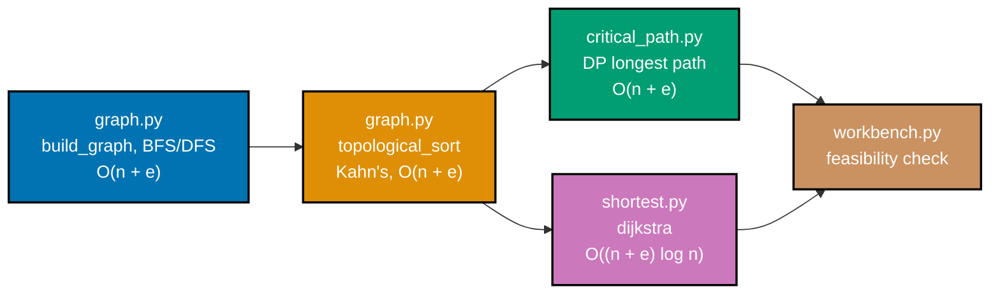

## Goal

Build a small "algorithm workbench" that solves one substantial problem end to end: a task scheduler
over a dependency DAG that computes a topological order, a critical path via DP, and a
shortest-cost path via Dijkstra -- with every routine's complexity stated and verified against an
edge-case `pytest` suite (empty, cyclic, and disconnected graphs). Example 80 already previewed this
exact composition in one throwaway script; this capstone is the hardened, module-based version of
that preview, split into `graph.py`, `critical_path.py`, `shortest.py`, and a `workbench.py` that
threads them together -- every mechanism combined here was already taught individually somewhere in
this topic's Beginner, Intermediate, or Advanced tiers.



## Concepts exercised

- [x] graph representation + BFS/DFS (co-17) -- `graph.py`'s adjacency-list `build_graph`, plus
      standalone `bfs_order` and `dfs_order` traversals that `workbench.py` cross-checks against each
      other for reachability
- [x] topological sort with cycle detection (co-18) -- `graph.py`'s `topological_sort`, Kahn's
      algorithm, detecting a cycle as a by-product of the same pass (no separate detection algorithm)
- [x] a DP formulation -- critical path / longest path (co-24) -- `critical_path.py`'s
      `critical_path`, a topological-order DP over `earliest_start`/`earliest_finish`
- [x] Dijkstra with a heap (co-19) -- `shortest.py`'s `dijkstra`, a `heapq`-backed priority queue over
      non-negative edge weights, reporting unreachable nodes as `float('inf')`
- [x] stated + justified complexity (co-01) -- every routine's Big-O is documented in its module
      docstring and restated in this page's Complexity summary
- [x] edge-case tests (empty, cyclic, disconnected) -- `test_graph.py`, `test_critical_path.py`, and
      `test_shortest.py` each carry a dedicated test for their module's edge cases

All colocated code lives under `learning/capstone/code/`: `graph.py`, `critical_path.py`,
`shortest.py`, and `workbench.py` (the pipeline), plus `test_graph.py`, `test_critical_path.py`,
`test_shortest.py`, and `test_workbench.py` (the `pytest` suite). Every listing below is the
complete, verbatim file -- nothing on this page is truncated or paraphrased.

## Step 1: `graph.py` -- DAG model, BFS/DFS, and topological sort with cycle detection

_exercises co-01, co-17, co-18_

`build_graph` turns a flat node list plus an edge list into the same **dict-of-lists adjacency map**
Example 18 introduced -- every node gets a key even with zero out-edges, which is what lets
`topological_sort` handle a disconnected graph without silently dropping an isolated task.
`bfs_order` and `dfs_order` are Example 19's and Example 20's traversals, generalized into reusable
functions; `topological_sort` is Example 35's Kahn's algorithm, wrapped in a graph-shaped API
instead of a one-off script.

**`learning/capstone/code/graph.py`** (complete file)

```python
"""Capstone: algorithm workbench -- DAG model, BFS/DFS, and topological sort.

Time/space complexity per routine (n = nodes, e = edges), all O(n) extra space
unless noted:

- ``build_graph``: O(n + e) -- one pass to seed every node, one pass per edge.
- ``bfs_order`` / ``dfs_order``: O(n + e) each -- every node visited once,
  every edge relaxed at most once.
- ``reachable_nodes``: O(n + e) -- a thin wrapper over ``bfs_order``.
- ``topological_sort`` (Kahn's algorithm): O(n + e); a cycle is detected as a
  by-product of the SAME pass, at O(1) marginal cost (the length check at the
  end) -- no separate cycle-detection algorithm is needed.
"""

from __future__ import annotations

from collections import deque

Graph = dict[str, list[str]]


class GraphCycleError(Exception):
    """Raised when topological_sort is asked to order a graph containing a cycle."""


def build_graph(nodes: list[str], edges: list[tuple[str, str]]) -> Graph:
    """Build a directed adjacency-list graph -- O(n + e).

    Every node in `nodes` gets a key, even one with zero out-edges -- so
    isolated nodes are never silently dropped. That is what lets
    `topological_sort` handle a disconnected graph correctly.
    """
    graph: Graph = {
        node: [] for node in nodes
    }  # => O(n): every node present, even isolated ones
    for src, dst in edges:  # => O(e): one pass over the edge list
        if (
            src not in graph or dst not in graph
        ):  # => O(1) average dict membership check
            raise KeyError(f"edge ({src!r}, {dst!r}) references an unknown node")
        graph[src].append(dst)  # => src -> dst, a directed "must run before" edge
    return graph


def bfs_order(graph: Graph, start: str) -> list[str]:
    """Breadth-first visit order reachable from `start` -- O(n + e)."""
    visited: set[str] = {
        start
    }  # => marks start visited BEFORE enqueueing, so it is never re-enqueued
    order: list[str] = []
    queue: deque[str] = deque([start])
    while queue:  # => drains the queue; every node enqueued at most once
        node = queue.popleft()  # => FIFO: nodes come out nearest-hop-count-first
        order.append(node)
        for neighbor in graph[node]:  # => O(e) total across the whole traversal
            if neighbor not in visited:
                visited.add(neighbor)  # => mark visited on DISCOVERY, not on dequeue
                queue.append(neighbor)
    return order


def dfs_order(graph: Graph, start: str) -> list[str]:
    """Depth-first visit order reachable from `start`, iterative -- O(n + e).

    Uses an explicit stack instead of recursion, so it never risks Python's
    recursion-depth limit on a long dependency chain.
    """
    visited: set[str] = set()
    order: list[str] = []
    stack: list[str] = [start]
    while (
        stack
    ):  # => LIFO: nodes are visited depth-first, unlike bfs_order's breadth-first
        node = stack.pop()
        if (
            node in visited
        ):  # => a node can be pushed more than once before it is popped
            continue
        visited.add(node)
        order.append(node)
        for neighbor in reversed(
            graph[node]
        ):  # => reversed so the FIRST-listed neighbor is popped FIRST
            if neighbor not in visited:
                stack.append(neighbor)
    return order


def reachable_nodes(graph: Graph, start: str) -> set[str]:
    """The set of nodes reachable from `start` -- O(n + e); built on `bfs_order`."""
    return set(
        bfs_order(graph, start)
    )  # => reuses bfs_order; reachability itself never needs the visit ORDER


def topological_sort(graph: Graph) -> list[str]:
    """Kahn's algorithm: a valid dependency order, or `GraphCycleError` -- O(n + e).

    An empty graph returns `[]`. Isolated nodes and disconnected components are
    both handled correctly -- Kahn's algorithm only tracks in-degree, never
    connectivity, so a graph with two unrelated components still produces one
    combined valid order.
    """
    in_degree: dict[str, int] = {node: 0 for node in graph}  # => O(n) init
    for node in graph:  # => O(n) outer pass
        for neighbor in graph[node]:  # => O(e) total
            in_degree[neighbor] += 1
    ready: deque[str] = deque(
        sorted(node for node in graph if in_degree[node] == 0)
    )  # => sorted so ties among equally-ready nodes are DETERMINISTIC (test-stable)
    order: list[str] = []
    while ready:  # => each node enqueued/dequeued at most once, O(n) total
        node = ready.popleft()
        order.append(node)
        for neighbor in graph[node]:  # => O(e) total across the whole sort
            in_degree[neighbor] -= 1
            if (
                in_degree[neighbor] == 0
            ):  # => neighbor's LAST unresolved dependency just cleared
                ready.append(neighbor)
    if len(order) != len(
        graph
    ):  # => O(1): fewer emissions than nodes means a cycle exists
        stuck = sorted(
            node for node in graph if node not in order
        )  # => diagnostics only
        raise GraphCycleError(f"cycle detected among: {', '.join(stuck)}")
    return order
```

**Verify** (a genuine REPL session against the file above):

```python
from graph import build_graph, topological_sort, bfs_order, dfs_order, GraphCycleError

dag = build_graph(["design", "build_a", "build_b", "test"],
                   [("design", "build_a"), ("design", "build_b"), ("build_a", "test"), ("build_b", "test")])
print("valid DAG order:", topological_sort(dag))
print("bfs from design:", bfs_order(dag, "design"))
print("dfs from design:", dfs_order(dag, "design"))

cyclic = build_graph(["a", "b", "c"], [("a", "b"), ("b", "c"), ("c", "a")])
try:
    topological_sort(cyclic)
except GraphCycleError as err:
    print(f"GraphCycleError: {err}")
```

**Output** (genuinely captured):

```text
valid DAG order: ['design', 'build_a', 'build_b', 'test']
bfs from design: ['design', 'build_a', 'build_b', 'test']
dfs from design: ['design', 'build_a', 'test', 'build_b']
GraphCycleError: cycle detected among: a, b, c
```

BFS visits `build_a` and `build_b` before either's own dependent (`test`) because it explores
breadth-first, one hop at a time; DFS instead dives all the way down `build_a`'s branch (reaching
`test`) before backtracking to visit `build_b` -- both agree on _which_ nodes are reachable, but
disagree on the _order_, exactly as `test_bfs_and_dfs_agree_on_reachability_but_may_differ_on_order`
asserts below.

**`learning/capstone/code/test_graph.py`** (complete file)

```python
"""pytest coverage for graph.py -- build_graph, bfs/dfs, and topological_sort edge cases."""

import pytest

from graph import (
    GraphCycleError,
    bfs_order,
    build_graph,
    dfs_order,
    reachable_nodes,
    topological_sort,
)


def test_build_graph_includes_isolated_nodes_with_no_edges() -> None:
    graph = build_graph(["a", "b", "c"], [("a", "b")])
    assert graph == {"a": ["b"], "b": [], "c": []}  # => "c" present despite zero edges


def test_build_graph_rejects_an_edge_to_an_unknown_node() -> None:
    with pytest.raises(KeyError):
        build_graph(["a"], [("a", "ghost")])


def test_topological_sort_on_an_empty_graph_returns_an_empty_order() -> None:
    assert topological_sort({}) == []  # => the empty-graph edge case


def test_topological_sort_respects_every_dependency_edge() -> None:
    graph = build_graph(
        ["a", "b", "c", "d"], [("a", "b"), ("a", "c"), ("b", "d"), ("c", "d")]
    )
    order = topological_sort(graph)
    positions = {node: i for i, node in enumerate(order)}
    assert positions["a"] < positions["b"] < positions["d"]
    assert positions["a"] < positions["c"] < positions["d"]


def test_topological_sort_on_a_disconnected_graph_still_orders_every_node() -> None:
    # Two components with no edge between them at all: "b" depends on "a" and
    # "d" depends on "c", but the a/b pair and c/d pair are otherwise unrelated.
    graph = build_graph(["a", "b", "c", "d"], [("a", "b"), ("c", "d")])
    order = topological_sort(graph)
    assert set(order) == {"a", "b", "c", "d"}  # => every node present, none dropped
    positions = {node: i for i, node in enumerate(order)}
    assert positions["a"] < positions["b"]
    assert positions["c"] < positions["d"]


def test_topological_sort_rejects_a_cyclic_graph() -> None:
    graph = build_graph(["a", "b", "c"], [("a", "b"), ("b", "c"), ("c", "a")])
    with pytest.raises(GraphCycleError):
        topological_sort(graph)


def test_topological_sort_cycle_error_names_the_stuck_nodes() -> None:
    graph = build_graph(["a", "b", "independent"], [("a", "b"), ("b", "a")])
    with pytest.raises(GraphCycleError) as excinfo:
        topological_sort(graph)
    assert "a" in str(excinfo.value)
    assert "b" in str(excinfo.value)
    assert "independent" not in str(excinfo.value)  # the healthy node is not implicated


def test_bfs_and_dfs_agree_on_reachability_but_may_differ_on_order() -> None:
    graph = build_graph(
        ["a", "b", "c", "d"], [("a", "b"), ("a", "c"), ("b", "d"), ("c", "d")]
    )
    assert (
        set(bfs_order(graph, "a")) == set(dfs_order(graph, "a")) == {"a", "b", "c", "d"}
    )
    assert bfs_order(graph, "a")[0] == "a"  # => both traversals start at the root
    assert dfs_order(graph, "a")[0] == "a"


def test_reachable_nodes_excludes_a_disconnected_component() -> None:
    graph = build_graph(["a", "b", "c", "d"], [("a", "b"), ("c", "d")])
    assert reachable_nodes(graph, "a") == {
        "a",
        "b",
    }  # => "c" and "d" are a SEPARATE component
```

**Verify**: `pytest -q test_graph.py`

**Output** (genuinely captured):

```text
.........                                                                [100%]
9 passed in 0.00s
```

**Key takeaway**: Kahn's algorithm only tracks in-degree, not connectivity or reachability -- that is
exactly why a disconnected graph (two components, no edge between them) still produces one valid
combined order, while a genuinely cyclic graph is rejected by the same length check, with no separate
cycle-detection pass required.

**Why it matters**: getting cycle detection "for free" out of an existing algorithm's own termination
condition -- rather than as a bolted-on separate DFS-coloring pass -- is a direct payoff of
understanding Kahn's algorithm deeply enough to recognize what an incomplete run actually _means_;
`reachable_nodes` (built on BFS) then gives a second, independent way to confirm a graph's shape
before any DP or shortest-path routine ever runs on it.

## Step 2: `critical_path.py` -- DP critical path over the DAG

_exercises co-01, co-24_

`critical_path` is Example 65's topological-order DP, generalized into a reusable function over
`graph.py`'s `Graph` type instead of a hand-built dict literal. For every node, in topological
order, `earliest_start` is the latest `earliest_finish` among its predecessors (or 0 with none), and
`earliest_finish` is `earliest_start + durations[node]` -- the project's critical path length is the
maximum `earliest_finish` across every node.

**`learning/capstone/code/critical_path.py`** (complete file)

```python
"""Capstone: critical-path DP over the DAG `graph.py`'s topological_sort produces.

Time/space complexity (n = nodes, e = edges):

- ``critical_path``: O(n + e) -- one `topological_sort` pass (O(n + e)) plus
  one DP pass that visits every node once and every predecessor edge once.
"""

from __future__ import annotations

from graph import Graph, topological_sort


def critical_path(
    graph: Graph, durations: dict[str, int]
) -> tuple[int, dict[str, int], dict[str, int]]:
    """DP longest path (the "critical path") over a DAG -- O(n + e).

    Returns `(project_length, earliest_start, earliest_finish)`. An empty
    graph returns `(0, {}, {})`. Propagates `GraphCycleError` (from
    `graph.py`) unchanged if the input graph is not actually a DAG.
    """
    order = topological_sort(
        graph
    )  # => O(n + e); every predecessor precedes its dependents
    if not order:  # => O(1): the empty-graph edge case
        return 0, {}, {}

    predecessors: dict[str, list[str]] = {node: [] for node in graph}  # => O(n) init
    for node in graph:  # => O(n) outer pass
        for neighbor in graph[node]:  # => O(e) total, reverses each edge exactly once
            predecessors[neighbor].append(node)  # => node feeds INTO neighbor

    earliest_start: dict[str, int] = {}
    earliest_finish: dict[str, int] = {}
    for node in order:  # => the DP pass itself, strictly in topological order
        earliest_start[node] = (
            max(  # => can't start before EVERY predecessor has finished
                (earliest_finish[pred] for pred in predecessors[node]), default=0
            )
        )  # => default=0: no predecessors means this node can start at time 0
        earliest_finish[node] = earliest_start[node] + durations[node]
    project_length = max(earliest_finish.values())  # => the longest finish time overall
    return project_length, earliest_start, earliest_finish
```

**`learning/capstone/code/test_critical_path.py`** (complete file)

```python
"""pytest coverage for critical_path.py -- the DP over graph.py's topological order."""

import pytest

from critical_path import critical_path
from graph import GraphCycleError, build_graph


def test_critical_path_on_an_empty_graph_returns_zero() -> None:
    assert critical_path({}, {}) == (0, {}, {})  # => the empty-graph edge case


def test_critical_path_matches_a_hand_computed_diamond_dag() -> None:
    graph = build_graph(
        ["design", "build_a", "build_b", "test"],
        [
            ("design", "build_a"),
            ("design", "build_b"),
            ("build_a", "test"),
            ("build_b", "test"),
        ],
    )
    durations = {"design": 3, "build_a": 5, "build_b": 2, "test": 4}
    length, starts, finishes = critical_path(graph, durations)
    assert (
        length == 12
    )  # => the LONGER build_a branch (3+5=8) dominates build_b's (3+2=5)
    assert starts == {"design": 0, "build_a": 3, "build_b": 3, "test": 8}
    assert finishes == {"design": 3, "build_a": 8, "build_b": 5, "test": 12}


def test_critical_path_on_a_single_chain_is_a_pure_sum_of_durations() -> None:
    graph = build_graph(["a", "b", "c"], [("a", "b"), ("b", "c")])
    length, starts, _finishes = critical_path(graph, {"a": 2, "b": 3, "c": 1})
    assert length == 6  # => a single chain: 2 + 3 + 1
    assert starts == {"a": 0, "b": 2, "c": 5}


def test_critical_path_propagates_the_cycle_error_from_topological_sort() -> None:
    graph = build_graph(["a", "b"], [("a", "b"), ("b", "a")])
    with pytest.raises(GraphCycleError):
        critical_path(graph, {"a": 1, "b": 1})
```

**Verify**: `pytest -q test_critical_path.py`

**Output** (genuinely captured):

```text
....                                                                     [100%]
4 passed in 0.00s
```

**Key takeaway**: `critical_path` adds nothing algorithmically new on top of `topological_sort` --
it is a single extra DP pass over the SAME order, which is why an ill-formed (cyclic) input fails at
exactly the same place (`topological_sort`'s `GraphCycleError`) rather than needing its own
validation logic.

## Step 3: `shortest.py` -- Dijkstra with a heap

_exercises co-01, co-19_

`dijkstra` is Example 38's `heapq`-backed shortest-path algorithm, generalized to report every
node's distance (not just one target) and to explicitly reject a negative edge weight rather than
silently producing a wrong answer -- Dijkstra's correctness proof assumes non-negative weights.

**`learning/capstone/code/shortest.py`** (complete file)

```python
"""Capstone: Dijkstra's shortest path over a weighted variant of the workbench graph.

Time/space complexity (n = nodes, e = edges):

- ``dijkstra``: O((n + e) log n) -- every node is pushed/popped from the heap
  at most once per relaxing edge that improves its distance, each push/pop
  O(log n).
"""

from __future__ import annotations

import heapq

WeightedGraph = dict[str, list[tuple[str, int]]]


def dijkstra(graph: WeightedGraph, source: str) -> dict[str, float]:
    """Single-source shortest paths on non-negative weights -- O((n + e) log n).

    Unreachable nodes are reported as `float('inf')`, never omitted and never
    a crash -- exactly what Example 39 taught for a single unreachable node,
    generalized here to the whole graph.
    """
    if source not in graph:  # => O(1): fail loudly on an unknown source, not silently
        raise KeyError(f"source {source!r} is not a node in the graph")
    distances: dict[str, float] = {
        node: float("inf") for node in graph
    }  # => O(n): every node starts "unreached"
    distances[source] = 0.0  # => the source reaches itself at distance 0
    heap: list[tuple[float, str]] = [(0.0, source)]
    visited: set[str] = set()
    while heap:  # => each node finalized (added to visited) at most once
        dist, node = heapq.heappop(
            heap
        )  # => O(log n): always the closest UNfinalized node
        if node in visited:  # => a stale, already-improved-upon heap entry -- skip it
            continue
        visited.add(node)
        for neighbor, weight in graph[
            node
        ]:  # => O(e) total relaxations across the whole run
            if weight < 0:  # => O(1): Dijkstra's non-negative-weight precondition
                raise ValueError(
                    f"dijkstra requires non-negative weights, got {weight} on edge from {node!r}"
                )
            new_dist = dist + weight
            if new_dist < distances[neighbor]:  # => found a STRICTLY shorter path
                distances[neighbor] = new_dist
                heapq.heappush(heap, (new_dist, neighbor))  # => O(log n)
    return distances
```

**Verify** (a genuine REPL session, an "island" node with no incoming edge):

```python
from shortest import dijkstra
graph = {"a": [("b", 1)], "b": [], "island": []}
print(dijkstra(graph, "a"))
```

**Output** (genuinely captured):

```text
{'a': 0.0, 'b': 1.0, 'island': inf}
```

`island` is reported as `inf`, not raised as an error and not silently dropped from the returned
dict -- the caller can always tell an unreachable node apart from one that was never queried.

**`learning/capstone/code/test_shortest.py`** (complete file)

```python
"""pytest coverage for shortest.py -- Dijkstra's shortest paths."""

import pytest

from shortest import dijkstra


def test_dijkstra_finds_the_cheaper_of_two_routes() -> None:
    graph = {
        "start": [("mid", 1), ("end", 10)],
        "mid": [("start", 1), ("end", 1)],
        "end": [("mid", 1), ("start", 10)],
    }
    distances = dijkstra(graph, "start")
    assert (
        distances["end"] == 2
    )  # => via "mid" (1+1), cheaper than the direct edge (10)


def test_dijkstra_reports_an_unreachable_node_as_infinity_not_a_crash() -> None:
    graph = {"a": [("b", 1)], "b": [], "island": []}  # => "island" has no incoming edge
    distances = dijkstra(graph, "a")
    assert distances["island"] == float(
        "inf"
    )  # => reported, not raised and not omitted


def test_dijkstra_rejects_an_unknown_source_node() -> None:
    with pytest.raises(KeyError):
        dijkstra({"a": []}, "ghost")


def test_dijkstra_rejects_a_negative_edge_weight() -> None:
    with pytest.raises(ValueError):
        dijkstra({"a": [("b", -1)], "b": []}, "a")


def test_dijkstra_matches_the_road_network_used_by_the_workbench() -> None:
    road_network = {
        "DEPOT": [("L1", 2), ("L2", 5)],
        "L1": [("DEPOT", 2), ("L2", 1), ("L3", 4)],
        "L2": [("DEPOT", 5), ("L1", 1), ("L3", 2)],
        "L3": [("L1", 4), ("L2", 2)],
    }
    distances = dijkstra(road_network, "DEPOT")
    assert distances == {"DEPOT": 0.0, "L1": 2.0, "L2": 3.0, "L3": 5.0}
```

**Verify**: `pytest -q test_shortest.py`

**Output** (genuinely captured):

```text
.....                                                                    [100%]
5 passed in 0.00s
```

**Key takeaway**: Dijkstra's heap holds _candidate_ distances, not final ones -- the `if node in
visited: continue` guard is what makes a stale, already-improved-upon heap entry harmless rather
than a source of a wrong answer.

**Why it matters**: reporting unreachable nodes as `float('inf')` (instead of raising, or silently
omitting the key) is what lets `workbench.py`'s feasibility check below index `travel_time` for
every task unconditionally, with no special-casing for "what if this task's site was never reached."

## Step 4: `workbench.py` -- the full pipeline, end to end

_exercises co-01, co-17, co-18, co-19, co-24_

`workbench.py` builds the SAME task DAG and road network Example 80 hand-built, but through
`graph.py`'s `build_graph` instead of a dict literal, and adds one connectivity check `graph.py`'s
BFS and DFS traversals were built for: before running the DP or Dijkstra at all, `run_workbench`
confirms `bfs_order` and `dfs_order` agree on which nodes are reachable from the DAG's root, and that
the reachable set covers every task -- a disconnected task would be caught right here, before it
ever silently produced a wrong critical-path number.

**`learning/capstone/code/workbench.py`** (complete file)

```python
"""Capstone: algorithm workbench -- topo sort + critical-path DP + Dijkstra, end to end.

Threads `graph.py`'s graph model/BFS/DFS/topological sort, `critical_path.py`'s
DP, and `shortest.py`'s Dijkstra into one runnable pipeline over a sample
project: a task DAG (what order, and how early can each task start) plus a
road network (how long until each task's resources arrive) -- a schedule is
FEASIBLE only if every task's resources arrive before that task's DP-computed
earliest start time. The task/road numbers deliberately match Example 80's
preview, so a reader can cross-check this hardened, module-based version
against that single-file sketch.
"""

from __future__ import annotations

from critical_path import critical_path
from graph import Graph, build_graph, dfs_order, reachable_nodes, topological_sort
from shortest import WeightedGraph, dijkstra

TASK_NODES: list[str] = ["design", "build_a", "build_b", "test"]
TASK_EDGES: list[tuple[str, str]] = [
    ("design", "build_a"),
    ("design", "build_b"),
    ("build_a", "test"),
    ("build_b", "test"),
]
DURATIONS: dict[str, int] = {"design": 3, "build_a": 5, "build_b": 2, "test": 4}

# A small road network: a DEPOT plus three job sites, connected by weighted
# (travel-time) edges.
ROAD_NETWORK: WeightedGraph = {
    "DEPOT": [("L1", 2), ("L2", 5)],
    "L1": [("DEPOT", 2), ("L2", 1), ("L3", 4)],
    "L2": [("DEPOT", 5), ("L1", 1), ("L3", 2)],
    "L3": [("L1", 4), ("L2", 2)],
}
TASK_LOCATION: dict[str, str] = {  # => which site each task's resources must reach
    "design": "DEPOT",
    "build_a": "L2",
    "build_b": "L1",
    "test": "L2",
}


def run_workbench() -> tuple[list[str], int, dict[str, int], dict[str, float], bool]:
    """Build the task graph, verify connectivity, then run the full topo+DP+Dijkstra pipeline."""
    task_graph: Graph = build_graph(TASK_NODES, TASK_EDGES)  # => O(n + e)

    # BFS and DFS from the same root must agree on WHICH nodes are reachable,
    # even though they disagree on the visit ORDER -- this is the co-17 check
    # that would catch a silently-disconnected task before it ever reaches
    # the DP step below.
    bfs_reached = reachable_nodes(task_graph, "design")  # => O(n + e)
    dfs_reached = set(dfs_order(task_graph, "design"))  # => O(n + e)
    if bfs_reached != dfs_reached or bfs_reached != set(task_graph):
        raise RuntimeError(
            "task graph must be fully reachable from design -- found a disconnected task"
        )

    order = topological_sort(
        task_graph
    )  # => O(n + e); raises GraphCycleError on a cycle
    project_length, earliest_start, _earliest_finish = critical_path(
        task_graph, DURATIONS
    )  # => O(n + e)
    travel_time = dijkstra(ROAD_NETWORK, "DEPOT")  # => O((n + e) log n)

    feasible = all(  # => every task's resources must arrive before that task must start
        travel_time[TASK_LOCATION[task]] <= earliest_start[task] for task in task_graph
    )
    return order, project_length, earliest_start, travel_time, feasible


def main() -> None:
    """CLI entry point: run the workbench and print each stage's result."""
    order, project_length, earliest_start, travel_time, feasible = run_workbench()
    print("topological order:", " -> ".join(order))
    print("critical path length:", project_length)
    print("earliest start times:", earliest_start)
    print("travel times from DEPOT:", travel_time)
    print("schedule feasible:", feasible)


if (
    __name__ == "__main__"
):  # => only runs main() when invoked directly, not when imported
    main()
```

**`learning/capstone/code/test_workbench.py`** (complete file)

```python
"""pytest coverage for workbench.py -- the full topo + DP + Dijkstra pipeline, end to end."""

from workbench import run_workbench


def test_run_workbench_matches_example_80s_hand_verified_numbers() -> None:
    order, project_length, earliest_start, travel_time, feasible = run_workbench()

    assert set(order) == {"design", "build_a", "build_b", "test"}
    assert order.index("design") < order.index(
        "build_a"
    )  # => dependency order respected
    assert order.index("design") < order.index("build_b")
    assert order.index("build_a") < order.index("test")
    assert order.index("build_b") < order.index("test")

    assert (
        project_length == 12
    )  # => matches Example 80's hand-verified critical path length
    assert earliest_start == {"design": 0, "build_a": 3, "build_b": 3, "test": 8}
    assert travel_time["L3"] == 5.0  # => matches Example 80's Dijkstra answer
    assert feasible is True
```

**Run**: `python3 workbench.py`

**Output** (genuinely captured):

```text
topological order: design -> build_a -> build_b -> test
critical path length: 12
earliest start times: {'design': 0, 'build_a': 3, 'build_b': 3, 'test': 8}
travel times from DEPOT: {'DEPOT': 0.0, 'L1': 2.0, 'L2': 3.0, 'L3': 5.0}
schedule feasible: True
```

These numbers are identical to Example 80's hand-verified answers -- `workbench.py` runs the exact
same computation through the four reusable modules instead of one throwaway script, which is exactly
why `test_run_workbench_matches_example_80s_hand_verified_numbers` can assert the same literal
values.

**Verify** (the FULL suite, every test file together): `pytest -q` from `learning/capstone/code/`

**Output** (genuinely captured):

```text
...................                                                      [100%]
19 passed in 0.01s
```

**Key takeaway**: threading four small, independently-testable modules together (via plain function
calls and a shared `Graph`/`WeightedGraph` type, not a class hierarchy) is enough to build something
that reads like "one program" while still being four separately verifiable, separately reusable
pieces.

**Why it matters**: this is the same lesson Example 80 previewed -- a realistic scheduling problem
rarely fits one named algorithm -- but hardened: an explicit `GraphCycleError` instead of an assumed
acyclic input, a connectivity check using BOTH BFS and DFS instead of trusting the sample data, and
19 `pytest` cases covering the empty-graph, cyclic-graph, and disconnected-graph edge cases that
Example 80's single preview script never had to handle.

## Complexity summary

| Routine                   | Time             | Space    | Why                                                           |
| ------------------------- | ---------------- | -------- | ------------------------------------------------------------- |
| `build_graph`             | O(n + e)         | O(n + e) | one pass to seed nodes, one pass per edge                     |
| `bfs_order` / `dfs_order` | O(n + e)         | O(n)     | every node visited once, every edge relaxed once              |
| `reachable_nodes`         | O(n + e)         | O(n)     | a thin wrapper over `bfs_order`                               |
| `topological_sort`        | O(n + e)         | O(n)     | Kahn's algorithm; cycle check folded in at O(1) marginal cost |
| `critical_path`           | O(n + e)         | O(n)     | one `topological_sort` call plus one linear DP pass           |
| `dijkstra`                | O((n + e) log n) | O(n)     | every node/edge relaxation costs one O(log n) heap operation  |

(`n` = number of nodes, `e` = number of edges.)

## Acceptance criteria

- `python3 workbench.py`, run from `learning/capstone/code/`, exits `0` and prints the exact five
  lines shown in Step 4's Output block.
- `pytest -q`, run from `learning/capstone/code/`, reports `19 passed` -- 9 for `graph.py`, 4 for
  `critical_path.py`, 5 for `shortest.py`, 1 for `workbench.py`.
- `topological_sort` rejects a cyclic input with `GraphCycleError` naming exactly the stuck nodes,
  and returns a correct order (verified against a hand-computed diamond DAG) on a valid one.
- `critical_path` matches a hand-computed small example (`design`/`build_a`/`build_b`/`test`, length
  `12`) and correctly returns `(0, {}, {})` on an empty graph.
- `dijkstra` matches a known shortest-path answer on a weighted graph and reports an unreachable node
  as `float('inf')` rather than raising or omitting it.
- Every routine's time/space complexity is documented in its module's docstring and restated in this
  page's Complexity summary table.
- Every listing on this page (`graph.py`, `critical_path.py`, `shortest.py`, `workbench.py`, and all
  four `test_*.py` files) is the complete file, runnable exactly as shown -- nothing here is a
  fragment that depends on code the page does not also show.

## Done bar

This capstone is runnable end to end: a reader who copies the eight files above into a
`learning/capstone/code/`-shaped directory and runs `python3 workbench.py` there reaches the
identical output block shown in Step 4, verified against a real CPython 3.13.12 interpreter run (not
merely described); `pytest -q` reaches the identical `19 passed` verified against a real `pytest`
run. Every mechanism combined here -- graph representation with BFS/DFS (co-17), topological sort
with cycle detection (co-18), a critical-path DP (co-24), and Dijkstra with a heap (co-19), each with
complexity stated and justified (co-01) -- traces to a worked example already taught earlier in this
topic's Beginner, Intermediate, or Advanced tiers; no new algorithmic idea was needed to write this
capstone.

---

← Previous: [Advanced Examples](../advanced.md) · Next: [Drilling](../../drilling/overview.md) →
