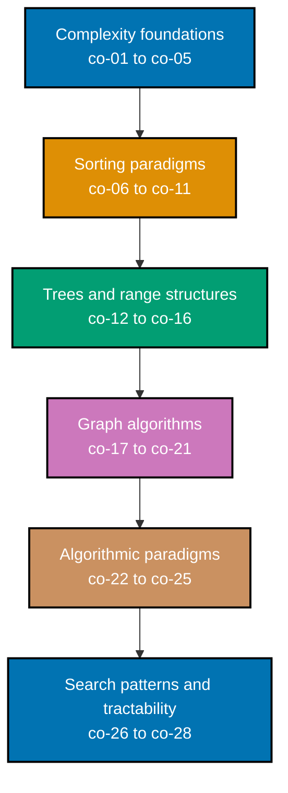

## Prerequisites

- **Prior topics**: [7 · Data Structures & Algorithms Essentials](../../data-structures-and-algorithms-essentials/learning/overview.md) (arrays, hashmaps, trees, Big-O, recursion) and [4 · Just Enough Python](../../just-enough-python/learning/overview.md); [19 · Computer Science Foundations](../../computer-science-foundations/learning/overview.md) sharpens the complexity reasoning this topic relies on throughout.
- **Tools & environment**: a macOS/Linux terminal; **Python 3.13+** (`heapq`, `collections`, `functools`, `itertools` from the stdlib) with `pytest` installed in a `venv`; `pyright` for the static-typing verification every example was independently checked against, in strict mode, with zero errors and zero warnings.
- **Assumed knowledge**: recursion, Big-O notation, and the basic data structures from topic 7 (arrays, hashmaps, a plain BST, a basic BFS/Dijkstra); reading a simple recurrence relation.

## Why this exists -- the big idea

**The problem before the solution**: some problems look intractable until you know the paradigm that cracks them -- brute force silently explodes from milliseconds to millennia as the input grows. **Keep this if you forget everything else**: most hard problems reduce to a known shape -- divide, be greedy, memoize, or backtrack -- and recognizing which shape you are holding is the actual skill.

**Cross-cutting big ideas**: `abstraction-and-its-cost` -- every paradigm here is a resource trade (DP buys time with memory; greedy buys speed by giving up a correctness guarantee; the analysis is deciding which trade is worth it, and the tools in co-01 through co-05 are what make that decision measurable instead of a guess).

**Scope note**: this topic extends [topic 7's](../../data-structures-and-algorithms-essentials/learning/overview.md) everyday basics into rigor and paradigm mastery -- complexity proofs, balanced and range-query trees, the full graph-algorithm toolkit, and the divide-and-conquer/greedy/DP/backtracking paradigms that solve genuinely hard problems.

## How verification works in this topic

Every one of this topic's 80 worked examples is a complete, self-contained `example.py` colocated under `learning/code/ex-NN-slug/`, runnable in isolation with `python3 example.py` -- its expected output is shown two ways: inline, as a `# => Output: ...` comment directly beneath the `print()` call that produces it, and as a captured, verbatim `python3 example.py` run in this page's **Output** block. Every example also ships a colocated `test_example.py`, verified with `pytest -q` and shown the same way. Nothing on the following pages is a description of what an algorithm "should" do -- every claim was independently run, and every `example.py`/`test_example.py` pair was checked with `pyright --strict` directly, reporting zero errors and zero warnings across all 80 examples.

## Concepts

Every worked example in this topic's follow-up pages cites the `co-NN` concept it exercises -- this section is the 1:1 reference those citations point back to. This topic **extends** the essentials in [topic 7 Data Structures & Algorithms Essentials](../../data-structures-and-algorithms-essentials/learning/overview.md) into rigor and paradigm mastery: where topic 7 introduced BFS/DFS, a basic Dijkstra, tries, and two-pointer as tools, here they gain complexity proofs, colors/timestamps, negative-cycle handling, and balanced/segment structures.

### co-01 &middot; Asymptotic Notation -- Theta, Omega, Big-O

Theta is a tight bound, Omega a lower bound, and Big-O an upper bound -- naming which one an algorithm's complexity claim is actually asserting matters, because "O(n^2)" is a true but weak statement about an algorithm that is genuinely Theta(n).

**Why it matters**: Every other complexity claim in this topic (and beyond it) rests on correctly distinguishing these three -- confusing a loose upper bound for a tight one is one of the most common complexity-notation mistakes.

**Verify it**: Examples 1, 2, 8, 15, 74, and 78 measure growth rates directly via doubling tests and classify functions into the correct Theta/O/Omega bucket, rather than asserting a bound from memory.

### co-02 &middot; Amortized Analysis

The average cost per operation across a whole sequence, not the worst-case cost of any single operation -- proven via the aggregate method (total cost divided by operation count), the accounting method (a credit ledger that never goes negative), or the potential method (a function whose change plus actual cost stays bounded).

**Why it matters**: `list.append`'s "amortized O(1)" claim is not literally true for every single call (a resize is O(n)); amortized analysis is what makes that claim precise and provable rather than hand-wavy.

**Verify it**: Examples 25, 26, 33, and 77 apply all three amortized-analysis techniques -- aggregate, accounting, and potential -- to a doubling array, a credit ledger, optimized union-find, and a multi-pop stack respectively.

### co-03 &middot; Recurrence Relations

Expressing a recursive algorithm's running time as an equation relating `T(n)` to smaller subproblems (like `T(n) = 2T(n/2) + n`), then solving that equation to get a closed-form complexity bound.

**Why it matters**: A recursive algorithm's complexity is not obvious from reading the code alone -- the recurrence is the tool that turns "it calls itself twice on half the input" into a provable `O(n log n)` bound.

**Verify it**: Examples 3 and 4 unroll merge sort's recurrence by hand into its closed form, and apply the Master theorem to three more recurrences.

### co-04 &middot; The Master Theorem

For `T(n) = a*T(n/b) + f(n)`, comparing `f(n)` against `n^(log_b a)` mechanically picks one of three cases, avoiding a from-scratch unrolling for every new divide-and-conquer recurrence.

**Why it matters**: The Master theorem turns recurrence-solving from a case-by-case derivation into a mechanical comparison, applicable to binary search, merge sort, and any algorithm matching the `a*T(n/b) + f(n)` shape.

**Verify it**: Example 4 evaluates all three Master theorem cases on concrete recurrences and checks each resulting bound against a direct operation count.

### co-05 &middot; Space-Time Tradeoff

Spending memory to buy time (or the reverse) as a deliberate engineering choice -- a precomputed table, a cache, or an extra array can turn a slow repeated computation into a fast lookup, at the cost of the memory that table occupies.

**Why it matters**: Nearly every optimization in this topic is a space-time tradeoff in disguise -- Fenwick and segment trees, memoization, and space-rolled DP tables all trade memory for speed, and recognizing that tradeoff explicitly is what makes the decision deliberate rather than accidental.

**Verify it**: Examples 62, 78, and 79 make the tradeoff explicit: rolling a 2D DP table down to 1D, stating and testing three complexities including a space/time-motivated one, and measuring exactly where a memory-heavier paradigm starts winning.

### co-06 &middot; Divide and Conquer

Split a problem into independent subproblems, solve each recursively, then combine their results -- the combine step is often where all the interesting work concentrates.

**Why it matters**: Divide-and-conquer is the paradigm behind merge sort, the closest-pair algorithm, and (implicitly) binary search -- recognizing when a problem splits cleanly into independent halves is a prerequisite for applying the Master theorem to it at all.

**Verify it**: Examples 5 and 29 implement merge sort and the closest-pair-of-points algorithm, both structured as split-recurse-combine.

### co-07 &middot; Merge Sort Invariants

A stable O(n log n) sort whose merge step maintains an explicit ordering invariant -- checked after every single append, not just trusted to hold at the end.

**Why it matters**: An invariant checked only at the end is a weaker claim than one checked at every step; the merge step's "stays sorted" property is a small, cheap thing to verify continuously, and doing so catches bugs exactly where they are introduced.

**Verify it**: Examples 5 and 6 implement merge sort and then instrument its merge step with an inline invariant check after every append.

### co-08 &middot; Quicksort Partitioning

In-place partitioning around a pivot -- pivot choice is what separates quicksort's average-case `O(n log n)` from a worst-case `O(n^2)`, which a fixed first-element pivot hits on already-sorted input.

**Why it matters**: Quicksort's reputation for speed only holds for the average case; understanding partitioning and pivot choice is what explains both why naive quicksort can be slow (Example 8) and how randomization (Example 27) or median-of-medians (Example 74) fixes that.

**Verify it**: Examples 7, 8, 27, 28, and 74 implement Lomuto partitioning, demonstrate the naive worst case, fix it with a random pivot, reuse partitioning for quickselect, and finally eliminate the worst case deterministically.

### co-09 &middot; Heapsort and Binary Heaps

The heap property (a parent is always `<=` or `>=` its children), sift-up and sift-down as the operations that restore it, and an in-place `O(n log n)` heapsort built from those primitives.

**Why it matters**: A heap's relaxed ordering (correct at the root, loose everywhere else) is what makes `O(log n)` push/pop possible, and that exact property is what makes Dijkstra (Example 38) and Prim's MST (Example 43) efficient.

**Verify it**: Examples 9 and 10 push/pop through `heapq`'s min-heap and implement heapsort's sift-down by hand.

### co-10 &middot; Non-Comparison Sorts

Counting, radix, and bucket sort beat the comparison-sort `n log n` lower bound by not comparing elements at all -- they exploit a structural assumption about the keys (a small known range, or fixed-width digits) instead.

**Why it matters**: The `n log n` lower bound is specifically a bound on COMPARISON sorts; non-comparison sorts sidestep it entirely by using a different strategy, which is faster whenever their assumption genuinely holds.

**Verify it**: Examples 11 and 12 implement counting sort and LSD radix sort, both verified against `sorted()`.

### co-11 &middot; Sort Stability

Preserving the input order of equal-key records through a sort -- a property some algorithms (Python's `sorted()`) guarantee and others (a swap-based selection sort) do not.

**Why it matters**: Stability is load-bearing, not cosmetic -- radix sort's correctness depends on every per-digit pass being stable, and Example 13 shows exactly what breaks when it is not.

**Verify it**: Example 13 sorts `(key, seq)` pairs with both a stable and an unstable sort and compares the resulting order of equal-key pairs.

### co-12 &middot; Balanced BSTs

AVL and red-black trees keep height `O(log n)` via rotations (AVL) or color invariants plus rotations (red-black), preventing the degradation a plain BST suffers on sorted input.

**Why it matters**: A plain BST's `O(log n)` search bound depends entirely on insertion order and can degrade to an `O(n)` chain; balanced trees make that degradation structurally impossible, regardless of insertion order.

**Verify it**: Examples 14, 15, 68, and 69 build a plain BST, show it degenerate on sorted input, then rebuild the same sequence with AVL rotations and verify red-black invariants, both staying logarithmic.

### co-13 &middot; Tries

Prefix trees that store strings character by character down a tree of nodes, giving `O(key-length)` lookup and prefix queries, independent of how many other keys share the structure.

**Why it matters**: A hash-based dictionary cannot efficiently answer "which strings share this prefix" -- that query is exactly what a trie is built for, powering autocomplete, spell-checkers, and IP routing tables.

**Verify it**: Examples 16 and 17 build a trie for insert/lookup and then augment it with a per-node word count to answer prefix-count queries in `O(prefix-length)`.

### co-14 &middot; Fenwick Tree

A binary indexed tree that stores partial sums keyed by the lowest set bit of each index, giving both point-update and prefix-sum queries in `O(log n)` using only `O(n)` extra space.

**Why it matters**: A Fenwick tree is the space-efficient middle ground between a plain array (`O(1)` update, `O(n)` query) and a precomputed prefix-sum array (`O(1)` query, `O(n)` update) -- both operations in `O(log n)`, with minimal code and memory.

**Verify it**: Examples 30 and 67 build a Fenwick tree for prefix sums and compare it directly against a segment tree on the same workload.

### co-15 &middot; Segment Tree

A tree that stores, at each internal node, the aggregate of an entire array range, built once in `O(n)` and answering any range query (or, with lazy propagation, range update) in `O(log n)`.

**Why it matters**: Unlike a Fenwick tree, a segment tree generalizes to any associative aggregate (min, max, GCD, sum) and supports efficient range updates via lazy propagation, at the cost of more code and roughly `4x` the memory.

**Verify it**: Examples 31, 32, and 67 build a segment tree for range-minimum queries, add lazy range-add updates, and compare the whole structure directly against a Fenwick tree.

### co-16 &middot; Union-Find

A disjoint-set structure that tracks which elements belong to the same group, answering "same group" queries by comparing roots, and merging groups by attaching one root to another -- union-by-rank and path compression give it near-constant amortized query time.

**Why it matters**: Union-find answers connectivity questions (are these two nodes connected, how many connected components exist) without any graph traversal at all, and its two standard optimizations turn a structure that can degrade toward a linked list into one that is essentially constant-time at any realistic scale.

**Verify it**: Examples 22, 33, 34, and 42 build the unoptimized version, add both optimizations and measure the resulting near-constant cost, count connected components, and use it to detect cycles inside Kruskal's MST algorithm.

### co-17 &middot; Graph Traversal, in Depth

BFS and DFS with discovery/finish timestamps and vertex colors (WHITE/GRAY/BLACK), not just a plain visited set -- the extra state is what makes cycle detection and DFS-based topological sort possible.

**Why it matters**: A plain visited/unvisited boolean cannot distinguish "this node is my ancestor on the current path" from "this node was already fully explored on an unrelated branch" -- and that distinction is exactly what separates a genuine cycle from a harmless shared descendant.

**Verify it**: Examples 18 through 21, 36, 37, and 66 build a graph representation, run BFS and DFS, add discovery/finish timestamps, reuse those timestamps for a DFS-based topological sort and cycle detection, and finally power Kosaraju's two-pass strongly-connected-components algorithm.

### co-18 &middot; Topological Sort

A linear order of a DAG's nodes such that every edge points from earlier to later in the order -- computed via Kahn's algorithm (repeatedly removing in-degree-zero nodes) or DFS (reversing finish order), with cycle detection as the necessary precondition check.

**Why it matters**: Topological sort is the algorithm behind every "what order should these tasks run in" question where some tasks depend on others -- build systems, package installers, and course-prerequisite graphs all reduce to this.

**Verify it**: Examples 35, 36, 37, 65, 66, and 80 implement both Kahn's and the DFS-based sort, detect cycles that would make the sort meaningless, and build a critical-path scheduler and a full capstone-preview scheduler on top of a topological order.

### co-19 &middot; Dijkstra's Shortest Path

Single-source shortest paths on non-negative edge weights, using a min-heap to greedily expand the cheapest-known frontier node next in `O((V+E) log V)`.

**Why it matters**: Dijkstra is the default shortest-path algorithm for the overwhelming majority of real-world weighted graphs, since non-negative weights are the common case, and it substantially beats Bellman-Ford's more general `O(V*E)`.

**Verify it**: Examples 38, 39, 43, 63, 64, and 80 run Dijkstra on a weighted graph, confirm it reports infinity (not a crash) for unreachable nodes, power Prim's MST, measure its speed advantage over Bellman-Ford directly, extend it into A\* search, and thread it into the capstone-preview scheduler.

### co-20 &middot; Bellman-Ford

Shortest paths that tolerate negative edge weights (which break Dijkstra's greedy assumption) by relaxing every edge `V-1` times over, at `O(V*E)`, with an extra relaxation round detecting negative cycles.

**Why it matters**: Bellman-Ford's extra generality over Dijkstra comes at a real, measurable cost, making the choice between them a genuine engineering decision -- use Dijkstra when weights are guaranteed non-negative, fall back to Bellman-Ford only when they might not be.

**Verify it**: Examples 40, 41, and 63 run Bellman-Ford on a graph with negative edges, detect a negative cycle via an extra relaxation round, and measure its relaxation-count cost directly against Dijkstra on the same graph.

### co-21 &middot; Minimum Spanning Tree

Kruskal's algorithm (greedy on edges, via union-find to reject cycles) and Prim's algorithm (greedy on nodes, via a heap) both build a minimum-weight tree connecting every node, using entirely different strategies that provably arrive at the same total weight.

**Why it matters**: Having two structurally different, independently-optimal algorithms converge on the same answer is a strong correctness signal, and the choice between them in practice is about graph density -- Prim's tends to be preferred for dense graphs, Kruskal's for sparse ones.

**Verify it**: Examples 42 and 43 build an MST via Kruskal's and Prim's algorithms on the same graph and confirm the total weights match.

### co-22 &middot; The Greedy Paradigm

Making locally optimal choices, valid only when the greedy-choice property actually holds for that specific problem -- a property that must be proven, not assumed, since the same greedy heuristic can be optimal for one problem and provably wrong for a closely related one.

**Why it matters**: Greedy's optimality is a property of the specific problem's structure, not a general guarantee; assuming a greedy solution transfers from one problem variant to a superficially similar one (like fractional knapsack to 0/1 knapsack) is a genuinely common mistake.

**Verify it**: Examples 44, 45, 58, and 79 show greedy succeeding provably (interval scheduling), failing on a non-canonical coin set, diverging from DP-optimal on 0/1 knapsack, and losing a direct paradigm shootout against DP as input size grows.

### co-23 &middot; Dynamic Programming, One Dimension

Memoization (top-down, caching results as needed) or tabulation (bottom-up, filling a table from the smallest subproblem upward) over a single dimension of overlapping subproblems.

**Why it matters**: "Dynamic programming" is not one specific coding pattern -- it is the principle of never solving the same subproblem twice, implementable either top-down or bottom-up depending on which fits a problem's dependency structure best.

**Verify it**: Examples 45 through 48, 58, 60, and 79 compare memoization against tabulation on Fibonacci, count stair-climbing ways, solve minimum-coin change where greedy failed, and use 1D DP inside the greedy-vs-DP and paradigm-shootout comparisons.

### co-24 &middot; Dynamic Programming, Two Dimensions

Two-dimensional DP tables where each cell depends on multiple neighboring cells across two shrinking dimensions -- edit distance, longest common subsequence, 0/1 knapsack, matrix-chain multiplication, and grid paths all take this shape.

**Why it matters**: 2D DP problems come with a reconstruction step beyond just computing a number -- the table stores enough information to walk backward and recover an actual optimal solution, which is what real diff tools and version-control merges need, not just a length.

**Verify it**: Examples 49 through 51, 59, 61, 62, 65, and 80 build 2D tables for edit distance, longest common subsequence (with reconstruction), 0/1 knapsack, grid paths, matrix-chain order, a space-optimized knapsack, critical-path scheduling, and the capstone-preview scheduler.

### co-25 &middot; Backtracking

Systematic search with pruning: commit to a choice, recurse, and immediately abandon (backtrack from) any branch that violates a constraint, rather than exploring it to completion.

**Why it matters**: Backtracking's power comes specifically from pruning early -- checking constraints immediately after each placement, rather than only at the end, is what turns a hopeless exponential search into a fast, practical one.

**Verify it**: Examples 53 through 57 place N queens, enumerate subsets and permutations, search a letter grid for words, and solve Sudoku, each demonstrating a different flavor of constraint checking and pruning.

### co-26 &middot; Two Pointers and Sliding Window

Linear-scan array/string patterns that replace nested loops: two pointers converge from opposite ends (or one fixed, one scanning) on sorted or monotonic data, while a sliding window incrementally updates a running answer as its boundaries move.

**Why it matters**: Wherever a nested loop searches sorted or monotonic data for a pair, a triplet, or a windowed condition, two pointers or a sliding window usually replace it with a single linear pass, turning an `O(n^2)` or `O(n^3)` brute force into `O(n)` or `O(n^2)`.

**Verify it**: Examples 23, 24, 70, 71, and 72 find a target-sum pair, a fixed-window maximum sum, unique zero-sum triplets, the longest repeat-free substring, and the minimum window covering a target character set.

### co-27 &middot; Binary Search on the Answer

Binary-searching a monotonic predicate over a value space, not just an array -- if a value `V` satisfies the predicate, every value on one side of `V` also satisfies it, which is exactly the structure binary search needs.

**Why it matters**: Binary search does not require an actual sorted array; it only requires monotonicity, which unlocks a whole category of "minimum X such that Y holds" optimization problems that have nothing to do with array indices at all.

**Verify it**: Examples 52, 60, and 73 find leftmost/rightmost boundaries in a sorted array, use binary search inside the patience-sorting LIS algorithm, and binary-search a monotonic feasibility predicate over ship capacities.

### co-28 &middot; NP-Hardness Intuition

Recognizing intractable problems (like TSP, whose brute-force solution requires `(n-1)!` work), understanding reductions (which prove one problem is at least as hard as another, already-known-hard one), and settling for a heuristic when an exact polynomial-time solution is not known to exist.

**Why it matters**: NP-hard problems force a genuine choice between "guaranteed optimal, but only feasible for small inputs" and "fast at any scale, but with no optimality guarantee" -- recognizing which category a new problem falls into is itself a practical skill, not just theory.

**Verify it**: Examples 75 and 76 measure the brute-force-vs-heuristic tradeoff directly on the Traveling Salesman Problem, and reduce Subset-Sum to Partition to sketch how NP-hardness proofs actually work.

## Examples by Level

### Beginner (Examples 1–24)

- [Example 1: Big-O Empirical Timing](/en/c/learn/fundamentally-strong/software-engineer/advanced-algorithms/learning/beginner#example-1-big-o-empirical-timing)
- [Example 2: Theta vs. Big-O Classification](/en/c/learn/fundamentally-strong/software-engineer/advanced-algorithms/learning/beginner#example-2-theta-vs-big-o-classification)
- [Example 3: Unroll the Merge Sort Recurrence](/en/c/learn/fundamentally-strong/software-engineer/advanced-algorithms/learning/beginner#example-3-unroll-the-merge-sort-recurrence)
- [Example 4: The Master Theorem's Three Cases](/en/c/learn/fundamentally-strong/software-engineer/advanced-algorithms/learning/beginner#example-4-the-master-theorems-three-cases)
- [Example 5: Top-Down Merge Sort](/en/c/learn/fundamentally-strong/software-engineer/advanced-algorithms/learning/beginner#example-5-top-down-merge-sort)
- [Example 6: Assert the Merge Invariant Inline](/en/c/learn/fundamentally-strong/software-engineer/advanced-algorithms/learning/beginner#example-6-assert-the-merge-invariant-inline)
- [Example 7: Quicksort with Lomuto Partitioning](/en/c/learn/fundamentally-strong/software-engineer/advanced-algorithms/learning/beginner#example-7-quicksort-with-lomuto-partitioning)
- [Example 8: Naive Quicksort's O(n^2) Blow-Up](/en/c/learn/fundamentally-strong/software-engineer/advanced-algorithms/learning/beginner#example-8-naive-quicksorts-on2-blow-up)
- [Example 9: heapq Push and Pop](/en/c/learn/fundamentally-strong/software-engineer/advanced-algorithms/learning/beginner#example-9-heapq-push-and-pop)
- [Example 10: In-Place Heapsort via Sift-Down](/en/c/learn/fundamentally-strong/software-engineer/advanced-algorithms/learning/beginner#example-10-in-place-heapsort-via-sift-down)
- [Example 11: Counting Sort](/en/c/learn/fundamentally-strong/software-engineer/advanced-algorithms/learning/beginner#example-11-counting-sort)
- [Example 12: LSD Radix Sort](/en/c/learn/fundamentally-strong/software-engineer/advanced-algorithms/learning/beginner#example-12-lsd-radix-sort)
- [Example 13: Stable vs. Unstable Sorting](/en/c/learn/fundamentally-strong/software-engineer/advanced-algorithms/learning/beginner#example-13-stable-vs-unstable-sorting)
- [Example 14: BST Insert, Search, and the Inorder Invariant](/en/c/learn/fundamentally-strong/software-engineer/advanced-algorithms/learning/beginner#example-14-bst-insert-search-and-the-inorder-invariant)
- [Example 15: A Plain BST Degenerates on Sorted Input](/en/c/learn/fundamentally-strong/software-engineer/advanced-algorithms/learning/beginner#example-15-a-plain-bst-degenerates-on-sorted-input)
- [Example 16: A Prefix Trie -- Insert and Lookup](/en/c/learn/fundamentally-strong/software-engineer/advanced-algorithms/learning/beginner#example-16-a-prefix-trie----insert-and-lookup)
- [Example 17: Count Words Sharing a Prefix](/en/c/learn/fundamentally-strong/software-engineer/advanced-algorithms/learning/beginner#example-17-count-words-sharing-a-prefix)
- [Example 18: Build a Graph as an Adjacency List](/en/c/learn/fundamentally-strong/software-engineer/advanced-algorithms/learning/beginner#example-18-build-a-graph-as-an-adjacency-list)
- [Example 19: BFS -- Shortest Hop-Count](/en/c/learn/fundamentally-strong/software-engineer/advanced-algorithms/learning/beginner#example-19-bfs----shortest-hop-count)
- [Example 20: Recursive DFS -- Collecting Visit Order](/en/c/learn/fundamentally-strong/software-engineer/advanced-algorithms/learning/beginner#example-20-recursive-dfs----collecting-visit-order)
- [Example 21: DFS with Colors and Discovery/Finish Times](/en/c/learn/fundamentally-strong/software-engineer/advanced-algorithms/learning/beginner#example-21-dfs-with-colors-and-discoveryfinish-times)
- [Example 22: Union-Find, No Optimizations](/en/c/learn/fundamentally-strong/software-engineer/advanced-algorithms/learning/beginner#example-22-union-find-no-optimizations)
- [Example 23: Two Pointers -- Pair Summing to a Target](/en/c/learn/fundamentally-strong/software-engineer/advanced-algorithms/learning/beginner#example-23-two-pointers----pair-summing-to-a-target)
- [Example 24: Maximum Sum of a Fixed-Size Window](/en/c/learn/fundamentally-strong/software-engineer/advanced-algorithms/learning/beginner#example-24-maximum-sum-of-a-fixed-size-window)

### Intermediate (Examples 25–52)

- [Example 25: A Doubling Dynamic Array's Amortized O(1) Append](/en/c/learn/fundamentally-strong/software-engineer/advanced-algorithms/learning/intermediate#example-25-a-doubling-dynamic-arrays-amortized-o1-append)
- [Example 26: The Accounting Method](/en/c/learn/fundamentally-strong/software-engineer/advanced-algorithms/learning/intermediate#example-26-the-accounting-method)
- [Example 27: Randomized-Pivot Quicksort](/en/c/learn/fundamentally-strong/software-engineer/advanced-algorithms/learning/intermediate#example-27-randomized-pivot-quicksort)
- [Example 28: Quickselect for the k-th Smallest](/en/c/learn/fundamentally-strong/software-engineer/advanced-algorithms/learning/intermediate#example-28-quickselect-for-the-k-th-smallest)
- [Example 29: Closest Pair of Points](/en/c/learn/fundamentally-strong/software-engineer/advanced-algorithms/learning/intermediate#example-29-closest-pair-of-points)
- [Example 30: Fenwick Tree Prefix Sum](/en/c/learn/fundamentally-strong/software-engineer/advanced-algorithms/learning/intermediate#example-30-fenwick-tree-prefix-sum)
- [Example 31: Segment Tree Range-Minimum Queries](/en/c/learn/fundamentally-strong/software-engineer/advanced-algorithms/learning/intermediate#example-31-segment-tree-range-minimum-queries)
- [Example 32: Segment Tree with Lazy Range-Add](/en/c/learn/fundamentally-strong/software-engineer/advanced-algorithms/learning/intermediate#example-32-segment-tree-with-lazy-range-add)
- [Example 33: Union-Find with Rank and Path Compression](/en/c/learn/fundamentally-strong/software-engineer/advanced-algorithms/learning/intermediate#example-33-union-find-with-rank-and-path-compression)
- [Example 34: Count Connected Components via Union-Find](/en/c/learn/fundamentally-strong/software-engineer/advanced-algorithms/learning/intermediate#example-34-count-connected-components-via-union-find)
- [Example 35: Topological Sort via Kahn's Algorithm](/en/c/learn/fundamentally-strong/software-engineer/advanced-algorithms/learning/intermediate#example-35-topological-sort-via-kahns-algorithm)
- [Example 36: Topological Sort via DFS Finish-Time Ordering](/en/c/learn/fundamentally-strong/software-engineer/advanced-algorithms/learning/intermediate#example-36-topological-sort-via-dfs-finish-time-ordering)
- [Example 37: Detect a Cycle via DFS Coloring](/en/c/learn/fundamentally-strong/software-engineer/advanced-algorithms/learning/intermediate#example-37-detect-a-cycle-via-dfs-coloring)
- [Example 38: Dijkstra's Shortest Paths](/en/c/learn/fundamentally-strong/software-engineer/advanced-algorithms/learning/intermediate#example-38-dijkstras-shortest-paths)
- [Example 39: Dijkstra Reports Infinity for Unreachable Nodes](/en/c/learn/fundamentally-strong/software-engineer/advanced-algorithms/learning/intermediate#example-39-dijkstra-reports-infinity-for-unreachable-nodes)
- [Example 40: Bellman-Ford with Negative Edges](/en/c/learn/fundamentally-strong/software-engineer/advanced-algorithms/learning/intermediate#example-40-bellman-ford-with-negative-edges)
- [Example 41: Detect a Negative Cycle](/en/c/learn/fundamentally-strong/software-engineer/advanced-algorithms/learning/intermediate#example-41-detect-a-negative-cycle)
- [Example 42: Kruskal's Minimum Spanning Tree](/en/c/learn/fundamentally-strong/software-engineer/advanced-algorithms/learning/intermediate#example-42-kruskals-minimum-spanning-tree)
- [Example 43: Prim's Minimum Spanning Tree](/en/c/learn/fundamentally-strong/software-engineer/advanced-algorithms/learning/intermediate#example-43-prims-minimum-spanning-tree)
- [Example 44: Max Non-Overlapping Intervals](/en/c/learn/fundamentally-strong/software-engineer/advanced-algorithms/learning/intermediate#example-44-max-non-overlapping-intervals)
- [Example 45: Greedy Coin Change Fails](/en/c/learn/fundamentally-strong/software-engineer/advanced-algorithms/learning/intermediate#example-45-greedy-coin-change-fails)
- [Example 46: Fibonacci -- Memoization vs Tabulation](/en/c/learn/fundamentally-strong/software-engineer/advanced-algorithms/learning/intermediate#example-46-fibonacci----memoization-vs-tabulation)
- [Example 47: Count Ways to Climb Stairs](/en/c/learn/fundamentally-strong/software-engineer/advanced-algorithms/learning/intermediate#example-47-count-ways-to-climb-stairs)
- [Example 48: Minimum-Coin Change via DP](/en/c/learn/fundamentally-strong/software-engineer/advanced-algorithms/learning/intermediate#example-48-minimum-coin-change-via-dp)
- [Example 49: Levenshtein Edit Distance](/en/c/learn/fundamentally-strong/software-engineer/advanced-algorithms/learning/intermediate#example-49-levenshtein-edit-distance)
- [Example 50: Longest Common Subsequence](/en/c/learn/fundamentally-strong/software-engineer/advanced-algorithms/learning/intermediate#example-50-longest-common-subsequence)
- [Example 51: 0/1 Knapsack](/en/c/learn/fundamentally-strong/software-engineer/advanced-algorithms/learning/intermediate#example-51-01-knapsack)
- [Example 52: Binary Search Boundaries](/en/c/learn/fundamentally-strong/software-engineer/advanced-algorithms/learning/intermediate#example-52-binary-search-boundaries)

### Advanced (Examples 53–80)

- [Example 53: N-Queens by Backtracking](/en/c/learn/fundamentally-strong/software-engineer/advanced-algorithms/learning/advanced#example-53-n-queens-by-backtracking)
- [Example 54: Enumerate All Subsets by Backtracking](/en/c/learn/fundamentally-strong/software-engineer/advanced-algorithms/learning/advanced#example-54-enumerate-all-subsets-by-backtracking)
- [Example 55: Enumerate All Permutations by Backtracking](/en/c/learn/fundamentally-strong/software-engineer/advanced-algorithms/learning/advanced#example-55-enumerate-all-permutations-by-backtracking)
- [Example 56: Grid Word Search via Backtracking](/en/c/learn/fundamentally-strong/software-engineer/advanced-algorithms/learning/advanced#example-56-grid-word-search-via-backtracking)
- [Example 57: Solve Sudoku by Constraint Backtracking](/en/c/learn/fundamentally-strong/software-engineer/advanced-algorithms/learning/advanced#example-57-solve-sudoku-by-constraint-backtracking)
- [Example 58: 0/1 Knapsack -- Greedy Diverges from DP](/en/c/learn/fundamentally-strong/software-engineer/advanced-algorithms/learning/advanced#example-58-01-knapsack----greedy-diverges-from-dp)
- [Example 59: Least-Cost Path Through a Grid](/en/c/learn/fundamentally-strong/software-engineer/advanced-algorithms/learning/advanced#example-59-least-cost-path-through-a-grid)
- [Example 60: Longest Increasing Subsequence](/en/c/learn/fundamentally-strong/software-engineer/advanced-algorithms/learning/advanced#example-60-longest-increasing-subsequence)
- [Example 61: Matrix-Chain Multiplication Order](/en/c/learn/fundamentally-strong/software-engineer/advanced-algorithms/learning/advanced#example-61-matrix-chain-multiplication-order)
- [Example 62: Space-Optimized 0/1 Knapsack](/en/c/learn/fundamentally-strong/software-engineer/advanced-algorithms/learning/advanced#example-62-space-optimized-01-knapsack)
- [Example 63: Dijkstra vs. Bellman-Ford, Measured](/en/c/learn/fundamentally-strong/software-engineer/advanced-algorithms/learning/advanced#example-63-dijkstra-vs-bellman-ford-measured)
- [Example 64: A\* Search with an Admissible Heuristic](/en/c/learn/fundamentally-strong/software-engineer/advanced-algorithms/learning/advanced#example-64-a-search-with-an-admissible-heuristic)
- [Example 65: Critical Path via DP over a Topological Order](/en/c/learn/fundamentally-strong/software-engineer/advanced-algorithms/learning/advanced#example-65-critical-path-via-dp-over-a-topological-order)
- [Example 66: Strongly Connected Components via Kosaraju's Algorithm](/en/c/learn/fundamentally-strong/software-engineer/advanced-algorithms/learning/advanced#example-66-strongly-connected-components-via-kosarajus-algorithm)
- [Example 67: Segment Tree vs. Fenwick Tree](/en/c/learn/fundamentally-strong/software-engineer/advanced-algorithms/learning/advanced#example-67-segment-tree-vs-fenwick-tree)
- [Example 68: AVL Tree Insert with Rotations](/en/c/learn/fundamentally-strong/software-engineer/advanced-algorithms/learning/advanced#example-68-avl-tree-insert-with-rotations)
- [Example 69: Red-Black Tree Invariants](/en/c/learn/fundamentally-strong/software-engineer/advanced-algorithms/learning/advanced#example-69-red-black-tree-invariants)
- [Example 70: 3-Sum via Sort + Two Pointers](/en/c/learn/fundamentally-strong/software-engineer/advanced-algorithms/learning/advanced#example-70-3-sum-via-sort--two-pointers)
- [Example 71: Longest Substring Without Repeating Characters](/en/c/learn/fundamentally-strong/software-engineer/advanced-algorithms/learning/advanced#example-71-longest-substring-without-repeating-characters)
- [Example 72: Minimum Window Substring](/en/c/learn/fundamentally-strong/software-engineer/advanced-algorithms/learning/advanced#example-72-minimum-window-substring)
- [Example 73: Binary Search on the Answer](/en/c/learn/fundamentally-strong/software-engineer/advanced-algorithms/learning/advanced#example-73-binary-search-on-the-answer)
- [Example 74: Median-of-Medians Select](/en/c/learn/fundamentally-strong/software-engineer/advanced-algorithms/learning/advanced#example-74-median-of-medians-select)
- [Example 75: TSP -- Brute Force vs. Nearest-Neighbor](/en/c/learn/fundamentally-strong/software-engineer/advanced-algorithms/learning/advanced#example-75-tsp----brute-force-vs-nearest-neighbor)
- [Example 76: Reducing Subset-Sum to Partition](/en/c/learn/fundamentally-strong/software-engineer/advanced-algorithms/learning/advanced#example-76-reducing-subset-sum-to-partition)
- [Example 77: The Potential Method](/en/c/learn/fundamentally-strong/software-engineer/advanced-algorithms/learning/advanced#example-77-the-potential-method)
- [Example 78: Three Complexities, Stated and Tested](/en/c/learn/fundamentally-strong/software-engineer/advanced-algorithms/learning/advanced#example-78-three-complexities-stated-and-tested)
- [Example 79: 0/1 Knapsack Paradigm Shootout](/en/c/learn/fundamentally-strong/software-engineer/advanced-algorithms/learning/advanced#example-79-01-knapsack-paradigm-shootout)
- [Example 80: Capstone Preview -- a Threaded Mini Scheduler](/en/c/learn/fundamentally-strong/software-engineer/advanced-algorithms/learning/advanced#example-80-capstone-preview----a-threaded-mini-scheduler)

---

← Previous: [24 · Concurrency & Parallelism Drilling](../../concurrency-and-parallelism/drilling/overview.md) · Next: [Beginner Examples](./beginner.md) →
