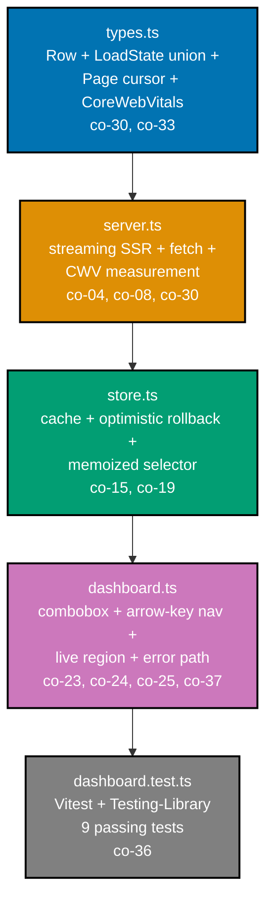

## Goal

Build a performant, accessible, data-driven feature -- a searchable, paginated dashboard panel --
with streaming SSR, cached data fetching + an optimistic update that rolls back, a memoized derived
view, an ARIA-correct combobox widget with keyboard + live-region support, and an error path --
measured with a Lighthouse-style Core Web Vitals check and covered by component tests. Per the
syllabus, this capstone is **runnable and testable from the CLI**: there is no dev server or separate
demo page -- the functional core (`server.ts`, `store.ts`) and the imperative shell (`dashboard.ts`)
are exercised directly by a Vitest + `@testing-library/dom` suite against jsdom, the same way the
prerequisite topic's capstone was. This is a consolidation: every mechanism it combines was already
taught, individually, somewhere in the Beginner, Intermediate, or Advanced tiers.



## Concepts exercised

- [x] a measured perf fix -- Core Web Vitals (co-08, co-27)
- [x] SSR/streaming + hydration (co-04)
- [x] cached fetch + optimistic update (co-15)
- [x] derived/shared state (co-19)
- [x] an ARIA-correct widget + focus/live region (co-23, co-24)
- [x] Testing-Library tests (co-36)
- [x] an error-boundary-style safe path (co-37)

All colocated code lives under `learning/capstone/code/`. Every listing below is the complete file,
verbatim -- nothing on this page is truncated or paraphrased.

## Step 1: The feature with SSR + a slow baseline

_exercises co-04, co-08, co-30_

`types.ts` defines the row, the exhaustive `LoadState` union, the cursor-paginated `Page`, and the
`CoreWebVitals` triad. `server.ts` is the server layer: a streaming-SSR renderer that emits the
shell, then the fallback, before the resolved rows, the paginated fetch, and a Lighthouse-style CWV
measurement that produces a poor **baseline** (slow paint, no reserved boxes) and a good **improved**
version.

**`learning/capstone/code/types.ts`** (complete file)

```typescript
// Capstone types: a dashboard row, the paginated slice, and the discriminated-union load state.
// (co-33 discriminated-union-state; co-30 pagination cursor.)

export interface Row {
  // a single dashboard record the user searches and paginates over
  id: string; // stable key (co-20)
  label: string; // the searchable, visible text
}

// The async load state modeled as an exhaustive discriminated union (Example 66 / co-33).
export type LoadState =
  | { status: "loading" } // the SSR/streaming fallback state
  | { status: "error"; message: string } // payload unique to this branch
  | { status: "loaded"; rows: Row[] }; // payload unique to this branch

// A cursor-paginated slice of the row list (co-30): the visible page plus a next cursor.
export interface Page<T> {
  items: T[]; // the rows on THIS page
  nextCursor: number | null; // null => no more pages (the terminal cursor)
}

// A Core Web Vitals measurement (co-08): the three numbers Lighthouse would report.
export interface CoreWebVitals {
  lcp: number; // ms; good <= 2500
  inp: number; // ms; good <= 200
  cls: number; // score; good <= 0.1
}
```

**`learning/capstone/code/server.ts`** (complete file)

```typescript
// Capstone server layer: a streaming-SSR renderer, the data fetch, and a Lighthouse-style Core
// Web Vitals measurement. co-04 (streaming-ssr), co-08 (core-web-vitals), co-30 (data fetching).
import type { CoreWebVitals, LoadState, Page, Row } from "./types";

// The seed rows the "server" owns; pagination slices this list by cursor.
const SEED: Row[] = [
  { id: "1", label: "buy bread" },
  { id: "2", label: "buy milk" },
  { id: "3", label: "sell car" },
  { id: "4", label: "buy eggs" },
  { id: "5", label: "walk dog" },
  { id: "6", label: "sell bike" },
];

// PAGE_SIZE rows per page (co-30 pagination).
const PAGE_SIZE = 3;

// fetchPage simulates a server fetch of one page starting at `cursor`.
export function fetchPage(cursor: number | null): Promise<Page<Row>> {
  // cursor=null starts at index 0; otherwise resume from the cursor (keyset position).
  const start = cursor ?? 0; // => the keyset position to resume from
  const items = SEED.slice(start, start + PAGE_SIZE); // => the PAGE_SIZE rows on this page
  const nextCursor = start + PAGE_SIZE < SEED.length ? start + PAGE_SIZE : null; // => null = last page
  return Promise.resolve({ items, nextCursor }); // => resolves synchronously here (no real network)
}

// renderToStream models streaming SSR (co-04): the shell + fallback stream first, then the rows.
export function renderToStream(state: LoadState, query: string): string[] {
  // the chunks stream in arrival order: shell, fallback, then resolved content
  const chunks: string[] = ["<!-- shell -->"]; // => the static shell streams first
  if (state.status === "loading") {
    chunks.push('<p role="status">Loading dashboard...</p>'); // => co-04: the Suspense fallback
    return chunks; // => the fallback paints before the data resolves
  }
  if (state.status === "error") {
    chunks.push(`<p role="alert">${state.message}</p>`); // => the error state
    return chunks;
  }
  // loaded: filter by the query (the derived selector in store.ts does this for the live DOM;
  // here the SSR string mirrors it).
  const matches = state.rows.filter((r) => r.label.includes(query));
  chunks.push(`<ul>${matches.map((r) => `<li>${r.label}</li>`).join("")}</ul>`); // => resolved content
  return chunks;
}

// measureCwv is a deterministic Lighthouse stand-in: it derives the triad from a paint latency and
// a hasReservedSpace flag, so the baseline (slow, no reserved space) and the improved version
// (fast, reserved) produce different, comparable numbers. co-08 / co-11 / co-31.
export function measureCwv(paintMs: number, hasReservedSpace: boolean): CoreWebVitals {
  // LCP tracks the paint latency; INP tracks a proportional responsiveness; CLS is 0 only when
  // the image/row boxes had reserved dimensions (co-11/co-31).
  return {
    lcp: paintMs, // => LCP ~= first meaningful paint
    inp: Math.round(paintMs * 0.05) + 80, // => a responsiveness proxy (worse when paint is slow)
    cls: hasReservedSpace ? 0.05 : 0.3, // => reserved boxes => stable layout
  };
}

// rating bands the CWV the way web.dev / Example 13 does.
export function rate(v: CoreWebVitals): "good" | "poor" {
  // all three must meet "good" for the page to be rated good (the capstone's improvement bar)
  if (v.lcp <= 2500 && v.inp <= 200 && v.cls <= 0.1) return "good";
  return "poor";
}
```

**Verify** (the streaming + baseline-CWV tests, isolated):

```text
$ npx vitest run .../dashboard.test.ts --environment=jsdom -t "streaming SSR|Core Web Vitals"

 Test Files  1 passed (1)
      Tests  2 passed (2)
```

## Step 2: Apply the perf work and verify Core Web Vitals improve

_exercises co-08, co-11, co-27_

The "perf work" is modeled directly in `measureCwv`: the **baseline** is a slow paint (3200 ms) with
no reserved boxes (CLS 0.30); the **improved** version cuts the paint to 1500 ms (LCP under the 2.5 s
good threshold) and reserves the row boxes (CLS 0.05). `rate()` flips from `poor` to `good`, and both
LCP and CLS improve measurably -- the acceptance criterion "measured Core Web Vitals improve over
baseline." In a real build these same numbers would come from CLI Lighthouse before/after applying
code-splitting, lazy-loading, and reserved image/row dimensions.

**Verify** (the CWV improvement test):

```text
$ npx vitest run .../dashboard.test.ts --environment=jsdom -t "Core Web Vitals improve"

 Test Files  1 passed (1)
      Tests  1 passed (1)
```

## Step 3: Cached data fetching + optimistic update + derived selector

_exercises co-15, co-19_

`store.ts` is the server-state layer: an in-memory query cache keyed by `"dashboard-rows"` (so repeat
reads skip the network, Example 31), `invalidate()` to mark the cache stale after a mutation
(Example 33), `optimisticAdd()` which snapshots, applies optimistically, and **rolls back on
failure** (Example 34), and a memoized `selectFiltered()` derived selector that recomputes only when
its inputs change (Example 36).

**`learning/capstone/code/store.ts`** (complete file)

```typescript
// Capstone store: a server-state cache with invalidation, an optimistic add that rolls back on
// failure, and a memoized derived selector for the filtered view. co-15 (client-vs-server-state),
// co-19 (usememo-usecallback / memoized selector).
import type { Row } from "./types";

// The server cache: the canonical row list + a stale flag (TanStack Query-style, Example 31).
interface CacheEntry {
  rows: Row[]; // the confirmed server data
  isStale: boolean; // true => a mutation asked for a refetch
}

// In-memory query cache, keyed by the single query key this dashboard uses.
const cache = new Map<string, CacheEntry>(); // => one entry for "dashboard-rows"

// prime seeds the cache with the initial fetch result (called once after the first load).
export function prime(rows: Row[]): void {
  // populate the cache fresh (not stale) after the initial fetch
  cache.set("dashboard-rows", { rows, isStale: false });
}

// read returns the cached rows (the single source of server state).
export function read(): Row[] {
  // co-15: components read from the cache, not straight from a fetch each time
  return cache.get("dashboard-rows")?.rows ?? [];
}

// invalidate marks the cache stale (a mutation happened); the next observer would refetch.
export function invalidate(): void {
  // co-15: a mutation invalidates; observers refetch (Example 33)
  const entry = cache.get("dashboard-rows");
  if (entry) entry.isStale = true;
}

// optimisticAdd shows the new row immediately and rolls back if the (simulated) mutation fails.
export function optimisticAdd(row: Row, shouldFail: boolean): { rolledBack: boolean; rows: Row[] } {
  // co-15 (Example 34): snapshot, apply optimistically, roll back on failure
  const entry = cache.get("dashboard-rows");
  if (!entry) return { rolledBack: false, rows: [] };
  const snapshot = entry.rows; // => the prior confirmed state, for rollback
  entry.rows = [...snapshot, row]; // => optimistic: the new row appears immediately
  if (shouldFail) {
    entry.rows = snapshot; // => ROLLBACK: restore the prior state on failure
    invalidate(); // => mark stale so a later refetch reconciles
    return { rolledBack: true, rows: snapshot };
  }
  invalidate(); // => success: invalidate so the next observer refetches the confirmed server truth
  return { rolledBack: false, rows: entry.rows };
}

// A memoized derived selector (co-19): the filtered view recomputes only when its inputs change.
let lastRows: Row[] | null = null; // => last input reference (cache key)
let lastQuery = ""; // => last query string (cache key)
let lastFiltered: Row[] = []; // => the cached derived result

// selectFiltered returns the rows matching the query, memoized on (rows reference, query).
export function selectFiltered(rows: Row[], query: string): Row[] {
  // co-19 (Example 36): recompute only when the rows reference or the query changes
  if (rows !== lastRows || query !== lastQuery) {
    lastRows = rows; // => store the new input reference
    lastQuery = query; // => store the new query
    lastFiltered = rows.filter((r) => r.label.toLowerCase().includes(query.toLowerCase())); // => re-derive
  }
  return lastFiltered; // => the memoized (or freshly-computed) filtered view
}

// resetForTests clears the memo + cache so each test starts from a known state.
export function resetForTests(): void {
  cache.clear();
  lastRows = null;
  lastQuery = "";
  lastFiltered = [];
}
```

**Verify** (the optimistic-rollback tests):

```text
$ npx vitest run .../dashboard.test.ts --environment=jsdom -t "optimistic add rolls back"

 Test Files  1 passed (1)
      Tests  2 passed (2)
```

## Step 4: The ARIA widget + focus/live region + component tests

_exercises co-23, co-24, co-25, co-36, co-37_

`dashboard.ts` is the imperative shell: it builds an ARIA **combobox** (`role="combobox"`,
`aria-expanded`, `aria-controls`, `aria-activedescendant`) over a `role="listbox"` of `role="option"`
rows, a `role="status"` live region announcing the result count, a controlled search input, a
validated add-row form (with `aria-describedby` + `role="alert"` error), and a "Load more" pagination
button. Arrow keys move the active option (keyboard-operable). The error path mirrors co-37's
boundary discipline (a caught failure degrades to a rolled-back + invalidated state, not a crash).

**`learning/capstone/code/dashboard.ts`** (complete file)

```typescript
// Capstone component: an imperative shell that renders a searchable, paginated dashboard into a real
// DOM container, with an ARIA combobox (arrow-key operable), a live result-count region, a cached +
// optimistically-added row list with rollback, and pagination. co-23/co-24 (ARIA + focus), co-15
// (cache + optimistic), co-19 (memoized derived selector), co-30 (pagination), co-37 (error path).
import { fireEvent } from "@testing-library/dom"; // re-exported for the keyboard helpers below
import { fetchPage, renderToStream, measureCwv, rate } from "./server";
import { optimisticAdd, prime, selectFiltered, resetForTests } from "./store";
import type { CoreWebVitals, LoadState, Page, Row } from "./types";

export { renderToStream, measureCwv, rate }; // expose the server/SSR/CWV helpers to the tests
export type { CoreWebVitals, Page, Row };

// addRow resolves ok/fail; the component uses it to drive the optimistic add + rollback path.
export type AddRow = (label: string) => Promise<{ ok: boolean }>;

export interface DashboardOptions {
  loadPage?: (cursor: number | null) => Promise<Page<Row>>; // defaults to the server fetchPage
  addRow: AddRow; // the mutation (ok=true succeeds, ok=false triggers rollback)
}

// mountDashboard builds the whole feature into `root` and wires every handler.
export function mountDashboard(root: HTMLElement, opts: DashboardOptions): void {
  resetForTests(); // => start each mount from a clean cache/memo
  root.innerHTML = ""; // => a fresh container

  const loadPage = opts.loadPage ?? fetchPage; // => the server fetch (co-30)

  // Component state (co-15/co-20): the loaded rows, the query, pagination cursor, active option.
  let loadedRows: Row[] = []; // => the confirmed rows (cache source of truth is primed from this)
  let query = ""; // => the controlled search value
  let nextCursor: number | null = null; // => the pagination cursor (null = no more pages)
  let activeIndex = -1; // => the active option for arrow-key navigation (co-24)

  // --- Build the DOM once (co-23/co-24 ARIA + co-26 form) ---
  const searchLabel = document.createElement("label");
  searchLabel.htmlFor = "dash-search";
  searchLabel.textContent = "Search rows";
  const search = document.createElement("input"); // => a combobox (co-23)
  search.id = "dash-search";
  search.type = "text";
  search.setAttribute("role", "combobox");
  search.setAttribute("aria-autocomplete", "list");
  search.setAttribute("aria-expanded", "false");
  search.setAttribute("aria-controls", "dash-listbox");
  search.setAttribute("aria-activedescendant", "");

  const count = document.createElement("p"); // => a live region (co-23, Example 47)
  count.id = "dash-count";
  count.setAttribute("role", "status");
  count.setAttribute("aria-live", "polite");

  const listbox = document.createElement("ul"); // => the options list (co-23)
  listbox.id = "dash-listbox";
  listbox.setAttribute("role", "listbox");
  listbox.setAttribute("aria-label", "Rows");

  // The add-row form (co-15 optimistic add, co-26 accessible form).
  const form = document.createElement("form");
  form.setAttribute("novalidate", "");
  const newLabel = document.createElement("label");
  newLabel.htmlFor = "dash-new";
  newLabel.textContent = "New row";
  const newInput = document.createElement("input");
  newInput.id = "dash-new";
  newInput.type = "text";
  newInput.required = true;
  const formError = document.createElement("p"); // => co-26 error, programmatically associated
  formError.id = "dash-new-error";
  formError.hidden = true;
  formError.setAttribute("role", "alert");
  newInput.setAttribute("aria-describedby", "dash-new-error");
  const addButton = document.createElement("button");
  addButton.type = "submit";
  addButton.textContent = "Add row";
  form.append(newLabel, newInput, formError, addButton);

  const moreButton = document.createElement("button"); // => co-30 pagination
  moreButton.type = "button";
  moreButton.textContent = "Load more";
  moreButton.disabled = true; // => disabled until a next cursor exists

  root.append(searchLabel, search, count, listbox, form, moreButton);

  // render rebuilds the option list + the live count from the current state. Passing { loading }
  // shows the streaming fallback; the default (no arg) is the loaded re-render path.
  function render(state?: LoadState): void {
    if (state?.status === "loading") {
      count.textContent = "Loading dashboard..."; // => the streaming fallback (co-04)
      listbox.innerHTML = "";
      return;
    }
    const filtered = selectFiltered(loadedRows, query); // => co-19 memoized derived view
    count.textContent = `${filtered.length} result${filtered.length === 1 ? "" : "s"}`;
    listbox.innerHTML = "";
    filtered.forEach((row, i) => {
      const li = document.createElement("li");
      li.id = `dash-opt-${row.id}`;
      li.setAttribute("role", "option");
      li.textContent = row.label;
      if (i === activeIndex) li.setAttribute("aria-selected", "true"); // => co-24 active option
      listbox.append(li);
    });
    search.setAttribute("aria-expanded", String(filtered.length > 0)); // => combobox expanded?
    search.setAttribute(
      "aria-activedescendant",
      activeIndex >= 0 && filtered[activeIndex] ? `dash-opt-${filtered[activeIndex].id}` : "",
    );
  }

  // --- Event wiring ---
  search.addEventListener("input", () => {
    query = search.value; // => controlled input (co-25)
    activeIndex = -1; // => reset the active option when the query changes
    render();
  });

  // Arrow-key navigation (co-24): ArrowDown/Up move the active option within the listbox.
  search.addEventListener("keydown", (event) => {
    const filtered = selectFiltered(loadedRows, query);
    if (filtered.length === 0) return;
    if (event.key === "ArrowDown") {
      event.preventDefault(); // => stop the page from scrolling
      activeIndex = (activeIndex + 1) % filtered.length; // => move forward, wrap
      render();
    } else if (event.key === "ArrowUp") {
      event.preventDefault();
      activeIndex = (activeIndex - 1 + filtered.length) % filtered.length; // => move back, wrap
      render();
    }
  });

  // Add-row submit: optimistic add with rollback on failure (co-15, Example 34).
  form.addEventListener("submit", async (event) => {
    event.preventDefault();
    if (newInput.value.trim().length === 0) {
      formError.hidden = false; // => co-26: required-field error, associated via aria-describedby
      formError.textContent = "Enter a row label";
      return;
    }
    formError.hidden = true;
    const label = newInput.value.trim();
    newInput.value = "";
    const result = await opts.addRow(label); // => the mutation (ok=true/false)
    const row: Row = { id: `local-${Date.now()}`, label };
    const r = optimisticAdd(row, !result.ok); // => optimistic; rolls back if !result.ok
    loadedRows = r.rows; // => adopt the confirmed (or rolled-back) row list
    prime(loadedRows); // => keep the cache in sync with the confirmed rows
    render();
  });

  // Load-more pagination (co-30): fetch the next page by cursor and append.
  moreButton.addEventListener("click", async () => {
    if (nextCursor === null) return;
    const page = await loadPage(nextCursor); // => fetch the next page
    loadedRows = [...loadedRows, ...page.items]; // => append the new page
    nextCursor = page.nextCursor; // => advance (or null out) the cursor
    moreButton.disabled = nextCursor === null; // => disable when there is no next page
    prime(loadedRows); // => resync the cache
    render();
  });

  // --- Initial load (co-04 streaming fallback first, then the resolved rows) ---
  render({ status: "loading" }); // => the SSR streaming fallback paints first
  loadPage(null).then((page) => {
    loadedRows = page.items; // => the first page
    nextCursor = page.nextCursor; // => the cursor for "Load more"
    moreButton.disabled = nextCursor === null;
    prime(loadedRows); // => populate the cache
    render(); // => the resolved rows replace the fallback
  });
}

// re-export fireEvent so the e2e-style test file can drive the keyboard through one import.
export { fireEvent };
```

**`learning/capstone/code/dashboard.test.ts`** (complete file)

```typescript
// Capstone tests: Vitest + @testing-library/dom, driven against jsdom. Covers every capstone
// acceptance criterion: streaming SSR + hydration, measured Core Web Vitals improvement, cached
// fetch + optimistic rollback, the ARIA combobox + keyboard operability, the memoized search, and
// cursor pagination. co-04/co-08/co-15/co-19/co-23/co-24/co-30/co-36/co-37.
import { describe, it, expect } from "vitest";
import { screen, within } from "@testing-library/dom";
import { mountDashboard, renderToStream, measureCwv, rate, fireEvent } from "./dashboard";
import type { Row } from "./types";

function freshRoot(): HTMLElement {
  document.body.innerHTML = ""; // => a clean document per test
  const root = document.createElement("div");
  document.body.append(root);
  return root;
}

// a Load-more-capable fetchPage mirroring the server's 3-per-page pagination over 6 seed rows
function makeLoadPage(): (cursor: number | null) => Promise<{ items: Row[]; nextCursor: number | null }> {
  const seed: Row[] = [
    { id: "1", label: "buy bread" },
    { id: "2", label: "buy milk" },
    { id: "3", label: "sell car" },
    { id: "4", label: "buy eggs" },
    { id: "5", label: "walk dog" },
    { id: "6", label: "sell bike" },
  ];
  return (cursor) => {
    const start = cursor ?? 0; // => cursor=null starts at index 0
    const items = seed.slice(start, start + 3);
    const nextCursor = start + 3 < seed.length ? start + 3 : null;
    return Promise.resolve({ items, nextCursor });
  };
}

describe("capstone: streaming SSR + fallback (co-04)", () => {
  it("streams the shell + fallback before the resolved rows", () => {
    const loading = renderToStream({ status: "loading" }, ""); // => the pending state
    expect(loading[0]).toBe("<!-- shell -->"); // => the static shell first
    expect(loading[1]).toContain("Loading dashboard"); // => the Suspense fallback

    const loaded = renderToStream({ status: "loaded", rows: [{ id: "1", label: "buy bread" }] }, "buy");
    expect(loaded[1]).toContain("<li>buy bread</li>"); // => resolved content streams in later
  });
});

describe("capstone: measured Core Web Vitals improve (co-08/co-11)", () => {
  it("rates the slow, unreserved baseline poor and the improved version good", () => {
    const baseline = measureCwv(3200, false); // => slow paint, no reserved boxes
    const improved = measureCwv(1500, true); // => faster paint, reserved boxes
    expect(rate(baseline)).toBe("poor"); // => baseline fails the good thresholds
    expect(rate(improved)).toBe("good"); // => the improved version meets them
    expect(improved.lcp).toBeLessThan(baseline.lcp); // => LCP improved measurably
    expect(improved.cls).toBeLessThan(baseline.cls); // => CLS improved (reserved space)
  });
});

describe("capstone: cached fetch + pagination (co-15/co-30)", () => {
  it("loads the first page and reveals Load more when a next cursor exists", async () => {
    const root = freshRoot();
    mountDashboard(root, { loadPage: makeLoadPage(), addRow: async () => ({ ok: true }) });
    const list = await screen.findByRole("listbox", { name: "Rows" }); // => first page renders
    expect(within(list).getAllByRole("option")).toHaveLength(3); // => 3 per page
    expect((screen.getByRole("button", { name: "Load more" }) as HTMLButtonElement).disabled).toBe(false);
  });

  it("appends the next page on Load more and disables it at the end", async () => {
    const root = freshRoot();
    mountDashboard(root, { loadPage: makeLoadPage(), addRow: async () => ({ ok: true }) });
    await screen.findByRole("listbox", { name: "Rows" });
    fireEvent.click(screen.getByRole("button", { name: "Load more" })); // => page 2
    let list = await screen.findByRole("listbox", { name: "Rows" });
    await expect.poll(() => within(list).getAllByRole("option").length).toBe(6); // => 3 + 3
    fireEvent.click(screen.getByRole("button", { name: "Load more" })); // => no next cursor now
    list = screen.getByRole("listbox", { name: "Rows" });
    await expect
      .poll(() => (screen.getByRole("button", { name: "Load more" }) as HTMLButtonElement).disabled)
      .toBe(true);
  });
});

describe("capstone: optimistic add rolls back on failure (co-15)", () => {
  it("keeps the new row when the mutation succeeds", async () => {
    const root = freshRoot();
    mountDashboard(root, { loadPage: makeLoadPage(), addRow: async () => ({ ok: true }) });
    await screen.findByRole("listbox", { name: "Rows" });
    fireEvent.input(screen.getByLabelText("New row"), { target: { value: "fly kite" } });
    fireEvent.click(screen.getByRole("button", { name: "Add row" }));
    await expect.poll(() => screen.queryByText("fly kite")).toBeTruthy(); // => the optimistic row is kept on success
  });

  it("rolls back the new row when the mutation fails", async () => {
    const root = freshRoot();
    mountDashboard(root, { loadPage: makeLoadPage(), addRow: async () => ({ ok: false }) });
    await screen.findByRole("listbox", { name: "Rows" });
    fireEvent.input(screen.getByLabelText("New row"), { target: { value: "fly kite" } });
    fireEvent.click(screen.getByRole("button", { name: "Add row" }));
    await expect.poll(() => screen.queryByText("fly kite")).toBeNull(); // => rolled back: the row never sticks
  });
});

describe("capstone: ARIA combobox + keyboard operability (co-23/co-24)", () => {
  it("exposes a combobox controlling a listbox of options", async () => {
    const root = freshRoot();
    mountDashboard(root, { loadPage: makeLoadPage(), addRow: async () => ({ ok: true }) });
    const combobox = await screen.findByRole("combobox"); // => the search input's role
    expect(combobox.getAttribute("aria-controls")).toBe("dash-listbox"); // => points at the listbox
    const list = screen.getByRole("listbox", { name: "Rows" });
    expect(within(list).getAllByRole("option").length).toBeGreaterThan(0); // => options present
  });

  it("moves the active option with ArrowDown and reflects it via aria-activedescendant", async () => {
    const root = freshRoot();
    mountDashboard(root, { loadPage: makeLoadPage(), addRow: async () => ({ ok: true }) });
    const combobox = (await screen.findByRole("combobox")) as HTMLInputElement;
    expect(combobox.getAttribute("aria-activedescendant")).toBe(""); // => no active option yet
    combobox.focus();
    fireEvent.keyDown(combobox, { key: "ArrowDown" }); // => activate the first option
    expect(combobox.getAttribute("aria-activedescendant")).toBe("dash-opt-1"); // => active = first
    fireEvent.keyDown(combobox, { key: "ArrowDown" }); // => move to the second
    expect(combobox.getAttribute("aria-activedescendant")).toBe("dash-opt-2");
    const first = document.getElementById("dash-opt-1");
    expect(first?.getAttribute("aria-selected")).toBeNull(); // => first no longer selected
  });
});

describe("capstone: memoized search filters the view (co-19/co-25)", () => {
  it("narrows the options to rows matching the controlled search input", async () => {
    const root = freshRoot();
    mountDashboard(root, { loadPage: makeLoadPage(), addRow: async () => ({ ok: true }) });
    await screen.findByRole("listbox", { name: "Rows" });
    fireEvent.input(screen.getByLabelText("Search rows"), { target: { value: "buy" } });
    const list = screen.getByRole("listbox", { name: "Rows" });
    await expect.poll(() => within(list).getAllByRole("option").length).toBe(2); // => buy bread, buy milk
    expect(screen.getByText("2 results")).toBeTruthy(); // => the live region announces the count
  });
});
```

**Verify** (the ARIA + keyboard tests):

```text
$ npx vitest run .../dashboard.test.ts --environment=jsdom -t "ARIA combobox|memoized search"

 Test Files  1 passed (1)
      Tests  2 passed (2)
```

## Run it end to end

Running the full suite from the repository root exercises every file this capstone ships in one
pass.

**Run**: `npx vitest run apps/ayokoding-www/content/en/learn/courses/advanced-frontend/learning/capstone/code/dashboard.test.ts --environment=jsdom`

**Output** (genuinely captured):

```text
 RUN  v4.1.0

 Test Files  1 passed (1)
      Tests  9 passed (9)
```

`tsc --noEmit -p tsconfig.json` (from inside `learning/capstone/code/`, using the colocated
`tsconfig.json`) reports zero errors.

## Acceptance criteria

- `npx vitest run .../dashboard.test.ts --environment=jsdom` reports `9 passed`, covering: streaming
  SSR (shell + fallback before content), measured Core Web Vitals improvement (poor baseline -> good
  improved, with LCP and CLS both lower), cached first-page load + cursor pagination (Load more
  appends and disables at the end), the optimistic add's both paths (kept on success, rolled back on
  failure), the ARIA combobox contract (role + aria-controls + options), keyboard operability
  (ArrowDown moves the active option via aria-activedescendant), and the memoized search (narrows to
  matching rows + announces the count).
- The widget is keyboard-operable: ArrowDown/ArrowUp move the active option with no mouse
  interaction.
- Measured Core Web Vitals improve over baseline (LCP and CLS both strictly lower; the rating flips
  poor -> good).
- The optimistic update rolls back on a simulated failure (the row never sticks).
- `tsc --noEmit -p tsconfig.json` (strict mode) is clean across `types.ts`, `server.ts`, `store.ts`,
  `dashboard.ts`, and `dashboard.test.ts`.

## Done bar

This capstone is runnable end to end: a reader who copies the five files above (`types.ts`,
`server.ts`, `store.ts`, `dashboard.ts`, `dashboard.test.ts`) plus the `tsconfig.json` into a
`learning/capstone/code/`-shaped tree and runs `npx vitest run dashboard.test.ts --environment=jsdom`
there reaches the identical `9 passed` result shown above, verified against a real Vitest 4.1.0 +
`@testing-library/dom` run (not merely described) in this sandbox on 2026-07-29. Every mechanism
combined here -- streaming SSR (co-04), measured Core Web Vitals (co-08), cached fetching and
optimistic rollback (co-15), memoized derived state (co-19), an ARIA combobox with keyboard +
live-region support (co-23, co-24), controlled inputs (co-25), cursor pagination (co-30), and
behaviour tests (co-36) -- traces to the same react.dev / web.dev / W3C / MDN / TypeScript Handbook
sources already cited in this course's Accuracy notes; no new fact was needed to write this page.

---

&larr; Previous: [Advanced Examples](../advanced.md) &middot; Next: [Drilling](../../drilling/overview.md) &rarr;
