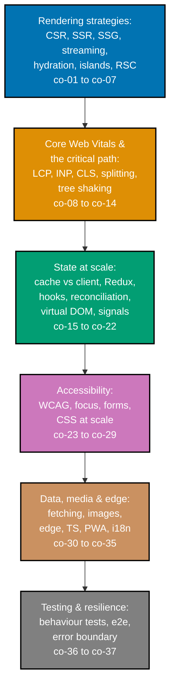

## Prerequisites

- **Prior topics**: [14 · Frontend Essentials](../../frontend-essentials/learning/overview.md) -- the
  component model (state, props, one-way data flow, keyed lists), controlled validated forms, basic
  ARIA and keyboard patterns, and discriminated-union UI state, assumed throughout; [13 · Just Enough
  TypeScript](../../just-enough-typescript/learning/overview.md) -- generics, unions, and narrowing,
  the raw material co-33 turns into typed components; and [15 · Software
  Testing](../../software-testing/learning/overview.md) -- Testing-Library component tests and the
  shape of an e2e smoke, which Examples 76-78 and the capstone build directly on.
- **Tools & environment**: a macOS/Linux terminal; **Node.js** + npm; **TypeScript** (`tsc` 5.8) and
  **tsx** to run every worked example from the CLI. No running dev server, browser, or installed
  framework is required for any single example -- React, the browser DOM, and framework mechanics
  (RSC, SSR, signals, service workers) are modeled in pure TypeScript, so every "Output" block is a
  real captured run. The capstone additionally uses **Vitest** + **`@testing-library/dom`**.
- **Assumed knowledge**: building a typed component with state + an accessible form (topic 14);
  running a component test from the CLI (topic 15); reading a TypeScript union and a generic
  signature (topic 13).

## Why this exists -- the big idea

The problem before the solution: a UI that renders correctly can still fail its users -- slow to
paint, janky to interact, inaccessible to a screen reader, and impossible to reason about once state
sprawls. The one idea worth keeping if you forget everything else: the frontend's hard problems are
state and time -- derive the UI from a single source of state, push data fetching and caching to
well-defined edges, and _measure_ performance instead of guessing at it.

**Cross-cutting big ideas, taught here and carried through every tier**: `taming-state` --
state-at-scale is the central difficulty of a real frontend, and the client-vs-server cache split
(co-15) plus the global-store decision (co-16) are both state-taming moves; `consistency-latency-
throughput` -- Core Web Vitals (co-08) and the rendering-strategy choice (co-01 through co-07) are
latency/throughput trade-offs wearing a frontend vocabulary.

## How this topic's examples are organized

- **Beginner** (Examples 1-28) -- the four rendering strategies (CSR, SSR, SSG, streaming), hydration
  and its mismatch warning, islands and React Server Components, the Core Web Vitals triad (LCP, INP,
  CLS) with their current 2026 thresholds, the critical rendering path, code splitting and tree
  shaking, the Rules of Hooks, `useEffect` semantics (after paint, cleanup, deps), `useMemo`/
  `useCallback`, reconciliation and keys, and the controlled-input rule.
- **Intermediate** (Examples 29-56) -- uncontrolled inputs and the no-switch rule, the client-vs-
  server cache split (caching, invalidation, optimistic rollback), when to reach for Redux, memoized
  selectors, a hand-built virtual-DOM diff, reconciliation by element type, fine-grained signals,
  semantic landmarks, an ARIA tabs widget, roving tabindex and a focus trap, live regions, accessible
  form validation and error summaries, CSS Modules vs Tailwind vs specificity, HTTP caching with
  `stale-while-revalidate`, a service worker, and performance budgets with bundle analysis.
- **Advanced** (Examples 57-80) -- data waterfalls and prefetching, Suspense-for-data via `use()`
  versus the `useEffect`-fetch trap, image optimization, edge rendering and its Web-API subset,
  discriminated-union state with exhaustive compile-time narrowing, generic and precisely-typed
  components, the PWA app shell / installability / offline fallback, i18n with `Intl` and message
  catalogs and RTL, behaviour-based Testing-Library queries, a `user-event` interaction test, a
  Playwright e2e smoke, an error boundary, and a closing capstone-preview assembly of a searchable,
  paginated dashboard.
- **[Capstone](./capstone/overview.md)** -- a four-step build of that dashboard with SSR/streaming,
  cached fetching + an optimistic update that rolls back, an ARIA-correct widget, and component + e2e
  tests.

Every example cites the `co-NN` concept it exercises, and every React/browser/framework claim traces
to react.dev, web.dev, the W3C, MDN, and the TypeScript Handbook, per the syllabus's DD-35 citations.

## Concepts

Every worked example in this topic's follow-up pages cites the `co-NN` concept it exercises -- this
section is the 1:1 reference those citations point back to. Read it in order: rendering strategies
come first because every performance and state concept that follows describes something happening
_inside_ a page rendered one of those ways.

### co-01 · rendering-csr

Client-side rendering: the browser boots a JS bundle and renders into an empty shell -- there is no
content before the bundle runs.

**Why it matters**: CSR's blank-shell cost (a crawler or no-JS user sees nothing until JS executes)
is the problem every other rendering strategy exists to solve.

**Verify it**: Example 1 shows the pre-JS DOM is empty, and the bundle fills it.

### co-02 · rendering-ssr

Server-side rendering: the server returns fully-formed HTML per request, so the content is present
before any JavaScript runs.

**Why it matters**: SSR fixes CSR's blank shell for first paint and crawlability, at the cost of
server work on every request.

**Verify it**: Example 2 returns complete HTML with content baked in, pre-JS.

### co-03 · rendering-ssg

Static site generation: pages are pre-rendered to HTML at build time and served as static files,
identical for every visitor.

**Why it matters**: SSG is the cheapest, most cacheable strategy -- a CDN can serve the files forever
-- but the content is fixed until the next build.

**Verify it**: Example 3 shows two requests reading the same byte-identical pre-built file.

### co-04 · streaming-ssr

Streaming SSR sends HTML in chunks with `<Suspense>` fallbacks as async work resolves, so the browser
paints the shell before the slowest data is ready.

**Why it matters**: streaming keeps one slow fetch from blocking the entire page's first paint.

**Verify it**: Example 4 shows the fallback chunk streaming before the resolved content.

### co-05 · hydration

Hydration attaches React's event handling to server-generated HTML via `hydrateRoot`, reusing the
existing DOM instead of re-rendering it.

**Why it matters**: hydration turns a readable server-rendered page into an interactive one without
rebuilding the DOM; a mismatch between server and client output warns and recovers.

**Verify it**: Example 5 attaches handlers to existing HTML; Example 6 warns on a server/client
mismatch.

### co-06 · islands-architecture

Islands architecture ships mostly-static HTML with small, independently-hydrated interactive
islands (Astro), so only the islands contribute JavaScript bytes.

**Why it matters**: islands get interactivity where needed without paying CSR's whole-page JS cost.

**Verify it**: Example 7 ships JS only to the one interactive island.

### co-07 · react-server-components

React Server Components split the tree into server components (default, no client JS) and client
components; `'use client'` marks the module-tree boundary, not the render tree.

**Why it matters**: keeping most of a tree server-side keeps the client bundle small while still
punching interactive holes where needed.

**Verify it**: Example 8 marks the `'use client'` module boundary; Example 9 ships no client JS for a
server component.

### co-08 · core-web-vitals

Core Web Vitals are the LCP/INP/CLS triad measuring loading, responsiveness, and visual stability.
INP replaced FID as a stable Core Web Vital in March 2024.

**Why it matters**: the triad is the user-experience scoreboard -- a page that "works" can still score
poorly here, and the scores are what search and CrUX rank on.

**Verify it**: Examples 10-13 measure LCP, INP, CLS, and print the current threshold table.

### co-09 · lcp

Largest Contentful Paint measures loading: the time of the largest text block or image to paint. Good
is at or below 2.5 s at the 75th percentile.

**Why it matters**: LCP names the specific element that bottlenecks loading, so you know what to
optimize.

**Verify it**: Example 10 identifies the LCP element and its time.

### co-10 · inp

Interaction to Next Paint measures responsiveness: the latency from a user input to the next painted
frame; a page's INP is its worst interaction. Good is at or below 200 ms.

**Why it matters**: INP catches jank on later interactions that the retired FID ignored.

**Verify it**: Example 11 measures the worst interaction's latency.

### co-11 · cls

Cumulative Layout Shift measures visual stability: how much visible content jumps. Reserving space
for late content keeps it near zero. Good is at or below 0.1.

**Why it matters**: CLS quantifies the jank of content jumping under the user -- usually fixable by
reserving dimensions up front.

**Verify it**: Example 12 drops CLS to zero by reserving space; Example 63 applies the same fix to
images.

### co-12 · critical-rendering-path

CSS is render-blocking; the render tree needs both the DOM and the CSSOM, so a blocking stylesheet
delays first paint until the CSSOM is built.

**Why it matters**: the size and chaining of render-blocking CSS directly controls first paint.

**Verify it**: Example 14 shows blocking CSS delaying first paint; Example 15 speeds it by inlining
critical CSS.

### co-13 · code-splitting

`React.lazy` + `<Suspense>` and route-based splitting defer non-critical code into chunks loaded on
demand, keeping the initial bundle small.

**Why it matters**: splitting turns one giant bundle into many small ones, so a heavy route never
enters the initial download.

**Verify it**: Example 16 lazily loads a chunk on first render; Example 17 splits per route.

### co-14 · tree-shaking

Tree shaking eliminates dead code through static ES-module analysis: an export nothing imports is
dropped from the bundle.

**Why it matters**: tree shaking keeps the bundle lean as the codebase grows, for free, because ES
module imports/exports are statically analyzable.

**Verify it**: Example 18 drops an unused export from the bundle.

### co-15 · client-vs-server-state

Separate client UI state from the server cache (TanStack Query), with invalidation driving refetches
and optimistic updates that roll back on failure.

**Why it matters**: conflating the two causes redundant refetches and lost UI state; separating them
gives a clean server-data layer with caching and convergence.

**Verify it**: Examples 31-34 cover caching, the client/server split, invalidation, and rollback.

### co-16 · when-redux

Reach for a global store (Redux Toolkit) only for large, frequently-updated shared state -- not for
every piece of state.

**Why it matters**: Redux's machinery is overhead you should pay only when the scale of shared state
justifies it; most state is better local or in a server cache.

**Verify it**: Example 35 models a slice, a reducer, and a selector.

### co-17 · rules-of-hooks

Call Hooks only at the top level (not in loops/conditions/nested functions) and only from React
function components or custom Hooks.

**Why it matters**: a conditional hook breaks the call-order indexing React relies on, silently
corrupting state.

**Verify it**: Example 19 lints a conditional hook violation; Example 20 shows state-then-re-render.

### co-18 · useeffect-semantics

Effects run after paint, clean up before re-run/unmount, and re-run only when a dependency changes by
`Object.is`.

**Why it matters**: effects run after paint, so they are safe for non-blocking external sync; cleanup
prevents leaks; the deps array gates re-runs.

**Verify it**: Examples 21-23 cover the after-paint ordering, cleanup, and dependency gating.

### co-19 · usememo-usecallback

`useMemo` caches an expensive value and `useCallback` a stable function reference between renders,
recomputing/recreating only on dependency change.

**Why it matters**: these are targeted performance tools (especially for memoized children), not
default wrappers.

**Verify it**: Examples 24-25 cover `useMemo` caching and `useCallback` stability; Example 36 applies
the idea to a memoized selector.

### co-20 · reconciliation-keys

React identifies elements by tree position; keys give list items stable identity, so a reordered item
keeps its node and its state.

**Why it matters**: stable keys let React reuse nodes on reorder; unstable keys recreate nodes and
lose per-item state.

**Verify it**: Examples 26-27 contrast stable keys (state preserved) with random keys (state lost).

### co-21 · virtual-dom

A virtual DOM diffs a virtual-node tree and patches only the changed real DOM nodes, using an O(n)
heuristic.

**Why it matters**: the diff minimizes expensive DOM writes, which is what makes declarative render
code affordable.

**Verify it**: Example 37 emits only the delta between two trees.

### co-22 · signals-fine-grained

A `.value` signal with automatic dependency tracking updates only its dependents, with no full
component re-render (Preact/Solid).

**Why it matters**: fine-grained reactivity updates just the bound DOM, so the parent component never
re-runs.

**Verify it**: Examples 40-42 cover basic signals, computed signals, and the no-parent-rerender
payoff.

### co-23 · wcag-accessibility

WCAG 2.2 (9 new success criteria versus 2.1), semantic HTML, ARIA roles, and live regions are the
accessibility baseline.

**Why it matters**: semantic landmarks and correct ARIA expose structure and widget semantics that
styling alone cannot.

**Verify it**: Examples 43-44 cover landmarks and an ARIA tabs widget; Example 47 covers live regions.

### co-24 · focus-management

`document.activeElement`, roving tabindex, `aria-activedescendant`, and focus traps make composite
widgets keyboard-operable.

**Why it matters**: a modal that does not trap focus leaks keyboard users to hidden background
controls.

**Verify it**: Example 45 roves tabindex; Example 46 traps focus inside a dialog.

### co-25 · controlled-vs-uncontrolled

A controlled input owns its `value` in state; an uncontrolled one is read via a ref; an input cannot
switch modes mid-life.

**Why it matters**: state-as-source-of-truth makes validation and formatting straightforward; a mode
switch is a bug.

**Verify it**: Examples 28-30 cover controlled, uncontrolled, and the no-switch warning.

### co-26 · accessible-forms

`required`/`aria-required`, `aria-invalid`, `aria-describedby`, and a focus-moving error summary are
the accessible-form baseline.

**Why it matters**: an error must be programmatically associated with its input, not just visible.

**Verify it**: Example 48 wires `aria-invalid` + `aria-describedby`; Example 49 moves focus to a
summary.

### co-27 · performance-budget

A performance budget enforces limits on bundle size, request count, and timing as a CI gate.

**Why it matters**: an enforced budget blocks size regressions the way a failing test blocks a code
regression.

**Verify it**: Examples 55-56 cover a failing budget check and per-dependency bundle analysis.

### co-28 · http-caching-swr

`Cache-Control` with `stale-while-revalidate` (RFC 5861) and service-worker caching serve stale
content while revalidating, and assets offline.

**Why it matters**: SWR gives instant responses (stale) while refreshing in the background.

**Verify it**: Example 53 serves stale-while-revalidating; Example 54 caches assets offline.

### co-29 · css-at-scale

CSS Modules (locally scoped) and utility-first (Tailwind) solve CSS's global-namespace problem; the
cascade/specificity ID--CLASS--TYPE model decides conflicts.

**Why it matters**: scoping and understanding specificity prevent styles from clobbering each other
as the codebase grows.

**Verify it**: Examples 50-52 cover CSS Modules, Tailwind, and a specificity conflict.

### co-30 · data-fetching-patterns

Avoid request waterfalls by parallelizing/prefetching; Suspense-for-data triggers on `use()`, not on a
`useEffect` fetch.

**Why it matters**: waterfalls multiply latency serially; the wrong data-loading path silently
defeats Suspense.

**Verify it**: Examples 57-60 cover waterfalls, prefetching, `use()` under Suspense, and the
useEffect-fetch trap.

### co-31 · image-optimization

Responsive `srcset`/`sizes`, lazy-by-default loading, and reserved dimensions keep image bytes,
timing, and layout shifts in check.

**Why it matters**: images are usually the heaviest assets; the right source, deferred loading, and
reserved boxes together control bytes, LCP, and CLS.

**Verify it**: Examples 61-63 cover `srcset`, lazy defaults, and CLS prevention.

### co-32 · edge-rendering

Render at the CDN edge in a V8-isolate Web-API subset runtime, selected with `runtime: 'edge'`.

**Why it matters**: edge rendering cuts latency by running near the user, with the trade-off of a
constrained API set.

**Verify it**: Example 64 opts into the edge runtime; Example 65 shows a Node-only API rejected
there.

### co-33 · typescript-frontend

Discriminated unions for state, generics in components, and precise required/optional prop typing
make impossible states unrepresentable and missing cases compile errors.

**Why it matters**: precise typing catches whole classes of bugs (impossible states, forgotten cases,
missing props) at compile time.

**Verify it**: Examples 66-69 cover the union, exhaustive narrowing, a generic component, and precise
prop typing.

### co-34 · pwa-service-worker

Offline caching, the app-shell model, and installability via a web manifest make a site resilient and
installable.

**Why it matters**: a service worker plus a manifest turns a site into a fast, offline-capable,
installable app.

**Verify it**: Examples 70-72 cover the app shell, installability, and offline fallback; Example 54
covers asset caching.

### co-35 · i18n

Locale-aware `Intl` formatting, message catalogs with interpolation, and RTL layout adapt the UI to
multiple languages and directions.

**Why it matters**: correct i18n (formats, externalized strings, logical CSS for RTL) serves users
across locales without hand-built formatting or duplicated stylesheets.

**Verify it**: Examples 73-75 cover `Intl`, a message catalog, and an RTL-aware layout.

### co-36 · testing-behaviour

Test the way software is used (Testing-Library role/text queries + `user-event`) plus a Playwright
e2e smoke of the critical path.

**Why it matters**: behaviour-based tests are robust to refactors and give confidence real users can
use the feature; an e2e smoke verifies the assembled system.

**Verify it**: Examples 76-78 cover behaviour queries, a `user-event` flow, and a Playwright smoke.

### co-37 · error-boundary

An error boundary catches a render error in a subtree and shows a fallback instead of crashing the
whole app.

**Why it matters**: a boundary localizes a render failure so the rest of the app keeps running.

**Verify it**: Example 79 catches a render error and renders a fallback.

## Examples by Level

### Beginner (Examples 1–28)

- [Example 1: Client Side Rendering Boots an Empty Shell](/en/learn/courses/advanced-frontend/learning/beginner#example-1-client-side-rendering-boots-an-empty-shell)
- [Example 2: Server Side Rendering Returns Complete HTML](/en/learn/courses/advanced-frontend/learning/beginner#example-2-server-side-rendering-returns-complete-html)
- [Example 3: Static Site Generation Pre-renders at Build Time](/en/learn/courses/advanced-frontend/learning/beginner#example-3-static-site-generation-pre-renders-at-build-time)
- [Example 4: Streaming SSR Sends a Suspense Fallback First](/en/learn/courses/advanced-frontend/learning/beginner#example-4-streaming-ssr-sends-a-suspense-fallback-first)
- [Example 5: Hydration Attaches React to Server HTML](/en/learn/courses/advanced-frontend/learning/beginner#example-5-hydration-attaches-react-to-server-html)
- [Example 6: A Hydration Mismatch Warns and Recovers](/en/learn/courses/advanced-frontend/learning/beginner#example-6-a-hydration-mismatch-warns-and-recovers)
- [Example 7: An Islands Page Ships JS Only to the Island](/en/learn/courses/advanced-frontend/learning/beginner#example-7-an-islands-page-ships-js-only-to-the-island)
- [Example 8: The use client Directive Marks the Module Tree Boundary](/en/learn/courses/advanced-frontend/learning/beginner#example-8-the-use-client-directive-marks-the-module-tree-boundary)
- [Example 9: A Server Component Ships No Client JS](/en/learn/courses/advanced-frontend/learning/beginner#example-9-a-server-component-ships-no-client-js)
- [Example 10: Measuring LCP and Finding the LCP Element](/en/learn/courses/advanced-frontend/learning/beginner#example-10-measuring-lcp-and-finding-the-lcp-element)
- [Example 11: Measuring INP on an Interaction](/en/learn/courses/advanced-frontend/learning/beginner#example-11-measuring-inp-on-an-interaction)
- [Example 12: Reserving Space Removes a Layout Shift](/en/learn/courses/advanced-frontend/learning/beginner#example-12-reserving-space-removes-a-layout-shift)
- [Example 13: The Core Web Vitals Good and Poor Thresholds](/en/learn/courses/advanced-frontend/learning/beginner#example-13-the-core-web-vitals-good-and-poor-thresholds)
- [Example 14: Render Blocking CSS Delays First Paint](/en/learn/courses/advanced-frontend/learning/beginner#example-14-render-blocking-css-delays-first-paint)
- [Example 15: Inlining Critical CSS Speeds First Paint](/en/learn/courses/advanced-frontend/learning/beginner#example-15-inlining-critical-css-speeds-first-paint)
- [Example 16: React lazy and Suspense Load a Chunk on Demand](/en/learn/courses/advanced-frontend/learning/beginner#example-16-react-lazy-and-suspense-load-a-chunk-on-demand)
- [Example 17: Route Based Code Splitting](/en/learn/courses/advanced-frontend/learning/beginner#example-17-route-based-code-splitting)
- [Example 18: Tree Shaking Drops an Unused Export](/en/learn/courses/advanced-frontend/learning/beginner#example-18-tree-shaking-drops-an-unused-export)
- [Example 19: A Conditional Hook Violates the Rules of Hooks](/en/learn/courses/advanced-frontend/learning/beginner#example-19-a-conditional-hook-violates-the-rules-of-hooks)
- [Example 20: useState Re-renders on Change](/en/learn/courses/advanced-frontend/learning/beginner#example-20-usestate-re-renders-on-change)
- [Example 21: useEffect Runs After the Browser Paints](/en/learn/courses/advanced-frontend/learning/beginner#example-21-useeffect-runs-after-the-browser-paints)
- [Example 22: useEffect Cleanup Runs Before Re-run and Unmount](/en/learn/courses/advanced-frontend/learning/beginner#example-22-useeffect-cleanup-runs-before-re-run-and-unmount)
- [Example 23: The Dependency Array Gates Effect Re-runs](/en/learn/courses/advanced-frontend/learning/beginner#example-23-the-dependency-array-gates-effect-re-runs)
- [Example 24: useMemo Caches an Expensive Calculation](/en/learn/courses/advanced-frontend/learning/beginner#example-24-usememo-caches-an-expensive-calculation)
- [Example 25: useCallback Returns a Stable Function Reference](/en/learn/courses/advanced-frontend/learning/beginner#example-25-usecallback-returns-a-stable-function-reference)
- [Example 26: Stable Keys Preserve List Item Identity on Reorder](/en/learn/courses/advanced-frontend/learning/beginner#example-26-stable-keys-preserve-list-item-identity-on-reorder)
- [Example 27: Random Keys Recreate DOM and Lose State](/en/learn/courses/advanced-frontend/learning/beginner#example-27-random-keys-recreate-dom-and-lose-state)
- [Example 28: A Controlled Input Owns Its Value in State](/en/learn/courses/advanced-frontend/learning/beginner#example-28-a-controlled-input-owns-its-value-in-state)

### Intermediate (Examples 29–56)

- [Example 29: An Uncontrolled Input Reads Its Value via a Ref](/en/learn/courses/advanced-frontend/learning/intermediate#example-29-an-uncontrolled-input-reads-its-value-via-a-ref)
- [Example 30: An Input Cannot Switch Controlled and Uncontrolled Mid-life](/en/learn/courses/advanced-frontend/learning/intermediate#example-30-an-input-cannot-switch-controlled-and-uncontrolled-mid-life)
- [Example 31: A Server Cache Skips the Network on a Cached Read](/en/learn/courses/advanced-frontend/learning/intermediate#example-31-a-server-cache-skips-the-network-on-a-cached-read)
- [Example 32: Client UI State Stays Separate from the Server Cache](/en/learn/courses/advanced-frontend/learning/intermediate#example-32-client-ui-state-stays-separate-from-the-server-cache)
- [Example 33: Invalidation Triggers a Stale Query to Refetch](/en/learn/courses/advanced-frontend/learning/intermediate#example-33-invalidation-triggers-a-stale-query-to-refetch)
- [Example 34: An Optimistic Update Rolls Back on Failure](/en/learn/courses/advanced-frontend/learning/intermediate#example-34-an-optimistic-update-rolls-back-on-failure)
- [Example 35: A Redux Toolkit Slice for Large Shared State](/en/learn/courses/advanced-frontend/learning/intermediate#example-35-a-redux-toolkit-slice-for-large-shared-state)
- [Example 36: A Memoized Derived Selector Recomputes on Input Change Only](/en/learn/courses/advanced-frontend/learning/intermediate#example-36-a-memoized-derived-selector-recomputes-on-input-change-only)
- [Example 37: Diffing Two Virtual Trees Patches Only the Delta](/en/learn/courses/advanced-frontend/learning/intermediate#example-37-diffing-two-virtual-trees-patches-only-the-delta)
- [Example 38: A Same Type Element Reuses Its DOM Node](/en/learn/courses/advanced-frontend/learning/intermediate#example-38-a-same-type-element-reuses-its-dom-node)
- [Example 39: A Different Type Element Rebuilds the Subtree](/en/learn/courses/advanced-frontend/learning/intermediate#example-39-a-different-type-element-rebuilds-the-subtree)
- [Example 40: A Signal Re-renders Its Readers on Change](/en/learn/courses/advanced-frontend/learning/intermediate#example-40-a-signal-re-renders-its-readers-on-change)
- [Example 41: A Computed Signal Tracks Its Dependencies](/en/learn/courses/advanced-frontend/learning/intermediate#example-41-a-computed-signal-tracks-its-dependencies)
- [Example 42: A Signal Updates the DOM Without a Parent Re-render](/en/learn/courses/advanced-frontend/learning/intermediate#example-42-a-signal-updates-the-dom-without-a-parent-re-render)
- [Example 43: A Semantic Document Outline of Landmarks](/en/learn/courses/advanced-frontend/learning/intermediate#example-43-a-semantic-document-outline-of-landmarks)
- [Example 44: An ARIA Tabs Widget with Roles and States](/en/learn/courses/advanced-frontend/learning/intermediate#example-44-an-aria-tabs-widget-with-roles-and-states)
- [Example 45: Roving Tabindex Moves Focus with Arrow Keys](/en/learn/courses/advanced-frontend/learning/intermediate#example-45-roving-tabindex-moves-focus-with-arrow-keys)
- [Example 46: A Focus Trap Keeps Focus Inside a Dialog](/en/learn/courses/advanced-frontend/learning/intermediate#example-46-a-focus-trap-keeps-focus-inside-a-dialog)
- [Example 47: An aria-live Region Announces Updates](/en/learn/courses/advanced-frontend/learning/intermediate#example-47-an-aria-live-region-announces-updates)
- [Example 48: Accessible Form Validation via aria invalid and aria describedby](/en/learn/courses/advanced-frontend/learning/intermediate#example-48-accessible-form-validation-via-aria-invalid-and-aria-describedby)
- [Example 49: An Accessible Error Summary Moves Focus](/en/learn/courses/advanced-frontend/learning/intermediate#example-49-an-accessible-error-summary-moves-focus)
- [Example 50: CSS Modules Scope Class Names Locally](/en/learn/courses/advanced-frontend/learning/intermediate#example-50-css-modules-scope-class-names-locally)
- [Example 51: Utility-First Styling of a Component](/en/learn/courses/advanced-frontend/learning/intermediate#example-51-utility-first-styling-of-a-component)
- [Example 52: Resolving a Specificity Conflict by the ID CLASS Type Model](/en/learn/courses/advanced-frontend/learning/intermediate#example-52-resolving-a-specificity-conflict-by-the-id-class-type-model)
- [Example 53: Cache Control with stale-while-revalidate](/en/learn/courses/advanced-frontend/learning/intermediate#example-53-cache-control-with-stale-while-revalidate)
- [Example 54: A Service Worker Caches Assets for Offline](/en/learn/courses/advanced-frontend/learning/intermediate#example-54-a-service-worker-caches-assets-for-offline)
- [Example 55: A Bundle Size Budget Fails a CI Check](/en/learn/courses/advanced-frontend/learning/intermediate#example-55-a-bundle-size-budget-fails-a-ci-check)
- [Example 56: Bundle Analysis Flags an Oversized Dependency](/en/learn/courses/advanced-frontend/learning/intermediate#example-56-bundle-analysis-flags-an-oversized-dependency)

### Advanced (Examples 57–80)

- [Example 57: A Serial Fetch Waterfall](/en/learn/courses/advanced-frontend/learning/advanced#example-57-a-serial-fetch-waterfall)
- [Example 58: Prefetching Parallelizes and Cuts Latency](/en/learn/courses/advanced-frontend/learning/advanced#example-58-prefetching-parallelizes-and-cuts-latency)
- [Example 59: Reading a Promise via use Under Suspense](/en/learn/courses/advanced-frontend/learning/advanced#example-59-reading-a-promise-via-use-under-suspense)
- [Example 60: Suspense Does Not Detect a useEffect Fetch](/en/learn/courses/advanced-frontend/learning/advanced#example-60-suspense-does-not-detect-a-useeffect-fetch)
- [Example 61: Responsive srcset and sizes Per Viewport](/en/learn/courses/advanced-frontend/learning/advanced#example-61-responsive-srcset-and-sizes-per-viewport)
- [Example 62: next image Lazy-Loads by Default](/en/learn/courses/advanced-frontend/learning/advanced#example-62-next-image-lazy-loads-by-default)
- [Example 63: Width and Height Reserve Space and Prevent CLS](/en/learn/courses/advanced-frontend/learning/advanced#example-63-width-and-height-reserve-space-and-prevent-cls)
- [Example 64: An Edge Function Runs in the Edge Runtime](/en/learn/courses/advanced-frontend/learning/advanced#example-64-an-edge-function-runs-in-the-edge-runtime)
- [Example 65: The Edge Runtime Web API Subset Rejects a Node API](/en/learn/courses/advanced-frontend/learning/advanced#example-65-the-edge-runtime-web-api-subset-rejects-a-node-api)
- [Example 66: Modeling loading error success as a Discriminated Union](/en/learn/courses/advanced-frontend/learning/advanced#example-66-modeling-loading-error-success-as-a-discriminated-union)
- [Example 67: Exhaustive Narrowing Makes a Missing Case a Type Error](/en/learn/courses/advanced-frontend/learning/advanced#example-67-exhaustive-narrowing-makes-a-missing-case-a-type-error)
- [Example 68: A Typed Generic List Component](/en/learn/courses/advanced-frontend/learning/advanced#example-68-a-typed-generic-list-component)
- [Example 69: Precise Required and Optional Prop Typing](/en/learn/courses/advanced-frontend/learning/advanced#example-69-precise-required-and-optional-prop-typing)
- [Example 70: An App Shell Cached by a Service Worker](/en/learn/courses/advanced-frontend/learning/advanced#example-70-an-app-shell-cached-by-a-service-worker)
- [Example 71: A Web Manifest Makes the App Installable](/en/learn/courses/advanced-frontend/learning/advanced#example-71-a-web-manifest-makes-the-app-installable)
- [Example 72: An Offline Fallback Page Serves When the Network Is Down](/en/learn/courses/advanced-frontend/learning/advanced#example-72-an-offline-fallback-page-serves-when-the-network-is-down)
- [Example 73: Locale-Aware Number and Date Formatting via Intl](/en/learn/courses/advanced-frontend/learning/advanced#example-73-locale-aware-number-and-date-formatting-via-intl)
- [Example 74: A Message Catalog with Interpolation](/en/learn/courses/advanced-frontend/learning/advanced#example-74-a-message-catalog-with-interpolation)
- [Example 75: An RTL-Aware Mirrored Layout](/en/learn/courses/advanced-frontend/learning/advanced#example-75-an-rtl-aware-mirrored-layout)
- [Example 76: Testing Library Queries Test Behaviour Not Internals](/en/learn/courses/advanced-frontend/learning/advanced#example-76-testing-library-queries-test-behaviour-not-internals)
- [Example 77: A user-event Interaction Test](/en/learn/courses/advanced-frontend/learning/advanced#example-77-a-user-event-interaction-test)
- [Example 78: A Playwright E2E Smoke Test](/en/learn/courses/advanced-frontend/learning/advanced#example-78-a-playwright-e2e-smoke-test)
- [Example 79: An Error Boundary Catches a Render Error](/en/learn/courses/advanced-frontend/learning/advanced#example-79-an-error-boundary-catches-a-render-error)
- [Example 80: A Searchable Dashboard Assembled End to End](/en/learn/courses/advanced-frontend/learning/advanced#example-80-a-searchable-dashboard-assembled-end-to-end)

---

← Previous: [Overview](../overview.md) · Next: [Beginner Examples](./beginner.md) →
