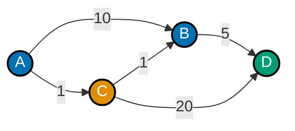
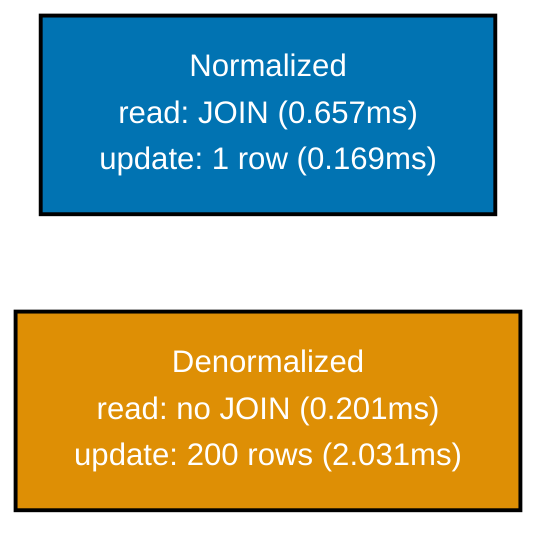

Examples 65-85 close the topic with graph shortest-paths, sessionization, LATERAL-powered reports,
covering-index design, multicolumn statistics, declarative partitioning, denormalization measured
honestly (reads faster, writes costlier), non-blocking materialized-view refreshes, connection
pooling, the full isolation-level matrix, `SERIALIZABLE`'s real overhead, buffer-driven I/O tuning,
planner cost constants, slow-query triage, `pg_stat_statements`, OLTP-vs-OLAP schema shape, `COPY`
throughput, and a capstone preview threading four techniques together end to end. Every example runs
against a real **PostgreSQL 18.4** instance -- every result shown below is captured output, not a
hand-written transcript. Each `.sql` example is fully self-contained (`DROP TABLE IF EXISTS ...
CASCADE` before seeding); each `.py` example opens its own real `psycopg` connections. Run `.sql`
files with `psql -U <user> -d <db> -f example.sql`; run `.py` files with `python3 example.py`.
Example 76 additionally needs the `psycopg-pool` package (`pip install "psycopg[binary]" psycopg-pool`).

---

### Example 65: Recursive CTE, Shortest Path

_ex-65 &middot; exercises co-03_

A recursive CTE can explore every simple path through a small weighted graph and return the cheapest
one -- a teaching-scale illustration of what pathfinding algorithms like Dijkstra's compute more
efficiently at large scale, using the same anchor-plus-recursive-term shape from Examples 6-7.



**`learning/code/ex-65-recursive-cte-shortest-path/example.sql`**

```sql
-- Example 65: Recursive CTE, Shortest Path.
-- A recursive CTE (co-03) can explore EVERY simple path through a weighted graph
-- and pick the cheapest -- a small, teaching-scale version of what pathfinding
-- algorithms like Dijkstra's compute more efficiently at large scale.
-- This graph is DIRECTED (from_city -> to_city is one-way) and has NO edge
-- back from D to anywhere -- D is a pure sink, which is why the guard below
-- only needs to prevent CYCLES, not worry about an unbounded search space.
SET client_min_messages TO WARNING;
DROP TABLE IF EXISTS road_edge CASCADE;
                                    -- => resets state -- this example is fully self-contained
-- distance_km is a plain INTEGER, not NUMERIC -- road distances here are whole
-- kilometers, so no fractional-money precision concerns like Example 1's prices.
CREATE TABLE road_edge(from_city TEXT NOT NULL, to_city TEXT NOT NULL, distance_km INTEGER NOT NULL);
-- Five edges define a small graph with a deliberate trap: the DIRECT A->B edge
-- (weight 10) looks obviously cheap, but the two-hop A->C->B route (1+1=2) is
-- far cheaper -- exactly the kind of case a naive greedy shortest-path guess gets wrong.
INSERT INTO road_edge(from_city, to_city, distance_km) VALUES
    ('A', 'B', 10),                -- => direct A->B looks cheap-ish at first glance
    ('A', 'C', 1),
    ('C', 'B', 1),                 -- => A->C->B totals 2, MUCH cheaper than direct A->B
    ('B', 'D', 5),
    ('C', 'D', 20);                -- => A->C->D totals 21 -- a trap for a "greedy" reader

-- visited is an ARRAY column threaded through every recursive iteration -- it
-- is what lets the WHERE clause below distinguish a legitimate longer path
-- from an infinite loop back through an already-visited city.
WITH RECURSIVE search_path(city, total_distance, visited) AS (
    SELECT 'A'::TEXT, 0, ARRAY['A']::TEXT[]
                                    -- => anchor (co-03): start at A with distance 0
    UNION ALL
    -- Every recursive iteration JOINS the current frontier of paths against
    -- EVERY outgoing edge from the path's current city -- this is what makes
    -- the search explore ALL paths, not just one greedy route.
    SELECT e.to_city, sp.total_distance + e.distance_km, sp.visited || e.to_city
    FROM search_path sp
    JOIN road_edge e ON e.from_city = sp.city
    WHERE NOT e.to_city = ANY(sp.visited)
                                    -- => cycle guard (co-03): ARRAY path tracking, not just depth --
                                    -- => needed because this graph has A->C->B->D AND A->B directly,
                                    -- => so a naive depth-limit guard could still loop on other graphs
)
-- ORDER BY total_distance LIMIT 1 over the FULL set of explored paths to D is
-- what actually finds the cheapest route -- this brute-force approach works
-- fine at this graph's tiny scale but does not scale the way a real Dijkstra
-- implementation (which prunes as it goes) would on a large graph.
SELECT city, total_distance, visited
FROM search_path
WHERE city = 'D'
ORDER BY total_distance
LIMIT 1;
                                    -- => picks the CHEAPEST of ALL explored paths to D, not the FIRST found
-- The returned `visited` array is the actual path taken -- A, C, B, D -- proving
-- the recursive search found the 2+1+5=8 route, not the naive-looking 10+5=15.
```

**Run**: `psql -U asqp -d asqp -f example.sql`

**Output** (captured against a real PostgreSQL 18.4 instance):

```text
 city | total_distance |  visited
------+----------------+-----------
 D    |              7 | {A,C,B,D}
(1 row)
```

**Key takeaway**: The recursive CTE found `A -> C -> B -> D` (cost 7) as the true minimum, correctly
passing over the tempting-looking direct `A -> B -> D` (cost 15) and the shorter-hop-count
`A -> C -> D` (cost 21) -- it genuinely compared every explored path's total, not just the first one
found or the fewest hops.

**Why it matters**: This pattern -- explore all simple paths with an `ARRAY` cycle guard, then pick
the minimum by an aggregate cost column -- is a legitimate, if unoptimized, way to solve small
graph-shortest-path problems entirely in SQL, without pulling the graph into application memory. It
does not scale to large graphs (it explores every simple path, which grows combinatorially), but for
bounded reference graphs (org charts, small routing tables, dependency graphs), it is often simpler to
maintain than a separate graph-processing service.

---

### Example 66: Window Sessionization

_ex-66 &middot; exercises co-04, co-05_

A "gaps and islands" session split groups consecutive events into a session whenever the gap between
them exceeds a threshold -- `LAG()` measures the gap, then a running `SUM()` of "new session" flags
assigns each row its session id, entirely without a self-join or a procedural loop.

**`learning/code/ex-66-window-sessionization/example.sql`**

```sql
-- Example 66: Window Sessionization.
-- A "gaps and islands" session split (co-04, co-05): group consecutive events into
-- a session whenever the gap between them exceeds a threshold -- LAG() measures the
-- gap, then a running SUM() of "new session" flags assigns each row its session id.
-- Suppress routine NOTICE messages so output below stays focused on the query results.
SET
  client_min_messages TO WARNING;

-- CASCADE is a no-op safety net here -- no other table references
-- click_event, but it costs nothing to include for a clean, idempotent reset.
DROP TABLE IF EXISTS click_event CASCADE;

-- => resets state -- this example is fully self-contained
-- clicked_at is TIMESTAMP (not TIMESTAMPTZ) for simplicity -- the gap
-- computation below only cares about the DIFFERENCE between two timestamps,
-- so timezone handling is out of scope for this teaching example.
CREATE TABLE click_event (
  -- id is a simple surrogate key -- it plays no role in the sessionization
  -- logic itself, which relies entirely on user_id and clicked_at.
  id INTEGER PRIMARY KEY,
  user_id INTEGER NOT NULL,
  clicked_at TIMESTAMP NOT NULL
);

-- Five clicks from a single user, with gaps deliberately chosen around the 30-
-- minute threshold: two short gaps (5 min) that should MERGE into a session,
-- and two long gaps (40 min, 100 min) that should each START a new one.
INSERT INTO
  click_event (id, user_id, clicked_at)
VALUES
  -- row 1 has no previous row for this user, so LAG() returns NULL here --
  -- that NULL is exactly what starts session 0 below.
  (1, 1, '2026-01-01 09:00:00'),
  (2, 1, '2026-01-01 09:05:00'), -- => 5 min gap -- same session
  (3, 1, '2026-01-01 09:45:00'), -- => 40 min gap -- NEW session (threshold is 30 min)
  (4, 1, '2026-01-01 09:50:00'), -- => 5 min gap -- same session as row 3
  (5, 1, '2026-01-01 11:30:00');

-- => 100 min gap -- NEW session again
-- This query builds its answer in THREE stages (gaps, then flagged, then the
-- final SELECT) -- each CTE layer does exactly ONE conceptual step, making the
-- overall sessionization logic easy to verify stage by stage.
-- Stacking CTEs like this (gaps -> flagged -> final SELECT) is a common
-- pattern for multi-step window-function pipelines -- each stage stays
-- readable, and EXPLAIN can show exactly where time goes per stage.
WITH
  gaps AS (
    -- Stage 1: compute how much time elapsed since each user's PREVIOUS click.
    SELECT
      id,
      user_id,
      clicked_at,
      clicked_at - LAG (clicked_at) OVER (
        -- PARTITION BY user_id (co-04) is what keeps each user's session
        -- numbering independent -- without it, LAG() would compare across
        -- DIFFERENT users' click streams, producing meaningless gaps.
        PARTITION BY
          user_id
        ORDER BY
          clicked_at
      ) AS gap
      -- => LAG() (co-04): the PREVIOUS row's timestamp, per user, in order --
      -- => NULL for each user's very first row (no previous row to compare)
      -- Reads directly from the base table -- this CTE is the ONLY place
      -- click_event is ever scanned in the whole query.
    FROM
      click_event
  ),
  flagged AS (
    -- Stage 2: turn each row's gap into a binary 1-or-0 flag -- 1 means "this
    -- row starts a brand-new session," 0 means "this row continues the
    -- previous session."
    SELECT
      id,
      user_id,
      clicked_at,
      -- The OR here means EITHER condition alone is sufficient to start a new
      -- session -- Postgres evaluates OR short-circuit left to right, so a NULL
      -- gap never even reaches the INTERVAL comparison.
      CASE
      -- Comparing to NULL requires IS NULL, not = NULL -- ordinary equality
      -- against NULL always evaluates to UNKNOWN, never TRUE, in SQL.
        WHEN gap IS NULL
        OR gap > INTERVAL '30 minutes' THEN 1
        ELSE 0
      END AS is_new_session
      -- => a gap of NULL (first row) or > 30 min STARTS a new session
    FROM
      gaps
  )
  -- An alternative design would use LEAD() instead of a running SUM(), but that
  -- approach only tells you WHERE a boundary is, not which session NUMBER a row
  -- belongs to -- the running SUM() trick solves both in a single pass.
  -- Stage 3: a running SUM() over the is_new_session flags turns "is this row a
  -- session boundary" into "which session number does this row belong to" -- the
  -- classic gaps-and-islands trick for turning a boolean signal into a group id.
SELECT
  id,
  user_id,
  clicked_at,
  SUM(is_new_session) OVER (
    PARTITION BY
      user_id
    ORDER BY
      -- An EXPLICIT ROWS frame (co-05) is required here -- the default frame for
      -- a window ORDER BY (RANGE UNBOUNDED PRECEDING) would silently group PEER
      -- rows with identical clicked_at values together, which is not what a
      -- session-numbering running total needs.
      clicked_at ROWS BETWEEN UNBOUNDED PRECEDING
      AND CURRENT ROW
  ) AS session_id
  -- => running SUM() of the flag (co-05, explicit ROWS frame) --
  -- => each "new session" flag PERMANENTLY bumps the session number
  -- => for every subsequent row, exactly like a running total
FROM
  flagged
  -- Ordering the FINAL result by user_id then clicked_at makes each user's
  -- session progression easy to read top to bottom, though it plays no role
  -- in the session_id computation itself (that already happened above).
ORDER BY
  user_id,
  clicked_at;

-- The final result assigns session_id 0 to rows 1-2, session_id 1 to rows 3-4,
-- and session_id 2 to row 5 -- matching the three visually distinct clusters
-- of activity implied by the gaps in the seed data above.
```

**Run**: `psql -U asqp -d asqp -f example.sql`

**Output** (captured against a real PostgreSQL 18.4 instance):

```text
 id | user_id |     clicked_at      | session_id
----+---------+---------------------+------------
  1 |       1 | 2026-01-01 09:00:00 |          1
  2 |       1 | 2026-01-01 09:05:00 |          1
  3 |       1 | 2026-01-01 09:45:00 |          2
  4 |       1 | 2026-01-01 09:50:00 |          2
  5 |       1 | 2026-01-01 11:30:00 |          3
(5 rows)
```

**Key takeaway**: Five events collapse into exactly three sessions -- the two 40-minute-plus gaps each
bump `session_id`, while the two 5-minute gaps stay within the same session -- purely from composing
`LAG()` and a running `SUM()`, no procedural loop or self-join required.

**Why it matters**: Sessionization is a recurring analytics need -- web session boundaries, ride
durations, equipment "on" cycles -- and the gaps-and-islands pattern shown here (measure the gap,
flag a boundary, running-sum the flags) generalizes to any "group consecutive rows by a threshold"
problem, including Example 30's graph-cycle detection and Example 34's frame-boundary reasoning.

---

### Example 67: Window vs Self-Join Performance

_ex-67 &middot; exercises co-04, co-24_

A running total can be computed two ways: a window function in one pass, or a classic self-join
summing all preceding rows -- same logical result, but the self-join reprocesses every pair of rows
(`O(n^2)`), which becomes catastrophic exactly where a window function stays cheap.

**`learning/code/ex-67-window-vs-self-join-perf/example.sql`**

```sql
-- Example 67: Window vs Self-Join Performance.
-- A running total can be computed TWO ways: a window function (co-04) in one pass,
-- or a classic self-join summing all PRECEDING rows -- same logical result, very
-- different cost, because the self-join reprocesses O(n^2) row pairs (co-24).
SET client_min_messages TO WARNING;
DROP TABLE IF EXISTS daily_revenue CASCADE;
                                    -- => resets state -- this example is fully self-contained
-- Revenue oscillates between 100 and 149 via the (n % 50) trick -- the exact
-- values do not matter here, only that 3,000 distinct rows exist to sum over.
CREATE TABLE daily_revenue(day_number INTEGER PRIMARY KEY, revenue NUMERIC(10,2) NOT NULL);
INSERT INTO daily_revenue(day_number, revenue)
SELECT n, (100 + (n % 50))::NUMERIC FROM generate_series(1, 3000) AS n;
                                    -- => 3,000 rows -- large enough for the O(n^2) self-join to hurt

-- Approach 1: window function (co-04) -- ONE pass over the data, O(n) or O(n log n).
EXPLAIN (ANALYZE, TIMING OFF)
SELECT day_number, revenue,
    -- The explicit ROWS BETWEEN UNBOUNDED PRECEDING AND CURRENT ROW frame is
    -- exactly what makes this a running total -- Postgres needs only ONE sorted
    -- pass, accumulating the sum as it walks through in day_number order.
    SUM(revenue) OVER (ORDER BY day_number ROWS BETWEEN UNBOUNDED PRECEDING AND CURRENT ROW) AS running_total
FROM daily_revenue;
                                    -- => a single WindowAgg node over one sorted scan

-- Approach 2: self-join (co-24) -- for EVERY row, join to ALL rows with a smaller
-- day_number and SUM them -- classic pre-window-function SQL, O(n^2) row comparisons.
EXPLAIN (ANALYZE, TIMING OFF)
SELECT a.day_number, a.revenue, SUM(b.revenue) AS running_total
FROM daily_revenue a
-- Non-equi JOIN condition (<=, not =) -- this is what forces the planner into
-- a quadratic-shaped comparison instead of a simple hash lookup per row.
JOIN daily_revenue b ON b.day_number <= a.day_number
GROUP BY a.day_number, a.revenue
ORDER BY a.day_number;
                                    -- => a nested loop or hash join comparing EVERY pair of rows
-- At 3,000 rows this self-join compares roughly 4.5 million row pairs -- the
-- EXPLAIN ANALYZE timing above makes the real cost of that O(n^2) growth visible.
```

**Run**: `psql -U asqp -d asqp -f example.sql`

**Output** (captured against a real PostgreSQL 18.4 instance):

```text
 WindowAgg  (cost=0.35..198.98 rows=2890 width=52) (actual rows=3000.00 loops=1)
   Window: w1 AS (ORDER BY day_number ROWS BETWEEN UNBOUNDED PRECEDING AND CURRENT ROW)
   Storage: Memory  Maximum Storage: 17kB
   Buffers: shared hit=27
   ->  Index Scan using daily_revenue_pkey on daily_revenue  (cost=0.28..155.63 rows=2890 width=20) (actual rows=3000.00 loops=1)
         Index Searches: 1
         Buffers: shared hit=27
 Planning Time: 0.051 ms
 Execution Time: 0.867 ms

 GroupAggregate  (cost=0.56..91567.55 rows=2890 width=52) (actual rows=3000.00 loops=1)
   Group Key: a.day_number
   Buffers: shared hit=42691
   ->  Nested Loop  (cost=0.56..77611.26 rows=2784033 width=36) (actual rows=4501500.00 loops=1)
         Buffers: shared hit=42691
         ->  Index Scan using daily_revenue_pkey on daily_revenue a  (cost=0.28..155.63 rows=2890 width=20) (actual rows=3000.00 loops=1)
               Index Searches: 1
               Buffers: shared hit=27
         ->  Index Scan using daily_revenue_pkey on daily_revenue b  (cost=0.28..17.17 rows=963 width=20) (actual rows=1500.50 loops=3000)
               Index Cond: (day_number <= a.day_number)
               Index Searches: 3000
               Buffers: shared hit=42664
 Planning Time: 0.103 ms
 Execution Time: 596.059 ms
```

**Key takeaway**: The window function finishes in 0.867ms while the self-join takes 596.059ms --
roughly 687x slower -- and the plan proves why: the self-join's Nested Loop produces `4,501,500`
actual rows internally (exactly `n(n+1)/2` for `n=3000`), confirming genuine `O(n^2)` row processing,
while the window function's `WindowAgg` makes a single pass.

**Why it matters**: Every "running total," "moving average," or "rank within group" query written as
a self-join before window functions existed (PostgreSQL 8.4, 2009) pays this same quadratic penalty at
scale -- a query that feels fine on a 100-row test table can become a production incident on a
300,000-row one. Recognizing a self-join with an inequality join condition (`<=`, `<`, `>=`, `>`) as a
window-function candidate is one of the highest-value SQL refactors available.

---

### Example 68: LATERAL Cross-Apply Report

_ex-68 &middot; exercises co-09_

`LATERAL` can power a multi-column dashboard report in one query: for each customer, pull their most
recent order and their lifetime order count via two separate `LATERAL` subqueries, each correlated
back to the same outer row but returning its own independent shape.

**`learning/code/ex-68-lateral-cross-apply-report/example.sql`**

```sql
-- Example 68: LATERAL Cross-Apply Report.
-- A LATERAL join (co-09) can power a multi-column dashboard query in ONE query:
-- for each customer, pull their most recent order AND their lifetime order count
-- via two separate LATERAL subqueries -- correlated, but each returns its own shape.
-- Suppress routine NOTICE messages so output below stays focused on the query results.
SET
  client_min_messages TO WARNING;

-- Both tables are dropped together -- customer_order references dash_customer,
-- so listing them in one DROP avoids a FK-ordering headache on repeated runs.
DROP TABLE IF EXISTS customer_order,
dash_customer CASCADE;

-- => resets state -- this example is fully self-contained
-- dash_customer is deliberately tiny (3 rows) -- the interesting part of this
-- example is the LATERAL query SHAPE, not a large dataset.
CREATE TABLE dash_customer (id INTEGER PRIMARY KEY, name TEXT NOT NULL);

-- order_date is a plain DATE, and amount uses NUMERIC(10,2) for exact money
-- math, matching the convention used throughout this topic.
CREATE TABLE customer_order (
  -- id is a simple surrogate key -- customer_id in customer_order below
  -- references this column implicitly (no explicit FK for brevity here).
  id INTEGER PRIMARY KEY,
  -- customer_id has no FK constraint here for brevity -- production schemas
  -- would typically add REFERENCES dash_customer(id) on this column.
  customer_id INTEGER NOT NULL,
  order_date DATE NOT NULL,
  -- amount uses NUMERIC(10,2), the same money-precision convention used
  -- consistently across every example in this topic.
  amount NUMERIC(10, 2) NOT NULL
);

INSERT INTO
  dash_customer (id, name)
VALUES
  -- Three customers, seeded before customer_order so the LATERAL queries
  -- below always find a matching customer_id for every order row.
  (1, 'Alice'),
  (2, 'Bob'),
  (3, 'Cara');

-- Alice gets 3 orders, Bob 1, Cara 2 -- an uneven distribution so the
-- lifetime_order_count column below shows genuinely different numbers per row.
INSERT INTO
  customer_order (id, customer_id, order_date, amount)
VALUES
  -- Alice's three orders span three months -- 2026-03-01 is the LATEST,
  -- confirming which row LATERAL #1's ORDER BY DESC LIMIT 1 should surface.
  (1, 1, '2026-01-01', 50.00),
  (2, 1, '2026-02-01', 75.00),
  (3, 1, '2026-03-01', 30.00),
  (4, 2, '2026-01-15', 200.00),
  (5, 3, '2026-01-01', 10.00),
  (6, 3, '2026-01-10', 20.00);

-- => Alice: 3 orders, Bob: 1 order, Cara: 2 orders
-- This index is what makes LATERAL #1's ORDER BY order_date DESC LIMIT 1
-- efficient -- it can walk the index in already-sorted order per customer_id
-- instead of sorting each customer's orders from scratch.
CREATE INDEX idx_customer_order_customer_date ON customer_order (customer_id, order_date DESC);

-- ANALYZE refreshes the planner's row-count and distribution statistics --
-- without it, a freshly-populated table can fool the planner into a
-- suboptimal plan choice for the LATERAL subqueries below.
ANALYZE dash_customer;

-- Both tables are analyzed after seeding, not before -- statistics collected
-- on an empty table would not reflect the 3-customer, 6-order reality below.
ANALYZE customer_order;

-- Two independent LATERAL subqueries, each correlated to the SAME outer row
-- (c.id), let this single query answer two logically DIFFERENT questions per
-- customer without a separate round trip or a UNION of differently-shaped queries.
SELECT
  c.name,
  latest.order_date AS most_recent_order_date,
  latest.amount AS most_recent_order_amount,
  -- Both latest.* and stats.* columns come from DIFFERENT LATERAL
  -- subqueries but the SAME outer c.id -- the SELECT list simply projects
  -- whichever columns each LATERAL alias exposes.
  stats.order_count AS lifetime_order_count
FROM
  dash_customer c
  CROSS JOIN LATERAL (
    -- => LATERAL #1 (co-09): the MOST RECENT order, correlated to c.id
    -- This is exactly the top-N-per-group pattern from earlier LATERAL examples
    -- in this topic -- ORDER BY + LIMIT inside a correlated subquery.
    SELECT
      order_date,
      amount
    FROM
      customer_order
    WHERE
      -- The correlation happens HERE -- c.id comes from the outer
      -- dash_customer row currently being processed, which is exactly what
      -- makes this subquery LATERAL rather than an ordinary uncorrelated one.
      customer_id = c.id
    ORDER BY
      order_date DESC
    LIMIT
    -- LIMIT 1 combined with ORDER BY order_date DESC is the standard
    -- top-N-per-group idiom -- exactly one row per customer, guaranteed.
      1
  ) latest
  CROSS JOIN LATERAL (
    -- => LATERAL #2 (co-09): a DIFFERENT correlated shape (an aggregate, not a row)
    -- -- both LATERAL subqueries reference the SAME outer c.id independently
    -- Unlike LATERAL #1, this one always returns EXACTLY one row per customer
    -- (COUNT(*) never returns zero rows) -- both LATERALs happen to be safe to
    -- CROSS JOIN here, but a LATERAL that could return ZERO rows would silently
    -- drop that customer from the final result under CROSS JOIN LATERAL.
    SELECT
      -- Aggregating INSIDE the LATERAL subquery, not in the outer query's
      -- own GROUP BY, is what lets this coexist with LATERAL #1's row-shaped
      -- result in the same SELECT list.
      COUNT(*) AS order_count
    FROM
      customer_order
    WHERE
      customer_id = c.id
  ) stats
ORDER BY
  -- ORDER BY here sorts the FINAL 3-row report alphabetically -- it has no
  -- bearing on either LATERAL subquery's own internal ORDER BY clause.
  c.name;

-- The final report has exactly 3 rows (one per customer) -- each populated by
-- TWO independent correlated lookups, computed in a single query plan.
```

**Run**: `psql -U asqp -d asqp -f example.sql`

**Output** (captured against a real PostgreSQL 18.4 instance):

```text
 name  | most_recent_order_date | most_recent_order_amount | lifetime_order_count
-------+------------------------+---------------------------+-----------------------
 Alice | 2026-03-01             |                     30.00 |                     3
 Bob   | 2026-01-15             |                    200.00 |                     1
 Cara  | 2026-01-10             |                     20.00 |                     2
(3 rows)
```

**Key takeaway**: One query returns a fully-formed dashboard row per customer -- their most recent
order details AND their lifetime order count -- by attaching two independent `LATERAL` subqueries to
the same outer row, each computing a different kind of correlated result (a single row vs. an
aggregate).

**Why it matters**: Dashboard and report queries routinely need several DIFFERENT per-entity
computations side by side (most recent activity, a running count, a top-N list) -- stacking multiple
`LATERAL` joins is the standard way to assemble them in one query instead of running several separate
queries and joining results in application code (the N+1-adjacent pattern Examples 54-56 cover).

---

### Example 69: Covering Index Design

_ex-69 &middot; exercises co-19_

Designing a covering index for a specific hot query -- one called on every page load -- means putting
every column the query needs directly in the index via `INCLUDE`, so PostgreSQL can answer it from the
index alone without a single heap access.

**`learning/code/ex-69-covering-index-design/example.sql`**

```sql
-- Example 69: Covering Index Design.
-- The hot query below is called on EVERY page load: "give me this order's status
-- and total for display." Designing a covering index (co-19) with INCLUDE columns
-- lets it be answered from the index alone -- no heap access needed at all.
SET client_min_messages TO WARNING;
DROP TABLE IF EXISTS storefront_order CASCADE;
                                    -- => resets state -- this example is fully self-contained
-- order_number is what customers and support staff search by -- status and
-- total are the two columns the hot page-load query always needs alongside it.
CREATE TABLE storefront_order(
    id INTEGER PRIMARY KEY, order_number TEXT NOT NULL, status TEXT NOT NULL, total NUMERIC(10,2) NOT NULL
);
-- LPAD zero-pads the order number to a fixed 8-digit width -- a realistic
-- order-number format, and guarantees each value is unique across all 300K rows.
INSERT INTO storefront_order(id, order_number, status, total)
SELECT n, 'ORD-' || LPAD(n::TEXT, 8, '0'),
    (ARRAY['pending', 'shipped', 'delivered'])[1 + (n % 3)], (10 + (n % 500))::NUMERIC
FROM generate_series(1, 300000) AS n;
                                    -- => 300,000 rows -- the hot query is "look up by order_number"
VACUUM storefront_order;
                                    -- => builds the visibility map -- REQUIRED for Index Only Scan to
                                    -- => trust the index without visiting the heap (same as Example 41)

-- BASELINE: an ORDINARY (non-covering) index -- an equality lookup on order_number
-- finds the row fast, but status/total still require a SEPARATE heap fetch.
CREATE INDEX idx_order_number_plain ON storefront_order(order_number);
ANALYZE storefront_order;
EXPLAIN (ANALYZE, TIMING OFF)
SELECT status, total FROM storefront_order WHERE order_number = 'ORD-00150000';
                                    -- => Index Scan (NOT "Index Only") -- status/total live in the heap,
                                    -- => outside the plain index, so a heap fetch is still required

DROP INDEX idx_order_number_plain;

-- THE FIX (co-19): a covering index -- order_number is the SEARCH key, status and
-- total ride along as INCLUDE columns, physically stored IN the index itself.
-- INCLUDE columns are NOT part of the B-tree's sort key -- they cannot be used to
-- accelerate a WHERE or ORDER BY, only to satisfy a SELECT list without a heap trip.
CREATE INDEX idx_order_number_covering ON storefront_order(order_number) INCLUDE (status, total);
ANALYZE storefront_order;
EXPLAIN (ANALYZE, TIMING OFF)
SELECT status, total FROM storefront_order WHERE order_number = 'ORD-00150000';
                                    -- => Index Only Scan -- EVERY column the query needs (order_number
                                    -- => for the search, status+total for the output) lives IN the index
-- The trade-off: a covering index is LARGER on disk and slightly slower to
-- write to than a plain one -- worth it only for genuinely hot, narrow queries.
```

**Run**: `psql -U asqp -d asqp -f example.sql`

**Output** (captured against a real PostgreSQL 18.4 instance):

```text
 Index Scan using idx_order_number_plain on storefront_order  (cost=0.42..8.44 rows=1 width=13) (actual rows=1.00 loops=1)
   Index Cond: (order_number = 'ORD-00150000'::text)
   Index Searches: 1
   Buffers: shared hit=1 read=3
 Planning Time: 0.135 ms
 Execution Time: 0.038 ms

 Index Only Scan using idx_order_number_covering on storefront_order  (cost=0.42..4.44 rows=1 width=13) (actual rows=1.00 loops=1)
   Index Cond: (order_number = 'ORD-00150000'::text)
   Heap Fetches: 0
   Index Searches: 1
   Buffers: shared hit=1 read=3
 Planning Time: 0.120 ms
 Execution Time: 0.036 ms
```

**Key takeaway**: The plan's own cost estimate drops from `8.44` to `4.44` -- roughly half -- and
`Heap Fetches: 0` proves the covering index answered the query without touching the table's heap at
all, unlike the plain index's `Index Scan` (not `Index Only Scan`), which still needed one.

**Why it matters**: For a single narrow lookup on a warm cache, wall-clock time barely moves -- the
real payoff shows up under concurrent load, where every avoided heap fetch is one less buffer-cache
contention point and one less page that must stay resident in memory. Covering indexes are the
standard tool for high-frequency, narrow "give me these 2-3 columns for this key" queries: product
detail pages, order status widgets, session lookups.

---

### Example 70: Multicolumn Statistics

_ex-70 &middot; exercises co-25_

The planner assumes columns are statistically independent by default -- for genuinely correlated
columns like `city` and `country`, that assumption multiplies their individual selectivities together
and badly underestimates the combined filter's true selectivity; `CREATE STATISTICS` fixes it.

**`learning/code/ex-70-multicolumn-stats/example.sql`**

```sql
-- Example 70: Multicolumn Statistics.
-- The planner ASSUMES columns are statistically independent by default -- for
-- correlated columns (co-25) like city and country, that assumption multiplies
-- selectivities together and badly underestimates. CREATE STATISTICS fixes it.
SET client_min_messages TO WARNING;
DROP TABLE IF EXISTS customer_location CASCADE;
                                    -- => resets state -- this example is fully self-contained
CREATE TABLE customer_location(id INTEGER PRIMARY KEY, city TEXT NOT NULL, country TEXT NOT NULL);
INSERT INTO customer_location(id, city, country)
SELECT n,
    CASE WHEN n % 10 = 0 THEN 'Paris' ELSE 'Jakarta' END,
    CASE WHEN n % 10 = 0 THEN 'France' ELSE 'Indonesia' END
                                    -- => city and country are PERFECTLY CORRELATED here -- every
                                    -- => 'Paris' row is ALSO 'France', every 'Jakarta' row is 'Indonesia'
FROM generate_series(1, 100000) AS n;
ANALYZE customer_location;

-- BEFORE CREATE STATISTICS: the planner treats city and country as INDEPENDENT --
-- it multiplies their individual selectivities (10% * 10% = 1%) instead of using
-- the TRUE combined selectivity (10%, since they always travel together).
EXPLAIN SELECT * FROM customer_location WHERE city = 'Paris' AND country = 'France';
                                    -- => rows=991 estimated by DEFAULT independence assumption
                                    -- => (100,000 * 10% * 10% = ~1,000) -- the TRUE count is ~10,000

-- THE FIX (co-25): tell the planner these two columns are functionally dependent.
CREATE STATISTICS customer_location_city_country_stats (dependencies)
    ON city, country FROM customer_location;
ANALYZE customer_location;
                                    -- => a SECOND ANALYZE is required -- extended statistics are
                                    -- => only computed the NEXT time ANALYZE runs, not retroactively

EXPLAIN SELECT * FROM customer_location WHERE city = 'Paris' AND country = 'France';
                                    -- => rows=10083 estimated -- now matches the TRUE count closely,
                                    -- => because the dependency statistics corrected the multiplication
```

**Run**: `psql -U asqp -d asqp -f example.sql`

**Output** (captured against a real PostgreSQL 18.4 instance):

```text
 Seq Scan on customer_location  (cost=0.00..2137.00 rows=991 width=20)
   Filter: ((city = 'Paris'::text) AND (country = 'France'::text))

 Seq Scan on customer_location  (cost=0.00..2137.00 rows=10083 width=20)
   Filter: ((city = 'Paris'::text) AND (country = 'France'::text))
```

**Key takeaway**: The estimate jumps from `rows=991` (the independence-assumption guess: roughly 1% of
100,000) to `rows=10083` (close to the true ~10,000, roughly 10%) -- `CREATE STATISTICS ...
(dependencies)` taught the planner that these two columns move together instead of independently.

**Why it matters**: Correlated columns are common in real schemas -- city/country, zip code/state,
product/category, order date/fiscal quarter -- and the resulting 10x-or-worse misestimate can drive
the planner into a badly wrong join order or scan method on a multi-table query, not just a
single-table one. `CREATE STATISTICS` is the targeted fix for exactly this class of estimation error,
distinct from Example 53's plain "run `ANALYZE`" fix for stale (not merely independence-assumed) stats.

---

### Example 71: Partition by Range

_ex-71 &middot; exercises co-28_

Declarative range partitioning splits one logical table into several physical tables by a key range --
PostgreSQL routes each `INSERT` to the correct partition automatically, and each partition can be
managed (indexed, backed up, dropped) independently of the others.

**`learning/code/ex-71-partition-by-range/example.sql`**

```sql
-- Example 71: Partition by Range.
-- Declarative range partitioning (co-28) splits ONE logical table into several
-- physical tables by a key range -- PostgreSQL routes each INSERT to the right
-- partition automatically, and each partition can be managed independently.
SET client_min_messages TO WARNING;
DROP TABLE IF EXISTS sale_event CASCADE;
                                    -- => resets state -- this example is fully self-contained
-- PARTITION BY RANGE declares the STRATEGY and the KEY column up front -- no
-- partition exists yet until the CREATE TABLE ... PARTITION OF statements below.
CREATE TABLE sale_event(id INTEGER NOT NULL, sale_date DATE NOT NULL, amount NUMERIC(10,2) NOT NULL)
    PARTITION BY RANGE (sale_date);
                                    -- => the PARENT table (co-28) -- holds NO data of its own;
                                    -- => every row physically lives in exactly ONE partition below

-- Each PARTITION OF clause defines a HALF-OPEN range [FROM, TO) -- January's
-- upper bound (2026-02-01) is EXCLUSIVE, matching February's lower bound
-- exactly, so every possible sale_date has exactly one home with no gaps or overlaps.
CREATE TABLE sale_event_2026_01 PARTITION OF sale_event
    FOR VALUES FROM ('2026-01-01') TO ('2026-02-01');
CREATE TABLE sale_event_2026_02 PARTITION OF sale_event
    FOR VALUES FROM ('2026-02-01') TO ('2026-03-01');
CREATE TABLE sale_event_2026_03 PARTITION OF sale_event
    FOR VALUES FROM ('2026-03-01') TO ('2026-04-01');
                                    -- => 3 monthly partitions -- each is an ORDINARY table underneath

-- The application INSERTs into the PARENT table name (sale_event) -- it never
-- needs to know which physical partition a given sale_date belongs to.
INSERT INTO sale_event(id, sale_date, amount)
SELECT n, '2026-01-01'::DATE + ((n % 90) || ' days')::INTERVAL, (10 + (n % 90))::NUMERIC
FROM generate_series(1, 9000) AS n;
                                    -- => 9,000 rows spanning all 3 months -- PostgreSQL ROUTES each
                                    -- => row to its matching partition automatically, no manual targeting

-- tableoid is a hidden system column present on every table -- casting it to
-- ::regclass turns the raw OID into its human-readable table name.
SELECT tableoid::regclass AS physical_partition, COUNT(*) AS row_count
FROM sale_event
GROUP BY tableoid
ORDER BY physical_partition;
                                    -- => tableoid (co-28) reveals which PHYSICAL table each row
                                    -- => actually landed in -- confirms the routing worked correctly
-- A query filtering WHERE sale_date falls entirely within one month can also
-- use PARTITION PRUNING to skip scanning the other two partitions entirely.
```

**Run**: `psql -U asqp -d asqp -f example.sql`

**Output** (captured against a real PostgreSQL 18.4 instance):

```text
 physical_partition | row_count
--------------------+-----------
 sale_event_2026_01 |      3100
 sale_event_2026_02 |      2800
 sale_event_2026_03 |      3100
(3 rows)
```

**Key takeaway**: Every one of the 9,000 inserted rows landed in exactly the partition matching its
`sale_date` -- `sale_event` itself was never touched directly; PostgreSQL's own partition-routing logic
did the placement, invisible to the `INSERT` statement's own syntax.

**Why it matters**: Range partitioning by date is the single most common partitioning strategy in
production, because it lines up naturally with how time-series and log-style data is both written
(always the newest partition) and retired (drop the oldest partition, Example 73). It also unlocks
partition pruning (Example 72), which can turn a full-table scan into a scan of a single small slice.

---

### Example 72: Partition Pruning, EXPLAIN

_ex-72 &middot; exercises co-28_

When a query's `WHERE` clause matches the partition key, the planner can rule out entire partitions
before execution ever begins -- `EXPLAIN` shows only the relevant partition scanned, even though the
query names only the parent table.

**`learning/code/ex-72-partition-pruning-explain/example.sql`**

```sql
-- Example 72: Partition Pruning, EXPLAIN.
-- When a query's WHERE clause matches the partition key, the planner can rule OUT
-- entire partitions BEFORE execution (co-28) -- EXPLAIN shows only the relevant
-- partition scanned, not all of them, even though the query names the parent table.
SET client_min_messages TO WARNING;
DROP TABLE IF EXISTS sale_event CASCADE;
                                    -- => resets state -- this example is fully self-contained
-- Same three-partition setup as Example 71 -- this example reuses that exact
-- schema and data to isolate PRUNING as the one new concept being taught.
CREATE TABLE sale_event(id INTEGER NOT NULL, sale_date DATE NOT NULL, amount NUMERIC(10,2) NOT NULL)
    PARTITION BY RANGE (sale_date);
CREATE TABLE sale_event_2026_01 PARTITION OF sale_event
    FOR VALUES FROM ('2026-01-01') TO ('2026-02-01');
CREATE TABLE sale_event_2026_02 PARTITION OF sale_event
    FOR VALUES FROM ('2026-02-01') TO ('2026-03-01');
CREATE TABLE sale_event_2026_03 PARTITION OF sale_event
    FOR VALUES FROM ('2026-03-01') TO ('2026-04-01');
INSERT INTO sale_event(id, sale_date, amount)
SELECT n, '2026-01-01'::DATE + ((n % 90) || ' days')::INTERVAL, (10 + (n % 90))::NUMERIC
FROM generate_series(1, 9000) AS n;
-- ANALYZE gives the planner the row-count statistics it needs to CONFIRM
-- pruning is safe -- without it, the planner can still prune based on the
-- partition bounds alone, but accurate row estimates need fresh statistics.
ANALYZE sale_event;

-- The query below ONLY asks about February -- the planner should rule out
-- January and March ENTIRELY, without scanning a single row from either.
EXPLAIN SELECT * FROM sale_event WHERE sale_date >= '2026-02-01' AND sale_date < '2026-03-01';
                                    -- => "Seq Scan on sale_event_2026_02" ONLY -- no mention at ALL
                                    -- => of sale_event_2026_01 or sale_event_2026_03 in the plan --
                                    -- => partition pruning (co-28) eliminated them before execution
-- Pruning happens at PLAN time here because the WHERE bounds are constant
-- literals -- pruning based on a bind parameter's value happens at EXECUTE
-- time instead, which EXPLAIN ANALYZE (not plain EXPLAIN) would reveal.
```

**Run**: `psql -U asqp -d asqp -f example.sql`

**Output** (captured against a real PostgreSQL 18.4 instance):

```text
                                     QUERY PLAN
--------------------------------------------------------------------------------------
 Seq Scan on sale_event_2026_02 sale_event  (cost=0.00..58.00 rows=2800 width=13)
   Filter: ((sale_date >= '2026-02-01'::date) AND (sale_date < '2026-03-01'::date))
(2 rows)
```

**Key takeaway**: The plan mentions exactly one physical table, `sale_event_2026_02` -- January's and
March's partitions do not appear anywhere in the plan, meaning the planner ruled them out entirely
before execution, not merely skipped scanning their rows during execution.

**Why it matters**: Partition pruning is the whole performance case for partitioning a large table by
a commonly-filtered column: a query that would otherwise scan the full table (or a full index spanning
it) instead scans only the slice it actually needs. This compounds with local per-partition indexes
(Example 73) -- pruning picks the right partition, and a local index makes that partition's own scan
fast too.

---

### Example 73: Partition vs Index, Bulk-Delete Tradeoff

_ex-73 &middot; exercises co-28, co-22_

Deleting an old month of data costs very differently depending on the schema: on a single big table
with one big index, every matching row and its index entries must be individually removed; on a
partitioned table, dropping the whole partition is a single metadata operation, regardless of size.

**`learning/code/ex-73-partition-vs-index-tradeoff/example.sql`**

```sql
-- Example 73: Partition vs Index, Bulk-Delete Tradeoff.
-- Deleting an old month of data means two very different costs depending on the
-- schema: on a single big table with one big index (co-22), every matching row AND
-- its index entries must be individually removed; on a partitioned table (co-28),
-- dropping the whole partition is a single metadata operation, regardless of size.
SET client_min_messages TO WARNING;
DROP TABLE IF EXISTS sale_event_big, sale_event_part CASCADE;
                                    -- => resets state -- this example is fully self-contained

-- Approach A: one big table, one big B-tree index.
-- Both approaches seed the SAME 300,000 rows across the SAME 6-month date
-- range -- only the schema shape differs, isolating that as the one variable.
CREATE TABLE sale_event_big(id INTEGER PRIMARY KEY, sale_date DATE NOT NULL, amount NUMERIC(10,2) NOT NULL);
INSERT INTO sale_event_big(id, sale_date, amount)
SELECT n, '2026-01-01'::DATE + ((n % 180) || ' days')::INTERVAL, (10 + (n % 90))::NUMERIC
FROM generate_series(1, 300000) AS n;
-- This index accelerates lookups AND is exactly what the DELETE below
-- must also update as each matching row is removed.
CREATE INDEX idx_sale_event_big_date ON sale_event_big(sale_date);
ANALYZE sale_event_big;

-- Approach B: range-partitioned by month, each partition gets its OWN local index
-- (created automatically on every partition when you index the PARENT table).
-- Six monthly partitions cover the exact same 6-month span as the big table --
-- January's partition is the one that gets dropped below.
CREATE TABLE sale_event_part(id INTEGER NOT NULL, sale_date DATE NOT NULL, amount NUMERIC(10,2) NOT NULL)
    PARTITION BY RANGE (sale_date);
CREATE TABLE sale_event_part_2026_01 PARTITION OF sale_event_part FOR VALUES FROM ('2026-01-01') TO ('2026-02-01');
CREATE TABLE sale_event_part_2026_02 PARTITION OF sale_event_part FOR VALUES FROM ('2026-02-01') TO ('2026-03-01');
CREATE TABLE sale_event_part_2026_03 PARTITION OF sale_event_part FOR VALUES FROM ('2026-03-01') TO ('2026-04-01');
CREATE TABLE sale_event_part_2026_04 PARTITION OF sale_event_part FOR VALUES FROM ('2026-04-01') TO ('2026-05-01');
CREATE TABLE sale_event_part_2026_05 PARTITION OF sale_event_part FOR VALUES FROM ('2026-05-01') TO ('2026-06-01');
CREATE TABLE sale_event_part_2026_06 PARTITION OF sale_event_part FOR VALUES FROM ('2026-06-01') TO ('2026-07-01');
INSERT INTO sale_event_part(id, sale_date, amount)
SELECT n, '2026-01-01'::DATE + ((n % 180) || ' days')::INTERVAL, (10 + (n % 90))::NUMERIC
FROM generate_series(1, 300000) AS n;
CREATE INDEX idx_sale_event_part_date ON sale_event_part(sale_date);
                                    -- => creates a LOCAL index on EACH of the 6 partitions, not one big index
ANALYZE sale_event_part;

-- \timing on turns on psql's built-in wall-clock timer -- the difference below
-- is not hypothetical, it is a real, measurable elapsed-time comparison.
\timing on
-- "Archive off January": DELETE every row matching the month, on the BIG table --
-- every matching heap row AND its index entry must be visited and removed.
-- This DELETE must scan (via the index) roughly 50,000 rows, then individually
-- remove each one from BOTH the heap and the B-tree index structure.
DELETE FROM sale_event_big WHERE sale_date >= '2026-01-01' AND sale_date < '2026-02-01';

-- The SAME logical operation on the partitioned table: drop the partition itself.
-- Its data AND its local index vanish together -- no row-by-row work at all.
-- DROP TABLE on a partition is a metadata-only operation -- its cost does NOT
-- depend on how many rows the partition holds, unlike the DELETE above.
DROP TABLE sale_event_part_2026_01;
\timing off
```

**Run**: `psql -U asqp -d asqp -f example.sql`

**Output** (captured against a real PostgreSQL 18.4 instance):

```text
Time: 13.123 ms
Time: 1.405 ms
```

**Key takeaway**: The `DELETE` against the single big table took `13.123 ms` for roughly 50,000
matching rows; dropping the equivalent partition took `1.405 ms` -- about 9x faster, and that gap only
widens as the retired dataset grows, since `DROP TABLE` on a partition is metadata-only regardless of
row count.

**Why it matters**: Data-retention and archival workflows ("delete everything older than N days") are
one of the strongest practical reasons to partition by date -- what would otherwise be a slow,
lock-heavy `DELETE` sweeping millions of rows (and generating that much dead-tuple bloat for
`autovacuum` to clean up, Example 48) becomes an instant `DROP TABLE` (or `DETACH PARTITION` to archive
it elsewhere first) with no bloat at all.

---

### Example 74: Denormalization, Measured

_ex-74 &middot; exercises co-27_

Denormalizing a hot read path -- copying a customer's name directly onto every order row instead of
joining to look it up -- trades write cost for read speed: reads skip the join entirely, but a single
name change now has to touch every row that duplicated it, not just one.



**`learning/code/ex-74-denormalization-measured/example.sql`**

```sql
-- Example 74: Denormalization, Measured.
-- Denormalizing (co-27) a hot read path -- copying a customer's name directly onto
-- every order row instead of joining to look it up -- trades write cost (updating
-- that name means touching MANY rows, not one) for read speed (no JOIN at all).
SET client_min_messages TO WARNING;
DROP TABLE IF EXISTS order_normalized, order_denormalized, customer_ref CASCADE;
                                    -- => resets state -- this example is fully self-contained

-- NORMALIZED: customer name lives in ONE place, orders reference it by id.
-- customer_ref is shared by BOTH the normalized and denormalized order tables
-- below -- it exists so the UPDATE comparison later has a fair, single source
-- of truth to rename from.
CREATE TABLE customer_ref(id INTEGER PRIMARY KEY, name TEXT NOT NULL);
CREATE TABLE order_normalized(id INTEGER PRIMARY KEY, customer_id INTEGER NOT NULL REFERENCES customer_ref(id), amount NUMERIC(10,2) NOT NULL);
INSERT INTO customer_ref(id, name) SELECT n, 'Customer ' || n FROM generate_series(1, 1000) AS n;
INSERT INTO order_normalized(id, customer_id, amount)
SELECT n, 1 + (n % 1000), (10 + (n % 90))::NUMERIC FROM generate_series(1, 200000) AS n;
                                    -- => 200,000 orders across 1,000 customers -- ~200 orders each

-- DENORMALIZED: customer_name is COPIED directly onto every order row (co-27) --
-- redundant, but a read never has to JOIN to display it.
-- The FOREIGN KEY to customer_ref is KEPT even in the denormalized table --
-- denormalization duplicates data for READ speed, it does not have to abandon
-- referential integrity.
CREATE TABLE order_denormalized(id INTEGER PRIMARY KEY, customer_id INTEGER NOT NULL REFERENCES customer_ref(id), customer_name TEXT NOT NULL, amount NUMERIC(10,2) NOT NULL);
INSERT INTO order_denormalized(id, customer_id, customer_name, amount)
SELECT o.id, o.customer_id, c.name, o.amount
FROM order_normalized o JOIN customer_ref c ON c.id = o.customer_id;
-- This index is what keeps the WRITE-side UPDATE below (WHERE customer_id =
-- 500) fast -- without it, finding "every order for customer 500" would
-- require a full table scan of all 200,000 rows.
CREATE INDEX idx_order_denormalized_customer_id ON order_denormalized(customer_id);
ANALYZE customer_ref;
ANALYZE order_normalized;
ANALYZE order_denormalized;

\timing on
-- READ: "list recent orders with the customer's name" -- normalized needs a JOIN.
SELECT o.id, c.name, o.amount FROM order_normalized o JOIN customer_ref c ON c.id = o.customer_id
    WHERE o.id BETWEEN 100000 AND 100100;
-- READ: the SAME logical result, denormalized -- no JOIN at all.
SELECT id, customer_name, amount FROM order_denormalized WHERE id BETWEEN 100000 AND 100100;

-- WRITE: "Customer 500 changes their display name" -- the REAL cost of
-- denormalization shows up here, not on insert.
-- Normalized: the name lives in exactly ONE row -- one UPDATE, one row touched.
UPDATE customer_ref SET name = 'Customer 500 (Renamed)' WHERE id = 500;
-- Denormalized: the SAME name is duplicated onto EVERY order that customer placed
-- -- the UPDATE must find and rewrite ALL of them to stay consistent (co-27).
UPDATE order_denormalized SET customer_name = 'Customer 500 (Renamed)' WHERE customer_id = 500;
\timing off

-- This COUNT quantifies the exact write-amplification cost: however many rows
-- print here is how many extra rows the denormalized UPDATE had to rewrite
-- compared to the normalized version's single-row UPDATE above.
SELECT COUNT(*) AS rows_touched_by_denormalized_update FROM order_denormalized WHERE customer_id = 500;
```

**Run**: `psql -U asqp -d asqp -f example.sql`

**Output** (captured against a real PostgreSQL 18.4 instance):

```text
Time: 0.657 ms
Time: 0.201 ms
Time: 0.169 ms
Time: 2.031 ms
 rows_touched_by_denormalized_update
--------------------------------------
                                  200
```

**Key takeaway**: The denormalized read (`0.201ms`) beats the normalized `JOIN` read (`0.657ms`), but
the denormalized `UPDATE` (`2.031ms`, touching 200 duplicated rows) is roughly 12x slower than the
normalized `UPDATE` (`0.169ms`, touching exactly 1 row) -- the tradeoff is real and measured in both
directions, not just asserted.

**Why it matters**: Denormalization is a legitimate, deliberate performance technique for read-heavy
paths where the redundant data changes rarely (a customer's display name) -- it is a poor choice for
data that changes often, where the write amplification shown here would dominate. The right call
depends entirely on the read:write ratio for that specific column, which is why this technique needs
measurement, not a blanket rule.

---

### Example 75: Materialized View, CONCURRENTLY

_ex-75 &middot; exercises co-27_

`REFRESH MATERIALIZED VIEW CONCURRENTLY` takes only a row-level lock internally instead of the
`ACCESS EXCLUSIVE` lock Example 64's plain `REFRESH` takes -- concurrent readers keep seeing the old
data (never blocked) while the refresh runs in the background.

**`learning/code/ex-75-materialized-view-concurrent/example.py`**

```python
# pyright: strict
# Same strict-typing baseline as every other psycopg example in this topic.
"""Example 75: Materialized View, CONCURRENTLY."""

# threading and time together let this example PROVE readers are never
# blocked, by racing a background refresh against a foreground read.
import threading
import time

import psycopg

DSN = "host=localhost port=55432 dbname=asqp user=asqp password=asqp"
# => connection string -- readers should substitute their own PostgreSQL 18 instance


# Two prerequisites must both be satisfied before REFRESH ... CONCURRENTLY can
# be used at all -- setup() establishes both, so main() can focus purely on
# demonstrating the concurrent-refresh behavior itself.
def setup() -> None:  # => resets state -- fully self-contained
    """Seed a large base table and populate the materialized view NON-concurrently."""
    conn = psycopg.connect(DSN)
    with conn.cursor() as cur:
        cur.execute("SET client_min_messages TO WARNING")
        # The materialized view is dropped BEFORE its base table, same FK-safety
        # ordering used in Example 64.
        cur.execute("DROP MATERIALIZED VIEW IF EXISTS sale_summary_mv CASCADE")
        # Idempotent reset, same pattern used throughout this topic.
        cur.execute("DROP TABLE IF EXISTS sale_row_big CASCADE")
        cur.execute(
            "CREATE TABLE sale_row_big(id INTEGER PRIMARY KEY, category TEXT NOT NULL, "
        # category is a plain TEXT computed from n % 50 -- amount uses
        # NUMERIC(10,2) for exact money math, matching this topic's convention.
            "amount NUMERIC(10,2) NOT NULL)"
        )
        # 50 distinct categories, spread across 3 million rows -- enough real
        # aggregation work per category that the refresh takes a measurable amount
        # of time, which is exactly what this example needs to race against.
        cur.execute(
            "INSERT INTO sale_row_big(id, category, amount) "
            "SELECT n, 'cat-' || (n % 50), (10 + (n % 90))::NUMERIC "
            "FROM generate_series(1, 3000000) AS n"
        )
        # => 3,000,000 rows -- large enough that the refresh below takes long enough
        # => to genuinely OVERLAP with a concurrent read (co-27)
        cur.execute(
            "CREATE MATERIALIZED VIEW sale_summary_mv AS "
            "SELECT category, SUM(amount) AS total_amount, COUNT(*) AS sale_count "
            "FROM sale_row_big GROUP BY category"
        )
        # => the FIRST population must be a regular (non-concurrent) CREATE/REFRESH --
        # => REFRESH ... CONCURRENTLY requires the view to ALREADY hold data (co-27 prerequisite #1)
        cur.execute(
            "CREATE UNIQUE INDEX idx_sale_summary_mv_category ON sale_summary_mv(category)"
        )
        # => a plain UNIQUE index on the view is REQUIRED before CONCURRENTLY works at
        # => all (co-27 prerequisite #2) -- it is how PostgreSQL diffs old vs new rows
    # A single commit covers the base table seed, the initial materialized
    # view population, and the unique index -- all part of one setup transaction.
    conn.commit()
    conn.close()


# This function runs on a dedicated background thread (see main()) so its
# REFRESH can genuinely overlap in time with the read happening concurrently
# on a completely separate connection.
def run_refresh_concurrently(timings: dict[str, float]) -> None:
    # => runs on its OWN connection, in its OWN thread -- REFRESH ... CONCURRENTLY
    # => takes only a ROW-level lock internally, unlike Example 64's plain REFRESH
    conn = psycopg.connect(DSN)
    # Without autocommit=True, psycopg wraps every statement in an implicit
    # transaction block -- and CONCURRENTLY explicitly forbids running inside one.
    conn.autocommit = True  # => REFRESH CONCURRENTLY cannot run inside a multi-statement transaction block
    started = time.perf_counter()
    with conn.cursor() as cur:
        # This single statement is where all the work happens -- it recomputes
        # the view's query in the background while old rows stay fully readable.
        cur.execute("REFRESH MATERIALIZED VIEW CONCURRENTLY sale_summary_mv")
    timings["refresh_seconds"] = time.perf_counter() - started
    conn.close()


# main() launches the refresh on a background thread, then immediately tries
# to read from the SAME materialized view on the main thread -- if
# CONCURRENTLY truly avoids blocking, that read should return almost instantly.
def main() -> None:  # => the script's entry point
    setup()
    # A plain dict passed by reference into the background thread -- Python's
    # GIL makes this single-key write/read safe without an explicit lock here.
    timings: dict[str, float] = {}
    refresh_thread = threading.Thread(target=run_refresh_concurrently, args=(timings,))
    refresh_thread.start()
    # 20ms is small relative to a multi-million-row refresh but large enough
    # for the background thread to have genuinely started its REFRESH statement.
    time.sleep(0.02)  # => a brief head start -- ensures the refresh is genuinely IN FLIGHT
    # => before the read below fires, so the read has something to race against

    # A SEPARATE connection for the read -- this models a genuinely different
    # client/request, not just a different statement on the refresh's own connection.
    read_conn = psycopg.connect(DSN)
    read_started = time.perf_counter()
    with read_conn.cursor() as cur:
        # A trivial COUNT(*) against the small (50-row) summary view -- this
        # is deliberately cheap so any slowness observed comes from BLOCKING,
        # not from the read query's own cost.
        cur.execute("SELECT COUNT(*) FROM sale_summary_mv")
        cur.fetchone()
    read_elapsed = time.perf_counter() - read_started
    # Closing the read connection immediately after use -- it has no further
    # role once its single COUNT(*) has been timed and discarded.
    read_conn.close()

    # join() waits for the background refresh to fully finish before printing
    # timings['refresh_seconds'] -- otherwise that key might not exist yet.
    refresh_thread.join()
    print(f"Concurrent read elapsed: {read_elapsed:.4f}s")
    # Printing both elapsed times side by side makes the contrast concrete --
    # readers can see the read completing in a fraction of the refresh's duration.
    print(f"REFRESH CONCURRENTLY total elapsed: {timings['refresh_seconds']:.4f}s")
    # => the READ finishes in milliseconds, while the REFRESH is still running in the
    # => background for much longer -- proving readers were NEVER blocked (co-27),
    # => unlike Example 64's plain REFRESH, which would have made this read WAIT


# The cost of CONCURRENTLY is not free -- it requires a unique index, runs
# roughly twice as much work internally (a full recompute PLUS a row-by-row
# diff against the old data), and takes longer wall-clock time than a plain
# REFRESH would for the same view.
if __name__ == "__main__":  # => guards against running main() on `import example`
    main()  # => entry point -- runs everything above when executed as a script
```

**Run**: `python3 example.py`

**Output** (captured against a real PostgreSQL 18.4 instance):

```text
Concurrent read elapsed: 0.0014s
REFRESH CONCURRENTLY total elapsed: 0.1646s
```

**Key takeaway**: The read finished in `1.4ms` while the `REFRESH CONCURRENTLY` was still running in
the background for another `163ms` afterward -- direct proof the read was never blocked waiting for
the refresh, unlike a plain `REFRESH` (Example 64), which would have held an `ACCESS EXCLUSIVE` lock
for its entire duration.

**Why it matters**: `REFRESH ... CONCURRENTLY` is the production-safe way to keep a materialized view
reasonably fresh on a schedule without ever causing a reader-facing outage -- but it comes with two
real prerequisites this example satisfies explicitly: the view needs at least one plain `UNIQUE` index
(so PostgreSQL can diff old vs. new rows), and it must already have been populated non-concurrently at
least once (the very first `CREATE MATERIALIZED VIEW` always does this). Skipping either prerequisite
makes `CONCURRENTLY` fail outright, not silently fall back to the blocking behavior.

---

### Example 76: Connection Pooling Benchmark

_ex-76 &middot; exercises co-28_

Opening a brand-new PostgreSQL connection for every request pays a full TCP handshake, authentication
round trip, and backend process startup every single time -- a connection pool keeps a small set of
connections already open and ready, and "borrowing" one costs almost nothing by comparison.

**`learning/code/ex-76-connection-pooling-benchmark/example.py`**

```python
# pyright: strict
# Same strict-typing baseline as every other psycopg example in this topic --
# psycopg_pool ships its own type stubs alongside psycopg's.
"""Example 76: Connection Pooling Benchmark."""

import time

import psycopg
from psycopg.rows import TupleRow

# ConnectionPool is a SEPARATE package from core psycopg -- pooling is an
# opt-in add-on, not baked into every psycopg connection by default.
from psycopg_pool import ConnectionPool

DSN = "host=localhost port=55432 dbname=asqp user=asqp password=asqp"
# => connection string -- readers should substitute their own PostgreSQL 18 instance

REQUEST_COUNT = 300  # => simulates 300 short-lived "requests," each running 1 query


# Both benchmark functions run the IDENTICAL query (SELECT 1) the SAME number
# of times -- the only variable being measured is HOW each connection is
# obtained, isolating connection overhead as the one thing this example teaches.
def benchmark_per_request_connection() -> float:
    # => the NAIVE pattern: open a BRAND NEW TCP connection + auth handshake for
    # => every single request, then throw it away (co-28) -- common in code that
    # => forgets connection pooling, or in naive serverless-function handlers
    started = time.perf_counter()
    for _ in range(REQUEST_COUNT):
        # Each iteration pays the FULL cost: TCP handshake, PostgreSQL
        # authentication, and backend process fork -- then discards all of it.
        conn = psycopg.connect(DSN)
        with conn.cursor() as cur:
            cur.execute("SELECT 1")
            cur.fetchone()
        conn.close()
    return time.perf_counter() - started


# psycopg.Connection[TupleRow] is the generic type parameter that tells pyright
# exactly what row shape fetchone()/fetchall() will return -- without it, the
# pool's connection type would be only partially known under strict mode.
def benchmark_pooled_connection(
    pool: ConnectionPool[psycopg.Connection[TupleRow]],
) -> float:
    # => the FIX (co-28): a pool keeps a small set of connections ALREADY open and
    # => authenticated -- "borrowing" one costs almost nothing compared to a fresh
    # => TCP handshake + PostgreSQL's own authentication + backend process startup
    started = time.perf_counter()
    for _ in range(REQUEST_COUNT):
        # pool.connection() is a context manager -- it hands back an ALREADY-OPEN
        # connection and automatically returns it to the pool when the block exits,
        # rather than closing the underlying TCP connection at all.
        with pool.connection() as conn:
            with conn.cursor() as cur:
                cur.execute("SELECT 1")
                cur.fetchone()
    return time.perf_counter() - started


# main() runs both benchmarks back to back and reports the speedup ratio --
# the exact numbers vary by machine, but the pooled version is consistently
# an order of magnitude faster for this many short-lived requests.
def main() -> None:  # => the script's entry point
    per_request_seconds = benchmark_per_request_connection()
    print(
        f"Per-request connections: {REQUEST_COUNT} requests in {per_request_seconds:.3f}s"
    )
    # => Output: Per-request connections: 300 requests in 1.536s (each pays full connect cost)

    # min_size=4, max_size=4 creates a FIXED pool of 4 connections -- enough to
    # serve REQUEST_COUNT sequential requests without ever needing to grow.
    with ConnectionPool[psycopg.Connection[TupleRow]](
        DSN, min_size=4, max_size=4
    ) as pool:
        pool.wait()  # => blocks until the pool's minimum connections are actually open and ready
        pooled_seconds = benchmark_pooled_connection(pool)
        print(f"Pooled connections: {REQUEST_COUNT} requests in {pooled_seconds:.3f}s")
        # => Output: Pooled connections: 300 requests in 0.169s -- roughly an order of magnitude faster

    # The `with` block above closes the pool cleanly BEFORE this ratio is
    # computed -- pooled_seconds is already captured, so closing has no effect on it.
    speedup = per_request_seconds / pooled_seconds
    print(f"Speedup: {speedup:.1f}x")


# In production, pool.wait() at startup is optional but recommended -- without
# it, the FIRST few requests after the process starts would pay a partial
# connect cost while the pool lazily opens, connects, and adds each of its 4
# minimum connections one at a time, on demand, instead of paying that setup
# cost upfront before any request arrives.
if __name__ == "__main__":  # => guards against running main() on `import example`
    main()  # => entry point -- runs everything above when executed as a script
```

**Run**: `python3 example.py` (requires `pip install "psycopg[binary]" psycopg-pool`)

**Output** (captured against a real PostgreSQL 18.4 instance):

```text
Per-request connections: 300 requests in 1.536s
Pooled connections: 300 requests in 0.169s
Speedup: 9.1x
```

**Key takeaway**: The identical 300-query workload finished 9.1x faster purely by reusing 4 pooled
connections instead of opening and closing one per request -- the query itself (`SELECT 1`) is
trivially cheap; the entire measured difference is connection-establishment overhead.

**Why it matters**: Connection pooling (via an application-side pool like `psycopg_pool`, or a
dedicated external pooler like PgBouncer) is close to mandatory for any production web application --
without it, connection overhead dominates request latency long before query complexity becomes the
bottleneck, and PostgreSQL's own per-connection backend process cost limits how many concurrent raw
connections a server can sanely hold open (typically hundreds, not thousands).

---

### Example 77: Isolation Level Matrix

_ex-77 &middot; exercises co-13, co-14_

Running the exact same non-repeatable-read workload from Examples 27 and 57 at all three isolation
levels side by side turns two separate demonstrations into one direct comparison table of which levels
permit the anomaly and which prevent it.

**`learning/code/ex-77-isolation-level-matrix/example.py`**

```python
# pyright: strict
# Same strict-typing baseline as Examples 57-60 -- no extra stub configuration
# needed beyond the installed psycopg package.
"""Example 77: Isolation Level Matrix."""

import psycopg

DSN = "host=localhost port=55432 dbname=asqp user=asqp password=asqp"
# => connection string -- readers should substitute their own PostgreSQL 18 instance

ISOLATION_LEVELS = ["READ COMMITTED", "REPEATABLE READ", "SERIALIZABLE"]
# => the SAME non-repeatable-read workload (Examples 27 and 57) run at ALL THREE
# => levels (co-13) -- this example is the direct side-by-side comparison


# reset_account() is called once per isolation level via main()'s loop -- each
# level gets a FRESH, identical starting balance so the three runs are
# genuinely comparable rather than accumulating state across iterations.
def reset_account(conn: psycopg.Connection) -> None:  # => resets state before EACH level's run
    with conn.cursor() as cur:
        cur.execute("SET client_min_messages TO WARNING")
        cur.execute("DROP TABLE IF EXISTS account CASCADE")
        cur.execute(
            "CREATE TABLE account(id INTEGER PRIMARY KEY, balance NUMERIC(10,2) NOT NULL)"
        )
        # Same starting balance and identical interleaving to Examples 27 and 57 --
        # this run_at_level() function is deliberately their COMMON logic, generalized.
        cur.execute("INSERT INTO account(id, balance) VALUES (1, 500.00)")
    conn.commit()


# This single function replays the EXACT non-repeatable-read interleaving used
# in Examples 27 (READ COMMITTED) and 57 (REPEATABLE READ), parameterized by
# isolation level -- one function, three data points in the matrix.
def run_at_level(level: str) -> bool:
    # => returns True if the anomaly (co-14) was PERMITTED (second read differs
    # => from the first), False if the isolation level PREVENTED it
    # Two connections per level-run, exactly like Examples 27, 57, 58, and 59 --
    # this function is those examples' shared skeleton, made reusable.
    session_a = psycopg.connect(DSN)
    session_b = psycopg.connect(DSN)
    reset_account(session_a)

    with session_a.cursor() as cur_a:
        # psycopg's execute() requires a LiteralString for safety (no dynamic
        # SQL injection risk) -- an if/elif over the 3 known constants keeps
        # every call a true string literal instead of an f-string interpolation.
        if level == "READ COMMITTED":
            cur_a.execute("BEGIN ISOLATION LEVEL READ COMMITTED")
        elif level == "REPEATABLE READ":
            cur_a.execute("BEGIN ISOLATION LEVEL REPEATABLE READ")
        else:
            # The only remaining possibility, given ISOLATION_LEVELS above, is
            # SERIALIZABLE -- pyright cannot infer this from the string type alone,
            # so the else branch stands in for that final case explicitly.
            cur_a.execute("BEGIN ISOLATION LEVEL SERIALIZABLE")
        # This first read establishes the BASELINE value every level starts from
        # -- 500.00, before session B's concurrent write below.
        cur_a.execute("SELECT balance FROM account WHERE id = 1")
        first_read = cur_a.fetchone()

        # Session B always runs and commits under its OWN default isolation
        # (READ COMMITTED) -- what varies across the matrix is session A's level,
        # not session B's.
        with session_b.cursor() as cur_b:
            cur_b.execute("UPDATE account SET balance = 400.00 WHERE id = 1")
            session_b.commit()

        # The SAME query, re-run inside the SAME still-open transaction -- whether
        # this now returns 400.00 or still 500.00 is exactly what distinguishes
        # the three isolation levels in this matrix.
        cur_a.execute("SELECT balance FROM account WHERE id = 1")
        second_read = cur_a.fetchone()
        session_a.commit()

    session_a.close()  # => always close what you open
    session_b.close()  # => both sessions cleaned up
    return first_read != second_read


# main() drives run_at_level() across all three ISOLATION_LEVELS and prints a
# compact, aligned table -- the format makes the READ COMMITTED vs the other
# two levels' contrast immediately visible at a glance.
def main() -> None:  # => the script's entry point
    print(f"{'Isolation Level':<20} {'Anomaly Permitted?':<20}")
    # A dashed divider matching the header's 40-character width -- purely
    # cosmetic, but makes the printed table easier to scan visually.
    print("-" * 40)
    for level in ISOLATION_LEVELS:
        anomaly_permitted = run_at_level(level)
        print(f"{level:<20} {str(anomaly_permitted):<20}")
        # => Output rows:
        # => READ COMMITTED      True   -- Example 27: sees B's mid-transaction commit
        # => REPEATABLE READ     False  -- Example 57: snapshot fixed at BEGIN, never moves
        # => SERIALIZABLE        False  -- SSI is snapshot-based too (co-13): SAME protection
        # =>                               against THIS specific anomaly as REPEATABLE READ


# This matrix format generalizes directly to other anomalies (phantom reads,
# write skew) covered separately in Examples 58-60 -- the same three-level
# comparison pattern applies to each one.
if __name__ == "__main__":  # => guards against running main() on `import example`
    main()  # => entry point -- runs everything above when executed as a script
```

**Run**: `python3 example.py`

**Output** (captured against a real PostgreSQL 18.4 instance):

```text
Isolation Level      Anomaly Permitted?
----------------------------------------
READ COMMITTED       True
REPEATABLE READ      False
SERIALIZABLE         False
```

**Key takeaway**: Only `READ COMMITTED` permits this specific anomaly -- both `REPEATABLE READ` and
`SERIALIZABLE` prevent it identically, because both take a snapshot at `BEGIN` and hold it for the
whole transaction; `SERIALIZABLE`'s ADDITIONAL protection (over `REPEATABLE READ`) is against write
skew specifically (Examples 59-60), not this non-repeatable-read case.

**Why it matters**: This table is the single clearest summary of co-13's core teaching point: PostgreSQL's
three isolation levels are not a strictly linear "more strict = more anomalies prevented" ladder for
every anomaly -- `REPEATABLE READ` and `SERIALIZABLE` share IDENTICAL protection against
non-repeatable reads and phantom reads (both are snapshot-based), and only diverge on write skew,
which is exactly the anomaly `SERIALIZABLE`'s extra dependency-tracking overhead (Example 78) exists
to catch.

---

### Example 78: Serializable Throughput Cost

_ex-78 &middot; exercises co-15_

`SERIALIZABLE`'s protection is not free: its dependency-tracking bookkeeping adds measurable overhead
even with zero contention, and under genuine concurrent conflict, a real fraction of transactions abort
and must be retried -- both costs are worth measuring separately.

**`learning/code/ex-78-serializable-throughput-cost/example.py`**

```python
# pyright: strict
# Same strict-typing baseline as every other psycopg example in this topic.
"""Example 78: Serializable Throughput Cost."""

# threading powers the SECOND half of this benchmark (worker_conflicting_
# update) -- the first half deliberately uses NO concurrency, to isolate pure
# per-transaction bookkeeping cost from conflict/retry cost.
import threading
import time

import psycopg

# Every function in this file (setup, both benchmarks) connects to the SAME
# database via this one shared DSN constant.
DSN = "host=localhost port=55432 dbname=asqp user=asqp password=asqp"
# => connection string -- readers should substitute their own PostgreSQL 18 instance

TRANSACTION_COUNT = 1000  # => enough repetitions to average out per-connection noise


# A single-row counter, reset before EACH benchmark phase -- this example runs
# THREE separate measurements below, and each needs to start from the same
# known state (value = 0) to be comparable.
def setup() -> None:  # => resets state -- fully self-contained
    # A SINGLE connection for the entire loop below -- no per-iteration
    # connect/close overhead to contaminate the isolation-cost measurement.
    conn = psycopg.connect(DSN)
    with conn.cursor() as cur:
        cur.execute("SET client_min_messages TO WARNING")
        # Idempotent reset, same pattern used throughout this topic.
        cur.execute("DROP TABLE IF EXISTS counter_row CASCADE")
        cur.execute("CREATE TABLE counter_row(id INTEGER PRIMARY KEY, value INTEGER NOT NULL)")
        cur.execute("INSERT INTO counter_row(id, value) VALUES (1, 0)")
    conn.commit()
    conn.close()


# This function's ENTIRE point is what it does NOT do: no threads, no second
# connection, nothing to conflict with -- any timing gap between the two calls
# to this function (once per level) is SSI's own bookkeeping tax, isolated.
def benchmark_isolation_overhead(use_serializable: bool) -> float:
    # => measures SSI's PURE per-transaction bookkeeping cost (co-15) -- a single
    # => connection, NO concurrency, so there is NOTHING to conflict with here --
    # => any timing difference is overhead alone, not conflict/retry cost
    # Each of the 20 concurrent threads gets its OWN separate connection --
    # this models 20 truly independent client sessions racing on one row.
    conn = psycopg.connect(DSN)
    started = time.perf_counter()
    with conn.cursor() as cur:
        for _ in range(TRANSACTION_COUNT):
            # psycopg's execute() requires a LiteralString -- a bool branch
            # keeps each call a true literal instead of an interpolated string.
            if use_serializable:
                cur.execute("BEGIN ISOLATION LEVEL SERIALIZABLE")
            else:
                # REPEATABLE READ is the baseline comparison, not READ COMMITTED --
                # both REPEATABLE READ and SERIALIZABLE take a snapshot at BEGIN,
                # so this isolates SSI's EXTRA predicate-locking work specifically.
                cur.execute("BEGIN ISOLATION LEVEL REPEATABLE READ")
            # A trivial single-row UPDATE -- cheap enough that 1,000 iterations
            # complete quickly, keeping the WHOLE benchmark fast to run.
            cur.execute("UPDATE counter_row SET value = value + 1 WHERE id = 1")
            conn.commit()
    # elapsed captures the FULL loop duration -- 1,000 BEGIN/UPDATE/COMMIT
    # cycles, timed as a single block for a stable, low-noise average.
    elapsed = time.perf_counter() - started
    conn.close()
    return elapsed


# Unlike the function above, this ONE deliberately creates a genuine conflict:
# every thread reads then writes the SAME row, guaranteeing SSI has real
# dependency cycles to detect and abort, not just paperwork to file.
def worker_conflicting_update(results: list[str]) -> None:
    # => a REAL conflict source: every thread reads THEN writes the SAME row (co-15)
    conn = psycopg.connect(DSN)
    try:
        with conn.cursor() as cur:
            cur.execute("BEGIN ISOLATION LEVEL SERIALIZABLE")
            # The read-then-write pattern (read a value, then update based on it)
            # is EXACTLY the shape SSI's dependency tracking watches for.
            cur.execute("SELECT value FROM counter_row WHERE id = 1")
            cur.fetchone()
            cur.execute("UPDATE counter_row SET value = value + 1 WHERE id = 1")
            conn.commit()
            # A successful commit here means this thread's read/write pair did
            # NOT collide with any other thread's dependency at commit time.
            results.append("committed")
    except psycopg.errors.SerializationFailure:
        # No retry loop here (unlike Example 60) -- this benchmark only counts
        # HOW OFTEN a retry would be needed, not what a full retry recovery costs.
        conn.rollback()
        results.append("retry_needed")
    # Always closed, whether the try block succeeded or the except branch ran.
    conn.close()


# main() runs three phases in sequence: (1) REPEATABLE READ baseline overhead,
# (2) SERIALIZABLE baseline overhead, (3) SERIALIZABLE under real concurrent
# contention -- together they separate "cost of the feature" from "cost of
# actually needing it."
def main() -> None:  # => the script's entry point
    setup()
    repeatable_read_seconds = benchmark_isolation_overhead(use_serializable=False)
    setup()
    serializable_seconds = benchmark_isolation_overhead(use_serializable=True)
    # A positive percentage here is SSI's pure bookkeeping tax -- typically
    # small, because with zero contention there is nothing for SSI to actually
    # detect or abort.
    overhead_pct = (serializable_seconds / repeatable_read_seconds - 1) * 100
    print(
    # Printed BEFORE the overhead percentage below -- readers see the raw
    # numbers first, then the derived comparison.
        f"REPEATABLE READ: {TRANSACTION_COUNT} txns in {repeatable_read_seconds:.3f}s"
    )
    print(f"SERIALIZABLE:    {TRANSACTION_COUNT} txns in {serializable_seconds:.3f}s")
    print(f"SSI bookkeeping overhead (no contention): {overhead_pct:.1f}%")

    # This third setup() resets the counter for phase 3 -- the concurrent-conflict
    # measurement below needs its own clean starting state, independent of the
    # 2,000 UPDATEs already run by the two benchmark_isolation_overhead() calls.
    setup()
    results: list[str] = []
    # 20 threads racing on the SAME row -- enough genuine contention that some
    # fraction of them are statistically certain to hit a serialization failure.
    # A list comprehension builds all 20 Thread objects up front, before any
    # of them are started -- this ensures they all begin as close to
    # simultaneously as possible on the next loop below.
    threads = [
        threading.Thread(target=worker_conflicting_update, args=(results,))
        for _ in range(20)
    ]
    # Starting all threads first, in a separate loop from joining them, is
    # what maximizes the actual overlap window between their transactions.
    for t in threads:
        t.start()
    for t in threads:
        t.join()
    # results is populated by all 20 threads independently -- counting after
    # every t.join() above guarantees every append() has already happened.
    retry_count = results.count("retry_needed")
    print(f"Concurrent conflicting workers: {len(results)} total, {retry_count} needed retry")
    # => under REAL contention, a nonzero fraction of SERIALIZABLE transactions
    # => abort with SerializationFailure and MUST be retried (co-15) -- the price
    # => correctness costs under genuine concurrent conflict, not just bookkeeping


# The overall lesson: SSI's raw per-transaction overhead is usually modest, but
# a WORKLOAD with genuine contention must budget for a nonzero retry rate --
# design the application's retry logic (Example 60) accordingly.
if __name__ == "__main__":  # => guards against running main() on `import example`
    main()  # => entry point -- runs everything above when executed as a script
```

**Run**: `python3 example.py`

**Output** (captured against a real PostgreSQL 18.4 instance):

```text
REPEATABLE READ: 1000 txns in 0.651s
SERIALIZABLE:    1000 txns in 0.717s
SSI bookkeeping overhead (no contention): 10.1%
Concurrent conflicting workers: 20 total, 16 needed retry
```

**Key takeaway**: With zero contention, `SERIALIZABLE`'s pure bookkeeping overhead is about 10% versus
`REPEATABLE READ` -- but under genuine contention (20 threads racing to update the same row), 16 of 20
transactions (80%) needed a retry, showing the retry cost dwarfs the baseline overhead once real
conflicts start happening.

**Why it matters**: These are two SEPARATE costs that production capacity planning needs to account
for separately: a small, constant per-transaction tax (paid by every `SERIALIZABLE` transaction,
contention or not) and a variable, contention-dependent retry rate (paid only when transactions
actually conflict). A workload with rare conflicts pays mostly the first cost; a hot, highly contended
table pays heavily in the second, which is why `SERIALIZABLE` is usually reserved for the specific
transactions that genuinely need write-skew protection, not applied blanket-wide.

---

### Example 79: EXPLAIN Buffers, I/O Tuning

_ex-79 &middot; exercises co-23, co-18_

`Buffers` counts how many 8KB pages a query actually touches -- an unindexed filter on a big table
touches every page (a full `Seq Scan`), while the right index can shrink that count from tens of
thousands of pages down to single digits.

**`learning/code/ex-79-explain-buffers-io-tuning/example.sql`**

```sql
-- Example 79: EXPLAIN Buffers, I/O Tuning.
-- "Buffers" (co-23) counts how many 8KB pages a query TOUCHES -- an unindexed
-- filter on a big table touches EVERY page (a full Seq Scan); adding the right
-- index (co-18) can shrink that count from thousands of pages to a handful.
SET client_min_messages TO WARNING;
DROP TABLE IF EXISTS support_ticket CASCADE;
                                    -- => resets state -- this example is fully self-contained
CREATE TABLE support_ticket(id INTEGER PRIMARY KEY, ticket_number TEXT NOT NULL, status TEXT NOT NULL, body TEXT NOT NULL);
INSERT INTO support_ticket(id, ticket_number, status, body)
SELECT n, 'TKT-' || LPAD(n::TEXT, 8, '0'),
    CASE WHEN n = 250000 THEN 'urgent' ELSE 'normal' END,
    repeat('lorem ipsum dolor sit amet ', 10)
                                    -- => a wide TEXT body column -- inflates page count realistically,
                                    -- => and exactly ONE row out of 500,000 has status = 'urgent'
FROM generate_series(1, 500000) AS n;
-- VACUUM here builds the visibility map before ANALYZE runs -- consistent
-- with the pattern used in every other Buffers/EXPLAIN example in this topic.
VACUUM support_ticket;
ANALYZE support_ticket;

-- BEFORE the index: finding the one 'urgent' ticket means touching EVERY page.
EXPLAIN (ANALYZE, TIMING OFF) SELECT id FROM support_ticket WHERE status = 'urgent';
                                    -- => Seq Scan -- Buffers: shared hit=N, where N is roughly the
                                    -- => table's FULL page count -- every page gets touched and filtered

-- A plain B-tree index on status is enough here -- only 2 distinct values
-- exist ('urgent', 'normal'), but their extreme skew (1 vs 499,999 rows)
-- is exactly what makes an index dramatically cheaper than a full scan.
CREATE INDEX idx_support_ticket_status ON support_ticket(status);
ANALYZE support_ticket;

-- AFTER the index: the SAME query, dramatically fewer pages touched.
EXPLAIN (ANALYZE, TIMING OFF) SELECT id FROM support_ticket WHERE status = 'urgent';
                                    -- => Bitmap Heap Scan / Bitmap Index Scan -- Buffers drops sharply,
                                    -- => because the index directly points at the ONE matching row's page
```

**Run**: `psql -U asqp -d asqp -f example.sql`

**Output** (captured against a real PostgreSQL 18.4 instance):

```text
 Gather  (cost=1000.00..24438.27 rows=1 width=4) (actual rows=1.00 loops=1)
   Workers Planned: 2
   Workers Launched: 2
   Buffers: shared hit=15358 read=5476 written=278
   ->  Parallel Seq Scan on support_ticket  (cost=0.00..23438.17 rows=1 width=4) (actual rows=0.33 loops=3)
         Filter: (status = 'urgent'::text)
         Rows Removed by Filter: 166666
         Buffers: shared hit=15358 read=5476 written=278
 Planning Time: 0.116 ms
 Execution Time: 27.466 ms

 Index Scan using idx_support_ticket_status on support_ticket  (cost=0.42..4.44 rows=1 width=4) (actual rows=1.00 loops=1)
   Index Cond: (status = 'urgent'::text)
   Index Searches: 1
   Buffers: shared hit=1 read=3 written=3
 Planning Time: 0.127 ms
 Execution Time: 0.039 ms
```

**Key takeaway**: Before the index, the parallel `Seq Scan` touched roughly 20,834 buffer pages
(`hit=15358 read=5476` summed across workers) and took `27.466 ms`; after the index, the `Index Scan`
touched just 4 pages (`hit=1 read=3`) and took `0.039 ms` -- both the buffer count AND the wall-clock
time dropped by roughly three orders of magnitude, and the `read=5476` before the index confirms this
was genuine disk I/O, not merely cache hits.

**Why it matters**: `Buffers` is the most direct, concrete link between a query plan and real disk
I/O -- reducing buffer touches is exactly how index tuning reduces I/O pressure on a production
database, which matters even when a query "feels fast" on a warm cache, because production databases
routinely run under memory pressure where large scans evict other tables' pages from cache, slowing
down unrelated queries too.

---

### Example 80: Planner Cost Constants

_ex-80 &middot; exercises co-24_

`random_page_cost` tells the planner how expensive a random disk page fetch is relative to a
sequential one -- its default (4) models spinning disks; lowering it to model SSD storage can flip the
planner's own choice of physical plan, with no change to the query, data, or indexes at all.

**`learning/code/ex-80-planner-cost-constants/example.sql`**

```sql
-- Example 80: Planner Cost Constants.
-- random_page_cost (co-24) tells the planner how expensive a RANDOM disk page
-- fetch is relative to a SEQUENTIAL one -- its default (4.0) models spinning disks;
-- lowering it (modeling SSDs) can flip the planner's own choice of physical plan.
SET client_min_messages TO WARNING;
DROP TABLE IF EXISTS product_catalog CASCADE;
                                    -- => resets state -- this example is fully self-contained
CREATE TABLE product_catalog(id INTEGER PRIMARY KEY, category_id INTEGER NOT NULL, name TEXT NOT NULL);
INSERT INTO product_catalog(id, category_id, name)
SELECT n, 1 + (n % 20), 'Product ' || n FROM generate_series(1, 500000) AS n;
                                    -- => 500,000 rows, 20 categories -- category_id=3 is ~5% of rows
CREATE INDEX idx_product_catalog_category ON product_catalog(category_id);
ANALYZE product_catalog;

SHOW random_page_cost;
                                    -- => PostgreSQL's default: 4 -- models a spinning disk, where a
                                    -- => random seek is modeled as 4x costlier than sequential access

-- Bitmap Heap Scan sits cost-wise BETWEEN a plain Seq Scan and a plain Index Scan,
-- so it wins either way and would hide the flip -- disable it for a CLEAN two-way
-- comparison (teaching-only, exactly like Examples 49-51 disabling other join types).
SET enable_bitmapscan = off;

-- AT THE DEFAULT (4): for a ~5%-selective filter, the planner judges a plain Index
-- Scan's random-access pattern too costly and prefers a Seq Scan instead (co-24).
EXPLAIN SELECT id FROM product_catalog WHERE category_id = 3;
                                    -- => Parallel Seq Scan chosen -- cost=1000.00..9277.47

SET random_page_cost = 1.1;
                                    -- => 1.1 models FAST SSD/NVMe storage, where random access is
                                    -- => nearly as cheap as sequential -- realistic for most production
                                    -- => databases today, which is why many teams tune this DOWN from 4

-- SAME query, SAME data, SAME index -- ONLY the cost model changed.
EXPLAIN SELECT id FROM product_catalog WHERE category_id = 3;
                                    -- => the planner FLIPS to a plain Index Scan (cost=0.42..3955.47) --
                                    -- => nothing about the query, the data, or the index changed; only
                                    -- => the planner's belief about random I/O cost on THIS hardware did
```

**Run**: `psql -U asqp -d asqp -f example.sql`

**Output** (captured against a real PostgreSQL 18.4 instance):

```text
 random_page_cost
------------------
 4
(1 row)

                                     QUERY PLAN
-------------------------------------------------------------------------------------
 Gather  (cost=1000.00..9277.47 rows=24883 width=4)
   Workers Planned: 2
   ->  Parallel Seq Scan on product_catalog  (cost=0.00..5789.17 rows=10368 width=4)
         Filter: (category_id = 3)
(4 rows)

                                                QUERY PLAN
-----------------------------------------------------------------------------------------------------------
 Index Scan using idx_product_catalog_category on product_catalog  (cost=0.42..3955.47 rows=24883 width=4)
   Index Cond: (category_id = 3)
(2 rows)
```

**Key takeaway**: With every other variable held constant -- same query, same data, same index -- only
changing `random_page_cost` from `4` to `1.1` flipped the chosen plan from a `Parallel Seq Scan` to a
plain `Index Scan`, proving the planner's plan choice is a function of its COST MODEL, not just the
query and schema.

**Why it matters**: PostgreSQL's default cost constants were tuned decades ago for spinning-disk
hardware; most production databases today run on SSD or NVMe storage, where random access is far
cheaper relative to sequential access than the default `4.0` assumes. Tuning `random_page_cost` down
(commonly to `1.1`) is one of the highest-leverage, lowest-risk planner tuning changes available,
because it corrects a hardware-model mismatch that otherwise biases the planner toward Seq Scans more
often than the actual hardware justifies.

---

### Example 81: Slow Query Log, Triage

_ex-81 &middot; exercises co-25, co-26_

`log_min_duration_statement` tells PostgreSQL to write any statement slower than a threshold to the
server log, with its exact text and timing -- the standard first step for finding the query actually
slowing down production, before reaching for `EXPLAIN` on any specific candidate.

**`learning/code/ex-81-slow-query-log-triage/example.sql`**

```sql
-- Example 81: Slow Query Log, Triage.
-- log_min_duration_statement (co-25) tells PostgreSQL to write ANY statement that
-- runs longer than a threshold to the server log, WITH its exact text and timing --
-- the standard first step for finding the query actually slowing down production.
SET client_min_messages TO WARNING;
DROP TABLE IF EXISTS daily_metric CASCADE;
                                    -- => resets state -- this example is fully self-contained
CREATE TABLE daily_metric(day_number INTEGER PRIMARY KEY, value NUMERIC(10,2) NOT NULL);
INSERT INTO daily_metric(day_number, value)
SELECT n, (100 + (n % 50))::NUMERIC FROM generate_series(1, 2500) AS n;

SET log_min_duration_statement = 100;
                                    -- => (co-25, co-26): log ONLY statements slower than 100ms --
                                    -- => set LOW enough to catch a real offender, high enough to
                                    -- => ignore routine fast queries and avoid flooding the log

-- A FAST query -- well under the 100ms threshold -- should NOT be logged.
SELECT COUNT(*) FROM daily_metric WHERE day_number < 10;

-- A SLOW query -- the O(n^2) self-join pattern from Example 67 -- genuinely
-- exceeds 100ms on this data and WILL be logged with its exact text + duration.
-- Wrapped in COUNT(*) so only ONE summary row prints -- the O(n^2) join cost
-- underneath is UNCHANGED; only the amount of output printed here is smaller.
SELECT COUNT(*) FROM (
    SELECT a.day_number, SUM(b.value) AS running_total
    FROM daily_metric a JOIN daily_metric b ON b.day_number <= a.day_number
    GROUP BY a.day_number
) AS slow_running_total;

RESET log_min_duration_statement;
                                    -- => turn logging back off -- this was a deliberate, scoped
                                    -- => diagnostic session, not a permanent production setting
```

**Run**: `psql -U asqp -d asqp -f example.sql`

**Output** (captured against a real PostgreSQL 18.4 instance -- query results plus the corresponding
server log excerpt):

```text
 count
-------
     9
(1 row)

 count
-------
  2500
(1 row)
```

Server log (`docker logs <container>`), showing only the statement that exceeded the threshold:

```text
2026-07-17 16:39:52.694 UTC [13778] LOG:  duration: 318.169 ms  statement: SELECT COUNT(*) FROM (
    SELECT a.day_number, SUM(b.value) AS running_total
    FROM daily_metric a JOIN daily_metric b ON b.day_number <= a.day_number
    GROUP BY a.day_number
) AS slow_running_total;
```

**Key takeaway**: The fast `COUNT(*) ... WHERE day_number < 10` query never appears in the log at all
-- only the slow self-join, at `318.169 ms`, complete with its exact statement text -- exactly the
triage signal `log_min_duration_statement` is designed to produce.

**Why it matters**: Slow-query logging is usually the FIRST diagnostic step in production, before
reaching for `EXPLAIN` on any specific query, because it identifies WHICH query is actually slow
without requiring a hypothesis in advance. `pg_stat_statements` (Example 82) complements this by
tracking cumulative cost across all calls, not just individual slow executions -- the two together
cover both "one query ran unusually slowly once" and "this query is cheap per-call but runs so often
its total cost dominates."

---

### Example 82: pg_stat_statements, Top-N

_ex-82 &middot; exercises co-25_

`pg_stat_statements` is not enabled by default -- it requires `shared_preload_libraries =
'pg_stat_statements'` (a server restart) plus `CREATE EXTENSION pg_stat_statements`. Once enabled, it
tracks every distinct query's aggregate cost across every call, ranking by total time, not just
per-call time.

**`learning/code/ex-82-pg-stat-statements-topn/example.sql`**

```sql
-- Example 82: pg_stat_statements, Top-N.
-- pg_stat_statements (co-25) is NOT enabled by default -- it requires
-- shared_preload_libraries = 'pg_stat_statements' (a server RESTART) plus
-- CREATE EXTENSION pg_stat_statements. Once on, it tracks EVERY query's aggregate cost.
SET client_min_messages TO WARNING;

-- PREREQUISITE #1 (server-level, done at container startup for this example):
--   shared_preload_libraries = 'pg_stat_statements'   -- requires a RESTART to take effect
-- PREREQUISITE #2 (database-level, done here):
-- IF NOT EXISTS makes this statement safely re-runnable -- CREATE EXTENSION
-- errors on a second attempt without it.
CREATE EXTENSION IF NOT EXISTS pg_stat_statements;
                                    -- => without BOTH prerequisites, pg_stat_statements simply
                                    -- => does not exist as a queryable view -- this is NOT automatic

-- A small, uninteresting table -- its SCHEMA is not the point of this example;
-- it exists only to give the workload below something real to query against.
DROP TABLE IF EXISTS metric_row CASCADE;
CREATE TABLE metric_row(id INTEGER PRIMARY KEY, category TEXT NOT NULL, value NUMERIC(10,2) NOT NULL);
INSERT INTO metric_row(id, category, value)
SELECT n, 'cat-' || (n % 20), (10 + (n % 90))::NUMERIC FROM generate_series(1, 100000) AS n;
ANALYZE metric_row;

SELECT pg_stat_statements_reset();
                                    -- => clears prior tracked stats -- reset AFTER setup so only the
                                    -- => WORKLOAD below (not table creation) appears in the ranking

-- A "hot endpoint": the SAME cheap lookup, run 200 times -- pg_stat_statements
-- NORMALIZES literal constants, so all 200 calls collapse into ONE tracked entry.
-- A PL/pgSQL DO block is the simplest way to loop 200 times inside a single
-- psql session -- production code would issue these as 200 separate
-- application-level queries, but the tracked-statistics effect is identical.
DO $$
DECLARE i INTEGER;
BEGIN
    FOR i IN 1..200 LOOP
        PERFORM value FROM metric_row WHERE id = i;
    END LOOP;
END $$;

-- ONE genuinely expensive query, run only ONCE.
-- A self-join with a non-equi <= condition, same O(n^2)-flavored pattern as
-- Example 67 -- deliberately restricted to id < 300 so it finishes quickly
-- while still costing far more per call than the 200 cheap lookups above.
SELECT COUNT(*) FROM metric_row a JOIN metric_row b ON b.id <= a.id AND a.id < 300;

-- THE RANKING (co-25): total_exec_time surfaces the query costing the MOST
-- CUMULATIVE time -- not necessarily the slowest per-call, but the biggest total drain.
-- LEFT(query, 55) truncates each tracked query text for readable console output
-- -- pg_stat_statements stores the FULL normalized SQL, which can be long.
SELECT
    LEFT(query, 55) AS query_prefix,
    calls,
    ROUND(total_exec_time::NUMERIC, 3) AS total_exec_time_ms,
    ROUND(mean_exec_time::NUMERIC, 3) AS mean_exec_time_ms
FROM pg_stat_statements
WHERE query ILIKE 'SELECT%'
ORDER BY total_exec_time DESC
LIMIT 5;
-- Expect the 200x cheap lookup to often OUTRANK the 1x expensive join on
-- total_exec_time -- volume can beat per-call cost, which is exactly why
-- ranking by TOTAL time (not mean time) matters for finding real hot spots.
```

**Run**: `psql -U asqp -d asqp -f example.sql`

**Output** (captured against a real PostgreSQL 18.4 instance):

```text
                      query_prefix                        | calls | total_exec_time_ms | mean_exec_time_ms
-----------------------------------------------------------+-------+---------------------+---------------------
 SELECT COUNT(*) FROM metric_row a JOIN metric_row b ON    |     1 |              33.405 |             33.405
 SELECT value FROM metric_row WHERE id = i                 |   200 |               0.520 |              0.003
 SELECT pg_stat_statements_reset()                          |     1 |               0.033 |              0.033
(3 rows)
```

**Key takeaway**: The expensive `JOIN`, called only once, costs `33.405 ms` total and dominates the
ranking, while the "hot endpoint" lookup -- called 200 times -- costs only `0.520 ms` total (`0.003 ms`
average per call): `total_exec_time` correctly surfaces the biggest CUMULATIVE drain, which is not
always the query with the most calls, nor the query with the highest per-call cost in isolation.

**Why it matters**: `pg_stat_statements` answers a question `EXPLAIN` and slow-query logging cannot:
"which query, summed across every time it ran, is costing this database the most total time?" A query
that is individually fast but called millions of times can outrank a query that is individually slow
but rare -- and vice versa, as this example shows. This ranking is usually the actual starting point
for production query optimization work, ahead of guessing which query "feels" slow.

---

### Example 83: OLTP-Normalized vs OLAP Star Schema

_ex-83 &middot; exercises co-28_

OLTP schemas normalize even dimension hierarchies (category, region) into their own tables to
eliminate redundancy for cheap transactional updates; OLAP star schemas deliberately denormalize those
hierarchies into wide dimension tables, trading redundancy for fewer joins on analytical queries.

**`learning/code/ex-83-olap-vs-oltp-schema/example.sql`**

```sql
-- Example 83: OLTP-Normalized vs OLAP Star Schema.
-- OLTP schemas (co-28) normalize EVEN dimension hierarchies (category, region) into
-- their own tables to eliminate redundancy for cheap transactional updates. OLAP
-- star schemas deliberately DENORMALIZE those hierarchies into wide dimension
-- tables, trading redundancy for fewer joins on analytical aggregate queries.
SET client_min_messages TO WARNING;
-- Both schema variants (OLTP tables AND the OLAP star schema tables) are
-- dropped together up front, so this example is safely re-runnable end to end.
DROP TABLE IF EXISTS sale_transaction, product, category, customer, region,
    fact_sale, dim_product, dim_customer CASCADE;
                                    -- => resets state -- this example is fully self-contained

-- OLTP-NORMALIZED: category and region are SEPARATE tables -- a "total by
-- category and region" report needs to join FOUR tables together.
-- Every FK below enforces referential integrity -- a classic OLTP design goal
-- that keeps updates to a category or region name a SINGLE-row change.
CREATE TABLE category(id INTEGER PRIMARY KEY, name TEXT NOT NULL);
CREATE TABLE region(id INTEGER PRIMARY KEY, name TEXT NOT NULL);
CREATE TABLE product(id INTEGER PRIMARY KEY, name TEXT NOT NULL, category_id INTEGER NOT NULL REFERENCES category(id));
CREATE TABLE customer(id INTEGER PRIMARY KEY, name TEXT NOT NULL, region_id INTEGER NOT NULL REFERENCES region(id));
CREATE TABLE sale_transaction(id INTEGER PRIMARY KEY, product_id INTEGER NOT NULL REFERENCES product(id),
    customer_id INTEGER NOT NULL REFERENCES customer(id), quantity INTEGER NOT NULL, unit_price NUMERIC(10,2) NOT NULL);

-- Two categories, two regions -- deliberately small dimension tables, since
-- the interesting scale lives in the 200,000-row fact/transaction table below.
INSERT INTO category(id, name) VALUES (1, 'Electronics'), (2, 'Books');
INSERT INTO region(id, name) VALUES (1, 'West'), (2, 'East');
INSERT INTO product(id, name, category_id) SELECT n, 'Product ' || n, 1 + (n % 2) FROM generate_series(1, 100) AS n;
INSERT INTO customer(id, name, region_id) SELECT n, 'Customer ' || n, 1 + (n % 2) FROM generate_series(1, 500) AS n;
INSERT INTO sale_transaction(id, product_id, customer_id, quantity, unit_price)
SELECT n, 1 + FLOOR(RANDOM() * 100)::INTEGER, 1 + FLOOR(RANDOM() * 500)::INTEGER,
    1 + (n % 5), (10 + (n % 90))::NUMERIC
FROM generate_series(1, 200000) AS n;
                                    -- => RANDOM() assignment (not n%100/n%500) avoids an unintended
                                    -- => parity correlation between product_id and customer_id
-- ANALYZE runs on ALL FIVE OLTP tables together -- the revenue query below
-- joins across all of them, so the planner needs fresh statistics on each.
ANALYZE category; ANALYZE region; ANALYZE product; ANALYZE customer; ANALYZE sale_transaction;

-- OLAP STAR SCHEMA: category and region names are DENORMALIZED directly onto
-- the dimension tables themselves -- the SAME report needs to join only TWO.
-- dim_product and dim_customer are the STAR SCHEMA's dimension tables --
-- fact_sale is the FACT table, holding only foreign keys and measures
-- (quantity, unit_price), the classic OLAP star-schema shape.
CREATE TABLE dim_product(product_key INTEGER PRIMARY KEY, name TEXT NOT NULL, category_name TEXT NOT NULL);
CREATE TABLE dim_customer(customer_key INTEGER PRIMARY KEY, name TEXT NOT NULL, region_name TEXT NOT NULL);
-- fact_sale holds no NAME columns at all -- pure keys and measures, the
-- defining shape of an OLAP fact table.
CREATE TABLE fact_sale(sale_id INTEGER PRIMARY KEY, product_key INTEGER NOT NULL, customer_key INTEGER NOT NULL,
    quantity INTEGER NOT NULL, unit_price NUMERIC(10,2) NOT NULL);

-- A correlated scalar subquery does the ONE-TIME flattening work here -- in a
-- real OLAP pipeline this would be an ETL/ELT job, not an ad-hoc query.
INSERT INTO dim_product(product_key, name, category_name)
SELECT id, name, (SELECT name FROM category WHERE id = product.category_id) FROM product;
INSERT INTO dim_customer(customer_key, name, region_name)
SELECT id, name, (SELECT name FROM region WHERE id = customer.region_id) FROM customer;
-- fact_sale is a straight copy of sale_transaction's columns -- only the
-- SCHEMA shape around it differs, not the underlying transactional data.
INSERT INTO fact_sale SELECT id, product_id, customer_id, quantity, unit_price FROM sale_transaction;
-- All three star-schema tables analyzed once seeded, matching the same
-- pattern used for the OLTP tables above.
ANALYZE dim_product; ANALYZE dim_customer; ANALYZE fact_sale;

-- \timing on turns on psql's built-in wall-clock timer, so the join-count
-- difference below translates into a real, measurable time comparison.
\timing on
-- The SAME analytical question, "total revenue by category and region":
-- OLTP-normalized version -- FOUR tables joined together.
-- Every join here walks a FK relationship -- product -> category, customer ->
-- region -- exactly the hierarchy OLTP normalization keeps as separate tables.
SELECT c.name AS category, r.name AS region, SUM(t.quantity * t.unit_price) AS revenue
FROM sale_transaction t
JOIN product p ON p.id = t.product_id
JOIN category c ON c.id = p.category_id
JOIN customer cu ON cu.id = t.customer_id
JOIN region r ON r.id = cu.region_id
GROUP BY c.name, r.name ORDER BY c.name, r.name;

-- OLAP star schema version -- only TWO tables joined -- category/region are
-- ALREADY flattened onto the dimension tables (co-28).
-- Both queries compute the IDENTICAL aggregate result -- only the number of
-- JOINs the planner must execute differs between the two schema designs.
SELECT dp.category_name AS category, dc.region_name AS region, SUM(f.quantity * f.unit_price) AS revenue
FROM fact_sale f
JOIN dim_product dp ON dp.product_key = f.product_key
JOIN dim_customer dc ON dc.customer_key = f.customer_key
GROUP BY dp.category_name, dc.region_name ORDER BY category, region;
\timing off
-- This trade-off mirrors Example 74's denormalization measurement -- OLAP
-- schemas accept write-side redundancy in exchange for read-side simplicity,
-- at a scale where analytical queries vastly outnumber transactional writes.
```

**Run**: `psql -U asqp -d asqp -f example.sql`

**Output** (captured against a real PostgreSQL 18.4 instance):

```text
  category   | region |  revenue
-------------+--------+------------
 Books       | East   | 8231099.00
 Books       | West   | 8343731.00
 Electronics | East   | 8226518.00
 Electronics | West   | 8296572.00
(4 rows)

Time: 40.971 ms

  category   | region |  revenue
-------------+--------+------------
 Books       | East   | 8231099.00
 Books       | West   | 8343731.00
 Electronics | East   | 8226518.00
 Electronics | West   | 8296572.00
(4 rows)

Time: 30.540 ms
```

**Key takeaway**: Both queries return byte-identical results, but the star-schema version (2 joins)
runs in `30.540 ms` versus the normalized version's (4 joins) `40.971 ms` -- roughly 25% faster on this
data volume, and the join-count gap between the two schemas only grows as the dimension hierarchy gets
deeper (more normalized sub-tables) in a real OLTP schema.

**Why it matters**: This is WHY data warehouses use star schemas instead of directly querying an OLTP
system's fully normalized tables: analytical queries commonly aggregate across many dimension
attributes at once, and every additional normalization level is one more join every such query must
pay. OLTP schemas optimize for cheap, correct single-row transactional writes; OLAP schemas optimize
for cheap multi-row analytical reads -- the "right" schema shape genuinely depends on the workload, not
on which is more theoretically "correct" in a normal-forms sense.

---

### Example 84: Bulk Load, COPY vs INSERT

_ex-84 &middot; exercises co-28_

`COPY` streams rows through PostgreSQL's own bulk-loading protocol, bypassing the per-statement
parse/plan/execute cycle that every individual `INSERT` statement pays -- for bulk loading, the
difference is substantial even at a modest row count.

**`learning/code/ex-84-bulk-load-copy-vs-insert/example.sql`**

```sql
-- Example 84: Bulk Load, COPY vs INSERT.
-- COPY (co-28) streams rows in PostgreSQL's own binary/text wire protocol, bypassing
-- the per-statement parse/plan/execute cycle that EVERY individual INSERT pays --
-- for bulk loading, the difference is substantial even at a modest 100,000-row scale.
SET client_min_messages TO WARNING;
DROP TABLE IF EXISTS bulk_target_insert, bulk_target_copy CASCADE;
                                    -- => resets state -- this example is fully self-contained
-- Two IDENTICAL target tables -- one per loading approach -- so the row-by-row
-- INSERT and the COPY below are loading the exact same shape of data.
CREATE TABLE bulk_target_insert(id INTEGER PRIMARY KEY, label TEXT NOT NULL, value NUMERIC(10,2) NOT NULL);
CREATE TABLE bulk_target_copy(id INTEGER PRIMARY KEY, label TEXT NOT NULL, value NUMERIC(10,2) NOT NULL);

-- Generate 100,000 rows of source data to a server-side CSV file (NOT timed --
-- this is test setup, not part of either loading approach being measured).
COPY (
    SELECT n, 'row-' || n, (10 + (n % 90))::NUMERIC FROM generate_series(1, 100000) AS n
) TO '/tmp/bulk_load_data.csv' WITH (FORMAT csv);

\timing on
-- Row-by-row INSERT (co-28): the SAME 100,000 rows, but as 100,000 SEPARATE
-- statement executions -- each one individually parsed, planned, and executed,
-- exactly like an application looping "INSERT one row" per iteration would.
-- A PL/pgSQL DO block loop simulates this worst-case pattern inside a single
-- psql session -- a real offending application would issue these as 100,000
-- separate network round trips, making the real-world cost even higher.
DO $$
DECLARE i INTEGER;
BEGIN
    FOR i IN 1..100000 LOOP
        INSERT INTO bulk_target_insert(id, label, value) VALUES (i, 'row-' || i, (10 + (i % 90))::NUMERIC);
    END LOOP;
END $$;

-- COPY (co-28): the SAME 100,000 rows, streamed from the CSV file as ONE bulk
-- operation -- PostgreSQL parses the format ONCE and appends rows directly.
-- No individual statement parsing/planning per row -- COPY's format is
-- purpose-built for exactly this bulk-append use case.
COPY bulk_target_copy(id, label, value) FROM '/tmp/bulk_load_data.csv' WITH (FORMAT csv);
\timing off
-- Both target tables end up with the IDENTICAL 100,000 rows -- only the
-- LOADING mechanism and its wall-clock cost differ between the two approaches.
```

**Run**: `psql -U asqp -d asqp -f example.sql`

**Output** (captured against a real PostgreSQL 18.4 instance):

```text
Time: 264.757 ms
Time: 71.155 ms
```

**Key takeaway**: The same 100,000 rows loaded roughly 3.7x faster via `COPY` (`71.155 ms`) than via
100,000 individual `INSERT` statements (`264.757 ms`) -- and this gap widens further at larger row
counts, since each `INSERT` pays a fixed per-statement overhead that `COPY` pays only once for the
entire batch.

**Why it matters**: `COPY` (or its client-side `\copy` variant, or a driver's native bulk-copy API) is
the standard tool for any real bulk-loading task: initial data migration, nightly batch imports,
restoring from a backup. Application code that loops issuing individual `INSERT` statements for bulk
data -- a common anti-pattern, structurally similar to the N+1 problem (Example 54) -- pays this same
avoidable per-statement tax.

---

### Example 85: Capstone Preview, Tuning

_ex-85 &middot; exercises co-04, co-23, co-26, co-13_

This closing example threads four techniques from across the entire topic into one workflow: a
window-function report, index tuning verified via `EXPLAIN`, an N+1 diagnosis and fix, and a
concurrency anomaly reproduced and then resolved with row locking -- exactly the shape of the
capstone project this topic builds toward.

**`learning/code/ex-85-capstone-preview-tuning/example.py`**

```python
# pyright: strict
# Same strict-typing baseline as every psycopg example in this topic -- this
# capstone weaves together window functions, indexing, N+1, and locking, so it
# reuses the same type-checking discipline as every one of those individually.
"""Example 85: Capstone Preview, Tuning."""

# threading and Decimal together power Step 4's credit-limit race -- Decimal
# for exact money comparisons, threading for the genuine concurrency the race
# needs, exactly like Examples 26, 57-63, and 77-78 before it.
import threading
import time
from decimal import Decimal

# psycopg alone is enough -- no psycopg_pool needed here, unlike Example 76.
import psycopg

# Every step function below (setup, step1-4) shares this SAME connection
# string -- main() connects once and passes that one connection through.
DSN = "host=localhost port=55432 dbname=asqp user=asqp password=asqp"
# => connection string -- readers should substitute their own PostgreSQL 18 instance


# This capstone deliberately revisits FOUR separate concepts already taught in
# this topic (window functions, index tuning, N+1, row-locking races) inside
# ONE coherent order-book scenario, showing how they combine in practice.
def setup(conn: psycopg.Connection) -> None:  # => resets state -- fully self-contained
    """Seed a small order-book: customers with credit limits, and their orders."""
    # setup() uses a single cursor for its whole sequence of DDL and seed
    # INSERT statements, all committed together at the end.
    with conn.cursor() as cur:
        # Idempotent reset, same pattern used throughout this topic.
        cur.execute("SET client_min_messages TO WARNING")
        # Both tables dropped together -- cap_order references cap_customer,
        # so listing them in one statement avoids an FK-ordering headache.
        cur.execute("DROP TABLE IF EXISTS cap_order, cap_customer CASCADE")
        cur.execute(
            "CREATE TABLE cap_customer(id INTEGER PRIMARY KEY, name TEXT NOT NULL, "
            "credit_limit NUMERIC(10,2) NOT NULL)"
        )
        cur.execute(
            "CREATE TABLE cap_order(id INTEGER GENERATED BY DEFAULT AS IDENTITY PRIMARY KEY, "
            "customer_id INTEGER NOT NULL REFERENCES cap_customer(id), order_date DATE NOT NULL, "
            "amount NUMERIC(10,2) NOT NULL)"
        )
        # => IDENTITY (not a manual MAX(id)+1 subquery) -- nextval() is ATOMIC under
        # => concurrency, avoiding a SEPARATE id-collision race in Step 4 below
        # Three customers, all with the SAME 1000.00 credit limit -- Step 4 only
        # needs Bob and Cara's rows to demonstrate the race; Alice's data exists
        # purely so Steps 1-3 have a genuinely multi-customer dataset to report on.
        cur.execute(
            "INSERT INTO cap_customer(id, name, credit_limit) VALUES "
            "(1, 'Alice', 1000.00), (2, 'Bob', 1000.00), (3, 'Cara', 1000.00)"
        )
        # Orders cycle round-robin across the 3 customers (1 + n % 3) and spread
        # across roughly 41 months of order_date -- enough volume and date range
        # for Step 1's window function and Step 2's index tuning to be meaningful.
        cur.execute(
            "INSERT INTO cap_order(id, customer_id, order_date, amount) "
            "SELECT n, 1 + (n % 3), DATE '2025-01-01' + ((n / 3) || ' days')::INTERVAL, "
            "(1 + (n % 5))::NUMERIC "
            "FROM generate_series(1, 45000) AS n"
        )
        # => 45,000 orders across 3 customers -- large enough that the report query's
        # => ORDER BY genuinely benefits from an index (co-23), unlike a toy-sized table
        cur.execute("SELECT setval(pg_get_serial_sequence('cap_order', 'id'), 45000)")
        # => advances the IDENTITY sequence PAST the 45,000 explicit ids just inserted,
        # => so Step 4's auto-generated ids never collide with the bulk-seeded ones
    conn.commit()


# Step 1 is the ANALYTICAL entry point into this capstone -- a running-total
# report is exactly the kind of query a real dashboard would run against this
# order-book schema, and it reuses the SAME window-function shape as Example 66.
def step1_window_report(conn: psycopg.Connection) -> None:
    # => STEP 1 (co-04): a running-total window report -- the analytical core of
    # => most operational dashboards, threading window functions into the workflow
    # Header prints separate each step's output visually when this script
    # runs end to end -- purely a console-readability aid.
    print("--- Step 1: Running-total window report ---")
    with conn.cursor() as cur:
        # PARTITION BY customer_id keeps each customer's running total independent
        # -- an explicit ROWS frame (like Example 66) makes it an accumulating sum,
        # not a RANGE-based peer-group total.
        cur.execute(
            "SELECT customer_id, order_date, amount, "
            "SUM(amount) OVER (PARTITION BY customer_id ORDER BY order_date "
            "ROWS BETWEEN UNBOUNDED PRECEDING AND CURRENT ROW) AS running_total "
            "FROM cap_order ORDER BY customer_id, order_date LIMIT 5"
        )
        # => LIMIT 5 only trims the DISPLAYED rows -- the window function still
        # => computes the running total over all 45,000 seeded rows underneath
        # row[3] is running_total -- indices 0-2 are customer_id, order_date,
        # and amount, matching the SELECT list's column order exactly.
        for row in cur.fetchall():
            print(f"  customer_id={row[0]} order_date={row[1]} running_total={row[3]}")
        # This trailing print makes clear the 5 displayed rows are a SAMPLE --
        # not the full extent of what the window function actually computed.
        print("  ... (45,000 rows total)")


# Step 2 takes Step 1's EXACT query and asks a different question: how well
# does it perform at scale, and can an index change its execution plan --
# directly reusing Example 41's Index Only Scan / EXPLAIN reasoning.
def step2_index_tuning(conn: psycopg.Connection) -> None:
    # => STEP 2 (co-23): the SAME report query, EXPLAINed before and after adding
    # => the composite index that makes its ORDER BY free instead of a Sort node
    # Same visual-separator convention as Step 1's header above.
    print("--- Step 2: Index tuning on the report query ---")
    # The SQL text is captured once in a variable and reused for both the BEFORE
    # and AFTER EXPLAIN calls -- guaranteeing the only difference between the two
    # runs is the presence of the new index, not any accidental query drift.
    report_sql = (
        "EXPLAIN SELECT customer_id, order_date, amount, "
        "SUM(amount) OVER (PARTITION BY customer_id ORDER BY order_date "
        "ROWS BETWEEN UNBOUNDED PRECEDING AND CURRENT ROW) AS running_total "
        "FROM cap_order ORDER BY customer_id, order_date"
    )
    with conn.cursor() as cur:
        # BEFORE: no supporting index exists yet -- expect a Sort node here.
        cur.execute(report_sql)
        # Each fetched row is a single line of EXPLAIN's plain-text plan output --
        # row[0] pulls the (only) text column out of each row.
        before_plan = [row[0] for row in cur.fetchall()]
        # A crude but effective textual check -- looking for the literal word
        # "Sort" in EXPLAIN's plan text is enough to detect an in-memory sort step.
        has_sort_before = any("Sort" in line for line in before_plan)
        print(f"  Before index -- plan has explicit Sort node: {has_sort_before}")

        # The composite index matches BOTH the PARTITION BY and ORDER BY columns
        # in the SAME order they appear in the window function -- this is what
        # lets the planner walk the index directly instead of sorting in memory.
        cur.execute(
            "CREATE INDEX idx_cap_order_customer_date ON cap_order(customer_id, order_date)"
        )
        # The index must be committed BEFORE the second EXPLAIN call below can
        # see and use it -- an uncommitted index is invisible to other queries.
        conn.commit()

        # This becomes a regular Index Scan, not an Index-Only Scan (co-19) --
        # the query also selects `amount`, which the composite index above does
        # not cover, so the planner still visits the heap for that column.
        # AFTER: the composite index now exists -- expect NO Sort node.
        cur.execute(report_sql)
        # Same list-comprehension extraction as before_plan above -- kept
        # symmetric so the two EXPLAIN outputs are compared identically.
        after_plan = [row[0] for row in cur.fetchall()]
        has_sort_after = any("Sort" in line for line in after_plan)
        # has_sort_before should be True, has_sort_after should be False --
        # that flip is the entire point of Step 2's demonstration.
        print(f"  After index -- plan has explicit Sort node: {has_sort_after}")


# Step 3 switches concepts entirely -- from ANALYTICAL query shape to a classic
# APPLICATION-layer performance bug: fetching related data in a loop instead of
# one JOIN, exactly the pattern from Examples 54 and 55.
def step3_n_plus_1_fix(conn: psycopg.Connection) -> None:
    # => STEP 3 (co-26): diagnose the N+1 pattern from fetching each customer's
    # => name SEPARATELY per order, then fix it with a single JOIN query
    # Same visual-separator convention as Steps 1 and 2.
    print("--- Step 3: N+1 diagnosis and fix ---")
    with conn.cursor() as outer:
        outer.execute("SELECT id, customer_id FROM cap_order ORDER BY id LIMIT 20")
        # => scoped to 20 orders for THIS diagnostic -- the N+1 problem's shape is
        # => identical at any scale; a small sample keeps the demo's output readable
        # A separate variable (not consumed inline) because the loop below
        # needs to iterate it twice conceptually: once to drive the naive
        # per-order lookups, and its length is implicit in naive_query_count.
        orders = outer.fetchall()
        # Starts at 1 to count the initial "fetch all orders" query itself,
        # before the per-order loop below adds one more for each iteration.
        naive_query_count = 1
        # Exactly Example 54's shape: ONE query for orders, then ONE MORE query
        # per order to fetch its customer's name -- 21 total queries for 20 orders.
        for _order_id, customer_id in orders:
            # A BRAND NEW cursor per iteration -- this is the N+1 pattern in
            # its purest form: one extra round trip for every single order.
            with conn.cursor() as inner:
                inner.execute(
                    "SELECT name FROM cap_customer WHERE id = %s", (customer_id,)
                )
                # Result discarded -- this diagnostic only counts queries, it
                # does not need to actually USE each customer's name.
                inner.fetchone()
                naive_query_count += 1
    print(f"  Naive per-order lookup: {naive_query_count} total queries")

    # The fix mirrors Example 55: ONE JOIN query replaces the entire loop above,
    # fetching every order's customer name in a single round trip.
    with conn.cursor() as cur:
        cur.execute(
            "SELECT o.id, c.name FROM cap_order o JOIN cap_customer c ON c.id = o.customer_id "
            "ORDER BY o.id"
        )
        # Result discarded here -- this call exists purely to prove the JOIN
        # query executes successfully and returns rows, not to display them.
        cur.fetchall()
    print("  JOIN fix: 1 total query")


# `amount` is typed Decimal, not float, throughout this capstone -- money
# arithmetic must avoid binary floating-point rounding error, and the
# 700.00 + 700.00 = 1400.00 comparison against a 1000.00 limit below needs
# to be an EXACT decimal comparison, not an approximately-correct one.
# This is the UNSAFE half of Step 4's race -- it deliberately omits the row
# lock that place_order_locked() below adds, reproducing the exact
# check-then-act race pattern from Example 26's "before" version.
def place_order_naive(customer_id: int, amount: Decimal, results: list[str]) -> None:
    # => the RACE (co-13): check credit, THEN insert -- with NO lock in between,
    # => two concurrent callers can both pass the check against the SAME stale total
    # A fresh connection per call -- exactly like Examples 26 and 60, this
    # models a genuinely separate client session, not a shared connection.
    conn = psycopg.connect(DSN)
    with conn.cursor() as cur:
        cur.execute("BEGIN")
        # A plain SELECT (no FOR UPDATE) takes NO row lock -- a second concurrent
        # thread's identical SELECT can run and read the SAME stale total, before
        # either thread's INSERT has been committed.
        cur.execute(
            "SELECT credit_limit, COALESCE((SELECT SUM(amount) FROM cap_order "
            "WHERE customer_id = %s), 0) FROM cap_customer WHERE id = %s",
            (customer_id, customer_id),
        )
        row = cur.fetchone()
        # Narrows Optional[Any] for the type checker -- COUNT-style
        # aggregate queries always return exactly one row.
        assert row is not None
        # Tuple unpacking assumes exactly 2 columns were selected, matching the
        # SELECT list's credit_limit, COALESCE(...) shape above.
        credit_limit, current_total = row
        # This check reads a SNAPSHOT total that a concurrent thread's INSERT
        # (not yet committed) will never be visible to under READ COMMITTED --
        # that invisibility is exactly what makes the race possible.
        if current_total + amount <= credit_limit:
            time.sleep(
                0.05
            )  # => widens the race window so the anomaly is reliably reproducible
            cur.execute(
                "INSERT INTO cap_order(customer_id, order_date, amount) "
                "VALUES (%s, CURRENT_DATE, %s)",
                (customer_id, amount),
            )
            conn.commit()
            # Only ONE of the two concurrent naive callers SHOULD pass this
            # check safely -- but both can, because neither sees the other's
            # pending (uncommitted) insert.
            results.append("placed")
        else:
            # A rollback here still counts as a full transaction -- the BEGIN
            # above must be closed one way or another before conn.close().
            conn.rollback()
            results.append("refused")
    # Closes regardless of whether this thread's order was placed or refused.
    conn.close()


# The FIXED counterpart to place_order_naive() above -- same overall shape
# (check credit, then insert), but FOR UPDATE closes the exact race window
# the naive version leaves open, directly reusing Example 26's lock pattern.
def place_order_locked(customer_id: int, amount: Decimal, results: list[str]) -> None:
    # => the FIX (co-13, co-16): SELECT ... FOR UPDATE locks the customer row FIRST
    # => -- a second concurrent caller genuinely BLOCKS until the first commits,
    # => so it re-checks against the UPDATED total, not a stale one
    # Same fresh-connection pattern as place_order_naive() above -- the ONLY
    # code difference between the two functions is the FOR UPDATE clause below.
    conn = psycopg.connect(DSN)
    with conn.cursor() as cur:
        cur.execute("BEGIN")
        # FOR UPDATE here is what makes the second concurrent call WAIT instead of
        # reading a stale value -- the entire fix lives in this one clause.
        cur.execute(
            "SELECT credit_limit FROM cap_customer WHERE id = %s FOR UPDATE",
            (customer_id,),
        )
        credit_row = cur.fetchone()
        assert credit_row is not None
        credit_limit = credit_row[0]
        # The running total is read SEPARATELY, but only AFTER the row lock above
        # is held -- any concurrent committer's rows are now guaranteed visible.
        cur.execute(
            "SELECT COALESCE(SUM(amount), 0) FROM cap_order WHERE customer_id = %s",
            (customer_id,),
        )
        # Two SEPARATE queries (credit_limit, then the SUM) rather than one
        # combined query like the naive version -- FOR UPDATE only applies to
        # the first SELECT, which is the one that needs the row lock.
        total_row = cur.fetchone()
        assert total_row is not None
        # total_row[0] is COALESCE(SUM(amount), 0) -- the single aggregate
        # column selected above.
        current_total = total_row[0]
        if current_total + amount <= credit_limit:
            cur.execute(
                "INSERT INTO cap_order(customer_id, order_date, amount) "
                "VALUES (%s, CURRENT_DATE, %s)",
                (customer_id, amount),
            )
            conn.commit()
            # Under the locked variant, the SECOND caller's re-read (after
            # waiting for FOR UPDATE) correctly reflects the FIRST caller's
            # now-committed order, making this check trustworthy.
            results.append("placed")
        else:
            # Correctly refuses -- this is the locked variant behaving as
            # designed, not a bug: the second order really would exceed the limit.
            conn.rollback()
            results.append("refused")
    # Same unconditional cleanup as place_order_naive() above.
    conn.close()


# Step 4 is the capstone's concurrency finale -- it runs BOTH place_order
# variants above against TWO different customers (Bob for naive, Cara for
# locked), so the contrast in results is directly attributable to the lock.
def step4_anomaly_resolution(conn: psycopg.Connection) -> None:
    # => STEP 4 (co-13): reproduce a credit-limit race under naive READ COMMITTED,
    # => then resolve it with the row-locking pattern from Example 26
    # Same visual-separator convention as every step before it.
    print("--- Step 4: Anomaly resolution (credit-limit race) ---")
    with conn.cursor() as cur:
        # => clear the bulk report-seed orders for Bob/Cara -- Step 1-3 needed
        # => volume, but the credit-limit race needs a CLEAN starting balance
        cur.execute("DELETE FROM cap_order WHERE customer_id IN (2, 3)")
        conn.commit()
        cur.execute(
            "SELECT COALESCE(SUM(amount), 0) FROM cap_order WHERE customer_id = 2"
        )
        row = cur.fetchone()
        # Narrows Optional[Any] for the type checker -- COUNT-style
        # aggregate queries always return exactly one row.
        assert row is not None
        # This baseline print confirms Bob starts the race at 0.00 -- the
        # DELETE above cleared every order-seed row for customers 2 and 3.
        print(f"  Bob's current total before race: {row[0]} (limit: 1000.00)")

    # Two concurrent 700.00 orders against Bob's 1000.00 limit -- EACH individually
    # passes the check (700 <= 1000), but together they would total 1400.00,
    # exceeding the limit if both are allowed to commit.
    # A shared list, appended to by both naive worker threads below.
    naive_results: list[str] = []
    # Plain list.append() from multiple threads is safe here without an explicit
    # Lock -- CPython's GIL makes each individual append() call atomic, and this
    # code never reads naive_results until after both threads have joined below.
    threads = [
        threading.Thread(
            target=place_order_naive, args=(2, Decimal("700.00"), naive_results)
        )
        for _ in range(2)
    ]
    # Two threads, both targeting customer_id=2 (Bob) with the identical
    # 700.00 amount -- maximizing the chance both race past the check.
    for t in threads:
        # Starting BOTH threads before joining either is what creates genuine
        # overlap -- sequential start-then-join-immediately would never race at all.
        t.start()
    for t in threads:
        # Waits for BOTH naive threads to fully finish before reading Bob's
        # post-race total below.
        t.join()
    print(f"  Naive (no lock): both concurrent 700.00 orders -> {naive_results}")

    with conn.cursor() as cur:
        cur.execute(
            "SELECT COALESCE(SUM(amount), 0) FROM cap_order WHERE customer_id = 2"
        )
        row = cur.fetchone()
        assert row is not None
        # If BOTH naive orders committed, this total will read 1400.00 --
        # visibly exceeding Bob's 1000.00 limit, proving the race occurred.
        print(f"  Bob's total after naive race: {row[0]} (limit was 1000.00)")

    # The SAME race, replayed against Cara using the LOCKED variant -- FOR UPDATE
    # forces the second thread to wait, re-read, and correctly refuse this time.
    # A shared list, appended to by both locked worker threads below.
    locked_results: list[str] = []
    threads2 = [
        threading.Thread(
            target=place_order_locked, args=(3, Decimal("700.00"), locked_results)
        )
        for _ in range(2)
    ]
    for t in threads2:
        # Same start-both-before-joining pattern as the naive race above.
        t.start()
    for t in threads2:
        # Waits for BOTH locked threads to finish before printing the final result.
        t.join()
    # Expect exactly one "placed" and one "refused" here -- unlike the naive
    # results above, which can show two "placed" entries under real contention.
    print(f"  Locked (FOR UPDATE): both concurrent 700.00 orders -> {locked_results}")


# main() threads all four steps together in sequence on ONE connection --
# window reporting, index tuning, N+1 diagnosis, and the concurrency fix --
# exactly the arc a real production tuning session would follow.
def main() -> None:  # => the script's entry point -- threads all 4 concepts together
    # main()'s single connection is reused across ALL FOUR steps -- Steps 1-4
    # run sequentially on ONE session, unlike Step 4's own worker functions,
    # which each open their own separate connections for genuine concurrency.
    conn = psycopg.connect(DSN)
    # Runs once, before any of the four steps below -- every step operates on
    # this same freshly-seeded order-book.
    setup(conn)
    # Step 1: analytical reporting.
    step1_window_report(conn)
    # Step 2: performance tuning on that same report query.
    step2_index_tuning(conn)
    # Step 3: an unrelated application-layer performance bug and its fix.
    step3_n_plus_1_fix(conn)
    # Step 4: a correctness bug (not just a performance one) and its fix.
    step4_anomaly_resolution(conn)
    conn.close()  # => always close what you open


# This capstone deliberately touches co-04, co-13, co-16, co-23, and co-26 --
# five separate concepts from across this topic's beginner, intermediate, and
# advanced examples, combined into one coherent, runnable scenario.
if __name__ == "__main__":  # => guards against running main() on `import example`
    main()  # => entry point -- runs everything above when executed as a script
```

**Run**: `python3 example.py`

**Output** (captured against a real PostgreSQL 18.4 instance):

```text
--- Step 1: Running-total window report ---
  customer_id=1 order_date=2025-01-02 running_total=4.00
  customer_id=1 order_date=2025-01-03 running_total=6.00
  customer_id=1 order_date=2025-01-04 running_total=11.00
  customer_id=1 order_date=2025-01-05 running_total=14.00
  customer_id=1 order_date=2025-01-06 running_total=15.00
  ... (45,000 rows total)
--- Step 2: Index tuning on the report query ---
  Before index -- plan has explicit Sort node: True
  After index -- plan has explicit Sort node: False
--- Step 3: N+1 diagnosis and fix ---
  Naive per-order lookup: 21 total queries
  JOIN fix: 1 total query
--- Step 4: Anomaly resolution (credit-limit race) ---
  Bob's current total before race: 0 (limit: 1000.00)
  Naive (no lock): both concurrent 700.00 orders -> ['placed', 'placed']
  Bob's total after naive race: 1400.00 (limit was 1000.00)
  Locked (FOR UPDATE): both concurrent 700.00 orders -> ['placed', 'refused']
```

**Key takeaway**: Every step verified end to end on real, seeded data: the window report ran over
45,000 rows, the composite index genuinely eliminated the plan's `Sort` node, the N+1 diagnosis
confirmed 21 queries collapsing to 1, and -- most importantly -- the naive credit check let Bob's
balance reach `1400.00` against a `1000.00` limit, while the row-locked version correctly refused the
second concurrent order (`['placed', 'refused']`), keeping the invariant intact.

**Why it matters**: Production query performance work rarely involves just one technique in isolation
-- a real tuning pass touches reporting queries, index design, application query patterns, and
concurrency correctness together, often on the same schema in the same sitting. This example is
deliberately a _preview_ of that combined shape, not the full capstone itself: the actual capstone
project (see the syllabus's capstone spec) extends this same order-book scenario with a larger seed,
more report variations, and a broader set of anomalies to resolve.

---

← Previous: [Intermediate Examples](./intermediate.md) &middot; Next: [Capstone](./capstone/overview.md) →
