Examples 1-28 cover the query-shaping features this topic adds on top of
[10 · SQL Essentials](../../sql-essentials/learning/overview.md): subqueries and derived tables, common
table expressions (including a first taste of recursion), the four core window-function building blocks,
set operations, multi-level aggregation, transaction boundaries, a first index, and the first three
`EXPLAIN`/timing tools. Every example runs against a real **PostgreSQL 18.4** instance -- every result
shown below is captured `psql` output, not a hand-written transcript. Each example is fully
self-contained: it resets its own tables with `DROP TABLE IF EXISTS ... CASCADE` before creating and
seeding them, so none of them depend on state left behind by an earlier example. Run each `.sql` example
with `psql -U <user> -d <db> -f example.sql` against your own PostgreSQL 18 instance.

---

### Example 1: Uncorrelated Subquery

_ex-01 &middot; exercises co-01_

A scalar subquery is **uncorrelated** when it never references a column from the query that contains
it -- the engine can evaluate it exactly once, independent of which outer row is currently being tested.
Filtering `book` rows against the overall average price is the textbook case, and it has an exactly
equivalent join-based rewrite.

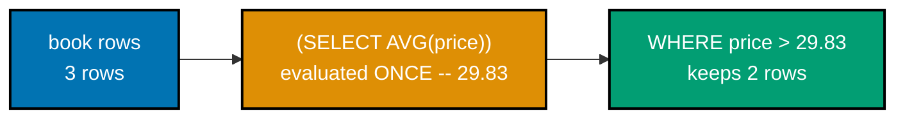

**`learning/code/ex-01-uncorrelated-subquery/example.sql`**

```sql
-- Example 1: Uncorrelated Subquery.
-- A scalar subquery (co-01) runs ONCE, independent of the outer query -- "uncorrelated"
-- means it never references a column from the outer query's own tables.
-- Suppress routine NOTICE messages (e.g. table-does-not-exist-yet on a
-- fresh database) so output below stays focused on the query results.
-- WARNING (not the default NOTICE) suppresses the routine "table does not exist,
-- skipping" notice that DROP TABLE IF EXISTS prints on a fresh database, while
-- still surfacing genuine warnings and errors if something else goes wrong.
SET
  client_min_messages TO WARNING;

DROP TABLE IF EXISTS book,
author CASCADE;

-- CASCADE ensures dropping author does not fail if a leftover book row (from a
-- prior interrupted run) still references it via the FOREIGN KEY -- CASCADE drops
-- that dependent constraint along with the table, keeping the reset unconditional.
-- => resets state -- this example is fully self-contained
-- => explicit INTEGER PRIMARY KEY (not SERIAL/IDENTITY) keeps the seed IDs
-- => predictable across every run -- convenient for teaching, not typical production practice
CREATE TABLE author (id INTEGER PRIMARY KEY, name TEXT NOT NULL);

-- => author table exists, currently empty
-- price uses NUMERIC(6, 2), not FLOAT/REAL -- exact decimal arithmetic matters for
-- money math; the AVG(price) comparison below must not accumulate binary rounding error.
-- author_id REFERENCES author(id) with no ON DELETE clause defaults to RESTRICT --
-- Postgres blocks deleting an author while their books still reference the row.
CREATE TABLE book (
  id INTEGER PRIMARY KEY,
  title TEXT NOT NULL,
  price NUMERIC(6, 2) NOT NULL,
  author_id INTEGER REFERENCES author (id)
);

-- => book table exists -- author_id references author(id)
-- Authors must be inserted before books because book.author_id has a FOREIGN KEY
-- constraint referencing author.id -- inserting the child row first would raise a
-- foreign_key_violation; Postgres checks the reference immediately at INSERT time.
INSERT INTO
  author (id, name)
VALUES
  (1, 'Ada Lovelace'),
  (2, 'Grace Hopper');

-- => 2 authors seeded
-- Three prices are chosen deliberately: 34.99 and 29.99 sit above the eventual
-- average (29.83) while 24.50 sits below it -- guaranteeing the WHERE clause below
-- keeps exactly 2 of 3 rows, a clean teaching split rather than an edge case.
INSERT INTO
  book (id, title, price, author_id)
VALUES
  (1, 'The Pragmatic Programmer', 34.99, 1),
  (2, 'Clean Code', 29.99, 1),
  (3, 'The Mythical Man-Month', 24.50, 2);

-- => 3 books; average price = (34.99+29.99+24.50)/3 = 29.83
-- The subquery (SELECT AVG(price) FROM book) computes exactly ONE number, independent
-- of the outer book row under test -- that single number is reused for every row (co-01).
SELECT
  title,
  price
FROM
  book
WHERE
  -- A scalar subquery used with a bare comparison operator (>) must return AT MOST
  -- one row and one column -- if AVG(price) matched zero rows it would return NULL
  -- and every comparison would be UNKNOWN (no rows returned); if it somehow returned
  -- more than one row, Postgres would raise "more than one row returned by a
  -- subquery used as an expression".
  price > (
    SELECT
      AVG(price)
    FROM
      book
  );

-- => planner evaluates the subquery once, then filters (co-24)
-- => returns the 2 books priced above the 29.83 average
-- The equivalent join rewrite: compute the average once as a derived table (a subquery
-- used AS a table, co-01), then compare every book row against it via CROSS JOIN.
-- Rewriting a WHERE-clause subquery as a CROSS JOIN derived table matters more
-- once a query needs the SAME aggregate value in several places (SELECT list,
-- WHERE, and ORDER BY) -- the subquery form forces Postgres to either recompute
-- AVG(price) each time or rely on subplan caching, while the CROSS JOIN form
-- computes it exactly once as a named column.
SELECT
  b.title,
  b.price
FROM
  book b
  -- Postgres REQUIRES an alias on every derived table (a subquery in FROM/JOIN) --
  -- omitting "AS stats" below would raise "subquery in FROM must have an alias".
  CROSS JOIN (
    SELECT
      AVG(price) AS avg_price
    FROM
      book
  ) AS stats
WHERE
  b.price > stats.avg_price;

-- => same 2 rows -- confirms subquery and CROSS JOIN
-- => derived-table forms are semantically interchangeable
-- Semantically interchangeable does NOT always mean cost-identical -- later EXPLAIN
-- examples in this topic show how the planner can choose different execution
-- strategies for logically equivalent subquery and join rewrites.
```

**Run**: `psql -U asqp -d asqp -f example.sql` (captured against PostgreSQL 18.4)

**Output**:

```text
          title            | price
---------------------------+-------
 The Pragmatic Programmer  | 34.99
 Clean Code                | 29.99
(2 rows)

          title            | price
---------------------------+-------
 The Pragmatic Programmer  | 34.99
 Clean Code                | 29.99
(2 rows)
```

**Key takeaway**: An uncorrelated scalar subquery and its single-row `CROSS JOIN` derived-table rewrite
return identical rows -- the planner is free to pick whichever physical strategy is cheaper for either
form (co-24), so prefer whichever reads more clearly.

**Why it matters**: Recognizing which subqueries are uncorrelated (evaluate once) versus correlated
(evaluate per row, Example 2) is the first diagnostic step when a query runs slower than expected.
PostgreSQL's planner already rewrites many uncorrelated subqueries internally, but understanding the
join-equivalent form lets you manually restructure a query when `EXPLAIN` (Example 22) shows the planner
chose a worse plan than the rewrite would produce.

---

### Example 2: Correlated Subquery

_ex-02 &middot; exercises co-01_

A subquery is **correlated** when it references a column from its enclosing query -- here, `b.author_id
= a.id` ties the inner query to whichever outer `author` row is currently being tested, so conceptually
the engine re-evaluates it once per outer row.

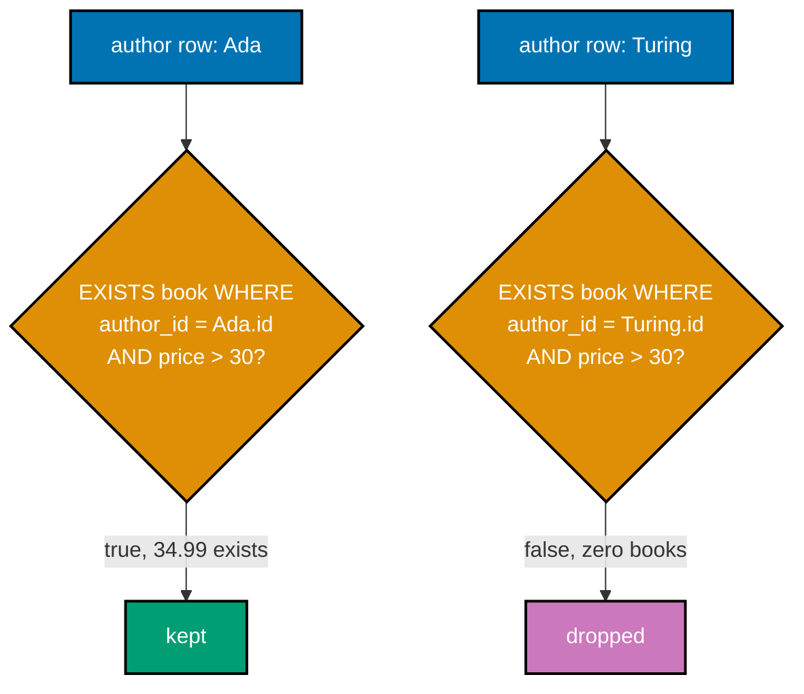

**`learning/code/ex-02-correlated-subquery/example.sql`**

```sql
-- Example 2: Correlated Subquery.
-- A correlated subquery (co-01) references a column from the OUTER query -- here,
-- a.id -- so the engine conceptually re-evaluates it once per outer row.
-- Suppress routine NOTICE messages (e.g. table-does-not-exist-yet on a
-- fresh database) so output below stays focused on the query results.
SET
  client_min_messages TO WARNING;

DROP TABLE IF EXISTS book,
author CASCADE;

-- => resets state -- this example is fully self-contained
CREATE TABLE author (id INTEGER PRIMARY KEY, name TEXT NOT NULL);

-- => author table exists, currently empty
CREATE TABLE book (
  id INTEGER PRIMARY KEY,
  title TEXT NOT NULL,
  price NUMERIC(6, 2) NOT NULL,
  author_id INTEGER REFERENCES author (id)
);

-- => book table exists, currently empty
-- Turing is seeded specifically to exercise the zero-books edge case -- EXISTS
-- must correctly return FALSE (not NULL, not an error) when the correlated
-- inner query finds no matching rows at all for that outer row.
INSERT INTO
  author (id, name)
VALUES
  (1, 'Ada Lovelace'),
  (2, 'Grace Hopper'),
  (3, 'Alan Turing');

-- => 3 authors -- Turing has no books at all (seeded below)
-- Hopper's single book is priced BELOW the $30 filter -- this exercises the case
-- where EXISTS finds a correlated row but the AND condition inside still fails,
-- which is different from finding zero rows at all (Turing's case above).
INSERT INTO
  book (id, title, price, author_id)
VALUES
  (1, 'The Pragmatic Programmer', 34.99, 1),
  (2, 'Clean Code', 29.99, 1),
  (3, 'The Mythical Man-Month', 24.50, 2);

-- => Ada has 2 books above $30 threshold used below
-- EXISTS(...) (co-01) is TRUE the moment the inner query finds ONE matching row --
-- b.author_id = a.id makes this correlated: the inner query changes per outer row.
-- Conceptually the inner query re-runs once per outer author row, substituting
-- a.id afresh each time -- but the Postgres planner does not literally loop;
-- it typically rewrites EXISTS(...) into a semi-join and can use an index on
-- book.author_id to avoid a full re-scan per outer row (see EXPLAIN examples later).
-- Table aliases (author a, book b) are required here because the correlation
-- predicate b.author_id = a.id must unambiguously reference both the outer
-- and inner table -- Postgres cannot infer which "id" column without them.
-- EXISTS produces a boolean, so it composes naturally as a WHERE-clause predicate
-- on its own -- no comparison operator or NULL-handling wrapper is needed.
SELECT
  a.name
FROM
  author a
WHERE
  EXISTS (
    -- SELECT 1 (not SELECT * or a real column) is idiomatic inside EXISTS -- the
    -- planner only cares whether a row EXISTS, never the projected values, so
    -- selecting a constant avoids any wasted column materialization.
    SELECT
      1
    FROM
      book b
    WHERE
      -- The AND condition is evaluated INSIDE the correlated scope, alongside the
      -- correlation predicate itself -- both must hold on the SAME inner row for
      -- EXISTS to return TRUE for this particular outer author.
      b.author_id = a.id
      AND b.price > 30
  );

-- => Ada: has a book priced 34.99 > 30 -- EXISTS is true
-- => Hopper: her only book is 24.50 -- EXISTS is false
-- => Turing: zero books -- EXISTS is false, no rows to check
-- Unlike the equivalent NOT IN pattern, EXISTS/NOT EXISTS never trips on NULL
-- author_id values in the inner query -- this predictable three-value-logic
-- behavior is why EXISTS is generally the safer correlated-subquery idiom.
```

**Run**: `psql -U asqp -d asqp -f example.sql`

**Output**:

```text
     name
--------------
 Ada Lovelace
(1 row)
```

**Key takeaway**: `EXISTS` short-circuits on the first matching inner row -- it never counts or fetches
every match, which makes it cheaper than `COUNT(*) > 0` for a pure existence check.

**Why it matters**: Correlated `EXISTS`/`NOT EXISTS` subqueries are the idiomatic way to express
"has at least one related row" and "has zero related rows" (an anti-join) in production reporting
queries -- account lookups, fraud checks, and eligibility rules are frequently phrased this way. Example
29 (Intermediate tier) shows when to rewrite a correlated subquery as a join instead, once `EXPLAIN`
reveals the correlated form is the slower choice for a given data shape.

---

### Example 3: Derived Table in FROM

_ex-03 &middot; exercises co-01_

A **derived table** is a subquery given an alias and used exactly like a real table inside `FROM` --
here it pre-aggregates book statistics per author before the outer query ever joins to `author`.

**`learning/code/ex-03-derived-table-in-from/example.sql`**

```sql
-- Example 3: Derived Table in FROM.
-- A derived table (co-01) is a subquery given an alias and used exactly like a real
-- table in FROM -- here it pre-aggregates book stats per author before the join.
-- Suppress routine NOTICE messages (e.g. table-does-not-exist-yet on a
-- fresh database) so output below stays focused on the query results.
SET
  client_min_messages TO WARNING;

DROP TABLE IF EXISTS book,
author CASCADE;

-- => resets state -- this example is fully self-contained
CREATE TABLE author (id INTEGER PRIMARY KEY, name TEXT NOT NULL);

-- NUMERIC(6, 2) caps stored prices at 9999.99 -- four digits before the decimal
-- point plus two after; a real catalog would size this per actual business need.
CREATE TABLE book (
  id INTEGER PRIMARY KEY,
  title TEXT NOT NULL,
  price NUMERIC(6, 2) NOT NULL,
  author_id INTEGER REFERENCES author (id)
);

-- => both tables exist, currently empty
INSERT INTO
  author (id, name)
VALUES
  (1, 'Ada Lovelace'),
  (2, 'Grace Hopper');

INSERT INTO
  book (id, title, price, author_id)
VALUES
  (1, 'The Pragmatic Programmer', 34.99, 1),
  (2, 'Clean Code', 29.99, 1),
  (3, 'The Mythical Man-Month', 24.50, 2);

-- => Ada: 2 books, Hopper: 1 book -- stats differ per author
-- price_stats is a derived table: GROUP BY collapses book rows to one row per
-- author_id BEFORE the outer join ever sees them (co-01). ROUND keeps output tidy.
-- Aggregation MUST happen inside the derived table, not the outer query -- you
-- cannot JOIN directly on COUNT(*)/AVG(price) without first collapsing book rows
-- to one row per author_id; the derived table is exactly that collapsing step.
SELECT
  a.name,
  -- Selecting from author (not book) as the driving table, combined with a plain
  -- JOIN (not LEFT JOIN), means any author with zero books would silently vanish
  -- from the result -- fine here since both seeded authors have at least one book,
  -- but worth remembering: a plain JOIN never surfaces the zero-match case.
  price_stats.book_count,
  price_stats.avg_price
FROM
  author a
  JOIN (
    -- COUNT(*) counts ROWS, including any with NULL columns -- COUNT(price) would
    -- instead count only non-NULL price values, which matters once nullable columns
    -- enter the picture (price is NOT NULL here, so the two forms happen to agree).
    SELECT
      author_id,
      COUNT(*) AS book_count,
      -- ROUND(..., 2) matches the NUMERIC(6, 2) precision of price -- AVG() on a
      -- NUMERIC column already returns exact decimal arithmetic, unlike AVG() on a
      -- FLOAT/REAL column, which could reintroduce binary rounding error here.
      ROUND(AVG(price), 2) AS avg_price
    FROM
      book
      -- Grouping by author_id (the foreign key), not id (book's own primary key), is
      -- what collapses multiple book rows per author into a single summary row --
      -- grouping by id instead would produce one output row per BOOK, not per author.
    GROUP BY
      author_id
      -- price_stats.author_id has no index of its own -- it is a derived, in-memory
      -- result set, not a real table -- but the underlying GROUP BY over book can still
      -- benefit from an index on book.author_id if one exists (see Example 21).
      -- For an INNER JOIN, moving this condition from ON into a WHERE clause instead
      -- would produce an identical result -- the ON/WHERE distinction only changes
      -- outcomes once an OUTER JOIN (LEFT/RIGHT/FULL) is introduced.
  ) AS price_stats ON price_stats.author_id = a.id;

-- => Ada: book_count 2, avg_price (34.99+29.99)/2 = 32.49
-- => Hopper: book_count 1, avg_price 24.50
-- Unlike a CTE (see Example 4), the planner is free to "flatten" this derived
-- table into the surrounding query -- pushing the author filter/join condition
-- down before aggregating -- because a plain subquery is not an optimization fence.
```

**Run**: `psql -U asqp -d asqp -f example.sql`

**Output**:

```text
     name     | book_count | avg_price
--------------+------------+-----------
 Ada Lovelace |          2 |     32.49
 Grace Hopper |          1 |     24.50
(2 rows)
```

**Key takeaway**: Aggregating inside a derived table first, then joining the compact result to the
lookup table, is usually both more readable and cheaper than joining first and aggregating a wider
row set afterward.

**Why it matters**: Pre-aggregating in a derived table is a standard technique for report queries where
one side of the join has a one-to-many relationship -- computing statistics before the join keeps the
join's row count small. Named derived tables (Example 4's `WITH` clause is the more readable syntax
for the same idea) let you compose several such aggregation steps without nesting subqueries five deep.

---

### Example 4: Simple CTE

_ex-04 &middot; exercises co-02_

`WITH` names a subquery once, up front, so the main query below can reference it by name -- a pure
readability factoring, not a performance change, for a filter that could equally live inline.

**`learning/code/ex-04-simple-cte/example.sql`**

```sql
-- Example 4: Simple CTE.
-- WITH (co-02) names a subquery once, up front, so the main query below can
-- reference it by name -- purely a readability factoring, not a performance change.
-- Suppress routine NOTICE messages (e.g. table-does-not-exist-yet on a
-- fresh database) so output below stays focused on the query results.
SET
  client_min_messages TO WARNING;

DROP TABLE IF EXISTS book,
author CASCADE;

-- => resets state -- this example is fully self-contained
CREATE TABLE author (id INTEGER PRIMARY KEY, name TEXT NOT NULL);

CREATE TABLE book (
  id INTEGER PRIMARY KEY,
  title TEXT NOT NULL,
  price NUMERIC(6, 2) NOT NULL,
  author_id INTEGER REFERENCES author (id)
);

-- => both tables exist, currently empty
INSERT INTO
  author (id, name)
VALUES
  (1, 'Ada Lovelace'),
  (2, 'Grace Hopper');

INSERT INTO
  book (id, title, price, author_id)
VALUES
  (1, 'The Pragmatic Programmer', 34.99, 1),
  (2, 'Clean Code', 29.99, 1),
  (3, 'The Mythical Man-Month', 24.50, 2);

-- => 3 books seeded -- one below the $25 threshold below
-- expensive_books (co-02) is a named step: the filter logic lives in ONE place,
-- readable top-to-bottom, instead of nested inside the final SELECT's FROM clause.
-- On Postgres 12+, a non-recursive CTE referenced exactly once is, by default,
-- INLINED ("substituted") into the surrounding query just like a plain derived
-- table -- the planner can push the outer join/filter down into it. Writing
-- MATERIALIZED after AS would force it to run standalone and cache its result.
-- This is a NON-recursive CTE -- it runs its inner query exactly once. Example 6
-- introduces WITH RECURSIVE, where the same CTE name can reference itself.
-- The CTE name expensive_books is deliberately descriptive rather than a terse
-- alias like t1 or cte1 -- readability was the entire justification for reaching
-- for WITH over a derived table in the first place, so a vague name would defeat
-- the purpose.
WITH
  expensive_books AS (
    SELECT
      title,
      price,
      -- author_id must be carried through the CTE's SELECT list even though the final
      -- query never displays it -- a CTE only exposes the columns it explicitly
      -- projects, so the join key below would be unavailable if this line were dropped.
      author_id
    FROM
      book
    WHERE
      -- The $25 cutoff is chosen so exactly one of the three seeded books (24.50) is
      -- excluded -- the CTE is proven to filter, not just rename, the underlying rows.
      -- price is NOT NULL, so "price > 25" never has to reckon with a NULL turning
      -- the comparison to UNKNOWN -- a nullable price column would need a companion
      -- "price IS NOT NULL" or COALESCE to guarantee predictable filtering here.
      price > 25
  )
SELECT
  -- expensive_books.title/price are qualified even though no other table in this
  -- query has a column of the same name -- qualifying anyway documents provenance
  -- and avoids breakage the moment another joined table introduces a same-named column.
  a.name,
  expensive_books.title,
  expensive_books.price
FROM
  -- Starting FROM the CTE (not author) means only authors who WROTE a filtered-in
  -- book can appear at all -- combined with the plain JOIN below, an author whose
  -- only book got filtered out by the CTE's WHERE clause disappears entirely.
  expensive_books
  -- Joining on a.id = expensive_books.author_id (rather than the reverse order)
  -- reads "filtered books joined back to their authors" -- Postgres does not care
  -- about operand order for equality joins; the planner picks its own join order.
  JOIN author a ON a.id = expensive_books.author_id;

-- => The Mythical Man-Month (24.50) is filtered out by the CTE
-- => returns exactly the 2 books priced above $25
-- Contrast with Example 3's derived table: the SQL shape (WITH ... AS vs a
-- subquery in FROM) is almost identical, but naming the step up front reads
-- better once a pipeline chains several such steps (see Example 5, multi-step CTE).
-- CTEs can also encapsulate window functions or aggregates -- this example keeps
-- expensive_books to a plain filter to isolate the WITH syntax itself.
```

**Run**: `psql -U asqp -d asqp -f example.sql`

**Output**:

```text
     name     |          title            | price
--------------+---------------------------+-------
 Ada Lovelace | The Pragmatic Programmer  | 34.99
 Ada Lovelace | Clean Code                | 29.99
(2 rows)
```

**Key takeaway**: `WITH expensive_books AS (...)` and an equivalent inline subquery in `FROM` produce
identical plans in PostgreSQL 18 -- `WITH` is a naming convenience for the query author, not a planner
optimization fence (PostgreSQL only inlines/does-not-inline based on complexity heuristics, not syntax).

**Why it matters**: Once a query needs three or four logical steps, nesting subqueries becomes hard to
read top-to-bottom -- a single `WITH` clause turns that nesting into a linear, named sequence a
teammate can review step by step. Example 5 extends this to multiple chained CTEs, the shape most
production reporting queries actually use.

---

### Example 5: Multi-Step CTE

_ex-05 &middot; exercises co-02_

Chaining CTEs stages a transform: each step consumes the one before it, turning one dense query into
a readable pipeline of named intermediate results -- here, per-author totals feed an overall average,
which then filters down to only the above-average authors.

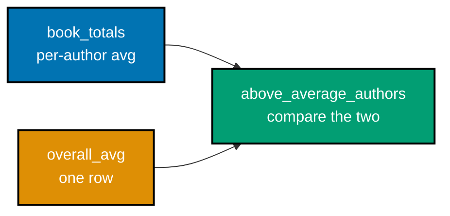

**`learning/code/ex-05-multi-step-cte/example.sql`**

```sql
-- Example 5: Multi-Step CTE.
-- Chaining CTEs (co-02) stages a transform: each step consumes the one before it,
-- turning one dense query into a readable pipeline of named intermediate results.
-- Suppress routine NOTICE messages (e.g. table-does-not-exist-yet on a
-- fresh database) so output below stays focused on the query results.
SET
  client_min_messages TO WARNING;

DROP TABLE IF EXISTS book,
author CASCADE;

-- => resets state -- this example is fully self-contained
CREATE TABLE author (id INTEGER PRIMARY KEY, name TEXT NOT NULL);

-- The same author/book schema as Examples 1-4 -- reused deliberately so this
-- example can focus entirely on the CTE-chaining pattern, not new table shapes.
CREATE TABLE book (
  id INTEGER PRIMARY KEY,
  title TEXT NOT NULL,
  price NUMERIC(6, 2) NOT NULL,
  author_id INTEGER REFERENCES author (id)
);

-- => both tables exist, currently empty
INSERT INTO
  author (id, name)
VALUES
  (1, 'Ada Lovelace'),
  (2, 'Grace Hopper');

INSERT INTO
  book (id, title, price, author_id)
VALUES
  (1, 'The Pragmatic Programmer', 34.99, 1),
  (2, 'Clean Code', 29.99, 1),
  (3, 'The Mythical Man-Month', 24.50, 2);

-- => Ada's avg (34.99+29.99)/2=32.49; Hopper's avg 24.50
-- Step 1: per-author totals. Step 2: the overall average book price (one row).
-- Step 3: authors whose OWN average exceeds the overall average -- each step
-- builds on the last, exactly like a small data pipeline (co-02).
WITH
  -- Step 1 groups book rows into one row per author (same shape as the derived
  -- table in Example 3) -- book_count rides along even though this example never
  -- uses it downstream, showing a CTE step can expose more than later steps need.
  book_totals AS (
    SELECT
      author_id,
      COUNT(*) AS book_count,
      -- ROUND(..., 2) is applied independently in steps 1 and 2 -- each step rounds
      -- its own average, so the step-3 comparison is between two consistently-rounded
      -- NUMERIC(6, 2) values rather than one rounded and one raw high-precision average.
      ROUND(AVG(price), 2) AS avg_price
    FROM
      book
      -- GROUP BY author_id here plays the identical role it played in Example 3's
      -- derived table -- collapsing per-book rows to per-author rows before anything
      -- downstream can compare authors against each other.
    GROUP BY
      author_id
  ),
  -- Step 2 computes a SINGLE overall number with no GROUP BY at all -- an aggregate
  -- with no GROUP BY always collapses the WHOLE table to exactly one row, which is
  -- exactly what step 3 needs to compare every author's average against. A window
  -- function AVG(price) OVER () (see Example 9) could compute this inline instead.
  overall_avg AS (
    SELECT
      -- Renaming overall_avg_price (rather than reusing avg_price) avoids ambiguity
      -- in step 3's WHERE clause -- Postgres would otherwise require additional
      -- qualification to disambiguate two identically named avg_price columns.
      ROUND(AVG(price), 2) AS overall_avg_price
    FROM
      book
  ),
  -- Step 3 compares step 1's per-author average against step 2's single overall
  -- number -- this is the payoff of chaining CTEs: each step only has to reason
  -- about ONE transformation, not the whole pipeline at once.
  above_average_authors AS (
    SELECT
      book_totals.author_id,
      book_totals.avg_price
    FROM
      -- "FROM book_totals, overall_avg" is old-style comma-join syntax, equivalent to
      -- an unconditional CROSS JOIN -- safe here ONLY because overall_avg always
      -- produces exactly one row (step 2's aggregate has no GROUP BY), so every
      -- book_totals row is paired with that single row, not multiplied out. Modern style
      -- prefers an explicit CROSS JOIN (see Example 1) to make that guarantee visible.
      book_totals,
      overall_avg
    WHERE
      -- Both sides of this comparison already carry NUMERIC(6, 2)-derived precision
      -- from ROUND(AVG(price), 2) in steps 1 and 2, so "greater than" compares exact
      -- decimal values -- no floating-point tie-breaking surprises at the boundary.
      book_totals.avg_price > overall_avg.overall_avg_price
  )
  -- The final SELECT re-joins author because none of the three CTE steps carry
  -- the author's name forward -- only author_id survives the aggregation steps;
  -- a name column would have needed GROUP BY author_id, name in step 1 instead.
SELECT
  a.name,
  -- above_average_authors.avg_price is selected directly -- no re-aggregation is
  -- needed here because step 3 already reduced the data to one row per qualifying
  -- author.
  above_average_authors.avg_price
FROM
  above_average_authors
  -- Joining on a.id = above_average_authors.author_id mirrors Example 4's pattern
  -- -- once the interesting authors are isolated, a single equality join recovers
  -- their display name from the author table.
  JOIN author a ON a.id = above_average_authors.author_id;

-- => overall avg is (34.99+29.99+24.50)/3 = 29.83
-- => only Ada's 32.49 beats that -- Hopper's 24.50 does not
-- Each CTE here only references the ones ABOVE it (book_totals feeds
-- above_average_authors; overall_avg does too) -- WITH evaluates top-to-bottom
-- and, without RECURSIVE, a step can never reference one defined later.
-- No index exists on book.author_id in this example -- with only 3 rows the
-- planner correctly prefers a sequential scan; Example 40 revisits this same
-- kind of grouping query at a scale where an index actually changes the plan.
```

**Run**: `psql -U asqp -d asqp -f example.sql`

**Output**:

```text
     name     | avg_price
--------------+-----------
 Ada Lovelace |     32.49
(1 row)
```

**Key takeaway**: Each CTE in the chain does exactly one job (aggregate, compute a baseline, compare) --
naming those jobs makes the query's logic reviewable clause by clause instead of as one dense
expression.

**Why it matters**: Multi-step CTE pipelines are how production analytics queries stay maintainable as
business logic grows -- a cohort-analysis or funnel-conversion query commonly chains five or more named
steps. The cost is that PostgreSQL may materialize some CTEs as an optimization fence in complex plans;
Example 53 (Intermediate tier) revisits how stale statistics can mislead the planner's choices across a
chain like this one.

---

### Example 6: Recursive CTE Counter

_ex-06 &middot; exercises co-03_

`WITH RECURSIVE` has two parts `UNION ALL`'d together: a non-recursive **anchor** (the starting row) and
a **recursive term** that refers back to the CTE's own name -- the engine repeats the recursive term
until it returns zero new rows, generating a number sequence here as the simplest possible case.

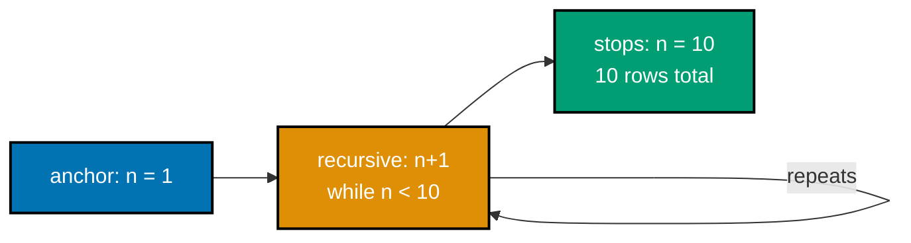

**`learning/code/ex-06-recursive-cte-counter/example.sql`**

```sql
-- Example 6: Recursive CTE Counter.
-- WITH RECURSIVE (co-03) has two parts UNION ALL'd together: a non-recursive
-- "anchor" (the starting row) and a "recursive" term that refers back to the CTE's
-- own name -- the engine repeats the recursive term until it returns zero rows.
-- Suppress routine NOTICE messages (e.g. table-does-not-exist-yet on a
-- fresh database) so output below stays focused on the query results.
SET
  client_min_messages TO WARNING;

DROP TABLE IF EXISTS book,
author CASCADE;

-- => no domain tables needed -- this example is pure logic
-- counter(n) starts at 1 (the anchor). The recursive term adds 1 each pass and
-- WHERE n < 10 is the termination guard -- without it, this would loop forever.
-- UNION ALL (not UNION) is required here for both correctness and speed: plain
-- UNION would deduplicate rows every pass, which is wasted work for values that
-- are already known distinct, and would silently break recursion patterns where
-- legitimate duplicate rows are expected.
WITH RECURSIVE
  -- The column list "counter (n)" names the CTE's single output column up front --
  -- an alternative would be to alias it per-branch (SELECT 1 AS n), but naming it
  -- once on the CTE avoids having to repeat/match the alias in every UNION branch.
  counter (n) AS (
    SELECT
      1 -- => anchor: the FIRST row, n = 1
    UNION ALL
    SELECT
      n + 1
      -- Referencing counter here is only legal because this SELECT is the recursive
      -- term of a WITH RECURSIVE clause -- a self-reference like this anywhere else
      -- would raise "relation counter does not exist". Standard recursive CTEs also
      -- allow the self-reference to appear only ONCE per recursive term.
    FROM
      counter
    WHERE
      -- Unlike some other database engines, Postgres has no built-in recursion depth
      -- limit -- an unbounded recursive CTE (e.g. accidentally using n <= n, always
      -- true) will consume memory until it errors or exhausts the server; the WHERE
      -- guard here is the only thing standing between this query and that failure mode.
      n < 10
      -- => recursive term: re-reads counter's own
      -- => output from the PREVIOUS pass, adds 1
  )
SELECT
  n
FROM
  counter;

-- => 10 rows: 1, 2, 3, ..., 10 -- the guard stopped it there
```

**Run**: `psql -U asqp -d asqp -f example.sql`

**Output**:

```text
 n
----
  1
  2
  3
  4
  5
  6
  7
  8
  9
 10
(10 rows)
```

**Key takeaway**: The `WHERE n < 10` guard inside the recursive term is what stops the recursion --
remove it and PostgreSQL keeps generating rows until it hits `recursion_limit`-driven resource
exhaustion (or, practically, you `Ctrl-C` it).

**Why it matters**: Every recursive CTE in this topic -- org charts (Example 7), bill-of-materials
explosions (Example 31), and shortest-path graph search (Example 65) -- is this exact anchor +
recursive-term shape with a different termination guard and a different join in the recursive term.
Understanding this minimal counter form first makes every later, more complex recursive CTE
immediately legible as "the same pattern, more columns."

---

### Example 7: Recursive CTE Tree

_ex-07 &middot; exercises co-03_

The same anchor-plus-recursive-term shape from Example 6 walks a real self-referencing hierarchy here:
every `employee` row points at its own `manager_id`, and the recursive term joins `employee` back to
the CTE's own growing result set to walk one level down per pass.

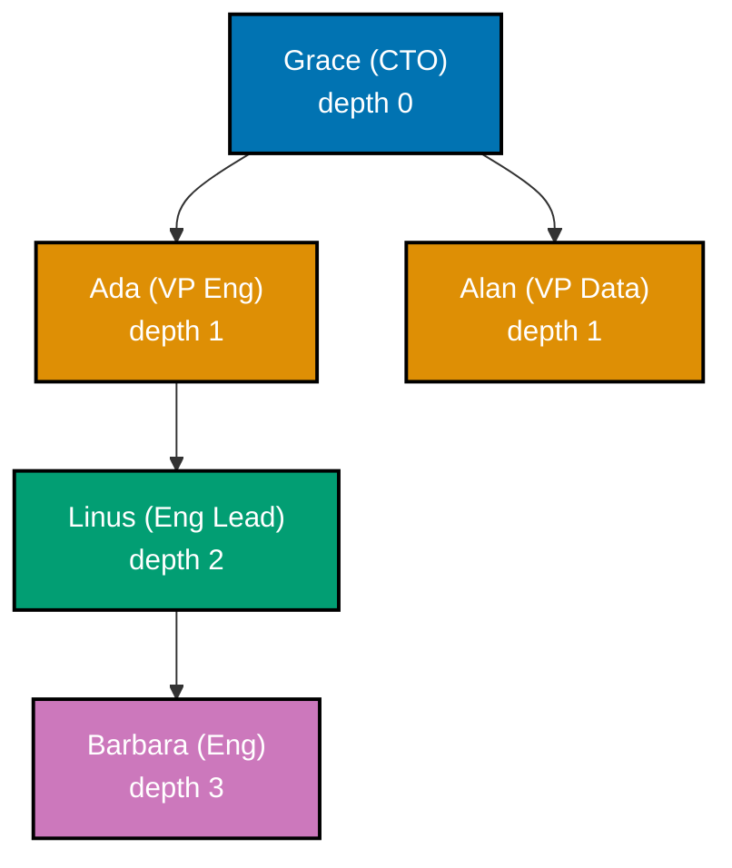

**`learning/code/ex-07-recursive-cte-tree/example.sql`**

```sql
-- Example 7: Recursive CTE Tree.
-- The same anchor + recursive-term shape from Example 6 (co-03) walks a real
-- self-referencing hierarchy here: every employee points at their manager_id.
-- Suppress routine NOTICE messages (e.g. table-does-not-exist-yet on a
-- fresh database) so output below stays focused on the query results.
SET
  client_min_messages TO WARNING;

DROP TABLE IF EXISTS employee CASCADE;

-- => resets state -- this example is fully self-contained
-- A self-referencing foreign key (manager_id -> employee.id) is the classic
-- "adjacency list" way to store a tree/hierarchy in one table -- Examples 30
-- and 31 apply this exact recursive-CTE pattern to a cyclic graph and a
-- multi-level bill-of-materials, respectively.
CREATE TABLE employee (
  id INTEGER PRIMARY KEY,
  -- name is NOT NULL (every employee must have a display name) while manager_id
  -- is nullable -- NULL is the only way to represent "has no manager" for the root.
  name TEXT NOT NULL,
  -- REFERENCES employee(id) pointing at the table's OWN primary key is legal --
  -- Postgres has no special-case restriction on self-referencing foreign keys;
  -- the default ON DELETE RESTRICT still applies (a manager cannot be deleted
  -- while a report still references them).
  manager_id INTEGER REFERENCES employee (id)
);

-- => self-referencing FK: manager_id points at another employee.id
-- Grace's row uses NULL for manager_id to mark her as the root -- WHERE
-- manager_id IS NULL would be a more GENERIC anchor predicate than the
-- hardcoded "id = 1" used below; either works for this single-root dataset.
INSERT INTO
  employee (id, name, manager_id)
VALUES
  (1, 'Grace (CTO)', NULL), -- => the root -- no manager, NULL stops the chain upward
  (2, 'Ada (VP Eng)', 1), -- => reports to Grace
  (3, 'Alan (VP Data)', 1), -- => also reports to Grace
  (4, 'Linus (Eng Lead)', 2), -- => reports to Ada -- two levels below Grace
  (5, 'Barbara (Eng)', 4);

-- => reports to Linus -- three levels below Grace
-- Anchor: the ONE row we start from (Grace, id=1). Recursive term: JOIN employee
-- back to org_tree ON manager_id = org_tree.id, walking one level down each pass.
-- depth is an ACCUMULATOR column: the anchor seeds it at 0, and each recursive
-- pass adds 1 -- this running-counter pattern generalizes to any recursive CTE
-- that needs to track "how many hops so far" (path length, level, generation),
-- not just this specific org-chart walk.
WITH RECURSIVE
  org_tree AS (
    SELECT
      id,
      name,
      manager_id,
      -- 0 AS depth is a LITERAL, not a column reference -- Postgres infers its type
      -- (integer) from context and matches it against depth's type in the recursive
      -- term (org_tree.depth + 1), which must be assignable to the same column type.
      0 AS depth
    FROM
      employee
    WHERE
      id = 1 -- => anchor: start at Grace, depth 0
    UNION ALL
    -- The recursive term's SELECT list must match the anchor's in column COUNT
    -- and compatible TYPES, in the same order -- swapping e.name and e.id here
    -- would still run, but would silently mislabel every row from the second
    -- pass onward, since positions (not names) determine the output column.
    SELECT
      e.id,
      e.name,
      e.manager_id,
      org_tree.depth + 1
    FROM
      -- Joining employee e back to org_tree ON e.manager_id = org_tree.id grows the
      -- tree outward one generation per pass -- this works ONLY because the data is
      -- guaranteed acyclic by the application; the table schema itself does not
      -- prevent a manager_id cycle, which is exactly what Example 30 explores.
      employee e
      JOIN org_tree ON e.manager_id = org_tree.id
      -- => recursive term: finds employees whose manager
      -- => was just added, one depth level deeper each pass
  )
SELECT
  name,
  depth
FROM
  org_tree
  -- Recursive CTEs make no guarantee about the ORDER rows are produced in --
  -- relying on insertion/recursion order for display would be fragile; the
  -- explicit ORDER BY here is what actually guarantees depth-then-name ordering.
ORDER BY
  depth,
  name;

-- => all 5 rows: Grace herself plus every descendant
-- Cost-wise, this recursive CTE re-runs the JOIN once per depth level -- fine
-- for a handful of org levels, but Example 65's shortest-path walk shows where
-- that repeated-join cost starts to matter at larger graph sizes.
```

**Run**: `psql -U asqp -d asqp -f example.sql`

**Output**:

```text
       name       | depth
------------------+-------
 Grace (CTO)      |     0
 Ada (VP Eng)     |     1
 Alan (VP Data)   |     1
 Linus (Eng Lead) |     2
 Barbara (Eng)    |     3
(5 rows)
```

**Key takeaway**: The anchor picks the starting row (`WHERE id = 1`), and the recursive term's `JOIN
... ON e.manager_id = org_tree.id` is what "walks down" the tree one edge at a time -- swap that join
condition to `org_tree.manager_id = e.id` and the same query would walk _upward_ toward the root
instead.

**Why it matters**: Org charts, category trees, and comment threads are the three most common
self-referencing hierarchies in production schemas, and this exact recursive CTE shape is how SQL
answers "give me this node and everything beneath it" without the application fetching one level at a
time in a loop (the N+1 pattern Example 54 diagnoses). Example 30 (Intermediate tier) extends this with
a cycle guard for graphs that are not guaranteed to be acyclic.

---

### Example 8: Window Running Total

_ex-08 &middot; exercises co-04_

`OVER()` computes a value **across** a set of rows without collapsing them into groups -- unlike
`GROUP BY`, every input row still appears once in the output. A running total is the simplest possible
window function: sum everything from the start of the ordering up to the current row.

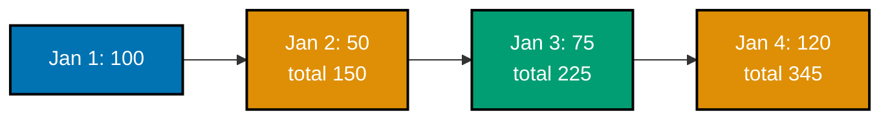

**`learning/code/ex-08-window-running-total/example.sql`**

```sql
-- Example 8: Window Running Total.
-- OVER() (co-04) computes a value ACROSS a set of rows without collapsing them into
-- groups -- unlike GROUP BY, every input row still appears once in the output.
SET
  client_min_messages TO WARNING;

DROP TABLE IF EXISTS daily_sales CASCADE;

-- => resets state -- this example is fully self-contained
-- sale_date is used directly as the PRIMARY KEY (a natural key) rather than a
-- surrogate id -- appropriate here because "one row per calendar day" is a
-- real business invariant this table needs to enforce, not just a convenience.
CREATE TABLE daily_sales (
  sale_date DATE PRIMARY KEY,
  -- NUMERIC(8, 2) allows totals up to 999999.99 -- sized generously above any
  -- single day's amount so the running SUM across many days will not overflow.
  amount NUMERIC(8, 2) NOT NULL
);

-- => one row per day, currently empty
INSERT INTO
  daily_sales (sale_date, amount)
VALUES
  ('2026-01-01', 100.00),
  ('2026-01-02', 50.00),
  ('2026-01-03', 75.00),
  ('2026-01-04', 120.00);

-- => 4 days of sales; running total should reach 345.00
-- SUM(amount) OVER (ORDER BY sale_date) (co-04) is a running total: for each row,
-- it sums every row FROM THE START up to and including the current row's position.
SELECT
  sale_date,
  amount,
  -- Because ORDER BY sale_date appears inside OVER() with no explicit frame clause,
  -- Postgres defaults to "RANGE BETWEEN UNBOUNDED PRECEDING AND CURRENT ROW" --
  -- exactly the running-total behavior shown here. Example 33 shows how ties in
  -- the ORDER BY column change this default's behavior, and how ROWS differs from
  -- RANGE once duplicate ordering values are involved.
  SUM(amount) OVER (
    ORDER BY
      sale_date
  ) AS running_total
FROM
  daily_sales
  -- This ORDER BY controls the DISPLAY order of the final result set -- it is a
  -- separate concept from the ORDER BY inside OVER(), which controls the order
  -- rows are CONSUMED when computing the running total. They happen to match
  -- here, but window ORDER BY and outer ORDER BY are independent clauses.
ORDER BY
  sale_date;

-- => row 1: running_total 100.00 (itself only)
-- => row 4: running_total 345.00 (all 4 days summed)
-- A running total is only guaranteed non-decreasing when every summed value is
-- non-negative -- a table that also recorded refunds (negative amounts) would
-- produce a running_total that can drop between rows, which is still correct,
-- just less visually intuitive than this all-positive example.
```

**Run**: `psql -U asqp -d asqp -f example.sql`

**Output**:

```text
 sale_date  | amount | running_total
------------+--------+---------------
 2026-01-01 | 100.00 |        100.00
 2026-01-02 |  50.00 |        150.00
 2026-01-03 |  75.00 |        225.00
 2026-01-04 | 120.00 |        345.00
(4 rows)
```

**Key takeaway**: `SUM(...) OVER (ORDER BY ...)` with no explicit frame defaults to "everything from the
first row through the current row" -- the running-total behavior comes from that implicit default frame,
not from anything specific to `SUM`.

**Why it matters**: Running totals power cumulative revenue charts, account balance histories, and
progress-toward-goal dashboards -- before window functions, this required a self-join or a client-side
loop over ordered rows. Example 32 (Intermediate tier) makes the frame explicit with `ROWS BETWEEN` to
compute a moving average instead of an ever-growing total.

---

### Example 9: Window Partition Avg

_ex-09 &middot; exercises co-05_

`PARTITION BY` splits the window into independent groups -- the average below resets per department
instead of averaging across the whole company, while every employee row still appears individually
(the key difference from `GROUP BY`, which would collapse each department to one row).

**`learning/code/ex-09-window-partition-avg/example.sql`**

```sql
-- Example 9: Window Partition Avg.
-- PARTITION BY (co-05) splits the window into independent groups -- the AVG below
-- resets per department instead of averaging across the whole company.
SET
  client_min_messages TO WARNING;

DROP TABLE IF EXISTS employee CASCADE;

-- => resets state -- this example is fully self-contained
-- dept is stored as plain TEXT here rather than a normalized department table --
-- fine for this example's teaching purpose; a real schema might use a dept_id FK.
CREATE TABLE employee (
  id INTEGER PRIMARY KEY,
  name TEXT NOT NULL,
  -- dept is NOT NULL -- PARTITION BY treats NULL as its own group if it ever
  -- appeared, which would silently create a third "unknown department" partition.
  dept TEXT NOT NULL,
  -- NUMERIC(9, 2) accommodates salaries up to 9,999,999.99 -- comfortably above
  -- any individual value here, with headroom for a SUM() OVER() variant of this
  -- query that would total multiple employees' salaries together.
  salary NUMERIC(9, 2) NOT NULL
);

-- => employee table exists, currently empty
INSERT INTO
  employee (id, name, dept, salary)
VALUES
  (1, 'Ada', 'Engineering', 95000),
  (2, 'Linus', 'Engineering', 105000),
  (3, 'Barbara', 'Engineering', 88000),
  (4, 'Grace', 'Data', 99000),
  (5, 'Alan', 'Data', 91000);

-- => 3 Engineering rows, 2 Data rows -- two separate partitions
-- AVG(salary) OVER (PARTITION BY dept) (co-05) computes each department's OWN
-- average, independent of the other department -- every row still appears, unlike
-- GROUP BY which would collapse each dept down to one summary row.
-- This OVER() has PARTITION BY but NO ORDER BY -- with no ordering, the window
-- frame defaults to the ENTIRE partition (every row sharing the same dept),
-- not a running subset. Contrast with Example 8, where adding ORDER BY narrowed
-- the frame down to "from the start through the current row" instead.
SELECT
  name,
  dept,
  salary,
  -- ROUND() wraps the window function's result -- this is legal because ROUND is
  -- an ordinary scalar function applied AFTER AVG(...) OVER(...) produces its
  -- value; nesting one window function directly inside ANOTHER window function's
  -- argument, by contrast, is not allowed.
  ROUND(
    AVG(salary) OVER (
      PARTITION BY
        dept
    ),
    2
  ) AS dept_avg_salary
FROM
  -- No JOIN or GROUP BY is needed to get a per-department average alongside every
  -- individual employee row -- this is precisely the row-preserving property that
  -- distinguishes window functions from GROUP BY aggregation.
  employee
  -- Ordering by dept groups the two partitions visually together in the output,
  -- and salary DESC within each dept surfaces the highest earner first -- neither
  -- ordering choice affects the already-computed dept_avg_salary values themselves.
ORDER BY
  dept,
  salary DESC;

-- => Engineering avg (95000+105000+88000)/3 = 96000.00
-- => Data avg (99000+91000)/2 = 95000.00 -- a DIFFERENT partition
-- dept_avg_salary is IDENTICAL for every row within the same department --
-- that repetition (95000.00 appears on both Data rows) is the visible signature
-- of a window function: it decorates each row rather than collapsing them.
```

**Run**: `psql -U asqp -d asqp -f example.sql`

**Output**:

```text
  name   |    dept     |  salary   | dept_avg_salary
---------+-------------+-----------+-----------------
 Grace   | Data        |  99000.00 |        95000.00
 Alan    | Data        |  91000.00 |        95000.00
 Linus   | Engineering | 105000.00 |        96000.00
 Ada     | Engineering |  95000.00 |        96000.00
 Barbara | Engineering |  88000.00 |        96000.00
(5 rows)
```

**Key takeaway**: `PARTITION BY dept` is the window-function equivalent of `GROUP BY dept`, except rows
are never collapsed -- you get the department average attached to every individual employee row for
side-by-side comparison ("how does Ada's salary compare to her department's average?").

**Why it matters**: "Compare this row to its group's aggregate" is one of the most common reporting
needs -- salary bands, sales-rep-vs-team-average, and student-vs-class-average all use this exact
shape. Doing it without window functions requires a self-join against a `GROUP BY` subquery (the
derived-table pattern from Example 3), which is strictly more verbose for the same result.

---

### Example 10: Row Number vs Rank vs Dense Rank

_ex-10 &middot; exercises co-06_

`ROW_NUMBER`, `RANK`, and `DENSE_RANK` all number rows by an `ORDER BY`, but they disagree on what
happens at a tie -- and Ada and Barbara below tie on salary, making the disagreement visible.

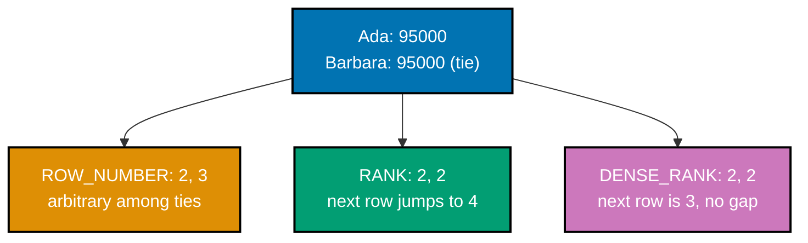

**`learning/code/ex-10-row-number-rank/example.sql`**

```sql
-- Example 10: Row Number vs Rank vs Dense Rank.
-- Three ranking functions (co-06) handle ties differently -- Barbara and Ada below
-- tie on salary, and each function assigns that tie a different rank.
SET
  client_min_messages TO WARNING;

DROP TABLE IF EXISTS employee CASCADE;

-- => resets state -- this example is fully self-contained
-- salary alone (no dept) keeps this example focused purely on the three ranking
-- functions' tie-breaking behavior, without PARTITION BY complicating the frame.
CREATE TABLE employee (
  id INTEGER PRIMARY KEY,
  name TEXT NOT NULL,
  -- salary is NOT NULL -- all three ranking functions treat NULL as sorting last
  -- by default (NULLS LAST for DESC), which would need extra handling if it occurred.
  salary NUMERIC(9, 2) NOT NULL
);

-- => employee table exists, currently empty
-- Salaries are chosen so exactly one tie exists (Ada/Barbara at 95000), bracketed
-- by a unique top earner (Linus) and a unique bottom earner (Grace) -- a minimal
-- dataset that still exercises every rank-numbering edge case.
INSERT INTO
  employee (id, name, salary)
VALUES
  (1, 'Linus', 105000),
  (2, 'Ada', 95000),
  (3, 'Barbara', 95000),
  (4, 'Grace', 88000);

-- => Ada and Barbara TIE at 95000 -- the interesting case below
-- ROW_NUMBER gives every row a unique, arbitrary-among-ties number. RANK leaves a
-- GAP after a tie (2, 2, 4). DENSE_RANK leaves NO gap after a tie (2, 2, 3) (co-06).
-- All three functions here share the identical OVER (ORDER BY salary DESC) --
-- the ranking algorithm is the ONLY thing that differs between them, which is
-- exactly what this example isolates by computing all three side by side.
SELECT
  name,
  salary,
  -- ROW_NUMBER's tie-break between Ada and Barbara (both 95000) is UNSPECIFIED --
  -- without a secondary ORDER BY key, Postgres may return either order, and that
  -- order can even change between runs on a larger, un-vacuumed table.
  ROW_NUMBER() OVER (
    ORDER BY
      salary DESC
  ) AS row_num,
  -- RANK() literally counts how many rows sort ahead of (or tied with) the current
  -- one, then adds 1 -- two rows tied for 2nd push the next distinct value to rnk 4,
  -- because two rows already occupy ranks 2 and 3 in the underlying count.
  RANK() OVER (
    ORDER BY
      salary DESC
  ) AS rnk,
  -- DENSE_RANK() instead counts DISTINCT preceding values -- a tie still shares
  -- rank 2, but the next distinct salary becomes rank 3, not 4, because ties never
  -- consume extra rank "slots". Choose RANK for leaderboard-style gaps, DENSE_RANK
  -- for compact tier numbering (e.g. "top 3 distinct price tiers").
  DENSE_RANK() OVER (
    ORDER BY
      salary DESC
  ) AS dense_rnk
FROM
  employee
  -- "salary DESC, name" gives the display a deterministic tie-break (alphabetical
  -- by name) -- this ordering is cosmetic only; it does not change the row_num/rnk/
  -- dense_rnk VALUES already computed by the window ORDER BY inside each OVER().
ORDER BY
  salary DESC,
  name;

-- => Ada/Barbara tie: row_num 2 vs 3 (arbitrary among ties)
-- => Ada/Barbara tie: rnk 2 and 2 -- Grace then jumps to rnk 4
-- => Ada/Barbara tie: dense_rnk 2 and 2 -- Grace is dense_rnk 3
-- The three columns together are the whole point: identical input, identical
-- ORDER BY, three genuinely different numbering strategies for the exact same tie.
```

**Run**: `psql -U asqp -d asqp -f example.sql`

**Output**:

```text
  name   |  salary   | row_num | rnk | dense_rnk
---------+-----------+---------+-----+-----------
 Linus   | 105000.00 |       1 |   1 |         1
 Ada     |  95000.00 |       2 |   2 |         2
 Barbara |  95000.00 |       3 |   2 |         2
 Grace   |  88000.00 |       4 |   4 |         3
(4 rows)
```

**Key takeaway**: Pick `ROW_NUMBER` when you need a strictly unique sequence (pagination cursors),
`RANK` when ties should share a position but the next position should reflect how many rows tied
("1st, 2nd, 2nd, 4th"), and `DENSE_RANK` when the next position should never skip ("1st, 2nd, 2nd,
3rd").

**Why it matters**: Leaderboards, competition standings, and "top N with ties shown" reports all depend
on choosing the right one of these three -- a leaderboard using `ROW_NUMBER` would arbitrarily break a
genuine tie between two players, which is usually the wrong product behavior. Example 36 (Intermediate
tier) uses `ROW_NUMBER` specifically for its uniqueness guarantee to select exactly N rows per group.

---

### Example 11: Lag/Lead Delta

_ex-11 &middot; exercises co-06_

`LAG` reaches back to a previous row's value within the current row's computation -- here, the
previous month's revenue -- letting you compute a period-over-period delta without a self-join.

**`learning/code/ex-11-lag-lead-delta/example.sql`**

```sql
-- Example 11: Lag/Lead Delta.
-- LAG (co-06) reaches BACK to a previous row's value within the current row's
-- computation -- here, the previous month's revenue -- without a self-join.
SET
  client_min_messages TO WARNING;

DROP TABLE IF EXISTS monthly_revenue CASCADE;

-- => resets state -- this example is fully self-contained
-- month, used as the PRIMARY KEY, is always the FIRST of its month (2026-01-01,
-- 2026-02-01, ...) -- a common convention for storing monthly-grain time series.
CREATE TABLE monthly_revenue (
  month DATE PRIMARY KEY,
  -- NUMERIC(10, 2) leaves room for revenue values into the tens of millions --
  -- comfortably above the four-figure monthly totals seeded below.
  revenue NUMERIC(10, 2) NOT NULL
);

-- => one row per month, currently empty
INSERT INTO
  monthly_revenue (month, revenue)
VALUES
  ('2026-01-01', 10000.00),
  ('2026-02-01', 12000.00),
  ('2026-03-01', 9000.00),
  ('2026-04-01', 15000.00);

-- => 4 months; the FIRST month has no prior month to compare
-- LAG(revenue, 1) OVER (ORDER BY month) (co-06) fetches the PRIOR row's revenue --
-- month 1 has none, so LAG returns NULL there (no default 3rd argument given).
SELECT
  month,
  revenue,
  -- LAG's second argument (1) is the OFFSET -- how many rows back to reach; LAG
  -- also accepts an optional third argument, a DEFAULT value to substitute instead
  -- of NULL when the offset row does not exist (not used here, so NULL surfaces).
  LAG (revenue, 1) OVER (
    ORDER BY
      month
  ) AS prior_month_revenue,
  -- The delta expression recomputes the SAME LAG(revenue, 1) OVER (...) a second
  -- time rather than reusing prior_month_revenue -- window functions cannot be
  -- referenced by their output alias within the same SELECT list; a repeated
  -- window expression (or a wrapping subquery/CTE) is the only way around that.
  revenue - LAG (revenue, 1) OVER (
    ORDER BY
      month
  ) AS delta
FROM
  -- NULL minus a number is NULL, not an error and not treated as zero -- that is
  -- why January's delta is NULL rather than a large negative "missing baseline" value.
  monthly_revenue
  -- ORDER BY month here (again) guarantees display order -- LAG's own OVER (ORDER
  -- BY month) already fixed WHICH row counts as "prior"; a mismatched outer ORDER
  -- BY would only reorder the display, not change which value LAG picked up.
ORDER BY
  month;

-- => Jan: prior_month_revenue NULL, delta NULL (nothing before it)
-- => Feb: prior 10000.00, delta +2000.00 (12000 - 10000)
-- => Mar: prior 12000.00, delta -3000.00 (revenue DROPPED)
-- LEAD() is LAG's mirror image -- it reaches FORWARD instead of back -- useful
-- for "days until next event" style calculations; this example sticks to LAG
-- to keep the running-delta narrative in one direction.
```

**Run**: `psql -U asqp -d asqp -f example.sql`

**Output** (blank cells are SQL `NULL`, psql's default display for it):

```text
   month    | revenue  | prior_month_revenue |  delta
------------+----------+---------------------+----------
 2026-01-01 | 10000.00 |                      |
 2026-02-01 | 12000.00 |            10000.00  |  2000.00
 2026-03-01 |  9000.00 |            12000.00  | -3000.00
 2026-04-01 | 15000.00 |             9000.00  |  6000.00
(4 rows)
```

**Key takeaway**: `LAG(col, 1)` defaults to `NULL` for rows with no predecessor -- pass a third
argument (`LAG(col, 1, 0)`) to substitute a default value instead, when a `NULL` delta would be
inconvenient downstream.

**Why it matters**: Period-over-period comparisons (month-over-month revenue, day-over-day active
users) are a core building block of every analytics dashboard, and `LAG`/`LEAD` compute them in one
pass instead of a self-join that doubles the rows scanned. `LEAD` (not shown, `LAG`'s mirror image)
reaches forward instead of backward -- useful for "time until the next event" calculations.

---

### Example 12: NTILE Quartiles

_ex-12 &middot; exercises co-06_

`NTILE(4)` splits the ordered row set into 4 as-equal-as-possible buckets and labels each row with its
bucket number -- 1 (top) through 4 (bottom) here, over 8 employees so each bucket holds exactly 2 rows.

**`learning/code/ex-12-ntile-quartiles/example.sql`**

```sql
-- Example 12: NTILE Quartiles.
-- NTILE(4) (co-06) splits the ordered row set into 4 AS-EQUAL-AS-POSSIBLE buckets
-- and labels each row with its bucket number -- 1 (top) through 4 (bottom) here.
SET
  client_min_messages TO WARNING;

DROP TABLE IF EXISTS employee CASCADE;

-- => resets state -- this example is fully self-contained
CREATE TABLE employee (
  -- id values are not used anywhere in the SELECT -- name alone is enough to
  -- identify each row in the output, but a primary key still documents uniqueness.
  id INTEGER PRIMARY KEY,
  name TEXT NOT NULL,
  -- Eight distinct salary values, no ties -- keeps this example focused on NTILE's
  -- bucketing mechanics rather than on how it handles tied input values.
  salary NUMERIC(9, 2) NOT NULL
);

-- => employee table exists, currently empty
-- 8 employees is a deliberately EVEN multiple of 4 -- NTILE splits cleanly into
-- equal buckets only when row_count is divisible by the bucket count; otherwise
-- the earlier buckets silently absorb the extra rows (see the note below).
INSERT INTO
  employee (id, name, salary)
VALUES
  (1, 'Linus', 120000),
  (2, 'Grace', 110000),
  (3, 'Ada', 100000),
  (4, 'Alan', 95000),
  (5, 'Barbara', 90000),
  (6, 'Edsger', 85000),
  (7, 'Donald', 80000),
  (8, 'Margaret', 75000);

-- => 8 employees -- NTILE(4) puts exactly 2 rows per bucket
-- NTILE(4) OVER (ORDER BY salary DESC) (co-06) assigns bucket 1 to the top 2
-- earners, bucket 2 to the next 2, and so on down to bucket 4.
-- NTILE takes the DESIRED bucket count as its argument, not a row-count-per-
-- bucket -- Postgres works out row distribution FROM that count, which is why
-- exactly 2 employees land in each of the 4 buckets here (8 rows / 4 buckets).
SELECT
  name,
  salary,
  -- Ordering DESC means bucket 1 gets the HIGHEST salaries -- flipping to ASC
  -- would relabel the same employees, but bucket 1 would then be the LOWEST
  -- earners instead; NTILE itself has no notion of "top" or "bottom".
  NTILE (4) OVER (
    ORDER BY
      salary DESC
  ) AS salary_quartile
FROM
  -- If row_count were NOT evenly divisible by 4 (say, 9 employees), Postgres
  -- distributes the remainder to the EARLIEST buckets in ORDER BY sequence --
  -- bucket 1 would get 3 rows and buckets 2-4 would get 2 rows each, for example.
  employee
  -- The outer ORDER BY salary DESC matches the window's internal ordering here,
  -- purely so the printed rows read top-to-bottom by quartile -- NTILE's bucket
  -- assignment was already fixed by the window's own ORDER BY, independent of this.
ORDER BY
  salary DESC;

-- => Linus, Grace: quartile 1 (top earners)
-- => Donald, Margaret: quartile 4 (bottom earners)
-- Unlike RANK/DENSE_RANK, NTILE ignores VALUE ties entirely -- two employees
-- with identical salaries straddling a bucket boundary would still be split
-- into different quartiles, based purely on row position, not on the tied value.
```

**Run**: `psql -U asqp -d asqp -f example.sql`

**Output**:

```text
   name   |  salary   | salary_quartile
----------+-----------+-----------------
 Linus    | 120000.00 |               1
 Grace    | 110000.00 |               1
 Ada      | 100000.00 |               2
 Alan     |  95000.00 |               2
 Barbara  |  90000.00 |               3
 Edsger   |  85000.00 |               3
 Donald   |  80000.00 |               4
 Margaret |  75000.00 |               4
(8 rows)
```

**Key takeaway**: `NTILE(N)` distributes rows into `N` buckets as evenly as it can -- when the row
count is not evenly divisible by `N`, the earliest buckets absorb the extra rows, so bucket sizes can
differ by at most one row.

**Why it matters**: Quartile and decile bucketing (`NTILE(4)`, `NTILE(10)`) is the standard way
analytics teams segment customers, students, or transactions into equal-sized cohorts for comparison --
"top quartile spenders" or "bottom decile response times." It answers a genuinely different question
than `RANK` (Example 10): `NTILE` asks "which equal-sized group," not "what position."

---

### Example 13: UNION vs UNION ALL

_ex-13 &middot; exercises co-07_

`UNION` combines two result sets **and removes duplicate rows**; `UNION ALL` combines them and
**keeps every duplicate**. Same two inputs below, different row counts out, because one email
signed up for both programs.

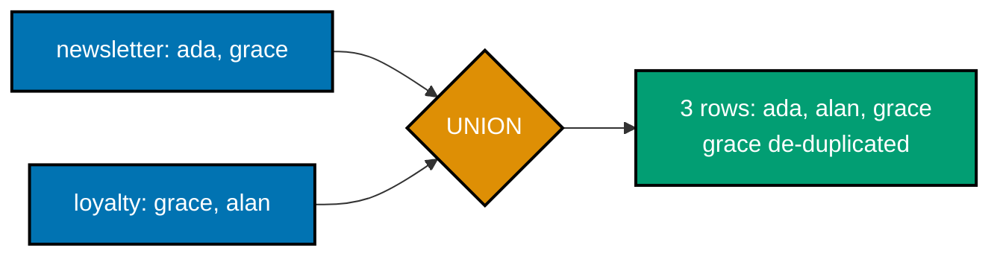

**`learning/code/ex-13-union-vs-union-all/example.sql`**

```sql
-- Example 13: UNION vs UNION ALL.
-- UNION (co-07) combines two result sets AND removes duplicate rows -- UNION ALL
-- combines them and KEEPS every duplicate. Same two inputs, different row counts out.
SET
  client_min_messages TO WARNING;

DROP TABLE IF EXISTS newsletter_signup,
loyalty_signup CASCADE;

-- => resets state -- this example is fully self-contained
-- Both tables use email as a bare TEXT PRIMARY KEY -- no surrogate id column at
-- all -- deliberately minimal so UNION's row-level comparison has exactly one
-- column to reason about.
CREATE TABLE newsletter_signup (email TEXT PRIMARY KEY);

-- Two structurally IDENTICAL single-column tables (same type, same constraint)
-- -- UNION/UNION ALL require the two SELECTs to return the same NUMBER of
-- columns with compatible types, though the source tables need not match otherwise.
CREATE TABLE loyalty_signup (email TEXT PRIMARY KEY);

-- => two independent lists -- some emails overlap
-- grace@example.com is deliberately seeded into BOTH tables -- the one row
-- UNION will collapse and UNION ALL will duplicate, making the contrast visible.
-- Two rows per table is the minimum needed to demonstrate all three cases at
-- once: an email unique to newsletter, one unique to loyalty, and one shared.
INSERT INTO
  newsletter_signup (email)
VALUES
  ('ada@example.com'),
  ('grace@example.com');

INSERT INTO
  loyalty_signup (email)
VALUES
  ('grace@example.com'),
  ('alan@example.com');

-- => grace@example.com appears in BOTH lists
-- UNION (co-07) de-duplicates: grace@example.com collapses to ONE row in the output.
-- Because email is PRIMARY KEY in each source table, duplicates can only arise
-- ACROSS the two tables (like grace here), never WITHIN a single one -- UNION's
-- de-duplication step is doing real work only on that cross-table overlap.
SELECT
  email
FROM
  -- UNION's de-duplication compares ENTIRE output rows for equality -- with a
  -- single email column that means exact string equality; a multi-column UNION
  -- would require every column to match before two rows count as duplicates.
  newsletter_signup
UNION
SELECT
  email
FROM
  loyalty_signup
  -- ORDER BY applies to the COMBINED result of both SELECTs, not to either side
  -- individually -- it must reference an output column name/position, not a
  -- table-qualified column, since the two source tables no longer exist by this point.
ORDER BY
  email;

-- => 3 rows: ada, alan, grace -- grace appears only ONCE
-- UNION ALL keeps every row from both sides, duplicates included -- grace appears TWICE.
-- UNION ALL is cheaper than UNION whenever duplicates are acceptable (or known
-- impossible) -- it skips the sort/hash step UNION needs internally to detect
-- and remove duplicate rows, which matters once the combined row count is large.
SELECT
  email
FROM
  newsletter_signup
  -- Same two source SELECTs as above, same ORDER BY -- UNION ALL is the ONLY
  -- thing that changed, isolating exactly what de-duplication costs/changes.
UNION ALL
SELECT
  email
FROM
  loyalty_signup
ORDER BY
  email;

-- => 4 rows: ada, alan, grace, grace -- no de-duplication happened
-- Choosing UNION vs UNION ALL is a correctness decision, not just a performance
-- one -- reaching for UNION ALL on data with real overlap (like these two lists)
-- would silently double-count grace@example.com in any downstream aggregation.
-- Both queries return the SAME 4 total rows from the underlying tables -- only
-- how those rows get COMBINED differs between the two set operators.
```

**Run**: `psql -U asqp -d asqp -f example.sql`

**Output**:

```text
       email
-------------------
 ada@example.com
 alan@example.com
 grace@example.com
(3 rows)

       email
-------------------
 ada@example.com
 alan@example.com
 grace@example.com
 grace@example.com
(4 rows)
```

**Key takeaway**: `UNION`'s de-duplication requires an implicit sort-or-hash over the combined result --
when you already know the two sides are disjoint (or duplicates are fine), `UNION ALL` avoids that
extra work entirely and is strictly cheaper.

**Why it matters**: Combining rows from a current table and an archive table, or from several
per-region tables, is a common `UNION ALL` use case in production reporting -- reaching for `UNION`
by habit when `UNION ALL` would do is a routine, easy-to-miss performance cost that `EXPLAIN` (Example 22) makes visible as an extra sort or hash-aggregate node in the plan.

---

### Example 14: INTERSECT and EXCEPT

_ex-14 &middot; exercises co-07_

`INTERSECT` keeps only rows present in **both** result sets. `EXCEPT` keeps rows from the **first**
set that are absent from the second -- operand order matters for `EXCEPT` in a way it does not for
`INTERSECT` or `UNION`.

**`learning/code/ex-14-intersect-except/example.sql`**

```sql
-- Example 14: INTERSECT and EXCEPT.
-- INTERSECT (co-07) keeps only rows present in BOTH result sets. EXCEPT keeps rows
-- from the FIRST set that are absent from the second -- order of operands matters.
SET
  client_min_messages TO WARNING;

DROP TABLE IF EXISTS newsletter_signup,
loyalty_signup CASCADE;

-- => resets state -- this example is fully self-contained
-- Reuses the exact same two-table, two-row-each shape as Example 13 -- only the
-- SET OPERATOR changes, isolating INTERSECT/EXCEPT semantics from schema noise.
CREATE TABLE newsletter_signup (email TEXT PRIMARY KEY);

-- email TEXT PRIMARY KEY on both tables guarantees no WITHIN-table duplicates
-- exist -- so any de-duplication INTERSECT/EXCEPT perform is purely a function
-- of cross-table overlap, identical in spirit to Example 13's UNION case.
CREATE TABLE loyalty_signup (email TEXT PRIMARY KEY);

-- => two independent lists -- some emails overlap
-- The same overlap pattern as Example 13: grace@example.com seeded into both
-- lists is what makes INTERSECT return exactly one row below.
INSERT INTO
  newsletter_signup (email)
VALUES
  ('ada@example.com'),
  ('grace@example.com');

-- alan@example.com appears ONLY in loyalty_signup -- the mirror-image edge case
-- to ada@example.com, which appears ONLY in newsletter_signup.
INSERT INTO
  loyalty_signup (email)
VALUES
  ('grace@example.com'),
  ('alan@example.com');

-- => grace@example.com is the only email in BOTH lists
-- INTERSECT (co-07) keeps rows appearing on BOTH sides -- only grace qualifies.
-- INTERSECT (unlike INNER JOIN on email) needs no explicit join condition --
-- it compares entire output ROWS between the two SELECTs and keeps only the
-- ones present on BOTH sides, which is a set operation, not a row-matching one.
-- Neither query needs DISTINCT -- INTERSECT and EXCEPT are inherently
-- set-based and de-duplicate their OWN result by default, same as UNION.
SELECT
  email
FROM
  newsletter_signup
  -- Both SELECTs must again return the same number/type of columns, exactly as
  -- UNION required in Example 13 -- every set operator shares that column-shape rule.
INTERSECT
SELECT
  email
FROM
  loyalty_signup;

-- => 1 row: grace@example.com -- subscribed to BOTH programs
-- EXCEPT keeps rows from the LEFT side with no match on the right -- newsletter
-- subscribers who never joined the loyalty program.
-- EXCEPT is ORDER-SENSITIVE: "newsletter_signup EXCEPT loyalty_signup" reads
-- "newsletter rows with no loyalty match" -- swapping the two SELECTs around
-- EXCEPT would instead surface loyalty-only subscribers (alan@example.com).
SELECT
  email
FROM
  newsletter_signup
  -- Some other database systems spell this operator MINUS instead of EXCEPT --
  -- Postgres (following the SQL standard) uses EXCEPT; MINUS is not recognized.
EXCEPT
SELECT
  email
FROM
  loyalty_signup;

-- => 1 row: ada@example.com -- newsletter-only, never loyalty
-- INTERSECT and EXCEPT compose the same way UNION does -- they can be chained,
-- wrapped in a CTE, or combined with ORDER BY/LIMIT on the final combined result,
-- though neither query here needed an explicit ORDER BY to get one row back.
```

**Run**: `psql -U asqp -d asqp -f example.sql`

**Output**:

```text
       email
-------------------
 grace@example.com
(1 row)

      email
-----------------
 ada@example.com
(1 row)
```

**Key takeaway**: `A EXCEPT B` and `B EXCEPT A` are generally different result sets -- unlike
`INTERSECT`, which is commutative, swapping `EXCEPT`'s operands answers a completely different
question ("newsletter-only" versus "loyalty-only").

**Why it matters**: `EXCEPT` is the direct SQL expression of "find rows in A missing from B" -- a
reconciliation query (records in a source system absent from a destination system) or a churn query
(users who signed up but never converted). It is a cleaner, set-based alternative to a `LEFT JOIN ...
WHERE right.id IS NULL` anti-join for this specific whole-row comparison case.

---

### Example 15: GROUP BY ROLLUP

_ex-15 &middot; exercises co-08_

`ROLLUP(region, category)` produces the normal per-`(region, category)` groups **plus** a subtotal per
region **plus** one grand total -- three levels of aggregation in a single pass, instead of three
separate queries `UNION`'d together.

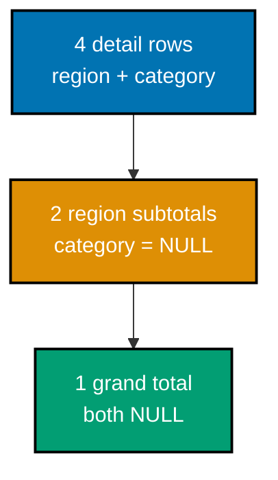

**`learning/code/ex-15-group-by-rollup/example.sql`**

```sql
-- Example 15: GROUP BY ROLLUP.
-- ROLLUP(region, category) (co-08) produces the normal per-(region,category) groups
-- PLUS a subtotal per region PLUS one grand total -- three levels in a single pass.
SET
  client_min_messages TO WARNING;

DROP TABLE IF EXISTS sale CASCADE;

-- => resets state -- this example is fully self-contained
-- region/category are plain TEXT dimensions -- ROLLUP works with any GROUP BY
-- column list, not just two; each extra column adds one more subtotal level.
CREATE TABLE sale (
  id INTEGER PRIMARY KEY,
  region TEXT NOT NULL,
  category TEXT NOT NULL,
  -- amount is NOT NULL, so SUM never has to special-case a missing value while
  -- rolling up -- a nullable amount would still SUM correctly (NULLs are skipped).
  amount NUMERIC(8, 2) NOT NULL
);

-- => sale table exists, currently empty
-- Two regions, two categories, one row per combination -- the smallest dataset
-- that still produces a distinct subtotal per region under ROLLUP.
INSERT INTO
  sale (id, region, category, amount)
VALUES
  (1, 'East', 'Books', 100.00),
  (2, 'East', 'Games', 50.00),
  (3, 'West', 'Books', 80.00),
  (4, 'West', 'Games', 40.00);

-- => 4 rows across 2 regions x 2 categories
-- ROLLUP(region, category) (co-08) rolls up right-to-left: full detail rows first,
-- then region subtotals (category = NULL), then one grand total (both NULL).
SELECT
  region,
  category,
  -- SUM(amount) is the only aggregate here, but ROLLUP composes with COUNT(*),
  -- AVG(), or several aggregates side by side -- the rollup mechanics don't care
  -- how many aggregate columns ride along in the SELECT list.
  SUM(amount) AS total
FROM
  sale
  -- Argument ORDER matters: ROLLUP(region, category) subtotals region first (the
  -- LEFTMOST column), then rolls all the way up to a grand total -- ROLLUP(category,
  -- region) would instead produce category subtotals, a different hierarchy.
GROUP BY
  ROLLUP (region, category)
  -- NULLS LAST is required here because ROLLUP represents a subtotal/grand-total
  -- row by putting an actual NULL in the rolled-up column -- without NULLS LAST,
  -- Postgres's default NULLS FIRST would sort those summary rows to the TOP.
ORDER BY
  region NULLS LAST,
  category NULLS LAST;

-- => 4 detail rows + 2 region subtotals + 1 grand total = 7 rows
-- => grand total row: region NULL, category NULL, total 270.00
-- The 4 detail rows plus 3 summary rows all come from ONE table scan and ONE
-- aggregation pass -- computing the same three levels with separate GROUP BY
-- queries UNIONed together would scan the table three times instead.
```

**Run**: `psql -U asqp -d asqp -f example.sql`

**Output** (blank cells are `NULL` -- PostgreSQL's subtotal marker):

```text
 region | category | total
--------+----------+--------
 East   | Books    | 100.00
 East   | Games    |  50.00
 East   |          | 150.00
 West   | Books    |  80.00
 West   | Games    |  40.00
 West   |          | 120.00
        |          | 270.00
(7 rows)
```

**Key takeaway**: `ROLLUP` is positional and hierarchical -- `ROLLUP(region, category)` rolls up in
that order (full detail, then drop `category`, then drop `region` too), so column order in the
`ROLLUP(...)` list changes which subtotal levels you get.

**Why it matters**: Financial and sales reports routinely need "detail, subtotal, grand total" in one
result set for a pivot table or spreadsheet export -- `ROLLUP` produces exactly that shape without a
`UNION ALL` of three separately-grouped queries. Example 16 shows `GROUPING SETS`, the more explicit
tool for when you want independent totals that `ROLLUP`'s fixed hierarchy cannot express.

---

### Example 16: Grouping Sets

_ex-16 &middot; exercises co-08_

`GROUPING SETS` lists exactly the groupings you want -- no automatic roll-up hierarchy -- so you can
mix independent totals (by region, by category, and overall) in one result set without the
region-and-category detail rows `ROLLUP` would have included.

**`learning/code/ex-16-grouping-sets/example.sql`**

```sql
-- Example 16: Grouping Sets.
-- GROUPING SETS (co-08) lists exactly the groupings you want -- no automatic
-- roll-up hierarchy -- so you can mix independent totals in ONE result set.
SET
  client_min_messages TO WARNING;

DROP TABLE IF EXISTS sale CASCADE;

-- => resets state -- this example is fully self-contained
-- Same sale schema and same 4 seed rows as Example 15 -- deliberately identical,
-- so the difference in OUTPUT below is attributable entirely to GROUPING SETS
-- vs ROLLUP, not to any change in the underlying data.
CREATE TABLE sale (
  id INTEGER PRIMARY KEY,
  region TEXT NOT NULL,
  category TEXT NOT NULL,
  amount NUMERIC(8, 2) NOT NULL
);

-- => sale table exists, currently empty
INSERT INTO
  sale (id, region, category, amount)
VALUES
  (1, 'East', 'Books', 100.00),
  (2, 'East', 'Games', 50.00),
  (3, 'West', 'Books', 80.00),
  (4, 'West', 'Games', 40.00);

-- => same 4 rows as Example 15 -- different grouping request
-- GROUPING SETS((region), (category), ()) (co-08) asks for exactly THREE groupings:
-- totals by region, totals by category, and one grand total -- no per-cell detail rows.
-- A single GROUP BY GROUPING SETS(...) still scans the sale table only ONCE --
-- the same single-pass efficiency ROLLUP offers, just with full control over
-- exactly which combinations of columns get their own subtotal row.
SELECT
  region,
  category,
  SUM(amount) AS total
FROM
  sale
  -- Each parenthesized entry is one INDEPENDENT grouping: (region) groups by region
  -- alone, (category) by category alone, () is the empty grouping -- the grand
  -- total with no GROUP BY columns at all. None of the three implies the others.
  -- Unlike ROLLUP, GROUPING SETS never implies a hierarchy between its entries --
  -- swapping the order of (region), (category), () changes nothing about which
  -- rows appear, only (via ORDER BY) their display order.
GROUP BY
  GROUPING SETS ((region), (category), ())
  -- NULLS LAST is needed for the same reason as Example 15 -- every grouping set
  -- that OMITS a column fills it with NULL in the output, and Postgres defaults
  -- to sorting NULLs first unless told otherwise.
ORDER BY
  region NULLS LAST,
  category NULLS LAST;

-- => 2 region-total rows + 2 category-total rows + 1 grand total
-- => NO region+category detail rows -- ROLLUP would have included them
-- ROLLUP(region, category) is actually shorthand for a SPECIFIC grouping-sets
-- list: GROUPING SETS((region, category), (region), ()) -- GROUPING SETS is the
-- more general primitive; ROLLUP and CUBE are convenience syntax built on top of it.
```

**Run**: `psql -U asqp -d asqp -f example.sql`

**Output**:

```text
 region | category | total
--------+----------+--------
 East   |          | 150.00
 West   |          | 120.00
        | Books    | 180.00
        | Games    |  90.00
        |          | 270.00
(5 rows)
```

**Key takeaway**: `ROLLUP(a, b)` is shorthand for the specific grouping-set list `((a, b), (a), ())` --
`GROUPING SETS` is the general form, letting you request any combination of groupings (including
non-hierarchical ones like "by region" and "by category" independently, with no combined cell).

**Why it matters**: A single dashboard query that needs "totals by region," "totals by category," AND
"grand total," but explicitly NOT the region-by-category cross-tabulation, can only be expressed with
`GROUPING SETS` -- `ROLLUP` and `CUBE` (Example 39, Intermediate tier) both produce extra combinations
you would otherwise have to filter out afterward.

---

### Example 17: FILTER Aggregate

_ex-17 &middot; exercises co-10_

`FILTER (WHERE ...)` restricts what **one** aggregate call counts, letting several differently-filtered
aggregates run side by side in a single query pass over the same rows -- no `CASE` expression required.

**`learning/code/ex-17-filter-aggregate/example.sql`**

```sql
-- Example 17: FILTER Aggregate.
-- FILTER (WHERE ...) (co-10) restricts what ONE aggregate call counts, letting
-- several differently-filtered aggregates run side by side in a single query pass.
SET
  client_min_messages TO WARNING;

DROP TABLE IF EXISTS sale CASCADE;

-- => resets state -- this example is fully self-contained
-- No region column this time -- category alone is enough to demonstrate FILTER,
-- since the point here is comparing aggregates, not grouping dimensions.
CREATE TABLE sale (
  id INTEGER PRIMARY KEY,
  -- category is NOT NULL -- FILTER's WHERE clause never has to reckon with a NULL
  -- category turning the comparison to UNKNOWN and silently excluding a row.
  category TEXT NOT NULL,
  amount NUMERIC(8, 2) NOT NULL
);

-- => sale table exists, currently empty
-- 3 Books rows and 2 Games rows -- an intentionally uneven split so
-- books_via_filter (3) is visibly different from total_rows (5).
INSERT INTO
  sale (id, category, amount)
VALUES
  (1, 'Books', 100.00),
  (2, 'Games', 50.00),
  (3, 'Books', 80.00),
  (4, 'Games', 40.00),
  (5, 'Books', 20.00);

-- => 5 rows: 3 Books, 2 Games
-- COUNT(*) FILTER (WHERE category = 'Books') (co-10) counts ONLY rows matching the
-- filter -- the plain COUNT(*) alongside it still counts every row, unfiltered.
SELECT
  COUNT(*) AS total_rows,
  -- FILTER (WHERE ...) is SQL-standard syntax attached directly to an aggregate
  -- call -- it only affects THAT aggregate, unlike a query-level WHERE clause,
  -- which would filter every row (and every aggregate) before aggregation even starts.
  COUNT(*) FILTER (
    WHERE
      category = 'Books'
  ) AS books_via_filter,
  -- COUNT(expr) counts only NON-NULL values of expr -- the CASE here has no ELSE,
  -- so non-Books rows evaluate to NULL and are silently excluded from the count.
  -- This CASE trick predates FILTER (added in SQL:2003 vs FILTER's SQL:2011) and
  -- still appears constantly in codebases and engines without FILTER support.
  COUNT(
    CASE
      WHEN category = 'Books' THEN 1
    END
  ) AS books_via_case
FROM
  -- All three aggregates run in a SINGLE pass over sale -- FILTER and the CASE
  -- trick both avoid the need for three separate queries (or a self-join) to
  -- get an overall count alongside a conditionally-filtered one.
  sale;

-- => total_rows 5 -- every row, no filtering at all
-- => books_via_filter 3 -- FILTER and CASE agree exactly
-- => books_via_case 3 -- the older, more verbose equivalent
-- FILTER is generally preferred over the CASE trick when available: it reads
-- as "count these, filtered by this condition" directly, rather than requiring
-- the reader to notice a deliberately-omitted ELSE and infer NULL-counting behavior.
```

**Run**: `psql -U asqp -d asqp -f example.sql`

**Output**:

```text
 total_rows | books_via_filter | books_via_case
------------+------------------+----------------
          5 |                3 |              3
(1 row)
```

**Key takeaway**: `COUNT(*) FILTER (WHERE cond)` and `COUNT(CASE WHEN cond THEN 1 END)` are
equivalent, but `FILTER` reads as intent ("count these, filtered") rather than a workaround, and it
generalizes cleanly to any aggregate (`SUM(...) FILTER (WHERE ...)`, `AVG(...) FILTER (WHERE ...)`).

**Why it matters**: Dashboards routinely need several differently-scoped counts from one table scan --
"total orders," "cancelled orders," "orders over $100" -- computing them with separate queries means
scanning the table multiple times. `FILTER` computes them all in the single pass the query planner
already has to do for the base aggregation, which Example 18 extends to conditional sums for a pivot.

---

### Example 18: Conditional SUM (CASE Pivot)

_ex-18 &middot; exercises co-10_

`SUM(CASE WHEN ... THEN amount ELSE 0 END)` pivots category values into separate **columns** -- one row
per region, one column per category -- turning a tall, narrow result into a wide, spreadsheet-shaped
one.

**`learning/code/ex-18-conditional-sum-case/example.sql`**

```sql
-- Example 18: Conditional SUM (CASE Pivot).
-- SUM(CASE WHEN ... THEN amount ELSE 0 END) (co-10) pivots category values into
-- separate COLUMNS -- one row per region, one column per category, ELSE 0 protects the SUM.
SET
  client_min_messages TO WARNING;

DROP TABLE IF EXISTS sale CASCADE;

-- => resets state -- this example is fully self-contained
-- Same region/category/amount shape as Examples 15-16 -- this time pivoted into
-- columns instead of rolled up into subtotal rows, a different way to slice
-- the identical two-dimensional data.
CREATE TABLE sale (
  id INTEGER PRIMARY KEY,
  region TEXT NOT NULL,
  category TEXT NOT NULL,
  -- amount is NOT NULL and always non-negative in this seed data -- ELSE 0 stays
  -- a safe "no contribution" sentinel because it can never collide with a real
  -- negative amount that would need to be distinguished from "filtered out".
  amount NUMERIC(8, 2) NOT NULL
);

-- => sale table exists, currently empty
INSERT INTO
  sale (id, region, category, amount)
VALUES
  (1, 'East', 'Books', 100.00),
  (2, 'East', 'Games', 50.00),
  (3, 'West', 'Books', 80.00),
  (4, 'West', 'Games', 40.00);

-- => 4 rows across 2 regions x 2 categories
-- Each CASE (co-10) tests category and contributes amount ONLY on a match --
-- ELSE 0 is essential: without it, SUM would treat non-matching rows as NULL and
-- PostgreSQL's SUM silently skips NULLs, which would still work here but is fragile.
-- This is the classic "pivot" idiom: GROUP BY the row dimension (region), then
-- one SUM(CASE ...) expression PER desired output column (Books, Games) turns
-- category VALUES into column HEADERS -- something GROUP BY alone cannot do.
SELECT
  region,
  SUM(
    CASE
      WHEN category = 'Books' THEN amount
      -- ELSE 0 (rather than omitting ELSE) makes every row contribute EXACTLY 0 or
      -- amount to books_total -- omitting ELSE would make non-Books rows evaluate to
      -- NULL, which SUM also skips, giving the identical result here but relying on
      -- SUM's NULL-skipping behavior instead of stating the intent explicitly.
      ELSE 0
    END
  ) AS books_total,
  -- games_total repeats the exact same CASE pattern with the condition flipped --
  -- each additional category in a real dataset would need its own repeated
  -- SUM(CASE...) column, which is this technique's main scaling weakness.
  SUM(
    CASE
      WHEN category = 'Games' THEN amount
      ELSE 0
    END
  ) AS games_total
FROM
  -- Every row is scanned by BOTH CASE expressions -- Postgres does not skip the
  -- Games check for a Books row or vice versa; each CASE independently decides
  -- whether to contribute its own row's amount.
  sale
  -- GROUP BY region alone (not region, category) is what collapses East's two
  -- rows (Books 100, Games 50) into one output row with both pivoted totals
  -- side by side -- grouping by category too would defeat the whole pivot.
GROUP BY
  region
  -- ORDER BY region only re-sorts the already-pivoted 2-row result for display --
  -- East/West's books_total and games_total values were fixed by GROUP BY, not by
  -- this final ordering step.
ORDER BY
  region;

-- => East: books_total 100.00, games_total 50.00
-- => West: books_total 80.00, games_total 40.00
-- Contrast with crosstab()/tablefunc (Example 39): this manual CASE-pivot
-- approach needs one hand-written column per category and breaks once a new
-- category appears, while crosstab() can generate columns more dynamically.
```

**Run**: `psql -U asqp -d asqp -f example.sql`

**Output**:

```text
 region | books_total | games_total
--------+-------------+-------------
 East   |      100.00 |       50.00
 West   |       80.00 |       40.00
(2 rows)
```

**Key takeaway**: The `ELSE 0` is not optional decoration -- for a `SUM`, an omitted `ELSE` defaults to
`NULL`, and while `SUM` happens to skip `NULL`s safely, an `ELSE 0` makes the intent explicit and
matters for aggregates (like `AVG`) where a `NULL` versus a `0` changes the denominator.

**Why it matters**: This `CASE`-pivot pattern is how SQL builds a spreadsheet-style crosstab report
(regions as rows, categories as columns) without a dedicated `PIVOT` operator, which PostgreSQL does
not have natively (the `tablefunc` extension's `crosstab()` is the alternative for a fully dynamic
column set). Example 39 (Intermediate tier) revisits the same data with `CUBE` for every combination
at once, trading explicit columns for a taller result set.

---

### Example 19: BEGIN, COMMIT, and ROLLBACK

_ex-19 &middot; exercises co-11_

`BEGIN` opens a transaction: every write inside it is provisional until `COMMIT` makes it durable, or
`ROLLBACK` discards **all** of it -- both writes below vanish together, as if neither statement had
ever run.


**`learning/code/ex-19-begin-commit-rollback/example.sql`**

```sql
-- Example 19: BEGIN, COMMIT, and ROLLBACK.
-- BEGIN (co-11) opens a transaction: every write inside it is provisional until
-- COMMIT makes it durable, or ROLLBACK discards ALL of it -- both writes below, undone together.
SET
  client_min_messages TO WARNING;

DROP TABLE IF EXISTS account CASCADE;

-- => resets state -- this example is fully self-contained
-- balance uses NUMERIC(10, 2), the same money-safe precision pattern as price in
-- earlier examples -- transaction semantics here are independent of that choice,
-- but exact arithmetic still matters once real balances are being debited.
CREATE TABLE account (
  id INTEGER PRIMARY KEY,
  name TEXT NOT NULL,
  balance NUMERIC(10, 2) NOT NULL
);

-- => account table exists, currently empty
-- A single starting account keeps the before/after comparison trivial: one row,
-- one balance, easy to eyeball against the final SELECT's output.
INSERT INTO
  account (id, name, balance)
VALUES
  (1, 'checking', 500.00);

-- => one starting account, balance 500.00
-- BEGIN (co-11) starts the transaction -- both writes below are provisional.
-- Outside a BEGIN...COMMIT/ROLLBACK block, Postgres runs every statement in its
-- OWN implicit transaction, auto-committed immediately -- BEGIN is what turns
-- multiple statements into a SINGLE atomic unit that can still be undone.
BEGIN;

-- "balance = balance - 100" reads the CURRENT row's balance and writes back a
-- new value in one statement -- transactionally safe on its own, but this
-- example's point is what happens when a SECOND statement follows it.
UPDATE account
SET
  balance = balance - 100
WHERE
  id = 1;

-- => balance is now 400.00 -- but ONLY inside this transaction
-- This INSERT happens in the SAME transaction as the UPDATE above -- both are
-- still provisional together; nothing here has touched disk in a way any OTHER
-- connection could observe yet (see Example 27 for what other sessions see).
INSERT INTO
  account (id, name, balance)
VALUES
  (2, 'savings', 100.00);

-- => a second account appears -- also only provisional so far
-- ROLLBACK discards EVERY write since BEGIN, as if neither statement ever ran.
-- ROLLBACK has no way to undo "just the INSERT" or "just the UPDATE" --
-- transactions are all-or-nothing units; every write since the matching BEGIN
-- is discarded together, regardless of how many separate statements ran.
ROLLBACK;

-- Verify: the original balance is untouched and the savings account never persisted.
-- If COMMIT had been used instead of ROLLBACK, this SELECT would instead show
-- 2 rows (checking at 400.00, savings at 100.00) -- swap the keyword and re-run
-- to see the opposite outcome for yourself.
SELECT
  id,
  name,
  balance
FROM
  account
ORDER BY
  id;

-- => exactly 1 row: checking, balance still 500.00
```

**Run**: `psql -U asqp -d asqp -f example.sql`

**Output**:

```text
 id |   name   | balance
----+----------+---------
  1 | checking |  500.00
(1 row)
```

**Key takeaway**: Outside an explicit `BEGIN`, PostgreSQL runs every statement in its own implicit
one-statement transaction (autocommit) -- `BEGIN` is what groups multiple statements so they succeed
or fail as one atomic unit instead of independently.

**Why it matters**: Any operation touching more than one row across more than one statement --
transferring money between two accounts, creating an order and its line items together -- needs
`BEGIN`/`COMMIT` to guarantee the database never shows a half-finished state to a concurrent reader.
Example 72 in this topic's capstone-adjacent examples and Example 20 both build directly on this
transaction boundary.

---

### Example 20: Atomicity Failure

_ex-20 &middot; exercises co-11_

PostgreSQL's atomicity guarantee is strict: the moment one statement in a transaction errors, the whole
transaction is marked **aborted** -- every later statement is rejected too, even perfectly valid ones,
until you `ROLLBACK`.

**`learning/code/ex-20-atomicity-failure/example.sql`**

```sql
-- Example 20: Atomicity Failure.
-- PostgreSQL's atomicity guarantee (co-11) is strict: the MOMENT one statement in a
-- transaction errors, the whole transaction is marked "aborted" -- every later
-- statement is rejected too, even valid ones, until you ROLLBACK.
SET
  client_min_messages TO WARNING;

DROP TABLE IF EXISTS account CASCADE;

-- => resets state -- this example is fully self-contained
-- CHECK (balance >= 0) is a table-level integrity rule enforced by Postgres
-- itself on every INSERT/UPDATE -- unlike the application-level validation that
-- would need to run BEFORE issuing a write, this check cannot be bypassed.
CREATE TABLE account (
  id INTEGER PRIMARY KEY,
  name TEXT NOT NULL,
  balance NUMERIC(10, 2) NOT NULL CHECK (balance >= 0)
);

-- => CHECK enforces balance can never go negative
-- One starting account at 500.00 -- comfortably enough for the 'savings' insert
-- below to succeed, but not enough to survive the 1000.00 debit that follows it.
INSERT INTO
  account (id, name, balance)
VALUES
  (1, 'checking', 500.00);

-- => one starting account, balance 500.00
-- No explicit comment repeated here for BEGIN itself -- see Example 19 for what
-- BEGIN does; this example's focus is what happens when a LATER statement fails.
BEGIN;

-- This INSERT is individually valid and succeeds -- the point of this example is
-- that its validity alone will NOT be enough to save it once a later statement
-- in the same transaction fails.
INSERT INTO
  account (id, name, balance)
VALUES
  (2, 'savings', 100.00);

-- => succeeds so far -- this write is still provisional
-- Subtracting 1000 from 500 is arithmetically fine -- CHECK constraints run at
-- WRITE time, evaluating the RESULTING row, not the arithmetic expression itself;
-- -500 fails balance >= 0 the instant Postgres tries to store that new row.
UPDATE account
SET
  balance = balance - 1000
WHERE
  id = 1;

-- => 500 - 1000 = -500 violates CHECK(balance >= 0)
-- => raises: new row for relation "account" violates check constraint
-- => the transaction is now ABORTED -- every command below fails too
-- This statement is syntactically and semantically perfect on its own -- it
-- fails ONLY because the transaction is already marked aborted from the CHECK
-- violation above; Postgres will not even attempt to validate/execute it.
INSERT INTO
  account (id, name, balance)
VALUES
  (3, 'reserve', 50.00);

-- => rejected even though it is perfectly valid on its own
-- => raises: current transaction is aborted, commands ignored
-- Postgres offers no "resume" from an aborted transaction -- unlike a savepoint-
-- scoped failure (which can ROLLBACK TO SAVEPOINT and continue), a bare aborted
-- transaction can only be fully rolled back, never partially recovered.
ROLLBACK;

-- => the only way out of an aborted transaction is ROLLBACK
-- Verify: NEITHER the valid 'savings' insert NOR the failed UPDATE survived --
-- atomicity means "all or nothing," and here it was "nothing."
-- Note that even the 'savings' INSERT -- which never violated anything -- is
-- gone too: atomicity does not distinguish between the statement that caused
-- the failure and innocent statements that merely shared its transaction.
SELECT
  id,
  name,
  balance
FROM
  account
ORDER BY
  id;

-- => exactly 1 row: checking, balance still 500.00
```

**Run**: `psql -U asqp -d asqp -f example.sql`

**Output** (captured for real -- this is PostgreSQL 18.4's exact error text):

```text
psql:example.sql:16: ERROR:  new row for relation "account" violates check constraint "account_balance_check"
DETAIL:  Failing row contains (1, checking, -500.00).
psql:example.sql:20: ERROR:  current transaction is aborted, commands ignored until end of transaction block
 id |   name   | balance
----+----------+---------
  1 | checking |  500.00
(1 row)
```

**Key takeaway**: A single failed statement inside a PostgreSQL transaction poisons every subsequent
statement until `ROLLBACK` (or a `SAVEPOINT`, not shown here) -- this is stricter than some other
databases, which let you keep issuing statements after an error inside the same transaction.

**Why it matters**: This strictness is a deliberate correctness guarantee, not a limitation --
PostgreSQL refuses to let a transaction silently continue in a state where an earlier write it
implicitly promised was already rejected. Application code that retries individual statements inside
a transaction after an error (instead of rolling back the whole transaction) is a common,
hard-to-diagnose production bug this behavior exists specifically to surface immediately.

---

### Example 21: Create B-tree Index

_ex-21 &middot; exercises co-18_

`CREATE INDEX` builds a sorted, separate on-disk structure over a column. B-tree is PostgreSQL's
default index type -- and, unlike a hash index, it supports equality **and** range (`<`, `>`,
`BETWEEN`) queries and ordered scans.

**`learning/code/ex-21-create-btree-index/example.sql`**

```sql
-- Example 21: Create B-tree Index.
-- CREATE INDEX (co-18) builds a sorted, separate on-disk structure over a column --
-- B-tree is PostgreSQL's default index type, good for equality AND range queries.
SET
  client_min_messages TO WARNING;

DROP TABLE IF EXISTS book,
author CASCADE;

-- => resets state -- this example is fully self-contained
-- The same author/book schema from Examples 1-5 -- reused here so the CREATE
-- INDEX statement below is the ONLY new concept this example introduces.
CREATE TABLE author (id INTEGER PRIMARY KEY, name TEXT NOT NULL);

CREATE TABLE book (
  id INTEGER PRIMARY KEY,
  title TEXT NOT NULL,
  price NUMERIC(6, 2) NOT NULL,
  author_id INTEGER REFERENCES author (id)
);

-- => both tables exist, currently empty
-- A single book row is deliberately enough -- this example is about proving an
-- index exists and inspecting its catalog entry, not about query results over
-- a meaningfully sized dataset (Example 22 onward uses much larger tables for that).
INSERT INTO
  author (id, name)
VALUES
  (1, 'Ada Lovelace');

INSERT INTO
  book (id, title, price, author_id)
VALUES
  (1, 'Clean Code', 29.99, 1);

-- => a minimal seed -- this example is about the index, not data
-- CREATE INDEX <name> ON <table>(<column>) (co-18) builds a B-tree over book.price --
-- PostgreSQL names it explicitly here rather than relying on the auto-generated name.
-- CREATE INDEX defaults to the B-tree access method when none is specified --
-- writing this as CREATE INDEX ... USING btree ... ON book(price) would be
-- exactly equivalent; B-tree is the right default for equality and range
-- predicates alike (=, <, >, BETWEEN, ORDER BY).
CREATE INDEX idx_book_price ON book (price);

-- => the index now exists as a separate on-disk structure
-- pg_indexes (a system catalog view) proves the index was actually created and
-- shows the exact CREATE INDEX statement PostgreSQL stored for it.
-- pg_indexes is a convenience VIEW over the lower-level pg_index/pg_class system
-- catalogs -- it joins them together and formats the index definition as
-- ready-to-read DDL text, rather than requiring manual catalog joins.
SELECT
  indexname,
  indexdef
FROM
  pg_indexes
  -- pg_indexes is NOT scoped to one table by default -- it lists every index in
  -- the current database across every table, so this WHERE clause is what narrows
  -- the result down to book's indexes specifically.
WHERE
  tablename = 'book'
ORDER BY
  indexname;

-- => 2 indexes: the PRIMARY KEY's auto-created index, and idx_book_price
-- The auto-created PRIMARY KEY index already existed before this script ran
-- CREATE INDEX at all -- declaring PRIMARY KEY implicitly builds a unique
-- B-tree index on that column; idx_book_price is the ONLY index this script
-- explicitly created.
```

**Run**: `psql -U asqp -d asqp -f example.sql`

**Output**:

```text
   indexname    |                            indexdef
-----------------+------------------------------------------------------------------
 book_pkey       | CREATE UNIQUE INDEX book_pkey ON public.book USING btree (id)
 idx_book_price  | CREATE INDEX idx_book_price ON public.book USING btree (price)
(2 rows)
```

**Key takeaway**: Declaring a column `PRIMARY KEY` (or `UNIQUE`) already creates a B-tree index behind
the scenes -- `book_pkey` here was never explicitly requested -- so `pg_indexes` is the reliable way to
see every index actually protecting a table, not just the ones you remember writing `CREATE INDEX` for.

**Why it matters**: An index is the single biggest lever for query speed on a large table, but it is
not free: it costs disk space and slows down every `INSERT`/`UPDATE`/`DELETE` that touches the indexed
column (Example 47, Intermediate tier, measures this write cost directly). Example 24 shows the payoff
side of that trade -- the exact moment `EXPLAIN` shows the planner switching from a full table scan to
using this index.

---

### Example 22: EXPLAIN Basic

_ex-22 &middot; exercises co-23_

`EXPLAIN` prints the query **plan** the planner chose, without running the query -- estimated row
counts and abstract cost numbers only. A 100,000-row seed table makes the plan choice (and its cost)
meaningful instead of trivial.

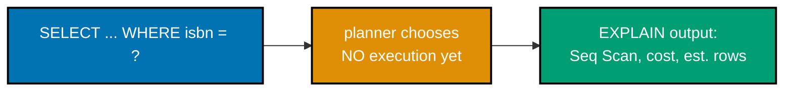

**`learning/code/ex-22-explain-basic/example.sql`**

```sql
-- Example 22: EXPLAIN Basic.
-- EXPLAIN (co-23) prints the query PLAN the planner chose, without running the
-- query -- estimated row counts and costs only, no actual execution happens.
SET client_min_messages TO WARNING;
DROP TABLE IF EXISTS book_catalog CASCADE;
                                    -- => resets state -- this example is fully self-contained
CREATE TABLE book_catalog(id INTEGER PRIMARY KEY, isbn TEXT NOT NULL, price NUMERIC(6,2) NOT NULL, published_year INTEGER NOT NULL);
                                    -- => a wider catalog table, seeded with generated rows below
INSERT INTO book_catalog(id, isbn, price, published_year)
SELECT
    n,
    'ISBN-' || LPAD(n::TEXT, 9, '0'),
    (10 + (n % 90))::NUMERIC,
    2000 + (n % 25)
FROM generate_series(1, 100000) AS n;
                                    -- => 100,000 rows -- large enough for the planner to prefer a
                                    -- => sequential scan for most queries with no matching index

-- EXPLAIN (co-23) with no options shows only the ESTIMATED plan -- "cost=..." is
-- an abstract planner unit, "rows=..." is the planner's row-count ESTIMATE.
-- No ANALYZE keyword here -- plain EXPLAIN never executes the query, so
-- there is no actual row/timing data, only the planner's estimates.
EXPLAIN SELECT * FROM book_catalog WHERE isbn = 'ISBN-000050000';
                                    -- => Seq Scan node -- no index exists on isbn yet
                                    -- => Filter: (isbn = 'ISBN-000050000'::text) -- the predicate applied per row
```

**Run**: `psql -U asqp -d asqp -f example.sql`

**Output** (captured against PostgreSQL 18.4; exact cost numbers depend on `page_cost`/`row_cost`
settings and table size, but the plan shape below is stable):

```text
                            QUERY PLAN
------------------------------------------------------------------
 Seq Scan on book_catalog  (cost=0.00..1646.80 rows=364 width=54)
   Filter: (isbn = 'ISBN-000050000'::text)
(2 rows)
```

**Key takeaway**: `EXPLAIN` alone never touches real data or real timing -- `cost=0.00..1646.80` is the
planner's internal cost unit (roughly, sequential-page-fetches), and `rows=364` is an estimate that can
be wrong, as Example 25 demonstrates directly.

**Why it matters**: `EXPLAIN` is the single most important diagnostic tool for "why is this query
slow" -- it is the first thing engineers reach for before touching any code, because it reveals the
plan the database actually intends to run, not what the query author assumed. Every subsequent
`EXPLAIN`-based example in this topic builds directly on reading this exact output shape: node type,
cost range, and row estimate.

---

### Example 23: EXPLAIN ANALYZE Basic

_ex-23 &middot; exercises co-23_

`EXPLAIN ANALYZE` actually **runs** the query and reports real numbers alongside the estimates --
`actual time` and `actual rows`. New in PostgreSQL 18: buffer hit/read counts print **by default**,
with no separate `BUFFERS` option required (PostgreSQL 17 and earlier required `EXPLAIN (ANALYZE,
BUFFERS)` explicitly).

**`learning/code/ex-23-explain-analyze-basic/example.sql`**

```sql
-- Example 23: EXPLAIN ANALYZE Basic.
-- EXPLAIN ANALYZE (co-23) actually RUNS the query and reports REAL numbers
-- alongside the estimates -- "actual time", "actual rows" -- plus, new in
-- PostgreSQL 18, buffer hit/read counts print BY DEFAULT (no BUFFERS option needed).
SET client_min_messages TO WARNING;
DROP TABLE IF EXISTS book_catalog CASCADE;
                                    -- => resets state -- this example is fully self-contained
CREATE TABLE book_catalog(id INTEGER PRIMARY KEY, isbn TEXT NOT NULL, price NUMERIC(6,2) NOT NULL, published_year INTEGER NOT NULL);
INSERT INTO book_catalog(id, isbn, price, published_year)
SELECT n, 'ISBN-' || LPAD(n::TEXT, 9, '0'), (10 + (n % 90))::NUMERIC, 2000 + (n % 25)
FROM generate_series(1, 100000) AS n;
                                    -- => 100,000 rows -- same catalog shape as Example 22

-- EXPLAIN ANALYZE (co-23) executes the query for real, then reports actual vs
-- estimated side by side -- "rows=364" (estimate) vs "actual rows=1" (reality).
EXPLAIN ANALYZE SELECT * FROM book_catalog WHERE isbn = 'ISBN-000050000';
                                    -- => estimate says rows=364, actual rows=1 -- a real mismatch
                                    -- => Buffers: shared hit=... appears BY DEFAULT in PG 18, no
                                    -- => BUFFERS option needed (PG <18 required EXPLAIN (ANALYZE, BUFFERS))
```

**Run**: `psql -U asqp -d asqp -f example.sql`

**Output** (captured against PostgreSQL 18.4 -- `actual time`/`Execution Time` values vary run to
run and machine to machine; the plan shape and the estimate-vs-actual mismatch do not):

```text
                                                  QUERY PLAN
------------------------------------------------------------------------------------------------------------
 Seq Scan on book_catalog  (cost=0.00..1646.80 rows=364 width=54) (actual time=2.244..4.396 rows=1.00 loops=1)
   Filter: (isbn = 'ISBN-000050000'::text)
   Rows Removed by Filter: 99999
   Buffers: shared hit=736
 Planning:
   Buffers: shared hit=11
 Planning Time: 0.058 ms
 Execution Time: 4.404 ms
(8 rows)
```

**Key takeaway**: `rows=364` (estimate) versus `actual rows=1.00` (reality) is exactly the kind of
mismatch `EXPLAIN` alone can never reveal -- only `ANALYZE` actually runs the query and shows you the
truth, at the cost of really executing every write the query would perform (dangerous on an `UPDATE`
or `DELETE` without wrapping it in a transaction you can roll back).

**Why it matters**: PostgreSQL 18's default `Buffers:` output (`shared hit=736`) tells you the query
touched 736 8KB pages from PostgreSQL's shared buffer cache without a single disk read -- the fastest
possible outcome, and previously invisible unless you remembered to add the `BUFFERS` option by hand.
`actual rows=1.00` also shows PostgreSQL 18's new fractional-row-count reporting for loop-averaged
estimates, more precise than the integer-only reporting earlier versions gave.

---

### Example 24: Seq Scan vs Index Scan

_ex-24 &middot; exercises co-24, co-18_

The same query, run twice: once with no index (`Seq Scan`) and once after adding a targeted B-tree
index -- the planner switches strategy entirely on its own, with no query rewrite required.

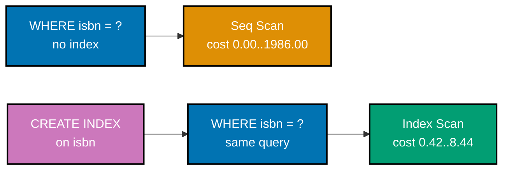

**`learning/code/ex-24-seq-scan-vs-index-scan/example.sql`**

```sql
-- Example 24: Seq Scan vs Index Scan.
-- The SAME query, run twice: once with no index (Seq Scan, co-18) and once after
-- adding a targeted B-tree index -- the planner switches strategy on its own (co-24).
SET client_min_messages TO WARNING;
DROP TABLE IF EXISTS book_catalog CASCADE;
                                    -- => resets state -- this example is fully self-contained
CREATE TABLE book_catalog(id INTEGER PRIMARY KEY, isbn TEXT NOT NULL, price NUMERIC(6,2) NOT NULL, published_year INTEGER NOT NULL);
INSERT INTO book_catalog(id, isbn, price, published_year)
SELECT n, 'ISBN-' || LPAD(n::TEXT, 9, '0'), (10 + (n % 90))::NUMERIC, 2000 + (n % 25)
FROM generate_series(1, 100000) AS n;
ANALYZE book_catalog;
                                    -- => 100,000 rows, stats fresh -- a fair "before" baseline

-- BEFORE: no index on isbn -- the planner has no faster option than scanning
-- every row (co-24).
EXPLAIN SELECT * FROM book_catalog WHERE isbn = 'ISBN-000050000';
                                    -- => Seq Scan on book_catalog -- must check all 100,000 rows

-- Now add the index (co-18) and refresh stats so the planner knows it exists.
CREATE INDEX idx_book_catalog_isbn ON book_catalog(isbn);
ANALYZE book_catalog;
                                    -- => a sorted B-tree over isbn now exists

-- AFTER: same exact query, but the planner now has a much cheaper option.
EXPLAIN SELECT * FROM book_catalog WHERE isbn = 'ISBN-000050000';
                                    -- => Index Scan using idx_book_catalog_isbn -- no full scan needed
                                    -- => cost drops by roughly two orders of magnitude vs the Seq Scan above
```

**Run**: `psql -U asqp -d asqp -f example.sql`

**Output**:

```text
                           QUERY PLAN
----------------------------------------------------------------
 Seq Scan on book_catalog  (cost=0.00..1986.00 rows=1 width=28)
   Filter: (isbn = 'ISBN-000050000'::text)
(2 rows)

                                        QUERY PLAN
---------------------------------------------------------------------------------------------
 Index Scan using idx_book_catalog_isbn on book_catalog  (cost=0.42..8.44 rows=1 width=28)
   Index Cond: (isbn = 'ISBN-000050000'::text)
(2 rows)
```

**Key takeaway**: The planner made this decision alone -- the `SELECT` text never changed between
"before" and "after." Creating the right index is often the entire fix for a slow query; the query
itself rarely needs to change.

**Why it matters**: The cost estimate dropped from `1986.00` to `8.44` -- roughly 235x cheaper by the
planner's own accounting -- for one added index on a 100,000-row table, and the gap only widens as
table size grows. This before/after comparison is the exact workflow production engineers use when
diagnosing a slow endpoint: capture the plan, add an index, capture the plan again, confirm the node
type changed.

---

### Example 25: ANALYZE Refresh Stats

_ex-25 &middot; exercises co-25_

The planner's row-count estimates come from statistics gathered by `ANALYZE` -- a table with no stats
yet gets a generic, not data-aware guess, and that guess can be badly wrong until `ANALYZE` runs.

**`learning/code/ex-25-analyze-refresh-stats/example.sql`**

```sql
-- Example 25: ANALYZE Refresh Stats.
-- The planner's row-count ESTIMATES come from statistics gathered by ANALYZE
-- (co-25) -- a table with NO stats yet gets a generic guess, not a data-aware one.
SET client_min_messages TO WARNING;
DROP TABLE IF EXISTS book_catalog CASCADE;
                                    -- => resets state -- this example is fully self-contained
CREATE TABLE book_catalog(id INTEGER PRIMARY KEY, isbn TEXT NOT NULL, price NUMERIC(6,2) NOT NULL, published_year INTEGER NOT NULL);
INSERT INTO book_catalog(id, isbn, price, published_year)
SELECT n, 'ISBN-' || LPAD(n::TEXT, 9, '0'), (10 + (n % 90))::NUMERIC, 2000 + (n % 25)
FROM generate_series(1, 100000) AS n;
                                    -- => 100,000 rows -- every isbn value is UNIQUE (1 row each)

-- BEFORE ANALYZE (co-25): no column statistics exist yet for this brand-new data,
-- so the planner falls back to a generic, NOT data-aware selectivity guess.
EXPLAIN SELECT * FROM book_catalog WHERE isbn = 'ISBN-000050000';
                                    -- => rows=364 estimated -- a generic guess, badly wrong
                                    -- => (the true answer is exactly 1 row -- isbn is unique)

-- ANALYZE (co-25) samples the table and records real statistics: distinct value
-- counts, most-common values, and a histogram -- the planner now has real data.
ANALYZE book_catalog;

-- AFTER ANALYZE: the SAME query, same plan shape, but a far more accurate estimate.
EXPLAIN SELECT * FROM book_catalog WHERE isbn = 'ISBN-000050000';
                                    -- => rows=1 estimated -- ANALYZE learned isbn has ~100,000
                                    -- => distinct values, so 1 row per exact match is now the estimate
```

**Run**: `psql -U asqp -d asqp -f example.sql`

**Output**:

```text
                            QUERY PLAN
------------------------------------------------------------------
 Seq Scan on book_catalog  (cost=0.00..1646.80 rows=364 width=54)
   Filter: (isbn = 'ISBN-000050000'::text)
(2 rows)

                           QUERY PLAN
----------------------------------------------------------------
 Seq Scan on book_catalog  (cost=0.00..1986.00 rows=1 width=28)
   Filter: (isbn = 'ISBN-000050000'::text)
(2 rows)
```

**Key takeaway**: `rows=364` before `ANALYZE` and `rows=1` after, on the exact same data -- the
planner's estimates are only as good as its last `ANALYZE`, which is why stale statistics are a
recurring, sneaky cause of bad plans (Example 53, Intermediate tier, shows a case where a bad estimate
actually changes which plan the planner picks, not just how confident it looks).

**Why it matters**: `autovacuum` runs `ANALYZE` automatically in production, but only after enough rows
have changed to cross its trigger threshold -- a bulk load or a fast-growing new table can outrun that
threshold, leaving the planner working from outdated or absent statistics exactly like the "before"
state above. Manually running `ANALYZE` immediately after a large bulk load (Example 84's `COPY`, for
instance) is a standard production habit for exactly this reason.

**Accuracy note (PG 18)**: The extra WAL usage, CPU time, and per-row-average timing stats PostgreSQL
18 gained belong to the standalone `ANALYZE VERBOSE` command run above (co-25) -- not to `EXPLAIN`'s
own `VERBOSE` option, which is unchanged in PG 18 (still just output column lists, schema-qualified
names, range-table aliases, trigger names, and the query identifier). Separately, and unrelated to
`VERBOSE` on either command, `EXPLAIN` itself gained new fields in PG 18: full WAL buffer counts in
`EXPLAIN (..., WAL)` output, index-lookup-per-scan counts, fractional row counts (visible as `actual
rows=0.33` in Example 79's parallel-worker output), and memory/disk usage on `Material`/`WindowAgg`/CTE
nodes.

---

### Example 26: FOR UPDATE Row Lock

_ex-26 &middot; exercises co-16_

`SELECT ... FOR UPDATE` takes an exclusive lock on the selected row for the rest of the transaction --
a second session trying to lock the same row genuinely blocks until the first session commits or rolls
back. Because psql itself is single-connection, this example uses two real `psycopg` connections
instead.

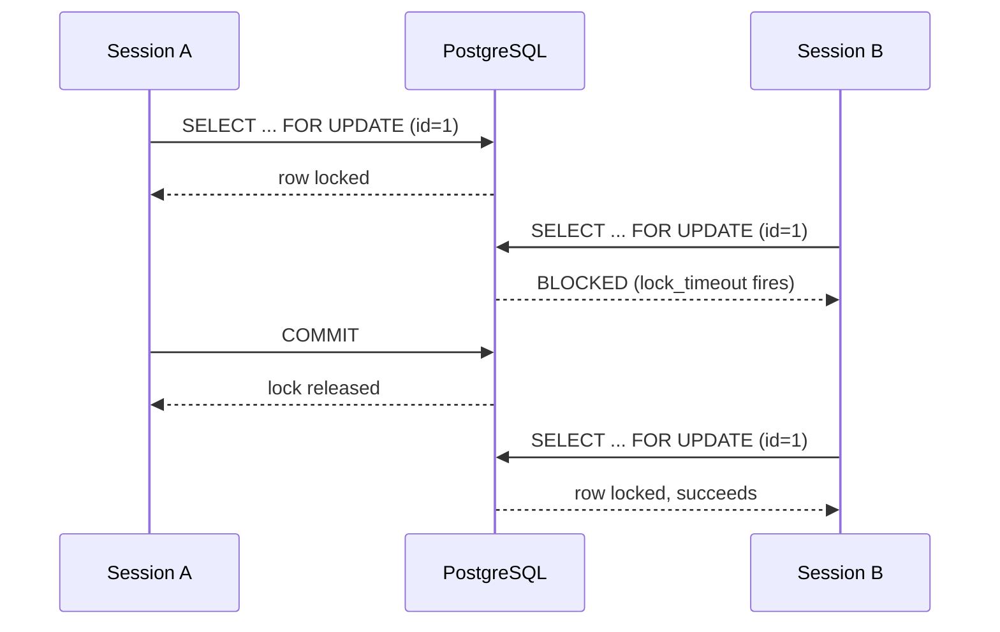

**`learning/code/ex-26-for-update-row-lock/example.py`**

```python
# pyright: strict
# strict mode also requires every third-party call's return type to be known --
# psycopg ships its own type stubs, so calls like conn.cursor() resolve to a
# concrete Cursor type instead of falling back to Any.
"""Example 26: FOR UPDATE Row Lock."""

# psycopg (v3) is used here instead of the older psycopg2 -- v3 ships native
# type stubs and a context-manager-first API, both of which pyright --strict needs.
import psycopg

DSN = "host=localhost port=55432 dbname=asqp user=asqp password=asqp"
# => connection string -- readers should substitute their own PostgreSQL 18 instance
# Two separate DSN-based connections below (session_a, session_b) are what let
# this script simulate two independent PostgreSQL client sessions locking the
# same row -- a single connection could never demonstrate blocking against itself.


# setup() runs on session_a's connection only -- session_b simply reuses the
# already-seeded table once it connects, exactly like a second real client would.
def setup(conn: psycopg.Connection) -> None:  # => resets state -- fully self-contained
    """Create and seed a single-row account table for the lock demo."""
    # The cursor context manager closes the cursor automatically on exit -- it does
    # NOT commit or roll back the underlying transaction; that is conn.commit()'s job.
    with conn.cursor() as cur:  # => a cursor scoped to this one setup call
        # Suppressing NOTICE keeps this demo's printed output limited to the print()
        # statements below, not routine DROP/CREATE chatter from the server.
        cur.execute("SET client_min_messages TO WARNING")
        cur.execute("DROP TABLE IF EXISTS account CASCADE")
        # NUMERIC(10, 2) mirrors the same money-safe precision convention used
        # throughout this topic's SQL examples -- exact decimal arithmetic for balances.
        cur.execute(  # => account table exists, one starting row
            "CREATE TABLE account(id INTEGER PRIMARY KEY, balance NUMERIC(10,2) NOT NULL)"
        )
        cur.execute("INSERT INTO account(id, balance) VALUES (1, 500.00)")
    # psycopg opens an implicit transaction on the FIRST statement of a connection --
    # nothing setup() does is visible to session_b until this commit() runs.
    conn.commit()  # => makes the seed data visible to BOTH sessions opened below


# main() orchestrates the whole three-act demo: acquire the lock, prove the
# second session blocks, release the lock, prove the second session then succeeds.
def main() -> None:  # => the script's entry point
    # Each psycopg.connect() call opens a genuinely separate server-side backend
    # process -- PostgreSQL's per-connection process model is what makes row locks
    # visible/enforceable across the two sessions, not just two Python objects.
    session_a = psycopg.connect(DSN)  # => session A: will hold the row lock
    session_b = psycopg.connect(DSN)  # => session B: will try to acquire the same lock
    setup(session_a)  # => seed once, using session A's connection

    # session_a's SELECT ... FOR UPDATE runs and its enclosing transaction is left
    # OPEN (no commit yet) -- the row lock it acquires stays held for as long as
    # this transaction remains open, which session_b will run into next.
    with session_a.cursor() as cur_a:
        cur_a.execute("SELECT id, balance FROM account WHERE id = 1 FOR UPDATE")
        # => FOR UPDATE (co-16) takes an exclusive ROW lock on id=1 -- held until
        # => session A commits or rolls back -- the transaction is still open here
        # fetchone() retrieves the single locked row -- FOR UPDATE does not change what
        # is fetched, only what lock is held on the underlying row while it is.
        row = cur_a.fetchone()
        print(f"Session A locked row: {row}")  # => Output: Session A locked row: (1, Decimal('500.00'))

    # session_b is a WHOLLY separate connection/transaction -- it has no visibility
    # into session_a's uncommitted lock beyond being blocked BY it.
    with session_b.cursor() as cur_b:
        # lock_timeout is a per-session setting -- it does not affect session_a or any
        # other connection, only how long THIS session will wait for a blocked lock.
        cur_b.execute("SET lock_timeout = '500ms'")
        # => without a timeout, session B would hang until A commits or rolls back
        # Wrapping the blocking statement in try/except is what lets this script prove
        # the block happened programmatically instead of just hanging until manually killed.
        try:
            cur_b.execute("SELECT id, balance FROM account WHERE id = 1 FOR UPDATE")
            # => blocks because session A still holds the row lock -- after 500ms,
            # => lock_timeout cancels the wait and raises instead of hanging forever
            print("Session B acquired the lock (unexpected)")
        # LockNotAvailable maps directly to PostgreSQL's own 55P03 (lock_not_available)
        # error code -- lock_timeout is what turns an indefinite wait into this exception.
        except psycopg.errors.LockNotAvailable as exc:
            # => proves session B was genuinely BLOCKED by session A's open FOR UPDATE
            print(f"Session B blocked: {type(exc).__name__}")
            # => Output: Session B blocked: LockNotAvailable
        # Just like the aborted-transaction case in Example 20, a failed statement
        # leaves session_b's transaction unusable until an explicit ROLLBACK -- calling
        # rollback() here is what lets cur_b be reused for the next SELECT ... FOR UPDATE.
        session_b.rollback()  # => clears session B's failed statement before reusing it

    # Committing (rather than rolling back) session_a is what releases its FOR
    # UPDATE row lock -- PostgreSQL releases row locks at transaction END, whether
    # that end is COMMIT or ROLLBACK; the choice here only affects the DATA, not the lock release.
    session_a.commit()  # => releases session A's row lock -- session B can now proceed
    print("Session A committed -- lock released")  # => Output: Session A committed -- lock released

    # Now that session_a's transaction has ended, session_b's identical statement
    # succeeds immediately -- the SAME query, the SAME row, a completely different outcome.
    with session_b.cursor() as cur_b:
        cur_b.execute("SELECT id, balance FROM account WHERE id = 1 FOR UPDATE")
        # => the SAME statement that just failed now succeeds immediately -- no lock left
        row_b = cur_b.fetchone()
        print(f"Session B locked row: {row_b}")  # => Output: Session B locked row: (1, Decimal('500.00'))
    # Committing session_b's own successful FOR UPDATE releases ITS row lock in
    # turn -- leaving no open lock behind once the script finishes.
    session_b.commit()  # => releases session B's own lock, tidy shutdown

    # Closing a connection with an open, uncommitted transaction would implicitly
    # roll it back -- both sessions already committed above, so close() here is pure cleanup.
    session_a.close()  # => always close what you open
    session_b.close()  # => both sessions cleaned up


# This guard is what pyright --strict's "no unused top-level code" expectations
# and ordinary Python script conventions both call for -- main() only runs when
# this file is executed directly, not when imported.
if __name__ == "__main__":  # => guards against running main() on `import example`
    main()  # => entry point -- runs everything above when executed as a script
```

**Run**: `python3 example.py` (requires `pip install "psycopg[binary]"`)

**Output** (captured against PostgreSQL 18.4):

```text
Session A locked row: (1, Decimal('500.00'))
Session B blocked: LockNotAvailable
Session A committed -- lock released
Session B locked row: (1, Decimal('500.00'))
```

**Key takeaway**: `FOR UPDATE` blocking is not a bug or a timeout misconfiguration -- it is the exact
mechanism that makes "read a row, then update it based on what you read" safe under concurrent access,
by preventing a second transaction from reading (and later overwriting) the same row mid-decision.

**Why it matters**: Any "read the current balance, then update it" or "read the current inventory
count, then decrement it" flow needs `FOR UPDATE` (or an atomic `UPDATE ... SET x = x - 1`) to avoid a
lost-update race between two concurrent requests. `lock_timeout` (used here to make the block visible
without hanging the example) is also a standard production safety valve, turning an indefinite wait
into a fast, retryable failure instead of a request that hangs until a client-side timeout fires.

---

### Example 27: Read Committed Default

_ex-27 &middot; exercises co-13, co-14, co-12_

PostgreSQL's default isolation level is **Read Committed**: every individual statement inside a
transaction sees the latest committed data at the moment that statement runs -- not one fixed snapshot
for the whole transaction. Read the same row twice, with a committed write from another session in
between, and the two reads can genuinely disagree.

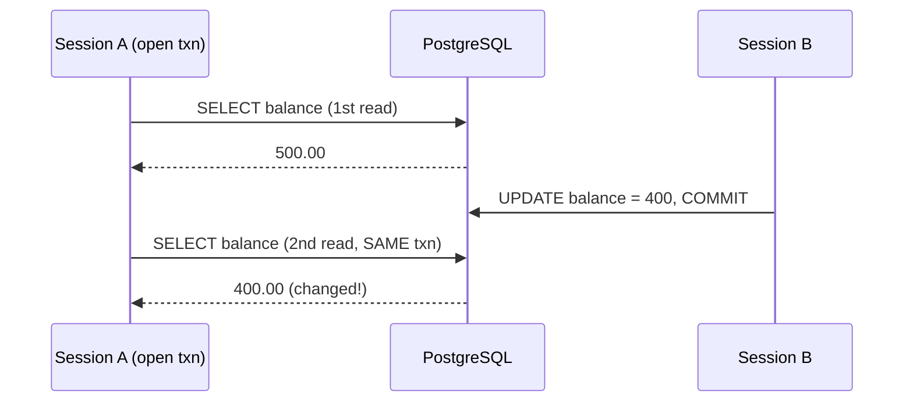

**`learning/code/ex-27-read-committed-default/example.py`**

```python
# pyright: strict
# psycopg (v3) ships native type stubs -- pyright resolves conn.cursor(),
# cur.execute(), and friends to concrete types instead of Any.
"""Example 27: Read Committed Default."""

import psycopg

DSN = "host=localhost port=55432 dbname=asqp user=asqp password=asqp"
# => connection string -- readers should substitute their own PostgreSQL 18 instance
# Two independent connections again simulate two real client sessions -- the
# whole point of THIS example is what session A sees mid-transaction while
# session B commits a change underneath it.


# setup() is identical in shape to Example 26's -- reused deliberately so the
# only new concept in this file is the isolation-level anomaly itself.
def setup(conn: psycopg.Connection) -> None:  # => resets state -- fully self-contained
    """Create and seed a single-row account table for the isolation demo."""
    # Same cursor-context-manager pattern as Example 26 -- closes the cursor on exit,
    # leaves commit/rollback to the caller.
    with conn.cursor() as cur:  # => a cursor scoped to this one setup call
        cur.execute("SET client_min_messages TO WARNING")
        cur.execute("DROP TABLE IF EXISTS account CASCADE")
        cur.execute(  # => account table exists, one starting row
            "CREATE TABLE account(id INTEGER PRIMARY KEY, balance NUMERIC(10,2) NOT NULL)"
        )
        cur.execute("INSERT INTO account(id, balance) VALUES (1, 500.00)")
    # Committing here is what makes the seeded row visible to session_b's own,
    # separate transaction when it opens below.
    conn.commit()  # => makes the seed data visible to BOTH sessions opened below


# main() reads the same row TWICE inside one open transaction, with session_b's
# commit happening in between -- Read Committed's defining behavior is visible
# only because of that timing.
def main() -> None:  # => the script's entry point
    # Each connect() call is, again, its own backend process/session on the server --
    # necessary for session_b's write to be a genuinely EXTERNAL commit from
    # session_a's point of view.
    session_a = psycopg.connect(DSN)  # => session A: reads the SAME row twice
    session_b = psycopg.connect(DSN)  # => session B: writes between A's two reads
    setup(session_a)  # => seed once, using session A's connection

    # PostgreSQL's default isolation level is READ COMMITTED (co-13) -- no
    # explicit SET TRANSACTION ISOLATION LEVEL below, so this IS the default (co-12).
    # Explicit BEGIN below opens the transaction session_a will keep open across
    # BOTH reads -- without it, each cur_a.execute() would run in its OWN
    # single-statement implicit transaction and the anomaly could not be observed.
    with session_a.cursor() as cur_a:
        cur_a.execute("BEGIN")
        cur_a.execute("SELECT balance FROM account WHERE id = 1")
        # first_read captures the balance BEFORE session_b's concurrent update --
        # this is the baseline the second read will be compared against.
        first_read = cur_a.fetchone()
        print(f"Session A first read: {first_read}")
        # => Output: Session A first read: (Decimal('500.00'),)

        # session_b opens, writes, and commits ENTIRELY within this nested block --
        # by the time control returns to session_a, the write is already durable.
        with session_b.cursor() as cur_b:  # => session B: independent transaction
            # session_b's UPDATE runs in its OWN implicit transaction (no BEGIN was issued
            # on cur_b) -- psycopg auto-opens one per statement when none is active.
            cur_b.execute("UPDATE account SET balance = 400.00 WHERE id = 1")
            session_b.commit()
            # => session B commits a DIFFERENT value WHILE session A's transaction
            # => is still open -- this is the concurrent write the anomaly depends on

        # Re-issuing the IDENTICAL SELECT is deliberate -- any difference in the result
        # can only be explained by what changed in the DATABASE, not by a different query.
        cur_a.execute("SELECT balance FROM account WHERE id = 1")
        # => same statement, same still-open transaction, but a NEW value comes back
        second_read = cur_a.fetchone()
        print(f"Session A second read: {second_read}")
        # => Output: Session A second read: (Decimal('400.00'),)
        # => the value CHANGED mid-transaction (co-14) -- a non-repeatable read
        # This assertion is the example's proof, not just a comment -- if Postgres ever
        # behaved like REPEATABLE READ here instead, this line would raise AssertionError.
        assert first_read != second_read
        # => proves the anomaly: Read Committed re-reads the LATEST committed
        # => snapshot on every statement, not one snapshot for the whole transaction
        # Committing session_a now is what ends its long-lived transaction -- both reads
        # already happened, so this commit's only remaining job is to release resources.
        session_a.commit()

    # Contrast this whole scenario with REPEATABLE READ or SERIALIZABLE isolation --
    # either would have frozen session_a's snapshot at BEGIN time, so second_read
    # would still show 500.00 despite session_b's committed change.
    session_a.close()  # => always close what you open
    session_b.close()  # => both sessions cleaned up


if __name__ == "__main__":  # => guards against running main() on `import example`
    main()  # => entry point -- runs everything above when executed as a script
```

**Run**: `python3 example.py`

**Output** (captured against PostgreSQL 18.4):

```text
Session A first read: (Decimal('500.00'),)
Session A second read: (Decimal('400.00'),)
```

**Key takeaway**: This is not a bug -- it is Read Committed's documented, intended behavior: each
statement gets a fresh snapshot as of that statement's start, so any write another session commits
in between two of your own reads becomes visible to your next read.

**Why it matters**: Read Committed is the right default for most OLTP workloads because it maximizes
concurrency and matches most application code's actual expectation (each query sees "fresh" data).
But code that reads a value, computes something from it, then writes based on that computation --
without `FOR UPDATE` (Example 26) or a stricter isolation level (Example 57's Repeatable Read,
Intermediate tier) -- is exposed to exactly this non-repeatable-read anomaly, which can silently
corrupt a calculation that assumed the value could not change mid-transaction.

---

### Example 28: psql \\timing

_ex-28 &middot; exercises co-23_

`\timing` is a `psql` meta-command: once turned on, every statement's wall-clock duration prints after
its result -- a fast, zero-setup way to compare two queries' actual speed without reaching for
`EXPLAIN ANALYZE`.

**`learning/code/ex-28-psql-timing/example.sql`**

```sql
-- Example 28: psql \timing.
-- \timing (co-23) is a psql meta-command: once turned on, EVERY statement's wall-clock
-- duration prints after its result -- a quick way to compare two queries' actual speed.
SET client_min_messages TO WARNING;
DROP TABLE IF EXISTS book_catalog CASCADE;
                                    -- => resets state -- this example is fully self-contained
-- book_catalog is deliberately large (100,000 generated rows) -- \timing's value
-- only becomes visible once a query takes long enough to produce a meaningful duration.
CREATE TABLE book_catalog(id INTEGER PRIMARY KEY, isbn TEXT NOT NULL, price NUMERIC(6,2) NOT NULL);
INSERT INTO book_catalog(id, isbn, price)
SELECT n, 'ISBN-' || LPAD(n::TEXT, 9, '0'), (10 + (n % 90))::NUMERIC
FROM generate_series(1, 100000) AS n;
                                    -- => 100,000 rows -- large enough for a measurable duration
                                    -- => \timing measures CLIENT-side wall-clock round-trip time -- it includes
                                    -- => network latency and psql's own result-rendering overhead, not just server-
                                    -- => side execution (contrast Example 23's EXPLAIN ANALYZE, server-side only).

\timing on
                                    -- => turns timing on -- every statement below now reports its duration
-- No index exists yet on book_catalog.price, so this predicate forces a full
-- sequential scan of all 100,000 rows (Example 24 revisits this contrast).
SELECT COUNT(*) FROM book_catalog WHERE price > 50;
                                    -- => the count itself is the query result; \timing adds a "Time:" line
\timing off
                                    -- => turns timing back off -- later statements go back to silent
```

**Run**: `psql -U asqp -d asqp -f example.sql`

**Output** (captured against PostgreSQL 18.4 -- the `Time:` value varies run to run and machine to
machine; that variability is the whole point of measuring it directly):

```text
 count
-------
 54439
(1 row)

Time: 7.434 ms
```

**Key takeaway**: `\timing` measures wall-clock time as observed by the `psql` client, including
network round-trip -- it is a coarser, faster-to-reach-for tool than `EXPLAIN ANALYZE`'s
server-side-only `Execution Time`, useful for quick before/after comparisons during interactive
tuning sessions.

**Why it matters**: `\timing on` is usually one of the first commands an engineer runs at the start of
any interactive `psql` tuning session, because it turns every subsequent query into an implicit
benchmark with zero extra typing. It complements, rather than replaces, `EXPLAIN ANALYZE` (Example 23):
`\timing` answers "how long did that take," while `EXPLAIN ANALYZE` answers "why."

---

← Previous: [Overview](./overview.md) &middot; Next: [Intermediate Examples](./intermediate.md) →
