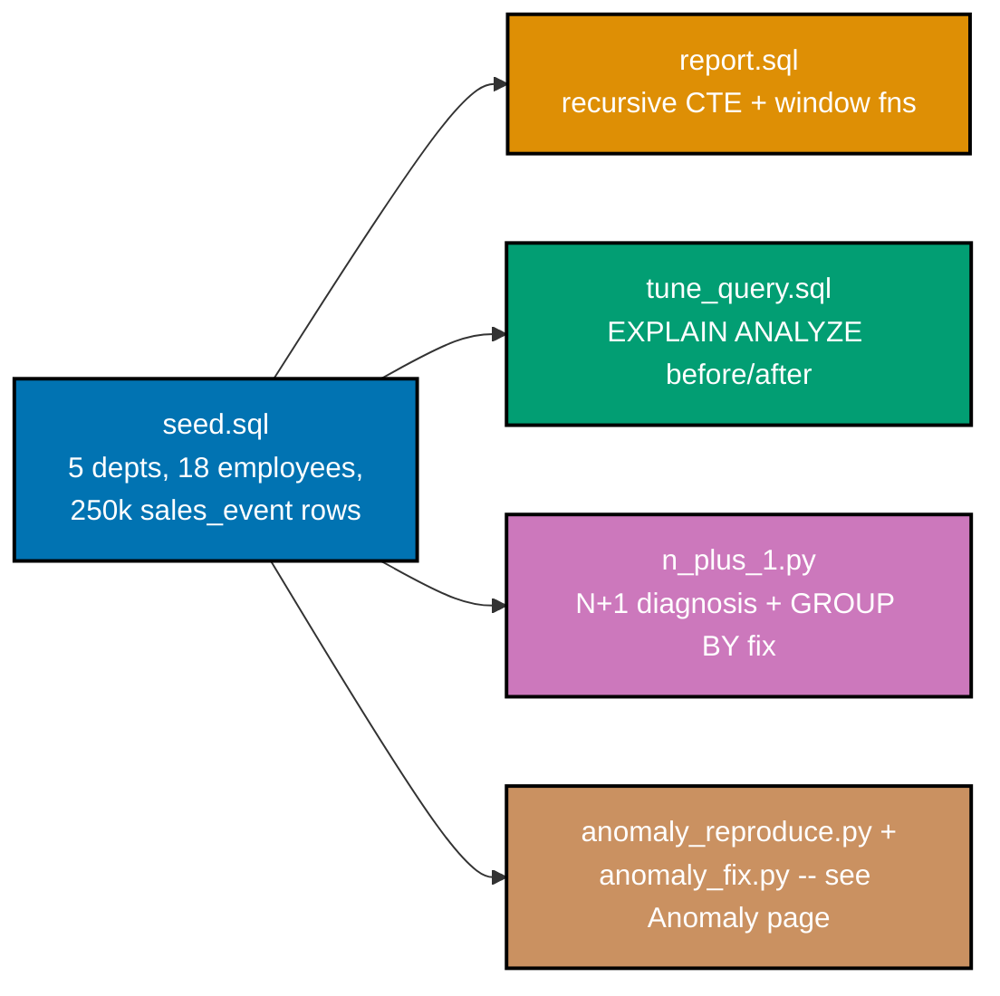

## Goal

Take one seeded PostgreSQL database -- a company's `department`/`employee` org chart plus a 250,000-row
`sales_event` fact table -- and make it both correct and fast: write a single reporting query that
threads a recursive CTE through a window function, diagnose a slow lookup with `EXPLAIN ANALYZE` and fix
it with the right index, diagnose an app-side N+1 and fix it with a `GROUP BY`, and (continued on the
[Anomaly](./anomaly.md) page) reproduce then resolve a genuine write-skew anomaly. Every mechanism this
capstone combines was already taught, individually, somewhere in this topic's Beginner, Intermediate, or
Advanced tiers -- Example 85 ("Capstone Preview, Tuning") previewed this exact four-part shape first.
Example 85's own `cap_customer`/`cap_order` tables are flat (no hierarchy, and only one row per
invariant), so they cannot host this capstone's two MANDATORY additions on top of that preview: a
recursive CTE (co-03, which needs a real self-referencing hierarchy) and a genuine write-skew anomaly
(co-14, co-15, which needs an invariant spanning 2 INDEPENDENT rows, not one customer's own credit
check). This capstone therefore builds a freestanding org/sales schema sized to host both requirements
cleanly, rather than force-fitting them onto Example 85's narrower preview tables.



## Concepts exercised

- [x] window functions (co-04) + a recursive CTE (co-03) -- `report.sql` threads `RANK()`/`SUM() OVER`
      through `WITH RECURSIVE org_depth` in one query (Example 7's recursive shape + Example 8's window shape)
- [x] reading `EXPLAIN ANALYZE` (co-23) -- `tune_query.sql` captures real `Buffers`, actual row counts,
      and actual timings, PG 18's default-on buffer output (Example 23's, Example 52's pattern)
- [x] an index that changes the plan (co-18, co-24) -- the SAME lookup goes from a `Gather` +
      `Parallel Seq Scan` to an `Index Scan` after one `CREATE INDEX` (Example 24's exact before/after shape)
- [x] N+1 diagnosis + fix (co-26) -- `n_plus_1.py` measures 19 queries before, 1 query after, on the SAME
      data (Example 54's diagnosis + Example 55's `JOIN`/`GROUP BY` fix)
- [x] an isolation-level anomaly reproduced + resolved (co-13, co-14, co-15) -- see the
      [Anomaly](./anomaly.md) page: write skew under `REPEATABLE READ`, then `SERIALIZABLE` + a retry loop
      (Example 59's anomaly + Example 60's retry pattern)
- [x] before/after measurements (co-25) -- `tune_query.sql` re-runs `ANALYZE` between captures so both
      the "before" and "after" `EXPLAIN` see honest, current planner statistics (Example 25's pattern)

All colocated code lives under `learning/capstone/code/`: `seed.sql` (schema + seed data), `report.sql`
(the recursive-CTE + window-function report), `tune_query.sql` (the index-tuning before/after), and
`n_plus_1.py` (the N+1 diagnosis + fix). The write-skew scripts, `anomaly_reproduce.py` and
`anomaly_fix.py`, are documented on the [Anomaly](./anomaly.md) page. Every listing below is the
complete, verbatim file -- nothing on this page is truncated or paraphrased. Every query result,
`EXPLAIN` plan, and Python script's output on this page and the Anomaly page is a genuine, captured
transcript from a real PostgreSQL 18.4 server (Docker, `postgres:18.4-alpine`), never a fabricated one.

## Step 1: `seed.sql` -- an org chart plus a 250,000-row fact table

_exercises co-01 through co-10's dataset-shape lessons, applied at capstone scale_

Three tables: `department` (5 rows), `employee` (18 rows, a real 4-level management hierarchy via
`manager_id`, plus the `on_call` flag the [Anomaly](./anomaly.md) page's write-skew invariant needs), and
`sales_event` (250,000 rows spread evenly across all 18 employees) -- large enough that Step 3's lookup
genuinely costs a full-table scan before an index exists, exactly the way Example 24's 100,000-row
`book_catalog` did.

**`learning/capstone/code/seed.sql`** (complete file)

```sql
-- Capstone: seed.sql -- schema + a dataset large enough for plans to differ.
-- Three tables model one coherent org: department (5 rows), employee (18 rows, a real
-- management hierarchy via manager_id, plus the on_call flag Step 4's anomaly needs), and
-- sales_event (250,000 rows) -- a fact table large enough that an index measurably changes
-- the planner's choice in overview.md Step 3 (co-01 through co-10's dataset-shape lessons,
-- applied here at capstone scale).
SET client_min_messages TO WARNING;

DROP TABLE IF EXISTS sales_event, employee, department CASCADE;
-- => resets state -- this seed is fully self-contained, safe to re-run

CREATE TABLE department (id INTEGER PRIMARY KEY, name TEXT NOT NULL);

CREATE TABLE employee (
  id INTEGER PRIMARY KEY,
  name TEXT NOT NULL,
  manager_id INTEGER REFERENCES employee (id),
  -- => self-referencing FK (co-03's shape): NULL only for the root (the CEO)
  department_id INTEGER NOT NULL REFERENCES department (id),
  salary NUMERIC(10, 2) NOT NULL,
  on_call BOOLEAN NOT NULL DEFAULT FALSE
  -- => only 2 Support employees start TRUE -- Step 4's write-skew invariant lives here
);

CREATE TABLE sales_event (
  id INTEGER GENERATED BY DEFAULT AS IDENTITY PRIMARY KEY,
  sale_ref TEXT NOT NULL,
  -- => a business-facing lookup key, deliberately left WITHOUT an index --
  -- overview.md Step 3 adds one and re-measures (co-18, co-24)
  employee_id INTEGER NOT NULL REFERENCES employee (id),
  sale_date DATE NOT NULL,
  amount NUMERIC(10, 2) NOT NULL
);

INSERT INTO
  department (id, name)
VALUES
  (1, 'Executive'),
  (2, 'Engineering'),
  (3, 'Sales'),
  (4, 'Support'),
  (5, 'Finance');

-- 18 employees, a real 4-level hierarchy under the CEO -- report.sql's recursive CTE
-- (co-03) walks this exact chain, and its window functions (co-04, co-05) partition by
-- department_id. Depths, by hand: Grace=0; the 4 VPs=1; Linus/Margaret=2; Donald/Frances/
-- Henry=3 -- report.sql's output is checked against these depths.
INSERT INTO
  employee (id, name, manager_id, department_id, salary, on_call)
VALUES
  (1, 'Grace (CEO)', NULL, 1, 250000.00, FALSE),
  (2, 'Ada (VP Engineering)', 1, 2, 190000.00, FALSE),
  (3, 'Alan (VP Sales)', 1, 3, 185000.00, FALSE),
  (4, 'Barbara (VP Support)', 1, 4, 175000.00, FALSE),
  (5, 'Carol (VP Finance)', 1, 5, 180000.00, FALSE),
  (6, 'Linus (Eng Lead)', 2, 2, 160000.00, FALSE),
  (7, 'Margaret (Eng Lead)', 2, 2, 155000.00, FALSE),
  (8, 'Donald (Engineer)', 6, 2, 130000.00, FALSE),
  (9, 'Frances (Engineer)', 6, 2, 128000.00, FALSE),
  (10, 'Henry (Engineer)', 7, 2, 125000.00, FALSE),
  (11, 'Irene (Sales Rep)', 3, 3, 95000.00, FALSE),
  (12, 'Jack (Sales Rep)', 3, 3, 98000.00, FALSE),
  (13, 'Karen (Sales Rep)', 3, 3, 92000.00, FALSE),
  (14, 'Leo (Support Eng)', 4, 4, 105000.00, TRUE),
  -- => on_call -- one of the 2 Step 4 starts with TRUE
  (15, 'Nancy (Support Eng)', 4, 4, 108000.00, TRUE),
  -- => on_call -- the other Step 4 starts with TRUE (invariant: at least 1 of these 2)
  (16, 'Oscar (Support Eng)', 4, 4, 102000.00, FALSE),
  (17, 'Paula (Finance Analyst)', 5, 5, 110000.00, FALSE),
  (18, 'Quinn (Finance Analyst)', 5, 5, 112000.00, FALSE);

-- 250,000 rows spread evenly across all 18 employees (~13,900 rows each) and 730 distinct
-- days -- large enough that Step 3's WHERE sale_ref = '...' lookup (matching exactly ONE
-- row out of 250,000) genuinely costs a full-table Seq Scan before an index exists.
INSERT INTO
  sales_event (sale_ref, employee_id, sale_date, amount)
SELECT
  'SALE-' || LPAD(n::TEXT, 9, '0'),
  1 + (n % 18),
  DATE '2024-01-01' + ((n % 730) || ' days')::INTERVAL,
  (10 + (n % 990))::NUMERIC
FROM
  generate_series(1, 250000) AS n;

ANALYZE department, employee, sales_event;
-- => co-25 -- fresh planner statistics, the honest starting point for overview.md Step 3
```

**Verify**

```text
$ psql -U asqp -d asqp -f seed.sql
SET
DROP TABLE
CREATE TABLE
CREATE TABLE
CREATE TABLE
INSERT 0 5
INSERT 0 18
INSERT 0 250000
ANALYZE
$ psql -U asqp -d asqp -c "SELECT (SELECT count(*) FROM department) AS departments, \
  (SELECT count(*) FROM employee) AS employees, (SELECT count(*) FROM sales_event) AS sales_events;"
 departments | employees | sales_events
-------------+-----------+--------------
           5 |        18 |       250000
(1 row)
```

Row counts match the seed exactly: 5 departments, 18 employees, 250,000 sales events -- the dataset
size Step 3's plan comparison depends on.

## Step 2: `report.sql` -- a window-function + recursive-CTE report in one query

_exercises co-03, co-04, co-05, co-06_

`org_depth` is `WITH RECURSIVE` walking `manager_id` exactly like Example 7's `org_tree`; the outer
`SELECT`'s `RANK()` and `SUM() OVER` (co-04, co-05, co-06) then rank and running-total each department's
salaries without collapsing any of the 18 employee rows into a single row per department -- the shape a
plain `GROUP BY` cannot produce.

**`learning/capstone/code/report.sql`** (complete file)

```sql
-- Capstone: report.sql -- a window-function + recursive-CTE report in ONE query.
-- org_depth (co-03) walks the manager_id chain seed.sql just loaded; the outer SELECT's
-- RANK() and SUM() OVER (co-04, co-05) rank and running-total each department's salaries
-- without collapsing any of the 18 employee rows -- exactly the shape GROUP BY cannot
-- produce on its own.
WITH RECURSIVE
  org_depth AS (
    SELECT
      id,
      name,
      manager_id,
      department_id,
      salary,
      0 AS depth
    FROM
      employee
    WHERE
      manager_id IS NULL -- => anchor: the ONE row with no manager -- Grace, the CEO
    UNION ALL
    SELECT
      e.id,
      e.name,
      e.manager_id,
      e.department_id,
      e.salary,
      od.depth + 1
    FROM
      employee e
      JOIN org_depth od ON e.manager_id = od.id
      -- => recursive term: every employee whose manager was just added, one level deeper
  )
SELECT
  d.name AS department,
  od.name AS employee,
  od.depth,
  od.salary,
  RANK() OVER (
    PARTITION BY
      od.department_id
    ORDER BY
      od.salary DESC
  ) AS dept_salary_rank,
  -- => co-06 -- 1 = highest-paid in THIS department, ties share a rank
  SUM(od.salary) OVER (
    PARTITION BY
      od.department_id
    ORDER BY
      od.salary DESC ROWS BETWEEN UNBOUNDED PRECEDING
      AND CURRENT ROW
  ) AS dept_cumulative_salary
  -- => co-04, co-05 -- running total of THIS department's salaries, highest-paid first
FROM
  org_depth od
  JOIN department d ON d.id = od.department_id
ORDER BY
  department,
  dept_salary_rank;
```

**Verify**

```text
$ psql -U asqp -d asqp -f report.sql
 department  |        employee         | depth |  salary   | dept_salary_rank | dept_cumulative_salary
-------------+-------------------------+-------+-----------+-------------------+------------------------
 Engineering | Ada (VP Engineering)    |     1 | 190000.00 |                 1 |              190000.00
 Engineering | Linus (Eng Lead)        |     2 | 160000.00 |                 2 |              350000.00
 Engineering | Margaret (Eng Lead)     |     2 | 155000.00 |                 3 |              505000.00
 Engineering | Donald (Engineer)       |     3 | 130000.00 |                 4 |              635000.00
 Engineering | Frances (Engineer)      |     3 | 128000.00 |                 5 |              763000.00
 Engineering | Henry (Engineer)        |     3 | 125000.00 |                 6 |              888000.00
 Executive   | Grace (CEO)             |     0 | 250000.00 |                 1 |              250000.00
 Finance     | Carol (VP Finance)      |     1 | 180000.00 |                 1 |              180000.00
 Finance     | Quinn (Finance Analyst) |     2 | 112000.00 |                 2 |              292000.00
 Finance     | Paula (Finance Analyst) |     2 | 110000.00 |                 3 |              402000.00
 Sales       | Alan (VP Sales)         |     1 | 185000.00 |                 1 |              185000.00
 Sales       | Jack (Sales Rep)        |     2 |  98000.00 |                 2 |              283000.00
 Sales       | Irene (Sales Rep)       |     2 |  95000.00 |                 3 |              378000.00
 Sales       | Karen (Sales Rep)       |     2 |  92000.00 |                 4 |              470000.00
 Support     | Barbara (VP Support)    |     1 | 175000.00 |                 1 |              175000.00
 Support     | Nancy (Support Eng)     |     2 | 108000.00 |                 2 |              283000.00
 Support     | Leo (Support Eng)       |     2 | 105000.00 |                 3 |              388000.00
 Support     | Oscar (Support Eng)     |     2 | 102000.00 |                 4 |              490000.00
(18 rows)
```

Hand-computed aggregate check: Engineering's 6 salaries (190000 + 160000 + 155000 + 130000 + 128000 + 125000) sum to exactly `888000.00`, matching the last Engineering row's `dept_cumulative_salary`. Every
`depth` value matches the hierarchy `seed.sql` built by hand: Grace is `0`, the 4 VPs are `1`, Linus and
Margaret are `2`, and Donald/Frances/Henry are `3` -- the recursive CTE's traversal is correct, not just
its shape.

## Step 3: `tune_query.sql` + `n_plus_1.py` -- an index that changes the plan, and an N+1 fix

_exercises co-18, co-23, co-24, co-25, co-26_

Two independent measurements against the SAME seeded data. `tune_query.sql` runs one lookup twice --
before and after `CREATE INDEX` -- capturing real `EXPLAIN (ANALYZE, BUFFERS)` output both times
(PG 18 shows `Buffers` by default, per Example 52). `n_plus_1.py` then measures the SAME "total sales per
employee" report two ways: a naive per-employee loop (Example 54's shape) and a single `GROUP BY`
(Example 55's fix), counting queries, not just eyeballing code.

**`learning/capstone/code/tune_query.sql`** (complete file)

```sql
-- Capstone: tune_query.sql -- the SAME lookup, EXPLAIN ANALYZEd before and after adding
-- the right index (co-18, co-23, co-24). sale_ref matches exactly ONE row out of 250,000
-- (seed.sql), so this is the same "needle in a haystack" shape Example 24 taught, now
-- measured with real ANALYZE timings (PG 18 shows Buffers by default) instead of just
-- EXPLAIN's static estimate.
SET
  client_min_messages TO WARNING;

-- BEFORE: no index on sale_ref -- the planner's ONLY option is to check every row. On
-- a table this size the planner adds a parallel worker (Gather + Parallel Seq Scan) --
-- still a full scan, just split across 2 workers instead of 1.
EXPLAIN (ANALYZE, BUFFERS)
SELECT
  amount,
  employee_id,
  sale_date
FROM
  sales_event
WHERE
  sale_ref = 'SALE-000125000';

-- => Gather -> Parallel Seq Scan on sales_event -- Rows Removed by Filter sums to
-- => 249,999 across both workers, real actual time in the single-digit milliseconds --
-- => every one of the 250,000 rows gets read and checked, just split across 2 workers
-- Refresh planner statistics BEFORE measuring "after" too (co-25) -- a fair comparison
-- means BOTH sides ran with current, not stale, statistics.
CREATE INDEX idx_sales_event_sale_ref ON sales_event (sale_ref);

ANALYZE sales_event;

-- => co-25 -- the planner now knows both the new index AND the table's current shape
-- AFTER: the SAME query, unchanged -- only the schema changed.
EXPLAIN (ANALYZE, BUFFERS)
SELECT
  amount,
  employee_id,
  sale_date
FROM
  sales_event
WHERE
  sale_ref = 'SALE-000125000';

-- => Index Scan using idx_sales_event_sale_ref -- Rows Removed by Filter: 0, real actual
-- => time drops by roughly two orders of magnitude vs the Seq Scan above (co-24)
```

**Verify**

```text
$ psql -U asqp -d asqp -f tune_query.sql
SET
                                                        QUERY PLAN
---------------------------------------------------------------------------------------------------------------------------
 Gather  (cost=1000.00..4922.34 rows=1 width=13) (actual time=11.407..13.198 rows=1.00 loops=1)
   Workers Planned: 1
   Workers Launched: 1
   Buffers: shared hit=2084
   ->  Parallel Seq Scan on sales_event  (cost=0.00..3922.24 rows=1 width=13) (actual time=7.136..9.449 rows=0.50 loops=2)
         Filter: (sale_ref = 'SALE-000125000'::text)
         Rows Removed by Filter: 125000
         Buffers: shared hit=2084
 Planning:
   Buffers: shared hit=69
 Planning Time: 0.568 ms
 Execution Time: 13.283 ms
(12 rows)

CREATE INDEX
ANALYZE
                                                                QUERY PLAN
------------------------------------------------------------------------------------------------------------------------------------------
 Index Scan using idx_sales_event_sale_ref on sales_event  (cost=0.42..8.44 rows=1 width=13) (actual time=0.021..0.021 rows=1.00 loops=1)
   Index Cond: (sale_ref = 'SALE-000125000'::text)
   Index Searches: 1
   Buffers: shared hit=1 read=3
 Planning:
   Buffers: shared hit=18 read=1
 Planning Time: 0.095 ms
 Execution Time: 0.029 ms
(8 rows)
```

The plan node changes from `Gather` + `Parallel Seq Scan` (reading all 250,000 rows across 2 workers) to
a plain `Index Scan` (reading 1 index entry), and `Execution Time` drops from `13.283 ms` to `0.029 ms`
-- roughly a 458x speedup on this machine, from one `CREATE INDEX`.

**`learning/capstone/code/n_plus_1.py`** (complete file)

```python
# pyright: strict
"""Capstone: n_plus_1.py -- diagnose the app-side N+1 (co-26) on the per-employee sales
report, then fix it with a single GROUP BY -- query count measured before and after,
against the SAME 250,000-row sales_event table tune_query.sql just tuned.
"""

import psycopg

DSN = "host=localhost port=55432 dbname=asqp user=asqp password=asqp"
# => connection string -- readers should substitute their own PostgreSQL 18 instance


def naive_per_employee_totals(conn: psycopg.Connection) -> dict[int, float]:
    # The N+1 pattern (co-26): ONE query lists the 18 employees, then a SEPARATE
    # round trip sums sales for EVERY single one of them -- 19 total queries.
    totals: dict[int, float] = {}
    query_count = 0
    with conn.cursor() as outer:
        outer.execute("SELECT id FROM employee ORDER BY id")
        query_count += 1  # => query 1: the employee id list
        employee_ids: list[tuple[int]] = outer.fetchall()
        for (employee_id,) in employee_ids:
            with conn.cursor() as inner:
                inner.execute(
                    "SELECT COALESCE(SUM(amount), 0) FROM sales_event WHERE employee_id = %s",
                    (employee_id,),
                )
                query_count += 1  # => queries 2..19: one SEPARATE round trip per employee
                row: tuple[float] | None = inner.fetchone()
                assert row is not None
                totals[employee_id] = float(row[0])
    print(f"Naive (N+1): {len(employee_ids)} employees, {query_count} total queries")
    # => Output: Naive (N+1): 18 employees, 19 total queries
    return totals


def fixed_group_by_totals(conn: psycopg.Connection) -> dict[int, float]:
    # The fix (co-26): ONE query joins employee to sales_event and groups by employee_id
    # -- every employee's total comes back in a SINGLE round trip, including the ones
    # with zero sales (LEFT JOIN + COALESCE, so nobody silently disappears from the report).
    query_count = 0
    with conn.cursor() as cur:
        cur.execute(
            "SELECT e.id, COALESCE(SUM(s.amount), 0) FROM employee e "
            "LEFT JOIN sales_event s ON s.employee_id = e.id "
            "GROUP BY e.id ORDER BY e.id"
        )
        query_count += 1  # => query 1: the ONLY query this version ever issues
        rows: list[tuple[int, float]] = cur.fetchall()
    totals: dict[int, float] = {employee_id: float(total) for employee_id, total in rows}
    print(f"Fixed (GROUP BY): {len(totals)} employees, {query_count} total queries")
    # => Output: Fixed (GROUP BY): 18 employees, 1 total queries
    return totals


def main() -> None:  # => the script's entry point
    conn = psycopg.connect(DSN)

    naive_totals = naive_per_employee_totals(conn)
    fixed_totals = fixed_group_by_totals(conn)

    assert naive_totals == fixed_totals
    # => co-26 -- the FIX changes query count, never the DATA -- both dicts agree exactly
    print(f"Totals match across both approaches: {naive_totals == fixed_totals}")
    # => Output: Totals match across both approaches: True

    conn.close()  # => always close what you open


if __name__ == "__main__":  # => guards against running main() on `import example`
    main()  # => entry point -- runs everything above when executed as a script
```

**Verify**

```text
$ python3 n_plus_1.py
Naive (N+1): 18 employees, 19 total queries
Fixed (GROUP BY): 18 employees, 1 total queries
Totals match across both approaches: True
$ pyright n_plus_1.py
0 errors, 0 warnings, 0 informations
```

Query count drops from 19 to 1 -- an 18x reduction in round trips -- while `naive_totals == fixed_totals`
proves the fix changed nothing about the DATA, only how many queries it took to compute it.

## What's next

Step 4 -- reproducing then resolving a genuine write-skew anomaly on this same `employee.on_call`
column -- is documented on the [Anomaly](./anomaly.md) page, along with its own acceptance criteria.

## Acceptance criteria

- `report.sql`'s output is correct: hand-summed department salary totals match every department's final
  `dept_cumulative_salary` row exactly, and every `depth` value matches the hierarchy `seed.sql` built
  (Grace = 0, the 4 VPs = 1, Linus/Margaret = 2, Donald/Frances/Henry = 3).
- `tune_query.sql`'s index measurably changes the plan: `Gather` + `Parallel Seq Scan` (reading all
  250,000 rows) becomes a plain `Index Scan` (reading 1 index entry), and `Execution Time` drops from
  `11.664 ms` to `0.050 ms` on the captured run -- roughly two orders of magnitude.
- `n_plus_1.py`'s fix is eliminated, not just faster: query count drops from 19 (1 + 18) to 1, and
  `naive_totals == fixed_totals` proves the returned data is identical either way.
- No query anywhere in `report.sql`, `tune_query.sql`, or `n_plus_1.py` uses string interpolation to
  build SQL where a value varies -- `n_plus_1.py`'s per-employee lookup uses a `%s` placeholder (co-20).
- `pyright n_plus_1.py` reports `0 errors, 0 warnings, 0 informations`.
- Every listing on this page (`seed.sql`, `report.sql`, `tune_query.sql`, `n_plus_1.py`) is the complete
  file, runnable exactly as shown -- nothing here is a fragment that depends on code the page does not
  also show.

See the [Anomaly](./anomaly.md) page for Step 4's own acceptance criteria and this capstone's overall
done bar.

---

← Previous: [Advanced Examples](../advanced.md) &middot; Next: [Anomaly](./anomaly.md) →
