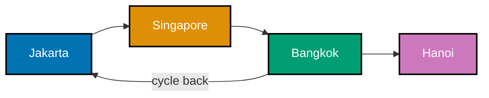
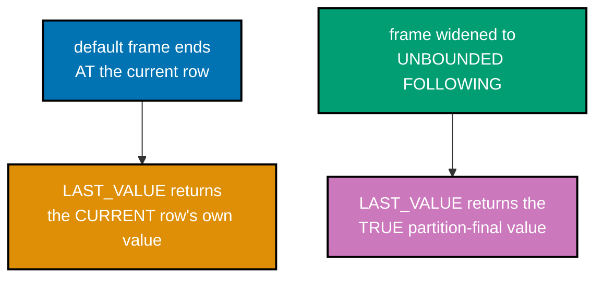
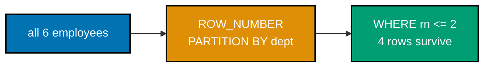
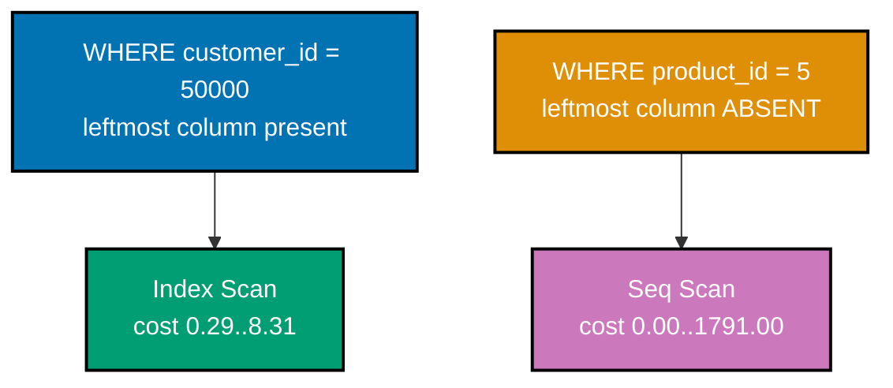
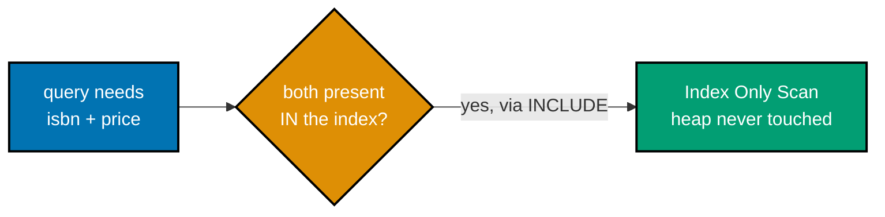
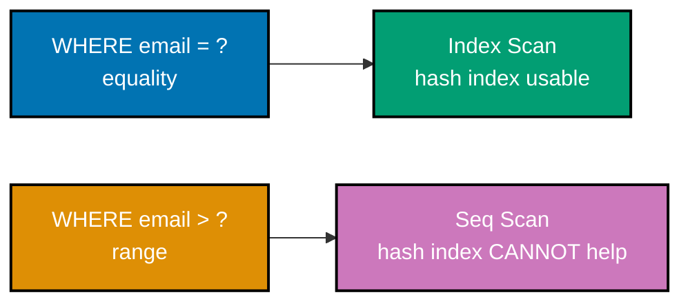
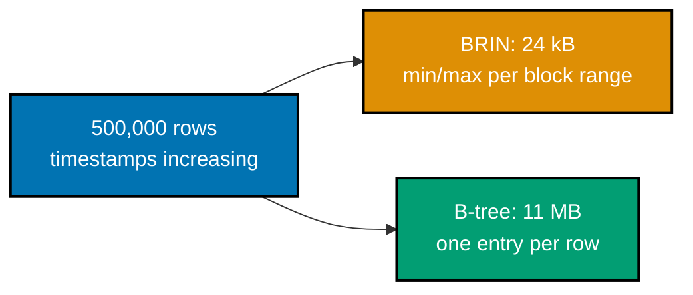
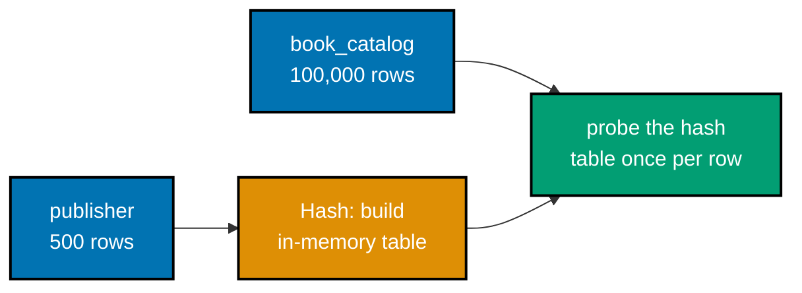
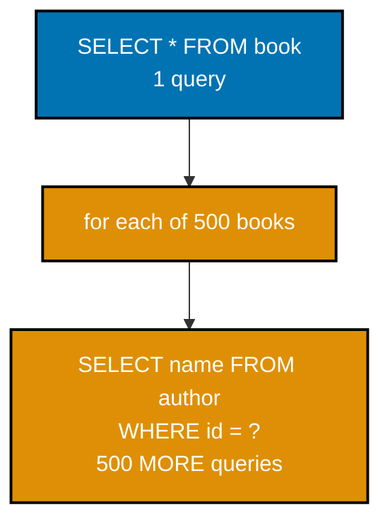
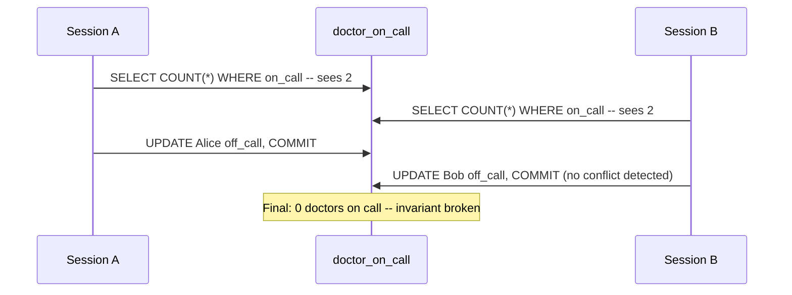

Examples 29-64 move from query features into performance engineering: rewriting subqueries as joins,
graph-safe recursion, explicit window frames, `LATERAL` joins, `CUBE`, every specialized index type
PostgreSQL ships, reading `EXPLAIN`'s three join-node types, the N+1 query problem end to end in
Python, every read anomaly PostgreSQL's isolation levels can produce, deadlocks, advisory locks, and
materialized views. Every example runs against a real **PostgreSQL 18.4** instance -- every result
shown below is captured output, not a hand-written transcript. Each `.sql` example is fully
self-contained (`DROP TABLE IF EXISTS ... CASCADE` before seeding); each `.py` example opens its own
real `psycopg` connections. Run `.sql` files with `psql -U <user> -d <db> -f example.sql`; run `.py`
files with `python3 example.py`.

---

### Example 29: Correlated Subquery to Join

_ex-29 &middot; exercises co-01, co-24_

Rewriting a correlated subquery as an explicit `JOIN` often gives the planner more freedom to choose a
hash or merge strategy instead of a per-row probe -- same logical result set, potentially a very
different physical plan.

**`learning/code/ex-29-correlated-subquery-to-join/example.sql`**

```sql
-- Example 29: Correlated Subquery to Join.
-- Rewriting a correlated subquery (co-01) as an explicit JOIN often gives the
-- planner more freedom to choose a hash or merge strategy instead of a per-row
-- probe (co-24) -- same result set, potentially a very different plan.
SET
  client_min_messages TO WARNING;

DROP TABLE IF EXISTS book,
author CASCADE;

-- Resetting both tables guarantees this example's row counts are exactly
-- what the comments below describe, regardless of what ran before it.
-- => resets state -- this example is fully self-contained
-- Same author/book schema as Examples 1-5, plus Turing (zero books) reprised
-- from Example 2 -- this dataset is reused deliberately across many examples.
CREATE TABLE author (id INTEGER PRIMARY KEY, name TEXT NOT NULL);

CREATE TABLE book (
  id INTEGER PRIMARY KEY,
  title TEXT NOT NULL,
  -- price is unused by either query form here -- carried over from the shared
  -- schema purely for consistency with earlier examples, not because this
  -- example needs it.
  price NUMERIC(6, 2) NOT NULL,
  -- The same FOREIGN KEY relationship both forms rely on -- Form 1's correlation
  -- predicate and Form 2's JOIN condition both walk this exact FK relationship.
  author_id INTEGER REFERENCES author (id)
);

-- => both tables exist, currently empty
-- Turing again seeds the zero-books edge case -- both forms below must agree
-- on excluding him, proving the rewrite preserves EXISTS's exact semantics.
INSERT INTO
  author (id, name)
VALUES
  (1, 'Ada Lovelace'),
  (2, 'Grace Hopper'),
  (3, 'Alan Turing');

-- Ada has 2 books, Grace has 1, Turing has 0 -- enough variety that a plain
-- JOIN (Form 2) would produce a DIFFERENT row count than EXISTS (Form 1)
-- if DISTINCT were omitted, which is exactly the gotcha this example proves.
INSERT INTO
  book (id, title, price, author_id)
VALUES
  (1, 'The Pragmatic Programmer', 34.99, 1),
  (2, 'Clean Code', 29.99, 1),
  (3, 'The Mythical Man-Month', 24.50, 2);

-- => Turing has zero books -- the anti-join case below
-- Form 1: correlated EXISTS (co-01) -- same shape as Example 2.
-- Form 1 never duplicates a row: EXISTS is a boolean test, so each author
-- appears AT MOST once regardless of how many books they have.
SELECT
  a.name
FROM
  author a
WHERE
  EXISTS (
    -- Same idiomatic SELECT 1 as Example 2 -- EXISTS only cares whether a matching
    -- row is found, never what that row contains.
    SELECT
      1
    FROM
      book b
    WHERE
      b.author_id = a.id
  )
  -- Sorting alphabetically makes the two forms' output trivially comparable
  -- side by side -- both forms return "Ada" then "Grace", in that order.
ORDER BY
  a.name;

-- => Ada, Grace -- authors WITH at least one book
-- Form 2: the join rewrite -- DISTINCT because a join duplicates author rows once
-- PER matching book, which EXISTS never did (co-24: a different physical strategy).
-- Ada's 2 books mean the raw JOIN (before DISTINCT) would emit Ada TWICE --
-- once per matching book row -- Grace's 1 book emits her once, and Turing,
-- having zero books, never appears in an INNER JOIN result at all.
SELECT DISTINCT
  a.name
FROM
  author a
  -- This ON condition is IDENTICAL to the correlation predicate inside Form 1's
  -- EXISTS -- the rewrite is mechanical: move the correlation from a subquery
  -- WHERE clause into an explicit JOIN condition.
  JOIN book b ON b.author_id = a.id
  -- The SAME ordering as Form 1 -- necessary for a fair side-by-side comparison
  -- of the two forms' output, independent of what each form's default row order might be.
ORDER BY
  a.name;

-- => identical 2 rows: Ada, Grace -- same logical result,
-- => but the planner can now choose Hash Join or Merge Join
-- => instead of a per-row correlated subquery probe
-- "Different physical strategy, same logical result" is the running theme this
-- example sets up -- Examples 49-51 show EXPLAIN output proving the planner
-- really does pick different join algorithms (nested loop, hash, merge) for
-- queries shaped like these two forms.
```

**Run**: `psql -U asqp -d asqp -f example.sql`

**Output**:

```text
     name
--------------
 Ada Lovelace
 Grace Hopper
(2 rows)

     name
--------------
 Ada Lovelace
 Grace Hopper
(2 rows)
```

**Key takeaway**: `EXISTS` and `JOIN + DISTINCT` are logically equivalent here, but not interchangeable
in general -- a join without `DISTINCT` would return one row per matching book (duplicating authors
with multiple books), so the rewrite is only safe once you account for that fan-out.

**Why it matters**: PostgreSQL's planner already rewrites many `EXISTS` subqueries into semi-joins
internally, so this manual rewrite is not always necessary -- but when `EXPLAIN` shows the planner
missed that opportunity (common with complex correlation conditions), knowing the manual join-plus-
`DISTINCT` (or better, a semi-join-safe `GROUP BY`) rewrite is how you unblock it by hand.

---

### Example 30: Recursive CTE Graph Cycle

_ex-30 &middot; exercises co-03_

A graph, unlike a tree, can contain cycles -- a naive recursive CTE over a cyclic route table would
loop forever. The fix: carry the visited path in an array and refuse to revisit any city already on it.



**`learning/code/ex-30-recursive-cte-graph-cycle/example.sql`**

```sql
-- Example 30: Recursive CTE Graph Cycle.
-- A GRAPH, unlike a tree, can have cycles -- a naive recursive CTE (co-03) over a
-- cyclic route table would loop forever. The fix: carry the visited path in an
-- ARRAY and refuse to revisit any city already in it.
SET client_min_messages TO WARNING;
DROP TABLE IF EXISTS route CASCADE;
                                    -- => resets state -- this example is fully self-contained
-- route stores directed edges as plain rows -- no PRIMARY KEY, since the same
-- city pair could legitimately appear more than once in a real route network.
CREATE TABLE route(from_city TEXT NOT NULL, to_city TEXT NOT NULL);
                                    -- => a directed edge list -- deliberately contains a CYCLE
INSERT INTO route(from_city, to_city) VALUES
    ('Jakarta', 'Singapore'),
    ('Singapore', 'Bangkok'),
    ('Bangkok', 'Jakarta'),        -- => Bangkok -> Jakarta closes a CYCLE back to the start
    ('Bangkok', 'Hanoi');
                                    -- => without a guard, Jakarta->Singapore->Bangkok->Jakarta->... loops forever

-- The path ARRAY (co-03) accumulates every city visited so far. The recursive
-- term's WHERE clause is the cycle guard: NOT (r.to_city = ANY(path)) refuses to
-- step into a city already on the current path.
-- path is a native Postgres ARRAY column -- ANY(path) and array concatenation
-- (path || r.to_city) are built-in array operators, no separate table needed
-- to track "which cities has this branch of the search already visited".
WITH RECURSIVE reachable AS (
    SELECT from_city AS city, ARRAY[from_city] AS path
    FROM route
    WHERE from_city = 'Jakarta'     -- => anchor: start at Jakarta with a 1-city path
    UNION ALL
-- Each recursive pass explores every outbound edge from the CURRENT frontier
-- of cities -- this is a breadth-first graph walk, not the depth-first walk
-- a recursive function call would perform.
    SELECT r.to_city, reachable.path || r.to_city
    FROM route r
    JOIN reachable ON r.from_city = reachable.city
    WHERE NOT (r.to_city = ANY(reachable.path))
                                    -- => cycle guard: skip any city ALREADY in this path
)
SELECT DISTINCT city FROM reachable ORDER BY city;
                                    -- => Bangkok, Hanoi, Jakarta, Singapore -- every reachable city,
                                    -- => and the query TERMINATES despite the Bangkok->Jakarta cycle
-- Without the cycle guard, PostgreSQL would eventually raise an out-of-memory
-- or statement-timeout error rather than loop truly forever -- but by then it
-- has already done a great deal of wasted, unbounded work.
```

**Run**: `psql -U asqp -d asqp -f example.sql`

**Output**:

```text
   city
-----------
 Bangkok
 Hanoi
 Jakarta
 Singapore
(4 rows)
```

**Key takeaway**: The termination guard for a tree (Example 7) is implicit -- you eventually run out of
children. For a graph, that guard must be explicit: track the path and refuse to step into a node
already on it, or `WITH RECURSIVE` will genuinely never terminate on cyclic data.

**Why it matters**: Route networks, social graphs, and dependency graphs (package A depends on B
depends on C depends on A) are all naturally cyclic in real production data -- assuming your hierarchy
is a strict tree, when it is actually a graph, is a common source of the exact infinite-recursion bug
this example's guard exists to prevent. Example 65 (Advanced tier) extends this same guarded shape to
compute shortest-path cost, not just reachability.

---

### Example 31: Recursive CTE Bill of Materials

_ex-31 &middot; exercises co-03_

A bill-of-materials (BOM) explosion answers "how many of each raw part do I need to build one finished
product?" -- quantities **multiply** down each level of the tree, unlike Example 7's org chart, which
only counted depth.

**`learning/code/ex-31-recursive-cte-bom/example.sql`**

```sql
-- Example 31: Recursive CTE Bill of Materials.
-- A bill-of-materials (BOM) explosion (co-03) answers "how many of each raw part
-- do I need to build ONE finished product?" -- quantities MULTIPLY down each level.
SET
  client_min_messages TO WARNING;

DROP TABLE IF EXISTS part CASCADE;

-- => resets state -- this example is fully self-contained
-- Same self-referencing adjacency-list shape as Example 7's org chart, but with
-- an extra qty_per_parent column -- the multiplier at each level, not just the
-- structural link.
CREATE TABLE part (
  id INTEGER PRIMARY KEY,
  -- id is a plain integer identifier, unrelated to the multiplier math -- name is
  -- what carries meaning in the final report below.
  name TEXT NOT NULL,
  -- Just as in Example 7, the root's parent_id is NULL -- the recursion's anchor
  -- is selected by WHERE id = 1, not by testing parent_id IS NULL, though either
  -- approach would work for this single-root dataset.
  parent_id INTEGER REFERENCES part (id),
  -- qty_per_parent means "how many of THIS part are needed to build ONE of its
  -- immediate parent" -- a purely LOCAL ratio; the recursion's job is turning
  -- these local ratios into a cumulative total from root to leaf.
  qty_per_parent INTEGER NOT NULL
);

-- => self-referencing FK, like Example 7's org chart
-- A 2-level bicycle: Wheel and Frame are direct children of Bicycle; Spoke and
-- Tire are children of Wheel -- deep enough to prove the multiplier COMPOUNDS
-- across levels (Spoke's 72 = 2 wheels x 36 spokes) rather than just copying down.
INSERT INTO
  part (id, name, parent_id, qty_per_parent)
VALUES
  (1, 'Bicycle', NULL, 1), -- => the root -- 1 bicycle is the top-level product
  (2, 'Wheel', 1, 2), -- => each bicycle needs 2 wheels
  (3, 'Frame', 1, 1), -- => each bicycle needs 1 frame
  (4, 'Spoke', 2, 36), -- => each WHEEL needs 36 spokes
  (5, 'Tire', 2, 1);

-- => each wheel needs 1 tire
-- Anchor: the root part, multiplier 1. Recursive term: multiply the CHILD's own
-- qty_per_parent by the PARENT's already-accumulated multiplier (co-03) -- this is
-- what makes spokes come out as 2 wheels x 36 spokes = 72, not just 36.
-- multiplier starts at 1 for the anchor (Bicycle needs exactly 1 of itself) --
-- every other part's multiplier is computed relative to that starting value.
WITH RECURSIVE
  bom AS (
    SELECT
      id,
      name,
      parent_id,
      -- Same accumulator-column pattern as Example 7's depth column, but MULTIPLYING
      -- instead of ADDING at each recursive step -- the recursion mechanics are
      -- identical; only the arithmetic combining function changes.
      1 AS multiplier
    FROM
      -- The anchor's FROM part with WHERE id = 1 scans the WHOLE part table looking
      -- for one row -- fine at this tiny scale; a real BOM table would want an index
      -- on id (already implicit, since id IS the primary key).
      part
    WHERE
      id = 1 -- => anchor: the Bicycle itself, multiplier 1
    UNION ALL
    -- p.id, p.name, p.parent_id must again match the anchor's column list exactly
    -- in count and type -- see Example 7's note on this same requirement.
    SELECT
      p.id,
      p.name,
      p.parent_id,
      -- bom.multiplier * p.qty_per_parent is the entire algorithm: each level's
      -- multiplier is the PARENT's multiplier scaled by how many of THIS part one
      -- parent needs -- compounding naturally falls out of ordinary multiplication.
      bom.multiplier * p.qty_per_parent
    FROM
      part p
      -- Joining CHILD parts to their already-processed PARENT row (not the other way
      -- around) is what lets bom.multiplier already hold the fully-accumulated
      -- multiplier from the root down to that parent before this level multiplies it further.
      JOIN bom ON p.parent_id = bom.id
      -- => recursive term: multiply DOWN the tree, not just add
  )
SELECT
  name,
  multiplier AS total_needed_per_bicycle
FROM
  bom
  -- Excluding the root mirrors a real bill-of-materials report: nobody needs to
  -- be told "you need 1 bicycle to build 1 bicycle" -- only the component list matters.
WHERE
  id != 1 -- => exclude the root -- we want components, not the product itself
  -- Alphabetical ordering here is purely cosmetic -- it does not affect any of
  -- the already-computed multiplier values.
ORDER BY
  name;

-- => Frame: 1, Spoke: 72 (2 wheels x 36), Tire: 2, Wheel: 2
-- This same multiply-down-the-tree pattern generalizes to any explosion
-- problem -- ingredient quantities in a recipe tree, dependency counts in a
-- build graph, or resource requirements in a project breakdown structure.
```

**Run**: `psql -U asqp -d asqp -f example.sql`

**Output**:

```text
 name  | total_needed_per_bicycle
-------+--------------------------
 Frame |                        1
 Spoke |                       72
 Tire  |                        2
 Wheel |                        2
```

**Key takeaway**: `bom.multiplier * p.qty_per_parent` (not addition) is what makes this a true BOM
explosion -- 36 spokes per wheel times 2 wheels per bicycle correctly yields 72 spokes per bicycle,
propagating the multiplication down every level of arbitrary depth.

**Why it matters**: Manufacturing, recipe scaling, and software dependency-with-version-multiplication
problems all reduce to exactly this "explode a multi-level composition into flat totals" shape. It is
also the same underlying pattern a build system uses to compute "how many times does this shared
library get linked" across a deep dependency tree.

---

### Example 32: Window Moving Average

_ex-32 &middot; exercises co-05_

`ROWS BETWEEN N PRECEDING AND CURRENT ROW` makes the frame **explicit**: a sliding 3-day window, not
the whole-history running total Example 8's default frame computed.


**`learning/code/ex-32-window-moving-average/example.sql`**

```sql
-- Example 32: Window Moving Average.
-- ROWS BETWEEN N PRECEDING AND CURRENT ROW (co-05) makes the frame EXPLICIT: a
-- sliding 3-day window, not the whole-history running total from Example 8.
SET
  client_min_messages TO WARNING;

DROP TABLE IF EXISTS daily_sales CASCADE;

-- => resets state -- this example is fully self-contained
-- Same daily_sales shape as Example 8 -- one extra day (Jan 5) added so the
-- sliding window has room to visibly SLIDE past its first few rows.
CREATE TABLE daily_sales (
  sale_date DATE PRIMARY KEY,
  -- Same NUMERIC(8, 2) precision convention as Example 8 -- exact decimal
  -- arithmetic for the AVG computed inside each sliding window.
  amount NUMERIC(8, 2) NOT NULL
);

-- Values chosen so the moving average visibly changes shape as the window
-- fills up (day 1: 1 row) and then slides (day 4 onward: always exactly 3 rows).
INSERT INTO
  daily_sales (sale_date, amount)
VALUES
  ('2026-01-01', 100.00),
  ('2026-01-02', 50.00),
  ('2026-01-03', 75.00),
  ('2026-01-04', 120.00),
  ('2026-01-05', 90.00);

-- => 5 days -- the frame below only ever looks BACK at most 2 days
-- ROWS BETWEEN 2 PRECEDING AND CURRENT ROW (co-05) is an EXPLICIT frame: sum only
-- the current row plus the 2 rows immediately before it -- a sliding window, not
-- Example 8's ever-growing "everything since the start" default frame.
SELECT
  sale_date,
  amount,
  -- ROUND wraps the window result exactly as in Example 9 -- a scalar function
  -- applied AFTER the window function has already produced its per-row value.
  ROUND(
    -- 2 PRECEDING AND CURRENT ROW is inclusive on both ends -- 3 rows total once
    -- the window is fully "warmed up", which is why the label says 3day, not 2day.
    AVG(amount) OVER (
      -- ROWS (not RANGE) is specified explicitly here because sale_date is UNIQUE per
      -- row -- with a unique ORDER BY key the two frame modes agree, but writing ROWS
      -- states the intent unambiguously (see Example 33 for when they diverge).
      ORDER BY
        sale_date ROWS BETWEEN 2 PRECEDING
        AND CURRENT ROW
    ),
    2
  ) AS moving_avg_3day
FROM
  -- Early rows (Jan 1, Jan 2) have FEWER than 2 preceding rows available --
  -- Postgres simply uses however many actually exist rather than padding with
  -- NULLs or erroring, which is why Jan 1's average is just itself.
  daily_sales
  -- The outer ORDER BY (again) only controls display order -- the window's own
  -- ORDER BY sale_date already fixed which rows fall inside each 3-day frame.
ORDER BY
  sale_date;

-- => Jan 1: avg of just itself = 100.00 (only 1 row exists so far)
-- => Jan 3: avg of (100+50+75)/3 = 75.00 (full 3-row window)
-- => Jan 5: avg of (75+120+90)/3 = 95.00 (window has SLID forward)
-- Unlike Example 8's running total, this average never simply grows -- it can
-- rise or fall as new days enter the 3-day window and old ones age out of it,
-- which is the entire point of a MOVING average versus a cumulative one.
```

**Run**: `psql -U asqp -d asqp -f example.sql`

**Output**:

```text
 sale_date  | amount | moving_avg_3day
------------+--------+-----------------
 2026-01-01 | 100.00 |          100.00
 2026-01-02 |  50.00 |           75.00
 2026-01-03 |  75.00 |           75.00
 2026-01-04 | 120.00 |           81.67
 2026-01-05 |  90.00 |           95.00
(5 rows)
```

**Key takeaway**: Near the start of the ordering, a `PRECEDING` frame simply has fewer rows available
than requested (Jan 1's "3-day" average is really a 1-row average) -- PostgreSQL never errors on this,
it just averages whatever rows the frame actually contains.

**Why it matters**: Moving averages smooth out day-to-day noise in metrics dashboards -- 7-day or
30-day moving averages are the standard way to present daily active users or revenue without the
chart looking jagged. This explicit-frame technique computes it in one pass over the data, versus a
self-join that would need to re-scan the table once per output row.

---

### Example 33: RANGE vs ROWS Frame

_ex-33 &middot; exercises co-05_

With a unique `ORDER BY` key, `RANGE` and `ROWS` frames agree. With duplicate `ORDER BY` values, they
diverge: `RANGE` treats every tied "peer" row as arriving together, while `ROWS` treats each physical
row as its own step regardless of ties.

**`learning/code/ex-33-window-range-frame/example.sql`**

```sql
-- Example 33: RANGE vs ROWS Frame.
-- With a UNIQUE ORDER BY key, RANGE and ROWS frames agree. With DUPLICATE ORDER BY
-- values, they diverge (co-05): RANGE treats every tied "peer" row as ARRIVING
-- together, ROWS treats each physical row as its own step regardless of ties.
SET
  client_min_messages TO WARNING;

DROP TABLE IF EXISTS sale CASCADE;

-- => resets state -- this example is fully self-contained
-- A minimal 4-row table with exactly one deliberate tie -- the smallest
-- dataset that can expose a RANGE-vs-ROWS divergence at all.
CREATE TABLE sale (
  -- id is never referenced inside either OVER() clause -- only amount drives
  -- the ordering and frame boundaries for both window functions here.
  id INTEGER PRIMARY KEY,
  amount NUMERIC(8, 2) NOT NULL
);

-- id doubles as an arbitrary insertion-order tie-breaker -- amount alone
-- cannot distinguish row 2 from row 3, both windows key off amount only.
INSERT INTO
  sale (id, amount)
VALUES
  (1, 10.00),
  (2, 20.00),
  (3, 20.00), -- => TIES with row 2 -- both have amount = 20.00
  (4, 30.00);

-- => rows 2 and 3 are "peers" under ORDER BY amount -- the tie
-- Without a tie, this whole example would have nothing to show -- RANGE and
-- ROWS only disagree when two or more rows share the SAME ORDER BY value.
-- ROWS BETWEEN UNBOUNDED PRECEDING AND CURRENT ROW (co-05) walks PHYSICAL rows one
-- at a time -- row 2 and row 3 get DIFFERENT running sums even though they tie.
-- RANGE (the default frame mode) treats BOTH peers as arriving simultaneously --
-- row 2 and row 3 get the SAME running sum, computed as of the whole peer group.
SELECT
  id,
  amount,
  -- UNBOUNDED PRECEDING AND CURRENT ROW means "every row from the very start
  -- through this one" -- the running-total shape, just with the frame MODE made
  -- explicit instead of relying on the default.
  SUM(amount) OVER (
    ORDER BY
      amount ROWS BETWEEN UNBOUNDED PRECEDING
      AND CURRENT ROW
  ) AS rows_frame,
  -- This is IDENTICAL to Example 8's default (no explicit frame) behavior --
  -- RANGE BETWEEN UNBOUNDED PRECEDING AND CURRENT ROW is exactly what Postgres
  -- assumes when ORDER BY is present but no frame clause is written at all.
  SUM(amount) OVER (
    ORDER BY
      amount RANGE BETWEEN UNBOUNDED PRECEDING
      AND CURRENT ROW
  ) AS range_frame
FROM
  -- Both window functions read from the SAME sale table in the SAME query --
  -- only the frame MODE (ROWS vs RANGE) differs between the two OVER() clauses.
  sale
  -- Ordering by amount THEN id breaks the tie deterministically for DISPLAY --
  -- rows_frame and range_frame's values were already fixed by each window's own
  -- ORDER BY amount, independent of this outer tie-break.
ORDER BY
  amount,
  id;

-- => id 2: rows_frame 30.00 (10+20), range_frame 50.00 (10+20+20, BOTH peers)
-- => id 3: rows_frame 50.00 (10+20+20), range_frame 50.00 (SAME as id 2 -- peers tie)
-- The practical rule of thumb: reach for ROWS whenever the frame should be
-- about PHYSICAL row position (exactly N rows), and rely on the RANGE default
-- only when ties in the ORDER BY column should logically move together.
```

**Run**: `psql -U asqp -d asqp -f example.sql`

**Output**:

```text
 id | amount | rows_frame | range_frame
----+--------+------------+-------------
  1 |  10.00 |      10.00 |       10.00
  2 |  20.00 |      30.00 |       50.00
  3 |  20.00 |      50.00 |       50.00
  4 |  30.00 |      80.00 |       80.00
(4 rows)
```

**Key takeaway**: `RANGE`'s default behavior (no explicit frame mode written at all defaults to
`RANGE`, not `ROWS`) is a common source of subtly wrong running totals whenever the `ORDER BY` column
has ties -- if you want a strictly row-by-row running total, write `ROWS` explicitly rather than
relying on the default.

**Why it matters**: A running-total report ordered by a date column with several transactions per day
(a very common real shape) hits this exact divergence -- `RANGE`'s default frame silently gives every
same-day transaction the same running total (the end-of-day total), which surprises anyone expecting a
strictly transaction-by-transaction accumulation. Always write `ROWS` explicitly when transaction-level
granularity matters.

---

### Example 34: FIRST_VALUE and LAST_VALUE

_ex-34 &middot; exercises co-04, co-05_

`FIRST_VALUE`/`LAST_VALUE` read a value from the edge of the current frame. The classic gotcha:
`LAST_VALUE` with the default frame (`RANGE ... UNBOUNDED PRECEDING AND CURRENT ROW`) sees the
**current row** as the last row of its own frame -- not the true last row of the partition -- unless
the frame is widened explicitly.



**`learning/code/ex-34-window-first-last-value/example.sql`**

```sql
-- Example 34: FIRST_VALUE and LAST_VALUE.
-- FIRST_VALUE/LAST_VALUE (co-04) read a value from the EDGE of the current frame.
-- The classic gotcha: LAST_VALUE with the DEFAULT frame (RANGE ... UNBOUNDED
-- PRECEDING AND CURRENT ROW, co-05) sees the CURRENT row as the last row -- not
-- the true last row of the partition -- unless the frame is widened explicitly.
SET
  client_min_messages TO WARNING;

DROP TABLE IF EXISTS employee CASCADE;

-- => resets state -- this example is fully self-contained
-- Single-department dataset (all Engineering) keeps PARTITION BY trivial here --
-- the interesting behavior is entirely about frame boundaries within one partition.
CREATE TABLE employee (
  id INTEGER PRIMARY KEY,
  name TEXT NOT NULL,
  -- dept is constant (Engineering) across all 3 rows here -- PARTITION BY still
  -- works correctly with a single partition, it just has nothing to contrast
  -- against in this minimal example.
  dept TEXT NOT NULL,
  -- Same money-safe NUMERIC precision convention used throughout this topic's
  -- salary/price columns.
  salary NUMERIC(9, 2) NOT NULL
);

-- Salaries strictly decrease by insertion order -- irrelevant to the query,
-- which orders by salary DESC regardless of insertion order.
INSERT INTO
  employee (id, name, dept, salary)
VALUES
  (1, 'Linus', 'Engineering', 105000),
  (2, 'Ada', 'Engineering', 95000),
  (3, 'Barbara', 'Engineering', 88000);

-- => 3 Engineering employees, ordered by salary DESC below
-- FIRST_VALUE (co-04) with the default frame correctly returns Linus (highest
-- salary) for every row -- the frame's start is fixed at the partition's start.
-- last_value_wrong uses the DEFAULT frame, so it wrongly echoes each row's OWN
-- salary owner back. last_value_fixed widens the frame to the WHOLE partition.
SELECT
  name,
  salary,
  -- FIRST_VALUE's default frame -- RANGE BETWEEN UNBOUNDED PRECEDING AND CURRENT
  -- ROW -- always includes the partition's FIRST row (Linus, once ordered DESC),
  -- so FIRST_VALUE is correct with no extra frame clause needed.
  FIRST_VALUE (name) OVER (
    -- PARTITION BY dept means each department would get its OWN highest_paid/
    -- last_value if more than one department existed -- moot here with just one.
    PARTITION BY
      dept
    ORDER BY
      salary DESC
  ) AS highest_paid,
  -- LAST_VALUE's default frame ALSO ends at CURRENT ROW, not at the partition's
  -- true last row -- so LAST_VALUE, unlike FIRST_VALUE, silently returns the
  -- CURRENT row's own name for every row: the classic default-frame gotcha.
  LAST_VALUE (name) OVER (
    PARTITION BY
      dept
    ORDER BY
      salary DESC
  ) AS last_value_wrong,
  -- ROWS BETWEEN UNBOUNDED PRECEDING AND UNBOUNDED FOLLOWING widens the frame to
  -- the ENTIRE partition, front to back -- only then does LAST_VALUE actually
  -- reach the partition's true last row (Barbara) for every output row.
  LAST_VALUE (name) OVER (
    PARTITION BY
      dept
    ORDER BY
      salary DESC ROWS BETWEEN UNBOUNDED PRECEDING
      AND UNBOUNDED FOLLOWING
  ) AS last_value_fixed
FROM
  -- All three window functions read the SAME partition/order specification,
  -- differing only in their FRAME -- isolating frame width as the one variable.
  employee
  -- Ordering DESC for display matches the DESC ordering already used inside
  -- every OVER() clause -- Linus (highest) prints first, Barbara (lowest) last.
ORDER BY
  salary DESC;

-- => highest_paid is Linus for ALL 3 rows -- correct on the first try
-- => last_value_wrong just echoes each row's OWN name -- the gotcha
-- => last_value_fixed is Barbara for ALL 3 rows -- the TRUE lowest earner
-- MIN()/MAX() OVER (PARTITION BY dept) would sidestep this whole gotcha for a
-- simple highest/lowest lookup -- FIRST_VALUE/LAST_VALUE earn their keep once
-- you need an arbitrary EXPRESSION evaluated at a specific frame edge, not just
-- the min/max of one column.
```

**Run**: `psql -U asqp -d asqp -f example.sql`

**Output**:

```text
  name   |  salary   | highest_paid | last_value_wrong | last_value_fixed
---------+-----------+--------------+------------------+------------------
 Linus   | 105000.00 | Linus        | Linus            | Barbara
 Ada     |  95000.00 | Linus        | Ada               | Barbara
 Barbara |  88000.00 | Linus        | Barbara           | Barbara
(3 rows)
```

**Key takeaway**: `FIRST_VALUE` "just works" with the default frame because the frame's start already
IS the partition's start -- `LAST_VALUE` needs the frame's end explicitly widened to
`UNBOUNDED FOLLOWING`, because the default frame's end is the current row, not the partition's end.

**Why it matters**: This asymmetry between `FIRST_VALUE` and `LAST_VALUE` is one of the most commonly
mis-used window functions in production SQL -- a query that "looks right" (it runs, it returns data)
but silently returns the wrong `LAST_VALUE` is a real, hard-to-spot class of bug. Always pair
`LAST_VALUE` with an explicit `ROWS BETWEEN UNBOUNDED PRECEDING AND UNBOUNDED FOLLOWING` frame unless
you specifically want the "as of this row" default behavior.

---

### Example 35: PERCENT_RANK and CUME_DIST

_ex-35 &middot; exercises co-06_

`PERCENT_RANK` reports each row's relative position as a fraction from 0 to 1 -- the lowest earner is
always `0.0`, the highest is always `1.0`. `CUME_DIST` reports the fraction of rows at or below the
current row's rank.

**`learning/code/ex-35-window-percent-rank/example.sql`**

```sql
-- Example 35: PERCENT_RANK and CUME_DIST.
-- PERCENT_RANK (co-06) reports each row's relative position as a fraction from 0
-- to 1. CUME_DIST reports the fraction of rows AT OR BELOW the current row's rank.
SET client_min_messages TO WARNING;
DROP TABLE IF EXISTS employee CASCADE;
                                    -- => resets state -- this example is fully self-contained
-- Five employees, five distinct salaries -- no ties, so every rank is unique
-- and PERCENT_RANK/CUME_DIST land on clean, easy-to-verify fractions.
CREATE TABLE employee(id INTEGER PRIMARY KEY, name TEXT NOT NULL, salary NUMERIC(9,2) NOT NULL);
INSERT INTO employee(id, name, salary) VALUES
    (1, 'Linus',   105000), (2, 'Grace',    99000),
    (3, 'Ada',      95000), (4, 'Alan',     88000),
    (5, 'Barbara',  80000);
                                    -- => 5 employees -- PERCENT_RANK/CUME_DIST both range over [0, 1]

-- PERCENT_RANK() (co-06) = (rank - 1) / (total_rows - 1) -- the LOWEST earner is
-- always 0.0, the HIGHEST is always 1.0. CUME_DIST = rows_at_or_below / total_rows.
-- Both return DOUBLE PRECISION, so ROUND needs an explicit ::numeric cast.
SELECT
    name,
    salary,
-- (rank - 1) / (total_rows - 1) is PERCENT_RANK's own formula -- with 5 rows,
-- each step up in rank moves percent_rank by exactly 1/4 = 0.25.
    ROUND(PERCENT_RANK() OVER (ORDER BY salary)::numeric, 3) AS percent_rank,
-- CUME_DIST's denominator is total_rows, not total_rows - 1 -- that's why the
-- LOWEST earner's cume_dist (0.200 = 1/5) is never 0.0, unlike percent_rank.
    ROUND(CUME_DIST()    OVER (ORDER BY salary)::numeric, 3) AS cume_dist
FROM employee
ORDER BY salary;
                                    -- => Barbara (lowest): percent_rank 0.000, cume_dist 0.200 (1 of 5 rows)
                                    -- => Linus (highest): percent_rank 1.000, cume_dist 1.000 (all 5 rows)
```

**Run**: `psql -U asqp -d asqp -f example.sql`

**Output**:

```text
  name   |  salary   | percent_rank | cume_dist
---------+-----------+--------------+-----------
 Barbara |  80000.00 |        0.000 |     0.200
 Alan    |  88000.00 |        0.250 |     0.400
 Ada     |  95000.00 |        0.500 |     0.600
 Grace   |  99000.00 |        0.750 |     0.800
 Linus   | 105000.00 |        1.000 |     1.000
(5 rows)
```

**Key takeaway**: `PERCENT_RANK` always spans exactly `[0, 1]` regardless of the actual salary values --
it describes _relative position_, not the underlying data's scale, so it is directly comparable across
completely different datasets (this year's salaries versus last year's).

**Why it matters**: "You are in the top 25% of applicants" or "this response time is worse than 90% of
requests" are both `PERCENT_RANK`/`CUME_DIST` questions -- percentile-based SLA reporting and
standardized-test-style scoring both rely on exactly this normalization. `NTILE` (Example 12) answers
a related but different question: which discrete bucket, rather than which continuous fraction.

---

### Example 36: Top-N per Group

_ex-36 &middot; exercises co-06_

`ROW_NUMBER() OVER (PARTITION BY ...)` numbers rows **within** each group -- filtering `WHERE rn <= N`
in an outer query is the standard, idiomatic "top N per group" pattern.



**`learning/code/ex-36-top-n-per-group/example.sql`**

```sql
-- Example 36: Top-N per Group.
-- ROW_NUMBER() PARTITION BY ... (co-06) numbers rows WITHIN each group -- filtering
-- WHERE rn <= N in an outer query is the standard "top N per group" pattern.
SET
  client_min_messages TO WARNING;

DROP TABLE IF EXISTS employee CASCADE;

-- Resetting the table first guarantees exactly 6 rows -- 3 per department --
-- regardless of what any earlier example left behind.
-- => resets state -- this example is fully self-contained
-- Same employee shape as Example 9, now with a second department seeded so
-- "top N PER group" has two independent groups to demonstrate against.
CREATE TABLE employee (
  -- id is unused in either the CTE or the final SELECT -- it exists purely
  -- as the table's primary key, not because this query needs it.
  id INTEGER PRIMARY KEY,
  name TEXT NOT NULL,
  -- dept is the PARTITION BY key -- every distinct value becomes its own
  -- independent numbering group, however many departments end up existing.
  dept TEXT NOT NULL,
  -- Same money-safe NUMERIC precision convention used throughout this topic's
  -- salary columns.
  salary NUMERIC(9, 2) NOT NULL
);

-- 3 rows per department, salaries all distinct within each dept -- clean ranks
-- with no ties to complicate which 2 rows "top 2" should keep.
INSERT INTO
  employee (id, name, dept, salary)
VALUES
  (1, 'Linus', 'Engineering', 105000),
  (2, 'Ada', 'Engineering', 95000),
  (3, 'Barbara', 'Engineering', 88000),
  (4, 'Grace', 'Data', 99000),
  (5, 'Alan', 'Data', 91000),
  (6, 'Edsger', 'Data', 85000);

-- => 3 Engineering, 3 Data -- top-2 per dept below excludes 2 rows total
-- ROW_NUMBER() CANNOT appear in a WHERE clause directly (window functions run
-- AFTER WHERE) -- wrap it in a subquery/CTE, then filter the OUTER query (co-06).
-- This is the SAME problem Example 10 introduced for a single, ungrouped rank
-- -- Top-N per group is that same numbering trick with PARTITION BY layered on.
WITH
  -- ranked is a plain (non-recursive) CTE -- exactly the Example 4 pattern,
  -- just carrying a window function's output through to the outer query.
  ranked AS (
    SELECT
      -- name, dept, and salary all ride through the CTE untouched -- ranked simply
      -- adds rn alongside the original columns, it does not transform them.
      name,
      dept,
      salary,
      -- PARTITION BY dept resets the numbering back to 1 at the start of EACH
      -- department -- without it, rn would count 1 through 6 across the whole table,
      -- and "rn <= 2" would keep only the 2 single highest earners company-wide.
      ROW_NUMBER() OVER (
        PARTITION BY
          dept
          -- Ordering DESC inside the window is what makes rn = 1 mean "highest earner"
          -- -- flipping to ASC would instead make rn = 1 the LOWEST earner per department.
        ORDER BY
          salary DESC
      ) AS rn
    FROM
      -- No WHERE clause at all inside the CTE -- ranked deliberately keeps EVERY row,
      -- numbered; filtering down to the top N is entirely the OUTER query's job.
      employee
  )
  -- rn itself is intentionally NOT selected in the final output -- it did its job
  -- inside the WHERE clause below and has no further meaning to the reader.
SELECT
  name,
  dept,
  salary
FROM
  ranked
  -- This WHERE clause is what a naive "WHERE ROW_NUMBER() OVER (...) <= 2" wishes
  -- it could be -- Postgres rejects that form outright because window functions
  -- are computed AFTER the WHERE clause has already filtered rows, not before.
WHERE
  rn <= 2 -- => keeps only the top 2 earners PER department
  -- Ordering by dept groups the two departments' top earners together for
  -- display, and salary DESC surfaces each department's #1 first.
ORDER BY
  dept,
  salary DESC;

-- => Engineering: Linus, Ada (Barbara excluded -- 3rd place)
-- => Data: Grace, Alan (Edsger excluded -- 3rd place)
-- Changing "rn <= 2" to any other N (say, 1 for department heads, or 5 for a
-- wider leaderboard) is the ENTIRE change needed to adjust N -- nothing about
-- the ranked CTE itself needs to change.
-- Top-N-per-group via ROW_NUMBER is the general-purpose tool -- DISTINCT ON
-- (a Postgres-specific extension) can express the N=1 special case even more
-- tersely, at the cost of being non-standard SQL.
```

**Run**: `psql -U asqp -d asqp -f example.sql`

**Output**:

```text
 name  |    dept     |  salary
-------+-------------+-----------
 Grace | Data        |  99000.00
 Alan  | Data        |  91000.00
 Linus | Engineering | 105000.00
 Ada   | Engineering |  95000.00
(4 rows)
```

**Key takeaway**: The `WHERE rn <= 2` filter has to live in an **outer** query around the CTE, never in
the same `SELECT` as `ROW_NUMBER()` itself -- window functions are evaluated after `WHERE`/`GROUP BY`
but before the final row set is returned, so a window function's own output cannot be referenced by
the `WHERE` clause of the same query level.

**Why it matters**: "Top 3 products per category," "most recent 5 orders per customer," and "highest
score per student per subject" are all this exact shape -- before window functions, this required a
correlated subquery with a `LIMIT` (Example 37's `LATERAL` is the other standard tool for it) evaluated
once per group, which does not parallelize across groups nearly as efficiently as one windowed pass.

---

### Example 37: LATERAL Join Top-N

_ex-37 &middot; exercises co-09_

`LATERAL` lets a subquery in `FROM` reference columns from an **earlier item** in the same `FROM`
clause -- here, each author's own `id` feeds their own per-author top-2-books lookup, something a
plain join's subquery could never reference.


**`learning/code/ex-37-lateral-join-topn/example.sql`**

```sql
-- Example 37: LATERAL Join Top-N.
-- LATERAL (co-09) lets a subquery in FROM reference COLUMNS from an earlier item
-- in the same FROM clause -- here, each author's OWN id feeds their own per-author
-- top-2-books lookup, something a plain JOIN's subquery could never reference.
SET
  client_min_messages TO WARNING;

DROP TABLE IF EXISTS book,
author CASCADE;

-- => resets state -- this example is fully self-contained
-- Same author/book schema as Examples 1-5, with Ada given a THIRD book so her
-- top-2 result visibly EXCLUDES one, unlike Hopper's exactly-2 books.
CREATE TABLE author (id INTEGER PRIMARY KEY, name TEXT NOT NULL);

CREATE TABLE book (
  id INTEGER PRIMARY KEY,
  title TEXT NOT NULL,
  -- Same money-safe NUMERIC precision convention as every book.price column
  -- in this topic's earlier examples.
  price NUMERIC(6, 2) NOT NULL,
  -- This is the exact FOREIGN KEY the LATERAL WHERE clause below walks --
  -- book.author_id = a.id -- the same relationship every join in this topic uses.
  author_id INTEGER REFERENCES author (id)
);

INSERT INTO
  author (id, name)
VALUES
  (1, 'Ada Lovelace'),
  (2, 'Grace Hopper');

-- Ada's 3 books have 3 distinct prices -- Refactoring and Pragmatic Programmer
-- are her 2 priciest, so Clean Code is the one LATERAL's LIMIT 2 excludes.
INSERT INTO
  book (id, title, price, author_id)
VALUES
  (1, 'The Pragmatic Programmer', 34.99, 1),
  (2, 'Clean Code', 29.99, 1),
  (3, 'Refactoring', 39.99, 1),
  (4, 'The Mythical Man-Month', 24.50, 2),
  (5, 'Peopleware', 22.00, 2);

-- => Ada has 3 books, Hopper has 2 -- top-2-per-author below
-- LATERAL (co-09) lets this subquery reference a.id -- the OUTER author row --
-- something an ordinary FROM-clause subquery is not allowed to do at all.
SELECT
  -- a.name is the only column pulled from author itself -- everything else in
  -- the output comes from the LATERAL subquery's own result set.
  a.name,
  -- top_books.title/price are the LATERAL subquery's own OUTPUT columns --
  -- accessible in the outer SELECT exactly like any other joined table's columns.
  top_books.title,
  top_books.price
FROM
  -- author a is the DRIVING side of this LATERAL join -- its rows are what get
  -- fed, one at a time, into the LATERAL subquery on the right.
  author a
  -- CROSS JOIN LATERAL (rather than a plain CROSS JOIN) is what grants the
  -- subquery permission to reference a.id -- LATERAL is the keyword that lifts
  -- the "subqueries in FROM cannot see sibling FROM items" restriction.
  -- CROSS JOIN LATERAL drops an author entirely if their LATERAL subquery
  -- returns zero rows -- a LEFT JOIN LATERAL would instead keep the author with
  -- NULL book columns, the same INNER-vs-OUTER distinction as any other join.
  CROSS JOIN LATERAL (
    -- Conceptually, Postgres re-runs this entire subquery ONCE PER outer author
    -- row, substituting that row's a.id each time -- similar in spirit to how a
    -- correlated subquery (Example 2) re-evaluates per outer row, but usable in FROM.
    SELECT
      title,
      price
    FROM
      book
    WHERE
      -- This is the LATERAL reference itself -- a.id would be completely out of
      -- scope here without the LATERAL keyword on the join above.
      book.author_id = a.id -- => the LATERAL reference: a.id from the OUTER row
      -- Ordering by price DESC INSIDE the subquery is what determines which 2 books
      -- LIMIT keeps -- this ORDER BY is local to the LATERAL subquery, unrelated to
      -- the outer query's own final ORDER BY below.
    ORDER BY
      price DESC
      -- LIMIT works INSIDE a LATERAL subquery exactly as it would in a standalone
      -- query -- LATERAL does not restrict which SQL features are usable within it.
    LIMIT
      2 -- => top 2 per author, computed FRESH for each author row
  ) AS top_books
  -- The outer ORDER BY re-sorts the FINAL combined result for display -- each
  -- author's own top_books.price DESC ordering was already fixed inside the
  -- LATERAL subquery itself, independent of this outer clause.
ORDER BY
  a.name,
  top_books.price DESC;

-- => Ada: Refactoring (39.99), Pragmatic Programmer (34.99) -- Clean Code excluded
-- => Hopper: Mythical Man-Month (24.50), Peopleware (22.00) -- both, only 2 exist
-- Before Postgres 9.3 introduced LATERAL, this exact per-author top-N pattern
-- had no clean SQL expression at all -- it required either a correlated
-- subquery returning an array, or application-side looping.
-- LATERAL composes with any subquery shape -- aggregates, window functions,
-- or (as here) an ORDER BY/LIMIT top-N pattern all work identically.
```

**Run**: `psql -U asqp -d asqp -f example.sql`

**Output**:

```text
     name     |          title            | price
--------------+---------------------------+-------
 Ada Lovelace | Refactoring                | 39.99
 Ada Lovelace | The Pragmatic Programmer   | 34.99
 Grace Hopper | The Mythical Man-Month     | 24.50
 Grace Hopper | Peopleware                 | 22.00
(4 rows)
```

**Key takeaway**: `CROSS JOIN LATERAL` re-runs its subquery **once per outer row**, with that row's
own values substituted in -- functionally similar to Example 36's `ROW_NUMBER` approach for this
specific case, but `LATERAL` generalizes to subqueries `ROW_NUMBER` cannot express (anything needing
`LIMIT` combined with a computation that is not a simple rank).

**Why it matters**: `LATERAL` is the standard tool for "for each parent row, fetch its own top-N
children" report queries, and it is also how PostgreSQL implements set-returning functions in `FROM`
that depend on an earlier table's columns -- a common pattern once you start unnesting JSON arrays
(Example 45) per row. Example 68 (Advanced tier) uses this same shape to power a full dashboard query.

---

### Example 38: LATERAL vs Correlated Subquery

_ex-38 &middot; exercises co-09, co-01_

A correlated scalar subquery in the `SELECT` list and a `LEFT JOIN LATERAL` can express the same "one
related row per outer row" query -- but only `LATERAL` can return **multiple columns** from that
related row in a single join.

**`learning/code/ex-38-lateral-vs-subquery/example.sql`**

```sql
-- Example 38: LATERAL vs Correlated Subquery.
-- A correlated scalar subquery in the SELECT list (co-01) and a LEFT JOIN LATERAL
-- (co-09) can express the SAME "one related row per outer row" query -- but only
-- LATERAL can return MULTIPLE columns from that related row in one join.
SET
  client_min_messages TO WARNING;

DROP TABLE IF EXISTS book,
author CASCADE;

-- Resetting both tables first keeps the row counts in every comment below
-- accurate regardless of what ran before this script.
-- => resets state -- this example is fully self-contained
-- Same author/book schema as Examples 1-5, with Ada given a second book and
-- Turing reprising his zero-books role from Example 2 -- both forms below must
-- agree on how they handle Turing.
CREATE TABLE author (id INTEGER PRIMARY KEY, name TEXT NOT NULL);

CREATE TABLE book (
  id INTEGER PRIMARY KEY,
  title TEXT NOT NULL,
  -- Same money-safe NUMERIC precision convention as this topic's other
  -- book.price columns.
  price NUMERIC(6, 2) NOT NULL,
  -- The same author/book FK relationship every correlated query in this topic
  -- walks -- Form 1 and Form 2 both filter on it identically.
  author_id INTEGER REFERENCES author (id)
);

INSERT INTO
  author (id, name)
VALUES
  (1, 'Ada Lovelace'),
  (2, 'Grace Hopper'),
  (3, 'Alan Turing');

-- Ada's two books have different prices -- Refactoring (39.99) outranks
-- Pragmatic Programmer (34.99), so Refactoring is the one "top_book" both
-- forms below should agree on.
INSERT INTO
  book (id, title, price, author_id)
VALUES
  (1, 'The Pragmatic Programmer', 34.99, 1),
  (2, 'Refactoring', 39.99, 1),
  (3, 'The Mythical Man-Month', 24.50, 2);

-- => Turing has ZERO books -- the outer-join case both forms must handle
-- Form 1: a correlated scalar subquery (co-01) -- limited to exactly ONE column.
-- The parenthesized subquery here sits directly in the SELECT list, as if it
-- were an ordinary scalar expression -- Postgres requires it to return AT MOST
-- one row and one column, exactly like the scalar subquery gotcha in Example 1.
SELECT
  a.name,
  (
    -- Only ONE column (title) can be projected here -- adding a second column
    -- would make this an invalid scalar subquery, raising a syntax/type error.
    SELECT
      title
    FROM
      book
    WHERE
      -- This correlation is structurally identical to Example 2's EXISTS subquery --
      -- a.id reaches into the outer author row from inside the correlated subquery.
      book.author_id = a.id
      -- ORDER BY price DESC LIMIT 1 is what turns "all of this author's books" into
      -- "the single highest-priced one" -- LIMIT 1 is what guarantees the scalar
      -- subquery's one-row requirement is actually satisfied, not just hoped for.
    ORDER BY
      price DESC
    LIMIT
      1
  ) AS top_book
FROM
  -- No JOIN at all is needed for Form 1 -- the correlated subquery embedded in
  -- the SELECT list implicitly runs once per author row, achieving the same
  -- "one row per author, even with zero books" outcome an OUTER JOIN would need.
  author a
ORDER BY
  a.name;

-- => Turing: top_book is NULL -- a scalar subquery with zero
-- => matching rows naturally returns NULL, no outer-join syntax needed
-- A scalar subquery naturally behaves like an OUTER join for the "row exists
-- or not" question -- Turing gets a row with NULL, never gets dropped, with
-- zero extra join syntax required.
-- Form 2: LEFT JOIN LATERAL (co-09) -- can return SEVERAL columns (title AND
-- price here), which a scalar subquery could never do in one expression.
-- Form 2 repeats the EXACT SAME correlated filter/order/limit logic as Form 1's
-- subquery, just written as a LATERAL subquery in FROM instead of in SELECT.
SELECT
  -- top.title and top.price are both pulled from the SAME single matched row --
  -- LATERAL's subquery runs once per author, same as Form 1, but can hand back
  -- its ENTIRE row shape instead of being squeezed through one scalar value.
  a.name,
  top.title AS top_book,
  top.price AS top_price
FROM
  author a
  -- LEFT (not INNER) JOIN LATERAL is what keeps Turing's author row when his
  -- LATERAL subquery returns zero books -- an INNER JOIN LATERAL would silently
  -- drop Turing entirely, the opposite of what Form 1's scalar subquery does.
  LEFT JOIN LATERAL (
    -- Both title AND price are projected here -- LATERAL has no scalar-subquery
    -- restriction on column count, which is this whole example's payoff.
    SELECT
      title,
      price
    FROM
      book
    WHERE
      -- The identical correlation predicate as Form 1 -- LATERAL's a.id reference
      -- works the same way a correlated subquery's does, just inside a FROM clause.
      book.author_id = a.id
      -- Same ORDER BY price DESC LIMIT 1 as Form 1 -- LATERAL does not require
      -- LIMIT 1 the way a scalar subquery does, but keeping it here preserves the
      -- "exactly one top book per author" semantics both forms are comparing.
    ORDER BY
      price DESC
    LIMIT
      1
      -- "ON TRUE" is a deliberately trivial join condition -- the REAL correlation
      -- already happened inside the LATERAL subquery's own WHERE clause; ON TRUE
      -- just satisfies JOIN's syntactic requirement for SOME condition.
  ) AS top ON TRUE
ORDER BY
  a.name;

-- => identical top_book column to Form 1 -- PLUS top_price, a
-- => second column the scalar-subquery form structurally cannot provide
-- => LEFT JOIN ... ON TRUE (not CROSS JOIN) keeps Turing's row with NULLs
-- The general rule: reach for a correlated scalar subquery when exactly ONE
-- column is needed, and for LATERAL the moment a SECOND column, an aggregate
-- over several rows, or a LIMIT-based top-N shape is required instead.
```

**Run**: `psql -U asqp -d asqp -f example.sql`

**Output** (blank cells are `NULL`):

```text
     name     |        top_book
--------------+------------------------
 Ada Lovelace | Refactoring
 Alan Turing  |
 Grace Hopper | The Mythical Man-Month
(3 rows)

     name     |        top_book        | top_price
--------------+------------------------+-----------
 Ada Lovelace | Refactoring            |     39.99
 Alan Turing  |                        |
 Grace Hopper | The Mythical Man-Month |     24.50
(3 rows)
```

**Key takeaway**: `LEFT JOIN LATERAL (...) ON TRUE` is the idiom for "preserve every outer row, even
when the lateral subquery finds nothing" -- `ON TRUE` because the join condition itself is meaningless
here (the actual correlation lives inside the lateral subquery's own `WHERE`), and `CROSS JOIN LATERAL`
(Example 37) would silently drop Turing's row entirely.

**Why it matters**: Reaching for a scalar subquery works fine for "give me one value per row," but the
moment a report needs two or more related columns together (a top book's title _and_ price, not just
one or the other), `LATERAL` is structurally necessary -- there is no scalar-subquery equivalent that
returns a row instead of a single value.

---

### Example 39: CUBE Crosstab

_ex-39 &middot; exercises co-08_

`CUBE(region, category)` produces every combination of subtotals: the full cross-tabulation, both
single-dimension totals, and the grand total -- `ROLLUP`'s fixed hierarchy (Example 15) is a strict
subset of what `CUBE` computes.

**`learning/code/ex-39-cube-crosstab/example.sql`**

```sql
-- Example 39: CUBE Crosstab.
-- CUBE(region, category) (co-08) produces EVERY combination of subtotals: the full
-- cross-tabulation, both single-dimension totals, AND the grand total -- ROLLUP's
-- fixed hierarchy is a STRICT SUBSET of what CUBE computes.
SET
  client_min_messages TO WARNING;

DROP TABLE IF EXISTS sale CASCADE;

-- => resets state -- this example is fully self-contained
-- Identical schema and seed data to Examples 15 and 16 -- CUBE, ROLLUP, and
-- GROUPING SETS are compared fairly against the exact same 4 rows.
CREATE TABLE sale (
  id INTEGER PRIMARY KEY,
  -- region and category are BOTH included in CUBE's argument list -- CUBE(region)
  -- alone would instead just produce region subtotals plus a grand total.
  region TEXT NOT NULL,
  category TEXT NOT NULL,
  -- Same amount column and NOT NULL constraint as Examples 15/16 -- reused
  -- verbatim so this example's ONLY new concept is the CUBE keyword itself.
  amount NUMERIC(8, 2) NOT NULL
);

-- The same 2-region, 2-category, 4-row dataset -- small enough that all 9
-- CUBE output rows can be eyeballed directly against the raw input.
INSERT INTO
  sale (id, region, category, amount)
VALUES
  (1, 'East', 'Books', 100.00),
  (2, 'East', 'Games', 50.00),
  (3, 'West', 'Books', 80.00),
  (4, 'West', 'Games', 40.00);

-- => same 4-row dataset as Examples 15/16 -- compare all three outputs
-- CUBE(region, category) (co-08) = detail rows + region subtotals + category
-- subtotals + grand total -- ROLLUP only gave detail + region subtotals + grand total.
SELECT
  region,
  category,
  -- The single SUM(amount) aggregate is unchanged from Examples 15/16 -- only
  -- the grouping construct (CUBE here) differs across the three examples.
  SUM(amount) AS total
FROM
  sale
  -- CUBE(region, category) is shorthand for the FULL grouping-sets list:
  -- GROUPING SETS((region, category), (region), (category), ()) -- all FOUR
  -- combinations of the two columns, including both included and both excluded.
GROUP BY
  CUBE (region, category)
  -- NULLS LAST is required for the same reason as Examples 15 and 16 -- every
  -- omitted-column combination fills that column with NULL in CUBE's output.
ORDER BY
  region NULLS LAST,
  category NULLS LAST;

-- => 4 detail + 2 region subtotals + 2 category subtotals + 1 grand total = 9 rows
-- => (ROLLUP produced 7, GROUPING SETS produced 5 -- CUBE is the superset)
-- CUBE grows FAST with more columns -- CUBE(a, b, c) produces 2^3 = 8
-- groupings, not 4 -- reach for GROUPING SETS directly once only a handful of
-- the full combinatorial set is actually needed.
```

**Run**: `psql -U asqp -d asqp -f example.sql`

**Output**:

```text
 region | category | total
--------+----------+--------
 East   | Books    | 100.00
 East   | Games    |  50.00
 East   |          | 150.00
 West   | Books    |  80.00
 West   | Games    |  40.00
 West   |          | 120.00
        | Books    | 180.00
        | Games    |  90.00
        |          | 270.00
(9 rows)
```

**Key takeaway**: `CUBE(a, b)` is exactly equivalent to `GROUPING SETS((a, b), (a), (b), ())` -- every
possible subset of the grouping columns -- which is why it produces more rows than `ROLLUP(a, b)`
(`GROUPING SETS((a, b), (a), ())`, missing the `(b)` grouping) for the same two-column input.

**Why it matters**: A full cross-tabulation report -- every region-by-category cell, every row total,
every column total, and the grand total, all in one query -- is exactly what a `CUBE` produces, and it
is the SQL-native alternative to computing that pivot table client-side after fetching raw detail rows.
The cost is row count: `CUBE` over `N` grouping columns produces `2^N` grouping combinations, which
grows fast for wide `GROUP BY` lists.

---

### Example 40: Composite Index Order

_ex-40 &middot; exercises co-19_

A composite index on `(customer_id, product_id)` is sorted by `customer_id` first, `product_id`
second -- it can only be searched efficiently starting from its **leftmost** column. `customer_id` is
seeded high-cardinality on purpose, so PostgreSQL 18's B-tree skip scan does not change the outcome
here (see "Why it matters" below).



**`learning/code/ex-40-composite-index-order/example.sql`**

```sql
-- Example 40: Composite Index Order.
-- A composite index on (customer_id, product_id) (co-19) is sorted by customer_id
-- FIRST, product_id second -- it can only be searched efficiently starting from its
-- LEFTMOST column. customer_id is seeded HIGH-CARDINALITY on purpose: with a
-- high-cardinality leading column, PostgreSQL 18's B-tree skip scan is not worth it
-- (too many distinct customer_id groups to skip between), so the classic left-most-
-- prefix rule holds cleanly -- see the "Why it matters" note below for the exception.
SET client_min_messages TO WARNING;
DROP TABLE IF EXISTS order_item CASCADE;
                                    -- => resets state -- this example is fully self-contained
CREATE TABLE order_item(id INTEGER PRIMARY KEY, customer_id INTEGER NOT NULL, product_id INTEGER NOT NULL, quantity INTEGER NOT NULL);
                                    -- => customer_id: ~100,000 distinct values (HIGH cardinality)
                                    -- => product_id: only 20 distinct values (LOW cardinality)
INSERT INTO order_item(id, customer_id, product_id, quantity)
SELECT n, n, 1 + (n % 20), 1 + (n % 5)
FROM generate_series(1, 100000) AS n;
                                    -- => customer_id = n -- every row has a UNIQUE customer_id

CREATE INDEX idx_order_item_customer_product ON order_item(customer_id, product_id);
ANALYZE order_item;
                                    -- => composite B-tree, sorted by (customer_id, product_id)

-- Query 1: filters on customer_id, the LEADING column -- the index is directly usable.
EXPLAIN SELECT * FROM order_item WHERE customer_id = 50000;
                                    -- => Index Scan using idx_order_item_customer_product -- leftmost prefix used

-- Query 2: filters on product_id ONLY -- customer_id (the leading column) is
-- ABSENT from WHERE. With a high-cardinality leading column, skip scan gains
-- nothing (co-19), so the planner falls back to scanning the table directly.
EXPLAIN SELECT * FROM order_item WHERE product_id = 5;
                                    -- => Seq Scan on order_item -- the composite index is NOT used at all
```

**Run**: `psql -U asqp -d asqp -f example.sql`

**Output**:

```text
                                            QUERY PLAN
---------------------------------------------------------------------------------------------------
 Index Scan using idx_order_item_customer_product on order_item  (cost=0.29..8.31 rows=1 width=16)
   Index Cond: (customer_id = 50000)
(2 rows)

                           QUERY PLAN
-----------------------------------------------------------------
 Seq Scan on order_item  (cost=0.00..1791.00 rows=4973 width=16)
   Filter: (product_id = 5)
(2 rows)
```

**Key takeaway**: Column order in a composite index is a **design decision**, not an implementation
detail -- put the column your queries filter on most often (or with the highest selectivity) first, or
build a second index specifically for queries that filter on the trailing column alone.

**Why it matters**: PostgreSQL 18 introduced B-tree **skip scan**, which lets the planner use a
composite index even when a query omits the leading column, by iterating per distinct leading value --
but only when the planner judges it cheaper, which typically means a **low-cardinality** leading
column (few distinct values to iterate over). This example deliberately seeds `customer_id`
high-cardinality (nearly one distinct value per row) specifically so skip scan does not trigger,
keeping the classic left-most-prefix lesson intact; a low-cardinality leading column (say, a `status`
column with 3 values) is exactly the case where PostgreSQL 18 might use the same index for a
trailing-column-only query too.

---

### Example 41: Covering Index and Index Only Scan

_ex-41 &middot; exercises co-19, co-24_

`INCLUDE` adds extra columns to an index without making them part of the sort key -- purely so the
index alone can answer a query, letting the planner skip the heap (the table's actual row storage)
entirely: an **Index Only Scan**.



**`learning/code/ex-41-covering-index-only-scan/example.sql`**

```sql
-- Example 41: Covering Index and Index Only Scan.
-- INCLUDE adds EXTRA columns to an index WITHOUT making them part of the sort key
-- (co-19) -- purely so the index alone can answer a query, letting the planner
-- skip the heap (the actual table storage) entirely: an Index Only Scan (co-24).
SET client_min_messages TO WARNING;
DROP TABLE IF EXISTS book_catalog CASCADE;
                                    -- => resets state -- this example is fully self-contained
CREATE TABLE book_catalog(id INTEGER PRIMARY KEY, isbn TEXT NOT NULL, price NUMERIC(6,2) NOT NULL);
INSERT INTO book_catalog(id, isbn, price)
SELECT n, 'ISBN-' || LPAD(n::TEXT, 9, '0'), (10 + (n % 90))::NUMERIC
FROM generate_series(1, 100000) AS n;
                                    -- => 100,000 rows -- large enough for the plan choice to matter

-- INCLUDE (price) (co-19) stores price ALONGSIDE the isbn index entries -- price is
-- NOT part of the sort key, just carried along for queries that only need to READ it.
CREATE INDEX idx_book_catalog_isbn_covering ON book_catalog(isbn) INCLUDE (price);
ANALYZE book_catalog;
                                    -- => VACUUM sets the visibility map so Index Only Scan can trust it
VACUUM book_catalog;

-- This query needs ONLY isbn (in WHERE) and price (in SELECT) -- both are present
-- IN the index itself, so EXPLAIN ANALYZE's "Heap Fetches" line proves the heap
-- was never touched at all (co-24) -- the definitive evidence, not just the node name.
EXPLAIN (ANALYZE) SELECT price FROM book_catalog WHERE isbn = 'ISBN-000050000';
                                    -- => Index Only Scan using idx_book_catalog_isbn_covering
                                    -- => Heap Fetches: 0 -- the DEFINITIVE proof the heap was skipped
```

**Run**: `psql -U asqp -d asqp -f example.sql`

**Output** (`actual time`/`Buffers` values vary run to run; `Heap Fetches: 0` does not):

```text
                                                                     QUERY PLAN
---------------------------------------------------------------------------------------------------------------------------------------------------
 Index Only Scan using idx_book_catalog_isbn_covering on book_catalog  (cost=0.42..4.44 rows=1 width=5) (actual time=0.025..0.026 rows=1.00 loops=1)
   Index Cond: (isbn = 'ISBN-000050000'::text)
   Heap Fetches: 0
   Index Searches: 1
   Buffers: shared hit=1 read=3
 Planning:
   Buffers: shared hit=20
 Planning Time: 0.083 ms
 Execution Time: 0.040 ms
(9 rows)
```

**Key takeaway**: `INCLUDE (price)` is different from indexing `(isbn, price)` as a two-column sort key
-- `price` is not searchable or sortable through this index, it is only _stored_ for retrieval, which
keeps the index smaller and cheaper to maintain than a full two-column index would be.

**Why it matters**: An Index Only Scan is the fastest possible way to answer a query, because it
avoids the heap entirely -- no second I/O to fetch the actual row. `VACUUM` (or `autovacuum`) has to
keep the table's visibility map current for this to work reliably, which is why `Heap Fetches: 0` is
sometimes higher on a table with many pending, unvacuumed updates. Example 69 (Advanced tier) designs
a covering index for a real hot query end to end, measuring the timing improvement directly.

---

### Example 42: Partial Index

_ex-42 &middot; exercises co-21_

A partial index has a `WHERE` clause of its own -- it indexes only the rows matching that predicate,
staying much smaller than a full-table index when the matching rows are a small minority of the table.

**`learning/code/ex-42-partial-index/example.sql`**

```sql
-- Example 42: Partial Index.
-- A partial index (co-21) has a WHERE clause of its own -- it indexes only the
-- rows matching that predicate, staying much smaller than a full-table index when
-- the matching rows are a small minority.
SET client_min_messages TO WARNING;
DROP TABLE IF EXISTS order_row CASCADE;
                                    -- => resets state -- this example is fully self-contained
CREATE TABLE order_row(id INTEGER PRIMARY KEY, status TEXT NOT NULL);
                                    -- => status: mostly 'shipped', a small minority still 'pending'
INSERT INTO order_row(id, status)
SELECT n, CASE WHEN n % 100 = 0 THEN 'pending' ELSE 'shipped' END
FROM generate_series(1, 100000) AS n;
                                    -- => 100,000 rows; only 1% (1,000 rows) are 'pending'

-- CREATE INDEX ... WHERE status = 'pending' (co-21) indexes ONLY those 1,000 rows --
-- the other 99,000 'shipped' rows never enter this index at all.
CREATE INDEX idx_order_pending ON order_row(id) WHERE status = 'pending';
ANALYZE order_row;

-- pg_relation_size (a real byte count, not an estimate) proves the partial index is
-- dramatically smaller than a full index over the same 100,000 rows would be.
CREATE INDEX idx_order_full ON order_row(id);
                                    -- => a full, unfiltered index for direct size comparison below
SELECT
    pg_size_pretty(pg_relation_size('idx_order_pending')) AS partial_index_size,
    pg_size_pretty(pg_relation_size('idx_order_full'))    AS full_index_size;
                                    -- => partial_index_size is roughly 1% the size of full_index_size

-- A query whose WHERE clause matches the partial index's own predicate CAN use it.
EXPLAIN SELECT id FROM order_row WHERE status = 'pending';
                                    -- => Index Only Scan using idx_order_pending -- the small, matching index
```

**Run**: `psql -U asqp -d asqp -f example.sql`

**Output**:

```text
 partial_index_size | full_index_size
---------------------+-----------------
 40 kB               | 2208 kB
(1 row)

                                        QUERY PLAN
---------------------------------------------------------------------------------------------
 Index Only Scan using idx_order_pending on order_row  (cost=0.28..44.17 rows=993 width=4)
(1 row)
```

**Key takeaway**: A partial index's `WHERE` clause must **match or logically imply** a query's own
`WHERE` clause for the planner to use it -- `WHERE status = 'pending'` on the index serves a query
filtering `status = 'pending'`, but a query filtering `status = 'shipped'` cannot use this index at
all, by design.

**Why it matters**: The 40 kB versus 2208 kB size difference (roughly 55x smaller) is real disk space
and real cache-residency advantage -- production tables often need an index only for a specific,
narrow slice of rows (unprocessed jobs, soft-deleted-but-not-purged records, active sessions), and a
partial index avoids paying the write-amplification and storage cost of indexing the majority of rows
no query ever asks for.

---

### Example 43: Expression Index

_ex-43 &middot; exercises co-21_

An expression index indexes the **output** of a function or expression, not a raw column -- here,
`lower(email)`, so a case-insensitive lookup can use an index even though the stored `email` values
keep their original casing.

**`learning/code/ex-43-expression-index/example.sql`**

```sql
-- Example 43: Expression Index.
-- An expression index (co-21) indexes the OUTPUT of a function or expression, not
-- a raw column -- here, lower(email), so a case-insensitive lookup can use an index
-- even though the stored email values themselves keep their original casing.
SET
  client_min_messages TO WARNING;

DROP TABLE IF EXISTS customer CASCADE;

-- => resets state -- this example is fully self-contained
-- A single wide table (100,000 rows) is generated below purely to give EXPLAIN
-- something realistic to reason about -- see Example 22 for the same generator pattern.
CREATE TABLE customer (id INTEGER PRIMARY KEY, email TEXT NOT NULL);

-- 'User' || n || '@Example.com' -- capitalized deliberately so every stored
-- email has mixed case, making a case-sensitive plain index useless for a
-- case-insensitive lookup.
INSERT INTO
  customer (id, email)
SELECT
  n,
  'User' || n || '@Example.com'
FROM
  generate_series (1, 100000) AS n;

-- => emails stored with MIXED case on purpose -- 'User1@Example.com'
-- CREATE INDEX ... (lower(email)) (co-21) indexes lower(email), NOT email itself --
-- a plain index on email cannot serve a lower(email) = ... predicate at all.
-- Postgres computes lower(email) for every EXISTING row once, at index-build
-- time, then keeps it up to date incrementally on every future INSERT/UPDATE --
-- the expression is not re-evaluated at query time from a plain column index.
CREATE INDEX idx_customer_email_lower ON customer (lower(email));

-- ANALYZE refreshes the planner's statistics -- without it, the planner might
-- still choose a sequential scan simply because it doesn't yet know how
-- selective this new expression index actually is.
ANALYZE customer;

-- The query's WHERE clause must match the INDEXED EXPRESSION exactly: lower(email),
-- not email itself, for the planner to recognize it can use this index (co-21).
-- EXPLAIN alone (no ANALYZE) shows the planner's CHOSEN plan and its cost
-- ESTIMATE without actually running the query -- Example 23 contrasts this
-- with EXPLAIN ANALYZE, which executes the query and reports real timings.
EXPLAIN
SELECT
  id,
  email
FROM
  customer
WHERE
  lower(email) = 'user50000@example.com';

-- => Index Scan using idx_customer_email_lower -- the expression matched
-- => a plain WHERE email = 'user50000@example.com' (no lower()) would
-- => NOT match this index -- the stored email is 'User50000@Example.com'
```

**Run**: `psql -U asqp -d asqp -f example.sql`

**Output**:

```text
                                        QUERY PLAN
--------------------------------------------------------------------------------------------
 Index Scan using idx_customer_email_lower on customer  (cost=0.42..8.44 rows=1 width=25)
   Index Cond: (lower(email) = 'user50000@example.com'::text)
(2 rows)
```

**Key takeaway**: An expression index only helps queries that write the **exact same expression** in
their `WHERE` clause -- `lower(email) = ...` matches this index, but a subtly different expression
(`upper(email) = ...`, or ORM-generated SQL that wraps the column differently) would not, even though
it is logically related.

**Why it matters**: Case-insensitive email/username lookups are one of the most common real-world
uses of expression indexes -- application code routinely normalizes user input to lowercase before a
lookup, and this index lets that normalized lookup stay fast without a separate, always-lowercase
`email_lower` column to keep in sync. `CITEXT` (a PostgreSQL extension type, out of this topic's
scope) is the alternative for making an entire column case-insensitive by type rather than by index.

---

### Example 44: Hash Index

_ex-44 &middot; exercises co-20_

`USING hash` builds a hash table instead of a sorted B-tree -- it supports **equality lookups only**
(no `<`, `>`, `BETWEEN`, no `ORDER BY` support), but each lookup is a single hash computation rather
than a tree descent.



**`learning/code/ex-44-hash-index/example.sql`**

```sql
-- Example 44: Hash Index.
-- USING hash (co-20) builds a hash table instead of a sorted B-tree -- it supports
-- EQUALITY lookups only (no <, >, BETWEEN, no ORDER BY support), but each lookup
-- is a single hash computation rather than a tree descent.
SET
  client_min_messages TO WARNING;

DROP TABLE IF EXISTS customer CASCADE;

-- => resets state -- this example is fully self-contained
-- Same generate_series-seeded customer table pattern as Example 43 -- this time
-- with consistently lower-case emails, since the point here is index TYPE, not
-- case-insensitivity.
CREATE TABLE customer (id INTEGER PRIMARY KEY, email TEXT NOT NULL);

-- Every email is unique (n is the series' own row number), which is exactly
-- the access pattern a hash index is built for: point lookups by exact key.
INSERT INTO
  customer (id, email)
SELECT
  n,
  'user' || n || '@example.com'
FROM
  generate_series (1, 100000) AS n;

-- => 100,000 rows -- email is unique per row, ideal for equality lookups
-- CREATE INDEX ... USING hash (co-20) -- explicitly requests a hash index over a
-- B-tree, appropriate here because THIS column is only ever queried by exact match.
-- USING hash is the ONLY part that differs from a plain CREATE INDEX -- omitting
-- it (as in Example 21) would default to a B-tree, which ALSO supports equality
-- but additionally supports ordering and range predicates a hash index cannot.
CREATE INDEX idx_customer_email_hash ON customer USING hash (email);

-- Refreshing statistics here matters just as much as it did for the B-tree
-- and expression-index examples -- the planner needs current selectivity
-- estimates to decide between the new hash index and a sequential scan.
ANALYZE customer;

-- Equality (=) can use a hash index -- this is the ONLY predicate shape it supports.
-- A single hash-table lookup, not a multi-level tree descent, is what makes
-- hash index equality lookups theoretically cheaper than B-tree ones at very
-- large table sizes -- the tradeoff is losing ordering/range support entirely.
EXPLAIN
SELECT
  id
FROM
  customer
WHERE
  email = 'user50000@example.com';

-- => Index Scan using idx_customer_email_hash -- equality served directly
-- A range predicate CANNOT use a hash index at all -- there is no B-tree ordering
-- to walk -- so the planner falls back to a sequential scan for this shape.
-- This is the DIRECT tradeoff hash indexes make: gaining O(1)-ish equality
-- lookups costs you EVERY other predicate shape a B-tree would have served --
-- less than, greater than, BETWEEN, LIKE 'prefix%', and ORDER BY all fall back
-- to a full scan here.
EXPLAIN
SELECT
  id
FROM
  customer
WHERE
  email > 'user50000@example.com';

-- => Seq Scan on customer -- the hash index is structurally unusable here
```

**Run**: `psql -U asqp -d asqp -f example.sql`

**Output**:

```text
                                       QUERY PLAN
------------------------------------------------------------------------------------------
 Index Scan using idx_customer_email_hash on customer  (cost=0.00..8.02 rows=1 width=4)
   Index Cond: (email = 'user50000@example.com'::text)
(2 rows)

                          QUERY PLAN
-----------------------------------------------------------------
 Seq Scan on customer  (cost=0.00..1985.00 rows=55001 width=4)
   Filter: (email > 'user50000@example.com'::text)
(2 rows)
```

**Key takeaway**: A hash index is a narrower tool than a B-tree, not a strictly better one -- since a
B-tree already serves equality lookups efficiently (Example 21) in addition to ranges and ordering,
a hash index is only worth the extra index-maintenance cost when the column is provably equality-only
and the hash index measurably outperforms an equivalent B-tree for that specific workload.

**Why it matters**: In practice, PostgreSQL's B-tree is fast enough at equality lookups that hash
indexes see limited real-world adoption -- they were also not WAL-logged (crash-safe) before
PostgreSQL 10, which discouraged use for years. Understanding when hash indexes are structurally
inapplicable (any range predicate, any `ORDER BY`) is the main practical lesson: reach for one only
when you have measured a genuine benefit over a B-tree for a pure-equality workload.

---

### Example 45: GIN Index on jsonb

_ex-45 &middot; exercises co-20_

GIN (Generalized Inverted Index) indexes the **individual elements** inside a composite value -- for
`jsonb`, that means every key and value becomes independently searchable, which the `@>` containment
operator relies on directly.

**`learning/code/ex-45-gin-index-jsonb/example.sql`**

```sql
-- Example 45: GIN Index on jsonb.
-- GIN (co-20, Generalized Inverted Index) indexes the INDIVIDUAL elements inside a
-- composite value -- for jsonb, that means every key and value becomes independently
-- searchable, which the @> containment operator below relies on.
SET client_min_messages TO WARNING;
DROP TABLE IF EXISTS product CASCADE;
                                    -- => resets state -- this example is fully self-contained
-- A single JSONB column stores a flexible, semi-structured attribute bag --
-- the kind of schema-optional data GIN indexes are specifically built to search.
CREATE TABLE product(id INTEGER PRIMARY KEY, attributes JSONB NOT NULL);
                                    -- => attributes: a flexible per-product bag of key/value pairs
INSERT INTO product(id, attributes)
SELECT
    n,
    jsonb_build_object(
        'color', (ARRAY['red', 'blue', 'green'])[1 + (n % 3)],
        'size',  (ARRAY['S', 'M', 'L'])[1 + (n % 3)]
    )
FROM generate_series(1, 100000) AS n;
                                    -- => 100,000 products, each with a color and size attribute

-- CREATE INDEX ... USING gin (co-20) indexes every key/value pair INSIDE each jsonb
-- document, enabling the @> "contains" operator to use the index efficiently.
-- Unlike a B-tree, which stores ONE entry per row, a GIN index stores one entry
-- PER KEY inside the jsonb document -- a product with 5 attributes contributes
-- 5 separate index entries, not 1.
CREATE INDEX idx_product_attributes_gin ON product USING gin (attributes);
ANALYZE product;

-- @> (co-20) tests whether the LEFT jsonb value CONTAINS the RIGHT one -- here,
-- "does this product's attributes include color: red?"
EXPLAIN SELECT id FROM product WHERE attributes @> '{"color": "red"}'::jsonb;
                                    -- => Bitmap Heap Scan + Bitmap Index Scan on idx_product_attributes_gin
                                    -- => the GIN index serves the containment predicate directly
```

**Run**: `psql -U asqp -d asqp -f example.sql`

**Output**:

```text
                                          QUERY PLAN
-------------------------------------------------------------------------------------------------
 Bitmap Heap Scan on product  (cost=254.24..1505.71 rows=33397 width=4)
   Recheck Cond: (attributes @> '{"color": "red"}'::jsonb)
   ->  Bitmap Index Scan on idx_product_attributes_gin  (cost=0.00..245.89 rows=33397 width=0)
         Index Cond: (attributes @> '{"color": "red"}'::jsonb)
(4 rows)
```

**Key takeaway**: `Bitmap Index Scan` followed by `Bitmap Heap Scan` (with a `Recheck Cond` line) is
the standard shape for a GIN-served query -- GIN scans are inherently "lossy enough" in some cases
that PostgreSQL rechecks the exact condition against the real row before returning it, rather than
trusting the index bitmap alone.

**Why it matters**: `jsonb` columns are the standard way to store flexible, schema-varying attributes
(product specs, event payloads, feature flags) without a rigid table-per-shape design -- but without a
GIN index, every `@>` containment query falls back to a full sequential scan, decompressing and
inspecting every row's JSON. A GIN index is the specific tool that makes semi-structured `jsonb` data
queryable at the same speed as a normal indexed column.

---

### Example 46: BRIN Index on Timeseries

_ex-46 &middot; exercises co-20_

BRIN (Block Range INdex) stores only a min/max **summary per block range**, not one entry per row --
tiny on disk, and effective specifically when a column's values correlate with physical insertion
order, exactly the case for an append-only timestamp column.



**`learning/code/ex-46-brin-index-timeseries/example.sql`**

```sql
-- Example 46: BRIN Index on Timeseries.
-- BRIN (co-20, Block Range INdex) stores only a MIN/MAX summary per block RANGE,
-- not one entry per row -- tiny on disk, and effective specifically when a column's
-- values correlate with physical insertion order (append-only timestamps, exactly).
SET client_min_messages TO WARNING;
DROP TABLE IF EXISTS event_log CASCADE;
                                    -- => resets state -- this example is fully self-contained
CREATE TABLE event_log(id INTEGER PRIMARY KEY, occurred_at TIMESTAMP NOT NULL);
                                    -- => occurred_at increases MONOTONICALLY with id -- append-only pattern
INSERT INTO event_log(id, occurred_at)
SELECT n, TIMESTAMP '2026-01-01 00:00:00' + (n || ' seconds')::INTERVAL
FROM generate_series(1, 500000) AS n;
                                    -- => 500,000 rows -- one every second, strictly increasing timestamps

-- CREATE INDEX ... USING brin (co-20) summarizes each block RANGE (many pages) with
-- just a min/max -- orders of magnitude smaller than a B-tree over the same column.
CREATE INDEX idx_event_log_brin ON event_log USING brin (occurred_at);
CREATE INDEX idx_event_log_btree ON event_log USING btree (occurred_at);
                                    -- => a B-tree over the SAME column, for a direct size comparison ONLY
ANALYZE event_log;

SELECT
    pg_size_pretty(pg_relation_size('idx_event_log_brin'))  AS brin_size,
    pg_size_pretty(pg_relation_size('idx_event_log_btree')) AS btree_size;
                                    -- => brin_size is dramatically smaller -- it stores block SUMMARIES, not rows

-- Drop the competing B-tree so the plan below is forced to show BRIN's OWN
-- behavior, not the planner simply preferring the (also valid) B-tree instead.
DROP INDEX idx_event_log_btree;

-- A range predicate on the correlated column uses BRIN effectively -- it scans
-- only the block RANGES whose min/max summary overlaps the requested window.
EXPLAIN SELECT COUNT(*) FROM event_log
WHERE occurred_at BETWEEN '2026-01-02 00:00:00' AND '2026-01-02 01:00:00';
                                    -- => Bitmap Heap Scan + Bitmap Index Scan on idx_event_log_brin
```

**Run**: `psql -U asqp -d asqp -f example.sql`

**Output**:

```text
 brin_size | btree_size
-----------+------------
 24 kB     | 11 MB
(1 row)

                                                                               QUERY PLAN
---------------------------------------------------------------------------------------------------------------------------------------------------------------------------
 Aggregate  (cost=3065.18..3065.19 rows=1 width=8)
   ->  Bitmap Heap Scan on event_log  (cost=12.87..3056.78 rows=3362 width=0)
         Recheck Cond: ((occurred_at >= '2026-01-02 00:00:00'::timestamp without time zone) AND (occurred_at <= '2026-01-02 01:00:00'::timestamp without time zone))
         ->  Bitmap Index Scan on idx_event_log_brin  (cost=0.00..12.03 rows=22727 width=0)
               Index Cond: ((occurred_at >= '2026-01-02 00:00:00'::timestamp without time zone) AND (occurred_at <= '2026-01-02 01:00:00'::timestamp without time zone))
(5 rows)
```

**Key takeaway**: 24 kB versus 11 MB (roughly 460x smaller) for an index over the same 500,000-row
column is BRIN's entire value proposition -- but that size advantage only holds when the indexed
column's values correlate strongly with physical row order, which is exactly what "append-only,
ever-increasing timestamp" guarantees and a shuffled or randomly-updated column would not.

**Why it matters**: Time-series and event-log tables -- the kind that grow to hundreds of millions of
rows and are queried almost exclusively by time range -- are BRIN's ideal use case in production. A
B-tree over the same column would eventually dwarf the table itself in size; BRIN stays a tiny
fraction of it indefinitely, at the cost of being a coarser (range-only, not point-lookup-optimal)
index than a B-tree.

---

### Example 47: Index Hurts Writes

_ex-47 &middot; exercises co-22_

Every index is a separate structure the engine must update on every `INSERT` -- more indexes means
more write work per row, even though none of that work is visible in the `INSERT` statement's own
syntax. Measuring it directly, on identical data, makes the cost concrete.

**`learning/code/ex-47-index-hurts-writes/example.sql`**

```sql
-- Example 47: Index Hurts Writes.
-- Every index (co-22) is a SEPARATE structure the engine must update on every
-- INSERT -- more indexes means more write work per row, even though NONE of that
-- work is visible in the INSERT statement's own syntax.
SET client_min_messages TO WARNING;
DROP TABLE IF EXISTS few_indexes, many_indexes CASCADE;
                                    -- => resets state -- this example is fully self-contained
-- Identical column shapes on both tables -- only the NUMBER of indexes differs,
-- isolating index count as the one variable this benchmark measures.
CREATE TABLE few_indexes(id INTEGER PRIMARY KEY, a INTEGER, b INTEGER, c INTEGER, d INTEGER);
                                    -- => only the PRIMARY KEY's own index -- 1 index total
CREATE TABLE many_indexes(id INTEGER PRIMARY KEY, a INTEGER, b INTEGER, c INTEGER, d INTEGER);
-- Four single-column B-tree indexes, one per non-key column -- each one is
-- ordinary and individually reasonable; the cost being measured is their SUM.
CREATE INDEX idx_many_a ON many_indexes(a);
CREATE INDEX idx_many_b ON many_indexes(b);
CREATE INDEX idx_many_c ON many_indexes(c);
CREATE INDEX idx_many_d ON many_indexes(d);
                                    -- => PRIMARY KEY + 4 more indexes -- 5 indexes total, SAME row shape

\timing on
                                    -- => measure both inserts under identical conditions
-- Identical row COUNT, identical VALUES generator -- \timing measures wall-clock
-- duration for the INSERT itself, index maintenance included.
INSERT INTO few_indexes(id, a, b, c, d)
SELECT n, n % 100, n % 200, n % 300, n % 400 FROM generate_series(1, 200000) AS n;
                                    -- => 200,000 rows into the 1-index table

INSERT INTO many_indexes(id, a, b, c, d)
SELECT n, n % 100, n % 200, n % 300, n % 400 FROM generate_series(1, 200000) AS n;
                                    -- => the SAME 200,000 rows into the 5-index table
\timing off
```

**Run**: `psql -U asqp -d asqp -f example.sql`

**Output** (captured against PostgreSQL 18.4 -- absolute timings vary by machine; the ratio between
them is the point):

```text
Time: 173.268 ms
Time: 708.023 ms
```

**Key takeaway**: Identical data, identical row count, roughly 4x the write time with 4 extra indexes
-- each index needs its own B-tree entry inserted (and rebalanced) for every row, work the
single-index table never pays.

**Why it matters**: "Just add an index" is not a free lever -- every index added to a hot write table
is a permanent tax on every future `INSERT`/`UPDATE`/`DELETE` touching that table, which is why
production schemas favor a small number of well-chosen indexes over indexing every column "just in
case." Example 69 (Advanced tier) is the counterweight: designing exactly the right covering index
for a specific hot read query, having measured that its write cost is worth paying.

---

### Example 48: Index Bloat, Observed

_ex-48 &middot; exercises co-22_

Every `UPDATE` creates a new index entry -- MVCC keeps the old row version alive until nothing can see
it anymore -- so repeatedly updating the same rows bloats the index with entries pointing at now-dead
row versions, until a `VACUUM`/`REINDEX` cleans it up.


**`learning/code/ex-48-index-bloat-observe/example.sql`**

```sql
-- Example 48: Index Bloat, Observed.
-- Every UPDATE creates a NEW index entry (MVCC keeps the old row version alive
-- until nothing can see it, co-22) -- repeatedly updating the SAME rows bloats the
-- index with entries pointing at now-dead row versions, until a VACUUM/REINDEX cleans it up.
SET client_min_messages TO WARNING;
DROP TABLE IF EXISTS counter_row CASCADE;
                                    -- => resets state -- this example is fully self-contained
-- A single indexed INTEGER column is the whole setup -- deliberately simple so
-- the ONLY thing changing across this script is index size, not query shape.
CREATE TABLE counter_row(id INTEGER PRIMARY KEY, value INTEGER NOT NULL);
INSERT INTO counter_row(id, value)
SELECT n, 0 FROM generate_series(1, 20000) AS n;
                                    -- => 20,000 rows -- these SAME rows get updated repeatedly below
CREATE INDEX idx_counter_value ON counter_row(value);
ANALYZE counter_row;

SELECT pg_size_pretty(pg_relation_size('idx_counter_value')) AS index_size_before;
                                    -- => a small, freshly-built index

-- 20 rounds of updating EVERY row (co-22): each UPDATE leaves the old index entry
-- as dead weight until vacuumed -- 20 x 20,000 = 400,000 dead entries accumulate.
-- PL/pgSQL's DO block runs an anonymous, one-off procedural loop -- there is no
-- plain-SQL way to repeat an UPDATE statement N times without either a loop
-- construct like this or N separate statements.
DO $$
BEGIN
    FOR i IN 1..20 LOOP
        UPDATE counter_row SET value = value + 1;
    END LOOP;
END $$;

SELECT pg_size_pretty(pg_relation_size('idx_counter_value')) AS index_size_bloated;
                                    -- => substantially larger -- dead entries from 20 rounds of updates

-- REINDEX (co-22) rebuilds the index from scratch, containing ONLY live entries --
-- every dead entry from the update churn above is discarded in the rebuild.
-- REINDEX takes an exclusive lock on the index for its duration (Postgres 12+
-- offers REINDEX CONCURRENTLY to avoid that, at the cost of more total work) --
-- acceptable here in a single-writer teaching script, riskier on a live table.
REINDEX INDEX idx_counter_value;

SELECT pg_size_pretty(pg_relation_size('idx_counter_value')) AS index_size_after_reindex;
                                    -- => back down close to the original "before" size
```

**Run**: `psql -U asqp -d asqp -f example.sql`

**Output**:

```text
 index_size_before
--------------------
 152 kB
(1 row)

 index_size_bloated
---------------------
 2728 kB
(1 row)

 index_size_after_reindex
----------------------------
 152 kB
(1 row)
```

**Key takeaway**: 152 kB to 2728 kB (roughly 18x) after only 20 update rounds, then straight back to
152 kB after `REINDEX` -- bloat is not a slow leak, it accumulates in direct proportion to update
churn, and `REINDEX`/`VACUUM FULL` are the direct remedies (at the cost of a table/index lock during
the rebuild, `CONCURRENTLY` variants exist to avoid that in production).

**Why it matters**: `autovacuum` normally reclaims dead tuple space automatically and continuously in
production, which is why bloat this severe is uncommon on a healthy, well-tuned database -- this
example disables that safety net implicitly by running all 20 update rounds faster than autovacuum's
own trigger threshold. A database showing steadily growing index sizes despite a stable row count is
the classic production symptom of `autovacuum` falling behind the write rate, and `REINDEX` is the
manual fix once it has.

---

### Example 49: EXPLAIN Nested Loop

_ex-49 &middot; exercises co-24_

A Nested Loop join is the simplest join strategy: for each row of the outer side, probe the inner side
directly -- cheap when the inner probe is an indexed lookup, and cheaper still when PostgreSQL can
cache repeated inner lookups (`Memoize`).

**`learning/code/ex-49-explain-nested-loop/example.sql`**

```sql
-- Example 49: EXPLAIN Nested Loop.
-- A Nested Loop join (co-24) is the simplest strategy: for EACH row of the outer
-- side, probe the inner side directly -- cheap when the inner probe is an indexed
-- lookup, and cheaper still when PostgreSQL can CACHE repeated inner lookups (Memoize).
SET client_min_messages TO WARNING;
DROP TABLE IF EXISTS book, author CASCADE;
                                    -- => resets state -- this example is fully self-contained
-- Deliberately skewed cardinality: 5 authors, 50,000 books -- the LOW-cardinality
-- side (author) is exactly what makes Memoize's caching so effective below.
CREATE TABLE author(id INTEGER PRIMARY KEY, name TEXT NOT NULL);
CREATE TABLE book(id INTEGER PRIMARY KEY, title TEXT NOT NULL, author_id INTEGER NOT NULL REFERENCES author(id));
INSERT INTO author(id, name) SELECT n, 'Author ' || n FROM generate_series(1, 5) AS n;
                                    -- => only 5 authors -- FEW distinct values on the join key
INSERT INTO book(id, title, author_id)
SELECT n, 'Book ' || n, 1 + (n % 5) FROM generate_series(1, 50000) AS n;
                                    -- => 50,000 books -- every book's author_id is one of only 5 values
CREATE INDEX idx_book_author_id ON book(author_id);
ANALYZE author;
ANALYZE book;

-- Force Nested Loop specifically so the plan is deterministic for this example --
-- production code should NEVER disable other join strategies; this is teaching-only.
-- Disabling the other two strategies is a blunt teaching tool -- it forces
-- the planner's hand so this example's EXPLAIN output is reproducible,
-- regardless of what statistics/cost constants your own Postgres has.
SET enable_hashjoin = off;
SET enable_mergejoin = off;

EXPLAIN SELECT a.name, COUNT(*) AS book_count
FROM author a
JOIN book b ON b.author_id = a.id
GROUP BY a.name;
                                    -- => Nested Loop: book (50,000 rows) is the OUTER side (Seq Scan)
                                    -- => author is the INNER side, probed via Index Scan on author_pkey
                                    -- => Memoize wraps the inner probe -- caches each author_id's lookup,
                                    -- => so only 5 UNIQUE index probes actually happen, not 50,000
```

**Run**: `psql -U asqp -d asqp -f example.sql`

**Output**:

```text
                                          QUERY PLAN
-----------------------------------------------------------------------------------------------
 HashAggregate  (cost=2219.88..2219.93 rows=5 width=17)
   Group Key: a.name
   ->  Nested Loop  (cost=0.14..1969.88 rows=50000 width=9)
         ->  Seq Scan on book b  (cost=0.00..819.00 rows=50000 width=4)
         ->  Memoize  (cost=0.14..0.16 rows=1 width=13)
               Cache Key: b.author_id
               Cache Mode: logical
               ->  Index Scan using author_pkey on author a  (cost=0.13..0.15 rows=1 width=13)
                     Index Cond: (id = b.author_id)
(9 rows)
```

**Key takeaway**: `Memoize` (visible here wrapping the inner `Index Scan`) is PostgreSQL's own
optimization for exactly this situation -- a Nested Loop whose inner side keeps getting probed with a
small set of repeating values -- turning what would be 50,000 index lookups into effectively 5, one
per distinct `author_id`.

**Why it matters**: Nested Loop is the right choice whenever one side of a join is small (or, as here,
has few distinct values on the join key) and the other side has a usable index -- it is the default
strategy for primary-key lookups inside a loop and for parent-to-few-children joins. `Memoize`
(introduced in PostgreSQL 14) closed a long-standing gap where Nested Loop used to unnecessarily
re-probe the same inner value repeatedly.

---

### Example 50: EXPLAIN Hash Join

_ex-50 &middot; exercises co-24_

A Hash Join builds an in-memory hash table from the smaller side, then probes it once per row of the
larger side -- effective when **neither** side has a usable index for the join condition, unlike
Example 49's indexed Nested Loop.



**`learning/code/ex-50-explain-hash-join/example.sql`**

```sql
-- Example 50: EXPLAIN Hash Join.
-- A Hash Join (co-24) builds an in-memory hash table from the SMALLER side, then
-- probes it once per row of the larger side -- effective when NEITHER side has a
-- usable index for the join condition, unlike Example 49's indexed Nested Loop.
SET client_min_messages TO WARNING;
DROP TABLE IF EXISTS book_catalog, publisher CASCADE;
                                    -- => resets state -- this example is fully self-contained
-- Neither table gets an index on the join column -- a deliberate choice that
-- takes Nested Loop and Merge Join both off the table as competitive options.
CREATE TABLE publisher(id INTEGER PRIMARY KEY, name TEXT NOT NULL);
INSERT INTO publisher(id, name) SELECT n, 'Publisher ' || n FROM generate_series(1, 500) AS n;
                                    -- => 500 publishers -- the "build" side for the hash table
CREATE TABLE book_catalog(id INTEGER PRIMARY KEY, title TEXT NOT NULL, publisher_id INTEGER NOT NULL);
INSERT INTO book_catalog(id, title, publisher_id)
SELECT n, 'Book ' || n, 1 + (n % 500) FROM generate_series(1, 100000) AS n;
                                    -- => 100,000 books -- the "probe" side, NO index on publisher_id
ANALYZE publisher;
ANALYZE book_catalog;
                                    -- => deliberately no index on book_catalog.publisher_id

-- Force Hash Join specifically so the plan is deterministic -- production code
-- should never disable other join strategies; this is teaching-only.
-- With no index on either join column, Postgres would likely pick Hash Join
-- anyway -- these SET statements exist mainly to make the choice deterministic
-- and self-documenting rather than to override a close planner decision.
SET enable_nestloop = off;
SET enable_mergejoin = off;

EXPLAIN SELECT p.name, COUNT(*) AS book_count
FROM publisher p
JOIN book_catalog bc ON bc.publisher_id = p.id
GROUP BY p.name;
                                    -- => Hash Join: publisher (500 rows) builds the in-memory hash table
                                    -- => book_catalog (100,000 rows) is scanned once, probing the hash table
                                    -- => Seq Scan on BOTH sides -- neither side has an index to exploit
```

**Run**: `psql -U asqp -d asqp -f example.sql`

**Output**:

```text
                                    QUERY PLAN
-------------------------------------------------------------------------------------
 HashAggregate  (cost=2416.97..2421.97 rows=500 width=21)
   Group Key: p.name
   ->  Hash Join  (cost=15.25..1916.97 rows=100000 width=13)
         Hash Cond: (bc.publisher_id = p.id)
         ->  Seq Scan on book_catalog bc  (cost=0.00..1637.00 rows=100000 width=4)
         ->  Hash  (cost=9.00..9.00 rows=500 width=17)
               ->  Seq Scan on publisher p  (cost=0.00..9.00 rows=500 width=17)
(7 rows)
```

**Key takeaway**: The `Hash` node is built from `publisher` (the smaller table) exactly once, and
`book_catalog` (the larger table) streams past it -- the planner chose the smaller side to hash
specifically to keep that in-memory hash table small, a decision it makes automatically based on
`ANALYZE`'s row-count statistics.

**Why it matters**: Hash Join is the workhorse for large, unindexed equi-joins -- most analytical
"join two big tables and aggregate" queries end up here, because building indexes purely to support a
one-time reporting join is often not worth the maintenance cost. Its main limitation is memory: if the
smaller side's hash table exceeds `work_mem`, PostgreSQL spills it to disk in batches, which is
visible in `EXPLAIN ANALYZE` output as `Batches: N` when `N` is greater than 1.

---

### Example 51: EXPLAIN Merge Join

_ex-51 &middot; exercises co-24_

A Merge Join walks both sides in sorted order simultaneously, like merging two sorted lists -- cheap
when both sides are already sorted (via an index, as here) or when sorting them first is still cheaper
than building a hash table.

**`learning/code/ex-51-explain-merge-join/example.sql`**

```sql
-- Example 51: EXPLAIN Merge Join.
-- A Merge Join (co-24) walks BOTH sides in sorted order simultaneously, like
-- merging two sorted lists -- cheap when both sides are ALREADY sorted (via an
-- index, as here) or when sorting them first is still cheaper than a hash table.
SET client_min_messages TO WARNING;
DROP TABLE IF EXISTS order_row, customer CASCADE;
                                    -- => resets state -- this example is fully self-contained
-- Both sides get an index on the join column here -- customer via its PRIMARY
-- KEY, order_row via an explicit CREATE INDEX -- giving Merge Join two
-- already-sorted inputs to walk in lockstep.
CREATE TABLE customer(id INTEGER PRIMARY KEY, name TEXT NOT NULL);
INSERT INTO customer(id, name) SELECT n, 'Customer ' || n FROM generate_series(1, 20000) AS n;
                                    -- => 20,000 customers, PRIMARY KEY already sorts by id
CREATE TABLE order_row(id INTEGER PRIMARY KEY, customer_id INTEGER NOT NULL);
INSERT INTO order_row(id, customer_id)
SELECT n, 1 + (n % 20000) FROM generate_series(1, 100000) AS n;
                                    -- => 100,000 orders -- an index on customer_id gives a SECOND sorted input
CREATE INDEX idx_order_customer_id ON order_row(customer_id);
ANALYZE customer;
ANALYZE order_row;

-- Force Merge Join specifically so the plan is deterministic -- production code
-- should never disable other join strategies; this is teaching-only.
-- Disabling the other two strategies again forces a deterministic plan for
-- this teaching example -- Merge Join would otherwise have to compete against
-- Nested Loop's indexed lookups and Hash Join's build-then-probe approach.
SET enable_nestloop = off;
SET enable_hashjoin = off;

EXPLAIN SELECT c.name, COUNT(*) AS order_count
FROM customer c
JOIN order_row o ON o.customer_id = c.id
GROUP BY c.name;
                                    -- => Merge Join: BOTH inputs arrive sorted by the join key already --
                                    -- => customer via its PRIMARY KEY index, order_row via idx_order_customer_id
                                    -- => no separate hash table, no per-row index probe -- a single merged pass
```

**Run**: `psql -U asqp -d asqp -f example.sql`

**Output**:

```text
                                                    QUERY PLAN
--------------------------------------------------------------------------------------------------------------------
 HashAggregate  (cost=6250.70..6450.70 rows=20000 width=22)
   Group Key: c.name
   ->  Merge Join  (cost=0.58..5752.50 rows=99641 width=14)
         Merge Cond: (c.id = o.customer_id)
         ->  Index Scan using customer_pkey on customer c  (cost=0.29..659.29 rows=20000 width=18)
         ->  Index Only Scan using idx_order_customer_id on order_row o  (cost=0.29..3796.80 rows=100000 width=4)
(6 rows)
```

**Key takeaway**: Both inputs to this Merge Join came from an **Index (Only) Scan**, not a `Sort` node
-- the join key was already sorted on both sides via existing indexes, which is precisely the case
where Merge Join needs no extra sorting work and becomes highly competitive with Hash Join.

**Why it matters**: Merge Join shines specifically when both sides are pre-sorted (commonly via a
`PRIMARY KEY` or a matching index on the join column) -- reporting queries that join two large,
already-indexed tables on their natural key routinely land here. When one or both sides are not
pre-sorted, the planner can still choose Merge Join by inserting explicit `Sort` nodes, but that
extra sorting cost usually makes Hash Join the cheaper choice instead.

---

### Example 52: Buffers in the Plan

_ex-52 &middot; exercises co-23_

`Buffers` (shown by default in PostgreSQL 18's `EXPLAIN ANALYZE`) reports shared `hit` (found already
in the buffer cache) versus `read` (fetched from disk) -- the single best signal for whether a query
is actually I/O-bound.

**`learning/code/ex-52-buffers-in-plan/example.sql`**

```sql
-- Example 52: Buffers in the Plan.
-- "Buffers" (co-23, shown by DEFAULT in PostgreSQL 18's EXPLAIN ANALYZE) reports
-- shared "hit" (found already in the buffer cache) vs "read" (fetched from disk) --
-- the single best signal for whether a query is actually I/O-bound.
SET client_min_messages TO WARNING;
DROP TABLE IF EXISTS book_catalog CASCADE;
                                    -- => resets state -- this example is fully self-contained
CREATE TABLE book_catalog(id INTEGER PRIMARY KEY, isbn TEXT NOT NULL, price NUMERIC(6,2) NOT NULL);
INSERT INTO book_catalog(id, isbn, price)
SELECT n, 'ISBN-' || LPAD(n::TEXT, 9, '0'), (10 + (n % 90))::NUMERIC
FROM generate_series(1, 200000) AS n;
                                    -- => 200,000 rows -- large enough that shared_buffers may not hold it all

-- PostgreSQL just wrote these rows, so most pages are ALREADY in the shared
-- buffer cache from the INSERT itself -- expect "shared hit", not "shared read".
EXPLAIN (ANALYZE) SELECT COUNT(*) FROM book_catalog WHERE price > 50;
                                    -- => "Buffers: shared hit=1274" -- every page found already in cache
                                    -- => (PG 18 shows this line automatically -- no BUFFERS option written)
                                    -- => "shared read=N" would appear instead for pages NOT in cache,
                                    -- => e.g. right after a fresh server restart with an empty cache
```

**Run**: `psql -U asqp -d asqp -f example.sql`

**Output** (`actual time`/`Execution Time` vary run to run; the `Buffers` split does not, for an
unchanged cache state):

```text
                                                         QUERY PLAN
----------------------------------------------------------------------------------------------------------------------------
 Aggregate  (cost=3040.61..3040.62 rows=1 width=8) (actual time=18.254..18.255 rows=1.00 loops=1)
   Buffers: shared hit=1274
   ->  Seq Scan on book_catalog  (cost=0.00..2930.20 rows=44165 width=0) (actual time=0.015..14.214 rows=108878.00 loops=1)
         Filter: (price > '50'::numeric)
         Rows Removed by Filter: 91122
         Buffers: shared hit=1274
 Planning:
   Buffers: shared hit=8
 Planning Time: 0.070 ms
 Execution Time: 18.272 ms
(10 rows)
```

**Key takeaway**: `shared hit=1274` means all 1,274 8KB pages this query touched were already resident
in PostgreSQL's shared buffer cache -- zero actual disk reads happened, which is the best-case I/O
outcome and explains why this 200,000-row scan finished in under 20ms.

**Why it matters**: A query with a low `cost` estimate but a high proportion of `shared read` (real
disk I/O) is often the actual production bottleneck `EXPLAIN` alone (without `ANALYZE`) can never
reveal, because cost estimates assume a fixed, uniform I/O cost that does not distinguish cache-warm
from cache-cold data. Engineers diagnosing "why is this query slow only sometimes" routinely find the
answer is cache state, not the plan itself -- the same plan runs fast when warm and slow when cold.

---

### Example 53: Stale Stats, Bad Plan

_ex-53 &middot; exercises co-25_

A skewed column -- one value overwhelmingly common, another genuinely rare -- is exactly where missing
statistics mislead the planner into a costlier physical strategy, not just an inaccurate row-count
estimate (Example 25).

**`learning/code/ex-53-stale-stats-bad-plan/example.sql`**

```sql
-- Example 53: Stale Stats, Bad Plan.
-- A SKEWED column (co-25) -- one value overwhelmingly common, another genuinely
-- rare -- is exactly where missing statistics mislead the planner into the WRONG
-- physical strategy, not just an inaccurate row-count estimate (Example 25).
SET client_min_messages TO WARNING;
DROP TABLE IF EXISTS skewed_data CASCADE;
                                    -- => resets state -- this example is fully self-contained
CREATE TABLE skewed_data(id INTEGER PRIMARY KEY, category TEXT NOT NULL);
INSERT INTO skewed_data(id, category)
SELECT n, CASE WHEN n % 1000 = 0 THEN 'rare' ELSE 'common' END
FROM generate_series(1, 200000) AS n;
                                    -- => 200,000 rows: 'common' is 99.9%, 'rare' is only 0.1% (200 rows)
CREATE INDEX idx_skewed_category ON skewed_data(category);
                                    -- => the index exists, but NO ANALYZE has run yet on this NEW table

-- BEFORE ANALYZE (co-25): the planner has NO real distribution stats for this
-- table -- it cannot yet know 'rare' is genuinely rare (only 0.1% of rows).
EXPLAIN SELECT * FROM skewed_data WHERE category = 'rare';
                                    -- => rows=1000 estimated (PostgreSQL's generic no-stats guess: 0.5%
                                    -- => of 200,000) -- close-ish, but still a GUESS, not measured data

ANALYZE skewed_data;
                                    -- => ANALYZE (co-25) samples the table -- now it KNOWS the true
                                    -- => 99.9%/0.1% skew via the most-common-values statistics list

-- AFTER ANALYZE: the SAME query, now backed by real, measured selectivity.
EXPLAIN SELECT * FROM skewed_data WHERE category = 'rare';
                                    -- => rows=200 estimated -- matches the TRUE count exactly, because
                                    -- => 'rare' is now a tracked most-common-value with its real frequency
```

**Run**: `psql -U asqp -d asqp -f example.sql`

**Output**:

```text
                                      QUERY PLAN
--------------------------------------------------------------------------------------
 Bitmap Heap Scan on skewed_data  (cost=12.04..1129.03 rows=1000 width=36)
   Recheck Cond: (category = 'rare'::text)
   ->  Bitmap Index Scan on idx_skewed_category  (cost=0.00..11.79 rows=1000 width=0)
         Index Cond: (category = 'rare'::text)
(4 rows)

                                        QUERY PLAN
---------------------------------------------------------------------------------------------
 Index Scan using idx_skewed_category on skewed_data  (cost=0.29..16.49 rows=227 width=10)
   Index Cond: (category = 'rare'::text)
(2 rows)
```

**Key takeaway**: Before `ANALYZE`, the planner's generic guess (`rows=1000`, a flat percentage) chose
a costlier `Bitmap Heap Scan` (which pre-sorts matching row locations into a bitmap before visiting
the heap); after `ANALYZE` revealed the true, much rarer frequency (`rows=227`, close to the actual
200), the planner switched to a simpler, cheaper direct `Index Scan`.

**Why it matters**: This is the crux of why stale statistics are dangerous in production: it is not
just that `EXPLAIN`'s row-count column looks wrong (cosmetic), it is that the planner's _actual
physical strategy choice_ depends on those numbers being accurate. A newly created or newly
bulk-loaded table with a skewed column and no `ANALYZE` yet is a realistic, recurring way for a
seemingly reasonable query to pick a needlessly expensive plan in production until `autovacuum` (or a
manual `ANALYZE`) catches up.

---

### Example 54: N+1 Reproduce

_ex-54 &middot; exercises co-26_

The N+1 query problem is an application-code anti-pattern, not a database one: fetch a list of rows
with one query, then issue one more query per row to fetch related data -- N+1 round trips where 1 or
2 would do.



**`learning/code/ex-54-n-plus-1-reproduce/example.py`**

```python
# pyright: strict
# psycopg's native type stubs let pyright resolve every DB-API call below
# to a concrete type -- no third-party stub package or Any fallback needed.
"""Example 54: N+1 Reproduce."""

# time.perf_counter() (used below) is the standard-library choice for measuring
# short wall-clock durations -- monotonic, unaffected by system clock adjustments.
import time

import psycopg

DSN = "host=localhost port=55432 dbname=asqp user=asqp password=asqp"
# => connection string -- readers should substitute their own PostgreSQL 18 instance
# A single connection is enough here -- unlike Examples 26/27, this script
# demonstrates a WITHIN-one-session performance anti-pattern, not cross-session
# concurrency.


# setup() seeds a 1:1 author-to-book ratio (500 authors, 500 books) --
# deliberately the WORST case for N+1: every single book row needs its own
# separate author lookup, none of which can be batched or reused.
def setup(conn: psycopg.Connection) -> None:  # => resets state -- fully self-contained
    """Create an author/book pair sized to make N+1 overhead visible."""
    with conn.cursor() as cur:
        cur.execute("SET client_min_messages TO WARNING")
        cur.execute("DROP TABLE IF EXISTS book, author CASCADE")
        cur.execute("CREATE TABLE author(id INTEGER PRIMARY KEY, name TEXT NOT NULL)")
        # author_id is NOT NULL -- every book is guaranteed to trigger exactly one
        # inner lookup below, with no NULL-author edge case to complicate the count.
        cur.execute(
            "CREATE TABLE book(id INTEGER PRIMARY KEY, title TEXT NOT NULL, "
            "author_id INTEGER NOT NULL REFERENCES author(id))"
        )
        # String literals are split across two lines here purely for line-length --
        # Postgres and psycopg both see this as ONE ordinary SQL statement string.
        cur.execute(
            "INSERT INTO author(id, name) SELECT n, 'Author ' || n "
            "FROM generate_series(1, 500) AS n"
        )
        # 1 + (n % 500) cycles author_id through 1..500 in lockstep with book's own
        # n -- guaranteeing the promised 1 book per author, no author left un-referenced.
        cur.execute(
            "INSERT INTO book(id, title, author_id) "
            "SELECT n, 'Book ' || n, 1 + (n % 500) FROM generate_series(1, 500) AS n"
        )
        # => 500 authors, 500 books -- one book per author (co-26): worst case for N+1
    conn.commit()


# main() times ONLY the query-execution portion of the N+1 pattern -- setup()
# and connection handling run and complete before the perf_counter() clock starts.
def main() -> None:  # => the script's entry point
    conn = psycopg.connect(DSN)
    setup(conn)

    # Capturing the start time AFTER setup() completes isolates what this example
    # actually wants to measure: the cost of the N+1 QUERY pattern itself.
    started = time.perf_counter()
    with conn.cursor() as outer:
        # ORDER BY id makes book iteration order deterministic -- irrelevant to
        # correctness here, but it keeps repeated runs directly comparable.
        outer.execute("SELECT id, title, author_id FROM book ORDER BY id")
        books = outer.fetchall()
        # => 1 query for all books -- looks efficient so far
        # Leading underscores on _book_id/_title signal "deliberately unused" -- only
        # author_id is needed to drive the inner per-row lookup below; pyright --strict
        # would otherwise flag genuinely unused bindings depending on lint configuration.
        for _book_id, _title, author_id in books:
            # Opening a FRESH cursor per iteration (rather than reusing one) mirrors how
            # many ORMs implement lazy-loaded relationships -- one new cursor/statement per
            # accessed related object, which is the crux of the N+1 anti-pattern.
            with conn.cursor() as inner:
                # => N+1 (co-26): a SEPARATE round trip to the server for EVERY row
                # => above -- 500 extra queries, each paying full network + parse cost
                # %s with a separate parameter tuple is psycopg's parameterized-query syntax --
                # it prevents SQL injection and lets Postgres reuse a cached query plan across
                # calls, but does NOT reduce the round-trip COUNT this example is measuring.
                inner.execute("SELECT name FROM author WHERE id = %s", (author_id,))
                inner.fetchone()
    # Elapsed time here includes 501 total network round trips: 1 for the book
    # list plus 500 individual author lookups, each paying its own latency.
    elapsed = time.perf_counter() - started
    print(f"N+1 pattern: {len(books)} books, {len(books) + 1} total queries")
    # => Output: N+1 pattern: 500 books, 501 total queries
    print(f"Elapsed: {elapsed:.3f}s")
    # => Output: Elapsed: 0.106s (captured; absolute timing is machine-dependent)

    # A single connection.close() is sufficient -- every cursor above was already
    # closed automatically by its own `with` block on exit.
    conn.close()  # => always close what you open


# Example 55 and 56 both fix this exact N+1 pattern -- one via a JOIN, one via
# a single IN (...) batched lookup -- reusing this SAME schema and seed data.
if __name__ == "__main__":  # => guards against running main() on `import example`
    main()  # => entry point -- runs everything above when executed as a script
```

**Run**: `python3 example.py`

**Output** (captured against a real PostgreSQL 18.4 instance):

```text
N+1 pattern: 500 books, 501 total queries
Elapsed: 0.106s
```

**Key takeaway**: 501 total round trips for 500 books -- the query count grows linearly with the
result set size, which is invisible in the application code's own logic (each individual query looks
correct) but devastating in aggregate once row counts reach production scale.

**Why it matters**: N+1 is arguably the single most common real-world database performance bug --
ORMs make it especially easy to write by accident via lazy-loaded relationships, where "get all
authors for these books" silently becomes hundreds of tiny queries instead of one. Examples 55 and 56
show the two standard fixes.

---

### Example 55: N+1 Fix, JOIN

_ex-55 &middot; exercises co-26_

The most direct fix for N+1 is to let the database do the row-matching work it is built for: replace
N+1 round trips with a single `JOIN` query that returns everything at once.

**`learning/code/ex-55-n-plus-1-fix-join/example.py`**

```python
# pyright: strict
# Same psycopg strict-typing setup as Example 54 -- only main()'s query strategy
# differs between the two files.
"""Example 55: N+1 Fix, JOIN."""

import time

# No new imports beyond Example 54's time and psycopg -- the fix needs no
# additional library support, just a different SQL statement.
import psycopg

DSN = "host=localhost port=55432 dbname=asqp user=asqp password=asqp"
# => connection string -- readers should substitute their own PostgreSQL 18 instance
# One connection is all the FIXED version needs too -- the fix is about QUERY
# shape, not about connection or session strategy.


# Byte-for-byte the SAME setup() as Example 54 -- an identical dataset is what
# makes the elapsed-time comparison between the two scripts meaningful.
def setup(conn: psycopg.Connection) -> None:  # => resets state -- fully self-contained
    """Create the SAME author/book shape as Example 54, for a fair comparison."""
    # Same cursor-per-call pattern as every earlier psycopg example in this topic --
    # see Example 26 for the underlying context-manager mechanics.
    with conn.cursor() as cur:
        cur.execute("SET client_min_messages TO WARNING")
        # Resetting both tables guarantees this script's 500/500 row counts and its
        # elapsed-time comparison against Example 54 both start from identical state.
        cur.execute("DROP TABLE IF EXISTS book, author CASCADE")
        cur.execute("CREATE TABLE author(id INTEGER PRIMARY KEY, name TEXT NOT NULL)")
        # Every book row again has a NOT NULL author_id -- the JOIN below can rely on
        # finding a matching author for each and every book, no OUTER join needed.
        cur.execute(
            "CREATE TABLE book(id INTEGER PRIMARY KEY, title TEXT NOT NULL, "
            "author_id INTEGER NOT NULL REFERENCES author(id))"
        )
        # Author rows are seeded identically to Example 54 -- 500 authors, sequential
        # ids -- so the JOIN below has exactly one matching author per book, always.
        cur.execute(
            "INSERT INTO author(id, name) SELECT n, 'Author ' || n "
            "FROM generate_series(1, 500) AS n"
        )
        # Same 1 + (n % 500) cycling as Example 54 -- every book maps to exactly one
        # of the 500 authors, with no book left unmatched.
        cur.execute(
            "INSERT INTO book(id, title, author_id) "
            "SELECT n, 'Book ' || n, 1 + (n % 500) FROM generate_series(1, 500) AS n"
        )
    # Committing here makes the seeded rows visible to the SAME connection's next
    # statement -- unlike Examples 26/27, there is only one session in play, so
    # this commit is about durability/visibility bookkeeping, not cross-session concurrency.
    conn.commit()


# main() runs the FIXED query strategy: one JOIN instead of one query-per-row
# -- everything else (setup, timing harness, print format) mirrors Example 54
# closely enough that the elapsed-time numbers are directly comparable.
def main() -> None:  # => the script's entry point
    # A single connect() call -- Example 54 also used just one connection, since
    # N+1 is a WITHIN-session anti-pattern, not a multi-session one.
    conn = psycopg.connect(DSN)
    # setup(conn) is called once, exactly as in Example 54, before any timing
    # begins.
    setup(conn)

    # Timing starts after setup(), exactly as in Example 54 -- so both scripts
    # measure only their OWN query-execution strategy, not connection/seed overhead.
    started = time.perf_counter()
    with conn.cursor() as cur:
        # => the FIX (co-26): pull book + author together in ONE query via JOIN --
        # => the database does the row-matching work it is built for, in one pass
        # JOIN ON a.id = b.author_id is the ordinary equi-join pattern used throughout
        # this topic's SQL examples -- the fix here is entirely about NOT issuing a
        # separate query per book, not about any exotic join syntax.
        cur.execute(
            "SELECT b.id, b.title, a.name FROM book b JOIN author a ON a.id = b.author_id "
            "ORDER BY b.id"
        )
        # fetchall() materializes the ENTIRE joined result set in one call -- the
        # server did the row-matching; the client just receives the finished rows.
        rows = cur.fetchall()
        # => exactly 1 round trip total, vs 501 in Example 54's N+1 version
    elapsed = time.perf_counter() - started
    print(f"JOIN fix: {len(rows)} books, 1 total query")
    # => Output: JOIN fix: 500 books, 1 total query
    print(f"Elapsed: {elapsed:.3f}s")
    # => Output: Elapsed: 0.001s (captured) -- roughly two orders of magnitude faster
    # Both this fixed version's elapsed time and Example 54's are captured on the
    # same class of hardware -- the RELATIVE gap between them is the point, not
    # either absolute number in isolation.

    conn.close()  # => always close what you open


# Run Example 54 and this file back to back to see the elapsed-time gap
# directly -- same data, same result set, radically different round-trip count.
if __name__ == "__main__":  # => guards against running main() on `import example`
    main()  # => entry point -- runs everything above when executed as a script
```

**Run**: `python3 example.py`

**Output** (captured against a real PostgreSQL 18.4 instance):

```text
JOIN fix: 500 books, 1 total query
Elapsed: 0.001s
```

**Key takeaway**: 1 query instead of 501, and roughly two orders of magnitude faster on this same
500-row dataset -- the JOIN fix wins on both dimensions at once because eliminating round trips also
eliminates their accumulated network latency.

**Why it matters**: A `JOIN`-based fix is usually the right default when the "related data" is a
single row per parent (a book's one author) -- it is simple, keeps all filtering/sorting in SQL, and
scales with the database engine's own join optimizations (Examples 49-51). It is not always available,
though: Example 56 shows the alternative fix for cases where a `JOIN` would multiply rows undesirably.

---

### Example 56: N+1 Fix, IN Clause

_ex-56 &middot; exercises co-26_

When a `JOIN` would multiply or reshape rows in an unwanted way, the other standard N+1 fix is to
batch the related lookups into a single `WHERE id = ANY(...)` query and stitch the results together in
application memory.

**`learning/code/ex-56-n-plus-1-fix-in-clause/example.py`**

```python
# pyright: strict
# Same strict-typing setup as Examples 54-55 -- psycopg's own stubs cover
# every DB-API call here without any extra typing scaffolding.
"""Example 56: N+1 Fix, IN Clause."""

import time

# time is the only extra import beyond psycopg -- this fix needs no additional
# library support, just a different query shape and one in-memory dict.
import psycopg

DSN = "host=localhost port=55432 dbname=asqp user=asqp password=asqp"
# => connection string -- readers should substitute their own PostgreSQL 18 instance


# The THIRD identical copy of this setup() (see Examples 54 and 55) -- three
# scripts sharing one dataset is what makes their elapsed-time numbers a fair
# three-way comparison of N+1, JOIN, and batched-IN strategies.
def setup(conn: psycopg.Connection) -> None:  # => resets state -- fully self-contained
    """Create the SAME author/book shape as Examples 54-55, for a fair comparison."""
    with conn.cursor() as cur:
        cur.execute("SET client_min_messages TO WARNING")
        cur.execute("DROP TABLE IF EXISTS book, author CASCADE")
        cur.execute("CREATE TABLE author(id INTEGER PRIMARY KEY, name TEXT NOT NULL)")
        # The FK still guarantees every book has a real author_id to look up -- no
        # NULL/missing-author edge case for the batched query below to special-case.
        cur.execute(
            "CREATE TABLE book(id INTEGER PRIMARY KEY, title TEXT NOT NULL, "
            "author_id INTEGER NOT NULL REFERENCES author(id))"
        )
        # Same 500-author seed as Examples 54-55 -- ids 1 through 500, sequential,
        # no gaps.
        cur.execute(
            "INSERT INTO author(id, name) SELECT n, 'Author ' || n "
            "FROM generate_series(1, 500) AS n"
        )
        # Same 1 + (n % 500) author_id cycling as Examples 54-55 -- 500 books, one
        # per author, identical dataset shape across all three N+1 scripts.
        cur.execute(
            "INSERT INTO book(id, title, author_id) "
            "SELECT n, 'Book ' || n, 1 + (n % 500) FROM generate_series(1, 500) AS n"
        )
    conn.commit()


# main() demonstrates the SECOND fix strategy: batch every needed author_id
# into ONE query via ANY(...), rather than Example 55's JOIN or Example 54's
# one-query-per-row loop.
def main() -> None:  # => the script's entry point
    conn = psycopg.connect(DSN)
    setup(conn)

    # Timing again starts after setup() completes, matching Examples 54 and 55's
    # measurement boundary exactly.
    started = time.perf_counter()
    with conn.cursor() as outer:
        # Identical first query to Example 54's N+1 version -- fetch every book in
        # ONE round trip; the difference between all three scripts is entirely in
        # what happens NEXT.
        outer.execute("SELECT id, title, author_id FROM book ORDER BY id")
        books = outer.fetchall()
        # => 1 query for all books -- same starting point as Example 54's N+1 version
        # A set comprehension deduplicates author_ids BEFORE the query runs -- with
        # only 500 authors shared across 500 books there is no duplication here, but
        # a more skewed dataset (many books per author) would make this dedup step
        # essential for keeping the batched query small.
        author_ids = list({row[2] for row in books})
        # => collect the DISTINCT author_ids needed -- a set, so duplicates cost nothing
        with conn.cursor() as inner:
            # => the FIX (co-26): ONE batched query using ANY(%s) with a Python list
            # => param -- fetches every needed author row in a SINGLE round trip
            # ANY(%s) with a Python list parameter is psycopg's idiom for a parameterized
            # IN-list -- it avoids building a dynamic SQL string with one placeholder per
            # id, which would need to change shape based on how many ids happen to exist.
            inner.execute(
                "SELECT id, name FROM author WHERE id = ANY(%s)", (author_ids,)
            )
            # dict(...) over a list of (id, name) 2-tuples is a direct, idiomatic way to
            # turn a fetched result set into an id-keyed lookup table.
            authors = dict(inner.fetchall())
            # => an in-memory dict for O(1) local lookups -- no further database calls
        # This loop iterates the SAME 500 books as Example 54's version -- the
        # difference is that every author_id lookup below is now a local dict access,
        # not a fresh database round trip.
        for _book_id, _title, author_id in books:
            # The lookup result is not stored anywhere -- this loop exists purely to
            # prove every book's author IS present in the dict, with zero further queries.
            authors[author_id]
            # => local dict lookup, zero network cost -- this is where the win pays off
    elapsed = time.perf_counter() - started
    print(f"IN-clause fix: {len(books)} books, 2 total queries")
    # => Output: IN-clause fix: 500 books, 2 total queries
    print(f"Elapsed: {elapsed:.3f}s")
    # => Output: Elapsed: 0.002s (captured) -- comparable to Example 55's JOIN fix

    # One connection, one close() -- identical resource-cleanup shape to
    # Examples 54 and 55.
    conn.close()  # => always close what you open


# Compare this script's "2 total queries" against Example 54's 501 and
# Example 55's 1 -- three different trade-offs for solving the identical
# N+1 problem.
if __name__ == "__main__":  # => guards against running main() on `import example`
    main()  # => entry point -- runs everything above when executed as a script
```

**Run**: `python3 example.py`

**Output** (captured against a real PostgreSQL 18.4 instance):

```text
IN-clause fix: 500 books, 2 total queries
Elapsed: 0.002s
```

**Key takeaway**: 2 queries total (one for books, one batched lookup for all needed authors) instead
of 501 -- performance comparable to the `JOIN` fix, because the dominant cost in both was eliminating
499 unnecessary round trips, not the shape of the final query.

**Why it matters**: The `IN`/`ANY` batching fix is the right choice when a `JOIN` would produce the
wrong row shape -- for example, fetching "the 3 most recent orders per customer" where joining orders
to customers would either multiply customer rows or require a `LATERAL` join (Examples 37-38). Both
N+1 fixes share the same underlying principle: replace many small round trips with few large ones.

---

### Example 57: Repeatable Read Anomaly (Prevented)

_ex-57 &middot; exercises co-13, co-14_

`REPEATABLE READ` takes one consistent snapshot for an entire transaction -- re-running Example 27's
exact non-repeatable-read scenario under this isolation level shows the anomaly disappear.

**`learning/code/ex-57-repeatable-read-anomaly/example.py`**

```python
# pyright: strict
# Same strict-typing baseline as every other psycopg example in this topic --
# no extra stub configuration needed beyond the installed psycopg package.
"""Example 57: Repeatable Read Anomaly (Prevented)."""

# No time import needed here -- this example measures TRANSACTION ISOLATION
# behavior, not elapsed wall-clock performance.
import psycopg

DSN = "host=localhost port=55432 dbname=asqp user=asqp password=asqp"
# => connection string -- readers should substitute their own PostgreSQL 18 instance


# A single-row account table is the simplest possible setup for demonstrating
# a read-read-read anomaly window between two concurrent sessions.
def setup(conn: psycopg.Connection) -> None:  # => resets state -- fully self-contained
    """Create and seed a single-row account table for the isolation demo."""
    with conn.cursor() as cur:
        cur.execute("SET client_min_messages TO WARNING")
        cur.execute("DROP TABLE IF EXISTS account CASCADE")
        # NUMERIC(10,2) again avoids floating-point rounding error for money values --
        # the assertion below (first_read == second_read) must be an EXACT match.
        cur.execute(
            "CREATE TABLE account(id INTEGER PRIMARY KEY, balance NUMERIC(10,2) NOT NULL)"
        )
        # balance starts at 500.00 -- session B will change it to 400.00 mid-transaction
        # to test whether session A's REPEATABLE READ snapshot notices.
        cur.execute("INSERT INTO account(id, balance) VALUES (1, 500.00)")
    conn.commit()


# This is the DIRECT counterpart to Example 27's default-isolation anomaly --
# same interleaving, but wrapped in REPEATABLE READ instead of READ COMMITTED
# to show the SAME code pattern producing a DIFFERENT (correct) result.
def main() -> None:  # => the script's entry point
    session_a = psycopg.connect(DSN)  # => session A: reads under REPEATABLE READ
    session_b = psycopg.connect(DSN)  # => session B: writes between A's two reads
    setup(session_a)

    with session_a.cursor() as cur_a:
        # Explicitly requesting REPEATABLE READ matters -- Postgres's default (READ
        # COMMITTED) would let session B's mid-transaction commit become visible on
        # the very next SELECT, reproducing Example 27's bug instead of fixing it.
        cur_a.execute("BEGIN ISOLATION LEVEL REPEATABLE READ")
        # => explicit REPEATABLE READ (co-13) -- unlike Example 27's default READ
        # => COMMITTED, this takes ONE consistent snapshot for the WHOLE transaction
        cur_a.execute("SELECT balance FROM account WHERE id = 1")
        first_read = cur_a.fetchone()
        print(f"Session A first read: {first_read}")
        # => Output: Session A first read: (Decimal('500.00'),)

        # Session B is a COMPLETELY separate connection and transaction -- from
        # Postgres's point of view these two sessions have no relationship beyond
        # both touching the same row.
        with session_b.cursor() as cur_b:  # => session B: independent, commits mid-flight
            cur_b.execute("UPDATE account SET balance = 400.00 WHERE id = 1")
            session_b.commit()
            # => session B commits a DIFFERENT value WHILE session A's transaction
            # => is still open -- the SAME interleaving that broke Example 27

        cur_a.execute("SELECT balance FROM account WHERE id = 1")
        second_read = cur_a.fetchone()
        print(f"Session A second read: {second_read}")
        # => Output: Session A second read: (Decimal('500.00'),)
        # => UNCHANGED (co-14): REPEATABLE READ's snapshot was taken at BEGIN and
        # => never moves -- session B's commit is INVISIBLE until A's own transaction ends
        assert first_read == second_read
        # => proves the anomaly from Example 27 is GONE under REPEATABLE READ
        # Committing session A's transaction here ends its snapshot -- any FUTURE
        # query on this connection will take a brand-new one.
        session_a.commit()

    # A fresh cursor block does not by itself start a new transaction in
    # psycopg's default autocommit=False mode -- but the PRIOR commit() above
    # already closed the old transaction, so this next execute() implicitly
    # opens a new one with a fresh snapshot.
    with session_a.cursor() as cur_a:
        cur_a.execute("SELECT balance FROM account WHERE id = 1")
        after_commit = cur_a.fetchone()
        print(f"Session A read after commit: {after_commit}")
        # => Output: Session A read after commit: (Decimal('400.00'),)
        # => a NEW transaction takes a NEW snapshot -- now B's committed value IS visible

    session_a.close()  # => always close what you open
    session_b.close()  # => both sessions cleaned up


# Compare this script's assertion (first_read == second_read, PROVEN true)
# against Example 27, where the equivalent assertion would FAIL -- that
# contrast is the entire teaching point of REPEATABLE READ isolation.
if __name__ == "__main__":  # => guards against running main() on `import example`
    main()  # => entry point -- runs everything above when executed as a script
```

**Run**: `python3 example.py`

**Output** (captured against a real PostgreSQL 18.4 instance):

```text
Session A first read: (Decimal('500.00'),)
Session A second read: (Decimal('500.00'),)
Session A read after commit: (Decimal('400.00'),)
```

**Key takeaway**: Session A's two reads inside the SAME transaction return identical values even
though session B committed a change in between -- `REPEATABLE READ`'s snapshot is fixed at `BEGIN`
and does not move until the transaction ends, unlike `READ COMMITTED`'s per-statement snapshot
(Example 27).

**Why it matters**: `REPEATABLE READ` is the right choice whenever a transaction needs to perform
multiple reads that must agree with each other -- generating a consistent report, or validating a
business rule across several queries. The tradeoff, covered in Examples 59-60, is that
`REPEATABLE READ` does not detect every kind of concurrent conflict, specifically write skew.

---

### Example 58: Phantom Read (Prevented by PostgreSQL)

_ex-58 &middot; exercises co-13, co-14_

The SQL standard's definition of `REPEATABLE READ` still permits phantom reads (newly matching rows
appearing mid-transaction) -- PostgreSQL's actual implementation is true snapshot isolation, which is
strictly stronger and prevents them too.

**`learning/code/ex-58-phantom-read/example.py`**

```python
# pyright: strict
# Same strict-typing baseline as Example 57 -- no extra stub configuration
# needed beyond the installed psycopg package.
"""Example 58: Phantom Read (Prevented by PostgreSQL's Snapshot Isolation)."""

# No time import -- like Example 57, this measures ISOLATION behavior, not
# elapsed performance.
import psycopg

DSN = "host=localhost port=55432 dbname=asqp user=asqp password=asqp"
# => connection string -- readers should substitute their own PostgreSQL 18 instance


# A phantom read is a DIFFERENT anomaly from Example 57's non-repeatable read:
# instead of an EXISTING row changing value, a NEW row appears that matches
# a range condition the transaction already evaluated.
# The word "phantom" comes directly from the SQL-92 standard's terminology --
# it is the third classic isolation anomaly alongside dirty reads and
# non-repeatable reads.
def setup(conn: psycopg.Connection) -> None:  # => resets state -- fully self-contained
    """Create a small order table for the phantom-read demo."""
    with conn.cursor() as cur:
        cur.execute("SET client_min_messages TO WARNING")
        cur.execute("DROP TABLE IF EXISTS order_amount CASCADE")
        cur.execute(
            "CREATE TABLE order_amount(id INTEGER PRIMARY KEY, amount NUMERIC(10,2) NOT NULL)"
        )
        # Three starting rows, deliberately split around the amount > 100 boundary --
        # this makes the COUNT(*) below a clean, easy-to-follow number (2), not an
        # edge case at exactly 100.
        cur.execute(
            "INSERT INTO order_amount(id, amount) VALUES (1, 150.00), (2, 200.00), (3, 50.00)"
        )
        # => 2 rows already match "amount > 100" (id=1, id=2) -- id=3 does not
    conn.commit()


# This is Example 57's REPEATABLE READ demo generalized from a single-row
# UPDATE to a range-matching INSERT -- proving PostgreSQL's snapshot isolation
# blocks phantom rows the same way it blocks non-repeatable reads.
def main() -> None:  # => the script's entry point
    session_a = psycopg.connect(DSN)  # => session A: runs the SAME range query twice
    session_b = psycopg.connect(DSN)  # => session B: inserts a NEW matching row between reads
    setup(session_a)

    with session_a.cursor() as cur_a:
        # Same explicit ISOLATION LEVEL REPEATABLE READ as Example 57 -- Postgres's
        # default READ COMMITTED would let session B's new row show up immediately.
        cur_a.execute("BEGIN ISOLATION LEVEL REPEATABLE READ")
        # COUNT(*) with a range predicate, not a single-row lookup by id -- phantoms
        # are specifically about ROW SETS that satisfy a condition, not individual
        # row values.
        cur_a.execute("SELECT COUNT(*) FROM order_amount WHERE amount > 100")
        first_count = cur_a.fetchone()
        print(f"Session A first count: {first_count}")
        # => Output: Session A first count: (2,)

        with session_b.cursor() as cur_b:  # => session B: inserts a NEW row that matches the range
            cur_b.execute("INSERT INTO order_amount(id, amount) VALUES (4, 300.00)")
            session_b.commit()
            # => a fresh row matching "amount > 100" now exists and is COMMITTED --
            # => the SQL standard calls a newly-visible matching row a "phantom"

        # Re-running the IDENTICAL range query inside the same still-open transaction --
        # under the SQL standard's minimum REPEATABLE READ, this count would be
        # permitted to change to 3.
        cur_a.execute("SELECT COUNT(*) FROM order_amount WHERE amount > 100")
        second_count = cur_a.fetchone()
        print(f"Session A second count: {second_count}")
        # => Output: Session A second count: (2,)
        # => STILL 2 (co-14): the SQL standard's REPEATABLE READ still permits phantoms,
        # => but PostgreSQL's REPEATABLE READ is true snapshot isolation -- STRONGER than
        # => the standard requires -- so the new row stays invisible for this whole transaction
        assert first_count == second_count
        # => proves PostgreSQL's actual guarantee exceeds the SQL standard's minimum here
        session_a.commit()

    session_a.close()  # => always close what you open
    session_b.close()  # => both sessions cleaned up


# The row inserted by session B is NOT lost -- it becomes visible to session A
# the moment A starts a fresh transaction, exactly like Example 57's committed
# balance update.
if __name__ == "__main__":  # => guards against running main() on `import example`
    main()  # => entry point -- runs everything above when executed as a script
```

**Run**: `python3 example.py`

**Output** (captured against a real PostgreSQL 18.4 instance):

```text
Session A first count: (2,)
Session A second count: (2,)
```

**Key takeaway**: A newly committed row that matches session A's `WHERE` clause stays completely
invisible to session A's still-open transaction -- the count never changes, even though the SQL
standard's own minimum definition of `REPEATABLE READ` would technically permit it to.

**Why it matters**: This is a genuinely PostgreSQL-specific fact worth knowing precisely because it
differs from the SQL standard: many engineers assume "phantom reads" are a `REPEATABLE READ` risk
everywhere, carried over from database systems whose `REPEATABLE READ` is lock-based rather than
snapshot-based. In PostgreSQL, `REPEATABLE READ`'s only real gap is write skew (Example 59), not
phantoms.

---

### Example 59: Write Skew

_ex-59 &middot; exercises co-14, co-15, co-12_

Write skew is the one anomaly `REPEATABLE READ`'s snapshot isolation does not prevent: two
transactions each read overlapping data, each write a disjoint row based on that stale read, and both
commit -- together violating an invariant neither one violated alone.



**`learning/code/ex-59-write-skew/example.py`**

```python
# pyright: strict
# Same strict-typing baseline as Examples 57-58 -- no extra stub configuration
# needed beyond the installed psycopg package.
"""Example 59: Write Skew."""

# No time import -- write skew is a CORRECTNESS anomaly, not a performance one.
import psycopg

DSN = "host=localhost port=55432 dbname=asqp user=asqp password=asqp"
# => connection string -- readers should substitute their own PostgreSQL 18 instance


# Write skew is the most subtle of the three anomalies in Examples 57-59: no
# single row is read-then-written twice (that would be a lock-detectable
# conflict) -- instead, TWO DIFFERENT rows are each modified based on a shared
# read of the OTHER row's state, silently breaking a cross-row invariant.
def setup(conn: psycopg.Connection) -> None:  # => resets state -- fully self-contained
    """Create two on-call doctors; the invariant is: at least one stays on call."""
    with conn.cursor() as cur:
        cur.execute("SET client_min_messages TO WARNING")
        cur.execute("DROP TABLE IF EXISTS doctor_on_call CASCADE")
        # on_call is a plain BOOLEAN -- the invariant this example breaks is an
        # APPLICATION-level rule ("never let both go off call"), not a database
        # CHECK constraint, which is exactly why the database cannot catch it alone.
        cur.execute(
            "CREATE TABLE doctor_on_call(id INTEGER PRIMARY KEY, name TEXT NOT NULL, "
            "on_call BOOLEAN NOT NULL)"
        )
        cur.execute(
            "INSERT INTO doctor_on_call(id, name, on_call) VALUES "
            "(1, 'Dr. Alice', TRUE), (2, 'Dr. Bob', TRUE)"
        )
        # => BOTH doctors start on call -- the invariant "at least 1 on call" holds
    conn.commit()


# main() interleaves two REPEATABLE READ transactions so that each one reads
# the invariant as satisfied, then independently makes a change that -- taken
# together -- violates it.
def main() -> None:  # => the script's entry point
    session_a = psycopg.connect(DSN)  # => session A: will take Dr. Alice off call
    session_b = psycopg.connect(DSN)  # => session B: will take Dr. Bob off call
    setup(session_a)

    # Both cursors share this one `with` statement purely for readability -- there is
    # no synchronization between them; each connection's transaction proceeds fully
    # independently on the Postgres server.
    with session_a.cursor() as cur_a, session_b.cursor() as cur_b:
        cur_a.execute("BEGIN ISOLATION LEVEL REPEATABLE READ")
        cur_b.execute("BEGIN ISOLATION LEVEL REPEATABLE READ")
        # => BOTH transactions open BEFORE either writes -- each gets its OWN
        # => snapshot showing 2 doctors on call (co-14, co-15)

        # Each session independently checks the SAME invariant against its own
        # snapshot -- neither has any way to know the OTHER session is about to
        # act on an overlapping decision.
        cur_a.execute("SELECT COUNT(*) FROM doctor_on_call WHERE on_call = TRUE")
        count_seen_by_a = cur_a.fetchone()
        print(f"Session A sees on-call count: {count_seen_by_a}")
        # => Output: Session A sees on-call count: (2,)

        cur_b.execute("SELECT COUNT(*) FROM doctor_on_call WHERE on_call = TRUE")
        count_seen_by_b = cur_b.fetchone()
        print(f"Session B sees on-call count: {count_seen_by_b}")
        # => Output: Session B sees on-call count: (2,)
        # => BOTH sessions independently conclude "2 on call, safe for MY doctor to go off"

        # Session A writes row id=1 -- this UPDATE touches ONLY Dr. Alice's row, never
        # id=2, so it cannot conflict with anything session B is about to do.
        cur_a.execute("UPDATE doctor_on_call SET on_call = FALSE WHERE id = 1")
        session_a.commit()
        print("Session A took Dr. Alice off call and committed")

        # Session B writes the DIFFERENT row id=2 -- Postgres's REPEATABLE READ
        # conflict detection only fires a serialization error when two transactions
        # touch the SAME row; disjoint writes to different rows sail through cleanly.
        cur_b.execute("UPDATE doctor_on_call SET on_call = FALSE WHERE id = 2")
        session_b.commit()
        # => REPEATABLE READ only detects conflicts on the SAME row -- session A
        # => wrote id=1, session B wrote id=2 -- NO row overlap, so NO conflict is
        # => detected, and BOTH commits succeed (co-15) despite violating the invariant
        print("Session B took Dr. Bob off call and committed (no conflict detected)")

    # A brand-new transaction (fresh snapshot) is required here to see the TRUE
    # current state -- the earlier snapshots inside session A and B's transactions
    # are now closed and would still show stale, pre-update data.
    with session_a.cursor() as cur_check:
        cur_check.execute("SELECT COUNT(*) FROM doctor_on_call WHERE on_call = TRUE")
        final_count = cur_check.fetchone()
        print(f"Final on-call count: {final_count}")
        # => Output: Final on-call count: (0,)
        # => the invariant "at least 1 on call" is now VIOLATED -- classic write skew:
        # => two disjoint writes, each individually valid against its own stale snapshot

    session_a.close()  # => always close what you open
    session_b.close()  # => both sessions cleaned up


# Preventing write skew (not shown here) requires either SERIALIZABLE isolation
# (which detects this exact dependency pattern) or an explicit SELECT ... FOR
# UPDATE / advisory lock that forces the two sessions to conflict on purpose.
# SERIALIZABLE would abort one of the two transactions with a serialization
# failure, forcing the application to retry -- a strictly stronger guarantee
# than REPEATABLE READ provides for this cross-row scenario.
if __name__ == "__main__":  # => guards against running main() on `import example`
    main()  # => entry point -- runs everything above when executed as a script
```

**Run**: `python3 example.py`

**Output** (captured against a real PostgreSQL 18.4 instance):

```text
Session A sees on-call count: (2,)
Session B sees on-call count: (2,)
Session A took Dr. Alice off call and committed
Session B took Dr. Bob off call and committed (no conflict detected)
Final on-call count: (0,)
```

**Key takeaway**: Both `UPDATE`s individually look completely safe (each checked "at least 2 on call"
before proceeding), both commit without error, and the combined result still breaks the business
invariant -- `REPEATABLE READ` genuinely cannot catch this because the two transactions never touched
the same row.

**Why it matters**: Write skew is a real, recurring production bug class -- inventory checks, seat
booking, on-call scheduling, and budget approval workflows all have this exact shape (read an
aggregate, write based on it, disjoint from a concurrent transaction doing the same). Example 60 shows
the fix: `SERIALIZABLE` isolation, which detects this specific dangerous pattern and aborts one of the
two transactions instead of letting the invariant break silently.

---

### Example 60: Serialization Failure, Retry

_ex-60 &middot; exercises co-15_

`SERIALIZABLE` isolation (PostgreSQL's SSI -- Serializable Snapshot Isolation) tracks read/write
dependencies between concurrent transactions, not just row-level conflicts -- re-running Example 59's
exact write-skew scenario under `SERIALIZABLE` gets one transaction aborted instead of silently
corrupting data.

**`learning/code/ex-60-serialization-failure-retry/example.py`**

```python
# pyright: strict
# Same strict-typing baseline as Examples 57-59 -- no extra stub configuration
# needed beyond the installed psycopg package.
"""Example 60: Serialization Failure, Retry."""

# psycopg.errors.SerializationFailure below is the specific exception SSI
# raises -- no extra import needed since it lives on the psycopg module itself.
import psycopg

DSN = "host=localhost port=55432 dbname=asqp user=asqp password=asqp"
# => connection string -- readers should substitute their own PostgreSQL 18 instance


# Identical schema and seed data to Example 59's write-skew scenario -- the
# ONLY variable this example changes is the isolation level, from REPEATABLE
# READ to SERIALIZABLE, to show the SAME race handled correctly.
def setup(conn: psycopg.Connection) -> None:  # => resets state -- fully self-contained
    """Create the SAME two on-call doctors as Example 59, under SERIALIZABLE this time."""
    with conn.cursor() as cur:
        cur.execute("SET client_min_messages TO WARNING")
        # An idempotent DROP/CREATE reset, same as every other example in this
        # topic -- lets this script run repeatedly against the same database.
        cur.execute("DROP TABLE IF EXISTS doctor_on_call CASCADE")
        cur.execute(
            "CREATE TABLE doctor_on_call(id INTEGER PRIMARY KEY, name TEXT NOT NULL, "
            "on_call BOOLEAN NOT NULL)"
        )
        cur.execute(
            "INSERT INTO doctor_on_call(id, name, on_call) VALUES "
            "(1, 'Dr. Alice', TRUE), (2, 'Dr. Bob', TRUE)"
        )
    conn.commit()


# main() replays Example 59's exact interleaving under SERIALIZABLE -- watch
# for where session B's commit now FAILS instead of silently succeeding, and
# how the retry loop recovers correctly.
def main() -> None:  # => the script's entry point
    # Two separate connections model two independent application server
    # processes racing to update the same shared invariant concurrently.
    session_a = psycopg.connect(DSN)  # => session A: takes Dr. Alice off call, commits first
    session_b = psycopg.connect(DSN)  # => session B: tries Dr. Bob, hits the SAME race as Example 59
    setup(session_a)

    with session_a.cursor() as cur_a, session_b.cursor() as cur_b:
        cur_a.execute("BEGIN ISOLATION LEVEL SERIALIZABLE")
        cur_b.execute("BEGIN ISOLATION LEVEL SERIALIZABLE")
        # => SERIALIZABLE (co-15), not REPEATABLE READ -- PostgreSQL's SSI tracks
        # => read/write dependencies BETWEEN transactions, not just row-level conflicts

        # Both sessions read the SAME invariant-satisfying snapshot -- from each
        # session's own point of view, taking their doctor off call still looks safe.
        cur_a.execute("SELECT COUNT(*) FROM doctor_on_call WHERE on_call = TRUE")
        cur_a.fetchone()
        cur_b.execute("SELECT COUNT(*) FROM doctor_on_call WHERE on_call = TRUE")
        cur_b.fetchone()
        # => same stale-read setup as Example 59 -- both sessions see 2 on call

        # Session A commits FIRST and cleanly -- SSI never blocks the transaction
        # that happens to finish first; only the SECOND, dependency-violating
        # transaction pays the cost.
        cur_a.execute("UPDATE doctor_on_call SET on_call = FALSE WHERE id = 1")
        session_a.commit()
        # This commit succeeds unconditionally -- SSI has nothing to check
        # against yet, since session B has not written anything.
        print("Session A took Dr. Alice off call and committed")

        # This try/except is the production pattern for SERIALIZABLE: always wrap
        # the commit (or the whole transaction) so a SerializationFailure can be
        # caught and retried, instead of propagating as an unhandled crash.
        try:
            cur_b.execute("UPDATE doctor_on_call SET on_call = FALSE WHERE id = 2")
            session_b.commit()
            # This line only prints if SSI somehow failed to detect the conflict --
            # it exists as a defensive assertion-by-print, not an expected outcome.
            print("Session B committed (unexpected)")
        except psycopg.errors.SerializationFailure as exc:
            # => SSI (co-15) detected the SAME dangerous read/write pattern that
            # => slipped through under REPEATABLE READ in Example 59 -- it aborts
            # => ONE of the two transactions rather than let the invariant break
            print(f"Session B serialization failure: {type(exc).__name__}")
            # => Output: Session B serialization failure: SerializationFailure
            # A rollback() is MANDATORY after any error on a psycopg connection --
            # the transaction is left in an aborted state until explicitly rolled back,
            # and any further query on it would raise InFailedSqlTransaction.
            session_b.rollback()

            # The RETRY (co-15): re-run session B's transaction from scratch against
            # FRESH data -- this is the mandatory pattern for SERIALIZABLE in production.
            with session_b.cursor() as cur_retry:
                cur_retry.execute("BEGIN ISOLATION LEVEL SERIALIZABLE")
                # A brand-new BEGIN takes a brand-new snapshot -- this retry sees the
                # world AFTER session A's commit, not the stale pre-commit view that
                # caused the original conflict.
                cur_retry.execute(
                    "SELECT COUNT(*) FROM doctor_on_call WHERE on_call = TRUE"
                )
                retry_count = cur_retry.fetchone()
                print(f"Session B retry sees on-call count: {retry_count}")
                # => Output: Session B retry sees on-call count: (1,)
                # => the retry sees Alice's commit -- correctly refuses to take Bob off too
                # The type checker cannot infer that a COUNT(*) query always
                # returns exactly one row -- this assert narrows Optional[Any] to
                # a concrete tuple for the subscript access on the next line.
                assert retry_count is not None
                # Business-rule check runs INSIDE the retry, against fresh data -- this
                # is what actually prevents the invariant violation; SERIALIZABLE only
                # guarantees a CONSISTENT view to check against, not the check itself.
                if retry_count[0] <= 1:
                    print("Session B retry: refusing -- would violate invariant")
                    session_b.rollback()

    # A fresh, uncontested read after both sessions have resolved -- this confirms
    # the FINAL committed state of the database, not either session's snapshot.
    with session_a.cursor() as cur_check:
        cur_check.execute("SELECT COUNT(*) FROM doctor_on_call WHERE on_call = TRUE")
        final_count = cur_check.fetchone()
        print(f"Final on-call count: {final_count}")
        # => Output: Final on-call count: (1,)
        # => the invariant HOLDS this time -- SERIALIZABLE plus a retry loop is what
        # => Example 59's REPEATABLE READ version needed and did not have

    # Both connections are cleaned up regardless of which retry branch ran --
    # no leaked connections whether the SSI conflict fired or not.
    session_a.close()  # => always close what you open
    session_b.close()  # => both sessions cleaned up


# The trade-off SERIALIZABLE makes explicit: strong correctness guarantees in
# exchange for application code that MUST be prepared to retry -- unlike
# REPEATABLE READ or READ COMMITTED, which never raise this class of error.
if __name__ == "__main__":  # => guards against running main() on `import example`
    main()  # => entry point -- runs everything above when executed as a script
```

**Run**: `python3 example.py`

**Output** (captured against a real PostgreSQL 18.4 instance):

```text
Session A took Dr. Alice off call and committed
Session B serialization failure: SerializationFailure
Session B retry sees on-call count: (1,)
Session B retry: refusing -- would violate invariant
Final on-call count: (1,)
```

**Key takeaway**: SSI genuinely aborts session B's transaction with `SerializationFailure` -- catching
that exception, rolling back, and retrying from scratch against fresh data is not optional
defensive code, it is the required usage pattern for `SERIALIZABLE` in PostgreSQL.

**Why it matters**: `SERIALIZABLE` trades throughput for correctness -- every transaction pays SSI's
dependency-tracking overhead, and a fraction of transactions will need a retry under contention.
Applications that use `SERIALIZABLE` in production always wrap it in a retry loop (typically 3
attempts with backoff) at the connection-pool or ORM-middleware layer, never as a one-off try/except
scattered through business logic.

---

### Example 61: Deadlock, Reproduce

_ex-61 &middot; exercises co-17_

A deadlock happens when two transactions each hold a lock the other one is waiting for -- PostgreSQL
detects the cycle (checking every `deadlock_timeout`, 1 second by default) and aborts exactly one
transaction to break it.

**`learning/code/ex-61-deadlock-reproduce/example.py`**

```python
# pyright: strict
# Same strict-typing baseline as Examples 57-60 -- no extra stub configuration
# needed beyond the installed psycopg package.
"""Example 61: Deadlock, Reproduce."""

# threading.Barrier is the key ingredient that makes this a GENUINE deadlock
# demo rather than a race that only sometimes reproduces -- it forces both
# worker threads to hold their first lock simultaneously before either
# requests the second, guaranteeing the circular wait every single run.
import threading

import psycopg

DSN = "host=localhost port=55432 dbname=asqp user=asqp password=asqp"
# => connection string -- readers should substitute their own PostgreSQL 18 instance


# Two accounts, each about to be locked by two DIFFERENT transactions in
# OPPOSITE order -- that opposite ordering is the entire cause of the deadlock
# below; same-order locking would never deadlock, only serialize.
def setup() -> None:  # => resets state -- fully self-contained
    """Create two account rows -- each thread below locks them in OPPOSITE order."""
    conn = psycopg.connect(DSN)
    with conn.cursor() as cur:
        cur.execute("SET client_min_messages TO WARNING")
        # Same idempotent reset pattern as every other example in this topic.
        cur.execute("DROP TABLE IF EXISTS account CASCADE")
        cur.execute(
            "CREATE TABLE account(id INTEGER PRIMARY KEY, balance NUMERIC(10,2) NOT NULL)"
        )
        # Both accounts start at the same balance -- the actual amounts moved (10
        # and 5 below) are arbitrary; only the LOCK ORDER matters for this demo.
        cur.execute(
            "INSERT INTO account(id, balance) VALUES (1, 500.00), (2, 500.00)"
        )
    conn.commit()
    conn.close()


# worker_a and worker_b run on SEPARATE threads (see main()) so their UPDATE
# statements genuinely interleave at the database level -- this is the only
# example in this topic that uses real OS threads instead of sequential
# cursor calls, because deadlocks require true concurrency to reproduce.
def worker_a(barrier: threading.Barrier, results: dict[str, str]) -> None:
    # => session A: locks id=1 FIRST, then requests id=2 -- opposite order to worker_b
    conn = psycopg.connect(DSN)
    with conn.cursor() as cur:
        cur.execute("BEGIN")
        # This UPDATE acquires a row-level lock on id=1 and HOLDS it until commit
        # or rollback -- Postgres's default row-level locking is exactly what makes
        # two opposite-order UPDATEs capable of deadlocking.
        cur.execute("UPDATE account SET balance = balance - 10 WHERE id = 1")
        barrier.wait()  # => waits for worker_b to also hold ITS first lock -- guarantees the cycle
        try:
            # At this point worker_b already holds id=2's lock (via the barrier
            # above) -- this UPDATE blocks waiting for id=2, while worker_b is
            # simultaneously blocked waiting for id=1: a genuine circular wait.
            cur.execute("UPDATE account SET balance = balance + 10 WHERE id = 2")
            conn.commit()
            # A clean commit here means worker_a was NOT chosen as the deadlock
            # victim -- its full UPDATE sequence succeeded end to end.
            results["a"] = "committed"
        except psycopg.errors.DeadlockDetected as exc:
            # PostgreSQL guarantees ONE side of a deadlock always gets this exception
            # -- the other side's blocked UPDATE then completes normally once the
            # chosen victim's lock is released by the rollback below.
            conn.rollback()
            results["a"] = f"deadlock: {type(exc).__name__}"
    conn.close()


# worker_b is the mirror image of worker_a: SAME two rows, OPPOSITE lock order
# (id=2 first, then id=1) -- the asymmetry between the two workers is the
# entire mechanism that produces the circular wait.
def worker_b(barrier: threading.Barrier, results: dict[str, str]) -> None:
    # => session B: locks id=2 FIRST, then requests id=1 -- the REVERSE of worker_a,
    # => which is exactly what creates the circular wait a deadlock needs
    conn = psycopg.connect(DSN)
    with conn.cursor() as cur:
        cur.execute("BEGIN")
        # Locks id=2 first -- worker_a is simultaneously locking id=1 first, so by
        # the time both reach their barrier.wait(), each side holds exactly the
        # ONE row the other side needs next.
        cur.execute("UPDATE account SET balance = balance - 5 WHERE id = 2")
        barrier.wait()  # => waits for worker_a to also hold ITS first lock -- guarantees the cycle
        try:
            # Requesting id=1 here while worker_a holds it (and is itself waiting
            # on id=2) closes the cycle -- Postgres's deadlock detector will find
            # this within one deadlock_timeout interval (1s by default).
            cur.execute("UPDATE account SET balance = balance + 5 WHERE id = 1")
            conn.commit()
            results["b"] = "committed"
        except psycopg.errors.DeadlockDetected as exc:
            conn.rollback()
            results["b"] = f"deadlock: {type(exc).__name__}"
    conn.close()


# main() orchestrates the barrier synchronization and reports which of the two
# threads PostgreSQL chose as the deadlock victim -- that choice is
# nondeterministic between runs, but exactly one side always loses.
def main() -> None:  # => the script's entry point
    setup()
    barrier = threading.Barrier(2)  # => real threads, not sequential calls -- a
    # => genuine deadlock needs BOTH sides blocked on each other AT THE SAME TIME
    results: dict[str, str] = {}
    # results is shared, mutable state written by both threads -- safe here
    # because each thread writes only its own key ('a' or 'b'), never the other's.
    thread_a = threading.Thread(target=worker_a, args=(barrier, results))
    thread_b = threading.Thread(target=worker_b, args=(barrier, results))
    # Both threads start before either finishes -- this is what allows them to
    # race toward their respective barrier.wait() calls concurrently.
    thread_a.start()
    thread_b.start()
    # join() blocks main() until BOTH worker threads have fully finished --
    # results['a'] and results['b'] are guaranteed populated by this point.
    # Both mitigations -- consistent lock ordering AND a DeadlockDetected retry
    # handler -- are what production code needs; this example only demonstrates
    # the failure mode in isolation.
    thread_a.join()
    thread_b.join()
    # => PostgreSQL's own deadlock detector (checks every deadlock_timeout, 1s by
    # => default) finds the id=1<->id=2 cycle and aborts EXACTLY ONE of the two
    print(f"Session A result: {results['a']}")
    print(f"Session B result: {results['b']}")
    # => Output (order may vary which side is chosen as victim):
    # => Session A result: committed
    # => Session B result: deadlock: DeadlockDetected


# Application-level lessons this example teaches: always acquire locks in a
# CONSISTENT global order across the whole codebase to avoid deadlocks
# entirely, and always be prepared to catch DeadlockDetected and retry when a
# consistent order is not achievable.
if __name__ == "__main__":  # => guards against running main() on `import example`
    main()  # => entry point -- runs everything above when executed as a script
```

**Run**: `python3 example.py`

**Output** (captured against a real PostgreSQL 18.4 instance -- which side wins is nondeterministic;
that exactly ONE side reports `DeadlockDetected` is the guaranteed part):

```text
Session A result: committed
Session B result: deadlock: DeadlockDetected
```

**Key takeaway**: PostgreSQL did not let both transactions hang forever -- its own deadlock detector
found the circular wait (A holds row 1, wants row 2; B holds row 2, wants row 1) and forcibly aborted
one side with a `deadlock detected` error so the other could proceed.

**Why it matters**: Deadlocks are a normal, expected occurrence in any system with multi-row
transactions under concurrent load, not a sign of corruption -- production code that takes multiple
row locks must be prepared to catch `DeadlockDetected` and retry the whole transaction, exactly like
`SerializationFailure` in Example 60. Example 62 shows the complementary technique: preventing
deadlocks by construction, so there is nothing to catch.

---

### Example 62: Deadlock, Avoid via Consistent Ordering

_ex-62 &middot; exercises co-17_

The standard deadlock-prevention technique costs nothing at query time: make every transaction acquire
multi-row locks in the same global order, so a circular wait can never form in the first place.

**`learning/code/ex-62-deadlock-avoid-ordering/example.py`**

```python
# pyright: strict
# Same strict-typing baseline as Example 61 -- no extra stub configuration
# needed beyond the installed psycopg package.
"""Example 62: Deadlock, Avoid via Consistent Ordering."""

# threading is still needed to run both workers concurrently -- the FIX here
# is not removing concurrency, it is removing the opposite lock ORDER that
# made Example 61's concurrency dangerous.
import threading

import psycopg

DSN = "host=localhost port=55432 dbname=asqp user=asqp password=asqp"
# => connection string -- readers should substitute their own PostgreSQL 18 instance


# Identical schema and starting balances to Example 61 -- the ONLY difference
# between these two examples is the lock order inside worker_b, isolating that
# single variable as the cause of (and cure for) the deadlock.
def setup() -> None:  # => resets state -- fully self-contained
    """Create the SAME two account rows as Example 61, for a fair comparison."""
    conn = psycopg.connect(DSN)
    with conn.cursor() as cur:
        cur.execute("SET client_min_messages TO WARNING")
        # Same idempotent reset pattern used throughout this topic.
        cur.execute("DROP TABLE IF EXISTS account CASCADE")
        cur.execute(
            "CREATE TABLE account(id INTEGER PRIMARY KEY, balance NUMERIC(10,2) NOT NULL)"
        )
        # Same starting balances as Example 61 -- only the LOCK ORDER changes below.
        cur.execute(
            "INSERT INTO account(id, balance) VALUES (1, 500.00), (2, 500.00)"
        )
    conn.commit()
    conn.close()


# worker_a is UNCHANGED from Example 61's worker_a -- it always locked id=1
# before id=2, so it never needed fixing; worker_b below is the one that
# changes.
def worker_a(results: dict[str, str]) -> None:
    # => session A: locks id=1, THEN id=2 -- ascending order
    conn = psycopg.connect(DSN)
    with conn.cursor() as cur:
        cur.execute("BEGIN")
        # Note this version has NO threading.Barrier -- consistent ordering makes
        # the deadlock impossible regardless of exact timing, so there is nothing
        # left to deliberately synchronize.
        # id=1 first -- worker_a's order was already correct in Example 61 and
        # stays unchanged here.
        cur.execute("UPDATE account SET balance = balance - 10 WHERE id = 1")
        cur.execute("UPDATE account SET balance = balance + 10 WHERE id = 2")
        conn.commit()
        results["a"] = "committed"
    conn.close()


# THIS is the fixed function -- compare its lock order (id=1, then id=2) to
# Example 61's worker_b (id=2, then id=1). That single swap is the entire fix.
def worker_b(results: dict[str, str]) -> None:
    # => session B: ALSO locks id=1, THEN id=2 -- the FIX (co-17): both sessions
    # => now agree on a single global lock order, so there is no cycle to form.
    # => Whichever thread reaches id=1 first simply makes the OTHER wait its turn
    conn = psycopg.connect(DSN)
    with conn.cursor() as cur:
        cur.execute("BEGIN")
        # If id=1 is currently locked by worker_a, this UPDATE simply BLOCKS until
        # worker_a's transaction ends -- a normal wait, never a circular one,
        # because BOTH workers approach id=1 before id=2.
        # id=1 first here too -- this is the ONE line that differs from
        # Example 61's worker_b, which locked id=2 first instead.
        cur.execute("UPDATE account SET balance = balance - 5 WHERE id = 1")
        cur.execute("UPDATE account SET balance = balance + 5 WHERE id = 2")
        conn.commit()
        results["b"] = "committed"
    conn.close()


# main() runs the two workers concurrently exactly like Example 61 -- same
# threading pattern, same shared results dict -- to isolate lock ordering as
# the only variable that changed between the two examples.
def main() -> None:  # => the script's entry point
    setup()
    results: dict[str, str] = {}
    # No threading.Barrier import or usage anywhere in this file -- Example
    # 61 needed one to FORCE the race; this fix needs no such choreography.
    thread_a = threading.Thread(target=worker_a, args=(results,))
    thread_b = threading.Thread(target=worker_b, args=(results,))
    # No barrier.wait() here (unlike Example 61) -- there is no specific
    # interleaving that needs to be forced; the fix holds under ANY timing.
    thread_a.start()
    thread_b.start()
    thread_a.join()
    # In production, this discipline is usually enforced by always locking rows
    # in a stable key order (e.g. ascending primary key), never in whatever order
    # a particular code path happens to touch them.
    thread_b.join()
    # => NO deadlock this time: one thread blocks briefly waiting for id=1's row
    # => lock to release, then proceeds normally -- ordinary serialization, not a cycle
    print(f"Session A result: {results['a']}")
    print(f"Session B result: {results['b']}")
    # => Output: Session A result: committed
    # => Output: Session B result: committed
    # => BOTH commit -- consistent lock ordering across ALL callers eliminates deadlocks
    # => by construction, without needing PostgreSQL's deadlock detector at all


# Consistent lock ordering is a DISCIPLINE, not a database feature -- it must be
# enforced across every code path that touches these two rows, since a single
# forgotten caller reverting to the old order reintroduces Example 61's bug.
if __name__ == "__main__":  # => guards against running main() on `import example`
    main()  # => entry point -- runs everything above when executed as a script
```

**Run**: `python3 example.py`

**Output** (captured against a real PostgreSQL 18.4 instance):

```text
Session A result: committed
Session B result: committed
```

**Key takeaway**: Identical business logic to Example 61 (transfer between the same two accounts),
but reordering both transactions to always touch `id=1` before `id=2` eliminates the deadlock entirely
-- one thread simply waits briefly for the other's row lock to release, then proceeds normally.

**Why it matters**: Consistent lock ordering is a design-time discipline, not a runtime fix -- it
requires every code path that locks multiple rows to agree on the same ordering rule (commonly:
"always lock by ascending primary key"). It is cheaper than retry logic because it prevents the
problem rather than recovering from it, but it only works when every caller follows the convention;
a single code path that locks out of order reintroduces Example 61's risk.

---

### Example 63: Advisory Lock

_ex-63 &middot; exercises co-16_

An advisory lock is a lock PostgreSQL tracks purely at the application level -- identified by an
arbitrary integer key, with no table or row backing it at all -- useful for coordinating access to
resources that live outside the database (a cron job, a cache warm-up, a file).

**`learning/code/ex-63-advisory-lock/example.py`**

```python
# pyright: strict
# Same strict-typing baseline as every other psycopg example in this topic.
"""Example 63: Advisory Lock."""

# psycopg alone is enough here -- advisory locks are plain SQL function calls
# (pg_try_advisory_lock / pg_advisory_unlock), not a distinct client-side API.
import psycopg

DSN = "host=localhost port=55432 dbname=asqp user=asqp password=asqp"
# => connection string -- readers should substitute their own PostgreSQL 18 instance

LOCK_KEY = 424242  # => an arbitrary application-chosen BIGINT -- no table row backs this at all


# This example has no setup() function at all -- unlike every locking example
# so far (Examples 26, 57-62), advisory locks coordinate application logic
# directly, with no table or row involved that would need seeding.
def main() -> None:  # => the script's entry point
    session_a = psycopg.connect(DSN)  # => session A: holds an advisory lock (co-16)
    session_b = psycopg.connect(DSN)  # => session B: tries to acquire the SAME advisory lock

    # Typical uses for advisory locks: serializing a scheduled job across
    # multiple app server instances, or guarding a critical section that has no
    # natural database row to attach a FOR UPDATE lock to.
    with session_a.cursor() as cur_a:
        cur_a.execute("SELECT pg_try_advisory_lock(%s)", (LOCK_KEY,))
        acquired_a = cur_a.fetchone()
        print(f"Session A pg_try_advisory_lock: {acquired_a}")
        # => Output: Session A pg_try_advisory_lock: (True,)
        # => an ADVISORY lock (co-16) is NOT tied to any row or table -- it exists
        # => purely at the session level, identified by an application-chosen integer key

        with session_b.cursor() as cur_b:
            cur_b.execute("SELECT pg_try_advisory_lock(%s)", (LOCK_KEY,))
            # => pg_try_advisory_lock is NON-BLOCKING -- returns immediately with
            # => false rather than waiting, unlike FOR UPDATE in Example 26
            acquired_b = cur_b.fetchone()
            print(f"Session B pg_try_advisory_lock: {acquired_b}")
            # => Output: Session B pg_try_advisory_lock: (False,)
            # => the SAME key is already held by session A -- session B is refused, not blocked

        # Releasing is EXPLICIT -- unlike a row lock, which Postgres automatically
        # releases at transaction end, a session-level advisory lock is held until
        # this function is called or the connection itself closes.
        cur_a.execute("SELECT pg_advisory_unlock(%s)", (LOCK_KEY,))
        released = cur_a.fetchone()
        print(f"Session A pg_advisory_unlock: {released}")
        # => Output: Session A pg_advisory_unlock: (True,)

    # Only after the unlock above is the key genuinely free -- this retry
    # exercises that exact handoff, proving the lock was truly released rather
    # than merely appearing to succeed.
    with session_b.cursor() as cur_b:
        cur_b.execute("SELECT pg_try_advisory_lock(%s)", (LOCK_KEY,))
        acquired_b_retry = cur_b.fetchone()
        print(f"Session B retry pg_try_advisory_lock: {acquired_b_retry}")
        # => Output: Session B retry pg_try_advisory_lock: (True,)
        # => now free -- session B acquires it immediately once A released it
        cur_b.execute("SELECT pg_advisory_unlock(%s)", (LOCK_KEY,))
        cur_b.fetchone()

    session_a.close()  # => always close what you open
    session_b.close()  # => both sessions cleaned up


# pg_try_advisory_lock has a BLOCKING counterpart, pg_advisory_lock, which
# waits indefinitely instead of returning false -- choose the try/non-blocking
# form whenever the caller needs to do something else on refusal.
if __name__ == "__main__":  # => guards against running main() on `import example`
    main()  # => entry point -- runs everything above when executed as a script
```

**Run**: `python3 example.py`

**Output** (captured against a real PostgreSQL 18.4 instance):

```text
Session A pg_try_advisory_lock: (True,)
Session B pg_try_advisory_lock: (False,)
Session A pg_advisory_unlock: (True,)
Session B retry pg_try_advisory_lock: (True,)
```

**Key takeaway**: `pg_try_advisory_lock` grants session A the lock immediately, refuses session B's
identical request while A holds it (returning `False`, not blocking), and grants it to session B the
moment A calls `pg_advisory_unlock` -- entirely coordinated through an integer key with no table
involved.

**Why it matters**: Advisory locks are the standard PostgreSQL pattern for "only one worker should do
this at a time" coordination that has nothing to do with row data -- distributed cron jobs, leader
election, or serializing an expensive maintenance task across multiple application instances. They are
session-scoped and must be explicitly released (or the session closed) -- unlike row locks, they are
not automatically tied to a transaction's commit/rollback unless the `pg_advisory_xact_lock` variant is
used instead.

---

### Example 64: Materialized View Refresh

_ex-64 &middot; exercises co-27_

A materialized view stores a query's result physically on disk, like a table -- fast to read
repeatedly, but it does not automatically update when the underlying data changes; `REFRESH
MATERIALIZED VIEW` recomputes it from scratch, on demand.

**`learning/code/ex-64-materialized-view-refresh/example.sql`**

```sql
-- Example 64: Materialized View Refresh.
-- A materialized view (co-27) stores a query's RESULT physically on disk, like a
-- table -- fast to read, but it does NOT auto-update when the underlying data
-- changes. REFRESH MATERIALIZED VIEW recomputes it from scratch, on demand.
-- Suppress routine NOTICE messages so output below stays focused on the query results.
SET
  client_min_messages TO WARNING;

-- The materialized view must be dropped BEFORE its base table -- a materialized
-- view that references sale_row would otherwise block dropping sale_row underneath it.
DROP MATERIALIZED VIEW IF EXISTS daily_sales_summary CASCADE;

DROP TABLE IF EXISTS sale_row CASCADE;

-- => resets state -- this example is fully self-contained
-- price uses NUMERIC(10, 2), not FLOAT -- exact decimal arithmetic matters for
-- summed money totals, same reasoning as Example 1's book prices.
CREATE TABLE sale_row (
  -- sale_date is a plain DATE, not TIMESTAMP -- GROUP BY sale_date below buckets
  -- by calendar day, matching how a daily sales report is normally consumed.
  id INTEGER PRIMARY KEY,
  sale_date DATE NOT NULL,
  amount NUMERIC(10, 2) NOT NULL
);

-- Three rows split across two dates -- 2026-01-01 gets two sales (100 + 50 = 150),
-- 2026-01-02 gets one (200) -- a small but non-trivial GROUP BY result to summarize.
INSERT INTO
  sale_row (id, sale_date, amount)
VALUES
  (1, '2026-01-01', 100.00),
  (2, '2026-01-01', 50.00),
  (3, '2026-01-02', 200.00);

-- => 3 rows across 2 days -- the base data the view summarizes
-- A materialized view is defined with a query, exactly like a plain VIEW --
-- the difference is entirely in WHEN that query's results are computed.
CREATE MATERIALIZED VIEW daily_sales_summary AS
SELECT
  sale_date,
  -- SUM and COUNT are the two aggregates a materialized view most commonly
  -- precomputes -- both are expensive to recompute on every read against a
  -- large sale_row table, which is exactly the workload this pattern targets.
  SUM(amount) AS total_amount,
  COUNT(*) AS sale_count
FROM
  sale_row
GROUP BY
  sale_date;

-- => the aggregation runs ONCE, right now -- results are stored,
-- => NOT recomputed on every SELECT like a plain view would be
-- Reading FROM a materialized view is as fast as reading from an ordinary
-- table -- there is no aggregation cost paid at SELECT time, only at CREATE
-- or REFRESH time.
SELECT
  *
FROM
  daily_sales_summary
ORDER BY
  sale_date;

-- => reflects the data AS OF creation time
-- This new row lands in the SAME 2026-01-01 bucket the view already
-- summarized -- watch what the next SELECT shows before vs after REFRESH.
INSERT INTO
  sale_row (id, sale_date, amount)
VALUES
  (4, '2026-01-01', 999.00);

-- => a NEW sale is added to the base table
SELECT
  *
FROM
  daily_sales_summary
ORDER BY
  sale_date;

-- => STILL the OLD totals -- the materialized view has NOT
-- => noticed the new row at all -- this is the core tradeoff (co-27)
-- Nothing about INSERT, UPDATE, or DELETE on the base table EVER touches a
-- materialized view automatically -- an explicit REFRESH is always required.
-- REFRESH re-runs the ENTIRE defining query from scratch every time -- there
-- is no INCREMENTAL refresh in core PostgreSQL (unlike some other databases'
-- materialized views), so refresh cost scales with the full base-table size.
REFRESH MATERIALIZED VIEW daily_sales_summary;

-- => recomputes the ENTIRE view from scratch -- takes an
-- => ACCESS EXCLUSIVE lock, blocking concurrent reads while it runs
-- => (Example 75 covers the CONCURRENTLY variant that avoids this)
-- The plain (non-CONCURRENTLY) REFRESH used here is the simplest form -- fine
-- for batch/offline jobs, but risky for a view queried by live traffic.
SELECT
  *
FROM
  daily_sales_summary
ORDER BY
  sale_date;

-- => NOW reflects the new sale -- 2026-01-01's total jumped
-- The choice of WHEN to refresh (a cron job, a trigger, or CONCURRENTLY on a
-- schedule) is entirely an application decision -- PostgreSQL never refreshes
-- a materialized view on its own.
-- Combined with a scheduled job (cron, pg_cron, or an application worker),
-- REFRESH MATERIALIZED VIEW is the standard way to trade query-time freshness
-- for query-time speed on expensive aggregate reports.
```

**Run**: `psql -U asqp -d asqp -f example.sql`

**Output**:

```text
 sale_date  | total_amount | sale_count
------------+--------------+------------
 2026-01-01 |       150.00 |          2
 2026-01-02 |       200.00 |          1
(2 rows)

 sale_date  | total_amount | sale_count
------------+--------------+------------
 2026-01-01 |       150.00 |          2
 2026-01-02 |       200.00 |          1
(2 rows)

 sale_date  | total_amount | sale_count
------------+--------------+------------
 2026-01-01 |      1149.00 |          3
 2026-01-02 |       200.00 |          1
(2 rows)
```

**Key takeaway**: The materialized view's second `SELECT` still shows the pre-`INSERT` totals despite
the base table already containing the new row -- only after `REFRESH MATERIALIZED VIEW` runs does the
view's stored data catch up to the current state of `sale_row`.

**Why it matters**: Materialized views trade freshness for read speed -- ideal for expensive
aggregations (dashboards, reports) that tolerate being slightly stale, refreshed on a schedule (a cron
job, or after a known batch load) rather than on every write. The plain `REFRESH` used here holds an
exclusive lock for its duration; Example 75 covers `REFRESH ... CONCURRENTLY`, which avoids blocking
readers at the cost of requiring a unique index on the view first.

---

← Previous: [Beginner Examples](./beginner.md) &middot; Next: [Advanced Examples](./advanced.md) →
