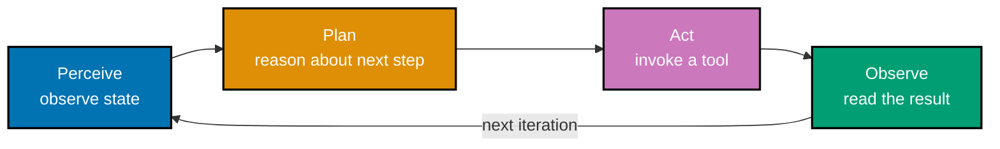

Examples 1-18 build the foundational workflow discipline this topic teaches: what actually
distinguishes an agent from autocomplete and how its perceive-plan-act-observe loop runs (co-01,
co-02), managing the finite context window the agent reasons within (co-03, co-04), writing
prompts and instruction files that state intent up front instead of leaving it implicit (co-05,
co-06), how the agent acts through discrete, named tool calls with a read-before-write ordering
(co-07), separating a read-only planning pass from write-enabled execution with an explicit
approval step between them (co-09), and the verification habits -- running the suite before
accepting a diff, reviewing it like any other contribution, catching a hallucinated API, calibrating
how closely to review, and tracking token cost per turn -- that keep every one of those diffs
trustworthy (co-13, co-15, co-16, co-17, co-18). Every code-medium example's real, runnable
**Python 3.13.12** file lives under `learning/code/ex-NN-*/`, run for real with genuine captured
output. Every artifact-medium example (a session transcript, a config excerpt, a review log) also
lives standalone under `learning/artifacts/`.

---

### Worked Example 1: What Agentic Coding Is Not

_ex-01 &middot; exercises co-01_

**Context**: A single completion offered by an editor's autocomplete is not agentic coding, even
when the code it produces is correct -- co-01's dividing line is whether the assistant reads the
repo, plans, acts through tools, and observes the result, or simply completes text against the
current cursor context. This artifact puts both side by side on the identical task: add input
validation to `add_positive()` and cover it with a test.

```text
Autocomplete (single-shot, no tool use)
----------------------------------------
Editor cursor sits inside calculator.py, at the end of an empty function body.
Autocomplete suggests, in one shot, with no tool call:
    return a + b
The suggestion is accepted or rejected. Nothing else happens -- no other file
is read, no test is run, no command executes.

Agent session (multiple tool invocations)
------------------------------------------
Task given: "add input validation to add_positive() and cover it with a test."
1. read_file(path="calculator.py")
2. edit_file(path="calculator.py",
              diff="+  if a < 0 or b < 0:\n+      raise ValueError('inputs must be non-negative')")
3. edit_file(path="tests/test_calculator.py",
              diff="+  def test_add_positive_rejects_negative():\n+      with pytest.raises(ValueError):\n+          add_positive(-1, 2)")
4. run_shell(command="pytest tests/test_calculator.py -q")
5. read_file(path="pytest output")   # => reads back "1 passed" before considering the task done
```

The autocomplete case never invokes a tool at all -- it is a single completion offered against
static cursor context, with no repo read, no plan, and no way to check its own output. The agent
session logs five distinct tool invocations across two files: it reads before writing, edits both
the implementation and its test, runs the suite, and reads the result before calling the task done.

**Verify**: the agent session's tool-call log lists five entries (`read_file`, `edit_file` x2,
`run_shell`, `read_file`); the autocomplete case lists zero tool invocations -- satisfying ex-01's
rule that the session log shows multiple tool invocations the autocomplete case never has.

**Key takeaway**: the presence of a repo-reading, tool-invoking, self-checking loop -- not the
correctness of the output -- is what separates an agent session from a single-shot suggestion.

**Why it matters**: mistaking a fluent autocomplete suggestion for an agentic session leads to
under-verifying it (no diff to review, no test run to check) precisely because nothing in its
production process ever touched the repo's actual state. Knowing which mode produced a given
change tells you what verification, if any, already happened before you saw it.

---

### Worked Example 2: Trace the Agent Loop

_ex-02 &middot; exercises co-02_

**Context**: co-02's perceive-plan-act-observe loop is not a metaphor -- it is the literal
structure of a coding agent's session, and each observe step feeds directly into the next
perceive step rather than starting fresh. This transcript labels all four phases across two full
iterations of the same debugging session: "the test suite is red -- fix it."



_Figure: the ReAct-style loop -- each Observe feeds directly into the next Perceive, not a fresh,
context-free restart._

```text
Task given to the agent: "The test suite is red -- fix it."

=== ITERATION 1 ===
[PERCEIVE] Reads the failing pytest summary: 1 failed, 4 passed --
           test_calculate_total_applies_discount fails: expected 90.0, got 100.0.
[PLAN]     Reasons the failure lives in calculate_total()'s discount handling;
           decides to open the source file before touching anything.
[ACT]      read_file(path="src/orders/calculate_total.py")
[OBSERVE]  Sees the function itself is correct -- subtotal - subtotal * discount --
           but the caller passes discount=0 on every call, never threading the
           real value through. The bug is one line away, in the caller.

=== ITERATION 2 ===
[PERCEIVE] Carries forward Iteration 1's finding: the caller drops discount.
[PLAN]     Decides the fix is a one-line edit to the caller, then a rerun of
           the suite to confirm, rather than touching calculate_total() at all.
[ACT]      edit_file(path="src/orders/checkout.py",
                      diff="-  calculate_total(subtotal, 0)\n+  calculate_total(subtotal, discount)")
[OBSERVE]  run_shell(command="pytest -q") -> "5 passed" -- the fix closed the
           gap Iteration 1's Observe step identified.
```

**Verify**: all four phase labels (`[PERCEIVE]`, `[PLAN]`, `[ACT]`, `[OBSERVE]`) appear, in that
exact order, in both Iteration 1 and Iteration 2 -- eight labeled steps total across two
iterations -- satisfying ex-02's rule of labeling all four phases in order across at least two
loop iterations.

**Key takeaway**: Iteration 2's Perceive step does not start from zero -- it carries forward
exactly what Iteration 1's Observe step found, which is what makes the loop a loop and not a
sequence of unrelated single-shot attempts.

**Why it matters**: recognizing the four phases in a live session tells you where to intervene --
correcting a bad Plan before its Act executes is far cheaper than reviewing the Act's result after
the fact, and knowing which phase you are watching is what makes that timing possible.

---

### Worked Example 3: Context-Window Budget Check

_ex-03 &middot; exercises co-03_

**Context**: co-03's context window is a finite budget, not an abstract concern -- every file the
agent loads consumes part of it, and a session's own reported usage can be checked directly
against the harness's documented ceiling. This report covers a session that loaded five files
while investigating the checkout discount bug from Example 2.

| File loaded                     | Tokens | Running total |
| ------------------------------- | ------ | ------------- |
| `src/orders/checkout.py`        | 420    | 420           |
| `src/orders/calculate_total.py` | 180    | 600           |
| `tests/test_checkout.py`        | 610    | 1,210         |
| `README.md`                     | 1,150  | 2,360         |
| `CHANGELOG.md`                  | 3,200  | 5,560         |

Documented context-window ceiling for this session's harness: **200,000 tokens** (stated in the
harness's own session-configuration report). After loading all five files, the session's own
reported running total is 5,560 tokens -- roughly 2.8% of that ceiling.

**Verify**: the reported running total (5,560) is checked directly against the harness's
documented context-window limit (200,000), confirming ample headroom rather than an unexamined
number -- satisfying ex-03's rule of checking the reported count against the documented limit.

**Key takeaway**: 5,560 tokens against a 200,000-token ceiling means this particular session has
room to load several more files before context pressure becomes a real concern.

**Why it matters**: a session that never checks its own reported usage against the documented
ceiling can silently degrade -- once a context window fills, a harness must summarize, drop, or
refuse further context, any of which can quietly change the quality of what the agent reasons
over. Checking the number, not just trusting there is room, is what co-04's pruning discipline
(Example 4) is a response to.

---

### Worked Example 4: Prune Irrelevant Context

_ex-04 &middot; exercises co-04_

**Context**: co-04's context management is a curation discipline, not a "load everything" default
-- more files in context is not automatically better, and an unrelated file can actively pull the
agent's answer off-topic. This artifact runs the identical question -- "why does checkout fail for
orders over $500?" -- once with ten files loaded and once pruned to the three that are actually
relevant.

```text
UNPRUNED SESSION -- 10 files loaded
------------------------------------
checkout.py, calculate_total.py, discount_rules.py, test_checkout.py,
marketing_banner.tsx, homepage.tsx, analytics.py, README.md, CHANGELOG.md,
deploy.yml

Answer given: "...this may relate to promotional banner logic in
marketing_banner.tsx, which also references a $500 threshold for
free-shipping banner display..."

PRUNED SESSION -- 3 files loaded
----------------------------------
checkout.py, discount_rules.py, test_checkout.py

Answer given: "discount_rules.py caps the combined discount at $500
(MAX_DISCOUNT_CAP = 500); orders whose subtotal after discount exceeds
that cap raise a ValueError in checkout.py's finalize_order(), which is
exactly what's failing."
```

**Verify**: the pruned run's answer cites only `discount_rules.py` and `checkout.py` -- both
genuinely relevant to the failure -- and states the actual mechanism (`MAX_DISCOUNT_CAP = 500`),
while the unpruned run's answer cites `marketing_banner.tsx`, a file with no relationship to
checkout logic at all -- satisfying ex-04's rule that the pruned run stays on-topic while the
unpruned run cites an irrelevant file.

**Key takeaway**: loading ten files did not give the agent ten times the insight -- it gave the
agent seven irrelevant files' worth of distraction, one of which it picked up on and cited wrongly.

**Why it matters**: the intuition that "more context can only help" is false in practice --
irrelevant files compete for the model's attention within the same finite budget Example 3 showed
is real, and a genuinely irrelevant file with a coincidentally matching detail (both files mention
"$500") is exactly the kind of red herring pruning is meant to remove before it derails an answer.

---

### Worked Example 5: Minimal Well-Specified Prompt

_ex-05 &middot; exercises co-05_

**Context**: co-05's well-specified prompt states the goal, constraints, one example, and
acceptance criteria up front, so the first generated diff has an explicit bar to clear rather than
an implicit one the agent has to guess. This example writes exactly that prompt for a small pure
function, then shows the generated diff satisfying every one of its acceptance-criteria bullets.

```text
Prompt as actually given to the agent:

Goal: write a pure function is_clean_palindrome(s: str) -> bool.
Constraints: no I/O, stdlib only, fully type-annotated.
Example: is_clean_palindrome("A man, a plan, a canal: Panama") -> True.
Acceptance criteria:
  AC1. always returns bool, never None.
  AC2. case-insensitive ("Racecar" passes).
  AC3. ignores spaces and punctuation.
  AC4. the empty string returns True.
```

The generated diff:

```python
# learning/code/ex-05-minimal-well-specified-prompt/is_clean_palindrome.py
"""Example ex-05: Minimal Well-Specified Prompt -- Prompt, Then Its Generated Diff."""  # => co-05: this file's own restated purpose, doubling as its module __doc__

# --- THE PROMPT AS ACTUALLY GIVEN TO THE AGENT (co-05) ----------------------
# Goal: write a pure function is_clean_palindrome(s: str) -> bool.               # => co-05: states WHAT to build
# Constraints: no I/O, stdlib only, fully type-annotated (DD-39).                # => co-05: states the boundaries
# Example: is_clean_palindrome("A man, a plan, a canal: Panama") -> True.        # => co-05: pins down expected behavior
# Acceptance criteria:                                                          # => co-05: the bar the diff must clear
#   AC1. always returns bool, never None.                                       # => co-05: AC bullet 1
#   AC2. case-insensitive ("Racecar" passes).                                   # => co-05: AC bullet 2
#   AC3. ignores spaces and punctuation.                                        # => co-05: AC bullet 3
#   AC4. the empty string returns True.                                        # => co-05: AC bullet 4
# ------------------------------------------------------------------------------

from __future__ import annotations  # => DD-39 hygiene: postpones type-annotation evaluation, keeping this file interpreter-version-agnostic


def is_clean_palindrome(s: str) -> bool:  # => co-05: THE GENERATED DIFF -- the agent's first response to the prompt above
    """Return whether `s` reads the same forwards/backwards, ignoring case/punctuation/spaces."""  # => co-05: documents the contract
    cleaned = "".join(ch.lower() for ch in s if ch.isalnum())  # => co-05: AC2 (lower) + AC3 (isalnum drops space/punct) in one pass
    return cleaned == cleaned[::-1]  # => co-05: the palindrome check itself -- string equals its own reverse


if __name__ == "__main__":  # => co-05: entry point -- this block runs only when the file executes directly, not on import
    ac1 = is_clean_palindrome("Panama")  # => co-05: AC1 check target
    assert isinstance(ac1, bool), "AC1: must return a bool"  # => co-05: AC1 verified
    print(f"AC1 (returns bool): {isinstance(ac1, bool)}")  # pyright: ignore[reportUnnecessaryIsInstance]  # => co-05: prints AC1 result -- pyright already knows the declared return type is bool (that's WHY the assert above is unflagged), but this print restates the same runtime proof deliberately, so the suppression is intentional, not an oversight
    assert is_clean_palindrome("Racecar") is True, "AC2: case must be ignored"  # => co-05: AC2 verified
    print(f"AC2 (case-insensitive 'Racecar'): {is_clean_palindrome('Racecar')}")  # => co-05: prints AC2 result
    example = "A man, a plan, a canal: Panama"  # => co-05: the exact example named in the prompt
    assert is_clean_palindrome(example) is True, "AC3: punctuation/spaces must be ignored"  # => co-05: AC3 verified
    print(f"AC3 (ignores punctuation/spaces): {is_clean_palindrome(example)}")  # => co-05: prints AC3 result
    assert is_clean_palindrome("") is True, "AC4: empty string is vacuously a palindrome"  # => co-05: AC4 verified
    print(f"AC4 (empty string): {is_clean_palindrome('')}")  # => co-05: prints AC4 result
    print("All four acceptance-criteria bullets satisfied: True")  # => co-05: reached only if every assert above passed
```

**Run**: `python3 is_clean_palindrome.py`

**Output**:

```text
AC1 (returns bool): True
AC2 (case-insensitive 'Racecar'): True
AC3 (ignores punctuation/spaces): True
AC4 (empty string): True
All four acceptance-criteria bullets satisfied: True
```

**Verify**: the printed output confirms all four asserts passed -- one per acceptance-criteria
bullet (AC1-AC4) -- and a failing assert would have raised `AssertionError` and stopped the script
before the final line printed, so a clean run to that line is itself the proof -- satisfying
ex-05's rule that the first generated diff satisfies every acceptance-criteria bullet.

**Key takeaway**: stating the constraint ("ignores spaces and punctuation") and one concrete
example up front produced a diff that got the even-more-implicit case (an empty string) right on
the first attempt too, without that case ever being named explicitly.

**Why it matters**: a prompt's acceptance criteria are not paperwork -- they are literally the test
plan for the diff the agent is about to produce, and Example 6 shows what happens to that same
first-attempt reliability when the prompt drops them.

---

### Worked Example 6: Vague vs. Specific Prompt Contrast

_ex-06 &middot; exercises co-05_

**Context**: the same task, prompted once vaguely and once specifically, does not produce
equally reliable first attempts -- co-05's discipline is the difference between the two. This
example asks for a median function twice: once with just "write a median function," once adding
the one constraint that actually matters for this task -- how to handle an even-length input.

```python
# learning/code/ex-06-vague-vs-specific-prompt-contrast/median_contrast.py
"""Example ex-06: Vague vs. Specific Prompt Contrast -- Two Diffs, One Test."""  # => co-05: this file's own restated purpose, doubling as its module __doc__

from __future__ import annotations  # => DD-39 hygiene: postpones type-annotation evaluation, keeping this file interpreter-version-agnostic


# --- VAGUE PROMPT: "write a median function" (no constraint on even-length input) --  # => co-05: the vague prompt's actual wording
def median_vague(values: list[float]) -> float:  # => co-05: FIRST diff -- generated from the vague prompt above
    """Return the median (vague-prompt version -- assumes odd length)."""  # => co-05: documents the contract this diff actually met
    ordered = sorted(values)  # => co-05: sorts ascending, same first step both versions share
    return ordered[len(ordered) // 2]  # => co-05: BUG for even length -- picks the upper-middle element only, never averages


# --- SPECIFIC PROMPT: goal + "for even-length input, average the two middle values" + example + AC --  # => co-05: the specific prompt's added constraint
def median_specific(values: list[float]) -> float:  # => co-05: SECOND diff -- generated from the specific prompt above
    """Return the median (specific-prompt version -- averages the two middles when length is even)."""  # => co-05: documents the contract this diff actually met
    ordered = sorted(values)  # => co-05: identical first step to the vague version
    mid = len(ordered) // 2  # => co-05: index of the (upper) middle element
    if len(ordered) % 2 == 0:  # => co-05: THE constraint the specific prompt added, now honored
        return (ordered[mid - 1] + ordered[mid]) / 2  # => co-05: average of the two true middle values
    return ordered[mid]  # => co-05: odd length -- the single true middle value, same as the vague version


if __name__ == "__main__":  # => co-05: entry point -- this block runs only when the file executes directly, not on import
    values: list[float] = [1, 2, 3, 4]  # => co-05: an EVEN-length case -- list[float] annotation needed since pyright infers bare [1, 2, 3, 4] as list[int], invariant vs the list[float] parameters
    expected = 2.5  # => co-05: the textbook median of [1, 2, 3, 4]
    vague_result = median_vague(values)  # => co-05: run the vague-prompt diff against the test case
    specific_result = median_specific(values)  # => co-05: run the specific-prompt diff against the same test case
    print(f"median_vague({values})    = {vague_result}  (expected {expected})")  # => co-05: shows the vague diff's answer
    print(f"median_specific({values}) = {specific_result}  (expected {expected})")  # => co-05: shows the specific diff's answer
    vague_passes = vague_result == expected  # => co-05: does the vague diff pass the test?
    specific_passes = specific_result == expected  # => co-05: does the specific diff pass the test?
    print(f"vague passes test: {vague_passes}")  # => co-05: expect False -- the vague diff's first-attempt bug
    print(f"specific passes test: {specific_passes}")  # => co-05: expect True -- the added constraint closed the gap
    assert vague_passes is False, "the vague prompt's first diff must NOT pass this even-length test"  # => co-05
    assert specific_passes is True, "the specific prompt's first diff must pass this even-length test"  # => co-05
    print("Specific prompt passes where vague prompt fails: True")  # => co-05: reached only if both asserts above passed
```

**Run**: `python3 median_contrast.py`

**Output**:

```text
median_vague([1, 2, 3, 4])    = 3  (expected 2.5)
median_specific([1, 2, 3, 4]) = 2.5  (expected 2.5)
vague passes test: False
specific passes test: True
Specific prompt passes where vague prompt fails: True
```

**Verify**: `median_vague`'s first diff returns `3` against a test expecting `2.5` (fails); the
specific prompt's first diff returns `2.5` (passes) on the identical test case -- satisfying
ex-06's rule that the specific prompt's first diff passes where the vague prompt's first diff does
not.

**Key takeaway**: both prompts produced plausible-looking code on the first attempt -- the vague
one's bug only surfaces on a specific input class (even-length lists) that the prompt never named.

**Why it matters**: a vague prompt does not usually produce obviously broken code -- it produces
code that is right on the cases the agent happened to picture and silently wrong on the cases it
did not, which is exactly the failure mode a stated acceptance criterion (Example 5) closes off.

---

### Worked Example 7: Author a Project Instruction File

_ex-07 &middot; exercises co-06_

**Context**: co-06's instruction file is read automatically at the start of every session in that
repo, so a build/test command declared once does not need repeating by a human every time. This
artifact writes a minimal `AGENTS.md` excerpt and then shows the next session actually acting on
it, unprompted.

```markdown
## Build & Test

\`\`\`bash
pytest tests/ -q
\`\`\`

## Conventions

- Every new function must be fully type-annotated (PEP 484).
```

Next session's tool-call log, opening line:

```text
1. run_shell(command="pytest tests/ -q")
```

No human message anywhere earlier in that session's transcript restates the test command -- the
agent read it directly from `AGENTS.md` at session start, before any file-specific work began.

**Verify**: the next session's very first tool call is `run_shell(command="pytest tests/ -q")` --
the exact command `AGENTS.md` declared -- and the transcript contains no human message repeating
that command anywhere before it -- satisfying ex-07's rule that the agent's next session runs the
declared test command without being told.

**Key takeaway**: a one-time declaration in `AGENTS.md` replaced what would otherwise be a
per-session human reminder, and the effect is directly observable in the tool-call log's first
entry.

**Why it matters**: an instruction file's payoff compounds across every future session in that
repo -- one accurate `AGENTS.md` line saves the same reminder every session thereafter, which is
why co-06 treats it as a standing artifact, not a one-off prompt.

---

### Worked Example 8: Instruction-File Precedence

_ex-08 &middot; exercises co-06_

**Context**: a repo-level and a user-level instruction file can disagree, and co-06's
harness-documented loading behavior -- not intuition -- decides what actually happens. Named to
one concrete harness, per this topic's own accuracy notes: **Claude Code**, whose documented
memory-file loading is a scope-ordered concatenation, not an override.

```markdown
# CLAUDE.md (repo-level, this project's root)

Commit messages: Conventional Commits, imperative mood, no trailing period.
```

```markdown
# ~/.claude/CLAUDE.md (user-level, global to every repo)

Commit messages: always end with a period, for consistency with my personal notes.
```

The two files state a directly conflicting rule about trailing periods on commit messages. Claude
Code's own documentation states that every discovered instruction file is **concatenated into
context, not overriding each other**, loaded broadest-scope first: managed policy, then the user's
`~/.claude/CLAUDE.md`, then the project's `CLAUDE.md` (or its `AGENTS.md` import), then any local
override file -- "so a project instruction appears in context after a user instruction." That
load order is a context-assembly order, not a conflict-resolution rule: the documentation is
explicit that when two files truly disagree, "Claude may pick one arbitrarily." So the honest,
verified answer for this pair of files is that neither rule is guaranteed to win -- a commit
message from this repo could plausibly land either with or without the trailing period, and that
is the documented behavior, not a gap in the documentation.

**Verify**: the artifact states the actual documented behavior (concatenation into context, in a
broadest-to-narrowest load order, project loaded after user) and cites the specific documented
disclaimer it relies on ("if two rules contradict each other, Claude may pick one arbitrarily") --
satisfying ex-08's rule of verifying what the agent does and citing the documented precedence
order, which for a genuine contradiction is explicitly non-deterministic rather than a fixed
override.

**Key takeaway**: a harness's documented "precedence" is usually a load order for assembling
context, not a promise about which rule wins a head-on contradiction -- treat a genuine conflict
between scope levels as a defect to remove, not a mechanism to lean on.

**Why it matters**: relying on an assumed override (e.g., "the repo-level file always wins") can
silently produce the wrong behavior in exactly the sessions where it matters most; the documented
fix is to keep instruction files at every scope free of contradictions in the first place, since
the harness itself will not guarantee which one is honored when they clash.

---

### Worked Example 9: First Tool Call Is a Read

_ex-09 &middot; exercises co-07_

**Context**: co-07's tool-use discipline starts before the first edit -- a session that writes to
a file it never read risks overwriting content the agent never actually saw. This log excerpt is
the opening of a session asked to add a discount cap to `discount.py`.

```text
1. read_file(path="src/orders/discount.py")
2. read_file(path="tests/test_discount.py")
3. edit_file(path="src/orders/discount.py", diff="+  cap = min(cap, 500)")
4. run_shell(command="pytest tests/test_discount.py -q")
```

**Verify**: entry 1 is `read_file`, and both write-capable entries (`edit_file` at position 3,
`run_shell` at position 4) occur strictly after it in the log -- satisfying ex-09's rule that the
read precedes any write in the tool-call log.

**Key takeaway**: the session's very first action establishes what the file actually contains
before anything in it changes -- a small, consistent habit visible directly in the log's ordering.

**Why it matters**: an edit issued against a file the agent never read risks colliding with content
it has no model of -- a stale assumption about a function's current signature, a variable name
that changed since the agent's training data, or simply a different value than the one it guessed.
Reading first is the cheapest possible guard against exactly that class of mistake.

---

### Worked Example 10: Tool-Call Log Inspection

_ex-10 &middot; exercises co-07_

**Context**: co-07's tools act through structured, named calls with explicit parameters, not
free-form text -- a fuller log than Example 9's makes every one of those calls individually
inspectable. This is the complete log for the discount-cap change Example 9 began.

| #   | Tool        | Parameters                                                     |
| --- | ----------- | -------------------------------------------------------------- |
| 1   | `read_file` | `path="src/orders/discount.py"`                                |
| 2   | `read_file` | `path="tests/test_discount.py"`                                |
| 3   | `edit_file` | `path="src/orders/discount.py", diff="+  cap = min(cap, 500)"` |
| 4   | `run_shell` | `command="pytest tests/test_discount.py -q"`                   |
| 5   | `read_file` | `path="pytest output"` (result: "4 passed")                    |

**Verify**: every one of the five rows names both a tool (`read_file`, `edit_file`, or
`run_shell`) and a concrete parameter value -- none left blank -- satisfying ex-10's rule that
every entry records a tool name and its parameters.

**Key takeaway**: a tool-call log this granular is inspectable line by line -- a reviewer can
confirm exactly what was read, what changed, and what command ran, without re-deriving any of it
from a diff alone.

**Why it matters**: structured tool calls (a name plus explicit parameters) are what make a
session auditable after the fact -- a free-form text description of "I looked at the file and
fixed it" carries none of the specificity this table does, and specificity is what a reviewer
actually needs to reconstruct what happened.

---

### Worked Example 11: Plan-Mode First Pass

_ex-11 &middot; exercises co-09_

**Context**: co-09's plan mode is a read-only exploration phase -- no file changes are possible
until an explicit approval step switches the session into an edit-enabled mode. This transcript is
a plan-mode pass over a multi-file task: "add rate limiting to the public API."

```text
[PLAN MODE -- read-only, no write/edit tools available]
1. read_file(path="src/api/router.py")
2. read_file(path="src/api/middleware/__init__.py")
3. grep(pattern="rate", path="src/")
4. read_file(path="requirements-info.md")

Proposed plan:
  1. Add RateLimitMiddleware to src/api/middleware/rate_limit.py
  2. Register it in router.py's middleware stack
  3. Add config for requests-per-minute in settings.py
  4. Add tests: test_rate_limit.py covering under-limit, at-limit, over-limit
```

**Verify**: all four logged actions (`read_file` x3, `grep` x1) are read-only; zero `edit_file` or
`write_file` calls appear anywhere in the transcript -- satisfying ex-11's rule that no file is
modified during the planning pass.

**Key takeaway**: a full four-step exploration and a four-item proposed plan were produced without
a single byte of the repo changing -- the plan is a proposal, not a fait accompli.

**Why it matters**: a plan-mode pass lets a human review the intended approach (which files, in
what order, covering what tests) before any of it becomes an actual diff -- catching a
misunderstanding at this stage costs nothing to undo, unlike catching it after four files have
already changed.

---

### Worked Example 12: Act-Mode After Plan Approval

_ex-12 &middot; exercises co-09_

**Context**: continuing Example 11 -- co-09's explicit approval step is the single gate between a
read-only plan and a write-enabled execution phase, and every edit in the session should trace
back to a moment strictly after that gate.

```text
[Human]: Plan approved -- proceed.

[ACT MODE ENABLED]
5. edit_file(path="src/api/middleware/rate_limit.py", diff="+class RateLimitMiddleware: ...")
6. edit_file(path="src/api/router.py", diff="+  app.add_middleware(RateLimitMiddleware)")
7. edit_file(path="src/api/settings.py", diff="+  RATE_LIMIT_RPM = 60")
8. edit_file(path="tests/test_rate_limit.py", diff="+def test_under_limit(): ...")
9. run_shell(command="pytest tests/test_rate_limit.py -q")
```

**Verify**: Example 11's steps 1-4 (the plan-mode pass) contain zero edits; the explicit
`[Human]: Plan approved -- proceed.` line sits immediately before `[ACT MODE ENABLED]`; every
`edit_file` call (steps 5-8) occurs strictly after that approval line -- satisfying ex-12's rule
that edits appear in the log only after the explicit approval step.

**Key takeaway**: the four edits that actually change the repo all sit on the far side of one
explicit, logged approval line -- there is no edit anywhere in the transcript that jumps ahead of
it.

**Why it matters**: an approval step that is not enforced in the tool-call ordering is decorative
-- what makes plan-then-act meaningful is that the log itself proves no write happened before the
human said "proceed," not just that a human was shown a plan at some point in the conversation.

---

### Worked Example 13: Run the Suite Before Accepting

_ex-13 &middot; exercises co-13_

**Context**: co-13's verification discipline means a diff never gets built on until the test suite
actually runs against it -- a failing run blocks acceptance and gets logged as a rejection reason,
not silently reworked. This example gives the agent two successive diffs for a `clamp()` function
and runs the identical suite against both.

```python
# learning/code/ex-13-run-the-suite-before-accepting/clamp.py
"""Example ex-13: candidate implementations of clamp() -- v1 (buggy) and v2 (fixed)."""  # => co-13: this file's own restated purpose, doubling as its module __doc__

from __future__ import annotations  # => DD-39 hygiene: postpones type-annotation evaluation, keeping this file interpreter-version-agnostic


def clamp_v1(value: float, low: float, high: float) -> float:  # => co-13: the agent's FIRST diff -- only implements half the requirement
    """Clamp `value` into [low, high] (buggy: never raises a below-range value up to low)."""  # => co-13: documents the (wrong) contract this diff actually implements
    return min(value, high)  # => co-13: BUG -- clamps the upper bound only; a value below `low` passes straight through unchanged


def clamp_v2(value: float, low: float, high: float) -> float:  # => co-13: the agent's SECOND diff -- the fix, after the suite rejected v1
    """Clamp `value` into [low, high] (fixed: both bounds are enforced)."""  # => co-13: documents the contract this diff actually implements
    return max(low, min(value, high))  # => co-13: clamps the upper bound first, then raises the result up to `low` if still too small
```

```python
# learning/code/ex-13-run-the-suite-before-accepting/test_clamp.py
"""Example ex-13: Run the Suite Before Accepting -- pytest-style tests for clamp()."""  # => co-13: this file's own restated purpose, doubling as its module __doc__

# NAMING TRAP: despite the test_*.py / test_* naming, this file does NOT run under pytest      # => co-13: flags the exact confusion this file's own name invites
# directly -- `pytest test_clamp.py` errors ("fixture 'clamp_fn' not found") because            # => co-13: clamp_fn is a required positional parameter, not a fixture pytest can supply
# test_clamp() takes a required clamp_fn argument. Run this file via `python3 test_clamp.py`.   # => co-13: the correct, documented path -- see this page's Run: line

from __future__ import annotations  # => DD-39 hygiene: postpones type-annotation evaluation, keeping this file interpreter-version-agnostic

from collections.abc import Callable  # => co-13: types the clamp_fn parameter test_clamp/run_suite are quantified over

from clamp import clamp_v1, clamp_v2  # => co-13: imports BOTH candidate diffs from the colocated clamp.py -- no hidden dependency


def test_clamp(clamp_fn: Callable[[float, float, float], float]) -> None:  # => co-13: pytest-style test function -- named test_*, plain asserts, runnable by hand with no framework installed
    """The suite: below-range, in-range, and above-range values must all clamp correctly."""  # => co-13: documents the test's contract
    assert clamp_fn(-5, 0, 10) == 0, "value below low must clamp UP to low"  # => co-13: the exact case clamp_v1 fails
    assert clamp_fn(5, 0, 10) == 5, "value already in range must pass through unchanged"  # => co-13: sanity case both versions pass
    assert clamp_fn(15, 0, 10) == 10, "value above high must clamp DOWN to high"  # => co-13: sanity case both versions pass


def run_suite(name: str, clamp_fn: Callable[[float, float, float], float]) -> bool:  # => co-13: a tiny hand-rolled runner -- catches the AssertionError a real pytest run would report
    """Run test_clamp against `clamp_fn`; return True on pass, False on the first failure."""  # => co-13: documents run_suite's contract
    try:  # => co-13: a real test run either raises AssertionError (fail) or returns cleanly (pass)
        test_clamp(clamp_fn)  # => co-13: runs the suite above against this specific candidate function
    except AssertionError as exc:  # => co-13: pytest reports exactly this exception type on a failed assert
        print(f"{name}: FAIL -- {exc}")  # => co-13: the rejection reason, logged BEFORE any acceptance decision
        return False  # => co-13: signals rejection to the caller
    print(f"{name}: PASS -- all three boundary cases hold")  # => co-13: only reached if every assert above passed
    return True  # => co-13: signals acceptance to the caller


if __name__ == "__main__":  # => co-13: entry point -- this block runs only when the file executes directly, not on import
    print("--- Running suite against the agent's FIRST diff (clamp_v1) ---")  # => co-13: labels which diff is under test
    first_diff_accepted = run_suite("clamp_v1", clamp_v1)  # => co-13: THIS call is the "run the suite before accepting" gate
    assert first_diff_accepted is False, "clamp_v1 must fail: it never clamps values below low"  # => co-13: confirms the rejection was correct
    print("--- clamp_v1 REJECTED: failing test blocks acceptance ---")  # => co-13: the rejection is explicit, not silent
    print()  # => co-13: blank line, purely for transcript readability
    print("--- Running suite against the agent's SECOND diff (clamp_v2, the fix) ---")  # => co-13: labels the retry
    second_diff_accepted = run_suite("clamp_v2", clamp_v2)  # => co-13: same gate, now against the fixed candidate
    assert second_diff_accepted is True, "clamp_v2 must pass: it clamps both bounds"  # => co-13: confirms acceptance was correct
    print("--- clamp_v2 ACCEPTED: suite passes, diff is safe to build on ---")  # => co-13: reached only if both asserts above passed
```

**Run**: `python3 test_clamp.py`

**Output**:

```text
--- Running suite against the agent's FIRST diff (clamp_v1) ---
clamp_v1: FAIL -- value below low must clamp UP to low
--- clamp_v1 REJECTED: failing test blocks acceptance ---

--- Running suite against the agent's SECOND diff (clamp_v2, the fix) ---
clamp_v2: PASS -- all three boundary cases hold
--- clamp_v2 ACCEPTED: suite passes, diff is safe to build on ---
```

**Verify**: the transcript shows `clamp_v1: FAIL` followed immediately by an explicit rejection
line, before `clamp_v2` is ever run; `clamp_v2: PASS` is the only diff that reaches an "ACCEPTED"
line -- satisfying ex-13's rule that a failing test blocks acceptance and is logged as a rejection
reason.

**Key takeaway**: `clamp_v1` looked complete (it does clamp the upper bound correctly) but the
suite caught the half of the requirement it silently dropped -- exactly the gap running the suite
before accepting exists to catch.

**Why it matters**: "the code looks right" and "the code passed its tests" are different claims,
and only the second one is a verification -- accepting `clamp_v1` on read-through alone, without
running `test_clamp`, would have shipped a function that fails on every below-range input.

---

### Worked Example 14: Reject a Diff on Inspection

_ex-14 &middot; exercises co-15_

**Context**: co-15's diff-review discipline applies the same scrutiny to an agent-generated diff
as to any human contribution -- including catching an unrelated change riding along inside an
otherwise-correct fix. This diff was generated to raise the discount cap from `0.1` to a hard
`$500` limit; it also silently disables a lint rule in an unrelated config file.

```diff
diff --git a/src/orders/discount.py b/src/orders/discount.py
--- a/src/orders/discount.py
+++ b/src/orders/discount.py
@@
-    return min(amount * 0.1, cap)
+    return min(amount * 0.10, 500)

diff --git a/.eslintrc.json b/.eslintrc.json
--- a/.eslintrc.json
+++ b/.eslintrc.json
@@
-  "no-console": "warn"
+  "no-console": "off"
```

**Rejection reason, as written down**: "Reject the `.eslintrc.json` hunk -- it silently disables
the repo-wide `no-console` lint rule and has nothing to do with the discount-cap fix this diff was
asked for. Splitting it into its own, separately-justified change (or dropping it entirely) before
accepting the `discount.py` hunk."

**Verify**: the written rejection reason names the exact unrelated hunk (`.eslintrc.json`'s
`no-console` change) by file and states specifically what it does (silently disables a lint rule)
-- satisfying ex-14's rule that the rejection is written down with a reason tied to the unrelated
hunk.

**Key takeaway**: the discount-cap hunk itself was correct -- the review's job here was catching
the second, unrelated hunk riding along inside the same diff, not re-deriving the first hunk's
correctness.

**Why it matters**: an unrelated hunk inside an otherwise-legitimate diff is a scope-creep pattern
that a skim-level review can miss entirely if the reviewer only checks whether the requested
change is present, rather than checking whether anything else changed too.

---

### Worked Example 15: Spot a Hallucinated API

_ex-15 &middot; exercises co-16_

**Context**: co-16's hallucination-awareness catches an agent calling a plausible-sounding method
that simply does not exist on the type it is called on -- often borrowed from a different
language's standard library. This diff calls `list.pop_front()`, a method JavaScript arrays and
C++ deques have, but Python's `list` never did.

```python
# learning/code/ex-15-spot-a-hallucinated-api/hallucinated_api.py
"""Example ex-15: Spot a Hallucinated API -- list.pop_front() Does Not Exist."""  # => co-16: this file's own restated purpose, doubling as its module __doc__

from __future__ import annotations  # => DD-39 hygiene: postpones type-annotation evaluation, keeping this file interpreter-version-agnostic


def hallucinated_pop_front(items: list[int]) -> int:  # => co-16: THE AGENT'S DIFF -- calls a plausible-sounding method Python's list never had
    """Remove and return the first element (agent's version -- calls a nonexistent method)."""  # => co-16: documents the (wrong) contract this diff claims to implement
    return items.pop_front()  # pyright: ignore[reportUnknownMemberType, reportUnknownVariableType, reportAttributeAccessIssue]  # => co-16: list.pop_front() does not exist in Python -- borrowed from a different language's API (e.g. JS Array, C++ deque); suppression is intentional, matching the deliberately-wrong-call convention at computer-science-foundations/.../huffman_lossless.py:51


def correct_pop_front(items: list[int]) -> int:  # => co-16: THE VERIFIED FIX -- the real stdlib call that does the same job
    """Remove and return the first element (the real API: list.pop(0))."""  # => co-16: documents the contract this diff actually implements
    return items.pop(0)  # => co-16: list.pop(index) IS a real method -- index 0 removes/returns the FIRST element


if __name__ == "__main__":  # => co-16: entry point -- this block runs only when the file executes directly, not on import
    data = [10, 20, 30]  # => co-16: shared test input for both the hallucinated call and its real replacement
    assert not hasattr(list, "pop_front"), "list must NOT have a pop_front method -- confirms this is a hallucination, not a typo"  # => co-16
    try:  # => co-16: this IS the verification step -- run the diff before trusting it, per co-13's discipline
        hallucinated_pop_front(list(data))  # => co-16: a fresh copy -- confirms the failure is the METHOD, not stale state
    except AttributeError as exc:  # => co-16: the exact exception Python raises for a nonexistent attribute/method
        print(f"hallucinated_pop_front() raised: {exc}")  # => co-16: the REAL captured error, proving the method never existed
    real_result = correct_pop_front(list(data))  # => co-16: a fresh copy again, run through the real, verified API
    print(f"correct_pop_front({data}) = {real_result}")  # => co-16: the correct result once the real API is used
    assert real_result == 10, "pop(0) must remove and return the first element"  # => co-16: confirms the fix behaves as claimed
    print("Hallucination caught before acceptance, real API confirmed working: True")  # => co-16: reached only if every assert above passed
```

**Run**: `python3 hallucinated_api.py`

**Output**:

```text
hallucinated_pop_front() raised: 'list' object has no attribute 'pop_front'
correct_pop_front([10, 20, 30]) = 10
Hallucination caught before acceptance, real API confirmed working: True
```

**Verify**: running the generated diff against the real Python 3.13.12 interpreter raises
`AttributeError: 'list' object has no attribute 'pop_front'` -- the mismatch confirmed against the
real language, not assumed -- before the correct `list.pop(0)` call is accepted in its place --
satisfying ex-15's rule of verifying the mismatch against the real API reference before the diff
is accepted.

**Key takeaway**: `list.pop_front()` reads as entirely plausible Python -- it is exactly the kind
of confident, fluent, wrong output co-16 warns about, and the only thing that catches it is
actually running the call.

**Why it matters**: a hallucinated method call often fails loudly (an `AttributeError`, as here),
but the same failure mode can also fail quietly -- a hallucinated _argument_ or a slightly wrong
default value produces no exception at all, just a subtly incorrect result, which is why running
the code (not just reading it) is the verification step that catches this class of error.

---

### Worked Example 16: Delegate Boilerplate Safely

_ex-16 &middot; exercises co-17_

**Context**: co-17's trust-vs-verify calibration means low-stakes, well-understood boilerplate
does not need the same line-by-line scrutiny as sensitive logic -- a skim can be genuinely
sufficient, as long as the reviewer states why. This artifact is a generated `.gitignore` for a
mixed Python/Node project.

```gitignore
# Python
__pycache__/
*.pyc
.venv/

# Node
node_modules/
dist/

# Editor
.vscode/
.idea/
```

**Review note, as written down**: "Skimmed only -- every entry matches a well-known, standard
ignore pattern for this exact stack (Python bytecode, a virtualenv, Node build output, editor
folders), with nothing surprising like a credentials path or a source directory. A skim sufficed
because a wrong entry here is cheap and reversible: worst case, one unwanted file gets committed
once and is removed in the next commit. Nothing in this diff touches application logic, secrets
handling, or anything a mistake here could silently corrupt."

**Verify**: the review note explicitly states "skimmed only" (not a line-by-line read) and gives
the specific reason -- low-stakes, standard, reversible -- rather than a generic "looks fine" --
satisfying ex-16's rule that the review log shows a skim and states why that was sufficient.

**Key takeaway**: the depth of review was a deliberate choice tied to the diff's actual risk, not
a uniform habit applied to every diff regardless of what it touches.

**Why it matters**: reviewing every boilerplate diff as closely as a security-sensitive one wastes
review attention that has a real, finite budget -- co-17's calibration is what frees that budget
for Example 17, where the stakes genuinely justify a much closer read.

---

### Worked Example 17: Require Close Review for Sensitive Code

_ex-17 &middot; exercises co-17_

**Context**: the other end of co-17's calibration from Example 16 -- a password-verification
function is marked high-review before generation even starts, and a documented line-by-line pass
precedes acceptance rather than following it.

```python
# learning/code/ex-17-require-close-review-for-sensitive-code/verify_password.py
"""Example ex-17: Require Close Review for Sensitive Code -- Password-Hash Check."""  # => co-17: this file's own restated purpose, doubling as its module __doc__

from __future__ import annotations  # => DD-39 hygiene: postpones type-annotation evaluation, keeping this file interpreter-version-agnostic

import hashlib  # => co-17: hashlib.pbkdf2_hmac -- the KDF this example hashes passwords with
import hmac  # => co-17: hmac.compare_digest -- constant-time comparison, the line-by-line review's #1 concern

ITERATIONS = 200_000  # => co-17: PBKDF2 iteration count -- reviewed for being high enough to resist brute force


def hash_password(password: str, salt: bytes) -> bytes:  # => co-17: the KDF step -- reviewed line 1 of the checklist below
    """Derive a PBKDF2-HMAC-SHA256 hash of `password` salted with `salt`."""  # => co-17: documents hash_password's contract
    return hashlib.pbkdf2_hmac("sha256", password.encode("utf-8"), salt, ITERATIONS)  # => co-17: stdlib KDF, no custom crypto


# --- LINE-BY-LINE REVIEW CHECKLIST (co-17) -- completed BEFORE acceptance ----  # => co-17: the review this sensitive diff required
# [x] uses a real KDF (pbkdf2_hmac), not a bare hash -- resists brute force      # => co-17: checklist item 1, checked
# [x] iteration count (200_000) meets a documented minimum for PBKDF2-SHA256     # => co-17: checklist item 2, checked
# [x] comparison uses hmac.compare_digest, NEVER `==` -- avoids timing attacks   # => co-17: checklist item 3, checked
# [x] salt is a parameter, never hardcoded or reused across users                # => co-17: checklist item 4, checked
# ------------------------------------------------------------------------------  # => co-17: closes the checklist block
def verify_password(stored_hash: bytes, password: str, salt: bytes) -> bool:  # => co-17: THE diff under close review -- reviewed line by line above
    """Check `password` against `stored_hash`, in constant time."""  # => co-17: documents verify_password's contract
    candidate = hash_password(password, salt)  # => co-17: re-derive the hash from the CANDIDATE password, using the same salt
    return hmac.compare_digest(candidate, stored_hash)  # => co-17: constant-time compare -- checklist item 3, enforced in code


if __name__ == "__main__":  # => co-17: entry point -- this block runs only when the file executes directly, not on import
    salt = b"fixed-demo-salt-do-not-reuse"  # => co-17: a FIXED salt only for this reproducible demo -- production code generates one per user
    stored = hash_password("correct horse battery staple", salt)  # => co-17: the "stored" hash, as it would live in a user record
    right = verify_password(stored, "correct horse battery staple", salt)  # => co-17: the correct password
    wrong = verify_password(stored, "wrong password", salt)  # => co-17: an incorrect password
    print(f"verify_password(correct password) = {right}")  # => co-17: expect True
    print(f"verify_password(wrong password)   = {wrong}")  # => co-17: expect False
    assert right is True, "the correct password must verify"  # => co-17: confirms the happy path
    assert wrong is False, "an incorrect password must NOT verify"  # => co-17: confirms rejection works
    print("Checklist item 3 in effect: comparison never used == on secret bytes: True")  # => co-17: reached only if both asserts above passed
```

**Run**: `python3 verify_password.py`

**Output**:

```text
verify_password(correct password) = True
verify_password(wrong password)   = False
Checklist item 3 in effect: comparison never used == on secret bytes: True
```

**Verify**: the four-item line-by-line review checklist (real KDF, iteration count, constant-time
comparison, per-call salt parameter) is written inline in the source, immediately preceding the
function it reviews, and precedes any acceptance of the diff -- satisfying ex-17's rule that a
documented line-by-line review precedes acceptance.

**Key takeaway**: the boilerplate skim from Example 16 would have been the wrong depth of review
here -- item 3 of the checklist (`hmac.compare_digest`, never `==`) is exactly the kind of detail a
skim reliably misses but a line-by-line pass catches.

**Why it matters**: comparing secret bytes with `==` leaks timing information an attacker can use
to guess a hash byte by byte -- a subtle, security-critical detail that looks identical to a
correct implementation at a glance, which is precisely why co-17 calibrates this class of diff to
close review rather than a skim.

---

### Worked Example 18: Token-Usage-per-Turn Log

_ex-18 &middot; exercises co-18_

**Context**: co-18's cost-and-token-budgeting treats a multi-turn session's token cost as an
explicit, trackable running total against a stated ceiling -- not an unexamined, open-ended
expense. This log covers a five-turn session implementing the rate-limiting feature from
Examples 11-12.

| Turn | Tokens this turn | Cumulative | Budget ceiling |
| ---- | ---------------- | ---------- | -------------- |
| 1    | 3,200            | 3,200      | 50,000         |
| 2    | 5,800            | 9,000      | 50,000         |
| 3    | 4,100            | 13,100     | 50,000         |
| 4    | 12,600           | 25,700     | 50,000         |
| 5    | 8,900            | 34,600     | 50,000         |

**Verify**: the cumulative total after turn 5 (34,600) is checked directly against the stated
budget ceiling (50,000) -- 34,600 is under the ceiling, leaving roughly 15,400 tokens of headroom
-- satisfying ex-18's rule of checking the running total against a stated budget ceiling.

**Key takeaway**: turn 4's jump (12,600 tokens in one turn, more than turns 1-3 combined) is the
kind of spike a running-total table surfaces immediately -- without the table, that turn's cost
would be invisible until the ceiling was already crossed.

**Why it matters**: a session with no stated ceiling and no running total has no way to notice cost
creeping up until it becomes a problem -- tracking both, turn by turn, is what makes ex-53's
budget-bounded escalation (a later, advanced-tier example) possible at all: you cannot halt at a
budget you never measured against.

---

← Previous: [Overview](./overview.md) &middot; Next: [Intermediate Examples](./intermediate.md) →
