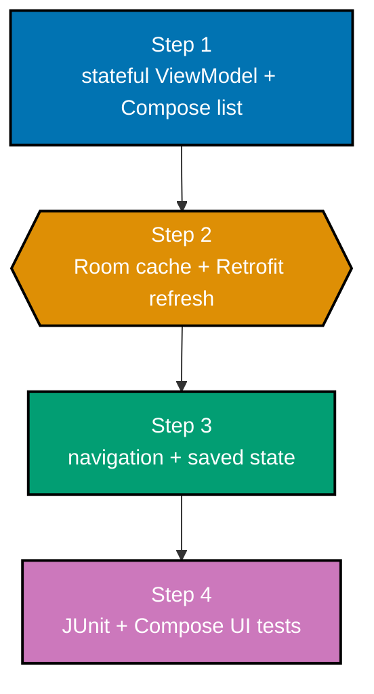

The capstone turns the course's pieces into one small Android app: a list screen and a detail screen
render Compose UI from a ViewModel, get data through a repository, show cached Room content first,
refresh through Retrofit, and preserve meaningful state across navigation and rotation. The domain is
invented for this course: saved focus notes, each with an ID, title, body, and remote update marker.

## Goal and acceptance criteria

Build an app that satisfies all of the following:

- A stateless Compose screen receives state plus event callbacks (co-05, co-08).
- A ViewModel owns sealed loading/content/error UI state and handles events (co-14, co-15, co-17).
- A repository reads Room first and refreshes with a Retrofit suspend call (co-18, co-19, co-22, co-24).
- Navigation moves between list and detail while retaining the selected item (co-26, co-28).
- A local JUnit test protects the ViewModel transition and a Compose UI test proves the list-to-detail
  flow (co-30).

## Build it

1. Create a Compose Android app module and add the standard AndroidX lifecycle, Room, Navigation
   Compose, Retrofit converter, coroutine, and Compose test dependencies. Keep versions in the
   project version catalog or Gradle configuration; re-check version-pinned tooling before release.
2. Add `FocusListViewModel.kt` and `FocusListScreen.kt` from `code/`. Start with the fake repository
   so the screen state and error/retry behaviour are observable before any network work exists.
3. Implement a Room `FocusNoteEntity` and DAO returning `Flow<List<FocusNoteEntity>>`; map entities
   to app models in the repository. Populate cached rows first, then refresh from the Retrofit API
   in `viewModelScope` and write successful results back to Room. For Retrofit integration tests,
   point the client at MockWebServer and the checked-in `code/fixtures/focus-notes.json` response;
   never require a live endpoint for a course test.
4. Add a `NavHost` with `list` and `detail/{noteId}` destinations. Pass only the stable ID through
   the route, resolve the detail from state, and use saved state or the ViewModel for screen state.
5. Add the two tests in `code/`. Run `./gradlew test` for local tests and
   `./gradlew connectedAndroidTest` on an emulator for the Compose test. Rotate the emulator during
   the list and detail flows to check preservation deliberately.

## Acceptance evidence

- `./gradlew assembleDebug` produces an installable debug APK.
- `./gradlew test` reports the ViewModel tests green.
- `./gradlew connectedAndroidTest` reports the Compose UI test green on an emulator or device.
- With cached data present, the list renders before a refresh completes; with a failed refresh, the
  cached list remains usable and the UI exposes a retry action.
- Selecting a note, rotating, navigating back, and returning preserves the current user context.

## Why this is the right-sized capstone

The app is deliberately small enough to keep each boundary inspectable. It does not add accounts,
analytics, background sync, or a remote deployment; those would dilute the proof. The finished slice
shows the production habit that matters: platform events and changing data sources enter at explicit
edges, while the Compose screen remains a deterministic rendering of state.
