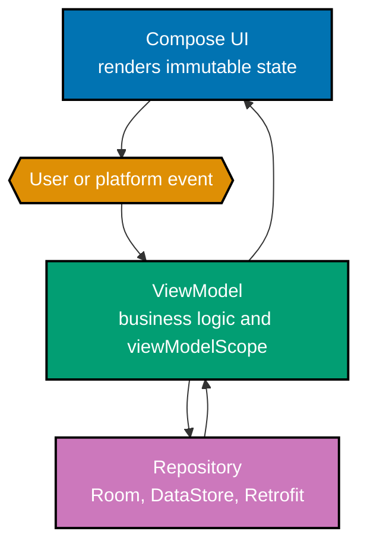

This is a code-first native Android course. Create a Compose project in Android Studio Quail 2
Feature Drop (2026.1.2), use the Android SDK and emulator/AVD as the practical baseline, and favour
the Gradle wrapper for builds and tests. Versioned Android tooling moves quickly, so confirm the
current stable SDK, Android Gradle Plugin, Kotlin, and Compose BOM before starting a production app.

## Learning route

- [Beginner examples](./beginner.md) establish the project, manifest, lifecycle, intents, and
  Compose UI state (Examples 1–26).
- [Intermediate examples](./intermediate.md) establish ViewModel/UDF architecture, local and remote
  data, coroutines, and Flow (Examples 27–54).
- [Advanced examples](./advanced.md) apply navigation, permissions, preservation, DI, and testing
  (Examples 55–78).
- [Capstone](./capstone/overview.md) joins the architecture into one runnable two-screen app.

## Concept map

- **co-01 · project-and-gradle** — An Android app is a Gradle project; the wrapper builds and tests it.
- **co-02 · manifest** — The manifest declares components, permissions, and device requirements.
- **co-03 · activity-lifecycle** — A normal launch proceeds through onCreate, onStart, and onResume;
  a stopped Activity returns through onRestart before onStart. Process death can discard the
  Activity and ViewModel entirely, so durable data belongs in persistence and small restorable UI
  values belong in saved state.
- **co-04 · intents** — Explicit intents name a destination; implicit intents name an action.
- **co-05 · composable-functions** — Composable functions render UI from data inside setContent.
- **co-06 · recomposition** — Compose may rerun affected composables when observed inputs change; it
  can skip eligible calls only when it can determine that stable inputs have not changed. Skipping is
  an optimization, never a correctness guarantee.
- **co-07 · compose-state** — remember and mutableStateOf retain observable state through recomposition.
- **co-08 · state-hoisting** — A stateless child receives a value and event callback from its owner.
- **co-09 · modifiers** — Modifier chains decorate and lay out a composable in order.
- **co-10 · preview** — Preview renders a composable in the IDE.
- **co-11 · layout-composables** — Column, Row, and Box arrange children.
- **co-12 · material-components** — Material 3 supplies standard screen building blocks.
- **co-13 · lazy-lists** — LazyColumn composes and disposes item compositions as needed around the
  viewport. It is not a RecyclerView-style view-recycling pool, so item state still needs stable
  keys and an appropriate owner.
- **co-14 · viewmodel** — A ViewModel owns screen state and survives configuration changes.
- **co-15 · unidirectional-data-flow** — State flows down and events flow up.
- **co-16 · stateflow** — The ViewModel exposes immutable StateFlow collected lifecycle-aware.
- **co-17 · ui-state-modeling** — Sealed loading, success, and error states render deterministically.
- **co-18 · repository-pattern** — Repositories centralize data-source decisions.
- **co-19 · room-entities-dao** — Room maps entities, DAOs, and databases to SQLite.
- **co-20 · room-suspend-flow** — Room supports suspend one-shots and observable Flow queries.
- **co-21 · datastore** — DataStore asynchronously persists preferences through Flow.
- **co-22 · retrofit** — Retrofit turns an annotated interface into an HTTP client.
- **co-23 · json-parsing** — A converter maps JSON into Kotlin data classes.
- **co-24 · coroutines-on-android** — Owned coroutine scopes cancel work with their owner.
- **co-25 · flows-on-android** — Flow represents an asynchronous stream and supports transformation.
- **co-26 · navigation** — NavHost and NavController model destinations and back navigation.
- **co-27 · runtime-permissions** — Dangerous capabilities need a runtime grant and a denial path.
- **co-28 · config-change-survival** — rememberSaveable and ViewModel preserve appropriate state.
- **co-29 · dependency-injection** — DI supplies collaborators rather than constructing them inside.
- **co-30 · applied-testing** — Local, instrumented, and Compose UI tests protect behaviour.

## Architecture flow

The diagram uses labels, shapes, and arrows as well as colour: UI state travels down, events travel
up, and the repository is the boundary between screen logic and changing data sources.

## Scope guard

Use this course to decide where Android-specific lifecycle, permissions, navigation, persistence,
and test work belongs. Keep language syntax in Just Enough Kotlin and generic web-interface patterns
in the frontend prerequisites; importing those courses' detailed curriculum here would conceal the
Android-specific choices this course is designed to teach.

## Examples by Level

### Beginner (Examples 1–26)

- [Example 1: Scaffold a Project](/en/learn/courses/android-app-development/learning/beginner#example-1-scaffold-a-project)
- [Example 2: Declare the Launcher Activity](/en/learn/courses/android-app-development/learning/beginner#example-2-declare-the-launcher-activity)
- [Example 3: Declare Internet Permission](/en/learn/courses/android-app-development/learning/beginner#example-3-declare-internet-permission)
- [Example 4: Create an Activity and Set Content](/en/learn/courses/android-app-development/learning/beginner#example-4-create-an-activity-and-set-content)
- [Example 5: Log the Activity Lifecycle](/en/learn/courses/android-app-development/learning/beginner#example-5-log-the-activity-lifecycle)
- [Example 6: Start an Explicit Intent](/en/learn/courses/android-app-development/learning/beginner#example-6-start-an-explicit-intent)
- [Example 7: Start an Implicit Intent](/en/learn/courses/android-app-development/learning/beginner#example-7-start-an-implicit-intent)
- [Example 8: Render a Hello Composable](/en/learn/courses/android-app-development/learning/beginner#example-8-render-a-hello-composable)
- [Example 9: Host a Compose Tree](/en/learn/courses/android-app-development/learning/beginner#example-9-host-a-compose-tree)
- [Example 10: Pass Text as Data](/en/learn/courses/android-app-development/learning/beginner#example-10-pass-text-as-data)
- [Example 11: Recompose from State](/en/learn/courses/android-app-development/learning/beginner#example-11-recompose-from-state)
- [Example 12: Remember Mutable State](/en/learn/courses/android-app-development/learning/beginner#example-12-remember-mutable-state)
- [Example 13: Increment a State Counter](/en/learn/courses/android-app-development/learning/beginner#example-13-increment-a-state-counter)
- [Example 14: Hoist Counter State](/en/learn/courses/android-app-development/learning/beginner#example-14-hoist-counter-state)
- [Example 15: Reuse a Stateless Counter](/en/learn/courses/android-app-development/learning/beginner#example-15-reuse-a-stateless-counter)
- [Example 16: Apply Modifier Padding](/en/learn/courses/android-app-development/learning/beginner#example-16-apply-modifier-padding)
- [Example 17: Chain Modifiers](/en/learn/courses/android-app-development/learning/beginner#example-17-chain-modifiers)
- [Example 18: Add a Preview](/en/learn/courses/android-app-development/learning/beginner#example-18-add-a-preview)
- [Example 19: Lay Out a Column](/en/learn/courses/android-app-development/learning/beginner#example-19-lay-out-a-column)
- [Example 20: Lay Out a Row](/en/learn/courses/android-app-development/learning/beginner#example-20-lay-out-a-row)
- [Example 21: Overlay Content in a Box](/en/learn/courses/android-app-development/learning/beginner#example-21-overlay-content-in-a-box)
- [Example 22: Use Scaffold and Top App Bar](/en/learn/courses/android-app-development/learning/beginner#example-22-use-scaffold-and-top-app-bar)
- [Example 23: Handle a Material Button Click](/en/learn/courses/android-app-development/learning/beginner#example-23-handle-a-material-button-click)
- [Example 24: Bind an Outlined Text Field](/en/learn/courses/android-app-development/learning/beginner#example-24-bind-an-outlined-text-field)
- [Example 25: Render a Lazy Column](/en/learn/courses/android-app-development/learning/beginner#example-25-render-a-lazy-column)
- [Example 26: Render List Items](/en/learn/courses/android-app-development/learning/beginner#example-26-render-list-items)

### Intermediate (Examples 27–54)

- [Example 27: Read State from a ViewModel](/en/learn/courses/android-app-development/learning/intermediate#example-27-read-state-from-a-viewmodel)
- [Example 28: Launch Work in viewModelScope](/en/learn/courses/android-app-development/learning/intermediate#example-28-launch-work-in-viewmodelscope)
- [Example 29: Keep Data Through Rotation](/en/learn/courses/android-app-development/learning/intermediate#example-29-keep-data-through-rotation)
- [Example 30: Send Events Upward](/en/learn/courses/android-app-development/learning/intermediate#example-30-send-events-upward)
- [Example 31: Use a Single Source of Truth](/en/learn/courses/android-app-development/learning/intermediate#example-31-use-a-single-source-of-truth)
- [Example 32: Expose a StateFlow](/en/learn/courses/android-app-development/learning/intermediate#example-32-expose-a-stateflow)
- [Example 33: Collect State Lifecycle-Aware](/en/learn/courses/android-app-development/learning/intermediate#example-33-collect-state-lifecycle-aware)
- [Example 34: Model a Sealed UI State](/en/learn/courses/android-app-development/learning/intermediate#example-34-model-a-sealed-ui-state)
- [Example 35: Render Loading, Success, and Error](/en/learn/courses/android-app-development/learning/intermediate#example-35-render-loading-success-and-error)
- [Example 36: Depend on a Repository Interface](/en/learn/courses/android-app-development/learning/intermediate#example-36-depend-on-a-repository-interface)
- [Example 37: Centralize Reads in a Repository](/en/learn/courses/android-app-development/learning/intermediate#example-37-centralize-reads-in-a-repository)
- [Example 38: Define a Room Entity](/en/learn/courses/android-app-development/learning/intermediate#example-38-define-a-room-entity)
- [Example 39: Define a Room DAO](/en/learn/courses/android-app-development/learning/intermediate#example-39-define-a-room-dao)
- [Example 40: Open a Room Database](/en/learn/courses/android-app-development/learning/intermediate#example-40-open-a-room-database)
- [Example 41: Insert with a Suspend DAO Method](/en/learn/courses/android-app-development/learning/intermediate#example-41-insert-with-a-suspend-dao-method)
- [Example 42: Observe Room with Flow](/en/learn/courses/android-app-development/learning/intermediate#example-42-observe-room-with-flow)
- [Example 43: Write a DataStore Preference](/en/learn/courses/android-app-development/learning/intermediate#example-43-write-a-datastore-preference)
- [Example 44: Read DataStore as Flow](/en/learn/courses/android-app-development/learning/intermediate#example-44-read-datastore-as-flow)
- [Example 45: Define a Retrofit Interface](/en/learn/courses/android-app-development/learning/intermediate#example-45-define-a-retrofit-interface)
- [Example 46: Call Retrofit from a Repository](/en/learn/courses/android-app-development/learning/intermediate#example-46-call-retrofit-from-a-repository)
- [Example 47: Decode JSON into Data Classes](/en/learn/courses/android-app-development/learning/intermediate#example-47-decode-json-into-data-classes)
- [Example 48: Surface a Network Result](/en/learn/courses/android-app-development/learning/intermediate#example-48-surface-a-network-result)
- [Example 49: Combine Concurrent Calls](/en/learn/courses/android-app-development/learning/intermediate#example-49-combine-concurrent-calls)
- [Example 50: Cancel Structured Work](/en/learn/courses/android-app-development/learning/intermediate#example-50-cancel-structured-work)
- [Example 51: Transform a Flow](/en/learn/courses/android-app-development/learning/intermediate#example-51-transform-a-flow)
- [Example 52: Collect a Flow into UI State](/en/learn/courses/android-app-development/learning/intermediate#example-52-collect-a-flow-into-ui-state)
- [Example 53: Cache Retrofit Data in Room](/en/learn/courses/android-app-development/learning/intermediate#example-53-cache-retrofit-data-in-room)
- [Example 54: Offer a Retryable Error State](/en/learn/courses/android-app-development/learning/intermediate#example-54-offer-a-retryable-error-state)

### Advanced (Examples 55–78)

- [Example 55: Set Up a NavHost](/en/learn/courses/android-app-development/learning/advanced#example-55-set-up-a-navhost)
- [Example 56: Navigate to a Route](/en/learn/courses/android-app-development/learning/advanced#example-56-navigate-to-a-route)
- [Example 57: Pass a Navigation Argument](/en/learn/courses/android-app-development/learning/advanced#example-57-pass-a-navigation-argument)
- [Example 58: Pop the Back Stack](/en/learn/courses/android-app-development/learning/advanced#example-58-pop-the-back-stack)
- [Example 59: Request a Runtime Permission](/en/learn/courses/android-app-development/learning/advanced#example-59-request-a-runtime-permission)
- [Example 60: Handle Permission Denial](/en/learn/courses/android-app-development/learning/advanced#example-60-handle-permission-denial)
- [Example 61: Save UI State](/en/learn/courses/android-app-development/learning/advanced#example-61-save-ui-state)
- [Example 62: Avoid Refetching After Rotation](/en/learn/courses/android-app-development/learning/advanced#example-62-avoid-refetching-after-rotation)
- [Example 63: Preserve UI and Data State](/en/learn/courses/android-app-development/learning/advanced#example-63-preserve-ui-and-data-state)
- [Example 64: Wire Manual Dependency Injection](/en/learn/courses/android-app-development/learning/advanced#example-64-wire-manual-dependency-injection)
- [Example 65: Recognize Hilt Injection](/en/learn/courses/android-app-development/learning/advanced#example-65-recognize-hilt-injection)
- [Example 66: Write a Local JUnit Test](/en/learn/courses/android-app-development/learning/advanced#example-66-write-a-local-junit-test)
- [Example 67: Test a ViewModel Transition](/en/learn/courses/android-app-development/learning/advanced#example-67-test-a-viewmodel-transition)
- [Example 68: Create a Compose UI Test Rule](/en/learn/courses/android-app-development/learning/advanced#example-68-create-a-compose-ui-test-rule)
- [Example 69: Test a Compose Click](/en/learn/courses/android-app-development/learning/advanced#example-69-test-a-compose-click)
- [Example 70: Run an Instrumented Test](/en/learn/courses/android-app-development/learning/advanced#example-70-run-an-instrumented-test)
- [Example 71: Run the Local Test Suite](/en/learn/courses/android-app-development/learning/advanced#example-71-run-the-local-test-suite)
- [Example 72: Drive a Lazy List from a ViewModel](/en/learn/courses/android-app-development/learning/advanced#example-72-drive-a-lazy-list-from-a-viewmodel)
- [Example 73: Render Loading and Error UI](/en/learn/courses/android-app-development/learning/advanced#example-73-render-loading-and-error-ui)
- [Example 74: Render a Room Flow Reactively](/en/learn/courses/android-app-development/learning/advanced#example-74-render-a-room-flow-reactively)
- [Example 75: Refresh an Offline-First Cache](/en/learn/courses/android-app-development/learning/advanced#example-75-refresh-an-offline-first-cache)
- [Example 76: Preserve Navigation Saved State](/en/learn/courses/android-app-development/learning/advanced#example-76-preserve-navigation-saved-state)
- [Example 77: Wire Screen, ViewModel, and Repository](/en/learn/courses/android-app-development/learning/advanced#example-77-wire-screen-viewmodel-and-repository)
- [Example 78: Preview the Full App Capstone](/en/learn/courses/android-app-development/learning/advanced#example-78-preview-the-full-app-capstone)
