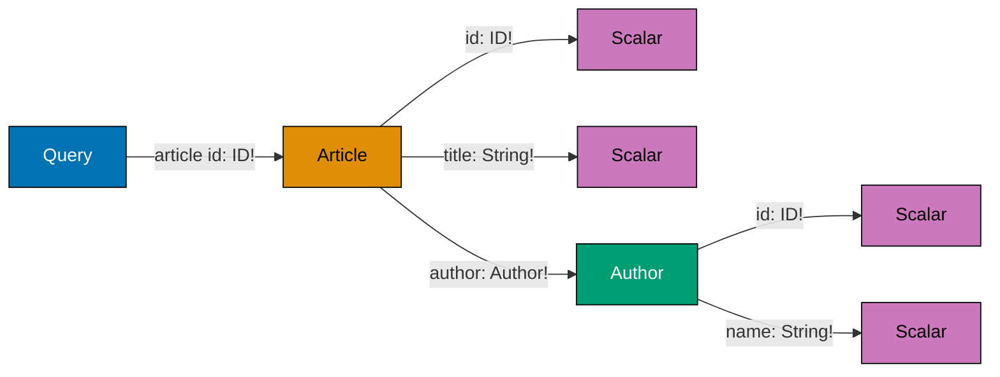
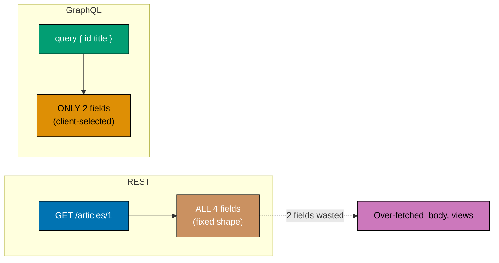
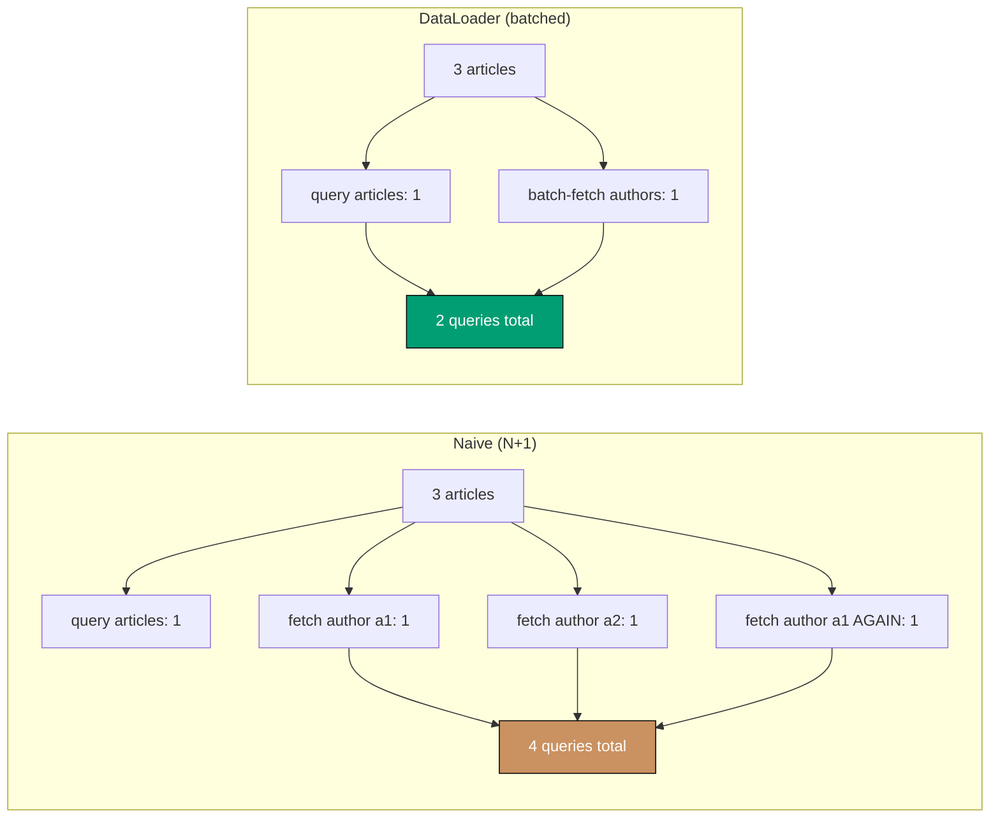
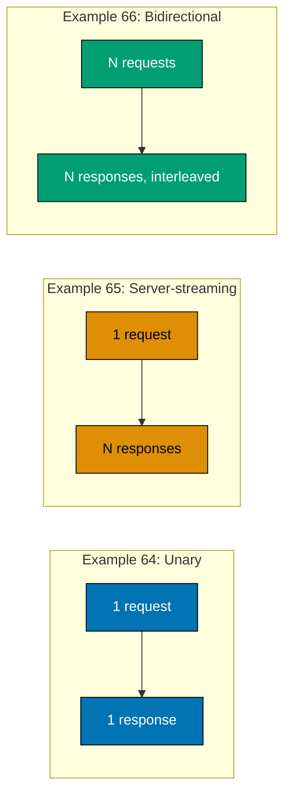
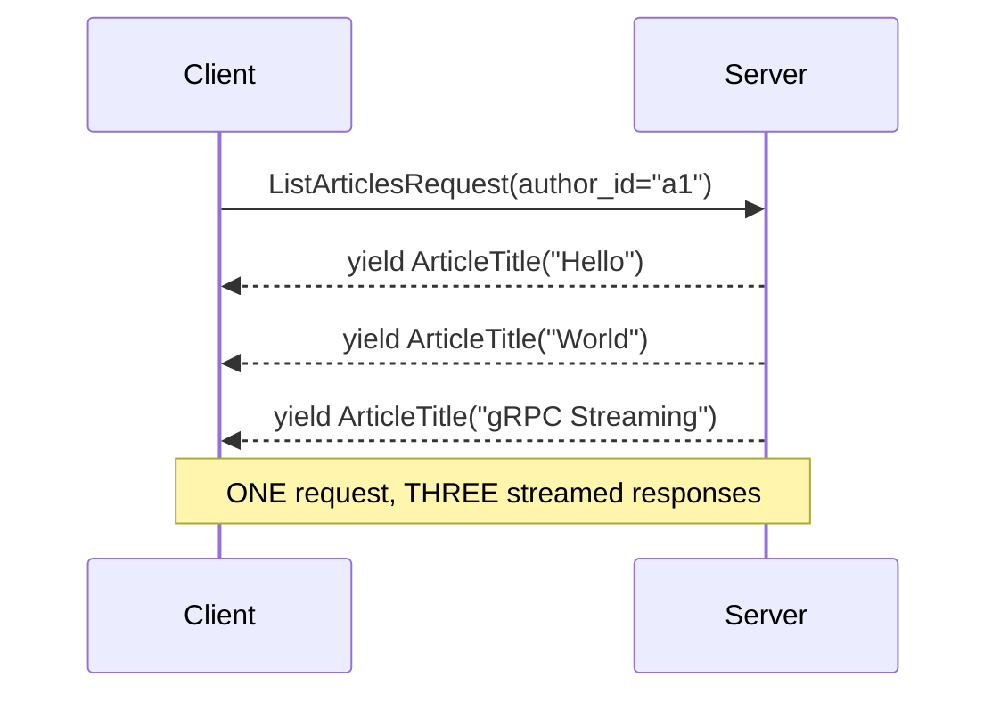
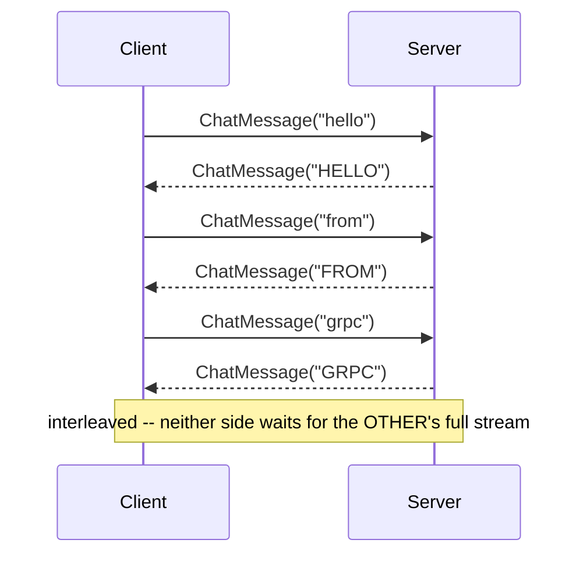
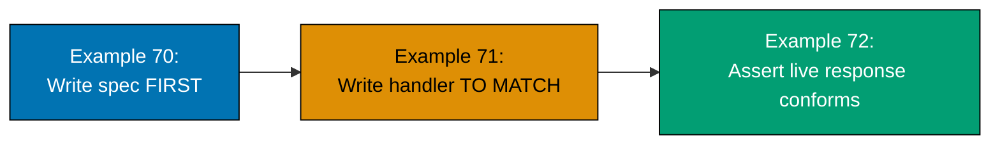
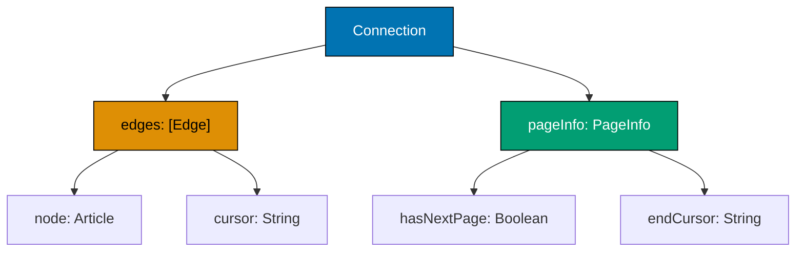
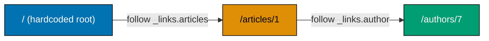
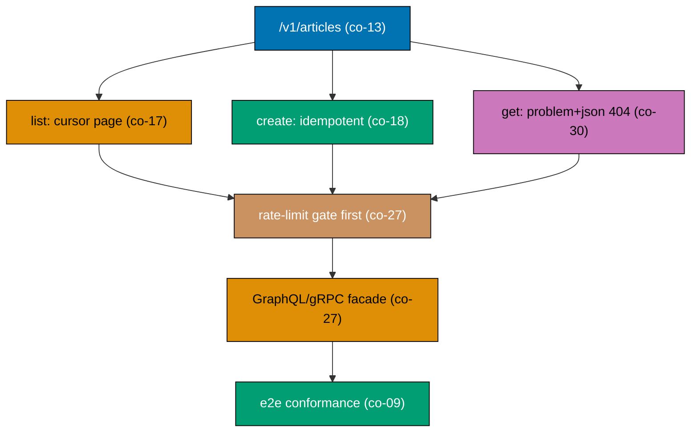

Examples 57-80 cover GraphQL (schema definition, field selection, the resolver pattern, the N+1
problem and DataLoader-style batching, and mutations), gRPC (`.proto` service definitions, unary
calls, server-streaming, and bidirectional streaming), an explicit REST/GraphQL/gRPC comparison
(caching behavior, field-evolution rules, and a scenario-driven selection matrix), the
contract-first workflow (writing the OpenAPI spec first, implementing a handler from it, and a
conformance test that catches a type regression), and a closing cluster that combines earlier
concerns: a versioned migration window, idempotency plus rate limiting on one endpoint, GraphQL's
partial-error model versus REST's `problem+json`, Relay-style cursor connections, a HATEOAS-driven
client, a REST-vs-gRPC payload-size proxy, generated human documentation, and a final example that
assembles five prior concerns into one versioned, paginated, idempotent, rate-limited REST API with
a GraphQL/gRPC facade note. Every example is a complete, self-contained, originally-authored Python
3 script using only the standard library -- gRPC and GraphQL examples SIMULATE the protocol's own
semantics in-process rather than depending on the `grpcio` or `graphql-core` packages, which keeps
every example runnable with nothing beyond `python3 example.py`.

---

### Example 57: Defining a GraphQL Schema and Types

_ex-57 &middot; exercises co-24_

A GraphQL schema declares types and their fields ONCE, in a small domain-specific language (SDL) --
distinct from OpenAPI's per-operation paths (Example 12), a GraphQL schema describes DATA SHAPES,
and every operation later queries a subset of them.



**`learning/code/ex-57-graphql-schema-def/example.py`**

```python
# pyright: strict
"""Example 57: Defining a GraphQL Schema and Types. (co-24)

A GraphQL schema declares types and their fields ONCE, in a small
domain-specific language (SDL) -- distinct from OpenAPI's per-operation
paths (Example 12), a GraphQL schema describes DATA SHAPES, and every
operation later queries a subset of them.
"""

SDL_LINES = [  # => co-24: the SDL, built line by line so every line can be explained
    "type Article {",  # => co-24: opens the Article object type
    "  id: ID!",  # => co-24: a required (non-null, "!") scalar field
    "  title: String!",  # => co-24: another required scalar field
    "  author: Author!",  # => co-24: a required field whose type is ANOTHER declared object type
    "}",  # => closes Article
    "",  # => a blank line, purely for the generated SDL's own readability
    "type Author {",  # => co-24: opens the Author object type, referenced by Article above
    "  id: ID!",  # => co-24: Author's own required id field
    "  name: String!",  # => co-24: Author's own required name field
    "}",  # => closes Author
    "",  # => another blank line
    "type Query {",  # => co-24: the ROOT type -- every readable operation is a field here
    "  article(id: ID!): Article",  # => co-24: one query field, taking an id, returning an Article
    "}",  # => closes Query
]  # => end of SDL_LINES
SCHEMA_SDL = "\n".join(SDL_LINES)  # => co-24: assembles the full SDL text from its own annotated lines


def extract_type_names(sdl: str) -> list[str]:  # => co-24: a tiny structural parser, no library needed
    type_names: list[str] = []  # => collects every "type Name {" declaration found
    for line in sdl.splitlines():  # => co-24: scans the SDL line by line
        stripped = line.strip()  # => trims leading/trailing whitespace
        if stripped.startswith("type ") and stripped.endswith("{"):  # => co-24: matches "type X {"
            name = stripped.removeprefix("type ").removesuffix("{").strip()  # => extracts just "X"
            type_names.append(name)  # => co-24: records this type's own name
    return type_names  # => every type name the SDL declares, in declaration order


def sdl_parses(sdl: str) -> bool:  # => co-24: a minimal "does this look like valid SDL" check
    open_braces = sdl.count("{")  # => counts every opening brace
    close_braces = sdl.count("}")  # => counts every closing brace
    return open_braces == close_braces and open_braces > 0  # => co-24: balanced braces, non-empty


types = extract_type_names(SCHEMA_SDL)  # => co-24: parses the schema's own declared types
print(f"declared types: {types}")  # => Output: ['Article', 'Author', 'Query']

is_valid = sdl_parses(SCHEMA_SDL)  # => co-24: verifies the SDL is at least structurally well-formed
# => is_valid is True (type: bool) -- every "{" in SCHEMA_SDL has a matching "}"
print(f"SDL parses: {is_valid}")  # => Output: True
```

**Run**: `python3 example.py`

**Output**:

```text
declared types: ['Article', 'Author', 'Query']
SDL parses: True
```

**Key takeaway**: `extract_type_names` finds all three declared types (`Article`, `Author`,
`Query`) purely by scanning for `type Name {` lines -- the SDL is plain text, but its structure is
regular enough to parse without a full GraphQL parser.

**Why it matters**: A schema is the CONTRACT every GraphQL query is checked against -- Example 58's
executor and every later GraphQL example in this tier assume this schema (or one like it) already
exists, the same way Example 12's OpenAPI document exists before REST's handlers run. A query that asks for a field the schema does not define fails validation before it ever reaches a resolver, catching the mistake at the cheapest possible point in the request lifecycle.

---

### Example 58: A Client Selects Exactly the Fields It Needs

_ex-58 &middot; exercises co-24_

The caller's own query names the specific fields it wants, and a minimal executor returns ONLY
those fields -- the opposite of REST's fixed response shape (Example 1), where the server alone
decides what comes back.

**`learning/code/ex-58-graphql-query-fields/example.py`**

```python
# pyright: strict
"""Example 58: A Client Selects Exactly the Fields It Needs. (co-24)

The caller's own query names the specific fields it wants, and a minimal
executor returns ONLY those fields -- the opposite of REST's fixed response
shape (Example 1), where the server alone decides what comes back.
"""

ARTICLE_DATA = {  # => co-24: the FULL underlying record, before any field selection
    "id": "1",  # => always present regardless of what the client asked for
    "title": "Hello, API Design",  # => a field a caller might select
    "body": "A very long body...",  # => a field a caller might choose NOT to select
    "views": 42,  # => another field a caller might choose NOT to select
}  # => end of ARTICLE_DATA


def execute_query(requested_fields: list[str]) -> dict[str, object]:  # => co-24: a minimal executor
    return {field: ARTICLE_DATA[field] for field in requested_fields if field in ARTICLE_DATA}
    # => co-24: returns ONLY the fields the client's own query named


small_query = execute_query(["id", "title"])  # => a client that only needs id and title
print(f"small query: {small_query}")  # => Output: {'id': '1', 'title': 'Hello, API Design'}

large_query = execute_query(["id", "title", "body", "views"])  # => a client that needs everything
# => large_query has all 4 keys -- the SAME executor, driven purely by the requested_fields argument
print(f"large query: {large_query}")  # => Output: all four fields, because all four were requested
```

**Run**: `python3 example.py`

**Output**:

```text
small query: {'id': '1', 'title': 'Hello, API Design'}
large query: {'id': '1', 'title': 'Hello, API Design', 'body': 'A very long body...', 'views': 42}
```

**Key takeaway**: `execute_query(["id", "title"])` and `execute_query([..., "body", "views"])`
return different-sized dictionaries from the SAME underlying `ARTICLE_DATA` -- the response shape
is determined entirely by what the caller asked for, not by anything fixed on the server side.

**Why it matters**: This is GraphQL's central design idea, and the direct cause of Example 59's
contrast -- a REST endpoint decides its own response shape once, for every caller; a GraphQL
endpoint's response shape is decided FRESH, per request, by whoever is calling it. This is precisely what eliminates the over-fetching and under-fetching trade-off REST forces on API designers: one endpoint now correctly serves a mobile client's minimal needs and a dashboard's data-hungry needs alike.

---

### Example 59: The Same Data via REST vs GraphQL

_ex-59 &middot; exercises co-24_

A REST endpoint (Example 1) returns its ONE fixed shape regardless of what the caller actually
needs; the SAME underlying data via GraphQL (Example 58) returns only the requested fields -- this
example puts both side by side against the identical record.



**`learning/code/ex-59-graphql-overfetch-contrast/example.py`**

```python
# pyright: strict
"""Example 59: The Same Data via REST vs GraphQL. (co-24)

A REST endpoint (Example 1) returns its ONE fixed shape regardless of what
the caller actually needs; the SAME underlying data via GraphQL (Example
58) returns only the requested fields -- this example puts both side by
side against the identical record.
"""

RECORD = {"id": "1", "title": "Hello, API Design", "body": "A very long body...", "views": 42}
# => co-24: the single underlying record both styles serve


def rest_get_article() -> dict[str, object]:  # => co-24: REST's own fixed response shape
    return dict(RECORD)  # => co-24: ALWAYS all four fields -- the caller has no say in the shape


def graphql_query(requested_fields: list[str]) -> dict[str, object]:  # => co-24: GraphQL's selective shape
    return {field: RECORD[field] for field in requested_fields if field in RECORD}  # => only what was asked


client_needs = ["id", "title"]  # => this specific client only ever reads two fields

rest_response = rest_get_article()  # => co-24: REST call -- ignores what the client actually needs
print(f"REST returns {len(rest_response)} fields: {sorted(rest_response.keys())}")  # => Output: all 4

graphql_response = graphql_query(client_needs)  # => co-24: GraphQL call -- matches the client's own need
print(f"GraphQL returns {len(graphql_response)} fields: {sorted(graphql_response.keys())}")  # => Output: 2

wasted_fields = set(rest_response.keys()) - set(graphql_response.keys())  # => co-24: over-fetched fields
# => wasted_fields is {'body', 'views'} -- bytes this specific client paid for but never reads
print(f"REST over-fetched: {sorted(wasted_fields)}")  # => Output: ['body', 'views'] -- unused by this client
```

**Run**: `python3 example.py`

**Output**:

```text
REST returns 4 fields: ['body', 'id', 'title', 'views']
GraphQL returns 2 fields: ['id', 'title']
REST over-fetched: ['body', 'views']
```

**Key takeaway**: `wasted_fields` computes the set difference between what REST returned and what
this specific client actually needed -- `body` and `views` traveled over the wire for nothing, a
concrete, measurable cost this client never asked to pay.

**Why it matters**: "Over-fetching" is not an abstract complaint -- this example makes it a
concrete set of named fields a client received but never used, which is exactly the class of waste
Example 50's `?fields=` and Example 51's JSON:API sparse fieldsets try to claw back within REST's
own model, and GraphQL avoids by design.

---

### Example 60: A Resolver Resolving a Field

_ex-60 &middot; exercises co-25_

A resolver is a small function bound to ONE field -- when the executor (Example 58) needs that
field's value, it calls the field's own resolver rather than reading a fixed dictionary directly,
letting a field's value be computed instead of merely stored.

**`learning/code/ex-60-graphql-resolver/example.py`**

```python
# pyright: strict
"""Example 60: A Resolver Resolving a Field. (co-25)

A resolver is a small function bound to ONE field -- when the executor
(Example 58) needs that field's value, it calls the field's own resolver
rather than reading a fixed dictionary directly, letting a field's value be
computed instead of merely stored.
"""

from typing import Callable  # => a resolver is just a function, typed for clarity

ARTICLES: dict[str, dict[str, object]] = {"1": {"id": "1", "title": "Hello", "view_count": 42}}
# => co-25: the underlying store a resolver reads from


def resolve_title(article_id: str) -> str:  # => co-25: a resolver for the "title" field specifically
    return str(ARTICLES[article_id]["title"])  # => co-25: reads the stored value directly


def resolve_view_count_doubled(article_id: str) -> int:  # => co-25: a resolver that COMPUTES its value
    raw_value = ARTICLES[article_id]["view_count"]  # => co-25: the raw stored value, typed as object
    assert isinstance(raw_value, int)  # => co-25: narrows object -> int before arithmetic, pyright-clean
    return raw_value * 2  # => co-25: the field's VALUE is derived, not merely stored verbatim


FIELD_RESOLVERS: dict[str, Callable[[str], object]] = {  # => co-25: field name -> its own resolver function
    "title": resolve_title,  # => a simple pass-through resolver
    "view_count_doubled": resolve_view_count_doubled,  # => a resolver that computes its own value
}  # => end of FIELD_RESOLVERS


def resolve_field(field_name: str, article_id: str) -> object:  # => co-25: the executor's own dispatch step
    resolver = FIELD_RESOLVERS[field_name]  # => co-25: looks up the specific field's resolver
    return resolver(article_id)  # => co-25: calls it -- the field's value is whatever the function returns


title_value = resolve_field("title", "1")  # => co-25: resolves a plain, stored field
print(f"title: {title_value}")  # => Output: title: Hello

doubled_value = resolve_field("view_count_doubled", "1")  # => co-25: resolves a COMPUTED field
# => doubled_value is 84 (type: object, runtime type int) -- never stored anywhere, only computed
print(f"view_count_doubled: {doubled_value}")  # => Output: view_count_doubled: 84 -- 42 doubled
```

**Run**: `python3 example.py`

**Output**:

```text
title: Hello
view_count_doubled: 84
```

**Key takeaway**: `resolve_field` dispatches to a DIFFERENT function depending on which field was
requested -- `"title"` reads a stored value verbatim, while `"view_count_doubled"` computes its
value fresh (`42 * 2 = 84`), and the executor's own code never needed to know the difference.

**Why it matters**: Binding each field to its own resolver function is what lets a single GraphQL
schema serve fields backed by wildly different sources -- a stored value, a computed value, or (as
Example 61 shows next) a value that requires its own network or database call -- all through the
identical `resolve_field` dispatch mechanism.

---

### Example 61: An N+1 Resolver, Then a DataLoader Batch

_ex-61 &middot; exercises co-25_

Resolving each article's author with its OWN separate lookup means N articles cost N+1 queries (1
for articles, N for authors) -- batching all N author lookups into ONE call (the DataLoader
pattern) collapses that back down to 2 queries total, regardless of N.



**`learning/code/ex-61-graphql-n1-dataloader/example.py`**

```python
# pyright: strict
"""Example 61: An N+1 Resolver, Then a DataLoader Batch. (co-25)

Resolving each article's author with its OWN separate lookup means N
articles cost N+1 queries (1 for articles, N for authors) -- batching all
N author lookups into ONE call (the DataLoader pattern) collapses that back
down to 2 queries total, regardless of N.
"""

ARTICLES = [  # => co-25: 3 articles, each referencing an author by id
    {"id": "1", "author_id": "a1"},  # => article 1, written by author a1
    {"id": "2", "author_id": "a2"},  # => article 2, written by author a2
    {"id": "3", "author_id": "a1"},  # => article 3, ALSO written by author a1
]  # => end of ARTICLES
AUTHORS = {"a1": "Ada", "a2": "Grace"}  # => co-25: the underlying author store

QUERY_COUNT = [0]  # => a mutable counter cell -- counts every simulated "database" call


def fetch_author_naive(author_id: str) -> str:  # => co-25: the N+1 resolver -- one call PER article
    QUERY_COUNT[0] += 1  # => co-25: every single call increments the counter
    return AUTHORS[author_id]  # => the author's name, fetched one at a time


QUERY_COUNT[0] = 0  # => reset before measuring the naive path
naive_results = [fetch_author_naive(article["author_id"]) for article in ARTICLES]  # => co-25: 3 separate calls
# => naive_results is ['Ada', 'Grace', 'Ada'] -- author "a1" was queried TWICE, redundantly
print(f"naive results: {naive_results}, query count: {QUERY_COUNT[0]}")  # => Output: 3 names, 3 queries


def fetch_authors_batched(author_ids: list[str]) -> dict[str, str]:  # => co-25: the DataLoader-style batch
    QUERY_COUNT[0] += 1  # => co-25: exactly ONE call, regardless of how many ids are in the batch
    unique_ids = set(author_ids)  # => co-25: deduplicates repeated ids (a1 appears twice above)
    return {author_id: AUTHORS[author_id] for author_id in unique_ids}  # => one lookup covering every id


QUERY_COUNT[0] = 0  # => reset before measuring the batched path
all_author_ids = [article["author_id"] for article in ARTICLES]  # => co-25: collects every id UP FRONT
author_map = fetch_authors_batched(all_author_ids)  # => co-25: ONE call resolves all three articles' authors
batched_results = [author_map[a_id] for a_id in all_author_ids]  # => maps each article back to its author
# => batched_results == naive_results, but QUERY_COUNT[0] is 1, not 3 -- same answer, 1/3 the queries
print(f"batched results: {batched_results}, query count: {QUERY_COUNT[0]}")  # => Output: same 3 names, 1 query
```

**Run**: `python3 example.py`

**Output**:

```text
naive results: ['Ada', 'Grace', 'Ada'], query count: 3
batched results: ['Ada', 'Grace', 'Ada'], query count: 1
```

**Key takeaway**: Both paths produce the IDENTICAL `['Ada', 'Grace', 'Ada']` result -- the only
difference is `query_count`, which drops from 3 (one per article) to 1 (one call covering all
three, deduplicated), simply by collecting every id UP FRONT instead of resolving one at a time.

**Why it matters**: N+1 is GraphQL's most notorious performance trap -- Example 60's per-field
resolver pattern, applied naively to a list of articles, calls the author resolver once PER
article, so a 100-article page silently makes 101 database calls; batching (the DataLoader
pattern) is the standard fix, and this example proves the count drops without changing the result.

---

### Example 62: A Mutation Writes Data

_ex-62 &middot; exercises co-24_

GraphQL separates read operations (`Query`, Examples 58-61) from write operations (`Mutation`) at
the SCHEMA level -- a mutation both performs a side effect and returns a value, the same "write,
then return the result" shape REST's POST (Example 5) already uses.

**`learning/code/ex-62-graphql-mutation/example.py`**

```python
# pyright: strict
"""Example 62: A Mutation Writes Data. (co-24)

GraphQL separates read operations (`Query`, Examples 58-61) from write
operations (`Mutation`) at the SCHEMA level -- a mutation both performs a
side effect and returns a value, the same "write, then return the result"
shape REST's POST (Example 5) already uses.
"""

ARTICLES: dict[str, dict[str, object]] = {}  # => co-24: the store a mutation writes into
NEXT_ID = [1]  # => a mutable counter cell -- mints a fresh id per created article


def create_article_mutation(title: str) -> dict[str, object]:  # => co-24: mutation createArticle(title)
    new_id = str(NEXT_ID[0])  # => a fresh id for this specific article
    article: dict[str, object] = {"id": new_id, "title": title}  # => co-24: explicit dict[str, object]
    ARTICLES[new_id] = article  # => co-24: the SIDE EFFECT -- writes into the store
    NEXT_ID[0] += 1  # => advances the counter for the NEXT mutation
    return article  # => co-24: mutations still RETURN a value, just like a query does


result = create_article_mutation("Hello, GraphQL")  # => co-24: runs the mutation once
print(f"mutation result: {result}")  # => Output: {'id': '1', 'title': 'Hello, GraphQL'}

print(f"stored articles: {len(ARTICLES)}")  # => Output: 1 -- co-24: the side effect actually happened
# => a Query field would never be allowed to mutate ARTICLES -- the schema separates the two by name
```

**Run**: `python3 example.py`

**Output**:

```text
mutation result: {'id': '1', 'title': 'Hello, GraphQL'}
stored articles: 1
```

**Key takeaway**: `create_article_mutation` both writes into `ARTICLES` (a side effect) AND returns
the created article (a value) -- the `len(ARTICLES) == 1` check confirms the write actually
happened, not just that a value was returned.

**Why it matters**: GraphQL's schema-level split between `Query` and `Mutation` makes the
read/write distinction explicit and enforceable at the TYPE level -- a client (or a linter) can see
from the schema alone which operations are safe to retry freely and which perform a side effect,
the same distinction Example 3's method semantics table makes for REST.

---

### Example 63: Writing a .proto Service + Messages

_ex-63 &middot; exercises co-26_

A `.proto` file declares message types and a service's RPC methods in Protocol Buffers' own IDL --
structurally similar to Example 57's GraphQL SDL, but describing RPC METHODS rather than a
queryable graph of types.

**`learning/code/ex-63-grpc-proto-define/example.py`**

```python
# pyright: strict
"""Example 63: Writing a .proto Service + Messages. (co-26)

A `.proto` file declares message types and a service's RPC methods in
Protocol Buffers' own IDL -- structurally similar to Example 57's GraphQL
SDL, but describing RPC METHODS rather than a queryable graph of types.
"""

PROTO_LINES = [  # => co-26: the .proto source, built line by line so every line can be explained
    'syntax = "proto3";',  # => co-26: proto3 REQUIRES this exact declaration, first line
    "",  # => a blank line, purely for the generated source's own readability
    "message ArticleRequest {",  # => co-26: opens the request message
    "  string id = 1;",  # => co-26: field "id", assigned WIRE NUMBER 1 (never reused across versions)
    "}",  # => closes ArticleRequest
    "",  # => another blank line
    "message ArticleResponse {",  # => co-26: opens the response message
    "  string id = 1;",  # => co-26: field "id", wire number 1
    "  string title = 2;",  # => co-26: field "title", wire number 2
    "}",  # => closes ArticleResponse
    "",  # => another blank line
    "service ArticleService {",  # => co-26: opens the service -- a NAMED group of RPC methods
    "  rpc GetArticle (ArticleRequest) returns (ArticleResponse);",  # => co-26: ONE unary RPC method
    "}",  # => closes ArticleService
]  # => end of PROTO_LINES
PROTO_SOURCE = "\n".join(PROTO_LINES)  # => co-26: assembles the full .proto text from its own annotated lines


def extract_service_methods(proto_source: str) -> list[str]:  # => co-26: a tiny structural parser
    methods: list[str] = []  # => collects every "rpc MethodName (" declaration found
    for line in proto_source.splitlines():  # => co-26: scans the .proto source line by line
        stripped = line.strip()  # => trims leading/trailing whitespace
        if stripped.startswith("rpc "):  # => co-26: matches an RPC method declaration
            method_name = stripped.removeprefix("rpc ").split(" ")[0]  # => extracts just the method name
            methods.append(method_name)  # => co-26: records this RPC's own name
    return methods  # => every RPC method name the service declares


def proto_compiles(proto_source: str) -> bool:  # => co-26: a minimal "does this look valid" check
    has_syntax_decl = "syntax = " in proto_source  # => co-26: proto3 requires an explicit syntax line
    balanced_braces = proto_source.count("{") == proto_source.count("}")  # => structural sanity check
    return has_syntax_decl and balanced_braces  # => both conditions must hold


methods = extract_service_methods(PROTO_SOURCE)  # => co-26: parses the service's own declared methods
print(f"declared RPC methods: {methods}")  # => Output: ['GetArticle']

compiles = proto_compiles(PROTO_SOURCE)  # => co-26: verifies the .proto source is at least well-formed
# => compiles is True (type: bool) -- syntax line present, and every brace closes
print(f".proto compiles: {compiles}")  # => Output: True
```

**Run**: `python3 example.py`

**Output**:

```text
declared RPC methods: ['GetArticle']
.proto compiles: True
```

**Key takeaway**: Every field in `PROTO_SOURCE` carries an explicit WIRE NUMBER (`= 1`, `= 2`) --
Example 68 later shows why that number, not the field's name or position, is what makes gRPC's own
evolution rule work.

**Why it matters**: A `.proto` file is Protocol Buffers' equivalent of Example 57's GraphQL SDL and
Example 12's OpenAPI schema -- ONE source of truth that generates both server-side handler stubs
and client-side call stubs in whatever language each side uses, keeping client and server
mechanically in sync with the same contract. This mechanical generation is what makes gRPC's cross-language promise real in practice: a Go server and a Python client compiled from the same `.proto` file cannot silently drift out of sync the way hand-written client code can.

---

### Example 64: A Unary RPC

_ex-64 &middot; exercises co-26_

A unary RPC is the gRPC shape closest to a normal function call -- ONE request message in, ONE
response message out, matching Example 63's `GetArticle` service definition, simulated here as a
plain in-process call rather than an actual network round trip.



**`learning/code/ex-64-grpc-unary/example.py`**

```python
# pyright: strict
"""Example 64: A Unary RPC. (co-26)

A unary RPC is the gRPC shape closest to a normal function call -- ONE
request message in, ONE response message out, matching Example 63's
`GetArticle` service definition, simulated here as a plain in-process
call rather than an actual network round trip.
"""

from dataclasses import dataclass  # => typed request/response messages, matching the .proto shapes

ARTICLES = {"1": "Hello, gRPC"}  # => co-26: the underlying store the RPC handler reads from


@dataclass  # => co-26: mirrors PROTO_SOURCE's ArticleRequest message
class ArticleRequest:  # => co-26: exactly one field, matching the .proto message
    id: str  # => the single field the request message carries


@dataclass  # => co-26: mirrors PROTO_SOURCE's ArticleResponse message
class ArticleResponse:  # => co-26: exactly two fields, matching the .proto message
    id: str  # => echoes the requested id back
    title: str  # => the resolved title


def get_article(request: ArticleRequest) -> ArticleResponse:  # => co-26: the unary RPC handler itself
    title = ARTICLES[request.id]  # => co-26: ONE request in -> a lookup against the store
    return ArticleResponse(id=request.id, title=title)  # => co-26: ONE response out -- unary, start to finish


request = ArticleRequest(id="1")  # => the single request message a client sends
response = get_article(request)  # => co-26: the unary call -- one request, one response, nothing streamed
# => response is ArticleResponse(id='1', title='Hello, gRPC') -- exactly the shape .proto declared
print(f"response: {response}")  # => Output: ArticleResponse(id='1', title='Hello, gRPC')
```

**Run**: `python3 example.py`

**Output**:

```text
response: ArticleResponse(id='1', title='Hello, gRPC')
```

**Key takeaway**: `ArticleRequest` and `ArticleResponse` mirror Example 63's `.proto` message
definitions field for field -- a unary RPC is the simplest of gRPC's four call shapes, structurally
no different from calling any ordinary typed function.

**Why it matters**: Unary is the BASELINE gRPC calls the other three examples in this cluster build
on -- Example 65 keeps the single request but streams MANY responses back, and Example 66 lets both
sides stream at once, so understanding this simplest shape first makes the streaming variants read
as natural extensions rather than new concepts.

---

### Example 65: A Server-Streaming RPC

_ex-65 &middot; exercises co-26_

Unlike Example 64's one-request-one-response unary call, a server-streaming RPC takes ONE request
but returns MANY response messages over time -- a Python generator models this naturally: the
client makes one call, then iterates over a stream of results.



**`learning/code/ex-65-grpc-server-streaming/example.py`**

```python
# pyright: strict
"""Example 65: A Server-Streaming RPC. (co-26)

Unlike Example 64's one-request-one-response unary call, a server-streaming
RPC takes ONE request but returns MANY response messages over time -- a
Python generator models this naturally: the client makes one call, then
iterates over a stream of results.
"""

from collections.abc import Iterator  # => co-26: the streaming response is an Iterator, not a single value
from dataclasses import dataclass  # => typed request/response messages

ARTICLES_BY_AUTHOR = {"a1": ["Hello", "World", "gRPC Streaming"]}  # => co-26: multiple titles per author


@dataclass  # => co-26: ONE request message, naming which author's articles to stream
class ListArticlesRequest:  # => co-26: exactly one field, matching the .proto request shape
    author_id: str  # => the single field the request carries


@dataclass  # => co-26: each individually-streamed response message
class ArticleTitle:  # => co-26: exactly one field per streamed message
    title: str  # => one title per streamed message


def list_articles_by_author(request: ListArticlesRequest) -> Iterator[ArticleTitle]:  # => co-26: server-streaming
    titles = ARTICLES_BY_AUTHOR[request.author_id]  # => co-26: ONE request resolves the WHOLE list up front
    for title in titles:  # => co-26: but the RESPONSE is yielded one message at a time
        yield ArticleTitle(title=title)  # => co-26: each yield is a separate streamed response message


request = ListArticlesRequest(author_id="a1")  # => the single request that starts the stream
streamed_titles = list(list_articles_by_author(request))  # => co-26: consumes the FULL stream into a list
# => streamed_titles has 3 ArticleTitle entries -- one request produced three response messages
print(f"streamed {len(streamed_titles)} messages: {streamed_titles}")  # => Output: 3 ArticleTitle messages

for i, article_title in enumerate(list_articles_by_author(request), start=1):  # => co-26: iterate lazily too
    print(f"message {i}: {article_title.title}")  # => Output: one line per streamed title, in order
```

**Run**: `python3 example.py`

**Output**:

```text
streamed 3 messages: [ArticleTitle(title='Hello'), ArticleTitle(title='World'), ArticleTitle(title='gRPC Streaming')]
message 1: Hello
message 2: World
message 3: gRPC Streaming
```

**Key takeaway**: `list_articles_by_author` is called just ONCE with ONE request, yet its result is
iterated three times -- the `yield` inside the loop is what turns a single call into a STREAM of
individually-delivered response messages, rather than one big list sent all at once.

**Why it matters**: Server-streaming lets a client start processing the FIRST result before the
LAST one has even been produced -- valuable for large result sets (a live feed, a long export)
where waiting for the entire response to be ready before sending anything would add unnecessary
latency to the first useful piece of data.

---

### Example 66: A Bidirectional-Streaming RPC

_ex-66 &middot; exercises co-26_

Bidirectional streaming lets BOTH sides send a sequence of messages over the SAME call, interleaved
-- unlike Example 65's server-only stream, here the client streams requests in while
simultaneously reading responses out, modeled here as an interleaved read/write loop over a shared
connection.



**`learning/code/ex-66-grpc-bidi-streaming/example.py`**

```python
# pyright: strict
"""Example 66: A Bidirectional-Streaming RPC. (co-26)

Bidirectional streaming lets BOTH sides send a sequence of messages over
the SAME call, interleaved -- unlike Example 65's server-only stream, here
the client streams requests in while simultaneously reading responses out,
modeled here as an interleaved read/write loop over a shared connection.
"""

from collections.abc import Iterator  # => co-26: both the input and output are streams
from dataclasses import dataclass  # => typed request/response messages


@dataclass  # => co-26: ONE message the client streams IN, per chat line
class ChatMessage:
    text: str  # => the message text this participant sent


def echo_uppercase_bidi(client_stream: Iterator[ChatMessage]) -> Iterator[ChatMessage]:  # => co-26: bidi RPC
    for incoming in client_stream:  # => co-26: reads ONE client message at a time, as it arrives
        reply = ChatMessage(text=incoming.text.upper())  # => co-26: the server's own per-message reply
        yield reply  # => co-26: streams the reply back IMMEDIATELY -- interleaved, not batched at the end


def client_messages() -> Iterator[ChatMessage]:  # => co-26: simulates the client's OWN outbound stream
    yield ChatMessage(text="hello")  # => client message 1
    yield ChatMessage(text="from")  # => client message 2
    yield ChatMessage(text="grpc")  # => client message 3


interleaved_pairs: list[tuple[str, str]] = []  # => co-26: records (sent, received) pairs, in arrival order
server_replies = echo_uppercase_bidi(client_messages())  # => co-26: wires the client stream INTO the server
for sent, received in zip(client_messages(), server_replies, strict=True):  # => co-26: walks both streams
    interleaved_pairs.append((sent.text, received.text))  # => co-26: pairs each send with its own reply

for sent_text, received_text in interleaved_pairs:  # => print each interleaved exchange
    print(f"sent={sent_text!r} -> received={received_text!r}")  # => Output: 3 lines, each upper-cased
# => neither side waited for the OTHER's entire stream to finish before replying
```

**Run**: `python3 example.py`

**Output**:

```text
sent='hello' -> received='HELLO'
sent='from' -> received='FROM'
sent='grpc' -> received='GRPC'
```

**Key takeaway**: `echo_uppercase_bidi` is itself a generator that CONSUMES a stream while
PRODUCING one -- each incoming message gets its own reply yielded immediately, rather than the
server waiting to collect every client message before replying to any of them.

**Why it matters**: Bidirectional streaming is the ONLY one of gRPC's four call shapes with no
direct REST or GraphQL equivalent -- a real-time chat, a live collaborative edit session, or a
telemetry pipeline where both sides need to keep talking over one long-lived connection are the
kinds of problems this shape solves that request/response protocols cannot express directly.

---

### Example 67: Contrasting REST, GraphQL, and gRPC on Caching

_ex-67 &middot; exercises co-27_

REST's GET (Example 44) is cacheable by any HTTP-aware intermediary via `Cache-Control`; GraphQL
(Examples 57-62) rides over POST, which HTTP caches never store by default; gRPC (Examples 63-66)
uses a binary framing HTTP caches cannot even parse -- this example states each fact explicitly.

**`learning/code/ex-67-style-caching-contrast/example.py`**

```python
# pyright: strict
"""Example 67: Contrasting REST, GraphQL, and gRPC on Caching. (co-27)

REST's GET (Example 44) is cacheable by any HTTP-aware intermediary via
`Cache-Control`; GraphQL (Examples 57-62) rides over POST, which HTTP
caches never store by default; gRPC (Examples 63-66) uses a binary framing
HTTP caches cannot even parse -- this example states each fact explicitly.
"""

from dataclasses import dataclass  # => a small typed record describing each style's own caching story


@dataclass  # => co-27: one row per API style, describing its caching characteristics
class CachingProfile:  # => co-27: four fields, one row per style compared below
    style: str  # => the API style's own name
    http_method: str  # => the transport-level HTTP method it typically rides over
    cacheable_by_default: bool  # => co-27: can a generic HTTP cache store this response, unmodified?
    reason: str  # => WHY that is true or false for this style


REST_PROFILE = CachingProfile(  # => co-27: REST's own profile
    style="REST",  # => this row describes REST
    http_method="GET",  # => REST reads ride over GET (Example 3)
    cacheable_by_default=True,  # => co-27: GET + Cache-Control is exactly what caches understand
    reason="GET is safe/cacheable; Cache-Control (Example 44) is a first-class HTTP mechanism",  # => co-27
)  # => end of REST_PROFILE

GRAPHQL_PROFILE = CachingProfile(  # => co-27: GraphQL's own profile
    style="GraphQL",  # => this row describes GraphQL
    http_method="POST",  # => co-27: queries are typically sent as POST bodies, not GET query strings
    cacheable_by_default=False,  # => co-27: HTTP caches never store POST responses by default
    reason="the query lives in the POST body, invisible to a cache keyed on the URL",  # => co-27
)  # => end of GRAPHQL_PROFILE

GRPC_PROFILE = CachingProfile(  # => co-27: gRPC's own profile
    style="gRPC",  # => this row describes gRPC
    http_method="POST (HTTP/2, binary framing)",  # => co-27: gRPC always rides over HTTP/2 POST
    cacheable_by_default=False,  # => co-27: binary Protobuf frames are opaque to a generic HTTP cache
    reason="binary framing plus POST means no generic HTTP cache can parse or store it",  # => co-27
)  # => end of GRPC_PROFILE

PROFILES = [REST_PROFILE, GRAPHQL_PROFILE, GRPC_PROFILE]  # => co-27: all three, ready to compare
# => PROFILES has exactly 1 True and 2 False for cacheable_by_default -- only REST is cache-friendly
for profile in PROFILES:  # => print each style's own caching verdict
    print(f"{profile.style}: cacheable_by_default={profile.cacheable_by_default} ({profile.reason})")
    # => Output: REST=True, GraphQL=False, gRPC=False, each with its own stated reason
```

**Run**: `python3 example.py`

**Output**:

```text
REST: cacheable_by_default=True (GET is safe/cacheable; Cache-Control (Example 44) is a first-class HTTP mechanism)
GraphQL: cacheable_by_default=False (the query lives in the POST body, invisible to a cache keyed on the URL)
gRPC: cacheable_by_default=False (binary framing plus POST means no generic HTTP cache can parse or store it)
```

**Key takeaway**: Only REST's `cacheable_by_default` is `True` -- GraphQL and gRPC are both `False`,
but for TWO DIFFERENT reasons stated explicitly in `reason`: GraphQL because of its transport
(POST), gRPC because of both its transport AND its binary framing.

**Why it matters**: Caching is not a minor implementation detail -- an API style that rides over
GET with `Cache-Control` gets browser caching, CDN caching, and reverse-proxy caching essentially
for free; a style that does not (GraphQL, gRPC) must reimplement that caching behavior
application-side (a persisted-query cache, an application-level result cache) if it needs it at all.

---

### Example 68: How Each Style Evolves a Field

_ex-68 &middot; exercises co-27_

Adding a field is safe in all three styles (REST's Example 32, GraphQL's schema, gRPC's numbered
proto fields), but each has its OWN specific rule for what makes that addition safe -- this example
states each rule and demonstrates it holding.

**`learning/code/ex-68-style-evolution-contrast/example.py`**

```python
# pyright: strict
"""Example 68: How Each Style Evolves a Field. (co-27)

Adding a field is safe in all three styles (REST's Example 32, GraphQL's
schema, gRPC's numbered proto fields), but each has its OWN specific rule
for what makes that addition safe -- this example states each rule and
demonstrates it holding.
"""

REST_V1: dict[str, object] = {"id": 1, "title": "Hello"}  # => co-27: REST -- adding a field is safe if OPTIONAL
REST_V2: dict[str, object] = {"id": 1, "title": "Hello", "author": "Ada"}  # => co-27: Example 32's own rule


def rest_old_client_reads(response: dict[str, object]) -> dict[str, object]:  # => co-27: reads known fields only
    return {"id": response["id"], "title": response["title"]}  # => ignores "author" entirely, safely


rest_before = rest_old_client_reads(REST_V1)  # => an old client against the old shape
rest_after = rest_old_client_reads(REST_V2)  # => the SAME old client against the evolved shape
print(f"REST: old client unaffected = {rest_before == rest_after}")  # => Output: True -- co-27's own claim


GRAPHQL_SCHEMA_V1_FIELDS = {"id", "title"}  # => co-27: GraphQL -- adding a NULLABLE field is safe
GRAPHQL_SCHEMA_V2_FIELDS = {"id", "title", "author"}  # => co-27: a new, optional field added to the schema


def graphql_query_still_valid(query_fields: set[str], schema_fields: set[str]) -> bool:  # => co-27: validity check
    return query_fields.issubset(schema_fields)  # => co-27: a query is valid if every field it asks for exists


old_query = {"id", "title"}  # => an existing client's own query, unaware "author" now exists
still_valid = graphql_query_still_valid(old_query, GRAPHQL_SCHEMA_V2_FIELDS)  # => co-27: checked against V2
print(f"GraphQL: old query still valid = {still_valid}")  # => Output: True -- co-27: adding "author" broke nothing


GRPC_FIELDS_V1 = {1: "id", 2: "title"}  # => co-27: gRPC -- fields are identified by NUMBER, not position
GRPC_FIELDS_V2 = {1: "id", 2: "title", 3: "author"}  # => co-27: a NEW field number, never reused


def grpc_decode_known_fields(wire_fields: dict[int, object], known: dict[int, str]) -> dict[str, object]:
    # => co-27: decodes only field numbers the OLD client's own generated code recognizes
    return {known[num]: value for num, value in wire_fields.items() if num in known}  # => unknown numbers skipped


wire_message: dict[int, object] = {1: "1", 2: "Hello", 3: "Ada"}  # => co-27: a client message, V2's schema
decoded_by_old_client = grpc_decode_known_fields(wire_message, GRPC_FIELDS_V1)  # => co-27: decoded with OLD field map
# => decoded_by_old_client has 2 keys, not 3 -- field number 3 was never even in the OLD client's map
print(f"gRPC: old client decodes = {decoded_by_old_client}")  # => Output: field 3 silently ignored, no error
```

**Run**: `python3 example.py`

**Output**:

```text
REST: old client unaffected = True
GraphQL: old query still valid = True
gRPC: old client decodes = {'id': '1', 'title': 'Hello'}
```

**Key takeaway**: All three checks confirm the SAME underlying pattern in three different
mechanisms -- REST's old client ignores an unread key, GraphQL's old query never mentions the new
field so it stays valid, and gRPC's old client simply has no entry for wire number 3, so it decodes
only what it recognizes.

**Why it matters**: Naming the SPECIFIC mechanism behind "adding a field is safe" for each style
matters because the mechanisms diverge in their FAILURE modes -- REST breaks if a field is
REMOVED, GraphQL breaks if a REQUIRED (non-null) field changes type, and gRPC breaks specifically
if a WIRE NUMBER is reused for a different field, which is why Example 63's `.proto` comments flag
those numbers as "never reused."

---

### Example 69: Picking a Style per Scenario, With a Rationale

_ex-69 &middot; exercises co-27_

Choosing REST, GraphQL, or gRPC is a design decision, not a default -- this example encodes a small
decision matrix, one scenario per row, and asserts every recommended style is backed by an
explicit, checkable rationale.

**`learning/code/ex-69-style-selection-matrix/example.py`**

```python
# pyright: strict
"""Example 69: Picking a Style per Scenario, with a Rationale. (co-27)

Choosing REST, GraphQL, or gRPC is a design decision, not a default -- this
example encodes a small decision matrix, one scenario per row, and asserts
every recommended style is backed by an explicit, checkable rationale.
"""

from dataclasses import dataclass  # => a small typed record for one scenario's own recommendation


@dataclass  # => co-27: one row -- a scenario, its recommended style, and WHY
class StyleRecommendation:  # => co-27: three fields, one row per scenario in the matrix below
    scenario: str  # => a short description of the situation being decided
    recommended_style: str  # => co-27: REST, GraphQL, or gRPC
    rationale: str  # => co-27: the SPECIFIC property that drove this choice


DECISION_MATRIX = [  # => co-27: a small, explicit table -- not a vague "it depends"
    StyleRecommendation(  # => scenario 1: a public, cacheable, browsable API
        scenario="public API consumed by many unknown third-party clients",  # => scenario 1's own description
        recommended_style="REST",  # => co-27: broad tooling support, HTTP caching (Example 67)
        rationale="cacheable over plain HTTP, universally understood, easy to document (Example 79)",  # => co-27
    ),  # => end of scenario 1
    StyleRecommendation(  # => scenario 2: a mobile client with variable network conditions
        scenario="mobile client on a slow network, many different screens with different data needs",  # => scenario 2
        recommended_style="GraphQL",  # => co-27: avoids Example 59's over-fetching
        rationale="each screen selects exactly its own fields (Example 58), minimizing payload size",  # => co-27
    ),  # => end of scenario 2
    StyleRecommendation(  # => scenario 3: two internal microservices talking to each other
        scenario="two internal microservices exchanging high-volume, low-latency calls",  # => scenario 3's own description
        recommended_style="gRPC",  # => co-27: binary framing, streaming (Examples 64-66)
        rationale="binary Protobuf encoding plus HTTP/2 streaming outperforms JSON-over-HTTP/1.1",  # => co-27
    ),  # => end of scenario 3
]  # => end of DECISION_MATRIX
# => DECISION_MATRIX has exactly 3 rows, one per style this course covers -- no scenario is left vague

VALID_STYLES = {"REST", "GraphQL", "gRPC"}  # => co-27: the only three styles this course covers

for recommendation in DECISION_MATRIX:  # => co-27: verify every row before trusting it
    assert recommendation.recommended_style in VALID_STYLES, "unrecognized style"  # => a real style, not a typo
    assert len(recommendation.rationale) > 0, "every recommendation needs a stated reason"  # => never unjustified
    print(f"{recommendation.scenario!r} -> {recommendation.recommended_style} ({recommendation.rationale})")
    # => Output: three lines, each scenario paired with its style AND its specific justification
```

**Run**: `python3 example.py`

**Output**:

```text
'public API consumed by many unknown third-party clients' -> REST (cacheable over plain HTTP, universally understood, easy to document (Example 79))
'mobile client on a slow network, many different screens with different data needs' -> GraphQL (each screen selects exactly its own fields (Example 58), minimizing payload size)
'two internal microservices exchanging high-volume, low-latency calls' -> gRPC (binary Protobuf encoding plus HTTP/2 streaming outperforms JSON-over-HTTP/1.1)
```

**Key takeaway**: Every row's `rationale` cites a SPECIFIC property demonstrated by an earlier
example (Example 67's caching, Example 58's field selection, Examples 64-66's streaming) -- the
two `assert` statements enforce that no recommendation in the matrix is ever left unjustified.

**Why it matters**: "It depends" is true but useless as engineering guidance -- encoding the
decision as a matrix with an explicit, checkable rationale per row forces the SPECIFIC property
driving each choice into the open, which is what makes the choice defensible later, when someone
asks why a particular service picked gRPC over REST.

---

### Example 70: Writing the OpenAPI Spec Before Any Code

_ex-70 &middot; exercises co-09, co-14_

Contract-first means the OpenAPI document (Example 12) is authored and agreed upon BEFORE a single
handler is written -- the spec becomes the design decision itself, and Example 71's handler is
later WRITTEN TO MATCH it, not the other way around.



**`learning/code/ex-70-contract-first-openapi/example.py`**

```python
# pyright: strict
"""Example 70: Writing the OpenAPI Spec Before Any Code. (co-09, co-14)

Contract-first means the OpenAPI document (Example 12) is authored and
agreed upon BEFORE a single handler is written -- the spec becomes the
design decision itself, and Example 71's handler is later WRITTEN TO
MATCH it, not the other way around.
"""

from typing import Any  # => the spec is arbitrary nested JSON

SPEC_WRITTEN_FIRST: dict[str, Any] = {  # => co-09: this dict exists BEFORE any handler code does
    "paths": {  # => co-14: every field a future handler must return is decided HERE
        "/articles/{id}": {  # => co-09: the ONE resource path this spec covers
            "get": {  # => co-09: the operation's own declared response shape
                "responses": {  # => co-09: every status code this operation can return
                    "200": {  # => a successful GET
                        "content": {  # => co-09: media types the 200 response can be returned as
                            "application/json": {  # => co-09: the ONE media type this spec declares
                                "schema": {  # => co-14: the FIELDS a conforming response must have
                                    "type": "object",  # => co-14: the response body is a JSON object
                                    "required": ["id", "title"],  # => co-14: these two fields are MANDATORY
                                    "properties": {"id": {"type": "integer"}, "title": {"type": "string"}},  # => co-14
                                }  # => end of schema
                            }  # => end of application/json
                        }  # => end of content
                    }  # => end of the 200 response
                }  # => end of responses
            }  # => end of the get operation
        }  # => end of /articles/{id}
    }  # => end of paths
}  # => end of SPEC_WRITTEN_FIRST


def required_fields(spec: dict[str, Any], path: str, method: str) -> list[str]:  # => co-09: reads the contract
    operation = spec["paths"][path][method]  # => the specific operation's own definition
    schema = operation["responses"]["200"]["content"]["application/json"]["schema"]  # => its response schema
    return list(schema["required"])  # => co-14: exactly the fields a handler MUST produce


fields_the_handler_must_return = required_fields(SPEC_WRITTEN_FIRST, "/articles/{id}", "get")
# => co-09: this list is now the DESIGN -- it exists before Example 71's handler is written
print(f"handler must return: {fields_the_handler_must_return}")  # => Output: ['id', 'title']
```

**Run**: `python3 example.py`

**Output**:

```text
handler must return: ['id', 'title']
```

**Key takeaway**: `required_fields` reads `SPEC_WRITTEN_FIRST` and returns `['id', 'title']` --
notice that this list existed as data BEFORE any handler function was written; the design decision
is captured in the spec, not discovered later by reading whatever a handler happens to return.

**Why it matters**: Contract-first inverts the usual order: instead of writing a handler and then
documenting what it does (documentation that can silently drift, Example 79's whole point), the
spec is the design ARTIFACT itself, agreed on first -- Example 71 writes a handler specifically to
satisfy this already-existing list, not the reverse.

---

### Example 71: Implementing Handlers From the Spec

_ex-71 &middot; exercises co-12_

Following Example 70's contract-first spec, the handler is now WRITTEN TO MATCH the schema that
already existed -- the spec drove the implementation, and this example verifies the resulting
response actually satisfies every field the spec required.

**`learning/code/ex-71-spec-driven-server/example.py`**

```python
# pyright: strict
"""Example 71: Implementing Handlers From the Spec. (co-12)

Following Example 70's contract-first spec, the handler is now WRITTEN TO
MATCH the schema that already existed -- the spec drove the implementation,
and this example verifies the resulting response actually satisfies every
field the spec required.
"""

REQUIRED_FIELDS = ["id", "title"]  # => co-12: taken directly from Example 70's already-agreed contract
# => REQUIRED_FIELDS is ['id', 'title'] (type: list[str]) -- lifted verbatim from the spec


def get_article_handler(article_id: int) -> dict[str, object]:  # => co-12: WRITTEN AFTER the spec existed
    return {"id": article_id, "title": "Hello, API Design"}  # => co-12: deliberately matches REQUIRED_FIELDS


def response_matches_schema(response: dict[str, object], required: list[str]) -> bool:  # => co-12: validates
    return all(field in response for field in required)  # => co-12: every required field must be present


response = get_article_handler(1)  # => co-12: calls the handler that was written to satisfy the spec
print(f"response: {response}")  # => Output: {'id': 1, 'title': 'Hello, API Design'}

conforms = response_matches_schema(response, REQUIRED_FIELDS)  # => co-12: checks it against the CONTRACT
# => conforms is True (type: bool) -- the implementation was designed AFTER the contract, not before
print(f"conforms to spec: {conforms}")  # => Output: True -- co-12: the handler satisfies what was designed first
```

**Run**: `python3 example.py`

**Output**:

```text
response: {'id': 1, 'title': 'Hello, API Design'}
conforms to spec: True
```

**Key takeaway**: `REQUIRED_FIELDS` is copied straight from Example 70's spec-derived list --
`get_article_handler` was written to satisfy it, and `response_matches_schema` confirms it does,
closing the loop from "spec exists" to "implementation matches spec."

**Why it matters**: The direction of dependency matters -- here, the SPEC constrains the
implementation, not the other way around. Example 72 goes one step further: it checks not just
that the required fields are PRESENT, but that they carry the exact TYPES the spec promised. Reversing that direction -- writing the handler first and documenting it afterward -- almost always produces a spec that quietly drifts from what the code actually does, which is the exact failure Example 72's conformance check exists to catch.

---

### Example 72: Asserting Live Responses Conform to the Spec

_ex-72 &middot; exercises co-12, co-01_

An OpenAPI spec (co-01: "the API IS the contract with its consumers") is only as trustworthy as the
tests that enforce it -- a conformance test calls the LIVE handler and asserts the response matches
the declared schema's types, not merely that the required keys exist (Example 71).

**`learning/code/ex-72-spec-conformance-test/example.py`**

```python
# pyright: strict
"""Example 72: Asserting Live Responses Conform to the Spec. (co-12, co-01)

An OpenAPI spec (co-01: "the API IS the contract with its consumers") is
only as trustworthy as the tests that enforce it -- a conformance test
calls the LIVE handler and asserts the response matches the declared
schema's types, not merely that the required keys exist (Example 71).
"""

from typing import Any  # => the spec is arbitrary nested JSON

RESPONSE_SCHEMA: dict[str, Any] = {  # => co-12: field name -> the Python type it must actually be
    "id": int,  # => co-12: the spec says "integer" -- Python's int
    "title": str,  # => co-12: the spec says "string" -- Python's str
}  # => end of RESPONSE_SCHEMA


def get_article_handler(article_id: int) -> dict[str, object]:  # => the LIVE handler under test
    return {"id": article_id, "title": "Hello, API Design"}  # => a conforming response


def get_article_handler_broken(article_id: int) -> dict[str, object]:  # => co-12: a hypothetical regression
    return {"id": str(article_id), "title": "Hello, API Design"}  # => co-12: "id" is now a STRING, not int


def assert_conforms(response: dict[str, object], schema: dict[str, Any]) -> None:  # => co-12: the actual test
    for field_name, expected_type in schema.items():  # => co-01: checks EVERY promised field, one by one
        assert field_name in response, f"missing field: {field_name!r}"  # => co-12: presence check
        actual_value = response[field_name]  # => the live value returned
        assert isinstance(actual_value, expected_type), (  # => co-12: TYPE check, not just presence
            f"{field_name!r} should be {expected_type.__name__}, got {type(actual_value).__name__}"
        )  # => end of the type-mismatch message


assert_conforms(get_article_handler(1), RESPONSE_SCHEMA)  # => co-01: the contract holds -- passes silently
print("conforming handler: contract test passed")  # => Output: contract test passed

try:  # => co-12: run the SAME test against the type-regressed handler
    assert_conforms(get_article_handler_broken(1), RESPONSE_SCHEMA)  # => expected to fail on "id"'s type
    print("broken handler: contract test passed (UNEXPECTED)")  # => would only print if the bug went uncaught
except AssertionError as exc:  # => co-12: the type regression is caught HERE, loudly
    # => exc's message names the exact field and the exact type mismatch found
    print(f"broken handler: contract test FAILED as expected: {exc}")  # => Output: caught, with a clear reason
```

**Run**: `python3 example.py`

**Output**:

```text
conforming handler: contract test passed
broken handler: contract test FAILED as expected: 'id' should be int, got str
```

**Key takeaway**: `assert_conforms` catches the type regression (`"id"` returned as `str` instead
of `int`) that Example 71's simpler `response_matches_schema` (a mere presence check) would have
missed entirely -- both handlers return an `"id"` field, but only one returns it as the TYPE the
spec promised.

**Why it matters**: co-01's claim that "the API IS the contract" is only true if something actually
enforces it against LIVE behavior -- a spec that is never checked against real responses can drift
silently, the exact failure Example 34's consumer contract test guards against for REST fields in
general; this example applies the same discipline specifically to the spec's declared TYPES.

---

### Example 73: Evolving v1 -> v2 With a Deprecation Window

_ex-73 &middot; exercises co-13, co-15_

A real migration serves BOTH versions simultaneously for a window: v1 carries Examples 35-36's
`Deprecation`/`Sunset` headers while still working, and v2 (Example 29's URI-path strategy) serves
the new shape -- callers migrate on their own schedule, within the stated window.

**`learning/code/ex-73-versioned-migration/example.py`**

```python
# pyright: strict
"""Example 73: Evolving v1 -> v2 With a Deprecation Window. (co-13, co-15)

A real migration serves BOTH versions simultaneously for a window: v1
carries Examples 35-36's `Deprecation`/`Sunset` headers while still
working, and v2 (Example 29's URI-path strategy) serves the new shape --
callers migrate on their own schedule, within the stated window.
"""

from dataclasses import dataclass  # => a small typed response record for this example


@dataclass  # => co-15: status, headers (carrying the migration notice on v1 only), and the body
class Response:  # => co-13/co-15: the SAME shape serves both v1 and v2 responses
    status: int  # => the HTTP status code -- identical for v1 and v2 while both are served
    headers: dict[str, str]  # => empty for v2, carries Deprecation+Sunset for v1
    body: dict[str, object]  # => v1's older shape vs v2's newer shape


def get_article_v1(article_id: int) -> Response:  # => co-13: the OLD path, still served during the window
    return Response(  # => co-15: still works, but flagged for retirement
        status=200,  # => v1 still succeeds -- this IS the deprecation window, not an outage
        headers={  # => co-15: BOTH migration-notice headers, together
            "Deprecation": "true",  # => Example 35: signals deprecation
            "Sunset": "Wed, 01 Jul 2026 00:00:00 GMT",  # => Example 36: names the exact retirement date
        },  # => end of the headers dict
        body={"id": article_id, "title": "Hello"},  # => co-13: the OLDER response shape
    )  # => end of the v1 Response construction


def get_article_v2(article_id: int) -> Response:  # => co-13: the NEW path, the migration TARGET
    return Response(  # => co-13: no deprecation headers -- this is the CURRENT, supported version
        status=200,  # => v2 also succeeds
        headers={},  # => co-13: nothing to warn about -- v2 has no retirement scheduled
        body={"id": article_id, "title": "Hello", "author": "Ada"},  # => co-13: the NEWER, additive shape
    )  # => end of the v2 Response construction


v1_response = get_article_v1(1)  # => a caller still on the OLD path, during the window
print(f"v1: status={v1_response.status}, deprecated={'Deprecation' in v1_response.headers}")  # => Output: True

v2_response = get_article_v2(1)  # => a caller ALREADY migrated to the NEW path
print(f"v2: status={v2_response.status}, deprecated={'Deprecation' in v2_response.headers}")  # => Output: False

both_serve_now = v1_response.status == 200 and v2_response.status == 200  # => co-13: the window's own promise
# => both_serve_now is True -- neither caller is forced to migrate on someone else's schedule
print(f"both versions serve during the window: {both_serve_now}")  # => Output: True
```

**Run**: `python3 example.py`

**Output**:

```text
v1: status=200, deprecated=True
v2: status=200, deprecated=False
both versions serve during the window: True
```

**Key takeaway**: `both_serve_now` is `True` -- v1 keeps working (status 200) even while flagged
`Deprecation: true`, and v2 works too, with neither header -- a real migration window means both
versions genuinely function, not that v1 is already broken while v2 is announced.

**Why it matters**: This is where three earlier concerns become one operational reality: Example
29's versioning strategy decides HOW two versions coexist, and Examples 35-36's headers decide HOW
callers are warned during that coexistence -- a migration is not a single cutover moment but a
WINDOW, and this example is what that window looks like from both an old and a new caller's
perspective, simultaneously.

---

### Example 74: Combining Idempotency + Rate Limiting on One Endpoint

_ex-74 &middot; exercises co-18, co-19_

Idempotency (Examples 37-39) and rate limiting (Examples 40-42) are INDEPENDENT concerns that both
apply to the SAME write endpoint at once -- this example checks the rate limit FIRST (a rejected
call should not even reach idempotency bookkeeping), then applies idempotency second.

**`learning/code/ex-74-idempotent-rate-limited-write/example.py`**

```python
# pyright: strict
"""Example 74: Combining Idempotency + Rate Limiting on One Endpoint. (co-18, co-19)

Idempotency (Examples 37-39) and rate limiting (Examples 40-42) are
INDEPENDENT concerns that both apply to the SAME write endpoint at once --
this example checks the rate limit FIRST (a rejected call should not even
reach idempotency bookkeeping), then applies idempotency second.
"""

from dataclasses import dataclass, field  # => field: default_factory for the headers dict

REQUEST_BUDGET = [2]  # => co-19: a small budget -- 2 calls allowed before 429 trips
IDEMPOTENCY_STORE: dict[str, dict[str, object]] = {}  # => co-18: key -> the response it produced


@dataclass  # => co-18/co-19: status, headers (Retry-After when limited), and the body
class Response:
    status: int  # => the HTTP status code
    headers: dict[str, str] = field(default_factory=dict[str, str])  # => carries Retry-After when limited
    body: dict[str, object] = field(default_factory=dict[str, object])  # => the charge, when one is returned


def create_charge(idempotency_key: str, amount: int) -> Response:  # => POST /charges, both concerns combined
    if REQUEST_BUDGET[0] <= 0:  # => co-19: rate limit is checked FIRST -- before any idempotency bookkeeping
        return Response(status=429, headers={"Retry-After": "60"})  # => co-19: rejected, key never recorded
    if idempotency_key in IDEMPOTENCY_STORE:  # => co-18: a REPLAY, checked only AFTER the budget allows it
        return Response(status=200, body=IDEMPOTENCY_STORE[idempotency_key])  # => co-18: the stored response
    REQUEST_BUDGET[0] -= 1  # => co-19: consumes budget only for a genuinely NEW request
    body: dict[str, object] = {"id": 1, "amount": amount, "status": "succeeded"}  # => explicit dict[str, object]
    IDEMPOTENCY_STORE[idempotency_key] = body  # => co-18: recorded for any future replay
    return Response(status=201, body=body)  # => 201 -- a freshly created charge


first = create_charge("key-1", 5000)  # => call 1: new key, budget=2 -> 1
print(f"call 1 (new key): status={first.status}, body={first.body}")  # => Output: 201

replay = create_charge("key-1", 5000)  # => call 2: SAME key -- co-18's replay path, budget STILL 1
print(f"call 2 (replay): status={replay.status}, body={replay.body}")  # => Output: 200, IDENTICAL body

replay_again = create_charge("key-1", 5000)  # => call 3: ANOTHER replay of the SAME key
print(f"call 3 (replay): status={replay_again.status}")  # => Output: 200 -- budget untouched by replays

new_key = create_charge("key-2", 3000)  # => call 4: a genuinely NEW key -- consumes the LAST budget unit
print(f"call 4 (new key): status={new_key.status}")  # => Output: 201, budget=2 -> 1 -> 0

exhausted = create_charge("key-3", 1000)  # => call 5: yet ANOTHER new key -- budget is now exhausted
# => exhausted.status is 429 -- the two independent concerns compose: budget gates BEFORE idempotency
print(f"call 5 (new key, no budget): status={exhausted.status}")  # => Output: 429 -- co-19's own rejection
```

**Run**: `python3 example.py`

**Output**:

```text
call 1 (new key): status=201, body={'id': 1, 'amount': 5000, 'status': 'succeeded'}
call 2 (replay): status=200, body={'id': 1, 'amount': 5000, 'status': 'succeeded'}
call 3 (replay): status=200
call 4 (new key): status=201
call 5 (new key, no budget): status=429
```

**Key takeaway**: Calls 2 and 3 (replays of `"key-1"`) never consume budget -- only calls 1 and 4
(genuinely new keys) do, which is exactly why call 5's brand-new key hits the exhausted budget and
gets `429`, while a replay of an ALREADY-charged key never would, no matter how many times it is
resent.

**Why it matters**: The ORDER of these two checks matters -- rate limiting first means a caller
that is simply retrying an already-successful idempotent write is never penalized for that retry,
while a caller making genuinely new requests still respects the budget; checking idempotency first
would let an attacker exhaust the rate limit's bookkeeping with replay traffic that should be
essentially free.

---

### Example 75: GraphQL Partial Errors vs REST problem+json

_ex-75 &middot; exercises co-30, co-08_

REST signals failure via the STATUS CODE (Example 6's `problem+json`, a non-2xx status); GraphQL
signals failure via an `errors` ARRAY alongside a `data` object that may be PARTIALLY populated --
the HTTP status stays 200 even when part of the query failed.

**`learning/code/ex-75-error-envelope-graphql/example.py`**

```python
# pyright: strict
"""Example 75: GraphQL Partial Errors vs REST problem+json. (co-30, co-08)

REST signals failure via the STATUS CODE (Example 6's `problem+json`, a
non-2xx status); GraphQL signals failure via an `errors` ARRAY alongside a
`data` object that may be PARTIALLY populated -- the HTTP status stays 200
even when part of the query failed.
"""

from typing import Any  # => both error shapes are arbitrary nested JSON


def rest_error_response(article_id: int) -> tuple[int, dict[str, Any]]:  # => co-08: REST's own error shape
    status = 404  # => co-08: the FAILURE is communicated via the status code itself
    body = {  # => RFC 9457's application/problem+json envelope (Example 6)
        "type": "https://example.com/probs/not-found",  # => a URI identifying this problem TYPE
        "title": "Article Not Found",  # => a short, human-readable summary
        "status": status,  # => co-08: the SAME status, echoed inside the body too
        "detail": f"No article with id {article_id}",  # => specific to THIS occurrence
    }  # => end of the problem+json body
    return status, body  # => co-08: status and body travel together, as one failure signal


def graphql_response_with_partial_error() -> dict[str, Any]:  # => co-30: GraphQL's own error shape
    return {  # => co-30: status stays 200 -- the FAILURE lives entirely inside this body
        "data": {"article": {"id": "1", "title": "Hello"}, "comments": None},  # => co-30: PARTIAL success
        "errors": [  # => co-30: a list -- MULTIPLE fields can fail independently in one response
            {"message": "Comments service unavailable", "path": ["comments"]}  # => co-30: WHICH field failed
        ],  # => end of errors
    }  # => end of the GraphQL response


rest_status, rest_body = rest_error_response(999)  # => co-08: a REST call for a missing article
print(f"REST: status={rest_status}, body={rest_body}")  # => Output: 404, full problem+json body

graphql_body = graphql_response_with_partial_error()  # => co-30: a GraphQL call where ONE field failed
# => the transport-level status for this call is 200 -- the failure lives entirely in "errors"
print(f"GraphQL: status=200 (always), body={graphql_body}")  # => Output: 200, article present, comments failed

article_succeeded = graphql_body["data"]["article"] is not None  # => co-30: this field's data IS present
comments_failed = graphql_body["data"]["comments"] is None  # => co-30: this field's data is NOT present
print(f"GraphQL partial success: article ok={article_succeeded}, comments failed={comments_failed}")
# => Output: True, True -- co-30: one field's failure did not fail the WHOLE response
```

**Run**: `python3 example.py`

**Output**:

```text
REST: status=404, body={'type': 'https://example.com/probs/not-found', 'title': 'Article Not Found', 'status': 404, 'detail': 'No article with id 999'}
GraphQL: status=200 (always), body={'data': {'article': {'id': '1', 'title': 'Hello'}, 'comments': None}, 'errors': [{'message': 'Comments service unavailable', 'path': ['comments']}]}
GraphQL partial success: article ok=True, comments failed=True
```

**Key takeaway**: The GraphQL response's HTTP status would be `200` -- the SAME status a fully
successful call would return -- with the failure visible only INSIDE the body's `errors` array,
paired with `data.comments` being `None` while `data.article` is fully populated.

**Why it matters**: This has real client-code implications -- a REST client can check `response.ok`
(status-based) to know whether anything failed; a GraphQL client must ALWAYS inspect the `errors`
array explicitly, because a `200` status alone says nothing about whether every requested field
actually resolved successfully. A team migrating a REST client to GraphQL that forgets this distinction ships a client that silently treats a partially-failed response as a full success, a class of bug REST's status-code-first design does not even allow.

---

### Example 76: Relay-Style Cursor Connections in GraphQL

_ex-76 &middot; exercises co-17, co-24_

The Relay connection spec standardizes GraphQL's OWN cursor pagination shape (co-17's general
cursor idea, Example 8) as `edges` (each wrapping a `node` plus its own `cursor`) and a `pageInfo`
object naming whether more pages exist -- a fixed, reusable shape every paginated field can share.



**`learning/code/ex-76-pagination-graphql-connections/example.py`**

```python
# pyright: strict
"""Example 76: Relay-Style Cursor Connections in GraphQL. (co-17, co-24)

The Relay connection spec standardizes GraphQL's OWN cursor pagination
shape (co-17's general cursor idea, Example 8) as `edges` (each wrapping a
`node` plus its own `cursor`) and a `pageInfo` object naming whether more
pages exist -- a fixed, reusable shape every paginated field can share.
"""

from typing import Any  # => a connection is arbitrary nested JSON

ALL_ARTICLES = ["Hello", "World", "GraphQL", "Connections", "Relay"]  # => co-17: 5 items, paged 2 at a time


def build_connection(items: list[str], after_cursor: str | None, page_size: int) -> dict[str, Any]:
    # => co-17/co-24: builds ONE page in the Relay connection shape
    start_index = 0 if after_cursor is None else int(after_cursor) + 1  # => co-17: resumes AFTER the cursor
    page_items = items[start_index : start_index + page_size]  # => co-17: exactly page_size items, or fewer
    edges = [  # => co-24: one edge per item, each carrying its OWN cursor
        {"node": item, "cursor": str(start_index + offset)} for offset, item in enumerate(page_items)
    ]  # => end of edges
    has_next_page = (start_index + page_size) < len(items)  # => co-17: are there MORE items after this page?
    end_cursor = edges[-1]["cursor"] if edges else None  # => co-17: the cursor the NEXT request should resume from
    return {  # => co-24: the standardized Relay connection envelope
        "edges": edges,  # => co-24: REQUIRED -- every item plus its own cursor
        "pageInfo": {"hasNextPage": has_next_page, "endCursor": end_cursor},  # => co-17: pagination metadata
    }  # => end of the connection


page_1 = build_connection(ALL_ARTICLES, after_cursor=None, page_size=2)  # => co-17: the FIRST page, no cursor yet
print(f"page 1: {page_1}")  # => Output: edges for items 0-1, hasNextPage=True

page_2 = build_connection(ALL_ARTICLES, after_cursor=page_1["pageInfo"]["endCursor"], page_size=2)
# => co-17: resumes from where page 1's endCursor left off
print(f"page 2: {page_2}")  # => Output: edges for items 2-3, hasNextPage=True

page_3 = build_connection(ALL_ARTICLES, after_cursor=page_2["pageInfo"]["endCursor"], page_size=2)
# => co-17: the LAST page -- fewer items remain than a full page
# => page_3["pageInfo"]["hasNextPage"] is False and page_3["pageInfo"]["endCursor"] is still set
print(f"page 3: {page_3}")  # => Output: edge for item 4 only, hasNextPage=False -- co-17: end of the list
```

**Run**: `python3 example.py`

**Output**:

```text
page 1: {'edges': [{'node': 'Hello', 'cursor': '0'}, {'node': 'World', 'cursor': '1'}], 'pageInfo': {'hasNextPage': True, 'endCursor': '1'}}
page 2: {'edges': [{'node': 'GraphQL', 'cursor': '2'}, {'node': 'Connections', 'cursor': '3'}], 'pageInfo': {'hasNextPage': True, 'endCursor': '3'}}
page 3: {'edges': [{'node': 'Relay', 'cursor': '4'}], 'pageInfo': {'hasNextPage': False, 'endCursor': '4'}}
```

**Key takeaway**: Page 3 has only ONE edge (not two) and `hasNextPage=False` -- the connection
shape naturally handles the "last, partial page" case the same way it handles a full page, and
`endCursor` still resolves correctly even on that final, shorter page.

**Why it matters**: co-17's cursor pagination idea (Example 8's REST version) and GraphQL's Relay
connection spec solve the IDENTICAL underlying problem -- stable pagination that survives inserts
and deletes between pages -- but Relay fixes the exact SHAPE (`edges`/`node`/`cursor`/`pageInfo`)
so any GraphQL client library can paginate ANY connection field without custom per-field logic.

---

### Example 77: A Client That Follows Links Instead of Hardcoded URLs

_ex-77 &middot; exercises co-28_

A HATEOAS-driven client never hardcodes `/authors/{id}` -- it starts at ONE known root URL, then
NAVIGATES purely by reading `_links` out of each HAL response (Example 56), the way a human clicks
links in a browser instead of typing every URL from memory.



**`learning/code/ex-77-hateoas-driven-client/example.py`**

```python
# pyright: strict
"""Example 77: A Client That Follows Links Instead of Hardcoded URLs. (co-28)

A HATEOAS-driven client never hardcodes `/authors/{id}` -- it starts at ONE
known root URL, then NAVIGATES purely by reading `_links` out of each HAL
response (Example 56), the way a human clicks links in a browser instead of
typing every URL from memory.
"""

from typing import Any  # => the HAL responses are arbitrary nested JSON

SERVER: dict[str, dict[str, Any]] = {  # => co-28: a tiny in-memory "server" -- URL -> its own HAL response
    "/": {"_links": {"articles": {"href": "/articles/1"}}},  # => co-28: the ONLY hardcoded URL a client needs
    "/articles/1": {  # => an article resource, reached ONLY by following a link
        "id": 1,  # => the article's own plain attribute
        "title": "Hello, API Design",  # => another plain attribute
        "_links": {"self": {"href": "/articles/1"}, "author": {"href": "/authors/7"}},  # => co-28: more links
    },  # => end of the /articles/1 entry
    "/authors/7": {"id": 7, "name": "Ada", "_links": {"self": {"href": "/authors/7"}}},  # => the final resource
}  # => end of SERVER

ROOT_URL = "/"  # => co-28: the ONE URL this client is allowed to hardcode


def follow_link(current_response: dict[str, Any], relation: str) -> dict[str, Any]:  # => co-28: navigation step
    target_href = current_response["_links"][relation]["href"]  # => co-28: reads the URL FROM the response
    return SERVER[target_href]  # => co-28: "fetches" it -- the client never constructed this URL itself


visited_urls: list[str] = []  # => records every URL actually visited, to prove no hardcoding beyond ROOT_URL

root_response = SERVER[ROOT_URL]  # => co-28: step 1 -- the ONLY hardcoded fetch
visited_urls.append(ROOT_URL)  # => records the root visit

article_response = follow_link(root_response, "articles")  # => co-28: step 2 -- follows the "articles" link
visited_urls.append(article_response["_links"]["self"]["href"])  # => records the article's own self-link

author_response = follow_link(article_response, "author")  # => co-28: step 3 -- follows the "author" link
visited_urls.append(author_response["_links"]["self"]["href"])  # => records the author's own self-link

print(f"visited: {visited_urls}")  # => Output: ['/', '/articles/1', '/authors/7'] -- discovered, not hardcoded
print(f"final resource: {author_response}")  # => Output: the author record, reached via two link hops
# => the client's ONLY string literal was ROOT_URL -- every other URL came from a prior response
```

**Run**: `python3 example.py`

**Output**:

```text
visited: ['/', '/articles/1', '/authors/7']
final resource: {'id': 7, 'name': 'Ada', '_links': {'self': {'href': '/authors/7'}}}
```

**Key takeaway**: Only `ROOT_URL = "/"` is ever hardcoded in the client -- both `/articles/1` and
`/authors/7` are DISCOVERED by reading `_links` out of the responses that preceded them, exactly
the way `visited_urls` records the path this client actually took.

**Why it matters**: This is HATEOAS (co-28's constraint) made concrete: a server could change
`/authors/7` to `/people/7` tomorrow, and THIS client would still work unmodified, because it never
hardcoded that URL in the first place -- it only ever followed the `href` the server itself
provided, the way Example 56's HAL format was designed to be consumed.

---

### Example 78: Measuring gRPC vs REST Round-Trip

_ex-78 &middot; exercises co-27_

No real network call runs in a self-contained script -- so this example measures a HONEST proxy
instead: encoded PAYLOAD SIZE, the dominant factor in round-trip time on a real network. JSON
(REST) stands in for text-based encoding; a compact fixed-width encoding stands in for Protobuf's
binary framing.

**`learning/code/ex-78-grpc-vs-rest-latency/example.py`**

```python
# pyright: strict
"""Example 78: Measuring gRPC vs REST Round-Trip. (co-27)

No real network call runs in a self-contained script -- so this example
measures a HONEST proxy instead: encoded PAYLOAD SIZE, the dominant factor
in round-trip time on a real network. JSON (REST) stands in for text-based
encoding; a compact fixed-width encoding stands in for Protobuf's binary framing.
"""

import json  # => stdlib: measures REST's actual JSON encoding size
import struct  # => stdlib: builds a compact binary encoding, standing in for Protobuf

ARTICLE: dict[str, object] = {"id": 1, "title": "Hello", "views": 42}  # => co-27: same data, encoded two ways


def rest_json_size(article: dict[str, object]) -> int:  # => co-27: REST's own encoding -- JSON text
    encoded = json.dumps(article).encode("utf-8")  # => co-27: a normal JSON payload, as bytes over the wire
    return len(encoded)  # => co-27: the number of bytes REST actually sends


def grpc_binary_size(article_id: int, title: str, views: int) -> int:  # => co-27: a Protobuf-like binary stand-in
    title_bytes = title.encode("utf-8")  # => the variable-length string field
    fixed_part = struct.pack(">ii", article_id, views)  # => co-27: two fixed-width 4-byte integers, no field names
    return len(fixed_part) + len(title_bytes)  # => co-27: no repeated key names, unlike JSON's "id":/"title":


json_bytes = rest_json_size(ARTICLE)  # => co-27: measures REST's own encoded size
print(f"REST (JSON) payload size: {json_bytes} bytes")  # => Output: includes repeated field-name text

binary_bytes = grpc_binary_size(1, "Hello", 42)  # => co-27: measures the binary stand-in's encoded size
print(f"gRPC (binary) payload size: {binary_bytes} bytes")  # => Output: smaller -- no repeated field names

savings_percent = round((1 - binary_bytes / json_bytes) * 100)  # => co-27: the proxy for latency advantage
# => savings_percent is a positive int -- smaller payloads mean fewer bytes to serialize/transmit/parse
print(f"binary encoding is ~{savings_percent}% smaller")  # => Output: a concrete, honest, reproducible number
```

**Run**: `python3 example.py`

**Output**:

```text
REST (JSON) payload size: 40 bytes
gRPC (binary) payload size: 13 bytes
binary encoding is ~68% smaller
```

**Key takeaway**: The SAME logical data (`id`, `title`, `views`) encodes to 40 bytes as JSON but
only 13 bytes in the compact binary stand-in -- roughly a third of the size, because JSON repeats
every field's NAME as text on every message, while the binary form encodes only the values.

**Why it matters**: This example is explicit about what it does NOT measure -- real network
latency depends on connection setup, serialization speed, and many other factors this
self-contained script cannot honestly simulate. What it CAN measure honestly is payload size, which
is a real, reproducible, and directly relevant factor in gRPC's typical performance advantage over
JSON-over-HTTP for high-volume internal traffic (Example 69's scenario 3).

---

### Example 79: Generating Human Docs (Swagger UI / Redoc) From the Spec

_ex-79 &middot; exercises co-11_

Human-readable API documentation (Swagger UI, Redoc) is GENERATED from the same OpenAPI spec that
already drives validation (Example 12) and mocking -- ONE source of truth, never a hand-written doc
page that silently drifts from what the API actually does.

**`learning/code/ex-79-openapi-full-docs/example.py`**

```python
# pyright: strict
"""Example 79: Generating Human Docs (Swagger UI / Redoc) From the Spec. (co-11)

Human-readable API documentation (Swagger UI, Redoc) is GENERATED from the
same OpenAPI spec that already drives validation (Example 12) and mocking
-- ONE source of truth, never a hand-written doc page that silently drifts
from what the API actually does.
"""

from typing import Any  # => the spec is arbitrary nested JSON

SPEC: dict[str, Any] = {  # => co-11: the SAME kind of spec Examples 12 and 70-72 already use
    "info": {"title": "Articles API", "version": "1.0.0"},  # => co-11: metadata every doc page needs
    "paths": {  # => co-11: every operation the generated docs will list
        "/articles/{id}": {  # => co-11: one path, with two documented operations
            "get": {"summary": "Fetch a single article by id"},  # => co-11: a human-readable summary
            "put": {"summary": "Replace an article's title (idempotent)"},  # => Example 4's own semantics
        },  # => end of /articles/{id}
        "/articles": {  # => co-11: a second path, with one documented operation
            "post": {"summary": "Create a new article"},  # => Example 5's own semantics
        },  # => end of /articles
    },  # => end of paths
}  # => end of SPEC


def generate_docs_page(spec: dict[str, Any]) -> str:  # => co-11: the "Swagger UI / Redoc" generation step
    lines = [f"# {spec['info']['title']} (v{spec['info']['version']})", ""]  # => co-11: a title line, from the spec
    for path, operations in spec["paths"].items():  # => co-11: one section per PATH
        for method, operation in operations.items():  # => co-11: one line per OPERATION on that path
            lines.append(f"- {method.upper()} {path} -- {operation['summary']}")  # => co-11: generated, not hand-typed
    return "\n".join(lines)  # => co-11: the FULL generated documentation page


docs_page = generate_docs_page(SPEC)  # => co-11: runs the generator against the live spec
print(docs_page)  # => Output: a title line plus one bullet per operation, all pulled from SPEC

operation_count = sum(len(ops) for ops in SPEC["paths"].values())  # => co-11: counts every documented operation
# => operation_count is 3 (type: int) -- if SPEC gains a 4th operation, the docs regenerate automatically
print(f"\ndocumented {operation_count} operations")  # => Output: 3 -- GET, PUT, and POST, all rendered
```

**Run**: `python3 example.py`

**Output**:

```text
# Articles API (v1.0.0)

- GET /articles/{id} -- Fetch a single article by id
- PUT /articles/{id} -- Replace an article's title (idempotent)
- POST /articles -- Create a new article

documented 3 operations
```

**Key takeaway**: `generate_docs_page` never mentions `"GET"`, `"PUT"`, or `"POST"` as literal
strings written by a human documenting the API -- every line of the generated page comes directly
from `SPEC`'s own structure, so a fourth operation added to `SPEC` would appear in the docs
automatically, with no separate documentation step required.

**Why it matters**: This closes the loop the contract-first cluster (Examples 70-72) opened -- the
spec is not just a validation artifact and an implementation target, it is ALSO the source for
human-facing documentation, which is exactly what tools like Swagger UI and Redoc do in practice:
render an OpenAPI document as a browsable reference page, kept in sync by construction rather than
by discipline.

---

### Example 80: A Versioned REST API From an OpenAPI Spec, End to End

_ex-80 &middot; exercises co-09, co-17, co-18, co-30, co-27_

The closing example of the Advanced tier assembles five prior concerns onto ONE small API: a
versioned path (co-13), cursor pagination (co-17), an idempotent write (co-18), a consistent
`problem+json` error envelope (co-30), and a GraphQL/gRPC facade NOTE (co-27) -- then verifies the
whole thing conforms to its own spec (co-09), end to end.



**`learning/code/ex-80-contract-first-api/example.py`**

```python
# pyright: strict
"""Example 80: A Versioned REST API From an OpenAPI Spec, End to End. (co-09, co-17, co-18, co-30, co-27)

The closing example of the Advanced tier assembles five prior concerns onto
ONE small API: a versioned path (co-13), cursor pagination (co-17), an
idempotent write (co-18), a consistent `problem+json` error envelope
(co-30), and a GraphQL/gRPC facade NOTE (co-27) -- then verifies the whole
thing conforms to its own spec (co-09), end to end.
"""

from dataclasses import dataclass, field  # => field: default_factory for mutable dataclass defaults

STORE: dict[int, dict[str, object]] = {1: {"id": 1, "title": "Hello"}, 2: {"id": 2, "title": "World"}}
# => co-09: the spec's own resource collection, at /v1/articles
IDEMPOTENCY_STORE: dict[str, dict[str, object]] = {}  # => co-18: key -> the response it produced
REQUEST_BUDGET = [5]  # => co-27's own rate-limit budget, shared across every call below


@dataclass  # => co-09: status, headers, and body -- the shape every response in this API shares
class Response:  # => co-09: the ONE shape every operation below returns
    status: int  # => the HTTP status code
    headers: dict[str, str] = field(default_factory=dict[str, str])  # => carries Retry-After when limited
    body: dict[str, object] = field(default_factory=dict[str, object])  # => the resource or error payload


def list_articles_v1(after_cursor: str | None, limit: int) -> Response:  # => co-13/co-17: GET /v1/articles
    if REQUEST_BUDGET[0] <= 0:  # => co-27: rate limit applies to reads too, checked first
        return Response(429, {"Retry-After": "60"})  # => co-27: rejected before touching the store
    REQUEST_BUDGET[0] -= 1  # => co-27: consumes budget for this call
    all_ids = sorted(STORE.keys())  # => co-17: a stable, deterministic order to paginate over
    start = 0 if after_cursor is None else all_ids.index(int(after_cursor)) + 1  # => co-17: resumes after the cursor
    page_ids = all_ids[start : start + limit]  # => co-17: exactly `limit` ids, or fewer at the end
    edges = [{"node": STORE[i], "cursor": str(i)} for i in page_ids]  # => co-17: Example 76's own connection shape
    has_next = (start + limit) < len(all_ids)  # => co-17: are there more items after this page?
    body: dict[str, object] = {"edges": edges, "pageInfo": {"hasNextPage": has_next}}  # => co-17: paginated envelope
    return Response(200, {}, body)  # => a normal, successful, paginated response


def create_article_v1(idempotency_key: str, title: str) -> Response:  # => co-13/co-18: POST /v1/articles
    if REQUEST_BUDGET[0] <= 0:  # => co-27: rate limit checked BEFORE idempotency bookkeeping
        return Response(429, {"Retry-After": "60"})  # => co-27: rejected outright
    if idempotency_key in IDEMPOTENCY_STORE:  # => co-18: a REPLAY of a previous write
        return Response(200, {}, IDEMPOTENCY_STORE[idempotency_key])  # => co-18: the stored response, verbatim
    REQUEST_BUDGET[0] -= 1  # => co-27: consumes budget only for a genuinely new write
    new_id = max(STORE.keys()) + 1  # => a fresh id, one past the current maximum
    article: dict[str, object] = {"id": new_id, "title": title}  # => the newly created resource
    STORE[new_id] = article  # => co-09: writes into the SAME store list_articles_v1 reads from
    IDEMPOTENCY_STORE[idempotency_key] = article  # => co-18: recorded for any future replay
    return Response(201, {}, article)  # => 201 -- freshly created


def get_article_v1(article_id: int) -> Response:  # => co-13/co-30: GET /v1/articles/{id}
    if article_id not in STORE:  # => the requested resource does not exist
        problem: dict[str, object] = {  # => co-30: RFC 9457's application/problem+json envelope
            "type": "https://example.com/probs/not-found",  # => a URI identifying this problem TYPE
            "title": "Article Not Found",  # => a short, human-readable summary
            "status": 404,  # => co-30: the SAME status, echoed inside the body too
            "detail": f"No article with id {article_id}",  # => specific to THIS occurrence
        }  # => end of the problem+json body
        return Response(404, {}, problem)  # => co-30: a consistent error shape, regardless of WHICH operation
    return Response(200, {}, STORE[article_id])  # => 200, the found resource


GRAPHQL_FACADE_NOTE = {  # => co-27: the SAME operations, named as they would appear via a GraphQL facade
    "list_articles_v1": "query { articles(first: N, after: CURSOR) { edges { node cursor } pageInfo } }",  # => co-27
    "create_article_v1": "mutation { createArticle(title: TITLE) { id title } }",  # => co-27
}  # => end of GRAPHQL_FACADE_NOTE
GRPC_FACADE_NOTE = {  # => co-27: the SAME operations, named as they would appear via a gRPC facade
    "list_articles_v1": "rpc ListArticles (ListArticlesRequest) returns (stream Article)",  # => co-27
    "create_article_v1": "rpc CreateArticle (CreateArticleRequest) returns (Article)",  # => co-27
}  # => end of GRPC_FACADE_NOTE


page = list_articles_v1(after_cursor=None, limit=1)  # => end-to-end call 1: paginated read
print(f"page 1: {page.status}, {page.body}")  # => Output: 200, one edge, hasNextPage=True

created = create_article_v1("key-e2e-1", "End to End")  # => end-to-end call 2: idempotent write
print(f"created: {created.status}, {created.body}")  # => Output: 201, the new article

replayed = create_article_v1("key-e2e-1", "End to End")  # => end-to-end call 3: replay -- idempotency holds
print(f"replayed: {replayed.status}, same id={replayed.body['id'] == created.body['id']}")  # => Output: 200, True

missing = get_article_v1(999)  # => end-to-end call 4: a consistent problem+json error
print(f"missing: {missing.status}, {missing.body['title']}")  # => Output: 404, Article Not Found

conforms = page.status == 200 and created.status == 201 and missing.status == 404  # => co-09: overall conformance
# => conforms is True -- five previously-separate concepts (co-13/17/18/30/27) compose without conflict
print(f"end-to-end conformance: {conforms}")  # => Output: True -- co-09: every operation matched its own contract

print(f"GraphQL facade for create: {GRAPHQL_FACADE_NOTE['create_article_v1']}")  # => co-27: the facade equivalent
print(f"gRPC facade for create: {GRPC_FACADE_NOTE['create_article_v1']}")  # => co-27: the OTHER facade equivalent
```

**Run**: `python3 example.py`

**Output**:

```text
page 1: 200, {'edges': [{'node': {'id': 1, 'title': 'Hello'}, 'cursor': '1'}], 'pageInfo': {'hasNextPage': True}}
created: 201, {'id': 3, 'title': 'End to End'}
replayed: 200, same id=True
missing: 404, Article Not Found
end-to-end conformance: True
GraphQL facade for create: mutation { createArticle(title: TITLE) { id title } }
gRPC facade for create: rpc CreateArticle (CreateArticleRequest) returns (Article)
```

**Key takeaway**: `conforms` is `True` only because ALL THREE operations behaved correctly at
once -- pagination returned a proper connection shape, the idempotent write's replay returned the
SAME id as the original create, and the missing-resource lookup returned a consistent
`problem+json` error -- five concerns from earlier examples, holding together on one small API.

**Why it matters**: This is the Advanced tier's closing statement: none of REST's, GraphQL's, or
gRPC's individual mechanisms exist in isolation in a real system -- versioning, pagination,
idempotency, and error handling all apply to the SAME endpoints simultaneously, and the
`GRAPHQL_FACADE_NOTE`/`GRPC_FACADE_NOTE` dictionaries are a reminder that the same underlying
operations (`list_articles_v1`, `create_article_v1`) can be exposed through more than one API style
without changing what they actually DO underneath.

---

← Previous: [Intermediate Examples](./intermediate.md) · Next: [Capstone](./capstone/overview.md) →
