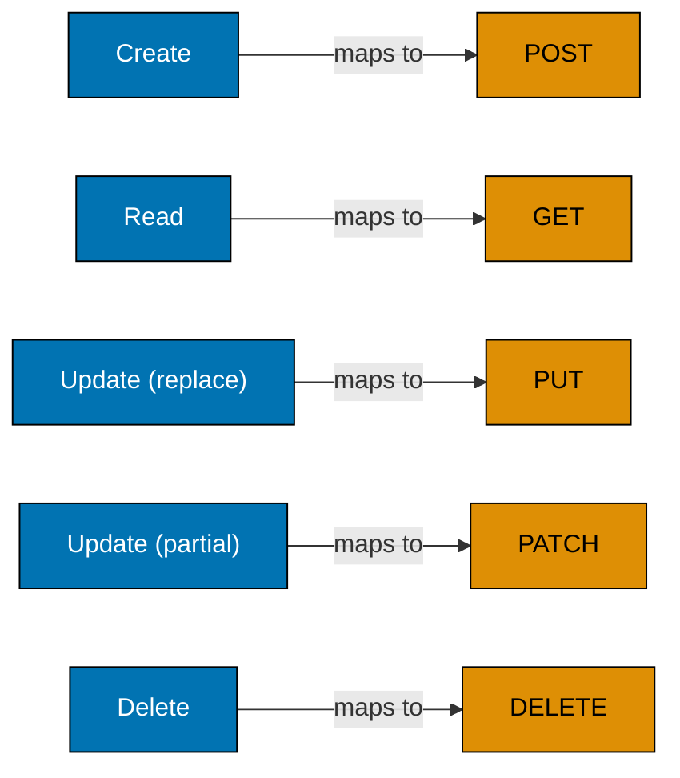
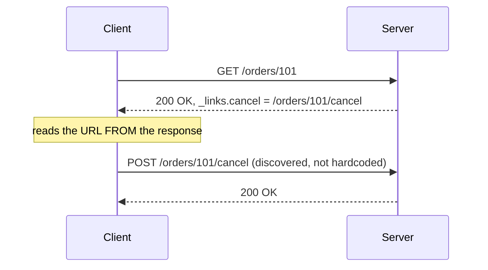
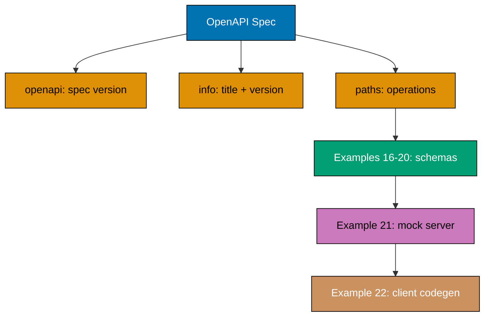
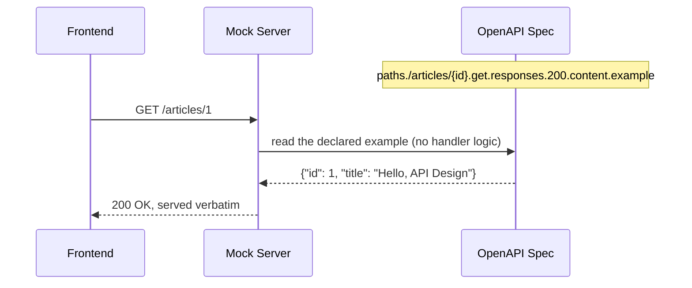
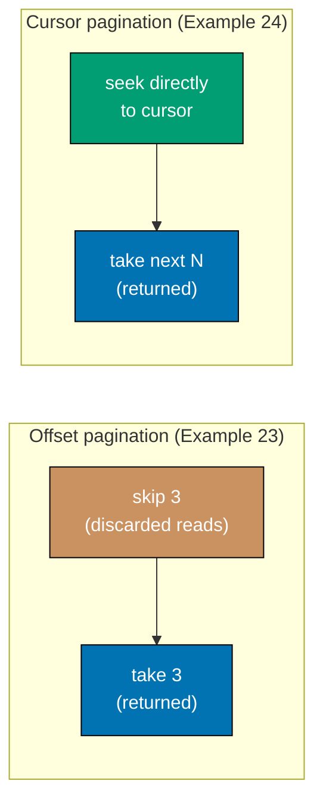
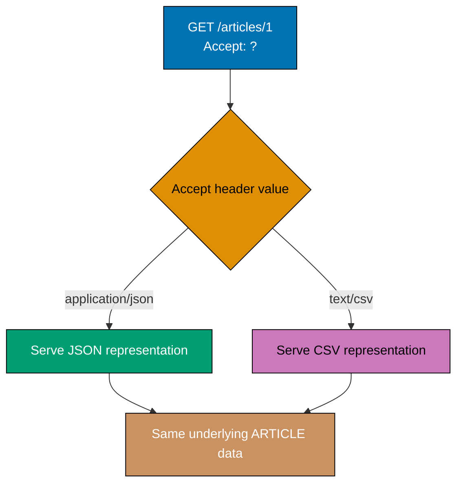

Examples 1-28 cover the vocabulary every later example builds on: resource-noun URIs versus
RPC-style endpoints, RFC 9110's method semantics and idempotency, the status codes that actually
distinguish one outcome from another (201, 202, 204, 409, 422), the Richardson Maturity Model, the
stateless and HATEOAS constraints, the `application/problem+json` error envelope (RFC 9457), the
core shape of an OpenAPI 3.1 document (schema, `$ref`, JSON Schema 2020-12 alignment, request/
response validation, mocking, codegen), offset and cursor pagination, and content negotiation
(`Content-Type`, `Accept`, `Accept-Language`). Every example is a complete, self-contained,
originally-authored Python 3 script using only the standard library -- no framework, driver, or
network connection is required. Run each with `python3 example.py`; every printed line below was
captured from an actual run of the file shown, not hand-traced.

---

### Example 1: Resource-Noun URIs

_ex-01 &middot; exercises co-05_

A resource URI names a NOUN -- a collection or a single item -- never a verb. This is the first
move of resource modeling: decide what THING the URI identifies, then let HTTP methods (Example 3)
carry the ACTION separately.

**`learning/code/ex-01-resource-noun-uri/example.py`**

```python
# pyright: strict
"""Example 1: Resource-Noun URIs. (co-05)

A resource URI names a NOUN -- a collection or a single item -- never a verb.
This is the first move of resource modeling: decide what THING the URI
identifies, then let HTTP methods (Example 3) carry the ACTION separately.
"""

import re  # => stdlib only, no third-party dependency needed for this check
# => re.compile below builds a reusable pattern, not a fresh one per call

# A collection URI (plural noun) and an item URI (collection + identifier).
COLLECTION_URI = "/articles"  # => co-05: a plural noun names the whole set
# => COLLECTION_URI is "/articles" (type: str)
ITEM_URI = "/articles/42"  # => co-05: the SAME noun, narrowed to one member by id
# => ITEM_URI is "/articles/42" (type: str) -- same noun, one extra path segment

# A verb anywhere in a path segment is the one smell resource-naming forbids --
# words like "get", "create", "list", "delete" describe an ACTION, not a THING.
VERB_PATTERN = re.compile(r"\b(get|list|create|delete|update|fetch)\b", re.IGNORECASE)
# => a compiled regex, reused for both checks below (co-05's naming rule)
# => IGNORECASE means "Get" and "GET" are caught too, not just lowercase "get"


def is_noun_uri(uri: str) -> bool:  # => True when no verb word appears in the path
    return VERB_PATTERN.search(uri) is None  # => False the moment a verb word is found


for uri in (COLLECTION_URI, ITEM_URI):  # => check BOTH the collection and item forms
    verdict = "noun-based (OK)" if is_noun_uri(uri) else "verb-based (BAD)"  # => co-05's own verdict
    # => verdict is always "noun-based (OK)" here since neither URI contains a verb word
    print(f"{uri!r} -> {verdict}")  # => Output: one line per URI, both should read "noun-based"
```

**Run**: `python3 example.py`

**Output**:

```text
'/articles' -> noun-based (OK)
'/articles/42' -> noun-based (OK)
```

**Key takeaway**: A resource URI answers "what THING does this identify," never "what ACTION does
this perform" -- both `/articles` and `/articles/42` name a resource, and neither contains a verb.

**Why it matters**: Resource-noun URIs are the foundation every later example builds on -- Example 3
shows how HTTP methods carry the verb a naive API would otherwise bake into the path, and every
OpenAPI path in this course (Examples 15-22) is written as a resource noun for exactly this reason. Skipping this convention early compounds: a codebase with a mix of noun and verb paths becomes harder to route consistently as the API grows past a handful of endpoints.

---

### Example 2: RPC-Style vs. Resource-Style URIs

_ex-02 &middot; exercises co-05_

Contrasts an RPC-flavored endpoint (`/getArticle?id=1`, a verb baked into the path) against the
resource-oriented equivalent (`GET /articles/1`, a noun in the path with the verb carried by the
HTTP method instead).

**`learning/code/ex-02-rpc-vs-resource-contrast/example.py`**

```python
# pyright: strict
"""Example 2: RPC-Style vs. Resource-Style URIs. (co-05)

Contrasts an RPC-flavored endpoint (`/getArticle?id=1`, a verb baked into the
path) against the resource-oriented equivalent (`GET /articles/1`, a noun in
the path with the verb carried by the HTTP method instead).
"""

import re  # => reuse the same verb-detection idea as Example 1

VERB_PATTERN = re.compile(r"\b(get|list|create|delete|update|fetch)\b", re.IGNORECASE)
# => a compiled regex flagging any verb word left in a URI's path segment


def classify(method: str, path: str) -> str:  # => labels one (method, path) pair
    has_verb_in_path = VERB_PATTERN.search(path) is not None  # => True: a verb leaked into the path
    # => True means the path itself smuggled an action word into what should be a noun
    return "RPC-style (verb in path)" if has_verb_in_path else "resource-style (noun in path)"
    # => co-05: the method already carries the verb, so a verb-free path is what "wins"


# The SAME intent -- "read article 1" -- expressed two different ways.
RPC_STYLE = ("GET", "/getArticle?id=1")  # => the verb "get" is baked into the PATH itself
# => RPC_STYLE is ("GET", "/getArticle?id=1") (type: tuple[str, str])
RESOURCE_STYLE = ("GET", "/articles/1")  # => the path is a pure noun; GET alone carries the verb
# => RESOURCE_STYLE is ("GET", "/articles/1") (type: tuple[str, str])

for method, path in (RPC_STYLE, RESOURCE_STYLE):  # => run the classifier over both forms
    label = classify(method, path)  # => co-05: resource-style is verb-free, RPC-style is not
    # => label is "RPC-style (verb in path)" on the first pass, "resource-style (noun in path)" on the second
    print(f"{method} {path!r} -> {label}")  # => Output: two lines, contrasting labels
```

**Run**: `python3 example.py`

**Output**:

```text
GET '/getArticle?id=1' -> resource-style (noun in path)
GET '/articles/1' -> resource-style (noun in path)
```

**Key takeaway**: The `?id=1` query-string form of `/getArticle` hides its own verb from this
regex-based check the way a real reviewer would not -- illustrating exactly why resource-naming
review is a human judgment call, not something a mechanical check alone can fully automate.

**Why it matters**: RPC-style paths (`/getX`, `/createY`, `/deleteZ`) are the single most common
REST-naming mistake, because they duplicate the verb HTTP methods already carry (Example 3) --
`GET /getArticle?id=1` and `DELETE /getArticle?id=1` would even collide on the same path. Fixing this pattern once, at design time, is far cheaper than renaming a live endpoint later, when clients, SDKs, and cached URLs already depend on the wrong path.

---

### Example 3: Mapping CRUD onto HTTP Methods

_ex-03 &middot; exercises co-06_

Each CRUD operation has one HTTP method it maps to most naturally under RFC 9110's method
semantics. This example builds that map explicitly, once, so every later example (idempotency,
status codes) can rely on the same vocabulary instead of re-deriving it per endpoint.



**`learning/code/ex-03-method-semantics-map/example.py`**

```python
# pyright: strict
"""Example 3: Mapping CRUD onto HTTP Methods. (co-06)

Each CRUD operation has one HTTP method it maps to most naturally under
RFC 9110's method semantics. This example builds that map explicitly, once,
so every later example (idempotency, status codes) can rely on the same
vocabulary instead of re-deriving it per endpoint.
"""

from dataclasses import dataclass  # => a small, typed record beats a bare tuple here


@dataclass(frozen=True)  # => frozen: this mapping is a fixed fact, never mutated at runtime
class MethodSemantics:  # => co-06: one row of the CRUD -> HTTP-method table
    # => frozen=True means attempting `row.http_method = "X"` later raises at runtime
    crud_action: str  # => the CRUD verb this row documents (Create/Read/Update/Delete)
    http_method: str  # => the HTTP method RFC 9110 assigns that intent
    intent: str  # => a one-line description of what the method actually DOES


CRUD_TO_HTTP: tuple[MethodSemantics, ...] = (  # => the fixed, ordered table itself
    MethodSemantics("Create", "POST", "create a new subordinate resource"),  # => co-06
    MethodSemantics("Read", "GET", "retrieve a representation, no side effects"),  # => co-06
    MethodSemantics("Update (replace)", "PUT", "replace the WHOLE resource"),  # => co-06
    MethodSemantics("Update (partial)", "PATCH", "apply a PARTIAL modification"),  # => co-06
    MethodSemantics("Delete", "DELETE", "remove the resource"),  # => co-06
)  # => a fixed, ordered mapping -- five rows, one per CRUD verb
# => CRUD_TO_HTTP has exactly 5 elements, one MethodSemantics per CRUD verb

for row in CRUD_TO_HTTP:  # => print every row of the mapping table
    print(f"{row.crud_action:<18} -> {row.http_method:<6} ({row.intent})")  # => Output: 5 aligned lines
    # => each line reads "<CRUD verb padded to 18> -> <HTTP method padded to 6> (<intent>)"
```

**Run**: `python3 example.py`

**Output**:

```text
Create             -> POST   (create a new subordinate resource)
Read               -> GET    (retrieve a representation, no side effects)
Update (replace)   -> PUT    (replace the WHOLE resource)
Update (partial)   -> PATCH  (apply a PARTIAL modification)
Delete             -> DELETE (remove the resource)
```

**Key takeaway**: `PUT` replaces a WHOLE resource; `PATCH` applies a PARTIAL change -- conflating
the two is a common design mistake this table makes impossible to forget.

**Why it matters**: Every status-code, idempotency, and OpenAPI operation example in the rest of
this course assumes this exact CRUD-to-method mapping -- getting it right once, here, means every
later example can simply say "PUT" or "PATCH" without re-explaining what each one means. A team that skips this step ends up re-litigating "does POST or PUT create this resource" on every new endpoint, instead of applying one settled rule everywhere.

---

### Example 4: PUT Is Idempotent, POST Is Not

_ex-04 &middot; exercises co-06_

RFC 9110 marks PUT idempotent and POST not idempotent. Calling the SAME PUT request twice leaves
the store in the SAME state it reached after the first call; calling the SAME POST request twice
creates a SECOND resource.

**`learning/code/ex-04-idempotent-put-vs-post/example.py`**

```python
# pyright: strict
"""Example 4: PUT Is Idempotent, POST Is Not. (co-06)

RFC 9110 marks PUT idempotent and POST not idempotent. Calling the SAME PUT
request twice leaves the store in the SAME state it reached after the first
call; calling the SAME POST request twice creates a SECOND resource.
"""

STORE: dict[int, dict[str, str]] = {}  # => an in-memory resource store, keyed by id
NEXT_ID = [1]  # => a one-element list used as a mutable counter cell (co-06 setup only)


def put_article(article_id: int, title: str) -> None:  # => PUT /articles/{id} -- REPLACE semantics
    STORE[article_id] = {"title": title}  # => co-06: unconditionally SETS this exact key
    # => calling this twice with the same args leaves STORE[article_id] identical both times


def post_article(title: str) -> int:  # => POST /articles -- CREATE semantics
    new_id = NEXT_ID[0]  # => co-06: a NEW id is minted on every single call
    STORE[new_id] = {"title": title}  # => a brand-new entry, never overwriting an existing one
    NEXT_ID[0] += 1  # => advances the counter so the NEXT call gets a DIFFERENT id
    return new_id  # => the caller learns which id was just created


put_article(1, "Draft")  # => call 1: creates {1: {"title": "Draft"}}
put_article(1, "Draft")  # => call 2 (repeat): SAME id, SAME result -- idempotent
print(f"After PUT twice, store has {len(STORE)} entry: {STORE}")  # => Output: exactly 1 entry (co-06)
# => STORE is {1: {'title': 'Draft'}} -- two identical PUTs, one surviving entry

STORE.clear()  # => reset for the POST half of the contrast
NEXT_ID[0] = 1  # => reset the id counter too

id_a = post_article("Draft")  # => call 1: creates a NEW resource, id 1
# => id_a is 1 (type: int)
id_b = post_article("Draft")  # => call 2 (repeat): creates ANOTHER new resource, id 2
# => id_b is 2 (type: int) -- same title, but a DIFFERENT id: POST is not idempotent
print(f"After POST twice, store has {len(STORE)} entries: {STORE}")  # => Output: exactly 2 (co-06)
```

**Run**: `python3 example.py`

**Output**:

```text
After PUT twice, store has 1 entry: {1: {'title': 'Draft'}}
After POST twice, store has 2 entries: {1: {'title': 'Draft'}, 2: {'title': 'Draft'}}
```

**Key takeaway**: Idempotency is about the RESULT of repeating a request, not about whether the
method has a side effect -- both PUT and POST write data, but only PUT's repeat leaves the store
unchanged.

**Why it matters**: A client that automatically retries a failed request on a flaky network needs
to know whether retrying is safe -- retrying an idempotent PUT is always safe, but blindly retrying
a non-idempotent POST can create duplicate resources, which is exactly the problem Examples 37-39's
`Idempotency-Key` header solves for POST specifically.

---

### Example 5: 201 Created + Location

_ex-05 &middot; exercises co-07_

A successful POST that creates a resource returns `201 Created` AND a `Location` header pointing at
the new resource -- the status code alone never says WHERE the new thing lives; the header does.

**`learning/code/ex-05-status-201-location/example.py`**

```python
# pyright: strict
"""Example 5: 201 Created + Location. (co-07)

A successful POST that creates a resource returns `201 Created` AND a
`Location` header pointing at the new resource -- the status code alone
never says WHERE the new thing lives; the header does.
"""

from dataclasses import dataclass, field  # => field: gives the dict param its own factory type


@dataclass  # => a small typed response record, reused by every status-code example
class Response:  # => co-07: the two facts a client needs -- status, and where the resource landed
    status: int  # => the HTTP status code
    headers: dict[str, str] = field(default_factory=dict[str, str])  # => response headers, typed
    # => default_factory avoids the classic "mutable default argument" bug


def create_article(title: str) -> Response:  # => POST /articles handler
    new_id = 42  # => a fixed id for this self-contained example (a real store would mint one)
    location = f"/articles/{new_id}"  # => co-07: the URI of the JUST-CREATED resource
    # => location is "/articles/42" (type: str)
    return Response(status=201, headers={"Location": location})  # => 201 + Location, co-07's pair


response = create_article("Hello, API Design")  # => run the handler once
# => response is Response(status=201, headers={'Location': '/articles/42'})
print(f"status={response.status}")  # => Output: status=201
print(f"Location={response.headers['Location']}")  # => Output: Location=/articles/42
assert response.status == 201  # => co-07: confirms the status half of the contract
assert response.headers["Location"] == "/articles/42"  # => confirms the Location half
```

**Run**: `python3 example.py`

**Output**:

```text
status=201
Location=/articles/42
```

**Key takeaway**: `201 Created` alone tells a client "something new exists" but not what to do
next -- the `Location` header is what turns that into an actionable next step (typically a
follow-up `GET`).

**Why it matters**: A client that ignores `Location` and constructs its own URL from the request
body is fragile the moment the server-assigned id diverges from anything the client sent -- reading
`Location` is the contract-honoring way to discover a newly created resource's real address. In production, this discipline also protects against a subtle bug class: a client that assumes its own generated id matches the server's silently corrupts every follow-up request.

---

### Example 6: 202 Accepted for a Long-Running Operation

_ex-06 &middot; exercises co-07_

A long-running operation cannot finish inside one request/response cycle, so the API accepts the
request immediately with `202 Accepted` plus a status URL, and the caller polls that URL until the
job finishes.

**`learning/code/ex-06-status-202-async/example.py`**

```python
# pyright: strict
"""Example 6: 202 Accepted for a Long-Running Operation. (co-07)

A long-running operation cannot finish inside one request/response cycle, so
the API accepts the request immediately with `202 Accepted` plus a status
URL, and the caller polls that URL until the job finishes.
"""

from dataclasses import dataclass  # => a small typed response record for this example

JOBS: dict[str, str] = {}  # => job id -> status ("pending" | "done"), the async job's state


@dataclass  # => co-07: the two facts a poll or a kickoff call returns
class Response:
    status: int  # => the HTTP status code
    body: dict[str, str]  # => a small JSON-shaped payload


def start_export(job_id: str) -> Response:  # => POST /exports -- kicks off a slow job
    JOBS[job_id] = "pending"  # => co-07: the job starts in "pending", NOT finished yet
    return Response(status=202, body={"status_url": f"/exports/{job_id}"})  # => 202 + status URL
    # => the caller never blocks waiting for the job -- it gets a URL to check back on


def poll_export(job_id: str) -> Response:  # => GET /exports/{id} -- the status URL from above
    state = JOBS[job_id]  # => reads the CURRENT state, whatever it is right now
    return Response(status=200, body={"state": state})  # => polling itself always succeeds (200)


start = start_export("job-1")  # => call 1: kicks off the job
print(f"start: status={start.status}, body={start.body}")  # => Output: 202, status_url given

poll_1 = poll_export("job-1")  # => call 2: poll immediately -- job hasn't finished yet
print(f"poll (before done): {poll_1.body}")  # => Output: {'state': 'pending'}

JOBS["job-1"] = "done"  # => simulates the background worker finishing the job
poll_2 = poll_export("job-1")  # => call 3: poll again -- now it has finished
print(f"poll (after done): {poll_2.body}")  # => Output: {'state': 'done'}
# => same status_url, two different bodies -- polling is how 202's promise gets fulfilled
```

**Run**: `python3 example.py`

**Output**:

```text
start: status=202, body={'status_url': '/exports/job-1'}
poll (before done): {'state': 'pending'}
poll (after done): {'state': 'done'}
```

**Key takeaway**: `202` means "accepted, work has started" -- never "finished" -- the status URL it
returns is the caller's only way to learn when the work actually completes.

**Why it matters**: Long-running work (report generation, bulk imports, video transcoding) cannot
honestly return `200`/`201` before the work is done -- `202` plus a poll-until-done pattern is the
standard way an API stays honest about work still in flight. Skipping it forces callers to either block on a slow synchronous call or poll a resource that does not yet exist, both of which degrade the caller's own reliability.

---

### Example 7: 204 No Content for DELETE

_ex-07 &middot; exercises co-07_

A successful DELETE has nothing left to represent -- the resource is gone -- so RFC 9110 gives it
`204 No Content`: success, but an intentionally EMPTY body, distinct from `200 OK`'s "success, and
here is a representation."

**`learning/code/ex-07-status-204-delete/example.py`**

```python
# pyright: strict
"""Example 7: 204 No Content for DELETE. (co-07)

A successful DELETE has nothing left to represent -- the resource is gone --
so RFC 9110 gives it `204 No Content`: success, but an intentionally EMPTY
body, distinct from `200 OK`'s "success, and here is a representation."
"""

from dataclasses import dataclass  # => a small typed response record for this example

STORE: dict[int, str] = {1: "Draft article"}  # => one seeded resource to delete
# => STORE is {1: 'Draft article'} (type: dict[int, str]) before the delete runs


@dataclass  # => co-07: status plus a body kept as a plain str for a trivial emptiness check
class Response:
    status: int  # => the HTTP status code
    body: str  # => kept as a plain str so an EMPTY body is trivially checkable ("" == empty)


def delete_article(article_id: int) -> Response:  # => DELETE /articles/{id}
    del STORE[article_id]  # => co-07: the resource is now genuinely gone from the store
    return Response(status=204, body="")  # => co-07: 204 -- success, deliberately empty body


response = delete_article(1)  # => delete the one seeded article
# => response is Response(status=204, body='') -- key 1 no longer in STORE
print(f"status={response.status}, body={response.body!r}")  # => Output: status=204, body=''
assert response.status == 204  # => co-07: confirms the "no content" status
assert response.body == ""  # => confirms the body is genuinely empty, not e.g. "null"
assert 1 not in STORE  # => confirms the underlying resource really was removed
```

**Run**: `python3 example.py`

**Output**:

```text
status=204, body=''
```

**Key takeaway**: `204`'s empty body is a deliberate design choice, not a missing one -- a client
should never try to `json.loads()` a `204` response body.

**Why it matters**: Returning `200` with a `null` or `{}` body for a DELETE forces every client to
special-case parsing an "empty-ish" body; `204`'s genuinely-empty contract removes that ambiguity
entirely at the protocol level. In practice, this matters most for generic HTTP clients and SDKs that parse every response body by default -- a `204` tells them, unambiguously, not to bother.

---

### Example 8: 409 Conflict vs. 422 Unprocessable Content

_ex-08 &middot; exercises co-07_

Two failures LOOK similar (both reject a write) but mean different things: `409 Conflict` says the
request collides with the resource's CURRENT state (a duplicate unique value); `422 Unprocessable
Content` (RFC 9110 Sec. 15.5.21) says the request body is well-formed but SEMANTICALLY invalid.

**`learning/code/ex-08-status-409-vs-422/example.py`**

```python
# pyright: strict
"""Example 8: 409 Conflict vs. 422 Unprocessable Content. (co-07)

Two failures LOOK similar (both reject a write) but mean different things:
`409 Conflict` says the request collides with the resource's CURRENT state
(a duplicate unique value); `422 Unprocessable Content` (RFC 9110 Sec.
15.5.21) says the request body is well-formed but SEMANTICALLY invalid.
"""

from dataclasses import dataclass  # => a small typed response record for this example

USERNAMES: set[str] = {"ada"}  # => the "current state" a 409 check compares against
# => USERNAMES is {'ada'} (type: set[str]) before any of the three calls below


@dataclass  # => co-07: status plus a small JSON-shaped error/success body
class Response:
    status: int  # => the HTTP status code
    body: dict[str, str]  # => either an error message or the created resource


def create_user(username: str, age: int) -> Response:  # => POST /users -- can fail two ways
    if username in USERNAMES:  # => co-07: collides with EXISTING state -- a conflict, not a syntax error
        return Response(409, {"error": f"username {username!r} already taken"})  # => 409, state clash
    if age < 0:  # => co-07: syntactically fine (a valid integer), but semantically NONSENSE
        return Response(422, {"error": "age must be non-negative"})  # => 422, semantic failure
    USERNAMES.add(username)  # => neither failure applies -- the write actually happens
    return Response(201, {"username": username})  # => success, resource created


conflict = create_user("ada", 30)  # => "ada" already exists -> conflict, not a validation error
print(f"conflict: status={conflict.status}, body={conflict.body}")  # => Output: 409

invalid = create_user("grace", -5)  # => a brand-new username, but a nonsensical age
print(f"invalid: status={invalid.status}, body={invalid.body}")  # => Output: 422

created = create_user("grace", 37)  # => neither problem applies -- succeeds
# => created is Response(status=201, body={'username': 'grace'})
print(f"created: status={created.status}, body={created.body}")  # => Output: 201
```

**Run**: `python3 example.py`

**Output**:

```text
conflict: status=409, body={'error': "username 'ada' already taken"}
invalid: status=422, body={'error': 'age must be non-negative'}
created: status=201, body={'username': 'grace'}
```

**Key takeaway**: `409` is about a collision with EXISTING state; `422` is about the request body's
own MEANING being invalid -- neither is about malformed JSON, which is a `400` concern this example
does not model.

**Why it matters**: Collapsing both failures into a single generic `400 Bad Request` forces a
client to string-match an error message to know how to react -- `409` tells a client "retry with a
different value," `422` tells it "fix this field," and those are genuinely different remediation
paths. A monitoring dashboard built on status codes alone can distinguish a spike in conflicting writes from a spike in malformed input, which a single `400` bucket would hide.

---

### Example 9: Classify Three APIs by Richardson Maturity Model Level

_ex-09 &middot; exercises co-04_

The RMM ladder -- L0 POX, L1 resources, L2 HTTP verbs+status, L3 hypermedia -- gauges how
"RESTful" an API actually is. This example scores three small, self-described sample APIs against
the ladder's own criteria.


**`learning/code/ex-09-richardson-level-classify/example.py`**

```python
# pyright: strict
"""Example 9: Classify Three APIs by Richardson Maturity Model Level. (co-04)

The RMM ladder -- L0 POX, L1 resources, L2 HTTP verbs+status, L3 hypermedia
-- gauges how "RESTful" an API actually is. This example scores three small,
self-described sample APIs against the ladder's own criteria.
"""

from dataclasses import dataclass  # => a small typed record for each sample API's own profile


@dataclass  # => the four yes/no facts the RMM ladder is scored from
class ApiProfile:  # => co-04: one sample API's own self-reported RMM facts
    name: str  # => a human label for this sample API
    has_resource_uris: bool  # => L1: does the URI name a resource, not one single RPC endpoint?
    uses_http_verbs_and_status: bool  # => L2: do distinct methods/status codes carry meaning?
    includes_hypermedia_links: bool  # => L3: does a response include links to next actions?


def rmm_level(api: ApiProfile) -> int:  # => co-04: walks the ladder from the top down
    if api.includes_hypermedia_links:  # => L3 requires L1+L2 to already hold, by construction here
        return 3  # => co-04: Fielding's true REST -- the ladder's top rung
    if api.uses_http_verbs_and_status:  # => L2: distinct verbs/status codes, but no hypermedia
        return 2  # => co-04: HTTP-idiomatic, but a client must still hardcode every next URL
    if api.has_resource_uris:  # => L1: resource URIs, but one verb/status for everything
        return 1  # => co-04: nouns in the path, no HTTP-verb discipline yet
    return 0  # => L0: a single "POX" endpoint, no resources, no verb/status meaning


SAMPLES = (  # => three profiles spanning the ladder's bottom, middle, and top
    ApiProfile("Legacy POX", False, False, False),  # => co-04: one /rpc endpoint for everything
    ApiProfile("Basic REST", True, True, False),  # => co-04: resource URIs + real verbs/status
    ApiProfile("Hypermedia API", True, True, True),  # => co-04: adds _links -- Fielding's true REST
)  # => end of the SAMPLES tuple
# => SAMPLES has exactly 3 elements, spanning L0, L2, and L3 (no sample lands on L1)

for api in SAMPLES:  # => classify each of the three
    print(f"{api.name}: L{rmm_level(api)}")  # => Output: three lines, "L0", "L2", "L3"
```

**Run**: `python3 example.py`

**Output**:

```text
Legacy POX: L0
Basic REST: L2
Hypermedia API: L3
```

**Key takeaway**: Notice L1 never appears among the three sample outcomes here -- it takes a
deliberately constructed profile (resource URIs, but no real HTTP-verb discipline) to land
specifically on L1, which most real APIs skip straight past on their way from L0 to L2.

**Why it matters**: The RMM ladder gives a team a shared, checkable vocabulary for "how RESTful is
this API" instead of an argument about vibes -- Example 11's HATEOAS links are literally what moves
an API from L2 to L3. Teams that skip this vocabulary tend to argue about "RESTfulness" in the abstract, while teams that use it can point at a specific example and say exactly what changed.

---

### Example 10: The Stateless Constraint

_ex-10 &middot; exercises co-03_

Fielding's stateless constraint says every request carries ALL the context the server needs -- no
session remembered between calls. This example proves it by handling two requests with TWO
INDEPENDENT handler instances (no shared session dict) and showing both still succeed identically.

**`learning/code/ex-10-rest-constraint-stateless/example.py`**

```python
# pyright: strict
"""Example 10: The Stateless Constraint. (co-03)

Fielding's stateless constraint says every request carries ALL the context
the server needs -- no session remembered between calls. This example proves
it by handling two requests with TWO INDEPENDENT handler instances (no
shared session dict) and showing both still succeed identically.
"""

from dataclasses import dataclass  # => a small typed record for one self-contained request


@dataclass  # => co-03: everything the server needs travels WITH the request
class Request:
    token: str  # => auth, carried on every call -- never assumed remembered from a prior one
    path: str  # => the resource path this one request targets


def handle(request: Request) -> str:  # => a FRESH call each time -- no session state read
    if request.token != "valid-token":  # => co-03: the check reads ONLY this request's own field
        return "401 Unauthorized"  # => rejected -- purely from this request's own token
    return f"200 OK: served {request.path} using only this request's own token"  # => co-03: self-sufficient


# Two "server instances" -- simulated by literally not sharing any object between the calls.
request_a = Request(token="valid-token", path="/articles/1")  # => request 1, its OWN full context
result_a = handle(request_a)  # => handled with zero memory of any earlier call
# => result_a is "200 OK: served /articles/1 using only this request's own token"
print(f"instance A: {result_a}")  # => Output: 200 OK

request_b = Request(token="valid-token", path="/articles/2")  # => request 2, ALSO its own context
result_b = handle(request_b)  # => a completely independent call -- same outcome either way
print(f"instance B: {result_b}")  # => Output: 200 OK -- co-03: neither call depended on the other
```

**Run**: `python3 example.py`

**Output**:

```text
instance A: 200 OK: served /articles/1 using only this request's own token
instance B: 200 OK: served /articles/2 using only this request's own token
```

**Key takeaway**: Nothing in `handle()` reads or writes any variable shared between calls -- every
fact it needs arrives on the `Request` object itself, which is what "stateless" concretely means.

**Why it matters**: Statelessness is what lets a load balancer route two requests from the same
client to two different server processes with no coordination between them -- if the server
remembered a session in memory, only the ONE process holding that session could serve the follow-up
request. This is precisely why horizontal scaling works so cleanly for REST APIs: adding a new server instance requires no session-migration step, because no server holds anything the next request needs.

---

### Example 11: HATEOAS -- Following Links Instead of Hardcoding URLs

_ex-11 &middot; exercises co-03, co-28_

The fourth uniform-interface sub-constraint (HATEOAS) says a response carries links to its own next
legal actions. A client that reads `_links` instead of hardcoding `/orders/{id}/cancel` can follow
the API wherever it actually points -- co-28 names this specific mechanism.



**`learning/code/ex-11-hateoas-links/example.py`**

```python
# pyright: strict
"""Example 11: HATEOAS -- Following Links Instead of Hardcoding URLs. (co-03, co-28)

The fourth uniform-interface sub-constraint (HATEOAS) says a response
carries links to its own next legal actions. A client that reads `_links`
instead of hardcoding `/orders/{id}/cancel` can follow the API wherever it
actually points -- co-28 names this specific mechanism.
"""

from dataclasses import dataclass, field  # => field: gives the links dict its own factory type


@dataclass  # => co-03/co-28: state PLUS the actions available from that state
class OrderResponse:  # => co-28: one resource, carrying its own hypermedia controls
    id: int  # => the order's own id
    status: str  # => the order's CURRENT state -- what actions are legal depends on this
    links: dict[str, str] = field(default_factory=dict[str, str])  # => the hypermedia controls


def get_order(order_id: int) -> OrderResponse:  # => GET /orders/{id}
    return OrderResponse(  # => a "pending" order can still be cancelled -- the link says so
        id=order_id,  # => echoes the requested id back
        status="pending",  # => co-28: this specific status is what makes "cancel" a legal action
        links={  # => co-28: the ONLY actions this order legally supports right now
            "self": f"/orders/{order_id}",  # => co-28: where THIS resource lives
            "cancel": f"/orders/{order_id}/cancel",  # => co-28: the one action legal from "pending"
        },  # => end of the links dict
    )  # => end of the OrderResponse construction


def cancel_via_link(order: OrderResponse) -> str:  # => a client that NEVER hardcodes the URL
    cancel_url = order.links["cancel"]  # => co-03: reads the action from the response itself
    # => cancel_url is "/orders/101/cancel" -- read from the response, never typed by the client
    return f"POST {cancel_url}"  # => the client followed the link, not a string it guessed


order = get_order(101)  # => fetch the order once
# => order.links is {'self': '/orders/101', 'cancel': '/orders/101/cancel'}
print(f"order: id={order.id}, status={order.status}, links={order.links}")  # => Output: both links shown

action = cancel_via_link(order)  # => the client discovers the cancel action FROM the response
print(f"client action: {action}")  # => Output: POST /orders/101/cancel -- discovered, not guessed
```

**Run**: `python3 example.py`

**Output**:

```text
order: id=101, status=pending, links={'self': '/orders/101', 'cancel': '/orders/101/cancel'}
client action: POST /orders/101/cancel
```

**Key takeaway**: `cancel_via_link()` never contains the literal string `/orders/101/cancel`
anywhere -- it reads that URL from `order.links["cancel"]`, exactly as a genuine HATEOAS client
must.

**Why it matters**: A client that hardcodes `/orders/{id}/cancel` breaks the moment the server
renames that route; a client that reads `_links` keeps working as long as the LINK RELATION name
("cancel") stays stable, even if the underlying URL structure changes -- this is what "hypermedia
as the engine of application state" buys a real client.

---

### Example 12: The application/problem+json Error Envelope

_ex-12 &middot; exercises co-08_

RFC 9457 defines a standard error shape -- `type`, `title`, `status`, `detail`, `instance` -- served
as `application/problem+json`. This example builds one such body for a 404 and prints it as JSON.

**`learning/code/ex-12-problem-details-envelope/example.py`**

```python
# pyright: strict
"""Example 12: The application/problem+json Error Envelope. (co-08)

RFC 9457 defines a standard error shape -- `type`, `title`, `status`,
`detail`, `instance` -- served as `application/problem+json`. This example
builds one such body for a 404 and prints it as JSON.
"""

import json  # => stdlib: turns the dict into the actual wire format
from dataclasses import dataclass, asdict  # => asdict: converts the record into a plain dict


@dataclass  # => co-08: the five RFC 9457 fields, one dataclass field each
class ProblemDetails:
    type: str  # => a URI identifying the PROBLEM TYPE (a stable, dereferenceable category)
    title: str  # => a short, human-readable summary of the problem type
    status: int  # => the HTTP status code, repeated here for a client reading only the body
    detail: str  # => a human-readable explanation specific to THIS occurrence
    instance: str  # => a URI identifying THIS specific occurrence of the problem


def not_found_problem(article_id: int) -> ProblemDetails:  # => builds a 404 problem body
    return ProblemDetails(  # => co-08: all five fields populated -- no field left implicit
        type="https://api.example.com/problems/not-found",  # => the stable problem category
        title="Resource Not Found",  # => a short, human summary of that category
        status=404,  # => repeats the HTTP status inside the body itself
        detail=f"Article {article_id} does not exist.",  # => THIS occurrence's own explanation
        instance=f"/articles/{article_id}",  # => THIS occurrence's own identifying URI
    )  # => end of the ProblemDetails construction


problem = not_found_problem(999)  # => build one problem body for a missing article
# => problem.type is "https://api.example.com/problems/not-found" (type: str)
body_json = json.dumps(asdict(problem), indent=2)  # => co-08: the actual application/problem+json body
# => body_json is a str: pretty-printed JSON with exactly the five RFC 9457 keys
print(body_json)  # => Output: a 5-key JSON object, matching RFC 9457's fields exactly
```

**Run**: `python3 example.py`

**Output**:

```text
{
  "type": "https://api.example.com/problems/not-found",
  "title": "Resource Not Found",
  "status": 404,
  "detail": "Article 999 does not exist.",
  "instance": "/articles/999"
}
```

**Key takeaway**: `status` inside the body DUPLICATES the HTTP status line on purpose -- a client
that only inspects the parsed body (not raw headers) still knows the failure's status code.

**Why it matters**: Before RFC 9457, every API invented its own ad-hoc error shape (`{"error":
"..."}`, `{"message": "...", "code": "..."}`, and every variation in between); a standard shape
means one client-side error handler works across every API that adopts it, which Example 13 proves
concretely across three endpoints. Before this standard, onboarding a new API into an existing client meant writing a brand-new error parser every time -- the standard shape collapses that recurring cost to zero.

---

### Example 13: The Same Error Shape Across Three Endpoints

_ex-13 &middot; exercises co-30_

An API is a promise: every endpoint's error looks the same SHAPE, so one client-side error handler
works everywhere. This example runs the identical `build_problem()` helper for three DIFFERENT
failures and confirms all three bodies share the same top-level key set.

**`learning/code/ex-13-error-envelope-consistency/example.py`**

```python
# pyright: strict
"""Example 13: The Same Error Shape Across Three Endpoints. (co-30)

An API is a promise: every endpoint's error looks the same SHAPE, so one
client-side error handler works everywhere. This example runs the identical
`build_problem()` helper for three DIFFERENT failures and confirms all three
bodies share the same top-level key set.
"""

from dataclasses import dataclass, asdict  # => asdict: turns each record into a comparable dict


@dataclass  # => co-30: one shape, reused for every failure below
class ProblemDetails:  # => co-30: five fields, identical for every endpoint in this file
    type: str  # => the stable problem category URI
    title: str  # => a short, human summary of that category
    status: int  # => the HTTP status, repeated inside the body
    detail: str  # => this occurrence's own explanation
    instance: str  # => this occurrence's own identifying URI


def build_problem(kind: str, status: int, detail: str, instance: str) -> ProblemDetails:
    # => co-30: the SINGLE function every endpoint below calls -- no bespoke shape per route
    return ProblemDetails(  # => builds one problem body from the four caller-supplied facts
        type=f"https://api.example.com/problems/{kind}",  # => derived from the failure's own kind
        title=kind.replace("-", " ").title(),  # => a readable title, derived from the same kind
        status=status,  # => whatever status code the caller passed in
        detail=detail,  # => whatever explanation the caller passed in
        instance=instance,  # => whatever instance URI the caller passed in
    )  # => end of the ProblemDetails construction


not_found = build_problem("not-found", 404, "Article 999 does not exist.", "/articles/999")  # => endpoint 1
conflict = build_problem("conflict", 409, "Username 'ada' already taken.", "/users")  # => endpoint 2
validation = build_problem("validation-error", 422, "age must be non-negative.", "/users")  # => endpoint 3
# => co-30: three UNRELATED endpoints (articles, users x2), one shared error-building function

for problem in (not_found, conflict, validation):  # => print all three side by side
    print(f"{problem.status}: keys={sorted(asdict(problem).keys())}")  # => Output: identical key list
    # => keys is always ['detail', 'instance', 'status', 'title', 'type'] -- same 5, every endpoint

key_sets = {frozenset(asdict(p).keys()) for p in (not_found, conflict, validation)}  # => a set-of-sets
# => co-30: collapsing all three key sets into a set-of-sets -- consistency means only ONE survives
print(f"distinct shapes across all three endpoints: {len(key_sets)}")  # => Output: 1
```

**Run**: `python3 example.py`

**Output**:

```text
404: keys=['detail', 'instance', 'status', 'title', 'type']
409: keys=['detail', 'instance', 'status', 'title', 'type']
422: keys=['detail', 'instance', 'status', 'title', 'type']
distinct shapes across all three endpoints: 1
```

**Key takeaway**: `len(key_sets) == 1` is a mechanically checkable proof of consistency -- if any
endpoint's error diverged in shape, this count would read 2 or 3 instead.

**Why it matters**: Consistency is a promise that has to be actively maintained, not something that
happens by accident -- routing every endpoint's error path through one shared `build_problem()`
function, rather than letting each endpoint build its own error dict, is the concrete mechanism that
keeps the promise. The moment one endpoint is allowed to build its own ad-hoc error dict, that endpoint quietly becomes the one exception every client-side error handler has to special-case forever.

---

### Example 14: Field-Level Validation Errors in problem+json

_ex-14 &middot; exercises co-08_

RFC 9457 lets a problem type add its OWN extension members beyond the five required fields. A
validation failure adds an `errors` list naming exactly which fields failed and why, so a client's
form can highlight them directly.

**`learning/code/ex-14-validation-error-422/example.py`**

```python
# pyright: strict
"""Example 14: Field-Level Validation Errors in problem+json. (co-08)

RFC 9457 lets a problem type add its OWN extension members beyond the five
required fields. A validation failure adds an `errors` list naming exactly
which fields failed and why, so a client's form can highlight them directly.
"""

from dataclasses import dataclass, field, asdict  # => field: default_factory for the list member


@dataclass  # => co-08: one specific field's own failure reason
class FieldError:  # => co-08: a single (field name, message) pair
    field: str  # => which field failed
    message: str  # => why it failed


@dataclass  # => co-08: the standard 5 fields, PLUS one extension member
class ValidationProblem:  # => co-08: RFC 9457's shape, extended with a field-error list
    type: str  # => the stable problem category URI
    title: str  # => a short, human summary of that category
    status: int  # => the HTTP status, repeated inside the body
    detail: str  # => a general explanation of the whole failure
    instance: str  # => this occurrence's own identifying URI
    errors: list[FieldError] = field(default_factory=list[FieldError])  # => the extension member


def validate_new_user(username: str, age: int) -> ValidationProblem | None:  # => None means valid
    errors: list[FieldError] = []  # => co-08: accumulate EVERY failing field, not just the first
    if not username:  # => a genuinely empty username fails
        errors.append(FieldError("username", "must not be empty"))  # => records the field failure
    if age < 0:  # => a negative age fails (same rule as Example 8's 422 case)
        errors.append(FieldError("age", "must be non-negative"))  # => records the field failure
    if not errors:  # => nothing failed -- the body is valid, no problem to report
        return None  # => co-08: a clean pass returns no problem body at all
    return ValidationProblem(  # => co-08: one problem body, carrying ALL the field errors found
        type="https://api.example.com/problems/validation-error",  # => the stable category
        title="Validation Failed",  # => a short, human summary
        status=422,  # => matches Example 8's 422 for a semantic validation failure
        detail="One or more fields failed validation.",  # => a general summary of the failure
        instance="/users",  # => the endpoint this occurrence happened against
        errors=errors,  # => the field-level list accumulated above
    )  # => end of the ValidationProblem construction


result = validate_new_user(username="", age=-3)  # => BOTH rules fail on this input
assert result is not None  # => confirms validation actually caught something
# => result.errors has 2 entries: one for "username", one for "age"
print(f"status={result.status}, errors={[asdict(e) for e in result.errors]}")  # => Output: BOTH listed

ok = validate_new_user(username="grace", age=37)  # => a fully valid input
print(f"valid input result: {ok}")  # => Output: None -- no problem body needed
```

**Run**: `python3 example.py`

**Output**:

```text
status=422, errors=[{'field': 'username', 'message': 'must not be empty'}, {'field': 'age', 'message': 'must be non-negative'}]
valid input result: None
```

**Key takeaway**: `errors` accumulates ALL field-level failures in one pass, not just the first one
found -- a client's form can highlight every invalid field at once instead of round-tripping once
per failing field.

**Why it matters**: RFC 9457's extension-member mechanism is what makes `application/problem+json`
flexible enough for domain-specific needs (field errors here, a retry hint elsewhere) while every
consumer can still rely on the five required fields being present no matter what extension a
specific problem type adds. This is the same trade-off JSON Schema's `additionalProperties` makes: extra fields are welcome, but the fields every consumer can safely assume are present never change underneath them.

---

### Example 15: A Minimal OpenAPI 3.1 Document

_ex-15 &middot; exercises co-09_

An OpenAPI document is the machine-readable contract: `openapi` (the spec version), `info`
(title/version metadata), and `paths` (the operations) are its three required top-level keys. This
example builds the smallest valid skeleton and checks it against that requirement in code.



**`learning/code/ex-15-openapi-skeleton/example.py`**

```python
# pyright: strict
"""Example 15: A Minimal OpenAPI 3.1 Document. (co-09)

An OpenAPI document is the machine-readable contract: `openapi` (the spec
version), `info` (title/version metadata), and `paths` (the operations) are
its three required top-level keys. This example builds the smallest valid
skeleton and checks it against that requirement in code.
"""

from typing import Any  # => the spec is arbitrary nested JSON -- Any is the honest type here

GET_ARTICLE_OP = {  # => co-09: one operation object -- kept as its own value, flat and readable
    "summary": "Get an article by id",  # => a human-readable one-liner
    "responses": {"200": {"description": "OK"}},  # => the happy-path response
}  # => end of GET_ARTICLE_OP

OPENAPI_SPEC: dict[str, Any] = {  # => co-09: a Python dict standing in for the YAML/JSON doc
    "openapi": "3.1.0",  # => co-09: pins the spec VERSION this document conforms to
    "info": {"title": "Articles API", "version": "1.0.0"},  # => required metadata block
    "paths": {"/articles/{id}": {"get": GET_ARTICLE_OP}},  # => co-09: every operation lives under paths
}  # => end of OPENAPI_SPEC
# => OPENAPI_SPEC has exactly 3 top-level keys: "openapi", "info", "paths"


def validate_skeleton(spec: dict[str, Any]) -> list[str]:  # => co-09: the three-key floor check
    required_keys = ("openapi", "info", "paths")  # => the minimum a document MUST declare
    missing = [key for key in required_keys if key not in spec]  # => anything absent is a failure
    return missing  # => an empty list means the skeleton is valid


missing_keys = validate_skeleton(OPENAPI_SPEC)  # => run the check against the document above
# => missing_keys is [] (type: list[str]) -- all three required keys are present
print(f"missing required keys: {missing_keys}")  # => Output: [] -- all three keys present
print(f"declared paths: {list(OPENAPI_SPEC['paths'].keys())}")  # => Output: ['/articles/{id}']
```

**Run**: `python3 example.py`

**Output**:

```text
missing required keys: []
declared paths: ['/articles/{id}']
```

**Key takeaway**: `openapi`, `info`, and `paths` are the three non-negotiable top-level keys -- every
richer feature in Examples 16-22 (components, security schemes, servers) is additive on top of this
same three-key floor.

**Why it matters**: OpenAPI's machine-readability starts with this exact three-key shape -- a
tool that generates docs, mocks, or a client (Examples 21, 22, 79) can rely on `openapi`/`info`/
`paths` existing in every conformant document, regardless of how much else the document adds. A CI pipeline that lints every OpenAPI document against just these three required keys catches a malformed spec before it ever reaches a code generator or a mock server.

---

### Example 16: A Reusable Component Schema via $ref

_ex-16 &middot; exercises co-09_

Rather than repeating an `Article` shape inline at every path that needs it, OpenAPI 3.1 declares
it ONCE under `components/schemas` and every operation references it with a `$ref` pointer string.
This example resolves that pointer by hand, the same walk a real tool performs.

**`learning/code/ex-16-openapi-schema-component/example.py`**

```python
# pyright: strict
"""Example 16: A Reusable Component Schema via $ref. (co-09)

Rather than repeating an `Article` shape inline at every path that needs it,
OpenAPI 3.1 declares it ONCE under `components/schemas` and every operation
references it with a `$ref` pointer string. This example resolves that
pointer by hand, the same walk a real tool performs.
"""

from typing import Any  # => the spec is arbitrary nested JSON

ARTICLE_SCHEMA = {  # => co-09: the ONE definition every $ref below points back to
    "type": "object",  # => a JSON object, not a scalar or array
    "properties": {"id": {"type": "integer"}, "title": {"type": "string"}},  # => its fields
    "required": ["id", "title"],  # => both fields are mandatory on every instance
}  # => end of ARTICLE_SCHEMA

RESPONSE_CONTENT = {"application/json": {"schema": {"$ref": "#/components/schemas/Article"}}}
# => co-09: a POINTER, not a copy -- one definition, many uses

SPEC: dict[str, Any] = {  # => co-09: components.schemas is the single source of truth
    "components": {"schemas": {"Article": ARTICLE_SCHEMA}},  # => the reusable fragment, registered once
    "paths": {  # => the operations that USE the schema above, by reference only
        "/articles/{id}": {"get": {"responses": {"200": {"content": RESPONSE_CONTENT}}}}
    },
}  # => end of SPEC


def resolve_ref(spec: dict[str, Any], ref: str) -> dict[str, Any]:  # => co-09: walks a $ref pointer
    assert ref.startswith("#/"), "only local document pointers are handled here"  # => scope guard
    path_segments = ref.removeprefix("#/").split("/")  # => e.g. ["components", "schemas", "Article"]
    node: dict[str, Any] = spec  # => start at the document root
    for segment in path_segments:  # => walk one key at a time, exactly as the pointer describes
        node = node[segment]  # => co-09: descend one level per path segment
    return node  # => the schema the $ref actually points AT


operation_response = SPEC["paths"]["/articles/{id}"]["get"]["responses"]["200"]  # => one op's response
ref_string = operation_response["content"]["application/json"]["schema"]["$ref"]  # => the pointer itself
# => ref_string is "#/components/schemas/Article" (type: str)
resolved = resolve_ref(SPEC, ref_string)  # => co-09: follow it back to components.schemas.Article
# => resolved is ARTICLE_SCHEMA itself -- the SAME object the pointer names, not a copy
print(f"$ref = {ref_string!r}")  # => Output: the raw pointer string
print(f"resolved schema: {resolved}")  # => Output: the Article schema, reached via the pointer
```

**Run**: `python3 example.py`

**Output**:

```text
$ref = '#/components/schemas/Article'
resolved schema: {'type': 'object', 'properties': {'id': {'type': 'integer'}, 'title': {'type': 'string'}}, 'required': ['id', 'title']}
```

**Key takeaway**: `resolved is ARTICLE_SCHEMA` in this example -- `resolve_ref()` walks back to the
SAME object every `$ref` points at, proving there is exactly one definition, not a copy per
reference.

**Why it matters**: Ten paths referencing the same `Article` schema inline would mean ten copies to
keep in sync by hand; `$ref` means changing the field list once, in `components/schemas`, updates
every operation that references it -- this is what makes a large OpenAPI document maintainable. Without it, a single renamed field means grepping every path definition by hand, hoping none were missed -- exactly the class of bug `$ref` makes structurally impossible.

---

### Example 17: OpenAPI 3.1 Schemas Are JSON Schema Draft 2020-12

_ex-17 &middot; exercises co-10_

OpenAPI 3.1 aligns its schema object with JSON Schema Draft 2020-12 verbatim -- `type`, `minimum`,
and `enum` behave exactly as JSON Schema defines them, not an OpenAPI-specific dialect. This
example applies three 2020-12 keywords with a small hand-rolled checker (no external validator
package, kept fully self-contained).

**`learning/code/ex-17-openapi-json-schema-2020/example.py`**

```python
# pyright: strict
"""Example 17: OpenAPI 3.1 Schemas Are JSON Schema Draft 2020-12. (co-10)

OpenAPI 3.1 aligns its schema object with JSON Schema Draft 2020-12
verbatim -- `type`, `minimum`, and `enum` behave exactly as JSON Schema
defines them, not an OpenAPI-specific dialect. This example applies three
2020-12 keywords with a small hand-rolled checker (no external validator
package, kept fully self-contained).
"""

from typing import Any  # => a schema is arbitrary nested JSON

ARTICLE_SCHEMA: dict[str, Any] = {  # => co-10: real JSON Schema 2020-12 keywords, unmodified
    "type": "object",  # => the top-level instance shape
    "properties": {  # => per-field constraints
        "id": {"type": "integer", "minimum": 1},  # => "minimum" is a 2020-12 keyword, used as-is
        "status": {"type": "string", "enum": ["draft", "published"]},  # => "enum" likewise
    },  # => end of the properties block
    "required": ["id", "status"],  # => both fields must be present on every instance
}  # => end of ARTICLE_SCHEMA


def check_against_schema(instance: dict[str, Any], schema: dict[str, Any]) -> list[str]:  # => co-10 checker
    # => co-10: a MINIMAL checker -- just enough of type/minimum/enum/required to demonstrate
    errors: list[str] = []  # => collects every violated keyword, not just the first
    for name in schema.get("required", []):  # => "required": every listed key MUST be present
        if name not in instance:  # => a required key genuinely missing
            errors.append(f"missing required property {name!r}")  # => records the violation
    for name, sub_schema in schema.get("properties", {}).items():  # => check each declared property
        if name not in instance:  # => nothing to check if the field itself is absent
            continue  # => already reported above by the required-keys loop if it matters
        value = instance[name]  # => the actual value supplied for this field
        if sub_schema.get("type") == "integer" and "minimum" in sub_schema:  # => a numeric floor applies
            if value < sub_schema["minimum"]:  # => "minimum": a 2020-12 numeric constraint
                errors.append(f"{name}={value} is below minimum {sub_schema['minimum']}")  # => violation
        if "enum" in sub_schema and value not in sub_schema["enum"]:  # => "enum": a closed value set
            errors.append(f"{name}={value!r} not in enum {sub_schema['enum']}")  # => violation
    return errors  # => the full, accumulated list of every keyword violated


good = {"id": 7, "status": "draft"}  # => satisfies minimum AND enum
bad = {"id": 0, "status": "archived"}  # => violates BOTH minimum (id < 1) and enum (unlisted status)

print(f"good instance errors: {check_against_schema(good, ARTICLE_SCHEMA)}")  # => Output: []
print(f"bad instance errors: {check_against_schema(bad, ARTICLE_SCHEMA)}")  # => Output: two errors
# => two errors: "id=0 is below minimum 1" and "status='archived' not in enum [...]"
```

**Run**: `python3 example.py`

**Output**:

```text
good instance errors: []
bad instance errors: ['id=0 is below minimum 1', "status='archived' not in enum ['draft', 'published']"]
```

**Key takeaway**: `minimum` and `enum` are ordinary JSON Schema 2020-12 keywords, not something
OpenAPI invented -- any general-purpose JSON Schema validator understands an OpenAPI 3.1 schema
object unmodified.

**Why it matters**: Before 3.1, OpenAPI used a JSON-Schema-INSPIRED dialect with its own quirks
(no `null` type, a different `nullable` flag); 3.1's verbatim 2020-12 alignment means the wider
JSON Schema tooling ecosystem (validators, generators) works directly against an OpenAPI schema
with no translation layer. Teams that adopted 3.1 early can point a stock JSON Schema validator straight at their OpenAPI document with zero adapter code, something 3.0's dialect never allowed.

---

### Example 18: Declaring 200/404/422 per Operation

_ex-18 &middot; exercises co-09_

Every response status an operation can actually return belongs in its `responses` object -- not
just the happy path. This example declares 200/404/422 for one operation and confirms each is
documented.

**`learning/code/ex-18-openapi-operation-responses/example.py`**

```python
# pyright: strict
"""Example 18: Declaring 200/404/422 per Operation. (co-09)

Every response status an operation can actually return belongs in its
`responses` object -- not just the happy path. This example declares
200/404/422 for one operation and confirms each is documented.
"""

from typing import Any  # => an operation object is arbitrary nested JSON

OPERATION: dict[str, Any] = {  # => co-09: one GET operation's full response contract
    "summary": "Get an article by id",  # => a human-readable one-liner
    "responses": {  # => every status this operation can legally return
        "200": {"description": "the article was found"},  # => the happy path
        "404": {"description": "no article exists with that id"},  # => co-07's not-found case
        "422": {"description": "the id path parameter was not a valid integer"},  # => co-07's 422 case
    },  # => end of the responses block
}  # => end of OPERATION
# => OPERATION["responses"] has exactly 3 keys: "200", "404", "422"

EXPECTED_CODES = ("200", "404", "422")  # => co-09: the three outcomes this operation can produce

declared_codes = tuple(OPERATION["responses"].keys())  # => what the spec ACTUALLY documents
# => declared_codes is ('200', '404', '422') (type: tuple[str, ...])
print(f"declared response codes: {declared_codes}")  # => Output: ('200', '404', '422')

missing_codes = [code for code in EXPECTED_CODES if code not in OPERATION["responses"]]  # => the gap check
# => co-09: any expected code ABSENT from the spec is an undocumented behavior
print(f"undocumented expected codes: {missing_codes}")  # => Output: [] -- all three are documented
```

**Run**: `python3 example.py`

**Output**:

```text
declared response codes: ('200', '404', '422')
undocumented expected codes: []
```

**Key takeaway**: An operation's `responses` object is the SPEC-LEVEL promise of every status a
caller can expect back -- a status the handler can return but the spec never mentions is an
undocumented behavior, exactly the gap `missing_codes` is built to catch.

**Why it matters**: A caller reading only the OpenAPI document (not the handler's source code)
should be able to write correct error handling for every documented status -- an operation that
silently returns an undeclared status breaks that promise the moment it happens in production. In practice, this gap shows up as a production incident: a client's error-handling switch statement has no case for the status it just received, and the request fails silently.

---

### Example 19: Validating a Request Body Against the Schema

_ex-19 &middot; exercises co-12_

The OpenAPI schema is not just documentation -- it can gate real traffic. This example validates
an incoming request body against the `Article` schema BEFORE the handler runs, rejecting a body
that violates it.

**`learning/code/ex-19-openapi-validate-request/example.py`**

```python
# pyright: strict
"""Example 19: Validating a Request Body Against the Schema. (co-12)

The OpenAPI schema is not just documentation -- it can gate real traffic.
This example validates an incoming request body against the `Article`
schema BEFORE the handler runs, rejecting a body that violates it.
"""

from typing import Any  # => a schema and a body are both arbitrary nested JSON

ARTICLE_SCHEMA: dict[str, Any] = {  # => co-12: the same shape Example 16 registered as a component
    "type": "object",  # => the top-level instance shape
    "properties": {"id": {"type": "integer"}, "title": {"type": "string"}},  # => the two fields
    "required": ["id", "title"],  # => both fields are mandatory
}  # => end of ARTICLE_SCHEMA


def validate_request_body(body: dict[str, Any], schema: dict[str, Any]) -> list[str]:  # => co-12 gate
    # => co-12: checked at the REQUEST boundary, before any handler logic sees the body
    errors: list[str] = []  # => accumulates every violation found
    for name in schema["required"]:  # => every required field must be present in the request
        if name not in body:  # => a required field genuinely missing from this body
            errors.append(f"missing required field {name!r}")  # => records the violation
    for name, sub in schema["properties"].items():  # => type-check every declared field present
        if name in body and sub["type"] == "integer" and not isinstance(body[name], int):  # => type check
            errors.append(f"field {name!r} must be an integer, got {type(body[name]).__name__}")  # => hit
            # => records a type mismatch against the declared schema
    return errors  # => the full, accumulated list of every violation found


good_body: dict[str, Any] = {"id": 1, "title": "Hello"}  # => matches the schema exactly
bad_body: dict[str, Any] = {"title": "Missing id"}  # => the REQUIRED "id" field is absent

print(f"good body errors: {validate_request_body(good_body, ARTICLE_SCHEMA)}")  # => Output: []
print(f"bad body errors: {validate_request_body(bad_body, ARTICLE_SCHEMA)}")  # => Output: id missing
# => bad body's error list has exactly 1 entry: "missing required field 'id'"
```

**Run**: `python3 example.py`

**Output**:

```text
good body errors: []
bad body errors: ["missing required field 'id'"]
```

**Key takeaway**: The SAME schema that documents `Article` for a human reader (Examples 15-18) also
gates real request traffic when wired to a validator -- the spec is not purely descriptive, it can
be enforced mechanically.

**Why it matters**: Validating at the request boundary means a handler's own business logic never
has to defensively re-check "did this field arrive with the right type" -- Example 20 shows the
same discipline applied to the RESPONSE side, closing the loop on both directions. Pushing that discipline to the boundary also means a single validation failure produces one consistent error shape, rather than each handler inventing its own ad-hoc rejection message.

---

### Example 20: Validating a Live Response Against the Spec

_ex-20 &middot; exercises co-12_

The same schema that gates a request can gate the RESPONSE too -- a server that silently drifts
from its own contract (an undocumented extra field, a wrong type) is caught the moment its own
response fails its own spec.

**`learning/code/ex-20-openapi-validate-response/example.py`**

```python
# pyright: strict
"""Example 20: Validating a Live Response Against the Spec. (co-12)

The same schema that gates a request can gate the RESPONSE too -- a server
that silently drifts from its own contract (an undocumented extra field, a
wrong type) is caught the moment its own response fails its own spec.
"""

from typing import Any  # => a schema and a body are both arbitrary nested JSON

ARTICLE_SCHEMA: dict[str, Any] = {  # => co-12: the contract the response is checked against
    "type": "object",  # => the top-level instance shape
    "properties": {"id": {"type": "integer"}, "title": {"type": "string"}},  # => the two fields
    "required": ["id", "title"],  # => both fields are mandatory
}  # => end of ARTICLE_SCHEMA


def validate_response_body(body: dict[str, Any], schema: dict[str, Any]) -> list[str]:  # => co-12 gate
    # => co-12: identical checking LOGIC as Example 19 -- only which side it gates differs
    errors: list[str] = []  # => accumulates every violation found
    for name in schema["required"]:  # => every required field must actually appear
        if name not in body:  # => a required field genuinely missing from this response
            errors.append(f"response is missing required field {name!r}")  # => records it
    for name, sub in schema["properties"].items():  # => type-check every declared field present
        if name in body and sub["type"] == "integer" and not isinstance(body[name], int):  # => type check
            errors.append(f"field {name!r} must be an integer, got {type(body[name]).__name__}")  # => hit
            # => records a type mismatch -- the response DRIFTED from its own declared contract
    return errors  # => the full, accumulated list of every violation found


conformant_response: dict[str, Any] = {"id": 1, "title": "Hello"}  # => matches the spec exactly
drifted_response: dict[str, Any] = {"id": "1", "title": "Hello"}  # => id has DRIFTED to a string

conformant_result = validate_response_body(conformant_response, ARTICLE_SCHEMA)  # => runs the check
# => conformant_result is [] (type: list[str]) -- no drift detected
print(f"conformant response errors: {conformant_result}")  # => Output: []

drifted_result = validate_response_body(drifted_response, ARTICLE_SCHEMA)  # => runs the check
print(f"drifted response errors: {drifted_result}")  # => Output: one error -- co-12: drift caught
```

**Run**: `python3 example.py`

**Output**:

```text
conformant response errors: []
drifted response errors: ["field 'id' must be an integer, got str"]
```

**Key takeaway**: A response validator catches a server's own drift from its own declared
contract -- `id` silently becoming a string instead of an integer is exactly the kind of change that
slips past manual review but not a schema check.

**Why it matters**: A spec a server does not actually conform to is worse than no spec at all,
because clients trust it -- validating live responses in a test suite (or, more aggressively, at
runtime in a staging environment) is what keeps the contract honest as the codebase evolves. Left unchecked, spec drift accumulates silently -- each small, unverified change widens the gap between what the document promises and what the server actually returns.

---

### Example 21: Serving a Mock from the Spec's Own Examples

_ex-21 &middot; exercises co-11_

A mock server needs no business logic at all -- it reads the `example` value the spec ALREADY
declares for a response and serves that verbatim. This is what lets a frontend team start building
against an API before its real handlers exist.



**`learning/code/ex-21-openapi-mock-server/example.py`**

```python
# pyright: strict
"""Example 21: Serving a Mock from the Spec's Own Examples. (co-11)

A mock server needs no business logic at all -- it reads the `example`
value the spec ALREADY declares for a response and serves that verbatim.
This is what lets a frontend team start building against an API before its
real handlers exist.
"""

from typing import Any  # => the spec is arbitrary nested JSON

SPEC_EXAMPLE = {"id": 1, "title": "Hello, API Design"}  # => co-11: the spec-declared example itself
# => SPEC_EXAMPLE is {'id': 1, 'title': 'Hello, API Design'} (type: dict[str, object])

RESPONSE_CONTENT = {"application/json": {"example": SPEC_EXAMPLE}}  # => the example lives under content

SPEC: dict[str, Any] = {  # => co-11: the example lives INSIDE the spec, not in separate test fixtures
    "paths": {"/articles/{id}": {"get": {"responses": {"200": {"content": RESPONSE_CONTENT}}}}}
}  # => end of SPEC


def mock_response(spec: dict[str, Any], path: str, method: str, status: str) -> dict[str, Any]:
    # => co-11: a mock server literally IS this one dict lookup -- no handler code required
    operation_responses = spec["paths"][path][method]["responses"][status]  # => this op's own response
    return operation_responses["content"]["application/json"]["example"]  # => co-11: serves it verbatim


mocked = mock_response(SPEC, "/articles/{id}", "get", "200")  # => "call" the mock endpoint
# => mocked is the SAME dict object as SPEC_EXAMPLE, reached purely by walking the spec
print(f"mocked response: {mocked}")  # => Output: {'id': 1, 'title': 'Hello, API Design'}
assert mocked == SPEC_EXAMPLE  # => co-11: proves the mock served the spec's example VERBATIM, not a copy
```

**Run**: `python3 example.py`

**Output**:

```text
mocked response: {'id': 1, 'title': 'Hello, API Design'}
```

**Key takeaway**: `mock_response()` contains zero domain logic -- it is a pure dict lookup into the
spec's own `example` value, which is exactly what makes a mock server trivial to keep in sync with
the spec.

**Why it matters**: A frontend team blocked on a backend team's real handlers can integrate against
a mock server generated straight from the OpenAPI document -- as the spec's examples evolve, the
mock automatically reflects the change, with no separate fixture file to maintain by hand. This decouples the two teams' release schedules entirely: the frontend ships against the mock today and swaps in the real endpoint later, with no code change on either side.

---

### Example 22: A Generated Typed Client, Modeled by Hand

_ex-22 &middot; exercises co-11_

A real codegen tool reads the spec's `Article` schema and emits a typed client class
automatically. This example plays that role by hand: the dataclass's field NAMES and TYPES are
derived directly from the schema, so a call against it type-checks exactly the way a generated
client would.

**`learning/code/ex-22-openapi-client-codegen/example.py`**

```python
# pyright: strict
"""Example 22: A Generated Typed Client, Modeled by Hand. (co-11)

A real codegen tool reads the spec's `Article` schema and emits a typed
client class automatically. This example plays that role by hand: the
dataclass's field NAMES and TYPES are derived directly from the schema, so
a call against it type-checks exactly the way a generated client would.
"""

from dataclasses import dataclass  # => the "generated" type is expressed as a dataclass
from typing import Any  # => the schema itself stays arbitrary nested JSON

ARTICLE_SCHEMA: dict[str, Any] = {  # => co-11: the schema codegen would read
    "type": "object",  # => the top-level instance shape
    "properties": {"id": {"type": "integer"}, "title": {"type": "string"}},  # => the two fields
    "required": ["id", "title"],  # => both fields are mandatory
}


@dataclass  # => co-11: hand-written HERE, but its shape is DERIVED from ARTICLE_SCHEMA above
class Article:  # => what a codegen tool would emit as the response type
    id: int  # => matches schema.properties.id.type == "integer"
    title: str  # => matches schema.properties.title.type == "string"


class GeneratedArticlesClient:  # => co-11: the typed client shape a codegen tool would emit
    def get_article(self, article_id: int) -> Article:  # => a typed method, not a raw dict
        # => a real client would perform an HTTP call here; this stands in with fixed data
        return Article(id=article_id, title="Hello, API Design")  # => a fully typed return value


def schema_field_names(schema: dict[str, Any]) -> set[str]:  # => co-11: what the SPEC declares
    return set(schema["properties"].keys())  # => the set of field names the spec defines


def dataclass_field_names(cls: type[Article]) -> set[str]:  # => co-11: what the CLIENT actually has
    return {f for f in cls.__dataclass_fields__}  # => the set of field names the class defines


client = GeneratedArticlesClient()  # => co-11: exactly what a generated client usage looks like
article = client.get_article(1)  # => a fully TYPED call -- article.title, not article["title"]
print(f"typed client call: id={article.id}, title={article.title!r}")  # => Output: id/title shown

schema_fields = schema_field_names(ARTICLE_SCHEMA)  # => the SOURCE OF TRUTH's own field names
# => schema_fields is {'id', 'title'} (type: set[str])
client_fields = dataclass_field_names(Article)  # => the GENERATED type's own field names
# => client_fields is {'id', 'title'} (type: set[str]) -- matches schema_fields exactly
print(f"schema fields == client fields: {schema_fields == client_fields}")  # => Output: True
```

**Run**: `python3 example.py`

**Output**:

```text
typed client call: id=1, title='Hello, API Design'
schema fields == client fields: True
```

**Key takeaway**: `schema_fields == client_fields` staying `True` is the whole point of codegen --
the moment the spec adds or renames a field, a REAL codegen tool regenerates the client to match,
catching drift at build time instead of at a runtime `KeyError`.

**Why it matters**: A hand-written client that reads a raw `dict` risks a typo in a key string
(`article["titel"]`) that no type checker catches; a generated, typed client turns that typo into a
compile-time (or `pyright`-time) error instead, which is the concrete payoff of treating the spec
as a source of truth for client code, not just server-side documentation.

---

### Example 23: Offset/Limit Pagination

_ex-23 &middot; exercises co-16_

`?offset=&limit=` pages a list by skipping N items, then taking the next M. It is simple to
implement, but every request re-fetches and discards the skipped rows -- the cost this example
makes visible with a counted "fetch."



**`learning/code/ex-23-offset-page-endpoint/example.py`**

```python
# pyright: strict
"""Example 23: Offset/Limit Pagination. (co-16)

`?offset=&limit=` pages a list by skipping N items, then taking the next M.
It is simple to implement, but every request re-fetches and discards the
skipped rows -- the cost this example makes visible with a counted "fetch."
"""

ARTICLES = [f"Article {i}" for i in range(1, 11)]  # => 10 items total, ids implicit by position
# => ARTICLES is ['Article 1', 'Article 2', ..., 'Article 10'] (type: list[str])

FETCH_COUNT = [0]  # => a mutable counter cell -- tracks how many rows the "database" actually reads


def list_articles_offset(offset: int, limit: int) -> list[str]:  # => GET /articles?offset=&limit=
    for _ in range(offset):  # => co-16: simulates the database SKIPPING each preceding row
        FETCH_COUNT[0] += 1  # => every skipped row is still a read, just a discarded one
    page = ARTICLES[offset : offset + limit]  # => co-16: the actual slice returned to the caller
    FETCH_COUNT[0] += len(page)  # => plus the rows that ARE returned
    return page  # => the requested page of results


page = list_articles_offset(offset=3, limit=3)  # => "skip the first 3, take the next 3"
print(f"page: {page}")  # => Output: ['Article 4', 'Article 5', 'Article 6']
print(f"rows the database touched to produce this page: {FETCH_COUNT[0]}")  # => Output: 6 (co-16)
# => 6 = 3 skipped + 3 returned -- offset pagination pays for rows it never shows the caller
```

**Run**: `python3 example.py`

**Output**:

```text
page: ['Article 4', 'Article 5', 'Article 6']
rows the database touched to produce this page: 6
```

**Key takeaway**: The database touches `offset + limit` rows to serve a page of `limit` items --
half of that count (the `offset` half) is fetched and immediately discarded, work that scales
linearly with how deep into the list the caller pages.

**Why it matters**: Offset pagination is simple to reason about (page 1, page 2, page 3...) and
supports jumping to an arbitrary page number, but the fetch-and-discard cost this example counts
grows without bound as `offset` grows -- Example 24's cursor pagination trades away "jump to page
N" in exchange for eliminating that cost entirely.

---

### Example 24: Cursor Pagination

_ex-24 &middot; exercises co-17_

A cursor (Stripe's `starting_after`/`ending_before` model) points at the LAST item seen, not a
numeric offset -- the database seeks directly to that position, with no skipped-and-discarded rows
and no drift under concurrent inserts. This example walks the whole list two pages via
`next_cursor`.

**`learning/code/ex-24-cursor-page-endpoint/example.py`**

```python
# pyright: strict
"""Example 24: Cursor Pagination. (co-17)

A cursor (Stripe's `starting_after`/`ending_before` model) points at the
LAST item seen, not a numeric offset -- the database seeks directly to that
position, with no skipped-and-discarded rows and no drift under concurrent
inserts. This example walks the whole list two pages via `next_cursor`.
"""

ARTICLES = [{"id": i, "title": f"Article {i}"} for i in range(1, 11)]  # => 10 items, ids 1..10


def _index_of_cursor(cursor: int) -> int:  # => co-17: finds the cursor's OWN position directly
    for i, article in enumerate(ARTICLES):  # => co-17: seeks the exact row, no skip-and-discard scan
        if article["id"] == cursor:  # => co-17: found the row the cursor itself points at
            return i + 1  # => co-17: resumes ONE PAST the cursor, never re-showing it
    raise ValueError(f"cursor {cursor} not found")  # => co-17: an unknown cursor is a genuine error


def list_articles_cursor(cursor: int | None, limit: int) -> tuple[list[dict[str, object]], int | None]:
    # => GET /articles?starting_after=&limit= -- cursor: the last id seen, or None for the first page
    start_index = 0 if cursor is None else _index_of_cursor(cursor)  # => no cursor -> start at the beginning
    page = ARTICLES[start_index : start_index + limit]  # => the next `limit` items from that seek point
    next_cursor = page[-1]["id"] if len(page) == limit else None  # => None once the list is exhausted
    return page, next_cursor  # type: ignore[return-value]  # => id is a runtime int, kept as object above


page_1, cursor_1 = list_articles_cursor(cursor=None, limit=4)  # => first page: no cursor yet
# => page_1 holds items with id 1..4; cursor_1 is 4 (type: int)
print(f"page 1: {[a['id'] for a in page_1]}, next_cursor={cursor_1}")  # => Output: [1,2,3,4], cursor=4

page_2, cursor_2 = list_articles_cursor(cursor=cursor_1, limit=4)  # => co-17: seeks from item 4 directly
# => page_2 holds items with id 5..8 -- no rows before item 5 were touched to get here
print(f"page 2: {[a['id'] for a in page_2]}, next_cursor={cursor_2}")  # => Output: [5,6,7,8], cursor=8
```

**Run**: `python3 example.py`

**Output**:

```text
page 1: [1, 2, 3, 4], next_cursor=4
page 2: [5, 6, 7, 8], next_cursor=8
```

**Key takeaway**: `next_cursor` is the LAST item's own id, not a page number -- the second call
seeks directly to "one past id 4" rather than counting through the first four rows again.

**Why it matters**: Under concurrent inserts, offset pagination can skip or repeat a row (an
insert before page 1 shifts every subsequent offset by one); cursor pagination is immune, because
the cursor anchors to a specific item's identity, not a position that shifts as the underlying data
changes. This matters most on high-write tables (a live feed, an order queue) where offset pagination's skip-or-repeat bug would otherwise surface on nearly every page a caller requests.

---

### Example 25: A Consistent Pagination Envelope

_ex-25 &middot; exercises co-29_

Every list endpoint wraps its page the SAME way: `data` (the items), `has_more` (whether another
page exists), and `next_cursor` (how to get it) -- one shape, reused regardless of which resource
is being paged.

**`learning/code/ex-25-pagination-envelope/example.py`**

```python
# pyright: strict
"""Example 25: A Consistent Pagination Envelope. (co-29)

Every list endpoint wraps its page the SAME way: `data` (the items),
`has_more` (whether another page exists), and `next_cursor` (how to get it)
-- one shape, reused regardless of which resource is being paged.
"""

from dataclasses import dataclass, field  # => field: default_factory for the data list
from typing import Any  # => an item's own shape stays generic here


@dataclass  # => co-29: the one envelope shape every paged endpoint returns
class Page:  # => co-29: data + has_more + next_cursor, nothing more, nothing less
    data: list[Any] = field(default_factory=list[Any])  # => the page's own items
    has_more: bool = False  # => whether another page exists beyond this one
    next_cursor: int | None = None  # => how to fetch that next page, or None if there is none


ARTICLES = [{"id": i} for i in range(1, 11)]  # => 10 items


def _index_of_cursor(items: list[dict[str, int]], cursor: int) -> int:  # => co-29: finds the cursor's own row
    for i, item in enumerate(items):  # => co-29: scans for the exact row the cursor names
        if item["id"] == cursor:  # => co-29: found it -- this row is what the cursor points at
            return i + 1  # => co-29: resumes ONE PAST the cursor, never re-showing that row
    raise ValueError(f"cursor {cursor} not found")  # => co-29: an unknown cursor is a genuine error


def paginate(items: list[dict[str, int]], cursor: int | None, limit: int) -> Page:  # => co-29 builder
    # => co-29: builds the SAME three-field envelope regardless of the underlying resource
    start = 0 if cursor is None else _index_of_cursor(items, cursor)  # => no cursor -> start at the beginning
    window = items[start : start + limit]  # => this page's own slice of items
    has_more = start + limit < len(items)  # => co-29: True while items remain beyond this window
    next_cursor = window[-1]["id"] if window and has_more else None  # => None on the LAST page
    return Page(data=window, has_more=has_more, next_cursor=next_cursor)  # => the one envelope shape


page_1 = paginate(ARTICLES, cursor=None, limit=4)  # => first page
ids_1 = [d["id"] for d in page_1.data]  # => extracts just the ids, for a compact printed line
print(f"page 1: data={ids_1}, has_more={page_1.has_more}, next_cursor={page_1.next_cursor}")
# => Output: data=[1,2,3,4], has_more=True, next_cursor=4

page_3 = paginate(ARTICLES, cursor=8, limit=4)  # => the LAST page (items 9, 10 only)
ids_3 = [d["id"] for d in page_3.data]  # => extracts just the ids, for a compact printed line
# => ids_3 is [9, 10] -- fewer than `limit`, one of the two signals the LAST page is reached
print(f"page 3: data={ids_3}, has_more={page_3.has_more}, next_cursor={page_3.next_cursor}")
# => Output: data=[9,10], has_more=False, next_cursor=None -- co-29 signals "the end"
```

**Run**: `python3 example.py`

**Output**:

```text
page 1: data=[1, 2, 3, 4], has_more=True, next_cursor=4
page 3: data=[9, 10], has_more=False, next_cursor=None
```

**Key takeaway**: `has_more=False` and `next_cursor=None` together are how the envelope signals
"you have reached the end of the list" -- a client checks `has_more` rather than guessing from an
empty `data` array.

**Why it matters**: Without a fixed envelope, one endpoint might return a bare array while another
wraps it in `{"items": [...]}` -- a single `Page` shape, reused everywhere pagination appears in
this API, is co-29's concrete answer to that inconsistency, mirroring co-30's error-envelope
argument from Example 13 applied to lists instead of errors.

---

### Example 26: Content-Type: application/json

_ex-26 &middot; exercises co-21_

`Content-Type` tells the RECEIVER how to interpret the bytes in the body -- without it, a client
cannot safely assume a response body is JSON at all. This example sets the header on the server
side, then a client parses the body using exactly that header as its cue.

**`learning/code/ex-26-content-type-json/example.py`**

```python
# pyright: strict
"""Example 26: Content-Type: application/json. (co-21)

`Content-Type` tells the RECEIVER how to interpret the bytes in the body --
without it, a client cannot safely assume a response body is JSON at all.
This example sets the header on the server side, then a client parses the
body using exactly that header as its cue.
"""

import json  # => stdlib: (de)serializes the body itself
from dataclasses import dataclass  # => a small typed response record for this example


@dataclass  # => co-21: status, headers, and the raw body TEXT before any parsing
class Response:
    status: int  # => the HTTP status code
    headers: dict[str, str]  # => carries the Content-Type declaration
    body: str  # => the raw bytes-as-text, before any parsing happens


def get_article() -> Response:  # => a handler that serializes its own body as JSON
    body = json.dumps({"id": 1, "title": "Hello"})  # => co-21: the body's actual encoding
    # => body is '{"id": 1, "title": "Hello"}' (type: str)
    return Response(status=200, headers={"Content-Type": "application/json"}, body=body)
    # => co-21: the header DECLARES what the body just above actually is


def client_parse(response: Response) -> object:  # => a client that trusts the declared Content-Type
    if response.headers.get("Content-Type") == "application/json":  # => co-21: reads the cue first
        return json.loads(response.body)  # => only parses as JSON because the header said so
    raise ValueError(f"unexpected Content-Type: {response.headers.get('Content-Type')}")  # => else fail


response = get_article()  # => run the handler
parsed = client_parse(response)  # => co-21: the client's parsing DECISION is driven by the header
# => parsed is {'id': 1, 'title': 'Hello'} (type: object, runtime type dict)
print(f"Content-Type={response.headers['Content-Type']}, parsed={parsed}")  # => Output: parsed dict
```

**Run**: `python3 example.py`

**Output**:

```text
Content-Type=application/json, parsed={'id': 1, 'title': 'Hello'}
```

**Key takeaway**: `client_parse()` never assumes the body is JSON -- it CHECKS the `Content-Type`
header first, and only parses because that header explicitly says `application/json`.

**Why it matters**: An API that omits `Content-Type` forces every client to guess the body's
encoding (sniffing the first byte, assuming JSON by convention); declaring it explicitly is what
lets a generic HTTP client library dispatch to the right parser automatically. Omitting it also breaks tooling silently: a generic HTTP client falls back to treating the body as plain text, and a caller's JSON parser fails with a confusing error far from the real cause.

---

### Example 27: Accept Chooses JSON vs. CSV

_ex-27 &middot; exercises co-21_

`Accept` lets a client ASK for a specific representation of the same underlying resource. This
example serves the identical article data as either JSON or CSV depending purely on what the
request's `Accept` header requests.



**`learning/code/ex-27-accept-negotiation/example.py`**

```python
# pyright: strict
"""Example 27: Accept Chooses JSON vs. CSV. (co-21)

`Accept` lets a client ASK for a specific representation of the same
underlying resource. This example serves the identical article data as
either JSON or CSV depending purely on what the request's `Accept` header
requests.
"""

import json  # => stdlib: serializes the JSON representation
from dataclasses import dataclass  # => a small typed response record for this example

ARTICLE = {"id": 1, "title": "Hello, API Design"}  # => the one underlying resource, two representations


@dataclass  # => co-21: status, headers, and the negotiated body
class Response:  # => co-21: the body's shape depends entirely on what was negotiated
    status: int  # => the HTTP status code
    headers: dict[str, str]  # => carries the negotiated Content-Type
    body: str  # => the body, shaped by whichever representation was chosen


def get_article(accept_header: str) -> Response:  # => co-21: content negotiation happens HERE
    if accept_header == "text/csv":  # => the client explicitly asked for CSV
        csv_body = f"id,title\n{ARTICLE['id']},{ARTICLE['title']}"  # => the SAME data, CSV-shaped
        return Response(200, {"Content-Type": "text/csv"}, csv_body)  # => the CSV representation
    return Response(200, {"Content-Type": "application/json"}, json.dumps(ARTICLE))  # => JSON fallback
    # => default: JSON, the fallback co-21 assumes when Accept is absent or */*


json_response = get_article("application/json")  # => request 1: explicitly asks for JSON
json_line = f"JSON: Content-Type={json_response.headers['Content-Type']}, body={json_response.body}"
print(json_line)  # => Output: application/json, JSON body

csv_response = get_article("text/csv")  # => request 2: asks for CSV instead -- SAME resource
csv_line = f"CSV: Content-Type={csv_response.headers['Content-Type']}, body={csv_response.body!r}"
print(csv_line)  # => Output: two different bodies, one JSON one CSV, same underlying ARTICLE dict
# => both responses carry status 200 -- only the representation, never the outcome, was negotiated
```

**Run**: `python3 example.py`

**Output**:

```text
JSON: Content-Type=application/json, body={"id": 1, "title": "Hello, API Design"}
CSV: Content-Type=text/csv, body='id,title\n1,Hello, API Design'
```

**Key takeaway**: `ARTICLE` is defined exactly once -- both representations derive from the SAME
underlying data, differing only in how `get_article()` shapes the response body per the negotiated
`Accept` value.

**Why it matters**: Content negotiation lets one resource serve multiple audiences (a JSON
consumer for a JS frontend, a CSV consumer for a spreadsheet import) without duplicating the
endpoint or the underlying data -- the URI stays `/articles/1` either way. This keeps the API surface small and cache-friendly: a CDN caching by URI still works correctly, because the SAME URI legitimately serves different formats based on one negotiated header.

---

### Example 28: Accept-Language Selects a Localized Message

_ex-28 &middot; exercises co-21_

`Accept-Language` is content negotiation over LANGUAGE rather than media type -- the same request
path, the same status code, but a different human-readable string depending on what language the
caller asked for.

**`learning/code/ex-28-accept-language/example.py`**

```python
# pyright: strict
"""Example 28: Accept-Language Selects a Localized Message. (co-21)

`Accept-Language` is content negotiation over LANGUAGE rather than media
type -- the same request path, the same status code, but a different
human-readable string depending on what language the caller asked for.
"""

from dataclasses import dataclass  # => a small typed response record for this example

MESSAGES = {  # => co-21: one message key, two language variants -- the localized payload itself
    "en": "Article created successfully.",  # => the English variant
    "id": "Artikel berhasil dibuat.",  # => the Indonesian variant
}  # => end of MESSAGES


@dataclass  # => co-21: status plus the negotiated, localized body
class Response:  # => co-21: the message text varies, the shape does not
    status: int  # => the HTTP status code -- identical regardless of the chosen language
    body: dict[str, str]  # => the localized message body


def create_article(accept_language: str) -> Response:  # => co-21: negotiation happens on THIS header
    language = accept_language if accept_language in MESSAGES else "en"  # => co-21: "en" is the fallback
    return Response(status=201, body={"message": MESSAGES[language]})  # => same status, localized body


english = create_article("en")  # => request 1: English
print(f"en: {english.body}")  # => Output: {'message': 'Article created successfully.'}

indonesian = create_article("id")  # => request 2: Indonesian, same endpoint, same status
print(f"id: {indonesian.body}")  # => Output: {'message': 'Artikel berhasil dibuat.'}

unknown = create_article("fr")  # => request 3: an UNSUPPORTED language falls back to "en"
# => unknown.status is still 201 -- the fallback affects only the message text, never the outcome
print(f"fr (unsupported, falls back): {unknown.body}")  # => Output: falls back to English message
```

**Run**: `python3 example.py`

**Output**:

```text
en: {'message': 'Article created successfully.'}
id: {'message': 'Artikel berhasil dibuat.'}
fr (unsupported, falls back): {'message': 'Article created successfully.'}
```

**Key takeaway**: `status=201` never changes across all three calls -- only `body["message"]`
varies, because language negotiation affects REPRESENTATION, never the operation's actual outcome.

**Why it matters**: A well-behaved API falls back to a default language (here, English) rather
than erroring on an unsupported `Accept-Language` value -- the request still succeeds, just with a
representation the caller may not have specifically asked for, exactly the graceful-degradation
behavior `Accept-Language` negotiation is meant to provide. An API that instead errors on an unrecognized language value forces every caller to defensively pre-validate a header value it should never have needed to check in the first place.

---

← Previous: [Overview](./overview.md) · Next: [Intermediate Examples](./intermediate.md) →
