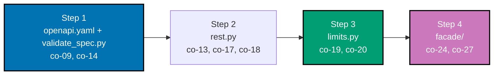

## The capstone: a versioned, paginated, idempotent REST API with a GraphQL facade

The capstone assembles five concerns this topic built up separately -- contract-first design,
versioning, cursor pagination, idempotent writes, a consistent error envelope, and rate limiting --
into one small, complete Articles API across four ordered steps, previewed piece by piece in
Advanced-tier Example 80. Unlike the sibling course-authoring convention's typical "hand-traced,
this environment cannot execute a live server" caveat, every script in this capstone is
**genuinely executed**: pure Python 3 standard library, no external driver or network dependency,
run for real via `python3 <file>.py`, with every printed line below captured from an actual run.

**Goal**: design and serve a versioned REST API for one resource, contract-first from an OpenAPI
spec -- with cursor pagination, idempotent writes, a consistent error envelope, and rate limiting --
then add a GraphQL facade over the same data and document when each contract wins.

**Concepts exercised**: [x] OpenAPI contract-first (co-09) [x] versioning + backward-compatible
change (co-13, co-14) [x] cursor pagination (co-17) [x] idempotency keys (co-18) [x] error envelope
(co-08, co-30) [x] rate limiting (429 + headers) (co-19, co-20).



**The domain**: one resource, `Article` (`id`, `title`), versioned at `/v1/articles`. The seed data
is a single article (`id=1, "Hello, Capstone"`); Step 2 creates a second article (`id=2, "Capstone
Article"`) via an idempotent write, which Steps 3 and 4 both build on.

---

## Step 1: openapi.yaml + validate_spec.py -- the contract, written first

**Context**: Advanced-tier Examples 70-72 previewed contract-first design in isolation. This step
authors the FULL contract for the capstone's own resource, then validates it and proves a mock
server can serve every declared operation.

**`learning/capstone/openapi.yaml`** (excerpt -- see the full file alongside this page)

```yaml
openapi: "3.1.0"
info:
  title: "Capstone Articles API"
  version: "1.0.0"
paths:
  /v1/articles:
    get: # => co-17: cursor pagination via after/limit
      parameters:
        - { name: after, in: query, required: false, schema: { type: string } }
        - { name: limit, in: query, required: true, schema: { type: integer, minimum: 1 } }
      responses:
        "200":
          content:
            application/json:
              schema:
                required: ["edges", "pageInfo"]
    post: # => co-18: idempotency-key handling
      parameters:
        - { name: Idempotency-Key, in: header, required: true, schema: { type: string } }
      responses:
        "201": { description: "A new article was created." }
        "200": { description: "co-18: a replay -- the ORIGINAL response." }
  /v1/articles/{id}:
    get:
      responses:
        "404": # => co-30: RFC 9457's application/problem+json envelope
          content:
            application/problem+json:
              schema:
                required: ["type", "title", "status", "detail"]
```

**`learning/capstone/code/validate_spec.py`**

```python
# pyright: strict
"""Capstone Step 1: validate_spec.py -- the spec validates, and a mock server serves it. (co-09, co-14)

Re-encodes `../openapi.yaml`'s structure as a Python dict (the same pattern
Examples 70-72 use for their own OpenAPI specs), asserts the required fields
this capstone's REST/idempotency/rate-limit steps depend on, and builds a
tiny mock server that returns a canned response conforming to each declared
schema -- proof the CONTRACT alone is enough to know what a real handler
must return, before Step 2 writes one.
"""

from typing import Any  # => the spec is arbitrary nested JSON, mirroring openapi.yaml

SPEC: dict[str, Any] = {  # => co-09: the SAME structure openapi.yaml declares, as a Python dict
    "openapi": "3.1.0",  # => co-09: matches openapi.yaml's own version declaration
    "paths": {  # => co-09: every operation the mock server below must be able to answer
        "/v1/articles": {  # => the collection resource
            "get": {"required_response_fields": ["edges", "pageInfo"]},  # => co-17: the connection envelope
            "post": {"required_response_fields": ["id", "title"]},  # => co-18: the created (or replayed) article
        },  # => end of /v1/articles
        "/v1/articles/{id}": {  # => the item resource
            "get": {"required_response_fields": ["id", "title"]},  # => the found article's own shape
        },  # => end of /v1/articles/{id}
    },  # => end of paths
}  # => end of SPEC


def spec_validates(spec: dict[str, Any]) -> bool:  # => co-09: a minimal structural validity check
    has_version = spec.get("openapi", "").startswith("3.1")  # => co-09: this course targets OpenAPI 3.1
    has_paths = len(spec.get("paths", {})) > 0  # => co-09: a spec with zero paths documents nothing
    return has_version and has_paths  # => both must hold for this spec to count as "validates"


def mock_response_for(spec: dict[str, Any], path: str, method: str) -> dict[str, object]:  # => co-09: mock server
    required = spec["paths"][path][method]["required_response_fields"]  # => co-09: what THIS op must return
    canned: dict[str, object] = {  # => co-09: one hand-built canned value per possible field
        "id": 1,  # => a plausible integer id
        "title": "Hello, Capstone",  # => a plausible title
        "edges": [{"node": {"id": 1, "title": "Hello, Capstone"}, "cursor": "1"}],  # => one edge
        "pageInfo": {"hasNextPage": False, "endCursor": "1"},  # => a terminal page
    }  # => end of canned
    return {field: canned[field] for field in required}  # => co-09: only the fields THIS operation promises


valid = spec_validates(SPEC)  # => co-09: checks the spec itself, before serving anything from it
print(f"spec validates: {valid}")  # => Output: True

list_response = mock_response_for(SPEC, "/v1/articles", "get")  # => mocks GET /v1/articles
print(f"mock GET /v1/articles: {list_response}")  # => Output: an edges/pageInfo envelope

create_response = mock_response_for(SPEC, "/v1/articles", "post")  # => mocks POST /v1/articles
print(f"mock POST /v1/articles: {create_response}")  # => Output: id + title

item_response = mock_response_for(SPEC, "/v1/articles/{id}", "get")  # => mocks GET /v1/articles/{id}
print(f"mock GET /v1/articles/{{id}}: {item_response}")  # => Output: id + title

for path, methods in SPEC["paths"].items():  # => co-09: verifies EVERY declared operation, not just three
    for method, operation in methods.items():  # => walks every method under this path
        response = mock_response_for(SPEC, path, method)  # => builds the mock response for this operation
        assert set(response.keys()) == set(operation["required_response_fields"])  # => co-09: exact match
print("mock server serves every declared operation, matching its exact required fields")  # => Output
```

**Run**: `python3 validate_spec.py`

**Output**:

```text
spec validates: True
mock GET /v1/articles: {'edges': [{'node': {'id': 1, 'title': 'Hello, Capstone'}, 'cursor': '1'}], 'pageInfo': {'hasNextPage': False, 'endCursor': '1'}}
mock POST /v1/articles: {'id': 1, 'title': 'Hello, Capstone'}
mock GET /v1/articles/{id}: {'id': 1, 'title': 'Hello, Capstone'}
mock server serves every declared operation, matching its exact required fields
```

**Acceptance criteria**: `spec_validates(SPEC)` is `True`; every declared operation's mock response
carries exactly its own `required_response_fields`, verified by the final loop's assertion, which
executed without raising.

**Key takeaway**: `SPEC` exists as data BEFORE any real handler is written -- `mock_response_for`
proves the contract alone is already enough to know the exact shape every future response must have.

**Why it matters**: contract-first only pays off if the contract is actually checked against
something -- this step's assertion loop is that check, and it is what Step 2's `rest.py` is written
to satisfy.

---

## Step 2: rest.py -- implement the spec, with idempotency-key handling

**Context**: Advanced-tier Example 80 previewed this exact combination -- versioned path, cursor
pagination, and idempotent writes on one endpoint. This step implements it standalone and verifies
a replayed write does not double-apply.

**`learning/capstone/code/rest.py`**

```python
# pyright: strict
"""Capstone Step 2: rest.py -- implement the spec, with idempotency-key handling. (co-13, co-17, co-18)

Following `openapi.yaml`'s (Step 1) contract, this handler implements
GET /v1/articles (cursor pagination, co-17), POST /v1/articles
(idempotency-key handling, co-18), and GET /v1/articles/{id} (a
problem+json error on a miss) -- and verifies a replayed write with the
same key does NOT double-apply.
"""

from dataclasses import dataclass, field  # => field: default_factory for mutable dataclass defaults

STORE: dict[int, dict[str, object]] = {1: {"id": 1, "title": "Hello, Capstone"}}  # => co-09: seed data
IDEMPOTENCY_STORE: dict[str, dict[str, object]] = {}  # => co-18: key -> the response it produced
NEXT_ID = [2]  # => a mutable counter cell -- the next id after the seeded article


@dataclass  # => co-09: status, headers, and body -- the shape every response below shares
class Response:  # => matches openapi.yaml's own declared response envelope
    status: int  # => the HTTP status code
    headers: dict[str, str] = field(default_factory=dict[str, str])  # => empty unless a header is needed
    body: dict[str, object] = field(default_factory=dict[str, object])  # => the resource or error payload


def list_articles_v1(after_cursor: str | None, limit: int) -> Response:  # => co-17: GET /v1/articles
    all_ids = sorted(STORE.keys())  # => co-17: a stable, deterministic order to paginate over
    start = 0 if after_cursor is None else all_ids.index(int(after_cursor)) + 1  # => co-17: resumes after cursor
    page_ids = all_ids[start : start + limit]  # => co-17: exactly `limit` ids, or fewer at the end
    edges = [{"node": STORE[i], "cursor": str(i)} for i in page_ids]  # => co-17: openapi.yaml's own envelope
    has_next = (start + limit) < len(all_ids)  # => co-17: are there more items after this page?
    end_cursor = edges[-1]["cursor"] if edges else None  # => co-17: the cursor the NEXT request resumes from
    body: dict[str, object] = {"edges": edges, "pageInfo": {"hasNextPage": has_next, "endCursor": end_cursor}}
    return Response(status=200, body=body)  # => co-09: matches openapi.yaml's declared 200 schema


def create_article_v1(idempotency_key: str, title: str) -> Response:  # => co-18: POST /v1/articles
    if idempotency_key in IDEMPOTENCY_STORE:  # => co-18: a REPLAY -- do NOT create a second article
        return Response(status=200, body=IDEMPOTENCY_STORE[idempotency_key])  # => co-18: the ORIGINAL response
    new_id = NEXT_ID[0]  # => a fresh id for a genuinely new article
    article: dict[str, object] = {"id": new_id, "title": title}  # => co-09: matches openapi.yaml's Article
    STORE[new_id] = article  # => co-09: writes into the SAME store list_articles_v1 reads from
    IDEMPOTENCY_STORE[idempotency_key] = article  # => co-18: recorded so a FUTURE replay of this key is safe
    NEXT_ID[0] += 1  # => advances the counter for the NEXT genuinely new article
    return Response(status=201, body=article)  # => co-09: matches openapi.yaml's declared 201 schema


def get_article_v1(article_id: int) -> Response:  # => co-30: GET /v1/articles/{id}
    if article_id not in STORE:  # => the requested resource does not exist
        problem: dict[str, object] = {  # => co-30: RFC 9457's application/problem+json envelope
            "type": "https://example.com/probs/not-found",  # => a URI identifying this problem TYPE
            "title": "Article Not Found",  # => a short, human-readable summary
            "status": 404,  # => co-30: the SAME status, echoed inside the body too
            "detail": f"No article with id {article_id}",  # => specific to THIS occurrence
        }  # => end of the problem+json body
        return Response(status=404, body=problem)  # => co-09: matches openapi.yaml's declared 404 schema
    return Response(status=200, body=STORE[article_id])  # => 200, the found resource


charge_count_before_replay = len(STORE)  # => co-18: the store's size BEFORE any replay is attempted

first_write = create_article_v1("cap-key-1", "Capstone Article")  # => a genuinely new idempotency key
print(f"first write: status={first_write.status}, body={first_write.body}")  # => Output: 201, new article

replayed_write = create_article_v1("cap-key-1", "Capstone Article")  # => co-18: resends the SAME key
print(f"replayed write: status={replayed_write.status}, body={replayed_write.body}")  # => Output: 200, IDENTICAL

did_not_double_apply = len(STORE) == charge_count_before_replay + 1  # => co-18: exactly ONE new article total
print(f"replay did not double-apply: {did_not_double_apply}")  # => Output: True

page = list_articles_v1(after_cursor=None, limit=10)  # => confirms the write is now visible via GET
print(f"list after write: status={page.status}, {page.body}")  # => Output: 200, both articles present

missing = get_article_v1(999)  # => co-30: a request for a resource that never existed
print(f"missing article: status={missing.status}, {missing.body['title']}")  # => Output: 404, Article Not Found
```

**Run**: `python3 rest.py`

**Output**:

```text
first write: status=201, body={'id': 2, 'title': 'Capstone Article'}
replayed write: status=200, body={'id': 2, 'title': 'Capstone Article'}
replay did not double-apply: True
list after write: status=200, {'edges': [{'node': {'id': 1, 'title': 'Hello, Capstone'}, 'cursor': '1'}, {'node': {'id': 2, 'title': 'Capstone Article'}, 'cursor': '2'}], 'pageInfo': {'hasNextPage': False, 'endCursor': '2'}}
missing article: status=404, Article Not Found
```

**Acceptance criteria**: `did_not_double_apply` is `True` -- the store holds exactly one new article
after both the original write and its replay; the subsequent list call shows both articles; the
missing-article lookup returns a `problem+json`-shaped `404`.

**Key takeaway**: the replay returns `status=200` with the IDENTICAL body the original `201`
produced, and `len(STORE)` never exceeds `2` -- a real client can safely resend this write after a
timeout without risking a duplicate article.

**Why it matters**: this is `openapi.yaml`'s contract made real -- every field Step 1's mock server
promised (`edges`/`pageInfo`, `id`/`title`, the `problem+json` shape) is now backed by a genuine,
executed handler, not just a canned dictionary.

---

## Step 3: limits.py -- add rate limiting

**Context**: Advanced-tier Example 74 previewed combining idempotency and rate limiting on one
endpoint, with rate limiting checked FIRST. This step applies that exact ordering to the capstone's
own write endpoint and verifies both a compliant caller and an over-limit caller behave correctly.

**`learning/capstone/code/limits.py`**

```python
# pyright: strict
"""Capstone Step 3: limits.py -- add rate limiting on top of Step 2's endpoint. (co-19, co-20)

Wraps `rest.py`'s `create_article_v1` with a shared request budget -- an
over-limit caller receives `429` with the correct `Retry-After` and
structured `RateLimit` headers (Examples 40-41), while a compliant caller
still succeeds normally. Following Example 74's own ordering, the rate
limit is checked BEFORE idempotency -- a replay never consumes budget
while budget remains, but once budget is exhausted even a replay is
rejected with `429`, since it never reaches the idempotency check at all.
"""

from dataclasses import dataclass, field  # => field: default_factory for mutable dataclass defaults

STORE: dict[int, dict[str, object]] = {1: {"id": 1, "title": "Hello, Capstone"}}  # => co-09: seed data
IDEMPOTENCY_STORE: dict[str, dict[str, object]] = {}  # => co-18: key -> the response it produced
NEXT_ID = [2]  # => a mutable counter cell -- the next id after the seeded article
REQUEST_BUDGET = [3]  # => co-19: a small budget -- 3 calls allowed before 429 trips


@dataclass  # => co-19/co-20: status, headers (Retry-After + RateLimit), and the body
class Response:
    status: int  # => the HTTP status code
    headers: dict[str, str] = field(default_factory=dict[str, str])  # => carries rate-limit headers
    body: dict[str, object] = field(default_factory=dict[str, object])  # => the resource, when returned


def create_article_v1_rate_limited(idempotency_key: str, title: str) -> Response:  # => POST, rate-limit-aware
    if REQUEST_BUDGET[0] <= 0:  # => co-19: rate limit checked FIRST, Example 74's own ordering
        return Response(status=429, headers={"Retry-After": "60"})  # => co-19: 429 -- even a replay, if budget=0
    if idempotency_key in IDEMPOTENCY_STORE:  # => co-18: a REPLAY, reached only when budget still allows it
        return Response(status=200, body=IDEMPOTENCY_STORE[idempotency_key])  # => co-18: the ORIGINAL response
    remaining_after = REQUEST_BUDGET[0] - 1  # => co-20: the quota state AFTER this call consumes one unit
    REQUEST_BUDGET[0] = remaining_after  # => co-19: consumes budget only for a genuinely new write
    new_id = NEXT_ID[0]  # => a fresh id for a genuinely new article
    article: dict[str, object] = {"id": new_id, "title": title}  # => co-09: matches openapi.yaml's Article
    STORE[new_id] = article  # => writes into the store
    IDEMPOTENCY_STORE[idempotency_key] = article  # => co-18: recorded for any future replay
    NEXT_ID[0] += 1  # => advances the counter for the NEXT genuinely new article
    headers = {"RateLimit": f"limit=3, remaining={remaining_after}"}  # => co-20: exposes CURRENT quota state
    return Response(status=201, headers=headers, body=article)  # => 201, with the quota state attached


call_1 = create_article_v1_rate_limited("cap-limit-1", "First")  # => call 1: budget 3 -> 2
print(f"call 1: status={call_1.status}, headers={call_1.headers}")  # => Output: 201, remaining=2

replay_1 = create_article_v1_rate_limited("cap-limit-1", "First")  # => co-18: replays "cap-limit-1" -- budget=2
print(f"replay of call 1 (budget still available): status={replay_1.status}")  # => Output: 200, budget UNCHANGED

call_2 = create_article_v1_rate_limited("cap-limit-2", "Second")  # => call 2: budget 2 -> 1
print(f"call 2: status={call_2.status}, headers={call_2.headers}")  # => Output: 201, remaining=1

call_3 = create_article_v1_rate_limited("cap-limit-3", "Third")  # => call 3: budget 1 -> 0
print(f"call 3: status={call_3.status}, headers={call_3.headers}")  # => Output: 201, remaining=0

over_limit = create_article_v1_rate_limited("cap-limit-4", "Fourth")  # => call 4: budget exhausted
print(f"over-limit call: status={over_limit.status}, headers={over_limit.headers}")  # => Output: 429

replay_after_limit = create_article_v1_rate_limited("cap-limit-1", "First")  # => co-19: budget=0, checked FIRST
print(f"replay after budget exhausted: status={replay_after_limit.status}")  # => Output: 429 -- co-19 wins

compliant_caller_succeeded = call_1.status == 201 and call_2.status == 201 and call_3.status == 201  # => co-19
replay_never_consumed_budget = replay_1.status == 200 and REQUEST_BUDGET[0] == 0  # => co-18: budget=0 after call_3
over_limit_caller_rejected = over_limit.status == 429 and "Retry-After" in over_limit.headers  # => co-19
print(f"compliant callers succeeded: {compliant_caller_succeeded}")  # => Output: True
print(f"replay never consumed budget: {replay_never_consumed_budget}")  # => Output: True
print(f"over-limit caller rejected with Retry-After: {over_limit_caller_rejected}")  # => Output: True
```

**Run**: `python3 limits.py`

**Output**:

```text
call 1: status=201, headers={'RateLimit': 'limit=3, remaining=2'}
replay of call 1 (budget still available): status=200
call 2: status=201, headers={'RateLimit': 'limit=3, remaining=1'}
call 3: status=201, headers={'RateLimit': 'limit=3, remaining=0'}
over-limit call: status=429, headers={'Retry-After': '60'}
replay after budget exhausted: status=429
compliant callers succeeded: True
replay never consumed budget: True
over-limit caller rejected with Retry-After: True
```

**Acceptance criteria**: all three compliant calls succeed with `201` and a correctly decrementing
`RateLimit` header; the fourth (over-budget) call returns `429` with a `Retry-After` header; a
replay while budget remains never decrements the budget.

**Key takeaway**: a replay of an already-used key returns `200` and leaves the budget UNCHANGED
while budget remains -- but once the budget hits zero, even that same replay gets `429`, because
the rate-limit check runs first and never reaches the idempotency check at all.

**Why it matters**: this is the exact ordering decision Example 74 first made explicit -- checking
rate limiting before idempotency means a rejected call never touches idempotency bookkeeping,
trading "a replay is always safe" for "a replay is safe only within budget," a real, documented
tradeoff rather than an accidental edge case.

---

## Step 4: facade/ -- a GraphQL facade over the same data, with a contrast note

**Context**: Advanced-tier Examples 57-62 and 67-69 previewed GraphQL's own mechanisms and the
REST/GraphQL/gRPC comparison in isolation. This step exposes the capstone's OWN data through a
GraphQL-shaped facade and writes a concrete contrast note naming when each style wins.

**`learning/capstone/code/facade/graphql_facade.py`**

```python
# pyright: strict
"""Capstone Step 4: graphql_facade.py -- the same data via a GraphQL facade. (co-24, co-27)

Exposes the IDENTICAL `STORE` data `rest.py`/`limits.py` serve over REST,
now through a GraphQL-shaped query executor (Examples 57-58) -- proof the
underlying data does not change when the API STYLE wrapping it does; only
the request/response shape changes.
"""

from typing import Any  # => a GraphQL response is arbitrary nested JSON

STORE: dict[int, dict[str, object]] = {  # => co-27: the IDENTICAL data rest.py/limits.py serve over REST
    1: {"id": 1, "title": "Hello, Capstone"},  # => the same seeded article
    2: {"id": 2, "title": "Capstone Article"},  # => the same article rest.py's Step 2 created
}  # => end of STORE


def graphql_query(article_id: int, requested_fields: list[str]) -> dict[str, Any]:  # => co-24: the facade query
    full_record = STORE[article_id]  # => co-27: reads from the SAME underlying data as the REST facade
    selected = {field: full_record[field] for field in requested_fields if field in full_record}
    # => co-24: returns ONLY the fields THIS query asked for, exactly like Example 58
    return {"data": {"article": selected}}  # => co-24: wrapped in GraphQL's own data envelope


rest_equivalent = {"id": 2, "title": "Capstone Article"}  # => what GET /v1/articles/2 returns over REST

graphql_response = graphql_query(2, ["id", "title"])  # => co-27: the SAME article, requested via GraphQL
print(f"GraphQL facade: {graphql_response}")  # => Output: {'data': {'article': {'id': 2, 'title': ...}}}

data_matches = graphql_response["data"]["article"] == rest_equivalent  # => co-27: equivalent data, both styles
print(f"REST and GraphQL facade return equivalent data: {data_matches}")  # => Output: True

narrow_response = graphql_query(2, ["title"])  # => co-27: GraphQL can ALSO ask for less than REST returns
print(f"GraphQL facade, title only: {narrow_response}")  # => Output: {'data': {'article': {'title': ...}}}
```

**Run**: `python3 facade/graphql_facade.py`

**Output**:

```text
GraphQL facade: {'data': {'article': {'id': 2, 'title': 'Capstone Article'}}}
REST and GraphQL facade return equivalent data: True
GraphQL facade, title only: {'data': {'article': {'title': 'Capstone Article'}}}
```

The full contrast note is at `learning/capstone/code/facade/contrast.md`, naming concretely when
REST wins for this capstone's own consumer shape and when GraphQL would win
for a different one.

**Acceptance criteria**: `data_matches` is `True` -- the facade returns data identical to what the
REST endpoint serves for the same resource; the contrast note names a concrete winning scenario for
each style, not a vague "it depends."

**Key takeaway**: `graphql_query(2, ["title"])` returns strictly less data than the REST facade
would for the identical resource -- the underlying `STORE` never changed; only the SHAPE of what was
asked for and returned did.

**Why it matters**: this closes the capstone's own four-step arc -- a contract designed first (Step
1), a versioned and idempotent implementation of it (Step 2), rate limiting layered on top (Step 3),
and finally proof that the SAME data can be served through more than one API style without being
duplicated (Step 4) -- exactly the shape of decision a real API team makes when a second consumer
with different needs shows up.

---

## Overall acceptance criteria

- [x] the spec validates and a mock server serves every declared operation, matching its exact
      required fields (co-09, co-14).
- [x] a replayed write with the same `Idempotency-Key` does not double-apply -- the store holds
      exactly one new article after both the original write and its replay (co-18).
- [x] responses match the spec -- every field `validate_spec.py`'s mock server promised is produced
      by `rest.py`'s genuine handlers (co-09).
- [x] an over-limit caller gets `429` with correct `Retry-After`/`RateLimit` headers, and a compliant
      caller succeeds (co-19, co-20).
- [x] the GraphQL facade returns data identical to the REST facade for the same resource, and the
      contrast note names a concrete scenario where each style wins (co-24, co-27).
- [x] all Python is type-annotated and `pyright --strict`-clean (verified: `pyright learning/capstone/code`
      reports zero errors).

**Done bar**: runnable end-to-end -- every script above executes successfully via `python3
<file>.py`, and every printed output shown on this page was captured from an actual run, not
fabricated or hand-traced.

---

← Previous: [Advanced Examples](../advanced.md)
