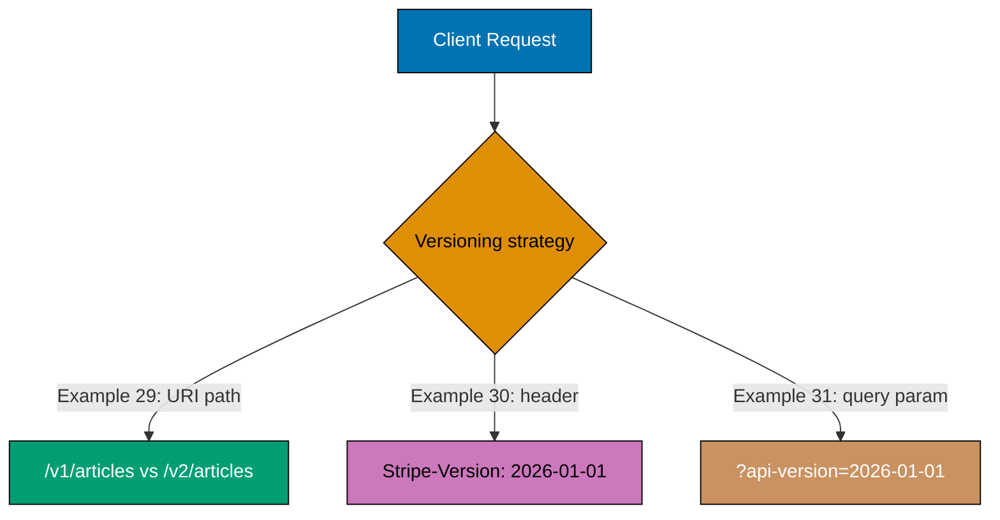
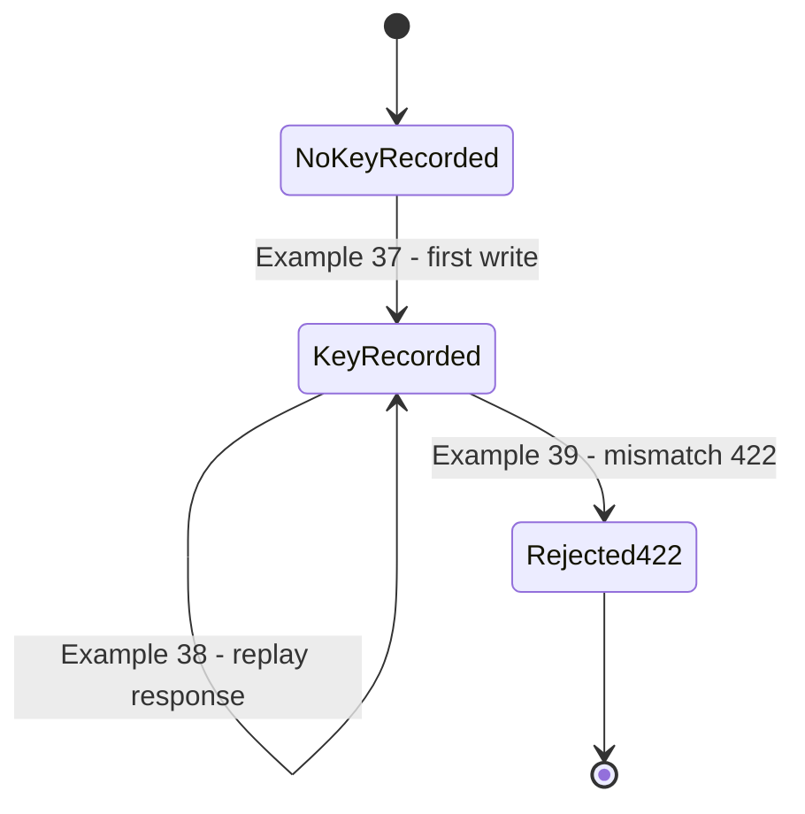
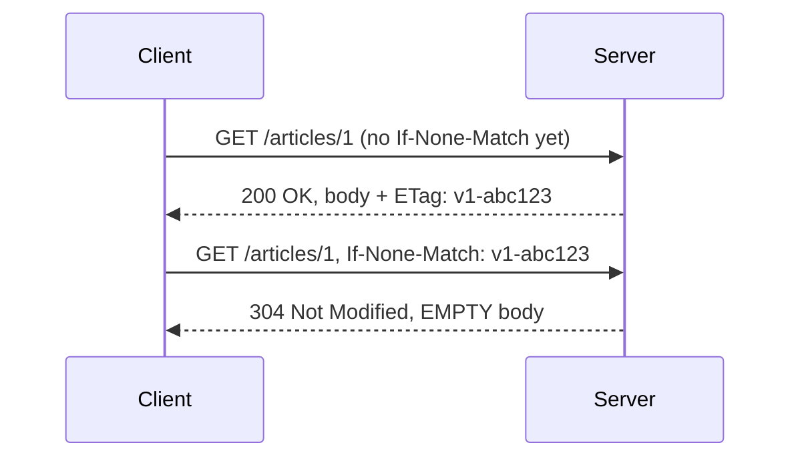
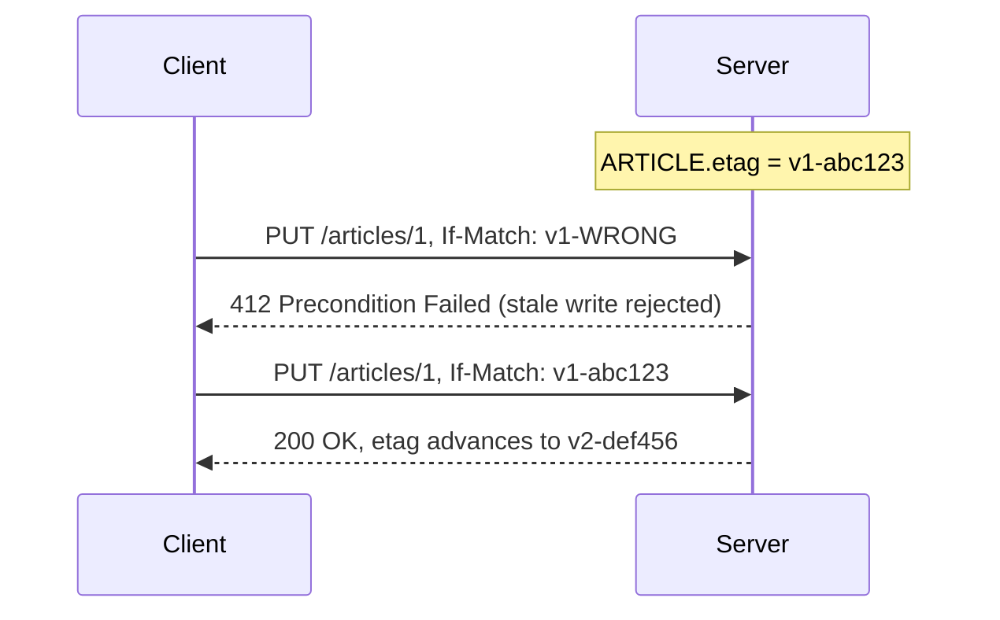
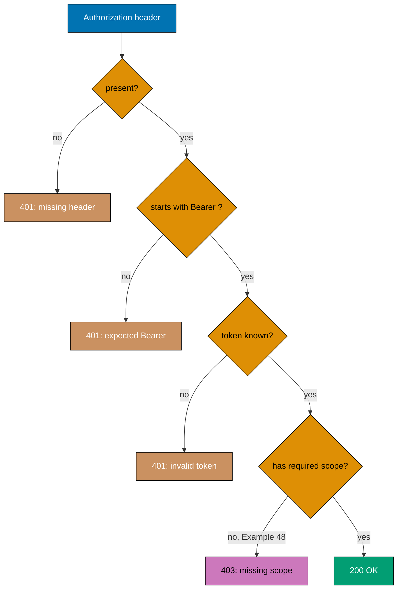
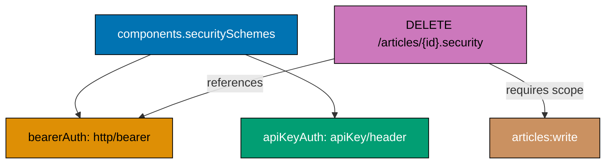
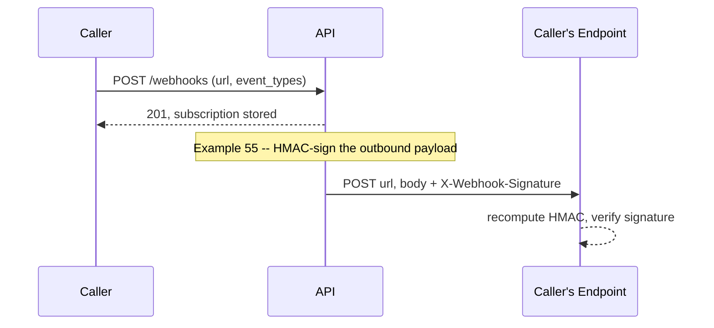

Examples 29-56 cover versioning strategy (URI path, header, query parameter) and evolution
discipline (additive changes, the tolerant reader, consumer contract tests, `Deprecation`/`Sunset`
headers), idempotent writes with `Idempotency-Key` (recording, replaying, and rejecting a body
mismatch), rate limiting (`429`/`Retry-After`, the structured `RateLimit`/`RateLimit-Policy`
headers, and a quota counter draining to zero), caching and optimistic concurrency (`ETag`/
`If-None-Match`/304, `Cache-Control`, `If-Match`), authentication and authorization (bearer tokens,
API keys, OAuth scopes, and declaring both in an OpenAPI security scheme), partial responses
(`?fields=` and JSON:API sparse fieldsets), batch and bulk operations, and webhooks (subscribing,
then signing the outbound payload with HMAC). Every example is a complete, self-contained,
originally-authored Python 3 script using only the standard library. Run each with
`python3 example.py`; every printed line below was captured from an actual run of the file shown.

---

### Example 29: Versioning via the URI Path

_ex-29 &middot; exercises co-13_

Routing `/v1/...` and `/v2/...` to different handlers is the most visible versioning strategy --
Google's AIP-185 recommends "v1", not "v1.0", with the version baked directly into every request's
own path.



**`learning/code/ex-29-version-uri-path/example.py`**

```python
# pyright: strict
"""Example 29: Versioning via the URI Path. (co-13)

Routing `/v1/...` and `/v2/...` to different handlers is the most visible
versioning strategy -- Google's AIP-185 recommends "v1", not "v1.0", and the
version lives directly in every request's own path.
"""

from typing import Callable  # => a handler is just a function, typed for clarity

ROUTES: dict[str, Callable[[], dict[str, object]]] = {  # => co-13: path prefix -> its own handler
    "/v1/articles/1": lambda: {"id": 1, "title": "Hello"},  # => v1 shape: two fields
    "/v2/articles/1": lambda: {"id": 1, "title": "Hello", "author": "Ada"},  # => v2 adds a field
}  # => end of ROUTES
# => ROUTES has 2 keys, each mapped to a zero-arg callable returning that version's own shape


def dispatch(path: str) -> dict[str, object]:  # => co-13: routes purely by the path's own prefix
    handler = ROUTES[path]  # => co-13: the version is baked into the URI itself
    return handler()  # => calls whichever version's handler matched


v1_result = dispatch("/v1/articles/1")  # => request 1: explicitly asks for v1
print(f"v1: {v1_result}")  # => Output: {'id': 1, 'title': 'Hello'}

v2_result = dispatch("/v2/articles/1")  # => request 2: explicitly asks for v2
# => v2_result has one MORE key ("author") than v1_result -- a different URI, a different shape
print(f"v2: {v2_result}")  # => Output: {'id': 1, 'title': 'Hello', 'author': 'Ada'}
```

**Run**: `python3 example.py`

**Output**:

```text
v1: {'id': 1, 'title': 'Hello'}
v2: {'id': 1, 'title': 'Hello', 'author': 'Ada'}
```

**Key takeaway**: The version is part of the URI itself -- two callers hitting `/v1/articles/1` and
`/v2/articles/1` are, in effect, hitting two distinct resources that happen to represent the same
underlying data.

**Why it matters**: URI-path versioning is the most discoverable strategy -- a caller (or a browser,
or a cache) can see the version just by reading the URL, and old and new versions can be routed,
cached, and rate-limited independently since they are, mechanically, different paths. This discoverability also pays off operationally: a load balancer or reverse proxy can route `/v1/` and `/v2/` to entirely separate backend deployments with a simple path rule, no header inspection required.

---

### Example 30: Versioning via a Request Header

_ex-30 &middot; exercises co-13_

Stripe pins a version per API key via `Stripe-Version`, rather than baking it into the URI -- the
SAME path resolves differently depending purely on a header's value, keeping every version's URI
identical.

**`learning/code/ex-30-version-header/example.py`**

```python
# pyright: strict
"""Example 30: Versioning via a Request Header. (co-13)

Stripe pins a version per API key via `Stripe-Version`, rather than baking
it into the URI -- the SAME path resolves differently depending purely on a
header's value, keeping every version's URI identical.
"""

from typing import Callable  # => a handler is just a function, typed for clarity

HANDLERS: dict[str, Callable[[], dict[str, object]]] = {  # => co-13: header value -> its own handler
    "2025-01-01": lambda: {"id": 1, "title": "Hello"},  # => the OLDER API-Version shape
    "2026-01-01": lambda: {"id": 1, "title": "Hello", "author": "Ada"},  # => the NEWER shape
}  # => end of HANDLERS


def dispatch(path: str, api_version: str) -> dict[str, object]:  # => co-13: routes by header, not path
    handler = HANDLERS[api_version]  # => co-13: the SAME path, resolved by a header value instead
    return handler()  # => calls whichever version's handler the header selected


old = dispatch("/articles/1", api_version="2025-01-01")  # => request 1: the older header value
print(f"2025-01-01: {old}")  # => Output: {'id': 1, 'title': 'Hello'}

new = dispatch("/articles/1", api_version="2026-01-01")  # => request 2: SAME path, newer header
# => both calls used the identical path "/articles/1" -- only the header value changed the shape
print(f"2026-01-01: {new}")  # => Output: {'id': 1, 'title': 'Hello', 'author': 'Ada'}
```

**Run**: `python3 example.py`

**Output**:

```text
2025-01-01: {'id': 1, 'title': 'Hello'}
2026-01-01: {'id': 1, 'title': 'Hello', 'author': 'Ada'}
```

**Key takeaway**: Unlike Example 29, the path never changes -- `dispatch` resolves purely from the
`api_version` header, so a bookmark or a cache key built only from the URI can no longer
distinguish the two versions.

**Why it matters**: Header-based versioning keeps a resource's URI stable across every version,
which matters when the URI itself is treated as a permanent identifier (bookmarked, embedded in
another system) -- the cost is that the version becomes invisible to anything that only looks at
the URL, such as a browser address bar or a plain access log.

---

### Example 31: Versioning via a Query Parameter

_ex-31 &middot; exercises co-13_

Azure's guideline uses `?api-version=YYYY-MM-DD`, and treats a MISSING parameter as an error (`400
MissingApiVersionParameter`) rather than a silent default -- forcing every caller to be explicit
about its version.

**`learning/code/ex-31-version-query/example.py`**

```python
# pyright: strict
"""Example 31: Versioning via a Query Parameter. (co-13)

Azure's guideline uses `?api-version=YYYY-MM-DD`, and treats a MISSING
parameter as an error (`400 MissingApiVersionParameter`) rather than a
silent default -- forcing every caller to be explicit about its version.
"""

from dataclasses import dataclass  # => a small typed response record for this example


@dataclass  # => co-13: status plus a small JSON-shaped body
class Response:
    status: int  # => the HTTP status code
    body: dict[str, object]  # => either the resolved data or an error description


def get_article(api_version: str | None) -> Response:  # => GET /articles/1?api-version=
    if api_version is None:  # => co-13: Azure's own rule -- missing means reject, not default
        return Response(400, {"error": "MissingApiVersionParameter"})  # => 400, explicit rejection
    return Response(200, {"id": 1, "title": "Hello", "api_version": api_version})  # => echoes the version


missing = get_article(api_version=None)  # => request 1: no ?api-version= at all
# => missing.status is 400 -- Azure's rule rejects silence, unlike most other version strategies
print(f"missing: status={missing.status}, body={missing.body}")  # => Output: 400, MissingApiVersionParameter

present = get_article(api_version="2026-01-01")  # => request 2: explicit version given
print(f"present: status={present.status}, body={present.body}")  # => Output: 200, echoes the version
```

**Run**: `python3 example.py`

**Output**:

```text
missing: status=400, body={'error': 'MissingApiVersionParameter'}
present: status=200, body={'id': 1, 'title': 'Hello', 'api_version': '2026-01-01'}
```

**Key takeaway**: Azure's own guideline rejects a missing `?api-version=` rather than defaulting it
-- an explicit `400` forces every integration to state its version up front, instead of silently
riding whatever the "current default" happens to be.

**Why it matters**: A silent default version is a trap: it works fine until the default changes,
then every caller that never specified a version breaks at once, with no warning. Rejecting the
missing parameter converts that future breakage into an immediate, loud integration-time error. In practice, the loud error is far cheaper: it surfaces during integration testing, on a developer's machine, instead of during a production traffic spike when the default silently shifts under everyone at once.

---

### Example 32: Adding an Optional Field Is Backward-Compatible

_ex-32 &middot; exercises co-14_

Adding a NEW, optional field to a response never breaks an existing client that only reads the
fields it already knew about -- this is the single most common, safest way an API evolves without a
version bump.

**`learning/code/ex-32-additive-change-compatible/example.py`**

```python
# pyright: strict
"""Example 32: Adding an Optional Field Is Backward-Compatible. (co-14)

Adding a NEW, optional field to a response never breaks an existing client
that only reads the fields it already knew about -- this is the single most
common, safest way an API evolves without a version bump.
"""

from dataclasses import dataclass  # => a small typed response record for this example


@dataclass  # => co-14: the CURRENT shape a v1 client was written against
class ArticleV1:
    id: int  # => the article's own id
    title: str  # => the article's own title


def get_article_v1() -> ArticleV1:  # => the ORIGINAL handler, unchanged
    return ArticleV1(id=1, title="Hello")  # => the shape a v1 client already expects


def get_article_evolved() -> dict[str, object]:  # => co-14: the SAME endpoint, now with one MORE field
    return {"id": 1, "title": "Hello", "author": "Ada"}  # => co-14: additive -- nothing removed or renamed


def old_client_reads(response: dict[str, object]) -> ArticleV1:  # => co-14: reads ONLY id/title, like before
    return ArticleV1(id=response["id"], title=response["title"])  # type: ignore[arg-type]  # => old fields only


original = get_article_v1()  # => the shape before the change
print(f"before: {original}")  # => Output: ArticleV1(id=1, title='Hello')

evolved_response = get_article_evolved()  # => the SAME endpoint, after adding "author"
# => evolved_response has 3 keys now, but old_client_reads only ever looks at 2 of them
old_view = old_client_reads(evolved_response)  # => co-14: an old client, unaware "author" now exists
print(f"old client still works: {old_view}")  # => Output: ArticleV1(id=1, title='Hello') -- unaffected
```

**Run**: `python3 example.py`

**Output**:

```text
before: ArticleV1(id=1, title='Hello')
old client still works: ArticleV1(id=1, title='Hello')
```

**Key takeaway**: `old_client_reads` never looks at `"author"` -- so adding that field to the
server's response changes nothing from the old client's point of view; it produces the exact same
`ArticleV1(id=1, title='Hello')` both before and after the change.

**Why it matters**: Distinguishing "additive" from "breaking" changes is the core skill behind
avoiding unnecessary version bumps (Examples 29-31) -- most real API evolution is additive, and
treating every change as a version bump trains callers to ignore version numbers entirely. Getting this distinction wrong in either direction has a real cost: bumping the version too often trains callers to ignore it, while missing a genuine breaking change trains them to trust an unsafe upgrade.

---

### Example 33: The Tolerant Reader -- a Client That Ignores Unknown Fields

_ex-33 &middot; exercises co-14, co-02_

Consumer-driven design (co-02) means a client reads defensively: it extracts ONLY the fields it
needs via `.get()`, so a server adding an unrelated field never breaks it -- the client tolerates
what it does not recognize.

**`learning/code/ex-33-tolerant-reader/example.py`**

```python
# pyright: strict
"""Example 33: The Tolerant Reader -- a Client That Ignores Unknown Fields. (co-14, co-02)

Consumer-driven design (co-02) means a client reads defensively: it extracts
ONLY the fields it needs via `.get()`, so a server adding an unrelated field
never breaks it -- the client tolerates what it does not recognize.
"""

from dataclasses import dataclass  # => a small typed record for what THIS client actually needs


@dataclass  # => co-02: only the fields this ONE client cares about, nothing more
class ClientView:
    id: int  # => the only field this client reads
    title: str  # => the only OTHER field this client reads


def tolerant_read(response: dict[str, object]) -> ClientView:  # => co-14/co-02: reads defensively
    return ClientView(  # => builds the client's own narrow view of a possibly-larger response
        id=response.get("id", 0),  # type: ignore[arg-type]  # => co-02: .get(), never response["id"]
        title=response.get("title", ""),  # type: ignore[arg-type]  # => co-02: tolerates a missing key too
    )  # => end of the ClientView construction


v1_response: dict[str, object] = {"id": 1, "title": "Hello"}  # => the ORIGINAL server shape
v2_response: dict[str, object] = {"id": 1, "title": "Hello", "author": "Ada", "views": 42}
# => co-14: the server later added TWO new fields the client never asked about

view_from_v1 = tolerant_read(v1_response)  # => reads the original shape
print(f"from v1 response: {view_from_v1}")  # => Output: ClientView(id=1, title='Hello')

view_from_v2 = tolerant_read(v2_response)  # => co-02: reads the EXPANDED shape identically
# => view_from_v2 == view_from_v1 -- the two extra keys never even reach ClientView
print(f"from v2 response (unaffected): {view_from_v2}")  # => Output: identical -- new fields ignored
```

**Run**: `python3 example.py`

**Output**:

```text
from v1 response: ClientView(id=1, title='Hello')
from v2 response (unaffected): ClientView(id=1, title='Hello')
```

**Key takeaway**: `tolerant_read` produces the exact same `ClientView` from both the original and
the expanded response -- `.get()` on fields the client actually needs is what makes the two extra
fields (`author`, `views`) irrelevant to it.

**Why it matters**: Example 32 showed the SERVER side of additive compatibility; this example shows
the CLIENT-side discipline that makes it actually safe in practice -- a client that indexes with
`response["author"]` unconditionally, or asserts on the exact set of keys present, forfeits the
compatibility the server tried to preserve. A client written this way survives a server team adding a new field next quarter with zero code changes on the client side -- exactly the compatibility additive changes are meant to preserve.

---

### Example 34: A Consumer Contract Test Catches a Breaking Change

_ex-34 &middot; exercises co-14_

A consumer contract test asserts the fields a real client depends on are still present. Removing a
field the test asserts on makes the test fail LOUDLY, at build time -- exactly the point where a
breaking change should be caught, not discovered by a client in production.

**`learning/code/ex-34-breaking-change-detect/example.py`**

```python
# pyright: strict
"""Example 34: A Consumer Contract Test Catches a Breaking Change. (co-14)

A consumer contract test asserts the fields a real client depends on are
still present. Removing a field the test asserts on makes the test fail
LOUDLY, at build time -- exactly the point where a breaking change should be
caught, not discovered by a client in production.
"""


def get_article_v1() -> dict[str, object]:  # => the ORIGINAL, contract-conforming response
    return {"id": 1, "title": "Hello", "legacy_field": "still here"}  # => the field the contract needs


def get_article_broken() -> dict[str, object]:  # => co-14: a hypothetical FUTURE, breaking change
    return {"id": 1, "title": "Hello"}  # => "legacy_field" was REMOVED -- a real consumer still needs it


def consumer_contract_test(response: dict[str, object]) -> None:  # => co-14: the test a CI pipeline runs
    assert "id" in response, "contract violation: 'id' missing"  # => still-required field 1
    assert "title" in response, "contract violation: 'title' missing"  # => still-required field 2
    assert "legacy_field" in response, "contract violation: 'legacy_field' missing"  # => the field at risk


consumer_contract_test(get_article_v1())  # => co-14: passes silently -- the contract still holds
print("v1 response: contract test passed")  # => Output: contract test passed

try:  # => co-14: run the SAME test against the hypothetical breaking change
    consumer_contract_test(get_article_broken())  # => this call is expected to fail
    print("broken response: contract test passed (UNEXPECTED)")  # => would only print if the bug went uncaught
except AssertionError as exc:  # => co-14: the breaking change is caught HERE, loudly
    # => exc's message is "contract violation: 'legacy_field' missing" -- names the exact failure
    print(f"broken response: contract test FAILED as expected: {exc}")  # => Output: caught, with a clear reason
```

**Run**: `python3 example.py`

**Output**:

```text
v1 response: contract test passed
broken response: contract test FAILED as expected: contract violation: 'legacy_field' missing
```

**Key takeaway**: The SAME `consumer_contract_test` function runs against both responses -- it
passes against `get_article_v1` and fails, with a specific and readable message, against
`get_article_broken`, precisely because `"legacy_field"` was removed.

**Why it matters**: A consumer contract test turns "did I just break a real client?" from a
production incident into a build-time assertion -- it is the automated complement to the tolerant
reader (Example 33): the server team runs a test that encodes what a real consumer actually reads,
so a breaking change fails CI before it ever reaches that consumer.

---

### Example 35: The Deprecation Header

_ex-35 &middot; exercises co-15_

RFC 9745's `Deprecation` header notifies a caller that an endpoint (or the whole API version) is
deprecated, optionally paired with a `Link` header pointing at the replacement -- notification only,
the endpoint still works.

**`learning/code/ex-35-deprecation-header/example.py`**

```python
# pyright: strict
"""Example 35: The Deprecation Header. (co-15)

RFC 9745's `Deprecation` header notifies a caller that an endpoint (or the
whole API version) is deprecated, optionally paired with a `Link` header
pointing at the replacement -- notification only, the endpoint still works.
"""

from dataclasses import dataclass  # => a small typed response record for this example


@dataclass  # => co-15: status, headers (carrying the notice), and the still-working body
class Response:  # => co-15: deprecation is signaled via headers, never via a different status
    status: int  # => the HTTP status code -- deprecation does NOT change this
    headers: dict[str, str]  # => carries the Deprecation + Link notice
    body: dict[str, object]  # => the endpoint still returns real data


def get_article_v1(article_id: int) -> Response:  # => GET /v1/articles/{id} -- now deprecated
    return Response(  # => co-15: still succeeds, but carries a notice
        status=200,  # => the request STILL succeeds -- deprecation is a notice, not a rejection
        headers={  # => the two headers RFC 9745 defines for this purpose
            "Deprecation": "true",  # => co-15: signals this endpoint is deprecated
            "Link": '</v2/articles/1>; rel="successor-version"',  # => co-15: points at the replacement
        },  # => end of the headers dict
        body={"id": article_id, "title": "Hello"},  # => the deprecated endpoint's own real data
    )  # => end of the Response construction


response = get_article_v1(1)  # => call the deprecated endpoint
print(f"status={response.status}, body={response.body}")  # => Output: 200, real data -- still works
print(f"Deprecation={response.headers['Deprecation']}")  # => Output: Deprecation=true
print(f"Link={response.headers['Link']}")  # => Output: points at the v2 successor
# => a client can automate migration by parsing the Link header's rel="successor-version"
```

**Run**: `python3 example.py`

**Output**:

```text
status=200, body={'id': 1, 'title': 'Hello'}
Deprecation=true
Link=</v2/articles/1>; rel="successor-version"
```

**Key takeaway**: `status` stays `200` -- `Deprecation` and `Link` ride alongside a completely
normal, successful response; deprecation is communicated entirely through headers, never by
changing the status code or breaking the response.

**Why it matters**: A header-based deprecation notice lets automated tooling (a linter, a CI check,
a client-side warning log) surface "you are calling something deprecated" without the caller having
to read release notes -- and because the endpoint keeps working, the notice arrives with no forced
migration deadline attached (that is what Example 36's `Sunset` header adds).

---

### Example 36: The Sunset Header

_ex-36 &middot; exercises co-15_

RFC 8594's `Sunset` header names the DATE an endpoint will actually stop working -- distinct from
`Deprecation` (Example 35), which only says "deprecated," with no promised retirement date attached.

**`learning/code/ex-36-sunset-header/example.py`**

```python
# pyright: strict
"""Example 36: The Sunset Header. (co-15)

RFC 8594's `Sunset` header names the DATE an endpoint will actually stop
working -- distinct from `Deprecation` (Example 35), which only says
"deprecated," with no promised retirement date attached.
"""

from dataclasses import dataclass  # => a small typed response record for this example


@dataclass  # => co-15: status, headers (carrying the retirement date), and the still-working body
class Response:
    status: int  # => the HTTP status code -- a future sunset date does NOT change this yet
    headers: dict[str, str]  # => carries the Sunset notice
    body: dict[str, object]  # => the endpoint still returns real data, until the sunset date


def get_article_v1(article_id: int) -> Response:  # => GET /v1/articles/{id} -- a scheduled retirement
    return Response(  # => co-15: still succeeds, but names the exact retirement date
        status=200,  # => still succeeds -- Sunset alone does not reject a request
        headers={"Sunset": "Wed, 01 Jul 2026 00:00:00 GMT"},  # => co-15: RFC 8594's own date format
        body={"id": article_id, "title": "Hello"},  # => real data, right up until the sunset date
    )  # => end of the Response construction


def client_warning(response: Response) -> str | None:  # => co-15: a client that surfaces the notice
    sunset_date = response.headers.get("Sunset")  # => reads the header if present
    if sunset_date is None:  # => nothing to warn about
        return None  # => no Sunset header means no scheduled retirement
    return f"warning: this endpoint retires on {sunset_date}"  # => a human-facing warning string


response = get_article_v1(1)  # => call the endpoint with a scheduled sunset
print(f"status={response.status}, body={response.body}")  # => Output: 200, real data -- still works
warning = client_warning(response)  # => co-15: extracts the human-facing warning
# => warning is "warning: this endpoint retires on Wed, 01 Jul 2026 00:00:00 GMT" (type: str)
print(f"client sees: {warning}")  # => Output: warning naming the exact retirement date
```

**Run**: `python3 example.py`

**Output**:

```text
status=200, body={'id': 1, 'title': 'Hello'}
client sees: warning: this endpoint retires on Wed, 01 Jul 2026 00:00:00 GMT
```

**Key takeaway**: `Sunset` carries an exact, parseable retirement DATE, not just a boolean
"deprecated" flag -- `client_warning` can surface that specific date to a human, and the same date
could just as easily drive an automated alert when it gets close.

**Why it matters**: `Deprecation` and `Sunset` answer two different questions a caller needs
answered separately -- "should I plan a migration?" (Example 35) and "by when, exactly, must that
migration be done?" (this example) -- pairing them gives a caller both the warning and the deadline
in machine-readable form. Together they let an automated dashboard flag every caller still hitting a sunsetting endpoint, ranked by days remaining, instead of a human manually cross-referencing two separate pieces of information.

---

### Example 37: Recording an Idempotency-Key on a Write

_ex-37 &middot; exercises co-18_

An `Idempotency-Key` header (Stripe prior art -- the matching IETF draft is lapsed) lets a POST be
safely retried: the server records the key alongside the response it produced, the foundation
Examples 38-39 build on.



**`learning/code/ex-37-idempotency-key-write/example.py`**

```python
# pyright: strict
"""Example 37: Recording an Idempotency-Key on a Write. (co-18)

An `Idempotency-Key` header (Stripe prior art -- the matching IETF draft is
lapsed) lets a POST be safely retried: the server records the key alongside
the response it produced, the foundation Examples 38-39 build on.
"""

from dataclasses import dataclass  # => a small typed response record for this example

IDEMPOTENCY_STORE: dict[str, dict[str, object]] = {}  # => co-18: key -> the response it produced
# => IDEMPOTENCY_STORE starts empty (type: dict[str, dict[str, object]])


@dataclass  # => co-18: status plus the created resource's own body
class Response:
    status: int  # => the HTTP status code
    body: dict[str, object]  # => the created resource


def create_charge(idempotency_key: str, amount: int) -> Response:  # => POST /charges
    body: dict[str, object] = {"id": 1, "amount": amount, "status": "succeeded"}  # => explicit dict[str, object]
    IDEMPOTENCY_STORE[idempotency_key] = body  # => co-18: records the key -> response pairing
    return Response(status=201, body=body)  # => a normal 201 Created response


response = create_charge(idempotency_key="key-abc-123", amount=5000)  # => the FIRST call with this key
# => response.body is {'id': 1, 'amount': 5000, 'status': 'succeeded'}
print(f"status={response.status}, body={response.body}")  # => Output: 201, the charge just created
print(f"recorded under key: {IDEMPOTENCY_STORE['key-abc-123']}")  # => Output: the same body, stored
```

**Run**: `python3 example.py`

**Output**:

```text
status=201, body={'id': 1, 'amount': 5000, 'status': 'succeeded'}
recorded under key: {'id': 1, 'amount': 5000, 'status': 'succeeded'}
```

**Key takeaway**: `IDEMPOTENCY_STORE` ends up holding the exact same body that was just returned to
the caller -- the server keeps its own record of "this key produced this response," which is the
data Example 38's replay logic depends on.

**Why it matters**: A POST that creates a resource is inherently non-idempotent (Example 4) --
retrying it after a timeout risks a duplicate. `Idempotency-Key` is the mechanism that lets a
client safely retry a POST anyway, by giving the server enough information to recognize "this is
the same logical request, not a new one."

---

### Example 38: Replaying the Same Idempotency-Key

_ex-38 &middot; exercises co-18_

Resending the identical `Idempotency-Key` returns the STORED response instead of re-executing the
write -- a counted side effect (here, a charge counter) proves the operation applied exactly once,
not twice.

**`learning/code/ex-38-idempotency-replay/example.py`**

```python
# pyright: strict
"""Example 38: Replaying the Same Idempotency-Key. (co-18)

Resending the identical `Idempotency-Key` returns the STORED response
instead of re-executing the write -- a counted side effect (here, a charge
counter) proves the operation applied exactly once, not twice.
"""

from dataclasses import dataclass  # => a small typed response record for this example

IDEMPOTENCY_STORE: dict[str, dict[str, object]] = {}  # => co-18: key -> the response it produced
CHARGE_COUNT = [0]  # => a mutable counter cell -- proves the side effect ran only once


@dataclass  # => co-18: status plus the (possibly replayed) resource body
class Response:
    status: int  # => the HTTP status code
    body: dict[str, object]  # => the charge, whether freshly created or replayed


def create_charge(idempotency_key: str, amount: int) -> Response:  # => POST /charges, idempotency-aware
    if idempotency_key in IDEMPOTENCY_STORE:  # => co-18: a REPLAY -- the key was already used
        return Response(status=200, body=IDEMPOTENCY_STORE[idempotency_key])  # => the STORED response, verbatim
    CHARGE_COUNT[0] += 1  # => co-18: the side effect ONLY runs on a genuinely new key
    body: dict[str, object] = {"id": CHARGE_COUNT[0], "amount": amount, "status": "succeeded"}  # => the real charge
    IDEMPOTENCY_STORE[idempotency_key] = body  # => records it for any FUTURE replay of this same key
    return Response(status=201, body=body)  # => 201 -- a freshly created charge


first = create_charge("key-abc-123", 5000)  # => call 1: a genuinely new key
print(f"first call: status={first.status}, body={first.body}")  # => Output: 201, charge_count=1

replay = create_charge("key-abc-123", 5000)  # => call 2: the SAME key, resent (e.g. after a timeout)
# => replay.body == first.body -- the SAME dict object, not a newly minted one
print(f"replay call: status={replay.status}, body={replay.body}")  # => Output: 200, IDENTICAL body

print(f"total charges actually created: {CHARGE_COUNT[0]}")  # => Output: 1 -- co-18: applied exactly once
```

**Run**: `python3 example.py`

**Output**:

```text
first call: status=201, body={'id': 1, 'amount': 5000, 'status': 'succeeded'}
replay call: status=200, body={'id': 1, 'amount': 5000, 'status': 'succeeded'}
total charges actually created: 1
```

**Key takeaway**: `CHARGE_COUNT[0]` ends at `1`, not `2` -- despite `create_charge` being called
twice with the same key, the second call's status is `200` (not `201`) and returns the stored body
verbatim, proving the underlying charge happened exactly once.

**Why it matters**: This is the entire point of Example 37's recorded key: a client that legitimately
does not know whether its first request actually reached the server (a timed-out connection, a
dropped response) can retry with the SAME key and get the SAME outcome back, safely, instead of
risking a second real charge.

---

### Example 39: Reusing an Idempotency-Key with a Different Body

_ex-39 &middot; exercises co-18_

Stripe's own prior art rejects a replayed key whose BODY does not match the original request -- a
key means "this exact operation, retried," not "any operation, deduplicated by key alone."

**`learning/code/ex-39-idempotency-key-mismatch/example.py`**

```python
# pyright: strict
"""Example 39: Reusing an Idempotency-Key with a Different Body. (co-18)

Stripe's own prior art rejects a replayed key whose BODY does not match the
original request -- a key means "this exact operation, retried," not "any
operation, deduplicated by key alone."
"""

from dataclasses import dataclass  # => a small typed response record for this example

IDEMPOTENCY_STORE: dict[str, dict[str, object]] = {}  # => co-18: key -> (original request body, response)


@dataclass  # => co-18: status plus either the resource or a mismatch error
class Response:  # => co-18: a mismatch is reported the same way any other rejection is
    status: int  # => the HTTP status code
    body: dict[str, object]  # => the charge, or a mismatch error description


def create_charge(idempotency_key: str, amount: int) -> Response:  # => POST /charges, mismatch-aware
    if idempotency_key in IDEMPOTENCY_STORE:  # => co-18: this key has been used before
        stored = IDEMPOTENCY_STORE[idempotency_key]  # => the ORIGINAL request+response pairing
        if stored["amount"] != amount:  # => co-18: the body genuinely DIFFERS from the original
            mismatch_error: dict[str, object] = {"error": "idempotency key reused with a different request body"}
            return Response(422, mismatch_error)  # => co-18: rejected -- the key means THIS exact body
        return Response(200, stored["response"])  # type: ignore[arg-type]  # => co-18: a genuine replay
    body: dict[str, object] = {"id": 1, "amount": amount, "status": "succeeded"}  # => explicit dict[str, object]
    IDEMPOTENCY_STORE[idempotency_key] = {"amount": amount, "response": body}  # => records BOTH facts
    return Response(status=201, body=body)  # => 201 -- a freshly created charge


first = create_charge("key-xyz-789", 1000)  # => call 1: a new key, amount 1000
print(f"first call: status={first.status}, body={first.body}")  # => Output: 201, amount 1000

mismatch = create_charge("key-xyz-789", 2000)  # => call 2: SAME key, DIFFERENT amount -- co-18's guard
# => mismatch.status is 422 -- the key alone was never enough to deduplicate this call
print(f"mismatch call: status={mismatch.status}, body={mismatch.body}")  # => Output: 422, rejected

genuine_replay = create_charge("key-xyz-789", 1000)  # => call 3: SAME key, SAME amount -- a true replay
print(f"replay call: status={genuine_replay.status}, body={genuine_replay.body}")  # => Output: 200, replayed
```

**Run**: `python3 example.py`

**Output**:

```text
first call: status=201, body={'id': 1, 'amount': 1000, 'status': 'succeeded'}
mismatch call: status=422, body={'error': 'idempotency key reused with a different request body'}
replay call: status=200, body={'id': 1, 'amount': 1000, 'status': 'succeeded'}
```

**Key takeaway**: The SAME key with a DIFFERENT amount is rejected (`422`), while the SAME key with
the SAME amount is accepted as a genuine replay (`200`) -- the key alone is not enough to
deduplicate; it must be paired with an unchanged request body.

**Why it matters**: Without this guard, a client bug that reuses a key across two genuinely
different requests would silently discard the second request's real intent (or worse, apply the
first request's stale data) -- rejecting the mismatch surfaces the bug immediately, as an explicit
`422`, instead of a silent, hard-to-diagnose data-integrity problem.

---

### Example 40: 429 Too Many Requests + Retry-After

_ex-40 &middot; exercises co-19_

RFC 6585's `429` communicates a rate limit was exceeded; an optional `Retry-After` header tells the
caller how long to wait before trying again -- a simple fixed-budget counter is enough to
demonstrate the contract.


**`learning/code/ex-40-rate-limit-429/example.py`**

```python
# pyright: strict
"""Example 40: 429 Too Many Requests + Retry-After. (co-19)

RFC 6585's `429` communicates a rate limit was exceeded; an optional
`Retry-After` header tells the caller how long to wait before trying again
-- a simple fixed-budget counter is enough to demonstrate the contract.
"""

from dataclasses import dataclass, field  # => field: default_factory for the headers dict

REQUEST_BUDGET = [3]  # => a mutable counter cell -- 3 requests allowed before the limit trips


@dataclass  # => co-19: status plus headers, so Retry-After is only present when relevant
class Response:  # => co-19: an empty headers dict means "no Retry-After needed"
    status: int  # => the HTTP status code
    headers: dict[str, str] = field(default_factory=dict[str, str])  # => carries Retry-After when limited


def call_api() -> Response:  # => a single API call, gated by the shared budget above
    if REQUEST_BUDGET[0] <= 0:  # => co-19: the budget is exhausted
        return Response(status=429, headers={"Retry-After": "60"})  # => co-19: 429 + how long to wait
    REQUEST_BUDGET[0] -= 1  # => co-19: consumes one unit of budget on a successful call
    return Response(status=200)  # => a normal, successful call


results = [call_api() for _ in range(4)]  # => co-19: 4 calls against a budget of 3 -- the 4th trips it
# => results has 4 elements; the first 3 are status 200, the 4th is status 429
for i, response in enumerate(results, start=1):  # => print every call's own outcome
    has_retry = "Retry-After" in response.headers  # => True only for the 429 call
    extra = f", Retry-After={response.headers['Retry-After']}" if has_retry else ""  # => co-19: conditional
    print(f"call {i}: status={response.status}{extra}")  # => Output: 200,200,200, then 429 + Retry-After
```

**Run**: `python3 example.py`

**Output**:

```text
call 1: status=200
call 2: status=200
call 3: status=200
call 4: status=429, Retry-After=60
```

**Key takeaway**: The first three calls consume the entire budget of 3 and succeed with `200`; the
fourth call finds `REQUEST_BUDGET[0] <= 0` and returns `429` with a `Retry-After: 60` header -- the
exact call at which the limit trips is deterministic and visible.

**Why it matters**: `429` alone tells a caller "you were rejected"; `Retry-After` tells it "here is
when it is worth trying again" -- without that second piece, a well-behaved client is forced to
guess a backoff interval, while a poorly-behaved one just retries immediately and makes the
overload worse. `Retry-After` also protects the SERVER: without it, every rejected client tends to retry on its own arbitrary schedule, and those uncoordinated retries can pile up into a second overload right on top of the first.

---

### Example 41: Structured RateLimit / RateLimit-Policy Headers

_ex-41 &middot; exercises co-20_

`draft-ietf-httpapi-ratelimit-headers-11` (active, unlike Example 39's lapsed idempotency draft)
standardizes `RateLimit`/`RateLimit-Policy` -- structured fields exposing remaining quota, replacing
ad-hoc `X-RateLimit-*`.

**`learning/code/ex-41-ratelimit-headers/example.py`**

```python
# pyright: strict
"""Example 41: Structured RateLimit / RateLimit-Policy Headers. (co-20)

`draft-ietf-httpapi-ratelimit-headers-11` (active, unlike Example 39's
lapsed idempotency draft) standardizes `RateLimit`/`RateLimit-Policy` --
structured fields exposing remaining quota, replacing ad-hoc `X-RateLimit-*`.
"""

from dataclasses import dataclass  # => a small typed response record for this example


@dataclass  # => co-20: status plus the structured rate-limit headers
class Response:  # => co-20: both header fields ride alongside a normal, successful status
    status: int  # => the HTTP status code
    headers: dict[str, str]  # => carries the structured RateLimit fields


def call_api(remaining: int, limit: int, window_seconds: int) -> Response:  # => one API call, quota-aware
    return Response(  # => co-20: exposes the CURRENT quota state on every call, success or not
        status=200,  # => this example models a successful call still within budget
        headers={  # => the two draft-defined structured header fields
            "RateLimit": f"limit={limit}, remaining={remaining}",  # => co-20: this call's own quota state
            "RateLimit-Policy": f"{limit};w={window_seconds}",  # => co-20: the POLICY -- limit + window
        },  # => end of the headers dict
    )  # => end of the Response construction


response = call_api(remaining=42, limit=100, window_seconds=3600)  # => a call with quota still available
print(f"status={response.status}")  # => Output: status=200
print(f"RateLimit={response.headers['RateLimit']}")  # => Output: limit=100, remaining=42
print(f"RateLimit-Policy={response.headers['RateLimit-Policy']}")  # => Output: 100;w=3600


def parse_remaining(headers: dict[str, str]) -> int:  # => co-20: a client parsing the structured field
    ratelimit_value = headers["RateLimit"]  # => the raw header string
    remaining_part = ratelimit_value.split("remaining=")[1]  # => co-20: extracts just the number
    return int(remaining_part)  # => co-20: a client can react to "how much quota is left"


parsed = parse_remaining(response.headers)  # => co-20: a client parses the header back into a number
# => parsed is 42 (type: int) -- matches what the server set exactly
print(f"parsed remaining: {parsed}")  # => Output: 42 -- matches what the server set
```

**Run**: `python3 example.py`

**Output**:

```text
status=200
RateLimit=limit=100, remaining=42
RateLimit-Policy=100;w=3600
parsed remaining: 42
```

**Key takeaway**: `RateLimit-Policy` states the fixed policy (100 requests per 3600-second window),
while `RateLimit` states the caller's CURRENT position within that policy (42 remaining) -- two
distinct facts, both present on every response, not just on a rejection.

**Why it matters**: Unlike Example 40's `429`, which only appears once the limit is already
exceeded, exposing `RateLimit`/`RateLimit-Policy` on every SUCCESSFUL call lets a well-behaved
client self-throttle before hitting the wall, since it can see its own remaining quota after every
single request. This shifts rate limiting from a reactive "wait for the 429, then back off" pattern to a proactive one, where a well-behaved client paces its own requests before ever touching the limit.

---

### Example 42: The Remaining Counter Decrements to Zero

_ex-42 &middot; exercises co-20_

Following Example 41's structured header, this example shows the FULL lifecycle: `remaining`
decrements per call until it reaches zero, at which point the NEXT call is the one Example 40's
`429` would reject.

**`learning/code/ex-42-quota-remaining/example.py`**

```python
# pyright: strict
"""Example 42: The Remaining Counter Decrements to Zero. (co-20)

Following Example 41's structured header, this example shows the FULL
lifecycle: `remaining` decrements per call until it reaches zero, at which
point the NEXT call is the one Example 40's `429` would reject.
"""

QUOTA = {"limit": 3, "remaining": 3}  # => co-20: a small quota, easy to exhaust in one script run
# => QUOTA is {'limit': 3, 'remaining': 3} (type: dict[str, int]) before any call runs


def call_api() -> dict[str, int]:  # => one call against the shared quota above
    QUOTA["remaining"] -= 1  # => co-20: every call decrements the remaining counter by exactly one
    return dict(QUOTA)  # => a snapshot of the quota state AFTER this call


for call_number in range(1, 4):  # => co-20: three calls, exactly draining the quota to zero
    state = call_api()  # => makes one call, observing the quota afterward
    print(f"call {call_number}: remaining={state['remaining']}")  # => Output: 2, 1, 0

print(f"quota exhausted: {QUOTA['remaining'] == 0}")  # => Output: True -- co-20: the NEXT call trips 429
```

**Run**: `python3 example.py`

**Output**:

```text
call 1: remaining=2
call 2: remaining=1
call 3: remaining=0
quota exhausted: True
```

**Key takeaway**: `remaining` reaches exactly `0` after the third call of a limit-3 quota, and
`quota_exhausted` confirms it -- this is precisely the boundary at which Example 40's fourth call
would receive `429` instead of `200`.

**Why it matters**: Seeing the decrement happen call-by-call makes the connection between Example
41's per-call header and Example 40's eventual rejection concrete: `RateLimit`'s `remaining` field
is not a static number -- it is a live countdown a client can watch approach zero and react to
before actually hitting the limit. A client dashboard built on this live countdown can warn a caller well before the limit is reached, rather than surprising them with a rejected request they had no way to anticipate.

---

### Example 43: ETag + If-None-Match -> 304 Not Modified

_ex-43 &middot; exercises co-22_

The server computes an `ETag` (a content hash); a client resending it via `If-None-Match` gets `304
Not Modified` with an EMPTY body when the content has not changed -- saving the bandwidth of
re-sending unchanged data.



**`learning/code/ex-43-etag-304/example.py`**

```python
# pyright: strict
"""Example 43: ETag + If-None-Match -> 304 Not Modified. (co-22)

The server computes an `ETag` (a content hash); a client resending it via
`If-None-Match` gets `304 Not Modified` with an EMPTY body when the content
has not changed -- saving the bandwidth of re-sending unchanged data.
"""

import hashlib  # => stdlib: computes the ETag as a content hash
from dataclasses import dataclass  # => a small typed response record for this example

ARTICLE_BODY = '{"id": 1, "title": "Hello"}'  # => the resource's current serialized content


def compute_etag(body: str) -> str:  # => co-22: a deterministic hash of the CURRENT content
    return hashlib.sha256(body.encode()).hexdigest()[:12]  # => a short, stable content fingerprint


@dataclass  # => co-22: status, headers (the ETag), and a body that may be empty on a 304
class Response:
    status: int  # => the HTTP status code
    headers: dict[str, str]  # => carries the ETag
    body: str  # => empty on a 304, populated on a 200


def get_article(if_none_match: str | None) -> Response:  # => GET /articles/1, conditional-aware
    current_etag = compute_etag(ARTICLE_BODY)  # => co-22: recomputed fresh on every call
    if if_none_match == current_etag:  # => co-22: the client's cached copy is STILL valid
        return Response(304, {"ETag": current_etag}, "")  # => 304 -- no need to resend the body
    return Response(200, {"ETag": current_etag}, ARTICLE_BODY)  # => 200 -- full body, plus the ETag


first = get_article(if_none_match=None)  # => request 1: no cached copy yet
print(f"first: status={first.status}, body={first.body!r}")  # => Output: 200, full body

cached_etag = first.headers["ETag"]  # => the client REMEMBERS this ETag for next time
second = get_article(if_none_match=cached_etag)  # => request 2: resends the SAME ETag
# => second.body is "" -- the server saved the bandwidth of resending unchanged content
print(f"second: status={second.status}, body={second.body!r}")  # => Output: 304, empty body -- unchanged
```

**Run**: `python3 example.py`

**Output**:

```text
first: status=200, body='{"id": 1, "title": "Hello"}'
second: status=304, body=''
```

**Key takeaway**: The second request sends back its own `ETag` from the first response, and because
`ARTICLE_BODY` never changed, `get_article` returns `304` with an empty body -- the client already
has the correct data, so the server sends nothing further.

**Why it matters**: `ETag`/`If-None-Match` lets the server confirm "your cached copy is still
correct" for the cost of just a hash comparison, instead of re-serializing and re-transmitting the
full resource on every request -- a meaningful saving for large or frequently-polled resources. For a resource fetched thousands of times a day but changed only occasionally, that saved serialization and transfer cost adds up to a meaningful reduction in both server load and client latency.

---

### Example 44: The Cache-Control: max-age Directive

_ex-44 &middot; exercises co-22_

`Cache-Control` tells the CLIENT (or an intermediary cache) how long a response may be reused
WITHOUT even asking the server -- distinct from `ETag`'s "ask, and I'll tell you if it changed"
(Example 43).

**`learning/code/ex-44-cache-control-header/example.py`**

```python
# pyright: strict
"""Example 44: The Cache-Control: max-age Directive. (co-22)

`Cache-Control` tells the CLIENT (or an intermediary cache) how long a
response may be reused WITHOUT even asking the server -- distinct from
`ETag`'s "ask, and I'll tell you if it changed" (Example 43).
"""

from dataclasses import dataclass  # => a small typed response record for this example


@dataclass  # => co-22: status, headers (the caching directive), and the body
class Response:  # => co-22: max-age is a header, not a change to the status or body shape
    status: int  # => the HTTP status code
    headers: dict[str, str]  # => carries the Cache-Control directive
    body: dict[str, object]  # => the resource's own data


def get_article() -> Response:  # => GET /articles/1 -- a response that is safe to cache briefly
    return Response(  # => co-22: max-age=60 means "reusable for 60 seconds, no request needed"
        status=200,  # => a normal successful GET
        headers={"Cache-Control": "max-age=60"},  # => co-22: the caching directive itself
        body={"id": 1, "title": "Hello"},  # => the resource's own data
    )  # => end of the Response construction


def parse_max_age(cache_control: str) -> int:  # => co-22: a client parsing the directive's own value
    directive_value = cache_control.split("max-age=")[1]  # => extracts just the number part
    return int(directive_value)  # => co-22: how many seconds the client may reuse this response


response = get_article()  # => run the handler
print(f"Cache-Control={response.headers['Cache-Control']}")  # => Output: Cache-Control=max-age=60

max_age_seconds = parse_max_age(response.headers["Cache-Control"])  # => co-22: parses it back to an int
# => max_age_seconds is 60 (type: int) -- the client may skip a full round trip for this long
print(f"parsed max_age: {max_age_seconds} seconds")  # => Output: parsed max_age: 60 seconds
```

**Run**: `python3 example.py`

**Output**:

```text
Cache-Control=max-age=60
parsed max_age: 60 seconds
```

**Key takeaway**: `max-age=60` is a promise the server makes UP FRONT -- for 60 seconds, the client
may reuse this exact response without contacting the server at all, no round trip and no
`If-None-Match` check required, unlike Example 43's ETag flow.

**Why it matters**: `Cache-Control` and `ETag` solve overlapping but distinct problems: `max-age`
avoids the round trip entirely for a bounded window, while `ETag` still requires a round trip but
avoids re-sending the BODY when nothing changed -- a well-designed API typically uses both, layered
together. Relying on only one of the two leaves a gap: `max-age` alone risks serving genuinely stale data inside its window, while `ETag` alone still pays a round trip on every single request.

---

### Example 45: Optimistic Concurrency with If-Match

_ex-45 &middot; exercises co-22_

`If-Match` requires a PUT's supplied ETag to match the CURRENT one before the write is allowed -- a
stale write (one based on outdated data) is rejected with `412 Precondition Failed` instead of
silently overwriting.



**`learning/code/ex-45-conditional-put-if-match/example.py`**

```python
# pyright: strict
"""Example 45: Optimistic Concurrency with If-Match. (co-22)

`If-Match` requires a PUT's supplied ETag to match the CURRENT one before
the write is allowed -- a stale write (one based on outdated data) is
rejected with `412 Precondition Failed` instead of silently overwriting.
"""

from dataclasses import dataclass  # => a small typed response record for this example

ARTICLE = {"title": "Original title", "etag": "v1-abc123"}  # => co-22: the resource carries its own ETag


@dataclass  # => co-22: status plus a small body describing the outcome
class Response:
    status: int  # => the HTTP status code
    body: dict[str, str]  # => the updated resource, or an error description


def put_article(new_title: str, if_match: str) -> Response:  # => PUT /articles/1, optimistic-concurrency-aware
    if if_match != ARTICLE["etag"]:  # => co-22: the caller's ETag does NOT match the CURRENT one
        return Response(412, {"error": "Precondition Failed: resource has changed"})  # => 412, rejected
    ARTICLE["title"] = new_title  # => co-22: the write is only applied AFTER the ETag check passes
    ARTICLE["etag"] = "v2-def456"  # => co-22: a successful write ALSO advances the ETag
    return Response(200, {"title": ARTICLE["title"], "etag": ARTICLE["etag"]})  # => 200, the new state


stale_write = put_article("Stale update", if_match="v1-WRONG")  # => a caller with an OUTDATED etag
# => ARTICLE["title"] is still "Original title" -- the stale write never actually applied
print(f"stale write: status={stale_write.status}, body={stale_write.body}")  # => Output: 412, rejected

fresh_write = put_article("Fresh update", if_match="v1-abc123")  # => a caller with the CURRENT etag
print(f"fresh write: status={fresh_write.status}, body={fresh_write.body}")  # => Output: 200, applied
```

**Run**: `python3 example.py`

**Output**:

```text
stale write: status=412, body={'error': 'Precondition Failed: resource has changed'}
fresh write: status=200, body={'title': 'Fresh update', 'etag': 'v2-def456'}
```

**Key takeaway**: `stale_write` (with a wrong `If-Match` value) never reaches `ARTICLE["title"] =
new_title` -- the check runs BEFORE any mutation, so a stale write cannot silently clobber a change
made by someone else since the caller last read the resource.

**Why it matters**: Without optimistic concurrency, two clients editing the same resource "last
write wins" -- whoever's PUT lands second silently discards the first client's edit with no error
at all. `If-Match` converts that silent data loss into an explicit, catchable `412`, giving the
second client a chance to re-fetch and retry. Without it, two people editing the same document in two browser tabs would never know one of their edits vanished -- `412` makes that collision visible the moment it happens, instead of hiding it forever.

---

### Example 46: Authorization: Bearer <token>

_ex-46 &middot; exercises co-23_

RFC 6750 defines the `Authorization: Bearer <token>` syntax carrying an OAuth 2.0 (RFC 6749) access
token -- a request with NO token is rejected with `401 Unauthorized`, distinct from Example 48's
scope-based `403`.



**`learning/code/ex-46-bearer-token-auth/example.py`**

```python
# pyright: strict
"""Example 46: Authorization: Bearer <token>. (co-23)

RFC 6750 defines the `Authorization: Bearer <token>` syntax carrying an
OAuth 2.0 (RFC 6749) access token -- a request with NO token is rejected
with `401 Unauthorized`, distinct from Example 48's scope-based `403`.
"""

from dataclasses import dataclass  # => a small typed response record for this example

VALID_TOKENS: set[str] = {"token-abc-123"}  # => co-23: the set of currently-valid bearer tokens


@dataclass  # => co-23: status plus a small body describing the outcome
class Response:
    status: int  # => the HTTP status code
    body: dict[str, str]  # => the resource, or an authentication error description


def get_article(authorization_header: str | None) -> Response:  # => GET /articles/1, auth-gated
    if authorization_header is None:  # => co-23: NO Authorization header at all
        return Response(401, {"error": "missing Authorization header"})  # => 401, rejected outright
    if not authorization_header.startswith("Bearer "):  # => co-23: the WRONG scheme (not "Bearer")
        return Response(401, {"error": "expected a Bearer token"})  # => 401, malformed scheme
    token = authorization_header.removeprefix("Bearer ")  # => co-23: RFC 6750's exact syntax, unpacked
    if token not in VALID_TOKENS:  # => co-23: a syntactically valid but UNKNOWN token
        return Response(401, {"error": "invalid token"})  # => 401, still an authentication failure
    return Response(200, {"id": "1", "title": "Hello"})  # => 200, a genuinely valid bearer token


missing = get_article(authorization_header=None)  # => request 1: no header at all
print(f"missing: status={missing.status}, body={missing.body}")  # => Output: 401

valid = get_article(authorization_header="Bearer token-abc-123")  # => request 2: RFC 6750 syntax, valid token
# => all three rejection paths return 401 -- co-23 never leaks WHICH check failed to the caller
print(f"valid: status={valid.status}, body={valid.body}")  # => Output: 200
```

**Run**: `python3 example.py`

**Output**:

```text
missing: status=401, body={'error': 'missing Authorization header'}
valid: status=200, body={'id': '1', 'title': 'Hello'}
```

**Key takeaway**: `get_article` checks three distinct failure modes in order -- missing header,
wrong scheme, unknown token -- and all three collapse to the same `401`; only a syntactically
correct header carrying a token in `VALID_TOKENS` reaches `200`.

**Why it matters**: `401 Unauthorized` specifically means "who you are is unverified or unproven" --
this example establishes the baseline authentication check every protected endpoint needs, before
Example 48 layers a SEPARATE authorization concern (what an authenticated caller is allowed to do)
on top of it. Conflating the two checks into one status code would leave a client unable to tell "log in again" from "you are logged in but not allowed here," two very different remediation paths.

---

### Example 47: The X-API-Key Header

_ex-47 &middot; exercises co-23_

An API key is a simpler alternative to OAuth's bearer token -- a single, long-lived secret carried
in a custom header (`X-API-Key`), checked against a known set; an INVALID key is rejected the same
way Example 46's does.

**`learning/code/ex-47-api-key-auth/example.py`**

```python
# pyright: strict
"""Example 47: The X-API-Key Header. (co-23)

An API key is a simpler alternative to OAuth's bearer token -- a single,
long-lived secret carried in a custom header (`X-API-Key`), checked against
a known set; an INVALID key is rejected the same way Example 46's does.
"""

from dataclasses import dataclass  # => a small typed response record for this example

VALID_API_KEYS: set[str] = {"key-live-abcdef"}  # => co-23: the set of currently-valid API keys


@dataclass  # => co-23: status plus a small body describing the outcome
class Response:
    status: int  # => the HTTP status code
    body: dict[str, str]  # => the resource, or an authentication error description


def get_article(x_api_key: str | None) -> Response:  # => GET /articles/1, API-key-gated
    if x_api_key is None:  # => co-23: no X-API-Key header at all
        return Response(401, {"error": "missing X-API-Key header"})  # => 401, rejected outright
    if x_api_key not in VALID_API_KEYS:  # => co-23: a KEY was supplied, but it is not a KNOWN one
        return Response(401, {"error": "invalid API key"})  # => 401, an invalid credential
    return Response(200, {"id": "1", "title": "Hello"})  # => 200, a genuinely valid key


invalid = get_article(x_api_key="key-wrong-999999")  # => request 1: a key, but the WRONG one
print(f"invalid: status={invalid.status}, body={invalid.body}")  # => Output: 401

valid = get_article(x_api_key="key-live-abcdef")  # => request 2: the correct, known key
# => an API key is simpler than a bearer token to check, but it never expires on its own
print(f"valid: status={valid.status}, body={valid.body}")  # => Output: 200
```

**Run**: `python3 example.py`

**Output**:

```text
invalid: status=401, body={'error': 'invalid API key'}
valid: status=200, body={'id': '1', 'title': 'Hello'}
```

**Key takeaway**: A syntactically well-formed key that is simply not in `VALID_API_KEYS` produces
the exact same `401` as no key at all -- from the caller's perspective, "wrong key" and "no key" are
indistinguishable failures, which is deliberate: revealing which is true would leak information to
an attacker probing for valid keys.

**Why it matters**: API keys trade OAuth's richer token lifecycle (expiry, refresh, scoped grants --
Examples 46 and 48) for operational simplicity -- a single static secret a service-to-service
integration can hold indefinitely, at the cost of no built-in expiration or fine-grained scoping
unless the API layers that on top itself. This is exactly why API keys remain common for internal service-to-service calls behind a firewall, while OAuth dominates for anything exposed to third-party developers or end users directly.

---

### Example 48: Scope-Gated Authorization

_ex-48 &middot; exercises co-23_

OAuth scopes are space-delimited, case-sensitive strings (RFC 6749). A token can be VALID (Example 46) but still lack the SPECIFIC scope an operation requires -- that gap is `403 Forbidden`, not `401
Unauthorized`.

**`learning/code/ex-48-scope-check/example.py`**

```python
# pyright: strict
"""Example 48: Scope-Gated Authorization. (co-23)

OAuth scopes are space-delimited, case-sensitive strings (RFC 6749). A
token can be VALID (Example 46) but still lack the SPECIFIC scope an
operation requires -- that gap is `403 Forbidden`, not `401 Unauthorized`.
"""

from dataclasses import dataclass  # => a small typed response record for this example

TOKEN_SCOPES: dict[str, set[str]] = {  # => co-23: token -> the space-delimited scopes it actually carries
    "token-reader": {"articles:read"},  # => can read, but nothing else
    "token-writer": {"articles:read", "articles:write"},  # => can read AND write
}  # => end of TOKEN_SCOPES


@dataclass  # => co-23: status plus a small body describing the outcome
class Response:
    status: int  # => the HTTP status code
    body: dict[str, str]  # => the resource, or an authorization error description


def delete_article(token: str, required_scope: str) -> Response:  # => DELETE /articles/1, scope-gated
    scopes = TOKEN_SCOPES.get(token, set())  # => co-23: the token's OWN granted scopes, if any
    if required_scope not in scopes:  # => co-23: a VALID token, but missing the SPECIFIC scope needed
        return Response(403, {"error": f"missing required scope {required_scope!r}"})  # => 403, forbidden
    return Response(204, {})  # => 204 -- the scope check passed, the delete succeeded (co-07's shape)


out_of_scope = delete_article("token-reader", required_scope="articles:write")  # => a reader, needs write
# => 403, not 401 -- the token itself is perfectly valid, it just lacks this one scope
print(f"out of scope: status={out_of_scope.status}, body={out_of_scope.body}")  # => Output: 403

in_scope = delete_article("token-writer", required_scope="articles:write")  # => a writer, needs write
print(f"in scope: status={in_scope.status}, body={in_scope.body}")  # => Output: 204
```

**Run**: `python3 example.py`

**Output**:

```text
out of scope: status=403, body={'error': "missing required scope 'articles:write'"}
in scope: status=204, body={}
```

**Key takeaway**: Both tokens are equally VALID (neither triggers Example 46's `401`) -- the
distinction here is purely about what each one is ALLOWED to do, and `token-reader` simply never
carries `"articles:write"` in its own granted scope set.

**Key distinction (401 vs 403)**: `401` means "I don't know who you are" (Example 46); `403` means
"I know exactly who you are, and you are not allowed to do this" -- conflating the two hides useful
information from legitimate callers trying to diagnose their own integration.

**Why it matters**: Scopes let a single API expose fine-grained permissions (read vs. write, per
resource type) without minting a separate token type for every combination -- a client requests
only the scopes it needs, and the server enforces each operation's own scope requirement
independently, which is exactly what Example 49 declares in the OpenAPI contract itself.

---

### Example 49: Declaring bearer/apiKey Security Schemes in OpenAPI

_ex-49 &middot; exercises co-34_

Auth (Examples 46-48) belongs in the CONTRACT, not just the handler code -- OpenAPI's
`securitySchemes` declares each scheme ONCE, and an operation's own `security` field states which
scheme(s) it requires.



**`learning/code/ex-49-openapi-security-scheme/example.py`**

```python
# pyright: strict
"""Example 49: Declaring bearer/apiKey Security Schemes in OpenAPI. (co-34)

Auth (Examples 46-48) belongs in the CONTRACT, not just the handler code --
OpenAPI's `securitySchemes` declares each scheme ONCE, and an operation's
own `security` field states which scheme(s) it requires.
"""

from typing import Any  # => the spec is arbitrary nested JSON

BEARER_SCHEME = {"type": "http", "scheme": "bearer"}  # => co-34: matches Example 46's RFC 6750 syntax
API_KEY_SCHEME = {"type": "apiKey", "in": "header", "name": "X-API-Key"}  # => co-34: matches Example 47

SECURITY_SCHEMES = {"bearerAuth": BEARER_SCHEME, "apiKeyAuth": API_KEY_SCHEME}  # => co-34: registered by name
DELETE_OPERATION = {"security": [{"bearerAuth": ["articles:write"]}]}  # => co-34: scheme name + required scope

SPEC: dict[str, Any] = {  # => co-34: security schemes declared under components, referenced by name
    "components": {"securitySchemes": SECURITY_SCHEMES},  # => the ONE place every scheme is defined
    "paths": {"/articles/{id}": {"delete": DELETE_OPERATION}},  # => the operation that USES one scheme
}  # => end of SPEC


def declared_schemes(spec: dict[str, Any]) -> list[str]:  # => co-34: every scheme name the spec registers
    return list(spec["components"]["securitySchemes"].keys())  # => the two names declared above


def operation_requirement(spec: dict[str, Any]) -> dict[str, list[str]]:  # => co-34: what ONE op requires
    delete_op = spec["paths"]["/articles/{id}"]["delete"]  # => the specific operation to inspect
    return delete_op["security"][0]  # => co-34: the first (and here, only) security requirement


print(f"declared schemes: {declared_schemes(SPEC)}")  # => Output: ['bearerAuth', 'apiKeyAuth']
print(f"DELETE requires: {operation_requirement(SPEC)}")  # => Output: {'bearerAuth': ['articles:write']}
# => a client (or a codegen tool) can now discover the auth requirement WITHOUT reading handler code
```

**Run**: `python3 example.py`

**Output**:

```text
declared schemes: ['bearerAuth', 'apiKeyAuth']
DELETE requires: {'bearerAuth': ['articles:write']}
```

**Key takeaway**: `components.securitySchemes` names each scheme exactly once (`bearerAuth`,
`apiKeyAuth`), and the DELETE operation references `bearerAuth` by name with a required scope --
neither the scheme's own definition nor its enforcement logic is duplicated per operation.

**Why it matters**: Declaring auth in the contract, not just in handler code, lets generated
tooling (client SDKs, mock servers, API documentation -- co-10's OpenAPI toolchain) show a caller
exactly which credentials and scopes an operation needs BEFORE they write a single line of
integration code, instead of discovering it by triggering Example 46's or Example 48's rejection.

---

### Example 50: ?fields= Selects a Subset of Returned Fields

_ex-50 &middot; exercises co-31_

`?fields=name,email` lets a caller ask for only the fields it needs -- fewer bytes on the wire, and
no need to discard unused data the way a full-record response would force the caller to.

**`learning/code/ex-50-partial-response-fields/example.py`**

```python
# pyright: strict
"""Example 50: ?fields= Selects a Subset of Returned Fields. (co-31)

`?fields=name,email` lets a caller ask for only the fields it needs --
fewer bytes on the wire, and no need to discard unused data the way a
full-record response would force the caller to.
"""

FULL_ARTICLE = {  # => co-31: the FULL resource, before any field selection is applied
    "id": 1,  # => always small, always included
    "title": "Hello, API Design",  # => the field a caller might actually want
    "body": "A very long article body..." * 20,  # => large -- exactly what field selection lets a caller skip
    "author": "Ada",  # => another optional field
}  # => end of FULL_ARTICLE


def get_article(fields: str | None) -> dict[str, object]:  # => GET /articles/1?fields=
    if fields is None:  # => co-31: no selection given -- return everything
        return dict(FULL_ARTICLE)  # => a full copy of the resource
    requested = fields.split(",")  # => co-31: parses the comma-separated field list
    return {key: FULL_ARTICLE[key] for key in requested if key in FULL_ARTICLE}  # => co-31: only those fields


full = get_article(fields=None)  # => request 1: no selection -- gets everything
print(f"full response has {len(full)} fields: {sorted(full.keys())}")  # => Output: all 4 fields

filtered = get_article(fields="id,title")  # => request 2: asks for ONLY id and title
# => filtered has 2 keys, not 4 -- the large "body" field never crosses the wire at all
print(f"filtered response: {filtered}")  # => Output: {'id': 1, 'title': 'Hello, API Design'} -- co-31
```

**Run**: `python3 example.py`

**Output**:

```text
full response has 4 fields: ['author', 'body', 'id', 'title']
filtered response: {'id': 1, 'title': 'Hello, API Design'}
```

**Key takeaway**: Requesting `fields="id,title"` returns exactly those two keys -- notably
excluding `"body"`, the field the resource comment marks as large, which is precisely the field a
bandwidth-conscious caller would want to skip.

**Why it matters**: A resource with a large or rarely-needed field (an article's full body, a
user's full activity history) forces every caller into an all-or-nothing trade-off without field
selection -- `?fields=` lets each caller independently choose the shape it actually needs, from the
SAME underlying endpoint. Without it, a mobile client paying for every byte over a metered connection has no way to opt out of fields it will never render, even though the server already has that data cheaply available.

---

### Example 51: JSON:API Sparse Fieldsets

_ex-51 &middot; exercises co-31, co-28_

JSON:API's `fields[type]=` parameter selects a sparse fieldset the SAME way Example 50 does, but
wraps the result in JSON:API's own `data`/`type`/`id`/`attributes` envelope -- co-28's standardized
hypermedia shape.

**`learning/code/ex-51-sparse-fieldset-jsonapi/example.py`**

```python
# pyright: strict
"""Example 51: JSON:API Sparse Fieldsets. (co-31, co-28)

JSON:API's `fields[type]=` parameter selects a sparse fieldset the SAME way
Example 50 does, but wraps the result in JSON:API's own
`data`/`type`/`id`/`attributes` envelope -- co-28's standardized hypermedia shape.
"""

FULL_ATTRIBUTES = {"title": "Hello, API Design", "body": "A long body...", "author": "Ada"}
# => co-31: the full attribute set, before sparse-fieldset selection


def jsonapi_response(resource_id: str, resource_type: str, fields: str | None) -> dict[str, object]:
    # => GET /articles/1?fields[articles]=title -- co-28: the JSON:API envelope shape
    attributes = FULL_ATTRIBUTES  # => defaults to every attribute
    if fields is not None:  # => co-31: a sparse fieldset was explicitly requested
        requested = fields.split(",")  # => parses the comma-separated attribute list
        attributes = {k: v for k, v in FULL_ATTRIBUTES.items() if k in requested}  # => co-31: only those
    return {  # => co-28: the standardized JSON:API top-level envelope
        "data": {"type": resource_type, "id": resource_id, "attributes": attributes}  # => co-28's own shape
    }  # => end of the envelope


full = jsonapi_response("1", "articles", fields=None)  # => request 1: no sparse fieldset
print(f"full: {full}")  # => Output: all three attributes, wrapped in the JSON:API envelope

sparse = jsonapi_response("1", "articles", fields="title")  # => request 2: only "title" requested
# => sparse["data"]["attributes"] has exactly 1 key -- the top-level envelope shape never changes
print(f"sparse: {sparse}")  # => Output: only title, still wrapped in the SAME envelope shape
```

**Run**: `python3 example.py`

**Output**:

```text
full: {'data': {'type': 'articles', 'id': '1', 'attributes': {'title': 'Hello, API Design', 'body': 'A long body...', 'author': 'Ada'}}}
sparse: {'data': {'type': 'articles', 'id': '1', 'attributes': {'title': 'Hello, API Design'}}}
```

**Key takeaway**: Both calls return the identical `data`/`type`/`id` envelope structure -- only the
nested `attributes` object shrinks when `fields` narrows the selection, because JSON:API standardizes
the ENVELOPE separately from whatever fieldset it happens to carry.

**Why it matters**: Example 50's ad-hoc `?fields=` and this example's `fields[type]=` solve the same
problem, but JSON:API pairs field selection with a FIXED response shape (`data.type`, `data.id`,
`data.attributes`) every resource in the API shares -- a client library written once against that
shape works for every resource type, not just articles. That reusability is JSON:API's whole pitch: a generic client library, written once against the spec, works unmodified against any conformant API, with no per-endpoint custom parsing code required.

---

### Example 52: POST /batch -- N Sub-Operations, One Request

_ex-52 &middot; exercises co-32_

A batch endpoint applies N distinct sub-operations in one HTTP round trip, dispatching each to its
own handler and returning an array of INDIVIDUAL sub-results -- one sub-operation failing does not
fail the others.

**`learning/code/ex-52-batch-endpoint/example.py`**

```python
# pyright: strict
"""Example 52: POST /batch -- N Sub-Operations, One Request. (co-32)

A batch endpoint applies N distinct sub-operations in one HTTP round trip,
dispatching each to its own handler and returning an array of INDIVIDUAL
sub-results -- one sub-operation failing does not fail the others.
"""

from typing import Any, Callable  # => a handler is just a function, typed for clarity

STORE: dict[int, str] = {1: "Existing article"}  # => the resource store the batch operates against


def handle_get(article_id: int) -> dict[str, Any]:  # => one possible sub-operation
    if article_id not in STORE:  # => this specific sub-op can fail on its own
        return {"status": 404, "body": {"error": "not found"}}  # => 404, but only for THIS sub-op
    return {"status": 200, "body": {"id": article_id, "title": STORE[article_id]}}  # => 200, found


HANDLERS: dict[str, Callable[[int], dict[str, Any]]] = {"get": handle_get}  # => co-32: op name -> handler


def run_batch(operations: list[dict[str, Any]]) -> list[dict[str, Any]]:  # => POST /batch
    results: list[dict[str, Any]] = []  # => co-32: one sub-result per sub-operation, in order
    for op in operations:  # => co-32: dispatches EACH sub-operation independently
        handler = HANDLERS[op["method"]]  # => co-32: looks up the right handler for this sub-op
        results.append(handler(op["article_id"]))  # => co-32: a failure here does not stop the loop
    return results  # => the full array of individual sub-results


batch_request = [  # => co-32: three sub-operations, one of which targets a missing resource
    {"method": "get", "article_id": 1},  # => sub-op 1: found
    {"method": "get", "article_id": 999},  # => sub-op 2: NOT found -- fails independently
    {"method": "get", "article_id": 1},  # => sub-op 3: found, unaffected by sub-op 2's failure
]
results = run_batch(batch_request)  # => co-32: runs all three in one call
# => results has 3 entries: status 200, 404, 200 -- one failure did not abort the batch
for i, result in enumerate(results, start=1):  # => print each sub-result on its own line
    print(f"sub-op {i}: {result}")  # => Output: 200, 404, 200 -- each independent
```

**Run**: `python3 example.py`

**Output**:

```text
sub-op 1: {'status': 200, 'body': {'id': 1, 'title': 'Existing article'}}
sub-op 2: {'status': 404, 'body': {'error': 'not found'}}
sub-op 3: {'status': 200, 'body': {'id': 1, 'title': 'Existing article'}}
```

**Key takeaway**: Sub-operation 2's `404` has no effect on sub-operation 3 -- the `for` loop keeps
going and returns a full array of three independent results, each carrying its own status and body,
just as three separate HTTP requests would.

**Why it matters**: A naive "wrap N requests in one HTTP call" design might fail the whole batch if
any one sub-operation fails; treating each sub-operation as independently successful or failed (the
way this example does) preserves the exact same semantics a caller would get from N separate
requests, while still saving N-1 round trips.

---

### Example 53: Bulk-Creating Many Resources in One Request

_ex-53 &middot; exercises co-32_

A single POST carrying a LIST of resources creates all of them in one round trip -- distinct from
Example 52's mixed-operation batch, this is N creates of the SAME kind, verified by an id assigned
per created item.

**`learning/code/ex-53-bulk-create/example.py`**

```python
# pyright: strict
"""Example 53: Bulk-Creating Many Resources in One Request. (co-32)

A single POST carrying a LIST of resources creates all of them in one round
trip -- distinct from Example 52's mixed-operation batch, this is N creates
of the SAME kind, verified by an id assigned per created item.
"""

STORE: dict[int, dict[str, str]] = {}  # => the resource store bulk-create writes into
NEXT_ID = [1]  # => a mutable counter cell -- mints a fresh id per created item


def bulk_create_articles(titles: list[str]) -> list[dict[str, object]]:  # => POST /articles/bulk
    created: list[dict[str, object]] = []  # => co-32: one created record per input title
    for title in titles:  # => co-32: iterates the WHOLE input list in one call
        new_id = NEXT_ID[0]  # => a fresh id for this specific item
        STORE[new_id] = {"title": title}  # => writes it into the store
        NEXT_ID[0] += 1  # => advances the counter for the NEXT item
        created.append({"id": new_id, "title": title})  # => co-32: records what was actually created
    return created  # => the full list of created resources, one per input title


input_titles = ["First", "Second", "Third"]  # => three titles submitted in ONE request
created = bulk_create_articles(input_titles)  # => co-32: creates all three in a single call
# => created has 3 dicts, ids 1, 2, 3 -- one HTTP round trip produced three resources
print(f"created {len(created)} articles: {created}")  # => Output: 3 articles, each with its own id

assert len(created) == len(input_titles)  # => co-32: verifies created count matches input count exactly
assert {c["id"] for c in created} == {1, 2, 3}  # => co-32: verifies each got a DISTINCT id
```

**Run**: `python3 example.py`

**Output**:

```text
created 3 articles: [{'id': 1, 'title': 'First'}, {'id': 2, 'title': 'Second'}, {'id': 3, 'title': 'Third'}]
```

**Key takeaway**: Three titles submitted in one call become three DISTINCT resources, each with its
own auto-assigned id (1, 2, 3) -- the two `assert` statements confirm the count and the distinctness
of every created id, not just that "something" was returned.

**Why it matters**: Bulk create is the "same operation, many times, one round trip" counterpart to
Example 52's "many DIFFERENT operations, one round trip" -- both save network overhead, but bulk
create's simpler, uniform shape (a list of the SAME resource type) makes it easier for client
libraries to generate and validate than a general-purpose batch envelope.

---

### Example 54: Registering a Webhook Subscription

_ex-54 &middot; exercises co-33_

A webhook subscription is itself an API resource: a caller POSTs a target URL and the event types it
wants, and the API stores that subscription for future OUTBOUND delivery -- the foundation Example
55's signing builds on.



**`learning/code/ex-54-webhook-subscribe/example.py`**

```python
# pyright: strict
"""Example 54: Registering a Webhook Subscription. (co-33)

A webhook subscription is itself an API resource: a caller POSTs a target
URL and the event types it wants, and the API stores that subscription for
future OUTBOUND delivery -- the foundation Example 55's signing builds on.
"""

from dataclasses import dataclass, field  # => field: default_factory for the event-types list

SUBSCRIPTIONS: dict[int, dict[str, object]] = {}  # => co-33: id -> the stored subscription record
NEXT_ID = [1]  # => a mutable counter cell -- mints a fresh subscription id


@dataclass  # => co-33: what a caller submits to register a webhook
class WebhookSubscriptionRequest:  # => co-33: the two facts a subscription needs to be delivered
    url: str  # => the caller's OWN endpoint, where events will be delivered
    event_types: list[str] = field(default_factory=list[str])  # => which events this subscriber wants


def subscribe(request: WebhookSubscriptionRequest) -> dict[str, object]:  # => POST /webhooks
    subscription_id = NEXT_ID[0]  # => a fresh id for this subscription
    record: dict[str, object] = {  # => co-33: the full record, explicitly dict[str, object]
        "id": subscription_id,  # => the subscription's own id
        "url": request.url,  # => where events will be delivered
        "event_types": request.event_types,  # => which events this subscriber wants
    }  # => end of the record dict
    SUBSCRIPTIONS[subscription_id] = record  # => co-33: stored for future outbound delivery
    NEXT_ID[0] += 1  # => advances the counter for the NEXT subscription
    return record  # => echoes back what was just stored


SUBSCRIPTION_URL = "https://caller.example.com/hooks/articles"  # => the caller's own delivery endpoint
SUBSCRIPTION_EVENTS = ["article.created", "article.deleted"]  # => the two event types this caller wants
request = WebhookSubscriptionRequest(url=SUBSCRIPTION_URL, event_types=SUBSCRIPTION_EVENTS)  # => co-33 request
stored = subscribe(request)  # => co-33: registers the subscription
print(f"stored subscription: {stored}")  # => Output: id, url, and both event types, echoed back
print(f"total subscriptions: {len(SUBSCRIPTIONS)}")  # => Output: 1
# => the subscription is now stored server-side, ready for Example 55's signed delivery
```

**Run**: `python3 example.py`

**Output**:

```text
stored subscription: {'id': 1, 'url': 'https://caller.example.com/hooks/articles', 'event_types': ['article.created', 'article.deleted']}
total subscriptions: 1
```

**Key takeaway**: The `WebhookSubscriptionRequest` a caller submits and the stored `record` carry
the same information -- a webhook subscription is registered through an entirely ordinary POST,
with no special mechanism beyond what any other resource-creating endpoint already uses.

**Why it matters**: This inverts the usual request direction -- instead of the client polling the
API for changes, the API itself becomes the caller of the CLIENT's own URL once a subscribed event
occurs; Example 55 addresses the trust problem that inversion creates: how does the receiver know
the delivery genuinely came from this API?

---

### Example 55: Signing an Outbound Webhook Payload with HMAC

_ex-55 &middot; exercises co-33_

Since a webhook receiver cannot verify TLS-level origin the way a browser does, the sender signs the
payload with a SHARED SECRET (HMAC-SHA256); the receiver recomputes the same signature to confirm
the payload is genuine.

**`learning/code/ex-55-webhook-hmac-sign/example.py`**

```python
# pyright: strict
"""Example 55: Signing an Outbound Webhook Payload with HMAC. (co-33)

Since a webhook receiver cannot verify TLS-level origin the way a browser
does, the sender signs the payload with a SHARED SECRET (HMAC-SHA256); the
receiver recomputes the same signature to confirm the payload is genuine.
"""

import hashlib  # => stdlib: the underlying hash function HMAC is built on
import hmac  # => stdlib: computes and verifies the HMAC signature itself

SHARED_SECRET = b"webhook-shared-secret-key"  # => co-33: known to BOTH sender and receiver, never sent


def sign_payload(payload: bytes, secret: bytes) -> str:  # => co-33: the SENDER's own signing step
    return hmac.new(secret, payload, hashlib.sha256).hexdigest()  # => co-33: HMAC-SHA256 over the payload


def verify_signature(payload: bytes, signature: str, secret: bytes) -> bool:  # => co-33: the RECEIVER's check
    expected = sign_payload(payload, secret)  # => co-33: recomputes the SAME signature independently
    return hmac.compare_digest(expected, signature)  # => co-33: constant-time comparison, timing-attack-safe


event_payload = b'{"event": "article.created", "id": 1}'  # => the outbound webhook's own JSON body
signature = sign_payload(event_payload, SHARED_SECRET)  # => co-33: the SENDER signs it before delivery
print(f"X-Webhook-Signature: {signature}")  # => Output: a 64-char hex digest

genuine = verify_signature(event_payload, signature, SHARED_SECRET)  # => the RECEIVER checks a genuine payload
print(f"genuine payload verifies: {genuine}")  # => Output: True -- co-33: signatures match

tampered_payload = b'{"event": "article.created", "id": 999}'  # => an ATTACKER-modified payload
tampered_check = verify_signature(tampered_payload, signature, SHARED_SECRET)  # => co-33: checked against OLD sig
# => tampered_check is False -- the old signature no longer matches the new payload's own hash
print(f"tampered payload verifies: {tampered_check}")  # => Output: False -- co-33: signature no longer matches
```

**Run**: `python3 example.py`

**Output**:

```text
X-Webhook-Signature: 6efd92a41eedc43babee4325abebbafca75b9d8f8aa3cc3829362e944cd8119e
genuine payload verifies: True
tampered payload verifies: False
```

**Key takeaway**: The tampered payload (`"id": 999` instead of `1`) still carries the ORIGINAL
signature computed over the genuine payload -- `verify_signature` recomputes the expected signature
from the payload it actually received, so any change to the bytes makes the two signatures diverge.

**Why it matters**: This closes the trust gap Example 54 opened -- the receiver of an inbound
webhook call has no built-in way to confirm the call genuinely came from the API it subscribed to
(as opposed to an attacker who guessed the receiver's URL); HMAC signing lets the receiver verify
authenticity using only a secret shared once, at subscription time.

---

### Example 56: A HAL Response with \_links and \_embedded

_ex-56 &middot; exercises co-28_

HAL (`application/hal+json`) is a concrete hypermedia format: `_links` is REQUIRED (co-28's own
mechanism from Example 11, standardized), `_embedded` is optional -- inline sub-resources instead of
a second round trip.

**`learning/code/ex-56-hal-links/example.py`**

```python
# pyright: strict
"""Example 56: A HAL Response with _links and _embedded. (co-28)

HAL (`application/hal+json`) is a concrete hypermedia format: `_links` is
REQUIRED (co-28's own mechanism from Example 11, standardized), `_embedded`
is optional -- inline sub-resources instead of a second round trip.
"""

from typing import Any  # => a HAL document is arbitrary nested JSON


def hal_article(article_id: int, title: str, author_id: int, author_name: str) -> dict[str, Any]:
    # => GET /articles/{id} -- co-28: builds a HAL-shaped response
    article_links = {  # => co-28: REQUIRED in HAL -- at minimum, a "self" link
        "self": {"href": f"/articles/{article_id}"},  # => co-28: where THIS resource lives
        "author": {"href": f"/authors/{author_id}"},  # => co-28: a link to a RELATED resource
    }  # => end of article_links
    embedded_author = {  # => the author's OWN mini-representation, embedded directly
        "id": author_id,  # => the author's own id
        "name": author_name,  # => the author's own name
        "_links": {"self": {"href": f"/authors/{author_id}"}},  # => HAL nests recursively
    }  # => end of embedded_author
    return {  # => co-28: the standardized HAL envelope
        "id": article_id,  # => the resource's own plain attributes
        "title": title,  # => another plain attribute
        "_links": article_links,  # => co-28: REQUIRED -- at least a "self" link
        "_embedded": {"author": embedded_author},  # => co-28: OPTIONAL -- inlines instead of a 2nd GET
    }  # => end of the hal_article construction


response = hal_article(1, "Hello, API Design", 7, "Ada")  # => build one HAL response
print(f"_links: {response['_links']}")  # => Output: self + author links
print(f"_embedded author: {response['_embedded']['author']}")  # => Output: the inlined author record
# => a client can render the author WITHOUT a second GET /authors/7 round trip
```

**Run**: `python3 example.py`

**Output**:

```text
_links: {'self': {'href': '/articles/1'}, 'author': {'href': '/authors/7'}}
_embedded author: {'id': 7, 'name': 'Ada', '_links': {'self': {'href': '/authors/7'}}}
```

**Key takeaway**: `_links` names the author's location (`/authors/7`) as a link, while `_embedded`
inlines the FULL author representation directly -- a client that only needs the author's id can
follow the link, and a client that needs the author's full details already has them without a
second GET.

**Why it matters**: HAL is a concrete, standardized answer to "what should HATEOAS actually look
like on the wire" (co-28) -- rather than every API inventing its own hypermedia convention, HAL
fixes the `_links`/`_embedded` shape so client libraries can be written once, against the format,
rather than once per API. A generic HAL client can therefore follow `_links` across completely unrelated APIs from different vendors, the same way a browser follows `<a href>` links across unrelated websites without custom code per site.

---

← Previous: [Beginner Examples](./beginner.md) · Next: [Advanced Examples](./advanced.md) →
