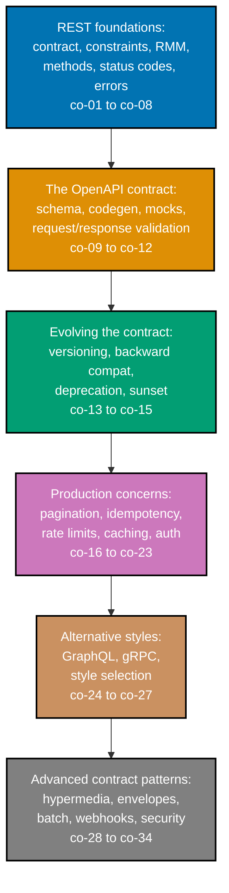

## Prerequisites

- **Prior topics**: [11 · Backend Essentials](../../backend-essentials/learning/overview.md) --
  HTTP verbs, status codes, routing, and JSON handling, assumed familiar throughout every tier's
  examples; `backend-at-scale` -- `[Unverified]` not yet present in the AyoKoding course library on
  disk, so no link is given here -- its absence does not block this topic, since idempotency, auth,
  and rate limiting are taught here from first principles (Examples 37-48) rather than assumed
  already known.
- **Tools & environment**: a macOS/Linux terminal and **Python 3.13+** with type hints and
  `pyright --strict`. Every example is pure standard library -- no web framework, database
  connection, or network call is ever required to run one.
- **Assumed knowledge**: serving a CRUD JSON API; reading and writing typed request/response models
  in Python; basic familiarity with HTTP status codes and headers.

## Why this exists -- the big idea

Design the contract first, and design for the caller you will never meet. Every one of this topic's
80 worked examples is a small, complete illustration of one piece of that discipline -- from naming
a resource as a noun rather than an RPC verb, through building a full OpenAPI contract by hand,
evolving that contract without breaking an existing caller, and handling the production realities of
retries, rate limits, and caching, to contrasting REST against GraphQL and gRPC and finally
assembling every idea into one versioned, paginated, idempotent API with a GraphQL facade over the
same data.

**Cross-cutting big ideas, taught here and carried through every tier**: `coupling-vs-cohesion` -- a
stable, well-documented contract decouples a client's release schedule from a server's; `consistency-
latency-throughput` -- pagination strategy, rate limiting, and the choice among REST, GraphQL, and
gRPC are all throughput-and-latency decisions wearing an API-style costume.

## How this topic's examples are organized

- **Beginner** (Examples 1-28) -- REST's own foundations: naming resources as nouns instead of
  RPC-style verbs, mapping CRUD onto HTTP methods and their idempotency guarantees, choosing the
  right status code for `201`/`202`/`204`/`409`/`422`, classifying an API by Richardson Maturity
  Model level, the stateless constraint and HATEOAS links, a consistent `problem+json` error
  envelope across three different endpoints, building a minimal OpenAPI 3.1 document up through a
  reusable component schema and JSON Schema 2020-12 keywords, validating both requests and live
  responses against that schema, generating a mock server and a typed client from the spec alone,
  offset and cursor pagination with a consistent envelope, and the three axes of content negotiation.
- **Intermediate** (Examples 29-56) -- evolving and operating a REST API: the three versioning
  strategies (URI path, header, query parameter) and their real-world precedents, adding a
  backward-compatible field versus catching a genuinely breaking one with a consumer contract test,
  the `Deprecation`/`Sunset` headers, full idempotency-key handling (record, replay, reject-on-
  mismatch), `429` plus structured `RateLimit` headers, `ETag`/`If-None-Match`/`Cache-Control`/
  `If-Match` HTTP caching and optimistic concurrency, bearer-token and API-key auth with a scope
  check, declaring security schemes in OpenAPI itself, partial responses and JSON:API sparse
  fieldsets, batch and bulk-create endpoints, HMAC-signed outbound webhooks, and a HAL hypermedia
  response.
- **Advanced** (Examples 57-80) -- the non-REST contrasts and a full contract-first assembly:
  GraphQL's schema, client-driven field selection, the N+1 resolver problem and DataLoader batching,
  a GraphQL mutation; gRPC's `.proto` service definitions and three of the four RPC kinds worked
  directly (unary, server-streaming, bidirectional), with client-streaming covered conceptually in
  the drilling track; REST/GraphQL/gRPC contrasted on caching and on
  how each evolves a field, plus a scenario-driven style-selection matrix; writing an OpenAPI spec
  BEFORE any code, implementing handlers that conform to it, and asserting live conformance;
  evolving `v1` to `v2` with a real deprecation window; combining idempotency with rate limiting on
  one endpoint; GraphQL's partial-errors model contrasted with REST's `problem+json`; Relay-style
  GraphQL cursor connections; a hypermedia-driven client; measuring a payload-size proxy for gRPC vs.
  REST; generating rendered docs from a spec; and a closing example assembling a versioned, paginated,
  idempotent REST API end to end.
- **[Capstone](./capstone/overview.md)** -- a small Articles API designed contract-first from an
  OpenAPI spec, implemented with cursor pagination and idempotent writes, hardened with rate
  limiting, and finally exposed through a second, GraphQL-shaped facade over the identical
  underlying data.

Every example is a complete, self-contained, originally-authored, genuinely-executed Python file
colocated under `learning/code/` -- run with `python3 example.py`. gRPC's and GraphQL's real-world
mechanics are simulated in pure standard library rather than depending on a live `grpcio` or
`graphql-core` installation, so every "Output" block on this course's pages is a real captured run,
never a fabricated transcript.

## Concepts

Every worked example in this topic's follow-up pages cites the `co-NN` concept it exercises -- this
section is the 1:1 reference those citations point back to.

### co-01 · API as Contract

An API is a promise to callers you don't control; its shape and its failure modes ARE the design,
not an afterthought bolted onto a working endpoint.

**Why it matters**: this framing is why every later concept in this topic treats consistency,
versioning, and error shape as first-class design decisions rather than implementation details --
once a caller depends on a response, changing it silently breaks a promise, not just some code.

**Verify it**: Example 72's spec-conformance test operationalizes the promise directly, asserting
live responses conform to the contract they published; the capstone's every step checks the same
promise against real, executed code.

### co-02 · Consumer-Driven Design

Designing for the caller you will never meet means reading responses tolerantly and never assuming a
client knows more about the server's internals than the published contract actually says.

**Why it matters**: a tolerant-reader client is what makes a server's additive, backward-compatible
change (co-14) actually safe in practice -- the guarantee only holds if clients are built to honor
it.

**Verify it**: Example 33 builds a tolerant-reader client that survives a server adding a field it
does not recognize.

### co-03 · REST Constraints

Fielding's six constraints -- client-server, stateless, cache, uniform interface, layered system,
code-on-demand (optional) -- with HATEOAS as the uniform interface's fourth sub-constraint.

**Why it matters**: these constraints are what "REST" formally means in Fielding's own dissertation
-- an API can be a perfectly good HTTP API while satisfying only some of them, which is exactly what
the Richardson Maturity Model (co-04) is built to measure.

**Verify it**: Example 10 demonstrates statelessness directly; Example 11 introduces HATEOAS links as
the uniform interface's fourth sub-constraint.

### co-04 · Richardson Maturity Model

The RMM ladder classifies how RESTful an API really is: L0 plain-old-XML/RPC, L1 resources, L2 HTTP
verbs + status codes, L3 hypermedia.

**Why it matters**: Fielding's own definition of REST requires L3 -- knowing where a real API sits on
this ladder is what separates "uses HTTP" from "is actually REST."

**Verify it**: Example 9 classifies three sample APIs across all four RMM levels.

### co-05 · Resource Modeling

Modeling nouns, not verbs -- plural collections and resource URIs (`/articles`, `/articles/{id}`)
instead of RPC-style endpoints (`/getArticle?id=1`).

**Why it matters**: this decision is what lets the HTTP method itself carry the verb, which is a
precondition for the uniform interface constraint (co-03) to make any sense at all.

**Verify it**: Example 1 models a resource collection and item; Example 2 runs the Example 1
verb-in-path classifier against an RPC-style path and its resource-style equivalent, showing the
classifier mislabels both identically.

### co-06 · HTTP Method Semantics

GET/POST/PUT/PATCH/DELETE and which are safe and idempotent per RFC 9110.

**Why it matters**: an idempotent method (PUT, DELETE) gives a client a safety guarantee a
non-idempotent one (POST) does not -- knowing which is which determines whether a client can safely
retry a call on its own, or needs an explicit idempotency key (co-18) instead.

**Verify it**: Example 3 maps CRUD onto the five methods; Example 4 demonstrates PUT's repeatability
against POST's lack of it directly.

### co-07 · Status-Code Design

Choosing the right status code: `201`/`202`/`204` for success variants, `400`/`401`/`403`/`404`/
`409`/`422`/`429` for the different ways a request can fail.

**Why it matters**: a caller's error-handling logic branches on the status code first -- picking the
WRONG code (say, `500` for a validation failure that is really a `422`) actively misleads every
client's retry and error-display logic.

**Verify it**: Example 5 through Example 8 cover `201`+`Location`, `202`+status URL, `204`+empty
body, and the `409`-vs-`422` distinction respectively.

### co-08 · Problem Details

RFC 9457's `application/problem+json` media type, with `type`/`title`/`status`/`detail`/`instance`
fields, as the error envelope.

**Why it matters**: a standardized, machine-parseable error shape lets a client write ONE error
handler instead of a bespoke one per endpoint -- the direct building block co-30 generalizes into a
uniform-envelope requirement across the whole API.

**Verify it**: Example 12 builds the base envelope; Example 14 extends it with field-level validation
errors for a `422`; Example 75 contrasts it against GraphQL's own error model.

### co-09 · OpenAPI Contract

OpenAPI 3.1 describing paths, operations, schemas, and reusable components as the machine-readable
source of truth for an API's contract.

**Why it matters**: a spec that TOOLING can read -- not just a human -- is what makes docs, mocks,
codegen, and live validation (co-11, co-12) possible without hand-writing each one separately.

**Verify it**: Example 15 writes a minimal `info`+`paths` document; Example 16 adds a reusable
`$ref`'d component schema; Example 18 declares every operation's possible responses; Example 70
writes the full spec BEFORE any handler code exists.

### co-10 · OpenAPI JSON Schema

OpenAPI 3.1's schemas align directly with JSON Schema Draft 2020-12, rather than a bespoke
OpenAPI-only dialect.

**Why it matters**: this alignment is what lets standard JSON Schema tooling -- validators, code
generators -- work against an OpenAPI document's schemas without a translation layer.

**Verify it**: Example 17 writes a schema using genuine JSON Schema 2020-12 keywords and validates
data against it.

### co-11 · OpenAPI Codegen and Mocking

Generating human-readable docs, a mock server, and a typed client directly from the spec.

**Why it matters**: a spec alone -- no real handler required -- is enough to unblock a frontend team
building against a not-yet-implemented endpoint's exact response shape.

**Verify it**: Example 21 serves a mock from the spec's own declared examples; Example 22 models a
generated typed client by hand; Example 79 generates rendered human docs from the same spec.

### co-12 · Request Validation

Validating BOTH a live incoming request and a live outgoing response against the OpenAPI schema.

**Why it matters**: validating only the request direction leaves a real gap -- a handler can still
silently drift from its own published response schema unless the response side is checked too.

**Verify it**: Example 19 validates a request body; Example 20 validates a live response; Example 71
implements handlers directly from the spec; Example 72 asserts end-to-end conformance.

### co-13 · Versioning Strategies

URI-path (`/v1/...`), header, and query-parameter (`?api-version=`) versioning, each a genuine
trade-off rather than a strictly-better option.

**Why it matters**: the strategy chosen affects HTTP-cache compatibility, discoverability, and how
much extra machinery a client needs to select a version -- co-27 covers when each specific force
favors one strategy over another.

**Verify it**: Example 29 through Example 31 implement URI-path, header, and query-param versioning
respectively; Example 73 evolves a real API from `v1` to `v2` using this same strategy.

### co-14 · Backward-Compatible Change

Additive, non-breaking evolution, enabled by the tolerant-reader rule (co-02) on the client side.

**Why it matters**: most real API changes should be additive -- reserving a new version (co-13) for
the rare, genuinely breaking change keeps the API's overall surface from multiplying unnecessarily.

**Verify it**: Example 32 adds an optional field without breaking old clients; Example 34's consumer
contract test catches a genuinely breaking removal instead.

### co-15 · Deprecation and Sunset

Signaling an endpoint's retirement with the `Deprecation` (RFC 9745) and `Sunset` (RFC 8594)
headers -- both notification-only, neither blocking the request.

**Why it matters**: giving integrators real advance notice and a concrete date is what turns a
retirement into a planned migration instead of a surprise outage.

**Verify it**: Example 35 sends `Deprecation`+`Link`; Example 36 sends `Sunset` with a date; Example
73 serves both API versions throughout the deprecation window.

### co-16 · Offset Pagination

`offset`/`limit` paging, and its fetch-and-discard cost as the offset grows.

**Why it matters**: understanding this cost (and its drift under concurrent inserts) is the specific
motivation for reaching for cursor pagination (co-17) once a dataset gets large or volatile.

**Verify it**: Example 23 implements offset/limit pagination and returns the correctly sliced page.

### co-17 · Cursor Pagination

Keyset/cursor paging, which stays stable under concurrent writes because it resumes from a position
IN the data rather than a raw row count.

**Why it matters**: a cursor's stability under concurrent inserts/deletes is what makes it the
correct default for a production list endpoint at any real scale.

**Verify it**: Example 24 implements cursor pagination; Example 76 applies the same idea inside a
GraphQL Relay-style connection; Example 80 combines it with idempotent writes end to end.

### co-18 · Idempotency Key

An `Idempotency-Key` header so a retried write applies exactly once -- Stripe's own prior art, since
the formal IETF draft lapsed.

**Why it matters**: this is the explicit, opt-in mechanism that makes a non-idempotent method (co-06,
POST) safely retryable, closing the exact gap PUT's own semantics do not leave open.

**Verify it**: Example 37 records a key; Example 38 replays it and gets the original response back;
Example 39 rejects a reused key paired with a different body; Example 74 combines this with rate
limiting; the capstone's `rest.py`/`limits.py` implement the full pattern against real writes.

### co-19 · Rate Limit 429

Communicating an exceeded limit with `429 Too Many Requests` plus an optional `Retry-After` header.

**Why it matters**: `Retry-After` turns a bare rejection into actionable guidance -- a caller knows
exactly how long to wait rather than guessing or retrying immediately into the same limit.

**Verify it**: Example 40 returns `429`+`Retry-After`; Example 74 establishes the specific ordering
of checking rate limits BEFORE idempotency on a combined endpoint; the capstone's `limits.py` runs
this exact ordering against genuinely executed calls.

### co-20 · RateLimit Headers

The structured `RateLimit`/`RateLimit-Policy` header fields, an active IETF draft exposing remaining
quota proactively on every response.

**Why it matters**: exposing quota BEFORE it runs out lets a well-behaved caller self-throttle,
rather than discovering the limit only reactively via a `429`.

**Verify it**: Example 41 exposes the structured headers; Example 42 shows the remaining counter
decrementing to zero across successive calls.

### co-21 · Content Negotiation

`Accept`/`Content-Type`/`Accept-Language` choosing representation format and response language.

**Why it matters**: these three headers negotiate three genuinely different axes of the same
response -- format IN, format OUT, and language -- and conflating them is a common source of
confusingly wrong responses.

**Verify it**: Example 26 sets `Content-Type`; Example 27 uses `Accept` to choose JSON vs. CSV;
Example 28 uses `Accept-Language` to select a localized message.

### co-22 · HTTP Caching and ETag

`Cache-Control`, `ETag`+`If-None-Match` producing a `304`, and `If-Match` as optimistic concurrency
on writes.

**Why it matters**: `ETag`-based caching saves bandwidth on unchanged reads, while `If-Match` on a
WRITE protects against a lost update -- the same tagging mechanism serving two different, equally
important purposes.

**Verify it**: Example 43 through Example 45 cover `ETag`/`304`, `Cache-Control: max-age`, and
`If-Match`'s `412` rejection respectively.

### co-23 · Auth Bearer Token

API keys, OAuth 2.0 bearer tokens (`Authorization: Bearer`, RFC 6750), and scopes gating what an
otherwise-valid token is allowed to do.

**Why it matters**: token VALIDITY and token SCOPE are two separate checks -- a genuinely valid token
can still lack the permission a specific operation requires, which is why a scope failure returns
`403`, not `401`.

**Verify it**: Example 46 checks bearer-token presence; Example 47 checks an API key; Example 48
gates an operation on a required scope.

### co-24 · GraphQL Schema

GraphQL's type system, single endpoint, and client-specified field selection.

**Why it matters**: letting the CALLER'S query decide the response shape is what directly solves
REST's fixed-shape over-fetching and under-fetching problem for callers with genuinely different data
needs.

**Verify it**: Example 57 defines a schema; Example 58 selects exactly the requested fields; Example
59 measures the same data fetched via REST vs. GraphQL; Example 62 applies the same selective shape
to a write.

### co-25 · GraphQL Resolver N+1

Resolvers, and the N+1 problem that emerges when a naive resolver fetches related data one row at a
time across a list, fixed with DataLoader-style batching.

**Why it matters**: an unbatched resolver's query count grows LINEARLY with result size -- a real,
measurable performance bug that DataLoader collapses back down to a constant number of queries.

**Verify it**: Example 60 resolves a single field; Example 61 shows the N+1 pattern and its
DataLoader fix.

### co-26 · gRPC Protobuf

gRPC's Protocol Buffers IDL over HTTP/2, with four RPC kinds: unary, server-streaming,
client-streaming, and bidirectional.

**Why it matters**: Protobuf is both the interface-definition language AND the wire format in one
artifact -- a genuinely different contract-and-encoding model from OpenAPI's separation of a JSON
Schema-based contract from a plain-JSON wire format.

**Verify it**: Example 63 writes a `.proto` service; Example 64 through Example 66 exercise unary,
server-streaming, and bidirectional RPCs respectively.

### co-27 · Style Selection

The forces that pick REST vs. GraphQL vs. gRPC -- caching, over/under-fetching, and evolution -- not
a single universal winner.

**Why it matters**: presenting any one style as a strict upgrade over another obscures the real,
concrete trade-off each one makes -- this concept is the discipline of naming the SPECIFIC force
driving a choice, rather than defaulting to a general preference.

**Verify it**: Example 67 contrasts caching behavior across all three styles; Example 68 contrasts
field evolution; Example 69's decision matrix picks a style per scenario with a stated rationale;
Example 78 measures a concrete payload-size proxy for gRPC vs. REST.

### co-28 · HATEOAS and Hypermedia

Hypermedia formats -- HAL's `_links`/`_embedded`, JSON:API -- that let a client follow links instead
of hardcoding URLs.

**Why it matters**: a hypermedia-driven client keeps working if the server later restructures its
URLs, as long as the LINK RELATIONS stay stable -- a hardcoded-URL client has no such protection.

**Verify it**: Example 11 introduces `_links`; Example 56 builds a full HAL response; Example 77
builds a client that navigates purely by following links.

### co-29 · Pagination Envelope

A consistent list envelope -- `data` + `has_more` + `next_cursor` -- applied uniformly across every
list endpoint.

**Why it matters**: a client's paging loop works identically everywhere once every list endpoint
shares the same envelope shape, rather than re-learning a slightly different pattern per endpoint.

**Verify it**: Example 25 builds the envelope and verifies its shape directly.

### co-30 · Error Envelope Consistency

One documented error shape (co-08's `problem+json`) used uniformly across every single endpoint in
the API.

**Why it matters**: uniformity is what lets a caller write error-handling logic ONCE and apply it
everywhere -- an individually well-designed but inconsistent error shape per endpoint defeats that
entirely.

**Verify it**: Example 13 shows the identical shape returned by three different endpoints; Example 75
contrasts this REST-side consistency against GraphQL's genuinely different partial-errors model;
Example 80 carries the same envelope into the capstone-preview's end-to-end assembly.

### co-31 · Partial Response / Field Selection

Sparse fieldsets or field filtering (`?fields=`) so a REST caller fetches only the fields it actually
needs.

**Why it matters**: this solves the SAME over-fetching problem GraphQL's field selection (co-24)
solves, but as an addition on top of an otherwise ordinary REST endpoint, without switching styles
entirely.

**Verify it**: Example 50 implements `?fields=`; Example 51 implements JSON:API's standardized sparse
fieldsets.

### co-32 · Bulk / Batch Endpoints

Batch (`POST /batch`, heterogeneous operations) and bulk-create (many of the same resource type)
endpoint designs for applying many changes in one request.

**Why it matters**: collapsing N round trips into one directly reduces the network-latency overhead
N separate calls would otherwise each pay individually -- a concrete `consistency-latency-throughput`
trade-off.

**Verify it**: Example 52 implements a batch endpoint reporting each sub-result; Example 53
implements a dedicated bulk-create endpoint.

### co-33 · Webhook API Surface

Outbound webhook events, HMAC-signed, as a first-class part of the API surface rather than an
afterthought.

**Why it matters**: HTTPS alone protects a webhook payload in transit but says nothing about WHO is
calling the receiving endpoint -- an HMAC signature is authentication layered on top of transport
security, not a substitute for it.

**Verify it**: Example 54 registers a webhook subscription; Example 55 signs the outbound payload
with HMAC and verifies the signature matches.

### co-34 · OpenAPI Security Schemes

Declaring `bearer`/`apiKey` auth directly inside the OpenAPI contract itself, not just in prose
documentation.

**Why it matters**: a machine-readable security declaration lets the SAME tooling that reads
`paths`/`components` (co-09, co-11) also generate a working "Authorize" control or a client that
already knows how to attach the right header.

**Verify it**: Example 49 declares a security scheme in the spec and verifies it is documented there.

## Examples by Level

### Beginner (Examples 1–28)

- [Example 1: Resource-Noun URIs](/en/learn/courses/api-design/learning/beginner#example-1-resource-noun-uris)
- [Example 2: RPC-Style vs. Resource-Style URIs](/en/learn/courses/api-design/learning/beginner#example-2-rpc-style-vs-resource-style-uris)
- [Example 3: Mapping CRUD onto HTTP Methods](/en/learn/courses/api-design/learning/beginner#example-3-mapping-crud-onto-http-methods)
- [Example 4: PUT Is Idempotent, POST Is Not](/en/learn/courses/api-design/learning/beginner#example-4-put-is-idempotent-post-is-not)
- [Example 5: 201 Created + Location](/en/learn/courses/api-design/learning/beginner#example-5-201-created--location)
- [Example 6: 202 Accepted for a Long-Running Operation](/en/learn/courses/api-design/learning/beginner#example-6-202-accepted-for-a-long-running-operation)
- [Example 7: 204 No Content for DELETE](/en/learn/courses/api-design/learning/beginner#example-7-204-no-content-for-delete)
- [Example 8: 409 Conflict vs. 422 Unprocessable Content](/en/learn/courses/api-design/learning/beginner#example-8-409-conflict-vs-422-unprocessable-content)
- [Example 9: Classify Three APIs by Richardson Maturity Model Level](/en/learn/courses/api-design/learning/beginner#example-9-classify-three-apis-by-richardson-maturity-model-level)
- [Example 10: The Stateless Constraint](/en/learn/courses/api-design/learning/beginner#example-10-the-stateless-constraint)
- [Example 11: HATEOAS -- Following Links Instead of Hardcoding URLs](/en/learn/courses/api-design/learning/beginner#example-11-hateoas----following-links-instead-of-hardcoding-urls)
- [Example 12: The application/problem+json Error Envelope](/en/learn/courses/api-design/learning/beginner#example-12-the-applicationproblemjson-error-envelope)
- [Example 13: The Same Error Shape Across Three Endpoints](/en/learn/courses/api-design/learning/beginner#example-13-the-same-error-shape-across-three-endpoints)
- [Example 14: Field-Level Validation Errors in problem+json](/en/learn/courses/api-design/learning/beginner#example-14-field-level-validation-errors-in-problemjson)
- [Example 15: A Minimal OpenAPI 3.1 Document](/en/learn/courses/api-design/learning/beginner#example-15-a-minimal-openapi-31-document)
- [Example 16: A Reusable Component Schema via $ref](/en/learn/courses/api-design/learning/beginner#example-16-a-reusable-component-schema-via-ref)
- [Example 17: OpenAPI 3.1 Schemas Are JSON Schema Draft 2020-12](/en/learn/courses/api-design/learning/beginner#example-17-openapi-31-schemas-are-json-schema-draft-2020-12)
- [Example 18: Declaring 200/404/422 per Operation](/en/learn/courses/api-design/learning/beginner#example-18-declaring-200404422-per-operation)
- [Example 19: Validating a Request Body Against the Schema](/en/learn/courses/api-design/learning/beginner#example-19-validating-a-request-body-against-the-schema)
- [Example 20: Validating a Live Response Against the Spec](/en/learn/courses/api-design/learning/beginner#example-20-validating-a-live-response-against-the-spec)
- [Example 21: Serving a Mock from the Spec's Own Examples](/en/learn/courses/api-design/learning/beginner#example-21-serving-a-mock-from-the-specs-own-examples)
- [Example 22: A Generated Typed Client, Modeled by Hand](/en/learn/courses/api-design/learning/beginner#example-22-a-generated-typed-client-modeled-by-hand)
- [Example 23: Offset/Limit Pagination](/en/learn/courses/api-design/learning/beginner#example-23-offsetlimit-pagination)
- [Example 24: Cursor Pagination](/en/learn/courses/api-design/learning/beginner#example-24-cursor-pagination)
- [Example 25: A Consistent Pagination Envelope](/en/learn/courses/api-design/learning/beginner#example-25-a-consistent-pagination-envelope)
- [Example 26: Content-Type: application/json](/en/learn/courses/api-design/learning/beginner#example-26-content-type-applicationjson)
- [Example 27: Accept Chooses JSON vs. CSV](/en/learn/courses/api-design/learning/beginner#example-27-accept-chooses-json-vs-csv)
- [Example 28: Accept-Language Selects a Localized Message](/en/learn/courses/api-design/learning/beginner#example-28-accept-language-selects-a-localized-message)

### Intermediate (Examples 29–56)

- [Example 29: Versioning via the URI Path](/en/learn/courses/api-design/learning/intermediate#example-29-versioning-via-the-uri-path)
- [Example 30: Versioning via a Request Header](/en/learn/courses/api-design/learning/intermediate#example-30-versioning-via-a-request-header)
- [Example 31: Versioning via a Query Parameter](/en/learn/courses/api-design/learning/intermediate#example-31-versioning-via-a-query-parameter)
- [Example 32: Adding an Optional Field Is Backward-Compatible](/en/learn/courses/api-design/learning/intermediate#example-32-adding-an-optional-field-is-backward-compatible)
- [Example 33: The Tolerant Reader -- a Client That Ignores Unknown Fields](/en/learn/courses/api-design/learning/intermediate#example-33-the-tolerant-reader----a-client-that-ignores-unknown-fields)
- [Example 34: A Consumer Contract Test Catches a Breaking Change](/en/learn/courses/api-design/learning/intermediate#example-34-a-consumer-contract-test-catches-a-breaking-change)
- [Example 35: The Deprecation Header](/en/learn/courses/api-design/learning/intermediate#example-35-the-deprecation-header)
- [Example 36: The Sunset Header](/en/learn/courses/api-design/learning/intermediate#example-36-the-sunset-header)
- [Example 37: Recording an Idempotency-Key on a Write](/en/learn/courses/api-design/learning/intermediate#example-37-recording-an-idempotency-key-on-a-write)
- [Example 38: Replaying the Same Idempotency-Key](/en/learn/courses/api-design/learning/intermediate#example-38-replaying-the-same-idempotency-key)
- [Example 39: Reusing an Idempotency-Key with a Different Body](/en/learn/courses/api-design/learning/intermediate#example-39-reusing-an-idempotency-key-with-a-different-body)
- [Example 40: 429 Too Many Requests + Retry-After](/en/learn/courses/api-design/learning/intermediate#example-40-429-too-many-requests--retry-after)
- [Example 41: Structured RateLimit / RateLimit-Policy Headers](/en/learn/courses/api-design/learning/intermediate#example-41-structured-ratelimit--ratelimit-policy-headers)
- [Example 42: The Remaining Counter Decrements to Zero](/en/learn/courses/api-design/learning/intermediate#example-42-the-remaining-counter-decrements-to-zero)
- [Example 43: ETag + If-None-Match -> 304 Not Modified](/en/learn/courses/api-design/learning/intermediate#example-43-etag--if-none-match---304-not-modified)
- [Example 44: The Cache-Control: max-age Directive](/en/learn/courses/api-design/learning/intermediate#example-44-the-cache-control-max-age-directive)
- [Example 45: Optimistic Concurrency with If-Match](/en/learn/courses/api-design/learning/intermediate#example-45-optimistic-concurrency-with-if-match)
- [Example 46: Authorization: Bearer <token>](/en/learn/courses/api-design/learning/intermediate#example-46-authorization-bearer-token)
- [Example 47: The X-API-Key Header](/en/learn/courses/api-design/learning/intermediate#example-47-the-x-api-key-header)
- [Example 48: Scope-Gated Authorization](/en/learn/courses/api-design/learning/intermediate#example-48-scope-gated-authorization)
- [Example 49: Declaring bearer/apiKey Security Schemes in OpenAPI](/en/learn/courses/api-design/learning/intermediate#example-49-declaring-bearerapikey-security-schemes-in-openapi)
- [Example 50: ?fields= Selects a Subset of Returned Fields](/en/learn/courses/api-design/learning/intermediate#example-50-fields-selects-a-subset-of-returned-fields)
- [Example 51: JSON:API Sparse Fieldsets](/en/learn/courses/api-design/learning/intermediate#example-51-jsonapi-sparse-fieldsets)
- [Example 52: POST /batch -- N Sub-Operations, One Request](/en/learn/courses/api-design/learning/intermediate#example-52-post-batch----n-sub-operations-one-request)
- [Example 53: Bulk-Creating Many Resources in One Request](/en/learn/courses/api-design/learning/intermediate#example-53-bulk-creating-many-resources-in-one-request)
- [Example 54: Registering a Webhook Subscription](/en/learn/courses/api-design/learning/intermediate#example-54-registering-a-webhook-subscription)
- [Example 55: Signing an Outbound Webhook Payload with HMAC](/en/learn/courses/api-design/learning/intermediate#example-55-signing-an-outbound-webhook-payload-with-hmac)
- [Example 56: A HAL Response with \_links and \_embedded](/en/learn/courses/api-design/learning/intermediate#example-56-a-hal-response-with-_links-and-_embedded)

### Advanced (Examples 57–80)

- [Example 57: Defining a GraphQL Schema and Types](/en/learn/courses/api-design/learning/advanced#example-57-defining-a-graphql-schema-and-types)
- [Example 58: A Client Selects Exactly the Fields It Needs](/en/learn/courses/api-design/learning/advanced#example-58-a-client-selects-exactly-the-fields-it-needs)
- [Example 59: The Same Data via REST vs GraphQL](/en/learn/courses/api-design/learning/advanced#example-59-the-same-data-via-rest-vs-graphql)
- [Example 60: A Resolver Resolving a Field](/en/learn/courses/api-design/learning/advanced#example-60-a-resolver-resolving-a-field)
- [Example 61: An N+1 Resolver, Then a DataLoader Batch](/en/learn/courses/api-design/learning/advanced#example-61-an-n1-resolver-then-a-dataloader-batch)
- [Example 62: A Mutation Writes Data](/en/learn/courses/api-design/learning/advanced#example-62-a-mutation-writes-data)
- [Example 63: Writing a .proto Service + Messages](/en/learn/courses/api-design/learning/advanced#example-63-writing-a-proto-service--messages)
- [Example 64: A Unary RPC](/en/learn/courses/api-design/learning/advanced#example-64-a-unary-rpc)
- [Example 65: A Server-Streaming RPC](/en/learn/courses/api-design/learning/advanced#example-65-a-server-streaming-rpc)
- [Example 66: A Bidirectional-Streaming RPC](/en/learn/courses/api-design/learning/advanced#example-66-a-bidirectional-streaming-rpc)
- [Example 67: Contrasting REST, GraphQL, and gRPC on Caching](/en/learn/courses/api-design/learning/advanced#example-67-contrasting-rest-graphql-and-grpc-on-caching)
- [Example 68: How Each Style Evolves a Field](/en/learn/courses/api-design/learning/advanced#example-68-how-each-style-evolves-a-field)
- [Example 69: Picking a Style per Scenario, With a Rationale](/en/learn/courses/api-design/learning/advanced#example-69-picking-a-style-per-scenario-with-a-rationale)
- [Example 70: Writing the OpenAPI Spec Before Any Code](/en/learn/courses/api-design/learning/advanced#example-70-writing-the-openapi-spec-before-any-code)
- [Example 71: Implementing Handlers From the Spec](/en/learn/courses/api-design/learning/advanced#example-71-implementing-handlers-from-the-spec)
- [Example 72: Asserting Live Responses Conform to the Spec](/en/learn/courses/api-design/learning/advanced#example-72-asserting-live-responses-conform-to-the-spec)
- [Example 73: Evolving v1 -> v2 With a Deprecation Window](/en/learn/courses/api-design/learning/advanced#example-73-evolving-v1---v2-with-a-deprecation-window)
- [Example 74: Combining Idempotency + Rate Limiting on One Endpoint](/en/learn/courses/api-design/learning/advanced#example-74-combining-idempotency--rate-limiting-on-one-endpoint)
- [Example 75: GraphQL Partial Errors vs REST problem+json](/en/learn/courses/api-design/learning/advanced#example-75-graphql-partial-errors-vs-rest-problemjson)
- [Example 76: Relay-Style Cursor Connections in GraphQL](/en/learn/courses/api-design/learning/advanced#example-76-relay-style-cursor-connections-in-graphql)
- [Example 77: A Client That Follows Links Instead of Hardcoded URLs](/en/learn/courses/api-design/learning/advanced#example-77-a-client-that-follows-links-instead-of-hardcoded-urls)
- [Example 78: Measuring gRPC vs REST Round-Trip](/en/learn/courses/api-design/learning/advanced#example-78-measuring-grpc-vs-rest-round-trip)
- [Example 79: Generating Human Docs (Swagger UI / Redoc) From the Spec](/en/learn/courses/api-design/learning/advanced#example-79-generating-human-docs-swagger-ui--redoc-from-the-spec)
- [Example 80: A Versioned REST API From an OpenAPI Spec, End to End](/en/learn/courses/api-design/learning/advanced#example-80-a-versioned-rest-api-from-an-openapi-spec-end-to-end)

---

← Previous: [Overview](../overview.md) · Next: [Beginner Examples](./beginner.md) →
