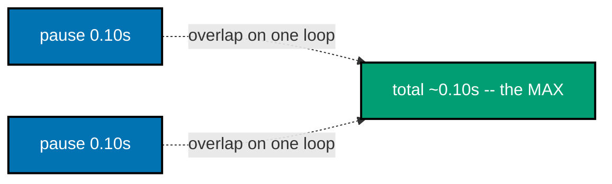
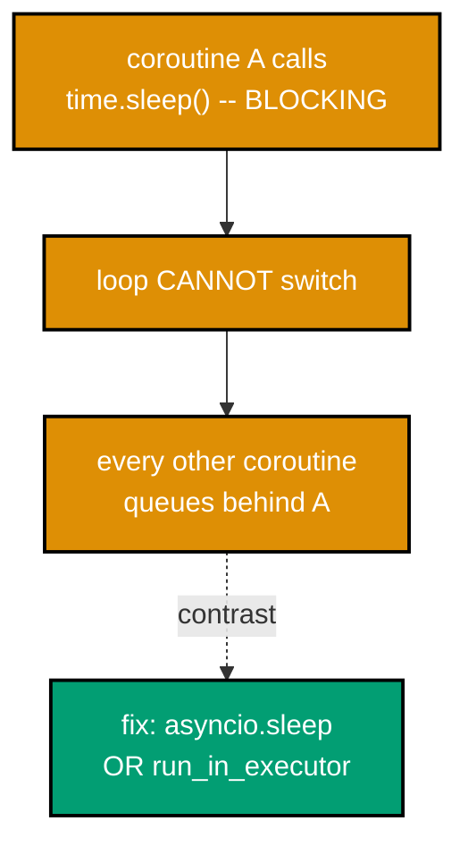
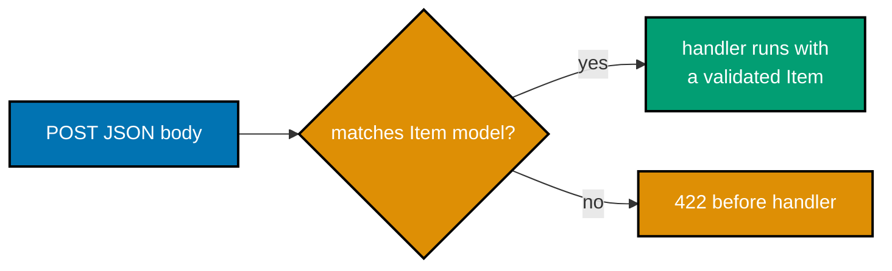

Examples 1-18 build the async/event-loop mental model and the `uv`/`ruff`/`pyright` tooling triad first, then
move into FastAPI basics: a first route, typed path and query parameters, a Pydantic request body, the
automatic 422, a `response_model`, and the generated OpenAPI docs. Every example is a complete, self-contained
Python module colocated under `learning/code/`; run the pure-asyncio examples (1-8, 11) with `python3
example.py` and the FastAPI examples (12-18) under `uvicorn app:app --port 8000` from inside their own
directory, then exercise them with `curl` from a second terminal.

---

### Example 1: First Coroutine via asyncio Run

_ex-01 &middot; exercises co-01, co-02_

The absolute minimum async program: an `async def` coroutine awaited via `asyncio.run`. Calling a coroutine
does not run it -- it returns a coroutine object you must schedule, and `asyncio.run` is the one correct
top-level driver.

**`learning/code/ex-01-first-coroutine/example.py`**

```python
"""Example 1: First Coroutine via asyncio Run."""

# => asyncio is the standard-library event loop -- no third-party package is needed (co-02)
import asyncio  # => the module that owns the loop, coroutines, Tasks, and gather


async def greet() -> str:  # => "async def" makes this a COROUTINE, not a normal function (co-01)
    # => calling greet() does NOT run the body -- it returns a coroutine OBJECT you must schedule
    await asyncio.sleep(0.01)  # => await SUSPENDS greet, handing control back to the loop for ~10ms
    # => while suspended the loop is free to run OTHER coroutines -- that is the whole point (co-02)
    return "hello from a coroutine"  # => the value the awaiter receives once this completes


def main() -> None:  # => a plain (non-async) entry point -- the bridge into the async world
    # => asyncio.run creates a FRESH event loop, runs one coroutine to completion, then closes it
    message = asyncio.run(greet())  # => the ONLY correct top-level driver for a coroutine (co-01)
    print(message)  # => Output: hello from a coroutine


if __name__ == "__main__":  # => only runs when executed directly, not on import
    main()  # => drives the coroutine via asyncio.run
```

**Run**: `python3 example.py`

**Output**:

```text
hello from a coroutine
```

**Key takeaway**: `async def` defines a coroutine; `asyncio.run` is the bridge that drives one to completion from
synchronous top-level code.

**Why it matters**: every async service in this topic is, at bottom, a coroutine driven by an event loop. Seeing
the smallest possible loop-driving call once is what makes `uvicorn` (which runs the loop for you) legible rather
than magical later -- it is doing exactly what `asyncio.run` does here, just for a long-running server.

---

### Example 2: Sequential Awaits Add Up

_ex-02 &middot; exercises co-01, co-02_

Two awaits written one after the other run serially: the second begins only after the first completes, so the
total wall-clock time is approximately the sum of both waits.


**`learning/code/ex-02-await-sequential/example.py`**

```python
"""Example 2: Sequential Awaits Add Up."""

import asyncio  # => the event-loop module (co-02)
import time  # => only to MEASURE wall-clock time, never to "sleep" inside a coroutine (see ex-07)


async def pause(seconds: float) -> str:  # => a coroutine that simply waits, then returns a label
    # => await yields to the loop for the given duration -- other coroutines could run meanwhile (co-01)
    await asyncio.sleep(seconds)  # => the awaitable here is asyncio.sleep's coroutine
    return f"paused {seconds}s"  # => returned to whoever awaits this coroutine


async def main() -> tuple[str, str, float]:  # => two awaits IN SEQUENCE -- the second starts after the first ends
    start = time.perf_counter()  # => capture start time BEFORE the first await
    first = await pause(0.10)  # => awaited alone: the loop waits ~0.10s, doing nothing else here
    # => only AFTER first completes does the second await even begin -- they are SERIAL
    second = await pause(0.10)  # => a second ~0.10s wait, stacked after the first
    elapsed = time.perf_counter() - start  # => total wall-clock cost of BOTH waits
    # => elapsed is ~0.20s -- the SUM, because nothing ran concurrently (contrast ex-03)
    return first, second, elapsed


if __name__ == "__main__":  # => only runs when executed directly
    f, s, elapsed = asyncio.run(main())  # => drive the async main with a fresh loop
    print(f)  # => Output: paused 0.1s
    print(s)  # => Output: paused 0.1s
    print(f"elapsed={elapsed:.3f}s")  # => Output: elapsed=0.20Xs (the sum of both waits)
```

**Run**: `python3 example.py`

**Output**:

```text
paused 0.1s
paused 0.1s
elapsed=0.200s
```

**Key takeaway**: two `await`s in sequence pay the sum of their waits, because nothing runs concurrently.

**Why it matters**: this is the baseline against which Example 3's concurrency win is measured. Knowing that
sequential awaits add up is what makes the `gather` speedup in the next example a concrete, measurable
difference rather than a claim you have to take on faith.

---

### Example 3: Concurrent Awaits with gather

_ex-03 &middot; exercises co-04_

`asyncio.gather` schedules both waits concurrently and waits for all of them, so the two waits overlap on one
loop and the total time is approximately the slower one, not the sum.



**`learning/code/ex-03-gather-concurrent/example.py`**

```python
"""Example 3: Concurrent Awaits with gather."""

import asyncio  # => the event-loop module -- gather lives here (co-04)
import time  # => wall-clock measurement only


async def pause(seconds: float) -> str:  # => the SAME coroutine as ex-02
    await asyncio.sleep(seconds)  # => yields to the loop for the given duration (co-01)
    return f"paused {seconds}s"  # => labelled result


async def main() -> tuple[list[str], float]:  # => results come back IN ORDER, time is the MAX
    start = time.perf_counter()  # => capture start before fanning out
    # => asyncio.gather SCHEDULES both coroutines concurrently and waits for ALL of them (co-04)
    # => the loop interleaves the two waits, so they overlap instead of stacking
    results = await asyncio.gather(pause(0.10), pause(0.10))  # => returns a list, order preserved
    elapsed = time.perf_counter() - start  # => total cost is ~the SLOWER call, not the sum
    # => contrast ex-02's ~0.20s: same two waits, but ~0.10s here -- the concurrency win (co-04)
    return results, elapsed


if __name__ == "__main__":  # => only runs when executed directly
    results, elapsed = asyncio.run(main())  # => drive the async main
    print(results)  # => Output: ['paused 0.1s', 'paused 0.1s']
    print(f"elapsed={elapsed:.3f}s")  # => Output: elapsed=0.10Xs (the max, not the sum)
```

**Run**: `python3 example.py`

**Output**:

```text
['paused 0.1s', 'paused 0.1s']
elapsed=0.101s
```

**Key takeaway**: `gather` runs awaitables concurrently on one loop; the caller pays the slowest wait, not the
sum, and results come back in submission order.

**Why it matters**: this is the central throughput win of an async service. A handler that fans out to two
slow upstream calls (Example 28) pays the slower call's latency; a handler that awaits them sequentially pays
both. The difference, multiplied across thousands of requests, is the entire reason to reach for `async` for
I/O-bound work.

---

### Example 4: Scheduling Background Work as a Task

_ex-04 &middot; exercises co-04_

`asyncio.create_task` wraps a coroutine in a `Task` and schedules it on the loop immediately, so it runs in the
background while the current coroutine does other work. Awaiting the task later collects its result.

**`learning/code/ex-04-create-task/example.py`**

```python
"""Example 4: Scheduling Background Work as a Task."""

import asyncio  # => create_task and gather live here (co-04)


async def step(label: str, seconds: float) -> str:  # => a unit of background work
    await asyncio.sleep(seconds)  # => yields to the loop while "working" (co-01)
    return f"{label} done"  # => the value the Task resolves to


async def main() -> list[str]:  # => schedules work, does other things, then collects results
    # => create_task WRAPS a coroutine in a Task and schedules it on the loop IMMEDIATELY (co-04)
    # => the coroutine starts running as soon as the loop gets control -- it does not wait to be awaited
    task = asyncio.create_task(step("background", 0.05))  # => running concurrently, in the background
    # => this await runs CONCURRENTLY with the task above -- both make progress on one loop
    foreground = await step("foreground", 0.05)  # => awaited directly, in the foreground
    # => awaiting the Task COLLECTS its result; if it already finished, this returns immediately
    background = await task  # => no extra wait if the task completed during the foreground await
    return [foreground, background]  # => both completed, in the order we collect them


if __name__ == "__main__":  # => only runs when executed directly
    results = asyncio.run(main())  # => drive the async main
    print(results)  # => Output: ['foreground done', 'background done']
```

**Run**: `python3 example.py`

**Output**:

```text
['foreground done', 'background done']
```

**Key takeaway**: `create_task` schedules a coroutine to run concurrently; awaiting the task later collects its
result without re-running it.

**Why it matters**: `create_task` is how a handler kicks off a concurrent side computation and then continues
other work, collecting the result only when it is actually needed. It is the building block behind `gather`
(which schedules many tasks at once) and behind every concurrent fan-out in this topic.

---

### Example 5: Managing a Resource with async with

_ex-05 &middot; exercises co-05_

`async with` runs an async resource's `__aenter__` setup and `__aexit__` teardown, both of which may themselves
`await`. The resource is available only inside the block, and teardown runs even if the body raises.

**`learning/code/ex-05-async-with-resource/example.py`**

```python
"""Example 5: Managing a Resource with async with."""

import asyncio  # => the event-loop module (co-02)


class AsyncConnection:  # => models a resource whose acquire/release themselves need to await (co-05)
    async def __aenter__(self) -> "AsyncConnection":  # => async context-manager ENTRY -- runs on "async with"
        await asyncio.sleep(0.01)  # => simulate an async "connect" that yields to the loop
        print("opened")  # => confirms setup ran
        return self  # => the bound resource handed to the "as" name

    async def __aexit__(self, exc_type: object, exc: object, tb: object) -> None:  # => EXIT -- runs on block exit
        await asyncio.sleep(0.01)  # => simulate an async "close" that yields to the loop
        print("closed")  # => confirms teardown ran even if the body raised


async def main() -> None:  # => demonstrates the setup/body/teardown order
    async with AsyncConnection() as conn:  # => __aenter__ runs, then the body, then __aexit__ (co-05)
        _ = conn  # => the live resource is available only INSIDE the block
        print("using")  # => body runs between "opened" and "closed"


if __name__ == "__main__":  # => only runs when executed directly
    asyncio.run(main())  # => Output order: opened / using / closed
```

**Run**: `python3 example.py`

**Output**:

```text
opened
using
closed
```

**Key takeaway**: `async with` guarantees async setup and teardown run in order, even if the block body raises.

**Why it matters**: a database connection (Example 20) and an HTTP response body (Example 43) are both async
resources -- forgetting `async with` around them leaks a connection or a socket. Building the mechanic by hand
here is what makes the framework's "just `async with` the session" pattern in the intermediate tier legible
rather than magical.

---

### Example 6: Consuming an Async Stream with async for

_ex-06 &middot; exercises co-05_

`async for` pulls items from an async generator one at a time, awaiting the generator between items. This is
how a handler consumes a stream whose items arrive asynchronously.

**`learning/code/ex-06-async-for-stream/example.py`**

```python
"""Example 6: Consuming an Async Stream with async for."""

import asyncio  # => the event-loop module (co-02)
from collections.abc import AsyncIterator  # => the typed return shape of an async generator (co-05)


async def emit(count: int) -> AsyncIterator[int]:  # => an ASYNC GENERATOR -- "async def" + "yield"
    for i in range(count):  # => produces one item per iteration
        await asyncio.sleep(0.01)  # => yields to the loop between items (co-01)
        yield i  # => hands one value to the consumer, then resumes here on the next pull (co-05)


async def main() -> list[int]:  # => consumes the whole stream into a list
    collected: list[int] = []  # => accumulator for the values pulled from the stream
    # => "async for" PULLS the next item, awaiting the generator between each one (co-05)
    async for value in emit(3):  # => each iteration awaits the generator's next "yield"
        collected.append(value)  # => values arrive one at a time, 0 then 1 then 2
    return collected  # => the full stream, materialised in order


if __name__ == "__main__":  # => only runs when executed directly
    result = asyncio.run(main())  # => drive the async main
    print(result)  # => Output: [0, 1, 2]
```

**Run**: `python3 example.py`

**Output**:

```text
[0, 1, 2]
```

**Key takeaway**: an async generator yields values across `await` points; `async for` pulls them one at a time.

**Why it matters**: the streaming endpoints later in this topic (Examples 36, 37, 72) are all async generators
consumed by `async for` under the hood. Understanding the pull mechanic here is what makes a
`StreamingResponse` that yields chunks intelligible later.

---

### Example 7: A Blocking Call Stalls the Loop

_ex-07 &middot; exercises co-06_

The single most common async bug: a synchronous blocking call (like `time.sleep`) inside a coroutine freezes
the **entire** loop, because the loop cannot switch to any other coroutine while it runs. This example proves
the stall, then shows the fix -- an async-native call, or offloading to an executor.



**`learning/code/ex-07-blocking-call-stalls-loop/example.py`**

```python
"""Example 7: A Blocking Call Stalls the Loop.

The single most common async bug: a SYNCHRONOUS blocking call inside a coroutine freezes the WHOLE loop,
not just that coroutine. This example proves it, then shows the two correct fixes.
"""

import asyncio  # => the event-loop module (co-02)
import time  # => time.sleep is BLOCKING -- the hazard itself (co-06)


async def good_wait(seconds: float) -> str:  # => the CORRECT async sleep -- yields to the loop
    await asyncio.sleep(seconds)  # => other coroutines keep running during this wait (co-01)
    return "good"


async def bad_wait(seconds: float) -> str:  # => the HAZARD: time.sleep blocks the entire loop (co-06)
    time.sleep(seconds)  # => NO await -- the loop CANNOT switch to any other coroutine while this runs
    return "bad"


async def fixed_wait(seconds: float) -> str:  # => the FIX for genuinely blocking code: offload it (co-06, ex-08)
    loop = asyncio.get_running_loop()  # => fetch the loop this coroutine is running on
    # => run_in_executor pushes the blocking call onto a thread, so the loop stays responsive
    await loop.run_in_executor(None, time.sleep, seconds)  # => the loop is free while the thread blocks
    return "fixed"


async def main() -> dict[str, float]:  # => times BOTH orderings to expose the stall
    start = time.perf_counter()  # => baseline
    await asyncio.gather(bad_wait(0.10), good_wait(0.10))  # => bad blocks good: total ~0.20s, not ~0.10s
    stalled = time.perf_counter() - start  # => the stall made the concurrent pair take the SUM
    # => the fix: offloaded blocking work no longer blocks the loop, so good_wait overlaps it again
    start2 = time.perf_counter()  # => baseline for the fixed run
    await asyncio.gather(fixed_wait(0.10), good_wait(0.10))  # => both run concurrently again
    fixed = time.perf_counter() - start2  # => ~0.10s -- the max, concurrency restored
    return {"stalled": stalled, "fixed": fixed}


if __name__ == "__main__":  # => only runs when executed directly
    times = asyncio.run(main())  # => drive the async main
    print(f"stalled={times['stalled']:.3f}s")  # => Output: stalled=0.20Xs (blocking froze the loop)
    print(f"fixed={times['fixed']:.3f}s")  # => Output: fixed=0.10Xs (offload restored concurrency)
```

**Run**: `python3 example.py`

**Output**:

```text
stalled=0.201s
fixed=0.101s
```

**Key takeaway**: a blocking call inside a coroutine stalls every concurrent coroutine; the fix is an async
call, or `run_in_executor` for genuinely blocking code.

**Why it matters**: this is the failure mode the entire async stack exists to avoid, and the one most likely
to silently degrade a service to "works, but slowly." An endpoint that calls a synchronous DB driver or a
blocking HTTP client looks correct in isolation and queues every concurrent request behind it in production.
The whole testing tier later in this topic exists partly to catch it.

---

### Example 8: Offloading Blocking Work to an Executor

_ex-08 &middot; exercises co-06, co-03_

When a dependency is genuinely blocking and no async-native alternative exists, `loop.run_in_executor` pushes
the call onto a thread pool so the loop stays responsive. The awaited future resolves to the function's return
value.

**`learning/code/ex-08-offload-to-executor/example.py`**

```python
"""Example 8: Offloading Blocking Work to an Executor."""

import asyncio  # => the event-loop module (co-02)
import time  # => only to simulate + measure


def blocking_cpu_or_io(seconds: float) -> int:  # => a PLAIN synchronous function -- NOT a coroutine
    # => imagine a blocking DB driver, a CPU-heavy computation, or a C-extension call (co-06)
    time.sleep(seconds)  # => blocks the THREAD it runs on -- fine on a pool thread, fatal on the loop
    return 42  # => a plain return value, handed back across the executor boundary


async def main() -> tuple[int, float]:  # => keeps the loop responsive while a thread does the blocking work
    loop = asyncio.get_running_loop()  # => the loop this coroutine is running on
    start = time.perf_counter()  # => baseline
    # => run_in_executor schedules the blocking function on a thread pool, returning an awaitable (co-03, co-06)
    # => the FIRST arg is the executor (None = the default ThreadPoolExecutor); the loop stays free meanwhile
    result = await loop.run_in_executor(None, blocking_cpu_or_io, 0.10)  # => awaited -> resolves to the int
    # => a SECOND coroutine scheduled alongside would keep running during that 0.10s (co-02) -- the win
    elapsed = time.perf_counter() - start  # => ~0.10s on the thread, with the loop still responsive
    return result, elapsed


if __name__ == "__main__":  # => only runs when executed directly
    result, elapsed = asyncio.run(main())  # => drive the async main
    print(result)  # => Output: 42
    print(f"elapsed={elapsed:.3f}s")  # => Output: elapsed=0.10Xs (loop never stalled)
```

**Run**: `python3 example.py`

**Output**:

```text
42
elapsed=0.101s
```

**Key takeaway**: `run_in_executor` moves a blocking call off the loop onto a thread, keeping the loop
responsive while the blocking work proceeds.

**Why it matters**: real services almost always have at least one blocking dependency -- a legacy client
library, a CPU-bound transform, a synchronous ORM. The executor is the disciplined escape hatch that lets you
use it without throwing away the concurrency the rest of the service depends on, which Example 47 generalizes
to a process pool for true CPU-bound work.

---

### Example 9: Creating a Locked Environment with uv

_ex-09 &middot; exercises co-07_

`uv` creates an isolated environment and installs pinned dependencies fast and reproducibly, replacing the
slower `python -m venv` + `pip` pair. This module confirms the locked install by reading the pinned versions
back -- a reproducible environment is what every later example assumes.

**`learning/code/ex-09-uv-init-env/example.py`**

```python
"""Example 9: Creating a Locked Environment with uv.

The uv workflow this example assumes:
  uv venv && source .venv/bin/activate
  uv pip install fastapi==0.139.0 pydantic==2.11.0
  uv run python example.py

This module confirms the locked install by reading the pinned versions back -- a reproducible environment
is what makes every later example see the same code. (co-07)
"""

import fastapi  # => the web framework pinned by the uv install above (co-07)
import pydantic  # => the validation library pinned alongside it (v2 line)


def installed_versions() -> tuple[str, str]:  # => reads installed metadata, no network call
    # => __version__ is plain module metadata pip/uv wrote at install time -- instant and offline
    return fastapi.__version__, pydantic.VERSION  # => a tuple of the two pinned version strings


if __name__ == "__main__":  # => run as: uv run python example.py
    fastapi_v, pydantic_v = installed_versions()  # => unpack the tuple
    print(f"fastapi=={fastapi_v}")  # => Output: fastapi==0.139.0 (the pinned line)
    print(f"pydantic=={pydantic_v}")  # => Output: pydantic==2.11.X (the v2 production line)
```

**Run**: `uv run python example.py` (after `uv venv` and `uv pip install fastapi==0.139.0 pydantic==2.11.0`)

**Output**:

```text
fastapi==0.139.0
pydantic==2.11.0
```

**Key takeaway**: `uv` produces a locked, reproducible environment in one fast command; reading `__version__`
back confirms the pin took effect.

**Why it matters**: every later example assumes these exact versions. A stale or drifting install would
silently change behaviour (Pydantic v1 vs. v2 differ materially), so confirming the pin in code before building
on it is the habit that catches version drift before it becomes a confusing bug three examples later. Example 77
generalizes this into a full `uv` project declared from a manifest.

---

### Example 10: Linting and Formatting Clean with ruff

_ex-10 &middot; exercises co-08_

`ruff` lints and formats Python in one fast tool. This module is the lint-clean artifact itself: running
`ruff check` and `ruff format --check` against it yields zero findings.

**`learning/code/ex-10-ruff-lint-clean/example.py`**

```python
"""Example 10: Linting and Formatting Clean with ruff.

This module IS the lint-clean artifact. Run: ruff check example.py && ruff format --check example.py
-> zero findings. (co-08)
"""

from collections.abc import Sequence  # => the precise typed alias for "a sequence of ints"


def double_each(values: Sequence[int]) -> list[int]:  # => fully typed signature -- ruff and pyright both like it
    # => a list comprehension is idiomatic, short, and lint-clean -- no manual loop index needed (co-08)
    return [value * 2 for value in values]  # => one transformed value per input, in order


if __name__ == "__main__":  # => run directly to confirm behaviour
    result = double_each([1, 2, 3])  # => transform a small sequence
    print(result)  # => Output: [2, 4, 6]
```

**Run**: `ruff check example.py && ruff format --check example.py` (then `python3 example.py` for output)

**Output** (`ruff check`):

```text
All checks passed!
```

**Output** (`python3 example.py`):

```text
[2, 4, 6]
```

**Key takeaway**: a clean module under `ruff` is the lint gate every example in this topic meets; `ruff check`
catches bugs and `ruff format` enforces one deterministic style.

**Why it matters**: a fast linter that runs on every save keeps a codebase consistent without slowing the dev
loop, and a shared format baseline removes an entire class of PR noise. Example 50 makes this gate explicit
across the whole service alongside `pyright`.

---

### Example 11: Type Checking Clean with pyright

_ex-11 &middot; exercises co-09_

`pyright` type-checks Python against its type hints, catching contract errors before runtime. This module is
fully type-annotated and `pyright`-clean -- every parameter and return is annotated, and the narrowed types
flow through composition with no casts.

**`learning/code/ex-11-pyright-clean/example.py`**

```python
"""Example 11: Type Checking Clean with pyright.

This module is fully type-annotated and pyright-clean (strict). Run: pyright example.py -> 0 errors. (co-09)
"""


def parse_port(raw: str) -> int:  # => every parameter AND the return are annotated (co-09)
    # => a ValueError narrows "bad input" to a precise, typed failure instead of an untyped crash
    value = int(raw)  # => may raise ValueError -- pyright knows value is int here
    if not (1 <= value <= 65535):  # => a valid TCP/UDP port range check
        raise ValueError(f"port out of range: {value}")  # => typed-domain rejection (no bare string fallback)
    return value  # => pyright confirms an int is returned on every path


def build_url(host: str, port_raw: str) -> str:  # => composes the typed parser into a larger function
    port = parse_port(port_raw)  # => pyright knows port is int -- no cast needed anywhere
    return f"http://{host}:{port}"  # => a fully-typed string result


if __name__ == "__main__":  # => run directly to confirm behaviour
    print(build_url("localhost", "8000"))  # => Output: http://localhost:8000
```

**Run**: `pyright example.py` (then `python3 example.py` for output)

**Output** (`pyright`):

```text
0 errors, 0 warnings, 0 informations
```

**Output** (`python3 example.py`):

```text
http://localhost:8000
```

**Key takeaway**: fully-annotated functions let `pyright` prove type-correctness across composition; a clean
report is the type gate every example in this topic meets.

**Why it matters**: with FastAPI, your type hints are the API contract. `pyright` checks that contract in your
editor before a single request runs -- strictly more useful than discovering a type mismatch in production logs.
Example 50 makes this gate explicit across the whole service.

---

### Example 12: A First FastAPI Route

_ex-12 &middot; exercises co-10_

The smallest FastAPI app: a `@app.get("/")` route whose handler returns a dict, auto-serialized to JSON with a
`200` status and an `application/json` content type. This is the foundation every later FastAPI concept builds
on.


**`learning/code/ex-12-fastapi-hello/app.py`**

```python
"""Example 12: A First FastAPI Route.

Run: uvicorn app:app --port 8000, then: curl localhost:8000/  (co-10)
"""

from fastapi import FastAPI  # => the web framework whose routing this example exercises (co-10)

# => the module-level name "app" is exactly what "uvicorn app:app" imports (module app, attribute app)
app = FastAPI()  # => an ASGI application object the server serves


@app.get("/")  # => decorator-based ROUTING: GET "/" maps to read_root (co-10, co-11)
def read_root() -> dict[str, str]:  # => returning a dict is auto-serialized to a JSON response body (co-14)
    # => no manual json.dumps, no manual Content-Type, no manual status line -- the framework does all three
    return {"msg": "hello"}  # => FastAPI sets Content-Type: application/json and status 200 automatically
```

**Run**: `uvicorn app:app --port 8000`, then: `curl localhost:8000/`

**Output**:

```text
{"msg":"hello"}
```

**Key takeaway**: `@app.get("/")` plus a bare `return {...}` replaces routing, the status line, headers, and
JSON serialization -- the handler is just a typed function returning a value.

**Why it matters**: this is the moment the async/event-loop foundation pays off -- a FastAPI handler is an
ordinary function (which can also be `async def`, as the intermediate tier shows) served by `uvicorn`'s event
loop. Every later FastAPI example extends this one route with params, models, DI, and persistence, but the core
-- a typed function behind a route -- never changes.

---

### Example 13: A Typed Path Parameter

_ex-13 &middot; exercises co-11_

`{item_id}` in the route path, matched by a same-named `item_id: int` parameter, is how FastAPI infers a typed
path parameter. A non-numeric segment fails validation automatically with a 422 before the handler runs.

**`learning/code/ex-13-path-param/app.py`**

```python
"""Example 13: A Typed Path Parameter.

Run: uvicorn app:app --port 8000, then: curl localhost:8000/items/5  (co-11)
"""

from fastapi import FastAPI  # => the web framework (co-10)

app = FastAPI()  # => the ASGI application uvicorn serves


@app.get("/items/{item_id}")  # => {item_id} is a path-parameter PLACEHOLDER in the route template (co-11)
def read_item(item_id: int) -> dict[str, int]:  # => the matching name + int type = a typed PATH param
    # => a NON-numeric segment (e.g. /items/abc) fails validation with a 422 before this body runs (co-13)
    return {"item_id": item_id}  # => the SAME typed int, echoed back as JSON (co-14)
```

**Run**: `uvicorn app:app --port 8000`, then: `curl localhost:8000/items/5`

**Output**:

```text
{"item_id":5}
```

**Key takeaway**: the parameter name matching the `{}` placeholder is the entire mechanism for a typed path
parameter -- the annotation is both the parser and the validation rule.

**Why it matters**: a typed path parameter means `/items/abc` is rejected at the routing boundary, never
reaching a handler or a database call with a wrong-typed value. That guarantee is what lets every line inside a
handler trust its inputs are already well-formed.

---

### Example 14: A Typed Query Parameter

_ex-14 &middot; exercises co-11_

A parameter whose name does not appear in the route path is inferred as a query parameter. Giving it a default
value makes it optional -- omitting it uses the default.

**`learning/code/ex-14-query-param/app.py`**

```python
"""Example 14: A Typed Query Parameter.

Run: uvicorn app:app --port 8000, then: curl 'localhost:8000/items' and
curl 'localhost:8000/items?limit=3'  (co-11)
"""

from fastapi import FastAPI  # => the web framework (co-10)

app = FastAPI()  # => the ASGI application uvicorn serves


@app.get("/items")  # => no "{limit}" placeholder here, so limit is inferred as a QUERY param (co-11)
def list_items(limit: int = 10) -> dict[str, int]:  # => a DEFAULT makes the param OPTIONAL ("= 10")
    # => "?limit=3" sets limit=3; omitting "limit" entirely uses the default 10 (co-11)
    return {"limit": limit}  # => echoes whichever value was actually used (co-14)
```

**Run**: `uvicorn app:app --port 8000`, then: `curl localhost:8000/items` and `curl 'localhost:8000/items?limit=3'`

**Output**:

```text
{"limit":10}
{"limit":3}
```

**Key takeaway**: a defaulted parameter not in the path is an optional query parameter; the default value is
the only thing that marks it optional rather than required.

**Why it matters**: this is the exact shape the pagination examples later build on -- a defaulted, bounded query
parameter. Seeing the plain default-value mechanic here first is what makes `Query(default=10, ge=1, le=50)`
in Example 40 read like a straightforward extension.

---

### Example 15: A Pydantic Model as a Request Body

_ex-15 &middot; exercises co-12, co-11_

A Pydantic `BaseModel` parameter tells FastAPI to parse the request body as JSON and validate it against the
model. By the time the handler body runs, the body is already a typed, validated object.



**`learning/code/ex-15-pydantic-model-body/app.py`**

```python
"""Example 15: A Pydantic Model as a Request Body.

Run: uvicorn app:app --port 8000, then:
curl -X POST -H 'Content-Type: application/json' -d '{"name":"widget","price":9.99}' localhost:8000/items
(co-12, co-11)
"""

from fastapi import FastAPI  # => the web framework (co-10)
from pydantic import BaseModel  # => Pydantic models are FastAPI's validation vocabulary (co-12)

app = FastAPI()  # => the ASGI application uvicorn serves


class Item(BaseModel):  # => a typed REQUEST-BODY model -- Pydantic validates incoming JSON against it (co-12)
    name: str  # => required string field -- a missing/wrong type fails validation (co-13)
    price: float  # => required float field -- a second, independent constraint


@app.post("/items")  # => POST is the method this route pairs a body with (co-11)
def create_item(item: Item) -> Item:  # => a Pydantic-model PARAM tells FastAPI to parse the BODY as JSON
    # => by the time this line runs, the body was ALREADY parsed + validated -- a bad body never reaches here
    return item  # => Pydantic re-serializes the model back to JSON on the way out (co-14)
```

**Run**: `uvicorn app:app --port 8000`, then: `curl -X POST -H 'Content-Type: application/json' -d '{"name":"widget","price":9.99}' localhost:8000/items`

**Output**:

```text
{"name":"widget","price":9.99}
```

**Key takeaway**: a Pydantic-model parameter is the entire mechanism for JSON body parsing plus validation --
there is no separate "parse the body" step anywhere in the handler.

**Why it matters**: a body-parsing bug (a typo'd field name, a string where a number belongs) is the single
most common source of confusing 500s in hand-rolled backends. Validating the shape before any handler code runs
turns that class of bug into an immediate, structured 422, which Example 16 demonstrates directly.

---

### Example 16: Invalid Input Returns a 422

_ex-16 &middot; exercises co-13_

The same app as Example 15, but this example exists to POST an **invalid** body (missing `price`) and observe
the automatic 422. FastAPI never reaches the handler body when validation fails.

**`learning/code/ex-16-validation-422/app.py`**

```python
"""Example 16: Invalid Input Returns a 422.

The SAME app as ex-15 -- this example exists to POST an INVALID body and observe the automatic 422.
Run: uvicorn app:app --port 8000, then:
curl -s -w '\\nHTTP %{http_code}\\n' -X POST -H 'Content-Type: application/json' -d '{"name":"widget"}' localhost:8000/items
(co-13)
"""

from fastapi import FastAPI  # => the web framework (co-10)
from pydantic import BaseModel  # => Pydantic models are the validation vocabulary (co-12)

app = FastAPI()  # => the ASGI application uvicorn serves


class Item(BaseModel):  # => the shape a valid POST /items body must satisfy (co-12)
    name: str  # => required
    price: float  # => required -- omitting it is exactly the 422 this example triggers


@app.post("/items", status_code=201)  # => status 201 for a successful create (co-17)
def create_item(item: Item) -> Item:  # => validation runs BEFORE this body -- bad input never reaches here
    # => sending {"name":"widget"} (no price) fails validation and returns a 422, never reaching this return
    return item  # => only a fully-valid body reaches this line
```

**Run**: `uvicorn app:app --port 8000`, then: `curl -s -w '\nHTTP %{http_code}\n' -X POST -H 'Content-Type: application/json' -d '{"name":"widget"}' localhost:8000/items`

**Output**:

```text
{"detail":[{"type":"missing","loc":["body","price"],"msg":"Field required","input":{"name":"widget"}}]}
HTTP 422
```

**Key takeaway**: a required field with no default makes Pydantic the first line of defense; a missing field
yields a structured 422 naming the offending location, never a 500.

**Why it matters**: letting Pydantic reject bad input at the boundary means the handler code can assume its
parameters are already valid -- no defensive `if price is None` checks scattered through business logic, and no
null value reaching the database. The 422 and the machine-readable `detail` array are FastAPI defaults, not
something written by hand.

---

### Example 17: Shaping the Output with a response model

_ex-17 &middot; exercises co-14_

Declaring `response_model=ItemOut` filters the return value to exactly that model's fields. A field the input
model carries (`secret_note`) never reaches the response body if the output model omits it.


**`learning/code/ex-17-response-model/app.py`**

```python
"""Example 17: Shaping the Output with a response model.

Run: uvicorn app:app --port 8000, then:
curl -X POST -H 'Content-Type: application/json' -d '{"name":"widget","secret_note":"internal"}' localhost:8000/items
(co-14)
"""

from fastapi import FastAPI  # => the web framework (co-10)
from pydantic import BaseModel  # => Pydantic models (co-12)

app = FastAPI()  # => the ASGI application uvicorn serves


class ItemIn(BaseModel):  # => the INPUT shape -- includes a field the response must NEVER leak (co-13)
    name: str  # => safe to echo back
    secret_note: str  # => sent by the client, but the response model below omits it


class ItemOut(BaseModel):  # => the OUTPUT shape -- a strict subset of ItemIn's fields (co-14)
    name: str  # => the ONLY field this model is allowed to expose


@app.post("/items", response_model=ItemOut)  # => response_model FILTERS the return value to ItemOut's fields
def create_item(item: ItemIn) -> ItemOut:  # => validated by ItemIn on the way in, filtered by ItemOut out
    # => even if the handler leaked item.secret_note, response_model would strip it -- filtering is on the
    # => OUTGOING side, independent of what the handler body computes (co-14)
    return ItemOut(name=item.name)  # => the response body contains name ONLY, never secret_note
```

**Run**: `uvicorn app:app --port 8000`, then: `curl -X POST -H 'Content-Type: application/json' -d '{"name":"widget","secret_note":"internal"}' localhost:8000/items`

**Output**:

```text
{"name":"widget"}
```

**Key takeaway**: two distinct models -- an input shape and an output shape -- guarantee a field reachable on
the way in never appears on the way out, regardless of what the handler returns.

**Why it matters**: an output model is a leak guard. A field present on the internal object (a password hash,
an internal cost) never reaches the response body if the output model omits it. That guarantee is enforced on
the outgoing side, independent of handler discipline -- exactly the kind of safety that survives a future
refactor that accidentally returns the whole internal object.

---

### Example 18: OpenAPI Docs Are Generated for Free

_ex-18 &middot; exercises co-20_

FastAPI derives the full OpenAPI schema from the typed routes -- every path, parameter, model, and status
appears with no extra authoring. This example inspects the generated schema directly via `app.openapi()`.

**`learning/code/ex-18-openapi-docs/app.py`**

```python
"""Example 18: OpenAPI Docs Are Generated for Free.

FastAPI derives the full OpenAPI schema from the typed routes -- every path, parameter, model, and status
appears with no extra authoring. Run as a server: uvicorn app:app --port 8000, then curl localhost:8000/openapi.json
-- or run directly to print the generated schema's paths. (co-20)
"""

from fastapi import FastAPI  # => the web framework (co-10)
from pydantic import BaseModel  # => Pydantic models (co-12)

app = FastAPI(title="OpenAPI Demo")  # => the title appears in the generated schema's info block (co-20)


class Item(BaseModel):  # => this model becomes a schema COMPONENT in the generated OpenAPI doc (co-20)
    name: str  # => required string
    price: float  # => required float


@app.get("/items/{item_id}")  # => becomes a paths entry: GET /items/{item_id} (co-20)
def read_item(item_id: int) -> dict[str, int]:  # => item_id shows up as an integer path PARAMETER (co-11)
    return {"item_id": item_id}  # => the return type informs the response schema (co-14)


@app.post("/items")  # => becomes a paths entry: POST /items, body referencing the Item schema (co-20)
def create_item(item: Item) -> Item:  # => the Item body and Item response both appear in the schema (co-12)
    return item  # => round-tripped


if __name__ == "__main__":  # => run directly to INSPECT the generated schema without starting a server
    schema = app.openapi()  # => returns the dict FastAPI would serve at /openapi.json (co-20)
    print(sorted(schema["paths"].keys()))  # => Output: ['/items', '/items/{item_id}']
    print(schema["components"]["schemas"]["Item"]["required"])  # => Output: ['name', 'price']
```

**Run**: `uvicorn app:app --port 8000` then `curl localhost:8000/openapi.json` (or `python3 app.py` to inspect
in-process)

**Output** (`python3 app.py`):

```text
['/items', '/items/{item_id}']
['name', 'price']
```

**Key takeaway**: the typed routes are the OpenAPI schema -- every path, parameter, model, and required field is
generated from the same annotations that enforce them at runtime.

**Why it matters**: live, accurate docs that cannot drift from the code are what make an API safe to consume and
to generate client code against. Example 48 generates a typed client from exactly this schema, proving the
contract and the implementation share one source of truth.

---

← Previous: [Overview](./overview.md) · Next: [Intermediate Examples](./intermediate.md) →
