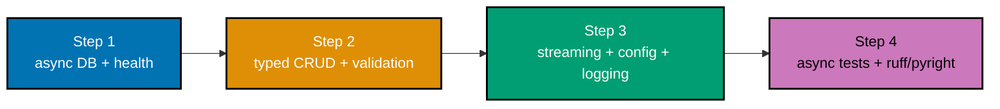

## Goal

Build a small but production-shaped **async** FastAPI service and run it for real: typed routes, Pydantic v2
models, dependency-injected **async** database access (`aiosqlite`), error mapping, one streaming endpoint, env
config, and structured logging -- installed and gated under `uv` + `ruff` + `pyright`, tested with async
`httpx`. Every mechanism below was already taught, individually, somewhere in the Beginner, Intermediate, or
Advanced tiers; this capstone is where they all run together in one real async service.



## Concepts exercised

- [x] async + event loop + `gather` (co-01 to co-04) -- async handlers, an async streaming generator, and the
      async repository all share one event loop
- [x] FastAPI routes + params + models (co-10 to co-12) -- typed routes, bounded `Query` params, Pydantic v2
      models
- [x] validation + response models (co-13, co-14) -- constrained fields, a closed status set, `response_model`
- [x] DI + async DB (co-15, co-16) -- a `Depends` async-session dependency, parameterized async queries
- [x] error handling + lifespan + config + logging (co-17, co-18, co-24) -- a consistent error envelope,
      startup init, `pydantic-settings`, structured access logging
- [x] streaming (co-22) -- an SSE endpoint from an async generator
- [x] async tests + `ruff`/`pyright` gate (co-21, co-08, co-09) -- an async `httpx` suite and the type/lint
      gate

All colocated code lives under `learning/capstone/code/`: `app/__init__.py`, `app/models.py`,
`app/repository.py`, `app/main.py`, `app/schema.sql`, `test_app.py`, and `pyrightconfig.json`. Every snippet
below is copied directly from those files.

## Step 1: Async Database, Health, and Readiness

_exercises co-16, co-18, co-24_

`GET /health` never touches the database (pure liveness); `GET /ready` genuinely pings the **async** database
through a `Depends`-injected session (real readiness). `app/schema.sql` is applied once at startup by a
startup hook, and config (including the DB path) comes from `pydantic-settings`.

**`learning/capstone/code/app/schema.sql`**

```sql
-- Capstone async FastAPI service schema (applied once at startup, co-16/co-18).
CREATE TABLE IF NOT EXISTS tasks (
  id INTEGER PRIMARY KEY AUTOINCREMENT,
  title TEXT NOT NULL,
  description TEXT NOT NULL DEFAULT '',
  status TEXT NOT NULL DEFAULT 'todo',
  created_at TEXT NOT NULL DEFAULT (datetime ('now'))
);
```

**`learning/capstone/code/app/repository.py`** (the async data-access layer):

```python
"""Capstone async FastAPI service -- the ONLY module that talks to the database (co-16, co-15)."""

from pathlib import Path

import aiosqlite  # => the async driver -- query waits yield to the loop (co-16)

from .models import Task, TaskCreate, TaskPage, TaskUpdate

SCHEMA_PATH = Path(__file__).parent / "schema.sql"  # => the schema applied at startup (co-16)


async def get_connection(db_path: str) -> aiosqlite.Connection:  # => one async connection per request (co-15)
    conn = await aiosqlite.connect(db_path)  # => async acquire
    conn.row_factory = aiosqlite.Row  # => rows addressable by column name
    return conn


async def init_db(db_path: str) -> None:  # => apply schema.sql once at startup (co-16, co-18)
    conn = await get_connection(db_path)
    await conn.executescript(SCHEMA_PATH.read_text(encoding="utf-8"))  # => idempotent schema
    await conn.commit()
    await conn.close()


def _row_to_task(row: aiosqlite.Row) -> Task:  # => the ONE place a raw row becomes a typed Task (co-14)
    return Task(
        id=int(row["id"]),
        title=str(row["title"]),
        description=str(row["description"]),
        status=str(row["status"]),  # type: ignore[arg-type]  # => Pydantic validates against TaskStatus
        created_at=str(row["created_at"]),
    )


async def create_task(conn: aiosqlite.Connection, data: TaskCreate) -> Task:  # => parameterized INSERT (co-16)
    cursor = await conn.execute(  # => ? placeholders, never f-strings (co-16)
        "INSERT INTO tasks (title, description) VALUES (?, ?)",
        (data.title, data.description),
    )
    await conn.commit()
    row = await (await conn.execute("SELECT * FROM tasks WHERE id = ?", (cursor.lastrowid,))).fetchone()
    assert row is not None  # => guaranteed by the INSERT above -- narrows Row | None for strict pyright
    return _row_to_task(row)  # => re-read to include DB-generated defaults


async def get_task(conn: aiosqlite.Connection, task_id: int) -> Task | None:  # => parameterized SELECT (co-16)
    row = await (await conn.execute("SELECT * FROM tasks WHERE id = ?", (task_id,))).fetchone()
    return _row_to_task(row) if row is not None else None  # => None signals "not found" (co-17)


async def update_task(  # => parameterized UPDATE (co-16)
    conn: aiosqlite.Connection, task_id: int, data: TaskUpdate
) -> Task | None:
    cursor = await conn.execute(
        "UPDATE tasks SET title = ?, description = ?, status = ? WHERE id = ?",
        (data.title, data.description, data.status, task_id),
    )
    if cursor.rowcount == 0:  # => no row matched
        return None
    await conn.commit()
    row = await (await conn.execute("SELECT * FROM tasks WHERE id = ?", (task_id,))).fetchone()
    assert row is not None  # => rowcount > 0 above guarantees this
    return _row_to_task(row)


async def delete_task(conn: aiosqlite.Connection, task_id: int) -> bool:  # => parameterized DELETE (co-16)
    cursor = await conn.execute("DELETE FROM tasks WHERE id = ?", (task_id,))
    await conn.commit()
    return cursor.rowcount > 0  # => True only if a row genuinely existed


async def list_tasks(  # => pagination + filtering in ONE parameterized query (co-11, co-16)
    conn: aiosqlite.Connection, limit: int, offset: int, status: str | None
) -> TaskPage:
    where = " WHERE status = ?" if status is not None else ""  # => an optional filter clause
    params: list[object] = [status] if status is not None else []
    total_row = await (await conn.execute(f"SELECT COUNT(*) AS n FROM tasks{where}", params)).fetchone()
    assert total_row is not None  # => COUNT(*) always returns one row
    total = int(total_row["n"])  # => the FILTERED total (co-11)
    rows = await (await conn.execute(f"SELECT * FROM tasks{where} ORDER BY id LIMIT ? OFFSET ?", [*params, limit, offset])).fetchall()
    items = [_row_to_task(row) for row in rows]
    next_offset = offset + limit
    return TaskPage(items=items, total=total, next=next_offset if next_offset < total else None)  # => None at end


async def ping(conn: aiosqlite.Connection) -> bool:  # => cheapest real query -- used by /ready (co-16)
    await conn.execute("SELECT 1")
    return True
```

**Run**: `uvicorn app.main:app --port 8000` from `learning/capstone/code/`, then `curl localhost:8000/health`
and `curl localhost:8000/ready`.

**Output**:

```text
{"status":"ok"}
{"status":"ready"}
```

**Key takeaway**: an async service keeps the event loop free during every database wait -- `/ready`'s `ping` is
an `await`ed query, not a blocking call, so a readiness probe never stalls concurrent requests.

**Why it matters**: this is Example 20 and Example 21's async DB access scaled into a real repository. The
async driver is non-negotiable here -- a synchronous driver would block the loop on every query and throw away
the entire reason the service is async.

## Step 2: Typed CRUD with Validation and Error Mapping

_exercises co-10 to co-17_

`app/models.py` declares the typed shapes with constraints (a `min_length`, a closed status `Literal`);
`app/repository.py` owns every async query; `app/main.py`'s routes hold no SQL and map absence to a precise
`404` through one app-wide exception handler.

**`learning/capstone/code/app/models.py`**

```python
"""Capstone async FastAPI service -- typed Pydantic v2 models (co-12, co-13, co-14)."""

from typing import Literal

from pydantic import BaseModel, Field

# => a closed status set -- anything else is a 422 (co-13)
TaskStatus = Literal["todo", "in_progress", "done"]


class TaskCreate(BaseModel):  # => the POST /tasks body shape (co-12)
    title: str = Field(min_length=1, max_length=200)  # => constrained -- empty titles rejected (co-13)
    description: str = Field(default="", max_length=2000)


class TaskUpdate(BaseModel):  # => the PUT /tasks/{id} body shape (co-12)
    title: str = Field(min_length=1, max_length=200)
    description: str = Field(default="", max_length=2000)
    status: TaskStatus = "todo"  # => a closed set -- an unknown status is a 422 (co-13)


class Task(BaseModel):  # => the response shape for every task-returning endpoint (co-14)
    id: int
    title: str
    description: str
    status: TaskStatus
    created_at: str


class TaskPage(BaseModel):  # => the paginated list envelope (co-14, co-11)
    items: list[Task]
    total: int
    next: int | None  # => None once the last page is reached
```

**Run**: `uvicorn app.main:app --port 8000`, then exercise `POST`, `GET`, `PUT`, `DELETE` on `/tasks`.

**Output** (a create then a 422 on an empty title):

```text
{"id":1,"title":"write report","description":"Q3","status":"todo","created_at":"2026-07-29 12:00:00"}
{"detail":[{"type":"string_too_short","loc":["body","title"],"msg":"String should have at least 1 character"}]}
```

**Key takeaway**: validation lives entirely in the typed model (`Field(min_length=1)`, the `Literal` status
set), and absence maps to a structured `404` -- the handler body holds no `if` checks and no SQL.

**Why it matters**: this is Examples 39 and 22 assembled into one typed, validated, async resource lifecycle.
The discipline -- parameterized async queries behind a repository, validation at the model boundary, a
consistent error envelope -- is exactly what keeps the service correct under concurrent load and safe to
refactor.

## Step 3: Streaming, Config, and Structured Logging

_exercises co-17, co-18, co-22, co-24_

`app/main.py` adds the streaming endpoint (an async generator behind `StreamingResponse`), the
`pydantic-settings` config (overridable DB path so tests isolate), and a structured access-log middleware.

**`learning/capstone/code/app/main.py`** (routing, DI, errors, streaming, config, logging):

```python
"""Capstone async FastAPI service -- routing, DI, errors, streaming, config, logging (co-01 to co-24).

Run with: uvicorn app.main:app --port 8000  (from learning/capstone/code/).
"""

import asyncio  # => asyncio drives the streaming generator (co-22)
import logging  # => structured logging (co-24)
import os
import time
from collections.abc import AsyncIterator, Awaitable, Callable

import aiosqlite  # => the async driver -- the DB session type (co-16)
from fastapi import Depends, FastAPI, HTTPException, Query, Request  # => DI + routing + errors (co-10, co-15, co-17)
from fastapi.responses import JSONResponse, Response, StreamingResponse  # => streaming + error envelope (co-17, co-22)
from pydantic_settings import BaseSettings, SettingsConfigDict  # => env config (co-24)

from . import repository as repo
from .models import Task, TaskCreate, TaskPage, TaskUpdate

logging.basicConfig(level=logging.INFO, format="%(message)s")  # => one line per record (co-24)
logger = logging.getLogger("capstone")  # => a named logger


class Settings(BaseSettings):  # => typed config from env (co-24)
    model_config = SettingsConfigDict(env_prefix="CAPSTONE_")  # => CAPSTONE_ prefix
    db_path: str = os.path.join(os.path.dirname(__file__), "capstone.db")  # => overridable so tests use a temp DB
    env: str = "dev"


settings = Settings()  # => resolved once at startup (co-24)


async def init_at_startup() -> None:  # => apply schema once before serving (co-18, co-16)
    await repo.init_db(settings.db_path)


app = FastAPI(title="Capstone Async FastAPI Service", on_startup=[init_at_startup])  # => co-18 startup hook


@app.exception_handler(HTTPException)  # => one consistent {"error": {...}} envelope app-wide (co-17)
async def handle_http_exception(request: Request, exc: HTTPException) -> JSONResponse:
    _ = request  # => available for logging, unused in the mapping
    body = exc.detail if isinstance(exc.detail, dict) else {"error": {"code": "error", "message": str(exc.detail)}}
    return JSONResponse(status_code=exc.status_code, content=body)


@app.middleware("http")  # => structured access log per request (co-18, co-24)
async def access_log(request: Request, call_next: Callable[[Request], Awaitable[Response]]) -> Response:
    start = time.perf_counter()  # => baseline
    response: Response = await call_next(request)  # => run the handler
    logger.info(  # => structured: fixed keys, machine-parseable (co-24)
        "method=%s path=%s status=%d ms=%.3f",
        request.method, request.url.path, response.status_code, (time.perf_counter() - start) * 1000,
    )
    return response


async def get_db() -> AsyncIterator[aiosqlite.Connection]:  # => one async session per request (co-15, co-16)
    conn = await repo.get_connection(settings.db_path)  # => async acquire (co-16)
    try:
        yield conn  # => hand the live session to the handler
    finally:
        await conn.close()  # => close on exit, even if the handler raised (co-15)


@app.get("/health")  # => LIVENESS -- always 200, no DB dependency (co-10)
async def health() -> dict[str, str]:
    return {"status": "ok"}


@app.get("/ready")  # => READINESS -- genuinely pings the async DB (co-16)
async def ready(conn: aiosqlite.Connection = Depends(get_db)) -> dict[str, str]:
    await repo.ping(conn)  # => async probe -- yields to the loop (co-16)
    return {"status": "ready"}


@app.post("/tasks", response_model=Task, status_code=201)  # => create (co-17)
async def create_task_route(body: TaskCreate, conn: aiosqlite.Connection = Depends(get_db)) -> Task:
    return await repo.create_task(conn, body)  # => async repository call (co-16)


@app.get("/tasks/{task_id}", response_model=Task)  # => read one, 404 on missing (co-17)
async def read_task_route(task_id: int, conn: aiosqlite.Connection = Depends(get_db)) -> Task:
    task = await repo.get_task(conn, task_id)  # => async SELECT
    if task is None:
        raise HTTPException(status_code=404, detail={"error": {"code": "not_found", "message": "no such task"}})  # => co-17
    return task


@app.put("/tasks/{task_id}", response_model=Task)  # => replace (co-17)
async def update_task_route(task_id: int, body: TaskUpdate, conn: aiosqlite.Connection = Depends(get_db)) -> Task:
    updated = await repo.update_task(conn, task_id, body)
    if updated is None:
        raise HTTPException(status_code=404, detail={"error": {"code": "not_found", "message": "no such task"}})
    return updated


@app.delete("/tasks/{task_id}", status_code=204)  # => delete (co-17)
async def delete_task_route(task_id: int, conn: aiosqlite.Connection = Depends(get_db)) -> None:
    if not await repo.delete_task(conn, task_id):
        raise HTTPException(status_code=404, detail={"error": {"code": "not_found", "message": "no such task"}})


@app.get("/tasks", response_model=TaskPage)  # => pagination + filtering (co-11, co-16)
async def list_tasks_route(
    limit: int = Query(default=10, ge=1, le=50),  # => bounded limit (co-11, co-13)
    offset: int = Query(default=0, ge=0),
    status: str | None = Query(default=None),
    conn: aiosqlite.Connection = Depends(get_db),
) -> TaskPage:
    return await repo.list_tasks(conn, limit, offset, status)


async def event_stream() -> AsyncIterator[bytes]:  # => a streaming generator (co-22)
    for i in range(3):  # => three events
        await asyncio.sleep(0.01)  # => pace the stream (co-02)
        yield f"data: event {i}\n\n".encode("utf-8")  # => one SSE-shaped chunk per yield (co-22)


@app.get("/events")  # => the streaming endpoint (co-22)
async def events() -> StreamingResponse:
    return StreamingResponse(event_stream(), media_type="text/event-stream")  # => incremental SSE
```

**Run**: `CAPSTONE_DB_PATH=/tmp/cap.db uvicorn app.main:app --port 8000`, then `curl -N localhost:8000/events`.

**Output** (`/events`, streamed):

```text
data: event 0

data: event 1

data: event 2

```

**Key takeaway**: streaming, env-driven config, and structured logging compose cleanly onto the typed async
service -- `pydantic-settings` makes the DB path overridable (so tests isolate), and the access-log middleware
emits one structured line per request across every route.

**Why it matters**: this is Examples 31, 32, and 37 integrated into the same service. The overridable config
is what makes the test fixture (next step) able to point each test at a fresh temp DB, and the structured log
is what makes the service operable in aggregate -- two properties that separate a runnable demo from a
deployable service.

## Step 4: Async Test Suite and the ruff/pyright Gate

_exercises co-21, co-08, co-09_

`test_app.py` drives the app in-process with an async `httpx` client, each test against a fresh temp DB; the
`ruff` + `pyright` gate (scoped to `app/` via `pyrightconfig.json`) is clean.

**`learning/capstone/code/test_app.py`**

```python
"""Capstone async FastAPI service -- async acceptance suite (co-21).

Drives the app in-process via httpx ASGITransport, each test against a FRESH temp DB. Run: pytest -v.
"""

from pathlib import Path

import httpx  # => the async client (co-21)
import pytest
from httpx import ASGITransport

from app import main  # => the app under test (co-21)
from app.main import app  # => the ASGI application
from app.repository import init_db  # => explicit schema init (co-16)


@pytest.fixture()
async def client(tmp_path: Path, monkeypatch: pytest.MonkeyPatch) -> httpx.AsyncClient:  # => a client per test
    db_file = tmp_path / "capstone.db"  # => a FRESH DB file per test
    main.settings.db_path = str(db_file)  # => point the shared settings at the temp file (co-24)
    await init_db(str(db_file))  # => ASGITransport skips lifespan; init schema explicitly (co-16)
    transport = ASGITransport(app=app)  # => in-process transport against the temp DB (co-21)
    return httpx.AsyncClient(transport=transport, base_url="http://test")  # => a pooled client


@pytest.mark.asyncio
async def test_health_is_200(client: httpx.AsyncClient) -> None:  # => liveness, no DB
    async with client:
        response = await client.get("/health")
        assert response.status_code == 200
        assert response.json() == {"status": "ok"}


@pytest.mark.asyncio
async def test_crud_round_trip(client: httpx.AsyncClient) -> None:  # => create, read, update, delete (co-16, co-17)
    async with client:
        created = await client.post("/tasks", json={"title": "write report", "description": "Q3"})
        assert created.status_code == 201
        task_id = created.json()["id"]

        read = await client.get(f"/tasks/{task_id}")  # => reads back the created row (co-16)
        assert read.status_code == 200
        assert read.json()["status"] == "todo"

        updated = await client.put(  # => update -> done
            f"/tasks/{task_id}", json={"title": "write report", "description": "Q3", "status": "done"}
        )
        assert updated.status_code == 200
        assert updated.json()["status"] == "done"

        deleted = await client.delete(f"/tasks/{task_id}")  # => delete (co-17)
        assert deleted.status_code == 204

        gone = await client.get(f"/tasks/{task_id}")  # => now missing -> 404 (co-17)
        assert gone.status_code == 404


@pytest.mark.asyncio
async def test_invalid_body_returns_422(client: httpx.AsyncClient) -> None:  # => validation at the boundary (co-13)
    async with client:
        response = await client.post("/tasks", json={"title": ""})  # => empty title violates min_length
        assert response.status_code == 422


@pytest.mark.asyncio
async def test_pagination_and_filter(client: httpx.AsyncClient) -> None:  # => pagination + filtering (co-11)
    async with client:
        for i in range(5):  # => seed 5 tasks
            await client.post("/tasks", json={"title": f"task {i}"})
        page = await client.get("/tasks", params={"limit": 2, "offset": 0})  # => first page of 2
        body = page.json()
        assert len(body["items"]) == 2
        assert body["total"] == 5
        assert body["next"] == 2  # => a next page exists


@pytest.mark.asyncio
async def test_streaming_endpoint(client: httpx.AsyncClient) -> None:  # => the streaming endpoint (co-22)
    async with client:
        response = await client.get("/events")
        assert response.status_code == 200
        assert "event" in response.text  # => the streamed body arrived incrementally (co-22)
```

**`learning/capstone/code/pyrightconfig.json`**

```json
{
  "typeCheckingMode": "strict",
  "pythonVersion": "3.13",
  "include": ["app"]
}
```

**Run**: `pytest -v` (and `ruff check app test_app.py && pyright` from `learning/capstone/code/`).

**Output** (`pytest -v`):

```text
test_app.py::test_health_is_200 PASSED
test_app.py::test_crud_round_trip PASSED
test_app.py::test_invalid_body_returns_422 PASSED
test_app.py::test_pagination_and_filter PASSED
test_app.py::test_streaming_endpoint PASSED
```

**Key takeaway**: the capstone is gated by an async test suite (one fresh temp DB per test) and the
`ruff`/`pyright` gate -- the same two gates every advanced-tier example met, now applied to the whole service.

**Why it matters**: this is Examples 33, 49, and 50 composed into one acceptance suite. The fresh-DB fixture
keeps tests deterministic and order-independent, and the type/lint gate keeps the service correct as it grows
-- together they are the topic's done bar.

## Acceptance criteria

- The service boots from a clean `uv` install: `uvicorn app.main:app --port 8000` from
  `learning/capstone/code/` starts serving, and `curl localhost:8000/health` returns `200` with
  `{"status":"ok"}`.
- Every endpoint round-trips: `POST`/`GET`/`PUT`/`DELETE` on `/tasks` succeed against the async DB, with the
  deleted task returning a structured `404` afterward.
- Invalid input yields a `422`: an empty `title` (violating `min_length=1`) or an unknown `status` (outside the
  `Literal` set) is rejected before any handler logic runs.
- The streaming endpoint streams: `GET /events` delivers `data:`-line events incrementally, not buffered.
- Config loads from env: `CAPSTONE_DB_PATH` overrides the default DB path (and the test fixture relies on it for
  isolation).
- `pytest -v` against `learning/capstone/code/` passes all tests, genuinely green.
- `ruff check` and `pyright` (strict, scoped to `app/` via `pyrightconfig.json`) report no findings.

## Done bar

This capstone is runnable end to end: `uvicorn app.main:app --port 8000` from `learning/capstone/code/` starts
a real async server backed by a real, schema-migrated SQLite file, with every database wait yielded to the
event loop. `pytest -v` against the same directory passes the async acceptance suite, and the `ruff`/`pyright`
gate (strict, scoped to `app/`) is clean. Every mechanism this capstone combines -- async + the event loop
(co-01 to co-04), typed FastAPI routes and Pydantic v2 models (co-10 to co-14), dependency-injected async DB
access (co-15, co-16), error mapping + lifespan + config + structured logging (co-17, co-18, co-24), streaming
(co-22), and the async test + `ruff`/`pyright` gate (co-21, co-08, co-09) -- was already taught individually in
the Beginner, Intermediate, or Advanced tiers; no new fact was needed to write this page.

---

← Previous: [Advanced Examples](../advanced.md) · Next: [Drilling](../../drilling/overview.md) →
