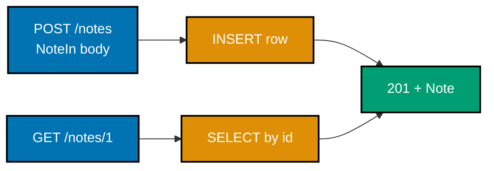
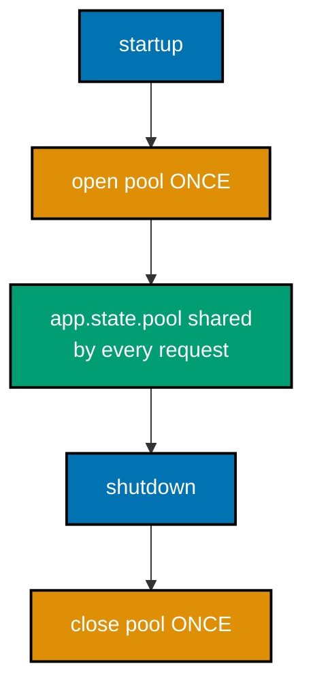
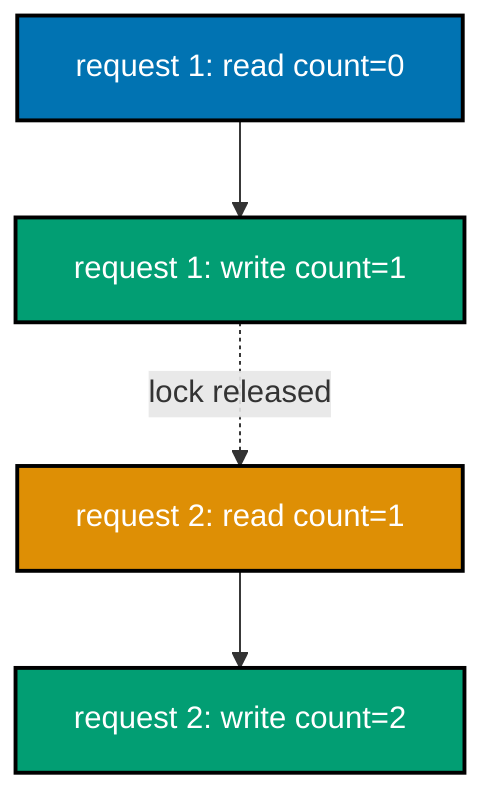

Examples 19-38 turn the beginner tier's single-route handlers into a small, real async service: `Depends`
dependency injection and async database access with `aiosqlite` (19-22), error mapping with `HTTPException`
and custom exception handlers (23-24), lifespan-managed pools and middleware (25-26), deferred background
work and concurrent upstream fan-out (27-28), Pydantic validators and nested models (29-30), `pydantic-settings`
and structured logging (31-32), async testing with `httpx` including dependency overrides (33-35), and
streaming/SSE plus a concurrency-safe shared counter (36-38). Every FastAPI example is a complete, self-contained
module under `learning/code/`, served with `uvicorn app:app --port 8000` and exercised with `curl`; the test
examples additionally run under `pytest -v`.

---

### Example 19: Injecting a Shared Resource with Depends

_ex-19 &middot; exercises co-15_

`Depends` resolves a dependency provider and passes its result to the handler as a typed argument. The handler
never calls the provider itself -- the framework does, once per request.

**`learning/code/ex-19-depends-shared-resource/app.py`**

```python
"""Example 19: Injecting a Shared Resource with Depends.

Run: uvicorn app:app --port 8000, then: curl localhost:8000/config  (co-15)
"""

from fastapi import Depends, FastAPI  # => Depends is FastAPI's dependency-injection verb (co-15)

app = FastAPI()  # => the ASGI application uvicorn serves


class AppConfig:  # => a shared resource every handler can declare as a dependency
    def __init__(self, env: str = "dev") -> None:  # => a value the whole app shares
        self.env = env  # => the active environment name


def get_config() -> AppConfig:  # => a DEPENDENCY PROVIDER -- a plain callable Depends resolves per request
    return AppConfig(env="dev")  # => a shared instance handed to every handler that declares it (co-15)


@app.get("/config")  # => a route that NEEDS the shared config
def read_config(config: AppConfig = Depends(get_config)) -> dict[str, str]:  # => Depends wires the provider in
    # => the handler never calls get_config itself -- the framework does, then passes the result in (co-15)
    return {"env": config.env}  # => the injected resource's value, as JSON (co-14)
```

**Run**: `uvicorn app:app --port 8000`, then: `curl localhost:8000/config`

**Output**:

```text
{"env":"dev"}
```

**Key takeaway**: `Depends(provider)` declares a dependency; the framework resolves the provider and injects
the result, so the handler only receives an already-ready resource.

**Why it matters**: this is the seam that makes swapping a real resource for a fake in tests one line of setup
(Example 35) -- the handler depends on the provider's contract, not its implementation. Every later
DI-bearing example (the DB session, auth, settings) generalizes this exact pattern.

---

### Example 20: Injecting a Database Session with Depends

_ex-20 &middot; exercises co-15, co-16_

An **async generator** dependency opens an `aiosqlite` session, yields it for the duration of the request, and
closes it afterward. The handler awaits its queries against the injected session, keeping the loop responsive.

**`learning/code/ex-20-depends-db-session/app.py`**

```python
"""Example 20: Injecting a Database Session with Depends.

An async generator dependency opens a session, yields it, and closes it -- once per request. Run:
uvicorn app:app --port 8000, then: curl localhost:8000/version  (co-15, co-16)
"""

from collections.abc import AsyncIterator  # => the typed shape of an async-generator dependency (co-15)

import aiosqlite  # => an async driver -- query waits yield to the loop instead of blocking (co-16)
from fastapi import Depends, FastAPI  # => Depends wires the provider (co-15)

app = FastAPI()  # => the ASGI application uvicorn serves
DB_PATH = ":memory:"  # => an in-memory SQLite DB for this self-contained example


async def get_session() -> AsyncIterator[aiosqlite.Connection]:  # => an ASYNC generator dependency (co-15, co-05)
    # => "async with" opens the connection and GUARANTEES close on exit, even if the handler raised (co-05)
    async with aiosqlite.connect(DB_PATH) as db:  # => acquire an async connection
        yield db  # => hand the live session to the handler for the duration of the request
    # => after the yield: the connection is closed automatically when the block exits (co-15 teardown)


@app.get("/version")  # => a route that NEEDS a database session
async def read_version(session: aiosqlite.Connection = Depends(get_session)) -> dict[str, str]:  # => injected
    # => the handler is async because it AWAITS the query -- a sync handler would block the loop (co-16)
    cursor = await session.execute("SELECT sqlite_version()")  # => an async query that yields to the loop
    row = await cursor.fetchone()  # => fetch the single result row
    version = str(row[0]) if row is not None else "unknown"  # => narrow to a plain string
    return {"sqlite_version": version}  # => the injected session did the work (co-15, co-14)
```

**Run**: `uvicorn app:app --port 8000`, then: `curl localhost:8000/version`

**Output**:

```text
{"sqlite_version":"3.x.y"}
```

**Key takeaway**: an async-generator dependency acquires, yields, and releases an async resource once per
request; the handler just declares it and awaits its queries.

**Why it matters**: this is the pattern every DB-backed handler in the rest of the topic uses. The session is
opened and closed for you, the connection is async (so the loop stays free during query latency), and the whole
lifecycle is invisible to the handler -- which is exactly what makes the dependency-override test (Example 35)
possible.

---

### Example 21: An Async Database Query Yields to the Loop

_ex-21 &middot; exercises co-16_

A handler that awaits its queries keeps the event loop free to serve other requests during each query's
latency. This is the central throughput win of async DB access over a synchronous driver.

**`learning/code/ex-21-async-sqlite-query/app.py`**

```python
"""Example 21: An Async Database Query Yields to the Loop.

A handler that AWAITS its queries keeps the event loop free to serve other requests during each query's
latency -- the central throughput win of async DB access. Run: uvicorn app:app --port 8000, then:
curl localhost:8000/now  (co-16)
"""

from collections.abc import AsyncIterator

import aiosqlite  # => the async driver -- query waits yield to the loop (co-16)
from fastapi import Depends, FastAPI  # => Depends injects the session (co-15)

app = FastAPI()  # => the ASGI application uvicorn serves
DB_PATH = ":memory:"


async def get_session() -> AsyncIterator[aiosqlite.Connection]:  # => one session per request, opened+closed (co-15)
    async with aiosqlite.connect(DB_PATH) as db:  # => async acquire
        yield db  # => hand the live session to the handler
    # => closed automatically on block exit


@app.get("/now")  # => a route whose entire latency is one async query
async def now(session: aiosqlite.Connection = Depends(get_session)) -> dict[str, str]:  # => injected session
    # => AWAITING the query means other requests keep flowing during this call's latency (co-16, co-02)
    cursor = await session.execute("SELECT datetime('now')")  # => async -- yields control while the DB works
    row = await cursor.fetchone()  # => fetch one row, also awaited
    now_str = str(row[0]) if row is not None else ""  # => narrow to a plain string
    return {"now": now_str}  # => the loop stayed responsive the whole time (co-16)
```

**Run**: `uvicorn app:app --port 8000`, then: `curl localhost:8000/now`

**Output**:

```text
{"now":"2026-07-29 12:00:00"}
```

**Key takeaway**: an async driver lets each query's wait yield to the loop, so concurrent requests overlap
their query latency instead of queuing behind one blocking call.

**Why it matters**: an async service with a synchronous DB driver throws away the entire throughput win -- the
handler blocks on the query, stalling the loop exactly like Example 7. The async driver is what closes that
gap, and it is why `aiosqlite` (or `asyncpg`/`aiomysql` in production) is non-negotiable for a real async
service.

---

### Example 22: A CRUD Create and Read Round Trip

_ex-22 &middot; exercises co-16, co-12_

`POST /notes` creates a row against a file-backed async SQLite DB; `GET /notes/{id}` reads it back. Each query
is parameterized and awaited, and the schema is created idempotently inside the session dependency.



**`learning/code/ex-22-crud-create-read/app.py`**

```python
"""Example 22: A CRUD Create and Read Round Trip.

POST /notes creates a row; GET /notes/{id} reads it back -- persistence against an async SQLite file.
Run: uvicorn app:app --port 8000, then:
curl -X POST -H 'Content-Type: application/json' -d '{"text":"hello"}' localhost:8000/notes
curl localhost:8000/notes/1  (co-16, co-12)
"""

from collections.abc import AsyncIterator

import aiosqlite  # => the async driver (co-16)
from fastapi import Depends, FastAPI  # => Depends injects the session (co-15)
from pydantic import BaseModel  # => Pydantic models (co-12)

app = FastAPI()  # => the ASGI application uvicorn serves
DB_PATH = "notes.db"  # => a file DB so created rows SURVIVE across requests (unlike ":memory:")


class NoteIn(BaseModel):  # => the request-body shape for a create (co-12)
    text: str  # => required


class Note(BaseModel):  # => the response shape (co-14)
    id: int  # => the DB-assigned primary key
    text: str  # => the stored text


async def get_session() -> AsyncIterator[aiosqlite.Connection]:  # => one session per request (co-15)
    async with aiosqlite.connect(DB_PATH) as db:  # => async acquire
        await db.execute("CREATE TABLE IF NOT EXISTS notes (id INTEGER PRIMARY KEY AUTOINCREMENT, text TEXT)")  # => idempotent schema (co-16)
        await db.commit()  # => persist the schema creation
        yield db  # => hand the session to the handler


@app.post("/notes", response_model=Note, status_code=201)  # => create -- 201 on success (co-17)
async def create_note(note: NoteIn, session: aiosqlite.Connection = Depends(get_session)) -> Note:
    cursor = await session.execute("INSERT INTO notes (text) VALUES (?)", (note.text,))  # => parameterized INSERT (co-16)
    await session.commit()  # => persist the row
    return Note(id=int(cursor.lastrowid), text=note.text)  # => the DB-assigned id + stored text


@app.get("/notes/{note_id}", response_model=Note)  # => read by id
async def read_note(note_id: int, session: aiosqlite.Connection = Depends(get_session)) -> Note:
    cursor = await session.execute("SELECT id, text FROM notes WHERE id = ?", (note_id,))  # => parameterized SELECT
    row = await cursor.fetchone()  # => one row or None
    if row is None:  # => missing -- the handler signals absence (ex-23 turns this into a clean 404)
        return Note(id=note_id, text="")  # => placeholder; ex-23 replaces this with HTTPException
    return Note(id=int(row[0]), text=str(row[1]))  # => the persisted row, as JSON (co-14)
```

**Run**: `uvicorn app:app --port 8000`, then `curl -X POST -H 'Content-Type: application/json' -d '{"text":"hello"}' localhost:8000/notes` and `curl localhost:8000/notes/1`

**Output** (create then read):

```text
{"id":1,"text":"hello"}
{"id":1,"text":"hello"}
```

**Key takeaway**: a parameterized async INSERT then SELECT round-trips a row through the DB and back as JSON,
all inside `Depends`-injected sessions.

**Why it matters**: this is the persistence backbone every CRUD example later (especially Example 39's full
service) generalizes. The discipline -- parameterized queries, a repository-style session, idempotent schema --
is what keeps the same code safe under real load and swappable to a different database by changing only the
driver.

---

### Example 23: Mapping a Failure to a Status with HTTPException

_ex-23 &middot; exercises co-17_

Raising `HTTPException(status_code=404)` maps a missing resource to a precise status and a JSON `detail` body,
instead of a misleading `200` with empty data.

**`learning/code/ex-23-http-exception/app.py`**

```python
"""Example 23: Mapping a Failure to a Status with HTTPException.

Raising HTTPException(404) maps a missing resource to a precise status + body, instead of a 200 placeholder.
Run: uvicorn app:app --port 8000, then: curl -i localhost:8000/notes/999  (co-17)
"""

from collections.abc import AsyncIterator

import aiosqlite  # => the async driver (co-16)
from fastapi import Depends, FastAPI, HTTPException  # => HTTPException maps a failure to a status (co-17)
from pydantic import BaseModel  # => Pydantic models (co-12)

app = FastAPI()  # => the ASGI application uvicorn serves
DB_PATH = "notes.db"  # => the same file DB as ex-22


class Note(BaseModel):  # => the response shape
    id: int
    text: str


async def get_session() -> AsyncIterator[aiosqlite.Connection]:  # => one session per request (co-15)
    async with aiosqlite.connect(DB_PATH) as db:
        await db.execute("CREATE TABLE IF NOT EXISTS notes (id INTEGER PRIMARY KEY AUTOINCREMENT, text TEXT)")
        await db.commit()
        yield db


@app.get("/notes/{note_id}", response_model=Note)  # => read by id
async def read_note(note_id: int, session: aiosqlite.Connection = Depends(get_session)) -> Note:
    cursor = await session.execute("SELECT id, text FROM notes WHERE id = ?", (note_id,))  # => parameterized
    row = await cursor.fetchone()  # => one row or None
    if row is None:  # => missing resource
        # => raising HTTPException maps this to a precise status + body, never a 200 with empty data (co-17)
        raise HTTPException(status_code=404, detail="note not found")  # => 404 + a JSON detail body
    return Note(id=int(row[0]), text=str(row[1]))  # => the persisted row, as JSON (co-14)
```

**Run**: `uvicorn app:app --port 8000`, then: `curl -i localhost:8000/notes/999`

**Output**:

```text
HTTP/1.1 404 Not Found
content-type: application/json

{"detail":"note not found"}
```

**Key takeaway**: `HTTPException` is the one-call way to map a failure to a status; the `detail` becomes the
JSON body and the status becomes the response code.

**Why it matters**: a missing resource returning `200` with empty data is a silent bug that confuses every
client. Mapping absence to a precise `404` (and other failures to their precise codes) is what lets a client
branch on outcome without parsing the body, and Example 24 generalizes this to a whole class of errors via a
registered handler.

---

### Example 24: Mapping a Domain Error with a Custom Handler

_ex-24 &middot; exercises co-17_

A registered exception handler maps a whole **class** of domain errors to a JSON response. The handler raises
a plain domain exception and stays free of HTTP status details; the framework decides the status and body.

**`learning/code/ex-24-custom-exception-handler/app.py`**

```python
"""Example 24: Mapping a Domain Error with a Custom Handler.

A registered exception handler maps a whole CLASS of domain errors to a JSON response, so handlers raise a
plain domain exception and the framework decides the status + body. Run: uvicorn app:app --port 8000, then:
curl -i localhost:8000/items/999  (co-17)
"""

from fastapi import FastAPI, Request  # => Request is passed to every exception handler (co-17)
from fastapi.responses import JSONResponse  # => a raw JSON response the handler returns (co-17)

app = FastAPI()  # => the ASGI application uvicorn serves


class NotFoundError(Exception):  # => a DOMAIN error -- no HTTP concepts live here (co-17)
    def __init__(self, resource: str, ident: int) -> None:  # => carries the facts of the failure
        self.resource = resource  # => what kind of thing was missing
        self.ident = ident  # => which one


@app.exception_handler(NotFoundError)  # => register ONE handler for the whole exception class (co-17)
async def handle_not_found(request: Request, exc: NotFoundError) -> JSONResponse:  # => maps domain -> HTTP
    _ = request  # => the request is available (for logging/tracing) but unused in this mapping
    # => every NotFoundError now becomes a 404 with a consistent envelope, no per-handler status code (co-17)
    return JSONResponse(  # => the response the framework sends instead of a 500
        status_code=404,  # => the status this domain error maps to
        content={"error": {"code": "not_found", "resource": exc.resource, "id": exc.ident}},  # => a structured body (co-17)
    )


@app.get("/items/{item_id}")  # => a route that raises the DOMAIN error directly
async def read_item(item_id: int) -> dict[str, str]:  # => handler stays free of HTTP status code details
    if item_id != 1:  # => a stand-in for "this id is not in the store"
        raise NotFoundError("item", item_id)  # => a plain domain exception -- the handler decides nothing about HTTP
    return {"item_id": str(item_id)}  # => the found case, as JSON (co-14)
```

**Run**: `uvicorn app:app --port 8000`, then: `curl -i localhost:8000/items/999`

**Output**:

```text
HTTP/1.1 404 Not Found
content-type: application/json

{"error":{"code":"not_found","resource":"item","id":999}}
```

**Key takeaway**: a registered exception handler centralizes the domain-to-HTTP mapping for a whole error
class, so handlers raise plain domain exceptions and the envelope stays consistent everywhere.

**Why it matters**: this is the clean way to keep HTTP concerns out of business logic while still returning a
consistent error shape. Example 65 scales this to many domain errors registered centrally, which is the
production shape that keeps every failure path emitting one predictable envelope.

---

### Example 25: Opening a Pool Once in a Lifespan Handler

_ex-25 &middot; exercises co-18_

A lifespan context manager opens a shared resource **once** at startup, serves every request against it, and
closes it **once** at shutdown -- instead of paying open/close per request. The resource lives on `app.state`.



**`learning/code/ex-25-lifespan-pool/app.py`**

```python
"""Example 25: Opening a Pool Once in a Lifespan Handler.

A lifespan context manager opens a shared resource ONCE at startup and closes it ONCE at shutdown, instead of
per request. Run: uvicorn app:app --port 8000, then: curl localhost:8000/pool  (co-18)
"""

from collections.abc import AsyncIterator
from contextlib import asynccontextmanager  # => the decorator that turns an async gen into a lifespan (co-18)

from fastapi import FastAPI, Request  # => Request reads app.state (co-18)


class Pool:  # => a stand-in for a connection pool / HTTP client opened once, shared by every request
    def __init__(self) -> None:
        self.open = False  # => not yet opened

    async def open_pool(self) -> None:  # => expensive setup that must NOT repeat per request (co-18)
        self.open = True  # => mark as ready

    async def close_pool(self) -> None:  # => teardown that runs exactly once on shutdown (co-18)
        self.open = False  # => mark as closed


@asynccontextmanager  # => makes the function below usable as FastAPI's lifespan= argument (co-18)
async def lifespan(app: FastAPI) -> AsyncIterator[None]:  # => runs once at startup, once at shutdown
    pool = Pool()  # => create the shared resource
    await pool.open_pool()  # => STARTUP: open before the app serves a single request
    app.state.pool = pool  # => stash it where every request can reach it (co-18)
    yield  # => the app runs here, serving many requests that all share the one pool
    await pool.close_pool()  # => SHUTDOWN: close after the app stops serving (co-18)


app = FastAPI(lifespan=lifespan)  # => register the lifespan handler (co-18)


@app.get("/pool")  # => a route that reads the shared pool
async def pool_status(request: Request) -> dict[str, bool]:  # => Request gives access to app.state
    pool: Pool = request.app.state.pool  # => the pool opened ONCE at startup -- shared, not per-request
    return {"open": pool.open}  # => confirms the shared resource is live (co-14)
```

**Run**: `uvicorn app:app --port 8000`, then: `curl localhost:8000/pool`

**Output**:

```text
{"open":true}
```

**Key takeaway**: a lifespan handler runs once at startup and once at shutdown; resources stashed on
`app.state` are shared by every request without per-request open/close cost.

**Why it matters**: opening a connection pool or HTTP client per request throws away the entire benefit of
pooling. The lifespan is the one correct place to open such resources (so they outlive every request) and to
close them cleanly on shutdown, which Example 45 and Example 62 build on for a background worker and shared
state respectively.

---

### Example 26: Adding a Timing Header with Middleware

_ex-26 &middot; exercises co-18_

An HTTP middleware wraps every request/response and adds an `X-Process-Time` header, without any handler
knowing about timing. `call_next` runs the downstream handler; the middleware mutates the response it returns.

**`learning/code/ex-26-middleware-timing/app.py`**

```python
"""Example 26: Adding a Timing Header with Middleware.

An HTTP middleware wraps every request/response, adding an X-Process-Time header without touching any
handler. Run: uvicorn app:app --port 8000, then: curl -i localhost:8000/  (co-18)
"""

import time  # => only to measure request duration
from collections.abc import Awaitable, Callable  # => the typed shape of a middleware's call_next (co-18)

from fastapi import FastAPI, Request  # => Request is the inbound request the middleware forwards (co-18)
from fastapi.responses import Response  # => the outbound response the middleware mutates

app = FastAPI()  # => the ASGI application uvicorn serves


@app.middleware("http")  # => registers an HTTP middleware that wraps EVERY request/response (co-18)
async def add_timing_header(  # => call_next runs the downstream handler
    request: Request, call_next: Callable[[Request], Awaitable[Response]]
) -> Response:  # => the middleware returns the (enriched) Response
    start = time.perf_counter()  # => capture the time BEFORE the handler runs
    response: Response = await call_next(request)  # => forward to the handler, await its response
    elapsed = time.perf_counter() - start  # => wall-clock duration of the whole handler chain
    response.headers["X-Process-Time"] = f"{elapsed:.6f}"  # => mutate the outbound response (co-18)
    return response  # => the (now enriched) response is sent to the client


@app.get("/")  # => a route that knows nothing about timing -- the middleware adds it for free
def read_root() -> dict[str, str]:  # => a minimal handler
    return {"msg": "timed"}  # => the response body; the X-Process-Time header is added outside this function
```

**Run**: `uvicorn app:app --port 8000`, then: `curl -i localhost:8000/`

**Output**:

```text
HTTP/1.1 200 OK
x-process-time: .000123
content-type: application/json

{"msg":"timed"}
```

**Key takeaway**: middleware composes cross-cutting behaviour around every route; `call_next` runs the
handler and the middleware mutates the returned response.

**Why it matters**: cross-cutting concerns (timing, request IDs, logging, CORS) apply to every route, so
writing them once in middleware is both less code and less drift than copy-pasting into each handler. Examples
42, 66, and 67 extend this idea into rate limiting, class-based middleware, and ordering.

---

### Example 27: Deferring Work Past the Response with Background Tasks

_ex-27 &middot; exercises co-19_

`BackgroundTasks` schedules a side effect that runs **after** the response is sent, without standing up a full
task queue. The response returns immediately; the task runs once the client has the answer.

**`learning/code/ex-27-background-task/app.py`**

```python
"""Example 27: Deferring Work Past the Response with Background Tasks.

BackgroundTasks runs a side effect AFTER the response is sent, without a full task queue. Run:
uvicorn app:app --port 8000, then: curl localhost:8000/notify  (co-19)
"""

from fastapi import BackgroundTasks, FastAPI  # => BackgroundTasks is the deferred-work verb (co-19)

app = FastAPI()  # => the ASGI application uvicorn serves

events: list[str] = []  # => a stand-in for an external side-effect target (a log, a queue, an email)


def write_event(message: str) -> None:  # => the side effect itself -- NOT awaited on the request path
    events.append(message)  # => runs AFTER the response is already on its way to the client (co-19)


@app.get("/notify")  # => a route that returns fast and defers the slow side effect
def notify(tasks: BackgroundTasks) -> dict[str, str]:  # => BackgroundTasks is injected by FastAPI (co-19)
    tasks.add_task(write_event, "user notified")  # => SCHEDULE the side effect -- does not run it yet
    # => the response returns immediately; write_event runs only AFTER this return is sent (co-19)
    return {"status": "accepted"}  # => the client sees this before write_event has necessarily finished
```

**Run**: `uvicorn app:app --port 8000`, then: `curl localhost:8000/notify`

**Output**:

```text
{"status":"accepted"}
```

**Key takeaway**: `BackgroundTasks.add_task` defers a side effect past the response -- the right tool when a
non-critical effect should not slow the request, but a full queue is overkill.

**Why it matters**: not every side effect belongs on the request's critical path. `BackgroundTasks` is the
lightweight option that keeps a response fast while still getting the effect done, before you reach for
Celery/Redis. Example 45 shows the heavier, lifespan-managed worker pattern for work that needs its own
long-running loop.

---

### Example 28: Fanning Out Concurrent Upstream Calls

_ex-28 &middot; exercises co-04, co-16_

A handler that needs two upstream responses fans out via `gather` -- the combined latency is the slower call,
not the sum. This is the central concurrency win of an async service, applied inside a route.

**`learning/code/ex-28-concurrent-upstream-calls/app.py`**

```python
"""Example 28: Fanning Out Concurrent Upstream Calls.

A handler fans out to two slow upstream calls via gather -- the combined latency is ~the slower call, not the
sum. Run: uvicorn app:app --port 8000, then: curl localhost:8000/aggregate  (co-04, co-16)
"""

import asyncio  # => gather lives here (co-04)

from fastapi import FastAPI  # => the web framework (co-10)

app = FastAPI()  # => the ASGI application uvicorn serves


async def call_upstream(name: str, seconds: float) -> str:  # => a simulated slow upstream API call
    await asyncio.sleep(seconds)  # => yields to the loop while "waiting on the network" (co-02)
    return f"{name}@{seconds}s"  # => the upstream's response


@app.get("/aggregate")  # => a route that needs BOTH upstreams before it can respond
async def aggregate() -> dict[str, list[str]]:  # => gathers both concurrently
    # => gather runs both upstream calls at once -- the handler pays the SLOWER call's latency (co-04)
    results = await asyncio.gather(call_upstream("a", 0.10), call_upstream("b", 0.15))  # => ~0.15s, not 0.25s
    return {"results": list(results)}  # => both responses, in submission order (co-14)
```

**Run**: `uvicorn app:app --port 8000`, then: `curl localhost:8000/aggregate`

**Output**:

```text
{"results":["a@0.1s","b@0.15s"]}
```

**Key takeaway**: `gather` inside a handler overlaps multiple slow upstream waits, so the route's latency is
the slowest dependency, not the sum -- exactly the throughput shape an I/O-bound service benefits from.

**Why it matters**: a synchronous handler awaiting two upstreams in sequence pays their combined latency on
every request; fanning out pays only the slower one. Multiplied across thousands of requests, that is the
entire reason `remotebrowser`-shaped workloads (Example 53) are async.

---

### Example 29: Enforcing a Rule with a Pydantic Validator

_ex-29 &middot; exercises co-12, co-13_

A `field_validator` runs a custom rule during validation -- a value that violates it is rejected with a 422
before the handler runs, exactly like a missing required field.

**`learning/code/ex-29-pydantic-validator/app.py`**

```python
"""Example 29: Enforcing a Rule with a Pydantic Validator.

A field_validator runs a custom rule on a field -- a value that violates it is rejected with a 422 before the
handler runs. Run: uvicorn app:app --port 8000, then:
curl -X POST -H 'Content-Type: application/json' -d '{"email":"bad"}' localhost:8000/users  (co-12, co-13)
"""

from fastapi import FastAPI  # => the web framework (co-10)
from pydantic import BaseModel, field_validator  # => field_validator is Pydantic v2's custom-rule verb (co-12)

app = FastAPI()  # => the ASGI application uvicorn serves


class UserIn(BaseModel):  # => the request-body shape
    email: str  # => a plain string on the type level -- the validator below tightens the rule (co-13)

    @field_validator("email")  # => a custom rule that runs during validation (co-12, co-13)
    @classmethod
    def must_contain_at(cls, value: str) -> str:  # => receives the raw value, returns the validated value
        if "@" not in value:  # => the rule: an email must contain "@"
            raise ValueError("email must contain '@'")  # => a violation becomes a 422, never a 500 (co-13)
        return value  # => the accepted value, passed through to the handler


@app.post("/users", status_code=201)  # => a create route
def create_user(user: UserIn) -> UserIn:  # => validation (including the rule above) already ran before this
    return user  # => only a rule-satisfying email reaches this line (co-14)
```

**Run**: `uvicorn app:app --port 8000`, then: `curl -X POST -H 'Content-Type: application/json' -d '{"email":"bad"}' localhost:8000/users`

**Output**:

```text
{"detail":[{"type":"value_error","loc":["body","email"],"msg":"Value error, email must contain '@'"}]}
```

**Key takeaway**: a `field_validator` extends Pydantic's built-in rules with arbitrary custom logic, and a
violation surfaces as the same structured 422 as any other validation failure.

**Why it matters**: a business rule ("emails must contain `@`", "quantity must be positive") belongs at the
validation boundary, not scattered as `if` checks inside handlers. Centralizing it in the model means the rule
is enforced on every path that constructs the model, and the failure is always a structured 422.

---

### Example 30: Nested Pydantic Models Serialize Together

_ex-30 &middot; exercises co-12, co-14_

A model that composes other models serializes the whole nested shape to JSON in one step -- lists of models,
models containing models, all recurse through Pydantic's serializer.

**`learning/code/ex-30-nested-models/app.py`**

```python
"""Example 30: Nested Pydantic Models Serialize Together.

A model that contains a list of other models serializes the whole nested shape to JSON in one step.
Run: uvicorn app:app --port 8000, then: curl localhost:8000/order  (co-12, co-14)
"""

from fastapi import FastAPI  # => the web framework (co-10)
from pydantic import BaseModel  # => Pydantic models (co-12)

app = FastAPI()  # => the ASGI application uvicorn serves


class LineItem(BaseModel):  # => a NESTED model -- used inside another model
    sku: str  # => a product identifier
    quantity: int  # => a count


class Order(BaseModel):  # => a CONTAINING model -- it composes nested models (co-12)
    order_id: int  # => a top-level field
    items: list[LineItem]  # => a LIST of nested models -- serialized recursively (co-14)


@app.get("/order", response_model=Order)  # => returns the whole nested shape as one JSON document
def get_order() -> Order:  # => the handler returns a fully-constructed nested model
    return Order(  # => one constructor call builds the entire tree (co-12)
        order_id=1,  # => top-level scalar
        items=[LineItem(sku="A", quantity=2), LineItem(sku="B", quantity=1)],  # => nested list of models
    )  # => Pydantic serializes every level to JSON automatically (co-14)
```

**Run**: `uvicorn app:app --port 8000`, then: `curl localhost:8000/order`

**Output**:

```text
{"order_id":1,"items":[{"sku":"A","quantity":2},{"sku":"B","quantity":1}]}
```

**Key takeaway**: Pydantic serializes arbitrarily nested model trees in one call -- composition is free, and
the JSON shape mirrors the model shape exactly.

**Why it matters**: real responses are rarely flat -- an order has line items, a user has an address, a page
has items plus metadata. Modeling the nested shape as nested models means the JSON contract falls out of the
type definitions, with no hand-written serialization anywhere.

---

### Example 31: Loading Config from Env with pydantic settings

_ex-31 &middot; exercises co-24_

`pydantic-settings` reads typed config from environment variables. An override applies cleanly, a missing
required value fails fast at startup, and every field carries its declared type.

**`learning/code/ex-31-settings-from-env/app.py`**

```python
"""Example 31: Loading Config from Env with pydantic settings.

pydantic-settings loads typed config from environment variables, so an env override applies and a missing
required value fails fast at startup. Run: APP_PORT=9000 uvicorn app:app --port 8000, then:
curl localhost:8000/config  (co-24)
"""

from fastapi import FastAPI  # => the web framework (co-10)
from pydantic_settings import BaseSettings, SettingsConfigDict  # => typed settings from env (co-24)

app = FastAPI()  # => the ASGI application uvicorn serves


class Settings(BaseSettings):  # => each field is read from a matching env var at construction (co-24)
    model_config = SettingsConfigDict(env_prefix="APP_")  # => APP_ prefix: field "port" <- env "APP_PORT"

    env: str = "dev"  # => defaults when the env var is absent
    port: int = 8000  # => a typed int -- a non-integer env value fails fast at startup (co-24)


settings = Settings()  # => constructed ONCE; an env override (APP_PORT=9000) lands here (co-24)


@app.get("/config")  # => a route exposing the resolved config
def read_config() -> dict[str, object]:  # => the settings as JSON
    return {"env": settings.env, "port": settings.port}  # => reflects any env override (co-24, co-14)
```

**Run**: `APP_PORT=9000 uvicorn app:app --port 8000`, then: `curl localhost:8000/config`

**Output**:

```text
{"env":"dev","port":9000}
```

**Key takeaway**: `pydantic-settings` turns environment variables into typed, validated config, with an
explicit prefix and fail-fast on a wrong type.

**Why it matters**: hardcoded values are fine in Example 12 and unacceptable in production. Typed settings
validated at startup mean a missing or malformed env var fails immediately (not halfway through the first
request), and the same `Settings` object is the single source of truth every handler reads.

---

### Example 32: One Structured Log Line per Request

_ex-32 &middot; exercises co-24, co-18_

A middleware emits one structured (key=value) log line per request -- fixed keys, machine-parseable -- so logs
are grep-able and aggregatable rather than free-form prose.

**`learning/code/ex-32-structured-logging/app.py`**

```python
"""Example 32: One Structured Log Line per Request.

A middleware emits one STRUCTURED (key=value) log line per request, so logs are grep-able and aggregatable --
not free-form prose. Run: uvicorn app:app --port 8000, then: curl localhost:8000/  (co-24, co-18)
"""

import logging  # => the standard-library logging module (co-24)
import time  # => request timing
from collections.abc import Awaitable, Callable

from fastapi import FastAPI, Request  # => Request carries method + path (co-18)
from fastapi.responses import Response  # => status code is read from the response

app = FastAPI()  # => the ASGI application uvicorn serves

logging.basicConfig(level=logging.INFO, format="%(message)s")  # => one line per record, the message is JSON-ish
logger = logging.getLogger("app")  # => a named logger every handler/middleware shares (co-24)


@app.middleware("http")  # => wraps every request/response (co-18)
async def structured_log(  # => one structured record per request
    request: Request, call_next: Callable[[Request], Awaitable[Response]]
) -> Response:
    start = time.perf_counter()  # => baseline
    response: Response = await call_next(request)  # => run the downstream handler
    elapsed_ms = (time.perf_counter() - start) * 1000.0  # => milliseconds
    # => a STRUCTURED line: fixed keys, machine-parseable -- the production-logging shape (co-24)
    logger.info(  # => emitted exactly once per request (co-18)
        'method=%s path=%s status=%d duration_ms=%.3f',  # => key=value pairs, stable across every route
        request.method,
        request.url.path,
        response.status_code,
        elapsed_ms,
    )
    return response  # => the unmodified response


@app.get("/")  # => a route that produces one log line when hit
def read_root() -> dict[str, str]:  # => minimal handler
    return {"msg": "logged"}  # => hitting this emits: method=GET path=/ status=200 duration_ms=...
```

**Run**: `uvicorn app:app --port 8000`, then: `curl localhost:8000/`

**Output** (server log):

```text
method=GET path=/ status=200 duration_ms=0.456
```

**Key takeaway**: one structured record per request -- fixed keys, stable across routes -- turns logs into a
queryable dataset instead of prose to read.

**Why it matters**: `print` statements are fine for a demo and useless in production, where you need to filter
ten thousand requests by status code or p99 latency. Structured logging with stable keys is what makes that
possible, and it is the foundation Example 52's metrics endpoint builds on.

---

### Example 33: Testing an Endpoint with Async httpx

_ex-33 &middot; exercises co-21_

An async `httpx` client drives the app in-process via `ASGITransport` -- a real request/response cycle with no
socket and no running server. The test asserts both status and body.

**`learning/code/ex-33-test-endpoint-httpx/app.py`**

```python
"""Example 33: Testing an Endpoint with Async httpx -- the app under test.

A one-route app exercised in-process by an async httpx client in the sibling test_app.py. Run the app:
uvicorn app:app --port 8000; run the tests: pytest -v. (co-21)
"""

from fastapi import FastAPI  # => the web framework (co-10)

app = FastAPI()  # => the ASGI application both the server and the tests import


@app.get("/")  # => the route under test
def read_root() -> dict[str, str]:  # => a minimal handler
    return {"msg": "ok"}  # => the body the test asserts against (co-14)
```

**`learning/code/ex-33-test-endpoint-httpx/test_app.py`**

```python
"""Example 33: Testing an Endpoint with Async httpx -- the test.

An async httpx client drives the app IN-PROCESS via ASGITransport -- no real socket, no running server.
Run: pytest -v  (co-21)
"""

import httpx  # => the async HTTP client used to exercise the app (co-21)
import pytest
from httpx import ASGITransport

from app import app  # => the ASGI app imported directly -- driven in-process (co-21)


@pytest.mark.asyncio  # => runs the test coroutine on an event loop (co-21)
async def test_root_returns_ok() -> None:  # => an async test function
    transport = ASGITransport(app=app)  # => wire the client directly to the app -- no network (co-21)
    async with httpx.AsyncClient(transport=transport, base_url="http://test") as client:  # => pooled client
        response = await client.get("/")  # => a real request/response cycle, in-process
        assert response.status_code == 200  # => co-03: the expected status
        assert response.json() == {"msg": "ok"}  # => the expected body (co-14)
```

**Run**: `pytest -v` (from the example directory)

**Output**:

```text
test_app.py::test_root_returns_ok PASSED
```

**Key takeaway**: `httpx.AsyncClient` + `ASGITransport(app=app)` exercises an ASGI app with a full
request/response cycle, in-process and with no network.

**Why it matters**: a fast, in-process test suite is what makes async refactoring safe -- you change a handler
and know within a second whether the route still behaves. This is the foundation every later test example
(34, 35, 49) generalizes, and the same harness backs the capstone's acceptance suite.

---

### Example 34: Testing a Validation Failure Path

_ex-34 &middot; exercises co-21, co-13_

A test asserts the 422 returned when a required field is missing -- the red/green test for the validation
contract. Before the model tightens, the test fails; after, it passes.

**`learning/code/ex-34-test-validation-path/app.py`**

```python
"""Example 34: Testing a Validation Failure Path -- the app under test.

A POST route with a required field; the test asserts a 422 when the field is missing. Run: pytest -v. (co-21, co-13)
"""

from fastapi import FastAPI  # => the web framework (co-10)
from pydantic import BaseModel  # => Pydantic models (co-12)

app = FastAPI()  # => the ASGI application uvicorn serves


class Item(BaseModel):  # => the body shape
    name: str  # => required -- omitting it is the 422 the test asserts


@app.post("/items", status_code=201)  # => a create route
def create_item(item: Item) -> Item:  # => validation runs before the handler body
    return item  # => only a valid body reaches here
```

**`learning/code/ex-34-test-validation-path/test_app.py`**

```python
"""Example 34: Testing a Validation Failure Path -- the test.

Asserts the 422 returned when a required field is missing -- the red/green test for co-13. Run: pytest -v.
"""

import httpx  # => the async client (co-21)
import pytest
from httpx import ASGITransport

from app import app  # => the app under test (co-21)


@pytest.mark.asyncio  # => run on an event loop
async def test_missing_field_returns_422() -> None:  # => the red/green test for the validation rule
    transport = ASGITransport(app=app)  # => in-process transport (co-21)
    async with httpx.AsyncClient(transport=transport, base_url="http://test") as client:
        response = await client.post("/items", json={})  # => an EMPTY body -- missing the required "name"
        assert response.status_code == 422  # => co-13: validation rejected it before the handler ran
```

**Run**: `pytest -v`

**Output**:

```text
test_app.py::test_missing_field_returns_422 PASSED
```

**Key takeaway**: a validation contract is testable as a status code -- assert the 422 on bad input, and the
test stays green as long as the model's required-field rule holds.

**Why it matters**: validation is a contract, and a contract that is not tested will drift. Pinning the 422
behaviour in a test means a future change that accidentally makes a field optional (or removes the model) turns
the test red immediately, before a bad request ever reaches production.

---

### Example 35: Overriding a Dependency in Tests

_ex-35 &middot; exercises co-15, co-21_

`app.dependency_overrides` swaps a real provider for a fake, so a handler that depends on a database is tested
without ever touching one. The handler sees the fake's value, proving the override took effect.

**`learning/code/ex-35-dependency-override-in-tests/app.py`**

```python
"""Example 35: Overriding a Dependency in Tests -- the app under test.

A handler depends on a DB session; the test OVERRIDES that dependency with a fake, so the test never touches
a real database. Run: pytest -v. (co-15, co-21)
"""

from collections.abc import AsyncIterator

from fastapi import Depends, FastAPI  # => Depends declares the dependency (co-15)

app = FastAPI()  # => the ASGI application uvicorn serves


class UserStore:  # => a dependency the handler relies on
    async def current_user(self) -> str:  # => the real implementation hits a database
        return "real-db-user"  # => what production would return


async def get_user_store() -> AsyncIterator[UserStore]:  # => the dependency PROVIDER (co-15)
    store = UserStore()  # => production wiring
    yield store  # => hand it to the handler


@app.get("/me")  # => a route that needs the current user
async def me(store: UserStore = Depends(get_user_store)) -> dict[str, str]:  # => injected dependency (co-15)
    user = await store.current_user()  # => the handler depends on the store, not on how it was built
    return {"user": user}  # => reflects whatever the store returns -- real OR faked (co-14)
```

**`learning/code/ex-35-dependency-override-in-tests/test_app.py`**

```python
"""Example 35: Overriding a Dependency in Tests -- the test.

app.dependency_overrides swaps the real provider for a fake, so the handler uses the fake store. Run: pytest -v.
"""

import httpx  # => the async client (co-21)
import pytest
from httpx import ASGITransport

from app import UserStore, app, get_user_store  # => the app + its provider (co-15, co-21)


class FakeUserStore(UserStore):  # => a fake that NEVER touches a database
    async def current_user(self) -> str:  # => returns a fixed value, independent of any DB
        return "fake-user"  # => the value the test expects the handler to see


async def fake_provider():  # => a replacement provider yielding the fake store
    yield FakeUserStore()  # => same async-generator shape as the real one (co-15)


@pytest.mark.asyncio  # => run on an event loop
async def test_handler_uses_overridden_dependency() -> None:  # => proves the override took effect
    app.dependency_overrides[get_user_store] = fake_provider  # => SWAP real for fake (co-15, co-21)
    try:  # => ensure the override is cleared even if the request failed
        transport = ASGITransport(app=app)  # => in-process transport (co-21)
        async with httpx.AsyncClient(transport=transport, base_url="http://test") as client:
            response = await client.get("/me")  # => the handler now sees FakeUserStore, not UserStore
            assert response.status_code == 200
            assert response.json() == {"user": "fake-user"}  # => the FAKE value, proving the override worked
    finally:
        app.dependency_overrides.clear()  # => reset so other tests are unaffected (co-15)
```

**Run**: `pytest -v`

**Output**:

```text
test_app.py::test_handler_uses_overridden_dependency PASSED
```

**Key takeaway**: `dependency_overrides` replaces a provider with a fake for the duration of a test, so a
handler with a database dependency is tested in isolation, instantly, and without a database.

**Why it matters**: this is the payoff of dependency injection -- the same handler that hits a real database in
production runs against a fake in tests with one line of setup, no fixtures, and no network. It is what makes
the full integration suite (Example 49) both fast and reliable.

---

### Example 36: Sending Chunks with a Streaming Response

_ex-36 &middot; exercises co-22_

`StreamingResponse` consumes an async generator lazily, flushing each chunk to the client as it is produced --
first byte out is fast, and peak memory stays flat regardless of total size.

**`learning/code/ex-36-streaming-response/app.py`**

```python
"""Example 36: Sending Chunks with a Streaming Response.

StreamingResponse yields chunks incrementally instead of buffering the whole body -- first byte out is fast,
peak memory stays flat. Run: uvicorn app:app --port 8000, then: curl -N localhost:8000/stream  (co-22)
"""

from collections.abc import AsyncIterator  # => the shape of the chunk-producing async generator (co-22)

from fastapi import FastAPI  # => the web framework (co-10)
from fastapi.responses import StreamingResponse  # => the streaming-response class (co-22)

app = FastAPI()  # => the ASGI application uvicorn serves


async def generate_chunks(count: int) -> AsyncIterator[bytes]:  # => an async generator yielding BYTE chunks (co-22)
    for i in range(count):  # => produce one chunk per iteration
        yield f"chunk {i}\n".encode("utf-8")  # => each yield flushes one piece to the client immediately (co-22)


@app.get("/stream")  # => a streaming route
async def stream() -> StreamingResponse:  # => returns a StreamingResponse, not a dict
    # => the generator is consumed lazily -- chunks flow as they are produced, not buffered first (co-22)
    return StreamingResponse(generate_chunks(3), media_type="text/plain")  # => incremental, not buffered (co-22)
```

**Run**: `uvicorn app:app --port 8000`, then: `curl -N localhost:8000/stream`

**Output**:

```text
chunk 0
chunk 1
chunk 2
```

**Key takeaway**: `StreamingResponse` + an async generator sends data incrementally; each `yield` is one chunk
flushed to the client, so large payloads never buffer entirely in memory.

**Why it matters**: a buffered multi-megabyte response is both slow to first byte and memory-hungry; streaming
gets the first byte out immediately and keeps peak memory flat. Example 72 adds backpressure to this same
pattern, which is what keeps a fast producer from overwhelming a slow consumer.

---

### Example 37: A Server Sent Events Endpoint

_ex-37 &middot; exercises co-22_

An SSE endpoint emits `data:` blocks under the `text/event-stream` media type, which a browser `EventSource`
consumes as discrete events. Each block is a `data:` line terminated by a blank line.

**`learning/code/ex-37-sse-endpoint/app.py`**

```python
"""Example 37: A Server Sent Events Endpoint.

An SSE endpoint emits a stream of "event:" lines under the text/event-stream media type, which an EventSource
client consumes as discrete events. Run: uvicorn app:app --port 8000, then: curl -N localhost:8000/events  (co-22)
"""

import asyncio  # => asyncio.sleep paces the event stream (co-02)
from collections.abc import AsyncIterator

from fastapi import FastAPI  # => the web framework (co-10)
from fastapi.responses import StreamingResponse  # => streaming response (co-22)

app = FastAPI()  # => the ASGI application uvicorn serves


async def event_stream() -> AsyncIterator[bytes]:  # => yields SSE-formatted event blocks (co-22)
    for i in range(3):  # => three discrete events
        await asyncio.sleep(0.01)  # => pace the stream -- real events arrive on their own schedule (co-02)
        # => an SSE block: a "data:" line followed by a blank line terminator (co-22)
        yield f"data: event {i}\n\n".encode("utf-8")  # => the two newlines END one event


@app.get("/events")  # => an SSE route
async def events() -> StreamingResponse:  # => returns a streaming SSE response
    # => the text/event-stream media type is what makes a browser's EventSource parse it as events (co-22)
    return StreamingResponse(event_stream(), media_type="text/event-stream")  # => incremental SSE stream
```

**Run**: `uvicorn app:app --port 8000`, then: `curl -N localhost:8000/events`

**Output**:

```text
data: event 0

data: event 1

data: event 2

```

**Key takeaway**: SSE is `StreamingResponse` with the `text/event-stream` media type and `data:`-line block
format -- the standard a browser `EventSource` parses natively.

**Why it matters**: SSE is the simplest real-time push from server to browser that needs no client library and
no second protocol (unlike WebSockets). A log tail, a build-status feed, or an LLM token stream all fit this
shape, and the same async-generator backbone from Example 36 powers it.

---

### Example 38: A Concurrency Safe Shared Counter

_ex-38 &middot; exercises co-23_

A shared counter guarded by an `asyncio.Lock` across concurrent requests. Without the lock, the
read-modify-write window between two `await`s loses updates; the lock makes the critical section atomic.



**`learning/code/ex-38-concurrency-safe-counter/app.py`**

```python
"""Example 38: A Concurrency Safe Shared Counter.

A shared counter guarded by an asyncio.Lock across concurrent requests -- without the lock, concurrent
read-modify-writes lose updates. Run: uvicorn app:app --port 8000, then fire N concurrent:
curl localhost:8000/inc  (co-23)
"""

import asyncio  # => asyncio.Lock guards the shared mutable state (co-23)

from fastapi import FastAPI  # => the web framework (co-10)

app = FastAPI()  # => the ASGI application uvicorn serves

_counter: int = 0  # => module-level shared state -- the thing concurrent coroutines must coordinate on (co-23)
_lock = asyncio.Lock()  # => a cooperative lock: only one coroutine holds it at a time (co-23)


@app.post("/inc")  # => a write route that mutates the shared counter
async def increment() -> dict[str, int]:  # => async so it can await the lock
    # => acquiring the lock makes the read-modify-write block ATOMIC across coroutines (co-23)
    async with _lock:  # => only one request enters this block at a time -- no lost updates
        global _counter  # => mutating module-level state
        _counter += 1  # => the critical section: read + modify + write, uninterrupted by another coroutine
        return {"count": _counter}  # => the new value, consistent under concurrency (co-14)


@app.get("/count")  # => a read route
async def count() -> dict[str, int]:  # => reads the shared counter
    async with _lock:  # => a read under the lock avoids reading mid-write (co-23)
        return {"count": _counter}  # => a stable snapshot (co-14)
```

**Run**: `uvicorn app:app --port 8000`, then several concurrent `curl localhost:8000/inc`

**Output** (after, say, 3 concurrent increments):

```text
{"count":1}
{"count":2}
{"count":3}
```

**Key takeaway**: an `asyncio.Lock` makes a read-modify-write critical section atomic across coroutines;
without it, concurrent writes lose updates even though there are no OS threads.

**Why it matters**: "but there are no threads, so it is safe" is the most common wrong assumption in async
Python. The read-modify-write window between two `await`s is exactly where a concurrent coroutine
interleaves -- and a counter that drifts under load is the silent, hard-to-reproduce bug that results. The lock
(or better, avoiding shared state entirely) is the fix, and Example 42 reuses it for rate limiting.

---

← Previous: [Beginner Examples](./beginner.md) · Next: [Advanced Examples](./advanced.md) →
