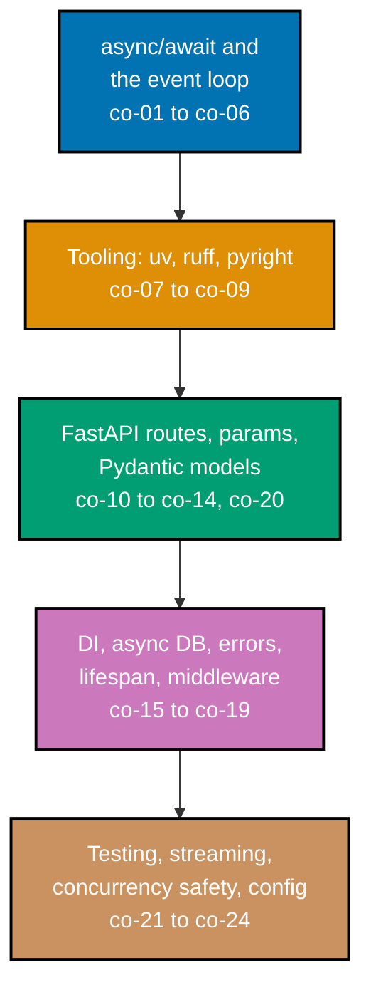

## Prerequisites

- **Prior topics**: [4 · Just Enough Python](../../just-enough-python/learning/overview.md) (functions, modules,
  typed collections) and [11 · Backend Essentials](../../backend-essentials/learning/overview.md) (HTTP, routing,
  persistence, a first FastAPI route served under `uvicorn`) -- this topic deepens both toward the async idiom
  and a production FastAPI service, and assumes you can already parameterize a SQL query from Python.
- **Tools & environment**: a macOS/Linux terminal; **Python 3.13** managed by **`uv`**; pinned CVE-clean
  **FastAPI 0.139.0**, **Pydantic 2.11.x**, **pydantic-settings**, **uvicorn 0.51.0**, **aiosqlite 0.20.x** for
  async database access, **httpx 0.28.x** + **pytest** for testing, **ruff ~0.15.x** for lint/format, and
  **pyright** for type checking -- all installed under `uv` (see Example 9).
- **Assumed knowledge**: reading and writing Python functions and classes; HTTP request/response basics; serving
  a one-route FastAPI app and hitting it with `curl`. No prior `async` experience is required -- `async def` is
  taught from zero here.

## Why this exists -- the big idea

The problem before the solution: a synchronous service blocks a whole worker on every slow I/O call, and
untyped request handling turns every endpoint into a runtime-error surface. The one idea worth keeping if you
forget everything else: **`async` interleaves thousands of I/O-bound waits in one process without threads, and
FastAPI + Pydantic turn your type hints into the validation, serialization, and OpenAPI docs -- the types you
write are the contract you ship.**

**Cross-cutting big ideas, taught here and reused for the rest of this topic**: `determinism-vs-emergence` is
why the event loop stays reasoned about only as long as every coroutine yields promptly (co-06) -- a single
blocking call stalls every concurrent coroutine at once. `abstraction-and-its-cost` is the real price of
`async`: it colours the whole call graph (co-01), so reach for it only when the workload is I/O-bound and
concurrent.

**Scope note**: this topic covers the **usable, production-shaped slice** -- enough `async`, FastAPI, and
Pydantic v2 to ship a real I/O-bound service. The conceptual theory of concurrency and parallelism is deferred
to [`concurrency-and-parallelism`](../../concurrency-and-parallelism/learning/overview.md), and the from-scratch
"build the framework yourself" treatment is deferred to `build-your-own-web-framework`. This topic links out to
both whenever the deeper treatment belongs there.

## Install and run your first example

Confirm Python 3 is installed, then use `uv` to create an isolated environment and install the pinned,
web-verified stack:

```text
$ python3 --version
Python 3.13.12
$ uv venv
$ source .venv/bin/activate
$ uv pip install fastapi==0.139.0 uvicorn==0.51.0 pydantic==2.11.0 aiosqlite==0.20.0 httpx==0.28.0 pytest
```

The pure-`asyncio` examples (1-8, 11) run directly with `python3 example.py`. From Example 12 onward, FastAPI
apps run under `uvicorn` from inside their own directory:

```text
uvicorn app:app --port 8000
```

...and are exercised from a second terminal with `curl` (or `httpx`) against `localhost:8000`. The async test
examples run with `pytest` (Example 33 onward).

**A note on versions**: the pins above are the snapshot this topic targets (see the course overview's dated
accuracy sidebar). `async`/`await`, the `asyncio` event loop, and ASGI are stable; the framework and tool
versions change weekly, so every version-specific claim in this topic sits in a dated note rather than baked
into prose.

## How this topic's examples are organized

- **Beginner** (Examples 1-18) -- the `async`/`await` primitives and the event loop (a first coroutine,
  sequential vs. concurrent awaits, `create_task`, `async with`/`async for`, and the blocking-call hazard that
  is this stack's single most common bug), the `uv`/`ruff`/`pyright` tooling triad, then FastAPI basics: a
  first route, typed path and query params, a Pydantic request body, the automatic 422, a `response_model`, and
  the generated OpenAPI docs.
- **Intermediate** (Examples 19-38) -- `Depends` dependency injection, async database access with `aiosqlite`
  and a CRUD round trip, `HTTPException` and custom exception handlers, lifespan-managed pools, middleware,
  `BackgroundTasks`, concurrent upstream fan-out via `gather`, Pydantic validators and nested models,
  `pydantic-settings`, structured logging, async testing with `httpx`, dependency overrides, streaming/SSE, and
  a concurrency-safe shared counter.
- **Advanced** (Examples 39-78) -- a full typed async CRUD service, pagination/filtering, auth, rate limiting,
  async HTTP clients, timeout/retry, a lifespan-managed background worker, WebSockets, CPU offloading, an
  OpenAPI-driven client, an integration test suite, the `ruff`/`pyright` gate, graceful shutdown, observability,
  a `remotebrowser`-shaped fan-out, the capstone, then Pydantic v2 deep features, `APIRouter` modularity,
  middleware ordering, CORS/GZip, OAuth2, forms/uploads, backpressure, broadcast rooms, circuit breaking,
  idempotency, ETags, and `uv`/Docker deployment.



## Concepts

Every worked example in this topic's follow-up pages cites the `co-NN` concept it exercises -- this section is
the 1:1 reference those citations point back to. Read it in order: the event loop comes first because every
later concept describes itself in those terms.

### co-01 · async/await basics

`async def` defines a coroutine; `await` yields control back to the event loop while an awaitable completes,
without blocking the thread. Calling a coroutine does not run it -- it returns a coroutine object you must
schedule (usually via `asyncio.run` or by awaiting it).

**Why it matters**: `async` is the colour that spreads -- once a function is `async`, every caller must be
`async` too. That colouring is the real cost of concurrency here, and it is why you reach for `async` only when
the workload is I/O-bound (co-03).

**Verify it**: Example 1 defines a first coroutine and runs it with `asyncio.run`; Example 2 awaits two in
sequence.

### co-02 · the event loop

A single-threaded event loop schedules coroutines cooperatively, interleaving many I/O waits in one process.
The loop runs one ready coroutine until it `await`s, then switches to another -- so concurrency is cooperative,
not preemptive.

**Why it matters**: because the loop is cooperative, one coroutine that refuses to yield (co-06) blocks every
other coroutine. The loop's fairness is a discipline every author maintains, not a guarantee the runtime gives
you.

**Verify it**: Examples 2 and 3 contrast sequential vs. concurrent scheduling on the same loop.

### co-03 · concurrency vs. parallelism

`async` gives I/O concurrency on one core -- many in-flight waits share one thread. It does **not** give
parallelism for CPU-bound work; that still needs processes or threads (or the free-threaded build), not the
event loop.

**Why it matters**: the most common misapplication of `async` is reaching for it on CPU-bound work, where it
adds the colouring cost and buys nothing. Reach for `async` when the workload is dominated by waiting (co-06,
co-47).

**Verify it**: Example 8 offloads blocking work to an executor; Example 47 offloads CPU-bound work to a process
pool.

### co-04 · awaitables, tasks, gather

`asyncio.create_task` schedules a coroutine to run concurrently and returns a `Task` you can await later;
`asyncio.gather` runs several awaitables concurrently and collects their results in order. Both turn "await one
at a time" into "await many at once."

**Why it matters**: `gather` is how a handler fans out to many slow I/O calls (a database, several upstream APIs)
and pays only the slowest one's latency instead of the sum -- the central throughput win of an async service.

**Verify it**: Examples 3 and 4 introduce `gather` and `create_task`; Example 28 fans out upstream calls in a
handler.

### co-05 · async context and iteration

`async with` runs an async resource's setup and teardown (`__aenter__`/`__aexit__`), and `async for` consumes an
async iterable one item at a time, yielding between items. These manage async resources -- connections,
responses, streams -- whose acquire/release themselves await.

**Why it matters**: a database connection or an HTTP response body is itself an async resource; leaking it (a
missing `async with`) leaks a connection, exactly the failure mode Examples 5 and 20 guard against.

**Verify it**: Examples 5 and 6 cover `async with` and `async for`; Example 46 uses them in a WebSocket handler.

### co-06 · the blocking-call hazard

A synchronous blocking call inside a coroutine -- `time.sleep`, a blocking `requests.get`, a synchronous DB
driver -- stalls the **entire** loop, not just that coroutine, because the loop cannot switch while the call
runs. The fix is an async-native call, or offloading to an executor.

**Why it matters**: this is the single most common and most silent bug in async Python -- the endpoint "works"
but every concurrent request queues behind the blocking call. The whole intermediate/advanced testing tier
exists partly to catch it.

**Verify it**: Example 7 reproduces the stall and fixes it; Example 8 offloads a genuinely blocking call.

### co-07 · uv environments

`uv` creates isolated virtual environments and installs pinned dependencies fast and reproducibly, replacing the
slower `python -m venv` + `pip` pair. A pinned `uv pip install` is the lock this topic's every example assumes.

**Why it matters**: reproducible environments are what make "works on my machine" into "works in CI" -- a
pinned `uv` install is the single command that guarantees every example below sees the same versions.

**Verify it**: Example 9 creates a locked environment; Example 77 declares a full `uv` project from a manifest.

### co-08 · ruff lint and format

`ruff` lints and formats Python in one fast tool, replacing `flake8`/`isort`/`black` and friends. `ruff check`
flags likely bugs; `ruff format` rewrites style deterministically. A clean `ruff` is this topic's lint gate.

**Why it matters**: a fast, zero-config linter that runs on every save is what keeps a codebase consistent
without slowing the dev loop -- and a shared format baseline removes an entire class of PR noise.

**Verify it**: Example 10 runs `ruff check` + `ruff format` clean; Example 50 makes the full gate explicit.

### co-09 · pyright static typing

`pyright` type-checks Python against its type hints, catching contract errors (wrong argument type, a `None`
where an `int` is expected) before runtime. Every example in this topic is fully type-annotated and
`pyright`-clean.

**Why it matters**: with FastAPI, your type hints are the API contract -- `pyright` checks that contract in
your editor before a single request runs, which is strictly more useful than discovering a type mismatch in
production logs.

**Verify it**: Example 11 type-checks a typed module clean; Example 50 makes the full gate explicit.

### co-10 · FastAPI app and routes

A FastAPI app declares path operations with `@app.get(...)`, `@app.post(...)`, and friends, each a typed handler
whose parameters and return type drive validation, serialization, and docs. This is the foundation every later
FastAPI concept builds on.

**Why it matters**: a route declaration is the one place the framework reads your types and turns them into
behaviour -- the same annotation is the validation rule, the response shape, and the OpenAPI schema entry.

**Verify it**: Example 12 serves a first route; Example 39 assembles a full multi-route service.

### co-11 · path, query, body parameters

FastAPI derives path params (`/items/{id}`), query params (`?q=`), and body params from the function signature
and their types -- a param whose name is in the path is a path param; a Pydantic model param is the body.

**Why it matters**: one typed signature replaces hand-parsing of the URL, query string, and JSON body -- and
gets each one validated and documented for free, with no per-endpoint parsing code.

**Verify it**: Examples 13-15 cover path, query, and body params; Example 40 adds constrained query params.

### co-12 · Pydantic models

Pydantic v2 models (`BaseModel`) declare typed, validated data shapes used as request and response schemas.
Field types and constraints are checked on construction; a violating value raises a `ValidationError` (or, in a
handler, a 422).

**Why it matters**: Pydantic is FastAPI's validation vocabulary -- the model you declare is the boundary a
request must cross before any handler logic runs, and the shape a response is filtered through on the way out.

**Verify it**: Example 15 declares a request model; Examples 29, 30, and 55-58 go deeper into validators,
nesting, and v2 features.

### co-13 · request validation

Invalid input is rejected automatically with a structured 422 **before** the handler runs -- a missing field, a
wrong type, a violated constraint each become a machine-readable error pointing at the offending location.

**Why it matters**: validating at the boundary means a handler's body can trust its inputs are already
well-formed -- no defensive `if x is None` checks scattered through business logic, and no wrong-typed value
reaching the database.

**Verify it**: Example 16 posts an invalid body and observes the 422; Example 34 tests the failure path.

### co-14 · response models and serialization

A declared `response_model` shapes and validates what an endpoint returns -- extra fields are stripped, and the
output is serialized to JSON according to the model. This is the output-side counterpart of co-13.

**Why it matters**: an output model is a leak guard -- a field present on the internal object (a password hash,
an internal flag) never reaches the response body if the output model omits it, regardless of what the handler
returns.

**Verify it**: Example 17 strips an extra field via `response_model`; Example 57 controls serialization aliases.

### co-15 · dependency injection

FastAPI's `Depends` supplies shared resources -- a database session, a config object, an authenticated user -- to
handlers declaratively. The framework resolves the dependency before the handler runs and tears it down after.

**Why it matters**: `Depends` is what lets a handler declare "I need a database session" without knowing how it
is created or pooled -- and it is the seam that makes swapping a real session for a fake in tests one line of
setup (Example 35).

**Verify it**: Examples 19 and 20 inject a shared resource and a DB session; Example 41 builds an auth dependency.

### co-16 · async database access

An async DB driver/session (`aiosqlite` here) lets query waits yield to the loop instead of blocking the worker.
A handler that `await`s its queries keeps the loop free to serve other requests during each query's latency.

**Why it matters**: an async service with a synchronous DB driver throws away the entire throughput win -- the
handler blocks on the query, stalling the loop exactly like co-06. The async driver is what closes that gap.

**Verify it**: Examples 20-22 do async DB access and CRUD; Example 43 shows the same idea for an HTTP client.

### co-17 · error handling and HTTP exceptions

Raising `HTTPException(status_code=...)` maps a failure to a status and body; registering an exception handler
maps a whole class of domain errors to a response shape. The result is one consistent error envelope, never a
raw traceback.

**Why it matters**: a predictable error shape means a client writes one error-handling path instead of one per
endpoint -- and never sees internal details that are both a poor experience and a security exposure.

**Verify it**: Examples 23 and 24 cover `HTTPException` and a custom handler; Example 65 centralizes them.

### co-18 · middleware and lifespan

Middleware wraps every request/response to add cross-cutting behaviour (timing, logging, CORS, rate limiting).
A lifespan handler runs once at startup and once at shutdown to manage pooled resources (connections, clients,
background workers).

**Why it matters**: cross-cutting concerns apply to every route, so writing them once in middleware (instead of
copy-pasting into every handler) is both less code and less drift -- and a lifespan is the one correct place to
open and close a shared pool.

**Verify it**: Examples 25 and 26 cover lifespan and middleware; Examples 42, 66-69 go deeper.

### co-19 · background tasks

`BackgroundTasks` defers non-critical work (a log write, a notification, a cache invalidation) past the response
without standing up a full task queue. The response returns immediately; the task runs after.

**Why it matters**: not every side effect belongs on the request's critical path -- `BackgroundTasks` is the
lightweight option that keeps a response fast while still getting the side effect done, before you reach for
Celery/Redis.

**Verify it**: Example 27 defers a side effect; Example 45 builds a lifespan-managed worker for heavier work.

### co-20 · OpenAPI and docs

FastAPI generates an OpenAPI schema and interactive docs (`/docs`, `/redoc`) from the typed routes
automatically -- every path, parameter, model, and response code appears with no extra authoring.

**Why it matters**: live, accurate docs that cannot drift from the code are what make an API safe to consume and
to generate client code against (Example 48) -- the schema is the contract, generated from the same annotations
that enforce it.

**Verify it**: Example 18 inspects the schema; Example 64 documents responses and examples; Example 48 generates
a client from it.

### co-21 · testing async endpoints

`httpx.AsyncClient` + `pytest` (async) exercise endpoints in-process with real request/response cycles, without
a running server or a network socket. FastAPI's `TestClient` is the synchronous wrapper for the same idea.

**Why it matters**: a fast, in-process test suite is what makes async refactoring safe -- you can change a
handler and know within a second whether every route still behaves, including the 422 paths.

**Verify it**: Examples 33-35 cover endpoint tests, validation-failure tests, and dependency overrides; Example
49 is a full integration suite.

### co-22 · streaming responses

`StreamingResponse` and server-sent events (SSE) push data incrementally for long or real-time payloads,
yielding chunks as they become available instead of buffering the whole response.

**Why it matters**: a buffered multi-megabyte response is both slow to first byte and memory-hungry; streaming
gets the first byte out immediately and keeps peak memory flat, which is exactly what a live-event or
log-tail endpoint needs.

**Verify it**: Examples 36 and 37 cover `StreamingResponse` and SSE; Example 72 adds backpressure.

### co-23 · concurrency safety

Shared mutable state across coroutines needs care -- even without OS threads, two coroutines that read-modify-write a shared variable can lose updates. The tools are locks (`asyncio.Lock`), or better, avoiding shared
state.

**Why it matters**: "but there are no threads, so it is safe" is a common and wrong assumption -- the
read-modify-write window between two `await`s is exactly where a concurrent coroutine can interleave. A
`Lock` or a single-writer design closes it.

**Verify it**: Example 38 guards a shared counter; Example 42 rate-limits with a lock-guarded store.

### co-24 · production config

Settings via environment and `pydantic-settings`, structured logging, and an ASGI server config (host/port,
workers, graceful-timeout) make a service deployable rather than just runnable. This is the difference between a
demo and something you can ship.

**Why it matters**: hardcoded values and `print` statements are fine in Example 12 and unacceptable in
production -- `pydantic-settings` validates config at startup (a missing required env var fails fast), and
structured logging makes every request traceable in aggregate.

**Verify it**: Examples 31 and 32 cover settings and structured logging; Example 78 is the deploy config.

## Examples by Level

### Beginner (Examples 1–18)

- [Example 1: First Coroutine via asyncio Run](/en/c/learn/courses/async-python-and-fastapi-services/learning/beginner#example-1-first-coroutine-via-asyncio-run)
- [Example 2: Sequential Awaits Add Up](/en/c/learn/courses/async-python-and-fastapi-services/learning/beginner#example-2-sequential-awaits-add-up)
- [Example 3: Concurrent Awaits with gather](/en/c/learn/courses/async-python-and-fastapi-services/learning/beginner#example-3-concurrent-awaits-with-gather)
- [Example 4: Scheduling Background Work as a Task](/en/c/learn/courses/async-python-and-fastapi-services/learning/beginner#example-4-scheduling-background-work-as-a-task)
- [Example 5: Managing a Resource with async with](/en/c/learn/courses/async-python-and-fastapi-services/learning/beginner#example-5-managing-a-resource-with-async-with)
- [Example 6: Consuming an Async Stream with async for](/en/c/learn/courses/async-python-and-fastapi-services/learning/beginner#example-6-consuming-an-async-stream-with-async-for)
- [Example 7: A Blocking Call Stalls the Loop](/en/c/learn/courses/async-python-and-fastapi-services/learning/beginner#example-7-a-blocking-call-stalls-the-loop)
- [Example 8: Offloading Blocking Work to an Executor](/en/c/learn/courses/async-python-and-fastapi-services/learning/beginner#example-8-offloading-blocking-work-to-an-executor)
- [Example 9: Creating a Locked Environment with uv](/en/c/learn/courses/async-python-and-fastapi-services/learning/beginner#example-9-creating-a-locked-environment-with-uv)
- [Example 10: Linting and Formatting Clean with ruff](/en/c/learn/courses/async-python-and-fastapi-services/learning/beginner#example-10-linting-and-formatting-clean-with-ruff)
- [Example 11: Type Checking Clean with pyright](/en/c/learn/courses/async-python-and-fastapi-services/learning/beginner#example-11-type-checking-clean-with-pyright)
- [Example 12: A First FastAPI Route](/en/c/learn/courses/async-python-and-fastapi-services/learning/beginner#example-12-a-first-fastapi-route)
- [Example 13: A Typed Path Parameter](/en/c/learn/courses/async-python-and-fastapi-services/learning/beginner#example-13-a-typed-path-parameter)
- [Example 14: A Typed Query Parameter](/en/c/learn/courses/async-python-and-fastapi-services/learning/beginner#example-14-a-typed-query-parameter)
- [Example 15: A Pydantic Model as a Request Body](/en/c/learn/courses/async-python-and-fastapi-services/learning/beginner#example-15-a-pydantic-model-as-a-request-body)
- [Example 16: Invalid Input Returns a 422](/en/c/learn/courses/async-python-and-fastapi-services/learning/beginner#example-16-invalid-input-returns-a-422)
- [Example 17: Shaping the Output with a response model](/en/c/learn/courses/async-python-and-fastapi-services/learning/beginner#example-17-shaping-the-output-with-a-response-model)
- [Example 18: OpenAPI Docs Are Generated for Free](/en/c/learn/courses/async-python-and-fastapi-services/learning/beginner#example-18-openapi-docs-are-generated-for-free)

### Intermediate (Examples 19–38)

- [Example 19: Injecting a Shared Resource with Depends](/en/c/learn/courses/async-python-and-fastapi-services/learning/intermediate#example-19-injecting-a-shared-resource-with-depends)
- [Example 20: Injecting a Database Session with Depends](/en/c/learn/courses/async-python-and-fastapi-services/learning/intermediate#example-20-injecting-a-database-session-with-depends)
- [Example 21: An Async Database Query Yields to the Loop](/en/c/learn/courses/async-python-and-fastapi-services/learning/intermediate#example-21-an-async-database-query-yields-to-the-loop)
- [Example 22: A CRUD Create and Read Round Trip](/en/c/learn/courses/async-python-and-fastapi-services/learning/intermediate#example-22-a-crud-create-and-read-round-trip)
- [Example 23: Mapping a Failure to a Status with HTTPException](/en/c/learn/courses/async-python-and-fastapi-services/learning/intermediate#example-23-mapping-a-failure-to-a-status-with-httpexception)
- [Example 24: Mapping a Domain Error with a Custom Handler](/en/c/learn/courses/async-python-and-fastapi-services/learning/intermediate#example-24-mapping-a-domain-error-with-a-custom-handler)
- [Example 25: Opening a Pool Once in a Lifespan Handler](/en/c/learn/courses/async-python-and-fastapi-services/learning/intermediate#example-25-opening-a-pool-once-in-a-lifespan-handler)
- [Example 26: Adding a Timing Header with Middleware](/en/c/learn/courses/async-python-and-fastapi-services/learning/intermediate#example-26-adding-a-timing-header-with-middleware)
- [Example 27: Deferring Work Past the Response with Background Tasks](/en/c/learn/courses/async-python-and-fastapi-services/learning/intermediate#example-27-deferring-work-past-the-response-with-background-tasks)
- [Example 28: Fanning Out Concurrent Upstream Calls](/en/c/learn/courses/async-python-and-fastapi-services/learning/intermediate#example-28-fanning-out-concurrent-upstream-calls)
- [Example 29: Enforcing a Rule with a Pydantic Validator](/en/c/learn/courses/async-python-and-fastapi-services/learning/intermediate#example-29-enforcing-a-rule-with-a-pydantic-validator)
- [Example 30: Nested Pydantic Models Serialize Together](/en/c/learn/courses/async-python-and-fastapi-services/learning/intermediate#example-30-nested-pydantic-models-serialize-together)
- [Example 31: Loading Config from Env with pydantic settings](/en/c/learn/courses/async-python-and-fastapi-services/learning/intermediate#example-31-loading-config-from-env-with-pydantic-settings)
- [Example 32: One Structured Log Line per Request](/en/c/learn/courses/async-python-and-fastapi-services/learning/intermediate#example-32-one-structured-log-line-per-request)
- [Example 33: Testing an Endpoint with Async httpx](/en/c/learn/courses/async-python-and-fastapi-services/learning/intermediate#example-33-testing-an-endpoint-with-async-httpx)
- [Example 34: Testing a Validation Failure Path](/en/c/learn/courses/async-python-and-fastapi-services/learning/intermediate#example-34-testing-a-validation-failure-path)
- [Example 35: Overriding a Dependency in Tests](/en/c/learn/courses/async-python-and-fastapi-services/learning/intermediate#example-35-overriding-a-dependency-in-tests)
- [Example 36: Sending Chunks with a Streaming Response](/en/c/learn/courses/async-python-and-fastapi-services/learning/intermediate#example-36-sending-chunks-with-a-streaming-response)
- [Example 37: A Server Sent Events Endpoint](/en/c/learn/courses/async-python-and-fastapi-services/learning/intermediate#example-37-a-server-sent-events-endpoint)
- [Example 38: A Concurrency Safe Shared Counter](/en/c/learn/courses/async-python-and-fastapi-services/learning/intermediate#example-38-a-concurrency-safe-shared-counter)

### Advanced (Examples 39–78)

- [Example 39: A Full Typed Async CRUD Service](/en/c/learn/courses/async-python-and-fastapi-services/learning/advanced#example-39-a-full-typed-async-crud-service)
- [Example 40: Pagination and Filtering on a List Endpoint](/en/c/learn/courses/async-python-and-fastapi-services/learning/advanced#example-40-pagination-and-filtering-on-a-list-endpoint)
- [Example 41: An Auth Dependency Gates Protected Routes](/en/c/learn/courses/async-python-and-fastapi-services/learning/advanced#example-41-an-auth-dependency-gates-protected-routes)
- [Example 42: An In Process Rate Limit Middleware](/en/c/learn/courses/async-python-and-fastapi-services/learning/advanced#example-42-an-in-process-rate-limit-middleware)
- [Example 43: An Async HTTP Client Service with a Pool](/en/c/learn/courses/async-python-and-fastapi-services/learning/advanced#example-43-an-async-http-client-service-with-a-pool)
- [Example 44: Timeout and Bounded Retry on an Upstream](/en/c/learn/courses/async-python-and-fastapi-services/learning/advanced#example-44-timeout-and-bounded-retry-on-an-upstream)
- [Example 45: A Lifespan Managed Background Worker](/en/c/learn/courses/async-python-and-fastapi-services/learning/advanced#example-45-a-lifespan-managed-background-worker)
- [Example 46: A WebSocket Echo Endpoint](/en/c/learn/courses/async-python-and-fastapi-services/learning/advanced#example-46-a-websocket-echo-endpoint)
- [Example 47: Offloading CPU Bound Work to a Process Pool](/en/c/learn/courses/async-python-and-fastapi-services/learning/advanced#example-47-offloading-cpu-bound-work-to-a-process-pool)
- [Example 48: An OpenAPI Driven Typed Client](/en/c/learn/courses/async-python-and-fastapi-services/learning/advanced#example-48-an-openapi-driven-typed-client)
- [Example 49: A Full Async Integration Test Suite](/en/c/learn/courses/async-python-and-fastapi-services/learning/advanced#example-49-a-full-async-integration-test-suite)
- [Example 50: The ruff and pyright Gate](/en/c/learn/courses/async-python-and-fastapi-services/learning/advanced#example-50-the-ruff-and-pyright-gate)
- [Example 51: Graceful Shutdown Drains In Flight Work](/en/c/learn/courses/async-python-and-fastapi-services/learning/advanced#example-51-graceful-shutdown-drains-in-flight-work)
- [Example 52: Observability Metrics on an Endpoint](/en/c/learn/courses/async-python-and-fastapi-services/learning/advanced#example-52-observability-metrics-on-an-endpoint)
- [Example 53: A remotebrowser Shaped Fan Out and Aggregate](/en/c/learn/courses/async-python-and-fastapi-services/learning/advanced#example-53-a-remotebrowser-shaped-fan-out-and-aggregate)
- [Example 54: The Capstone Production Service](/en/c/learn/courses/async-python-and-fastapi-services/learning/advanced#example-54-the-capstone-production-service)
- [Example 55: Pydantic Computed Fields](/en/c/learn/courses/async-python-and-fastapi-services/learning/advanced#example-55-pydantic-computed-fields)
- [Example 56: Forbidding Extra Fields with Model Config](/en/c/learn/courses/async-python-and-fastapi-services/learning/advanced#example-56-forbidding-extra-fields-with-model-config)
- [Example 57: Pydantic Serialization Aliases](/en/c/learn/courses/async-python-and-fastapi-services/learning/advanced#example-57-pydantic-serialization-aliases)
- [Example 58: Pydantic Custom Types via Annotated](/en/c/learn/courses/async-python-and-fastapi-services/learning/advanced#example-58-pydantic-custom-types-via-annotated)
- [Example 59: Splitting a Big App with APIRouter](/en/c/learn/courses/async-python-and-fastapi-services/learning/advanced#example-59-splitting-a-big-app-with-apirouter)
- [Example 60: APIRouter Prefix and Tags](/en/c/learn/courses/async-python-and-fastapi-services/learning/advanced#example-60-apirouter-prefix-and-tags)
- [Example 61: An Async Yield Dependency with Cleanup](/en/c/learn/courses/async-python-and-fastapi-services/learning/advanced#example-61-an-async-yield-dependency-with-cleanup)
- [Example 62: Sharing State via app state in a Lifespan](/en/c/learn/courses/async-python-and-fastapi-services/learning/advanced#example-62-sharing-state-via-app-state-in-a-lifespan)
- [Example 63: Query and Path Constraints](/en/c/learn/courses/async-python-and-fastapi-services/learning/advanced#example-63-query-and-path-constraints)
- [Example 64: OpenAPI Examples and Documented Responses](/en/c/learn/courses/async-python-and-fastapi-services/learning/advanced#example-64-openapi-examples-and-documented-responses)
- [Example 65: Domain Exception Handlers Registered Centrally](/en/c/learn/courses/async-python-and-fastapi-services/learning/advanced#example-65-domain-exception-handlers-registered-centrally)
- [Example 66: A Middleware Written as a Class](/en/c/learn/courses/async-python-and-fastapi-services/learning/advanced#example-66-a-middleware-written-as-a-class)
- [Example 67: Middleware Ordering Matters](/en/c/learn/courses/async-python-and-fastapi-services/learning/advanced#example-67-middleware-ordering-matters)
- [Example 68: Compressing Responses with GZip Middleware](/en/c/learn/courses/async-python-and-fastapi-services/learning/advanced#example-68-compressing-responses-with-gzip-middleware)
- [Example 69: CORS with Explicit Allowed Origins](/en/c/learn/courses/async-python-and-fastapi-services/learning/advanced#example-69-cors-with-explicit-allowed-origins)
- [Example 70: An OAuth2 Password Bearer Token Flow](/en/c/learn/courses/async-python-and-fastapi-services/learning/advanced#example-70-an-oauth2-password-bearer-token-flow)
- [Example 71: Form Data and File Upload](/en/c/learn/courses/async-python-and-fastapi-services/learning/advanced#example-71-form-data-and-file-upload)
- [Example 72: Async Generator Backpressure](/en/c/learn/courses/async-python-and-fastapi-services/learning/advanced#example-72-async-generator-backpressure)
- [Example 73: WebSocket Broadcast Rooms](/en/c/learn/courses/async-python-and-fastapi-services/learning/advanced#example-73-websocket-broadcast-rooms)
- [Example 74: A Circuit Breaker Around an Upstream](/en/c/learn/courses/async-python-and-fastapi-services/learning/advanced#example-74-a-circuit-breaker-around-an-upstream)
- [Example 75: An Idempotency Key for Writes](/en/c/learn/courses/async-python-and-fastapi-services/learning/advanced#example-75-an-idempotency-key-for-writes)
- [Example 76: ETag and Conditional Responses](/en/c/learn/courses/async-python-and-fastapi-services/learning/advanced#example-76-etag-and-conditional-responses)
- [Example 77: A uv Project from a Manifest](/en/c/learn/courses/async-python-and-fastapi-services/learning/advanced#example-77-a-uv-project-from-a-manifest)
- [Example 78: A Dockerfile for Multi Worker ASGI Deploy](/en/c/learn/courses/async-python-and-fastapi-services/learning/advanced#example-78-a-dockerfile-for-multi-worker-asgi-deploy)

---

← Previous: [Overview](../overview.md) · Next: [Beginner Examples](./beginner.md) →
