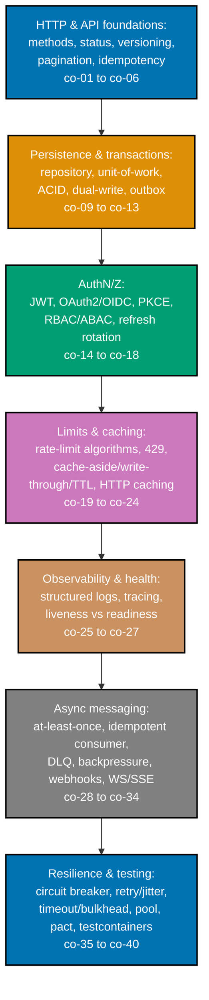

## Prerequisites

- **Prior topics**: [11 · Backend Essentials](../../backend-essentials/learning/overview.md) -- routing
  and serving a CRUD JSON API, assumed throughout; [10 · SQL Essentials](../../sql-essentials/learning/overview.md);
  [17 · Security Essentials](../../security-essentials/learning/overview.md); and [15 · Software Testing](../../software-testing/learning/overview.md).
- **Tools & environment**: a macOS/Linux terminal and **Python 3.13+** with type hints and `pyright --strict`.
  Every example is pure standard library -- no web framework, database driver, broker, or network call is
  ever required to run one.
- **Assumed knowledge**: serving a CRUD JSON API; tokens vs sessions; writing an integration test.

## Why this exists -- the big idea

At scale, design for the retry and the failure. Every one of this topic's 80 worked examples illustrates
one piece of that discipline -- from RFC 9110's method semantics and status codes, through idempotency
keys and cursor pagination, caching and rate limiting, OAuth2/OIDC and JWT, queues and the transactional
outbox, webhooks and WebSocket/SSE, the circuit breaker and full-jitter retries, to a closing example
assembling every idea into one scale-ready service.

**Cross-cutting big ideas, taught here and carried through every tier**: `consistency-latency-throughput`
-- caching, rate limiting, and pagination are throughput decisions wearing a feature's costume;
`taming-state` -- idempotency quarantines duplicate-effect state; `coupling-vs-cohesion` -- async
messaging and the outbox decouple producers from consumers.

## How this topic's examples are organized

- **Beginner** (Examples 1-28) -- the foundations: RFC 9110 method safety/idempotency, the status codes
  that distinguish outcomes (201/204/400/401/403/409/422), URI-path and header versioning, offset and
  cursor pagination (and why cursor is stable under concurrent inserts), Idempotency-Key record/replay/
  reject-on-mismatch, the repository and unit-of-work patterns over an in-memory store, ACID transaction
  atomicity, JWT encode/verify and expiry, RBAC vs ABAC gates, and structured JSON logging with a
  threaded correlation id.
- **Intermediate** (Examples 29-56) -- auth, limits, caches, and observability: the OAuth2 authorization-
  code flow and OIDC id_token, PKCE, refresh-token rotation and reuse detection, the four rate-limit
  algorithms (token bucket, leaky bucket, fixed window's boundary-burst flaw, sliding window) and 429 +
  Retry-After, cache-aside and write-through, TTL expiry and explicit invalidation (and the stale-data
  bug a wrong TTL causes), HTTP caching with ETag/If-None-Match and Cache-Control, OpenTelemetry spans
  and W3C traceparent propagation, liveness vs readiness probes, GraphQL field selection and the N+1
  resolver fixed by DataLoader batching, gRPC unary and server-streaming RPCs, and a REST/GraphQL/gRPC
  contrast.
- **Advanced** (Examples 57-80) -- queues, messaging, and resilience: at-least-once delivery, idempotent
  consumers, dead-letter queues, backpressure via a bounded queue, the dual-write problem and the
  transactional outbox (sent iff the transaction commits), an idempotent outbox relay, HMAC-signed
  webhooks (send, verify, retry), WebSocket echo vs SSE streaming, a broker pub/sub backplane for
  fanout, the circuit breaker, retry exponential backoff and full jitter, timeout guards and bulkhead
  isolation, connection pooling and the N+1 query, Pact consumer-driven contracts, testcontainers, and a
  closing scale-ready-service assembly.
- **[Capstone](./capstone/overview.md)** -- evolve the Backend-Essentials service into a scale-ready API:
  versioned + cursor-paginated REST with idempotent writes, OAuth2/OIDC + RBAC, structured logging +
  rate limiting + caching, and a background-job queue consumer with idempotent processing, behind an
  integration and contract test suite.

Every example is a complete, self-contained, originally-authored, genuinely-executed Python file
colocated under `learning/code/` -- run with `python3 example.py`. gRPC, GraphQL, WebSocket, SSE,
OpenTelemetry, queues, and brokers are simulated in pure standard library rather than depending on a
live installation, so every "Output" block is a real captured run.

## Concepts

Every worked example in this topic's follow-up pages cites the `co-NN` concept it exercises -- this
section is the 1:1 reference those citations point back to.

### co-01 · rest-method-semantics

GET/POST/PUT/PATCH/DELETE and which are safe (read-only) vs idempotent (repeatable) per RFC 9110; POST
is neither safe nor idempotent.

**Why it matters**: an idempotent method (PUT, DELETE) gives a client a safety guarantee a non-idempotent
one (POST) does not -- knowing which is which determines whether a client can safely retry on its own, or
needs an explicit Idempotency-Key (co-06) instead.

**Verify it**: Example 1 routes all four verbs over one resource; Example 2 repeats GET, PUT, and POST
twice each to show GET/PUT repeatable and POST duplicating.

### co-02 · http-status-codes

Choosing the right status: 201 vs 202 vs 204, and the 400/401/403/404/409/422/429 distinctions (especially
401 auth-missing vs 403 forbidden).

**Why it matters**: a caller's error-handling logic branches on the status code first -- 401 (who are
you?) and 403 (I know you, but no) demand genuinely different remediation, and collapsing them misleads
every client.

**Verify it**: Examples 3-8 cover 201+Location, 204, 400, 401-vs-403, 409, and 422 respectively.

### co-03 · api-versioning

Evolving an API via URI-path, header, or query-param versioning, each a genuine trade-off (Google AIP-185
path; Microsoft Azure query; Stripe header).

**Why it matters**: the strategy affects HTTP-cache compatibility and discoverability -- there is no
single right answer, only named forces.

**Verify it**: Example 9 implements URI-path versioning; Example 10 implements header versioning.

### co-04 · offset-pagination

`offset`/`limit` paging and why the database fetches-and-discards every preceding row.

**Why it matters**: understanding this linear cost (and its drift under concurrent inserts) is the
specific motivation for cursor pagination (co-05).

**Verify it**: Example 11 returns the correct slice; Example 12 instruments the fetch-and-discard cost.

### co-05 · cursor-pagination

Keyset/cursor paging on an indexed key that scales and is stable under concurrent inserts.

**Why it matters**: a cursor's stability under concurrent writes is what makes it the correct default for
a production list endpoint at any real scale.

**Verify it**: Example 13 pages with a `starting_after` cursor; Example 14 proves it stable where offset
drifts.

### co-06 · idempotency-key

An `Idempotency-Key` header so a retried POST does not double-apply (store the first result, replay it;
Stripe prior art, the IETF draft lapsed).

**Why it matters**: this is the explicit mechanism that makes a non-idempotent method (POST) safely
retryable, closing the gap PUT's own semantics leave open.

**Verify it**: Example 15 records/replays; Example 16 proves no double-apply on a charge; Example 17
rejects a reused key with a different body.

### co-07 · graphql-vs-rest

GraphQL's single endpoint + client-specified fields solving over/under-fetching, and its resolver N+1
pitfall.

**Why it matters**: letting the caller's query decide the response shape directly solves REST's fixed-
shape over-fetching -- at the cost of owning query complexity and the N+1 (co-40).

**Verify it**: Examples 51-53 cover field selection, the over-fetch contrast, and the N+1 + DataLoader
fix.

### co-08 · grpc-protobuf-http2

gRPC's protobuf IDL over HTTP/2 with unary and streaming RPCs, for low-latency service-to-service calls.

**Why it matters**: Protobuf is both the IDL and the wire format in one artifact -- a different contract
model from REST's separation of OpenAPI from JSON.

**Verify it**: Example 54 is a unary RPC; Example 55 is server-streaming; Example 56 contrasts all three
styles.

### co-09 · repository-pattern

A collection-like interface mediating between the domain and the data store (Fowler, PoEAA).

**Why it matters**: the domain talks to a collection interface, not a storage mechanism -- so the backend
can be swapped without touching the domain.

**Verify it**: Example 18 is full CRUD through a repository; Example 19 swaps the backend with callers
unchanged.

### co-10 · unit-of-work

Tracking the objects changed in a business transaction and committing them together (Fowler, PoEAA).

**Why it matters**: a UoW coordinates writing out all changes at once -- the staging area for an atomic
commit.

**Verify it**: Example 20 commits all tracked changes together; Example 21 rolls them all back.

### co-11 · transactions-acid

An atomic commit boundary: all writes commit or all roll back.

**Why it matters**: atomicity is what makes a multi-step business operation (debit + credit) all-or-
nothing instead of half-applied.

**Verify it**: Example 21 demonstrates rollback; Example 22 demonstrates all-or-nothing on a failure.

### co-12 · dual-write-problem

Writing to a DB and a broker cannot be made atomic; a crash between them loses a message.

**Why it matters**: the dual-write is the specific failure mode the transactional outbox (co-13) exists
to solve.

**Verify it**: Example 63 demonstrates the lost message on a crash between the two writes.

### co-13 · transactional-outbox

Storing the outbound message in the same DB transaction and relaying it separately, so it is sent iff
the transaction commits (microservices.io).

**Why it matters**: the outbox makes "update the DB and send a message" atomic without a distributed
transaction.

**Verify it**: Example 64 proves sent-iff-committed; Example 65 proves the at-least-once relay is safe
with an idempotent consumer.

### co-14 · jwt

A signed, self-contained claims token (RFC 7519) verified without a session lookup.

**Why it matters**: a JWT carries its own claims and signature, so verification is stateless -- no
session store lookup per request.

**Verify it**: Example 23 encodes/verifies; Example 24 rejects an expired token.

### co-15 · oauth2-vs-oidc

OAuth 2.0 grants authorization; OpenID Connect adds an identity layer for authentication.

**Why it matters**: conflating the two is a common security mistake -- OAuth2 says what you may do, OIDC
says who you are.

**Verify it**: Example 29 models the auth-code flow; Example 30 issues an OIDC id_token.

### co-16 · pkce

The PKCE code-verifier/challenge that protects public clients from auth-code interception (mandated by
the OAuth security BCP, RFC 9700).

**Why it matters**: PKCE closes the auth-code interception attack for clients that cannot hold a secret
(SPAs, mobile apps).

**Verify it**: Example 31 generates verifier/challenge and rejects a wrong verifier.

### co-17 · rbac-vs-abac

Role-based vs attribute-based access control and when each fits (NIST model).

**Why it matters**: RBAC is auditable but coarse; ABAC is flexible but harder to manage -- the choice is
a real trade-off.

**Verify it**: Example 25 is an RBAC role gate; Example 26 is an ABAC owner policy.

### co-18 · refresh-token-rotation

Short-lived access tokens with rotating refresh tokens, and detecting a reused (stolen) refresh token.

**Why it matters**: rotation limits a stolen refresh token's lifetime, and reuse detection revokes the
whole family on a breach.

**Verify it**: Example 32 rotates; Example 33 detects reuse and revokes the family.

### co-19 · rate-limit-algorithms

Token bucket, leaky bucket, fixed window, and sliding window, and their burst/accuracy trade-offs.

**Why it matters**: the algorithm choice governs whether bursts are allowed and whether a boundary burst
(2x at the edge) is possible.

**Verify it**: Examples 34-37 implement all four; Example 36 demonstrates the fixed-window boundary flaw.

### co-20 · rate-limit-429-retry-after

Returning 429 Too Many Requests with a Retry-After hint when a client exceeds its budget.

**Why it matters**: Retry-After turns a bare rejection into actionable guidance -- exactly how long to
wait.

**Verify it**: Example 38 returns 429 + Retry-After.

### co-21 · cache-aside

Lazy loading: on a miss, read the DB, populate the cache, return the value.

**Why it matters**: cache-aside is the simplest caching strategy -- and the instrumented DB proves a
cached read issues no query.

**Verify it**: Example 39 shows miss-then-hit; Example 40 instruments zero DB queries on a warm read.

### co-22 · write-through-cache

Updating the cache synchronously on every write so reads stay fresh.

**Why it matters**: write-through keeps the cache fresh without relying on a TTL or lazy reload.

**Verify it**: Example 41 updates cache and DB together.

### co-23 · cache-ttl-invalidation

TTL expiry plus explicit invalidation, and the staleness bug a wrong TTL causes.

**Why it matters**: cache invalidation is a correctness problem -- the wrong TTL serves stale data.

**Verify it**: Example 42 shows TTL expiry; Example 43 shows explicit invalidation; Example 44 shows the
stale-data bug and its fix.

### co-24 · http-caching-etag

Cache-Control, ETag + If-None-Match, and 304 Not Modified conditional revalidation (RFC 9111).

**Why it matters**: ETag-based caching saves bandwidth on unchanged reads.

**Verify it**: Example 45 returns 304 on a match; Example 46 honors Cache-Control: max-age.

### co-25 · structured-logging-correlation

Machine-parseable JSON logs carrying a correlation/request id across a request's lifetime.

**Why it matters**: a structured log with a correlation id groups every line of one request in an
aggregator.

**Verify it**: Example 27 emits a parseable JSON line; Example 28 threads one id through every line.

### co-26 · distributed-tracing-otel

OpenTelemetry spans and W3C traceparent propagation to follow a request across services.

**Why it matters**: a traceparent carries the trace identity across hops, so a request can be followed
across services.

**Verify it**: Example 47 records a span tree; Example 48 propagates a traceparent across a hop.

### co-27 · health-checks-liveness-readiness

A liveness probe (restart on failure) vs a readiness probe (drop from traffic while a dependency is down).

**Why it matters**: liveness failure restarts the container; readiness failure removes it from endpoints
WITHOUT restarting -- two genuinely different responses.

**Verify it**: Example 49 is a liveness probe; Example 50 is a readiness probe.

### co-28 · at-least-once-delivery

A broker redelivers on failure, so a consumer can see the same message more than once.

**Why it matters**: at-least-once is why an idempotent consumer (co-29) is mandatory, not optional.

**Verify it**: Example 57 produces/consumes once; Example 58 demonstrates redelivery on a failed ack.

### co-29 · idempotent-consumer

Recording processed message ids so a duplicate delivery is detected and its effect applied once.

**Why it matters**: this is the fix for at-least-once's duplicate deliveries -- the effect happens once.

**Verify it**: Example 59 dedups by id; Example 60 proves a side effect happens exactly once.

### co-30 · dead-letter-queue

Sidelining a message that keeps failing after a max-receive count for later inspection.

**Why it matters**: a DLQ stops a poison message from being redelivered forever.

**Verify it**: Example 61 moves a poison message to the DLQ after maxReceiveCount.

### co-31 · backpressure

Bounding in-flight work (a bounded queue) so a fast producer cannot overwhelm a slow consumer.

**Why it matters**: backpressure bounds load at the source instead of piling up unbounded work.

**Verify it**: Example 62 rejects a producer when the bounded queue is full.

### co-32 · webhook-hmac

Signing outbound webhook payloads with HMAC and verifying them with a constant-time compare.

**Why it matters**: HTTPS protects the transport; an HMAC signature authenticates WHO called the
receiving endpoint -- two different guarantees.

**Verify it**: Example 66 signs; Example 67 verifies (and rejects a tampered body); Example 68 retries.

### co-33 · websocket-vs-sse

Full-duplex WebSocket vs one-way Server-Sent Events, and when each fits real-time delivery.

**Why it matters**: WebSocket is bidirectional over one connection; SSE is simpler one-way server push.

**Verify it**: Example 69 is a WebSocket echo; Example 70 is an SSE stream.

### co-34 · broker-backplane

Connections are sticky to one node, so broadcasting across nodes needs a shared pub/sub backplane.

**Why it matters**: without a backplane, a broadcast only reaches clients on the originating node.

**Verify it**: Example 71 fans a message out to clients on two nodes via a shared backplane.

### co-35 · contract-testing-pact

Consumer-driven contract tests that verify a provider honours the messages consumers actually send/expect.

**Why it matters**: a contract test catches a provider drift that would break a consumer, without a full
integration environment.

**Verify it**: Example 78 verifies a provider against a consumer contract.

### co-36 · test-containers

Spinning ephemeral real dependencies (DB, broker) in containers for integration tests instead of mocks.

**Why it matters**: a containerized dependency is a real engine, not a mock that drifts from production
behavior.

**Verify it**: Example 79 runs an integration test against an ephemeral containerized DB.

### co-37 · circuit-breaker

Tripping open after a failure threshold so calls fail fast instead of piling onto a failing dependency.

**Why it matters**: a breaker stops cascading failure by failing fast while a dependency is down.

**Verify it**: Example 72 trips open, fails fast, then recovers via a half-open probe.

### co-38 · retry-backoff-jitter

Retrying with exponential backoff plus full jitter to avoid synchronized retry storms.

**Why it matters**: plain backoff clusters retries; full jitter de-synchronizes them across clients.

**Verify it**: Example 73 shows doubling delays; Example 74 adds full jitter; Example 68 retries a
webhook.

### co-39 · timeout-bulkhead

Bounding how long a call may wait and isolating resource pools so one failure doesn't sink the whole
service.

**Why it matters**: a timeout caps how long a call hangs; a bulkhead isolates pools so saturation in one
does not starve the others.

**Verify it**: Example 75 aborts a slow call at a deadline; Example 76 isolates two pools.

### co-40 · connection-pool-n-plus-1

Reusing pooled DB connections and eliminating the N+1 query with a join/batched prefetch.

**Why it matters**: a pool avoids reopen cost; batching collapses N+1 queries to a constant.

**Verify it**: Example 77 reuses a pooled connection; Example 53 collapses the N+1 with a batch.

## Examples by Level

### Beginner (Examples 1–28)

- [Example 1: REST CRUD Endpoints -- One Resource, Four Verbs](/en/learn/courses/backend-at-scale/learning/beginner#example-1-rest-crud-endpoints----one-resource-four-verbs)
- [Example 2: Safe vs Idempotent -- Repeat GET, PUT, POST](/en/learn/courses/backend-at-scale/learning/beginner#example-2-safe-vs-idempotent----repeat-get-put-post)
- [Example 3: 201 Created + Location](/en/learn/courses/backend-at-scale/learning/beginner#example-3-201-created--location)
- [Example 4: 204 No Content for DELETE](/en/learn/courses/backend-at-scale/learning/beginner#example-4-204-no-content-for-delete)
- [Example 5: 400 Bad Request -- a Malformed Payload](/en/learn/courses/backend-at-scale/learning/beginner#example-5-400-bad-request----a-malformed-payload)
- [Example 6: 401 Unauthorized vs 403 Forbidden](/en/learn/courses/backend-at-scale/learning/beginner#example-6-401-unauthorized-vs-403-forbidden)
- [Example 7: 409 Conflict -- a Duplicate Create](/en/learn/courses/backend-at-scale/learning/beginner#example-7-409-conflict----a-duplicate-create)
- [Example 8: 422 Unprocessable Content](/en/learn/courses/backend-at-scale/learning/beginner#example-8-422-unprocessable-content)
- [Example 9: Versioning via the URI Path](/en/learn/courses/backend-at-scale/learning/beginner#example-9-versioning-via-the-uri-path)
- [Example 10: Versioning via a Request Header](/en/learn/courses/backend-at-scale/learning/beginner#example-10-versioning-via-a-request-header)
- [Example 11: Offset/Limit Pagination](/en/learn/courses/backend-at-scale/learning/beginner#example-11-offsetlimit-pagination)
- [Example 12: Offset Pagination's Fetch-and-Discard Cost](/en/learn/courses/backend-at-scale/learning/beginner#example-12-offset-paginations-fetch-and-discard-cost)
- [Example 13: Cursor Pagination -- Resume After a Key](/en/learn/courses/backend-at-scale/learning/beginner#example-13-cursor-pagination----resume-after-a-key)
- [Example 14: Cursor Stability Under Concurrent Insert](/en/learn/courses/backend-at-scale/learning/beginner#example-14-cursor-stability-under-concurrent-insert)
- [Example 15: Idempotency-Key -- Store and Replay](/en/learn/courses/backend-at-scale/learning/beginner#example-15-idempotency-key----store-and-replay)
- [Example 16: Idempotency-Key -- a Retried Charge Applies Once](/en/learn/courses/backend-at-scale/learning/beginner#example-16-idempotency-key----a-retried-charge-applies-once)
- [Example 17: Idempotency-Key Mismatch -- Reused with a Different Body](/en/learn/courses/backend-at-scale/learning/beginner#example-17-idempotency-key-mismatch----reused-with-a-different-body)
- [Example 18: Repository -- a Collection-Like Interface](/en/learn/courses/backend-at-scale/learning/beginner#example-18-repository----a-collection-like-interface)
- [Example 19: Repository -- Swap the Backend, Callers Unchanged](/en/learn/courses/backend-at-scale/learning/beginner#example-19-repository----swap-the-backend-callers-unchanged)
- [Example 20: Unit of Work -- Track Changes, Commit Once](/en/learn/courses/backend-at-scale/learning/beginner#example-20-unit-of-work----track-changes-commit-once)
- [Example 21: Unit of Work -- Rollback Discards Tracked Changes](/en/learn/courses/backend-at-scale/learning/beginner#example-21-unit-of-work----rollback-discards-tracked-changes)
- [Example 22: Transaction Atomicity -- All Commit or All Roll Back](/en/learn/courses/backend-at-scale/learning/beginner#example-22-transaction-atomicity----all-commit-or-all-roll-back)
- [Example 23: JWT -- Encode, Sign, and Verify](/en/learn/courses/backend-at-scale/learning/beginner#example-23-jwt----encode-sign-and-verify)
- [Example 24: JWT -- an Expired Token Is Rejected](/en/learn/courses/backend-at-scale/learning/beginner#example-24-jwt----an-expired-token-is-rejected)
- [Example 25: RBAC -- a Role-Restricted Route](/en/learn/courses/backend-at-scale/learning/beginner#example-25-rbac----a-role-restricted-route)
- [Example 26: ABAC -- an Owner-Only Attribute Policy](/en/learn/courses/backend-at-scale/learning/beginner#example-26-abac----an-owner-only-attribute-policy)
- [Example 27: Structured Logging -- a JSON Line with Typed Fields](/en/learn/courses/backend-at-scale/learning/beginner#example-27-structured-logging----a-json-line-with-typed-fields)
- [Example 28: Correlation ID -- Thread One Id Through Every Log Line](/en/learn/courses/backend-at-scale/learning/beginner#example-28-correlation-id----thread-one-id-through-every-log-line)

### Intermediate (Examples 29–56)

- [Example 29: OAuth 2.0 Authorization Code Flow](/en/learn/courses/backend-at-scale/learning/intermediate#example-29-oauth-20-authorization-code-flow)
- [Example 30: OpenID Connect -- an id_token Carries Identity](/en/learn/courses/backend-at-scale/learning/intermediate#example-30-openid-connect----an-id_token-carries-identity)
- [Example 31: PKCE -- code_verifier / code_challenge](/en/learn/courses/backend-at-scale/learning/intermediate#example-31-pkce----code_verifier--code_challenge)
- [Example 32: Refresh-Token Rotation](/en/learn/courses/backend-at-scale/learning/intermediate#example-32-refresh-token-rotation)
- [Example 33: Refresh-Token Reuse Detection](/en/learn/courses/backend-at-scale/learning/intermediate#example-33-refresh-token-reuse-detection)
- [Example 34: Token-Bucket Rate Limiter](/en/learn/courses/backend-at-scale/learning/intermediate#example-34-token-bucket-rate-limiter)
- [Example 35: Leaky-Bucket Rate Limiter](/en/learn/courses/backend-at-scale/learning/intermediate#example-35-leaky-bucket-rate-limiter)
- [Example 36: Fixed-Window Counter -- the Boundary-Burst Flaw](/en/learn/courses/backend-at-scale/learning/intermediate#example-36-fixed-window-counter----the-boundary-burst-flaw)
- [Example 37: Sliding-Window Rate Limiter -- No Boundary Burst](/en/learn/courses/backend-at-scale/learning/intermediate#example-37-sliding-window-rate-limiter----no-boundary-burst)
- [Example 38: 429 Too Many Requests + Retry-After](/en/learn/courses/backend-at-scale/learning/intermediate#example-38-429-too-many-requests--retry-after)
- [Example 39: Cache-Aside -- Miss, DB, Populate, Then Hit](/en/learn/courses/backend-at-scale/learning/intermediate#example-39-cache-aside----miss-db-populate-then-hit)
- [Example 40: Cache-Aside -- a Cached Read Issues No DB Query](/en/learn/courses/backend-at-scale/learning/intermediate#example-40-cache-aside----a-cached-read-issues-no-db-query)
- [Example 41: Write-Through Cache](/en/learn/courses/backend-at-scale/learning/intermediate#example-41-write-through-cache)
- [Example 42: Cache TTL Expiry](/en/learn/courses/backend-at-scale/learning/intermediate#example-42-cache-ttl-expiry)
- [Example 43: Explicit Cache Invalidation on a Mutation](/en/learn/courses/backend-at-scale/learning/intermediate#example-43-explicit-cache-invalidation-on-a-mutation)
- [Example 44: The Stale-Data Bug -- a Too-Long TTL](/en/learn/courses/backend-at-scale/learning/intermediate#example-44-the-stale-data-bug----a-too-long-ttl)
- [Example 45: ETag + If-None-Match -> 304 Not Modified](/en/learn/courses/backend-at-scale/learning/intermediate#example-45-etag--if-none-match---304-not-modified)
- [Example 46: Cache-Control: max-age](/en/learn/courses/backend-at-scale/learning/intermediate#example-46-cache-control-max-age)
- [Example 47: OpenTelemetry -- Recording a Span](/en/learn/courses/backend-at-scale/learning/intermediate#example-47-opentelemetry----recording-a-span)
- [Example 48: W3C Trace Context -- traceparent Propagation](/en/learn/courses/backend-at-scale/learning/intermediate#example-48-w3c-trace-context----traceparent-propagation)
- [Example 49: Health Check -- /livez (Liveness)](/en/learn/courses/backend-at-scale/learning/intermediate#example-49-health-check----livez-liveness)
- [Example 50: Health Check -- /readyz (Readiness)](/en/learn/courses/backend-at-scale/learning/intermediate#example-50-health-check----readyz-readiness)
- [Example 51: GraphQL -- a Client Selects Exactly the Fields It Needs](/en/learn/courses/backend-at-scale/learning/intermediate#example-51-graphql----a-client-selects-exactly-the-fields-it-needs)
- [Example 52: REST Over-Fetches; GraphQL Does Not](/en/learn/courses/backend-at-scale/learning/intermediate#example-52-rest-over-fetches-graphql-does-not)
- [Example 53: GraphQL N+1 Resolver, Then a DataLoader Batch](/en/learn/courses/backend-at-scale/learning/intermediate#example-53-graphql-n1-resolver-then-a-dataloader-batch)
- [Example 54: gRPC Unary RPC](/en/learn/courses/backend-at-scale/learning/intermediate#example-54-grpc-unary-rpc)
- [Example 55: gRPC Server-Streaming RPC](/en/learn/courses/backend-at-scale/learning/intermediate#example-55-grpc-server-streaming-rpc)
- [Example 56: REST vs GraphQL vs gRPC -- the Same Operation Three Ways](/en/learn/courses/backend-at-scale/learning/intermediate#example-56-rest-vs-graphql-vs-grpc----the-same-operation-three-ways)

### Advanced (Examples 57–80)

- [Example 57: Queue -- Produce a Job, Consume It Once](/en/learn/courses/backend-at-scale/learning/advanced#example-57-queue----produce-a-job-consume-it-once)
- [Example 58: At-Least-Once Delivery -- a Failed Ack Triggers Redelivery](/en/learn/courses/backend-at-scale/learning/advanced#example-58-at-least-once-delivery----a-failed-ack-triggers-redelivery)
- [Example 59: Idempotent Consumer -- Dedup by Message Id](/en/learn/courses/backend-at-scale/learning/advanced#example-59-idempotent-consumer----dedup-by-message-id)
- [Example 60: Idempotent Consumer -- a Side Effect Happens Exactly Once](/en/learn/courses/backend-at-scale/learning/advanced#example-60-idempotent-consumer----a-side-effect-happens-exactly-once)
- [Example 61: Dead-Letter Queue -- a Poison Message Is Sidelined](/en/learn/courses/backend-at-scale/learning/advanced#example-61-dead-letter-queue----a-poison-message-is-sidelined)
- [Example 62: Backpressure -- a Bounded Queue Blocks the Producer](/en/learn/courses/backend-at-scale/learning/advanced#example-62-backpressure----a-bounded-queue-blocks-the-producer)
- [Example 63: The Dual-Write Problem -- a Crash Loses the Message](/en/learn/courses/backend-at-scale/learning/advanced#example-63-the-dual-write-problem----a-crash-loses-the-message)
- [Example 64: Transactional Outbox -- Sent Iff the Transaction Commits](/en/learn/courses/backend-at-scale/learning/advanced#example-64-transactional-outbox----sent-iff-the-transaction-commits)
- [Example 65: Outbox Relay Is At-Least-Once; the Consumer Keeps Effects Once](/en/learn/courses/backend-at-scale/learning/advanced#example-65-outbox-relay-is-at-least-once-the-consumer-keeps-effects-once)
- [Example 66: Webhook -- Send with an HMAC-SHA256 Signature](/en/learn/courses/backend-at-scale/learning/advanced#example-66-webhook----send-with-an-hmac-sha256-signature)
- [Example 67: Webhook -- Verify an Incoming Signature](/en/learn/courses/backend-at-scale/learning/advanced#example-67-webhook----verify-an-incoming-signature)
- [Example 68: Webhook -- Retry a Failed Delivery with Backoff](/en/learn/courses/backend-at-scale/learning/advanced#example-68-webhook----retry-a-failed-delivery-with-backoff)
- [Example 69: WebSocket Echo -- a Bidirectional Round-Trip](/en/learn/courses/backend-at-scale/learning/advanced#example-69-websocket-echo----a-bidirectional-round-trip)
- [Example 70: SSE -- a One-Way Server->Client Event Stream](/en/learn/courses/backend-at-scale/learning/advanced#example-70-sse----a-one-way-server-client-event-stream)
- [Example 71: Broker Backplane -- Fanout Across Two App Nodes](/en/learn/courses/backend-at-scale/learning/advanced#example-71-broker-backplane----fanout-across-two-app-nodes)
- [Example 72: Circuit Breaker -- Trip Open, Fail Fast, Half-Open](/en/learn/courses/backend-at-scale/learning/advanced#example-72-circuit-breaker----trip-open-fail-fast-half-open)
- [Example 73: Retry with Exponential Backoff](/en/learn/courses/backend-at-scale/learning/advanced#example-73-retry-with-exponential-backoff)
- [Example 74: Retry with Full Jitter](/en/learn/courses/backend-at-scale/learning/advanced#example-74-retry-with-full-jitter)
- [Example 75: Timeout Guard -- Abort a Slow Call at a Deadline](/en/learn/courses/backend-at-scale/learning/advanced#example-75-timeout-guard----abort-a-slow-call-at-a-deadline)
- [Example 76: Bulkhead -- Isolate Resource Pools](/en/learn/courses/backend-at-scale/learning/advanced#example-76-bulkhead----isolate-resource-pools)
- [Example 77: Connection Pool -- Reuse, Do Not Reopen](/en/learn/courses/backend-at-scale/learning/advanced#example-77-connection-pool----reuse-do-not-reopen)
- [Example 78: Pact -- Consumer-Driven Contract Testing](/en/learn/courses/backend-at-scale/learning/advanced#example-78-pact----consumer-driven-contract-testing)
- [Example 79: Testcontainers -- an Integration Test Against a Real Engine](/en/learn/courses/backend-at-scale/learning/advanced#example-79-testcontainers----an-integration-test-against-a-real-engine)
- [Example 80: Scale-Ready Service -- the Assembled End-to-End Service](/en/learn/courses/backend-at-scale/learning/advanced#example-80-scale-ready-service----the-assembled-end-to-end-service)

---

← Previous: [Overview](../overview.md) · Next: [Beginner Examples](./beginner.md) →
