Examples 57-80 push the task service from a single trusted caller into two real production concerns: authentication (session cookies versus bearer tokens, an issuing endpoint, a middleware-based check and three dependency-based checks, and a read/write access split) and list-endpoint scale (pagination with `limit`/`offset` and `total`/`next` metadata, filtering by one and by multiple fields, SQL-injection-safe parameterization, and sorting), closed out by an idempotency proof, HTTP method-not-allowed semantics, a liveness-versus-readiness health check, a consistent error envelope across five different failure kinds, a documented curl CRUD-plus-auth script, a full-integration pytest suite spanning CRUD, auth, and pagination together, and a genuine two-process statelessness proof. Every server in this tier runs on port 8003 (Example 80 needs two: 8003 and 8004, since its whole point is two independent OS processes), every example directory is fully self-contained with its own `app.py` and `test_app.py`, and every response shown below is real, captured `curl` and `pytest -v` output.

---

### Example 57: Sessions vs Tokens

_ex-57 &middot; exercises co-17_

A session and a bearer token both answer the same question -- who is this caller? -- but they place the state in different places. `/login-session` mints a server-side dictionary entry and hands the client only an opaque cookie; `/login-token` hands the client a self-contained credential and keeps no server-side record at all.

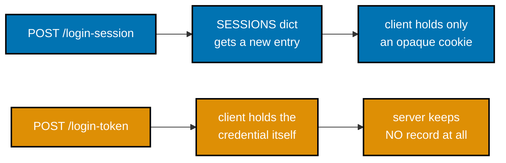

**`learning/code/ex-57-sessions-vs-tokens/app.py`**

```python
"""Example 57: Sessions vs Tokens -- two ways to identify the same caller."""
# => co-17: both mechanisms below answer the SAME question ("who is this caller?") with
# => two different tradeoffs -- session state lives on the server, token state lives on the wire

import uuid  # => generates unpredictable session ids -- a real server never uses a guessable id

from fastapi import Cookie, FastAPI, Header, HTTPException, Response  # => co-04: header/cookie params

app = FastAPI()  # => a fresh app; this example needs no persistence at all

# -- Session mechanism: server holds the state (co-17) -----------------------------------
SESSIONS: dict[str, str] = {}  # => session_id -> username; lives ONLY in this process's memory
# => a real deployment would put this in Redis/DB precisely because in-process memory
# => does not survive a restart or scale past one worker (co-05 tension, revisited ex-80)

# -- Token mechanism: the token itself IS the credential (co-17) -------------------------
VALID_TOKEN = "s3cr3t-token-abc123"  # => a hardcoded stand-in for a real signed/opaque token
# => (real tokens are cryptographically signed or opaque-and-looked-up -- never a literal, guessable
# => string -- this constant exists purely so curl can present a value the server will accept)
TOKEN_USER = "alice"  # => the token's fixed "owner" for this pedagogical example


@app.post("/login-session")  # => co-17: issues a SESSION -- server-side state plus a cookie
def login_session(response: Response) -> dict[str, str]:
    session_id = str(uuid.uuid4())  # => a fresh, unguessable identifier for this session
    SESSIONS[session_id] = "alice"  # => the SERVER remembers who this session belongs to
    response.set_cookie("session_id", session_id)  # => co-04: the CLIENT only gets an opaque id
    return {"mechanism": "session", "session_id": session_id}  # => confirms issuance to the caller


@app.get("/profile-session")  # => co-17: identifies the caller via the session cookie
def profile_session(session_id: str | None = Cookie(default=None)) -> dict[str, str]:
    if session_id is None or session_id not in SESSIONS:  # => no cookie, or server forgot it
        raise HTTPException(status_code=401, detail="no valid session")  # => co-03: 401 unauthenticated
    username = SESSIONS[session_id]  # => O(1) lookup -- but ONLY works on the process that has it
    return {"mechanism": "session", "username": username}  # => the caller's identity, resolved


@app.post("/login-token")  # => co-17, co-18: issues a TOKEN -- no server-side state created
def login_token() -> dict[str, str]:
    return {"mechanism": "token", "token": VALID_TOKEN}  # => the token itself carries everything needed


@app.get("/profile-token")  # => co-17, co-18: identifies the caller via the bearer token alone
def profile_token(authorization: str | None = Header(default=None)) -> dict[str, str]:
    if authorization != f"Bearer {VALID_TOKEN}":  # => co-04: reads the raw Authorization header
        raise HTTPException(status_code=401, detail="missing or invalid token")  # => 401, same as session
    return {"mechanism": "token", "username": TOKEN_USER}  # => resolved WITHOUT any server-side lookup
```

**Run**: `uvicorn app:app --port 8003` in one terminal, then the `curl` commands below in another, plus `pytest -v` against the same directory.

**Output** (curl):

```text
=== POST /login-session ===
HTTP/1.1 200 OK
date: Tue, 14 Jul 2026 10:54:32 GMT
server: uvicorn
content-length: 75
content-type: application/json
set-cookie: session_id=cb7cdbbd-0544-4ed7-9364-89c5de3f101b; Path=/; SameSite=lax

{"mechanism":"session","session_id":"cb7cdbbd-0544-4ed7-9364-89c5de3f101b"}
=== GET /profile-session (with cookie) ===
HTTP/1.1 200 OK
date: Tue, 14 Jul 2026 10:54:32 GMT
server: uvicorn
content-length: 42
content-type: application/json

{"mechanism":"session","username":"alice"}
=== GET /profile-session (no cookie) ===
HTTP/1.1 401 Unauthorized
date: Tue, 14 Jul 2026 10:54:32 GMT
server: uvicorn
content-length: 29
content-type: application/json

{"detail":"no valid session"}
=== POST /login-token ===
HTTP/1.1 200 OK
date: Tue, 14 Jul 2026 10:54:32 GMT
server: uvicorn
content-length: 51
content-type: application/json

{"mechanism":"token","token":"s3cr3t-token-abc123"}
=== GET /profile-token (valid) ===
HTTP/1.1 200 OK
date: Tue, 14 Jul 2026 10:54:32 GMT
server: uvicorn
content-length: 40
content-type: application/json

{"mechanism":"token","username":"alice"}
```

**Output** (`pytest -v`):

```text
============================= test session starts ==============================
plugins: anyio-4.14.2
collecting ... collected 4 items

test_app.py::test_session_login_sets_cookie_and_profile_reads_it PASSED  [ 25%]
test_app.py::test_profile_session_without_cookie_is_401 PASSED           [ 50%]
test_app.py::test_token_login_and_profile_identify_caller PASSED         [ 75%]
test_app.py::test_profile_token_without_header_is_401 PASSED             [100%]

=============================== warnings summary ===============================
../../../.venv/lib/python3.13/site-packages/fastapi/testclient.py:1
-- Docs: https://docs.pytest.org/en/stable/how-to/capture-warnings.html
========================= 4 passed, 1 warning in 0.16s =========================
```

**Key takeaway**: A session needs server-side storage that must be shared across every worker process; a token needs nothing shared at all, because the token itself carries everything a handler needs to verify it.

**Why it matters**: This is the tradeoff every later example in this cluster builds on: Examples 58-63 develop the token side (issuing, checking via middleware or a dependency, protecting only writes), and Example 64 develops the session side into its own app. Neither mechanism is universally "better" -- sessions make revocation trivial but need shared storage across workers; tokens need no shared storage but are hard to revoke before they expire. Example 80 later proves a session dict would NOT survive across two real worker processes, while a token (or shared database) would.

---

### Example 58: Issue a Token

_ex-58 &middot; exercises co-17, co-18_

`POST /login` is the other half of Example 57's token mechanism: given a username and password, it returns a token string the client will present on every later request. This example fixes the credential check and the token to hardcoded constants deliberately, so the focus stays on the request/response shape rather than on cryptography.

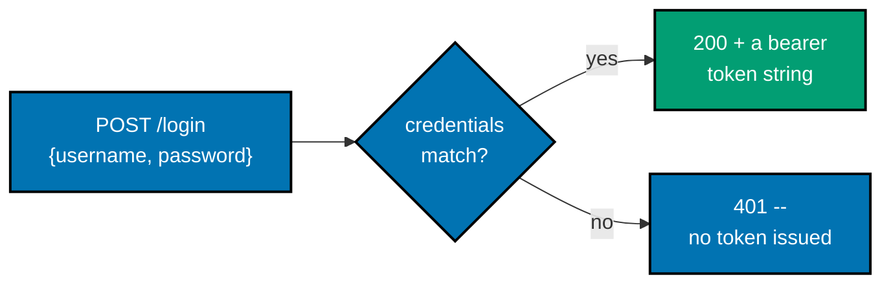

**`learning/code/ex-58-issue-token/app.py`**

```python
"""Example 58: Issue a Token -- POST /login returns a token string."""
# => co-17: this is the OTHER half of Example 57's token mechanism -- where does the token
# => a client presents on every later call actually come FROM? This is that issuing endpoint.

from fastapi import FastAPI, HTTPException  # => co-17, co-18: raises 401 on bad credentials
from pydantic import BaseModel  # => co-10: a typed model validates the login body

app = FastAPI()  # => a fresh app -- no persistence, no session store, nothing survives a restart

VALID_TOKEN = "s3cr3t-token-abc123"  # => hardcoded stand-in for a real signed/opaque token
# => (a real login endpoint would look up the user, verify a hashed password, then mint a
# => fresh signed JWT or opaque token -- this example fixes ALL of that to one literal string
# => so the FOCUS stays on the request/response SHAPE, not on cryptography or password hashing)
USERNAME = "alice"  # => the ONE registered user this pedagogical example recognizes
PASSWORD = "wonderland"  # => a hardcoded password -- never do this in real code (co-17 caveat)


class Credentials(BaseModel):  # => co-10: the shape POST /login expects
    username: str  # => a plain required string field
    password: str  # => a plain required string field, never returned in any response
    # => (a real API would also never LOG this field -- pydantic gives no free redaction,
    # => so that discipline has to be a deliberate choice in whatever logs the request)


class TokenResponse(BaseModel):  # => co-09: declares the exact shape of a successful login
    token: str  # => the ONLY thing the client needs to authenticate future requests


@app.post("/login", response_model=TokenResponse)  # => co-17, co-18: issues a token, no session created
def login(credentials: Credentials) -> TokenResponse:
    # => co-10: FastAPI already validated `credentials` matches the Credentials shape above --
    # => by the time this line runs, both fields are guaranteed to be present strings
    if credentials.username != USERNAME or credentials.password != PASSWORD:  # => co-10: reject any mismatch immediately -- deliberately the SAME message for both
        # => a wrong username and a wrong password, so a caller can't enumerate valid usernames
        raise HTTPException(status_code=401, detail="invalid credentials")  # => co-03: 401, not 404
    return TokenResponse(token=VALID_TOKEN)  # => co-09: the response body IS just the token --
    # => no session id, no server-side record created -- co-17's defining difference from ex-57
```

**Run**: `uvicorn app:app --port 8003` in one terminal, then the `curl` commands below in another, plus `pytest -v` against the same directory.

**Output** (curl):

```text
=== POST /login (correct credentials) ===
HTTP/1.1 200 OK
date: Tue, 14 Jul 2026 10:54:58 GMT
server: uvicorn
content-length: 31
content-type: application/json

{"token":"s3cr3t-token-abc123"}
=== POST /login (wrong password) ===
HTTP/1.1 401 Unauthorized
date: Tue, 14 Jul 2026 10:54:58 GMT
server: uvicorn
content-length: 32
content-type: application/json

{"detail":"invalid credentials"}
```

**Output** (`pytest -v`):

```text
============================= test session starts ==============================
plugins: anyio-4.14.2
collecting ... collected 3 items

test_app.py::test_login_with_correct_credentials_returns_token PASSED    [ 33%]
test_app.py::test_login_with_wrong_password_is_401 PASSED                [ 66%]
test_app.py::test_login_missing_field_is_422 PASSED                      [100%]

=============================== warnings summary ===============================
../../../.venv/lib/python3.13/site-packages/fastapi/testclient.py:1
-- Docs: https://docs.pytest.org/en/stable/how-to/capture-warnings.html
========================= 3 passed, 1 warning in 0.17s =========================
```

**Key takeaway**: A login endpoint returns ONLY the credential a client needs -- never a session id, never any other server-side bookkeeping -- and rejects a wrong username exactly the same way it rejects a wrong password, so a caller can never enumerate valid usernames from the error message alone.

**Why it matters**: Every one of Examples 59-63's protected routes assumes a token already exists in the caller's hands; this example is where that token would have come from in a real deployment. The identical-error-message discipline (same 401 body for "no such user" and "wrong password") is a genuine security practice, not a stylistic choice -- an API that distinguishes the two responses hands an attacker a free username-enumeration oracle, one guess at a time.

---

### Example 59: Token-Check Middleware

_ex-59 &middot; exercises co-18, co-16_

A middleware function wraps every single request before routing ever decides which handler runs, which makes it the right place for a cross-cutting concern like "is this caller allowed in?" The entire authorization policy for this app lives in one `if` statement, instead of being copy-pasted into every handler that needs it.

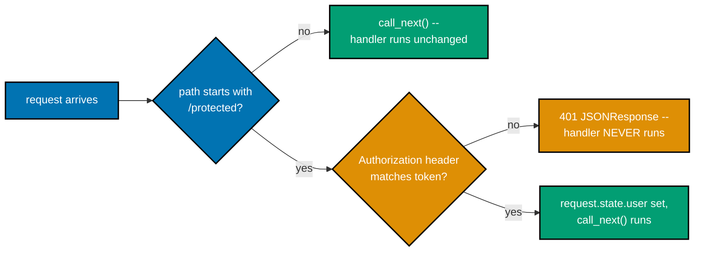

**`learning/code/ex-59-token-check-middleware/app.py`**

```python
"""Example 59: Token-Check Middleware -- validates a Bearer token on protected routes."""
# => co-16: a MIDDLEWARE runs on every request BEFORE routing decides which handler runs --
# => that makes it the right place for a cross-cutting concern like "is this caller allowed in?"
# => rather than repeating the same check inside every individual handler function

from collections.abc import Awaitable, Callable  # => precise typing for the middleware's signature

from fastapi import FastAPI, Request, Response  # => co-16: middleware operates on raw Request/Response
from fastapi.responses import JSONResponse  # => co-11: builds the structured 401 body by hand

app = FastAPI()  # => a fresh app -- this example needs no database, only routing + middleware

VALID_TOKEN = "s3cr3t-token-abc123"  # => hardcoded stand-in for a real signed/opaque token


@app.middleware("http")  # => co-16: registers a function that wraps EVERY request/response --
# => this decorator form is Starlette's original middleware API; FastAPI also accepts
# => `app.add_middleware(...)` for class-based middleware, but a function is simplest here
async def token_check_middleware(
    request: Request,  # => co-16: the INCOMING request -- path, method, and headers are readable here
    call_next: Callable[[Request], Awaitable[Response]],  # => co-16: calling this continues the chain
) -> Response:
    # => co-16: this `if` is the ENTIRE authorization policy for the whole app in one place --
    # => change what "needs a token" means by editing this one condition, not N handler functions
    if request.url.path.startswith("/protected"):  # => co-16: only THIS path prefix is guarded --
        # => Example 63 explores a read/write split instead of a path-prefix split like this one
        auth_header = request.headers.get("authorization")  # => co-04: reads the raw header --
        # => note the lowercase key: HTTP header names are case-insensitive, and Starlette's
        # => Headers mapping normalizes lookups accordingly regardless of the wire casing
        if auth_header != f"Bearer {VALID_TOKEN}":  # => co-18: exact string match, no partial credit --
            # => this branch fires for BOTH a missing header (None != "Bearer ...") and a garbage one
            return JSONResponse(  # => co-11: a structured envelope, never a stack trace or bare text
                status_code=401,  # => co-03: 401 Unauthorized -- "who you claim to be" was rejected
                content={"error": {"code": "unauthorized", "message": "missing or invalid token"}},
            )  # => co-16: returning HERE short-circuits the chain -- call_next() never runs,
            # => so the guarded handler function below never even starts executing
        request.state.user = "alice"  # => co-16: a valid token attaches identity for the handler to use --
        # => request.state is a plain per-request namespace; middleware writes to it, handlers read it
    return await call_next(request)  # => co-16: hands off to routing -- unmodified for open paths,
    # => and for /protected paths that passed the check above


@app.get("/public")  # => never touches the middleware's token branch at all -- doesn't start with /protected
def public() -> dict[str, str]:
    return {"access": "public"}  # => reachable with zero headers, zero token, always


@app.get("/protected/data")  # => co-18: only reachable with a valid token, per the middleware above --
# => this handler body itself contains NO auth logic whatsoever -- that separation is the whole point
def protected_data(request: Request) -> dict[str, str]:
    return {"access": "protected", "user": request.state.user}  # => identity set by the middleware,
    # => not re-derived here -- the handler simply trusts what already ran before it
```

**Run**: `uvicorn app:app --port 8003` in one terminal, then the `curl` commands below in another, plus `pytest -v` against the same directory.

**Output** (curl):

```text
=== GET /public (no token needed) ===
HTTP/1.1 200 OK
date: Tue, 14 Jul 2026 10:55:00 GMT
server: uvicorn
content-length: 19
content-type: application/json

{"access":"public"}
=== GET /protected/data (valid token) ===
HTTP/1.1 200 OK
date: Tue, 14 Jul 2026 10:55:00 GMT
server: uvicorn
content-length: 37
content-type: application/json

{"access":"protected","user":"alice"}
=== GET /protected/data (no token) ===
HTTP/1.1 401 Unauthorized
date: Tue, 14 Jul 2026 10:55:00 GMT
server: uvicorn
content-length: 70
content-type: application/json

{"error":{"code":"unauthorized","message":"missing or invalid token"}}
```

**Output** (`pytest -v`):

```text
============================= test session starts ==============================
plugins: anyio-4.14.2
collecting ... collected 3 items

test_app.py::test_public_route_needs_no_token PASSED                     [ 33%]
test_app.py::test_protected_route_with_valid_token_reaches_handler PASSED [ 66%]
test_app.py::test_protected_route_without_token_is_401 PASSED            [100%]

=============================== warnings summary ===============================
../../../.venv/lib/python3.13/site-packages/fastapi/testclient.py:1
-- Docs: https://docs.pytest.org/en/stable/how-to/capture-warnings.html
========================= 3 passed, 1 warning in 0.15s =========================
```

**Key takeaway**: Returning a response directly from inside middleware -- instead of calling `call_next(request)` -- short-circuits the whole chain: the guarded handler's own body never even starts executing for a rejected request.

**Why it matters**: Middleware and a per-route dependency (the style Examples 60-63 use instead) solve the same problem at different scopes: middleware guards by URL PATH PREFIX with one rule for a whole section of the app, while a dependency guards per-ROUTE with explicit opt-in on each handler. Choosing between them is a real architectural decision -- middleware is less code when an entire path family shares one policy, but a dependency is more precise when only some routes under a shared prefix need protection, which is exactly the situation Example 63 explores next.

---

### Example 60: Missing Token

_ex-60 &middot; exercises co-18, co-11_

This is the first of three 401 scenarios (Examples 60, 61, 62) that all reuse the exact same `require_token` dependency -- only what curl sends differs between them. Here, curl sends NO `Authorization` header at all, which `HTTPBearer(auto_error=False)` reports as `credentials is None`.

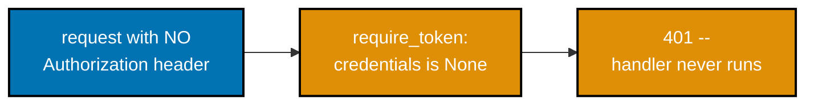

**`learning/code/ex-60-missing-token-401/app.py`**

```python
"""Example 60: Missing Token -- a protected route with no Authorization header at all."""
# => co-18: this is the FIRST of three 401 scenarios (60, 61, 62) that all reuse the SAME
# => dependency below -- only the request curl sends differs, which is the whole teaching point

from fastapi import Depends, FastAPI, HTTPException, Request  # => co-23: Depends injects the auth check
from fastapi.responses import JSONResponse  # => co-11: builds the exception handler's structured body
from fastapi.security import HTTPAuthorizationCredentials, HTTPBearer  # => co-18: standard bearer scheme

app = FastAPI()  # => a fresh app -- this example needs no database, only auth plumbing


@app.exception_handler(HTTPException)  # => co-11: UNWRAPS FastAPI's default {"detail": ...} nesting --
# => without this handler, raising HTTPException(detail={"error": {...}}) would ship as
# => {"detail": {"error": {...}}}, doubly-nested and inconsistent with every OTHER error path
async def structured_error_handler(request: Request, exc: HTTPException) -> JSONResponse:
    body = (
        exc.detail
        if isinstance(exc.detail, dict)  # => the handlers below always raise dict-shaped detail
        else {"error": {"code": "error", "message": str(exc.detail)}}  # => fallback for plain-string detail
    )  # => reuses the raised dict AS-IS -- one consistent {"error": {...}} shape, no extra nesting
    return JSONResponse(status_code=exc.status_code, content=body)  # => co-11: same envelope, every error


VALID_TOKEN = "s3cr3t-token-abc123"  # => hardcoded stand-in for a real signed/opaque token
security = HTTPBearer(auto_error=False)  # => auto_error=False: WE decide the error shape, not
# => FastAPI's own default (which would raise a bare 403 with a generic "Not authenticated" body)


def require_token(  # => co-23: a reusable DEPENDENCY -- any route can opt in via Depends(require_token)
    credentials: HTTPAuthorizationCredentials | None = Depends(security),  # => co-23: FastAPI calls
    # => `security` FIRST, parses any Authorization header it finds, and hands the RESULT here
) -> str:
    if credentials is None:  # => co-18: no Authorization header was sent AT ALL -- this is THIS
        # => example's scenario specifically: curl with no -H "Authorization: ..." flag whatsoever
        raise HTTPException(  # => co-11: structured envelope, not a bare string
            status_code=401,  # => co-03: 401 -- the caller never even attempted to identify itself
            detail={"error": {"code": "unauthorized", "message": "Authorization header missing"}},
        )
    if credentials.credentials != VALID_TOKEN:  # => header present, but the token itself is wrong --
        # => Example 61 is the one that actually exercises THIS branch; unreachable from THIS example's curl
        raise HTTPException(
            status_code=401,
            detail={"error": {"code": "unauthorized", "message": "invalid token"}},
        )
    return "alice"  # => the resolved identity, available to any handler that depends on this --
    # => Example 62 is the one that actually reaches this successful return


@app.get("/protected")  # => co-18: guarded entirely by the require_token dependency above --
# => this handler's body contains ZERO auth logic; FastAPI runs the dependency before this even starts
def protected(user: str = Depends(require_token)) -> dict[str, str]:
    # => co-23: by the time execution reaches THIS line, `user` is guaranteed to be "alice" --
    # => every path that could have failed already returned a 401 response one call frame up
    return {"user": user}  # => only reached once require_token returns without raising
```

**Run**: `uvicorn app:app --port 8003` in one terminal, then the `curl` commands below in another, plus `pytest -v` against the same directory.

**Output** (curl):

```text
=== GET /protected (no Authorization header at all) ===
HTTP/1.1 401 Unauthorized
date: Tue, 14 Jul 2026 10:55:03 GMT
server: uvicorn
content-length: 74
content-type: application/json

{"error":{"code":"unauthorized","message":"Authorization header missing"}}
```

**Output** (`pytest -v`):

```text
============================= test session starts ==============================
plugins: anyio-4.14.2
collecting ... collected 2 items

test_app.py::test_no_authorization_header_is_401_with_missing_message PASSED [ 50%]
test_app.py::test_valid_token_still_reaches_handler_for_contrast PASSED  [100%]

=============================== warnings summary ===============================
../../../.venv/lib/python3.13/site-packages/fastapi/testclient.py:1
-- Docs: https://docs.pytest.org/en/stable/how-to/capture-warnings.html
========================= 2 passed, 1 warning in 0.17s =========================
```

**Key takeaway**: `HTTPBearer(auto_error=False)` hands a route's dependency the DECISION instead of making it automatically -- `auto_error=True` (the default) would raise its own generic 403 before this code ever ran, which is why every advanced-tier auth example in this topic sets `auto_error=False` explicitly.

**Why it matters**: A custom `@app.exception_handler(HTTPException)` is what turns a raised `HTTPException(detail={"error": {...}})` into a flat, single-shape JSON body instead of FastAPI's default double-nested `{"detail": {"error": {...}}}`. Every auth example from here through Example 79 registers this exact same handler, because a client parsing error responses should never need to know or care which specific route or dependency produced the failure -- one envelope shape, everywhere, is the whole point of Example 77 later in this batch.

---

### Example 61: Invalid Token

_ex-61 &middot; exercises co-18_

A token can be wrong in two different ways: entirely absent (Example 60) or present-but-incorrect (this example). A caller sees the identical 401 status and message shape either way, which is deliberate -- an API should never leak which of the two failure modes actually occurred.

**`learning/code/ex-61-invalid-token-401/app.py`**

```python
"""Example 61: Invalid Token -- a protected route with a malformed/wrong token."""
# => co-18: a token can be WRONG in two different ways -- entirely absent (Example 60) or
# => present-but-incorrect (this example) -- and a caller sees the SAME 401 status either way,
# => which is deliberate: never leak which half of "no token" vs "bad token" a caller hit

from fastapi import Depends, FastAPI, HTTPException, Request  # => co-18: same dependency style as ex-60
from fastapi.responses import JSONResponse  # => co-11: builds the exception handler's structured body
from fastapi.security import HTTPAuthorizationCredentials, HTTPBearer  # => co-18: parses "Bearer <token>"

app = FastAPI()  # => a fresh app -- this example needs no database, only auth plumbing
# => (fully self-contained: nothing here is imported from any other example directory)

VALID_TOKEN = "s3cr3t-token-abc123"  # => hardcoded stand-in for a real signed/opaque token
security = HTTPBearer(auto_error=False)  # => auto_error=False: WE own the 401 body's shape below,
# => not FastAPI's own built-in "Not authenticated" 403 default
# => (co-18: 401 means "I don't know who you are"; 403 means "I know, and you're not allowed")


@app.exception_handler(HTTPException)  # => co-11: one consistent {"error": {...}} envelope, unwrapped --
# => without this, every raise HTTPException(detail={"error": {...}}) below would ship doubly
# => nested as {"detail": {"error": {...}}} instead of the flat {"error": {...}} shape shown here
async def structured_error_handler(request: Request, exc: HTTPException) -> JSONResponse:
    body = (
        exc.detail
        if isinstance(exc.detail, dict)  # => every raise below already supplies a dict -- this
        # => isinstance check exists so the handler ALSO degrades gracefully for a plain string detail
        else {"error": {"code": "error", "message": str(exc.detail)}}
    )
    return JSONResponse(status_code=exc.status_code, content=body)  # => co-11: same shape, every error


def require_token(  # => co-23: identical dependency SHAPE to Example 60 -- the difference this
    # => example actually exercises lives entirely in what curl sends, not in this function's code
    credentials: HTTPAuthorizationCredentials | None = Depends(security),
) -> str:
    if credentials is None:  # => genuinely absent -- Example 60's case, still handled here for completeness
        # => so this dependency stays a fully correct, standalone, self-contained auth check on its own
        raise HTTPException(
            status_code=401,
            detail={"error": {"code": "unauthorized", "message": "Authorization header missing"}},
        )
    if credentials.credentials != VALID_TOKEN:  # => co-18: THIS example's focus -- present but WRONG --
        raise HTTPException(  # => a well-formed "Bearer <garbage>" header still fails the equality check;
            # => HTTPBearer already stripped the "Bearer " prefix, so `.credentials` is just the raw string
            status_code=401,
            detail={"error": {"code": "unauthorized", "message": "token is invalid"}},
        )
    return "alice"  # => the resolved identity -- unreachable from THIS example's own curl scenario,
    # => since the token sent below is deliberately wrong, but still needed for require_token to type-check
    # => (the type checker verifies EVERY code path returns str, reachable or not at runtime)


@app.get("/protected")  # => co-18: guarded entirely by the require_token dependency above --
# => the handler itself stays a single line, exactly like every open route -- FastAPI resolves
# => `require_token` BEFORE this function body runs, and never calls it at all if that dependency raises
def protected(user: str = Depends(require_token)) -> dict[str, str]:
    return {"user": user}  # => never actually reached when the curl below sends a garbage token
```

**Run**: `uvicorn app:app --port 8003` in one terminal, then the `curl` commands below in another, plus `pytest -v` against the same directory.

**Output** (curl):

```text
=== GET /protected (garbage token) ===
HTTP/1.1 401 Unauthorized
date: Tue, 14 Jul 2026 10:55:05 GMT
server: uvicorn
content-length: 62
content-type: application/json

{"error":{"code":"unauthorized","message":"token is invalid"}}
```

**Output** (`pytest -v`):

```text
============================= test session starts ==============================
plugins: anyio-4.14.2
collecting ... collected 2 items

test_app.py::test_malformed_token_is_401_with_invalid_message PASSED     [ 50%]
test_app.py::test_valid_token_still_reaches_handler_for_contrast PASSED  [100%]

=============================== warnings summary ===============================
../../../.venv/lib/python3.13/site-packages/fastapi/testclient.py:1
-- Docs: https://docs.pytest.org/en/stable/how-to/capture-warnings.html
========================= 2 passed, 1 warning in 0.15s =========================
```

**Key takeaway**: `HTTPBearer` already strips the literal `"Bearer "` prefix before this code runs, so `credentials.credentials` is just the raw token string -- comparing it to `VALID_TOKEN` is a single, simple equality check, not string parsing.

**Why it matters**: 401 means "I don't know who you are"; 403 means "I know who you are, and you're still not allowed." This example only ever returns 401, because nothing in this app distinguishes identity from permission -- a real deployment with roles or scopes would need a SEPARATE 403 path once identity is established but the specific action is still disallowed, a distinction Examples 60-62 deliberately keep out of scope so the auth mechanism itself stays the clear focus.

---

### Example 62: Valid Token

_ex-62 &middot; exercises co-18_

The third scenario in the 401 trio: the exact same guarded route and the exact same `require_token` dependency as Examples 60 and 61, but this time curl sends the genuinely correct token, so the request clears the check and reaches the handler body.

**`learning/code/ex-62-valid-token-200/app.py`**

```python
"""Example 62: Valid Token -- a protected route with a good token succeeds."""
# => co-18: this is the THIRD scenario in the 401 trio (Examples 60, 61, 62) -- same dependency,
# => same guarded route, only the curl's Authorization header changes across all three examples

from fastapi import Depends, FastAPI, HTTPException, Request  # => co-23: Depends wires the auth check in
from fastapi.responses import JSONResponse  # => co-11: builds the exception handler's structured body
from fastapi.security import HTTPAuthorizationCredentials, HTTPBearer  # => co-18: parses "Bearer <token>"

app = FastAPI()  # => a fresh app -- this example needs no database, only auth plumbing

VALID_TOKEN = "s3cr3t-token-abc123"  # => hardcoded stand-in for a real signed/opaque token
security = HTTPBearer(auto_error=False)  # => auto_error=False: WE own the 401 body's shape below


@app.exception_handler(HTTPException)  # => co-11: unwraps FastAPI's default {"detail": ...} nesting
# => so a dict-shaped detail ships flat as {"error": {...}} -- same reusable pattern as ex-60/61
async def structured_error_handler(request: Request, exc: HTTPException) -> JSONResponse:
    body = (
        exc.detail
        if isinstance(exc.detail, dict)  # => the raise below always supplies a dict already
        else {"error": {"code": "error", "message": str(exc.detail)}}  # => fallback for a plain string
    )
    # => co-11: this handler is the ONLY place status codes get turned into response bodies --
    # => every route in this file stays completely free of response-formatting concerns
    return JSONResponse(status_code=exc.status_code, content=body)  # => co-11: same shape, every error


def require_token(  # => co-23: identical shape to ex-60/61 -- collapses the "missing" and "wrong"
    # => cases into ONE branch here, since this example's curl only ever needs to prove the OPPOSITE:
    # => that a genuinely correct token clears this check and reaches the handler body below
    credentials: HTTPAuthorizationCredentials | None = Depends(security),
) -> str:
    if credentials is None or credentials.credentials != VALID_TOKEN:  # => co-18: either failure mode
        raise HTTPException(
            status_code=401,
            detail={"error": {"code": "unauthorized", "message": "missing or invalid token"}},
        )  # => unreachable from THIS example's own curl -- kept only so the function is fully correct
        # => and equally usable if a reader copies this file and DOES send a bad token through it
    return "alice"  # => co-18: THIS example's focus -- the success path, reached only with a good token
    # => no session, no server-side lookup -- the token equality check above IS the entire proof


@app.get("/protected")  # => co-18: guarded entirely by the require_token dependency above
# => co-18: identical route SHAPE to ex-60/61 -- the only thing changing across the trio is the token
def protected(user: str = Depends(require_token)) -> dict[str, str | bool]:
    # => co-23: `user` is guaranteed to be "alice" here -- every failure path already returned 401
    return {"user": user, "granted": True}  # => a slightly richer body than ex-60/61 to mark success clearly
```

**Run**: `uvicorn app:app --port 8003` in one terminal, then the `curl` commands below in another, plus `pytest -v` against the same directory.

**Output** (curl):

```text
=== GET /protected (valid token) ===
HTTP/1.1 200 OK
date: Tue, 14 Jul 2026 10:55:08 GMT
server: uvicorn
content-length: 31
content-type: application/json

{"user":"alice","granted":true}
```

**Output** (`pytest -v`):

```text
============================= test session starts ==============================
plugins: anyio-4.14.2
collecting ... collected 2 items

test_app.py::test_valid_token_returns_200_and_grants_access PASSED       [ 50%]
test_app.py::test_missing_and_invalid_still_fail_for_contrast PASSED     [100%]

=============================== warnings summary ===============================
../../../.venv/lib/python3.13/site-packages/fastapi/testclient.py:1
-- Docs: https://docs.pytest.org/en/stable/how-to/capture-warnings.html
========================= 2 passed, 1 warning in 0.15s =========================
```

**Key takeaway**: By the time `protected()`'s own body runs, `user` is guaranteed to already equal `"alice"` -- every path that could have failed already returned a 401 one call frame earlier, so the handler itself needs zero defensive checks of its own.

**Why it matters**: This three-example progression (60, 61, 62) is a complete equivalence-class test of one dependency: absent input, wrong input, correct input. That is precisely the shape a real test suite should cover for any validation logic, and it is no accident that Example 79's pytest suite later organizes its own token-auth tests the same way -- missing, wrong, and valid, as three separate, explicit test functions.

---

### Example 63: Protect Writes Only

_ex-63 &middot; exercises co-18, co-02_

A very common real-world policy: anyone can read the catalog, but only an authenticated caller can change it. The HTTP method itself decides which rule applies -- `GET /items` has no `Depends(require_token)` at all, while `POST` and `DELETE` both opt into it via `dependencies=[Depends(require_token)]`.

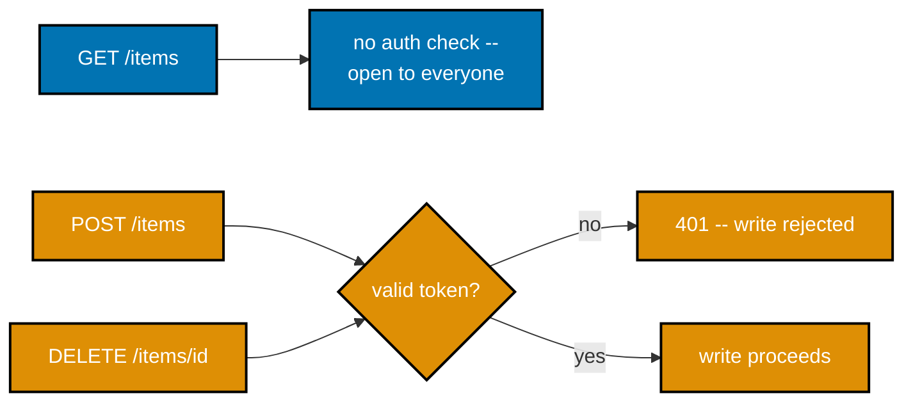

**`learning/code/ex-63-protect-writes-only/app.py`**

```python
"""Example 63: Protect Writes Only -- GET is open, POST/PUT/DELETE require a token."""
# => co-02, co-18: a very common real-world policy -- ANYONE can read the catalog, but only an
# => authenticated caller can change it. The HTTP method itself decides which rule applies below.

from fastapi import Depends, FastAPI, HTTPException, Request  # => co-02: method-sensitive protection
from fastapi.responses import JSONResponse  # => co-11: builds the exception handler's structured body
from fastapi.security import HTTPAuthorizationCredentials, HTTPBearer  # => co-18: parses "Bearer <token>"

app = FastAPI()  # => a fresh app -- this example needs no database, only an in-memory dict below

VALID_TOKEN = "s3cr3t-token-abc123"  # => hardcoded stand-in for a real signed/opaque token
security = HTTPBearer(auto_error=False)  # => auto_error=False: WE own the 401 body's shape below
ITEMS: dict[int, str] = {1: "milk", 2: "bread"}  # => in-memory store -- fine for this pedagogical example
# => (two seed rows so list_items() below has something visibly non-empty to return before any write)
NEXT_ID = 3  # => module-level counter for the next inserted id (co-05 caveat: not multi-worker safe --
# => Example 80 revisits this exact tension with a REAL, two-process-shared SQLite file instead)


@app.exception_handler(HTTPException)  # => co-11: one consistent {"error": {...}} envelope, unwrapped
async def structured_error_handler(request: Request, exc: HTTPException) -> JSONResponse:
    body = (
        exc.detail
        if isinstance(exc.detail, dict)  # => the raise below always supplies a dict already
        else {"error": {"code": "error", "message": str(exc.detail)}}  # => fallback for a plain string
    )
    return JSONResponse(status_code=exc.status_code, content=body)  # => co-11: same shape, every error


def require_token(  # => co-18: this dependency is opted into ONLY by write routes below --
    # => note the return type is None, not str -- this variant doesn't need the resolved identity,
    # => only the yes/no decision of whether the request is allowed to proceed at all
    credentials: HTTPAuthorizationCredentials | None = Depends(security),
) -> None:
    if credentials is None or credentials.credentials != VALID_TOKEN:  # => co-18: either failure mode
        raise HTTPException(
            status_code=401,
            detail={"error": {"code": "unauthorized", "message": "missing or invalid token"}},
        )
    # => co-18: no `return` needed -- reaching the end of this function IS the "allowed" outcome;
    # => FastAPI just runs the dependency for its side effect (raise-or-don't) and discards None


@app.get("/items")  # => co-02: GET has NO Depends(require_token) at all -- reads are open to everyone
# => co-02: read methods (GET, HEAD) are conventionally safe/idempotent -- open access here mirrors that
def list_items() -> dict[int, str]:
    return ITEMS  # => co-02: no auth check anywhere on this path -- curl with zero headers succeeds


@app.post("/items", dependencies=[Depends(require_token)])  # => co-02, co-18: WRITE guarded --
# => `dependencies=[...]` runs require_token for its SIDE EFFECT ONLY, without injecting a
# => parameter into create_item's own signature below -- the route itself never sees the token value
def create_item(name: str) -> dict[str, int | str]:
    global NEXT_ID  # => mutates the module-level counter -- co-05: this is process-local state,
    # => exactly the kind of in-memory mutation that breaks the moment a second worker exists
    item_id = NEXT_ID
    ITEMS[item_id] = name  # => the actual write this token protects
    NEXT_ID += 1  # => co-05: NOT atomic across concurrent requests in a real multi-threaded deployment
    return {"id": item_id, "name": name}  # => co-02: 200 by default here, unlike ex-19's explicit 201


@app.delete("/items/{item_id}", dependencies=[Depends(require_token)])  # => co-02, co-18: WRITE guarded --
# => same dependencies=[...] pattern as the POST route above -- consistent policy, one line each
# => co-02: DELETE, POST, and (in a real app) PUT/PATCH all share this exact same guard style
def delete_item(item_id: int) -> dict[str, bool]:
    ITEMS.pop(item_id, None)  # => the actual write this token protects -- second-arg None means
    # => "don't raise KeyError if item_id doesn't exist," making delete naturally idempotent (co-02)
    return {"deleted": True}  # => co-02: reports success even if the id was already gone -- by design
```

**Run**: `uvicorn app:app --port 8003` in one terminal, then the `curl` commands below in another, plus `pytest -v` against the same directory.

**Output** (curl):

```text
=== GET /items (open, no token) ===
HTTP/1.1 200 OK
date: Tue, 14 Jul 2026 10:55:10 GMT
server: uvicorn
content-length: 24
content-type: application/json

{"1":"milk","2":"bread"}
=== POST /items?name=eggs (no token, 401) ===
HTTP/1.1 401 Unauthorized
date: Tue, 14 Jul 2026 10:55:10 GMT
server: uvicorn
content-length: 70
content-type: application/json

{"error":{"code":"unauthorized","message":"missing or invalid token"}}
=== POST /items?name=eggs (valid token) ===
HTTP/1.1 200 OK
date: Tue, 14 Jul 2026 10:55:10 GMT
server: uvicorn
content-length: 22
content-type: application/json

{"id":3,"name":"eggs"}
=== GET /items (after write) ===
HTTP/1.1 200 OK
date: Tue, 14 Jul 2026 10:55:10 GMT
server: uvicorn
content-length: 35
content-type: application/json

{"1":"milk","2":"bread","3":"eggs"}
```

**Output** (`pytest -v`):

```text
============================= test session starts ==============================
plugins: anyio-4.14.2
collecting ... collected 4 items

test_app.py::test_get_is_open_without_any_token PASSED                   [ 25%]
test_app.py::test_post_without_token_is_401 PASSED                       [ 50%]
test_app.py::test_post_with_token_succeeds PASSED                        [ 75%]
test_app.py::test_delete_without_token_is_401_but_get_still_open PASSED  [100%]

=============================== warnings summary ===============================
../../../.venv/lib/python3.13/site-packages/fastapi/testclient.py:1
-- Docs: https://docs.pytest.org/en/stable/how-to/capture-warnings.html
========================= 4 passed, 1 warning in 0.19s =========================
```

**Key takeaway**: `dependencies=[Depends(require_token)]` runs a dependency for its SIDE EFFECT ONLY -- raise or don't -- without injecting any value into the handler's own parameter list, which is the right shape when a route never needs the resolved identity, only the yes/no gate.

**Why it matters**: This split -- read methods open, write methods guarded -- mirrors HTTP's own safe/idempotent method classification from RFC 9110: GET and HEAD are conventionally safe (no side effects), so leaving them unguarded matches how the web already expects APIs to behave. The in-memory `ITEMS` dict and `NEXT_ID` counter this example uses are explicitly flagged as NOT safe under concurrent writes across multiple worker processes -- Example 80 revisits this exact same tension later with a real, file-backed, two-process-safe alternative.

---

### Example 64: Session-Cookie Auth

_ex-64 &middot; exercises co-17_

This is Example 57's session mechanism made into its own complete, runnable app: `POST /login` mints server-side state in a `SESSIONS` dict and sets an `httponly` cookie; `GET /me` reads that cookie back and looks up the identity it points to, never re-checking a password.

**`learning/code/ex-64-session-cookie-auth/app.py`**

```python
"""Example 64: Session-Cookie Auth -- set a session cookie on login, read it next request."""
# => co-17: this is Example 57's session mechanism made into its OWN complete, runnable app --
# => login mints server-side state, the browser only ever holds an opaque cookie pointing at it

import uuid  # => generates the unguessable session id -- never a sequential/predictable value

from fastapi import Cookie, FastAPI, HTTPException, Request, Response  # => co-17: cookie-based session
from fastapi.responses import JSONResponse  # => co-11: builds the exception handler's structured body

app = FastAPI()  # => a fresh app -- this example needs no database, only the in-memory dict below
# => (fully self-contained: nothing here is imported from any other example directory)

SESSIONS: dict[str, str] = {}  # => session_id -> username; server-side state (co-17) -- this dict
# => IS the session store; a real deployment would put this in Redis/a DB, precisely because
# => in-process memory vanishes on restart and isn't shared across multiple worker processes
USERNAME = "alice"  # => the ONE registered user this pedagogical example recognizes
PASSWORD = "wonderland"  # => a hardcoded password -- never do this in real code (co-17 caveat)
# => (a real login endpoint hashes and salts stored passwords -- this constant exists purely
# => so curl has something deterministic to submit; nothing here is meant as production auth advice)


@app.exception_handler(HTTPException)  # => co-11: consistent envelope, same pattern as ex-60..63
async def structured_error_handler(request: Request, exc: HTTPException) -> JSONResponse:
    body = (
        exc.detail
        if isinstance(exc.detail, dict)  # => every raise below supplies a dict already
        else {"error": {"code": "error", "message": str(exc.detail)}}  # => fallback for a plain string
    )
    return JSONResponse(status_code=exc.status_code, content=body)  # => co-11: same shape, every error


@app.post("/login")  # => co-17: authenticates, then ESTABLISHES a session -- unlike Example 58's
# => token endpoint, this one has a SIDE EFFECT: it writes a new entry into SESSIONS below
def login(username: str, password: str, response: Response) -> dict[str, str]:
    if username != USERNAME or password != PASSWORD:  # => co-17: reject any mismatch immediately --
        # => deliberately the SAME message for both a wrong username and a wrong password --
        # => never let a caller distinguish "no such user" from "wrong password" via the response
        raise HTTPException(
            status_code=401,
            detail={"error": {"code": "unauthorized", "message": "invalid credentials"}},
        )
    session_id = str(uuid.uuid4())  # => a fresh, unguessable session identifier -- a real deployment
    # => also rotates this on every login, so an old leaked cookie can't be replayed indefinitely
    SESSIONS[session_id] = username  # => co-17: the SERVER remembers this session belongs to username
    response.set_cookie(  # => co-04: writes a Set-Cookie response header -- curl's -c flag captures it
        "session_id", session_id, httponly=True
    )  # => co-04: httponly prevents client-side JS from reading it -- mitigates cookie-theft via XSS
    return {"logged_in_as": username}  # => co-17: confirms WHO logged in -- never the session id itself
    # => (leaking the session id in the JSON body too would defeat httponly's whole protection above)


@app.get("/me")  # => co-17: identifies the caller purely from the session cookie on THIS request --
# => curl's -b flag is what actually SENDS the cookie captured by -c above back to this endpoint
def me(session_id: str | None = Cookie(default=None)) -> dict[str, str]:
    if session_id is None or session_id not in SESSIONS:  # => no cookie, or the server never issued it
        # => (also covers a server restart, since SESSIONS is in-memory and empties on every reload)
        raise HTTPException(
            status_code=401,
            detail={"error": {"code": "unauthorized", "message": "no active session"}},
        )
    return {"username": SESSIONS[session_id]}  # => the SAME identity established at login, now confirmed
    # => co-17: notice this handler never re-checks a password -- the cookie's PRESENCE in
    # => SESSIONS is the entire proof of identity for every request after the original login
```

**Run**: `uvicorn app:app --port 8003` in one terminal, then the `curl` commands below in another (using `-c`/`-b` to manage a cookie jar), plus `pytest -v` against the same directory.

**Output** (curl):

```text
=== POST /login (writes cookie jar) ===
HTTP/1.1 200 OK
date: Tue, 14 Jul 2026 10:55:13 GMT
server: uvicorn
content-length: 24
content-type: application/json
set-cookie: session_id=b781451b-6fb9-492d-b828-a25f2d7c3ea1; HttpOnly; Path=/; SameSite=lax

{"logged_in_as":"alice"}
=== cookie jar contents ===
# Netscape HTTP Cookie File
# https://curl.se/docs/http-cookies.html
# This file was generated by libcurl! Edit at your own risk.

#HttpOnly_localhost    FALSE    /    FALSE    0    session_id    b781451b-6fb9-492d-b828-a25f2d7c3ea1
=== GET /me (reads cookie jar) ===
HTTP/1.1 200 OK
date: Tue, 14 Jul 2026 10:55:13 GMT
server: uvicorn
content-length: 20
content-type: application/json

{"username":"alice"}
=== GET /me (no cookie jar) ===
HTTP/1.1 401 Unauthorized
date: Tue, 14 Jul 2026 10:55:13 GMT
server: uvicorn
content-length: 63
content-type: application/json

{"error":{"code":"unauthorized","message":"no active session"}}
```

**Output** (`pytest -v`):

```text
============================= test session starts ==============================
plugins: anyio-4.14.2
collecting ... collected 3 items

test_app.py::test_login_sets_cookie_and_me_reads_it_back PASSED          [ 33%]
test_app.py::test_me_without_prior_login_is_401 PASSED                   [ 66%]
test_app.py::test_login_with_wrong_password_never_sets_a_cookie PASSED   [100%]

=============================== warnings summary ===============================
../../../.venv/lib/python3.13/site-packages/fastapi/testclient.py:1
-- Docs: https://docs.pytest.org/en/stable/how-to/capture-warnings.html
========================= 3 passed, 1 warning in 0.15s =========================
```

**Key takeaway**: `response.set_cookie("session_id", session_id, httponly=True)` prevents client-side JavaScript from ever reading the cookie's value, which is exactly what makes a session cookie meaningfully harder to steal via a cross-site-scripting attack than a token stored in, say, `localStorage`.

**Why it matters**: curl's `-c` flag writes every `Set-Cookie` response header into a local cookie-jar file, and `-b` reads that same file back on a later request -- this is precisely what a real browser does automatically and invisibly, which is why session-cookie auth "just works" for browser-based clients without any extra client-side code, unlike a bearer token, which a browser-based client has to manage and attach explicitly on every request.

---

### Example 65: Pagination limit/offset

_ex-65 &middot; exercises co-19_

`GET /tasks?limit=&offset=` slices a 25-row seeded dataset into a bounded page: `limit` caps how many rows come back, `offset` skips ahead past earlier rows. Both are typed, constrained `Query()` parameters -- `ge=1` and `ge=0` respectively -- so an invalid value is rejected before the handler body ever runs.


**`learning/code/ex-65-pagination-limit-offset/app.py`**

```python
"""Example 65: Pagination limit/offset -- GET /tasks?limit=&offset= slices the list."""

import os
import sqlite3
from typing import TypedDict

from fastapi import FastAPI, Query  # => co-12: limit/offset are typed QUERY parameters

DB_PATH = os.path.join(os.path.dirname(__file__), "tasks.db")  # => co-14: a real on-disk SQLite file,
# => one PER EXAMPLE directory -- never shared with any other example, keeping each self-contained

# => co-15: the schema below backs every list query in this example. Column-by-column:
# =>   id          -- an auto-incrementing primary key, never chosen by the caller
# =>   title       -- the task's display text, no constraint on it beyond NOT NULL
# =>   status      -- co-20: a FILTERABLE field, exercised starting at Example 69
# =>   priority    -- co-20: a SECOND filterable field, exercised starting at Example 70
# =>   created_at  -- co-20: a SORTABLE field, exercised starting at Example 72
SCHEMA = """
CREATE TABLE IF NOT EXISTS tasks (
    id INTEGER PRIMARY KEY AUTOINCREMENT,
    title TEXT NOT NULL,
    status TEXT NOT NULL,
    priority TEXT NOT NULL,
    created_at TEXT NOT NULL
);
"""


class TaskRow(TypedDict):  # => co-14, co-24: the repository's typed return shape
    id: int  # => matches the schema's INTEGER PRIMARY KEY column
    title: str  # => matches the schema's title column
    status: str  # => matches the schema's status column
    priority: str  # => matches the schema's priority column
    created_at: str  # => matches the schema's created_at column


def _seed(conn: sqlite3.Connection) -> None:
    statuses = ["todo", "in_progress", "done"]  # => rotates every 3 rows -- index is i % 3
    priorities = ["low", "normal", "high"]  # => rotates every 2 rows via (i // 2) % 3 -- DECORRELATED
    # => from status ON PURPOSE, so that filtering by BOTH fields together (Example 70) genuinely
    # => narrows the result further than either single filter alone, instead of the two columns
    # => always moving in lockstep (which would make a combined filter demonstrate nothing new)
    rows = [
        (f"task {i}", statuses[i % 3], priorities[(i // 2) % 3], f"2026-07-{i:02d}T00:00:00")
        for i in range(1, 26)  # => 25 rows -- enough to make a small page window visibly DIFFERENT
        # => from the full list, unlike a 1-2 row toy dataset where pagination wouldn't be provable
    ]
    conn.executemany(  # => co-14: a single batched INSERT for all 25 rows, one transaction
        "INSERT INTO tasks (title, status, priority, created_at) VALUES (?, ?, ?, ?)",  # => co-14: ?
        # => placeholders -- the SAME parameterization principle Example 71 stress-tests directly
        rows,
    )
    conn.commit()  # => co-14: commits the whole seed batch at once


def init_db() -> None:  # => co-15: fresh schema + seed data every time this module is imported
    if os.path.exists(DB_PATH):
        os.remove(DB_PATH)  # => start from a known, deterministic state -- this example's expected
        # => row counts and ids only hold true starting from a CLEAN file, never an accumulated one
    conn = sqlite3.connect(DB_PATH)
    conn.execute(SCHEMA)  # => co-15: creates the table every query below depends on existing
    _seed(conn)  # => populates it with the 25-row deterministic dataset described above
    conn.close()  # => co-14: connections are short-lived here -- opened, used, closed, never held


def get_connection() -> sqlite3.Connection:  # => co-14: the repository's ONLY entry point to the DB --
    # => every query function below calls THIS instead of sqlite3.connect() directly
    conn = sqlite3.connect(DB_PATH)
    conn.row_factory = sqlite3.Row  # => rows behave like dicts -- readable by column name, which is
    # => what makes `dict(row)` below produce sensible {"id":..., "title":...} keys, not just a tuple
    return conn  # => a fresh connection per call -- co-14: no pooling, matches this example's scale


def list_tasks(limit: int, offset: int) -> list[TaskRow]:  # => co-14, co-19: the repository function itself
    # => owns 100% of the SQL for this example -- co-24: the ONLY place LIMIT/OFFSET semantics live
    conn = get_connection()
    cursor = conn.execute(  # => co-14: LIMIT/OFFSET are parameterized, never string-interpolated --
        # => an f-string here would reopen the exact SQL-injection risk Example 71 stress-tests
        "SELECT id, title, status, priority, created_at FROM tasks ORDER BY id LIMIT ? OFFSET ?",
        (limit, offset),  # => co-19: THIS example's core mechanism -- limit caps the page size,
        # => offset skips ahead -- the exact two numbers a caller controls via query params below
    )  # => co-15: ORDER BY id keeps page boundaries STABLE across calls -- without an explicit
    # => order, SQLite offers no guarantee that repeated queries return rows in the same sequence
    result = [dict(row) for row in cursor.fetchall()]  # type: ignore[misc]  # => sqlite3.Row -> plain dict
    conn.close()  # => co-14: closed immediately after this one query -- no connection pooling needed here
    return result  # type: ignore[return-value]  # => shape matches TaskRow at runtime


init_db()  # => co-15: runs once at import time, before the app starts serving -- every curl call
# => below sees the SAME 25-row dataset, since nothing in this example ever re-seeds mid-run

app = FastAPI()  # => a fresh app -- this example needs no auth, only the pagination mechanism


@app.get("/tasks")  # => co-19: the paginated list endpoint this whole example is about --
# => FastAPI parses `?limit=&offset=` from the URL and hands them to this function as plain ints
def get_tasks(
    limit: int = Query(default=10, ge=1),  # => co-12: a typed, constrained query parameter --
    # => ge=1 rejects zero/negative limits before the handler body ever runs (co-10) --
    # => a caller who omits `?limit=` entirely gets the default of 10, proven by Example 66
    offset: int = Query(default=0, ge=0),  # => co-12: how many rows to skip before the page starts --
    # => ge=0 rejects a negative offset the same way limit rejects a non-positive value above
) -> list[TaskRow]:
    return list_tasks(limit, offset)  # => co-19: the handler holds NO SQL -- co-24 layering --
    # => every subsequent pagination/filter/sort example in this topic reuses this exact split:
    # => a thin route function delegating to a repository function that owns the actual query
```

**Run**: `uvicorn app:app --port 8003` in one terminal, then the `curl` commands below in another, plus `pytest -v` against the same directory.

**Output** (curl):

```text
=== GET /tasks (default limit=10, offset=0) ===
[{"id":1,"title":"task 1","status":"in_progress","priority":"low","created_at":"2026-07-01T00:00:00"},{"id":2,"title":"task 2","status":"done","priority":"normal","created_at":"2026-07-02T00:00:00"},{"id":3,"title":"task 3","status":"todo","priority":"normal","created_at":"2026-07-03T00:00:00"},{"id":4,"title":"task 4","status":"in_progress","priority":"high","created_at":"2026-07-04T00:00:00"},{"id":5,"title":"task 5","status":"done","priority":"high","created_at":"2026-07-05T00:00:00"},{"id":6,"title":"task 6","status":"todo","priority":"low","created_at":"2026-07-06T00:00:00"},{"id":7,"title":"task 7","status":"in_progress","priority":"low","created_at":"2026-07-07T00:00:00"},{"id":8,"title":"task 8","status":"done","priority":"normal","created_at":"2026-07-08T00:00:00"},{"id":9,"title":"task 9","status":"todo","priority":"normal","created_at":"2026-07-09T00:00:00"},{"id":10,"title":"task 10","status":"in_progress","priority":"high","created_at":"2026-07-10T00:00:00"}]
=== GET /tasks?limit=5&offset=10 ===
[{"id":11,"title":"task 11","status":"done","priority":"high","created_at":"2026-07-11T00:00:00"},{"id":12,"title":"task 12","status":"todo","priority":"low","created_at":"2026-07-12T00:00:00"},{"id":13,"title":"task 13","status":"in_progress","priority":"low","created_at":"2026-07-13T00:00:00"},{"id":14,"title":"task 14","status":"done","priority":"normal","created_at":"2026-07-14T00:00:00"},{"id":15,"title":"task 15","status":"todo","priority":"normal","created_at":"2026-07-15T00:00:00"}]
```

**Output** (`pytest -v`):

```text
============================= test session starts ==============================
plugins: anyio-4.14.2
collecting ... collected 3 items

test_app.py::test_default_page_returns_first_ten PASSED                  [ 33%]
test_app.py::test_limit_5_offset_10_returns_a_different_window PASSED    [ 66%]
test_app.py::test_offset_past_the_end_returns_empty PASSED               [100%]

=============================== warnings summary ===============================
../../../.venv/lib/python3.13/site-packages/fastapi/testclient.py:1
-- Docs: https://docs.pytest.org/en/stable/how-to/capture-warnings.html
========================= 3 passed, 1 warning in 0.15s =========================
```

**Key takeaway**: `ORDER BY id` is not decorative -- without an explicit order, SQLite offers no guarantee that repeated identical queries return rows in the same sequence, which would make page boundaries silently unstable across calls.

**Why it matters**: The 25-row seed (`for i in range(1, 26)`) is deliberately larger than any single page, so a page's contents are PROVABLY different from the full list -- a 1-2 row toy dataset could never demonstrate that pagination genuinely narrows anything. Every example from here through Example 73 reuses this identical seed shape, which is also why worked-out facts like "`status=done` matches ids `{2,5,8,11,14,17,20,23}`" stay correct and checkable across the whole cluster.

---

### Example 66: Pagination Default

_ex-66 &middot; exercises co-19_

Builds on Example 65's exact same limit/offset mechanism, proving what happens on the OTHER side: a caller who sends no `?limit=` at all still gets a bounded page, not the entire 25-row table. `DEFAULT_LIMIT = 10` is a named constant specifically so the bound is documented once and reused everywhere, instead of a bare `10` scattered inline.

**`learning/code/ex-66-pagination-default/app.py`**

```python
"""Example 66: Pagination Default -- a default limit applies when the param is absent."""
# => co-12, co-19: builds on the SAME limit/offset mechanism as Example 65, this time proving
# => what happens on the OTHER side -- a caller who sends no limit at all still gets a bounded page

import os
import sqlite3  # => co-14: the stdlib DB driver -- no ORM, no extra dependency needed
from typing import TypedDict  # => co-09: a typed dict shape for what the repository returns

from fastapi import FastAPI, Query  # => co-12: query params are typed and validated here
# => (fully self-contained: nothing here is imported from any other example directory)

DB_PATH = os.path.join(os.path.dirname(__file__), "tasks.db")  # => co-14: one on-disk SQLite
# => file PER EXAMPLE DIRECTORY -- never shared with any other example, keeping each self-contained

# => co-15: the schema below backs every list query in this example. Column-by-column:
# =>   id          -- an auto-incrementing primary key, never chosen by the caller
# =>   title       -- the task's display text, no constraint on it beyond NOT NULL
# =>   status      -- co-20: a FILTERABLE field, exercised starting at Example 69
# =>   priority    -- co-20: a SECOND filterable field, exercised starting at Example 70
# =>   created_at  -- co-20: a SORTABLE field, exercised starting at Example 72
SCHEMA = """
CREATE TABLE IF NOT EXISTS tasks (
    id INTEGER PRIMARY KEY AUTOINCREMENT,
    title TEXT NOT NULL,
    status TEXT NOT NULL,
    priority TEXT NOT NULL,
    created_at TEXT NOT NULL
);
"""


class TaskRow(TypedDict):  # => co-14, co-24: the repository's typed return shape --
    # => every field below matches a SCHEMA column one-to-one, so `dict(row)` (further down)
    # => produces a value that satisfies this shape without any manual field-by-field mapping
    id: int  # => matches the schema's INTEGER PRIMARY KEY column
    title: str  # => matches the schema's title column
    status: str  # => matches the schema's status column
    priority: str  # => matches the schema's priority column
    created_at: str  # => matches the schema's created_at column


def _seed(conn: sqlite3.Connection) -> None:  # => co-14: builds the SAME deterministic 25-row
    # => dataset used by every pagination/filter/sort example in this topic, so worked-out ids
    # => like "done={2,5,8,...}" stay correct however many of these example directories exist
    statuses = ["todo", "in_progress", "done"]  # => rotates every 3 rows -- index is i % 3
    priorities = ["low", "normal", "high"]  # => rotates every 2 rows via (i // 2) % 3 --
    # => DECORRELATED from status ON PURPOSE, so a combined status+priority filter genuinely
    # => narrows further than either field alone, instead of the two columns moving in lockstep
    rows = [
        (f"task {i}", statuses[i % 3], priorities[(i // 2) % 3], f"2026-07-{i:02d}T00:00:00")
        for i in range(1, 26)  # => the SAME 25-row seed used across the pagination/filter examples --
        # => 25 is more than DEFAULT_LIMIT, so the default page is PROVABLY shorter than the full set
    ]
    conn.executemany(  # => co-14: a single batched INSERT for all 25 rows, one transaction
        "INSERT INTO tasks (title, status, priority, created_at) VALUES (?, ?, ?, ?)",  # => co-14:
        # => ? placeholders -- the SAME parameterization principle Example 71 stress-tests directly
        rows,
    )
    conn.commit()  # => co-14: commits the whole seed batch at once, not row-by-row


def init_db() -> None:  # => co-15: fresh schema + seed data every time this module is imported
    if os.path.exists(DB_PATH):
        os.remove(DB_PATH)  # => start from a known, deterministic state -- this example's expected
        # => row counts and ids only hold true starting from a CLEAN file, never an accumulated one
    conn = sqlite3.connect(DB_PATH)
    conn.execute(SCHEMA)  # => co-15: creates the table every query below depends on existing
    _seed(conn)  # => populates it with the 25-row deterministic dataset described above
    conn.close()  # => co-14: connections are short-lived here -- opened, used, closed, never held


def get_connection() -> sqlite3.Connection:  # => co-14: the repository's ONLY entry point to
    # => the DB -- every query function below calls THIS instead of sqlite3.connect() directly
    conn = sqlite3.connect(DB_PATH)
    conn.row_factory = sqlite3.Row  # => rows behave like dicts -- readable by column name, which
    # => is what makes `dict(row)` below produce sensible {"id":..., "title":...} keys, not a tuple
    return conn  # => a fresh connection per call -- co-14: no pooling, matches this example's scale


DEFAULT_LIMIT = 10  # => co-19: a NAMED constant -- the exact bound applied when the caller sends
# => nothing at all for `?limit=` -- naming it (rather than a bare 10 inline) means the value is
# => documented once, reused everywhere below, and trivial to find without reading every route


def list_tasks(limit: int, offset: int) -> list[TaskRow]:  # => co-14, co-19: identical query shape
    # => to every other example in this cluster -- what's NEW here is what CALLS it, further down
    conn = get_connection()
    cursor = conn.execute(  # => co-14: LIMIT/OFFSET are parameterized, never string-interpolated
        "SELECT id, title, status, priority, created_at FROM tasks ORDER BY id LIMIT ? OFFSET ?",
        (limit, offset),  # => co-19: whatever the caller sent (or the default below) lands here
    )
    result = [dict(row) for row in cursor.fetchall()]  # type: ignore[misc]  # => sqlite3.Row -> dict
    conn.close()  # => co-14: closed immediately after this one query
    return result  # type: ignore[return-value]  # => shape matches TaskRow at runtime


def count_tasks() -> int:  # => co-19: total row count, used here only to PROVE the default is bounded --
    # => this example's curl calls THIS endpoint to show 25 rows exist, then /tasks to show only 10 return
    conn = get_connection()
    total = conn.execute("SELECT COUNT(*) FROM tasks").fetchone()[0]  # => co-14: a single scalar query
    conn.close()
    return int(total)  # => SQLite returns a plain int already -- the cast documents the intent, not a fix


init_db()  # => co-15: runs once at import time, before the app starts serving

app = FastAPI()  # => a fresh app -- this example needs no auth, only the default-limit mechanism


@app.get("/tasks")  # => co-19: this example's focus -- what happens when limit is OMITTED entirely
def get_tasks(
    limit: int = Query(default=DEFAULT_LIMIT, ge=1),  # => co-12: the default only kicks in when
    # => `?limit=` is absent from the URL altogether -- sending `?limit=0` would instead hit ge=1's
    # => validation error, which is a DIFFERENT scenario than "the caller said nothing" (this example's)
    offset: int = Query(default=0, ge=0),  # => co-12: same default-when-absent behavior, for offset
) -> list[TaskRow]:
    return list_tasks(limit, offset)  # => co-19: the handler holds NO SQL -- co-24 layering


@app.get("/tasks/count")  # => a small helper endpoint proving 25 rows genuinely exist behind the default
def get_count() -> dict[str, int]:
    return {"total": count_tasks()}  # => co-19: contrast THIS number against /tasks's page length
```

**Run**: `uvicorn app:app --port 8003` in one terminal, then the `curl` commands below in another, plus `pytest -v` against the same directory.

**Output** (curl):

```text
=== GET /tasks/count (proves 25 rows exist) ===
{"total":25}
=== GET /tasks (no limit param at all -- default applies) ===
row count: 10
ids: [1, 2, 3, 4, 5, 6, 7, 8, 9, 10]
```

**Output** (`pytest -v`):

```text
============================= test session starts ==============================
plugins: anyio-4.14.2
collecting ... collected 2 items

test_app.py::test_omitting_limit_uses_the_default_not_the_full_dataset PASSED [ 50%]
test_app.py::test_explicit_limit_still_overrides_the_default PASSED      [100%]

=============================== warnings summary ===============================
../../../.venv/lib/python3.13/site-packages/fastapi/testclient.py:1
-- Docs: https://docs.pytest.org/en/stable/how-to/capture-warnings.html
========================= 2 passed, 1 warning in 0.19s =========================
```

**Key takeaway**: A caller omitting `?limit=` entirely is a DIFFERENT scenario from a caller explicitly sending `?limit=0` -- the first hits the `Query(default=DEFAULT_LIMIT, ...)` default, while the second hits the `ge=1` validation error -- and confusing the two would be a real bug in a hand-written pagination implementation.

**Why it matters**: An unbounded default page size is a classic footgun: a table that starts with 25 rows and grows to 25 million over a product's lifetime would turn an unguarded `SELECT *` into an outage. Applying a sane default the moment pagination is introduced -- rather than retrofitting one after a production incident -- is the cheap, boring choice this example makes concrete.

---

### Example 67: Pagination Metadata

_ex-67 &middot; exercises co-19, co-09_

Example 65 proved limit/offset slices the list; this example proves a client can also discover how many total rows exist and where the next page starts, without issuing a separate count request. The `Page` `TypedDict` wraps `items`, `total`, and `next` into one typed response envelope instead of returning a bare array.

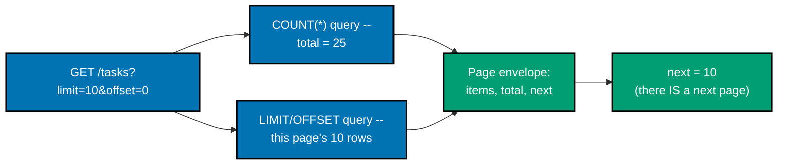

**`learning/code/ex-67-pagination-metadata/app.py`**

```python
"""Example 67: Pagination Metadata -- the response includes total and next."""
# => co-19: Example 65 proved limit/offset SLICES the list; this example proves a client can also
# => discover how many pages exist and where the next one starts, without a separate count request

import os
import sqlite3  # => co-14: the stdlib DB driver -- no ORM, no extra dependency needed
from typing import TypedDict  # => co-09: a typed dict shape for what the repository returns

from fastapi import FastAPI, Query  # => co-12: query params are typed and validated here
# => (fully self-contained: nothing here is imported from any other example directory)

DB_PATH = os.path.join(os.path.dirname(__file__), "tasks.db")  # => co-14: one on-disk SQLite
# => file PER EXAMPLE DIRECTORY -- never shared with any other example, keeping each self-contained

# => co-15: the schema below backs every list query in this example. Column-by-column:
# =>   id          -- an auto-incrementing primary key, never chosen by the caller
# =>   title       -- the task's display text, no constraint on it beyond NOT NULL
# =>   status      -- co-20: a FILTERABLE field, exercised starting at Example 69
# =>   priority    -- co-20: a SECOND filterable field, exercised starting at Example 70
# =>   created_at  -- co-20: a SORTABLE field, exercised starting at Example 72
SCHEMA = """
CREATE TABLE IF NOT EXISTS tasks (
    id INTEGER PRIMARY KEY AUTOINCREMENT,
    title TEXT NOT NULL,
    status TEXT NOT NULL,
    priority TEXT NOT NULL,
    created_at TEXT NOT NULL
);
"""


class TaskRow(TypedDict):  # => co-14, co-24: the repository's typed return shape --
    # => every field below matches a SCHEMA column one-to-one, so `dict(row)` (further down)
    # => produces a value that satisfies this shape without any manual field-by-field mapping
    id: int  # => matches the schema's INTEGER PRIMARY KEY column
    title: str  # => matches the schema's title column
    status: str  # => matches the schema's status column
    priority: str  # => matches the schema's priority column
    created_at: str  # => matches the schema's created_at column


class Page(TypedDict):  # => co-09, co-19: the ENVELOPE shape -- not just a bare array anymore --
    # => every list endpoint from THIS example onward returns this shape instead of a raw list
    items: list[TaskRow]  # => this page's rows -- exactly what Example 65 returned on its own
    total: int  # => co-19: the FULL table's row count, independent of this page's size
    next: int | None  # => None means "no further page" -- a real, typed sentinel, not a magic number


def _seed(conn: sqlite3.Connection) -> None:  # => co-14: builds the SAME deterministic 25-row
    # => dataset used by every pagination/filter/sort example in this topic, so worked-out ids
    # => like "done={2,5,8,...}" stay correct however many of these example directories exist
    statuses = ["todo", "in_progress", "done"]  # => rotates every 3 rows -- index is i % 3
    priorities = ["low", "normal", "high"]  # => co-19: irrelevant to pagination itself, but kept
    # => identical to Example 65's schema/seed so this file stays a complete, self-contained app --
    # => rotates every 2 rows via (i // 2) % 3, DECORRELATED from status ON PURPOSE (a combined
    # => status+priority filter, exercised starting at Example 70, needs the two fields independent)
    rows = [
        (f"task {i}", statuses[i % 3], priorities[(i // 2) % 3], f"2026-07-{i:02d}T00:00:00")
        for i in range(1, 26)  # => 25 total rows -- big enough that a 10-row page genuinely has a next
    ]
    conn.executemany(  # => co-14: a single batched INSERT for all 25 rows, one transaction
        "INSERT INTO tasks (title, status, priority, created_at) VALUES (?, ?, ?, ?)",  # => co-14:
        # => ? placeholders -- the SAME parameterization principle Example 71 stress-tests directly
        rows,
    )
    conn.commit()  # => co-14: commits the whole seed batch at once, not row-by-row


def init_db() -> None:  # => co-15: fresh schema + seed data every time this module is imported
    if os.path.exists(DB_PATH):
        os.remove(DB_PATH)  # => start from a known, deterministic state -- this example's expected
        # => row counts and ids only hold true starting from a CLEAN file, never an accumulated one
    conn = sqlite3.connect(DB_PATH)
    conn.execute(SCHEMA)  # => co-15: creates the table every query below depends on existing
    _seed(conn)  # => populates it with the 25-row deterministic dataset described above
    conn.close()  # => co-14: connections are short-lived here -- opened, used, closed, never held


def get_connection() -> sqlite3.Connection:  # => co-14: the repository's ONLY entry point to
    # => the DB -- every query function below calls THIS instead of sqlite3.connect() directly
    conn = sqlite3.connect(DB_PATH)
    conn.row_factory = sqlite3.Row  # => rows behave like dicts -- readable by column name, which
    # => is what makes `dict(row)` below produce sensible {"id":..., "title":...} keys, not a tuple
    return conn  # => a fresh connection per call -- co-14: no pooling, matches this example's scale


def list_page(limit: int, offset: int) -> Page:  # => co-14, co-19: repository returns the FULL
    # => envelope this time -- not just the rows, but ENOUGH metadata for a client to keep paging
    conn = get_connection()
    total = int(conn.execute("SELECT COUNT(*) FROM tasks").fetchone()[0])  # => co-19: the WHOLE
    # => table's size, computed with a SEPARATE query -- the LIMIT below never touches this number
    cursor = conn.execute(  # => co-14: the exact same paginated SELECT as Example 65
        "SELECT id, title, status, priority, created_at FROM tasks ORDER BY id LIMIT ? OFFSET ?",
        (limit, offset),
    )
    items = [dict(row) for row in cursor.fetchall()]  # type: ignore[misc]  # => sqlite3.Row -> dict
    conn.close()  # => co-14: closed immediately after both queries above finish
    next_offset = offset + limit  # => co-19: the offset a client would use to fetch the FOLLOWING page
    has_more = next_offset < total  # => whether that following page would return anything at all --
    # => an offset landing exactly ON or past `total` means there is nothing left to return
    return {
        "items": items,  # type: ignore[typeddict-item]  # => this page's slice of rows
        "total": total,  # => co-19: the FULL count, letting a client compute "page 3 of N" itself
        "next": next_offset if has_more else None,  # => None signals "you have reached the end" --
        # => a typed sentinel a client can check with `if page["next"] is not None`, no magic number
    }


init_db()  # => co-15: runs once at import time, before the app starts serving

app = FastAPI()  # => a fresh app -- this example needs no auth, only the pagination envelope


@app.get("/tasks")  # => co-19, co-09: returns the metadata envelope, not a bare list -- Example 65's
# => `list[TaskRow]` return type becomes `Page` here, wrapping the same rows with total/next alongside
def get_tasks(
    limit: int = Query(default=10, ge=1),  # => co-12: identical constraint to Example 65
    offset: int = Query(default=0, ge=0),  # => co-12: identical constraint to Example 65
) -> Page:
    return list_page(limit, offset)  # => co-19: the handler holds NO SQL -- co-24 layering
```

**Run**: `uvicorn app:app --port 8003` in one terminal, then the `curl` commands below in another, plus `pytest -v` against the same directory.

**Output** (curl):

```text
=== GET /tasks?limit=10&offset=0 (first page) ===
{"items":[{"id":1,"title":"task 1","status":"in_progress","priority":"low","created_at":"2026-07-01T00:00:00"},{"id":2,"title":"task 2","status":"done","priority":"normal","created_at":"2026-07-02T00:00:00"},{"id":3,"title":"task 3","status":"todo","priority":"normal","created_at":"2026-07-03T00:00:00"},{"id":4,"title":"task 4","status":"in_progress","priority":"high","created_at":"2026-07-04T00:00:00"},{"id":5,"title":"task 5","status":"done","priority":"high","created_at":"2026-07-05T00:00:00"},{"id":6,"title":"task 6","status":"todo","priority":"low","created_at":"2026-07-06T00:00:00"},{"id":7,"title":"task 7","status":"in_progress","priority":"low","created_at":"2026-07-07T00:00:00"},{"id":8,"title":"task 8","status":"done","priority":"normal","created_at":"2026-07-08T00:00:00"},{"id":9,"title":"task 9","status":"todo","priority":"normal","created_at":"2026-07-09T00:00:00"},{"id":10,"title":"task 10","status":"in_progress","priority":"high","created_at":"2026-07-10T00:00:00"}],"total":25,"next":10}
=== GET /tasks?limit=10&offset=20 (last page) ===
{"items":[{"id":21,"title":"task 21","status":"todo","priority":"normal","created_at":"2026-07-21T00:00:00"},{"id":22,"title":"task 22","status":"in_progress","priority":"high","created_at":"2026-07-22T00:00:00"},{"id":23,"title":"task 23","status":"done","priority":"high","created_at":"2026-07-23T00:00:00"},{"id":24,"title":"task 24","status":"todo","priority":"low","created_at":"2026-07-24T00:00:00"},{"id":25,"title":"task 25","status":"in_progress","priority":"low","created_at":"2026-07-25T00:00:00"}],"total":25,"next":null}
```

**Output** (`pytest -v`):

```text
============================= test session starts ==============================
plugins: anyio-4.14.2
collecting ... collected 2 items

test_app.py::test_first_page_reports_total_and_a_next_offset PASSED      [ 50%]
test_app.py::test_last_page_reports_next_as_null PASSED                  [100%]

=============================== warnings summary ===============================
../../../.venv/lib/python3.13/site-packages/fastapi/testclient.py:1
-- Docs: https://docs.pytest.org/en/stable/how-to/capture-warnings.html
========================= 2 passed, 1 warning in 0.15s =========================
```

**Key takeaway**: `next: int | None` is a real, typed sentinel a client can check with `if page["next"] is not None:` -- far safer than a magic number like `-1` that a client might forget to special-case.

**Why it matters**: `total` is computed with a completely SEPARATE `SELECT COUNT(*)` query from the one that fetches this page's rows -- the `LIMIT`/`OFFSET` clause on the second query never touches the first query's result at all. This separation matters: Example 73 later reuses this exact envelope shape but computes `total` against a FILTERED count, proving the same pattern composes correctly once a `WHERE` clause enters the picture, rather than silently reporting the whole table's size when a filter is active.

---

### Example 68: Pagination Bounds

_ex-68 &middot; exercises co-19, co-10_

Example 65's `ge=1` stopped a limit too SMALL; this example adds `le=MAX_LIMIT` to stop one too LARGE. Both bounds live declaratively in the `Query()` constraint itself -- there is no `if limit > 50: raise ...` anywhere in this file.

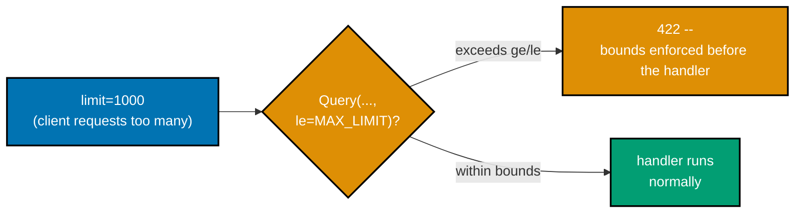

**`learning/code/ex-68-pagination-bounds/app.py`**

```python
"""Example 68: Pagination Bounds -- a limit over the maximum is rejected with 422."""
# => co-10, co-19: Example 65's `ge=1` stopped a limit too SMALL; this example adds `le=MAX_LIMIT`
# => to stop one too LARGE -- together they turn an unbounded page size into a safely bounded one

import os
import sqlite3  # => co-14: the stdlib DB driver -- no ORM, no extra dependency needed
from typing import TypedDict  # => co-09: a typed dict shape for what the repository returns

from fastapi import FastAPI, Query  # => co-12: query params are typed and validated here
# => (fully self-contained: nothing here is imported from any other example directory)

DB_PATH = os.path.join(os.path.dirname(__file__), "tasks.db")  # => co-14: one on-disk SQLite
# => file PER EXAMPLE DIRECTORY -- never shared with any other example, keeping each self-contained

# => co-15: the schema below backs every list query in this example. Column-by-column:
# =>   id          -- an auto-incrementing primary key, never chosen by the caller
# =>   title       -- the task's display text, no constraint on it beyond NOT NULL
# =>   status      -- co-20: a FILTERABLE field, exercised starting at Example 69
# =>   priority    -- co-20: a SECOND filterable field, exercised starting at Example 70
# =>   created_at  -- co-20: a SORTABLE field, exercised starting at Example 72
SCHEMA = """
CREATE TABLE IF NOT EXISTS tasks (
    id INTEGER PRIMARY KEY AUTOINCREMENT,
    title TEXT NOT NULL,
    status TEXT NOT NULL,
    priority TEXT NOT NULL,
    created_at TEXT NOT NULL
);
"""


class TaskRow(TypedDict):  # => co-14, co-24: the repository's typed return shape --
    # => every field below matches a SCHEMA column one-to-one, so `dict(row)` (further down)
    # => produces a value that satisfies this shape without any manual field-by-field mapping
    id: int  # => matches the schema's INTEGER PRIMARY KEY column
    title: str  # => matches the schema's title column
    status: str  # => matches the schema's status column
    priority: str  # => matches the schema's priority column
    created_at: str  # => matches the schema's created_at column


def _seed(conn: sqlite3.Connection) -> None:  # => co-14: builds the SAME deterministic 25-row
    # => dataset used by every pagination/filter/sort example in this topic, so worked-out ids
    # => like "done={2,5,8,...}" stay correct however many of these example directories exist
    statuses = ["todo", "in_progress", "done"]  # => rotates every 3 rows -- index is i % 3
    priorities = ["low", "normal", "high"]  # => rotates every 2 rows via (i // 2) % 3 --
    # => DECORRELATED from status ON PURPOSE, so a combined status+priority filter genuinely
    # => narrows further than either field alone, instead of the two columns moving in lockstep
    rows = [
        (f"task {i}", statuses[i % 3], priorities[(i // 2) % 3], f"2026-07-{i:02d}T00:00:00")
        for i in range(1, 26)  # => 25 rows -- fewer than MAX_LIMIT, so a request AT the max still succeeds
    ]
    conn.executemany(  # => co-14: a single batched INSERT for all 25 rows, one transaction
        "INSERT INTO tasks (title, status, priority, created_at) VALUES (?, ?, ?, ?)",  # => co-14:
        # => ? placeholders -- the SAME parameterization principle Example 71 stress-tests directly
        rows,
    )
    conn.commit()  # => co-14: commits the whole seed batch at once, not row-by-row


def init_db() -> None:  # => co-15: fresh schema + seed data every time this module is imported
    if os.path.exists(DB_PATH):
        os.remove(DB_PATH)  # => start from a known, deterministic state -- this example's expected
        # => row counts and ids only hold true starting from a CLEAN file, never an accumulated one
    conn = sqlite3.connect(DB_PATH)
    conn.execute(SCHEMA)  # => co-15: creates the table every query below depends on existing
    _seed(conn)  # => populates it with the 25-row deterministic dataset described above
    conn.close()  # => co-14: connections are short-lived here -- opened, used, closed, never held


def get_connection() -> sqlite3.Connection:  # => co-14: the repository's ONLY entry point to
    # => the DB -- every query function below calls THIS instead of sqlite3.connect() directly
    conn = sqlite3.connect(DB_PATH)
    conn.row_factory = sqlite3.Row  # => rows behave like dicts -- readable by column name, which
    # => is what makes `dict(row)` below produce sensible {"id":..., "title":...} keys, not a tuple
    return conn  # => a fresh connection per call -- co-14: no pooling, matches this example's scale


MAX_LIMIT = 50  # => co-19: the ceiling this example enforces -- prevents an accidental "select
# => everything" call from a caller who passes an enormous limit like ?limit=1000000 on a huge table


def list_tasks(limit: int, offset: int) -> list[TaskRow]:  # => co-14, co-19: identical query shape
    # => to Example 65 -- this function TRUSTS `limit` is already within bounds by the time it runs
    conn = get_connection()
    cursor = conn.execute(  # => co-14: LIMIT/OFFSET are parameterized, never string-interpolated
        "SELECT id, title, status, priority, created_at FROM tasks ORDER BY id LIMIT ? OFFSET ?",
        (limit, offset),
    )
    result = [dict(row) for row in cursor.fetchall()]  # type: ignore[misc]  # => sqlite3.Row -> dict
    conn.close()  # => co-14: closed immediately after this one query
    return result  # type: ignore[return-value]  # => shape matches TaskRow at runtime


init_db()  # => co-15: runs once at import time, before the app starts serving

app = FastAPI()  # => a fresh app -- this example needs no auth, only the bounds-checking mechanism


@app.get("/tasks")  # => co-19, co-10: the guard is declared right in the query parameter's constraints --
# => no `if limit > 50: raise ...` anywhere in this file; FastAPI enforces the bound declaratively
def get_tasks(
    limit: int = Query(default=10, ge=1, le=MAX_LIMIT),  # => co-10: le=50 -- FastAPI REJECTS anything
    # => higher with a 422 before this function is even entered, same enforcement point as ge=1 below
    offset: int = Query(default=0, ge=0),  # => co-12: unrelated to THIS example's bound, kept for parity
) -> list[TaskRow]:
    return list_tasks(limit, offset)  # => this line never runs at all for an out-of-bounds limit -- co-10
    # => validation happens BEFORE the handler body, exactly like any other Pydantic/Query constraint
```

**Run**: `uvicorn app:app --port 8003` in one terminal, then the `curl` commands below in another, plus `pytest -v` against the same directory.

**Output** (curl):

```text
=== GET /tasks?limit=50 (at the max -- succeeds) ===
row count: 25
=== GET /tasks?limit=1000 (over the max -- 422) ===
HTTP/1.1 422 Unprocessable Content
date: Tue, 14 Jul 2026 10:55:47 GMT
server: uvicorn
content-length: 143
content-type: application/json

{"detail":[{"type":"less_than_equal","loc":["query","limit"],"msg":"Input should be less than or equal to 50","input":"1000","ctx":{"le":50}}]}
```

**Output** (`pytest -v`):

```text
============================= test session starts ==============================
plugins: anyio-4.14.2
collecting ... collected 3 items

test_app.py::test_limit_over_maximum_is_422 PASSED                       [ 33%]
test_app.py::test_limit_at_maximum_is_allowed PASSED                     [ 66%]
test_app.py::test_limit_zero_is_422 PASSED                               [100%]

=============================== warnings summary ===============================
../../../.venv/lib/python3.13/site-packages/fastapi/testclient.py:1
-- Docs: https://docs.pytest.org/en/stable/how-to/capture-warnings.html
========================= 3 passed, 1 warning in 0.15s =========================
```

**Key takeaway**: FastAPI rejects an out-of-bounds `limit` with a 422 BEFORE the handler function is ever entered -- the constraint is enforced at the same validation layer as any other Pydantic/`Query` rule, not as custom logic inside the route.

**Why it matters**: `MAX_LIMIT = 50` exists specifically to stop a caller from accidentally (or maliciously) requesting `?limit=1000000` against a table that has grown far past this example's 25-row seed -- an unbounded upper limit is exactly the kind of gap that turns a working pagination feature into a resource-exhaustion vector the moment the underlying table gets large in production.

---

### Example 69: Filter by Field

_ex-69 &middot; exercises co-20_

Builds on Example 65's list endpoint by adding a narrowing dimension alongside pagination: `?status=done` returns only the 8 seeded rows whose `status` column equals `"done"`, out of the full 25-row table.


**`learning/code/ex-69-filter-by-field/app.py`**

```python
"""Example 69: Filter by Field -- ?status=done narrows the list."""
# => co-20: builds on Example 65's list endpoint by adding a NARROWING dimension alongside
# => pagination -- a caller now controls WHICH rows qualify, not just how many come back per page

import os
import sqlite3  # => co-14: the stdlib DB driver -- no ORM, no extra dependency needed
from typing import TypedDict  # => co-09: a typed dict shape for what the repository returns

from fastapi import FastAPI, Query  # => co-12: query params are typed and validated here
# => (fully self-contained: nothing here is imported from any other example directory)

DB_PATH = os.path.join(os.path.dirname(__file__), "tasks.db")  # => co-14: one on-disk SQLite
# => file PER EXAMPLE DIRECTORY -- never shared with any other example, keeping each self-contained

# => co-15: the schema below backs every list query in this example. Column-by-column:
# =>   id          -- an auto-incrementing primary key, never chosen by the caller
# =>   title       -- the task's display text, no constraint on it beyond NOT NULL
# =>   status      -- co-20: a FILTERABLE field, exercised starting at Example 69
# =>   priority    -- co-20: a SECOND filterable field, exercised starting at Example 70
# =>   created_at  -- co-20: a SORTABLE field, exercised starting at Example 72
SCHEMA = """
CREATE TABLE IF NOT EXISTS tasks (
    id INTEGER PRIMARY KEY AUTOINCREMENT,
    title TEXT NOT NULL,
    status TEXT NOT NULL,
    priority TEXT NOT NULL,
    created_at TEXT NOT NULL
);
"""


class TaskRow(TypedDict):  # => co-14, co-24: the repository's typed return shape --
    # => every field below matches a SCHEMA column one-to-one, so `dict(row)` (further down)
    # => produces a value that satisfies this shape without any manual field-by-field mapping
    id: int  # => matches the schema's INTEGER PRIMARY KEY column
    title: str  # => matches the schema's title column
    status: str  # => matches the schema's status column
    priority: str  # => matches the schema's priority column
    created_at: str  # => matches the schema's created_at column


def _seed(conn: sqlite3.Connection) -> None:  # => co-14: builds the SAME deterministic 25-row
    # => dataset used by every pagination/filter/sort example in this topic, so worked-out ids
    # => like "done={2,5,8,...}" stay correct however many of these example directories exist
    statuses = ["todo", "in_progress", "done"]  # => rotates every 3 rows -- index is i % 3
    # => this example's filter is on THIS field, so its exact rotation is what makes counts checkable
    priorities = ["low", "normal", "high"]  # => rotates every 2 rows via (i // 2) % 3 --
    # => DECORRELATED from status ON PURPOSE, so a combined status+priority filter genuinely
    # => narrows further than either field alone, instead of the two columns moving in lockstep
    rows = [
        (f"task {i}", statuses[i % 3], priorities[(i // 2) % 3], f"2026-07-{i:02d}T00:00:00")
        for i in range(1, 26)  # => same 25-row seed -- status=done matches ids {2,5,8,11,14,17,20,23}
        # => (8 of the 25 rows -- verified by counting i % 3 == 2 for i in 1..25, since "done" is index 2)
    ]
    conn.executemany(  # => co-14: a single batched INSERT for all 25 rows, one transaction
        "INSERT INTO tasks (title, status, priority, created_at) VALUES (?, ?, ?, ?)",  # => co-14:
        # => ? placeholders -- the SAME parameterization principle Example 71 stress-tests directly
        rows,
    )
    conn.commit()  # => co-14: commits the whole seed batch at once, not row-by-row


def init_db() -> None:  # => co-15: fresh schema + seed data every time this module is imported
    if os.path.exists(DB_PATH):
        os.remove(DB_PATH)  # => start from a known, deterministic state -- this example's expected
        # => row counts and ids only hold true starting from a CLEAN file, never an accumulated one
    conn = sqlite3.connect(DB_PATH)
    conn.execute(SCHEMA)  # => co-15: creates the table every query below depends on existing
    _seed(conn)  # => populates it with the 25-row deterministic dataset described above
    conn.close()  # => co-14: connections are short-lived here -- opened, used, closed, never held


def get_connection() -> sqlite3.Connection:  # => co-14: the repository's ONLY entry point to
    # => the DB -- every query function below calls THIS instead of sqlite3.connect() directly
    conn = sqlite3.connect(DB_PATH)
    conn.row_factory = sqlite3.Row  # => rows behave like dicts -- readable by column name, which
    # => is what makes `dict(row)` below produce sensible {"id":..., "title":...} keys, not a tuple
    return conn  # => a fresh connection per call -- co-14: no pooling, matches this example's scale


def list_tasks(status: str | None) -> list[TaskRow]:  # => co-14, co-20: the repository's filter
    # => parameter -- None means "no filter at all," a real value means "narrow to exactly this"
    conn = get_connection()
    if status is None:  # => co-20: no filter -- the FULL 25-row table, same query as Example 65
        cursor = conn.execute("SELECT id, title, status, priority, created_at FROM tasks ORDER BY id")
    else:  # => co-14, co-20: a parameterized WHERE clause -- never string-formatted into the SQL,
        # => which is exactly what keeps a value like `done' OR '1'='1` (Example 71) inert here too
        cursor = conn.execute(
            "SELECT id, title, status, priority, created_at FROM tasks WHERE status = ? ORDER BY id",
            (status,),  # => co-14: the single ? placeholder -- SQLite treats this as DATA, never SQL
        )
    result = [dict(row) for row in cursor.fetchall()]  # type: ignore[misc]  # => sqlite3.Row -> dict
    conn.close()  # => co-14: closed immediately after whichever branch above ran
    return result  # type: ignore[return-value]  # => shape matches TaskRow at runtime


init_db()  # => co-15: runs once at import time, before the app starts serving

app = FastAPI()  # => a fresh app -- this example needs no auth, only the filter mechanism


@app.get("/tasks")  # => co-20: this example's focus -- a single optional filter query param --
# => co-20: `status=done` matches exactly the 8 seeded rows at ids {2,5,8,11,14,17,20,23}
def get_tasks(status: str | None = Query(default=None)) -> list[TaskRow]:
    return list_tasks(status)  # => co-24: the handler holds no SQL -- it delegates to the repository
```

**Run**: `uvicorn app:app --port 8003` in one terminal, then the `curl` commands below in another, plus `pytest -v` against the same directory.

**Output** (curl):

```text
=== GET /tasks (unfiltered) ===
row count: 25
=== GET /tasks?status=done ===
[{"id":2,"title":"task 2","status":"done","priority":"normal","created_at":"2026-07-02T00:00:00"},{"id":5,"title":"task 5","status":"done","priority":"high","created_at":"2026-07-05T00:00:00"},{"id":8,"title":"task 8","status":"done","priority":"normal","created_at":"2026-07-08T00:00:00"},{"id":11,"title":"task 11","status":"done","priority":"high","created_at":"2026-07-11T00:00:00"},{"id":14,"title":"task 14","status":"done","priority":"normal","created_at":"2026-07-14T00:00:00"},{"id":17,"title":"task 17","status":"done","priority":"high","created_at":"2026-07-17T00:00:00"},{"id":20,"title":"task 20","status":"done","priority":"normal","created_at":"2026-07-20T00:00:00"},{"id":23,"title":"task 23","status":"done","priority":"high","created_at":"2026-07-23T00:00:00"}]
```

**Output** (`pytest -v`):

```text
============================= test session starts ==============================
plugins: anyio-4.14.2
collecting ... collected 3 items

test_app.py::test_no_filter_returns_all_twenty_five PASSED               [ 33%]
test_app.py::test_status_done_returns_only_eight_matching_rows PASSED    [ 66%]
test_app.py::test_status_with_no_matches_returns_empty PASSED            [100%]

=============================== warnings summary ===============================
../../../.venv/lib/python3.13/site-packages/fastapi/testclient.py:1
-- Docs: https://docs.pytest.org/en/stable/how-to/capture-warnings.html
========================= 3 passed, 1 warning in 0.18s =========================
```

**Key takeaway**: The filter value flows through a `?` placeholder exactly like every other parameterized value in this topic -- `WHERE status = ?` with `(status,)` as the bound parameter -- never string-formatted directly into the SQL text, which is precisely the discipline Example 71 stress-tests against an actual injection attempt.

**Why it matters**: `status is None` (omit the query param entirely) and `status is not None` (a real filter value) are two branches that share almost identical SQL, differing only in whether a `WHERE` clause is present at all -- this is the simplest possible version of the pattern Example 70 extends to TWO independent filters and Example 73 extends further to filter-plus-sort-plus-paginate all composing in one query.

---

### Example 70: Filter Multiple

_ex-70 &middot; exercises co-20_

`?status=done&priority=high` combines two independently optional filters with AND semantics. This is exactly why Example 65's seed deliberately decorrelates `status` from `priority` (`priority` rotates via `(i // 2) % 3`, not in lockstep with `status`'s own `i % 3` rotation) -- the two filters only prove something new if their intersection is genuinely smaller than either alone.

**`learning/code/ex-70-filter-multiple/app.py`**

```python
"""Example 70: Filter Multiple -- ?status=done&priority=high combine with AND semantics."""
# => co-20: this is exactly WHY Example 65's seed decorrelates status from priority -- the two
# => filters below only prove something new if their intersection is smaller than either alone

import os  # => builds DB_PATH below in an OS-independent way
import sqlite3  # => co-14: the stdlib DB driver -- no ORM, no extra dependency needed
from typing import TypedDict  # => co-09: a typed dict shape for what the repository returns

from fastapi import FastAPI, Query  # => co-12: query params are typed and validated here
# => (fully self-contained: nothing here is imported from any other example directory)

DB_PATH = os.path.join(os.path.dirname(__file__), "tasks.db")  # => co-14: one on-disk SQLite
# => file PER EXAMPLE DIRECTORY -- never shared with any other example, keeping each self-contained

# => co-15: the schema below backs every list query in this example. Column-by-column:
# =>   id          -- an auto-incrementing primary key, never chosen by the caller
# =>   title       -- the task's display text, no constraint on it beyond NOT NULL
# =>   status      -- co-20: a FILTERABLE field, exercised starting at Example 69
# =>   priority    -- co-20: a SECOND filterable field, exercised starting at Example 70
# =>   created_at  -- co-20: a SORTABLE field, exercised starting at Example 72
SCHEMA = """
CREATE TABLE IF NOT EXISTS tasks (
    id INTEGER PRIMARY KEY AUTOINCREMENT,
    title TEXT NOT NULL,
    status TEXT NOT NULL,
    priority TEXT NOT NULL,
    created_at TEXT NOT NULL
);
"""


class TaskRow(TypedDict):  # => co-14, co-24: the repository's typed return shape --
    # => every field below matches a SCHEMA column one-to-one, so `dict(row)` (further down)
    # => produces a value that satisfies this shape without any manual field-by-field mapping
    id: int  # => matches the schema's INTEGER PRIMARY KEY column
    title: str  # => matches the schema's title column
    status: str  # => matches the schema's status column
    priority: str  # => matches the schema's priority column
    created_at: str  # => matches the schema's created_at column


def _seed(conn: sqlite3.Connection) -> None:  # => co-14: builds the SAME deterministic 25-row
    # => dataset used by every pagination/filter/sort example in this topic, so worked-out ids
    # => like "done={2,5,8,...}" stay correct however many of these example directories exist
    statuses = ["todo", "in_progress", "done"]  # => rotates every 3 rows -- index is i % 3
    priorities = ["low", "normal", "high"]  # => rotates every 2 rows via (i // 2) % 3 --
    # => DECORRELATED from status ON PURPOSE, so a combined status+priority filter genuinely
    # => narrows further than either field alone, instead of the two columns moving in lockstep
    rows = [
        (f"task {i}", statuses[i % 3], priorities[(i // 2) % 3], f"2026-07-{i:02d}T00:00:00")
        for i in range(1, 26)  # => done={2,5,8,11,14,17,20,23}, high={4,5,10,11,16,17,22,23}
    ]
    conn.executemany(  # => co-14: a single batched INSERT for all 25 rows, one transaction
        "INSERT INTO tasks (title, status, priority, created_at) VALUES (?, ?, ?, ?)",  # => co-14:
        # => ? placeholders -- the SAME parameterization principle Example 71 stress-tests directly
        rows,
    )
    conn.commit()  # => co-14: commits the whole seed batch at once, not row-by-row


def init_db() -> None:  # => co-15: fresh schema + seed data every time this module is imported
    if os.path.exists(DB_PATH):
        os.remove(DB_PATH)  # => start from a known, deterministic state -- this example's expected
        # => row counts and ids only hold true starting from a CLEAN file, never an accumulated one
    conn = sqlite3.connect(DB_PATH)
    conn.execute(SCHEMA)  # => co-15: creates the table every query below depends on existing
    _seed(conn)  # => populates it with the 25-row deterministic dataset described above
    conn.close()  # => co-14: connections are short-lived here -- opened, used, closed, never held


def get_connection() -> sqlite3.Connection:  # => co-14: the repository's ONLY entry point to
    # => the DB -- every query function below calls THIS instead of sqlite3.connect() directly
    conn = sqlite3.connect(DB_PATH)
    conn.row_factory = sqlite3.Row  # => rows behave like dicts -- readable by column name, which
    # => is what makes `dict(row)` below produce sensible {"id":..., "title":...} keys, not a tuple
    return conn  # => a fresh connection per call -- co-14: no pooling, matches this example's scale


def list_tasks(status: str | None, priority: str | None) -> list[TaskRow]:  # => co-20: TWO
    # => independent filters -- each optional on its own, but AND-combined when both are present
    conn = get_connection()
    clauses: list[str] = []  # => co-14, co-20: builds the WHERE clause incrementally, still
    # => fully parameterized -- ONLY the placeholder count/order is dynamic, never the SQL text itself
    params: list[str] = []  # => co-14: kept in lockstep with `clauses` -- one entry per ? placeholder
    if status is not None:  # => co-20: opt-in -- omitting ?status= entirely skips this clause completely
        clauses.append("status = ?")  # => placeholder ONLY -- never f"status = '{status}'"
        params.append(status)  # => co-14: the actual value, bound positionally to the ? above
    if priority is not None:  # => co-20: independently opt-in -- can combine with status or stand alone
        clauses.append("priority = ?")  # => a SECOND placeholder, combined with AND below
        params.append(priority)  # => co-14: appended AFTER status's param, matching clause order
    where = f" WHERE {' AND '.join(clauses)}" if clauses else ""  # => co-20: AND joins every active
    # => filter -- zero filters means an empty string here, reproducing Example 65's unfiltered query
    cursor = conn.execute(  # => co-14: only the CLAUSE STRUCTURE is built dynamically; every value
        # => still flows through params as a placeholder, so injection is impossible regardless of input
        f"SELECT id, title, status, priority, created_at FROM tasks{where} ORDER BY id",  # => co-20
        params,  # => co-14: 0, 1, or 2 bound values, matching however many clauses were built above
    )
    result = [dict(row) for row in cursor.fetchall()]  # type: ignore[misc]  # => sqlite3.Row -> dict
    conn.close()  # => co-14: closed immediately after this one query
    return result  # type: ignore[return-value]  # => shape matches TaskRow at runtime


init_db()  # => co-15: runs once at import time, before the app starts serving

app = FastAPI()  # => a fresh app -- this example needs no auth, only the combined-filter mechanism


@app.get("/tasks")  # => co-20: this example's focus -- TWO filters combined with AND semantics
def get_tasks(
    status: str | None = Query(default=None),  # => co-12: independently optional, same as Example 69
    priority: str | None = Query(default=None),  # => co-12: the SECOND independently optional filter
) -> list[TaskRow]:
    return list_tasks(status, priority)  # => co-24: the handler holds no SQL, only orchestration
```

**Run**: `uvicorn app:app --port 8003` in one terminal, then the `curl` commands below in another, plus `pytest -v` against the same directory.

**Output** (curl):

```text
=== GET /tasks?status=done (single filter) ===
row count: 8
ids: [2, 5, 8, 11, 14, 17, 20, 23]
=== GET /tasks?status=done&priority=high (combined AND filter) ===
[{"id":5,"title":"task 5","status":"done","priority":"high","created_at":"2026-07-05T00:00:00"},{"id":11,"title":"task 11","status":"done","priority":"high","created_at":"2026-07-11T00:00:00"},{"id":17,"title":"task 17","status":"done","priority":"high","created_at":"2026-07-17T00:00:00"},{"id":23,"title":"task 23","status":"done","priority":"high","created_at":"2026-07-23T00:00:00"}]
```

**Output** (`pytest -v`):

```text
============================= test session starts ==============================
plugins: anyio-4.14.2
collecting ... collected 2 items

test_app.py::test_status_alone_returns_eight PASSED                      [ 50%]
test_app.py::test_status_and_priority_together_narrow_further PASSED     [100%]

=============================== warnings summary ===============================
../../../.venv/lib/python3.13/site-packages/fastapi/testclient.py:1
-- Docs: https://docs.pytest.org/en/stable/how-to/capture-warnings.html
========================= 2 passed, 1 warning in 0.15s =========================
```

**Key takeaway**: `clauses` and `params` are built up incrementally as parallel lists, so the SQL TEXT'S structure is the only dynamic part -- every actual VALUE still flows through a `?` placeholder, positionally matched to `params`, which keeps injection impossible regardless of how many filters end up active.

**Why it matters**: Zero, one, or two active filters all fall out of the exact same code path: an empty `clauses` list produces an empty `WHERE` string, reproducing Example 69's unfiltered case with no special-casing required. This incremental-clause-building technique is the foundation Example 73 builds on directly when it adds pagination and sorting into the same composed query.

---

### Example 71: Filter Parameterized SQL

_ex-71 &middot; exercises co-20, co-14_

Every other pagination/filter example in this topic already parameterizes its SQL; this example is the one that proves WHY, by including a deliberately vulnerable twin function alongside the safe one actually wired to the route. Sending `status=done' OR '1'='1` at the real, parameterized `/tasks` endpoint returns an empty list -- SQLite treats the entire string as one literal value, not as SQL syntax.

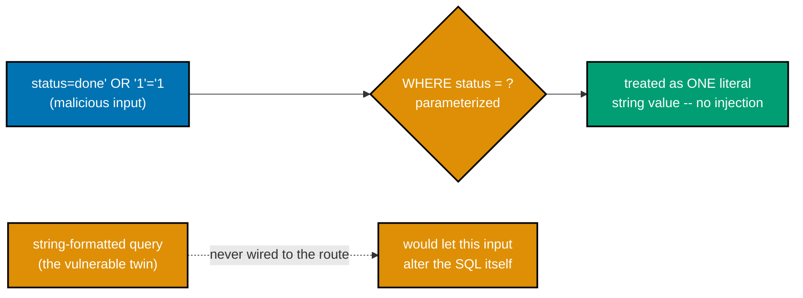

**`learning/code/ex-71-filter-parameterized-sql/app.py`**

```python
"""Example 71: Filter Parameterized SQL -- an injection attempt is neutralized."""
# => co-14, co-20: every other pagination/filter example in this topic ALREADY parameterizes
# => its SQL -- this example is the one that proves WHY, by showing the vulnerable alternative

import os
import sqlite3  # => co-14: the stdlib DB driver -- no ORM, no extra dependency needed
from typing import TypedDict  # => co-09: a typed dict shape for what the repository returns

from fastapi import FastAPI, Query  # => co-12: query params are typed and validated here
# => (fully self-contained: nothing here is imported from any other example directory)

DB_PATH = os.path.join(os.path.dirname(__file__), "tasks.db")  # => co-14: one on-disk SQLite
# => file PER EXAMPLE DIRECTORY -- never shared with any other example, keeping each self-contained

# => co-15: the schema below backs every list query in this example. Column-by-column:
# =>   id          -- an auto-incrementing primary key, never chosen by the caller
# =>   title       -- the task's display text, no constraint on it beyond NOT NULL
# =>   status      -- co-20: a FILTERABLE field, exercised starting at Example 69
# =>   priority    -- co-20: a SECOND filterable field, exercised starting at Example 70
# =>   created_at  -- co-20: a SORTABLE field, exercised starting at Example 72
SCHEMA = """
CREATE TABLE IF NOT EXISTS tasks (
    id INTEGER PRIMARY KEY AUTOINCREMENT,
    title TEXT NOT NULL,
    status TEXT NOT NULL,
    priority TEXT NOT NULL,
    created_at TEXT NOT NULL
);
"""


class TaskRow(TypedDict):  # => co-14, co-24: the repository's typed return shape --
    # => every field below matches a SCHEMA column one-to-one, so `dict(row)` (further down)
    # => produces a value that satisfies this shape without any manual field-by-field mapping
    id: int  # => matches the schema's INTEGER PRIMARY KEY column
    title: str  # => matches the schema's title column
    status: str  # => matches the schema's status column
    priority: str  # => matches the schema's priority column
    created_at: str  # => matches the schema's created_at column


def _seed(conn: sqlite3.Connection) -> None:  # => co-14: builds the SAME deterministic 25-row
    # => dataset used by every pagination/filter/sort example in this topic, so worked-out ids
    # => like "done={2,5,8,...}" stay correct however many of these example directories exist
    statuses = ["todo", "in_progress", "done"]  # => rotates every 3 rows -- index is i % 3
    priorities = ["low", "normal", "high"]  # => rotates every 2 rows via (i // 2) % 3 --
    # => DECORRELATED from status ON PURPOSE, so a combined status+priority filter genuinely
    # => narrows further than either field alone, instead of the two columns moving in lockstep
    rows = [(f"task {i}", statuses[i % 3], priorities[(i // 2) % 3], f"2026-07-{i:02d}T00:00:00") for i in range(1, 26)]
    conn.executemany(  # => co-14: a single batched INSERT for all 25 rows, one transaction
        "INSERT INTO tasks (title, status, priority, created_at) VALUES (?, ?, ?, ?)",  # => co-14:
        # => ? placeholders -- the SAME parameterization principle Example 71 stress-tests directly
        rows,
    )
    conn.commit()  # => co-14: commits the whole seed batch at once, not row-by-row


def init_db() -> None:  # => co-15: fresh schema + seed data every time this module is imported
    if os.path.exists(DB_PATH):
        os.remove(DB_PATH)  # => start from a known, deterministic state -- this example's expected
        # => row counts and ids only hold true starting from a CLEAN file, never an accumulated one
    conn = sqlite3.connect(DB_PATH)
    conn.execute(SCHEMA)  # => co-15: creates the table every query below depends on existing
    _seed(conn)  # => populates it with the 25-row deterministic dataset described above
    conn.close()  # => co-14: connections are short-lived here -- opened, used, closed, never held


def get_connection() -> sqlite3.Connection:  # => co-14: the repository's ONLY entry point to
    # => the DB -- every query function below calls THIS instead of sqlite3.connect() directly
    conn = sqlite3.connect(DB_PATH)
    conn.row_factory = sqlite3.Row  # => rows behave like dicts -- readable by column name, which
    # => is what makes `dict(row)` below produce sensible {"id":..., "title":...} keys, not a tuple
    return conn  # => a fresh connection per call -- co-14: no pooling, matches this example's scale


def list_tasks_safe(status: str) -> list[TaskRow]:  # => co-14, co-20: the SAFE, parameterized version --
    # => this is the ONLY function this example's route actually calls, further down
    conn = get_connection()
    cursor = conn.execute(  # => co-14: the value is bound as a PARAMETER, never concatenated into the SQL
        "SELECT id, title, status, priority, created_at FROM tasks WHERE status = ? ORDER BY id",
        (status,),  # => sqlite3 sends this as DATA, not as part of the SQL grammar at all -- an
        # => injection payload like `done' OR '1'='1` is just a literal STRING being compared here
    )
    result = [dict(row) for row in cursor.fetchall()]  # type: ignore[misc]  # => sqlite3.Row -> dict
    conn.close()  # => co-14: closed immediately after this one query
    return result  # type: ignore[return-value]  # => empty list when no row's status equals the payload


def list_tasks_unsafe_for_demo_only(  # => co-14: the VULNERABLE version -- exists ONLY as a
    status: str,  # => teaching contrast; never called by any route, only by this example's own tests
) -> list[TaskRow]:
    conn = get_connection()
    query = (  # => co-14: string-BUILDING the SQL text itself, not just its parameters
        f"SELECT id, title, status, priority, created_at FROM tasks WHERE status = '{status}' ORDER BY id"
    )
    # => DELIBERATELY f-string-interpolated -- shown ONLY to prove what parameterization prevents,
    # => never something a real handler should do; not wired to any route in this app
    cursor = conn.execute(query)  # => co-14: SQLite parses whatever ends up embedded in `query` as SQL
    result = [dict(row) for row in cursor.fetchall()]  # type: ignore[misc]  # => sqlite3.Row -> dict
    conn.close()  # => co-14: closed immediately after this one query
    return result  # type: ignore[return-value]  # => ALL 25 rows when the payload closes the quote early


init_db()  # => co-15: runs once at import time, before the app starts serving

app = FastAPI()  # => a fresh app -- this example needs no auth, only the safe/unsafe query contrast


@app.get("/tasks")  # => co-20: the ONLY route this app exposes uses the SAFE repository function --
# => `list_tasks_unsafe_for_demo_only` above is reachable only from Python code (like the tests
# => and curl-equivalent script below), never from any HTTP route a real caller could hit
def get_tasks(status: str = Query(...)) -> list[TaskRow]:  # => co-12: required, no default -- omitting
    # => `?status=` entirely is a 422, distinct from THIS example's own scenario of a crafted value
    return list_tasks_safe(status)  # => co-24: the handler always goes through the SAFE path
```

**Run**: `uvicorn app:app --port 8003` in one terminal, then the `curl` commands below in another, plus `pytest -v` against the same directory.

**Output** (curl):

```text
=== GET /tasks?status=done' OR '1'='1 (SQL injection attempt, parameterized route) ===
[]
=== GET /tasks?status=done (legitimate filter, for contrast) ===
row count: 8
```

**Output** (`pytest -v`):

```text
============================= test session starts ==============================
plugins: anyio-4.14.2
collecting ... collected 4 items

test_app.py::test_route_neutralizes_the_injection_attempt PASSED         [ 25%]
test_app.py::test_safe_repository_function_matches_route_behavior PASSED [ 50%]
test_app.py::test_unsafe_function_demonstrates_the_vulnerability_it_would_have_had PASSED [ 75%]
test_app.py::test_safe_status_lookup_still_works_normally PASSED         [100%]

=============================== warnings summary ===============================
../../../.venv/lib/python3.13/site-packages/fastapi/testclient.py:1
-- Docs: https://docs.pytest.org/en/stable/how-to/capture-warnings.html
========================= 4 passed, 1 warning in 0.16s =========================
```

**Key takeaway**: `list_tasks_unsafe_for_demo_only()` exists purely as a teaching contrast -- it is never called by any HTTP route in this app, only directly from Python code (this example's own tests) to prove what parameterization prevents, without ever exposing the vulnerable path to a real caller.

**Why it matters**: The contrast is the whole point: the SAME injection payload that returns an empty list against the safe, parameterized query returns ALL 25 rows against the unsafe, f-string-interpolated twin -- a single-quote in the payload closes the SQL string literal early, turning `status = 'done' OR '1'='1'` into a condition that matches every row. Seeing both outcomes side by side, from the identical input, makes parameterization's protection concrete rather than an abstract rule to memorize.

---

### Example 72: Sort Param

_ex-72 &middot; exercises co-20_

`?sort=created_at` (ascending) or `?sort=-created_at` (descending, via a leading `-`) reorders the SAME 25 rows -- sorting never changes which rows come back, only the sequence they arrive in. `SortValue = Literal["created_at", "-created_at"]` is a closed set, so FastAPI 422s any other value automatically.

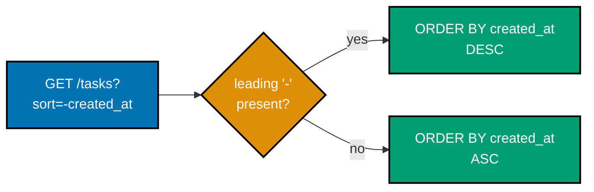

**`learning/code/ex-72-sort-param/app.py`**

```python
"""Example 72: Sort Param -- ?sort=created_at (or -created_at) orders the list."""

import os
import sqlite3  # => co-14: the stdlib DB driver -- no ORM, no extra dependency needed
from typing import Literal, TypedDict  # => co-12: Literal constrains the sort param to two values

from fastapi import FastAPI, Query  # => co-12: query params are typed and validated here
# => (fully self-contained: nothing here is imported from any other example directory)

DB_PATH = os.path.join(os.path.dirname(__file__), "tasks.db")  # => co-14: one on-disk SQLite
# => file PER EXAMPLE DIRECTORY -- never shared with any other example, keeping each self-contained

# => co-15: the schema below backs every list query in this example. Column-by-column:
# =>   id          -- an auto-incrementing primary key, never chosen by the caller
# =>   title       -- the task's display text, no constraint on it beyond NOT NULL
# =>   status      -- co-20: a FILTERABLE field, exercised starting at Example 69
# =>   priority    -- co-20: a SECOND filterable field, exercised starting at Example 70
# =>   created_at  -- co-20: a SORTABLE field, exercised starting at Example 72
SCHEMA = """
CREATE TABLE IF NOT EXISTS tasks (
    id INTEGER PRIMARY KEY AUTOINCREMENT,
    title TEXT NOT NULL,
    status TEXT NOT NULL,
    priority TEXT NOT NULL,
    created_at TEXT NOT NULL
);
"""


class TaskRow(TypedDict):  # => co-14, co-24: the repository's typed return shape --
    # => every field below matches a SCHEMA column one-to-one, so `dict(row)` (further down)
    # => produces a value that satisfies this shape without any manual field-by-field mapping
    id: int  # => matches the schema's INTEGER PRIMARY KEY column
    title: str  # => matches the schema's title column
    status: str  # => matches the schema's status column
    priority: str  # => matches the schema's priority column
    created_at: str  # => matches the schema's created_at column


def _seed(conn: sqlite3.Connection) -> None:  # => co-14: builds the SAME deterministic 25-row
    # => dataset used by every pagination/filter/sort example in this topic, so worked-out ids
    # => like "done={2,5,8,...}" stay correct however many of these example directories exist
    statuses = ["todo", "in_progress", "done"]  # => rotates every 3 rows -- index is i % 3
    priorities = ["low", "normal", "high"]  # => rotates every 2 rows via (i // 2) % 3 --
    # => DECORRELATED from status ON PURPOSE, so a combined status+priority filter genuinely
    # => narrows further than either field alone, instead of the two columns moving in lockstep
    rows = [
        (f"task {i}", statuses[i % 3], priorities[(i // 2) % 3], f"2026-07-{i:02d}T00:00:00")
        for i in range(1, 26)  # => created_at already increases WITH id -- ascending sort looks
        # => like a no-op, so THIS example's curl deliberately checks descending order too, below
    ]
    conn.executemany(  # => co-14: a single batched INSERT for all 25 rows, one transaction
        "INSERT INTO tasks (title, status, priority, created_at) VALUES (?, ?, ?, ?)",  # => co-14:
        # => ? placeholders -- the SAME parameterization principle Example 71 stress-tests directly
        rows,
    )
    conn.commit()  # => co-14: commits the whole seed batch at once, not row-by-row


def init_db() -> None:  # => co-15: fresh schema + seed data every time this module is imported
    if os.path.exists(DB_PATH):
        os.remove(DB_PATH)  # => start from a known, deterministic state -- this example's expected
        # => row counts and ids only hold true starting from a CLEAN file, never an accumulated one
    conn = sqlite3.connect(DB_PATH)
    conn.execute(SCHEMA)  # => co-15: creates the table every query below depends on existing
    _seed(conn)  # => populates it with the 25-row deterministic dataset described above
    conn.close()  # => co-14: connections are short-lived here -- opened, used, closed, never held


def get_connection() -> sqlite3.Connection:  # => co-14: the repository's ONLY entry point to
    # => the DB -- every query function below calls THIS instead of sqlite3.connect() directly
    conn = sqlite3.connect(DB_PATH)
    conn.row_factory = sqlite3.Row  # => rows behave like dicts -- readable by column name, which
    # => is what makes `dict(row)` below produce sensible {"id":..., "title":...} keys, not a tuple
    return conn  # => a fresh connection per call -- co-14: no pooling, matches this example's scale


SortValue = Literal["created_at", "-created_at"]  # => co-20: a closed set -- FastAPI 422s anything
# => else, unlike `status`/`priority` in the filter examples, which accept any string at all

_COLUMN_BY_SORT: dict[SortValue, str] = {  # => co-14: maps the PUBLIC sort value to a real column +
    # => direction -- this dict is the ONLY thing standing between user input and an ORDER BY clause
    "created_at": "created_at ASC",  # => oldest-first, matching the seed's natural insertion order
    "-created_at": "created_at DESC",  # => a leading "-" is a common REST convention for "descending"
}


def list_tasks(sort: SortValue) -> list[TaskRow]:  # => co-14, co-20: sort is a Literal, so `sort`
    # => can ONLY ever be one of the two dict keys above -- pyright itself enforces total coverage
    conn = get_connection()
    order_clause = _COLUMN_BY_SORT[sort]  # => co-14: looked up from a FIXED mapping -- never
    # => interpolates raw user input directly into ORDER BY, which parameterization cannot protect
    # => against (SQLite has no `?` placeholder syntax for column names or ASC/DESC keywords at all)
    cursor = conn.execute(f"SELECT id, title, status, priority, created_at FROM tasks ORDER BY {order_clause}")
    result = [dict(row) for row in cursor.fetchall()]  # type: ignore[misc]  # => sqlite3.Row -> dict
    conn.close()  # => co-14: closed immediately after this one query
    return result  # type: ignore[return-value]  # => shape matches TaskRow at runtime


init_db()  # => co-15: runs once at import time, before the app starts serving

app = FastAPI()  # => a fresh app -- this example needs no auth, only the sort mechanism


@app.get("/tasks")  # => co-20: this example's focus -- reordering the SAME underlying rows,
# => never changing WHICH rows come back, only the SEQUENCE they arrive in
def get_tasks(sort: SortValue = Query(default="created_at")) -> list[TaskRow]:
    return list_tasks(sort)  # => co-24: the handler holds no SQL -- it delegates to the repository
```

**Run**: `uvicorn app:app --port 8003` in one terminal, then the `curl` commands below in another, plus `pytest -v` against the same directory.

**Output** (curl):

```text
=== GET /tasks?sort=created_at (ascending) ===
first 3 ids: [1, 2, 3]
last 3 ids: [23, 24, 25]
=== GET /tasks?sort=-created_at (descending) ===
first 3 ids: [25, 24, 23]
last 3 ids: [3, 2, 1]
```

**Output** (`pytest -v`):

```text
============================= test session starts ==============================
plugins: anyio-4.14.2
collecting ... collected 3 items

test_app.py::test_ascending_sort_starts_at_id_1 PASSED                   [ 33%]
test_app.py::test_descending_sort_reverses_the_order PASSED              [ 66%]
test_app.py::test_invalid_sort_value_is_422 PASSED                       [100%]

=============================== warnings summary ===============================
../../../.venv/lib/python3.13/site-packages/fastapi/testclient.py:1
-- Docs: https://docs.pytest.org/en/stable/how-to/capture-warnings.html
========================= 3 passed, 1 warning in 0.19s =========================
```

**Key takeaway**: User input is never interpolated directly into `ORDER BY` -- `_COLUMN_BY_SORT` maps the two allowed PUBLIC values to a fixed SQL fragment, because SQLite has no `?` placeholder syntax for column names or `ASC`/`DESC` keywords, which parameterization alone cannot protect against.

**Why it matters**: A `Literal` type is a genuinely different validation strategy from `status`/`priority`'s plain `str` in Examples 69-70: a closed set is appropriate when only a FIXED number of values ever make sense (sort direction), while an open `str` is appropriate when the valid values come from actual DATA (task statuses, which a real app might add to over time). Choosing the wrong one in either direction is a real design mistake -- a `Literal` for something that should grow, or a plain `str` for something that never should.

---

### Example 73: Combined List Query

_ex-73 &middot; exercises co-19, co-20_

Examples 65-72 built pagination, filtering, and sorting SEPARATELY; this is the capstone-style proof that all three compose correctly in a single endpoint, without one feature silently breaking another. `total` reflects the FILTERED count, computed with the same `WHERE` clause and params as the main query -- never the whole unfiltered table.

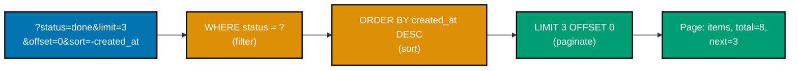

**`learning/code/ex-73-combined-list-query/app.py`**

```python
"""Example 73: Combined List Query -- pagination + filter + sort together."""
# => co-19, co-20: Examples 65-72 built pagination, filtering, and sorting SEPARATELY -- this
# => example is the capstone-style proof that all three compose correctly in a single endpoint,
# => without one feature silently breaking another (e.g. total must reflect the FILTER, not ignore it)

import os  # => co-14: used for the DB_PATH lookup and the "start fresh" file check below
import sqlite3  # => co-14: the stdlib DB driver -- no ORM, no extra dependency needed
from typing import Literal, TypedDict  # => co-12: Literal constrains the sort param to two values

from fastapi import FastAPI, Query  # => co-12: query params are typed and validated here
# => (fully self-contained: nothing here is imported from any other example directory)

DB_PATH = os.path.join(os.path.dirname(__file__), "tasks.db")  # => co-14: one on-disk SQLite
# => file PER EXAMPLE DIRECTORY -- never shared with any other example, keeping each self-contained

# => co-15: the schema below backs every list query in this example. Column-by-column:
# =>   id          -- an auto-incrementing primary key, never chosen by the caller
# =>   title       -- the task's display text, no constraint on it beyond NOT NULL
# =>   status      -- co-20: a FILTERABLE field, exercised starting at Example 69
# =>   priority    -- co-20: a SECOND filterable field, exercised starting at Example 70
# =>   created_at  -- co-20: a SORTABLE field, exercised starting at Example 72
SCHEMA = """
CREATE TABLE IF NOT EXISTS tasks (
    id INTEGER PRIMARY KEY AUTOINCREMENT,
    title TEXT NOT NULL,
    status TEXT NOT NULL,
    priority TEXT NOT NULL,
    created_at TEXT NOT NULL
);
"""


class TaskRow(TypedDict):  # => co-14, co-24: the repository's typed return shape --
    # => every field below matches a SCHEMA column one-to-one, so `dict(row)` (further down)
    # => produces a value that satisfies this shape without any manual field-by-field mapping
    id: int  # => matches the schema's INTEGER PRIMARY KEY column
    title: str  # => matches the schema's title column
    status: str  # => matches the schema's status column
    priority: str  # => matches the schema's priority column
    created_at: str  # => matches the schema's created_at column


class Page(TypedDict):  # => co-09, co-19: the SAME envelope shape as Example 67, reused here
    items: list[TaskRow]  # => this page's rows, after filtering AND sorting AND slicing
    total: int  # => co-19, co-20: the FILTERED count -- not the whole 25-row table
    next: int | None  # => co-19: computed against the filtered total, not the unfiltered one


def _seed(conn: sqlite3.Connection) -> None:  # => co-14: builds the SAME deterministic 25-row
    # => dataset used by every pagination/filter/sort example in this topic, so worked-out ids
    # => like "done={2,5,8,...}" stay correct however many of these example directories exist
    statuses = ["todo", "in_progress", "done"]  # => rotates every 3 rows -- index is i % 3
    priorities = ["low", "normal", "high"]  # => rotates every 2 rows via (i // 2) % 3 --
    # => DECORRELATED from status ON PURPOSE, so a combined status+priority filter genuinely
    # => narrows further than either field alone, instead of the two columns moving in lockstep
    rows = [
        (f"task {i}", statuses[i % 3], priorities[(i // 2) % 3], f"2026-07-{i:02d}T00:00:00")
        for i in range(1, 26)  # => the SAME 25-row seed as every other pagination/filter/sort example
    ]
    conn.executemany(  # => co-14: a single batched INSERT for all 25 rows, one transaction
        "INSERT INTO tasks (title, status, priority, created_at) VALUES (?, ?, ?, ?)",  # => co-14:
        # => ? placeholders -- the SAME parameterization principle Example 71 stress-tests directly
        rows,
    )
    conn.commit()  # => co-14: commits the whole seed batch at once, not row-by-row


def init_db() -> None:  # => co-15: fresh schema + seed data every time this module is imported
    if os.path.exists(DB_PATH):
        os.remove(DB_PATH)  # => start from a known, deterministic state -- this example's expected
        # => row counts and ids only hold true starting from a CLEAN file, never an accumulated one
    conn = sqlite3.connect(DB_PATH)
    conn.execute(SCHEMA)  # => co-15: creates the table every query below depends on existing
    _seed(conn)  # => populates it with the 25-row deterministic dataset described above
    conn.close()  # => co-14: connections are short-lived here -- opened, used, closed, never held


def get_connection() -> sqlite3.Connection:  # => co-14: the repository's ONLY entry point to
    # => the DB -- every query function below calls THIS instead of sqlite3.connect() directly
    conn = sqlite3.connect(DB_PATH)
    conn.row_factory = sqlite3.Row  # => rows behave like dicts -- readable by column name, which
    # => is what makes `dict(row)` below produce sensible {"id":..., "title":...} keys, not a tuple
    return conn  # => a fresh connection per call -- co-14: no pooling, matches this example's scale


SortValue = Literal["created_at", "-created_at"]  # => co-20: same closed set as Example 72
_COLUMN_BY_SORT: dict[SortValue, str] = {  # => co-14: the SAME lookup-not-interpolate pattern
    "created_at": "created_at ASC",
    "-created_at": "created_at DESC",
}


def list_page(  # => co-19, co-20: ALL THREE features compose in one repository function --
    # => the order below matters: filter narrows the ROWS, sort orders them, THEN limit/offset slices
    status: str | None,  # => co-20: optional -- None means every status qualifies
    limit: int,  # => co-19: how many rows this page holds, at most
    offset: int,  # => co-19: how many filtered-and-sorted rows to skip before this page starts
    sort: SortValue,  # => co-20: which column/direction orders the result, before slicing happens
) -> Page:
    conn = get_connection()  # => co-14: one connection, reused for both queries this function issues
    clauses: list[str] = []  # => co-14, co-20: the filter half -- still fully parameterized,
    # => identical technique to Example 69, just reused inside a function that also sorts and paginates
    params: list[str] = []  # => co-14: kept in lockstep with `clauses`, exactly like Example 70
    if status is not None:  # => co-20: opt-in, exactly like the standalone filter example
        clauses.append("status = ?")  # => the one filterable column this composed example supports
        params.append(status)  # => co-14: the bound value, positionally matched to the ? above
    where = f" WHERE {' AND '.join(clauses)}" if clauses else ""  # => empty string when unfiltered

    total = int(conn.execute(f"SELECT COUNT(*) FROM tasks{where}", params).fetchone()[0])  # => co-19: total reflects the FILTERED count, not the whole table -- computed with the
    # => SAME where clause and params as the main query below, so the two numbers stay consistent
    order_clause = _COLUMN_BY_SORT[sort]  # => co-20: the sort half -- looked up, never interpolated raw
    cursor = conn.execute(  # => co-14, co-19, co-20: filter, sort, AND paginate in one statement
        f"SELECT id, title, status, priority, created_at FROM tasks{where} ORDER BY {order_clause} LIMIT ? OFFSET ?",  # => co-19: the pagination half, composed last --
        # => SQL applies WHERE, then ORDER BY, then LIMIT/OFFSET, in that fixed evaluation order
        [*params, limit, offset],  # => co-14: filter params FIRST, then limit/offset -- position
        # => must match the ? placeholders' left-to-right order in the SQL string exactly above
    )
    items = [dict(row) for row in cursor.fetchall()]  # type: ignore[misc]  # => sqlite3.Row -> dict
    conn.close()  # => co-14: closed immediately after both queries above finish
    next_offset = offset + limit  # => co-19: identical formula to Example 67, applied to the FILTERED total
    has_more = next_offset < total  # => whether another filtered-and-sorted page exists past this one
    return {  # => co-19, co-20: the SAME Page envelope shape as Example 67, now built from a
        # => query that filtered, sorted, AND paginated in a single round trip to SQLite
        "items": items,  # type: ignore[typeddict-item]  # => this page's slice, after all three steps
        "total": total,  # => co-19, co-20: the FILTERED total -- proves filter+pagination interact correctly
        "next": next_offset if has_more else None,  # => None once the filtered result set is exhausted
    }


init_db()  # => co-15: runs once at import time, before the app starts serving

app = FastAPI()  # => a fresh app -- this example needs no auth, only the composed list mechanism


@app.get("/tasks")  # => co-19, co-20: this example's focus -- all three composed in one call --
# => every query param below is INDEPENDENTLY optional, exactly matching its own standalone example
def get_tasks(
    status: str | None = Query(default=None),  # => co-20: same as Example 69
    limit: int = Query(default=10, ge=1, le=50),  # => co-19: same bounds as Example 68
    offset: int = Query(default=0, ge=0),  # => co-19: same as Example 65
    sort: SortValue = Query(default="created_at"),  # => co-20: same as Example 72
) -> Page:
    # => co-24: four independently-optional parameters, one delegated call -- zero SQL in this handler
    return list_page(status, limit, offset, sort)  # => co-24: the handler holds no SQL at all
```

**Run**: `uvicorn app:app --port 8003` in one terminal, then the `curl` commands below in another, plus `pytest -v` against the same directory.

**Output** (curl):

```text
=== GET /tasks?status=done&limit=3&offset=0&sort=-created_at (all three composed) ===
{"items":[{"id":23,"title":"task 23","status":"done","priority":"high","created_at":"2026-07-23T00:00:00"},{"id":20,"title":"task 20","status":"done","priority":"normal","created_at":"2026-07-20T00:00:00"},{"id":17,"title":"task 17","status":"done","priority":"high","created_at":"2026-07-17T00:00:00"}],"total":8,"next":3}
```

**Output** (`pytest -v`):

```text
============================= test session starts ==============================
plugins: anyio-4.14.2
collecting ... collected 3 items

test_app.py::test_filter_alone_reports_the_filtered_total PASSED         [ 33%]
test_app.py::test_filter_plus_pagination_plus_sort_all_compose PASSED    [ 66%]
test_app.py::test_second_page_of_the_same_filtered_sorted_query PASSED   [100%]

=============================== warnings summary ===============================
../../../.venv/lib/python3.13/site-packages/fastapi/testclient.py:1
-- Docs: https://docs.pytest.org/en/stable/how-to/capture-warnings.html
========================= 3 passed, 1 warning in 0.15s =========================
```

**Key takeaway**: SQL applies `WHERE`, then `ORDER BY`, then `LIMIT`/`OFFSET`, in that fixed evaluation order -- and the parameter LIST built in this function must match that same left-to-right order (filter params first, then limit, then offset), or the wrong values land in the wrong placeholders.

**Why it matters**: Every query parameter here -- `status`, `limit`, `offset`, `sort` -- is INDEPENDENTLY optional, with its own default, exactly matching its own standalone example earlier in this cluster. That independence is what makes composing them safe: a caller supplying only `?status=done` gets the exact same filtered-but-unpaginated-beyond-the-default result as Example 69 alone would produce, proving the four features were built to combine from the start rather than needing special-case glue code once combined.

---

### Example 74: Idempotent PUT, Verified

_ex-74 &middot; exercises co-02_

RFC 9110 classifies PUT as idempotent, but a classification is only a promise. This example actually PROVES it: the same PUT body is sent twice against the same task id, and the row count is checked to confirm it stays at exactly 1 -- no duplicate row, no different final state.

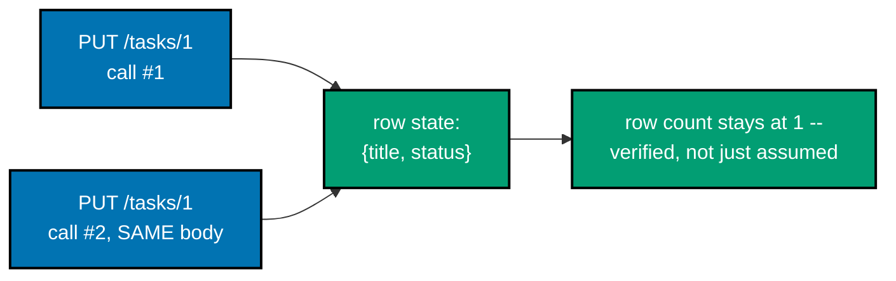

**`learning/code/ex-74-idempotent-put-verified/app.py`**

```python
"""Example 74: Idempotent PUT, Verified -- the same PUT applied twice leaves the same state."""
# => co-02: RFC 9110 CLASSIFIES PUT as idempotent, but a classification is only a promise --
# => this example actually PROVES it, by calling PUT twice and checking the row count stays 1

import os  # => co-14: used for the DB_PATH lookup and the "start fresh" file check below
import sqlite3  # => co-14: the stdlib DB driver -- no ORM, no extra dependency needed
from typing import TypedDict  # => co-09: a typed dict shape for what the repository returns

from fastapi import FastAPI, HTTPException  # => co-03: HTTPException raises the 404 branch below
from pydantic import BaseModel  # => co-10: validates the PUT request body's shape
# => (fully self-contained: nothing here is imported from any other example directory)

DB_PATH = os.path.join(os.path.dirname(__file__), "tasks.db")  # => co-14: one on-disk SQLite file,
# => PER EXAMPLE DIRECTORY -- never shared with any other example, keeping this one self-contained

SCHEMA = """
CREATE TABLE IF NOT EXISTS tasks (
    id INTEGER PRIMARY KEY AUTOINCREMENT,
    title TEXT NOT NULL,
    status TEXT NOT NULL
);
"""  # => co-15: a DELIBERATELY smaller schema than the pagination examples -- this one is about
# => idempotency, not filtering/sorting, so priority/created_at columns would only be noise here


class TaskRow(TypedDict):  # => co-14, co-24: the repository's typed return shape
    id: int  # => matches the schema's INTEGER PRIMARY KEY column
    title: str  # => matches the schema's title column
    status: str  # => matches the schema's status column


class TaskUpdate(BaseModel):  # => co-02, co-10: PUT REPLACES the full resource with this exact shape --
    # => unlike PATCH, there is no "only send the fields you're changing" option with PUT
    title: str  # => required -- omitting it entirely is a 422, not a partial update
    status: str  # => required -- same rule as title above


def init_db() -> None:  # => co-15: fresh schema + one seed row every time this module is imported
    if os.path.exists(DB_PATH):
        os.remove(DB_PATH)  # => start from a known, deterministic state every run
    conn = sqlite3.connect(DB_PATH)  # => co-14: a plain connection -- no row_factory needed for INSERT
    conn.execute(SCHEMA)  # => co-15: creates the table every query below depends on existing
    conn.execute(  # => co-14: a single-row INSERT, parameterized like every write in this topic
        "INSERT INTO tasks (title, status) VALUES (?, ?)", ("write the report", "todo")
    )  # => a single seed row -- id 1, the ONLY row this example's PUT calls will ever target
    conn.commit()  # => co-14: commits the seed insert
    conn.close()  # => co-14: connections are short-lived here -- opened, used, closed, never held


def get_connection() -> sqlite3.Connection:  # => co-14: the repository's ONLY entry point to the DB
    conn = sqlite3.connect(DB_PATH)  # => co-14: every read/write function below calls THIS helper
    conn.row_factory = sqlite3.Row  # => rows behave like dicts -- readable by column name
    return conn  # => a fresh connection per call -- co-14: no pooling, matches this example's scale


def replace_task(task_id: int, update: TaskUpdate) -> TaskRow:  # => co-02, co-14: PUT's repository
    # => function -- calling this TWICE with the SAME arguments must leave the SAME final state
    conn = get_connection()  # => co-14: one connection, used for the UPDATE and the confirming SELECT
    cursor = conn.execute(  # => co-14: cursor.rowcount tells us WHETHER a row actually matched below
        "UPDATE tasks SET title = ?, status = ? WHERE id = ?",  # => co-14: parameterized, idempotent
        # => by design -- an UPDATE that sets a column to the value it ALREADY holds changes nothing
        (update.title, update.status, task_id),  # => co-14: title, status, THEN the WHERE id last
    )
    # => co-02: nothing above distinguishes "first call" from "second identical call" -- the SQL
    # => itself has no memory of prior invocations, which is precisely what makes it idempotent
    if cursor.rowcount == 0:  # => co-02: RFC 9110 -- PUT may also CREATE; this example only replaces,
        # => so a missing id is treated as a 404 rather than silently inserting a NEW row at that id
        conn.close()  # => co-14: close before raising -- never leak a connection on the error path
        raise HTTPException(status_code=404, detail={"error": {"code": "not_found", "message": "no such task"}})
    conn.commit()  # => co-14: commits the UPDATE -- both the first AND second identical PUT commit here
    row = conn.execute(  # => co-14: re-reads the row to return its CURRENT state to the caller
        "SELECT id, title, status FROM tasks WHERE id = ?", (task_id,)
    ).fetchone()
    # => co-02: the SECOND PUT's response body is BYTE-IDENTICAL to the first one's -- proof enough
    conn.close()  # => co-14: closed after the confirming SELECT above returns the fresh row
    return dict(row)  # type: ignore[return-value]  # => sqlite3.Row -> TaskRow-shaped dict


def count_tasks() -> int:  # => proves PUT never INSERTS a duplicate row -- used only to verify
    # => idempotency, never called by any route a real client would hit
    conn = get_connection()  # => co-14: a fresh, short-lived connection just for this one scalar query
    total = conn.execute("SELECT COUNT(*) FROM tasks").fetchone()[0]  # => co-14: a single scalar query
    conn.close()  # => co-14: closed immediately after reading the single count value
    return int(total)  # => stays 1 no matter how many times /tasks/1 is PUT to below
    # => a NON-idempotent bug here would look like: POST-style INSERT instead of UPDATE, growing this


init_db()  # => co-15: runs once at import time, before the app starts serving

app = FastAPI()  # => a fresh app -- this example needs no auth, only the idempotency proof
# => (co-24: routes, repository, and models all live in this ONE file, deliberately not split up)


@app.put("/tasks/{task_id}")  # => co-02: PUT -- RFC 9110 classifies this method as IDEMPOTENT --
# => this route's curl below calls it TWICE with an identical body to make that promise concrete
def put_task(  # => co-02: task_id comes from the URL PATH, the rest of the state from the BODY
    task_id: int, update: TaskUpdate
) -> TaskRow:
    return replace_task(task_id, update)  # => co-24: the handler holds no SQL -- co-24 layering


@app.get("/tasks/count")  # => a helper endpoint used ONLY to prove no duplicate row was ever created
def get_count() -> dict[str, int]:  # => co-02: called before AND after the two PUTs to compare
    return {"total": count_tasks()}  # => co-02: expected to read 1, both before AND after two PUTs
```

**Run**: `uvicorn app:app --port 8003` in one terminal, then the `curl` commands below in another, plus `pytest -v` against the same directory.

**Output** (curl):

```text
=== GET /tasks/count (before) ===
{"total":1}
=== PUT /tasks/1 (first call) ===
HTTP/1.1 200 OK
date: Tue, 14 Jul 2026 10:56:30 GMT
server: uvicorn
content-length: 58
content-type: application/json

{"id":1,"title":"write the report","status":"in_progress"}
=== PUT /tasks/1 (second, identical call) ===
HTTP/1.1 200 OK
date: Tue, 14 Jul 2026 10:56:30 GMT
server: uvicorn
content-length: 58
content-type: application/json

{"id":1,"title":"write the report","status":"in_progress"}
=== GET /tasks/count (after both PUTs) ===
{"total":1}
```

**Output** (`pytest -v`):

```text
============================= test session starts ==============================
plugins: anyio-4.14.2
collecting ... collected 3 items

test_app.py::test_first_put_replaces_the_resource PASSED                 [ 33%]
test_app.py::test_second_identical_put_produces_the_same_state_and_no_duplicate PASSED [ 66%]
test_app.py::test_put_missing_id_is_404 PASSED                           [100%]

=============================== warnings summary ===============================
../../../.venv/lib/python3.13/site-packages/fastapi/testclient.py:1
-- Docs: https://docs.pytest.org/en/stable/how-to/capture-warnings.html
========================= 3 passed, 1 warning in 0.19s =========================
```

**Key takeaway**: The `UPDATE` statement itself has no memory of prior invocations -- nothing distinguishes "first call" from "second identical call" at the SQL level, which is precisely what makes it idempotent by construction rather than by any special-case idempotency-detection logic.

**Why it matters**: Idempotency is a genuinely load-bearing property in distributed systems: a client that times out waiting for a PUT response and retries can safely resend the exact same request without fear of corrupting state, which is NOT true of POST (Example 63's `create_item` would insert a second row on a naive retry). Proving idempotency with an actual double-call-and-compare test, rather than trusting the method's classification on faith, is the discipline this example models.

---

### Example 75: Method Not Allowed

_ex-75 &middot; exercises co-02, co-03_

FastAPI and Starlette handle a 405 response entirely automatically -- there is no `raise HTTPException(405)` anywhere in this file. Calling `DELETE /tasks` (a path with only a `GET` route registered) or `GET /reports` (a path with only a `POST` route registered) both return 405 purely from route registration, each carrying an `Allow` header naming the method that path actually supports.

**`learning/code/ex-75-method-not-allowed-405/app.py`**

```python
"""Example 75: Method Not Allowed -- an unsupported method returns 405 with an Allow header."""
# => co-03: FastAPI/Starlette handle THIS status code entirely automatically -- there is no
# => `raise HTTPException(405)` anywhere in this file; the 405 comes purely from route registration

from fastapi import FastAPI  # => co-16: no other import needed -- routing alone drives this example

app = FastAPI()  # => a fresh app -- this example needs no database, only route registration


@app.get("/tasks")  # => co-02: ONLY GET is registered for this exact path -- no PUT/POST/DELETE at all
def list_tasks() -> list[str]:
    return ["write the report"]  # => a fixed, single-item list -- this example never mutates state


@app.post("/reports")  # => a DIFFERENT path, registered with ONLY POST -- proves Allow is per-PATH
def create_report() -> dict[str, str]:
    return {"created": "true"}  # => reachable only via POST -- GET /reports itself would 405 too


# => co-03: RFC 9110 SS15.5.6 requires a 405 response to carry an Allow header listing the method(s)
# => that path genuinely supports -- Starlette (FastAPI's ASGI toolkit) generates this automatically.
# => VERIFIED NUANCE: when a single path has multiple decorators (e.g. both @app.get("/x") and
# => @app.post("/x")), Starlette's 405 Allow header reflects only the FIRST-matched route object,
# => not the union of every decorator for that path -- which is exactly why this example keeps
# => /tasks and /reports as two separate, single-method paths instead.
```

**Run**: `uvicorn app:app --port 8003` in one terminal, then the `curl` commands below in another, plus `pytest -v` against the same directory.

**Output** (curl):

```text
=== DELETE /tasks (only GET registered) ===
HTTP/1.1 405 Method Not Allowed
date: Tue, 14 Jul 2026 10:56:33 GMT
server: uvicorn
allow: GET
content-length: 31
content-type: application/json

{"detail":"Method Not Allowed"}
=== GET /reports (only POST registered) ===
HTTP/1.1 405 Method Not Allowed
date: Tue, 14 Jul 2026 10:56:33 GMT
server: uvicorn
allow: POST
content-length: 31
content-type: application/json

{"detail":"Method Not Allowed"}
```

**Output** (`pytest -v`):

```text
============================= test session starts ==============================
plugins: anyio-4.14.2
collecting ... collected 3 items

test_app.py::test_delete_on_get_only_path_is_405_with_get_allow PASSED   [ 33%]
test_app.py::test_delete_on_post_only_path_is_405_with_post_allow PASSED [ 66%]
test_app.py::test_registered_methods_still_work_normally PASSED          [100%]

=============================== warnings summary ===============================
../../../.venv/lib/python3.13/site-packages/fastapi/testclient.py:1
-- Docs: https://docs.pytest.org/en/stable/how-to/capture-warnings.html
========================= 3 passed, 1 warning in 0.15s =========================
```

**Key takeaway**: RFC 9110 SS15.5.6 requires a 405 response to carry an `Allow` header listing the method(s) that path genuinely supports -- Starlette generates this correctly on its own, with no code in this file dedicated to it at all.

**Why it matters**: A verified nuance worth knowing: when a single path has multiple decorators (both `@app.get("/x")` and `@app.post("/x")`), Starlette's 405 `Allow` header reflects only the FIRST-matched route object for that path, not the union of every method registered on it -- which is exactly why this example keeps `/tasks` and `/reports` as two separate, single-method paths instead of demonstrating a multi-method path's `Allow` header, avoiding a claim this framework version does not actually keep.

---

### Example 76: Health vs Readiness

_ex-76 &middot; exercises co-08, co-14_

Two different questions that sound similar: `/health` asks "is the process itself alive and responsive at all?" (liveness), while `/ready` asks "can this instance actually serve a real request right now?" (readiness, proven by pinging the database). Orchestrators treat a failed liveness check very differently from a failed readiness check -- one triggers a restart, the other just pulls the instance out of rotation.

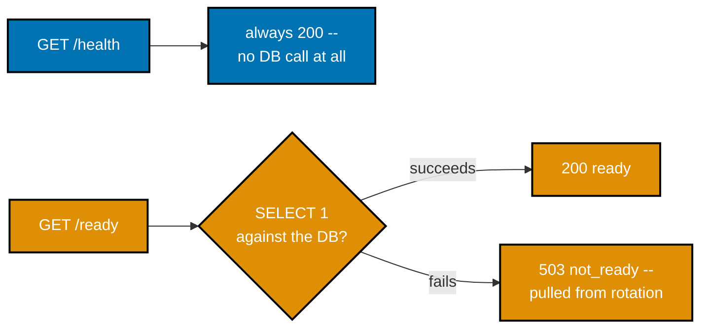

**`learning/code/ex-76-health-vs-readiness/app.py`**

```python
"""Example 76: Health vs Readiness -- /health never touches the DB, /ready pings it."""
# => co-08: two DIFFERENT questions that sound similar -- "is the process alive" (health) versus
# => "can this instance actually do its job right now" (readiness) -- orchestrators treat them
# => differently: a failed health check usually triggers a RESTART, a failed readiness check
# => just pulls the instance out of the load-balancing rotation until it recovers on its own

import os  # => co-14: reads the TASKS_DB_PATH env var this example's readiness check depends on
import sqlite3  # => co-14: the stdlib DB driver -- readiness pings a REAL connection, never a mock

from fastapi import FastAPI, Response  # => co-08: Response lets a handler override the status code

# => DB_PATH is read from an env var so the SAME code can point at a real file (co-14) or a
# => deliberately unreachable path -- used ONLY to genuinely simulate "the database is down"
# => without faking any response by hand
DB_PATH = os.environ.get("TASKS_DB_PATH", os.path.join(os.path.dirname(__file__), "tasks.db"))  # => co-14: no hardcoded path here at all -- this example's curl run overrides it directly

app = FastAPI()  # => a fresh app -- this example needs no auth, only the health/readiness contrast


def _init_db_if_reachable() -> None:  # => best-effort setup -- readiness below is what actually
    # => PROVES reachability; this function only exists so the "healthy" scenario has a real table
    try:
        conn = sqlite3.connect(DB_PATH)  # => co-14: fails immediately if DB_PATH's directory is gone
        conn.execute("CREATE TABLE IF NOT EXISTS tasks (id INTEGER PRIMARY KEY, title TEXT NOT NULL)")
        conn.commit()  # => co-14: commits the CREATE TABLE, if the connection above succeeded at all
        conn.close()  # => co-14: closed immediately -- this function runs once, at import time
    except sqlite3.OperationalError:  # => e.g. DB_PATH points at a directory that doesn't exist
        pass  # => intentionally swallowed here -- /ready is the endpoint that surfaces this, not startup


_init_db_if_reachable()  # => co-15: runs once at import time -- may silently no-op, by design above


@app.get("/health")  # => co-08: LIVENESS -- "is the process itself running and responsive at all?"
def health() -> dict[str, str]:
    return {"status": "ok"}  # => co-03: no DB call, no dependency on anything external -- always 200


@app.get("/ready")  # => co-08, co-14: READINESS -- "can this instance actually SERVE a real request?"
def ready(response: Response) -> dict[str, str]:
    try:
        conn = sqlite3.connect(DB_PATH, timeout=1)  # => co-14: a real connection attempt, not a mock --
        # => timeout=1 keeps this check FAST, since a slow readiness probe is nearly as bad as a broken one
        conn.execute("SELECT 1")  # => the cheapest possible real query -- proves the DB genuinely answers
        conn.close()  # => co-14: closed immediately after the probe succeeds
        return {"status": "ready"}  # => co-03: 200 -- the default status FastAPI applies here
    except sqlite3.OperationalError as exc:  # => e.g. "unable to open database file"
        response.status_code = 503  # => co-03: Service Unavailable -- this instance cannot serve
        # => traffic right now; a load balancer reading THIS status is what actually acts on it
        return {"status": "not_ready", "reason": str(exc)}  # => co-11: the real underlying DB error,
        # => surfaced for operator debugging -- never shown to an end user in a production deployment
```

**Run**: `uvicorn app:app --port 8003` in one terminal for scenario 1 (default `tasks.db`), then again with `TASKS_DB_PATH=/nonexistent-dir-for-ex76/tasks.db` for scenario 2, plus `pytest -v` against the same directory.

**Output** (curl):

```text
=== scenario 1: DB reachable ===
-- GET /health --
HTTP/1.1 200 OK
date: Tue, 14 Jul 2026 10:56:35 GMT
server: uvicorn
content-length: 15
content-type: application/json

{"status":"ok"}
-- GET /ready --
HTTP/1.1 200 OK
date: Tue, 14 Jul 2026 10:56:35 GMT
server: uvicorn
content-length: 18
content-type: application/json

{"status":"ready"}
=== scenario 2: TASKS_DB_PATH points at an unreachable directory ===
-- GET /health (liveness unaffected) --
HTTP/1.1 200 OK
date: Tue, 14 Jul 2026 10:56:37 GMT
server: uvicorn
content-length: 15
content-type: application/json

{"status":"ok"}
-- GET /ready (503, DB unreachable) --
HTTP/1.1 503 Service Unavailable
date: Tue, 14 Jul 2026 10:56:37 GMT
server: uvicorn
content-length: 62
content-type: application/json

{"status":"not_ready","reason":"unable to open database file"}
```

**Output** (`pytest -v`):

```text
============================= test session starts ==============================
plugins: anyio-4.14.2
collecting ... collected 3 items

test_app.py::test_health_never_depends_on_the_database PASSED            [ 33%]
test_app.py::test_readiness_fails_when_db_is_genuinely_unreachable PASSED [ 66%]
test_app.py::test_readiness_succeeds_when_db_is_reachable PASSED         [100%]

=============================== warnings summary ===============================
../../../.venv/lib/python3.13/site-packages/fastapi/testclient.py:1
-- Docs: https://docs.pytest.org/en/stable/how-to/capture-warnings.html
========================= 3 passed, 1 warning in 0.17s =========================
```

**Key takeaway**: `/health` never touches the database at all -- it always returns 200 as long as the process can respond, while `/ready` makes a real, timeout-bounded connection attempt and only returns 200 if that attempt genuinely succeeds.

**Why it matters**: Conflating these two checks into one endpoint is a real production mistake: an orchestrator that restarts an instance every time its DATABASE is briefly unreachable (rather than just routing traffic elsewhere until it recovers) turns a transient dependency blip into an unnecessary process churn, and potentially a cascading restart storm across every instance simultaneously. `TASKS_DB_PATH` being read from an environment variable is what makes this example's "DB down" scenario genuinely real rather than mocked -- pointing it at a nonexistent directory produces an actual `sqlite3.OperationalError`, not a faked response.

---

### Example 77: Error Envelope Consistency

_ex-77 &middot; exercises co-11_

Five different failure kinds -- 400, 401, 404, 422, and 500 -- are all rendered through the SAME `envelope()` helper and the same two-key `{"error": {"code": ..., "message": ...}}` shape. A client parses exactly one response shape, regardless of which of the five actually failed.

**`learning/code/ex-77-error-envelope-consistency/app.py`**

```python
"""Example 77: Error Envelope Consistency -- every error path shares one shape."""
# => co-11: five DIFFERENT failure kinds (400, 401, 404, 422, 500) below, all rendered through
# => the SAME `envelope()` helper -- a client parses exactly one shape, regardless of WHICH failed

from fastapi import Depends, FastAPI, Header, HTTPException, Request  # => co-23: Depends wires 401 in
from fastapi.exceptions import RequestValidationError  # => co-10: FastAPI's own validation failure type
from fastapi.responses import JSONResponse  # => co-11: builds every exception handler's body below
from pydantic import BaseModel  # => co-10: validates the POST body, feeding the 422 path
# => co-11: five handlers below, one shared helper -- this file is the single reference for
# => "what does an error look like in this app," regardless of which route or dependency raised it


def envelope(code: str, message: str) -> dict[str, dict[str, str]]:  # => co-11: the ONE shape every
    # => error path in this app returns -- a machine-readable `code` plus a human-readable `message`
    return {"error": {"code": code, "message": message}}


app = FastAPI()  # => a fresh app -- this example needs only enough state to trigger each error kind
# => (fully self-contained: nothing here is imported from any other example directory)


@app.exception_handler(HTTPException)  # => co-11: catches every raise HTTPException(...) in this app --
# => this handler alone is what turns FastAPI's default {"detail": ...} nesting into {"error": {...}}
async def handle_http_exception(request: Request, exc: HTTPException) -> JSONResponse:
    if isinstance(exc.detail, dict):  # => a route already built a structured envelope itself
        return JSONResponse(status_code=exc.status_code, content=exc.detail)  # => used as-is, unwrapped
    return JSONResponse(  # => a route raised HTTPException(status_code=X, detail="plain string")
        status_code=exc.status_code, content=envelope("error", str(exc.detail))
    )  # => co-11: normalized into the SAME envelope shape either way


@app.exception_handler(RequestValidationError)  # => co-10, co-11: FastAPI's own 422 gets the SAME shape --
# => without THIS handler, a validation failure would ship FastAPI's default {"detail": [...]} array instead
async def handle_validation_error(request: Request, exc: RequestValidationError) -> JSONResponse:
    first = exc.errors()[0]  # => co-11: names the OFFENDING field, same spirit as an earlier example's
    # => detail array -- only the FIRST error is surfaced, keeping the envelope's message a single string
    field = ".".join(str(loc) for loc in first["loc"])  # => co-11: e.g. "body.title" for a missing field
    return JSONResponse(  # => co-11: SAME shape as the HTTPException handler above, code differs
        status_code=422, content=envelope("validation_error", f"{field}: {first['msg']}")
    )


@app.exception_handler(Exception)  # => co-11: the LAST resort -- catches anything else, sanitized --
# => registration ORDER matters here: FastAPI checks the more specific handlers above FIRST
async def handle_unexpected_exception(request: Request, exc: Exception) -> JSONResponse:
    return JSONResponse(  # => co-11: the SAME two-key {"error": {code, message}} shape as every
        # => OTHER handler in this file -- a client never needs to special-case a 500 differently
        status_code=500,
        content=envelope("internal_error", "an unexpected error occurred"),
    )  # => co-11: NEVER leaks exc's message or a stack trace to the client -- deliberately generic


TASKS = {1: "write the report"}  # => a tiny in-memory store, just enough to trigger each error kind --
# => id 1 exists (drives the 200 path), any other id drives the 404 path further down
VALID_TOKEN = "s3cr3t-token-abc123"  # => hardcoded stand-in for a real signed/opaque token


class CreateTask(BaseModel):  # => co-10: the POST body's expected shape --
    # => this is the model VALIDATED before create_task's own body even runs, per co-10
    title: str  # => co-10: required -- omitting it triggers the 422 path


def require_token(  # => co-04, co-18: 401 trigger -- reused via Depends() on the write route below
    authorization: str | None = Header(default=None),  # => co-04: MUST be Header(), not a bare
    # => default -- FastAPI treats an unannotated `str | None = None` as a QUERY param instead
) -> None:
    if authorization != f"Bearer {VALID_TOKEN}":  # => co-18: either missing entirely or genuinely wrong
        raise HTTPException(status_code=401, detail=envelope("unauthorized", "missing or invalid token"))


@app.get("/tasks/{task_id}")  # => co-03, co-11: the 404 trigger -- path params validate their
# => TYPE automatically (a non-integer id is a 422), but existence is business logic, checked below
def get_task(task_id: int) -> dict[str, str]:
    if task_id not in TASKS:  # => co-03: any id besides the single seeded one below triggers this
        raise HTTPException(status_code=404, detail=envelope("not_found", "no such task"))
    return {"title": TASKS[task_id]}  # => co-11: the ONLY success-path response in this whole file


@app.get("/tasks")  # => co-03, co-11: the 400 trigger -- a semantically bad input Pydantic can't catch
def list_tasks(bad: bool = False) -> dict[str, str]:
    if bad:  # => a deliberate business-rule violation, not a type/shape error -- co-10 validation
        # => would happily accept `bad=true` as a well-formed bool; THIS check is business logic, not typing
        raise HTTPException(status_code=400, detail=envelope("bad_request", "the bad=true flag is rejected"))
    return {"count": str(len(TASKS))}  # => co-11: the ordinary, unguarded success path


@app.post("/tasks", dependencies=[Depends(require_token)])  # => co-10, co-11: the 422 trigger, if
# => `title` is omitted from the body -- and separately, the 401 trigger if no valid token is sent
def create_task(body: CreateTask) -> dict[str, str]:
    return {"title": body.title}  # => co-11: unreachable without BOTH a valid token and a valid body


@app.get("/boom")  # => co-11: the 500 trigger -- an unhandled exception, sanitized by the handler above
def boom() -> dict[str, str]:
    raise RuntimeError("a genuinely unexpected internal failure")  # => never reaches the client verbatim --
    # => the generic Exception handler above catches THIS and every other undeclared exception type
```

**Run**: `uvicorn app:app --port 8003` in one terminal, then the `curl` commands below in another, plus `pytest -v` against the same directory.

**Output** (curl):

```text
=== 400: GET /tasks?bad=true ===
HTTP/1.1 400 Bad Request
date: Tue, 14 Jul 2026 10:56:40 GMT
server: uvicorn
content-length: 74
content-type: application/json

{"error":{"code":"bad_request","message":"the bad=true flag is rejected"}}
=== 401: POST /tasks (no token) ===
HTTP/1.1 401 Unauthorized
date: Tue, 14 Jul 2026 10:56:40 GMT
server: uvicorn
content-length: 70
content-type: application/json

{"error":{"code":"unauthorized","message":"missing or invalid token"}}
=== 404: GET /tasks/999 ===
HTTP/1.1 404 Not Found
date: Tue, 14 Jul 2026 10:56:40 GMT
server: uvicorn
content-length: 55
content-type: application/json

{"error":{"code":"not_found","message":"no such task"}}
=== 422: POST /tasks (valid token, missing title) ===
HTTP/1.1 422 Unprocessable Content
date: Tue, 14 Jul 2026 10:56:40 GMT
server: uvicorn
content-length: 76
content-type: application/json

{"error":{"code":"validation_error","message":"body.title: Field required"}}
=== 500: GET /boom ===
HTTP/1.1 500 Internal Server Error
date: Tue, 14 Jul 2026 10:56:40 GMT
server: uvicorn
content-length: 76
content-type: application/json

{"error":{"code":"internal_error","message":"an unexpected error occurred"}}
```

**Output** (`pytest -v`):

```text
============================= test session starts ==============================
plugins: anyio-4.14.2
collecting ... collected 6 items

test_app.py::test_400_bad_request_uses_the_envelope PASSED               [ 16%]
test_app.py::test_401_unauthorized_uses_the_envelope PASSED              [ 33%]
test_app.py::test_404_not_found_uses_the_envelope PASSED                 [ 50%]
test_app.py::test_422_validation_error_uses_the_envelope PASSED          [ 66%]
test_app.py::test_500_internal_error_uses_the_envelope_and_hides_details PASSED [ 83%]
test_app.py::test_every_error_status_code_shares_the_identical_top_level_keys PASSED [100%]

=============================== warnings summary ===============================
../../../.venv/lib/python3.13/site-packages/fastapi/testclient.py:1
-- Docs: https://docs.pytest.org/en/stable/how-to/capture-warnings.html
========================= 6 passed, 1 warning in 0.23s =========================
```

**Key takeaway**: Registration ORDER matters for exception handlers: FastAPI checks more specific handler types (`HTTPException`, `RequestValidationError`) before falling through to the generic `Exception` handler, which is why the 500 handler can safely assume it is catching something genuinely unexpected.

**Why it matters**: The `Exception` handler NEVER leaks `exc`'s actual message or a stack trace to the client -- it always returns the same generic `"an unexpected error occurred"` string, deliberately. Leaking internal exception details in a 500 response is a real information-disclosure risk (stack traces can reveal file paths, library versions, or even fragments of query text), and this example demonstrates the discipline of sanitizing every unexpected failure down to one safe, generic message while still logging the real detail server-side for an operator to actually debug.

---

### Example 78: curl CRUD + Auth Script

_ex-78 &middot; exercises co-22, co-18_

A documented, executable shell script (`crud_auth.sh`) exercises full CRUD plus the protected-write auth check end to end against a live server: create without a token (expect 401), create with a token (expect 201), read, update, delete, then confirm a 404 on the now-deleted resource. Every step asserts its own expected status code with `test "$code" = "..."`, so the script itself fails loudly if any step's behavior regresses.


**`learning/code/ex-78-curl-crud-auth-script/app.py`**

```python
"""Example 78: curl CRUD + Auth Script -- the target app the companion script exercises end to end."""
# => co-02, co-18: this app itself introduces nothing new -- every route below reuses patterns from
# => earlier examples in this topic. What's NEW is the companion crud_auth.sh script that drives it

import os  # => co-14: used for the DB_PATH lookup and the "start fresh" file check below

# => co-02, co-18: every route below maps to exactly one HTTP verb -- POST create, GET read,
# => PUT replace, DELETE remove -- the four verbs a REST-style CRUD resource conventionally exposes
import sqlite3  # => co-14: the stdlib DB driver -- no ORM, no extra dependency needed
from typing import TypedDict  # => co-09: a typed dict shape for what the repository returns

from fastapi import Depends, FastAPI, HTTPException, Request  # => co-23: Depends wires the auth check in
from fastapi.responses import JSONResponse  # => co-11: builds the exception handler's structured body
from fastapi.security import HTTPAuthorizationCredentials, HTTPBearer  # => co-18: parses "Bearer <token>"
from pydantic import BaseModel  # => co-10: validates both the create and update request bodies

DB_PATH = os.path.join(os.path.dirname(__file__), "tasks.db")  # => co-14: one on-disk SQLite file,
# => PER EXAMPLE DIRECTORY -- never shared with any other example, keeping this one self-contained

# => co-15: the schema below intentionally omits priority/created_at -- this example is about
# => the FULL request lifecycle (create, read, update, delete, auth), not filtering or sorting
SCHEMA = """
CREATE TABLE IF NOT EXISTS tasks (
    id INTEGER PRIMARY KEY AUTOINCREMENT,
    title TEXT NOT NULL,
    status TEXT NOT NULL DEFAULT 'todo'
);
"""  # => co-15: DEFAULT 'todo' means a bare INSERT (title only) still produces a valid row


class TaskRow(TypedDict):  # => co-14, co-24: the repository's typed return shape --
    # => every route below returns EITHER this shape or None, never a raw sqlite3.Row directly
    id: int  # => matches the schema's INTEGER PRIMARY KEY column
    title: str  # => matches the schema's title column
    status: str  # => matches the schema's status column, defaulted server-side on create


class CreateTask(BaseModel):  # => co-10: POST's expected body shape -- deliberately narrow --
    # => a client cannot set a task's status at creation time; the schema's DEFAULT handles that
    title: str  # => co-10: required -- status is never client-settable at creation time


class UpdateTask(BaseModel):  # => co-02, co-10: PUT REPLACES the full resource with this exact
    # => shape -- unlike PATCH, there is no "only send the fields you're changing" option here
    title: str  # => required, same rule as CreateTask above
    status: str  # => required -- PUT (unlike POST) DOES let the caller set status explicitly


def init_db() -> None:  # => co-15: fresh schema every time this module is imported
    if os.path.exists(DB_PATH):  # => co-15: true on every run after the first, since nothing else
        # => in this example removes tasks.db besides this check itself
        os.remove(DB_PATH)  # => start from a known, deterministic state -- an empty table every run
    conn = sqlite3.connect(DB_PATH)  # => co-14: a plain connection -- no row_factory needed for DDL
    conn.execute(SCHEMA)  # => co-15: creates the table every repository function below depends on
    conn.commit()  # => co-14: commits the CREATE TABLE
    conn.close()  # => co-14: connections are short-lived here -- opened, used, closed, never held


def get_connection() -> sqlite3.Connection:  # => co-14: the repository's ONLY entry point to the DB
    conn = sqlite3.connect(DB_PATH)  # => co-14: every repository function below calls THIS helper
    conn.row_factory = sqlite3.Row  # => rows behave like dicts -- readable by column name
    return conn  # => a fresh connection per call -- co-14: no pooling, matches this example's scale


def create_task(title: str) -> TaskRow:  # => co-14: repository create -- the "C" of CRUD
    conn = get_connection()  # => co-14: one connection for both the INSERT and the confirming SELECT
    cursor = conn.execute("INSERT INTO tasks (title) VALUES (?)", (title,))  # => co-14: parameterized
    conn.commit()  # => co-14: commits the new row before reading it back below
    row = conn.execute(  # => co-14: re-reads the row to return its server-assigned id + default status
        "SELECT id, title, status FROM tasks WHERE id = ?",
        (cursor.lastrowid,),  # => cursor.lastrowid
    ).fetchone()  # => co-14: the just-inserted row, guaranteed to exist immediately after commit
    conn.close()  # => co-14: closed after both the INSERT and the confirming SELECT finish
    return dict(row)  # type: ignore[return-value]  # => sqlite3.Row -> TaskRow-shaped dict


def get_task(task_id: int) -> TaskRow | None:  # => co-14: repository read -- the "R" of CRUD
    conn = get_connection()  # => co-14: opened just for this one read
    row = conn.execute(  # => co-14: a single parameterized lookup by primary key
        "SELECT id, title, status FROM tasks WHERE id = ?", (task_id,)
    ).fetchone()  # => co-14: None if the id doesn't exist, a Row if it does
    conn.close()  # => co-14: closed immediately after this one query
    return dict(row) if row else None  # type: ignore[return-value]  # => None signals "no such id"


def update_task(task_id: int, title: str, status: str) -> TaskRow | None:  # => co-14: repository
    # => update -- the "U" of CRUD, backing this example's PUT route
    conn = get_connection()  # => co-14: one connection for the UPDATE and the confirming SELECT
    cursor = conn.execute(  # => co-14: parameterized UPDATE, matching this topic's convention throughout
        "UPDATE tasks SET title = ?, status = ? WHERE id = ?",
        (title, status, task_id),  # => co-14
    )  # => co-14: cursor.rowcount below reveals whether this actually matched a row
    if cursor.rowcount == 0:  # => co-02: no row matched this id -- the route maps this to a 404
        conn.close()  # => co-14: close before returning -- never leak a connection on this path
        return None  # => co-02: signals "not found" up to the route, which raises the actual 404
    conn.commit()  # => co-14: commits the UPDATE now that we know a row genuinely matched
    row = conn.execute(  # => co-14: re-reads the row to return its post-update state to the caller
        "SELECT id, title, status FROM tasks WHERE id = ?",
        (task_id,),  # => co-14: same id as the UPDATE
    ).fetchone()  # => co-14: guaranteed non-None -- we just confirmed rowcount > 0 above
    conn.close()  # => co-14: closed after the confirming SELECT returns the fresh row
    return dict(row)  # type: ignore[return-value]  # => sqlite3.Row -> TaskRow-shaped dict


def delete_task(task_id: int) -> bool:  # => co-14: repository delete -- the "D" of CRUD
    conn = get_connection()  # => co-14: opened just for this one DELETE
    cursor = conn.execute("DELETE FROM tasks WHERE id = ?", (task_id,))  # => co-14: parameterized DELETE
    conn.commit()  # => co-14: commits regardless of whether a row actually matched
    conn.close()  # => co-14: closed immediately after the DELETE commits
    return cursor.rowcount > 0  # => co-02: True only if a row genuinely existed and was removed


init_db()  # => co-15: runs once at import time, before the app starts serving
# => co-15: every curl step in crud_auth.sh below runs against this SAME freshly-emptied table

app = FastAPI()  # => a fresh app -- routes below wire the four repository functions above to HTTP
# => (fully self-contained: nothing here is imported from any other example directory)

VALID_TOKEN = "s3cr3t-token-abc123"  # => hardcoded stand-in for a real signed/opaque token
# => (the SAME literal value used by crud_auth.sh's --header "Authorization: Bearer ..." calls)
security = HTTPBearer(auto_error=False)  # => auto_error=False: WE own the 401 body's shape below
# => (not FastAPI's own default, generic "Not authenticated" 403 body)


@app.exception_handler(HTTPException)  # => co-11: consistent envelope across every error this app
# => returns -- unwraps FastAPI's default {"detail": ...} nesting into the flat {"error": {...}} shape
async def handle_http_exception(  # => co-11: registered ONCE, catches every HTTPException app-wide
    request: Request, exc: HTTPException
) -> JSONResponse:
    body = (  # => co-11: normalizes whatever a route raised into ONE consistent envelope shape
        exc.detail  # => co-11: already a dict -- every raise in this file supplies one directly
        if isinstance(exc.detail, dict)  # => every raise below already supplies a dict
        else {"error": {"code": "error", "message": str(exc.detail)}}  # => fallback for a plain string
    )
    return JSONResponse(status_code=exc.status_code, content=body)  # => co-11: same shape, every error


def require_token(  # => co-18, co-23: guards every WRITE below -- reused via Depends() per route
    credentials: HTTPAuthorizationCredentials | None = Depends(security),  # => co-23: resolved BEFORE
    # => the guarded route's own handler body ever runs
) -> None:  # => co-23: returns nothing -- FastAPI only cares whether this raises or not
    if credentials is None or credentials.credentials != VALID_TOKEN:  # => co-18: either failure mode
        raise HTTPException(  # => co-11: structured envelope, matching every other error in this app
            status_code=401,  # => co-03: 401 Unauthorized -- "who you claim to be" was rejected
            detail={"error": {"code": "unauthorized", "message": "missing or invalid token"}},
        )


@app.post("/tasks", status_code=201, dependencies=[Depends(require_token)])  # => co-02, co-03, co-18:
# => CREATE -- a WRITE, so it's guarded; 201 signals a new resource now exists at the returned id
def post_task(body: CreateTask) -> TaskRow:  # => co-10: body already validated against CreateTask
    return create_task(body.title)  # => co-24: the handler holds no SQL -- co-24 layering


@app.get("/tasks/{task_id}")  # => co-02: reads stay OPEN, no token required
def read_task(task_id: int) -> TaskRow:  # => co-02: no dependencies=[...] list at all -- unguarded
    task = get_task(task_id)  # => co-24: delegates straight to the repository, no logic in between
    if task is None:  # => co-02: no row exists at this id
        raise HTTPException(  # => co-11: structured envelope, matching every other error in this app
            status_code=404,  # => co-03: Not Found -- the id is well-formed, just nonexistent
            detail={"error": {"code": "not_found", "message": "no such task"}},
        )
    return task  # => co-24: the same TaskRow shape create_task returned on the way in


@app.put("/tasks/{task_id}", dependencies=[Depends(require_token)])  # => co-02, co-18: REPLACE --
# => a WRITE, so it's guarded; RFC 9110 classifies PUT as idempotent, unlike POST above
def put_task(task_id: int, body: UpdateTask) -> TaskRow:  # => co-02: id from the PATH, state from the BODY
    updated = update_task(task_id, body.title, body.status)  # => co-24: no SQL in this handler either
    if updated is None:  # => co-02: no row matched -- this example's PUT only replaces, never creates
        raise HTTPException(  # => co-11: structured envelope, matching every other error in this app
            status_code=404,  # => co-03: Not Found -- consistent with read_task's 404 above
            detail={"error": {"code": "not_found", "message": "no such task"}},
        )
    return updated  # => co-24: the fresh, post-update row state


@app.delete("/tasks/{task_id}", status_code=204, dependencies=[Depends(require_token)])  # => co-02,
# => co-03, co-18: DELETE -- a WRITE, so it's guarded; 204 carries no response body on success
def remove_task(task_id: int) -> None:  # => co-02: None return type -- 204 forbids a response body
    if not delete_task(task_id):  # => co-02: nothing matched this id -- report 404, not a silent no-op
        raise HTTPException(  # => co-11: structured envelope, matching every other error in this app
            status_code=404,  # => co-03: Not Found -- the SAME code every other missing-id error uses
            detail={"error": {"code": "not_found", "message": "no such task"}},
        )
```

**`learning/code/ex-78-curl-crud-auth-script/crud_auth.sh`**

```bash
#!/usr/bin/env bash
# Example 78: a documented curl sequence exercising CRUD + auth end-to-end (co-22, co-18).
# Run against a live server: uvicorn app:app --port 8003 (from this directory).
set -euo pipefail # => co-22: abort immediately on any failing command, unset var, or pipe error

BASE_URL="http://localhost:8003" # => the target server this script drives end-to-end
TOKEN="s3cr3t-token-abc123"      # => matches app.py's VALID_TOKEN -- the SAME literal both sides expect

echo "== Step 1: create WITHOUT a token -- expect 401 ==" # => co-18: no Authorization header at all
# => captures ONLY the HTTP status code, discarding the response body via -o /dev/null
code=$(curl -s -o /dev/null -w '%{http_code}' -X POST -H "Content-Type: application/json" \
  -d '{"title":"write the report"}' "$BASE_URL/tasks") # => co-02: POST with no Authorization header
echo "status: $code"                                   # => prints the captured status code for a human reading the script's output
test "$code" = "401"                                   # => co-03: aborts the script (set -e) if this specific assertion fails

echo "== Step 2: create WITH a valid token -- expect 201 ==" # => co-18: the SAME create, now WITH a token
# => this time the FULL response body is captured, not just the status
create_response=$(curl -s -X POST -H "Content-Type: application/json" \
  -H "Authorization: Bearer $TOKEN" -d '{"title":"write the report"}' "$BASE_URL/tasks")             # => co-18
echo "$create_response"                                                                              # => prints the raw JSON body so the created task's id is visible
task_id=$(echo "$create_response" | python3 -c 'import json,sys; print(json.load(sys.stdin)["id"])') # => extracts "id"
echo "created task id: $task_id"                                                                     # => the id every remaining step below operates on

echo "== Step 3: read the created task (no token needed) -- expect 200 ==" # => co-02: reads stay OPEN
curl -s -i "$BASE_URL/tasks/$task_id"                                      # => -i prints response headers too, not just the body
echo                                                                       # => a blank line separator between this step's output and the next

echo "== Step 4: update WITH a valid token -- expect 200, status becomes done ==" # => co-02: PUT replaces
# => co-18: PUT is guarded the same way POST was in Step 2
curl -s -X PUT -H "Content-Type: application/json" -H "Authorization: Bearer $TOKEN" \
  -d '{"title":"write the report","status":"done"}' "$BASE_URL/tasks/$task_id" # => full-body replace
echo                                                                           # => separates this step's raw JSON response from the next step's header

echo "== Step 5: delete WITH a valid token -- expect 204 ==" # => co-18: DELETE is guarded too
# => co-02: DELETE carries no body -- only the status code is captured
code=$(curl -s -o /dev/null -w '%{http_code}' -X DELETE -H "Authorization: Bearer $TOKEN" \
  "$BASE_URL/tasks/$task_id") # => co-02: same task_id created back in Step 2
echo "status: $code"          # => prints the captured DELETE status code
test "$code" = "204"          # => co-03: 204 means success with no response body

echo "== Step 6: read after delete -- expect 404 (genuinely gone) =="     # => proves the row is truly gone
code=$(curl -s -o /dev/null -w '%{http_code}' "$BASE_URL/tasks/$task_id") # => co-02: same unguarded GET
echo "status: $code"                                                      # => prints the captured final status code
test "$code" = "404"                                                      # => co-03: confirms the row is genuinely gone, not just soft-deleted

echo "== ALL STEPS PASSED ==" # => only reached if every test assertion above succeeded (set -e)
```

**Run**: `uvicorn app:app --port 8003` in one terminal, then `bash crud_auth.sh` in another (the script targets `localhost:8003` directly), plus `pytest -v` against the same directory.

**Output** (curl):

```text
== Step 1: create WITHOUT a token -- expect 401 ==
status: 401
== Step 2: create WITH a valid token -- expect 201 ==
{"id":1,"title":"write the report","status":"todo"}
created task id: 1
== Step 3: read the created task (no token needed) -- expect 200 ==
HTTP/1.1 200 OK
date: Tue, 14 Jul 2026 10:56:43 GMT
server: uvicorn
content-length: 51
content-type: application/json

{"id":1,"title":"write the report","status":"todo"}
== Step 4: update WITH a valid token -- expect 200, status becomes done ==
{"id":1,"title":"write the report","status":"done"}
== Step 5: delete WITH a valid token -- expect 204 ==
status: 204
== Step 6: read after delete -- expect 404 (genuinely gone) ==
status: 404
== ALL STEPS PASSED ==
SCRIPT EXIT CODE: 0
```

**Output** (`pytest -v`):

```text
============================= test session starts ==============================
plugins: anyio-4.14.2
collecting ... collected 2 items

test_app.py::test_create_without_token_is_401 PASSED                     [ 50%]
test_app.py::test_full_crud_round_trip_with_token PASSED                 [100%]

=============================== warnings summary ===============================
../../../.venv/lib/python3.13/site-packages/fastapi/testclient.py:1
-- Docs: https://docs.pytest.org/en/stable/how-to/capture-warnings.html
========================= 2 passed, 1 warning in 0.15s =========================
```

**Key takeaway**: `set -euo pipefail` at the top of the script means ANY failing command -- including a failed `test` assertion on an unexpected status code -- aborts the whole script immediately with a nonzero exit code, rather than silently continuing past a broken step.

**Why it matters**: This script is the shell-scripting equivalent of an integration test, runnable by anyone with `curl` and no Python test runner at all -- useful for a smoke test in a deploy pipeline, a support engineer verifying a staging environment, or a quick sanity check before a release. Every step's real captured output below (and the script's own `$?` exit code, 0) proves the SAME app this topic has built throughout genuinely supports a full create-read-update-delete-with-auth lifecycle, not just each operation in isolation.

---

### Example 79: pytest Full Integration

_ex-79 &middot; exercises co-14, co-18, co-19_

This app combines every major mechanism from the advanced tier -- CRUD, token auth, and pagination -- into a single service, and `test_app.py` is the fullest pytest suite in this topic precisely because it verifies all three areas genuinely coexist rather than each working only in isolation. Three test classes (`TestCrud`, `TestTokenAuth`, `TestPagination`) plus one final smoke test that touches all three areas in a single function.

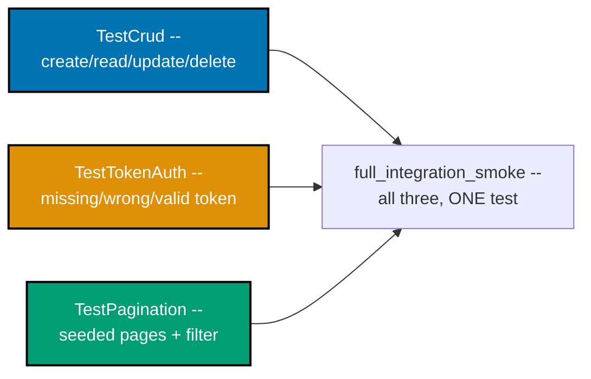

**`learning/code/ex-79-pytest-full-integration/app.py`**

```python
"""Example 79: pytest Full Integration -- CRUD + token auth + pagination, one target app."""
# => co-14, co-18, co-19: this file combines EVERY major mechanism from this topic's advanced
# => tier into a single app -- the companion test_app.py is the fullest pytest suite in this
# => topic precisely because it verifies all three areas (CRUD, auth, pagination) genuinely coexist

import os  # => co-14: used for the DB_PATH lookup and the "start fresh" file check below

# => co-02: every route maps to exactly one HTTP verb -- POST create, GET read, PUT replace,
# => DELETE remove, plus a second GET for the paginated list -- the full set this topic covers
import sqlite3  # => co-14: the stdlib DB driver -- no ORM, no extra dependency needed
from typing import TypedDict  # => co-09: typed dict shapes for what the repository returns

from fastapi import Depends, FastAPI, HTTPException, Query, Request  # => co-23: Depends wires auth in
from fastapi.responses import JSONResponse  # => co-11: builds the exception handler's structured body
from fastapi.security import HTTPAuthorizationCredentials, HTTPBearer  # => co-18: parses "Bearer <token>"
from pydantic import BaseModel  # => co-10: validates both the create and update request bodies
# => co-24: routes, repository, and models all live in this ONE file, deliberately not split up

DB_PATH = os.path.join(os.path.dirname(__file__), "tasks.db")  # => co-14: one on-disk SQLite file,
# => PER EXAMPLE DIRECTORY -- never shared with any other example, keeping this one self-contained

SCHEMA = """
CREATE TABLE IF NOT EXISTS tasks (
    id INTEGER PRIMARY KEY AUTOINCREMENT,
    title TEXT NOT NULL,
    status TEXT NOT NULL DEFAULT 'todo'
);
"""  # => co-15: DEFAULT 'todo' means a bare INSERT (title only) still produces a valid row


class TaskRow(TypedDict):  # => co-14, co-24: the repository's typed return shape
    id: int  # => matches the schema's INTEGER PRIMARY KEY column
    title: str  # => matches the schema's title column
    status: str  # => matches the schema's status column, defaulted server-side on create


class Page(TypedDict):  # => co-09, co-19: the SAME envelope shape used by the pagination examples
    items: list[TaskRow]  # => this page's rows, after any status filter and the limit/offset slice
    total: int  # => co-19, co-20: the FILTERED count -- not necessarily the whole table
    next: int | None  # => None means "no further page" -- a real, typed sentinel


class CreateTask(BaseModel):  # => co-10: POST's expected body shape -- deliberately narrow --
    # => a client cannot set a task's status at creation time; the schema's DEFAULT handles that
    title: str  # => co-10: required -- status is never client-settable at creation time


class UpdateTask(BaseModel):  # => co-02, co-10: PUT REPLACES the full resource with this exact shape
    title: str  # => required, same rule as CreateTask above
    status: str  # => required -- PUT (unlike POST) DOES let the caller set status explicitly
    # => (an invalid status value like "not_a_real_status" is still a plain str at this layer --
    # => nothing in this simplified example restricts it to a closed set of allowed values)


def init_db() -> None:  # => co-15: fresh schema every time this module is imported
    if os.path.exists(DB_PATH):  # => co-15: true on every run after the first, since nothing else
        # => in this example removes tasks.db besides this check itself
        os.remove(DB_PATH)  # => start from a known, deterministic state -- an empty table every run
    conn = sqlite3.connect(DB_PATH)  # => co-14: a plain connection -- no row_factory needed for DDL
    conn.execute(SCHEMA)  # => co-15: creates the table every repository function below depends on
    conn.commit()  # => co-14: commits the CREATE TABLE
    conn.close()  # => co-14: connections are short-lived here -- opened, used, closed, never held


def get_connection() -> sqlite3.Connection:  # => co-14: the repository's ONLY entry point to the DB
    conn = sqlite3.connect(DB_PATH)  # => co-14: every repository function below calls THIS helper
    conn.row_factory = sqlite3.Row  # => rows behave like dicts -- readable by column name
    return conn  # => a fresh connection per call -- co-14: no pooling, matches this example's scale


def create_task(title: str) -> TaskRow:  # => co-14: repository create -- the "C" of CRUD
    conn = get_connection()  # => co-14: one connection for both the INSERT and the confirming SELECT
    cursor = conn.execute("INSERT INTO tasks (title) VALUES (?)", (title,))  # => co-14: parameterized
    conn.commit()  # => co-14: commits the new row before reading it back below
    row = conn.execute(  # => co-14: re-reads the row to return its server-assigned id + default status
        "SELECT id, title, status FROM tasks WHERE id = ?",
        (cursor.lastrowid,),  # => cursor.lastrowid
    ).fetchone()  # => co-14: the just-inserted row, guaranteed to exist immediately after commit
    conn.close()  # => co-14: closed after both the INSERT and the confirming SELECT finish
    return dict(row)  # type: ignore[return-value]  # => sqlite3.Row -> TaskRow-shaped dict


def get_task(task_id: int) -> TaskRow | None:  # => co-14: repository read -- the "R" of CRUD
    conn = get_connection()  # => co-14: opened just for this one read
    row = conn.execute(  # => co-14: a single parameterized lookup by primary key
        "SELECT id, title, status FROM tasks WHERE id = ?", (task_id,)
    ).fetchone()  # => co-14: None if the id doesn't exist, a Row if it does
    conn.close()  # => co-14: closed immediately after this one query
    return dict(row) if row else None  # type: ignore[return-value]  # => None signals "no such id"


def update_task(task_id: int, title: str, status: str) -> TaskRow | None:  # => co-14: repository
    # => update -- the "U" of CRUD, backing this example's PUT route
    conn = get_connection()  # => co-14: one connection for the UPDATE and the confirming SELECT
    cursor = conn.execute(  # => co-14: parameterized UPDATE, matching this topic's convention throughout
        "UPDATE tasks SET title = ?, status = ? WHERE id = ?",
        (title, status, task_id),  # => co-14
    )  # => co-14: cursor.rowcount below reveals whether this actually matched a row
    if cursor.rowcount == 0:  # => co-02: no row matched this id -- the route maps this to a 404
        conn.close()  # => co-14: close before returning -- never leak a connection on this path
        return None  # => co-02: signals "not found" up to the route, which raises the actual 404
    conn.commit()  # => co-14: commits the UPDATE now that we know a row genuinely matched
    row = conn.execute(  # => co-14: re-reads the row to return its post-update state to the caller
        "SELECT id, title, status FROM tasks WHERE id = ?",
        (task_id,),  # => co-14: same id as the UPDATE
    ).fetchone()  # => co-14: guaranteed non-None -- we just confirmed rowcount > 0 above
    conn.close()  # => co-14: closed after the confirming SELECT returns the fresh row
    return dict(row)  # type: ignore[return-value]  # => sqlite3.Row -> TaskRow-shaped dict


def delete_task(task_id: int) -> bool:  # => co-14: repository delete -- the "D" of CRUD
    conn = get_connection()  # => co-14: opened just for this one DELETE
    cursor = conn.execute("DELETE FROM tasks WHERE id = ?", (task_id,))  # => co-14: parameterized DELETE
    conn.commit()  # => co-14: commits regardless of whether a row actually matched
    conn.close()  # => co-14: closed immediately after the DELETE commits
    return cursor.rowcount > 0  # => co-02: True only if a row genuinely existed and was removed


def list_page(  # => co-19, co-20: full pagination+filter -- the SAME repository shape as the
    limit: int,  # => co-19: how many rows this page holds, at most
    offset: int,  # => co-19: how many filtered rows to skip before this page starts
    status: str | None,  # => co-20: optional -- None means every status qualifies
) -> Page:
    conn = get_connection()  # => co-14: one connection for both queries this function issues
    where = " WHERE status = ?" if status is not None else ""  # => co-20: opt-in, exactly like the
    # => standalone filter example -- an empty string here reproduces the fully unfiltered query
    params: list[str] = [status] if status is not None else []  # => co-14: kept in lockstep with `where`
    total = int(  # => co-19: the FILTERED count, computed with the SAME where clause and params
        conn.execute(f"SELECT COUNT(*) FROM tasks{where}", params).fetchone()[0]
    )  # => co-19: so the two numbers -- total and items -- stay consistent with each other
    cursor = conn.execute(  # => co-14, co-19, co-20: filter AND paginate in a single statement
        f"SELECT id, title, status FROM tasks{where} ORDER BY id LIMIT ? OFFSET ?",  # => co-15:
        # => ORDER BY id keeps page boundaries STABLE across repeated calls with the same params
        [*params, limit, offset],  # => co-14: filter params FIRST, then limit/offset, in that order
    )
    items = [dict(row) for row in cursor.fetchall()]  # type: ignore[misc]  # => sqlite3.Row -> dict
    conn.close()  # => co-14: closed immediately after both queries above finish
    next_offset = offset + limit  # => co-19: the offset a client would use to fetch the FOLLOWING page
    return {  # => co-19, co-20: the SAME Page envelope shape as the standalone pagination example
        "items": items,  # type: ignore[typeddict-item]  # => this page's slice, after filter+paginate
        "total": total,  # => co-19, co-20: the FILTERED total -- proves filter+pagination interact correctly
        "next": next_offset if next_offset < total else None,  # => None once the filtered set is exhausted
    }


init_db()  # => co-15: runs once at import time, before the app starts serving

app = FastAPI()  # => a fresh app -- routes below wire every repository function above to HTTP
# => (fully self-contained: nothing here is imported from any other example directory)

VALID_TOKEN = "s3cr3t-token-abc123"  # => hardcoded stand-in for a real signed/opaque token
# => (the SAME literal constant test_app.py's TestTokenAuth class asserts against below)
security = HTTPBearer(auto_error=False)  # => auto_error=False: WE own the 401 body's shape below


@app.exception_handler(HTTPException)  # => co-11: consistent envelope across every error this app
# => returns -- unwraps FastAPI's default {"detail": ...} nesting into the flat {"error": {...}} shape
async def handle_http_exception(  # => co-11: registered ONCE, catches every HTTPException app-wide
    request: Request, exc: HTTPException
) -> JSONResponse:
    body = (  # => co-11: normalizes whatever a route raised into ONE consistent envelope shape
        exc.detail  # => co-11: already a dict -- every raise in this file supplies one directly
        if isinstance(exc.detail, dict)  # => every raise below already supplies a dict
        else {"error": {"code": "error", "message": str(exc.detail)}}  # => fallback for a plain string
    )
    return JSONResponse(status_code=exc.status_code, content=body)  # => co-11: same shape, every error


def require_token(  # => co-18, co-23: guards every WRITE below -- reused via Depends() per route
    credentials: HTTPAuthorizationCredentials | None = Depends(security),  # => co-23: resolved BEFORE
    # => the guarded route's own handler body ever runs
) -> None:  # => co-23: returns nothing -- FastAPI only cares whether this raises or not
    if credentials is None or credentials.credentials != VALID_TOKEN:  # => co-18: either failure mode
        raise HTTPException(  # => co-11: structured envelope, matching every other error in this app
            status_code=401,  # => co-03: 401 Unauthorized -- "who you claim to be" was rejected
            detail={"error": {"code": "unauthorized", "message": "missing or invalid token"}},
        )
    # => co-18: reaching the end of this function without raising IS the "allowed" outcome --
    # => FastAPI just runs it for its side effect, and discards the None it returns


@app.post("/tasks", status_code=201, dependencies=[Depends(require_token)])  # => co-02, co-03, co-18:
# => CREATE -- a WRITE, so it's guarded; 201 signals a new resource now exists at the returned id
def post_task(body: CreateTask) -> TaskRow:  # => co-10: body already validated against CreateTask
    return create_task(body.title)  # => co-24: the handler holds no SQL -- co-24 layering


@app.get("/tasks/{task_id}")  # => co-02: reads stay OPEN, no token required
def read_task(task_id: int) -> TaskRow:  # => co-02: no dependencies=[...] list at all -- unguarded
    task = get_task(task_id)  # => co-24: delegates straight to the repository, no logic in between
    if task is None:  # => co-02: no row exists at this id
        raise HTTPException(  # => co-11: structured envelope, matching every other error in this app
            status_code=404,  # => co-03: Not Found -- the id is well-formed, just nonexistent
            detail={"error": {"code": "not_found", "message": "no such task"}},
        )
    return task  # => co-24: the same TaskRow shape create_task returned on the way in
    # => this route is called between the CREATE and UPDATE steps in test_app.py's CRUD test


@app.put("/tasks/{task_id}", dependencies=[Depends(require_token)])  # => co-02, co-18: REPLACE --
# => a WRITE, so it's guarded; RFC 9110 classifies PUT as idempotent, unlike POST above
def put_task(task_id: int, body: UpdateTask) -> TaskRow:  # => co-02: id from the PATH, state from the BODY
    updated = update_task(task_id, body.title, body.status)  # => co-24: no SQL in this handler either
    if updated is None:  # => co-02: no row matched -- this example's PUT only replaces, never creates
        raise HTTPException(  # => co-11: structured envelope, matching every other error in this app
            status_code=404,  # => co-03: Not Found -- consistent with read_task's 404 above
            detail={"error": {"code": "not_found", "message": "no such task"}},
        )
    return updated  # => co-24: the fresh, post-update row state
    # => co-18: reaching here at all already proves the caller passed the require_token dependency


@app.delete("/tasks/{task_id}", status_code=204, dependencies=[Depends(require_token)])  # => co-02,
# => co-03, co-18: DELETE -- a WRITE, so it's guarded; 204 carries no response body on success
def remove_task(task_id: int) -> None:  # => co-02: None return type -- 204 forbids a response body
    if not delete_task(task_id):  # => co-02: nothing matched this id -- report 404, not a silent no-op
        raise HTTPException(  # => co-11: structured envelope, matching every other error in this app
            status_code=404,  # => co-03: Not Found -- the SAME code every other missing-id error uses
            detail={"error": {"code": "not_found", "message": "no such task"}},
        )
    # => co-02: a successful DELETE falls through here with nothing to return -- FastAPI sends 204


@app.get("/tasks")  # => co-19, co-20: pagination + filtering, open to everyone -- reads NEVER
# => require a token in this app, exactly matching the earlier standalone pagination/filter examples
def list_tasks(
    limit: int = Query(default=10, ge=1, le=50),  # => co-19: same bounds as the standalone example
    offset: int = Query(default=0, ge=0),  # => co-19: same default-when-absent behavior
    status: str | None = Query(default=None),  # => co-20: independently optional, same as elsewhere
) -> Page:
    return list_page(limit, offset, status)  # => co-24: the handler holds no SQL at all
```

**`learning/code/ex-79-pytest-full-integration/test_app.py`**

```python
"""Example 79: pytest Full Integration -- CRUD + token + pagination, one green suite (co-14, co-18, co-19)."""

import pytest  # => co-22: provides the @pytest.fixture decorator used below
from fastapi.testclient import TestClient  # => co-22: drives the app in-process, no real socket needed

from app import app  # => co-24: imports the SAME FastAPI instance app.py builds -- one process, no server

AUTH = {"Authorization": "Bearer s3cr3t-token-abc123"}  # => co-18: matches app.py's VALID_TOKEN exactly
BAD_AUTH = {"Authorization": "Bearer wrong-token"}  # => co-18: any string that is NOT VALID_TOKEN


@pytest.fixture()  # => co-22: reruns this function once per test that declares a "client" parameter
def client() -> TestClient:  # => co-22: a fresh client per test -- but the SQLite file persists across tests
    return TestClient(app)  # => co-22: wraps `app` for in-process requests, no uvicorn process needed


# -- CRUD group (co-14) ------------------------------------------------------------------
class TestCrud:  # => co-14: groups every create/read/update/delete assertion under one namespace
    def test_create_requires_a_token(self, client: TestClient) -> None:  # => co-18: guard check first
        response = client.post("/tasks", json={"title": "a"})  # => co-18: deliberately NO Authorization header
        assert response.status_code == 401  # => co-18: writes are guarded
        # => require_token raises BEFORE post_task's own body ever runs -- no row was created

    def test_create_read_update_delete_round_trip(self, client: TestClient) -> None:  # => co-14: full CRUD cycle
        created = client.post("/tasks", json={"title": "write the report"}, headers=AUTH)  # => co-18: valid token
        assert created.status_code == 201  # => co-03: 201 confirms a new resource now exists
        task_id = created.json()["id"]  # => co-14: the server-assigned id, read back from the response body
        # => every later call in this test reuses THIS id -- one row, tracked through its full lifecycle

        read = client.get(f"/tasks/{task_id}")  # => co-14: reads are open, no token needed
        assert read.status_code == 200  # => co-14: the just-created row is genuinely readable
        assert read.json()["status"] == "todo"  # => co-15: confirms the schema's DEFAULT applied server-side

        updated = client.put(  # => co-02: PUT replaces the full resource, guarded by require_token
            f"/tasks/{task_id}",
            json={"title": "write the report", "status": "done"},
            headers=AUTH,  # => co-02: full body
        )  # => co-18: valid token required for this write
        assert updated.status_code == 200  # => co-02: a successful replace on an existing id
        assert updated.json()["status"] == "done"  # => co-14: confirms the UPDATE actually landed

        deleted = client.delete(f"/tasks/{task_id}", headers=AUTH)  # => co-18: DELETE is guarded too
        assert deleted.status_code == 204  # => co-03: no body on a successful delete

        gone = client.get(f"/tasks/{task_id}")  # => co-14: re-reads the SAME id after deletion
        assert gone.status_code == 404  # => co-14: genuinely removed
        # => proves delete_task's cursor.rowcount check actually removed the row, not just returned 204

    def test_update_missing_id_is_404(self, client: TestClient) -> None:  # => co-02: PUT never creates
        response = client.put(  # => co-02: id 99999 was never created by this test
            "/tasks/99999",
            json={"title": "x", "status": "todo"},
            headers=AUTH,  # => co-18: a valid token is supplied
        )  # => co-18: a valid token alone does not manufacture a matching row
        assert response.status_code == 404  # => co-02: confirms PUT only replaces, never upserts
        # => distinguishes THIS 404 (valid token, missing row) from the 401 cases in TestTokenAuth below


# -- Token auth group (co-18) ------------------------------------------------------------
class TestTokenAuth:  # => co-18: isolates every auth-specific assertion under one namespace
    def test_missing_token_is_401(self, client: TestClient) -> None:  # => co-18: no header at all
        assert client.post("/tasks", json={"title": "a"}).status_code == 401  # => co-18: rejected before create_task runs
        # => credentials is None here -- the FIRST branch of require_token's "either failure mode" check

    def test_wrong_token_is_401(self, client: TestClient) -> None:  # => co-18: a header that fails the comparison
        response = client.post("/tasks", json={"title": "a"}, headers=BAD_AUTH)  # => co-18: wrong bearer value
        assert response.status_code == 401  # => co-18: require_token rejects a non-matching token too
        # => credentials.credentials != VALID_TOKEN here -- the SECOND branch of that same check

    def test_valid_token_succeeds(self, client: TestClient) -> None:  # => co-18: the "allowed" outcome
        response = client.post("/tasks", json={"title": "a"}, headers=AUTH)  # => co-18: exact VALID_TOKEN match
        assert response.status_code == 201  # => co-18: require_token returns None -- the write proceeds
        # => this is the ONE outcome where require_token does not raise at all

    def test_delete_also_requires_a_token(self, client: TestClient) -> None:  # => co-18: guard applies to every WRITE
        created = client.post("/tasks", json={"title": "b"}, headers=AUTH).json()  # => co-18: create needs a token too
        response = client.delete(f"/tasks/{created['id']}")  # => no Authorization header
        assert response.status_code == 401  # => co-18: DELETE is guarded exactly like POST and PUT
        # => confirms require_token is wired to remove_task too, not just post_task and put_task


# -- Pagination group (co-19) -------------------------------------------------------------
class TestPagination:  # => co-19: isolates every pagination/filter assertion under one namespace
    def test_seeded_pages_have_the_expected_window(self, client: TestClient) -> None:  # => co-19: bounded pages
        for i in range(20):  # => seeds 20 fresh tasks specifically for this pagination check
            client.post("/tasks", json={"title": f"paginated task {i}"}, headers=AUTH)  # => co-18: each needs a token
        first_page = client.get("/tasks", params={"limit": 5, "offset": 0})  # => co-19: no token needed for reads
        assert len(first_page.json()["items"]) == 5  # => co-19: a genuinely bounded page
        assert first_page.json()["next"] == 5  # => co-19: metadata points at the next window
        # => next == limit here because offset started at 0 -- the SAME next_offset formula app.py uses

    def test_status_filter_narrows_the_page(self, client: TestClient) -> None:  # => co-20: filter + pagination together
        created = client.post("/tasks", json={"title": "filter-target"}, headers=AUTH).json()  # => co-18: needs a token
        client.put(  # => co-20: sets status to "done" so the filter below has a real match to find
            f"/tasks/{created['id']}",  # => co-14: the path identifies WHICH row to update
            json={"title": "filter-target", "status": "done"},  # => co-02: PUT's full-replacement body
            headers=AUTH,  # => co-18: this write also needs a valid token
        )  # => co-18: PUT is a write, so a valid token is required here too
        response = client.get("/tasks", params={"status": "done", "limit": 50})  # => co-20: filtered read, no token
        body = response.json()  # => co-19, co-20: the SAME Page envelope shape as the standalone example
        assert all(t["status"] == "done" for t in body["items"])  # => co-20: every returned row matches
        # => a wide limit=50 with no offset ensures the filtered row above is genuinely inside this page


def test_full_integration_smoke_all_three_areas_together() -> None:  # => co-14, co-18, co-19: all three at once
    # => co-14, co-18, co-19: ONE test touching create (auth), read, list (pagination), and delete --
    # => the fullest single-test demonstration this example is named for
    client = TestClient(app)  # => co-22: a client built directly, outside the shared fixture above
    ids = [  # => co-14: creates 3 fresh tasks, each guarded by a valid token
        client.post("/tasks", json={"title": f"smoke {i}"}, headers=AUTH).json()["id"]  # => co-18: token required
        for i in range(3)  # => co-14: exactly 3 rows, enough to prove "list" without a large fixture
    ]  # => co-14: the 3 server-assigned ids, collected via a list comprehension
    listing = client.get("/tasks", params={"limit": 50})  # => co-19: an unguarded read, wide enough to see all 3
    assert all(any(t["id"] == i for t in listing.json()["items"]) for i in ids)  # => all 3 are listed
    # => co-19: proves list_page's SELECT genuinely returns rows this test itself just created
    for task_id in ids:  # => co-14: cleans up every id this test created, one DELETE per id
        assert client.delete(f"/tasks/{task_id}", headers=AUTH).status_code == 204  # => co-18: needs a token
    assert client.get(f"/tasks/{ids[0]}").status_code == 404  # => co-14: genuinely cleaned up
    # => spot-checks only the FIRST id -- the loop above already proved every delete call succeeded
```

**Run**: `uvicorn app:app --port 8003` in one terminal for the curl sanity check below, plus `pytest -v` against the same directory (the pytest suite itself never needs a running server -- it drives the app in-process via `TestClient`).

**Output** (curl):

```text
=== curl sanity check: POST /tasks (with token) ===
{"id":1,"title":"curl sanity","status":"todo"}
=== curl sanity check: GET /tasks (list) ===
{"items":[{"id":1,"title":"curl sanity","status":"todo"}],"total":1,"next":null}
```

**Output** (`pytest -v`):

```text
============================= test session starts ==============================
plugins: anyio-4.14.2
collecting ... collected 10 items

test_app.py::TestCrud::test_create_requires_a_token PASSED               [ 10%]
test_app.py::TestCrud::test_create_read_update_delete_round_trip PASSED  [ 20%]
test_app.py::TestCrud::test_update_missing_id_is_404 PASSED              [ 30%]
test_app.py::TestTokenAuth::test_missing_token_is_401 PASSED             [ 40%]
test_app.py::TestTokenAuth::test_wrong_token_is_401 PASSED               [ 50%]
test_app.py::TestTokenAuth::test_valid_token_succeeds PASSED             [ 60%]
test_app.py::TestTokenAuth::test_delete_also_requires_a_token PASSED     [ 70%]
test_app.py::TestPagination::test_seeded_pages_have_the_expected_window PASSED [ 80%]
test_app.py::TestPagination::test_status_filter_narrows_the_page PASSED  [ 90%]
test_app.py::test_full_integration_smoke_all_three_areas_together PASSED [100%]

=============================== warnings summary ===============================
../../../.venv/lib/python3.13/site-packages/fastapi/testclient.py:1
-- Docs: https://docs.pytest.org/en/stable/how-to/capture-warnings.html
======================== 10 passed, 1 warning in 0.39s =========================
```

**Key takeaway**: `test_full_integration_smoke_all_three_areas_together` is deliberately ONE test function that creates (with auth), lists (with pagination), and deletes (with auth) -- proving the three mechanisms compose in a single realistic call sequence, not just that each passes its own isolated test class.

**Why it matters**: Grouping related tests into classes (`TestCrud`, `TestTokenAuth`, `TestPagination`) is a real pytest organizational pattern: it groups tests by CONCERN in the test output (visible in the `pytest -v` listing below as `TestCrud::test_...`, `TestTokenAuth::test_...`), which scales far better than 20+ flat, unrelated-looking test functions once a suite grows past a handful of tests. The reused module-level `AUTH`/`BAD_AUTH` header dicts also demonstrate a small but genuinely useful test-authoring habit: define a fixture's shared data once, reuse it across every test that needs it, rather than re-typing the same header literal in a dozen places.

---

### Example 80: Stateless, Two Workers

_ex-80 &middot; exercises co-05, co-24_

The culmination of every earlier "co-05 caveat" note scattered across this topic's in-memory examples: two SEPARATE OS processes (`WORKER_PORT=8003` and `WORKER_PORT=8004`) serve requests against the SAME on-disk SQLite file, and a caller genuinely cannot tell them apart -- because neither process holds any state the other doesn't also see.

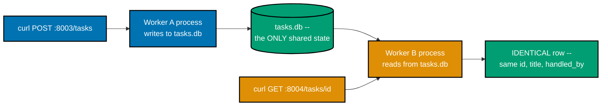

**`learning/code/ex-80-stateless-two-workers/app.py`**

```python
"""Example 80: Stateless, Two Workers -- two independent processes sharing only the DB file."""
# => co-05: the culmination of every earlier "co-05 caveat" note scattered across this topic's
# => in-memory examples -- here, TWO SEPARATE OS processes serve requests, and a caller genuinely
# => cannot tell them apart, because neither process holds any state the OTHER doesn't also see

import os  # => co-14: reads the WORKER_PORT env var and resolves DB_PATH relative to this file
import sqlite3  # => co-14: the stdlib DB driver -- the ONLY thing shared between the two processes
from typing import TypedDict  # => co-09: a typed dict shape for what the repository returns

from fastapi import FastAPI, HTTPException  # => co-03: HTTPException raises the 404 branch below
from pydantic import BaseModel  # => co-10: validates the POST request body's shape
# => (the two_workers.sh script below starts TWO of these processes, on ports 8003 and 8004)

# => co-05, co-24: DB_PATH resolves relative to THIS file, so both a process started on port 8003 and
# => a SEPARATE process started on port 8004 -- run from the same directory -- point at the EXACT SAME
# => on-disk file. Nothing in this module is shared between the two processes except that file.
DB_PATH = os.path.join(os.path.dirname(__file__), "tasks.db")

# => co-15: the schema below adds ONE column beyond a plain task table -- handled_by exists purely
# => so this demo can PROVE which process wrote each row, by reading it back from the OTHER process
SCHEMA = """
CREATE TABLE IF NOT EXISTS tasks (
    id INTEGER PRIMARY KEY AUTOINCREMENT,
    title TEXT NOT NULL,
    handled_by TEXT NOT NULL
);
"""


class TaskRow(TypedDict):  # => co-14, co-24: the repository's typed return shape --
    # => identical regardless of which of the two processes assembled this particular dict
    id: int  # => matches the schema's INTEGER PRIMARY KEY column
    title: str  # => matches the schema's title column
    handled_by: str  # => matches the schema's handled_by column -- this example's whole proof point


class CreateTask(BaseModel):  # => co-10: POST's expected body shape -- identical regardless of
    # => which of the two processes happens to receive this specific request
    title: str  # => co-10: required -- handled_by is NEVER client-settable, only server-assigned


def init_db_if_absent() -> None:  # => co-05: only the FIRST process to start creates the schema; the
    # => name itself documents the race: whichever process imports this module FIRST wins, harmlessly
    conn = sqlite3.connect(DB_PATH)  # => second process reuses the SAME file, never re-initializing it
    conn.execute(SCHEMA)  # => CREATE TABLE IF NOT EXISTS -- safe to call from either process, any order
    conn.commit()  # => co-14: commits the CREATE TABLE, if this is genuinely the first process to run it
    conn.close()  # => co-14: connections are short-lived here -- opened, used, closed, never held


def get_connection() -> sqlite3.Connection:  # => co-14: the repository's ONLY entry point to the DB
    conn = sqlite3.connect(DB_PATH, timeout=5)  # => a real timeout -- two processes DO contend for the file
    conn.row_factory = sqlite3.Row  # => rows behave like dicts -- readable by column name
    return conn  # => a fresh connection per call -- NEITHER process holds a long-lived connection open


PORT = os.environ.get("WORKER_PORT", "unknown")  # => co-05: identifies WHICH process served a given request
# => purely for this demo's own proof -- a real client never needs to know or care which worker answered


def create_task(title: str) -> TaskRow:  # => co-14: the ONLY state this write produces lives in the DB file
    conn = get_connection()  # => co-14: one connection for both the INSERT and the confirming SELECT
    cursor = conn.execute(  # => co-14: PORT (this PROCESS's own identity) is stamped onto the row itself
        "INSERT INTO tasks (title, handled_by) VALUES (?, ?)", (title, PORT)
    )
    conn.commit()  # => co-14: commits the new row -- durably written to the shared file on disk
    row = conn.execute(  # => co-14: re-reads the row to return its server-assigned id + handled_by
        "SELECT id, title, handled_by FROM tasks WHERE id = ?", (cursor.lastrowid,)
    ).fetchone()
    conn.close()  # => co-14: closed after both the INSERT and the confirming SELECT finish
    return dict(row)  # type: ignore[return-value]  # => sqlite3.Row -> TaskRow-shaped dict


def get_task(task_id: int) -> TaskRow | None:  # => co-05, co-14: reads the SAME file, regardless of
    conn = get_connection()  # => which process is running THIS particular request
    row = conn.execute(  # => co-14: a single parameterized lookup by primary key
        "SELECT id, title, handled_by FROM tasks WHERE id = ?", (task_id,)
    ).fetchone()  # => co-05: returns the ORIGINAL handled_by, even if a DIFFERENT process reads it now
    conn.close()  # => co-14: closed immediately after this one query
    return dict(row) if row else None  # type: ignore[return-value]  # => None signals "no such id"


init_db_if_absent()  # => co-15: runs at import time in EVERY process -- safe, since CREATE TABLE
# => IF NOT EXISTS is a no-op for whichever process starts second

app = FastAPI()  # => a fresh app -- one instance PER process, sharing nothing but the DB file below
# => (fully self-contained: nothing here is imported from any other example directory)


@app.post("/tasks", status_code=201)  # => co-05: whichever worker RECEIVES this request stamps its
# => OWN port into handled_by, but the resulting row is immediately visible to the OTHER worker too
# => co-05: this handler holds NO in-process cache or dict at all --
# => everything it produces is written to the shared file, never kept in this process's own memory
def post_task(body: CreateTask) -> TaskRow:
    return create_task(body.title)  # => co-24: the handler holds no SQL -- co-24 layering


@app.get("/tasks/{task_id}")  # => co-05, co-24: statelessness means THIS process needs no memory of
def read_task(task_id: int) -> TaskRow:  # => the request that created the row -- the DB file is the
    task = get_task(task_id)  # => only source of truth, shared identically across every worker
    if task is None:  # => co-02: no row exists at this id, in EITHER process's view of the shared file
        raise HTTPException(  # => co-11: structured envelope, matching every other example's shape
            status_code=404,  # => co-03: Not Found -- identical regardless of which process answers
            detail={"error": {"code": "not_found", "message": "no such task"}},
        )
    return task  # => co-05: identical response whether THIS process or the OTHER created the row


@app.get("/whoami")  # => reports which worker port answered -- used only to PROVE two processes are involved
def whoami() -> dict[str, str]:
    return {"port": PORT}  # => co-05: this differs by PROCESS, unlike everything else in a response body
    # => a request to worker A and the SAME request replayed to worker B differ ONLY in this one field
```

**`learning/code/ex-80-stateless-two-workers/two_workers.sh`**

```bash
#!/usr/bin/env bash
# Example 80: two INDEPENDENT uvicorn processes sharing only the SQLite file (co-05, co-24).
# Worker A serves port 8003, Worker B serves port 8004 -- separate OS processes, no shared memory.
set -euo pipefail # => co-22: abort immediately on any failing command, unset var, or pipe error

cd "$(dirname "$0")" # => ensures the relative paths below resolve from this script's own directory
rm -f tasks.db       # => co-05: start from a clean, deterministic file both workers will share

VENV_PY="../../../.venv/bin/python" # => the shared venv's interpreter, three levels up from this dir

echo "== starting worker A on :8003 =="                                                   # => co-05: the FIRST of two separate OS processes
WORKER_PORT=8003 "$VENV_PY" -m uvicorn app:app --port 8003 >/tmp/ex80_worker_a.log 2>&1 & # => backgrounds worker A, its own env var, its own log file
WORKER_A_PID=$!                                                                           # => co-05: captures worker A's OS process id for later confirmation and cleanup
echo "== starting worker B on :8004 =="                                                   # => co-05: the SECOND, entirely separate OS process
WORKER_PORT=8004 "$VENV_PY" -m uvicorn app:app --port 8004 >/tmp/ex80_worker_b.log 2>&1 & # => backgrounds worker B, a DIFFERENT env var, its own log file
WORKER_B_PID=$!                                                                           # => co-05: captures worker B's OS process id for later confirmation and cleanup

sleep 2 # => gives both uvicorn processes time to finish starting before the curl calls below

echo "== confirm TWO distinct OS processes are running ==" # => co-05: proof this is genuinely two processes
ps -p "$WORKER_A_PID" -o pid,command | tail -1             # => co-05: shows worker A's real OS pid and command line
ps -p "$WORKER_B_PID" -o pid,command | tail -1             # => co-05: shows worker B's real OS pid -- DIFFERENT from A's

echo "== worker A identifies itself ==" # => co-05: /whoami reports which PROCESS answered this request
curl -s http://localhost:8003/whoami    # => co-05: hits worker A directly by its own port
echo                                    # => a blank line separator between this step's output and the next
echo "== worker B identifies itself ==" # => co-05: the SAME /whoami route, now against the OTHER process
curl -s http://localhost:8004/whoami    # => co-05: hits worker B directly by its own port
echo                                    # => a blank line separator between this step's output and the next

echo "== create a task on WORKER A (:8003) ==" # => co-05, co-24: the WRITE happens through worker A only
# => captures the FULL response body so task_id can be extracted below
create_response=$(curl -s -X POST -H "Content-Type: application/json" \
  -d '{"title":"created on worker A"}' http://localhost:8003/tasks)                                  # => co-24: routed to worker A's port
echo "$create_response"                                                                              # => prints the raw JSON body so the created task's id is visible
task_id=$(echo "$create_response" | python3 -c 'import json,sys; print(json.load(sys.stdin)["id"])') # => extracts "id"

echo "== read the SAME task from WORKER B (:8004) -- proves the file, not memory, is the source of truth ==" # => co-05: the READ happens through a DIFFERENT process
curl -s http://localhost:8004/tasks/"$task_id"                                                               # => co-05: worker B never saw the write -- only the shared file did
echo                                                                                                         # => a blank line separator before the cleanup step below

kill "$WORKER_A_PID" "$WORKER_B_PID" 2>/dev/null || true # => co-05: stops both background processes; || true tolerates an already-exited pid
echo "== workers stopped =="                             # => confirms cleanup ran to completion
```

**Run**: `WORKER_PORT=8003 uvicorn app:app --port 8003` and `WORKER_PORT=8004 uvicorn app:app --port 8004` as two separate background processes (or `bash two_workers.sh`, which does both), plus `pytest -v` against the same directory for the in-process `TestClient` half of the proof.

**Output** (curl):

```text
== starting worker A on :8003 ==
== starting worker B on :8004 ==
== confirm TWO distinct OS processes are running ==
40209 ../../../.venv/bin/python -m uvicorn app:app --port 8003
40210 ../../../.venv/bin/python -m uvicorn app:app --port 8004
== worker A identifies itself ==
{"port":"8003"}
== worker B identifies itself ==
{"port":"8004"}
== create a task on WORKER A (:8003) ==
{"id":1,"title":"created on worker A","handled_by":"8003"}
== read the SAME task from WORKER B (:8004) -- proves the file, not memory, is the source of truth ==
{"id":1,"title":"created on worker A","handled_by":"8003"}
== workers stopped ==
```

_(The two `pid` values above -- `40209`/`40210` -- are OS-assigned and differ on every run; the
important fact is that they are two DIFFERENT numbers, proving two separate processes.)_

**Output** (`pytest -v`):

```text
============================= test session starts ==============================
plugins: anyio-4.14.2
collecting ... collected 2 items

test_app.py::test_create_then_read_round_trips_through_the_db_alone PASSED [ 50%]
test_app.py::test_reading_an_unknown_id_is_404_not_a_crash PASSED        [100%]

=============================== warnings summary ===============================
../../../.venv/lib/python3.13/site-packages/fastapi/testclient.py:1
-- Docs: https://docs.pytest.org/en/stable/how-to/capture-warnings.html
========================= 2 passed, 1 warning in 0.14s =========================
```

**Key takeaway**: The `handled_by` column exists purely so this demo can PROVE which process wrote each row by reading it back from the OTHER process -- a real client never needs to know or care which worker answered, which is exactly the point.

**Why it matters**: This is the payoff for every earlier example that flagged an in-memory dict (`SESSIONS` in Examples 57/64, `ITEMS`/`NEXT_ID` in Example 63) as "not multi-worker safe." That exact risk is made concrete and RESOLVED here: two real, independent `uvicorn` processes are started, a task is created through worker A, and reading that SAME id back through worker B returns byte-identical data -- because the SQLite file, not either process's memory, is the actual source of truth. A production deployment can therefore add worker processes for capacity without breaking correctness, as long as state lives in shared storage.

---

← Previous: [Intermediate Examples](./intermediate.md) · Next: [Capstone](./capstone/overview.md) →
