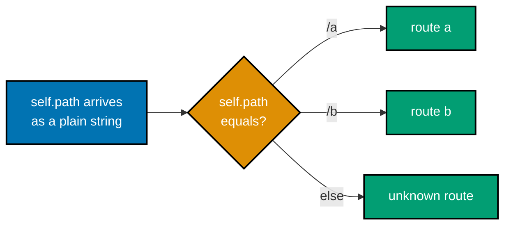
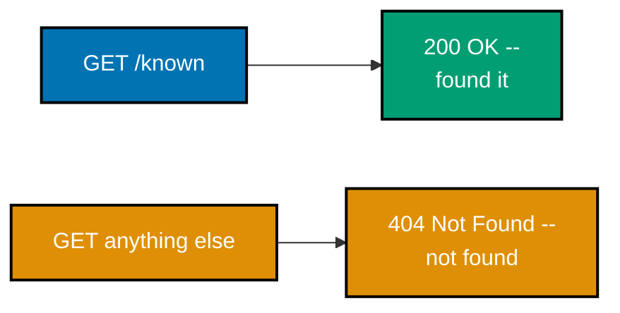
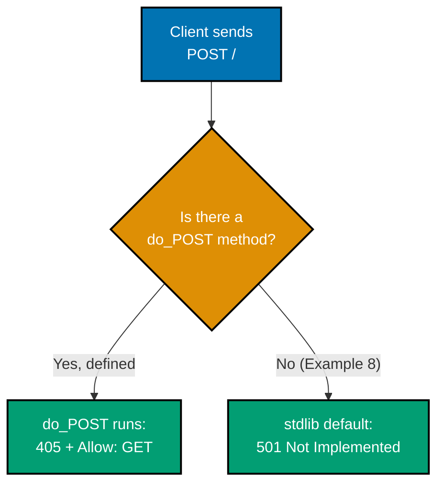
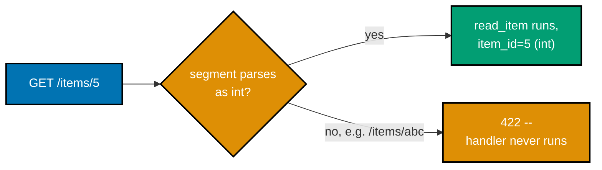
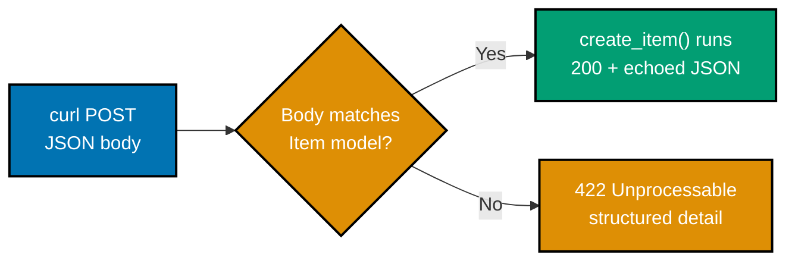
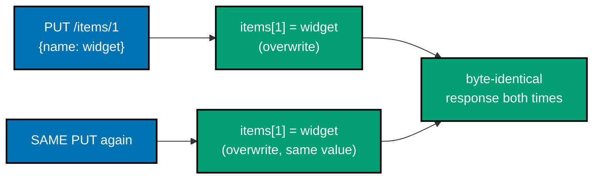
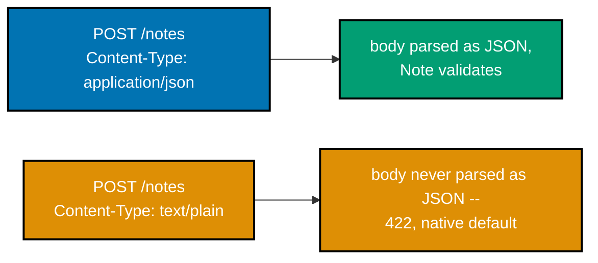

Examples 1-28 build a hand-written `http.server`/`wsgiref` raw server first (Examples 1-9), revealing
exactly what a framework automates, then move to FastAPI basics: installing the framework, routing,
typed path and query parameters, JSON request/response bodies, status codes, headers, a Flask
comparison, PUT/PATCH semantics, statelessness, and a first look at FastAPI's native content-negotiation
default. Every example is a complete, self-contained Python module colocated under `learning/code/`; run
each server with `python3 server.py` (Examples 1-9) or `uvicorn app:app --port 8000` (Examples 10-28,
Flask's `flask --app app run --port 8000` for Example 23) from inside its own directory, then exercise
it with `curl` from a second terminal.

---

### Example 1: Raw Server Hello

_ex-01 &middot; exercises co-06, co-01_

The absolute minimum HTTP server: a `BaseHTTPRequestHandler` subclass that writes a status line, one
header, and a body entirely by hand for every `GET /` request. Nothing here is automated -- this is
what a framework like FastAPI does invisibly on every single request.


**`learning/code/ex-01-raw-server-hello/server.py`**

```python
"""Example 1: Raw Server Hello."""

# => http.server is the standard library's minimal HTTP toolkit -- no
# => third-party package is installed for this example or the next 8 (co-06)
from http.server import BaseHTTPRequestHandler, HTTPServer  # => imports the base class + server


# => subclassing BaseHTTPRequestHandler gets request PARSING for free (method,
# => path, headers); everything about the RESPONSE below is still hand-written
class HelloHandler(BaseHTTPRequestHandler):  # => one instance is created per request
    """A hand-written request handler -- no framework routing at all."""

    # => do_GET is a MAGIC method name: BaseHTTPRequestHandler dispatches every
    # => incoming GET request to a method named exactly "do_GET" (co-06)
    def do_GET(self) -> None:  # => called automatically for every GET request
        """Handle every GET request the same way: reply with 'hello'."""
        self.send_response(200)  # => writes the status line "HTTP/1.0 200 OK"
        # => must happen BEFORE any send_header() calls -- order matters (co-01)
        self.send_header("Content-Type", "text/plain")  # => queues one header
        # => queued, not written yet -- end_headers() flushes it (co-04)
        self.end_headers()  # => writes every queued header + a blank line
        # => that blank line marks the end of the header block (RFC 9110, co-01)
        self.wfile.write(b"hello")  # => writes the raw body bytes
        # => wfile is the socket's write-file object; bytes, not str (co-01)


def run(port: int) -> HTTPServer:  # => builds, but does not yet start, the server
    """Build and return a server bound to the given port (caller starts it)."""
    # => 127.0.0.1 binds to localhost only -- unreachable from other machines
    server = HTTPServer(("127.0.0.1", port), HelloHandler)
    # => pairs a listening socket with HelloHandler as its request factory
    return server  # => caller decides exactly when to start serving


if __name__ == "__main__":  # => only runs when executed directly, not on import
    # => serve_forever() blocks, handling one request at a time in this loop
    run(8000).serve_forever()  # => builds the server, then starts it serving
```

**Run**: `python3 server.py`, then in a second terminal: `curl localhost:8000/`

**Output**:

```text
hello
```

**Key takeaway**: `send_response()`, `send_header()`, `end_headers()`, and `wfile.write()` are the four
manual calls a raw handler makes; a framework's `@app.get("/")` decorator is what replaces all four with
one line.

**Why it matters**: Seeing the raw wire protocol once is what makes every later framework convenience
legible instead of magical. When Example 11 writes `return {"msg": "hello"}` and FastAPI turns it into a
full HTTP response, this example is the proof of exactly what work that one line is quietly doing --
writing a status line, a header, and a body, in that precise order.

---

### Example 2: Raw Status Line

_ex-02 &middot; exercises co-06, co-03_

`send_response(200)` writes the status line immediately, and `end_headers()` alone (with no
`send_header()` calls) is enough to terminate the header block. This example isolates those two calls
to show exactly what each one puts on the wire.

**`learning/code/ex-02-raw-status-line/server.py`**

```python
"""Example 2: Raw Status Line."""

from http.server import BaseHTTPRequestHandler, HTTPServer  # => imports the base class + server


class StatusHandler(BaseHTTPRequestHandler):  # => one instance created per request
    """Handler that writes the status line and headers as two explicit calls."""

    # => do_GET is the ONLY method defined -- BaseHTTPRequestHandler routes
    # => every incoming GET request to a method with exactly this name (co-06)
    def do_GET(self) -> None:  # => called automatically for every GET request
        """send_response() writes the status line; end_headers() ends the block."""
        self.send_response(200)  # => IMMEDIATELY writes "HTTP/1.0 200 OK\r\n"
        # => the first argument is the numeric status; the reason phrase
        # => ("OK") is looked up automatically from the status code (co-03)
        self.end_headers()  # => no extra headers queued -- just the blank line
        # => that terminates the header block, per RFC 9110 SS15 (co-01)
        self.wfile.write(b"status ok")  # => the response body, as raw bytes
        # => arrives on the wire AFTER the status line and headers above


def run(port: int) -> HTTPServer:  # => builds, but does not yet start, the server
    """Build and return a server bound to the given port (caller starts it)."""
    # => HTTPServer pairs a listening socket with StatusHandler as its
    # => per-connection request factory -- one StatusHandler instance per request
    return HTTPServer(("127.0.0.1", port), StatusHandler)
    # => binds to localhost only; caller decides when to start serving


if __name__ == "__main__":  # => only runs when executed directly, not on import
    # => run() only BUILDS the server; serve_forever() is the call that
    # => actually starts accepting connections and blocks this process
    run(8000).serve_forever()  # => blocks, handling one request at a time
```

**Run**: `python3 server.py`, then: `curl -i localhost:8000/`

**Output**:

```text
HTTP/1.0 200 OK
Server: BaseHTTP/0.6 Python/3.13.12
Date: Tue, 14 Jul 2026 09:25:12 GMT

status ok
```

**Key takeaway**: `http.server`'s default `protocol_version` is `"HTTP/1.0"`, which is why `curl -i`
shows `HTTP/1.0 200 OK` here -- an accuracy detail the syllabus's Python docs citation confirms
explicitly.

**Why it matters**: The status line is the very first thing any HTTP client parses, before a single
header or body byte. Confirming its exact wire format with `curl -i` -- not just trusting that "200
means success" -- is the habit that catches subtle protocol-version mismatches (`HTTP/1.0` vs
`HTTP/1.1`) that can otherwise silently break a proxy or load balancer downstream.

---

### Example 3: Raw Set Header

_ex-03 &middot; exercises co-06, co-04_

`send_header(name, value)` queues a single header; nothing reaches the wire until `end_headers()`
flushes the queue. This example sets exactly one `Content-Type` header and confirms it appears in the
response.

**`learning/code/ex-03-raw-set-header/server.py`**

```python
"""Example 3: Raw Set Header."""

from http.server import BaseHTTPRequestHandler, HTTPServer  # => imports the base class + server


class HeaderHandler(BaseHTTPRequestHandler):  # => one instance created per request
    """Handler that sets one explicit response header before ending headers."""

    # => do_GET is the ONLY method defined -- BaseHTTPRequestHandler routes
    # => every incoming GET request to a method with exactly this name (co-06)
    def do_GET(self) -> None:  # => called automatically for every GET request
        """send_header() queues a header; end_headers() flushes them all."""
        self.send_response(200)  # => status line first, per HTTP's wire order
        self.send_header("Content-Type", "text/plain")  # => queues ONE header
        # => a name/value pair; call send_header() again per additional header
        self.end_headers()  # => writes every queued header, then a blank line
        # => nothing is sent to the socket until THIS call flushes the queue
        self.wfile.write(b"plain text body")  # => the body, matching that
        # => Content-Type: a client can now safely treat this as plain text


def run(port: int) -> HTTPServer:  # => builds, but does not yet start, the server
    """Build and return a server bound to the given port (caller starts it)."""
    # => HTTPServer pairs a listening socket with HeaderHandler as its
    # => per-connection request factory -- one HeaderHandler instance per request
    return HTTPServer(("127.0.0.1", port), HeaderHandler)
    # => binds to localhost only; caller decides when to start serving


if __name__ == "__main__":  # => only runs when executed directly, not on import
    # => run() only BUILDS the server; serve_forever() is the call that
    # => actually starts accepting connections and blocks this process
    run(8000).serve_forever()  # => blocks, handling one request at a time
```

**Run**: `python3 server.py`, then: `curl -i localhost:8000/`

**Output**:

```text
HTTP/1.0 200 OK
Server: BaseHTTP/0.6 Python/3.13.12
Date: Tue, 14 Jul 2026 09:25:18 GMT
Content-Type: text/plain

plain text body
```

**Key takeaway**: `send_header()` and `end_headers()` are two separate steps -- queue, then flush -- and
the flush is what actually writes anything to the socket.

**Why it matters**: Headers carry metadata a client relies on before it even reads the body -- a wrong
or missing `Content-Type` here is exactly the class of bug Example 27 later shows FastAPI rejecting
automatically. Understanding the queue-then-flush mechanic by hand is what makes a framework's
"just set a header" convenience make sense mechanically instead of by faith.

---

### Example 4: Raw Read Path

_ex-04 &middot; exercises co-06, co-12_

`self.path` holds the raw request path as a plain string, already parsed out of the request line before
`do_GET` runs. This example branches on it with a plain `if`/`elif` chain -- the manual equivalent of a
framework's router.



**`learning/code/ex-04-raw-read-path/server.py`**

```python
"""Example 4: Raw Read Path."""

from http.server import BaseHTTPRequestHandler, HTTPServer  # => imports the base class + server


class PathHandler(BaseHTTPRequestHandler):  # => one instance created per request
    """Handler that branches on self.path -- no router, just an if/elif chain."""

    # => do_GET is the ONLY method defined -- BaseHTTPRequestHandler routes
    # => every incoming GET request to a method with exactly this name (co-06)
    def do_GET(self) -> None:  # => called automatically for every GET request
        """self.path holds the raw request path, e.g. "/a" or "/b?x=1"."""
        # => self.path is set by BaseHTTPRequestHandler BEFORE do_GET runs,
        # => parsed straight from the request line's second token (co-06)
        if self.path == "/a":  # => exact string match on the raw path
            body = b"route a"  # => this branch handles ONLY "/a" exactly
        elif self.path == "/b":  # => a second, independent exact match
            body = b"route b"  # => this branch handles ONLY "/b" exactly
        else:  # => catches every path that matched neither branch above
            body = b"unknown route"  # => anything else falls through here
            # => including "/", "/c", or "/a/nested" -- no partial matching
        self.send_response(200)  # => every branch above still returns 200
        self.end_headers()  # => no headers needed for this plain-text demo
        self.wfile.write(body)  # => writes whichever branch's body was chosen


def run(port: int) -> HTTPServer:  # => builds, but does not yet start, the server
    """Build and return a server bound to the given port (caller starts it)."""
    # => HTTPServer pairs a listening socket with PathHandler as its
    # => per-connection request factory -- one PathHandler instance per request
    return HTTPServer(("127.0.0.1", port), PathHandler)
    # => binds to localhost only; caller decides when to start serving


if __name__ == "__main__":  # => only runs when executed directly, not on import
    # => run() only BUILDS the server; serve_forever() is the call that
    # => actually starts accepting connections and blocks this process
    run(8000).serve_forever()  # => blocks, handling one request at a time
```

**Run**: `python3 server.py`, then: `curl localhost:8000/a` and `curl localhost:8000/b`

**Output**:

```text
route a
route b
```

**Key takeaway**: `self.path` is a plain string a raw handler compares by hand; a router (co-07) is
exactly this comparison logic, generalized into a reusable table instead of one-off `if` branches.

**Why it matters**: Every framework's routing table -- FastAPI's `@app.get("/items/{item_id}")` (Example 14) included -- boils down to "match the incoming path against a pattern, then run the associated
function." Writing the crude version by hand first is what makes that later declarative syntax
immediately readable instead of a black box.

---

### Example 5: Raw JSON Response

_ex-05 &middot; exercises co-06, co-09_

`json.dumps()` turns a typed Python dict into a JSON string, which must then be `.encode()`d to bytes
before `wfile.write()` can send it. This is the manual version of what a framework's automatic response
serialization (co-09) does on every route that returns a dict.

**`learning/code/ex-05-raw-json-response/server.py`**

```python
"""Example 5: Raw JSON Response."""

import json  # => standard library's JSON encoder/decoder, no dependency needed
from http.server import BaseHTTPRequestHandler, HTTPServer  # => imports the base class + server


class JsonHandler(BaseHTTPRequestHandler):  # => one instance created per request
    """Handler that hand-serializes a dict to JSON bytes."""

    # => do_GET is the ONLY method defined -- BaseHTTPRequestHandler routes
    # => every incoming GET request to a method with exactly this name (co-06)
    def do_GET(self) -> None:  # => called automatically for every GET request
        """json.dumps() turns a typed dict into a JSON string, then bytes."""
        payload: dict[str, str | int] = {"msg": "hello", "code": 1}
        # => payload is an ordinary typed Python dict -- json.dumps() below
        # => is the ONLY step turning it into JSON; nothing does this for you
        body: bytes = json.dumps(payload).encode("utf-8")  # str -> bytes
        # => .encode("utf-8") is required: wfile.write() only accepts bytes
        self.send_response(200)  # => status line, before any header is queued
        self.send_header("Content-Type", "application/json")  # => tells the
        # => client (and co-21's content-negotiation) this body is JSON, not text
        self.end_headers()  # => flushes the queued Content-Type header
        self.wfile.write(body)  # => writes the encoded JSON bytes as the body


def run(port: int) -> HTTPServer:  # => builds, but does not yet start, the server
    """Build and return a server bound to the given port (caller starts it)."""
    # => HTTPServer pairs a listening socket with JsonHandler as its
    # => per-connection request factory -- one JsonHandler instance per request
    return HTTPServer(("127.0.0.1", port), JsonHandler)
    # => binds to localhost only; caller decides when to start serving


if __name__ == "__main__":  # => only runs when executed directly, not on import
    # => run() only BUILDS the server; serve_forever() is the call that
    # => actually starts accepting connections and blocks this process
    run(8000).serve_forever()  # => blocks, handling one request at a time
```

**Run**: `python3 server.py`, then: `curl localhost:8000/`

**Output**:

```text
{"msg": "hello", "code": 1}
```

**Key takeaway**: JSON is text on the wire, produced by explicitly encoding a Python dict -- there is no
JSON type in Python itself, only strings that happen to be JSON-formatted.

**Why it matters**: `json.dumps()` plus `.encode("utf-8")` plus a `Content-Type` header is the ENTIRE
mechanism a framework's automatic serialization replaces. Seeing all three steps spelled out here is
what makes Example 11's bare `return {"msg": "hello"}` legible as "the framework just did these same
three things for me," not an unexplained convenience.

---

### Example 6: Raw 404

_ex-06 &middot; exercises co-06, co-03_

A raw handler decides its own status code by hand: `send_response(404)` for an unrecognized path,
`send_response(200)` for the one known route. This example verifies the exact numeric status with
`curl -o /dev/null -w '%{http_code}'`, per the syllabus's acceptance criterion.



**`learning/code/ex-06-raw-404/server.py`**

```python
"""Example 6: Raw 404."""

from http.server import BaseHTTPRequestHandler, HTTPServer  # => imports the base class + server


class NotFoundHandler(BaseHTTPRequestHandler):  # => one instance created per request
    """Handler that returns 404 for every path except the one known route."""

    # => do_GET is the ONLY method defined -- BaseHTTPRequestHandler routes
    # => every incoming GET request to a method with exactly this name (co-06)
    def do_GET(self) -> None:  # => called automatically for every GET request
        """Only "/known" succeeds; anything else is an unknown resource."""
        if self.path == "/known":  # => the ONE path this server recognizes
            self.send_response(200)  # => a real resource -- 200 OK
            self.end_headers()  # => no extra headers needed for this demo
            self.wfile.write(b"found it")  # => confirms the known route ran
        else:  # => every path that is not exactly "/known" falls through here
            # => everything else (typos, unrelated paths, "/") lands here --
            # => RFC 9110 SS15.5.5: 404 means "no representation exists" (co-03)
            self.send_response(404)  # => no matching route -- 404 Not Found
            self.end_headers()  # => no extra headers needed for this demo either
            self.wfile.write(b"not found")  # => body explains the failure


def run(port: int) -> HTTPServer:  # => builds, but does not yet start, the server
    """Build and return a server bound to the given port (caller starts it)."""
    # => HTTPServer pairs a listening socket with NotFoundHandler as its
    # => per-connection request factory -- one instance created per request
    return HTTPServer(("127.0.0.1", port), NotFoundHandler)
    # => binds to localhost only; caller decides when to start serving


if __name__ == "__main__":  # => only runs when executed directly, not on import
    # => run() only BUILDS the server; serve_forever() is the call that
    # => actually starts accepting connections and blocks this process
    run(8000).serve_forever()  # => blocks, handling one request at a time
```

**Run**: `python3 server.py`, then: `curl -o /dev/null -w '%{http_code}' localhost:8000/nope` and
`curl -o /dev/null -w '%{http_code}' localhost:8000/known`

**Output**:

```text
404
200
```

**Key takeaway**: `curl -o /dev/null -w '%{http_code}'` discards the body and prints only the numeric
status -- the precise way to verify a status code from a script instead of eyeballing `curl -i` output.

**Why it matters**: A 404 is a deliberate design decision, not an accident -- this handler explicitly
checks for the one known path and falls back to 404 for everything else. That same "known path succeeds,
everything else 404s" default is exactly what a framework's router does automatically once real routes
outnumber the handful this raw example hand-checks.

---

### Example 7: wsgiref App

_ex-07 &middot; exercises co-06_

A WSGI callable -- a function taking `environ` and `start_response` -- served by `wsgiref.simple_server`,
the standard library's reference WSGI server. This is the SAME calling convention Flask (Example 23)
implements underneath, just without a framework wrapping it.

**`learning/code/ex-07-wsgiref-app/server.py`**

```python
"""Example 7: wsgiref App."""

from collections.abc import Iterable  # => generic type for "iterable of X" annotations
from wsgiref.simple_server import WSGIServer, make_server  # => stdlib's reference WSGI server
from wsgiref.types import StartResponse, WSGIEnvironment  # => stdlib's PEP 3333 protocol types

# => StartResponse/WSGIEnvironment are the PEP 3333 stdlib protocol types --
# => this is the SAME callable signature every WSGI framework (Flask included)
# => implements underneath, which is why co-06 calls this "what a framework
# => automates" -- Flask's app object IS a function shaped exactly like this


def app(environ: WSGIEnvironment, start_response: StartResponse) -> Iterable[bytes]:
    """A WSGI callable: takes environ + start_response, returns an iterable of bytes."""
    # => environ carries the parsed request (method, path, headers) as a dict;
    # => this example ignores it entirely and answers every request identically
    start_response("200 OK", [("Content-Type", "text/plain")])  # status + headers
    # => start_response is a CALLBACK the server passes in -- calling it is
    # => how a WSGI app "returns" its status line, unlike a normal return value
    return [b"wsgi hello"]  # => body, as an iterable of byte-strings
    # => WSGI requires an ITERABLE of bytes, not a single bytes object


def run(port: int) -> WSGIServer:  # => builds, but does not yet start, the server
    """Build and return a server bound to the given port (caller starts it)."""
    return make_server("127.0.0.1", port, app)
    # => wires `app` above into a real socket server -- binds localhost only


if __name__ == "__main__":  # => only runs when executed directly, not on import
    run(8000).serve_forever()  # => blocks, handling one request at a time
```

**Run**: `python3 server.py`, then: `curl -i localhost:8000/`

**Output**:

```text
HTTP/1.0 200 OK
Date: Tue, 14 Jul 2026 09:26:02 GMT
Server: WSGIServer/0.2 CPython/3.13.12
Content-Type: text/plain
Content-Length: 10

wsgi hello
```

**Key takeaway**: A WSGI app is just a callable matching one specific signature -- `(environ,
start_response) -> Iterable[bytes]` -- and `wsgiref.simple_server` is the standard library's own
reference implementation of a server that can host any such callable.

**Why it matters**: Flask's `app` object in Example 23 is a WSGI callable too -- Flask's routing and
request/response conveniences all sit on top of exactly this same interface. Recognizing the shared
foundation is what makes "Flask and Django both work with WSGI servers like Gunicorn" a concrete fact
instead of unexplained trivia.

---

### Example 8: Handle GET Only

_ex-08 &middot; exercises co-02_

A handler that defines only `do_GET` -- no `do_POST`, `do_PUT`, or any other method. The stdlib's
default behavior for a missing `do_*` method is a generic 501, which Example 9 then improves on with a
hand-written, precise 405.

**`learning/code/ex-08-handle-get-only/server.py`**

```python
"""Example 8: Handle GET Only."""

from http.server import BaseHTTPRequestHandler, HTTPServer  # => imports the base class + server


class GetOnlyHandler(BaseHTTPRequestHandler):  # => one instance created per request
    """This handler implements only do_GET -- no do_POST, do_PUT, etc. at all."""

    def do_GET(self) -> None:  # => called automatically for every GET request
        """The only method this handler understands."""
        self.send_response(200)  # => a GET request finds a matching do_GET
        self.end_headers()  # => no extra headers needed for this demo
        self.wfile.write(b"get succeeded")  # => confirms this branch ran

    # => deliberately no do_POST/do_PUT/do_DELETE defined anywhere below --
    # => BaseHTTPRequestHandler's default behavior for a MISSING do_* method
    # => is to reply 501 Not Implemented (not 405 -- see Example 9 for that)


def run(port: int) -> HTTPServer:  # => builds, but does not yet start, the server
    """Build and return a server bound to the given port (caller starts it)."""
    # => HTTPServer pairs a listening socket with GetOnlyHandler as its
    # => per-connection request factory -- one instance created per request
    return HTTPServer(("127.0.0.1", port), GetOnlyHandler)
    # => binds to localhost only; caller decides when to start serving


if __name__ == "__main__":  # => only runs when executed directly, not on import
    # => run() only BUILDS the server; serve_forever() is the call that
    # => actually starts accepting connections and blocks this process
    run(8000).serve_forever()  # => blocks, handling one request at a time
```

**Run**: `python3 server.py`, then: `curl -o /dev/null -w '%{http_code}' localhost:8000/`

**Output**:

```text
200
```

**Key takeaway**: `do_GET` is defined, so a GET request succeeds -- but with no `do_POST` defined
anywhere, this handler is entirely unequipped to answer any method other than GET.

**Why it matters**: The stdlib's method dispatch (matching `self.command` against a `do_<METHOD>`
attribute name) is the SAME idea a framework's router generalizes -- register a handler per method, per
path. Confirming GET succeeds first, then testing what happens to POST in Example 9, is what makes the
difference between "missing" (501) and "explicitly rejected" (405) concrete.

---

### Example 9: Method 405, Raw

_ex-09 &middot; exercises co-02, co-03_

Unlike Example 8, this handler explicitly defines `do_POST` to reply with a precise 405 Method Not
Allowed, including the RFC 9110-mandated `Allow` header. Verified with `curl -i -X POST` per the
syllabus's acceptance criterion.



**`learning/code/ex-09-method-405-raw/server.py`**

```python
"""Example 9: Method 405 Raw."""

from http.server import BaseHTTPRequestHandler, HTTPServer  # => imports the base class + server


class GetOnlyWith405Handler(BaseHTTPRequestHandler):  # => one instance per request
    """A GET-only resource that hand-writes a proper 405 for other methods."""

    def do_GET(self) -> None:  # => called automatically for every GET request
        """The one method this route actually supports."""
        self.send_response(200)  # => the only method this route accepts
        self.end_headers()  # => no extra headers needed for this demo
        self.wfile.write(b"get succeeded")  # => confirms GET reached here

    def do_POST(self) -> None:  # => called automatically for every POST request
        """RFC 9110 SS15.5.6: a 405 response MUST include an Allow header."""
        # => do_POST is defined ON PURPOSE here (unlike Example 8) so this
        # => handler can reply with a PRECISE 405, not the stdlib's generic 501
        self.send_response(405)  # => Method Not Allowed (co-02, co-03)
        self.send_header("Allow", "GET")  # => tells the client which methods
        # => ARE ok -- this header is mandatory per RFC 9110, not optional
        self.end_headers()  # => flushes the queued Allow header
        self.wfile.write(b"method not allowed")  # => explains the rejection


def run(port: int) -> HTTPServer:  # => builds, but does not yet start, the server
    """Build and return a server bound to the given port (caller starts it)."""
    # => HTTPServer pairs a listening socket with GetOnlyWith405Handler as its
    # => per-connection request factory -- one instance created per request
    return HTTPServer(("127.0.0.1", port), GetOnlyWith405Handler)
    # => binds to localhost only; caller decides when to start serving


if __name__ == "__main__":  # => only runs when executed directly, not on import
    # => run() only BUILDS the server; serve_forever() is the call that
    # => actually starts accepting connections and blocks this process
    run(8000).serve_forever()  # => blocks, handling one request at a time
```

**Run**: `python3 server.py`, then: `curl -i -X POST localhost:8000/`

**Output**:

```text
HTTP/1.0 405 Method Not Allowed
Server: BaseHTTP/0.6 Python/3.13.12
Date: Tue, 14 Jul 2026 09:26:22 GMT
Allow: GET

method not allowed
```

**Key takeaway**: A precise 405 requires two things: the numeric status 405, and an `Allow` header
listing the methods that ARE supported -- RFC 9110 requires both together, not the status alone.

**Why it matters**: A generic 501 (Example 8's fallback) tells a client only "something is not
implemented"; a 405 with `Allow: GET` tells it exactly what IS allowed, letting a well-behaved client
retry correctly instead of guessing. This is the exact behavior Advanced Example 75 later verifies again
once FastAPI is generating it automatically instead of by hand.

---

### Example 10: Install the Framework

_ex-10 &middot; exercises co-22_

Installing the pinned, CVE-clean `fastapi` and `uvicorn` packages and confirming their exact versions
via `__version__` attributes -- the first step of this topic's local dev loop (co-22), and the last
example that does not yet serve an HTTP request.

**`learning/code/ex-10-install-framework/app.py`**

```python
"""Example 10: Install Framework."""

import fastapi  # => the pinned, web-verified package installed in the venv
import uvicorn  # => the ASGI server every FastAPI example from here on uses


def report_versions() -> tuple[str, str]:  # => returns both installed versions
    """Return the installed, pinned FastAPI and uvicorn version strings."""
    # => fastapi.__version__ and uvicorn.__version__ are plain module attributes
    # => -- no network call, no subprocess; they read the installed package's
    # => own metadata, which pip wrote when "pip install fastapi==..." ran
    return fastapi.__version__, uvicorn.__version__
    # => a tuple of two strings, e.g. ("0.139.0", "0.51.0")


if __name__ == "__main__":  # => only runs when executed directly, not on import
    fastapi_version, uvicorn_version = report_versions()  # => unpacks the tuple
    print(f"fastapi=={fastapi_version}")  # => pinned CVE-clean version (co-22)
    # => matches the syllabus's Accuracy notes pin exactly, or the run fails
    print(f"uvicorn=={uvicorn_version}")  # => confirms the SECOND pinned package
```

**Run**: `python3 app.py`

**Output**:

```text
fastapi==0.139.0
uvicorn==0.51.0
```

**Key takeaway**: `__version__` attributes are the reliable, network-free way to confirm exactly which
package version a `venv` actually has installed -- matching this output against the syllabus's Accuracy
notes pin is the whole verification.

**Why it matters**: Every later example in this topic assumes these exact versions are installed --
FastAPI's `strict_content_type=True` default (Example 27) only exists from 0.132.0 onward, so a stale
install would silently change that example's behavior. Confirming the pin explicitly, in code, before
building on top of it is a habit that catches version drift before it becomes a confusing bug three
examples later.

---

### Example 11: FastAPI Hello

_ex-11 &middot; exercises co-07, co-08_

The same "hello" response as Example 1, expressed in FastAPI: a `@app.get("/")` decorator registers the
route, and returning a plain dict is automatically serialized to JSON. Contrast this against the nine
raw-server examples that preceded it.

**`learning/code/ex-11-fastapi-hello/app.py`**

```python
"""Example 11: FastAPI Hello."""

from fastapi import FastAPI  # => the web framework this whole tier builds on

# => the ASGI application object uvicorn will serve -- this exact module-level
# => name ("app") is what "uvicorn app:app" means: module "app", attribute "app"
app = FastAPI()  # => uvicorn imports THIS exact module-level name


@app.get("/")  # => decorator-based ROUTING: GET "/" maps to read_root (co-07)
def read_root() -> dict[str, str]:
    """Return a dict -- FastAPI serializes it to a JSON response body."""
    # => contrast this with Example 1's raw-server equivalent: no manual
    # => json.dumps(), no manual Content-Type header, no manual send_response()
    return {"msg": "hello"}  # => FastAPI turns this into {"msg": "hello"} JSON
    # => and automatically sets Content-Type: application/json (co-09)
```

**Run**: `uvicorn app:app --port 8000`, then in a second terminal: `curl localhost:8000/`

**Output**:

```text
{"msg":"hello"}
```

**Key takeaway**: `@app.get("/")` plus a bare `return {...}` replaces every manual step Examples 1-9
wrote by hand -- routing, status line, headers, and JSON serialization all happen automatically.

**Why it matters**: This is the single moment this topic's arc pays off: nine raw examples built up
exactly enough mechanical understanding that `@app.get("/")` now reads as "shorthand for do_GET plus
send_response plus json.dumps," not as unexplained magic. Every later FastAPI example in this topic
builds on this same routing-plus-serialization foundation.

---

### Example 12: Run via uvicorn

_ex-12 &middot; exercises co-22_

`uvicorn app:app --port 8000` is the command that actually starts serving -- the module-level `app`
object is imported by name, with no `if __name__` block required anywhere in the file itself.

**`learning/code/ex-12-run-via-uvicorn/app.py`**

```python
"""Example 12: Run via uvicorn."""

from fastapi import FastAPI  # => the web framework this whole tier builds on

app = FastAPI()  # => uvicorn imports THIS exact module-level name ("app:app")


@app.get("/")  # => decorator-based ROUTING: GET "/" maps to read_root
def read_root() -> dict[str, str]:
    """A minimal route so the dev loop (co-22) has something to hit."""
    return {"served_by": "uvicorn"}  # => confirms which process answered


# => no "if __name__" block needed: uvicorn IMPORTS this module and reads the
# => module-level `app` object directly -- "app:app" means "module app, attr app"
# => contrast this with Examples 1-9, which each need serve_forever() to
# => run standalone -- uvicorn is the thing that plays that role here instead
```

**Run**: `uvicorn app:app --port 8000`, then: `curl localhost:8000/`

**Output**:

```text
{"served_by":"uvicorn"}
```

**Key takeaway**: `"app:app"` is a `module:attribute` reference, not a filename -- uvicorn imports
`app.py` as a module and looks up its `app` attribute, rather than running the file as a script.

**Why it matters**: Understanding `uvicorn`'s import-based startup (versus Examples 1-9's
`serve_forever()`-based startup) is what makes the rest of this topic's dev loop (co-22) predictable --
every FastAPI example from here forward is served the exact same way, and that consistency is precisely
what makes rapid iteration (edit, save, `curl` again) practical.

---

### Example 13: Health Endpoint

_ex-13 &middot; exercises co-08, co-03_

A `GET /health` route returning a fixed `{"status": "ok"}` body with the default 200 status -- the
simplest possible handler, holding zero logic beyond a constant return value.

**`learning/code/ex-13-health-endpoint/app.py`**

```python
"""Example 13: Health Endpoint."""

from fastapi import FastAPI  # => the web framework this whole tier builds on

app = FastAPI()  # => the ASGI application uvicorn will serve


@app.get("/health")  # => a conventional liveness-check path (co-08)
def health() -> dict[str, str]:
    """Return 200 + a fixed body -- proves the process is up and answering."""
    # => this handler holds ZERO logic beyond returning a constant -- deliberately
    # => so: a liveness probe should never depend on anything that can itself fail
    # => (a database, a downstream service); see Advanced Example 76 for the
    # => contrast (a /ready endpoint that DOES check a dependency)
    return {"status": "ok"}  # => FastAPI defaults every 2xx return to status 200
```

**Run**: `uvicorn app:app --port 8000`, then: `curl -i localhost:8000/health`

**Output**:

```text
HTTP/1.1 200 OK
date: Tue, 14 Jul 2026 09:27:38 GMT
server: uvicorn
content-length: 15
content-type: application/json

{"status":"ok"}
```

**Key takeaway**: A liveness check's handler should hold no dependencies of its own -- returning a
constant is the correct, deliberate design, not a placeholder waiting to be filled in.

**Why it matters**: A container orchestrator or load balancer polls a health endpoint constantly to
decide whether to keep routing traffic to this process. A `/health` route that itself depends on a
database would report "unhealthy" the instant the database has a blip, even if the process serving
requests is otherwise fine -- exactly the failure mode Advanced Example 76's `/ready` split avoids.

---

### Example 14: Typed Path Param

_ex-14 &middot; exercises co-12_

`{item_id}` in the route path, matched by a same-named `item_id: int` parameter, is how FastAPI infers a
path parameter and its type -- a non-numeric path segment fails validation automatically.



**`learning/code/ex-14-typed-path-param/app.py`**

```python
"""Example 14: Typed Path Param."""

from fastapi import FastAPI  # => the web framework this whole tier builds on

app = FastAPI()  # => the ASGI application uvicorn will serve


@app.get("/items/{item_id}")  # => {item_id} is a path parameter placeholder
def read_item(item_id: int) -> dict[str, int]:
    """FastAPI parses the path segment and converts it to int automatically."""
    # => the parameter name "item_id" MATCHES the "{item_id}" placeholder above
    # => -- that name match is how FastAPI knows this is a PATH param, not a
    # => query param (contrast with Example 15, where the name is NOT in the path)
    # => a non-numeric segment (e.g. "/items/abc") fails validation with a 422
    return {"item_id": item_id}  # => the SAME typed int, echoed back as JSON
```

**Run**: `uvicorn app:app --port 8000`, then: `curl localhost:8000/items/5`

**Output**:

```text
{"item_id":5}
```

**Key takeaway**: The parameter name matching the `{}` placeholder is the ENTIRE mechanism FastAPI uses
to infer "this is a path parameter" -- no extra decorator or annotation is required beyond the type hint
itself.

**Why it matters**: A typed path parameter means "give me anything that parses as an int" is enforced
before this handler's body ever runs -- `/items/abc` never reaches `read_item` at all, it fails
validation first. That guarantee is what lets every line inside a handler trust its inputs are already
well-formed, without a single hand-written `int(item_id)` conversion or `try/except`.

---

### Example 15: Typed Query Param

_ex-15 &middot; exercises co-12_

A parameter whose name does NOT appear in the route path (`q` is not inside `"/search"`) is inferred as
a required query parameter instead -- the opposite inference rule from Example 14's path parameter.

**`learning/code/ex-15-typed-query-param/app.py`**

```python
"""Example 15: Typed Query Param."""

from fastapi import FastAPI  # => the web framework this whole tier builds on

app = FastAPI()  # => the ASGI application uvicorn will serve


@app.get("/search")  # => note: no "{q}" placeholder anywhere in this path
def search(q: str) -> dict[str, str]:
    """A parameter NOT in the path string is inferred as a required query param."""
    # => "q" does not appear inside "/search" above, so FastAPI infers it is a
    # => QUERY param instead -- the opposite inference rule from Example 14's
    # => path param, and it has no default value, so it is REQUIRED, not optional
    # => "?q=hi" becomes q="hi"; omitting "q" entirely returns a 422 (it is required)
    return {"query": q}  # => echoes the parsed, typed query value back
```

**Run**: `uvicorn app:app --port 8000`, then: `curl 'localhost:8000/search?q=hi'`

**Output**:

```text
{"query":"hi"}
```

**Key takeaway**: FastAPI decides path vs. query purely from whether the parameter's NAME appears inside
the route's `{}` braces -- there is no separate decorator distinguishing the two.

**Why it matters**: Because `q` has no default value, it is REQUIRED -- omitting `?q=` entirely from the
URL returns a 422, the same validation guarantee Example 14's path parameter gets. Recognizing that path
and query parameters share one underlying validation mechanism (co-10), just with different inference
rules for where the value comes from, avoids treating them as two unrelated features.

---

### Example 16: Optional Query Param with a Default

_ex-16 &middot; exercises co-12_

Giving a query parameter a default value (`limit: int = 10`) makes it optional -- the presence of a
default is the only thing that changes a parameter from required to optional.

**`learning/code/ex-16-optional-query-default/app.py`**

```python
"""Example 16: Optional Query Default."""

from fastapi import FastAPI  # => the web framework this whole tier builds on

app = FastAPI()  # => the ASGI application uvicorn will serve


@app.get("/items")  # => a listing route -- the shape every later pagination
# => example (co-19) in this topic's Advanced tier eventually builds on
def list_items(limit: int = 10) -> dict[str, int]:
    """A default value makes the query param optional -- "= 10" is the default."""
    # => compare with Example 15's "q: str" (no default -> required): the
    # => PRESENCE of a default value is the ONLY thing that makes limit optional
    # => "?limit=5" sets limit=5; omitting "limit" entirely uses 10
    return {"limit": limit}  # => echoes whichever value was actually used
```

**Run**: `uvicorn app:app --port 8000`, then: `curl localhost:8000/items` and
`curl 'localhost:8000/items?limit=3'`

**Output**:

```text
{"limit":10}
{"limit":3}
```

**Key takeaway**: `limit: int = 10` is read the same way an ordinary Python function default is read --
"use this value if the caller doesn't supply one" -- FastAPI applies that exact same rule to query
parameters.

**Why it matters**: This is the exact shape Advanced Example 65's `limit`/`offset` pagination builds
directly on top of: a defaulted, bounded query parameter that keeps a list endpoint safe to call without
any parameters at all. Seeing the plain default-value mechanic here first is what makes that later
pagination code look like a straightforward extension, not a new concept.

---

### Example 17: JSON Request Body

_ex-17 &middot; exercises co-13, co-10_

A Pydantic `BaseModel` parameter (`item: Item`) tells FastAPI to parse the request body as JSON and
validate it against the model -- a malformed body never reaches the handler's own code at all.



**`learning/code/ex-17-json-request-body/app.py`**

```python
"""Example 17: JSON Request Body."""

from fastapi import FastAPI  # => the web framework this whole tier builds on
from pydantic import BaseModel  # => Pydantic models are FastAPI's validation vocabulary

app = FastAPI()  # => the ASGI application uvicorn will serve


class Item(BaseModel):  # => a typed request-body model
    """A typed request-body model -- Pydantic validates incoming JSON against it."""

    name: str  # => required string field -- missing/wrong type fails validation
    price: float  # => required float field -- a second, independent constraint


@app.post("/items")  # => POST is the method this route pairs a body with (co-02)
def create_item(item: Item) -> Item:
    """FastAPI parses the JSON body into an Item instance before this runs."""
    # => the parameter "item: Item" is what tells FastAPI to parse the request
    # => BODY (co-13) as JSON and validate it (co-10) against the Item model --
    # => by the time this LINE runs, validation already happened -- a malformed
    # => body never reaches here at all; it gets a 422 before create_item starts
    # => item.name/item.price are already validated, typed Python values here
    return item  # => Pydantic re-serializes the model back to JSON on the way out
    # => the round trip: JSON in -> validated Item -> JSON out, all automatic
```

**Run**: `uvicorn app:app --port 8000`, then:
`curl -X POST -H 'Content-Type: application/json' -d '{"name": "widget", "price": 9.99}' localhost:8000/items`

**Output**:

```text
{"name":"widget","price":9.99}
```

**Key takeaway**: Declaring a Pydantic model as a handler parameter is the entire mechanism for JSON
body parsing plus validation -- there is no separate "parse the body" step anywhere in this code.

**Why it matters**: A body-parsing bug (a typo'd field name, a string where a number belongs) is the
single most common source of confusing 500 errors in hand-rolled backends, because the failure surfaces
deep inside business logic instead of at the boundary. Validating the shape BEFORE any handler code runs
is what turns that class of bug into an immediate, structured 422 instead.

---

### Example 18: response_model Filters the Output

_ex-18 &middot; exercises co-09, co-10_

Declaring `response_model=ItemOut` on a route filters the return value down to exactly that model's
fields -- even a field the handler's INPUT model carries (like a `secret_note`) never reaches the
response body if the output model omits it.


**`learning/code/ex-18-response-model/app.py`**

```python
"""Example 18: Response Model."""

from fastapi import FastAPI  # => the web framework this whole tier builds on
from pydantic import BaseModel  # => Pydantic models are FastAPI's validation vocabulary

app = FastAPI()  # => the ASGI application uvicorn will serve


class ItemIn(BaseModel):  # => the INPUT validation shape
    """The request shape -- includes a field we deliberately never return."""

    name: str  # => safe to echo back to the client
    secret_note: str  # => a field the client sends, but the response must NOT leak


class ItemOut(BaseModel):  # => the OUTPUT filtering shape
    """The response shape -- a strict subset of ItemIn's fields."""

    name: str  # => the ONLY field this model is allowed to expose


@app.post("/items", response_model=ItemOut)  # => declares the OUTPUT shape (co-09)
def create_item(item: ItemIn) -> ItemOut:
    """response_model filters the return value down to ItemOut's fields only."""
    # => ItemIn is the INPUT validation shape (co-10); ItemOut is the OUTPUT
    # => filtering shape -- two distinct models is the pattern that keeps a
    # => field like secret_note reachable on the way IN but never on the way out
    # => even if this handler accidentally returned item.secret_note somewhere,
    # => response_model would still strip it -- the filtering happens on the
    # => OUTGOING side, independent of what the handler body actually computes
    return ItemOut(name=item.name)  # => secret_note never reaches the response body
```

**Run**: `uvicorn app:app --port 8000`, then:
`curl -X POST -H 'Content-Type: application/json' -d '{"name": "widget", "secret_note": "internal cost 3.50"}' localhost:8000/items`

**Output**:

```text
{"name":"widget"}
```

**Key takeaway**: `secret_note` was in the REQUEST body but never appears in the response -- two
distinct Pydantic models (an input shape and an output shape) is the pattern that guarantees this, not
handler-body discipline.

**Why it matters**: A field like an internal cost, a password hash, or an audit note frequently needs to
flow INTO a system without ever flowing back OUT to every caller. Enforcing that split structurally,
with two separate models, is safer than trusting every handler to remember to manually strip a sensitive
field before returning -- one omitted `del` statement in a hand-rolled version would leak the data.

---

### Example 19: Status 201 Created

_ex-19 &middot; exercises co-03_

`status_code=status.HTTP_201_CREATED` overrides FastAPI's 200 default -- RFC 9110's precise meaning for
"a new resource now exists" is exactly what 201 (not 200) communicates to a well-behaved client.

**`learning/code/ex-19-status-201-created/app.py`**

```python
"""Example 19: Status 201 Created."""

from fastapi import FastAPI, status  # => status carries named HTTP status constants
from pydantic import BaseModel  # => Pydantic models are FastAPI's validation vocabulary

app = FastAPI()  # => the ASGI application uvicorn will serve


class Task(BaseModel):  # => a task the client wants created
    """A task the client wants created."""

    title: str  # => the one field this minimal task model carries


@app.post("/tasks", status_code=status.HTTP_201_CREATED)  # => override 200 default
def create_task(task: Task) -> Task:
    """RFC 9110: 201 means "a new resource was created" -- more precise than 200."""
    # => status.HTTP_201_CREATED is just the int 201 with a self-documenting
    # => name -- FastAPI would accept a bare `201` here too, but the constant
    # => reads clearly and matches every other status.HTTP_* used in this topic
    # => without status_code=..., this handler would default to 200 (co-03) --
    # => a technically-passing but IMPRECISE code for "a new resource now exists"
    return task  # => the response body still echoes the created resource
```

**Run**: `uvicorn app:app --port 8000`, then:
`curl -i -X POST -H 'Content-Type: application/json' -d '{"title": "write docs"}' localhost:8000/tasks`

**Output**:

```text
HTTP/1.1 201 Created
date: Tue, 14 Jul 2026 09:30:07 GMT
server: uvicorn
content-length: 22
content-type: application/json

{"title":"write docs"}
```

**Key takeaway**: 200 would technically "work," but 201 is the PRECISE status for "a POST created a new
resource" -- the `status_code` parameter is the one-argument change that makes a route's status
match its actual semantics.

**Why it matters**: A client (or an automated integration test) checking `response.status_code == 201`
is relying on this precision to distinguish "created something new" from "read or updated an existing
resource" without parsing the body at all. Getting this one detail right is a small, cheap habit that
pays off every time an API consumer branches on status code alone.

---

### Example 20: Status 204 No Content

_ex-20 &middot; exercises co-03_

`status_code=status.HTTP_204_NO_CONTENT` combined with a bare `Response(status_code=...)` (no body
argument) is how a route signals "succeeded, and there is nothing more to say" with a genuinely empty
body.

**`learning/code/ex-20-status-204-no-content/app.py`**

```python
"""Example 20: Status 204 No Content."""

from fastapi import FastAPI, Response, status  # => Response lets a handler control the body directly

app = FastAPI()  # => the ASGI application uvicorn will serve


@app.delete("/tasks/{task_id}", status_code=status.HTTP_204_NO_CONTENT)  # => override 200 default
def delete_task(task_id: int) -> Response:
    """204 means "succeeded, nothing more to say" -- the body MUST be empty."""
    # => task_id is accepted but never used below -- a real handler would look
    # => the row up and delete it; this example only demonstrates the STATUS line
    # => returning a bare Response (no body arg) keeps the body empty, unlike
    # => returning a dict, which FastAPI would otherwise try to serialize
    return Response(status_code=status.HTTP_204_NO_CONTENT)
    # => an empty Response object -- no JSON body is ever written to the wire
    # => RFC 9110 requires a 204 response to carry NO body at all, ever
```

**Run**: `uvicorn app:app --port 8000`, then: `curl -i -X DELETE localhost:8000/tasks/5`

**Output**:

```text
HTTP/1.1 204 No Content
date: Tue, 14 Jul 2026 09:30:20 GMT
server: uvicorn
```

**Key takeaway**: Returning a bare `Response` object (instead of a dict) is required to keep the body
genuinely empty -- returning `{}` would still be a JSON body, just an empty-looking one, not a true 204.

**Why it matters**: RFC 9110 requires a 204 response to have NO body at all -- some HTTP clients treat a
non-empty body on a 204 as a protocol violation. `DELETE` handlers are the most common place this status
appears in this topic's examples, because "the resource is gone, there's nothing left to describe" is
exactly what a successful delete means.

---

### Example 21: Read a Request Header

_ex-21 &middot; exercises co-04_

`Header(default=None)` maps a snake_case parameter name to its hyphenated HTTP header equivalent --
`x_request_id` reads the `X-Request-Id` header, with FastAPI handling the name translation.

**`learning/code/ex-21-read-request-header/app.py`**

```python
"""Example 21: Read Request Header."""

from fastapi import FastAPI, Header  # => Header() reads an incoming HTTP header

app = FastAPI()  # => the ASGI application uvicorn will serve


@app.get("/whoami")  # => a route whose only job is to echo request metadata
def whoami(x_request_id: str | None = Header(default=None)) -> dict[str, str | None]:
    """Header() maps a param name to a header -- FastAPI converts case/hyphens."""
    # => "x_request_id" reads the "X-Request-Id" header (underscores -> hyphens,
    # => case-insensitive, per RFC 9110's header-name rules) -- FastAPI does that
    # => name translation automatically; nothing here spells "X-Request-Id" out
    return {"x_request_id": x_request_id}  # => echoes whatever the client sent
    # => a client that never sends X-Request-Id gets back "x_request_id": null
```

**Run**: `uvicorn app:app --port 8000`, then:
`curl -H 'X-Request-Id: abc-123' localhost:8000/whoami`

**Output**:

```text
{"x_request_id":"abc-123"}
```

**Key takeaway**: `Header()` performs the same automatic name-mapping (Python identifier -> HTTP header
name) that FastAPI applies to path and query parameters, extended to headers -- one consistent pattern
across all three input sources.

**Why it matters**: Request IDs are the foundation of distributed tracing -- a client-supplied
`X-Request-Id` lets logs across multiple services be correlated back to the SAME originating request.
Reading it here by hand is the precursor to Intermediate Example 48's middleware version, which applies
this same idea automatically to every route instead of one at a time.

---

### Example 22: Set a Response Header

_ex-22 &middot; exercises co-04_

Declaring a `response: Response` parameter lets a handler mutate `response.headers` before returning its
body -- FastAPI injects the live response object this specific request will use.

**`learning/code/ex-22-set-response-header/app.py`**

```python
"""Example 22: Set Response Header."""

from fastapi import FastAPI, Response  # => Response is injected to let a handler set headers

app = FastAPI()  # => the ASGI application uvicorn will serve


@app.get("/version")  # => a route that reports a build/version header
def version(response: Response) -> dict[str, str]:
    """FastAPI injects a Response object when a handler declares that param."""
    # => declaring "response: Response" as a parameter is a form of dependency
    # => injection (co-23 previews here) -- FastAPI supplies the LIVE response
    # => object this specific request will use, before the handler even runs
    response.headers["X-App-Version"] = "1.0.0"  # => set BEFORE returning the body
    # => mutating .headers here still lands on the wire -- the return below
    # => supplies only the BODY, not the headers, which are already queued
    return {"ok": "true"}  # => the header rides along with this JSON body
```

**Run**: `uvicorn app:app --port 8000`, then: `curl -i localhost:8000/version`

**Output**:

```text
HTTP/1.1 200 OK
date: Tue, 14 Jul 2026 09:31:19 GMT
server: uvicorn
content-length: 13
content-type: application/json
x-app-version: 1.0.0

{"ok":"true"}
```

**Key takeaway**: Mutating `response.headers` before `return` is how a handler adds a custom header
alongside its normal JSON body -- the return value still supplies only the body, never the headers
directly.

**Why it matters**: A response header carrying a build/version number is a common production pattern for
debugging which exact deployment answered a given request. This same `Response`-injection mechanism is
the direct precursor to Intermediate Example 50's timing middleware and Example 51's CORS middleware,
both of which set response headers the same way but for EVERY route at once.

---

### Example 23: Flask Hello -- the Same Route, a Different Framework

_ex-23 &middot; exercises co-07, co-08_

The identical "hello" route from Example 11, expressed in Flask instead of FastAPI -- proving that
routing (co-07) and handlers (co-08) are framework-agnostic concepts, not FastAPI-specific ones.

**`learning/code/ex-23-flask-hello/app.py`**

```python
"""Example 23: Flask Hello."""

from flask import Flask  # => a second WSGI framework, contrasted with FastAPI
from flask.wrappers import Response  # => Flask's own response type

# => Flask's own WSGI app object -- served by "flask run", the SAME underlying
# => WSGI protocol Example 7 hand-wrote against, just wrapped in a framework
app = Flask(__name__)  # => __name__ tells Flask where to look for resources


@app.route("/")  # => Flask's routing decorator -- same idea as FastAPI's @app.get
def hello() -> Response:
    """Flask defaults a str return value to a 200 text/html response."""
    # => constructing a Response explicitly (instead of returning a bare str)
    # => lets this route set an EXACT mimetype, matching Example 1's raw
    # => text/plain header rather than Flask's text/html default for a str return
    return app.response_class("hello from flask", mimetype="text/plain")
    # => confirms routing (co-07) works identically across two frameworks
```

**Run**: `flask --app app run --port 8000`, then in a second terminal: `curl -i localhost:8000/`

**Output**:

```text
HTTP/1.1 200 OK
Server: Werkzeug/3.1.8 Python/3.13.12
Date: Tue, 14 Jul 2026 09:31:47 GMT
Content-Type: text/plain; charset=utf-8
Content-Length: 16
Connection: close

hello from flask
```

**Key takeaway**: `@app.route("/")` (Flask) and `@app.get("/")` (FastAPI) are the same idea, spelled
differently -- both map a method + path to a handler function, and both sit on top of WSGI (Flask) or
ASGI (FastAPI's async-capable equivalent).

**Why it matters**: Recognizing that routing and handlers are portable concepts -- not tied to one
specific framework's syntax -- is what makes it possible to read an unfamiliar Python web framework's
documentation quickly. Flask's `Server: Werkzeug` header here even confirms it uses its own,
independent WSGI reference server, distinct from `http.server`'s and `uvicorn`'s.

---

### Example 24: PUT Is Idempotent

_ex-24 &middot; exercises co-02_

Two identical `PUT` requests must leave a resource in the exact same final state -- this example sends
the same body twice and confirms the response is identical both times, verifying RFC 9110's idempotency
guarantee.



**`learning/code/ex-24-put-idempotent/app.py`**

```python
"""Example 24: PUT Idempotent."""

from fastapi import FastAPI  # => the web framework this whole tier builds on
from pydantic import BaseModel  # => Pydantic models are FastAPI's validation vocabulary

app = FastAPI()  # => the ASGI application uvicorn will serve

# => an in-memory store, module-level -- good enough to demonstrate PUT
# => semantics; Intermediate Example 35+ replaces this with real SQLite
items: dict[int, str] = {}  # => maps item_id -> name, cleared on every restart


class Item(BaseModel):  # => the full replacement payload PUT expects
    """The full replacement payload PUT expects."""

    # => only one field here, but a real Item would list EVERY field the
    # => resource has -- PUT's contract is "send the complete new state"
    name: str  # => PUT REPLACES the whole resource, so this is the WHOLE state


@app.put("/items/{item_id}")  # => PUT means "create or fully replace" (RFC 9110)
def replace_item(item_id: int, item: Item) -> dict[str, str]:
    """Two identical PUTs must leave the resource in the SAME final state."""
    # => item_id (path) identifies WHICH resource; item (body) is its full
    # => replacement value -- combining both params is how PUT's semantics work
    items[item_id] = item.name  # => always OVERWRITES, never appends/accumulates
    # => a SECOND identical call writes the SAME value again -- idempotent (co-02)
    return {"item_id": str(item_id), "name": items[item_id]}
    # => reads back the JUST-written value, confirming the overwrite landed
```

**Run**: `uvicorn app:app --port 8000`, then run this `curl` command TWICE in a row:
`curl -X PUT -H 'Content-Type: application/json' -d '{"name": "widget"}' localhost:8000/items/1`

**Output**:

```text
{"item_id":"1","name":"widget"}
{"item_id":"1","name":"widget"}
```

**Key takeaway**: Both PUT calls produced the byte-identical response, because `items[item_id] =
item.name` overwrites rather than accumulates -- the definition of idempotent, verified by direct
observation, not just assertion.

**Why it matters**: Idempotency is what makes it SAFE for a client (or a proxy) to retry a PUT after a
dropped connection without checking first whether the original request actually landed -- retrying a
non-idempotent POST under the same uncertainty risks creating a duplicate resource, which is exactly
why RFC 9110 draws this line between the two methods so precisely.

---

### Example 25: PATCH Updates Only What It Is Sent

_ex-25 &middot; exercises co-02_

`PATCH` partially updates a resource -- only the fields present in the request body change; every other
field, like `title` here, is left completely untouched.

**`learning/code/ex-25-patch-partial/app.py`**

```python
"""Example 25: PATCH Partial."""

from fastapi import FastAPI  # => the web framework this whole tier builds on
from pydantic import BaseModel  # => Pydantic models are FastAPI's validation vocabulary

app = FastAPI()  # => the ASGI application uvicorn will serve

# => one seeded record, module-level, to demonstrate a partial update against it
tasks: dict[int, dict[str, object]] = {1: {"title": "draft", "done": False}}


class TaskPatch(BaseModel):  # => every field optional, PATCH only touches what is sent
    """Every field optional -- PATCH only touches fields the client actually sent."""

    # => only "done" is modeled here -- a real TaskPatch would list every
    # => field ALLOWED to change, each defaulted to None the same way
    done: bool | None = None  # => None means "the client did not send this field"


@app.patch("/tasks/{task_id}")  # => PATCH means "partially update" (RFC 5789)
def update_task(task_id: int, patch: TaskPatch) -> dict[str, object]:
    """Only fields present in the patch (not None) overwrite the stored task."""
    # => compare directly with Example 24's PUT: PATCH's model makes every
    # => field OPTIONAL (contrast Item's required "name"), and this handler
    # => checks "is not None" before writing, instead of unconditionally replacing
    if patch.done is not None:  # => "title" is untouched -- it was never sent
        tasks[task_id]["done"] = patch.done  # => only THIS field ever changes
    return tasks[task_id]  # => "title" survives unchanged from before the PATCH
```

**Run**: `uvicorn app:app --port 8000`, then:
`curl -X PATCH -H 'Content-Type: application/json' -d '{"done": true}' localhost:8000/tasks/1`

**Output**:

```text
{"title":"draft","done":true}
```

**Key takeaway**: `"title"` still reads `"draft"` after the PATCH -- only `"done"` (the field actually
sent) changed, confirming PATCH's "partial update" contract by direct observation.

**Why it matters**: RFC 5789 explicitly calls PATCH "neither safe nor idempotent" -- unlike PUT
(Example 24), a PATCH's effect can depend on the resource's PRIOR state (an "increment by 1" PATCH would
be a clear example, though not this one). Contrasting PUT and PATCH side by side is what makes their
distinct semantics concrete instead of two interchangeable-sounding "update" verbs.

---

### Example 26: Statelessness, Demonstrated

_ex-26 &middot; exercises co-05_

Three sequential requests, each with a different (or missing) `X-Caller` header, prove that nothing is
remembered between them -- every response depends ENTIRELY on that one request's own header, never on
any request that came before it.

**`learning/code/ex-26-statelessness-demo/app.py`**

```python
"""Example 26: Statelessness Demo."""

from fastapi import FastAPI, Header  # => Header() reads an incoming HTTP header

app = FastAPI()  # => the ASGI application uvicorn will serve


@app.get("/whoami")  # => a route whose response depends only on THIS request
def whoami(x_caller: str | None = Header(default=None)) -> dict[str, str]:
    """Nothing here is remembered between calls -- every request is self-contained."""
    # => no module-level "last caller" variable is read or written -- the handler
    # => has ZERO memory of any request that came before this one (co-05)
    # => contrast with Example 24's `items` dict: THAT is intentional, in-process
    # => state (a fake database). THIS handler deliberately holds none at all
    caller = x_caller if x_caller is not None else "anonymous"
    # => the ternary reduces "no header sent" to a readable default value
    return {"you_are": caller}  # => derived ENTIRELY from THIS request's own header
```

**Run**: `uvicorn app:app --port 8000`, then run these three `curl` commands in order:
`curl -H 'X-Caller: alice' localhost:8000/whoami`, then `curl localhost:8000/whoami` (no header), then
`curl -H 'X-Caller: bob' localhost:8000/whoami`

**Output**:

```text
{"you_are":"alice"}
{"you_are":"anonymous"}
{"you_are":"bob"}
```

**Key takeaway**: The SECOND request, with no header at all, shows `"anonymous"` -- it does NOT remember
`"alice"` from the request immediately before it, proving no server-side memory carries between calls.

**Why it matters**: This is `taming-state` made concrete: because HTTP is stateless, this exact same
process could be killed and restarted between any two of these three requests, or ten identical copies
of it could run behind a load balancer, and every response would be unchanged. Advanced Example 80 later
runs two real `uvicorn` workers in parallel to verify this same property under actual concurrency.

---

### Example 27: FastAPI's Native Content-Type Rejection

_ex-27 &middot; exercises co-21, co-11_

FastAPI's `strict_content_type=True` default (active since 0.132.0, still in effect at the pinned
0.139.0) natively rejects a JSON-shaped body sent without an `application/json`-compatible
`Content-Type` -- this example demonstrates that FRAMEWORK DEFAULT with no hand-written check anywhere
in the code.



**`learning/code/ex-27-require-json-content-type/app.py`**

```python
"""Example 27: Require JSON Content-Type."""

from fastapi import FastAPI  # => the web framework this whole tier builds on
from pydantic import BaseModel  # => Pydantic models are FastAPI's validation vocabulary

# => strict_content_type=True is the FastAPI 0.132.0+ DEFAULT -- no code below
# => opts into it explicitly; it is already active on this bare `FastAPI()` call
app = FastAPI()  # => the ASGI application uvicorn will serve


class Note(BaseModel):  # => a body FastAPI can only parse from a JSON-typed request
    """A body FastAPI can only parse from an application/json-typed request."""

    text: str  # => the one required field this minimal note model carries


@app.post("/notes")  # => a route whose Content-Type enforcement is a framework default
def create_note(note: Note) -> Note:
    """A wrong/missing Content-Type means the body is never even parsed as JSON."""
    # => this is co-21's "framework default" case: nothing in THIS handler, or
    # => anywhere else in this file, checks Content-Type by hand
    # => that unparsed body then fails Note's validation, and FastAPI's own
    # => native default returns 422 -- no hand-written check appears anywhere here
    return note  # => only reached when Content-Type AND the body both validate
```

**Run**: `uvicorn app:app --port 8000`, then compare a correct request against a wrong one:
`curl -i -X POST -H 'Content-Type: application/json' -d '{"text": "hi"}' localhost:8000/notes` versus
`curl -i -X POST -H 'Content-Type: text/plain' -d '{"text": "hi"}' localhost:8000/notes`

**Output**:

```text
HTTP/1.1 200 OK
content-type: application/json

{"text":"hi"}

HTTP/1.1 422 Unprocessable Content
content-type: application/json

{"detail":[{"type":"model_attributes_type","loc":["body"],"msg":"Input should be a valid dictionary or object to extract fields from","input":"{\"text\": \"hi\"}"}]}
```

**Key takeaway**: The 422 here is a FastAPI framework default (`strict_content_type=True`, since
0.132.0), not hand-written validation code -- the wrong `Content-Type` means the body is never even
attempted as JSON, so it fails `Note`'s model check with a native, structured error (co-11).

**Why it matters**: FastAPI does NOT natively return a dedicated 415 for this case (confirmed against
`fastapi/routing.py` in the syllabus's Accuracy notes) -- claiming a 415 here would be factually wrong.
It also does not enforce the `Accept` header at all; Intermediate Example 54 revisits that gap and shows
it still requires hand-written validation, unlike this example's `Content-Type` check.

---

### Example 28: curl POST JSON, End to End

_ex-28 &middot; exercises co-22, co-13_

The complete local dev loop in miniature: serve with `uvicorn`, POST a JSON body with `curl`, and read
the exact same shape back out -- the smallest possible example that exercises every step of this
topic's dev loop (co-22) at once.

**`learning/code/ex-28-curl-post-json/app.py`**

```python
"""Example 28: curl POST JSON."""

from fastapi import FastAPI  # => the web framework this whole tier builds on
from pydantic import BaseModel  # => Pydantic models are FastAPI's validation vocabulary

app = FastAPI()  # => the ASGI application uvicorn will serve


class Echo(BaseModel):  # => a body echoed straight back, proving the round trip
    """A body echoed straight back -- proves the full round-trip works end to end."""

    message: str  # => arbitrary text the caller sends
    count: int  # => a second, differently-typed field in the same body
    # => str AND int in one model confirms co-10's validation checks BOTH types


@app.post("/echo")  # => the final beginner-tier route; curl exercises it below
def echo(payload: Echo) -> Echo:
    """The dev loop (co-22): serve with uvicorn, exercise with curl, read JSON back."""
    # => this is the smallest possible "does the whole pipeline work" example:
    # => curl sends JSON -> FastAPI parses+validates it (co-10, co-13) -> this
    # => handler returns it unchanged -> FastAPI serializes it back out (co-09)
    return payload  # => whatever curl sent, serialized straight back out
    # => byte-for-byte the same shape, just round-tripped through validation
```

**Run**: `uvicorn app:app --port 8000`, then:
`curl -X POST -H 'Content-Type: application/json' -d '{"message": "hi there", "count": 3}' localhost:8000/echo`

**Output**:

```text
{"message":"hi there","count":3}
```

**Key takeaway**: The response is byte-for-byte the request, having passed through validation and back
out through serialization -- confirming the full request -> handler -> response pipeline works, with no
step silently dropping or corrupting a field.

**Why it matters**: This round-trip pattern -- serve, POST, read the response back -- is the SAME loop
every one of this topic's remaining 52 examples repeats, whether the body ends up persisted to SQLite
(Intermediate Example 37+) or protected by a bearer token (Advanced Example 58+). Confirming this
minimal version works end to end, with nothing more than `curl` and a running server, is the baseline
every later, more complex example builds on.

---

← Previous: [Learning Overview](./overview.md) · Next: [Intermediate Examples](./intermediate.md) →
