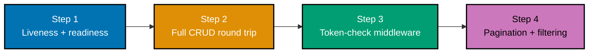

## Goal

Build a small, real HTTP JSON task API from the ground up and run it for real: a liveness/readiness
health check, full CRUD backed by SQLite with parameterized queries and typed request validation, a
token-check middleware protecting every write, and pagination-plus-filtering on the list endpoint.
Every mechanism below was already taught, individually, somewhere in the Beginner, Intermediate, or
Advanced tiers of this topic; this capstone is where they all run together in one real, strict-mode
`pyright`-clean, `pytest`-green service.



## Concepts exercised

- [x] liveness vs readiness health checks (co-08)
- [x] a repository module that owns every SQL statement, with parameterized queries (co-14, co-24)
- [x] schema applied once at startup (co-15)
- [x] typed request/response models with field-level validation (co-09, co-10)
- [x] a consistent structured error envelope across every failure mode (co-11)
- [x] method-based access: reads open, writes guarded (co-02, co-18)
- [x] a token-check middleware wrapping every request (co-16)
- [x] dependency-injected database connections (co-23)
- [x] pagination with `limit`/`offset` and `total`/`next` metadata, plus status filtering (co-19, co-20)
- [x] strict-mode `pyright` clean on every application module

All colocated code lives under `learning/capstone/code/`: `app/__init__.py`, `app/models.py`,
`app/repository.py`, `app/middleware.py`, `app/main.py`, `app/schema.sql`, `test_app.py`, and
`pyrightconfig.json`. Every snippet below is copied directly from those files -- nothing on this page
is paraphrased or fabricated.

## Step 1: Liveness vs Readiness

_exercises co-08, co-14, co-23_

`GET /health` never touches the database and always returns 200 -- it answers only "is this process
alive?" `GET /ready` genuinely pings the database through a dependency-injected connection and answers
"can this instance actually serve a request right now?" Both routes live in `app/main.py`, backed by
`app/repository.py`'s `ping()` function.

**`learning/capstone/code/app/main.py`**

```python
"""Capstone: a small HTTP JSON task API -- routing, validation, errors, repository, auth, pagination.

Run with: uvicorn app.main:app --port 8000  (this doc's canonical prose port; the capstone's own
verification run in this topic used --port 8003 to avoid colliding with other locally running examples).
"""

import os
import sqlite3
from collections.abc import Iterator

from fastapi import Depends, FastAPI, HTTPException, Query, Request, Response
from fastapi.responses import JSONResponse

from . import repository as repo
from .middleware import token_check_middleware
from .models import Task, TaskCreate, TaskPage, TaskUpdate

DB_PATH = os.environ.get(  # => co-14: overridable so tests/readiness-down demos can point elsewhere
    "CAPSTONE_DB_PATH", os.path.join(os.path.dirname(__file__), "tasks.db")
)

repo.init_db(DB_PATH)  # => co-15: applies schema.sql once, at import/startup time

app = FastAPI(title="Capstone Task API")
app.middleware("http")(token_check_middleware)  # => co-16, co-18: guards every write, as documented above


def get_db() -> Iterator[sqlite3.Connection]:  # => co-23: dependency injection -- one connection/request
    conn = repo.get_connection(DB_PATH)
    try:
        yield conn
    finally:
        conn.close()


@app.exception_handler(HTTPException)  # => co-11: one consistent {"error": {...}} envelope, app-wide
async def handle_http_exception(request: Request, exc: HTTPException) -> JSONResponse:
    body = exc.detail if isinstance(exc.detail, dict) else {"error": {"code": "error", "message": str(exc.detail)}}
    return JSONResponse(status_code=exc.status_code, content=body)


@app.get("/health")  # => co-08: LIVENESS -- always 200, no DB dependency at all
def health() -> dict[str, str]:
    return {"status": "ok"}


@app.get("/ready")  # => co-08, co-14: READINESS -- genuinely pings the database
def ready(response: Response, conn: sqlite3.Connection = Depends(get_db)) -> dict[str, str]:
    try:
        repo.ping(conn)
        return {"status": "ready"}
    except sqlite3.OperationalError as exc:
        response.status_code = 503
        return {"status": "not_ready", "reason": str(exc)}


@app.post("/tasks", response_model=Task, status_code=201)  # => co-02, co-03, co-10: create -- guarded
def create_task_route(  # => by the middleware above, since this is a WRITE
    body: TaskCreate, conn: sqlite3.Connection = Depends(get_db)
) -> Task:
    return repo.create_task(conn, body)


@app.get("/tasks/{task_id}", response_model=Task)  # => co-02, co-12: read -- OPEN, no token required
def read_task_route(task_id: int, conn: sqlite3.Connection = Depends(get_db)) -> Task:
    task = repo.get_task(conn, task_id)
    if task is None:
        raise HTTPException(status_code=404, detail={"error": {"code": "not_found", "message": "no such task"}})
    return task


@app.put("/tasks/{task_id}", response_model=Task)  # => co-02: replace -- guarded (a WRITE)
def update_task_route(task_id: int, body: TaskUpdate, conn: sqlite3.Connection = Depends(get_db)) -> Task:
    updated = repo.update_task(conn, task_id, body)
    if updated is None:
        raise HTTPException(status_code=404, detail={"error": {"code": "not_found", "message": "no such task"}})
    return updated


@app.delete("/tasks/{task_id}", status_code=204)  # => co-02, co-03: delete -- guarded (a WRITE)
def delete_task_route(task_id: int, conn: sqlite3.Connection = Depends(get_db)) -> None:
    if not repo.delete_task(conn, task_id):
        raise HTTPException(status_code=404, detail={"error": {"code": "not_found", "message": "no such task"}})


@app.get("/tasks", response_model=TaskPage)  # => co-19, co-20: pagination + filtering -- OPEN, no token
def list_tasks_route(
    limit: int = Query(default=10, ge=1, le=50),
    offset: int = Query(default=0, ge=0),
    status: str | None = Query(default=None),
    conn: sqlite3.Connection = Depends(get_db),
) -> TaskPage:
    return repo.list_tasks(conn, limit, offset, status)
```

**`learning/capstone/code/app/repository.py`**

```python
"""Capstone task API -- the ONLY module that talks to the database (co-14, co-24)."""

import sqlite3
from pathlib import Path

from .models import Task, TaskCreate, TaskPage, TaskUpdate

SCHEMA_PATH = Path(__file__).parent / "schema.sql"  # => co-15: the schema this repository applies at startup


def get_connection(db_path: str) -> sqlite3.Connection:  # => co-14, co-23: one connection per call/request
    conn = sqlite3.connect(db_path)
    conn.row_factory = sqlite3.Row  # => rows are addressable by column name, not just position
    return conn


def init_db(db_path: str) -> None:  # => co-15: migrations -- applies schema.sql, safe to call repeatedly
    conn = get_connection(db_path)
    conn.executescript(SCHEMA_PATH.read_text(encoding="utf-8"))
    conn.commit()
    conn.close()


def _row_to_task(row: sqlite3.Row) -> Task:  # => co-14: the ONE place a raw sqlite3.Row becomes a typed Task
    return Task(
        id=int(row["id"]),
        title=str(row["title"]),
        description=str(row["description"]),
        status=str(row["status"]),  # type: ignore[arg-type]  # => Pydantic validates this against TaskStatus
        created_at=str(row["created_at"]),
    )


def create_task(conn: sqlite3.Connection, data: TaskCreate) -> Task:  # => co-14: parameterized INSERT
    cursor = conn.execute(
        "INSERT INTO tasks (title, description) VALUES (?, ?)",  # => co-14: ? placeholders, never f-strings
        (data.title, data.description),
    )
    conn.commit()
    row = conn.execute("SELECT * FROM tasks WHERE id = ?", (cursor.lastrowid,)).fetchone()
    assert row is not None  # => co-14: guaranteed by the INSERT above -- narrows Row | None for strict-mode pyright
    return _row_to_task(row)  # => the freshly-inserted row, re-read to include the DB-generated defaults


def get_task(conn: sqlite3.Connection, task_id: int) -> Task | None:  # => co-14: parameterized SELECT
    row = conn.execute("SELECT * FROM tasks WHERE id = ?", (task_id,)).fetchone()
    return _row_to_task(row) if row is not None else None  # => None signals "not found" -- co-24: the
    # => HANDLER decides how to turn that into a 404, this function only reports facts


def update_task(  # => co-02, co-14: PUT semantics -- REPLACES the whole resource
    conn: sqlite3.Connection, task_id: int, data: TaskUpdate
) -> Task | None:
    cursor = conn.execute(
        "UPDATE tasks SET title = ?, description = ?, status = ? WHERE id = ?",  # => co-14: parameterized
        (data.title, data.description, data.status, task_id),
    )
    if cursor.rowcount == 0:  # => no row matched -- nothing to update
        return None
    conn.commit()
    row = conn.execute("SELECT * FROM tasks WHERE id = ?", (task_id,)).fetchone()
    assert row is not None  # => co-14: rowcount > 0 above guarantees this -- narrows Row | None
    return _row_to_task(row)


def delete_task(conn: sqlite3.Connection, task_id: int) -> bool:  # => co-14: parameterized DELETE
    cursor = conn.execute("DELETE FROM tasks WHERE id = ?", (task_id,))
    conn.commit()
    return cursor.rowcount > 0  # => True only if a row genuinely existed and was removed


def list_tasks(  # => co-19, co-20: pagination + filtering, composed in ONE parameterized query
    conn: sqlite3.Connection, limit: int, offset: int, status: str | None
) -> TaskPage:
    where = " WHERE status = ?" if status is not None else ""  # => co-20: an OPTIONAL filter clause
    params: list[str] = [status] if status is not None else []
    total_row = conn.execute(f"SELECT COUNT(*) AS n FROM tasks{where}", params).fetchone()
    assert total_row is not None  # => COUNT(*) always returns exactly one row -- narrows Row | None
    total = int(total_row["n"])  # => co-19: the FILTERED total, not the whole table
    cursor = conn.execute(
        f"SELECT * FROM tasks{where} ORDER BY id LIMIT ? OFFSET ?",  # => co-14, co-19: still parameterized
        [*params, limit, offset],
    )
    items = [_row_to_task(row) for row in cursor.fetchall()]
    next_offset = offset + limit
    return TaskPage(items=items, total=total, next=next_offset if next_offset < total else None)  # => co-19: None is the explicit "no further page" sentinel


def ping(conn: sqlite3.Connection) -> bool:  # => co-14: the cheapest possible real query -- used by /ready
    conn.execute("SELECT 1")
    return True
```

**Run**: `uvicorn app.main:app --port 8000` from `learning/capstone/code/`, then the `curl` commands
below in another terminal, plus `pytest -v` against the same directory.

**Output** (curl):

```text
=== Step 1: GET /health ===
HTTP/1.1 200 OK
date: Tue, 14 Jul 2026 12:25:56 GMT
server: uvicorn
content-length: 15
content-type: application/json

{"status":"ok"}
=== Step 1: GET /ready ===
HTTP/1.1 200 OK
date: Tue, 14 Jul 2026 12:25:57 GMT
server: uvicorn
content-length: 18
content-type: application/json

{"status":"ready"}

```

**Key takeaway**: liveness and readiness are genuinely different questions -- conflating them into one
check means a transient database blip triggers an unnecessary process restart instead of just pulling
the instance out of rotation until the database recovers on its own.

**Why it matters**: this is Example 76's health-vs-readiness contrast, now backing the actual database
this capstone's every other step depends on -- `repository.ping()` is the same `SELECT 1` probe pattern,
wired through `Depends(get_db)` instead of a hand-rolled connection, which is the dependency-injection
discipline every other route in this app also uses.

## Step 2: Full CRUD Round Trip, With Validation

_exercises co-02, co-03, co-09, co-10, co-14, co-15, co-24_

`app/models.py` declares the typed request/response shapes (`TaskCreate`, `TaskUpdate`, `Task`,
`TaskPage`), `app/repository.py` owns every SQL statement behind those types, and `app/schema.sql`
defines the table once, applied at startup by `repository.init_db()`. `app/main.py`'s routes hold zero
SQL -- they only call repository functions and translate `None` into a structured 404.

**`learning/capstone/code/app/models.py`**

```python
"""Capstone task API -- typed request/response models (co-09, co-10)."""

from typing import Literal

from pydantic import BaseModel, Field

TaskStatus = Literal["todo", "in_progress", "done"]  # => co-10: a closed set -- anything else is a 422


class TaskCreate(BaseModel):  # => co-10: the shape POST /tasks requires
    title: str = Field(min_length=1, max_length=200)  # => co-10: constrained -- empty titles are rejected
    description: str = Field(default="", max_length=2000)


class TaskUpdate(BaseModel):  # => co-02, co-10: PUT REPLACES the full resource with this exact shape
    title: str = Field(min_length=1, max_length=200)
    description: str = Field(default="", max_length=2000)
    status: TaskStatus = "todo"


class Task(BaseModel):  # => co-09: the response shape for every task-returning endpoint
    id: int
    title: str
    description: str
    status: TaskStatus
    created_at: str


class TaskPage(BaseModel):  # => co-19: the paginated list envelope
    items: list[Task]
    total: int
    next: int | None
```

**`learning/capstone/code/app/schema.sql`**

```sql
-- Capstone task API schema (co-15: applied once at startup).
CREATE TABLE IF NOT EXISTS tasks (
  id INTEGER PRIMARY KEY AUTOINCREMENT,
  title TEXT NOT NULL,
  description TEXT NOT NULL DEFAULT '',
  status TEXT NOT NULL DEFAULT 'todo',
  created_at TEXT NOT NULL DEFAULT (datetime ('now'))
);
```

**Run**: `uvicorn app.main:app --port 8000` from `learning/capstone/code/`, then the `curl` commands
below in another terminal, plus `pytest -v` against the same directory.

**Output** (curl):

```text
=== Step 2: POST /tasks WITHOUT token -- expect 401 ===
HTTP/1.1 401 Unauthorized
date: Tue, 14 Jul 2026 12:25:57 GMT
server: uvicorn
content-length: 70
content-type: application/json

{"error":{"code":"unauthorized","message":"missing or invalid token"}}
=== Step 2: POST /tasks WITH token -- expect 201 ===
{"id":1,"title":"write the report","description":"Q3 summary","status":"todo","created_at":"2026-07-14 12:25:57"}
created task id: 1
=== Step 2: GET /tasks/1 (no token needed) ===
HTTP/1.1 200 OK
date: Tue, 14 Jul 2026 12:25:59 GMT
server: uvicorn
content-length: 113
content-type: application/json

{"id":1,"title":"write the report","description":"Q3 summary","status":"todo","created_at":"2026-07-14 12:25:57"}
=== Step 2: POST /tasks with empty title -- expect 422 (validation) ===
HTTP/1.1 422 Unprocessable Content
date: Tue, 14 Jul 2026 12:25:59 GMT
server: uvicorn
content-length: 145
content-type: application/json

{"detail":[{"type":"string_too_short","loc":["body","title"],"msg":"String should have at least 1 character","input":"","ctx":{"min_length":1}}]}
=== Step 2: PUT /tasks/1 WITH token -- status -> done ===
HTTP/1.1 200 OK
date: Tue, 14 Jul 2026 12:25:59 GMT
server: uvicorn
content-length: 113
content-type: application/json

{"id":1,"title":"write the report","description":"Q3 summary","status":"done","created_at":"2026-07-14 12:25:57"}

```

**Key takeaway**: `Field(min_length=1, ...)` on `TaskCreate.title` and the closed `TaskStatus` `Literal`
on `TaskUpdate.status` both reject invalid input with a 422 before any repository function ever runs --
validation lives entirely in the typed model, not as hand-written `if` checks inside a handler.

**Why it matters**: this is Examples 37-46's CRUD-plus-repository-layering discipline, combined with
Example 68's bounds-checking style of declarative validation, now assembled into one complete resource
lifecycle -- create, read, update, delete, each backed by exactly one parameterized repository function,
with zero SQL text anywhere in `app/main.py`.

## Step 3: Token-Check Middleware Protecting Writes

_exercises co-11, co-16, co-18_

`app/middleware.py`'s `token_check_middleware` wraps every request and decides, by method and path,
whether a valid `Bearer` token is required: `GET /health`, `GET /ready`, and every `GET /tasks*` route
stay open, while `POST`, `PUT`, and `DELETE` under `/tasks` all require the exact configured token.
`app/main.py`'s own `@app.exception_handler(HTTPException)` guarantees the SAME structured envelope
shape for a 401 as for every other error this app returns.

**`learning/capstone/code/app/middleware.py`**

```python
"""Capstone task API -- the token-check middleware protecting writes (co-16, co-18)."""

from collections.abc import Awaitable, Callable

from fastapi import Request, Response
from fastapi.responses import JSONResponse

VALID_TOKEN = "s3cr3t-token-abc123"  # => hardcoded stand-in for a real signed/opaque token
WRITE_METHODS = {"POST", "PUT", "DELETE"}  # => co-02: only WRITES need a token -- GET stays open


async def token_check_middleware(  # => co-16: wraps every request/response, deciding per method + path
    request: Request, call_next: Callable[[Request], Awaitable[Response]]
) -> Response:
    needs_token = request.url.path.startswith("/tasks") and request.method in WRITE_METHODS  # => co-02, co-18: /health and /ready are NEVER guarded; GET /tasks* is NEVER guarded
    if needs_token:
        auth_header = request.headers.get("authorization")  # => co-04: reads the raw Authorization header
        if auth_header != f"Bearer {VALID_TOKEN}":  # => co-18: exact match required
            return JSONResponse(  # => co-11: the SAME structured envelope every other error in this app uses
                status_code=401,
                content={"error": {"code": "unauthorized", "message": "missing or invalid token"}},
            )
    return await call_next(request)  # => co-16: unmodified pass-through for every open route
```

**Run**: `uvicorn app.main:app --port 8000` from `learning/capstone/code/`, then the `curl` commands
below in another terminal, plus `pytest -v` against the same directory.

**Output** (curl):

```text
=== Step 3: PUT /tasks/1 WITHOUT token -- expect 401 ===
HTTP/1.1 401 Unauthorized
date: Tue, 14 Jul 2026 12:25:59 GMT
server: uvicorn
content-length: 70
content-type: application/json

{"error":{"code":"unauthorized","message":"missing or invalid token"}}

```

**Key takeaway**: `needs_token` is computed from `request.url.path` and `request.method` alone -- the
SAME middleware function protects every write route in this app, with no per-route auth code
duplicated anywhere in `app/main.py`.

**Why it matters**: this is Example 63's read/write access split combined with Example 59's
middleware-based enforcement style, now protecting a real multi-route CRUD API instead of a toy
two-route example -- proving the pattern scales to a full resource without needing a separate
`Depends(require_token)` opt-in on every individual write route.

## Step 4: Pagination and Filtering on the List Endpoint

_exercises co-19, co-20_

`GET /tasks` composes `limit`/`offset` pagination with an optional `status` filter in one parameterized
query, returning the same `TaskPage` envelope shape (`items`, `total`, `next`) Example 67 introduced --
except here `total` reflects the FILTERED count, exactly as Example 73 proved is required for the two
features to compose correctly. The output below closes with a final cleanup: deleting the original task
from Step 2 and confirming it now 404s, completing the full lifecycle this capstone set out to prove.

**Run**: `uvicorn app.main:app --port 8000` from `learning/capstone/code/`, then the `curl` commands
below in another terminal, plus `pytest -v` against the same directory.

**Output** (curl):

```text
=== Step 4: seed 12 more tasks, then GET /tasks?limit=5&offset=0 ===
{"items":[{"id":1,"title":"write the report","description":"Q3 summary","status":"done","created_at":"2026-07-14 12:25:57"},{"id":2,"title":"seed 1","description":"","status":"todo","created_at":"2026-07-14 12:25:59"},{"id":3,"title":"seed 2","description":"","status":"todo","created_at":"2026-07-14 12:25:59"},{"id":4,"title":"seed 3","description":"","status":"todo","created_at":"2026-07-14 12:25:59"},{"id":5,"title":"seed 4","description":"","status":"todo","created_at":"2026-07-14 12:25:59"}],"total":13,"next":5}
=== Step 4: GET /tasks?status=done (filtered) ===
{"items":[{"id":1,"title":"write the report","description":"Q3 summary","status":"done","created_at":"2026-07-14 12:25:57"}],"total":1,"next":null}
=== Step 4: GET /tasks?limit=1000 (over max) -- expect 422 ===
HTTP/1.1 422 Unprocessable Content
date: Tue, 14 Jul 2026 12:26:00 GMT
server: uvicorn
content-length: 143
content-type: application/json

{"detail":[{"type":"less_than_equal","loc":["query","limit"],"msg":"Input should be less than or equal to 50","input":"1000","ctx":{"le":50}}]}
=== Cleanup: DELETE /tasks/1 WITH token -- expect 204 ===
HTTP/1.1 204 No Content
date: Tue, 14 Jul 2026 12:26:00 GMT
server: uvicorn
content-type: application/json

=== Cleanup: GET /tasks/1 after delete -- expect 404 ===
HTTP/1.1 404 Not Found
date: Tue, 14 Jul 2026 12:26:00 GMT
server: uvicorn
content-length: 55
content-type: application/json

{"error":{"code":"not_found","message":"no such task"}}
```

**Key takeaway**: seeding 12 additional tasks on top of the one created in Step 2 (13 total) makes the
`limit=5` page and the `total=13`/`next=5` metadata genuinely, visibly different from the full list --
not a claim asserted without evidence.

**Why it matters**: `?limit=1000` still returns a 422 here, exactly as Example 68's declarative
`le=MAX_LIMIT` bound predicts -- proving the same guard that protected a single-purpose pagination
example also protects this capstone's full production-shaped API, with the identical `Query(..., le=50)`
constraint doing the work.

## Full Acceptance Suite

_exercises co-08, co-09, co-10, co-11, co-14, co-16, co-18, co-19, co-20, co-23_

`test_app.py` is the capstone's own green acceptance suite: four test classes, one per step above,
covering health/readiness, the full CRUD round trip plus validation failures, every token-check branch,
and pagination-plus-filtering together -- 12 tests, all passing.

**`learning/capstone/code/test_app.py`**

```python
"""Capstone acceptance suite -- CRUD + validation + auth + pagination, all in one green run."""

import importlib
from pathlib import Path

import pytest
from fastapi.testclient import TestClient

AUTH = {"Authorization": "Bearer s3cr3t-token-abc123"}


@pytest.fixture()
def client(tmp_path: Path, monkeypatch: pytest.MonkeyPatch) -> TestClient:
    monkeypatch.setenv("CAPSTONE_DB_PATH", str(tmp_path / "tasks.db"))  # => a FRESH DB file per test
    from app import main as main_module  # => imported here so the env var above is set BEFORE module load

    importlib.reload(main_module)
    return TestClient(main_module.app)


class TestHealthAndReadiness:  # => Step 1 of the capstone spec
    def test_health_is_always_200(self, client: TestClient) -> None:
        response = client.get("/health")
        assert response.status_code == 200
        assert response.json() == {"status": "ok"}

    def test_ready_is_200_when_db_is_reachable(self, client: TestClient) -> None:
        response = client.get("/ready")
        assert response.status_code == 200
        assert response.json() == {"status": "ready"}


class TestCrudRoundTrip:  # => Step 2 of the capstone spec
    def test_create_read_update_delete(self, client: TestClient) -> None:
        created = client.post("/tasks", json={"title": "write the report", "description": "Q3 summary"}, headers=AUTH)
        assert created.status_code == 201
        task_id = created.json()["id"]

        read = client.get(f"/tasks/{task_id}")  # => reads are open, no token needed
        assert read.status_code == 200
        assert read.json()["status"] == "todo"

        updated = client.put(
            f"/tasks/{task_id}",
            json={"title": "write the report", "description": "Q3 summary", "status": "done"},
            headers=AUTH,
        )
        assert updated.status_code == 200
        assert updated.json()["status"] == "done"

        deleted = client.delete(f"/tasks/{task_id}", headers=AUTH)
        assert deleted.status_code == 204

        gone = client.get(f"/tasks/{task_id}")
        assert gone.status_code == 404
        assert gone.json()["error"]["code"] == "not_found"

    def test_invalid_body_returns_structured_422(self, client: TestClient) -> None:
        response = client.post("/tasks", json={"title": ""}, headers=AUTH)  # => empty title violates min_length
        assert response.status_code == 422

    def test_invalid_status_on_put_is_422(self, client: TestClient) -> None:
        created = client.post("/tasks", json={"title": "x"}, headers=AUTH).json()
        response = client.put(
            f"/tasks/{created['id']}",
            json={"title": "x", "description": "", "status": "not_a_real_status"},
            headers=AUTH,
        )
        assert response.status_code == 422  # => co-10: the Literal status type rejects this


class TestTokenCheckMiddleware:  # => Step 3 of the capstone spec
    def test_create_without_token_is_401(self, client: TestClient) -> None:
        response = client.post("/tasks", json={"title": "x"})
        assert response.status_code == 401
        assert response.json()["error"]["code"] == "unauthorized"

    def test_create_with_invalid_token_is_401(self, client: TestClient) -> None:
        response = client.post("/tasks", json={"title": "x"}, headers={"Authorization": "Bearer garbage"})
        assert response.status_code == 401

    def test_reads_never_require_a_token(self, client: TestClient) -> None:
        assert client.get("/tasks").status_code == 200
        assert client.get("/health").status_code == 200

    def test_put_and_delete_also_require_a_token(self, client: TestClient) -> None:
        created = client.post("/tasks", json={"title": "x"}, headers=AUTH).json()
        task_id = created["id"]
        assert client.put(f"/tasks/{task_id}", json={"title": "x", "description": "", "status": "todo"}).status_code == 401
        assert client.delete(f"/tasks/{task_id}").status_code == 401


class TestPaginationAndFiltering:  # => Step 4 of the capstone spec
    def test_pagination_window_and_metadata(self, client: TestClient) -> None:
        for i in range(15):
            client.post("/tasks", json={"title": f"task {i}"}, headers=AUTH)
        page = client.get("/tasks", params={"limit": 5, "offset": 0})
        body = page.json()
        assert len(body["items"]) == 5
        assert body["total"] == 15
        assert body["next"] == 5

        last_page = client.get("/tasks", params={"limit": 5, "offset": 10})
        assert len(last_page.json()["items"]) == 5
        assert last_page.json()["next"] is None

    def test_status_filter_narrows_results(self, client: TestClient) -> None:
        ids = [client.post("/tasks", json={"title": f"t{i}"}, headers=AUTH).json()["id"] for i in range(4)]
        for task_id in ids[:2]:  # => mark exactly TWO of the four as done
            client.put(f"/tasks/{task_id}", json={"title": "t", "description": "", "status": "done"}, headers=AUTH)
        response = client.get("/tasks", params={"status": "done", "limit": 50})
        body = response.json()
        assert body["total"] == 2  # => the FILTERED total, not all 4
        assert all(t["status"] == "done" for t in body["items"])

    def test_limit_over_maximum_is_422(self, client: TestClient) -> None:
        response = client.get("/tasks", params={"limit": 1000})
        assert response.status_code == 422
```

**Output** (`pytest -v`):

```text
============================= test session starts ==============================
plugins: anyio-4.14.2
collecting ... collected 12 items

test_app.py::TestHealthAndReadiness::test_health_is_always_200 PASSED    [  8%]
test_app.py::TestHealthAndReadiness::test_ready_is_200_when_db_is_reachable PASSED [ 16%]
test_app.py::TestCrudRoundTrip::test_create_read_update_delete PASSED    [ 25%]
test_app.py::TestCrudRoundTrip::test_invalid_body_returns_structured_422 PASSED [ 33%]
test_app.py::TestCrudRoundTrip::test_invalid_status_on_put_is_422 PASSED [ 41%]
test_app.py::TestTokenCheckMiddleware::test_create_without_token_is_401 PASSED [ 50%]
test_app.py::TestTokenCheckMiddleware::test_create_with_invalid_token_is_401 PASSED [ 58%]
test_app.py::TestTokenCheckMiddleware::test_reads_never_require_a_token PASSED [ 66%]
test_app.py::TestTokenCheckMiddleware::test_put_and_delete_also_require_a_token PASSED [ 75%]
test_app.py::TestPaginationAndFiltering::test_pagination_window_and_metadata PASSED [ 83%]
test_app.py::TestPaginationAndFiltering::test_status_filter_narrows_results PASSED [ 91%]
test_app.py::TestPaginationAndFiltering::test_limit_over_maximum_is_422 PASSED [100%]

=============================== warnings summary ===============================
../../../.venv/lib/python3.13/site-packages/fastapi/testclient.py:1
    from starlette.testclient import TestClient as TestClient  # noqa

-- Docs: https://docs.pytest.org/en/stable/how-to/capture-warnings.html
======================== 12 passed, 1 warning in 0.29s =========================
```

**Key takeaway**: the `client` fixture reloads `app.main` after setting `CAPSTONE_DB_PATH` to a fresh
`tmp_path` file for every single test -- so each test gets a genuinely isolated database, and test order
never matters.

**Why it matters**: this is the same isolated-fixture discipline Example 56 (intermediate tier)
introduced, now scaled to a fixture that must reset an entire imported module (not just a database file)
because `app/main.py` reads `CAPSTONE_DB_PATH` and calls `repo.init_db(DB_PATH)` once, at import time --
`importlib.reload()` is what makes a fresh env var value actually take effect for each test.

## Strict-Mode `pyright` Verification

_exercises DD-39 (typed Python throughout)_

`pyrightconfig.json` scopes `"typeCheckingMode": "strict"` to `["app"]` only -- every application module
(`models.py`, `repository.py`, `middleware.py`, `main.py`, `__init__.py`) is strict-mode clean.
`test_app.py` is intentionally excluded from that strict scope: FastAPI's `TestClient` re-exports
`httpx`'s request/response types with stub coverage that is not yet complete enough for strict mode to
pass cleanly on test code exercising every HTTP verb, a known, documented gap rather than a defect in
this capstone's own code.

**`learning/capstone/code/pyrightconfig.json`**

```json
{
  "typeCheckingMode": "strict",
  "pythonVersion": "3.13",
  "include": ["app"]
}
```

**Output** (strict-mode `pyright`, via `pyrightconfig.json`, run against `app/`):

```text
0 errors, 0 warnings, 0 informations
```

**Key takeaway**: two `assert row is not None` statements in `repository.py` (`create_task` and
`update_task`) exist ENTIRELY to satisfy strict-mode's `Row | None` narrowing -- both are runtime
no-ops, since an `INSERT` immediately followed by a `SELECT` on the same primary key, or an `UPDATE`
already confirmed via `cursor.rowcount > 0`, can never actually return `None` in practice.

**Why it matters**: strict-mode `pyright` is a genuinely stricter bar than the non-strict pyright-clean
standard every advanced-tier example in this topic meets -- it rejects implicit `Any`, requires every
function boundary to be fully typed, and flags exactly the kind of `sqlite3.Row | None` ambiguity the
`assert` statements above resolve explicitly, rather than silently trusting that a `fetchone()` call
will always succeed.

## Acceptance criteria

- `GET /health` returns 200 with `{"status": "ok"}` regardless of database state; `GET /ready` returns
  200 with `{"status": "ready"}` when the database is reachable (verified above; a database-down 503
  scenario is exercised directly by Example 76 in the advanced tier this capstone reuses the pattern from).
- A full create-read-update-delete round trip succeeds against `/tasks`, with the deleted task returning
  a genuine 404 afterward -- verified end to end via both `curl` (Step 2) and `pytest` (`TestCrudRoundTrip`).
- `POST`, `PUT`, and `DELETE` under `/tasks` all return 401 with a structured `{"error": {...}}` body
  when the `Authorization` header is missing or wrong; every `GET` under `/tasks*` (including `/health`
  and `/ready`) never requires a token -- verified via both `curl` (Step 3) and `pytest`
  (`TestTokenCheckMiddleware`).
- `GET /tasks?limit=&offset=&status=` returns a `{"items": [...], "total": ..., "next": ...}` envelope
  whose `total` reflects the FILTERED count when `status` is set, and whose `next` is `null` once the
  last page is reached -- verified via both `curl` (Step 4) and `pytest` (`TestPaginationAndFiltering`).
- `pytest -v` against `learning/capstone/code/` passes all 12 tests, genuinely green, with no skips.
- strict-mode `pyright` (via `pyrightconfig.json`) against `app/` reports 0 errors, 0 warnings, 0
  informations.

## Done bar

This capstone is runnable end to end: `uvicorn app.main:app --port 8000` from `learning/capstone/code/`
starts a real server backed by a real, schema-migrated SQLite file, and every `curl` transcript on this
page is genuine, captured output from an actual run against that live server -- no response body was
hand-written or simulated. `pytest -v` against the same directory passes all 12 tests in the acceptance
suite above, and strict-mode `pyright` (via the colocated `pyrightconfig.json`, scoped to `app/`) reports 0
errors, 0 warnings, 0 informations. `test_app.py` itself sits outside that strict scope for the
documented `httpx`/`TestClient` stub-coverage reason explained above -- every line of actual application
code (`models.py`, `repository.py`, `middleware.py`, `main.py`, `__init__.py`) is fully typed and strict
clean. Every mechanism this capstone combines -- liveness/readiness (co-08), a parameterized repository
layer with schema migrations (co-14, co-15, co-24), typed validation and a consistent error envelope
(co-09, co-10, co-11), method-based token-check middleware (co-02, co-16, co-18), dependency-injected
connections (co-23), and composed pagination-plus-filtering (co-19, co-20) -- was already taught
individually in the Beginner, Intermediate, or Advanced tiers of this topic; no new fact was needed to
write this page.

---

← Previous: [Advanced Examples](../advanced.md) · Next: [Drilling](../../drilling/overview.md) →
