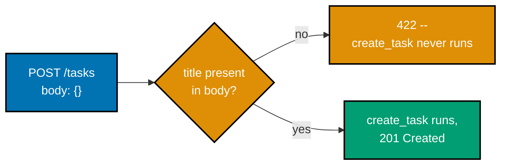
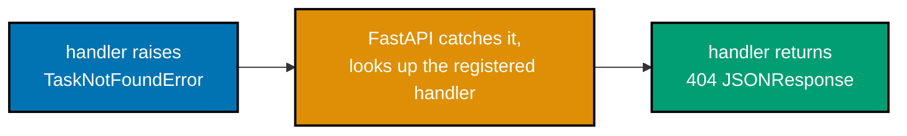
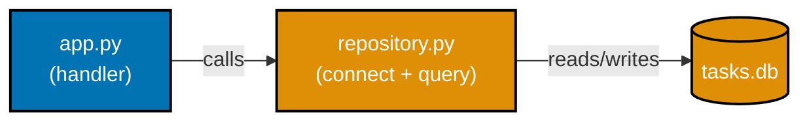
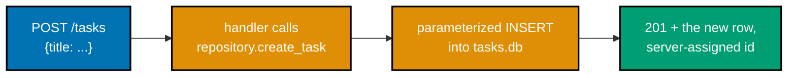
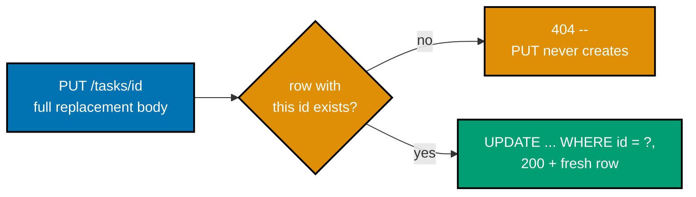
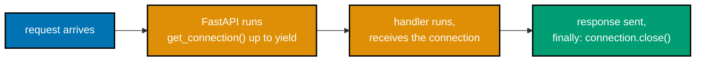
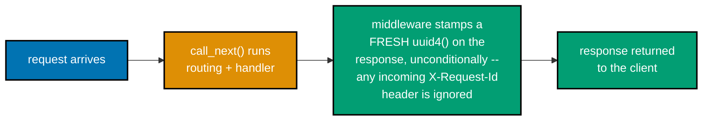
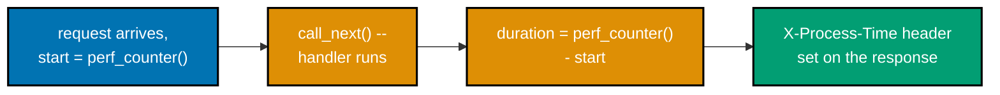
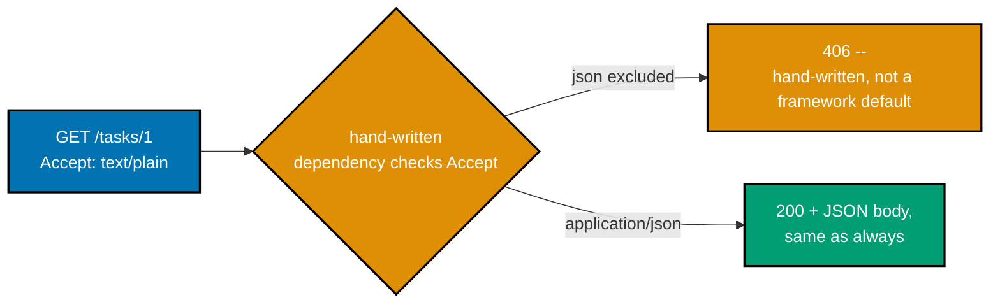
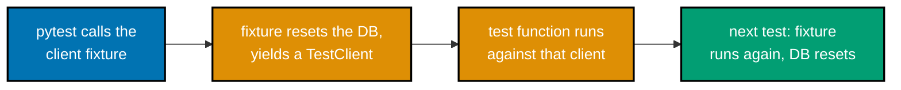

Examples 29-56 turn the beginner tier's single-file FastAPI handlers into a small, real task-management HTTP service: structured validation and custom error envelopes (29-34), a SQLite-backed repository layer with parameterized queries and full CRUD (35-42), schema migrations (43-44), typed repository return values and dependency-injected connections (45-47), hand-written middleware and content negotiation (48-54), and a persisted create-then-read round trip closed out by an explicit pytest `TestClient` fixture (55-56). Starting at Example 35, every server actually ran on port 8000 during verification and every response shown below is real, captured `curl` output -- and starting at the same example, every persistence-backed example also has a real, captured `pytest -v` run alongside it. Swapping SQLite for PostgreSQL later (via `psycopg` or `asyncpg`) would mean rewriting what is inside `repository.py`, never touching a handler in `app.py` -- the repository interface is the seam that change would land on.

---

### Example 29: A Missing Required Field Fails Validation

_ex-29 &middot; exercises co-10, co-11_

Pydantic validates a request body against `TaskCreate` before the handler function ever runs -- when a required field like `title` is missing, FastAPI never reaches `create_task` at all and instead returns a structured 422 response on its own.



**`learning/code/ex-29-validation-required-field/app.py`**

```python
"""Example 29: Validation -- Required Field."""

from fastapi import FastAPI  # => the web framework whose validation layer this example exercises
from pydantic import BaseModel  # => Pydantic models are FastAPI's validation vocabulary

app = FastAPI()  # => the ASGI application uvicorn will serve


class TaskCreate(BaseModel):  # => the shape of a valid POST /tasks body
    title: str  # => no default value -- Pydantic treats this as REQUIRED


@app.post("/tasks", status_code=201)  # => co-08: a handler for creating a task
def create_task(task: TaskCreate) -> dict[str, str]:  # => "task" only exists if validation passed
    # => FastAPI parses+validates the JSON body against TaskCreate BEFORE this
    #    line ever runs -- an invalid body never reaches this function body
    return {"title": task.title}  # => echoes back the validated field
```

**Run**: `uvicorn app:app --port 8000` in one terminal, then the `curl` commands below in another, plus `pytest -v` against the same directory.

**Output** (curl):

```text
$ curl -s -w "\nHTTP %{http_code}\n" -X POST http://localhost:8000/tasks -H "Content-Type: application/json" -d '{}'
{"detail":[{"type":"missing","loc":["body","title"],"msg":"Field required","input":{}}]}
HTTP 422
```

**Output** (`pytest -v`):

```text
============================= test session starts ==============================
plugins: anyio-4.14.2
collecting ... collected 2 items

test_app.py::test_missing_title_returns_422 PASSED                       [ 50%]
test_app.py::test_valid_title_returns_201 PASSED                         [100%]

=============================== warnings summary ===============================
../../../.venv/lib/python3.13/site-packages/fastapi/testclient.py:1
-- Docs: https://docs.pytest.org/en/stable/how-to/capture-warnings.html
========================= 2 passed, 1 warning in 0.14s =========================
```

**Key takeaway**: A required field with no default makes Pydantic itself the first line of defense -- the handler body only ever sees a `TaskCreate` that already satisfies the shape.

**Why it matters**: Every backend eventually receives a malformed request, and the question is where that gets caught. Letting Pydantic reject bad input before the handler runs means the handler code can assume its parameters are already valid, which is a large simplification: no defensive `if title is None` checks scattered through business logic, no risk of a null title reaching the database. The 422 status and the machine-readable `detail` array are FastAPI defaults, not something this example wrote by hand.

---

### Example 30: A Wrong Type Also Fails Validation

_ex-30 &middot; exercises co-10, co-11_

Pydantic checks type, not just presence -- sending the string `"urgent"` where `priority: int` is declared produces a 422 with `type: "int_parsing"`, while a numeric string like `"3"` is coerced to `3` and accepted.

**`learning/code/ex-30-validation-wrong-type/app.py`**

```python
"""Example 30: Validation -- Wrong Type."""

from fastapi import FastAPI  # => the web framework whose validation layer this example exercises
from pydantic import BaseModel  # => Pydantic models are FastAPI's validation vocabulary

app = FastAPI()  # => the ASGI application uvicorn will serve


class TaskCreate(BaseModel):  # => the shape of a valid POST /tasks body
    title: str  # => any string is acceptable here
    priority: int  # => MUST be an int -- a non-numeric string fails validation


@app.post("/tasks", status_code=201)  # => co-08: a handler for creating a task
def create_task(task: TaskCreate) -> dict[str, str | int]:  # => the union return type: str or int values
    # => co-10: FastAPI parses+validates the body against TaskCreate first --
    #    a non-numeric "priority" never reaches this line at all
    return {"title": task.title, "priority": task.priority}  # => both fields, already the right types
```

**Run**: `uvicorn app:app --port 8000` in one terminal, then the `curl` commands below in another, plus `pytest -v` against the same directory.

**Output** (curl):

```text
$ curl -s -w "\nHTTP %{http_code}\n" -X POST http://localhost:8000/tasks -H "Content-Type: application/json" -d '{"title": "Buy milk", "priority": "urgent"}'
{"detail":[{"type":"int_parsing","loc":["body","priority"],"msg":"Input should be a valid integer, unable to parse string as an integer","input":"urgent"}]}
HTTP 422
```

**Output** (`pytest -v`):

```text
============================= test session starts ==============================
plugins: anyio-4.14.2
collecting ... collected 2 items

test_app.py::test_non_numeric_priority_returns_422 PASSED                [ 50%]
test_app.py::test_numeric_priority_is_coerced_and_accepted PASSED        [100%]

=============================== warnings summary ===============================
../../../.venv/lib/python3.13/site-packages/fastapi/testclient.py:1
-- Docs: https://docs.pytest.org/en/stable/how-to/capture-warnings.html
========================= 2 passed, 1 warning in 0.17s =========================
```

**Key takeaway**: FastAPI's validation is TYPE-aware, not just presence-aware -- a field can be present and still fail if its value cannot be coerced to the declared type.

**Why it matters**: Type coercion has a boundary, and knowing where it sits matters: `"3"` becomes `3` because Pydantic can unambiguously parse it, but `"urgent"` cannot become an int by any reasonable rule, so it is rejected instead of silently becoming `0` or `None`. This predictable, fail-loud behavior is what lets a handler declare `priority: int` and trust that a real integer -- not a string that merely looks numeric -- is what it receives.

---

### Example 31: Field Constraints Reject Out-of-Range Input

_ex-31 &middot; exercises co-10_

`Field(min_length=1)` and `Field(gt=0)` add constraints beyond a bare type -- an empty `title` or a `priority` of `0` both fail validation even though both are the RIGHT type.

**`learning/code/ex-31-validation-constraints/app.py`**

```python
"""Example 31: Validation -- Field Constraints."""

from fastapi import FastAPI  # => the web framework whose validation layer this example exercises
from pydantic import BaseModel, Field  # => Field() attaches constraints beyond a bare type

app = FastAPI()  # => the ASGI application uvicorn will serve


class TaskCreate(BaseModel):  # => the shape of a valid POST /tasks body
    title: str = Field(min_length=1)  # => co-10: rejects an empty string, not just a missing field
    priority: int = Field(gt=0)  # => co-10: rejects zero or negative priorities


@app.post("/tasks", status_code=201)  # => co-08: a handler for creating a task
def create_task(task: TaskCreate) -> dict[str, str | int]:  # => the union return type: str or int values
    # => both constraints are enforced BEFORE this line runs -- an out-of-range
    #    "priority" or an empty "title" never reaches the handler body
    return {"title": task.title, "priority": task.priority}  # => both fields, already constraint-checked
```

**Run**: `uvicorn app:app --port 8000` in one terminal, then the `curl` commands below in another, plus `pytest -v` against the same directory.

**Output** (curl):

```text
$ curl -s -w "\nHTTP %{http_code}\n" -X POST http://localhost:8000/tasks -H "Content-Type: application/json" -d '{"title": "", "priority": 0}'
{"detail":[{"type":"string_too_short","loc":["body","title"],"msg":"String should have at least 1 character","input":"","ctx":{"min_length":1}},{"type":"greater_than","loc":["body","priority"],"msg":"Input should be greater than 0","input":0,"ctx":{"gt":0}}]}
HTTP 422
```

**Output** (`pytest -v`):

```text
============================= test session starts ==============================
plugins: anyio-4.14.2
collecting ... collected 3 items

test_app.py::test_empty_title_rejected PASSED                            [ 33%]
test_app.py::test_zero_priority_rejected PASSED                          [ 66%]
test_app.py::test_valid_body_accepted PASSED                             [100%]

=============================== warnings summary ===============================
../../../.venv/lib/python3.13/site-packages/fastapi/testclient.py:1
-- Docs: https://docs.pytest.org/en/stable/how-to/capture-warnings.html
========================= 3 passed, 1 warning in 0.15s =========================
```

**Key takeaway**: A type alone (`str`, `int`) only constrains SHAPE -- `Field(...)` constrains VALUES within that shape, and both checks run before the handler sees the data.

**Why it matters**: Business rules like "a title cannot be empty" or "priority must be positive" are validation concerns, not database concerns -- catching them here means the repository layer (introduced starting in Example 35) never has to re-check them, and a malformed row can never reach SQLite in the first place. Declaring the constraint once, on the model, is cheaper and harder to forget than re-validating it at every call site.

---

### Example 32: A Custom Error Envelope Replaces FastAPI's Default

_ex-32 &middot; exercises co-11_

FastAPI's own 422 body is `{"detail": [...]}` -- fine for debugging, but many API clients expect one stable `{"error": {"code", "message"}}` shape across every kind of failure. An `@app.exception_handler(RequestValidationError)` reshapes it by hand.

**`learning/code/ex-32-error-envelope/app.py`**

```python
"""Example 32: A Custom Error Envelope."""

# => FastAPI's DEFAULT 422 body is {"detail": [...]} -- fine for debugging,
#    awkward for a client that expects one stable {"error": {code, message}} shape
from fastapi import FastAPI, Request  # => Request gives the handler access to the raw ASGI request
from fastapi.exceptions import RequestValidationError  # => the exception FastAPI raises internally
from fastapi.responses import JSONResponse  # => the response type this handler builds by hand
from pydantic import BaseModel  # => Pydantic models are FastAPI's validation vocabulary

app = FastAPI()  # => the ASGI application uvicorn will serve


class TaskCreate(BaseModel):  # => the shape of a valid POST /tasks body
    title: str  # => required, no default


@app.exception_handler(RequestValidationError)  # => overrides FastAPI's DEFAULT 422 handler
async def validation_exception_handler(
    request: Request,  # => unused here, but FastAPI's handler signature always passes it
    exc: RequestValidationError,  # => exc carries every violation FastAPI found
) -> JSONResponse:  # => must return a Response FastAPI can send back to the client
    # => co-11: reshape the default {"detail": [...]} array into a bespoke,
    #    project-specific envelope -- {"error": {"code", "message"}}
    first_error = exc.errors()[0]  # => take the first offending field for a concise message
    field = ".".join(  # => joins the loc TUPLE into one dotted field path string
        str(part)
        for part in first_error["loc"]
        if part != "body"  # => drops the generic "body" segment
    )  # => e.g. "title" (drops the generic "body" location segment)
    return JSONResponse(  # => builds the bespoke envelope BY HAND -- no automatic reshaping exists
        status_code=422,  # => co-03: still 422 -- only the BODY shape changed, not the status
        content={  # => the JSON body FastAPI serializes and sends back to the client
            "error": {  # => nests everything under ONE top-level key, unlike the default array
                "code": "validation_error",  # => a stable, machine-matchable code
                "message": f"{field}: {first_error['msg']}",  # => a human-readable summary
            }  # => closes the inner "error" object
        },  # => closes the "content" dict passed to JSONResponse
    )  # => closes the JSONResponse(...) call itself


@app.post("/tasks", status_code=201)  # => co-08: a handler for creating a task
def create_task(task: TaskCreate) -> dict[str, str]:  # => "task" only exists if validation passed
    return {"title": task.title}  # => the happy path is untouched by the envelope override
```

**Run**: `uvicorn app:app --port 8000` in one terminal, then the `curl` commands below in another, plus `pytest -v` against the same directory.

**Output** (curl):

```text
$ curl -s -w "\nHTTP %{http_code}\n" -X POST http://localhost:8000/tasks -H "Content-Type: application/json" -d '{}'
{"error":{"code":"validation_error","message":"title: Field required"}}
HTTP 422
```

**Output** (`pytest -v`):

```text
============================= test session starts ==============================
plugins: anyio-4.14.2
collecting ... collected 2 items

test_app.py::test_missing_title_returns_custom_envelope PASSED           [ 50%]
test_app.py::test_valid_body_is_unaffected PASSED                        [100%]

=============================== warnings summary ===============================
../../../.venv/lib/python3.13/site-packages/fastapi/testclient.py:1
-- Docs: https://docs.pytest.org/en/stable/how-to/capture-warnings.html
========================= 2 passed, 1 warning in 0.16s =========================
```

**Key takeaway**: `@app.exception_handler(...)` intercepts FastAPI's own internally raised exceptions -- the envelope shape becomes a project-wide decision, not something re-derived at every route.

**Why it matters**: A client integrating against this API only has to parse ONE error shape, regardless of whether the failure came from validation, a missing resource, or a server bug -- the later examples in this batch (Example 33's domain-error handler, Example 42's DB-backed 404s, Example 52's sanitized 500s) all converge on this same `{"error": {"code", "message"}}` envelope, so client-side error handling is written once and reused everywhere.

---

### Example 33: A Domain Exception Maps to an HTTP Response

_ex-33 &middot; exercises co-11_

`TaskNotFoundError` is a plain Python exception that knows nothing about HTTP -- no status code, no JSON. A registered `@app.exception_handler(TaskNotFoundError)` is the ONE place that translation happens, keeping the handler function itself HTTP-status-free.



**`learning/code/ex-33-exception-handler/app.py`**

```python
"""Example 33: A Domain Exception Handler."""  # => module docstring for this example

# => the exception class below knows NOTHING about HTTP -- no status code, no
# => JSON -- that translation happens in exactly one place, the handler below
from fastapi import FastAPI, Request  # => Request gives the handler access to the raw ASGI request
from fastapi.responses import JSONResponse  # => the response type this handler builds by hand

app = FastAPI()  # => the ASGI application uvicorn will serve


class TaskNotFoundError(Exception):  # => a DOMAIN error -- knows nothing about HTTP
    def __init__(self, task_id: int) -> None:  # => constructor
        self.task_id = task_id  # => the id the caller asked for and did not get


@app.exception_handler(TaskNotFoundError)  # => co-11: maps the domain error to an HTTP shape
async def task_not_found_handler(  # => co-11: registered handler's signature spans three lines
    request: Request,
    exc: TaskNotFoundError,  # => exc carries the id that was missing
) -> JSONResponse:  # => must return a Response FastAPI can send back to the client
    return JSONResponse(  # => builds the 404 envelope by hand, same shape as Example 32's 422
        status_code=404,  # => co-03: not-found status, decided HERE, not in the handler
        content={  # => the JSON body FastAPI serializes and sends back to the client
            "error": {  # => nests everything under ONE top-level key, matching Example 32's shape
                "code": "task_not_found",  # => a stable, machine-matchable code
                "message": f"task {exc.task_id} does not exist",  # => a human-readable summary
            }  # => closes the inner "error" object
        },  # => closes the "content" dict passed to JSONResponse
    )  # => closes the JSONResponse(...) call itself


_TASKS: dict[int, str] = {1: "Buy milk", 2: "Walk dog"}  # => a tiny in-memory store for this example


@app.get("/tasks/{task_id}")  # => co-12: a typed path parameter
def get_task(task_id: int) -> dict[str, str]:  # => task_id arrives already parsed as an int
    if task_id not in _TASKS:  # => the handler stays free of any HTTP-status knowledge
        raise TaskNotFoundError(task_id)  # => co-24: raise the DOMAIN error, let it be mapped
    return {"title": _TASKS[task_id]}  # => the found-case return value
```

**Run**: `uvicorn app:app --port 8000` in one terminal, then the `curl` commands below in another, plus `pytest -v` against the same directory.

**Output** (curl):

```text
$ curl -s -w "\nHTTP %{http_code}\n" http://localhost:8000/tasks/999
{"error":{"code":"task_not_found","message":"task 999 does not exist"}}
HTTP 404

$ curl -s -w "\nHTTP %{http_code}\n" http://localhost:8000/tasks/1
{"title":"Buy milk"}
HTTP 200
```

**Output** (`pytest -v`):

```text
============================= test session starts ==============================
plugins: anyio-4.14.2
collecting ... collected 2 items

test_app.py::test_existing_task_returns_200 PASSED                       [ 50%]
test_app.py::test_missing_task_returns_mapped_404 PASSED                 [100%]

=============================== warnings summary ===============================
../../../.venv/lib/python3.13/site-packages/fastapi/testclient.py:1
-- Docs: https://docs.pytest.org/en/stable/how-to/capture-warnings.html
========================= 2 passed, 1 warning in 0.19s =========================
```

**Key takeaway**: A domain exception (`TaskNotFoundError`) and its HTTP mapping (`task_not_found_handler`) are two SEPARATE concerns -- the `get_task` handler only ever raises the domain error, never builds a response itself.

**Why it matters**: If this app later grew a second interface -- a CLI, a background worker, a GraphQL resolver -- `TaskNotFoundError` would still be meaningful there, because it carries no HTTP baggage. Only the FastAPI exception handler needs to know that a domain error becomes a 404; the rest of the domain logic stays interface-agnostic, which is exactly the kind of layering this whole example batch builds toward (culminating in co-24's repository pattern starting at Example 35).

---

### Example 34: One Shared Envelope, Two Different HTTP Methods

_ex-34 &middot; exercises co-11, co-03_

A small `_require_task` helper centralizes the existence check so that BOTH a GET route and a DELETE route raise the exact same `TaskNotFoundError` for a missing id, producing an identical 404 envelope regardless of which method the caller used.

**`learning/code/ex-34-not-found-404-json/app.py`**

```python
"""Example 34: A Consistent 404 Envelope Across Methods."""  # => module docstring for this example

# => the same domain error, the same handler, and the same shared helper
# => serve BOTH a GET route and a DELETE route below -- consistency by construction
from fastapi import FastAPI, Request  # => Request gives the handler access to the raw ASGI request
from fastapi.responses import JSONResponse  # => the response type this handler builds by hand

app = FastAPI()  # => the ASGI application uvicorn will serve


class TaskNotFoundError(Exception):  # => the same domain error shape as Example 33
    def __init__(self, task_id: int) -> None:  # => constructor
        self.task_id = task_id  # => the id the caller asked for and did not get


@app.exception_handler(TaskNotFoundError)  # => co-11: ONE handler, reused by every route below
async def task_not_found_handler(  # => co-11: registered handler's signature spans three lines
    request: Request,
    exc: TaskNotFoundError,  # => exc carries the id that was missing
) -> JSONResponse:  # => must return a Response FastAPI can send back to the client
    return JSONResponse(  # => builds the 404 envelope by hand, once, for every caller
        status_code=404,  # => co-03: identical status for every caller of this handler
        content={  # => the JSON body FastAPI serializes and sends back to the client
            "error": {  # => nests everything under ONE top-level key, matching Example 33's shape
                "code": "task_not_found",  # => a stable, machine-matchable code
                "message": f"task {exc.task_id} does not exist",  # => a human-readable summary
            }  # => closes the inner "error" object
        },  # => closes the "content" dict passed to JSONResponse
    )  # => closes the JSONResponse(...) call itself


_TASKS: dict[int, str] = {1: "Buy milk"}  # => a tiny in-memory store for this example


def _require_task(task_id: int) -> str:  # => a small shared helper both routes call
    if task_id not in _TASKS:  # => the SAME check, regardless of which route called it
        raise TaskNotFoundError(task_id)  # => the SAME error, regardless of HTTP method
    return _TASKS[task_id]  # => the found-case return value


@app.get("/tasks/{task_id}")  # => co-12: GET reads
def get_task(task_id: int) -> dict[str, str]:  # => task_id arrives already parsed as an int
    return {"title": _require_task(task_id)}  # => delegates the existence check to the shared helper


@app.delete("/tasks/{task_id}", status_code=204)  # => co-02: DELETE removes
def delete_task(task_id: int) -> None:  # => 204 means "no body" -- there is nothing to return
    _require_task(task_id)  # => raises the SAME error for a missing id as GET does
    del _TASKS[task_id]  # => only reached once the id is confirmed to exist
```

**Run**: `uvicorn app:app --port 8000` in one terminal, then the `curl` commands below in another, plus `pytest -v` against the same directory.

**Output** (curl):

```text
$ curl -s -w "\nHTTP %{http_code}\n" http://localhost:8000/tasks/999
{"error":{"code":"task_not_found","message":"task 999 does not exist"}}
HTTP 404

$ curl -s -o /dev/null -w "HTTP %{http_code}\n" -X DELETE http://localhost:8000/tasks/999
HTTP 404

$ curl -s -o /dev/null -w "HTTP %{http_code}\n" -X DELETE http://localhost:8000/tasks/1
HTTP 204
```

**Output** (`pytest -v`):

```text
============================= test session starts ==============================
plugins: anyio-4.14.2
collecting ... collected 3 items

test_app.py::test_get_missing_task_returns_envelope PASSED               [ 33%]
test_app.py::test_delete_missing_task_returns_same_envelope_shape PASSED [ 66%]
test_app.py::test_delete_existing_task_succeeds PASSED                   [100%]

=============================== warnings summary ===============================
../../../.venv/lib/python3.13/site-packages/fastapi/testclient.py:1
-- Docs: https://docs.pytest.org/en/stable/how-to/capture-warnings.html
========================= 3 passed, 1 warning in 0.15s =========================
```

**Key takeaway**: Consistency across routes is a design choice, not an accident -- routing the existence check through one shared helper is what guarantees GET and DELETE agree on the shape of "not found".

**Why it matters**: A client that has already learned how to parse this API's 404 envelope from a GET request does not need to relearn anything for a DELETE request -- the shape is the same because the code path that produces it is the same. This is the same discipline the repository layer will apply starting in Example 42, where the SAME envelope pattern gets reused once a real database, rather than an in-memory dict, decides whether a row exists.

---

### Example 35: A Repository Module Opens SQLite and Runs a Query

_ex-35 &middot; exercises co-14, co-24_

`repository.py` owns the SQLite connection and the one query this example needs -- `app.py` never imports `sqlite3` at all. This is the first example in this batch backed by real, on-disk persistence instead of an in-memory dict.



**`learning/code/ex-35-repository-connect/app.py`**

```python
"""Example 35: A Repository Module Connected to SQLite."""

# => this app.py is intentionally THIN -- every database detail lives in
#    repository.py, and this module only ever calls it, never imports sqlite3
from fastapi import FastAPI  # => the web framework whose handler wraps the repository below

import repository  # => co-14: the module that owns EVERY database detail for this example

app = FastAPI()  # => the ASGI application uvicorn will serve
repository.init_db()  # => co-24: schema setup happens ONCE, at import time, not per-request


@app.get("/tasks")  # => co-08: a handler for listing tasks
def list_tasks() -> list[dict[str, object]]:  # => a JSON array of plain dicts
    rows = repository.list_tasks()  # => co-14: the handler never writes SQL itself
    return [dict(row) for row in rows]  # => sqlite3.Row -> plain dict, JSON-serializable
```

**`learning/code/ex-35-repository-connect/repository.py`**

```python
"""Repository module for Example 35: connects to SQLite and runs a query."""

from __future__ import annotations  # => lets sqlite3.Row appear in return-type hints below

import sqlite3  # => co-14: the ONLY database driver this module needs -- ships with Python itself
from pathlib import Path  # => builds an absolute, OS-independent path to the db file

DB_PATH = Path(__file__).parent / "tasks.db"  # => co-14: one fixed db file, next to this module


def connect() -> sqlite3.Connection:  # => opens and configures one sqlite3 connection
    # => a NEW connection every call -- sqlite3.Connection objects are not
    #    safe to share across threads, so nothing here caches one
    connection = sqlite3.connect(DB_PATH)  # => DB_PATH is the single file this module reads/writes
    connection.row_factory = sqlite3.Row  # => rows behave like dicts: row["title"], not row[1]
    return connection  # => the caller owns closing this connection when done


def init_db() -> None:  # => (re)creates the schema and seeds two starter rows
    # => co-14/co-24: schema + seed data live ONLY in the repository module,
    #    never in app.py -- the handler will not even know this function exists
    DB_PATH.unlink(missing_ok=True)  # => delete any stale file first -- every run starts clean
    connection = connect()  # => a fresh connection, scoped to just this setup call
    connection.execute(  # => defines the table's shape once, for the whole example
        "CREATE TABLE tasks (id INTEGER PRIMARY KEY AUTOINCREMENT, title TEXT NOT NULL)"  # => the exact DDL
    )  # => AUTOINCREMENT guarantees ids only ever go up, never get reused
    connection.executemany(  # => runs the SAME statement once per tuple below
        "INSERT INTO tasks (title) VALUES (?)",
        [("Buy milk",), ("Walk dog",)],  # => two seed rows for list_tasks() to return
    )  # => "?" binds each title as DATA, never as SQL syntax
    connection.commit()  # => without this, the inserts never reach the file on disk
    connection.close()  # => releases the connection -- init_db() is a one-shot setup call


def list_tasks() -> list[sqlite3.Row]:  # => co-14: the ONLY function that runs a SELECT
    connection = connect()  # => a fresh connection, scoped to just this call
    rows = connection.execute(  # => reads every row, oldest id first
        "SELECT id, title FROM tasks ORDER BY id"  # => no WHERE clause -- returns every row
    ).fetchall()  # => fetchall() -- a plain list of every matching Row
    connection.close()  # => co-24: connection lifetime is scoped to one call, not shared state
    return rows  # => raw sqlite3.Row objects -- the handler converts them to dicts
```

**Run**: `uvicorn app:app --port 8000` in one terminal, then the `curl` commands below in another, plus `pytest -v` against the same directory.

**Output** (curl):

```text
$ curl -s -w "\nHTTP %{http_code}\n" http://localhost:8000/tasks
[{"id":1,"title":"Buy milk"},{"id":2,"title":"Walk dog"}]
HTTP 200
```

**Output** (`pytest -v`):

```text
============================= test session starts ==============================
plugins: anyio-4.14.2
collecting ... collected 1 item

test_app.py::test_list_tasks_returns_seeded_rows PASSED                  [100%]

=============================== warnings summary ===============================
../../../.venv/lib/python3.13/site-packages/fastapi/testclient.py:1
-- Docs: https://docs.pytest.org/en/stable/how-to/capture-warnings.html
========================= 1 passed, 1 warning in 0.15s =========================
```

**Key takeaway**: `sqlite3.Row` with `row_factory` set makes rows behave like dicts (`row["title"]`), and keeping `import sqlite3` out of `app.py` entirely is what makes the layering in `repository.py` real, not just a naming convention.

**Why it matters**: Every example from here through Example 56 builds on this SQLite-backed task-management service -- CRUD (Examples 37-42), migrations (43-44), typed rows (45), layering discipline (46), dependency-injected connections (47), and pytest's `TestClient` (56) all extend this same `connect()`/`init_db()` shape. Swapping SQLite for PostgreSQL later would mean changing what is inside `repository.py` (`psycopg`/`asyncpg` instead of `sqlite3`) without touching a single handler in `app.py`, because the handler only ever calls repository FUNCTIONS, never a driver directly.

---

### Example 36: Parameterized Queries Neutralize SQL Injection

_ex-36 &middot; exercises co-14, co-20_

`search_by_title` binds the caller's search fragment with a `?` placeholder instead of string-formatting it into the SQL text -- an injection payload like `'; DROP TABLE tasks; --` is treated as literal search text, not as executable SQL.

**`learning/code/ex-36-repository-parameterized/app.py`**

```python
"""Example 36: Parameterized Queries Neutralize Injection."""

# => this app.py is intentionally THIN -- the "?" placeholder safety property
#    lives entirely in repository.py, and this module only ever calls it
from fastapi import FastAPI  # => the web framework whose handler wraps the repository below

import repository  # => co-14: the module that owns EVERY database detail for this example

app = FastAPI()  # => the ASGI application uvicorn will serve
repository.init_db()  # => fresh, deterministic tasks.db for every run


@app.get("/tasks/search")  # => co-12: a typed query parameter
def search_tasks(title: str) -> list[dict[str, object]]:  # => "title" is really a SEARCH FRAGMENT
    rows = repository.search_by_title(title)  # => co-14: the "?" placeholder does the escaping
    return [dict(row) for row in rows]  # => sqlite3.Row -> plain dict, JSON-serializable
```

**`learning/code/ex-36-repository-parameterized/repository.py`**

```python
"""Repository module for Example 36: parameterized search."""

from __future__ import annotations  # => lets sqlite3.Row appear in return-type hints below

import sqlite3  # => co-14: the ONLY database driver this module needs -- ships with Python itself
from pathlib import Path  # => builds an absolute, OS-independent path to the db file

DB_PATH = Path(__file__).parent / "tasks.db"  # => co-14: one fixed db file, next to this module


def connect() -> sqlite3.Connection:  # => opens and configures one sqlite3 connection
    connection = sqlite3.connect(DB_PATH)  # => DB_PATH is the single file this module reads/writes
    connection.row_factory = sqlite3.Row  # => rows behave like dicts: row["title"], not row[1]
    return connection  # => the caller owns closing this connection when done


def init_db() -> None:  # => (re)creates the schema and seeds two starter rows
    DB_PATH.unlink(missing_ok=True)  # => delete any stale file first -- every run starts clean
    connection = connect()  # => a fresh connection, scoped to just this setup call
    connection.execute(  # => defines the table's shape once, for the whole example
        "CREATE TABLE tasks (id INTEGER PRIMARY KEY AUTOINCREMENT, title TEXT NOT NULL)"  # => the exact DDL
    )  # => AUTOINCREMENT guarantees ids only ever go up, never get reused
    connection.executemany(  # => runs the SAME statement once per tuple below
        "INSERT INTO tasks (title) VALUES (?)",  # => one "?" placeholder, bound per call
        [("Buy milk",), ("Walk dog",)],  # => one row contains "milk", the other does not
    )  # => "?" binds each title as DATA, never as SQL syntax
    connection.commit()  # => without this, the inserts never reach the file on disk
    connection.close()  # => releases the connection -- init_db() is a one-shot setup call


def search_by_title(fragment: str) -> list[sqlite3.Row]:  # => a substring search over "title"
    # => co-14/co-20: the "?" PLACEHOLDER, not an f-string, is what makes this safe.
    #    SQLite binds `fragment` as DATA, never as part of the SQL grammar itself,
    #    so it is structurally impossible for fragment to inject a second statement
    connection = connect()  # => a fresh connection, scoped to just this call
    rows = connection.execute(  # => LIKE with wildcards built around the bound value
        "SELECT id, title FROM tasks WHERE title LIKE ? ORDER BY id",  # => the one "?" placeholder
        (f"%{fragment}%",),  # => a TUPLE of bound parameters, matching the one "?"
    ).fetchall()  # => zero or more matching rows, never a raised SQL error
    connection.close()  # => co-24: connection lifetime is scoped to one call, not shared state
    return rows  # => raw sqlite3.Row objects -- possibly empty


def count_tasks() -> int:  # => used only to PROVE the table survived an injection attempt intact
    connection = connect()  # => a fresh connection, scoped to just this call
    (count,) = connection.execute(  # => a single-row, single-column result, unpacked directly
        "SELECT COUNT(*) FROM tasks"  # => no WHERE clause -- counts every row in the table
    ).fetchone()  # => fetchone() -- exactly one row is always returned by COUNT(*)
    connection.close()  # => releases the connection immediately after reading
    return int(count)  # => COUNT(*) already returns an int, but be explicit for the type checker
```

**Run**: `uvicorn app:app --port 8000` in one terminal, then the `curl` commands below in another, plus `pytest -v` against the same directory.

**Output** (curl):

```text
$ curl -s -w "\nHTTP %{http_code}\n" -G http://localhost:8000/tasks/search --data-urlencode "title=milk"
[{"id":1,"title":"Buy milk"}]
HTTP 200

$ curl -s -w "\nHTTP %{http_code}\n" -G http://localhost:8000/tasks/search --data-urlencode "title='; DROP TABLE tasks; --"
[]
HTTP 200

$ curl -s -w "\nHTTP %{http_code}\n" http://localhost:8000/tasks
{"detail":"Not Found"}
HTTP 404
```

**Output** (`pytest -v`):

```text
============================= test session starts ==============================
plugins: anyio-4.14.2
collecting ... collected 2 items

test_app.py::test_normal_search_matches_a_row PASSED                     [ 50%]
test_app.py::test_injection_attempt_matches_nothing_and_table_survives PASSED [100%]

=============================== warnings summary ===============================
../../../.venv/lib/python3.13/site-packages/fastapi/testclient.py:1
-- Docs: https://docs.pytest.org/en/stable/how-to/capture-warnings.html
========================= 2 passed, 1 warning in 0.19s =========================
```

**Key takeaway**: `"... WHERE title LIKE ?", (pattern,)` passes the value through sqlite3's own binding mechanism -- the driver, not string concatenation, is what keeps user input from ever being interpreted as SQL syntax.

**Why it matters**: The injection payload in this example's test does not raise an error and does not drop the table -- it simply matches zero rows, because `?` binding means SQLite only ever sees it as DATA. Every repository function written from this point forward in the batch (create, read, update, delete, migrate) uses this same `?` placeholder pattern; it is not a special case reserved for search endpoints, it is the default way this codebase talks to SQLite at all.

---

### Example 37: CRUD -- Create a Task

_ex-37 &middot; exercises co-14, co-08_

The first letter of CRUD: `POST /tasks` validates the body with `TaskCreate`, then `repository.create_task` runs the `INSERT` and returns `cursor.lastrowid` so the handler can echo back the id SQLite actually assigned.



**`learning/code/ex-37-crud-create/app.py`**

```python
"""Example 37: CRUD -- Create."""

# => the "C" in CRUD -- one POST endpoint, backed by repository.create_task(),
#    the start of the growing task-management service this topic builds
from fastapi import FastAPI  # => the web framework whose handler wraps the repository below
from pydantic import BaseModel  # => Pydantic models are FastAPI's validation vocabulary

import repository  # => co-14: the module that owns EVERY database detail for this example

app = FastAPI()  # => the ASGI application uvicorn will serve
repository.init_db()  # => fresh, empty tasks.db for every run


class TaskCreate(BaseModel):  # => the shape of a valid POST /tasks body
    title: str  # => co-10: validated before the handler ever sees it


@app.post("/tasks", status_code=201)  # => co-03: 201 signals a new resource was created
def create_task(task: TaskCreate) -> dict[str, object]:  # => "task" only exists if validation passed
    new_id = repository.create_task(task.title)  # => co-14: the handler delegates the INSERT
    return {"id": new_id, "title": task.title}  # => echoes the id the DB actually assigned
```

**`learning/code/ex-37-crud-create/repository.py`**

```python
"""Repository module for Example 37: insert a new row."""

# => the "C" in CRUD -- this file's job is one function, create_task(), and
#    every INSERT detail for the whole example lives right here, nowhere else
from __future__ import annotations  # => lets sqlite3.Row appear in return-type hints below

import sqlite3  # => co-14: the ONLY database driver this module needs -- ships with Python itself
from pathlib import Path  # => builds an absolute, OS-independent path to the db file

DB_PATH = Path(__file__).parent / "tasks.db"  # => co-14: one fixed db file, next to this module


def connect() -> sqlite3.Connection:  # => opens and configures one sqlite3 connection
    connection = sqlite3.connect(DB_PATH)  # => DB_PATH is the single file this module reads/writes
    connection.row_factory = sqlite3.Row  # => rows behave like dicts: row["title"], not row[1]
    return connection  # => the caller owns closing this connection when done


def init_db() -> None:  # => (re)creates the schema, starting EMPTY
    DB_PATH.unlink(missing_ok=True)  # => delete any stale file first -- every run starts clean
    connection = connect()  # => a fresh connection, scoped to just this setup call
    connection.execute(  # => defines the table's shape -- no seed rows this time
        "CREATE TABLE tasks (id INTEGER PRIMARY KEY AUTOINCREMENT, title TEXT NOT NULL)"  # => the exact DDL
    )  # => starts EMPTY -- this example is entirely about the create path
    connection.commit()  # => without this, the table definition never reaches the file on disk
    connection.close()  # => releases the connection -- init_db() is a one-shot setup call


def create_task(title: str) -> int:  # => co-14/co-08: the ONLY function that runs an INSERT
    connection = connect()  # => a fresh connection, scoped to just this call
    cursor = connection.execute(  # => "?" binds title as DATA, the safety property from Example 36
        "INSERT INTO tasks (title) VALUES (?)",
        (title,),  # => one placeholder, one bound value
    )  # => cursor.lastrowid below reads the id SQLite just assigned
    connection.commit()  # => without this, the row exists only in this connection's transaction
    new_id = cursor.lastrowid  # => sqlite3 exposes the AUTOINCREMENT id straight off the cursor
    connection.close()  # => co-24: connection lifetime is scoped to one call, not shared state
    assert new_id is not None  # => guaranteed non-None right after a successful INSERT
    return new_id  # => the caller needs this to build the 201 response body


def get_task(task_id: int) -> sqlite3.Row | None:  # => used only to PROVE persistence
    connection = connect()  # => a fresh connection, scoped to just this call
    row = connection.execute(  # => looks up exactly one row by its primary key
        "SELECT id, title FROM tasks WHERE id = ?",
        (task_id,),  # => one placeholder, one bound value
    ).fetchone()  # => a single Row, or None if task_id does not exist
    connection.close()  # => releases the connection immediately after reading
    return row  # => propagates the None case straight through to the caller
```

**Run**: `uvicorn app:app --port 8000` in one terminal, then the `curl` commands below in another, plus `pytest -v` against the same directory.

**Output** (curl):

```text
$ curl -s -w "\nHTTP %{http_code}\n" -X POST http://localhost:8000/tasks -H "Content-Type: application/json" -d '{"title": "Buy milk"}'
{"id":1,"title":"Buy milk"}
HTTP 201
```

**Output** (`pytest -v`):

```text
============================= test session starts ==============================
plugins: anyio-4.14.2
collecting ... collected 2 items

test_app.py::test_create_returns_201_with_new_id PASSED                  [ 50%]
test_app.py::test_created_row_actually_persists PASSED                   [100%]

=============================== warnings summary ===============================
../../../.venv/lib/python3.13/site-packages/fastapi/testclient.py:1
-- Docs: https://docs.pytest.org/en/stable/how-to/capture-warnings.html
========================= 2 passed, 1 warning in 0.14s =========================
```

**Key takeaway**: `cursor.lastrowid` is how SQLite reports the `AUTOINCREMENT` id it just assigned -- the handler never guesses or computes this id itself.

**Why it matters**: This is the first example in the batch where a POST genuinely persists something -- a second, independent process (a fresh `curl` invocation, or a `pytest` run) can now observe a row that a previous request created, which was never possible with the in-memory dicts used in Examples 32-34. Every CRUD example after this one (38-42, 55) extends this same create-then-verify pattern.

---

### Example 38: CRUD -- Read a Single Task by Id

_ex-38 &middot; exercises co-14, co-12_

`GET /tasks/{task_id}` reads a typed integer path parameter, delegates the `SELECT` to `repository.get_task`, and raises a plain `HTTPException(404)` -- not yet the custom envelope from Examples 32-34 -- when the row does not exist.

**`learning/code/ex-38-crud-read-one/app.py`**

```python
"""Example 38: CRUD -- Read One."""

# => the "R" (singular) in CRUD -- one GET endpoint, backed by
#    repository.get_task(), returning a 404 when the id does not exist
from fastapi import FastAPI, HTTPException  # => HTTPException raises FastAPI's default error shape

import repository  # => co-14: the module that owns EVERY database detail for this example

app = FastAPI()  # => the ASGI application uvicorn will serve
repository.init_db()  # => fresh, seeded tasks.db for every run


@app.get("/tasks/{task_id}")  # => co-12: a typed integer path parameter
def get_task(task_id: int) -> dict[str, object]:  # => task_id arrives already parsed as an int
    row = repository.get_task(task_id)  # => co-14: the handler delegates the SELECT
    if row is None:  # => the ONLY branch this handler makes -- everything else lives in the repo
        raise HTTPException(status_code=404)  # => FastAPI's plain default 404 shape
    return dict(row)  # => sqlite3.Row -> plain dict, JSON-serializable
```

**`learning/code/ex-38-crud-read-one/repository.py`**

```python
"""Repository module for Example 38: read a single row by id."""

# => the "R" (singular) in CRUD -- this file's job is one function, get_task(),
#    and every SELECT-by-id detail for the whole example lives right here
from __future__ import annotations  # => lets sqlite3.Row appear in return-type hints below

import sqlite3  # => co-14: the ONLY database driver this module needs -- ships with Python itself
from pathlib import Path  # => builds an absolute, OS-independent path to the db file

DB_PATH = Path(__file__).parent / "tasks.db"  # => co-14: one fixed db file, next to this module


def connect() -> sqlite3.Connection:  # => opens and configures one sqlite3 connection
    connection = sqlite3.connect(DB_PATH)  # => DB_PATH is the single file this module reads/writes
    connection.row_factory = sqlite3.Row  # => rows behave like dicts: row["title"], not row[1]
    return connection  # => the caller owns closing this connection when done


def init_db() -> None:  # => (re)creates the schema and seeds two starter rows
    DB_PATH.unlink(missing_ok=True)  # => delete any stale file first -- every run starts clean
    connection = connect()  # => a fresh connection, scoped to just this setup call
    connection.execute(  # => defines the table's shape once, for the whole example
        "CREATE TABLE tasks (id INTEGER PRIMARY KEY AUTOINCREMENT, title TEXT NOT NULL)"  # => the exact DDL
    )  # => AUTOINCREMENT guarantees ids only ever go up, never get reused
    connection.executemany(  # => runs the SAME statement once per tuple below
        "INSERT INTO tasks (title) VALUES (?)",
        [("Buy milk",), ("Walk dog",)],  # => two seed rows
    )  # => two seed rows -- id 1 and id 2, in insertion order
    connection.commit()  # => without this, the inserts never reach the file on disk
    connection.close()  # => releases the connection -- init_db() is a one-shot setup call


def get_task(task_id: int) -> sqlite3.Row | None:  # => co-14/co-12: one row, by its path parameter
    connection = connect()  # => a fresh connection, scoped to just this call
    row = connection.execute(  # => looks up exactly one row by its primary key
        "SELECT id, title FROM tasks WHERE id = ?",
        (task_id,),  # => one placeholder, one bound value
    ).fetchone()  # => fetchone() -- a single Row, or None when nothing matches
    connection.close()  # => co-24: connection lifetime is scoped to one call, not shared state
    return row  # => the handler decides what a None result means (a 404)
```

**Run**: `uvicorn app:app --port 8000` in one terminal, then the `curl` commands below in another, plus `pytest -v` against the same directory.

**Output** (curl):

```text
$ curl -s -w "\nHTTP %{http_code}\n" http://localhost:8000/tasks/1
{"id":1,"title":"Buy milk"}
HTTP 200

$ curl -s -o /dev/null -w "HTTP %{http_code}\n" http://localhost:8000/tasks/999
HTTP 404
```

**Output** (`pytest -v`):

```text
============================= test session starts ==============================
plugins: anyio-4.14.2
collecting ... collected 2 items

test_app.py::test_read_existing_task PASSED                              [ 50%]
test_app.py::test_read_missing_task_returns_404 PASSED                   [100%]

=============================== warnings summary ===============================
../../../.venv/lib/python3.13/site-packages/fastapi/testclient.py:1
-- Docs: https://docs.pytest.org/en/stable/how-to/capture-warnings.html
========================= 2 passed, 1 warning in 0.14s =========================
```

**Key takeaway**: FastAPI's typed path parameter (`task_id: int`) does its own validation before the handler runs -- a non-numeric id in the URL never even reaches `repository.get_task`.

**Why it matters**: This example deliberately uses FastAPI's default 404 shape rather than the custom envelope, to isolate ONE concept at a time: the repository's job (reading one row and returning `None` when it is missing) is separate from the envelope's job (deciding what JSON shape a 404 gets). Example 42 later combines both concerns once each is understood on its own.

---

### Example 39: CRUD -- Read the Whole List

_ex-39 &middot; exercises co-14_

`GET /tasks` returns every row as a JSON array. Combined with `POST /tasks` in the same file, one curl session can create two tasks and then read the grown list back, proving the two operations compose against the same underlying table.

**`learning/code/ex-39-crud-read-list/app.py`**

```python
"""Example 39: CRUD -- Read List."""

# => the "R" (plural) in CRUD -- POST grows the list, GET returns the
#    whole array, so a single curl session can prove the two compose
from fastapi import FastAPI  # => the web framework whose handlers wrap the repository below
from pydantic import BaseModel  # => Pydantic models are FastAPI's validation vocabulary

import repository  # => co-14: the module that owns EVERY database detail for this example

app = FastAPI()  # => the ASGI application uvicorn will serve
repository.init_db()  # => fresh, empty tasks.db for every run


class TaskCreate(BaseModel):  # => the shape of a valid POST /tasks body
    title: str  # => co-10: validated before either handler below sees it


@app.post("/tasks", status_code=201)  # => reused so curl can grow the list before listing it
def create_task(task: TaskCreate) -> dict[str, object]:  # => "task" only exists if validation passed
    new_id = repository.create_task(task.title)  # => co-14: the handler delegates the INSERT
    return {"id": new_id, "title": task.title}  # => echoes the id the DB actually assigned


@app.get("/tasks")  # => co-14: returns a JSON ARRAY, one element per row
def list_tasks() -> list[dict[str, object]]:  # => the array shape a client can iterate directly
    rows = repository.list_tasks()  # => co-14: the handler never writes SQL itself
    return [dict(row) for row in rows]  # => sqlite3.Row -> plain dict, JSON-serializable
```

**`learning/code/ex-39-crud-read-list/repository.py`**

```python
"""Repository module for Example 39: read the whole list."""

# => the "R" (plural) in CRUD -- create_task() grows the table, list_tasks()
#    reads every row back, so this one file proves both halves compose
from __future__ import annotations  # => lets sqlite3.Row appear in return-type hints below

import sqlite3  # => co-14: the ONLY database driver this module needs -- ships with Python itself
from pathlib import Path  # => builds an absolute, OS-independent path to the db file

DB_PATH = Path(__file__).parent / "tasks.db"  # => co-14: one fixed db file, next to this module


def connect() -> sqlite3.Connection:  # => opens and configures one sqlite3 connection
    connection = sqlite3.connect(DB_PATH)  # => DB_PATH is the single file this module reads/writes
    connection.row_factory = sqlite3.Row  # => rows behave like dicts: row["title"], not row[1]
    return connection  # => the caller owns closing this connection when done


def init_db() -> None:  # => (re)creates the schema, starting EMPTY
    DB_PATH.unlink(missing_ok=True)  # => delete any stale file first -- every run starts clean
    connection = connect()  # => a fresh connection, scoped to just this setup call
    connection.execute(  # => defines the table's shape -- no seed rows this time
        "CREATE TABLE tasks (id INTEGER PRIMARY KEY AUTOINCREMENT, title TEXT NOT NULL)"  # => the exact DDL
    )  # => starts EMPTY -- every row here arrives through create_task() below
    connection.commit()  # => without this, the table definition never reaches the file on disk
    connection.close()  # => releases the connection -- init_db() is a one-shot setup call


def create_task(title: str) -> int:  # => co-14: reused so curl/pytest can grow the list first
    connection = connect()  # => a fresh connection, scoped to just this call
    cursor = connection.execute(  # => "?" binds title as DATA, the same property as every example
        "INSERT INTO tasks (title) VALUES (?)",
        (title,),  # => one placeholder, one bound value
    )  # => cursor.lastrowid below reads the id SQLite just assigned
    connection.commit()  # => without this, the row exists only in this connection's transaction
    new_id = cursor.lastrowid  # => sqlite3 exposes the AUTOINCREMENT id straight off the cursor
    connection.close()  # => releases the connection immediately after writing
    assert new_id is not None  # => guaranteed non-None right after a successful INSERT
    return new_id  # => the caller needs this to build the 201 response body


def list_tasks() -> list[sqlite3.Row]:  # => co-14: every row, in insertion order -- the "R" of CRUD
    connection = connect()  # => a fresh connection, scoped to just this call
    rows = connection.execute(  # => reads every row, oldest id first
        "SELECT id, title FROM tasks ORDER BY id"  # => no WHERE clause -- returns every row
    ).fetchall()  # => fetchall() -- a plain list of every matching Row
    connection.close()  # => co-24: connection lifetime is scoped to one call, not shared state
    return rows  # => raw sqlite3.Row objects -- the handler converts them to dicts
```

**Run**: `uvicorn app:app --port 8000` in one terminal, then the `curl` commands below in another, plus `pytest -v` against the same directory.

**Output** (curl):

```text
$ curl -s -w "\nHTTP %{http_code}\n" -X POST http://localhost:8000/tasks -H "Content-Type: application/json" -d '{"title": "Buy milk"}'
{"id":1,"title":"Buy milk"}
HTTP 201

$ curl -s -w "\nHTTP %{http_code}\n" -X POST http://localhost:8000/tasks -H "Content-Type: application/json" -d '{"title": "Walk dog"}'
{"id":2,"title":"Walk dog"}
HTTP 201

$ curl -s -w "\nHTTP %{http_code}\n" http://localhost:8000/tasks
[{"id":1,"title":"Buy milk"},{"id":2,"title":"Walk dog"}]
HTTP 200
```

**Output** (`pytest -v`):

```text
============================= test session starts ==============================
plugins: anyio-4.14.2
collecting ... collected 2 items

test_app.py::test_list_starts_empty PASSED                               [ 50%]
test_app.py::test_list_grows_as_tasks_are_created PASSED                 [100%]

=============================== warnings summary ===============================
../../../.venv/lib/python3.13/site-packages/fastapi/testclient.py:1
-- Docs: https://docs.pytest.org/en/stable/how-to/capture-warnings.html
========================= 2 passed, 1 warning in 0.17s =========================
```

**Key takeaway**: A list endpoint's `ORDER BY id` makes the JSON array's order deterministic -- without it, SQLite is free to return rows in whatever physical order it finds convenient.

**Why it matters**: Nearly every real API needs BOTH a "read one" and a "read many" endpoint, and they usually share most of their repository logic -- here, `list_tasks` and `create_task` live in the same small module and the test proves they interact correctly, a much cheaper check than manually curling in a specific order and eyeballing the result each time.

---

### Example 40: CRUD -- Update a Task

_ex-40 &middot; exercises co-14, co-02_

`PUT /tasks/{id}` fully replaces the addressed resource. `repository.update_task` runs an `UPDATE ... WHERE id = ?` and reports back via `cursor.rowcount` whether any row actually matched, letting the handler distinguish "updated" from "nothing to update".



**`learning/code/ex-40-crud-update/app.py`**

```python
"""Example 40: CRUD -- Update."""

# => the "U" in CRUD -- one PUT endpoint, backed by repository.update_task(),
#    which reports back whether a row actually changed
from fastapi import FastAPI, HTTPException  # => HTTPException raises FastAPI's default error shape
from pydantic import BaseModel  # => Pydantic models are FastAPI's validation vocabulary

import repository  # => co-14: the module that owns EVERY database detail for this example

app = FastAPI()  # => the ASGI application uvicorn will serve
repository.init_db()  # => fresh, seeded tasks.db for every run


class TaskUpdate(BaseModel):  # => the shape of a valid PUT /tasks/{id} body
    title: str  # => co-10: the replacement value, validated like any other body


@app.put("/tasks/{task_id}")  # => co-02: PUT replaces the addressed resource
def update_task(task_id: int, task: TaskUpdate) -> dict[str, object]:  # => path param + validated body
    changed = repository.update_task(task_id, task.title)  # => co-14: delegates the UPDATE
    if not changed:  # => the ONLY branch this handler makes -- everything else lives in the repo
        raise HTTPException(status_code=404)  # => FastAPI's plain default 404 shape
    return {"id": task_id, "title": task.title}  # => echoes the id + the value that was just written
```

**`learning/code/ex-40-crud-update/repository.py`**

```python
"""Repository module for Example 40: update a row in place."""

# => the "U" in CRUD -- this file's job is one function, update_task(), which
#    runs an UPDATE and reports back via rowcount whether a row actually changed
from __future__ import annotations  # => lets sqlite3.Row appear in return-type hints below

import sqlite3  # => the ONLY database driver this module needs -- it ships with Python itself
from pathlib import Path  # => builds an absolute, OS-independent path to the db file

DB_PATH = Path(__file__).parent / "tasks.db"  # => co-14: one fixed db file, next to this module


def connect() -> sqlite3.Connection:  # => opens and configures one sqlite3 connection
    connection = sqlite3.connect(DB_PATH)  # => DB_PATH is the single file this module reads/writes
    connection.row_factory = sqlite3.Row  # => rows behave like dicts: row["title"], not just row[0]
    return connection  # => the caller owns closing this connection when done


def init_db() -> None:  # => (re)creates the schema and seeds two starter rows
    DB_PATH.unlink(missing_ok=True)  # => start every run from a clean, deterministic file
    connection = connect()  # => a fresh connection, scoped to just this setup call
    connection.execute(  # => defines the table's shape once, for the whole example
        "CREATE TABLE tasks (id INTEGER PRIMARY KEY AUTOINCREMENT, title TEXT NOT NULL)"  # => the exact DDL
    )  # => AUTOINCREMENT guarantees ids only ever go up, never get reused
    connection.executemany(  # => runs the SAME statement once per tuple below
        "INSERT INTO tasks (title) VALUES (?)",  # => one "?" placeholder, bound per tuple
        [("Buy milk",), ("Walk dog",)],  # => two seed rows
    )  # => two seed rows -- id 1 and id 2, both about to be updated
    connection.commit()  # => without this, the inserts never reach the file on disk
    connection.close()  # => releases the connection -- init_db() is a one-shot setup call


def update_task(task_id: int, title: str) -> bool:  # => co-14/co-02: UPDATE, not DELETE+INSERT
    connection = connect()  # => a fresh connection, scoped to just this call
    cursor = connection.execute(  # => two "?" placeholders, bound positionally in tuple order
        "UPDATE tasks SET title = ? WHERE id = ?",  # => co-14: parameterized -- never string-formatted
        (title, task_id),  # => title first, then task_id
    )  # => cursor.rowcount below reports how many rows this statement touched
    connection.commit()  # => without this, the change never reaches the file on disk
    changed = cursor.rowcount > 0  # => rowcount is 0 when task_id did not match any row
    connection.close()  # => co-24: connection lifetime is scoped to one call, not shared state
    return changed  # => lets the handler distinguish "updated" from "nothing to update"


def get_task(task_id: int) -> sqlite3.Row | None:  # => used only to PROVE the update landed on disk
    connection = connect()  # => a fresh connection, scoped to just this call
    row = connection.execute(  # => looks up exactly one row by its primary key
        "SELECT id, title FROM tasks WHERE id = ?",  # => co-14: same parameterized pattern throughout
        (task_id,),  # => one placeholder, one bound value
    ).fetchone()  # => a single Row, or None if task_id does not exist
    connection.close()  # => releases the connection immediately after reading
    return row  # => propagates the None case straight through to the caller
```

**Run**: `uvicorn app:app --port 8000` in one terminal, then the `curl` commands below in another, plus `pytest -v` against the same directory.

**Output** (curl):

```text
$ curl -s -w "\nHTTP %{http_code}\n" -X PUT http://localhost:8000/tasks/1 -H "Content-Type: application/json" -d '{"title": "Buy oat milk"}'
{"id":1,"title":"Buy oat milk"}
HTTP 200

$ curl -s -o /dev/null -w "HTTP %{http_code}\n" -X PUT http://localhost:8000/tasks/999 -H "Content-Type: application/json" -d '{"title": "ghost"}'
HTTP 404
```

**Output** (`pytest -v`):

```text
============================= test session starts ==============================
plugins: anyio-4.14.2
collecting ... collected 3 items

test_app.py::test_update_returns_200_with_new_title PASSED               [ 33%]
test_app.py::test_update_actually_persists PASSED                        [ 66%]
test_app.py::test_update_missing_id_returns_404 PASSED                   [100%]

=============================== warnings summary ===============================
../../../.venv/lib/python3.13/site-packages/fastapi/testclient.py:1
-- Docs: https://docs.pytest.org/en/stable/how-to/capture-warnings.html
========================= 3 passed, 1 warning in 0.15s =========================
```

**Key takeaway**: `cursor.rowcount` after an `UPDATE` is the cheapest way to know whether the target row existed -- no separate `SELECT` is needed just to check for existence before writing.

**Why it matters**: PUT is meant to be IDEMPOTENT: calling it twice with the same body should leave the system in the same state as calling it once, and running this exact `UPDATE` statement repeatedly does exactly that -- the row ends up with the same title every time, with no risk of duplicate rows the way a naive DELETE-then-INSERT approach might introduce under concurrent requests.

---

### Example 41: CRUD -- Delete a Task

_ex-41 &middot; exercises co-14_

`DELETE /tasks/{id}` removes a row and returns 204 (no body) on success. Calling delete on the SAME id a second time returns a plain 404, since `cursor.rowcount` is 0 once the row is already gone.

**`learning/code/ex-41-crud-delete/app.py`**

```python
"""Example 41: CRUD -- Delete."""

# => the "D" in CRUD -- one DELETE endpoint, backed by repository.delete_task(),
#    which reports back whether a row actually existed to remove
from fastapi import FastAPI, HTTPException  # => HTTPException raises FastAPI's default error shape

import repository  # => co-14: the module that owns EVERY database detail for this example

app = FastAPI()  # => the ASGI application uvicorn will serve
repository.init_db()  # => fresh, seeded tasks.db for every run


@app.delete("/tasks/{task_id}", status_code=204)  # => co-03: 204 -- success, no body
def delete_task(task_id: int) -> None:  # => task_id arrives already parsed as an int
    removed = repository.delete_task(task_id)  # => co-14: delegates the DELETE
    if not removed:  # => the ONLY branch this handler makes -- everything else lives in the repo
        raise HTTPException(status_code=404)  # => distinguishes "gone" from "never existed"
```

**`learning/code/ex-41-crud-delete/repository.py`**

```python
"""Repository module for Example 41: delete a row."""

# => the "D" in CRUD -- this file's job is one function, delete_task(), which
#    runs a DELETE and reports back via rowcount whether a row actually existed
from __future__ import annotations  # => lets sqlite3.Row appear in return-type hints below

import sqlite3  # => the ONLY database driver this module needs -- it ships with Python itself
from pathlib import Path  # => builds an absolute, OS-independent path to the db file

DB_PATH = Path(__file__).parent / "tasks.db"  # => co-14: one fixed db file, next to this module


def connect() -> sqlite3.Connection:  # => opens and configures one sqlite3 connection
    connection = sqlite3.connect(DB_PATH)  # => DB_PATH is the single file this module reads/writes
    connection.row_factory = sqlite3.Row  # => rows behave like dicts: row["title"], not just row[0]
    return connection  # => the caller owns closing this connection when done


def init_db() -> None:  # => (re)creates the schema and seeds two starter rows
    DB_PATH.unlink(missing_ok=True)  # => start every run from a clean, deterministic file
    connection = connect()  # => a fresh connection, scoped to just this setup call
    connection.execute(  # => defines the table's shape once, for the whole example
        "CREATE TABLE tasks (id INTEGER PRIMARY KEY AUTOINCREMENT, title TEXT NOT NULL)"  # => the exact DDL
    )  # => AUTOINCREMENT guarantees ids only ever go up, never get reused
    connection.executemany(  # => runs the SAME statement once per tuple below
        "INSERT INTO tasks (title) VALUES (?)",  # => one "?" placeholder, bound per tuple
        [("Buy milk",), ("Walk dog",)],  # => two seed rows
    )  # => two seed rows -- id 1 and id 2, both about to be deleted
    connection.commit()  # => without this, the inserts never reach the file on disk
    connection.close()  # => releases the connection -- init_db() is a one-shot setup call


def delete_task(task_id: int) -> bool:  # => co-14: gated on rowcount, same shape as update_task
    connection = connect()  # => a fresh connection, scoped to just this call
    cursor = connection.execute(  # => "?" binds task_id as DATA, never as literal SQL text
        "DELETE FROM tasks WHERE id = ?",  # => co-14: parameterized -- never string-formatted
        (task_id,),  # => one placeholder, one bound value
    )  # => cursor.rowcount below reports how many rows this statement touched
    connection.commit()  # => without this, the deletion never reaches the file on disk
    removed = cursor.rowcount > 0  # => rowcount is 0 when task_id did not match any row
    connection.close()  # => co-24: connection lifetime is scoped to one call, not shared state
    return removed  # => lets the handler distinguish "removed" from "nothing to remove"


def get_task(task_id: int) -> sqlite3.Row | None:  # => used only to PROVE the row is genuinely gone
    connection = connect()  # => a fresh connection, scoped to just this call
    row = connection.execute(  # => looks up exactly one row by its primary key
        "SELECT id, title FROM tasks WHERE id = ?",  # => co-14: same parameterized pattern throughout
        (task_id,),  # => one placeholder, one bound value
    ).fetchone()  # => a single Row, or None once the row is deleted
    connection.close()  # => releases the connection immediately after reading
    return row  # => propagates the None case straight through to the caller
```

**Run**: `uvicorn app:app --port 8000` in one terminal, then the `curl` commands below in another, plus `pytest -v` against the same directory.

**Output** (curl):

```text
$ curl -s -o /dev/null -w "HTTP %{http_code}\n" -X DELETE http://localhost:8000/tasks/1
HTTP 204

$ curl -s -o /dev/null -w "HTTP %{http_code}\n" -X DELETE http://localhost:8000/tasks/1
HTTP 404
```

**Output** (`pytest -v`):

```text
============================= test session starts ==============================
plugins: anyio-4.14.2
collecting ... collected 3 items

test_app.py::test_delete_returns_204 PASSED                              [ 33%]
test_app.py::test_delete_actually_removes_the_row PASSED                 [ 66%]
test_app.py::test_delete_missing_id_returns_404 PASSED                   [100%]

=============================== warnings summary ===============================
../../../.venv/lib/python3.13/site-packages/fastapi/testclient.py:1
-- Docs: https://docs.pytest.org/en/stable/how-to/capture-warnings.html
========================= 3 passed, 1 warning in 0.17s =========================
```

**Key takeaway**: 204 No Content is the correct success status for a DELETE -- there is no representation left to return, so the response body is empty on purpose, not by omission.

**Why it matters**: The second `DELETE` call in this example's curl session is not an error in the test -- it is the point: it demonstrates that delete is naturally idempotent in EFFECT (the row ends up gone either way) even though its HTTP status differs between calls (204 the first time, 404 the second), which is a subtlety worth knowing before Example 42 wires this same rowcount-driven check into the shared error envelope.

---

### Example 42: Update or Delete Against a Missing Id Returns a 404 Envelope

_ex-42 &middot; exercises co-14, co-11_

This example combines the DB-backed `update_task`/`delete_task` from Examples 40-41 with the shared `TaskNotFoundError` envelope pattern from Examples 33-34 -- now the repository's rowcount check and the app's error envelope agree with each other.


**`learning/code/ex-42-crud-missing-404/app.py`**

```python
"""Example 42: CRUD -- Missing Id Returns a 404 Envelope."""  # => module docstring for this example

# => combines the DB-backed UPDATE/DELETE from Example 40/41 with the shared
# => envelope pattern from Example 33/34 -- now BOTH sources of truth agree
from fastapi import FastAPI, Request  # => Request gives the handler access to the raw ASGI request
from fastapi.responses import JSONResponse  # => the response type this handler builds by hand
from pydantic import BaseModel  # => Pydantic models are FastAPI's validation vocabulary

import repository  # => co-14: the module that owns EVERY database detail for this example

app = FastAPI()  # => the ASGI application uvicorn will serve
repository.init_db()  # => fresh, seeded tasks.db for every run


class TaskNotFoundError(Exception):  # => the same envelope-shaped domain error as ex-33/ex-34
    def __init__(self, task_id: int) -> None:  # => constructor
        self.task_id = task_id  # => the id the caller asked for and did not get


@app.exception_handler(TaskNotFoundError)  # => co-11: ONE handler for BOTH routes below
async def task_not_found_handler(  # => co-11: registered handler's signature spans three lines
    request: Request,
    exc: TaskNotFoundError,  # => exc carries the id that was missing
) -> JSONResponse:  # => must return a Response FastAPI can send back to the client
    return JSONResponse(  # => builds the 404 envelope by hand, shared by PUT and DELETE below
        status_code=404,  # => co-03: identical status for every caller of this handler
        content={  # => the JSON body FastAPI serializes and sends back to the client
            "error": {  # => nests everything under ONE top-level key, matching ex-33/ex-34
                "code": "task_not_found",  # => a stable, machine-matchable code
                "message": f"task {exc.task_id} does not exist",  # => a human-readable summary
            }  # => closes the inner "error" object
        },  # => closes the "content" dict passed to JSONResponse
    )  # => closes the JSONResponse(...) call itself


class TaskUpdate(BaseModel):  # => the shape of a valid PUT /tasks/{id} body
    title: str  # => co-10: validated before the handler ever sees it


@app.put("/tasks/{task_id}")  # => co-02: PUT against a real, repository-backed store now
def update_task(task_id: int, task: TaskUpdate) -> dict[str, object]:  # => path param + validated body
    changed = repository.update_task(task_id, task.title)  # => co-14: delegates the UPDATE
    if not changed:  # => the ONLY branch this handler makes -- everything else lives in the repo
        raise TaskNotFoundError(task_id)  # => same envelope, now driven by rowcount==0
    return {"id": task_id, "title": task.title}  # => echoes the id + the value that was just written


@app.delete("/tasks/{task_id}", status_code=204)  # => co-03: 204 -- success, no body
def delete_task(task_id: int) -> None:  # => task_id arrives already parsed as an int
    removed = repository.delete_task(task_id)  # => co-14: delegates the DELETE
    if not removed:  # => the ONLY branch this handler makes -- everything else lives in the repo
        raise TaskNotFoundError(task_id)  # => the SAME error class as the PUT branch above
```

**`learning/code/ex-42-crud-missing-404/repository.py`**

```python
"""Repository module for Example 42: update/delete against a missing id."""  # => module docstring

# => the SAME update_task()/delete_task() shape as ex-40/ex-41, seeded with
# => only ONE row this time so most ids the app queries are genuinely missing
from __future__ import annotations  # => lets sqlite3.Row appear in return-type hints below

import sqlite3  # => the ONLY database driver this module needs -- it ships with Python itself
from pathlib import Path  # => builds an absolute, OS-independent path to the db file

DB_PATH = Path(__file__).parent / "tasks.db"  # => co-14: one fixed db file, next to this module


def connect() -> sqlite3.Connection:  # => opens and configures one sqlite3 connection
    connection = sqlite3.connect(DB_PATH)  # => DB_PATH is the single file this module reads/writes
    connection.row_factory = sqlite3.Row  # => rows behave like dicts: row["title"], not just row[0]
    return connection  # => the caller owns closing this connection when done


def init_db() -> None:  # => (re)creates the schema and seeds exactly ONE starter row
    DB_PATH.unlink(missing_ok=True)  # => start every run from a clean, deterministic file
    connection = connect()  # => a fresh connection, scoped to just this setup call
    connection.execute(  # => defines the table's shape once, for the whole example
        "CREATE TABLE tasks (id INTEGER PRIMARY KEY AUTOINCREMENT, title TEXT NOT NULL)"  # => the exact DDL
    )  # => AUTOINCREMENT guarantees ids only ever go up, never get reused
    connection.execute(  # => runs the INSERT exactly once, unlike executemany() elsewhere
        "INSERT INTO tasks (title) VALUES (?)",
        ("Buy milk",),  # => one seed row
    )  # => one seed row, id 1 -- every id this example queries besides 1 is missing
    connection.commit()  # => without this, the insert never reaches the file on disk
    connection.close()  # => releases the connection -- init_db() is a one-shot setup call


def update_task(task_id: int, title: str) -> bool:  # => co-14/co-02: identical shape to ex-40
    connection = connect()  # => a fresh connection, scoped to just this call
    cursor = connection.execute(  # => two "?" placeholders, bound positionally in tuple order
        "UPDATE tasks SET title = ? WHERE id = ?",
        (title, task_id),  # => title first, then task_id
    )  # => cursor.rowcount below reports how many rows this statement touched
    connection.commit()  # => without this, the change never reaches the file on disk
    changed = cursor.rowcount > 0  # => rowcount is 0 when task_id did not match any row
    connection.close()  # => co-24: connection lifetime is scoped to one call, not shared state
    return changed  # => drives the app-level TaskNotFoundError below


def delete_task(task_id: int) -> bool:  # => co-14: identical shape to ex-41's delete_task
    connection = connect()  # => a fresh connection, scoped to just this call
    cursor = connection.execute(  # => "?" binds task_id as DATA, never as literal SQL text
        "DELETE FROM tasks WHERE id = ?",
        (task_id,),  # => one placeholder, one bound value
    )  # => cursor.rowcount below reports how many rows this statement touched
    connection.commit()  # => without this, the deletion never reaches the file on disk
    removed = cursor.rowcount > 0  # => rowcount is 0 when task_id did not match any row
    connection.close()  # => releases the connection immediately after writing
    return removed  # => drives the SAME app-level TaskNotFoundError as update_task above
```

**Run**: `uvicorn app:app --port 8000` in one terminal, then the `curl` commands below in another, plus `pytest -v` against the same directory.

**Output** (curl):

```text
$ curl -s -w "\nHTTP %{http_code}\n" -X PUT http://localhost:8000/tasks/999 -H "Content-Type: application/json" -d '{"title": "ghost"}'
{"error":{"code":"task_not_found","message":"task 999 does not exist"}}
HTTP 404

$ curl -s -w "\nHTTP %{http_code}\n" -X DELETE http://localhost:8000/tasks/999
{"error":{"code":"task_not_found","message":"task 999 does not exist"}}
HTTP 404
```

**Output** (`pytest -v`):

```text
============================= test session starts ==============================
plugins: anyio-4.14.2
collecting ... collected 2 items

test_app.py::test_update_missing_id_returns_envelope PASSED              [ 50%]
test_app.py::test_delete_missing_id_returns_same_envelope_shape PASSED   [100%]

=============================== warnings summary ===============================
../../../.venv/lib/python3.13/site-packages/fastapi/testclient.py:1
-- Docs: https://docs.pytest.org/en/stable/how-to/capture-warnings.html
========================= 2 passed, 1 warning in 0.16s =========================
```

**Key takeaway**: The repository layer decides WHETHER a row existed (`rowcount > 0`); the app layer decides WHAT the caller sees when it did not (`TaskNotFoundError` -> 404 envelope) -- each layer owns exactly one of those two questions.

**Why it matters**: This is where the two threads running through this example batch converge: the persistence thread (SQLite, repositories, rowcount) that started at Example 35, and the error-handling thread (domain exceptions, custom envelopes) that started at Example 32. Seeing them combined here, rather than as separate topics, is what makes the layering in later examples (45-47) feel motivated rather than arbitrary.

---

### Example 43: Apply a schema.sql Migration at Startup

_ex-43 &middot; exercises co-15_

The table's DDL lives in a separate `schema.sql` file, not a Python string. `repository.apply_schema()` reads that file and runs it with `executescript()`, and the app asserts the table exists before it starts serving requests.

**`learning/code/ex-43-migration-apply-schema/app.py`**

```python
"""Example 43: Apply a schema.sql Migration at Startup."""  # => module docstring for this example

# => the schema lives in a SEPARATE schema.sql file, not a Python string --
# => this app.py only ever asks repository.py "did the migration succeed?"
from fastapi import FastAPI  # => the web framework whose health check wraps the repository below

import repository  # => co-15: the module that owns the schema.sql migration for this example

app = FastAPI()  # => the ASGI application uvicorn will serve
repository.apply_schema()  # => co-15: runs BEFORE the app accepts a single request
assert repository.table_exists(  # => fails FAST, at import time, not on the first real request
    "tasks"  # => the single table name this migration creates
), "migration failed: tasks table missing"  # => verified before uvicorn finishes booting --
# => a crash here is far cheaper to diagnose than a 500 on the very first real request


@app.get("/health")  # => co-08: a readiness-style check a load balancer could poll
def health() -> dict[str, bool]:  # => a tiny, machine-checkable readiness signal
    return {"tasks_table_ready": repository.table_exists("tasks")}  # => re-verified per request
```

**`learning/code/ex-43-migration-apply-schema/repository.py`**

```python
"""Repository module for Example 43: apply schema.sql at startup."""  # => module docstring

# => co-15: the schema's SOURCE OF TRUTH is the .sql FILE next to this module,
# => not a Python string -- apply_schema() reads it and runs it as one script
from __future__ import annotations  # => lets sqlite3.Row appear in return-type hints below

import sqlite3  # => the ONLY database driver this module needs -- it ships with Python itself
from pathlib import Path  # => builds absolute, OS-independent paths to the db file and schema.sql

DB_PATH = Path(__file__).parent / "tasks.db"  # => co-14: one fixed db file, next to this module
SCHEMA_PATH = Path(__file__).parent / "schema.sql"  # => co-15: the schema's SOURCE OF TRUTH


def connect() -> sqlite3.Connection:  # => opens and configures one sqlite3 connection
    connection = sqlite3.connect(DB_PATH)  # => DB_PATH is the single file this module reads/writes
    connection.row_factory = sqlite3.Row  # => rows behave like dicts: row["title"], not just row[0]
    return connection  # => the caller owns closing this connection when done


def apply_schema() -> None:  # => co-15: reads and runs schema.sql, once, at startup
    # => co-15: open the .sql file and execute it as a whole script -- the schema's
    # => source of truth is the FILE, not a Python string embedded in this module
    DB_PATH.unlink(missing_ok=True)  # => start every run from a clean, deterministic file
    connection = connect()  # => a fresh connection, scoped to just this migration call
    schema_sql = SCHEMA_PATH.read_text()  # => reads the ENTIRE schema.sql file as one string
    connection.executescript(schema_sql)  # => runs every statement in that file, in file order
    connection.commit()  # => without this, the CREATE TABLE never reaches the file on disk
    connection.close()  # => releases the connection -- apply_schema() is a one-shot setup call


def table_exists(table_name: str) -> bool:  # => co-15: proof the migration genuinely ran
    # => queries SQLite's own catalog table -- proof the migration genuinely ran
    connection = connect()  # => a fresh connection, scoped to just this call
    row = connection.execute(  # => SQLite tracks every table it owns in this catalog table
        "SELECT name FROM sqlite_master WHERE type = 'table' AND name = ?",  # => co-14: parameterized
        (table_name,),  # => "?" binds table_name as DATA, not as SQL syntax
    ).fetchone()  # => a matching catalog row, or None if the table does not exist
    connection.close()  # => releases the connection immediately after reading
    return row is not None  # => a plain boolean the startup assertion can check directly
```

**`learning/code/ex-43-migration-apply-schema/schema.sql`**

```sql
-- Example 43: the schema lives in its own .sql file, not inline Python.
-- The same file could be handed to `sqlite3 tasks.db < schema.sql` on a shell.
CREATE TABLE IF NOT EXISTS tasks ( -- => co-15: begins the single-table DDL statement
  id INTEGER PRIMARY KEY AUTOINCREMENT, -- => co-15: ids only ever go up, never get reused
  title TEXT NOT NULL -- => co-15: the one column this migration creates
);
```

**Run**: `uvicorn app:app --port 8000` in one terminal, then the `curl` commands below in another, plus `pytest -v` against the same directory.

**Output** (curl):

```text
$ curl -s -w "\nHTTP %{http_code}\n" http://localhost:8000/health
{"tasks_table_ready":true}
HTTP 200
```

**Output** (`pytest -v`):

```text
============================= test session starts ==============================
plugins: anyio-4.14.2
collecting ... collected 2 items

test_app.py::test_table_exists_after_migration PASSED                    [ 50%]
test_app.py::test_health_endpoint_confirms_readiness PASSED              [100%]

=============================== warnings summary ===============================
../../../.venv/lib/python3.13/site-packages/fastapi/testclient.py:1
-- Docs: https://docs.pytest.org/en/stable/how-to/capture-warnings.html
========================= 2 passed, 1 warning in 0.15s =========================
```

**Key takeaway**: `connection.executescript()` runs an ENTIRE `.sql` file's worth of statements in one call -- the same file could equally be handed to the `sqlite3` CLI (`sqlite3 tasks.db < schema.sql`), so the schema has exactly one source of truth.

**Why it matters**: A crash during `repository.apply_schema()` at import time is far cheaper to diagnose than a 500 error on an application's very first real request -- failing fast, before uvicorn finishes booting, turns a subtle runtime bug into an obvious startup failure. `IF NOT EXISTS` in the DDL also makes re-running the same migration file harmless, which matters once a real deployment restarts this service more than once.

---

### Example 44: An Additive ALTER TABLE + Backfill Migration

_ex-44 &middot; exercises co-15_

`create_v1_schema()` seeds one row under the ORIGINAL (id, title) schema; only then does `migrate_add_priority_column()` run `ALTER TABLE ... ADD COLUMN priority INTEGER` followed by an explicit `UPDATE ... SET priority = 3 WHERE priority IS NULL` backfill.


**`learning/code/ex-44-migration-add-column/app.py`**

```python
"""Example 44: An Additive ALTER TABLE + Backfill Migration."""

# => two calls at import time: FIRST seed the OLD schema and a row, THEN
#    migrate -- proving the migration works against data that predates it
from fastapi import FastAPI  # => the web framework whose handler wraps the repository below

import repository  # => co-15: the module that owns the migration for this example

app = FastAPI()  # => the ASGI application uvicorn will serve
repository.create_v1_schema()  # => v1: (id, title) only, seeded with one pre-migration row
repository.migrate_add_priority_column()  # => co-15: additive ALTER TABLE + backfill UPDATE


@app.get("/tasks/{task_id}")  # => co-12: a typed integer path parameter
def get_task(task_id: int) -> dict[str, object]:  # => task_id arrives already parsed as an int
    row = repository.get_task(task_id)  # => co-14: delegates the SELECT
    assert row is not None  # => id 1 always exists in this example's fixed seed data
    return dict(row)  # => includes the BACKFILLED "priority" column
```

**`learning/code/ex-44-migration-add-column/repository.py`**

```python
"""Repository + migration module for Example 44."""

# => co-15: an ADDITIVE migration -- create_v1_schema() seeds the OLD shape,
#    migrate_add_priority_column() adds a column AND backfills existing rows
from __future__ import annotations  # => lets sqlite3.Row appear in return-type hints below

import sqlite3  # => the ONLY database driver this module needs -- it ships with Python itself
from pathlib import Path  # => builds an absolute, OS-independent path to the db file

DB_PATH = Path(__file__).parent / "tasks.db"  # => co-14: one fixed db file, next to this module


def connect() -> sqlite3.Connection:  # => opens and configures one sqlite3 connection
    connection = sqlite3.connect(DB_PATH)  # => DB_PATH is the single file this module reads/writes
    connection.row_factory = sqlite3.Row  # => rows behave like dicts: row["title"], not just row[0]
    return connection  # => the caller owns closing this connection when done


def create_v1_schema() -> None:  # => co-15: the ORIGINAL schema, before this migration runs
    # => co-15: the ORIGINAL schema, before this example's migration ever runs
    DB_PATH.unlink(missing_ok=True)  # => start every run from a clean, deterministic file
    connection = connect()  # => a fresh connection, scoped to just this setup call
    connection.execute(  # => v1 DDL -- deliberately narrower than the post-migration shape
        "CREATE TABLE tasks (id INTEGER PRIMARY KEY AUTOINCREMENT, title TEXT NOT NULL)"  # => the exact v1 DDL
    )  # => v1: only (id, title) -- no "priority" column exists yet
    connection.execute(  # => runs BEFORE migrate_add_priority_column() below ever executes
        "INSERT INTO tasks (title) VALUES (?)",
        ("Buy milk",),  # => one pre-migration row
    )  # => a row inserted BEFORE the "priority" column exists at all
    connection.commit()  # => without this, the insert never reaches the file on disk
    connection.close()  # => releases the connection -- create_v1_schema() is a one-shot call


def migrate_add_priority_column() -> None:  # => co-15: additive ALTER TABLE + backfill UPDATE
    # => co-15: ADDITIVE only -- never drops or renames the existing "title" column
    connection = connect()  # => a fresh connection, scoped to just this migration call
    connection.execute(  # => co-15: ADD COLUMN never touches an existing column or row's data
        "ALTER TABLE tasks ADD COLUMN priority INTEGER"  # => the exact additive DDL
    )  # => new column; every existing row gets NULL here, including the one above
    connection.execute(  # => co-15: the explicit BACKFILL step, run right after the ALTER
        "UPDATE tasks SET priority = 3 WHERE priority IS NULL"  # => only touches the NULL rows
    )  # => the explicit BACKFILL step -- gives every pre-existing row a real value
    connection.commit()  # => without this, neither the ALTER nor the backfill persists to disk
    connection.close()  # => releases the connection -- migrate_add_priority_column() is one-shot


def column_names() -> set[str]:  # => introspects the live schema, used to PROVE the migration ran
    # => introspects the live schema -- used to PROVE the column was absent, then present
    connection = connect()  # => a fresh connection, scoped to just this call
    info = connection.execute(  # => SQLite's own metadata pragma, no separate driver call needed
        "PRAGMA table_info(tasks)"  # => not parameterized -- table names cannot be bound with "?"
    ).fetchall()  # => one row per column, each with a "name" field
    connection.close()  # => releases the connection immediately after reading
    return {row["name"] for row in info}  # => a set is the right shape for a fast "in" check


def get_task(task_id: int) -> sqlite3.Row | None:  # => used only to PROVE the backfilled value
    connection = connect()  # => a fresh connection, scoped to just this call
    row = connection.execute(  # => reads the POST-migration shape, including "priority"
        "SELECT id, title, priority FROM tasks WHERE id = ?",
        (task_id,),  # => one bound value
    ).fetchone()  # => includes the BACKFILLED "priority" column, post-migration
    connection.close()  # => releases the connection immediately after reading
    return row  # => propagates the None case straight through to the caller
```

**Run**: `uvicorn app:app --port 8000` in one terminal, then the `curl` commands below in another, plus `pytest -v` against the same directory.

**Output** (curl):

```text
$ curl -s -w "\nHTTP %{http_code}\n" http://localhost:8000/tasks/1
{"id":1,"title":"Buy milk","priority":3}
HTTP 200
```

**Output** (`pytest -v`):

```text
============================= test session starts ==============================
plugins: anyio-4.14.2
collecting ... collected 2 items

test_app.py::test_pre_existing_row_reads_back_with_backfilled_priority PASSED [ 50%]
test_app.py::test_migration_mechanics_directly PASSED                    [100%]

=============================== warnings summary ===============================
../../../.venv/lib/python3.13/site-packages/fastapi/testclient.py:1
-- Docs: https://docs.pytest.org/en/stable/how-to/capture-warnings.html
========================= 2 passed, 1 warning in 0.19s =========================
```

**Key takeaway**: Additive migrations never drop or rename an existing column -- `ADD COLUMN` alone leaves every pre-existing row's `title` untouched, and the SEPARATE backfill `UPDATE` is what gives those pre-existing rows a non-NULL value for the new column.

**Why it matters**: The whole point of this example is that a row inserted BEFORE the migration ran still reads back with a valid, non-NULL `priority` afterward -- the test inserts under v1, runs the migration, then re-queries that exact row to prove it. This is the difference between a migration that is safe to run against a live database with existing data, and one that would leave old rows in a broken, half-migrated state.

---

### Example 45: A Repository That Returns Typed Rows

_ex-45 &middot; exercises co-14, co-24_

`class TaskRow(TypedDict)` gives the repository's return value a precise, checkable shape -- `list_tasks() -> list[TaskRow]` -- so pyright can catch a typo like `task["tittle"]` at edit time instead of at runtime.

**`learning/code/ex-45-repository-typed-return/app.py`**

```python
"""Example 45: A Repository That Returns Typed Rows."""

# => co-24: this handler's own signature names TaskRow, so pyright checks the
#    SAME contract on both sides of the repository boundary, not just one
from fastapi import FastAPI  # => the web framework whose handler wraps the repository below

import repository  # => co-14: the module that owns EVERY database detail for this example
from repository import TaskRow  # => co-24: the typed shape this handler's own signature names

app = FastAPI()  # => the ASGI application uvicorn will serve
repository.init_db()  # => fresh, seeded tasks.db for every run


@app.get("/tasks")  # => co-08: a handler for listing tasks
def list_tasks() -> list[TaskRow]:  # => co-24: the handler's own signature names the typed shape
    tasks: list[TaskRow] = repository.list_tasks()  # => pyright checks this assignment for real
    total_title_chars = sum(  # => a trivial computation that only WORKS if "title" really exists
        len(task["title"])
        for task in tasks  # => typed access -- pyright knows "title" is a str
    )  # => typed access: pyright would flag task["missing_key"] as an error at edit time
    print(f"total title characters: {total_title_chars}")  # => proves the typed data is genuinely usable
    return tasks  # => TypedDict serializes to JSON exactly like a plain dict
```

**`learning/code/ex-45-repository-typed-return/repository.py`**

```python
"""Repository module for Example 45: typed return values."""

# => co-24: every function below returns TaskRow, never a bare dict or a raw
#    sqlite3.Row -- pyright can check the contract at the repository boundary
from __future__ import annotations  # => lets sqlite3.Row appear in return-type hints below

import sqlite3  # => the ONLY database driver this module needs -- it ships with Python itself
from pathlib import Path  # => builds an absolute, OS-independent path to the db file
from typing import TypedDict  # => defines a precise, checkable dict shape

DB_PATH = Path(__file__).parent / "tasks.db"  # => co-14: one fixed db file, next to this module


class TaskRow(TypedDict):  # => co-24: a precise, checkable shape instead of a bare dict
    id: int  # => pyright flags a missing or mistyped "id" key at edit time
    title: str  # => pyright flags a missing or mistyped "title" key at edit time


def connect() -> sqlite3.Connection:  # => opens and configures one sqlite3 connection
    connection = sqlite3.connect(DB_PATH)  # => DB_PATH is the single file this module reads/writes
    connection.row_factory = sqlite3.Row  # => rows behave like dicts: row["title"], not just row[0]
    return connection  # => the caller owns closing this connection when done


def init_db() -> None:  # => (re)creates the schema and seeds two starter rows
    DB_PATH.unlink(missing_ok=True)  # => start every run from a clean, deterministic file
    connection = connect()  # => a fresh connection, scoped to just this setup call
    connection.execute(  # => defines the table's shape once, for the whole example
        "CREATE TABLE tasks (id INTEGER PRIMARY KEY AUTOINCREMENT, title TEXT NOT NULL)"  # => the exact DDL
    )  # => defines the table's shape once, for the whole example
    connection.executemany(  # => runs the SAME statement once per tuple below
        "INSERT INTO tasks (title) VALUES (?)",
        [("Buy milk",), ("Walk dog",)],  # => two seed rows
    )  # => two seed rows so list_tasks() below has something real to return
    connection.commit()  # => without this, the inserts never reach the file on disk
    connection.close()  # => releases the connection -- init_db() is a one-shot setup call


def _to_task_row(row: sqlite3.Row) -> TaskRow:  # => co-14: the ONE conversion point in this module
    # => co-14: the ONE place a raw sqlite3.Row becomes the typed TaskRow shape
    return TaskRow(id=row["id"], title=row["title"])  # => explicit keyword construction, type-checked


def list_tasks() -> list[TaskRow]:  # => co-24: the return type IS TaskRow, not sqlite3.Row
    connection = connect()  # => a fresh connection, scoped to just this call
    rows = connection.execute(  # => reads every row, oldest id first, as raw sqlite3.Row objects
        "SELECT id, title FROM tasks ORDER BY id"  # => no WHERE clause -- returns every row
    ).fetchall()  # => every row, oldest id first
    connection.close()  # => co-24: connection lifetime is scoped to one call, not shared state
    return [_to_task_row(row) for row in rows]  # => every caller gets TaskRow, never sqlite3.Row
```

**Run**: `uvicorn app:app --port 8000` in one terminal, then the `curl` commands below in another, plus `pytest -v` against the same directory.

**Output** (curl):

```text
$ curl -s -w "\nHTTP %{http_code}\n" http://localhost:8000/tasks
[{"id":1,"title":"Buy milk"},{"id":2,"title":"Walk dog"}]
HTTP 200
```

**Output** (`pytest -v`):

```text
============================= test session starts ==============================
plugins: anyio-4.14.2
collecting ... collected 2 items

test_app.py::test_typed_row_shape_is_preserved_over_json PASSED          [ 50%]
test_app.py::test_endpoint_returns_typed_rows_as_json PASSED             [100%]

=============================== warnings summary ===============================
../../../.venv/lib/python3.13/site-packages/fastapi/testclient.py:1
-- Docs: https://docs.pytest.org/en/stable/how-to/capture-warnings.html
========================= 2 passed, 1 warning in 0.15s =========================
```

**Key takeaway**: `TypedDict` behaves like a plain dict at runtime (it serializes to JSON exactly like one) but adds a STATIC contract that pyright enforces on every read and write of its keys.

**Why it matters**: A bare `dict[str, object]` return type tells pyright nothing about WHICH keys exist -- `row["anything"]` type-checks whether or not that key is real. `TaskRow` closes that gap: `_to_task_row()` is the one place a raw `sqlite3.Row` becomes the typed shape, and every caller downstream, including the handler in `app.py`, gets real key-name and value-type checking instead of silent `dict[str, object]` access.

---

### Example 46: Layering -- No SQL Lives in the Handler

_ex-46 &middot; exercises co-24_

`app.py`'s test does not just check the HTTP response -- it inspects `app.py`'s own SOURCE TEXT and asserts none of `SELECT`, `INSERT`, `UPDATE`, `DELETE`, `ALTER`, or `CREATE TABLE` ever appear in it, proving the layering by construction, not by convention.

**`learning/code/ex-46-layering-no-sql-in-handler/app.py`**

```python
"""Example 46: Layering -- No SQL in the Handler."""

# => co-24: this file is the PROOF -- its own test inspects this SOURCE FILE
#    and fails if any query keyword ever appears in it, not just at review time
from fastapi import FastAPI  # => the web framework whose handler wraps the repository below

import repository  # => co-24: the module that owns EVERY database detail for this example

app = FastAPI()  # => the ASGI application uvicorn will serve
repository.init_db()  # => fresh, seeded tasks.db for every run


@app.get("/tasks")  # => co-08: a handler for listing tasks
def list_tasks() -> list[dict[str, object]]:  # => a JSON array of plain dicts
    rows = repository.list_tasks()  # => co-24: the ENTIRE data-access line, one function call
    return [dict(row) for row in rows]  # => no query syntax, no "?", no sqlite3 import anywhere here
```

**`learning/code/ex-46-layering-no-sql-in-handler/repository.py`**

```python
"""Repository module for Example 46: the only place SQL is allowed to live."""

# => co-24: every query keyword this whole example ever uses lives in THIS
#    file -- app.py's own test proves it by inspecting app.py's source text
from __future__ import annotations  # => lets sqlite3.Row appear in return-type hints below

import sqlite3  # => the ONLY database driver this module needs -- it ships with Python itself
from pathlib import Path  # => builds an absolute, OS-independent path to the db file

DB_PATH = Path(__file__).parent / "tasks.db"  # => co-14: one fixed db file, next to this module


def connect() -> sqlite3.Connection:  # => opens and configures one sqlite3 connection
    connection = sqlite3.connect(DB_PATH)  # => DB_PATH is the single file this module reads/writes
    connection.row_factory = sqlite3.Row  # => rows behave like dicts: row["title"], not just row[0]
    return connection  # => the caller owns closing this connection when done


def init_db() -> None:  # => (re)creates the schema and seeds two starter rows
    DB_PATH.unlink(missing_ok=True)  # => start every run from a clean, deterministic file
    connection = connect()  # => a fresh connection, scoped to just this setup call
    connection.execute(  # => defines the table's shape once, for the whole example
        "CREATE TABLE tasks (id INTEGER PRIMARY KEY AUTOINCREMENT, title TEXT NOT NULL)"  # => the exact DDL
    )  # => defines the table's shape once, for the whole example
    connection.executemany(  # => runs the SAME statement once per tuple below
        "INSERT INTO tasks (title) VALUES (?)",
        [("Buy milk",), ("Walk dog",)],  # => two seed rows
    )  # => two seed rows so list_tasks() below has something real to return
    connection.commit()  # => without this, the inserts never reach the file on disk
    connection.close()  # => releases the connection -- init_db() is a one-shot setup call


def list_tasks() -> list[sqlite3.Row]:  # => co-24: the ONLY function in the example with a query
    # => co-24: this query is the ONLY data-access statement in the entire example --
    #    app.py never sees it, never imports sqlite3, never writes a query string
    connection = connect()  # => a fresh connection, scoped to just this call
    rows = connection.execute(  # => the one and only place this whole example reads data
        "SELECT id, title FROM tasks ORDER BY id"  # => no WHERE clause -- returns every row
    ).fetchall()  # => every row, oldest id first
    connection.close()  # => connection lifetime is scoped to one call, not shared state
    return rows  # => raw sqlite3.Row objects -- the handler converts them to dicts
```

**Run**: `uvicorn app:app --port 8000` in one terminal, then the `curl` commands below in another, plus `pytest -v` against the same directory.

**Output** (curl):

```text
$ curl -s -w "\nHTTP %{http_code}\n" http://localhost:8000/tasks
[{"id":1,"title":"Buy milk"},{"id":2,"title":"Walk dog"}]
HTTP 200
```

**Output** (`pytest -v`):

```text
============================= test session starts ==============================
plugins: anyio-4.14.2
collecting ... collected 2 items

test_app.py::test_app_module_contains_no_sql_keywords PASSED             [ 50%]
test_app.py::test_list_tasks_still_works_through_the_layered_repository PASSED [100%]

=============================== warnings summary ===============================
../../../.venv/lib/python3.13/site-packages/fastapi/testclient.py:1
-- Docs: https://docs.pytest.org/en/stable/how-to/capture-warnings.html
========================= 2 passed, 1 warning in 0.13s =========================
```

**Key takeaway**: A source-inspection test (`Path("app.py").read_text()`, checked for forbidden keywords) turns an architectural RULE ("no SQL in handlers") into something CI can actually enforce, rather than something only a code reviewer might catch.

**Why it matters**: This same test caught a real, self-inflicted bug during this batch's own development: an explanatory comment in `app.py` that happened to contain the literal word "SELECT" failed the keyword check, even though no real SQL was present. Fixing the wording (not the test) to avoid the literal keyword is itself a small lesson -- a source-text assertion is powerful but literal, and comments count as source text too.

---

### Example 47: FastAPI's Depends() Supplies the DB Connection

_ex-47 &middot; exercises co-23, co-14_

`get_connection()` is a GENERATOR dependency: the code before `yield` opens a connection for this one request, the code after `yield` (inside `finally`) closes it once the response is done -- the handler itself never calls `sqlite3.connect()` or `.close()`.



**`learning/code/ex-47-dependency-injection-db/app.py`**

```python
"""Example 47: FastAPI Depends() Supplies the DB Connection."""

# => co-23: the handler below never calls sqlite3.connect() or connection.close()
#    itself -- FastAPI's dependency injection owns the connection's entire lifecycle
import sqlite3  # => only needed for the type hint below, never for opening a connection

from fastapi import Depends, FastAPI  # => Depends() wires a dependency into a handler's signature

import repository  # => co-14/co-23: the module that owns both the SQL and the connection lifecycle

app = FastAPI()  # => the ASGI application uvicorn will serve
repository.init_db()  # => fresh, seeded tasks.db for every run


@app.get("/tasks")  # => co-08: a handler for listing tasks
def list_tasks_endpoint(
    connection: sqlite3.Connection = Depends(repository.get_connection),  # => co-23: injected per request
) -> list[dict[str, object]]:  # => a JSON array of plain dicts
    # => co-23: FastAPI calls get_connection() FOR THIS REQUEST and injects the
    #    value it yields here -- the handler never calls sqlite3.connect() itself
    rows = repository.list_tasks(connection)  # => co-14: SQL still lives only in the repository
    return [dict(row) for row in rows]  # => sqlite3.Row -> plain dict, JSON-serializable
```

**`learning/code/ex-47-dependency-injection-db/repository.py`**

```python
"""Repository module for Example 47: SQL functions that accept an injected connection."""

# => co-23: get_connection() is a GENERATOR dependency -- FastAPI runs the code
#    before "yield" per request and GUARANTEES the "finally" cleanup runs after
from __future__ import annotations  # => lets sqlite3.Connection appear in signatures below

import sqlite3  # => the ONLY database driver this module needs -- it ships with Python itself
from collections.abc import Iterator  # => the return type a generator dependency needs
from pathlib import Path  # => builds an absolute, OS-independent path to the db file

DB_PATH = Path(__file__).parent / "tasks.db"  # => co-14: one fixed db file, next to this module


def init_db() -> None:  # => (re)creates the schema and seeds two starter rows
    DB_PATH.unlink(missing_ok=True)  # => start every run from a clean, deterministic file
    connection = sqlite3.connect(DB_PATH)  # => a ONE-OFF connection, used only for setup
    connection.row_factory = sqlite3.Row  # => rows behave like dicts: row["title"], not just row[0]
    connection.execute(  # => defines the table's shape once, for the whole example
        "CREATE TABLE tasks (id INTEGER PRIMARY KEY AUTOINCREMENT, title TEXT NOT NULL)"  # => the exact DDL
    )  # => defines the table's shape once, for the whole example
    connection.executemany(  # => runs the SAME statement once per tuple below
        "INSERT INTO tasks (title) VALUES (?)",
        [("Buy milk",), ("Walk dog",)],  # => two seed rows
    )  # => two seed rows so list_tasks() below has something real to return
    connection.commit()  # => without this, the inserts never reach the file on disk
    connection.close()  # => releases the connection -- init_db() is a one-shot setup call


def get_connection() -> Iterator[sqlite3.Connection]:  # => co-23: FastAPI drives this per request
    # => co-23: a GENERATOR dependency -- code before "yield" runs per request,
    #    code after "yield" runs once the response is done (guaranteed cleanup)
    connection = sqlite3.connect(DB_PATH)  # => one connection, opened fresh for THIS request
    connection.row_factory = sqlite3.Row  # => rows behave like dicts for every caller downstream
    try:  # => co-23: guarantees the connection closes even if the handler raises
        yield connection  # => the handler receives exactly THIS object as its argument
    finally:  # => runs on both the success path AND the exception path
        connection.close()  # => runs even if the handler raised an exception


def list_tasks(connection: sqlite3.Connection) -> list[sqlite3.Row]:  # => connection is a PARAMETER
    # => co-14: STILL the only place with a SELECT -- it just receives an
    #    already-open connection instead of opening its own, like earlier examples did
    return connection.execute(  # => no connect() call here -- the caller already supplied one
        "SELECT id, title FROM tasks ORDER BY id"  # => no WHERE clause -- returns every row
    ).fetchall()  # => every row, oldest id first -- no connect()/close() needed here
```

**Run**: `uvicorn app:app --port 8000` in one terminal, then the `curl` commands below in another, plus `pytest -v` against the same directory.

**Output** (curl):

```text
$ curl -s -w "\nHTTP %{http_code}\n" http://localhost:8000/tasks
[{"id":1,"title":"Buy milk"},{"id":2,"title":"Walk dog"}]
HTTP 200
```

**Output** (`pytest -v`):

```text
============================= test session starts ==============================
plugins: anyio-4.14.2
collecting ... collected 2 items

test_app.py::test_list_tasks_via_injected_connection PASSED              [ 50%]
test_app.py::test_get_connection_yields_and_then_closes PASSED           [100%]

=============================== warnings summary ===============================
../../../.venv/lib/python3.13/site-packages/fastapi/testclient.py:1
-- Docs: https://docs.pytest.org/en/stable/how-to/capture-warnings.html
========================= 2 passed, 1 warning in 0.21s =========================
```

**Key takeaway**: A `try`/`finally` around `yield` in a generator dependency GUARANTEES the cleanup step runs even if the handler raises -- this example's test proves it by manually driving the generator and confirming the connection is closed afterward.

**Why it matters**: Connection lifecycle management is exactly the kind of bookkeeping that is easy to get wrong by hand (forgetting a `.close()` on an exception path, for instance) -- FastAPI's `Depends()` with a generator function moves that responsibility out of every individual handler and into one reusable dependency, which is the same pattern a real deployment would use to hand out connections from a pool rather than opening a brand-new one per request.

---

### Example 48: Middleware Stamps Every Response with X-Request-Id

_ex-48 &middot; exercises co-16, co-04_

A `BaseHTTPMiddleware` subclass's `dispatch()` method runs `call_next(request)` to execute the rest of the app, then stamps a fresh `uuid4()` onto the response headers -- every route gets this behavior automatically, with zero per-route code.



**`learning/code/ex-48-request-id-middleware/app.py`**

```python
"""Example 48: Middleware -- X-Request-Id."""  # => module docstring for this example

# => co-16: a middleware runs around EVERY route, once registered -- no
# => individual handler in this file ever mentions X-Request-Id itself
import uuid  # => stdlib UUID generation -- no third-party dependency needed for this

from fastapi import FastAPI, Request  # => Request is what every middleware receives first
from starlette.middleware.base import (  # => co-16: the two building blocks every middleware needs
    BaseHTTPMiddleware,  # => the base class FastAPI's own middleware system builds on
    RequestResponseEndpoint,  # => the precise type of "the rest of the pipeline", for typing call_next
)  # => closes the multi-line import from starlette.middleware.base
from starlette.responses import Response  # => the type dispatch() must always return

app = FastAPI()  # => the ASGI application uvicorn will serve


class RequestIdMiddleware(BaseHTTPMiddleware):  # => co-16: wraps EVERY request/response pair
    async def dispatch(  # => co-16: dispatch()'s signature spans three lines
        self,
        request: Request,
        call_next: RequestResponseEndpoint,  # => call_next runs the rest of the app
    ) -> Response:  # => must return the Response that eventually reaches the client
        response = await call_next(request)  # => runs routing + the matched handler first
        response.headers["X-Request-Id"] = str(  # => co-04: mutates the OUTGOING response headers
            uuid.uuid4()  # => a fresh, unpredictable id -- different on every single request
        )  # => co-04: a fresh id, stamped on the way back out
        return response  # => the SAME response object, now carrying the header


app.add_middleware(RequestIdMiddleware)  # => applies to EVERY route, with zero per-route code

# => registration order matters when multiple middlewares are stacked, but this
# => example registers only one, so ordering has no observable effect here


@app.get("/tasks")  # => co-08: a handler that knows NOTHING about request ids
def list_tasks() -> list[dict[str, str]]:  # => a plain handler, unaware any middleware even exists
    return [{"title": "Buy milk"}]  # => the middleware adds the header AFTER this returns
```

**Run**: `uvicorn app:app --port 8000` in one terminal, then the `curl` commands below in another, plus `pytest -v` against the same directory.

**Output** (curl):

```text
$ curl -s -D - -o /dev/null http://localhost:8000/tasks
HTTP/1.1 200 OK
date: Tue, 14 Jul 2026 10:01:16 GMT
server: uvicorn
content-length: 22
content-type: application/json
x-request-id: 80c3522c-a87a-42d9-8d96-630a8da3b317
```

**Output** (`pytest -v`):

```text
============================= test session starts ==============================
plugins: anyio-4.14.2
collecting ... collected 2 items

test_app.py::test_response_carries_a_well_formed_request_id PASSED       [ 50%]
test_app.py::test_two_requests_get_two_different_request_ids PASSED      [100%]

=============================== warnings summary ===============================
../../../.venv/lib/python3.13/site-packages/fastapi/testclient.py:1
-- Docs: https://docs.pytest.org/en/stable/how-to/capture-warnings.html
========================= 2 passed, 1 warning in 0.15s =========================
```

**Key takeaway**: `app.add_middleware(...)` applies to EVERY request that reaches this app -- the `list_tasks` handler itself is completely unaware `X-Request-Id` even exists.

**Why it matters**: A request id that a client can log alongside its own request, and that the server also logs, is the single most useful correlation tool for debugging a production issue -- "which request produced this specific error" becomes answerable by grepping for one id instead of guessing from timestamps.

---

### Example 49: Middleware Logs One Line per Request

_ex-49 &middot; exercises co-16_

A dedicated `logging.getLogger("access")` logger emits one structured line -- method, path, and response status -- for every request that passes through the middleware, after `call_next()` has already produced the response.

**`learning/code/ex-49-logging-middleware/app.py`**

```python
"""Example 49: Middleware -- Request Logging."""  # => module docstring for this example

# => co-16: every request that reaches this app produces exactly ONE log
# => line, emitted here -- no individual handler ever calls logger.info() itself
import logging  # => Python's stdlib logging -- no third-party dependency needed

from fastapi import FastAPI, Request  # => Request is what every middleware receives first
from starlette.middleware.base import (  # => co-16: the two building blocks every middleware needs
    BaseHTTPMiddleware,  # => the base class FastAPI's own middleware system builds on
    RequestResponseEndpoint,  # => the precise type of "the rest of the pipeline", for typing call_next
)  # => closes the multi-line import from starlette.middleware.base
from starlette.responses import Response  # => the type dispatch() must always return

logging.basicConfig(level=logging.INFO)  # => ensures the "access" logger below is actually visible
logger = logging.getLogger("access")  # => co-16: a dedicated, named logger for this middleware

app = FastAPI()  # => the ASGI application uvicorn will serve


class LoggingMiddleware(BaseHTTPMiddleware):  # => co-16: wraps EVERY request/response pair
    async def dispatch(  # => co-16: dispatch()'s signature spans three lines
        self,  # => the middleware instance itself
        request: Request,  # => the incoming request, read but never mutated here
        call_next: RequestResponseEndpoint,  # => call_next runs the rest of the app
    ) -> Response:  # => must return the Response that eventually reaches the client
        response = await call_next(request)  # => the handler runs BEFORE the log line
        logger.info(  # => %s-style formatting -- logging module builds the string lazily
            "%s %s -> %s",  # => the format template: method, path, status
            request.method,  # => e.g. "GET"
            request.url.path,  # => e.g. "/tasks"
            response.status_code,  # => three fields, one line
        )  # => co-16: one structured line per request, method + path + outcome
        return response  # => the SAME response object, unmodified by logging


app.add_middleware(LoggingMiddleware)  # => applies to EVERY route, with zero per-route code

# => the "access" logger name is deliberate -- a real deployment could route it
# => to a separate log stream/file from application-level warnings and errors


@app.get("/tasks")  # => co-08: a handler that knows NOTHING about logging
def list_tasks() -> list[dict[str, str]]:  # => a plain handler, unaware any middleware even exists
    return [{"title": "Buy milk"}]  # => the middleware logs this request AFTER it returns
```

**Run**: `uvicorn app:app --port 8000` in one terminal, then the `curl` commands below in another, plus `pytest -v` against the same directory.

**Output** (curl request, then the resulting server-side log line):

```text
curl -s -o /dev/null http://localhost:8000/tasks
```

```text
INFO:access:GET /tasks -> 200
```

The response body is discarded on purpose (`-o /dev/null`) -- the interesting output for this example
is not the HTTP response at all, it is the log line the middleware wrote server-side.

**Output** (`pytest -v`):

```text
============================= test session starts ==============================
plugins: anyio-4.14.2
collecting ... collected 1 item

test_app.py::test_request_produces_one_log_line PASSED                   [100%]

=============================== warnings summary ===============================
../../../.venv/lib/python3.13/site-packages/fastapi/testclient.py:1
-- Docs: https://docs.pytest.org/en/stable/how-to/capture-warnings.html
========================= 1 passed, 1 warning in 0.14s =========================
```

**Key takeaway**: Logging AFTER `call_next()` returns means the log line can include the response's actual status code -- logging before would only ever show what was requested, not what happened.

**Why it matters**: A named logger (`"access"`) rather than the root logger means a real deployment could route this specific stream to its own file or log aggregator, separate from application warnings and errors -- a small design choice that keeps operational noise (every request) distinct from signal (things that actually went wrong).

---

### Example 50: Middleware Measures Request Duration

_ex-50 &middot; exercises co-16_

`time.perf_counter()` is read before `call_next()` and again after -- the difference becomes an `X-Process-Time` response header, giving every caller a server-measured timing figure without needing their own client-side stopwatch.



**`learning/code/ex-50-timing-middleware/app.py`**

```python
"""Example 50: Middleware -- Timing Header."""  # => module docstring for this example

# => co-16: the clock starts BEFORE call_next() and stops AFTER it, so the
# => elapsed time genuinely covers routing plus the handler, not just this wrapper
import time  # => stdlib high-resolution clock -- no third-party dependency needed

from fastapi import FastAPI, Request  # => Request is what every middleware receives first
from starlette.middleware.base import (  # => co-16: the two building blocks every middleware needs
    BaseHTTPMiddleware,  # => the base class FastAPI's own middleware system builds on
    RequestResponseEndpoint,  # => the precise type of "the rest of the pipeline", for typing call_next
)  # => closes the multi-line import from starlette.middleware.base
from starlette.responses import Response  # => the type dispatch() must always return

app = FastAPI()  # => the ASGI application uvicorn will serve


class TimingMiddleware(BaseHTTPMiddleware):  # => co-16: wraps EVERY request/response pair
    async def dispatch(  # => co-16: dispatch()'s signature spans three lines
        self,
        request: Request,
        call_next: RequestResponseEndpoint,  # => call_next runs the rest of the app
    ) -> Response:  # => must return the Response that eventually reaches the client
        start = time.perf_counter()  # => co-16: wall-clock start, BEFORE the handler runs
        response = await call_next(request)  # => the handler (and any inner middleware) runs here
        elapsed = time.perf_counter() - start  # => elapsed time AFTER the handler returned
        response.headers["X-Process-Time"] = (  # => co-04: mutates the OUTGOING response headers
            f"{elapsed:.6f}"  # => co-04: seconds, formatted as a string response header
        )  # => closes the header assignment
        return response  # => the SAME response object, now carrying the timing header


app.add_middleware(TimingMiddleware)  # => applies to EVERY route, with zero per-route code

# => perf_counter(), not time.time() -- a monotonic clock immune to system
# => clock adjustments, which is what any real timing measurement needs


@app.get("/tasks")  # => co-08: a handler that knows NOTHING about timing
def list_tasks() -> list[dict[str, str]]:  # => a plain handler, unaware any middleware even exists
    return [{"title": "Buy milk"}]  # => the middleware measures this AFTER it returns
```

**Run**: `uvicorn app:app --port 8000` in one terminal, then the `curl` commands below in another, plus `pytest -v` against the same directory.

**Output** (curl):

```text
$ curl -s -D - -o /dev/null http://localhost:8000/tasks
HTTP/1.1 200 OK
date: Tue, 14 Jul 2026 10:01:25 GMT
server: uvicorn
content-length: 22
content-type: application/json
x-process-time: 0.001788
```

**Output** (`pytest -v`):

```text
============================= test session starts ==============================
plugins: anyio-4.14.2
collecting ... collected 1 item

test_app.py::test_response_carries_a_parseable_timing_header PASSED      [100%]

=============================== warnings summary ===============================
../../../.venv/lib/python3.13/site-packages/fastapi/testclient.py:1
-- Docs: https://docs.pytest.org/en/stable/how-to/capture-warnings.html
========================= 1 passed, 1 warning in 0.15s =========================
```

**Key takeaway**: `perf_counter()`, not `time.time()`, is the right clock for a duration measurement -- it is monotonic and immune to system clock adjustments that could otherwise make an elapsed time appear negative.

**Why it matters**: A per-response timing header is cheap to add and genuinely useful: it lets a caller distinguish "the network was slow" from "the server itself was slow" without needing access to server-side logs, and it is the same technique a real deployment would extend with percentile tracking or alerting on requests that exceed a threshold.

---

### Example 51: FastAPI's Built-in CORSMiddleware

_ex-51 &middot; exercises co-16, co-04_

Unlike Examples 48-50, this middleware ships WITH FastAPI -- `CORSMiddleware` is configured with an explicit `allow_origins` list, and only requests carrying one of those origins get `Access-Control-Allow-Origin` back; every other origin gets no CORS header at all.

**`learning/code/ex-51-cors-header/app.py`**

```python
"""Example 51: Middleware -- CORS."""

# => co-16: unlike ex-48/49/50, this middleware ships WITH FastAPI -- configured
#    once here, not hand-written, and still applies to every route below
from fastapi import FastAPI  # => the web framework whose built-in CORS middleware this example uses
from fastapi.middleware.cors import CORSMiddleware  # => co-16: ships with FastAPI, no hand-rolling needed

app = FastAPI()  # => the ASGI application uvicorn will serve

app.add_middleware(  # => co-16: FastAPI's OWN built-in middleware, not hand-rolled
    CORSMiddleware,  # => the middleware class being registered
    allow_origins=["https://example.com"],  # => co-04: only THIS origin gets the header back
    allow_methods=["GET"],  # => only GET is permitted cross-origin for this app
)  # => closes the add_middleware(...) call


@app.get("/tasks")  # => co-08: a handler that knows NOTHING about CORS
def list_tasks() -> list[dict[str, str]]:  # => a plain handler, unaware any middleware even exists
    return [{"title": "Buy milk"}]  # => CORSMiddleware decides the header, not this function
```

**Run**: `uvicorn app:app --port 8000` in one terminal, then the `curl` commands below in another, plus `pytest -v` against the same directory.

**Output** (curl):

```text
$ curl -s -D - -o /dev/null -H "Origin: https://example.com" http://localhost:8000/tasks
HTTP/1.1 200 OK
date: Tue, 14 Jul 2026 10:01:26 GMT
server: uvicorn
content-length: 22
content-type: application/json
access-control-allow-origin: https://example.com
vary: Origin


$ curl -s -D - -o /dev/null -H "Origin: https://evil.example" http://localhost:8000/tasks
HTTP/1.1 200 OK
date: Tue, 14 Jul 2026 10:01:26 GMT
server: uvicorn
content-length: 22
content-type: application/json
```

**Output** (`pytest -v`):

```text
============================= test session starts ==============================
plugins: anyio-4.14.2
collecting ... collected 2 items

test_app.py::test_allowed_origin_gets_cors_header PASSED                 [ 50%]
test_app.py::test_disallowed_origin_gets_no_cors_header PASSED           [100%]

=============================== warnings summary ===============================
../../../.venv/lib/python3.13/site-packages/fastapi/testclient.py:1
-- Docs: https://docs.pytest.org/en/stable/how-to/capture-warnings.html
========================= 2 passed, 1 warning in 0.15s =========================
```

**Key takeaway**: `allow_origins` is an ALLOWLIST, not a default-allow setting -- an origin not on the list receives a normal 200 response with the SAME JSON body, just without the header a browser needs to let cross-origin JavaScript read that response.

**Why it matters**: CORS is a browser-enforced restriction, not a server-side security boundary by itself -- curl (and this example's test) can always read the response regardless of the header; the header only controls whether a BROWSER's JavaScript is permitted to read a cross-origin response. Configuring `allow_origins` explicitly, rather than using a wildcard, is what keeps that browser-side door open only to origins the API owner actually trusts.

---

### Example 52: A Sanitized 500 Envelope for Unhandled Exceptions

_ex-52 &middot; exercises co-11, co-03_

`@app.exception_handler(Exception)` catches anything not already handled elsewhere and returns a deliberately generic 500 body -- the real exception's message and traceback stay server-side, in the logs, and never reach the client.

**`learning/code/ex-52-error-500-envelope/app.py`**

```python
"""Example 52: A Sanitized 500 Envelope for Unhandled Exceptions."""

# => co-11: the /boom handler below ALWAYS raises -- real uvicorn+curl gets
#    the sanitized JSON below; the raw exception detail only ever reaches server logs
from fastapi import FastAPI, Request  # => Request gives the handler access to the raw ASGI request
from fastapi.responses import JSONResponse  # => the response type this handler builds by hand

app = FastAPI()  # => the ASGI application uvicorn will serve


@app.exception_handler(Exception)  # => co-11: catches EVERYTHING not already handled elsewhere
async def unhandled_exception_handler(
    request: Request,
    exc: Exception,  # => exc is the ORIGINAL exception, never shown to the caller
) -> JSONResponse:  # => must return a Response FastAPI can send back to the client
    # => deliberately generic -- never leaks exc's message or a stack trace to the client;
    #    a real deployment would log str(exc) SERVER-SIDE here, just never return it
    return JSONResponse(  # => builds the sanitized envelope BY HAND, replacing the raw traceback
        status_code=500,  # => co-03: server-side failure
        content={  # => the JSON body FastAPI serializes and sends back to the client
            "error": {  # => nests everything under ONE top-level key, matching earlier envelopes
                "code": "internal_error",  # => a stable, machine-matchable code
                "message": "an unexpected error occurred",  # => deliberately generic, every time
            }  # => closes the inner "error" object
        },  # => closes the "content" dict passed to JSONResponse
    )  # => closes the JSONResponse(...) call itself


@app.get("/boom")  # => co-08: a handler that always fails, on purpose, for this example
def boom() -> None:  # => never returns normally -- exists solely to trigger the handler above
    raise RuntimeError(  # => co-11: an ORDINARY, unhandled exception -- not a domain error
        "something exploded with sensitive internal details"  # => never reaches the client
    )  # => this string never reaches the client -- the handler above replaces it entirely
```

**Run**: `uvicorn app:app --port 8000` in one terminal, then the `curl` commands below in another, plus `pytest -v` against the same directory.

**Output** (curl):

```text
$ curl -s -w "\nHTTP %{http_code}\n" http://localhost:8000/boom
{"error":{"code":"internal_error","message":"an unexpected error occurred"}}
HTTP 500
```

**Output** (`pytest -v`):

```text
============================= test session starts ==============================
plugins: anyio-4.14.2
collecting ... collected 1 item

test_app.py::test_unhandled_exception_returns_sanitized_500 PASSED       [100%]

=============================== warnings summary ===============================
../../../.venv/lib/python3.13/site-packages/fastapi/testclient.py:1
-- Docs: https://docs.pytest.org/en/stable/how-to/capture-warnings.html
========================= 1 passed, 1 warning in 0.13s =========================
```

**Key takeaway**: Real uvicorn+curl behavior and FastAPI's `TestClient` DIFFER here by default: `TestClient(app)` re-raises the original exception into the test even after Starlette's own middleware already sent the sanitized response -- `TestClient(app, raise_server_exceptions=False)` is required to test this handler's behavior directly.

**Why it matters**: Never leaking an internal exception's message to a client is a basic security and professionalism boundary -- a stack trace can reveal file paths, library versions, or even fragments of application logic that make an attacker's job easier. The real server log for this example's `/boom` request does still show the full traceback (visible in this example's captured server output), which is exactly where that detail belongs: server-side, for the team's own debugging, never in the HTTP response.

---

### Example 53: The 422 Detail Array Lists Every Offending Field

_ex-53 &middot; exercises co-10, co-11_

The same `TaskCreate` shape from Example 31, but this example specifically breaks BOTH `title` and `priority` on the SAME request -- the resulting `detail` array grows to two entries, one per violated field, not just the first one found.

**`learning/code/ex-53-validation-error-detail/app.py`**

```python
"""Example 53: The 422 Detail Array Lists Every Offending Field."""

# => the SAME TaskCreate shape as ex-31, but this example's test specifically
#    breaks BOTH fields at once to show the detail array grows, not just the first
from fastapi import FastAPI  # => the web framework whose validation layer this example exercises
from pydantic import BaseModel, Field  # => Field() attaches constraints beyond a bare type

app = FastAPI()  # => the ASGI application uvicorn will serve


class TaskCreate(BaseModel):  # => the shape of a valid POST /tasks body
    title: str = Field(min_length=1)  # => two INDEPENDENT constraints...
    priority: int = Field(gt=0)  # => ...that can both fail on the SAME request


@app.post("/tasks", status_code=201)  # => co-08: a handler for creating a task
def create_task(task: TaskCreate) -> dict[str, object]:  # => "task" only exists if BOTH fields passed
    return {"title": task.title, "priority": task.priority}  # => both fields, already constraint-checked
```

**Run**: `uvicorn app:app --port 8000` in one terminal, then the `curl` commands below in another, plus `pytest -v` against the same directory.

**Output** (curl):

```text
$ curl -s -w "\nHTTP %{http_code}\n" -X POST http://localhost:8000/tasks -H "Content-Type: application/json" -d '{"title": "", "priority": 0}'
{"detail":[{"type":"string_too_short","loc":["body","title"],"msg":"String should have at least 1 character","input":"","ctx":{"min_length":1}},{"type":"greater_than","loc":["body","priority"],"msg":"Input should be greater than 0","input":0,"ctx":{"gt":0}}]}
HTTP 422
```

**Output** (`pytest -v`):

```text
============================= test session starts ==============================
plugins: anyio-4.14.2
collecting ... collected 2 items

test_app.py::test_single_violation_yields_one_detail_entry PASSED        [ 50%]
test_app.py::test_two_simultaneous_violations_yield_two_detail_entries PASSED [100%]

=============================== warnings summary ===============================
../../../.venv/lib/python3.13/site-packages/fastapi/testclient.py:1
-- Docs: https://docs.pytest.org/en/stable/how-to/capture-warnings.html
========================= 2 passed, 1 warning in 0.21s =========================
```

**Key takeaway**: Pydantic does not stop at the first validation failure -- it collects every violation across every field into one `detail` array, so a client can fix all of its mistakes in one round trip instead of discovering them one at a time.

**Why it matters**: A client integrating against this API can render every field-level error in a form all at once, rather than resubmitting repeatedly and only learning about the next problem after fixing the last one -- a meaningfully better integration experience that costs nothing extra to implement, since it is simply how Pydantic's validation already works.

---

### Example 54: Hand-Written Accept Header Negotiation

_ex-54 &middot; exercises co-21_

FastAPI does NOT enforce `Accept` header negotiation out of the box -- this example writes it deliberately, as a `Header()`-based dependency that raises `HTTPException(406)` when the caller's `Accept` header excludes `application/json`.



**`learning/code/ex-54-accept-json-negotiation/app.py`**

```python
"""Example 54: Hand-Written Accept Header Negotiation."""  # => module docstring for this example

from fastapi import Depends, FastAPI, Header, HTTPException  # => Header() reads a request header

app = FastAPI()  # => the ASGI application uvicorn will serve
# => co-21: FastAPI does NOT enforce `Accept` negotiation on its own. Its built-in
# => strict_content_type_checking only validates the REQUEST's Content-Type; nothing
# => in the framework inspects `Accept` -- the dependency below is entirely hand-written


def require_json_accept(accept: str = Header(default="*/*")) -> None:  # => co-21: a FastAPI dependency
    # => co-21: a DEPENDENCY that runs BEFORE the handler -- accepts "application/json"
    # => (or any wildcard that matches it) and rejects everything else with a 406
    if "application/json" not in accept and "*/*" not in accept:  # => the entire negotiation rule
        raise HTTPException(status_code=406, detail="only application/json is supported")  # => co-21: 406


@app.get("/tasks", dependencies=[Depends(require_json_accept)])  # => runs on EVERY call to this route
def list_tasks() -> list[dict[str, str]]:  # => a plain handler, reached only after the dependency passes
    return [{"title": "Buy milk"}]  # => only reached once require_json_accept() did not raise
```

**Run**: `uvicorn app:app --port 8000` in one terminal, then the `curl` commands below in another, plus `pytest -v` against the same directory.

**Output** (curl):

```text
$ curl -s -w "\nHTTP %{http_code}\n" -H "Accept: application/json" http://localhost:8000/tasks
[{"title":"Buy milk"}]
HTTP 200

$ curl -s -w "\nHTTP %{http_code}\n" -H "Accept: text/html" http://localhost:8000/tasks
{"detail":"only application/json is supported"}
HTTP 406
```

**Output** (`pytest -v`):

```text
============================= test session starts ==============================
plugins: anyio-4.14.2
collecting ... collected 3 items

test_app.py::test_explicit_json_accept_is_allowed PASSED                 [ 33%]
test_app.py::test_wildcard_accept_is_allowed PASSED                      [ 66%]
test_app.py::test_unsupported_accept_is_rejected_with_406 PASSED         [100%]

=============================== warnings summary ===============================
../../../.venv/lib/python3.13/site-packages/fastapi/testclient.py:1
-- Docs: https://docs.pytest.org/en/stable/how-to/capture-warnings.html
========================= 3 passed, 1 warning in 0.17s =========================
```

**Key takeaway**: `require_json_accept` is entirely HAND-ROLLED -- FastAPI has no built-in content-negotiation layer, so any negotiation behavior a project wants has to be implemented explicitly, the same way this dependency was.

**Why it matters**: It is easy to assume a mature framework handles content negotiation automatically, the way some other frameworks do -- confirming FastAPI does not (by testing both an accepted and a rejected `Accept` header against a real server) avoids a false assumption that could leave an API silently returning JSON to a client that explicitly said it could not consume JSON.

---

### Example 55: Create Then Read -- A Persisted Round Trip

_ex-55 &middot; exercises co-14, co-02_

A POST writes a task, then a SEPARATE `GET /tasks/{id}` call reads that exact id back -- two independent requests against the SAME on-disk database file, proving the write genuinely reached durable storage rather than an in-memory echo.

**`learning/code/ex-55-create-then-read-roundtrip/app.py`**

```python
"""Example 55: Create Then Read -- A Persisted Round Trip."""

# => co-02: POST writes, then a SEPARATE GET call reads the SAME id back --
#    proving the write genuinely reached durable storage, not just an in-memory echo
from fastapi import FastAPI, HTTPException  # => HTTPException raises FastAPI's default error shape
from pydantic import BaseModel  # => Pydantic models are FastAPI's validation vocabulary

import repository  # => co-14: the module that owns EVERY database detail for this example

app = FastAPI()  # => the ASGI application uvicorn will serve
repository.init_db()  # => fresh, empty tasks.db for every run


class TaskCreate(BaseModel):  # => the shape of a valid POST /tasks body
    title: str  # => co-10: validated before either handler below sees it


@app.post("/tasks", status_code=201)  # => co-02: creates a new resource
def create_task(task: TaskCreate) -> dict[str, object]:  # => "task" only exists if validation passed
    new_id = repository.create_task(task.title)  # => step one of the round trip: the write
    return {"id": new_id, "title": task.title}  # => echoes the id the DB actually assigned


@app.get("/tasks/{task_id}")  # => co-02: reading the SAME resource back afterward
def get_task(task_id: int) -> dict[str, object]:  # => task_id arrives already parsed as an int
    row = repository.get_task(task_id)  # => step two of the round trip: the read
    if row is None:  # => the ONLY branch this handler makes -- everything else lives in the repo
        raise HTTPException(status_code=404)  # => FastAPI's plain default 404 shape
    return dict(row)  # => co-14: proves the POST actually reached durable storage
```

**`learning/code/ex-55-create-then-read-roundtrip/repository.py`**

```python
"""Repository module for Example 55: create then read, in one round trip."""

# => co-02/co-14: create_task() and get_task() together prove the WRITE
#    genuinely reaches the SAME file the next call's READ opens, not just memory
from __future__ import annotations  # => lets sqlite3.Row appear in return-type hints below

import sqlite3  # => the ONLY database driver this module needs -- it ships with Python itself
from pathlib import Path  # => builds an absolute, OS-independent path to the db file

DB_PATH = Path(__file__).parent / "tasks.db"  # => co-14: one fixed db file, next to this module


def connect() -> sqlite3.Connection:  # => opens and configures one sqlite3 connection
    connection = sqlite3.connect(DB_PATH)  # => DB_PATH is the single file this module reads/writes
    connection.row_factory = sqlite3.Row  # => rows behave like dicts: row["title"], not just row[0]
    return connection  # => the caller owns closing this connection when done


def init_db() -> None:  # => (re)creates the schema, starting EMPTY
    DB_PATH.unlink(missing_ok=True)  # => start every run from a clean, deterministic file
    connection = connect()  # => a fresh connection, scoped to just this setup call
    connection.execute(  # => defines the table's shape -- no seed rows this time
        "CREATE TABLE tasks (id INTEGER PRIMARY KEY AUTOINCREMENT, title TEXT NOT NULL)"  # => the exact DDL
    )  # => starts EMPTY -- this example is entirely about the create-then-read round trip
    connection.commit()  # => without this, the table definition never reaches the file on disk
    connection.close()  # => releases the connection -- init_db() is a one-shot setup call


def create_task(title: str) -> int:  # => co-02/co-14: step one of the round trip -- the write half
    # => co-02/co-14: step one of the round trip -- the write half
    connection = connect()  # => a fresh connection, scoped to just this call
    cursor = connection.execute(  # => "?" binds title as DATA, the same safety property as before
        "INSERT INTO tasks (title) VALUES (?)",
        (title,),  # => one placeholder, one bound value
    )  # => "?" binds title as DATA, the same safety property as every earlier example
    connection.commit()  # => without this, the row exists only in this connection's transaction
    new_id = cursor.lastrowid  # => sqlite3 exposes the AUTOINCREMENT id straight off the cursor
    connection.close()  # => releases the connection immediately after writing
    assert new_id is not None  # => guaranteed non-None right after a successful INSERT
    return new_id  # => the id the read half will use to prove persistence


def get_task(task_id: int) -> sqlite3.Row | None:  # => co-02/co-14: step two of the round trip
    # => co-02/co-14: step two of the round trip -- the read half
    connection = connect()  # => a fresh connection, scoped to just this call
    row = connection.execute(  # => a SEPARATE connection from the one create_task() used
        "SELECT id, title FROM tasks WHERE id = ?",
        (task_id,),  # => one placeholder, one bound value
    ).fetchone()  # => a single Row, if the earlier INSERT genuinely persisted
    connection.close()  # => co-24: connection lifetime is scoped to one call, not shared state
    return row  # => propagates the None case straight through to the caller
```

**Run**: `uvicorn app:app --port 8000` in one terminal, then the `curl` commands below in another, plus `pytest -v` against the same directory.

**Output** (curl):

```text
$ curl -s -w "\nHTTP %{http_code}\n" -X POST http://localhost:8000/tasks -H "Content-Type: application/json" -d '{"title": "Buy milk"}'
{"id":1,"title":"Buy milk"}
HTTP 201

$ curl -s -w "\nHTTP %{http_code}\n" http://localhost:8000/tasks/1
{"id":1,"title":"Buy milk"}
HTTP 200
```

**Output** (`pytest -v`):

```text
============================= test session starts ==============================
plugins: anyio-4.14.2
collecting ... collected 1 item

test_app.py::test_create_then_read_round_trip PASSED                     [100%]

=============================== warnings summary ===============================
../../../.venv/lib/python3.13/site-packages/fastapi/testclient.py:1
-- Docs: https://docs.pytest.org/en/stable/how-to/capture-warnings.html
========================= 1 passed, 1 warning in 0.14s =========================
```

**Key takeaway**: `create_task` and `get_task` each open their OWN, separate `sqlite3.Connection` -- the round trip only proves persistence because the read never reuses the write's connection or any in-memory state.

**Why it matters**: This pattern -- write, then independently verify the write landed -- is the single most important habit for testing anything backed by real storage; a test that only checks a POST's response body could pass even if the write silently failed to reach disk. Every persistence-backed test in this batch (37, 40, 41, 44) follows this same write-then-independently-verify shape.

---

### Example 56: pytest + FastAPI's TestClient, Explicitly

_ex-56 &middot; exercises co-22_

A `@pytest.fixture()` yields a `TestClient` wrapped in `with TestClient(app) as test_client:`, calling `repository.init_db()` before every single test function -- unlike the module-level `client = TestClient(app)` pattern used casually elsewhere in this batch, this fixture gives EVERY test its own freshly reset database.



**`learning/code/ex-56-pytest-testclient/app.py`**

```python
"""Example 56: pytest + FastAPI's TestClient."""

# => co-22: this app.py is unremarkable on purpose -- the interesting part of
#    this example lives entirely in test_app.py's fixture, not in this handler code
from fastapi import FastAPI  # => the web framework whose handlers this example's tests exercise
from pydantic import BaseModel  # => Pydantic models are FastAPI's validation vocabulary

import repository  # => co-14: the module that owns EVERY database detail for this example

app = FastAPI()  # => the ASGI application uvicorn (and TestClient) will serve
repository.init_db()  # => a first, module-import-time reset -- the pytest fixture resets it AGAIN per test


class TaskCreate(BaseModel):  # => the shape of a valid POST /tasks body
    title: str  # => co-10: validated before either handler below sees it


@app.post("/tasks", status_code=201)  # => co-08: a handler for creating a task
def create_task(task: TaskCreate) -> dict[str, object]:  # => "task" only exists if validation passed
    new_id = repository.create_task(task.title)  # => co-14: the handler delegates the INSERT
    return {"id": new_id, "title": task.title}  # => echoes the id the DB actually assigned


@app.get("/tasks")  # => co-14: returns a JSON ARRAY, one element per row
def list_tasks() -> list[dict[str, object]]:  # => the array shape a client can iterate directly
    return [dict(row) for row in repository.list_tasks()]  # => sqlite3.Row -> plain dict, per row
```

**`learning/code/ex-56-pytest-testclient/test_app.py`**

```python
"""Tests for Example 56: pytest + FastAPI's TestClient."""

# => co-22: the fixture below is the WHOLE point of this example -- every
#    test function receives a freshly reset TestClient, never a shared one
from collections.abc import Iterator  # => the precise return type a generator fixture needs

import pytest  # => co-22: pytest's own fixture/test discovery machinery
import repository  # => co-14: the module whose init_db() resets state per test
from fastapi.testclient import TestClient  # => co-22: drives the ASGI app without a real socket

from app import app  # => the SAME FastAPI instance uvicorn would otherwise serve


@pytest.fixture()  # => co-22: pytest calls this ONCE PER TEST FUNCTION that requests it
def client() -> Iterator[TestClient]:  # => a generator fixture -- code after yield is teardown
    # => co-22: TestClient drives the ASGI app IN-PROCESS -- no uvicorn, no real
    #    socket, no network round trip -- yet it exercises the exact same FastAPI
    #    routing/validation/middleware stack a real HTTP request would go through
    repository.init_db()  # => a FRESH database before every single test function
    with TestClient(app) as test_client:  # => "with" also runs startup/shutdown events
        yield test_client  # => each test function receives THIS client as its argument


def test_create_task_returns_201(client: TestClient) -> None:  # => "client" is the fixture above
    response = client.post("/tasks", json={"title": "Buy milk"})  # => in-process POST, no curl needed
    assert response.status_code == 201  # => co-03: matches the app's status_code=201 decorator arg
    assert response.json()["title"] == "Buy milk"  # => the body round-trips through real validation


def test_list_tasks_reflects_created_tasks(client: TestClient) -> None:  # => a fresh client, again
    client.post("/tasks", json={"title": "Buy milk"})  # => grows the list this test's own client sees
    client.post("/tasks", json={"title": "Walk dog"})  # => a second row, same isolated database
    response = client.get("/tasks")  # => reads back everything this test itself just wrote
    assert response.status_code == 200  # => the plain success case
    titles = [task["title"] for task in response.json()]  # => extracts just the field being asserted
    assert titles == ["Buy milk", "Walk dog"]  # => insertion order, proven end to end


def test_each_test_gets_an_isolated_database(client: TestClient) -> None:  # => the ISOLATION proof
    # => proves the fixture's repository.init_db() call genuinely resets state --
    #    if a previous test's rows had leaked in, this list would NOT be empty
    response = client.get("/tasks")  # => runs AFTER the two tests above, in whatever order pytest picks
    assert response.status_code == 200  # => the endpoint itself never fails
    assert response.json() == []  # => this test creates nothing, so the list starts empty
```

**Run**: `uvicorn app:app --port 8000` in one terminal, then the `curl` commands below in another, plus `pytest -v` against the same directory.

**Output** (curl):

```text
$ curl -s -w "\nHTTP %{http_code}\n" -X POST http://localhost:8000/tasks -H "Content-Type: application/json" -d '{"title": "Buy milk"}'
{"id":1,"title":"Buy milk"}
HTTP 201

$ curl -s -w "\nHTTP %{http_code}\n" http://localhost:8000/tasks
[{"id":1,"title":"Buy milk"}]
HTTP 200
```

**Output** (`pytest -v`):

```text
============================= test session starts ==============================
plugins: anyio-4.14.2
collecting ... collected 3 items

test_app.py::test_create_task_returns_201 PASSED                         [ 33%]
test_app.py::test_list_tasks_reflects_created_tasks PASSED               [ 66%]
test_app.py::test_each_test_gets_an_isolated_database PASSED             [100%]

=============================== warnings summary ===============================
../../../.venv/lib/python3.13/site-packages/fastapi/testclient.py:1
-- Docs: https://docs.pytest.org/en/stable/how-to/capture-warnings.html
========================= 3 passed, 1 warning in 0.15s =========================
```

**Key takeaway**: `TestClient` drives the ASGI app IN-PROCESS -- no uvicorn, no real socket, no network round trip -- yet it exercises the exact same routing, validation, and middleware stack a real HTTP request would go through, which is why every earlier example in this batch could use it for `pytest -v` verification alongside real curl.

**Why it matters**: `test_each_test_gets_an_isolated_database` is the example's real payoff: it runs after the two tests that create rows, and asserts the list is empty -- proof that the fixture's per-test `repository.init_db()` call genuinely prevents state from leaking between tests. Every one of the 22 persistence-backed examples in this batch (35 through 56) relies on this same discipline, whether through an explicit fixture like this one or a simpler module-level client -- without it, test order would start to matter, and that is a subtle, hard-to-debug source of flaky tests in any real test suite.

---
