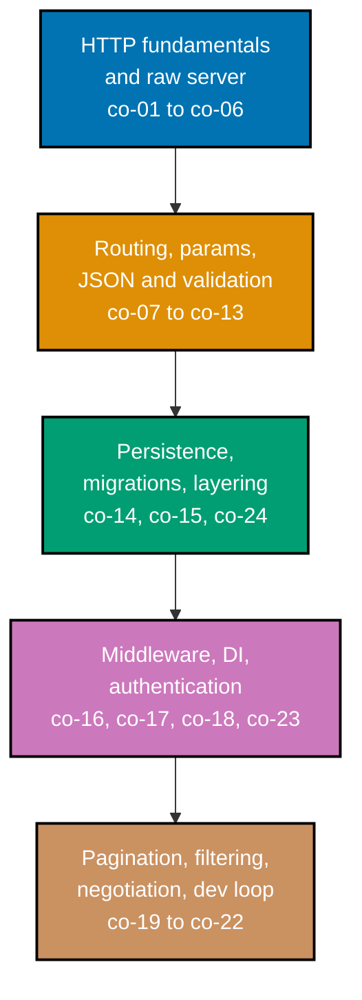

## Prerequisites

- **Prior topics**: [4 · Just Enough Python](../../just-enough-python/learning/overview.md) -- every
  example in this topic is a complete Python module, and this topic assumes you can already read and
  write functions, modules, and typed collections the way that primer taught them; 10 · SQL
  Essentials -- the persistence examples later in this topic assume a parameterized SQL query written
  from Python.
- **Tools & environment**: a macOS/Linux terminal; **Python 3.x** installed (`python3 --version`); a
  `venv` with the pinned, CVE-clean `fastapi`, `uvicorn`, and `flask` packages installed; **`curl`** to
  exercise every endpoint; SQLite or a local PostgreSQL for the persistence examples.
- **Assumed knowledge**: basic Python syntax and a parameterized SQL query. No prior web-framework
  experience is required -- this topic is where that experience starts.

## Why this exists -- the big idea

The problem before the solution: many clients need to share and change the same durable state over a
network -- that demands a server mediating access, not a local script only one process can touch. The
one idea worth keeping if you forget everything else: **a backend is a stateless pipeline** -- receive,
validate, persist, respond -- with all the real state pushed down into the database.

**Cross-cutting big ideas, taught here and then reused for the rest of this topic**: `taming-state` is
the reason HTTP is deliberately stateless (co-05) -- every request is self-contained precisely so the
hard, durable state lives in exactly one place (the database), not scattered across server processes
that might restart, crash, or run in parallel. `layering-and-leaks` is the discipline this topic's later
persistence examples enforce directly: a clean request -> handler -> repository -> store chain (co-24)
keeps SQL out of handlers and keeps every concern isolated behind its own boundary.

## Install and run your first example

Confirm Python 3 is installed, then create and activate a `venv` for this topic:

```text
$ python3 --version
Python 3.13.12
$ python3 -m venv .venv
$ source .venv/bin/activate
```

Install the pinned, web-verified, CVE-clean framework versions from the syllabus's Accuracy notes:

```text
$ pip install fastapi==0.139.0 uvicorn==0.51.0 flask==3.1.3
$ pip show fastapi uvicorn flask
Name: fastapi
Version: 0.139.0
Name: uvicorn
Version: 0.51.0
Name: Flask
Version: 3.1.3
```

**A note on versions**: all three pins installed exactly as specified in this sandbox -- no substitution
was needed. Every captured "Output" block in this topic was produced against these exact versions.

Every example in this topic is a complete, self-contained Python module colocated under
`learning/code/`. The earliest examples (1-9) use only the standard library and run directly:

```text
python3 server.py
```

From Example 10 onward, examples run under `uvicorn` from inside their own directory:

```text
uvicorn app:app --port 8000
```

...and are exercised from a second terminal with `curl` against `localhost:8000` while the server is
still running. Example 23 (the Flask comparison) instead runs with `flask --app app run --port 8000`.

## How this topic's examples are organized

- **Beginner** (Examples 1-28) -- a hand-written `http.server`/`wsgiref` raw server exposing exactly
  what a framework automates (status lines, headers, routing by hand, a 404, a hand-rolled 405), then
  FastAPI basics: installing the framework, the dev loop, routing, typed path and query parameters,
  JSON request/response bodies, a `response_model`, status codes (201/204), reading and setting
  headers, a Flask comparison, PUT/PATCH semantics, a statelessness demonstration, and a first look at
  FastAPI's native content-negotiation default.
- **Intermediate** (Examples 29-56) -- request validation failures and their structured 422 detail,
  custom error envelopes and exception handlers, a repository-style SQLite persistence layer with
  parameterized queries, full CRUD wired through that repository, additive schema migrations,
  dependency-injected database connections, and cross-cutting middleware (request IDs, logging, timing,
  CORS).
- **Advanced** (Examples 57-80) -- session-cookie and bearer-token authentication, a token-check
  middleware protecting writes, pagination with `limit`/`offset` and response metadata, filtering and
  sorting composed together, and a set of end-to-end verification examples (a documented `curl` script,
  a `pytest` suite, and a two-worker statelessness check) -- plus a capstone task/notes API tying CRUD,
  auth, and pagination into one runnable service.



## Concepts

Every worked example in this topic's follow-up pages cites the `co-NN` concept it exercises -- this
section is the 1:1 reference those citations point back to. Read it in order: HTTP fundamentals come
first because every later concept describes itself in those terms.

### co-01 · HTTP Request-Response

HTTP is a request/response protocol: a client sends a method + path + headers + optional body, and the
server returns a status line + headers + optional body. Nothing more, nothing less -- that pair is the
entire unit of communication.

**Why it matters**: every other concept in this topic describes some detail of one half of this
exchange -- a method (co-02), a status code (co-03), a header (co-04) -- so without the basic shape of
"one request in, one response out," none of those details have anywhere to attach.

**Verify it**: Example 1 hand-writes a complete response (status line, one header, a body) to a raw
`GET /` request, making every part of this exchange visible instead of automated away.

### co-02 · HTTP Methods

Methods carry semantics: GET reads, POST creates, PUT replaces (idempotent), PATCH partially updates,
DELETE removes. Safe methods (GET, HEAD) never modify state; idempotent methods (GET, HEAD, PUT,
DELETE) produce the same server state no matter how many times the identical request repeats.

**Why it matters**: a client, a cache, and a load balancer all rely on these semantics holding --
retrying a PUT after a dropped connection is safe specifically because PUT is idempotent, while blindly
retrying a POST could create the same resource twice.

**Verify it**: Example 8 implements only `do_GET`; Example 24 sends the same PUT body twice and confirms
identical final state; Example 25 confirms PATCH touches only the field it was sent.

### co-03 · HTTP Status Codes

Status codes signal outcome class: 2xx success, 3xx redirect, 4xx client error, 5xx server error. This
topic uses 200/201/204/400/401/404/405/422/500 specifically, each tied to a distinct, precise meaning.

**Why it matters**: a status code is the first thing a client checks, often before it even parses the
body -- a precise code (201 vs. 200, 422 vs. 400) lets a caller branch on outcome without inspecting
response text.

**Verify it**: Example 2 confirms `curl -i` shows the status line directly; Example 6 confirms
`curl -o /dev/null -w '%{http_code}'` prints `404`; Example 19 confirms 201; Example 20 confirms 204.

### co-04 · HTTP Headers

Headers carry metadata on both the request and the response -- `Content-Type` describes the body's
format, `Authorization` carries credentials, and custom `X-*` headers carry application-specific data
like a request ID or a version string.

**Why it matters**: headers are how a client and server negotiate format and identity without touching
the body at all -- `Content-Type` (co-21) is what tells a JSON parser it is safe to run, and it is a
header, not a body convention.

**Verify it**: Example 3 sets `Content-Type` by hand and confirms it in `curl -i`; Example 21 reads a
custom `X-Request-Id` request header; Example 22 sets a custom `X-App-Version` response header.

### co-05 · Statelessness

HTTP is stateless: each request is self-contained and shares no server memory with any other request, so
durable state lives in the database and worker processes can scale horizontally without coordinating.

**Why it matters**: a stateless server can be killed and restarted, or run as ten identical copies behind
a load balancer, without any request behaving differently -- that property is what makes horizontal
scaling possible at all, and it is the direct payoff of `taming-state`.

**Verify it**: Example 26 sends three sequential requests with different headers and confirms none of
them is influenced by the one before it; Example 80 (advanced) runs two `uvicorn` workers sharing only
the database, never in-process memory.

### co-06 · Raw stdlib Server

Python's `http.server` and `wsgiref` serve a route by hand-writing the status line and headers yourself,
revealing exactly what a framework like FastAPI automates on every single request.

**Why it matters**: writing the raw version first is what makes every later framework convenience
legible instead of magical -- `@app.get("/")` in Example 11 is doing precisely what Examples 1-9 did by
hand, just automatically.

**Verify it**: Examples 1-9 build a complete raw HTTP server incrementally: a status line, a header, path
branching, a JSON body, a 404, a WSGI callable, a GET-only handler, and a hand-written 405.

### co-07 · Routing

Routing maps a method + path pattern to a handler function. A framework's router is the piece that reads
"POST /tasks" and decides which function actually runs.

**Why it matters**: routing is what replaces Example 4's manual `if self.path == "/a"` chain with a
declarative table a framework maintains for you -- the mapping is the same idea, just inverted from
"handler checks the path" to "router picks the handler."

**Verify it**: Example 11's `@app.get("/")` decorator registers a route; Example 23 shows the identical
idea in Flask's `@app.route("/")`, confirming routing is a framework-agnostic concept.

### co-08 · Request Handlers

A handler receives a parsed request and returns a response, ideally holding no persistence logic itself
-- that separation is what co-24's layering later depends on.

**Why it matters**: a handler that stays thin (parse input, call a repository, return output) is easy to
test and easy to reason about; a handler that also opens database connections and writes SQL mixes two
concerns that are much easier to change independently when kept apart.

**Verify it**: Example 11's `read_root` and Example 13's `health` are both minimal handlers holding no
logic beyond returning a value -- the simplest possible shape this concept can take.

### co-09 · JSON Serialization

Request and response bodies are (de)serialized between JSON text and typed Python objects -- `json.dumps`
turns a dict into JSON text by hand, while a framework does the equivalent conversion automatically based
on a function's return type.

**Why it matters**: JSON is the lingua franca of HTTP APIs specifically because every mainstream language
can parse and produce it -- serialization is the mechanical step that makes a Python `dict` or Pydantic
model portable across that boundary.

**Verify it**: Example 5 hand-serializes a dict with `json.dumps()` and sets `Content-Type` to match;
Example 18 shows FastAPI performing the same conversion automatically via a `response_model`.

### co-10 · Request Validation

Typed models (Pydantic, in FastAPI's case) validate incoming data, rejecting bad shapes, types, or
constraints with a 422 before any handler logic runs at all.

**Why it matters**: validating at the boundary means a handler's body can trust its inputs are already
well-formed -- no handler in this topic needs to re-check "is this actually a string" because the
framework already refused anything that was not one.

**Verify it**: Example 17 defines an `Item` Pydantic model and lets FastAPI validate the incoming POST
body against it before `create_item` ever runs.

### co-11 · Structured Errors

Errors return a consistent JSON envelope (code + message + detail) with the right status, never a raw
stack trace -- a client should never see Python's internal traceback text in a response body.

**Why it matters**: a predictable error shape means client code can write one error-handling path instead
of one per endpoint -- `error.detail` (or equivalent) always means the same thing, everywhere in the API.

**Verify it**: Example 27 shows FastAPI's own native structured 422 body
(`{"detail":[{"loc","msg","type"}]}`) returned automatically on a validation failure, with no
hand-written error-formatting code anywhere in the example.

### co-12 · Path and Query Params

Path params (`/items/{id}`) and query params (`?q=`) are typed inputs parsed directly from the URL --
FastAPI infers which is which from whether the parameter name appears inside the route's `{}` braces.

**Why it matters**: typed URL inputs mean `/items/abc` fails validation automatically when the parameter
is declared `int`, without a single hand-written type check -- the type annotation itself is the
validation rule.

**Verify it**: Example 14 declares `item_id: int` in a path template and confirms `/items/5` returns
`5` as a real int; Examples 15-16 do the same for a required and a defaulted query parameter.

### co-13 · Request Body Parsing

The request body is read and parsed (as JSON, in this topic) into a typed handler argument -- the body
never arrives as a raw string a handler has to `json.loads()` itself.

**Why it matters**: automatic body parsing is what turns "here is some bytes on the wire" into "here is
a typed Python object with autocomplete and a type checker behind it" -- the parsing step is invisible
specifically because the framework does it before the handler ever runs.

**Verify it**: Example 17 parses a JSON body into an `Item` model argument; Example 28 round-trips a full
`curl -X POST` JSON payload through parsing, the handler, and back out as JSON.

### co-14 · Persistence Repository

A repository-style function is the only place that talks to the database, using parameterized queries
and keeping SQL out of handlers entirely -- introduced here, built out fully in this topic's
Intermediate examples (29-56).

**Why it matters**: centralizing every SQL statement behind one narrow interface is what makes a later
migration (co-15), a swap to a different database, or a security audit of every query tractable -- there
is exactly one place to look, not one per handler.

**Verify it**: Intermediate Example 35 opens a SQLite connection and runs a query entirely inside a
repository module, with no SQL appearing in any handler.

### co-15 · Migrations

Schema migrations -- applying `schema.sql` at startup, or an additive `ALTER TABLE` plus a backfill --
evolve the persistence layer safely as requirements change, without discarding existing data.

**Why it matters**: a production database already has real data in it by the time a schema needs to
change -- a migration is what lets that change happen without a destructive drop-and-recreate.

**Verify it**: Intermediate Example 43 applies `schema.sql` at startup before serving; Example 44 adds a
column additively and backfills it, confirming existing rows stay valid afterward.

### co-16 · Middleware

Middleware wraps every request/response to add cross-cutting behavior -- a request ID, a log line, a
timing header, a CORS header, or an authentication check -- without touching every individual handler.

**Why it matters**: cross-cutting concerns (co-16 itself is a case study in the name) apply identically
to every route, so writing that logic once in a middleware layer instead of copy-pasting it into every
handler is both less code and less likely to drift out of sync between routes.

**Verify it**: Intermediate Examples 48-51 add a request-ID, a logging line, a timing header, and a CORS
header, each as middleware wrapping every route rather than code inside any one handler.

### co-17 · Authn: Sessions vs. Tokens

Authentication identifies the caller. Server-side sessions (a cookie referencing state the server
holds) and stateless bearer tokens (a self-contained credential the server merely validates) are the
two common mechanisms, introduced here and built out fully in this topic's Advanced examples (57-80).

**Why it matters**: a session trades a stateless server for a simpler credential (the server remembers
who you are); a bearer token trades a slightly more complex credential for a server that stays fully
stateless (co-05) -- the tradeoff is real, and this topic teaches both sides of it.

**Verify it**: Advanced Example 57 authenticates one route by session cookie and another by bearer
token, confirming both mechanisms independently identify the caller.

### co-18 · Token Check

A bearer-token check reads the `Authorization` header, validates it, and rejects missing or invalid
tokens with 401 -- typically guarding writes (POST/PUT/DELETE) while leaving reads (GET) open.

**Why it matters**: guarding only writes is a deliberate, common tradeoff -- it keeps a read API
publicly browsable while still protecting every operation that changes state, which is usually exactly
the security boundary a service actually needs.

**Verify it**: Advanced Example 60 confirms a missing `Authorization` header returns 401; Example 62
confirms a valid token reaches the handler; Example 63 confirms GET stays open while writes require a
token.

### co-19 · Pagination

List endpoints page results with `limit`/`offset` (bounded and defaulted) and often return `total`/`next`
metadata alongside the page itself, so a client never has to fetch an entire table in one response.

**Why it matters**: an unbounded list endpoint is a denial-of-service risk waiting to happen -- a table
that has ten rows today can have ten million next year, and a `limit` with a sane default and a hard
maximum is the guard that keeps that growth from becoming an outage.

**Verify it**: Advanced Example 65 slices a list by `limit`/`offset`; Example 66 confirms a bounded
default when the parameter is absent; Example 67 confirms the response includes `total` and `next`.

### co-20 · Filtering

List endpoints narrow results by query-param filters (and sort), mapped to parameterized SQL so a
filter value is never concatenated directly into a query string.

**Why it matters**: filtering is the single most common way an API's list endpoint is actually used in
practice ("give me the tasks where `status=done`") -- and mapping it to parameterized SQL is what keeps
that convenience from reopening the exact injection risk co-14 closed.

**Verify it**: Advanced Example 69 filters by one field; Example 70 combines two filters with AND
semantics; Example 71 confirms the filter maps to a parameterized `WHERE` clause, not string
concatenation.

### co-21 · Content Negotiation

The server honors `Content-Type` on input and returns JSON on output, rejecting mismatches. FastAPI's
`strict_content_type=True` default (since 0.132.0) natively rejects a JSON body sent without an
`application/json`-compatible `Content-Type` -- the body is never parsed as JSON, so it fails the
declared Pydantic model and returns a native 422. FastAPI does not natively enforce the `Accept` header.

**Why it matters**: `Content-Type` is a promise about what the body actually contains -- rejecting a
mismatch before parsing prevents a parser from ever running against bytes it was never designed to read,
which is a real (if narrow) safety property, not just pedantry.

**Verify it**: Example 27 sends a JSON-shaped body with a wrong/missing `Content-Type` and confirms
FastAPI's own native 422 -- no hand-written content-type check appears anywhere in that example.

### co-22 · Local Dev Loop

The dev loop serves the app via `uvicorn` (or `flask run`) and exercises it with `curl` and a
`pytest`/`TestClient` suite -- the same three-step cycle repeats across every example in this topic.

**Why it matters**: a fast, repeatable dev loop is what makes iterating on a backend practical at all --
serve, hit it with `curl`, read the response, change the code, repeat -- and every worked example in
this topic is a small, complete instance of exactly that loop.

**Verify it**: Example 10 installs the pinned framework and confirms the version; Example 12 serves via
`uvicorn app:app --port 8000` and confirms `curl` gets a response; Example 28 round-trips a full
`curl -X POST` JSON payload end to end.

### co-23 · Dependency Injection

Framework dependency injection (FastAPI's `Depends`) supplies per-request resources -- most commonly a
database connection -- to handlers, introduced here and built out fully once persistence lands in this
topic's Intermediate examples (29-56).

**Why it matters**: `Depends` is what lets a handler simply declare "I need a database connection" as a
parameter, without knowing or caring how that connection gets created, pooled, or torn down -- that
separation is exactly what makes swapping a real database in for a test double straightforward.

**Verify it**: Intermediate Example 47 supplies a database connection to a handler via `Depends` and
confirms the injected connection is what the handler actually uses.

### co-24 · Layering

The request -> handler -> repository -> store layering keeps each concern isolated with a clean
boundary -- a handler holds no SQL, a repository holds no HTTP concepts, and the database holds no
application logic.

**Why it matters**: this is the architectural discipline every other persistence-related concept in this
topic (co-14, co-23) exists to enforce -- a codebase that keeps this layering clean can change its
database, its framework, or its handlers independently, because none of the three ever reaches directly
into another's concern.

**Verify it**: Intermediate Example 46 inspects a handler by reading it and confirms it holds no SQL at
all, calling only its repository; Advanced Example 80 runs two stateless `uvicorn` workers sharing only
the database, confirming the layering holds under concurrent load too.

## Examples by Level

### Beginner (Examples 1–28)

- [Example 1: Raw Server Hello](/en/c/learn/fundamentally-strong/software-engineer/backend-essentials/learning/beginner#example-1-raw-server-hello)
- [Example 2: Raw Status Line](/en/c/learn/fundamentally-strong/software-engineer/backend-essentials/learning/beginner#example-2-raw-status-line)
- [Example 3: Raw Set Header](/en/c/learn/fundamentally-strong/software-engineer/backend-essentials/learning/beginner#example-3-raw-set-header)
- [Example 4: Raw Read Path](/en/c/learn/fundamentally-strong/software-engineer/backend-essentials/learning/beginner#example-4-raw-read-path)
- [Example 5: Raw JSON Response](/en/c/learn/fundamentally-strong/software-engineer/backend-essentials/learning/beginner#example-5-raw-json-response)
- [Example 6: Raw 404](/en/c/learn/fundamentally-strong/software-engineer/backend-essentials/learning/beginner#example-6-raw-404)
- [Example 7: wsgiref App](/en/c/learn/fundamentally-strong/software-engineer/backend-essentials/learning/beginner#example-7-wsgiref-app)
- [Example 8: Handle GET Only](/en/c/learn/fundamentally-strong/software-engineer/backend-essentials/learning/beginner#example-8-handle-get-only)
- [Example 9: Method 405, Raw](/en/c/learn/fundamentally-strong/software-engineer/backend-essentials/learning/beginner#example-9-method-405-raw)
- [Example 10: Install the Framework](/en/c/learn/fundamentally-strong/software-engineer/backend-essentials/learning/beginner#example-10-install-the-framework)
- [Example 11: FastAPI Hello](/en/c/learn/fundamentally-strong/software-engineer/backend-essentials/learning/beginner#example-11-fastapi-hello)
- [Example 12: Run via uvicorn](/en/c/learn/fundamentally-strong/software-engineer/backend-essentials/learning/beginner#example-12-run-via-uvicorn)
- [Example 13: Health Endpoint](/en/c/learn/fundamentally-strong/software-engineer/backend-essentials/learning/beginner#example-13-health-endpoint)
- [Example 14: Typed Path Param](/en/c/learn/fundamentally-strong/software-engineer/backend-essentials/learning/beginner#example-14-typed-path-param)
- [Example 15: Typed Query Param](/en/c/learn/fundamentally-strong/software-engineer/backend-essentials/learning/beginner#example-15-typed-query-param)
- [Example 16: Optional Query Param with a Default](/en/c/learn/fundamentally-strong/software-engineer/backend-essentials/learning/beginner#example-16-optional-query-param-with-a-default)
- [Example 17: JSON Request Body](/en/c/learn/fundamentally-strong/software-engineer/backend-essentials/learning/beginner#example-17-json-request-body)
- [Example 18: response_model Filters the Output](/en/c/learn/fundamentally-strong/software-engineer/backend-essentials/learning/beginner#example-18-response_model-filters-the-output)
- [Example 19: Status 201 Created](/en/c/learn/fundamentally-strong/software-engineer/backend-essentials/learning/beginner#example-19-status-201-created)
- [Example 20: Status 204 No Content](/en/c/learn/fundamentally-strong/software-engineer/backend-essentials/learning/beginner#example-20-status-204-no-content)
- [Example 21: Read a Request Header](/en/c/learn/fundamentally-strong/software-engineer/backend-essentials/learning/beginner#example-21-read-a-request-header)
- [Example 22: Set a Response Header](/en/c/learn/fundamentally-strong/software-engineer/backend-essentials/learning/beginner#example-22-set-a-response-header)
- [Example 23: Flask Hello -- the Same Route, a Different Framework](/en/c/learn/fundamentally-strong/software-engineer/backend-essentials/learning/beginner#example-23-flask-hello----the-same-route-a-different-framework)
- [Example 24: PUT Is Idempotent](/en/c/learn/fundamentally-strong/software-engineer/backend-essentials/learning/beginner#example-24-put-is-idempotent)
- [Example 25: PATCH Updates Only What It Is Sent](/en/c/learn/fundamentally-strong/software-engineer/backend-essentials/learning/beginner#example-25-patch-updates-only-what-it-is-sent)
- [Example 26: Statelessness, Demonstrated](/en/c/learn/fundamentally-strong/software-engineer/backend-essentials/learning/beginner#example-26-statelessness-demonstrated)
- [Example 27: FastAPI's Native Content-Type Rejection](/en/c/learn/fundamentally-strong/software-engineer/backend-essentials/learning/beginner#example-27-fastapis-native-content-type-rejection)
- [Example 28: curl POST JSON, End to End](/en/c/learn/fundamentally-strong/software-engineer/backend-essentials/learning/beginner#example-28-curl-post-json-end-to-end)

### Intermediate (Examples 29–56)

- [Example 29: A Missing Required Field Fails Validation](/en/c/learn/fundamentally-strong/software-engineer/backend-essentials/learning/intermediate#example-29-a-missing-required-field-fails-validation)
- [Example 30: A Wrong Type Also Fails Validation](/en/c/learn/fundamentally-strong/software-engineer/backend-essentials/learning/intermediate#example-30-a-wrong-type-also-fails-validation)
- [Example 31: Field Constraints Reject Out-of-Range Input](/en/c/learn/fundamentally-strong/software-engineer/backend-essentials/learning/intermediate#example-31-field-constraints-reject-out-of-range-input)
- [Example 32: A Custom Error Envelope Replaces FastAPI's Default](/en/c/learn/fundamentally-strong/software-engineer/backend-essentials/learning/intermediate#example-32-a-custom-error-envelope-replaces-fastapis-default)
- [Example 33: A Domain Exception Maps to an HTTP Response](/en/c/learn/fundamentally-strong/software-engineer/backend-essentials/learning/intermediate#example-33-a-domain-exception-maps-to-an-http-response)
- [Example 34: One Shared Envelope, Two Different HTTP Methods](/en/c/learn/fundamentally-strong/software-engineer/backend-essentials/learning/intermediate#example-34-one-shared-envelope-two-different-http-methods)
- [Example 35: A Repository Module Opens SQLite and Runs a Query](/en/c/learn/fundamentally-strong/software-engineer/backend-essentials/learning/intermediate#example-35-a-repository-module-opens-sqlite-and-runs-a-query)
- [Example 36: Parameterized Queries Neutralize SQL Injection](/en/c/learn/fundamentally-strong/software-engineer/backend-essentials/learning/intermediate#example-36-parameterized-queries-neutralize-sql-injection)
- [Example 37: CRUD -- Create a Task](/en/c/learn/fundamentally-strong/software-engineer/backend-essentials/learning/intermediate#example-37-crud----create-a-task)
- [Example 38: CRUD -- Read a Single Task by Id](/en/c/learn/fundamentally-strong/software-engineer/backend-essentials/learning/intermediate#example-38-crud----read-a-single-task-by-id)
- [Example 39: CRUD -- Read the Whole List](/en/c/learn/fundamentally-strong/software-engineer/backend-essentials/learning/intermediate#example-39-crud----read-the-whole-list)
- [Example 40: CRUD -- Update a Task](/en/c/learn/fundamentally-strong/software-engineer/backend-essentials/learning/intermediate#example-40-crud----update-a-task)
- [Example 41: CRUD -- Delete a Task](/en/c/learn/fundamentally-strong/software-engineer/backend-essentials/learning/intermediate#example-41-crud----delete-a-task)
- [Example 42: Update or Delete Against a Missing Id Returns a 404 Envelope](/en/c/learn/fundamentally-strong/software-engineer/backend-essentials/learning/intermediate#example-42-update-or-delete-against-a-missing-id-returns-a-404-envelope)
- [Example 43: Apply a schema.sql Migration at Startup](/en/c/learn/fundamentally-strong/software-engineer/backend-essentials/learning/intermediate#example-43-apply-a-schemasql-migration-at-startup)
- [Example 44: An Additive ALTER TABLE + Backfill Migration](/en/c/learn/fundamentally-strong/software-engineer/backend-essentials/learning/intermediate#example-44-an-additive-alter-table--backfill-migration)
- [Example 45: A Repository That Returns Typed Rows](/en/c/learn/fundamentally-strong/software-engineer/backend-essentials/learning/intermediate#example-45-a-repository-that-returns-typed-rows)
- [Example 46: Layering -- No SQL Lives in the Handler](/en/c/learn/fundamentally-strong/software-engineer/backend-essentials/learning/intermediate#example-46-layering----no-sql-lives-in-the-handler)
- [Example 47: FastAPI's Depends() Supplies the DB Connection](/en/c/learn/fundamentally-strong/software-engineer/backend-essentials/learning/intermediate#example-47-fastapis-depends-supplies-the-db-connection)
- [Example 48: Middleware Stamps Every Response with X-Request-Id](/en/c/learn/fundamentally-strong/software-engineer/backend-essentials/learning/intermediate#example-48-middleware-stamps-every-response-with-x-request-id)
- [Example 49: Middleware Logs One Line per Request](/en/c/learn/fundamentally-strong/software-engineer/backend-essentials/learning/intermediate#example-49-middleware-logs-one-line-per-request)
- [Example 50: Middleware Measures Request Duration](/en/c/learn/fundamentally-strong/software-engineer/backend-essentials/learning/intermediate#example-50-middleware-measures-request-duration)
- [Example 51: FastAPI's Built-in CORSMiddleware](/en/c/learn/fundamentally-strong/software-engineer/backend-essentials/learning/intermediate#example-51-fastapis-built-in-corsmiddleware)
- [Example 52: A Sanitized 500 Envelope for Unhandled Exceptions](/en/c/learn/fundamentally-strong/software-engineer/backend-essentials/learning/intermediate#example-52-a-sanitized-500-envelope-for-unhandled-exceptions)
- [Example 53: The 422 Detail Array Lists Every Offending Field](/en/c/learn/fundamentally-strong/software-engineer/backend-essentials/learning/intermediate#example-53-the-422-detail-array-lists-every-offending-field)
- [Example 54: Hand-Written Accept Header Negotiation](/en/c/learn/fundamentally-strong/software-engineer/backend-essentials/learning/intermediate#example-54-hand-written-accept-header-negotiation)
- [Example 55: Create Then Read -- A Persisted Round Trip](/en/c/learn/fundamentally-strong/software-engineer/backend-essentials/learning/intermediate#example-55-create-then-read----a-persisted-round-trip)
- [Example 56: pytest + FastAPI's TestClient, Explicitly](/en/c/learn/fundamentally-strong/software-engineer/backend-essentials/learning/intermediate#example-56-pytest--fastapis-testclient-explicitly)

### Advanced (Examples 57–80)

- [Example 57: Sessions vs Tokens](/en/c/learn/fundamentally-strong/software-engineer/backend-essentials/learning/advanced#example-57-sessions-vs-tokens)
- [Example 58: Issue a Token](/en/c/learn/fundamentally-strong/software-engineer/backend-essentials/learning/advanced#example-58-issue-a-token)
- [Example 59: Token-Check Middleware](/en/c/learn/fundamentally-strong/software-engineer/backend-essentials/learning/advanced#example-59-token-check-middleware)
- [Example 60: Missing Token](/en/c/learn/fundamentally-strong/software-engineer/backend-essentials/learning/advanced#example-60-missing-token)
- [Example 61: Invalid Token](/en/c/learn/fundamentally-strong/software-engineer/backend-essentials/learning/advanced#example-61-invalid-token)
- [Example 62: Valid Token](/en/c/learn/fundamentally-strong/software-engineer/backend-essentials/learning/advanced#example-62-valid-token)
- [Example 63: Protect Writes Only](/en/c/learn/fundamentally-strong/software-engineer/backend-essentials/learning/advanced#example-63-protect-writes-only)
- [Example 64: Session-Cookie Auth](/en/c/learn/fundamentally-strong/software-engineer/backend-essentials/learning/advanced#example-64-session-cookie-auth)
- [Example 65: Pagination limit/offset](/en/c/learn/fundamentally-strong/software-engineer/backend-essentials/learning/advanced#example-65-pagination-limitoffset)
- [Example 66: Pagination Default](/en/c/learn/fundamentally-strong/software-engineer/backend-essentials/learning/advanced#example-66-pagination-default)
- [Example 67: Pagination Metadata](/en/c/learn/fundamentally-strong/software-engineer/backend-essentials/learning/advanced#example-67-pagination-metadata)
- [Example 68: Pagination Bounds](/en/c/learn/fundamentally-strong/software-engineer/backend-essentials/learning/advanced#example-68-pagination-bounds)
- [Example 69: Filter by Field](/en/c/learn/fundamentally-strong/software-engineer/backend-essentials/learning/advanced#example-69-filter-by-field)
- [Example 70: Filter Multiple](/en/c/learn/fundamentally-strong/software-engineer/backend-essentials/learning/advanced#example-70-filter-multiple)
- [Example 71: Filter Parameterized SQL](/en/c/learn/fundamentally-strong/software-engineer/backend-essentials/learning/advanced#example-71-filter-parameterized-sql)
- [Example 72: Sort Param](/en/c/learn/fundamentally-strong/software-engineer/backend-essentials/learning/advanced#example-72-sort-param)
- [Example 73: Combined List Query](/en/c/learn/fundamentally-strong/software-engineer/backend-essentials/learning/advanced#example-73-combined-list-query)
- [Example 74: Idempotent PUT, Verified](/en/c/learn/fundamentally-strong/software-engineer/backend-essentials/learning/advanced#example-74-idempotent-put-verified)
- [Example 75: Method Not Allowed](/en/c/learn/fundamentally-strong/software-engineer/backend-essentials/learning/advanced#example-75-method-not-allowed)
- [Example 76: Health vs Readiness](/en/c/learn/fundamentally-strong/software-engineer/backend-essentials/learning/advanced#example-76-health-vs-readiness)
- [Example 77: Error Envelope Consistency](/en/c/learn/fundamentally-strong/software-engineer/backend-essentials/learning/advanced#example-77-error-envelope-consistency)
- [Example 78: curl CRUD + Auth Script](/en/c/learn/fundamentally-strong/software-engineer/backend-essentials/learning/advanced#example-78-curl-crud--auth-script)
- [Example 79: pytest Full Integration](/en/c/learn/fundamentally-strong/software-engineer/backend-essentials/learning/advanced#example-79-pytest-full-integration)
- [Example 80: Stateless, Two Workers](/en/c/learn/fundamentally-strong/software-engineer/backend-essentials/learning/advanced#example-80-stateless-two-workers)

---

← Previous: [Overview](../overview.md) · Next: [Beginner Examples](./beginner.md) →
