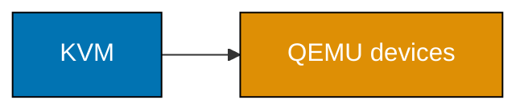
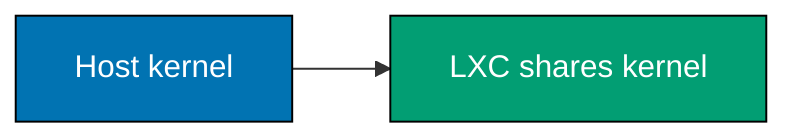
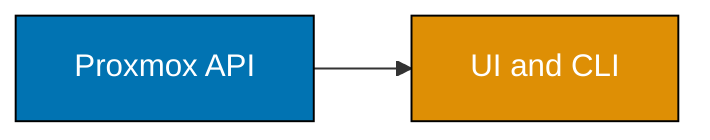
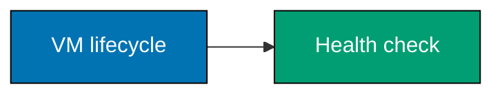
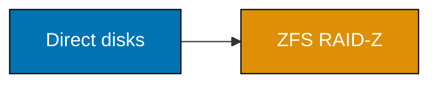
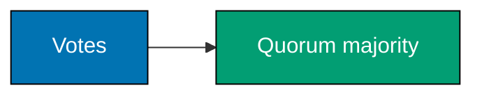
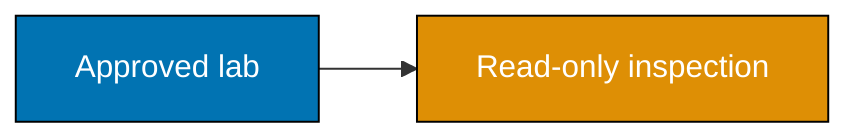

## Beginner: model one host before operating a fleet

Each example prints a safe model or reads local capability only. Replace no placeholder with a real target until
you have an isolated, owner-approved lab, a backup, and a rollback decision.

### Example 1: Why Own the Substrate

_ex-01 · exercises co-01_

**Brief explanation**: Owning a substrate trades managed convenience for locality and control. It also makes the
owner responsible for capacity, patching, recovery, and failures that a provider normally absorbs.

```bash
# => Prints a decision prompt only; it cannot provision or change a machine.
printf '%s\n' 'control and locality versus operational responsibility'
```

**Verification**: The output names both sides of the decision and contains no provider account or hostname.

**Key takeaway**: Own the substrate only when its benefits justify its operational work.

**Why it matters**: Bare metal is an operating commitment, not merely a cheaper VM purchase. Naming benefits and
on-call burden before selecting hardware prevents an underfunded platform from becoming a hidden production risk.

---

### Example 2: Type 1 and Type 2 Hypervisors

_ex-02 · exercises co-02_

**Brief explanation**: A Type 1 hypervisor runs directly on hardware, while a Type 2 hypervisor is hosted by an
operating system. Linux KVM uses host kernel virtualization support and follows the former operational model.

```bash
# => Prints the boundary used by the lab; it makes no virtualization setting change.
printf '%s\n' 'Type 1 uses hardware directly; Type 2 has a host OS layer'
```

**Verification**: The output distinguishes the two boundaries without claiming every desktop tool behaves alike.

**Key takeaway**: The hosting boundary changes performance, failure ownership, and operations.

**Why it matters**: Hypervisor vocabulary prevents misleading comparisons between a laptop test tool and a
production host. It tells operators where the guest, hypervisor, and host operating system can fail together.

---

### Example 3: Check KVM Capability

_ex-03 · exercises co-03_

**Brief explanation**: A Linux lab must expose CPU virtualization support before it can run KVM guests. This
inspection reads local state only and can show missing support in a nested or non-Linux environment.

```bash
# => Reads local CPU capability without loading modules or creating a guest.
lscpu | rg -i 'virtualization|hypervisor' || true
# => Reads the current module list without modifying it.
lsmod | rg '^kvm' || true
```

**Verification**: Review the output as evidence; an outer hypervisor must separately allow nested virtualization.

**Key takeaway**: Verify KVM capability before designing a guest lab.

**Why it matters**: A lab can fail before Proxmox starts if firmware, CPU flags, or outer-host settings hide
virtualization. Read-only inspection narrows the cause without changing BIOS, kernel, or host settings.

---

### Example 4: Split KVM from QEMU

_ex-04 · exercises co-03_

**Brief explanation**: KVM accelerates guest CPU execution through the Linux kernel. QEMU supplies the virtual
machine and device emulation around that accelerated execution.

```bash
# => Prints roles rather than starting QEMU or attaching a disk.
printf '%s\n' 'KVM executes guest CPU instructions; QEMU models virtual devices'
```

**Verification**: The two clauses assign CPU execution to KVM and device emulation to QEMU.

**Key takeaway**: KVM and QEMU cooperate but solve different parts of virtualization.

**Why it matters**: Separating these roles makes performance and device problems less mysterious. A guest issue
may involve virtual disks or NIC emulation even when CPU virtualization is healthy and available.

---

### Example 5: Compare a VM and LXC

_ex-05 · exercises co-04_

**Brief explanation**: A VM has a guest kernel and virtual hardware boundary. An LXC container shares the host
kernel, increasing density while changing compatibility and isolation assumptions.

```bash
# => Makes the isolation decision explicit without creating a container or VM.
printf '%s\n' 'VM: own kernel; LXC: shared host kernel'
```

**Verification**: The output names the kernel boundary, the decisive difference for this comparison.

**Key takeaway**: Choose a VM for a guest-kernel boundary and LXC for compatible, denser Linux workloads.

**Why it matters**: Treating containers as small VMs hides their shared-kernel constraint and leads to poor
compatibility decisions. Proxmox exposes both choices, so the workload boundary must be intentional.

---

### Example 6: Read the Proxmox Stack

_ex-06 · exercises co-05_

**Brief explanation**: Proxmox VE integrates Debian, KVM/QEMU, LXC, storage, networking, and management tools.
Its release and licensing details remain items to verify from official current sources.

```bash
# => Prints a conceptual stack; it does not install or alter Proxmox.
printf '%s\n' 'Debian + KVM/QEMU + LXC + API/UI = Proxmox VE platform'
```

**Verification**: The output lists integrated layers rather than presenting Proxmox as only a web UI.

**Key takeaway**: Proxmox packages several host responsibilities into one platform.

**Why it matters**: An integrated platform simplifies coordination but does not erase the underlying need for
host hardening, storage planning, and network design. Operators need to understand what the interface coordinates.

---

### Example 7: Inspect a Proxmox Version

_ex-07 · exercises co-05_

**Brief explanation**: A Proxmox host exposes installed packages and kernel information through `pveversion -v`.
This example prints the command first, so the reader decides where it is safe to inspect.

```bash
# => Prints a read-only inspection command instead of executing it on an unknown host.
printf '%s\n' 'pveversion -v  # run only on an owner-approved Proxmox host'
```

**Verification**: Treat the output as a change-record input and verify version-sensitive guidance against docs.

**Key takeaway**: Record actual host versions before following version-sensitive instructions.

**Why it matters**: Hypervisor commands, supported kernels, and provider behavior evolve. A local inspection
gives evidence for a particular change without turning an old tutorial version number into an unsupported promise.

---

### Example 8: Model a Proxmox API Token

_ex-08 · exercises co-06_

**Brief explanation**: Proxmox automation should use a scoped API token rather than an interactive password.
A course artifact must never contain that token, even in a supposedly harmless example.

```bash
# => Shows only the environment-variable name; it does not create, print, or transmit a token.
printf '%s\n' 'PVE_API_TOKEN is supplied by an owner-controlled secret mechanism'
```

**Verification**: Search the course for a token value; only placeholder names and safety text should be present.

**Key takeaway**: Authenticate automation with least privilege and keep the value outside git.

**Why it matters**: A committed infrastructure token can control an entire virtualization estate. Pair placeholder
use with scoped credentials, protected state, rotation, audit, and an approved secret-delivery mechanism.

---

### Example 9: Trace the Shared API

_ex-09 · exercises co-06_

**Brief explanation**: The Proxmox UI, CLI, Terraform provider, and Ansible collection ultimately act through
the platform API. That shared control plane makes review and least privilege more important, not less.

```bash
# => Prints the control-plane model without calling an API endpoint.
printf '%s\n' 'UI, CLI, Terraform, and Ansible converge on one audited API'
```

**Verification**: The output identifies one control plane, not four independent authorization systems.

**Key takeaway**: Automation changes the interface, not the need for access control and review.

**Why it matters**: Centralizing authorization and logging gives operators a single audit surface. It also means
a poorly scoped token has broad consequences across every automation client, so token design deserves review.

---

### Example 10: Plan a VM Lifecycle

_ex-10 · exercises co-03_

**Brief explanation**: VM creation, start, shutdown, and destroy are distinct lifecycle decisions. This model
names review points without issuing a `qm` command against a host.

```bash
# => Prints a lifecycle checklist and never allocates a VM identifier or storage.
printf '%s\n' 'define -> verify storage/network -> start -> health check -> retire'
```

**Verification**: The sequence includes validation before start and an intentional retirement decision.

**Key takeaway**: Treat guest lifecycle actions as reviewed state transitions.

**Why it matters**: A VM command can consume storage, attach a network, or destroy evidence quickly. Naming
transitions makes ownership and rollback explicit, even when an IaC tool presents the action as a simple plan.

---

### Example 11: List VM and LXC Inventory

_ex-11 · exercises co-04_

**Brief explanation**: `qm list` inventories full VMs and `pct list` inventories LXC containers. This lesson
prints those read-only commands until a reader selects an authorized host.

```bash
# => Displays inspection commands only; no node name or cluster member is embedded.
printf '%s\n' 'qm list; pct list  # inspect an owner-approved node'
```

**Verification**: Keep VM and LXC counts separate because their runtime boundaries differ.

**Key takeaway**: Inventory VMs and containers separately before changing either workload class.

**Why it matters**: An accurate inventory exposes unmanaged drift before IaC assumes control. It also avoids
mistaking a container maintenance action for a VM maintenance action with a different failure boundary.

---

### Example 12: Plan an LXC Lifecycle

_ex-12 · exercises co-04_

**Brief explanation**: LXC lifecycle commands use `pct` and inherit the host-kernel boundary. Plan templates,
storage, network exposure, persistent data, and rollback before starting a container.

```bash
# => Describes a lifecycle without downloading a template or starting a container.
printf '%s\n' 'select trusted template -> define pct guest -> start -> inspect -> retire'
```

**Verification**: The sequence begins with a trusted template and does not assume a container is data-free.

**Key takeaway**: LXC is efficient, but still needs image provenance and lifecycle control.

**Why it matters**: Shared-kernel containers reduce overhead, not operational responsibility. Template provenance,
network policy, persistent data, and privilege decisions all affect the host's risk and recovery story.

---

### Example 13: Separate VM Lifecycle Actions

_ex-13 · exercises co-03_

**Brief explanation**: Start, graceful shutdown, forced stop, and destroy have different failure and data-loss
implications. The right action depends on guest health, backup evidence, and approved urgency.

```bash
# => Prints action meanings and does not send a lifecycle request to any guest.
printf '%s\n' 'start=boot; shutdown=guest-coordinated; stop=forced; destroy=remove definition'
```

**Verification**: The output labels `stop` as forced and `destroy` as removal, not routine restart actions.

**Key takeaway**: Pick the least disruptive lifecycle action that meets the recovery need.

**Why it matters**: Under pressure, an operator can turn a recoverable issue into data loss by using a forced
or destructive command. Explicit vocabulary supports escalation, change review, and safer automation policy.

---

### Example 14: Inspect Libvirt Domains

_ex-14 · exercises co-10_

**Brief explanation**: Libvirt is a lower-level toolkit that can describe domains across several hypervisors.
`virsh list --all` and `virsh dominfo` are inspection tools for an owner-approved host.

```bash
# => Prints commands rather than connecting to a libvirt daemon.
printf '%s\n' 'virsh list --all; virsh dominfo <owner-approved-domain>'
```

**Verification**: Do not replace the placeholder in an unapproved environment; domain metadata can be sensitive.

**Key takeaway**: Libvirt provides a lower-level domain-management surface than an integrated platform.

**Why it matters**: Libvirt makes the portable concepts beneath a UI visible. It can suit focused automation,
but it does not automatically deliver the integrated cluster, storage, and backup operations an owner may need.

---

### Example 15: Compare Libvirt and Proxmox

_ex-15 · exercises co-10_

**Brief explanation**: Libvirt offers a flexible multi-hypervisor toolkit. Proxmox offers an integrated KVM/LXC
platform with cluster-facing operations and conventions.

```bash
# => Prints the comparison without installing either product.
printf '%s\n' 'libvirt: toolkit and integrations; Proxmox: integrated virtualization platform'
```

**Verification**: The comparison describes scope rather than an absolute quality ranking.

**Key takeaway**: Select the lowest abstraction that covers the operations you must run reliably.

**Why it matters**: A toolkit can reduce platform coupling but increase assembly and support work. An integrated
platform can speed standard operations but requires learning its assumptions, limits, and upgrade path.

---

### Example 16: Name Libvirt Hypervisors

_ex-16 · exercises co-10_

**Brief explanation**: Libvirt supports multiple virtualization technologies, including KVM/QEMU and others.
Its abstraction is useful when an operator needs a common domain model across supported back ends.

```bash
# => Prints representative back ends; it does not load any hypervisor driver.
printf '%s\n' 'libvirt can manage KVM/QEMU, Xen, LXC, Bhyve, and other supported back ends'
```

**Verification**: Treat this as representative and consult libvirt documentation for the current support matrix.

**Key takeaway**: Libvirt's value is a common management interface across virtualization platforms.

**Why it matters**: An abstraction cannot erase differences in storage, networking, migration, and host
capabilities. Preserve those constraints in design notes so portability claims remain accurate during recovery.

---

### Example 17: Compare Storage Models

_ex-17 · exercises co-11_

**Brief explanation**: Hardware RAID, ZFS RAID-Z, and Ceph CRUSH protect different scopes of failure. The
selection is a recovery and operations decision, not a capacity calculation alone.

```bash
# => Prints decision axes without touching a disk or controller.
printf '%s\n' 'compare failure scope, observability, scale, and recovery procedure'
```

**Verification**: The axes include recovery procedure, preventing a capacity-only decision.

**Key takeaway**: Storage redundancy must match the failure domain you intend to survive.

**Why it matters**: A redundant disk layout cannot automatically survive a host, rack, or control-plane loss.
Model the whole path from physical drive through storage policy to the workload recovery objective.

---

### Example 18: Avoid Hardware RAID

_ex-18 · exercises co-12_

**Brief explanation**: ZFS and Ceph need direct visibility into disks for checksums, placement, and repair.
Use direct disks behind an HBA rather than hardware RAID for those designs.

```bash
# => States the storage safety invariant without enumerating a local device.
printf '%s\n' 'ZFS/Ceph design: direct HBA-attached disks, not hardware RAID virtual disks'
```

**Verification**: The output states a prerequisite, not a post-install optimization.

**Key takeaway**: Do not interpose opaque RAID when ZFS or Ceph owns redundancy.

**Why it matters**: Two independent redundancy layers can hide failures and prevent useful repair decisions.
Confirm controller mode and disk identity before creating data, because later migration can be disruptive.

---

### Example 19: Plan a RAID Z Pool

_ex-19 · exercises co-13_

**Brief explanation**: A RAID-Z pool groups direct disks into a ZFS redundancy vdev. Creation is destructive,
so this lesson models a review rather than issuing `zpool create`.

```bash
# => Prints an approval gate; it never identifies or formats a disk.
printf '%s\n' 'verify disposable disks, HBA mode, backup, and topology review before pool creation'
```

**Verification**: The output includes explicit disposable-disk and backup gates.

**Key takeaway**: Pool topology is a reviewed storage change, not a trial command.

**Why it matters**: A mistyped device name can erase the wrong data immediately. Link the intended vdev layout
to capacity, fault tolerance, disk labels, and the workload recovery objective before an owner approves it.

---

### Example 20: Choose RAID Z Parity

_ex-20 · exercises co-13_

**Brief explanation**: RAIDZ1, RAIDZ2, and RAIDZ3 tolerate one, two, and three disk failures in a vdev.
Additional parity changes usable capacity and rebuild-risk trade-offs.

```bash
# => Prints the parity mapping; it makes no pool topology change.
printf '%s\n' 'raidz1=1 failure; raidz2=2 failures; raidz3=3 failures per vdev'
```

**Verification**: The output ties the count to one vdev rather than an entire multi-vdev pool.

**Key takeaway**: Parity selection is a declared failure tolerance with a capacity cost.

**Why it matters**: A capacity-first layout can fail its durability goal during replacement or correlated loss.
Select parity against real disk size, workload, replacement process, and the documented loss domain.

---

### Example 21: Plan a ZFS Dataset

_ex-21 · exercises co-13_

**Brief explanation**: ZFS datasets create administrative boundaries for properties, snapshots, and replication.
Naming them by workload makes recovery and delegation clearer than one undifferentiated pool.

```bash
# => Prints a logical name and does not create a dataset.
printf '%s\n' 'tank/vmdata is a dataset boundary for guest data policy'
```

**Verification**: The name identifies policy scope rather than a real pool on the reader's host.

**Key takeaway**: Use datasets to make storage policy and recovery scope explicit.

**Why it matters**: A dataset is a useful unit for snapshots, quotas, replication, and delegation. Align that
unit with recovery needs so a restore drill can prove the right guest data returned intact.

---

### Example 22: Plan a ZFS Snapshot

_ex-22 · exercises co-14_

**Brief explanation**: A ZFS snapshot captures a dataset point in time. It supports rollback and replication
baselines, but it is not an independent off-host backup.

```bash
# => Prints a snapshot naming convention without snapshotting a dataset.
printf '%s\n' 'snapshot name: before-owner-approved-change'
```

**Verification**: The output records intent and does not claim local snapshots protect against host loss.

**Key takeaway**: Snapshots support fast rollback but do not replace tested backups.

**Why it matters**: A local snapshot shares the pool and often the host with its data. Pair retention and
replication with restore evidence so the recovery claim matches the independent copy actually available.

---

### Example 23: Rehearse a ZFS Rollback

_ex-23 · exercises co-14_

**Brief explanation**: Rolling a dataset back discards later changes and needs an explicit impact decision.
Rehearse preconditions before using `zfs rollback` in an approved disposable lab.

```bash
# => Prints rollback preconditions only; it never reverts a dataset.
printf '%s\n' 'confirm snapshot, affected writers, newer snapshots, backup, and rollback owner'
```

**Verification**: The checklist includes affected writers and newer snapshots, not merely a snapshot name.

**Key takeaway**: A rollback is a data-loss decision unless its scope is understood and approved.

**Why it matters**: Fast storage operations can create slow application failures when clients expect discarded
data. Rehearsal makes consistency, communication, and validation part of the recovery procedure.

---

### Example 24: Trace Cloud Init First Boot

_ex-24 · exercises co-22_

**Brief explanation**: Cloud-init discovers a datasource, reads configuration, and applies first-boot intent.
It turns one reusable image into appropriately configured guests.

```bash
# => Prints the ordered first-boot model and does not modify a guest image.
printf '%s\n' 'datasource -> user data -> hostname/users/network -> boot-ready guest'
```

**Verification**: The order begins with a datasource and ends with applied guest intent.

**Key takeaway**: Cloud-init separates reusable image content from per-instance configuration.

**Why it matters**: Without a first-boot contract, a template accumulates environment-specific settings and
becomes hard to replace. Keep sensitive configuration out of public user data and verify authorized lab boot logs.

---

### Example 25: Write Cloud Init User Data

_ex-25 · exercises co-23_

**Brief explanation**: Cloud-init user data is declarative YAML beginning with `#cloud-config`. The capstone
file disables password SSH and contains no real key, address, or user identity.

```yaml
# => Declares cloud-init syntax; it is local example text, not credential delivery.
#cloud-config
# => Requires key-based access in a real owner-provided configuration.
ssh_pwauth: false
```

**Verification**: The YAML expresses non-secret intent; a real public key belongs in protected environment input.

**Key takeaway**: Put first-boot intent in reviewed YAML and keep identity secrets external.

**Why it matters**: Declarative user data is repeatable, but it can leak secrets if it embeds private material.
Use minimal templates, protected delivery, and post-boot checks that confirm only intended non-secret state.

---

### Example 26: Plan a Proxmox Cloud Init Drive

_ex-26 · exercises co-22_

**Brief explanation**: Proxmox can attach a cloud-init drive so a cloned VM receives first-boot inputs. Plan
the template, user-data source, public-key handling, network change, and rollback before `qm set`.

```bash
# => Prints review inputs; it does not attach a drive or edit a VM.
printf '%s\n' 'review template, ciuser, public key source, ipconfig, and rollback before qm set'
```

**Verification**: The checklist names a public-key source but never includes a key value.

**Key takeaway**: A cloud-init drive is a controlled input boundary between template and guest.

**Why it matters**: First-boot settings can change guest access and network behavior immediately. Reviewing
them as one bundle avoids configuration split across manual UI edits and hidden scripts.

---

### Example 27: Inspect Cluster Quorum

_ex-27 · exercises co-07_

**Brief explanation**: `pvecm status` reports membership and quorum state on a Proxmox node. It is read-only,
but its output should remain in the approved support context.

```bash
# => Prints an inspection command without connecting to a cluster.
printf '%s\n' 'pvecm status  # inspect owner-approved Proxmox cluster quorum'
```

**Verification**: Interpret a result alongside configured nodes and votes, not reachability alone.

**Key takeaway**: Check quorum before changes that need a writable, consistent cluster state.

**Why it matters**: Quorum prevents competing partitions from changing the control plane independently. A
reachable node can correctly refuse writes after losing a majority; investigate the vote topology rather than bypass it.

---

### Example 28: Calculate a Quorum Majority

_ex-28 · exercises co-07_

**Brief explanation**: A quorum requires a majority of configured votes for consistent changes. Three votes
need two available votes; a two-node design needs an intentional third vote such as a QDevice.

```bash
# => Calculates a small model locally and does not alter Corosync membership.
printf '%s\n' '3 votes require 2 for majority; two-node labs need a deliberate third vote'
```

**Verification**: The output distinguishes a majority from simple reachability of one node.

**Key takeaway**: Quorum is a vote-design property chosen before a fault occurs.

**Why it matters**: A two-node cluster can look redundant while lacking a reliable tie-breaker. Record the vote
model, QDevice placement, and loss behavior with HA expectations before production depends on them.

## Beginner architecture snapshots

These ten small diagrams reinforce the named relationships; their labels carry meaning without relying on color.
















