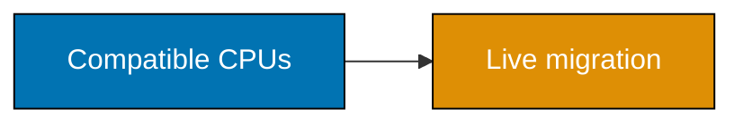
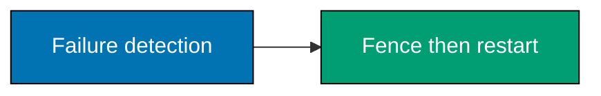
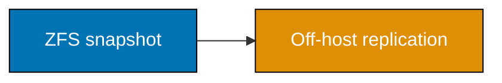
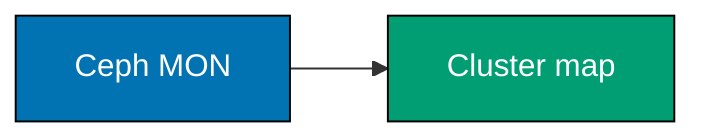
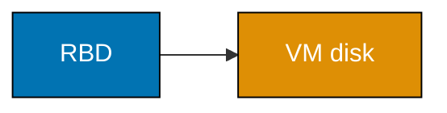
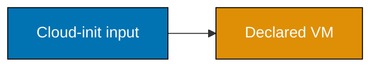

## Intermediate: cluster, storage, and declared guest state

These examples model changes that can affect a whole cluster or storage layer. Use the printed commands only as
review inputs; test real syntax and effects in a disposable, owner-approved multi-node lab.

### Example 29: Plan a Cluster Join

_ex-29 · exercises co-07_

**Brief explanation**: Cluster creation and join alter shared membership and should occur only on prepared lab
nodes. Confirm names, addresses, votes, time, and recovery access before using `pvecm create` or `pvecm add`.

```bash
# => Prints the membership gate; it does not create or join a cluster.
printf '%s\n' 'review node identity, network, votes, time sync, backup, and console access before pvecm'
```

**Verification**: The gate contains both network and recovery access because either can strand a node.

**Key takeaway**: A cluster join is a shared-control-plane change, not a local setup step.

**Why it matters**: Incorrect membership can affect quorum and every guest managed by the cluster. A deliberate
gate makes hidden dependencies visible before a node shares configuration with other hosts.

---

### Example 30: Name Corosync's Job

_ex-30 · exercises co-07_

**Brief explanation**: Corosync provides reliable group communication underneath Proxmox cluster membership.
It is a control-plane component, not guest data storage or a replacement for redundant networks.

```bash
# => Prints Corosync's role without starting, stopping, or reconfiguring it.
printf '%s\n' 'Corosync communicates cluster membership and votes for consistent control-plane state'
```

**Verification**: The output names membership and votes rather than claiming Corosync stores VM disks.

**Key takeaway**: Corosync supports quorum decisions; it does not eliminate network design work.

**Why it matters**: A cluster can lose quorum because of network partitions even while disks remain healthy.
Understanding Corosync's role helps an operator troubleshoot the right layer instead of applying guest-level fixes.

---

### Example 31: Design Three Node Quorum

_ex-31 · exercises co-07_

**Brief explanation**: Three voting members make a one-node loss survivable while retaining a majority. A
two-node cluster needs an independently placed third vote to avoid an ambiguous partition.

```bash
# => Prints the vote design rather than changing cluster membership.
printf '%s\n' '3 voting members: lose 1 and retain 2-of-3 majority'
```

**Verification**: The statement proves a majority after one loss, not simply a count of servers.

**Key takeaway**: Reliable HA begins with a quorum design that survives its stated failure.

**Why it matters**: High availability without a safe decision-maker can trade downtime for split-brain damage.
Design the vote topology and its network failure behavior before assigning HA responsibility to guests.

---

### Example 32: Plan a Live Migration

_ex-32 · exercises co-09_

**Brief explanation**: Live migration moves a running VM between compatible nodes while preserving service
continuity where supported. It requires shared storage or a compatible migration path, healthy quorum, and a
defined client-facing health probe.

```bash
# => Prints migration preconditions and never migrates a guest.
printf '%s\n' 'check quorum, CPU compatibility, storage, guest health probe, rollback node, and change owner'
```

**Verification**: The plan names a health probe; an administrative success message alone is insufficient.

**Key takeaway**: Migration is an availability procedure with preconditions and observable success criteria.

**Why it matters**: A running guest can appear migrated while client traffic or storage is unhealthy. Combining
control-plane checks with an application probe turns a maintenance action into a verifiable service decision.

---

### Example 33: Check Migration CPU Compatibility

_ex-33 · exercises co-09_

**Brief explanation**: Proxmox documents online migration support around compatible CPU vendor and feature
sets. Compare hosts before a migration window rather than discovering incompatibility during maintenance.

```bash
# => Prints the compatibility question without collecting host inventory.
printf '%s\n' 'verify source and target CPU vendor, model policy, and exposed guest features before online migration'
```

**Verification**: The check includes guest-visible features, not only a marketing CPU model name.

**Key takeaway**: CPU compatibility is a migration precondition that belongs in capacity design.

**Why it matters**: Mixed hardware can silently limit a supposedly portable cluster. Recording compatibility
before scheduling workload movement avoids a last-minute forced outage or unsafe workaround.

---

### Example 34: Plan an HA Service

_ex-34 · exercises co-08_

**Brief explanation**: Proxmox HA can restart an eligible VM on a surviving node after a host failure. It needs
quorum, shared or recoverable storage, appropriate guest configuration, and a clear restart expectation.

```bash
# => Prints HA prerequisites without registering any VM with HA.
printf '%s\n' 'HA requires quorum, storage reachability, redundancy, guest start policy, and owner approval'
```

**Verification**: The output separates HA prerequisites from the claim that a VM will never experience downtime.

**Key takeaway**: HA orchestrates recovery; it is not a guarantee of uninterrupted application service.

**Why it matters**: Failover has detection, fencing, restart, and application-recovery time. Honest criteria
let teams choose between HA, backups, and simpler single-host designs based on their actual recovery objective.

---

### Example 35: Trace HA Failover

_ex-35 · exercises co-08_

**Brief explanation**: HA recovery fences or isolates a failed node, then moves or restarts eligible services
on an online node. The sequence protects consistency before it optimizes availability.

```bash
# => Prints the recovery order and does not simulate a node failure.
printf '%s\n' 'detect failure -> fence unsafe node -> select survivor -> restart guest -> verify service'
```

**Verification**: The sequence fences before restart, avoiding two writers from one failed ownership decision.

**Key takeaway**: Failover safety depends on preventing concurrent ownership before recovery.

**Why it matters**: Restarting quickly on a second node is dangerous if the original node can still write.
Fencing and quorum are therefore correctness controls, not mere delays in an availability workflow.

---

### Example 36: Check HA Prerequisites

_ex-36 · exercises co-08_

**Brief explanation**: HA depends on several layers simultaneously: a quorum-capable cluster, accessible guest
storage, redundant host resources, and a guest that can restart correctly. Test each layer independently.

```bash
# => Prints an HA review list without enabling HA for any workload.
printf '%s\n' 'quorum + storage + survivor capacity + fencing + guest boot check = HA review'
```

**Verification**: The list includes survivor capacity because an available node may still be unable to host a VM.

**Key takeaway**: HA is a system property assembled from independently verified prerequisites.

**Why it matters**: Marketing a cluster as highly available can conceal a missing storage, capacity, or fencing
control. A prerequisite checklist prevents a single green dashboard from replacing real failure-mode evidence.

---

### Example 37: Plan ZFS Send Receive

_ex-37 · exercises co-15_

**Brief explanation**: `zfs send` and `zfs receive` replicate snapshot streams between trusted storage targets.
The transfer should be planned with retention, encryption, destination identity, and restore verification.

```bash
# => Prints replication decisions; it does not open SSH or stream a snapshot.
printf '%s\n' 'verify snapshot, destination, transport, retention, encryption, and restore evidence before send/receive'
```

**Verification**: The plan includes restore evidence, so replication is not confused with recoverability.

**Key takeaway**: A replication stream is useful only when its destination and restore path are trustworthy.

**Why it matters**: An off-host copy improves failure tolerance, but only if it is complete, retained, and
recoverable by an authorized operator. Treat transport and destination access as part of the data security model.

---

### Example 38: Plan Incremental ZFS Send

_ex-38 · exercises co-15_

**Brief explanation**: Incremental ZFS send transfers changes between an earlier and later snapshot. It reduces
transfer work but requires both sides to retain the expected common snapshot lineage.

```bash
# => Prints the lineage requirement without generating a storage stream.
printf '%s\n' 'incremental replication requires a retained common base snapshot and a later source snapshot'
```

**Verification**: The output names the common base, the condition that makes incremental transfer meaningful.

**Key takeaway**: Incremental replication depends on deliberate snapshot retention.

**Why it matters**: Removing a base snapshot can turn a small planned transfer into a larger recovery problem.
Retention policy and replication policy must be designed together so bandwidth savings do not undermine recovery.

---

### Example 39: Plan a ZFS Scrub

_ex-39 · exercises co-16_

**Brief explanation**: A ZFS scrub reads data to validate checksums and enable repair from redundancy where
available. It is a maintenance activity that should be scheduled with load, alerts, and follow-up review.

```bash
# => Prints scrub planning inputs and does not start a pool-wide read.
printf '%s\n' 'schedule scrub, monitor status, review checksum errors, and record remediation owner'
```

**Verification**: The plan includes review of errors rather than treating scrub completion as success alone.

**Key takeaway**: A scrub provides evidence about data integrity and needs an error-response path.

**Why it matters**: Silent corruption is valuable to discover before the only backup copy is needed. Regular
integrity checks become useful operations only when alerts, capacity, and replacement decisions are owned.

---

### Example 40: Plan Proxmox Replication

_ex-40 · exercises co-15_

**Brief explanation**: Proxmox replication can schedule ZFS-backed guest replication between nodes. It is not
the same as shared storage or automatic HA, so recovery expectations must remain explicit.

```bash
# => Prints a schedule design question without creating a replication job.
printf '%s\n' 'choose replication interval, target node, retention, promotion procedure, and recovery objective'
```

**Verification**: The output distinguishes replication timing from an automatic zero-data-loss claim.

**Key takeaway**: Scheduled replication has a measurable recovery-point gap and a documented promotion procedure.

**Why it matters**: A replica can be healthy yet behind recent writes. Naming the interval and promotion
procedure lets application owners decide whether the loss window is acceptable for their workload.

---

### Example 41: Model Hyperconvergence

_ex-41 · exercises co-21_

**Brief explanation**: Hyperconvergence uses the same physical nodes for compute and distributed storage.
It reduces separate hardware tiers but couples resource planning and failure behavior.

```bash
# => Prints the design boundary without deploying Ceph or placing a VM disk.
printf '%s\n' 'hyperconverged nodes supply both guest compute and replicated storage'
```

**Verification**: The statement describes shared responsibility, not a promise that every small cluster needs Ceph.

**Key takeaway**: Hyperconvergence trades hardware separation for coordinated capacity and failure planning.

**Why it matters**: Compute spikes can affect storage and a node failure removes both at once. Size CPU, memory,
disk, and network together so the desired fault still leaves enough capacity for remaining guests and replicas.

---

### Example 42: Plan a Ceph Monitor

_ex-42 · exercises co-18_

**Brief explanation**: Ceph monitors maintain cluster-map information and participate in cluster coordination.
Create them only after designing host count, networks, disk access, and operational ownership.

```bash
# => Prints Ceph monitor prerequisites without initializing or joining a Ceph cluster.
printf '%s\n' 'review three-node design, monitor placement, networks, disk mode, and recovery runbook before pveceph'
```

**Verification**: The gate names monitor placement and direct-disk mode, both essential to the intended model.

**Key takeaway**: A Ceph monitor is part of a designed cluster, not a one-command storage feature.

**Why it matters**: Distributed storage amplifies partial design mistakes across multiple hosts. Starting from
placement and recovery requirements prevents a lab convenience command from becoming an unmaintainable production dependency.

---

### Example 43: Plan a Ceph OSD

_ex-43 · exercises co-18_

**Brief explanation**: An OSD manages data on one direct-attached disk in a Ceph cluster. OSD creation is
destructive for the selected device, so validate disk identity, HBA mode, and drain/replacement procedures first.

```bash
# => Prints destructive-change gates and does not create an OSD.
printf '%s\n' 'verify disposable direct disk, CRUSH host, capacity, backfill headroom, and recovery plan before OSD create'
```

**Verification**: The gate includes backfill headroom, because recovery traffic competes with normal workload.

**Key takeaway**: An OSD is a storage failure-domain member, not merely an available disk.

**Why it matters**: A wrong disk choice destroys data and a full cluster can make repair unsafe or slow. Design
disk operations around placement, capacity, and replacement evidence rather than a single success command.

---

### Example 44: Assign Ceph Daemon Jobs

_ex-44 · exercises co-18_

**Brief explanation**: Ceph MON maintains maps, MGR exposes management functions, OSD stores data, and MDS
serves CephFS metadata. Each daemon has a different operational and failure role.

```bash
# => Prints daemon responsibilities without querying a Ceph cluster.
printf '%s\n' 'MON=maps; MGR=management; OSD=data disks; MDS=CephFS metadata'
```

**Verification**: The mapping keeps MDS specific to CephFS instead of assigning it all object storage duties.

**Key takeaway**: Diagnose Ceph by daemon role before changing a distributed-storage component.

**Why it matters**: A generic “Ceph is down” response obscures whether placement, management, disks, or file
metadata are affected. Role-aware incident records improve escalation and prevent unrelated components from being restarted blindly.

---

### Example 45: Trace CRUSH Placement

_ex-45 · exercises co-19_

**Brief explanation**: CRUSH computes data placement from cluster topology rather than a central lookup table.
Its rules express where replicas may live and which failures should not remove them together.

```bash
# => Prints the placement concept without modifying a CRUSH map.
printf '%s\n' 'CRUSH maps data to topology-aware OSD locations without a central placement lookup'
```

**Verification**: The statement mentions topology because equal replica counts alone do not prove safe placement.

**Key takeaway**: Replication needs placement rules that match physical failure boundaries.

**Why it matters**: Three replicas on one host or rack may satisfy a count while failing the actual resilience
goal. CRUSH makes topology part of data durability, so inventory and naming of hosts and racks matter.

---

### Example 46: Design a Ceph Failure Domain

_ex-46 · exercises co-19_

**Brief explanation**: A Ceph failure domain can be a disk, host, rack, or larger unit, depending on topology.
Choose the domain according to the loss you must survive and confirm replicas span it.

```bash
# => Prints a design question and does not edit Ceph topology.
printf '%s\n' 'for each replica, prove a distinct intended failure domain such as host or rack'
```

**Verification**: The word “prove” requires topology evidence rather than an assumed distribution.

**Key takeaway**: Failure-domain placement is the durability claim behind a Ceph design.

**Why it matters**: Hardware can be redundant on paper while sharing a power feed, host, or rack. Explicit
failure domains turn physical reality into a testable storage requirement that survives operational change.

---

### Example 47: Plan an RBD Pool

_ex-47 · exercises co-20_

**Brief explanation**: RBD provides block storage over Ceph and can back VM disks. Plan pool policy, replica
count, failure domain, capacity, and guest recovery before associating a production workload with it.

```bash
# => Prints RBD review inputs without creating a pool or attaching a VM disk.
printf '%s\n' 'review RBD pool policy, replica rule, capacity, failure domain, and restore path'
```

**Verification**: The plan includes restore path; durable block storage still needs a guest-level recovery plan.

**Key takeaway**: An RBD pool is a policy-backed guest-disk dependency, not generic free capacity.

**Why it matters**: VM disks carry application state with different recovery needs. Aligning pool rules with
workload requirements prevents a generic storage default from silently setting an unacceptable data-loss boundary.

---

### Example 48: Name CephFS

_ex-48 · exercises co-20_

**Brief explanation**: CephFS provides a POSIX filesystem over Ceph's distributed storage and uses metadata
servers. It is different from RBD block devices even though both use the same underlying cluster.

```bash
# => Prints the interface distinction without mounting a filesystem.
printf '%s\n' 'RBD is block storage; CephFS is a shared POSIX filesystem with MDS metadata service'
```

**Verification**: The output names the metadata service and does not describe CephFS as a VM disk format.

**Key takeaway**: Choose CephFS for shared file semantics and RBD for block-device semantics.

**Why it matters**: Interface choice changes client behavior, performance, permissions, backup, and failure
diagnosis. Naming the desired semantics before deployment prevents application storage from inheriting an accidental abstraction.

---

### Example 49: Size a Three Node Ceph Lab

_ex-49 · exercises co-21_

**Brief explanation**: A hyperconverged Ceph lab needs at least three appropriately designed nodes to exercise
quorum and distributed placement meaningfully. Prefer similar hardware and leave capacity for recovery traffic.

```bash
# => Prints a lab-sizing rule without installing Ceph.
printf '%s\n' 'three similar nodes, direct disks, redundant networking, and recovery headroom form a useful Ceph lab'
```

**Verification**: The model includes network and recovery headroom rather than treating node count as sufficient.

**Key takeaway**: Three nodes are a starting point; they do not substitute for capacity and network design.

**Why it matters**: Under-resourced distributed storage can be less reliable than a well-run single ZFS host.
Lab realism comes from testing the declared failure model, not from installing a logo on too little hardware.

---

### Example 50: Declare a Proxmox Provider

_ex-50 · exercises co-26_

**Brief explanation**: Terraform or OpenTofu declares provider source and configuration before it can describe
Proxmox resources. The capstone names `bpg/proxmox` but intentionally omits endpoint, version pin, and token value.

```hcl
# => Selects a provider source; verify the current version and checksum in an owner-reviewed lock file.
proxmox = { source = "bpg/proxmox" }
```

**Verification**: The snippet contains a source address but no secret or reachable endpoint.

**Key takeaway**: Provider declaration is reproducibility metadata, not authorization material.

**Why it matters**: Pinning and reviewing providers limits supply-chain surprises while external inputs protect
the control plane. Resolve and lock dependencies only in an approved environment with a reviewable update process.

---

### Example 51: Keep a Provider Token External

_ex-51 · exercises co-26_

**Brief explanation**: Provider endpoint and API token must be supplied securely outside source control. Sensitive
variables reduce accidental display but do not make a token safe in a committed state file.

```hcl
# => Declares external secret input; there is deliberately no default value.
variable "proxmox_api_token" { type = string, sensitive = true }
```

**Verification**: The declaration has no token literal, and the capstone validator rejects token-shaped literals.

**Key takeaway**: Secret inputs, state protection, and least privilege are separate controls.

**Why it matters**: IaC can persist resource inputs in state even when console output masks them. Treat state as
sensitive infrastructure data, restrict its access, and avoid publishing plans or logs that reveal credentials.

---

### Example 52: Declare a VM Clone

_ex-52 · exercises co-26_

**Brief explanation**: A VM clone should derive from a known image contract and a named storage policy. This
capstone uses locals to describe intent, avoiding a resource block that could create a guest by copy-paste.

```hcl
# => Records the reusable image contract without creating any virtual machine.
template = "owner-approved-cloud-init-template"
```

**Verification**: The placeholder identifies a contract rather than a real template ID or production guest name.

**Key takeaway**: Clone from a reviewed template instead of preserving manually changed guests.

**Why it matters**: A golden image plus first-boot configuration makes replacement repeatable. A clone definition
still needs ownership of storage, network, identity, and recovery—automation does not choose these safely by itself.

---

### Example 53: Review Plan Then Apply

_ex-53 · exercises co-27_

**Brief explanation**: An IaC plan previews intended drift before an apply changes infrastructure. Review the
resource graph, replacements, sensitive inputs, target boundary, and rollback before an owner applies it.

```bash
# => Prints the review order without initializing a provider or applying state.
printf '%s\n' 'fmt -> init in approved lab -> plan -> peer review -> approved apply -> re-plan'
```

**Verification**: The sequence includes a re-plan, which tests convergence after an intentional change.

**Key takeaway**: Plan is a review artifact; apply is an approved state transition.

**Why it matters**: A declarative tool can still replace a guest, detach storage, or change networking. Reading
the plan turns hidden provider actions into an accountable decision before the hypervisor receives them.

---

### Example 54: Check an Idempotent Apply

_ex-54 · exercises co-27_

**Brief explanation**: Reapplying unchanged declared state should produce no planned changes after convergence.
Unexpected drift is a diagnostic signal, not an invitation to suppress the plan.

```bash
# => Prints the expected convergence result without running Terraform or OpenTofu.
printf '%s\n' 'unchanged reviewed configuration should re-plan with no infrastructure changes'
```

**Verification**: Investigate a nonempty re-plan for manual changes, provider behavior, or incomplete declaration.

**Key takeaway**: A clean re-plan is evidence of convergence, not proof that the workload is healthy.

**Why it matters**: Idempotency makes automation repeatable, but it cannot validate application data or backup
quality. Use it with health checks, inventory, and recovery evidence rather than confusing configuration stability with service safety.

---

### Example 55: Inject Cloud Init Through IaC

_ex-55 · exercises co-23_

**Brief explanation**: IaC can pass cloud-init user data to a guest clone so per-instance setup stays declared.
The input must contain only reviewed, non-secret configuration or securely referenced secret delivery.

```yaml
# => Represents non-secret first-boot intent; a real key or token is intentionally absent.
ssh_pwauth: false
```

**Verification**: The artifact sets a secure access policy but does not embed an identity secret.

**Key takeaway**: IaC and cloud-init form a controlled handoff from substrate to guest configuration.

**Why it matters**: Passing inline secrets through IaC expands the number of places they may persist. Keep the
contract small, use a protected secret mechanism where necessary, and verify the guest's final state after boot.

---

### Example 56: Choose a Maintained Provider

_ex-56 · exercises co-28_

**Brief explanation**: Provider maintenance status affects compatibility, fixes, and available resource coverage.
Select the maintained provider after checking its current repository, release, documentation, and migration implications.

```bash
# => Prints evaluation criteria rather than installing an unreviewed provider.
printf '%s\n' 'compare maintenance, docs, security updates, resource coverage, and migration risk'
```

**Verification**: The criteria include migration risk, because a new provider can change state and resource behavior.

**Key takeaway**: Provider choice is a lifecycle decision, not a copy-paste detail.

**Why it matters**: An abandoned provider can freeze infrastructure on old APIs or leave bugs unresolved. A
maintained alternative still needs a sandbox migration and reviewed state strategy before it manages important guests.

## Intermediate architecture snapshots

Each diagram describes a relationship already covered above; labels, rather than color, provide the meaning.

```mermaid
%% Color Palette: Blue #0173B2, Teal #029E73.
flowchart LR
  A["Nodes"]:::blue --> B["Quorum"]:::teal
  classDef blue fill:#0173B2,stroke:#000,color:#fff
  classDef teal fill:#029E73,stroke:#000,color:#fff
```














