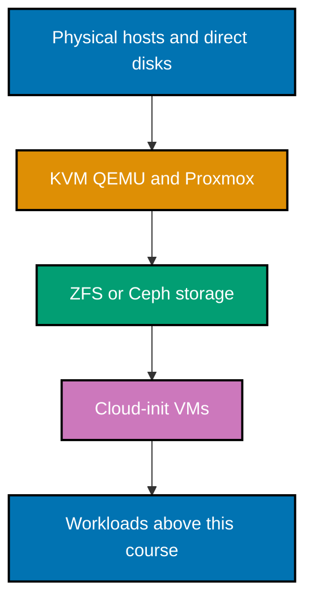

> **Read before apply.** The examples model real operations, but their default commands only print an
> intended operation or validate bundled text. Substitute a real target only in a disposable lab you own,
> after confirming backups, disks, hostnames, network paths, and a rollback plan.

## Start with the local skeleton

The capstone artifacts contain placeholders only. This check is safe to run anywhere: it reads local files,
rejects placeholder-looking secrets, and does not contact Proxmox, a package registry, or a network target.

```sh
# => Validates only the bundled teaching skeleton and exits nonzero on an unsafe committed token pattern.
sh code/validate-skeleton.sh
```

## Concepts

The course covers the hypervisor and platform boundary (`co-01`–`co-10`), ZFS/Ceph storage and failure
models (`co-11`–`co-21`), cloud-init and immutable guest delivery (`co-22`–`co-25`), API-driven IaC and
configuration (`co-26`–`co-31`), unattended host provisioning and recovery (`co-32`–`co-33`), and explicit
failure-domain reasoning (`co-34`). The examples use declarative HCL/YAML and harmless shell output before
asking a reader to operate a real lab.

## Substrate map



The arrows show dependency, not an instruction to combine every technology. A small installation may use one
host and ZFS; Ceph and HA require a designed multi-node failure domain. A later Kubernetes course consumes
the VMs; this course makes their substrate deliberate.

Next: [Beginner Examples](./beginner.md) →
