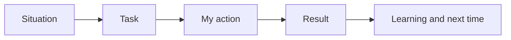

Behavioral interviewing is an evidence exercise. The interviewer cannot observe a past project, so
they infer ownership, collaboration, judgment, and level from a specific story. STAR gives the story
a shape; reflection shows that the candidate can change; a story bank prevents improvising under a
clock. Keep names and sensitive details appropriately generalized, but never invent a result.

## Concepts

### Story structure and evidence

- **co-01 · what-behavioral-rounds-score** — the round scores observable ownership, self-awareness,
  fit, collaboration, and level through real examples. Verify: each answer names behavior, not a trait.
- **co-02 · star-structure** — Situation, Task, Action, Result makes a story legible. Verify: all four
  parts appear in order.
- **co-03 · reflection-extension** — say what changed in your practice. Verify: the lesson is a new
  behavior, not “I learned a lot.”
- **co-04 · first-person-ownership** — distinguish your actions from the team’s work. Verify: a reader
  can underline the decisions you made.
- **co-05 · specificity-over-generality** — concrete stakes and constraints are credible. Verify: the
  answer includes a real detail that a follow-up could test.
- **co-06 · measurable-result** — close with evidence, numeric or concrete. Verify: the outcome is not
  merely asserted.
- **co-07 · story-bank-preparation** — prepare six to eight reusable stories. Verify: every story has
  a theme tag.
- **co-08 · theme-mapping** — one event can answer several prompts from different angles. Verify: the
  angle, rather than facts, changes per prompt.
- **co-09 · conciseness-and-time** — a two-to-three-minute answer protects the interview. Verify: a
  timed rehearsal keeps the complete arc.

### Senior, staff, and EM evidence

- **co-10 · handling-failure-questions** — own cause and correction without blame. Verify: the answer
  includes a decision you would change.
- **co-11 · conflict-and-disagreement** — show respectful disagreement and resolution. Verify: both
  perspectives and the outcome appear.
- **co-12 · leadership-without-authority** — influence through framing, trust, data, or mentoring.
  Verify: the mechanism is explicit.
- **co-13 · ambiguity-and-judgment** — make a bounded call with incomplete information. Verify: name
  how uncertainty was reduced.
- **co-14 · cross-team-influence** — align stakeholders across boundaries. Verify: name the alignment
  mechanism and trade-off.

### Career context and interview presence

- **co-15 · layoff-narrative** — a layoff is a factual business event: state it briefly, say what you
  did next, and pivot to the role. Verify: no bitterness or apology.
- **co-16 · employment-gap-narrative** — give a bounded, honest employment gap explanation and show
  readiness. Verify: private detail is not required to make the account credible.
- **co-17 · reframing-a-setback** — describe real growth without spinning the setback away. Verify:
  present behavior demonstrates the learning.
- **co-18 · questions-for-the-interviewer** — ask questions that reveal mutual fit. Verify: each answer
  would change your decision about the role.
- **co-19 · authenticity-and-honesty** — a real imperfect story withstands follow-ups. Verify: facts
  remain consistent when probed.
- **co-20 · reading-the-level-bar** — calibrate scope for IC, senior, staff, or EM expectations.
  Verify: the claimed impact matches the target level.
- **co-21 · composure-under-probing** — pause, clarify, then answer specifically. Verify: follow-up
  details remain consistent.
- **co-22 · values-and-motivation-alignment** — connect genuine motivation and working style to the
  work. Verify: it is grounded in the role, not generic praise.

## How to use the scenarios

Each worked scenario has a page-level explanation and a companion artifact in `learning/artifacts/`.
Read the scenario, replace the fictional detail with a true one from your history, rehearse aloud,
and use its observable verification rule. The examples progress from STAR structure, through senior,
staff, and EM leadership evidence, to career narratives and full mock rounds.
