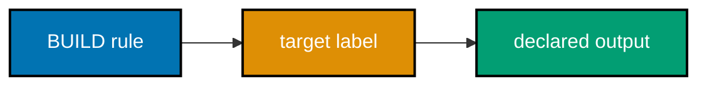
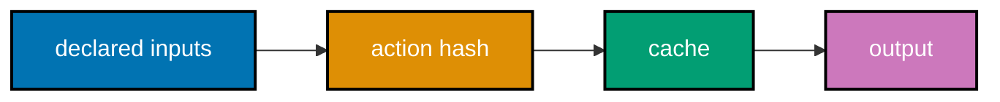
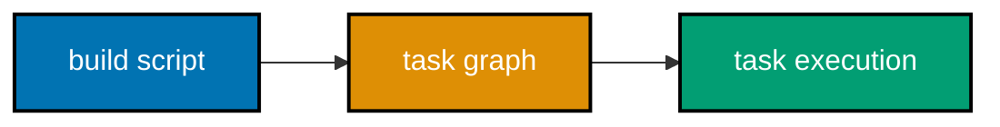
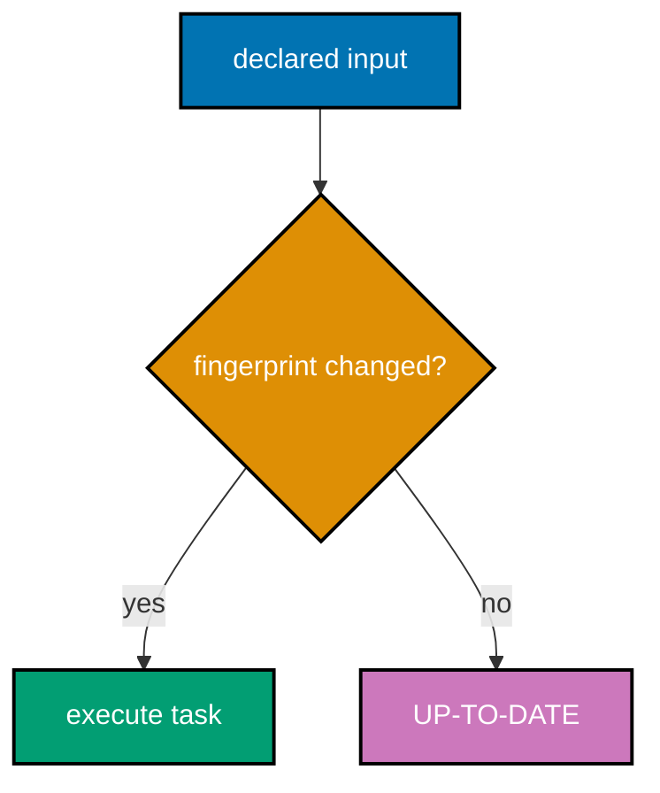
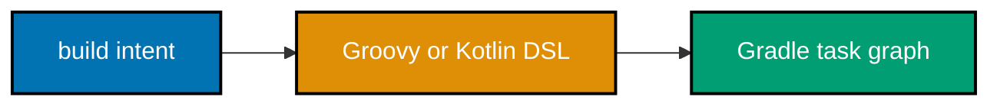
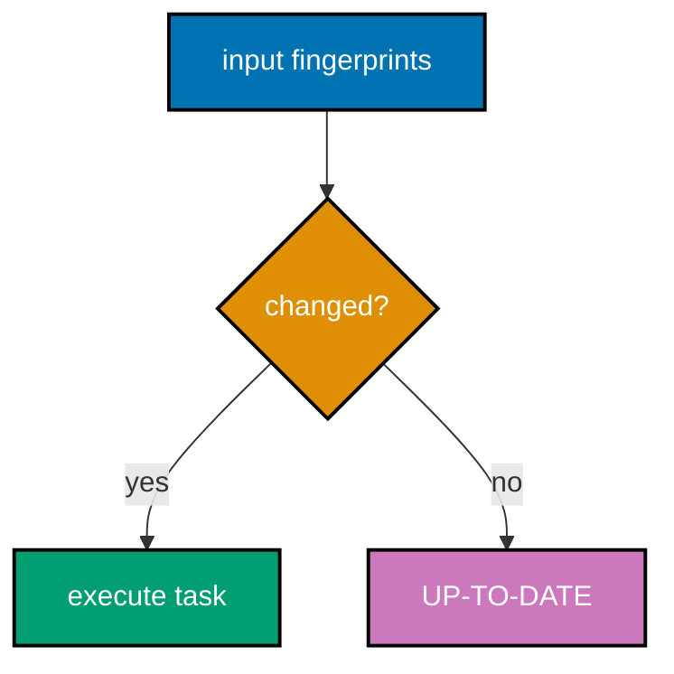
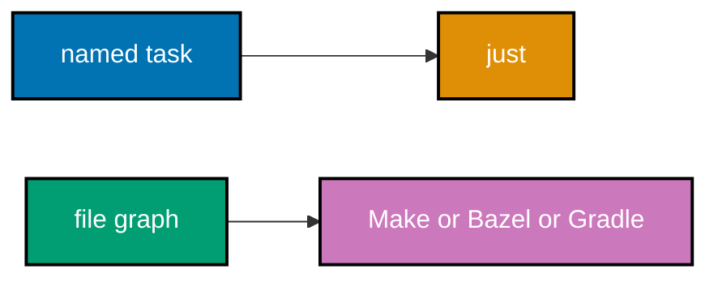
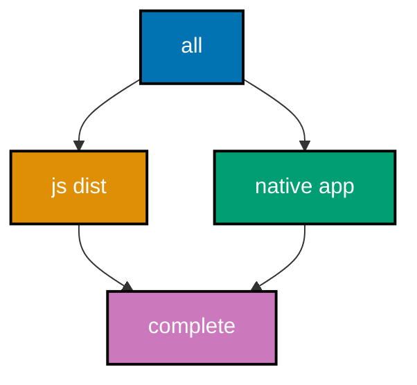
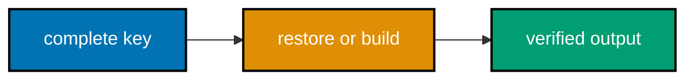

## Content-addressed and task-graph build systems

Bazel and Gradle examples are complete, local definitions. Their CLIs are optional in this environment,
so verify syntax and semantics against the included project files before invoking an installed tool.

### Flow 21: Bazel target



### Flow 22: Bazel cache



### Flow 23: Gradle configuration



### Flow 24: Gradle incremental task



### Flow 25: DSL choice



### Example 56: Declare a Bazel Build Target

_ex-56 · exercises co-23_

**Brief explanation**: A BUILD file declares targets in a package. This local rule copies one source
file to a named generated output.

**Runnable artifact**: [BUILD.bazel](./code/ex-56-bazel-build-file/BUILD.bazel) and [message.txt](./code/ex-56-bazel-build-file/message.txt).

```starlark
# => genrule declares one named build target.
genrule(
    # => The label after the colon is message_copy.
    name = "message_copy",
    # => The closing parenthesis completes the rule declaration.
)
```

**Verify**: Run <code>bazel build //:message_copy</code> when Bazel is installed.

**Key takeaway**: A Bazel BUILD file defines named targets within a package.

**Why it matters**: A target declaration makes inputs and outputs visible to the build graph. That
visibility is what lets Bazel reason about isolated actions and cache their results consistently. At team scale, a target label and complete input declaration let CI and developers request the same narrow work and share it safely, instead of rebuilding broad unrelated portions of the repository.

### Example 57: Build One Bazel Target

_ex-57 · exercises co-23_

**Brief explanation**: A Bazel label has package and target components. The root-package target label
<code>//:message_copy</code> selects exactly the output declared by the artifact.

**Runnable artifact**: [BUILD.bazel](./code/ex-57-bazel-build-cmd/BUILD.bazel) and [message.txt](./code/ex-57-bazel-build-cmd/message.txt).

```text
# => The double slash selects the main repository.
bazel build //:message_copy
```

**Verify**: Run the displayed command from the artifact directory with Bazel installed.

**Key takeaway**: A Bazel command addresses one declared target with a label.

**Why it matters**: A precise label is a build-system API. It lets developers and CI request the
smallest relevant unit rather than relying on a broad, imperative script. At team scale, a target label and complete input declaration let CI and developers request the same narrow work and share it safely, instead of rebuilding broad unrelated portions of the repository.

### Example 58: Select All Main-Repository Bazel Targets

_ex-58 · exercises co-24_

**Brief explanation**: The <code>//...</code> target pattern selects eligible non-<code>manual</code>
rule targets throughout the main repository. It is useful for a broad validation command, not a default
for every edit.

**Runnable artifact**: Read [decision.md](./code/ex-58-bazel-all-targets/decision.md).

```text
# => The ellipsis recursively selects packages in the main repository.
bazel build //...
```

**Verify**: Confirm the artifact distinguishes a global target pattern from one target label.

**Key takeaway**: Target patterns select a set of eligible declared Bazel targets.

**Why it matters**: A full-tree command gives CI broad evidence but can be unnecessarily expensive
locally. Target patterns make the scope visible so teams can choose an appropriate feedback loop. At team scale, a target label and complete input declaration let CI and developers request the same narrow work and share it safely, instead of rebuilding broad unrelated portions of the repository.

### Example 59: Read Bazel Label Syntax

_ex-59 · exercises co-24_

**Brief explanation**: A label uses repository, package, and target syntax. The decision artifact
breaks a label into the portions a Bazel command resolves.

**Runnable artifact**: Read [decision.md](./code/ex-59-bazel-label-syntax/decision.md).

```text
# => //tools:formatter is package tools and target formatter.
//tools:formatter
```

**Verify**: Confirm the package is <code>tools</code> and the target is <code>formatter</code>.

**Key takeaway**: Labels precisely identify a declared build target.

**Why it matters**: Reading labels correctly prevents accidental broad builds and makes dependencies
reviewable. The label is the stable reference another package uses to declare its own input edge. At team scale, a target label and complete input declaration let CI and developers request the same narrow work and share it safely, instead of rebuilding broad unrelated portions of the repository.

### Example 60: Understand Bazel Incrementality

_ex-60 · exercises co-22_

**Brief explanation**: Bazel can reuse an action result when its complete declared inputs have not
changed. A source edit changes the relevant action identity rather than every target by default.

**Runnable artifact**: Read [decision.md](./code/ex-60-bazel-incremental/decision.md).

```text
# => changed declared input changes only dependent action keys.
source edit -> affected action keys -> rerun affected actions
```

**Verify**: Confirm unchanged independent actions remain eligible for reuse.

**Key takeaway**: Content-aware incremental work follows declared dependency edges.

**Why it matters**: Incrementality is a graph property. A tool can avoid unrelated work only if the
project has described which actions actually consume the changed input. At team scale, a target label and complete input declaration let CI and developers request the same narrow work and share it safely, instead of rebuilding broad unrelated portions of the repository.

### Example 61: Describe a Bazel Remote Cache

_ex-61 · exercises co-25_

**Brief explanation**: A remote cache shares action outputs among compatible developers and CI. It
contains build artifacts keyed by the same action identity used for local reuse.

**Runnable artifact**: Read [decision.md](./code/ex-61-bazel-remote-cache/decision.md).

```text
# => CI and developers can read matching action outputs.
action key -> shared cache -> reusable output
```

**Verify**: Confirm the artifact says a remote cache reuses outputs rather than source code.

**Key takeaway**: A shared cache lets equivalent actions avoid duplicate computation across machines.

**Why it matters**: Remote caching improves feedback only when builds are hermetic enough that a key
means the same thing everywhere. Treat cache access and trust boundaries as part of build design. At team scale, a target label and complete input declaration let CI and developers request the same narrow work and share it safely, instead of rebuilding broad unrelated portions of the repository.

### Example 62: Pin a Bazel External Dependency

_ex-62 · exercises co-21_

**Brief explanation**: Hermetic dependency acquisition records a cryptographic integrity value for an
external archive. The decision artifact models the pin rather than fetching an external network resource.

**Runnable artifact**: Read [decision.md](./code/ex-62-bazel-hermetic-hash/decision.md).

```text
# => URL plus verified sha256 identifies an external archive.
archive URL + sha256 -> pinned external input
```

**Verify**: Confirm the integrity hash is an explicit declared input.

**Key takeaway**: A hash pin makes external dependency bytes part of the declared build boundary.

**Why it matters**: Version labels alone do not prove retrieved bytes. A content hash strengthens
reproducibility by allowing the build tool to reject an archive that does not match the declaration. At team scale, a target label and complete input declaration let CI and developers request the same narrow work and share it safely, instead of rebuilding broad unrelated portions of the repository.

### Example 63: Register a Gradle Task

_ex-63 · exercises co-26_

**Brief explanation**: A Gradle build script registers a task with a name and action. The task prints
a local message so its behavior is inspectable.

**Runnable artifact**: [build.gradle.kts](./code/ex-63-gradle-task/build.gradle.kts).

```kotlin
// => register creates a task node named hello.
tasks.register("hello") {
  // => doLast supplies the task action.
  doLast { println("hello task") }
  // => The brace completes the task configuration.
}
```

**Verify**: Run <code>gradle hello</code> when Gradle is installed.

**Key takeaway**: Gradle tasks are named work nodes registered during configuration.

**Why it matters**: Naming a task gives other tasks and CLI requests a stable reference. The task graph
can then determine ordering before task actions begin to mutate outputs. The task definition should make inputs, outputs, and graph dependencies obvious before execution. That gives Gradle enough information to explain a skip, a rerun, or a cache result to reviewers.

### Example 64: Observe Gradle's Task Graph Phase

_ex-64 · exercises co-26_

**Brief explanation**: Gradle constructs the requested task graph during configuration before executing
task actions. The decision artifact separates graph creation from execution.

**Runnable artifact**: Read [decision.md](./code/ex-64-gradle-task-graph/decision.md).

```text
# => configuration builds the DAG before actions execute.
configuration -> task graph -> execution
```

**Verify**: Confirm graph construction precedes task action execution.

**Key takeaway**: Gradle plans its task DAG before it runs the selected tasks.

**Why it matters**: The two phases explain why configuration code should be predictable and fast. A
slow or side-effecting configuration phase impairs every requested task, not just one target. The task definition should make inputs, outputs, and graph dependencies obvious before execution. That gives Gradle enough information to explain a skip, a rerun, or a cache result to reviewers.

### Example 65: Run a Gradle Build Task

_ex-65 · exercises co-26_

**Brief explanation**: The conventional build task can aggregate lower-level work. This tiny script
defines a local verification task and makes build depend on it.

**Runnable artifact**: [build.gradle.kts](./code/ex-65-gradle-run-task/build.gradle.kts).

```kotlin
// => verifyLocal is a leaf task in the graph.
val verifyLocal = tasks.register("verifyLocal") {
  // => The action proves the task was selected.
  doLast { println("verified") }
  // => The brace completes the leaf task configuration.
}
```

**Verify**: Run <code>gradle build</code> when Gradle is installed.

**Key takeaway**: An aggregate task can request lower-level tasks through graph dependencies.

**Why it matters**: Aggregation provides a useful project entry point without losing the smaller
diagnostic tasks. The graph documents what a broad command means before it executes anything. The task
definition should make inputs, outputs, and graph dependencies obvious before execution. That gives Gradle
enough information to explain a skip, a rerun, or a cache result to reviewers.

### Flow 26: Incremental Gradle task



### Flow 27: Reproducible build


### Flow 28: Tool selection



### Flow 29: CI invokes build


### Flow 30: Make capstone graph



### Flow 31: Cache boundary in CI



### Example 66: Observe a Gradle Up-to-Date Task

_ex-66 · exercises co-27_

**Brief explanation**: Gradle can mark a task UP-TO-DATE when declared input and output fingerprints
match a prior execution. The artifact declares both sides of that contract.

**Runnable artifact**: [build.gradle.kts](./code/ex-66-gradle-up-to-date/build.gradle.kts) and [input.txt](./code/ex-66-gradle-up-to-date/input.txt).

```kotlin
// => The input file participates in the task fingerprint.
inputs.file("input.txt")
// => The output file records completed task work.
outputs.file(layout.buildDirectory.file("output.txt"))
```

**Verify**: Run <code>gradle copyInput</code> twice when Gradle is installed.

**Key takeaway**: Gradle incremental behavior follows declared task inputs and outputs.

**Why it matters**: A task cannot safely be skipped until Gradle knows what it reads and writes. Accurate
declarations turn an optimization into a correctness-preserving reuse decision. The task definition should make inputs, outputs, and graph dependencies obvious before execution. That gives Gradle enough information to explain a skip, a rerun, or a cache result to reviewers.

### Example 67: Rerun an Affected Gradle Task

_ex-67 · exercises co-27_

**Brief explanation**: Changing a declared input invalidates the task that consumes it. Unrelated task
outputs can remain up to date because they do not share that input edge.

**Runnable artifact**: Read [decision.md](./code/ex-67-gradle-incremental-change/decision.md).

```text
# => Changed input invalidates only its dependent task.
input.txt edit -> copyInput reruns
```

**Verify**: Confirm the artifact does not claim all project tasks rerun.

**Key takeaway**: Incremental work is scoped by declared graph dependencies.

**Why it matters**: Broad rebuilds hide the real dependency structure and slow feedback. A precise
input declaration makes both correctness and the expected amount of work visible to reviewers. The task definition should make inputs, outputs, and graph dependencies obvious before execution. That gives Gradle enough information to explain a skip, a rerun, or a cache result to reviewers.

### Example 68: Enable a Gradle Build Cache

_ex-68 · exercises co-28_

**Brief explanation**: Gradle's build cache can reuse outputs for cacheable tasks with matching inputs.
The artifact enables cache use through Gradle properties and configures its local cache.

**Runnable artifact**: [gradle.properties](./code/ex-68-gradle-build-cache/gradle.properties) and
[settings.gradle.kts](./code/ex-68-gradle-build-cache/settings.gradle.kts).

```kotlin
// => Local cache storage is explicitly enabled.
buildCache {
  // => Enabled tasks may reuse a matching output.
  local { isEnabled = true }
  // => The brace completes cache configuration.
}
```

**Verify**: Run <code>gradle --build-cache cachedHello</code>, delete <code>build/</code>, then rerun
the same command and inspect the cache-restored result.

**Key takeaway**: The Gradle build cache reuses matching task outputs.

**Why it matters**: Caching is useful only when a task's inputs fully describe its result. Enable it as
a correctness-aware reuse mechanism, not as a way to mask undeclared dependencies. The task definition should make inputs, outputs, and graph dependencies obvious before execution. That gives Gradle enough information to explain a skip, a rerun, or a cache result to reviewers.

### Example 69: Use the Gradle Groovy DSL

_ex-69 · exercises co-29_

**Brief explanation**: A Groovy DSL build script uses the .gradle filename. It can register the same
task concept expressed in Kotlin DSL.

**Runnable artifact**: [build.gradle](./code/ex-69-gradle-groovy-dsl/build.gradle).

```groovy
// => Groovy DSL registers a task named hello.
tasks.register('hello') {
  // => doLast supplies a local task action.
  doLast { println 'hello' }
  // => The brace completes the task configuration.
}
```

**Verify**: Run <code>gradle hello</code> with Gradle installed.

**Key takeaway**: Gradle supports build logic in Groovy DSL files.

**Why it matters**: DSL choice should follow team conventions and tooling needs. Both DSLs model the
same task graph, so favor clarity and consistent review practices over novelty. The task definition should make inputs, outputs, and graph dependencies obvious before execution. That gives Gradle enough information to explain a skip, a rerun, or a cache result to reviewers.

### Example 70: Use the Gradle Kotlin DSL

_ex-70 · exercises co-29_

**Brief explanation**: A Kotlin DSL build script uses the .gradle.kts filename. Its typed syntax can
offer Kotlin-aware editor support for build logic.

**Runnable artifact**: [build.gradle.kts](./code/ex-70-gradle-kotlin-dsl/build.gradle.kts).

```kotlin
// => Kotlin DSL registers the same local hello task.
tasks.register("hello") {
  // => The task action prints deterministic evidence.
  doLast { println("hello") }
  // => The brace completes the task configuration.
}
```

**Verify**: Run <code>gradle hello</code> with Gradle installed.

**Key takeaway**: Kotlin DSL expresses Gradle build logic in Kotlin syntax.

**Why it matters**: A typed DSL can improve navigation and refactoring for teams already using Kotlin,
but it does not eliminate the need to keep task inputs and outputs explicit. The task definition should make inputs, outputs, and graph dependencies obvious before execution. That gives Gradle enough information to explain a skip, a rerun, or a cache result to reviewers.

### Example 71: Compare the Gradle DSLs

_ex-71 · exercises co-29_

**Brief explanation**: The decision artifact compares Groovy and Kotlin build script formats without
claiming one produces a different Gradle execution model.

**Runnable artifact**: Read [decision.md](./code/ex-71-dsl-comparison/decision.md).

```markdown
<!-- => Both DSLs create Gradle task graphs. -->

| DSL    | File extension |
| ------ | -------------- |
| Groovy | .gradle        |
```

**Verify**: Confirm the Kotlin row uses .gradle.kts.

**Key takeaway**: Groovy and Kotlin are two authoring syntaxes for the same Gradle model.

**Why it matters**: Separating syntax choice from build semantics avoids a false architectural debate.
The most important design work remains declaring accurate task relationships and inputs. The task definition should make inputs, outputs, and graph dependencies obvious before execution. That gives Gradle enough information to explain a skip, a rerun, or a cache result to reviewers.

### Example 72: Define a Reproducible Build

_ex-72 · exercises co-31_

**Brief explanation**: Reproducibility means equivalent pinned and hermetic inputs produce the same
output bytes. It is stronger than merely skipping work in an incremental run.

**Runnable artifact**: Read [decision.md](./code/ex-72-reproducible-build/decision.md).

```text
# => Pinned tools and inputs plus hermetic action yield equal output bytes.
pinned inputs + isolation -> byte-identical output
```

**Verify**: Confirm the artifact requires both pinned inputs and isolation.

**Key takeaway**: Reproducibility is an output-equivalence guarantee across equivalent environments.

**Why it matters**: A build that is merely fast may still change output on another machine. Reproducible
results strengthen release confidence, reviewability, and cache correctness. Use this criterion when choosing and reviewing a build design: fast feedback matters, but the stronger outcome is a result whose dependencies and bytes remain explainable across developer environments.

### Example 73: Separate Reproducibility from Incrementality

_ex-73 · exercises co-31_

**Brief explanation**: Incrementality decides what work can be skipped after a change; reproducibility
asks whether equivalent inputs always yield identical output.

**Runnable artifact**: Read [decision.md](./code/ex-73-reproducible-vs-incremental/decision.md).

```text
# => Incremental: avoid unnecessary execution.
# => Reproducible: same declared inputs yield same bytes.
```

**Verify**: Confirm the two rows describe different questions.

**Key takeaway**: Incrementality and reproducibility reinforce each other but are not synonyms.

**Why it matters**: Conflating the concepts creates weak acceptance criteria. A build can skip work
correctly yet still depend on a machine-specific input that makes its output non-reproducible. Use this criterion when choosing and reviewing a build design: fast feedback matters, but the stronger outcome is a result whose dependencies and bytes remain explainable across developer environments.

### Example 74: Choose a Build Tool by Need

_ex-74 · exercises co-02_

**Brief explanation**: The decision artifact selects a command runner, timestamp builder, or hermetic
graph system according to the project need rather than tool popularity.

**Runnable artifact**: Read [decision.md](./code/ex-74-tool-selection/decision.md).

```markdown
<!-- => Selection begins with the needed dependency model. -->

| Need                 | Suitable tool |
| -------------------- | ------------- |
| Named developer task | just          |
```

**Verify**: Confirm artifact-graph needs do not select just alone.

**Key takeaway**: Tool selection follows the required build model and scale.

**Why it matters**: A small project deserves a simple transparent tool, while a large multi-language
graph may justify hermetic execution and shared caching. Make the trade-off explicit. Use this criterion when choosing and reviewing a build design: fast feedback matters, but the stronger outcome is a result whose dependencies and bytes remain explainable across developer environments.

### Example 75: Explain Monorepo Build Scaling

_ex-75 · exercises co-24_

**Brief explanation**: Large polyglot repositories often need target selection, hermetic actions, and
shared cache reuse. The decision artifact relates those needs to a target graph.

**Runnable artifact**: Read [decision.md](./code/ex-75-monorepo-scaling/decision.md).

```text
# => A target graph lets one source edit select a narrow affected closure.
changed package -> dependent targets -> affected build set
```

**Verify**: Confirm the artifact identifies target selection and caching as scaling mechanisms.

**Key takeaway**: Monorepo scale turns build graph accuracy into a feedback-loop concern.

**Why it matters**: Running every project after every edit is wasteful and hides dependency ownership.
A target graph lets CI and developers request the relevant closure and reuse compatible work. Use this criterion when choosing and reviewing a build design: fast feedback matters, but the stronger outcome is a result whose dependencies and bytes remain explainable across developer environments.

### Example 76: Invoke a Build Tool from CI

_ex-76 · exercises co-32_

**Brief explanation**: CI should invoke the same named build target contributors use locally. The
decision artifact gives Make, Bazel, and Gradle examples without embedding a deployment workflow.

**Runnable artifact**: Read [decision.md](./code/ex-76-ci-invokes-build/decision.md).

```text
# => CI calls a build-tool entry point and records the outcome.
make ci | bazel test //... | gradle build
```

**Verify**: Confirm each command belongs to a build tool, not a release policy.

**Key takeaway**: CI consumes build-tool targets as its unit of verification.

**Why it matters**: Sharing a local and CI entry point reduces environment drift. The pipeline owns
orchestration; the build tool owns dependency ordering and its artifact semantics. CI and local development should preserve the same entry point and input boundary. That alignment makes a failed build reproducible, makes cache behavior reviewable, and prevents orchestration from hiding build semantics.

### Example 77: Restore a Cache in CI

_ex-77 · exercises co-28_

**Brief explanation**: CI can restore a build cache before invoking the build tool, then save outputs
produced by a successful run. The cache key must reflect the complete build inputs.

**Runnable artifact**: Read [decision.md](./code/ex-77-cache-in-ci/decision.md).

```text
# => Compute complete key, restore matching cache, then run build.
input fingerprint -> restore cache -> build -> save result
```

**Verify**: Confirm the artifact places the cache around the build invocation.

**Key takeaway**: CI cache reuse should preserve the build tool's input-correctness boundary.

**Why it matters**: A broad or incomplete cache key makes a fast pipeline unreliable. Treat cache
configuration as build logic that deserves the same review as a dependency declaration. CI and local development should preserve the same entry point and input boundary. That alignment makes a failed build reproducible, makes cache behavior reviewable, and prevents orchestration from hiding build semantics.

### Example 78: Recognize the npm Install Lifecycle

_ex-78 · exercises co-19_

**Brief explanation**: npm lifecycle scripts such as prepare may run during installation flows. The
decision artifact emphasizes that lifecycle hooks are executable package behavior.

**Runnable artifact**: Read [decision.md](./code/ex-78-npm-lifecycle-install/decision.md).

```text
# => npm install may run declared lifecycle hooks such as prepare.
install lifecycle -> prepare hook -> package setup
```

**Verify**: Confirm the artifact describes lifecycle hooks as executable scripts.

**Key takeaway**: Installation lifecycle hooks are part of a package's build behavior.

**Why it matters**: Lifecycle hooks should be reviewed as carefully as an explicit command because
installation can invoke them indirectly. Keep their behavior deterministic and free of hidden network side effects. CI and local development should preserve the same entry point and input boundary. That alignment makes a failed build reproducible, makes cache behavior reviewable, and prevents orchestration from hiding build semantics.

### Example 79: Build a Complete Incremental Make Graph

_ex-79 · exercises co-05_

**Brief explanation**: The artifact models source-to-object-to-binary rules with pattern-based compile
steps. Editing one source causes only that source's object and the final binary to rebuild.

**Runnable artifact**: [Makefile](./code/ex-79-build-graph-end-to-end/Makefile), [main.c](./code/ex-79-build-graph-end-to-end/main.c), and [greeting.c](./code/ex-79-build-graph-end-to-end/greeting.c).

```makefile
# => The binary depends on both compiled object files.
app: main.o greeting.o
    # => The linker receives every declared object.
    $(CC) $^ -o $@
```

**Verify**: Run <code>make app</code>, edit <code>greeting.c</code>, then rerun it.

**Key takeaway**: A complete dependency graph limits rebuild work to the changed source's closure.

**Why it matters**: This graph is the practical payoff of target, prerequisite, pattern-rule, and
automatic-variable concepts. It makes incremental behavior inspectable rather than a tool-specific mystery. CI and local development should preserve the same entry point and input boundary. That alignment makes a failed build reproducible, makes cache behavior reviewable, and prevents orchestration from hiding build semantics.

### Example 80: Assemble the Build-Automation Capstone

_ex-80 · exercises co-03, co-05, co-06, co-12, co-17, co-20_

**Brief explanation**: The capstone composes an npm JavaScript artifact and a native Make artifact
under one phony target, with a just alias for an ergonomic developer entry point.

**Runnable artifact**: [capstone Makefile](./capstone/Makefile), [package.json](./capstone/package.json), and [justfile](./capstone/justfile).

```makefile
# => all aggregates independent JavaScript and native outputs.
.PHONY: all
# => all labels the aggregate target.
all: js native-app
    # => Prerequisites retain their own incremental rules.
    @true
```

**Verify**: Run <code>make -j all</code>, edit <code>native.c</code>, and rerun <code>make</code>.

**Key takeaway**: A top-level build can compose tools while preserving each artifact's dependency rules.

**Why it matters**: The capstone joins the course's central ideas: named tasks, real file outputs,
incremental rebuilds, phony entry points, parallel prerequisites, and a shallow npm delegation. CI and local development should preserve the same entry point and input boundary. That alignment makes a failed build reproducible, makes cache behavior reviewable, and prevents orchestration from hiding build semantics.
