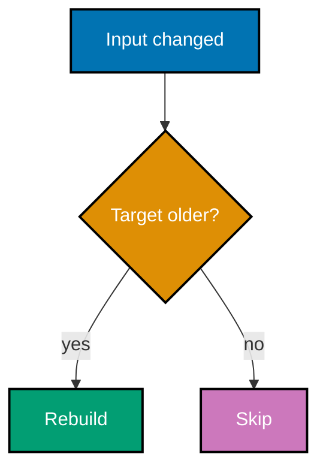
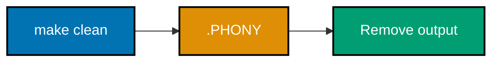
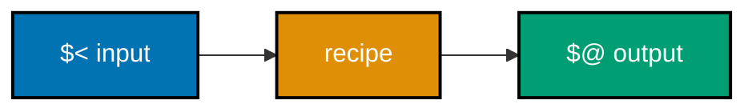
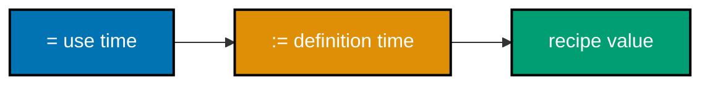

## Build graph at a glance

These examples start with GNU Make's timestamp-driven dependency graph, then contrast it with `just`, a command runner. Run every command from its linked, self-contained artifact directory.

### Flow 1: Rule parts


### Flow 2: Freshness decision



### Flow 3: Dependency order


### Flow 4: Phony command



### Flow 5: Automatic variables



### Flow 6: Pattern rule


### Flow 7: Variable timing



### Flow 8: Built-in inference


### Flow 9: Command runner


### Example 1: Choose Automation Over Repetition

_ex-01 · exercises co-01_

**Brief explanation**: A decision artifact makes the cost of repeated shell commands visible. It distinguishes repeatable, documented automation from an undocumented command history.

**Runnable artifact**: Read [decision.md](./code/ex-01-why-build-automation/decision.md).

```markdown
<!-- => Repeating commands hides the project workflow. -->

| Manual shell | Automated target     |
| ------------ | -------------------- |
| Retype steps | Name and rerun steps |
```

**Verify**: Confirm the automated column names a reproducible project command.

**Key takeaway**: Automation captures a repeatable project workflow in version control.

**Why it matters**: A teammate should be able to discover and run the project workflow without reconstructing it from chat history. Start with a small named task before your manual sequence becomes a fragile, undocumented release process. This makes the workflow discussable in review: teammates can inspect the declared choice, reproduce it without oral history, and improve it before repeated manual work becomes a hidden project dependency.

### Example 2: Distinguish a Runner from a Build System

_ex-02 · exercises co-02_

**Brief explanation**: A command runner gives names to commands, while a build system declares produced files and their inputs. The distinction determines whether unchanged work can be skipped.

**Runnable artifact**: Read [decision.md](./code/ex-02-runner-vs-build-system/decision.md).

```markdown
<!-- => A runner always executes a named recipe. -->
<!-- => A build system can compare input and output freshness. -->

| Command runner | Build system     |
| -------------- | ---------------- |
| Names recipes  | Models artifacts |
```

**Verify**: Confirm only the build-system column has an artifact freshness decision.

**Key takeaway**: Choose a build system when output dependencies and incremental rebuilds matter.

**Why it matters**: Treating a task runner as an incremental builder creates false expectations about speed and correctness. A clear tool choice makes it easier to explain why a command runs every time or is safely skipped. This makes the workflow discussable in review: teammates can inspect the declared choice, reproduce it without oral history, and improve it before repeated manual work becomes a hidden project dependency.

### Example 3: Write the First Make Rule

_ex-03 · exercises co-03_

**Brief explanation**: A Make rule names a target, its prerequisite, and the recipe that turns input into output. Run `make greeting.txt` to create the target.

**Runnable artifact**: [Makefile](./code/ex-03-first-makefile-rule/Makefile) and [message.txt](./code/ex-03-first-makefile-rule/message.txt).

```makefile
# => greeting.txt is the file Make will create.
greeting.txt: message.txt
    # => $< is the first prerequisite: message.txt.
    cp $< $@
```

**Verify**: Run `make greeting.txt` and inspect `greeting.txt`.

**Key takeaway**: A rule describes both the artifact and the input required to produce it.

**Why it matters**: Explicit inputs give Make enough information to order work and decide freshness. That same dependency description scales from a copied text file to a compiled application. In a real project, this declaration lets teammates and tools see exactly which artifact is requested and which inputs must exist first, so changes are easier to review and failures are easier to diagnose.

### Example 4: Request a Specific Target

_ex-04 · exercises co-03_

**Brief explanation**: Passing a target name asks Make to reconcile that artifact. Run `make report.txt` to create the requested file without needing an opaque shell script.

**Runnable artifact**: [Makefile](./code/ex-04-make-run-target/Makefile) and [source.txt](./code/ex-04-make-run-target/source.txt).

```makefile
# => report.txt is the target requested on the CLI.
report.txt: source.txt
    # => cp produces the named target from the prerequisite.
    cp $< $@
```

**Verify**: Run `make report.txt` and confirm the target appears.

**Key takeaway**: `make <target>` requests a named artifact rather than an arbitrary command sequence.

**Why it matters**: Targeted builds communicate intent. A contributor can ask for exactly the output they need, and Make can include only the prerequisites required for that output. In a real project, this declaration lets teammates and tools see exactly which artifact is requested and which inputs must exist first, so changes are easier to review and failures are easier to diagnose.

### Example 5: Read Target, Prerequisite, and Recipe

_ex-05 · exercises co-03_

**Brief explanation**: A rule has three visible parts: the output before the colon, its inputs after it, and tab-indented recipe lines. The artifact labels each part directly.

**Runnable artifact**: [Makefile](./code/ex-05-target-prereq-recipe/Makefile) and [input.txt](./code/ex-05-target-prereq-recipe/input.txt).

```makefile
# => Target: output.txt; prerequisite: input.txt.
output.txt: input.txt
    # => The tab starts the recipe that creates output.txt.
    cp $< $@
```

**Verify**: Run `make output.txt`, then identify the three rule parts.

**Key takeaway**: The target, prerequisites, and recipe are separate information with separate jobs.

**Why it matters**: Keeping these parts distinct prevents a common Make mistake: encoding dependencies only inside an imperative recipe. Declare dependencies so Make can reason about them before running anything. In a real project, this declaration lets teammates and tools see exactly which artifact is requested and which inputs must exist first, so changes are easier to review and failures are easier to diagnose.

### Example 6: Follow a Small Dependency Graph

_ex-06 · exercises co-04_

**Brief explanation**: An application target depends on an object target, which depends on source. Make walks prerequisites first, so the graph determines a safe order.

**Runnable artifact**: [Makefile](./code/ex-06-dependency-graph/Makefile) and [main.c](./code/ex-06-dependency-graph/main.c).

```makefile
# => app cannot exist until main.o is available.
app: main.o
    # => The link step consumes the object.
    $(CC) $< -o $@
```

**Verify**: Run `make app` and observe that `main.o` is compiled first.

**Key takeaway**: Prerequisite edges, not recipe order, express the build graph.

**Why it matters**: A truthful graph lets a build tool schedule work safely and incrementally. It also gives readers an explanation of why one artifact must be ready before another can exist. In a real project, this declaration lets teammates and tools see exactly which artifact is requested and which inputs must exist first, so changes are easier to review and failures are easier to diagnose.

### Example 7: Use the Default Goal

_ex-07 · exercises co-03_

**Brief explanation**: Make uses the first ordinary target as its default goal. Here a bare `make` produces `default.txt`.

**Runnable artifact**: [Makefile](./code/ex-07-make-default-goal/Makefile) and [input.txt](./code/ex-07-make-default-goal/input.txt).

```makefile
# => The first target becomes bare make's default goal.
default.txt: input.txt
    # => Recipe commands must begin with a real tab.
    cp $< $@
```

**Verify**: Run `make` with no target and confirm `default.txt` appears.

**Key takeaway**: Put the most useful entry artifact first, or define `.DEFAULT_GOAL` deliberately.

**Why it matters**: A predictable default makes a project approachable. New contributors can run one documented command while experienced contributors remain free to request more focused targets. In a real project, this declaration lets teammates and tools see exactly which artifact is requested and which inputs must exist first, so changes are easier to review and failures are easier to diagnose.

### Example 8: Rebuild When an Input Changes

_ex-08 · exercises co-05_

**Brief explanation**: Make compares modification times, rebuilding a target when its prerequisite becomes newer. Change `input.txt`, then rerun `make output.txt`.

**Runnable artifact**: [Makefile](./code/ex-08-incremental-rebuild/Makefile) and [input.txt](./code/ex-08-incremental-rebuild/input.txt).

```makefile
# => output.txt depends on the timestamp of input.txt.
output.txt: input.txt
    # => This recipe reruns only when output is missing or older.
    cp $< $@
```

**Verify**: Run Make, edit `input.txt`, then rerun it and inspect the updated output.

**Key takeaway**: Timestamp-driven incremental rebuilds depend on accurate prerequisites.

**Why it matters**: Incrementality is valuable only when the graph is honest. Missing an input edge can leave stale output behind, while unnecessary edges rebuild more than the change requires. That explicit freshness rule is also a debugging tool: compare the declared timestamps and graph edges before deleting output or adding unnecessary rebuild commands, then record the corrected dependency.

### Example 9: Observe an Up-to-Date Target

_ex-09 · exercises co-05_

**Brief explanation**: With an existing newer target and unchanged input, Make reports that there is nothing to do. The target is a file, not a command alias.

**Runnable artifact**: [Makefile](./code/ex-09-up-to-date-skip/Makefile) and [input.txt](./code/ex-09-up-to-date-skip/input.txt).

```makefile
# => Make compares output.txt with input.txt before running cp.
output.txt: input.txt
    # => This command is skipped after a clean first build.
    cp $< $@
```

**Verify**: Run `make output.txt` twice; the second run should say it is up to date.

**Key takeaway**: A file target records completed work that Make can reuse.

**Why it matters**: The skip is not magic or a cache guess; it follows from a declared target and prerequisite. That makes build behavior explainable when a contributor asks why a command did or did not run. That explicit freshness rule is also a debugging tool: compare the declared timestamps and graph edges before deleting output or adding unnecessary rebuild commands, then record the corrected dependency.

### Example 10: State the Timestamp Rule

_ex-10 · exercises co-05_

**Brief explanation**: A decision artifact states Make's simple freshness rule: a missing output or an older output needs rebuilding. It separates a timestamp rule from a content-hash rule.

**Runnable artifact**: Read [decision.md](./code/ex-10-timestamp-comparison/decision.md).

```text
# => Make rebuilds when an output is missing.
missing(target) OR mtime(input) > mtime(target)
# => Otherwise the target is already up to date.
rebuild
```

**Verify**: Confirm the table identifies both rebuild conditions.

**Key takeaway**: Make decides freshness from modification times, not file-content hashes.

**Why it matters**: Knowing the model helps diagnose surprising rebuilds and stale artifacts. It also makes the later contrast with content-addressed build systems concrete rather than merely terminological. That explicit freshness rule is also a debugging tool: compare the declared timestamps and graph edges before deleting output or adding unnecessary rebuild commands, then record the corrected dependency.

### Example 11: Mark a Clean Command Phony

_ex-11 · exercises co-06_

**Brief explanation**: `clean` is a request to remove output, not an output file itself. Declaring it `.PHONY` makes its recipe run whenever it is requested.

**Runnable artifact**: [Makefile](./code/ex-11-phony-clean/Makefile) and [output.txt](./code/ex-11-phony-clean/output.txt).

```makefile
# => clean is an action name, never a file to compare.
.PHONY: clean
# => clean labels the command recipe below.
clean:
    # => rm accepts an already-clean directory safely.
    rm -f output.txt
```

**Verify**: Run `make clean` twice; both commands complete successfully.

**Key takeaway**: Mark command-like targets `.PHONY`.

**Why it matters**: Phony declarations protect commands from accidental file-name collisions and communicate intent to readers. They also tell Make not to search for an implicit way to build a file called `clean`. Teams rely on these action names for repeatable maintenance, so the Makefile must state that they are commands and preserve the real file targets that provide incremental evidence beneath them.

### Example 12: Avoid a File Collision

_ex-12 · exercises co-06_

**Brief explanation**: A real file named `test` can make an undeclared `test` target look up to date. `.PHONY: test` says this name is always a command.

**Runnable artifact**: [Makefile](./code/ex-12-phony-file-collision/Makefile) and [test](./code/ex-12-phony-file-collision/test).

```makefile
# => This declaration prevents the file named test from shadowing the recipe.
.PHONY: test
# => test labels the command recipe below.
test:
    # => The recipe runs despite the colliding test file.
    @printf 'tests ran\\n'
```

**Verify**: Run `make test` and confirm it prints `tests ran`.

**Key takeaway**: `.PHONY` resolves the command-name versus file-name ambiguity.

**Why it matters**: File collisions are an easy-to-miss source of silently skipped checks. A one-line declaration preserves the expected behavior even as project files evolve. Teams rely on these action names for repeatable maintenance, so the Makefile must state that they are commands and preserve the real file targets that provide incremental evidence beneath them.

### Example 13: Aggregate Several Artifacts

_ex-13 · exercises co-06_

**Brief explanation**: A phony `all` target gathers multiple file targets into one useful request. Make still decides the freshness of each real output independently.

**Runnable artifact**: [Makefile](./code/ex-13-phony-aggregate/Makefile), [one.txt](./code/ex-13-phony-aggregate/one.txt), and [two.txt](./code/ex-13-phony-aggregate/two.txt).

```makefile
# => all is a command-like aggregate, not a file artifact.
.PHONY: all
# => all labels the aggregate request.
all: one.out two.out
    # => Its prerequisites carry the actual output rules.
    @true
```

**Verify**: Run `make all` and confirm both `.out` files appear.

**Key takeaway**: An aggregate target composes real artifacts without replacing their dependencies.

**Why it matters**: Aggregates provide a friendly entry point while retaining precise incremental behavior underneath. This is how one command can build a project without forcing every subtarget to be phony. Teams rely on these action names for repeatable maintenance, so the Makefile must state that they are commands and preserve the real file targets that provide incremental evidence beneath them.

### Example 14: Expand the Target Name with `$@`

_ex-14 · exercises co-07_

**Brief explanation**: `$@` expands to the current rule's target name. It avoids duplicating the filename in a recipe.

**Runnable artifact**: [Makefile](./code/ex-14-autovar-target/Makefile) and [input.txt](./code/ex-14-autovar-target/input.txt).

```makefile
# => $@ becomes named-output.txt for this rule.
named-output.txt: input.txt
    # => The recipe writes directly to its target.
    cp input.txt $@
```

**Verify**: Run `make named-output.txt` and confirm the target is created.

**Key takeaway**: `$@` is the current target's filename.

**Why it matters**: Automatic variables keep repeated rules consistent as target names change. They reduce duplication without hiding the relationship between an output and the recipe that produces it. Using the same declared dependency data in the recipe prevents names from drifting during refactoring, while still leaving the source-to-output relationship visible to someone diagnosing a build.

### Example 15: Expand the First Prerequisite with `$<`

_ex-15 · exercises co-07_

**Brief explanation**: `$<` expands to the first prerequisite. It is ideal for one-input, one-output transformations.

**Runnable artifact**: [Makefile](./code/ex-15-autovar-first-prereq/Makefile) and [input.txt](./code/ex-15-autovar-first-prereq/input.txt).

```makefile
# => $< becomes input.txt, the first prerequisite.
output.txt: input.txt
    # => cp receives the first input and current target.
    cp $< $@
```

**Verify**: Run `make output.txt` and compare it with `input.txt`.

**Key takeaway**: `$<` names the first prerequisite of the current rule.

**Why it matters**: This convention is especially useful for pattern rules, where the same recipe transforms many one-to-one inputs. It keeps the rule generic while preserving direct traceability to the input. Using the same declared dependency data in the recipe prevents names from drifting during refactoring, while still leaving the source-to-output relationship visible to someone diagnosing a build.

### Example 16: Expand All Prerequisites with `$^`

_ex-16 · exercises co-07_

**Brief explanation**: `$^` expands to all prerequisites, with duplicate names removed. Use it when a recipe must receive every declared input.

**Runnable artifact**: [Makefile](./code/ex-16-autovar-all-prereqs/Makefile), [one.txt](./code/ex-16-autovar-all-prereqs/one.txt), and [two.txt](./code/ex-16-autovar-all-prereqs/two.txt).

```makefile
# => $^ expands to one.txt two.txt in prerequisite order.
combined.txt: one.txt two.txt
    # => cat receives all declared inputs.
    cat $^ > $@
```

**Verify**: Run `make combined.txt` and inspect both lines in the output.

**Key takeaway**: `$^` passes all prerequisites to the current recipe.

**Why it matters**: A recipe that consumes every declared input is clearer and less error-prone when it uses the same dependency list Make used for scheduling. It also makes later additions to the input list less repetitive. Using the same declared dependency data in the recipe prevents names from drifting during refactoring, while still leaving the source-to-output relationship visible to someone diagnosing a build.

### Example 17: Compile with a Pattern Rule

_ex-17 · exercises co-08_

**Brief explanation**: A `%` pattern rule generalizes one source-to-object transformation for every matching stem. Run `make main.o` to compile the supplied C source.

**Runnable artifact**: [Makefile](./code/ex-17-pattern-rule/Makefile) and [main.c](./code/ex-17-pattern-rule/main.c).

```makefile
# => % matches the same nonempty stem on both sides.
%.o: %.c
    # => $< is main.c and $@ is main.o for this invocation.
    $(CC) -c $< -o $@
```

**Verify**: Run `make main.o` and confirm `main.o` appears.

**Key takeaway**: Pattern rules express a reusable family of artifact transformations.

**Why it matters**: A single accurate pattern rule scales better than one copy-pasted rule per source file. It captures the transformation shape while Make supplies the concrete filenames. A reusable transformation remains reviewable because the concrete stem is supplied by Make from a declared edge, rather than guessed by a shell glob or hidden in an imperative script.

### Example 18: Match a Pattern Stem

_ex-18 · exercises co-08_

**Brief explanation**: The `%` in `%.out: %.txt` matches the nonempty stem `foo`, yielding a `foo.txt` prerequisite for `foo.out`. The artifact proves the substitution with real files.

**Runnable artifact**: [Makefile](./code/ex-18-pattern-stem-match/Makefile) and [foo.txt](./code/ex-18-pattern-stem-match/foo.txt).

```makefile
# => The shared stem foo maps foo.txt to foo.out.
%.out: %.txt
    # => This generic recipe receives the matched filenames.
    cp $< $@
```

**Verify**: Run `make foo.out` and inspect the copied file.

**Key takeaway**: Pattern-rule `%` is a matched stem, not a shell wildcard.

**Why it matters**: Understanding the stem prevents mistakes such as expecting a pattern rule to match an empty name or multiple unrelated pieces. It makes the generated prerequisite relationship predictable. A reusable transformation remains reviewable because the concrete stem is supplied by Make from a declared edge, rather than guessed by a shell glob or hidden in an imperative script.

### Example 19: Defer Expansion with `=`

_ex-19 · exercises co-09_

**Brief explanation**: Recursive `=` assignment stores references for expansion when the variable is used. `MESSAGE` therefore sees the later value of `NAME`.

**Runnable artifact**: [Makefile](./code/ex-19-recursive-assignment/Makefile).

```makefile
# => MESSAGE retains the reference until recipe expansion.
MESSAGE = hello $(NAME)
NAME = Ada
    # => The final expansion prints hello Ada.
```

**Verify**: Run `make show` and confirm it prints `hello Ada`.

**Key takeaway**: `=` is recursively expanded at use time.

**Why it matters**: Deferred expansion is powerful when a value intentionally tracks another variable. Use it consciously; otherwise later assignments can change behavior farther from the declaration than readers expect. State the intended timing beside the declaration so later edits cannot silently change a derived command or file list; reviewers should be able to predict the value from the Makefile alone.

### Example 20: Expand Once with `:=`

_ex-20 · exercises co-09_

**Brief explanation**: Simply-expanded `:=` evaluates references when the variable is defined. `MESSAGE` preserves the earlier value of `NAME` even after `NAME` changes.

**Runnable artifact**: [Makefile](./code/ex-20-simple-assignment/Makefile).

```makefile
# => MESSAGE expands NAME immediately, while NAME is Ada.
NAME = Ada
MESSAGE := hello $(NAME)
    # => A later NAME assignment cannot change MESSAGE.
```

**Verify**: Run `make show` and confirm it prints `hello Ada`.

**Key takeaway**: `:=` computes a value once at its definition.

**Why it matters**: Early expansion makes a derived value stable and often easier to reason about. It is a good default for computed file lists and configuration values that should not drift later in the Makefile. State the intended timing beside the declaration so later edits cannot silently change a derived command or file list; reviewers should be able to predict the value from the Makefile alone.

### Example 21: Choose Assignment Timing

_ex-21 · exercises co-09_

**Brief explanation**: A decision table compares deferred `=` expansion with immediate `:=` expansion. The choice is about when references should be observed.

**Runnable artifact**: Read [decision.md](./code/ex-21-assignment-difference/decision.md).

```markdown
<!-- => Recursive variables read references when used. -->
<!-- => Simple variables read references when declared. -->

| Operator | Expansion time  |
| -------- | --------------- |
| `=`      | use time        |
| `:=`     | definition time |
```

**Verify**: Confirm the table maps each assignment operator to the correct timing.

**Key takeaway**: Pick `=` or `:=` based on whether later variable changes should be visible.

**Why it matters**: Variable timing is a source of subtle build behavior, not cosmetic syntax. Making the timing explicit keeps derived targets and command arguments stable when that is the intended policy. State the intended timing beside the declaration so later edits cannot silently change a derived command or file list; reviewers should be able to predict the value from the Makefile alone.

### Example 22: Use Make's Built-In C Rule

_ex-22 · exercises co-10_

**Brief explanation**: Make includes an implicit rule that can compile `hello.c` into a `hello` executable. The Makefile deliberately contains no explicit compile recipe.

**Runnable artifact**: [Makefile](./code/ex-22-implicit-rule/Makefile) and [hello.c](./code/ex-22-implicit-rule/hello.c).

```makefile
# => This asks for hello; Make infers hello.c as input.
all: hello
    # => The explicit aggregate has no compile command.
    @true
```

**Verify**: Run `make hello` and then `./hello`.

**Key takeaway**: Make can apply built-in implicit rules when their input pattern exists.

**Why it matters**: Built-ins shorten small Makefiles, but an explicit rule may be clearer when project-specific flags or generated inputs matter. Recognizing inference helps explain recipes you did not write. These conveniences are safe only when their inputs and generated names remain visible. Inspect the expanded value or inferred rule whenever a seemingly simple build behaves unexpectedly.

### Example 23: Use `CC` and `CFLAGS`

_ex-23 · exercises co-10_

**Brief explanation**: `CC` and `CFLAGS` are conventional Make variables for the compiler and flags. The recipe allows callers to override them on the command line.

**Runnable artifact**: [Makefile](./code/ex-23-builtin-variables/Makefile) and [hello.c](./code/ex-23-builtin-variables/hello.c).

```makefile
# => CC defaults to cc when the caller does not override it.
hello: hello.c
    # => CFLAGS travels with the compiler invocation.
    $(CC) $(CFLAGS) $< -o $@
```

**Verify**: Run `make hello CFLAGS='-Wall'` and then `./hello`.

**Key takeaway**: Conventional variables make compiler selection and flags configurable.

**Why it matters**: Hard-coding a compiler command hides an important policy decision. Standard variables let local development and CI supply compatible settings without duplicating the build rule. These conveniences are safe only when their inputs and generated names remain visible. Inspect the expanded value or inferred rule whenever a seemingly simple build behaves unexpectedly.

### Example 24: Discover Source Files with `wildcard`

_ex-24 · exercises co-11_

**Brief explanation**: `$(wildcard *.c)` asks Make to expand the source files present in the directory. The `show` target prints the resulting list.

**Runnable artifact**: [Makefile](./code/ex-24-make-wildcard/Makefile), [one.c](./code/ex-24-make-wildcard/one.c), and [two.c](./code/ex-24-make-wildcard/two.c).

```makefile
# => wildcard expands matching files while Make reads the file.
SRCS := $(wildcard *.c)
# => show exposes the computed source list.
show:
    # => The recipe prints the discovered source names.
    @printf '%s\\n' "$(SRCS)"
```

**Verify**: Run `make show` and confirm both C files are listed.

**Key takeaway**: `wildcard` computes a Make variable from files that currently match a pattern.

**Why it matters**: Computed lists reduce manual maintenance, but they should be used deliberately because adding a file changes the graph. The `show` target provides a quick inspection point for that policy. These conveniences are safe only when their inputs and generated names remain visible. Inspect the expanded value or inferred rule whenever a seemingly simple build behaves unexpectedly.

### Example 25: Transform Names with `patsubst`

_ex-25 · exercises co-11_

**Brief explanation**: `patsubst` transforms each source filename into its object filename. This creates an object list from the already-discovered sources.

**Runnable artifact**: [Makefile](./code/ex-25-make-patsubst/Makefile), [one.c](./code/ex-25-make-patsubst/one.c), and [two.c](./code/ex-25-make-patsubst/two.c).

```makefile
# => SRCS is the input name list for the transformation.
SRCS := $(wildcard *.c)
OBJS := $(patsubst %.c,%.o,$(SRCS))
    # => Each .c suffix becomes .o in OBJS.
```

**Verify**: Run `make show` and confirm it prints `one.o two.o`.

**Key takeaway**: `patsubst` maps a pattern across every word in a variable value.

**Why it matters**: Name transformations make dependency declarations concise while preserving an explicit relationship between sources and generated files. Pair them with a correct pattern rule to make the full graph executable. These conveniences are safe only when their inputs and generated names remain visible. Inspect the expanded value or inferred rule whenever a seemingly simple build behaves unexpectedly.

### Example 26: Write a First `justfile`

_ex-26 · exercises co-14_

**Brief explanation**: A `justfile` stores named shell recipes. Unlike a Make file target, a just recipe is always treated as a command to run.

**Runnable artifact**: [justfile](./code/ex-26-first-justfile/justfile).

```just
# => hello names a shell recipe in this justfile.
hello:
  # => just runs this shell command when asked for hello.
  @echo "hello from just"
```

**Verify**: Run `just hello` and confirm the greeting prints.

**Key takeaway**: `just` is a named command runner, not a timestamp-based build system.

**Why it matters**: A runner is excellent for concise developer workflows such as formatting or starting a server. Do not rely on it to detect whether an artifact is fresh; it intentionally runs recipes every time. The recipe remains an explicit developer interface, so its inputs, defaults, and effects should be easy to read before running it. Keep any state-sensitive artifact work in a real build graph.

### Example 27: Run the Default `just` Recipe

_ex-27 · exercises co-14_

**Brief explanation**: With no arguments, `just` runs the first recipe in a `justfile`. Put the most useful everyday command first.

**Runnable artifact**: [justfile](./code/ex-27-just-run/justfile).

```just
# => The first recipe is the no-argument default.
default:
  # => The recipe executes whenever just is invoked.
  @echo "default task ran"
```

**Verify**: Run `just` with no arguments and confirm the message prints.

**Key takeaway**: The first `just` recipe is the friendly default command.

**Why it matters**: An intentional default gives contributors a reliable starting point without pretending it is an incremental artifact target. Keep the command small and obvious so it remains useful as the project evolves. The recipe remains an explicit developer interface, so its inputs, defaults, and effects should be easy to read before running it. Keep any state-sensitive artifact work in a real build graph.
