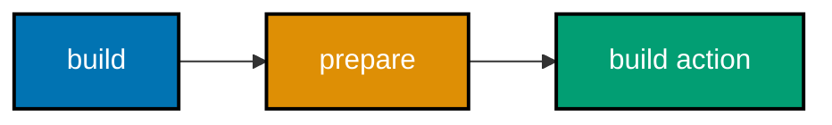
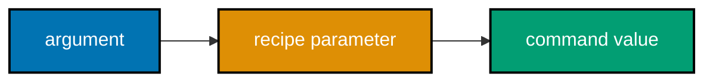
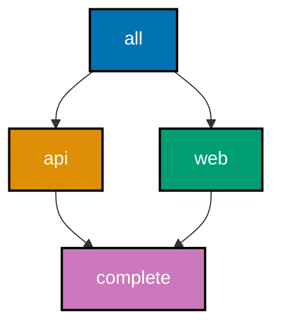
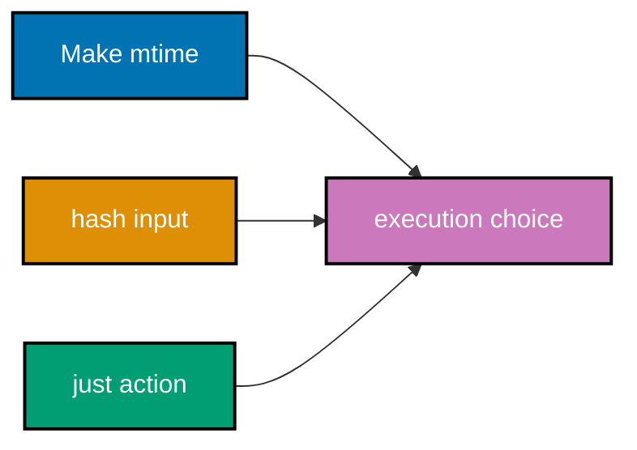
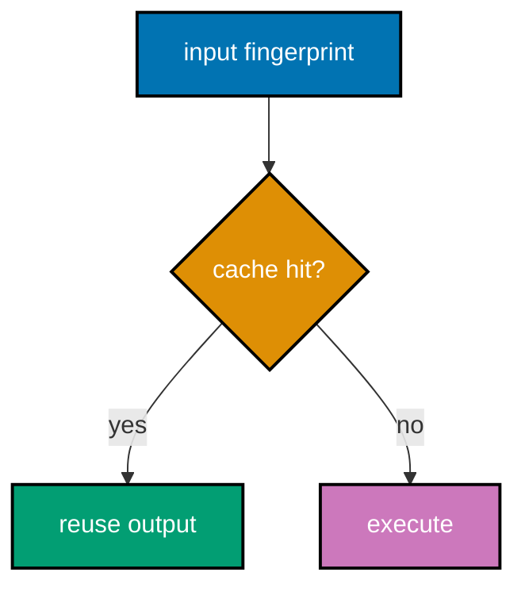
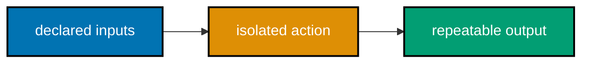

## Compose developer commands and build work

The examples below progress from named <code>just</code> recipes through npm scripts to Make
composition. Run each command in its linked, dedicated artifact directory.

### Flow 10: Recipe lookup


### Flow 11: Recipe prerequisite



### Flow 12: Parameter binding



### Flow 13: Hook order


### Example 28: List Available just Recipes

_ex-28 · exercises co-14_

**Brief explanation**: The <code>just --list</code> command exposes the named project actions in a
justfile. Listing actions is discovery; it does not inspect an incremental artifact graph.

**Runnable artifact**: [justfile](./code/ex-28-just-list/justfile).

```just
# => format is a named action shown by the list command.
format:
  # => This local recipe has no external side effect.
  @echo "format"
```

**Verify**: Run <code>just --list</code> and confirm both <code>format</code> and <code>test</code>.

**Key takeaway**: A task runner makes supported commands discoverable.

**Why it matters**: Discovery reduces the need for contributors to memorize command spellings. Keep
the list concise and intentional so that it describes actual workflows rather than a second, drifting
documentation surface. The recipe remains an explicit developer interface, so its inputs, defaults, and effects should be easy to read before running it. Keep any state-sensitive artifact work in a real build graph.

### Example 29: Depend on Another just Recipe

_ex-29 · exercises co-14_

**Brief explanation**: A recipe may name another recipe as a prerequisite. just runs the prerequisite
before it executes the requested recipe body.

**Runnable artifact**: [justfile](./code/ex-29-just-recipe-dependency/justfile).

```just
# => build asks just to run prepare first.
build: prepare
  # => This shell command runs after prepare.
  @echo "build"
```

**Verify**: Run <code>just build</code> and confirm <code>prepare</code> appears before <code>build</code>.

**Key takeaway**: Recipe dependencies compose named commands in a visible order.

**Why it matters**: Recipe composition improves ergonomics without changing just into a build system.
Use it for developer commands, then declare a true artifact graph when freshness and reuse matter. The recipe remains an explicit developer interface, so its inputs, defaults, and effects should be easy to read before running it. Keep any state-sensitive artifact work in a real build graph.

### Example 30: Recognize That just Always Runs

_ex-30 · exercises co-14_

**Brief explanation**: just treats every requested recipe as an action to run. This differs from a Make
file target, which may be skipped when its output is fresh.

**Runnable artifact**: Read [decision.md](./code/ex-30-just-always-runs/decision.md).

```text
# => just request: execute recipe
# => Make file target: compare declared timestamps first
```

**Verify**: Confirm the artifact says that just does not use output freshness.

**Key takeaway**: just is deliberately a command runner, not a timestamp build engine.

**Why it matters**: Correct vocabulary prevents a false performance promise. A runner is excellent for
explicit developer tasks because it avoids inference; a build tool earns skipping behavior from its graph. The recipe remains an explicit developer interface, so its inputs, defaults, and effects should be easy to read before running it. Keep any state-sensitive artifact work in a real build graph.

### Example 31: Pass a Positional just Parameter

_ex-31 · exercises co-15_

**Brief explanation**: A positional recipe parameter binds a CLI argument to the command body. The
recipe remains named while callers supply the variable part.

**Runnable artifact**: [justfile](./code/ex-31-just-parameter/justfile).

```just
# => name receives the argument supplied after greet.
greet name:
  # => Interpolation prints the caller-selected value.
  @echo "hello {{name}}"
```

**Verify**: Run <code>just greet Ada</code> and confirm the output includes <code>Ada</code>.

**Key takeaway**: Parameters make one named task reusable for several values.

**Why it matters**: Parameterization keeps a workflow visible instead of requiring many copy-pasted
recipes. Treat values as untrusted when they later reach a more consequential shell command. The recipe remains an explicit developer interface, so its inputs, defaults, and effects should be easy to read before running it. Keep any state-sensitive artifact work in a real build graph.

### Example 32: Supply a Default just Parameter

_ex-32 · exercises co-15_

**Brief explanation**: A default parameter selects a safe common value when the caller supplies none.
An explicit caller argument overrides the default.

**Runnable artifact**: [justfile](./code/ex-32-just-default-param/justfile).

```just
# => target selects local unless the caller passes another value.
deploy target="local":
  # => Echo reveals exactly which target was selected.
  @echo "deploy {{target}}"
```

**Verify**: Run <code>just deploy</code> and <code>just deploy preview</code>.

**Key takeaway**: A default offers an ergonomic common path without removing an explicit override.

**Why it matters**: Safe defaults reduce friction for routine work. Make the exceptional choice explicit
so a short command cannot silently become a production-affecting operation. The recipe remains an explicit developer interface, so its inputs, defaults, and effects should be easy to read before running it. Keep any state-sensitive artifact work in a real build graph.

### Example 33: Collect a Variadic just Parameter

_ex-33 · exercises co-15_

**Brief explanation**: A final variadic parameter gathers one or more trailing CLI arguments. It models
a list of values rather than imposing an arbitrary fixed count.

**Runnable artifact**: [justfile](./code/ex-33-just-variadic/justfile).

```just
# => +files receives all remaining command arguments.
inspect +files:
  # => The local command prints the received list.
  @echo "files: {{files}}"
```

**Verify**: Run <code>just inspect one.txt two.txt</code> and confirm both names print.

**Key takeaway**: A trailing variadic parameter forwards a caller-provided list.

**Why it matters**: Variadic commands are flexible but their input shape is broad. Keep forwarding
simple and quoted when a future recipe operates on actual filenames or process arguments. The recipe remains an explicit developer interface, so its inputs, defaults, and effects should be easy to read before running it. Keep any state-sensitive artifact work in a real build graph.

### Example 34: Choose just or Make

_ex-34 · exercises co-16_

**Brief explanation**: just names developer commands; Make relates output files to inputs and timestamps.
The decision artifact makes the selection criterion explicit.

**Runnable artifact**: Read [decision.md](./code/ex-34-just-vs-make/decision.md).

```markdown
<!-- => Choose by the required dependency model. -->

| Need         | Tool |
| ------------ | ---- |
| Named action | just |
```

**Verify**: Confirm the build-artifact row selects Make.

**Key takeaway**: Pick the tool whose execution model matches the job.

**Why it matters**: A small correct boundary avoids both overengineering an alias and under-modeling
an incremental build. The key question is whether outputs and their inputs must be reconciled. The recipe remains an explicit developer interface, so its inputs, defaults, and effects should be easy to read before running it. Keep any state-sensitive artifact work in a real build graph.

### Example 35: Run an npm Script

_ex-35 · exercises co-17_

**Brief explanation**: The scripts object gives a package-local command a stable name. npm resolves
the <code>build</code> script and runs its local Node program.

**Runnable artifact**: [package.json](./code/ex-35-npm-script/package.json) and [build.mjs](./code/ex-35-npm-script/build.mjs).

```jsonc
// => The package object contains the script map.
{
  // => scripts exposes commands through npm run.
  "scripts": {
    // => build invokes the course-owned Node program.
    "build": "node build.mjs",
    // => This closes the scripts map.
  },
  // => This closes the package object.
}
```

**Verify**: Run <code>npm run build</code> and confirm it writes <code>dist.txt</code>.

**Key takeaway**: npm scripts provide a package-local command interface.

**Why it matters**: The script definition is executable documentation that travels with the package.
Keep its implementation local and deterministic so a contributor can validate it without credentials. A package command is most useful when local developers and CI invoke the same small, inspectable behavior. Keep composition and lifecycle order explicit so a failure identifies the responsible step.

### Example 36: List npm Scripts

_ex-36 · exercises co-17_

**Brief explanation**: Running npm run without a script name lists a package's declared commands. This
is the npm equivalent of asking a task runner for its available recipe names.

**Runnable artifact**: [package.json](./code/ex-36-npm-run-list/package.json).

```jsonc
// => The package object contains two discoverable scripts.
{
  // => npm reads command names from this map.
  "scripts": {
    // => lint is a local inspection command.
    "lint": "node lint.mjs",
    // => test is another independently callable command.
    "test": "node test.mjs",
    // => This closes the scripts map.
  },
  // => This closes the package object.
}
```

**Verify**: Run <code>npm run</code> and confirm <code>lint</code> and <code>test</code> are listed.

**Key takeaway**: npm can enumerate the commands declared in package metadata.

**Why it matters**: A script list gives new contributors a source-of-truth entry point. It remains
trustworthy only when script names and their effects stay small enough to understand. A package command is most useful when local developers and CI invoke the same small, inspectable behavior. Keep composition and lifecycle order explicit so a failure identifies the responsible step.

### Example 37: Use the npm test Shortcut

_ex-37 · exercises co-19_

**Brief explanation**: npm gives the test lifecycle script a shortcut command. The artifact has no
dependencies; its test program reports a deterministic local result.

**Runnable artifact**: [package.json](./code/ex-37-npm-test-shortcut/package.json) and [test.mjs](./code/ex-37-npm-test-shortcut/test.mjs).

```jsonc
// => The package object declares one lifecycle script.
{
  // => npm maps the test shortcut through scripts.
  "scripts": {
    // => test invokes a deterministic local program.
    "test": "node test.mjs",
    // => This closes the scripts map.
  },
  // => This closes the package object.
}
```

**Verify**: Run <code>npm test</code> and confirm it exits zero.

**Key takeaway**: Lifecycle names supply familiar npm command shortcuts.

**Why it matters**: Conventional commands lower the cost of working across packages. They do not remove
the responsibility to make the underlying check meaningful, reproducible, and independently runnable. A package command is most useful when local developers and CI invoke the same small, inspectable behavior. Keep composition and lifecycle order explicit so a failure identifies the responsible step.

### Example 38: Use the npm start Shortcut

_ex-38 · exercises co-19_

**Brief explanation**: npm start invokes the package's start script. This example prints a message so
verification finishes rather than starting a long-running server.

**Runnable artifact**: [package.json](./code/ex-38-npm-start/package.json).

```jsonc
// => The package object declares an application entry point.
{
  // => npm maps the start shortcut through scripts.
  "scripts": {
    // => The command prints and exits instead of starting a server.
    "start": "node start.mjs",
    // => This closes the scripts map.
  },
  // => This closes the package object.
}
```

**Verify**: Run <code>npm start</code> and confirm the local message prints.

**Key takeaway**: start is a conventional package entry point whose behavior is still explicit.

**Why it matters**: A conventional name helps humans and tooling find an application entry point.
Keep it non-surprising so that starting a local project cannot accidentally publish or deploy it. A
package command is most useful when local developers and CI invoke the same small, inspectable behavior.
Keep composition and lifecycle order explicit so a failure identifies the responsible step.

### Flow 14: npm hook order


### Flow 15: Script composition


### Flow 16: Parallel prerequisites



### Flow 17: Freshness comparison



### Flow 18: Content hash cache



### Flow 19: Hermetic boundary



### Example 39: Run an npm prebuild Hook

_ex-39 · exercises co-18_

**Brief explanation**: npm runs a matching prebuild script before the build script. The artifact writes
the observable order to a local file.

**Runnable artifact**: [package.json](./code/ex-39-npm-pre-hook/package.json).

```jsonc
// => The package object declares matching lifecycle names.
{
  // => npm evaluates this map for a requested build.
  "scripts": {
    // => prebuild records preparation first.
    "prebuild": "node prebuild.mjs",
    // => build records the main action second.
    "build": "node build.mjs",
    // => This closes the scripts map.
  },
  // => This closes the package object.
}
```

**Verify**: Run <code>npm run build</code> and inspect <code>order.txt</code>.

**Key takeaway**: A matching pre-script runs before its npm script.

**Why it matters**: Hooks are appropriate for a small visible preparation step. Do not hide large,
surprising workflow behavior behind a prefix that readers may not notice in a package script. A package command is most useful when local developers and CI invoke the same small, inspectable behavior. Keep composition and lifecycle order explicit so a failure identifies the responsible step.

### Example 40: Run an npm postbuild Hook

_ex-40 · exercises co-18_

**Brief explanation**: npm runs a matching postbuild script after a successful build script. This
artifact records both actions locally without publishing anything.

**Runnable artifact**: [package.json](./code/ex-40-npm-post-hook/package.json).

```jsonc
// => The package object declares a main and post hook.
{
  // => npm selects both names for a build request.
  "scripts": {
    // => build records the main action first.
    "build": "node build.mjs",
    // => postbuild records completion after success.
    "postbuild": "node postbuild.mjs",
    // => This closes the scripts map.
  },
  // => This closes the package object.
}
```

**Verify**: Run <code>npm run build</code> and inspect the recorded order.

**Key takeaway**: A matching post-script runs only after its main script succeeds.

**Why it matters**: A post-hook should be safe to repeat and easy to discover. A release or deployment
is a different concern and deserves an explicit, separately authorized command. A package command is most useful when local developers and CI invoke the same small, inspectable behavior. Keep composition and lifecycle order explicit so a failure identifies the responsible step.

### Example 41: State the Full npm Hook Order

_ex-41 · exercises co-18_

**Brief explanation**: For a matching name npm runs the pre-script, main script, then post-script. The
decision artifact captures that ordering independent of one particular package.

**Runnable artifact**: Read [decision.md](./code/ex-41-npm-pre-post-order/decision.md).

```text
# => npm evaluates the matching script sequence in this order.
prebuild -> build -> postbuild
```

**Verify**: Confirm the main script sits between its two matching hooks.

**Key takeaway**: npm hook order follows a stable prefix convention.

**Why it matters**: A known sequence turns a script trace into a debuggable system. It also signals
when a simple command is carrying too much hidden work and needs clearer task boundaries. A package command is most useful when local developers and CI invoke the same small, inspectable behavior. Keep composition and lifecycle order explicit so a failure identifies the responsible step.

### Example 42: Compose npm Scripts

_ex-42 · exercises co-20_

**Brief explanation**: One npm script can call smaller scripts with shell AND. The second check runs
only after the first exits successfully.

**Runnable artifact**: [package.json](./code/ex-42-npm-compose-scripts/package.json).

```jsonc
// => The package object declares a composed command.
{
  // => scripts maps verify to two smaller checks.
  "scripts": {
    // => Shell AND stops after a failing lint command.
    "verify": "npm run lint && npm run test",
    // => This closes the scripts map.
  },
  // => This closes the package object.
}
```

**Verify**: Run <code>npm run verify</code> and confirm both local checks print.

**Key takeaway**: Composition creates a named workflow from independently usable checks.

**Why it matters**: Separating lint and test keeps diagnosis focused, while verify gives CI a single
intent-revealing entry point. Preserve failure propagation rather than masking a failed prerequisite. A package command is most useful when local developers and CI invoke the same small, inspectable behavior. Keep composition and lifecycle order explicit so a failure identifies the responsible step.

### Example 43: Let Make Delegate to npm

_ex-43 · exercises co-20_

**Brief explanation**: A top-level Make target can call a package-local npm build. Each tool keeps its
own responsibility while the outer repository gains a consistent target name.

**Runnable artifact**: [Makefile](./code/ex-43-make-calls-npm/Makefile) and [package.json](./code/ex-43-make-calls-npm/package.json).

```makefile
# => web delegates JavaScript build definition to npm.
.PHONY: web
# => web labels the delegation recipe below.
web:
    # => npm resolves the package-local command.
    npm run build
```

**Verify**: Run <code>make web</code> and confirm npm writes <code>dist.txt</code>.

**Key takeaway**: Cross-tool composition keeps a native build definition behind a visible entry point.

**Why it matters**: Polyglot repositories often need a common top-level interface. Delegation stays
maintainable when it is shallow, named, and leaves the subproject's native tool in charge. A package command is most useful when local developers and CI invoke the same small, inspectable behavior. Keep composition and lifecycle order explicit so a failure identifies the responsible step.

### Example 44: Inspect a Composed Task Graph

_ex-44 · exercises co-20_

**Brief explanation**: A verification task depends on both lint and test work. The decision artifact
shows the relationship without claiming a runner gives it incremental file semantics.

**Runnable artifact**: Read [decision.md](./code/ex-44-composition-graph/decision.md).

```text
# => Both checks must be successful before verify can report success.
verify -> lint
verify -> test
```

**Verify**: Confirm lint and test are both named as verification prerequisites.

**Key takeaway**: Task composition exposes dependencies between named pieces of work.

**Why it matters**: Drawing the relationship reveals missing work before it becomes a flaky release
command. A clear model also makes an eventual migration to a richer build graph more straightforward. A package command is most useful when local developers and CI invoke the same small, inspectable behavior. Keep composition and lifecycle order explicit so a failure identifies the responsible step.

### Example 45: Run Independent Make Targets in Parallel

_ex-45 · exercises co-12_

**Brief explanation**: Make can schedule independent file prerequisites concurrently when given a jobs
limit. The artifact defines two output files with no dependency edge between them.

**Runnable artifact**: [Makefile](./code/ex-45-parallel-make/Makefile).

```makefile
# => all can ask for two independent file targets.
.PHONY: all
# => all labels the aggregate request.
all: api.txt web.txt
```

**Verify**: Run <code>make -j4 all</code> and confirm both files appear.

**Key takeaway**: Parallel Make trusts the declared dependency graph.

**Why it matters**: Parallelism is safe only when every actual input edge is present. A missing edge
can create a race that vanishes on a serial retry, making it much harder to diagnose. This remains reliable across machines only when ordering is expressed as data in the graph, not inferred from a developer's usual command sequence or the timing of one successful run.

### Example 46: Recognize a Parallel Race

_ex-46 · exercises co-12_

**Brief explanation**: A generated header must be declared as an input of the compilation target. The
decision artifact contrasts that correct edge with a race caused by omitting it.

**Runnable artifact**: Read [decision.md](./code/ex-46-parallel-correctness/decision.md).

```text
# => Correct graph: compile waits for the generated header.
generated.h -> app
```

**Verify**: Confirm the generated header is a declared prerequisite of the dependent compile.

**Key takeaway**: A truthful graph is the safety contract for parallel scheduling.

**Why it matters**: A serial run can hide a missing edge through incidental command order. Exercise
parallel mode early so the build graph, rather than luck, guarantees the necessary sequencing. This remains reliable across machines only when ordering is expressed as data in the graph, not inferred from a developer's usual command sequence or the timing of one successful run.

### Example 47: Select POSIX Make Behavior

_ex-47 · exercises co-13_

**Brief explanation**: The .POSIX marker must be the first non-comment line to request standardized
make behavior. The artifact uses a small portable shell recipe.

**Runnable artifact**: [Makefile](./code/ex-47-posix-make/Makefile).

```makefile
# => The marker opts this file into POSIX make behavior.
.POSIX:
# => all is the portable default target.
all:
    # => printf is a portable shell utility.
    @printf 'portable make\\n'
```

**Verify**: Run <code>make</code> and confirm the message prints.

**Key takeaway**: .POSIX is an explicit portability choice.

**Why it matters**: Standardized behavior can be more valuable than an implementation extension when
a project must run across systems. State that boundary instead of accidentally assuming GNU Make everywhere. This remains reliable across machines only when ordering is expressed as data in the graph, not inferred from a developer's usual command sequence or the timing of one successful run.

### Example 48: Explain POSIX Portability

_ex-48 · exercises co-13_

**Brief explanation**: A portability marker selects a standard behavior contract; it does not add a
freshness model or make every vendor extension portable.

**Runnable artifact**: Read [decision.md](./code/ex-48-posix-portability/decision.md).

```markdown
<!-- => .POSIX is a portability contract. -->

| Requirement              | Choice |
| ------------------------ | ------ |
| Shared portable Makefile | .POSIX |
```

**Verify**: Confirm the marker is described as opt-in standardized behavior.

**Key takeaway**: POSIX make favors specified behavior over vendor-specific conveniences.

**Why it matters**: Portability is a promise a project must maintain. Choosing a portable subset lets
contributors reason about the supported environment instead of discovering a platform difference at runtime. This remains reliable across machines only when ordering is expressed as data in the graph, not inferred from a developer's usual command sequence or the timing of one successful run.

### Example 49: Clean and Rebuild

_ex-49 · exercises co-06_

**Brief explanation**: A clean target removes generated output, then a normal Make request reconstructs
it from declared source. It is a useful graph diagnostic.

**Runnable artifact**: [Makefile](./code/ex-49-clean-rebuild/Makefile) and [source.txt](./code/ex-49-clean-rebuild/source.txt).

```makefile
# => clean is a command-like target rather than a file.
.PHONY: clean
# => clean labels the removal recipe below.
clean:
    # => Removing an absent file remains successful.
    rm -f artifact.txt
```

**Verify**: Run <code>make clean && make</code> and confirm <code>artifact.txt</code> returns.

**Key takeaway**: A clean rebuild checks whether declared source inputs are sufficient.

**Why it matters**: Cleaning is a diagnostic tool, not a cure for stale dependency declarations. A
correct incremental graph should normally select only the work a changed input requires. This remains reliable across machines only when ordering is expressed as data in the graph, not inferred from a developer's usual command sequence or the timing of one successful run.

### Example 50: Define a Hermetic Build

_ex-50 · exercises co-21_

**Brief explanation**: A hermetic action depends only on inputs it explicitly declares. Equivalent
declared source and configuration therefore lead to an equivalent result.

**Runnable artifact**: Read [decision.md](./code/ex-50-hermetic-build/decision.md).

```text
# => Declared inputs cross the action boundary.
declared inputs -> isolated action -> repeatable output
```

**Verify**: Confirm undeclared host libraries are outside the input set.

**Key takeaway**: Hermeticity makes the build's dependency boundary explicit.

**Why it matters**: Hidden machine state explains many works-on-my-machine failures. Declaring inputs
creates a result a teammate can reproduce and a build cache can safely consider for reuse. Before enabling reuse at a larger scale, verify the boundary includes every source, tool, configuration value, and generated input that can affect the result; speed never compensates for stale output.

### Example 51: Find a Non-Hermetic Pitfall

_ex-51 · exercises co-21_

**Brief explanation**: A host-installed library that is not declared by the project is a hidden input.
It can change the outcome despite an unchanged source checkout.

**Runnable artifact**: Read [decision.md](./code/ex-51-non-hermetic-pitfall/decision.md).

```text
# => A host library version is not part of the declared build.
source + hidden host library -> machine-specific result
```

**Verify**: Confirm the host library is identified as the reproducibility break.

**Key takeaway**: Undeclared machine state makes an otherwise identical build non-hermetic.

**Why it matters**: Reproducibility failures are expensive because source control shows no obvious change.
Move important dependencies into declared, versioned inputs instead of relying on local installation state. Before enabling reuse at a larger scale, verify the boundary includes every source, tool, configuration value, and generated input that can affect the result; speed never compensates for stale output.

### Example 52: Model a Content-Hash Cache

_ex-52 · exercises co-22_

**Brief explanation**: A content fingerprint represents the bytes of declared inputs and configuration.
The fingerprint can identify an equivalent action result without relying on wall-clock timestamps.

**Runnable artifact**: Read [decision.md](./code/ex-52-content-hash-cache/decision.md).

```text
# => Content of source and configuration determines this key.
hash(source, configuration) -> cache key
```

**Verify**: Confirm the key is derived from content rather than modification time.

**Key takeaway**: Content-addressed caching keys reuse equivalent declared actions.

**Why it matters**: Make timestamps are transparent for local builds, while fingerprints enable broader
reuse when a tool can control the action boundary. The mechanisms are related but not interchangeable. Before enabling reuse at a larger scale, verify the boundary includes every source, tool, configuration value, and generated input that can affect the result; speed never compensates for stale output.

### Example 53: Reuse a Cache Hit

_ex-53 · exercises co-22_

**Brief explanation**: A matching fingerprint selects a stored result instead of recomputing the action.
The result is valid only if the key covered every relevant declared input.

**Runnable artifact**: Read [decision.md](./code/ex-53-cache-hit-reuse/decision.md).

```text
# => Matching key restores a previous output.
cache key match -> reuse output
```

**Verify**: Confirm a match restores output rather than running the action again.

**Key takeaway**: A cache hit represents completed equivalent work.

**Why it matters**: A cache is correct only when its key is complete. An incomplete key can save time
while returning stale output, which is worse than executing the action again. Before enabling reuse at a larger scale, verify the boundary includes every source, tool, configuration value, and generated input that can affect the result; speed never compensates for stale output.

### Example 54: Compare Timestamp and Hash Freshness

_ex-54 · exercises co-30_

**Brief explanation**: Make asks whether a prerequisite is newer than a file target; a hash-based tool
asks whether declared input content matches a cached action result.

**Runnable artifact**: Read [decision.md](./code/ex-54-timestamp-vs-hash/decision.md).

```markdown
<!-- => Timestamp and fingerprint are distinct decision inputs. -->

| Model | Rebuild decision   |
| ----- | ------------------ |
| Make  | newer prerequisite |
```

**Verify**: Confirm the hash row names input content as its decision source.

**Key takeaway**: Timestamp and content-hash freshness make different reuse guarantees.

**Why it matters**: Select a freshness model for the required correctness boundary and project scale,
not because one sounds more advanced. Small local builds often benefit from Make's visible rule. Before enabling reuse at a larger scale, verify the boundary includes every source, tool, configuration value, and generated input that can affect the result; speed never compensates for stale output.

### Example 55: Compare Three Freshness Policies

_ex-55 · exercises co-30_

**Brief explanation**: Make uses modification time, Bazel and Gradle fingerprint inputs, and just runs
requested recipes. The decision artifact keeps all three policies distinct.

**Runnable artifact**: Read [decision.md](./code/ex-55-freshness-three-way/decision.md).

```markdown
<!-- => The tools intentionally use different execution policies. -->

| Tool | Policy            |
| ---- | ----------------- |
| Make | modification time |
```

**Verify**: Confirm the just row says requested recipes run without a freshness skip.

**Key takeaway**: Build-tool behavior follows the freshness model it explicitly chooses.

**Why it matters**: Accurate vocabulary replaces folklore with design reasoning. It also supports safe
composition: a just alias can invoke Make while leaving Make's incremental policy unchanged. Before enabling reuse at a larger scale, verify the boundary includes every source, tool, configuration value, and generated input that can affect the result; speed never compensates for stale output.
