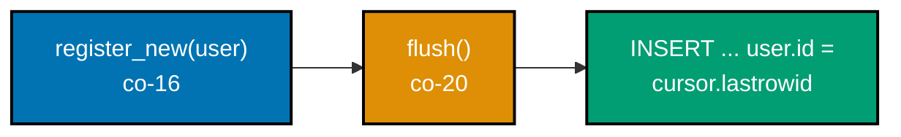
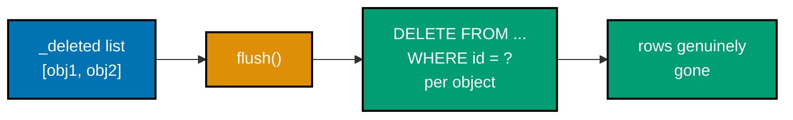
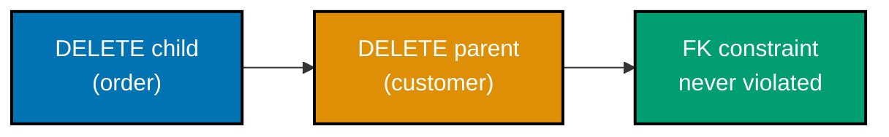
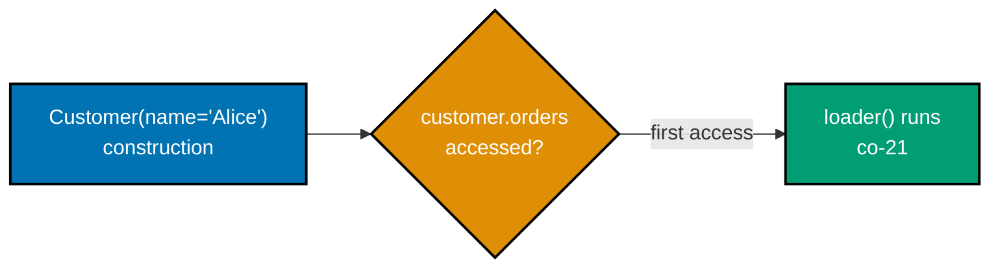
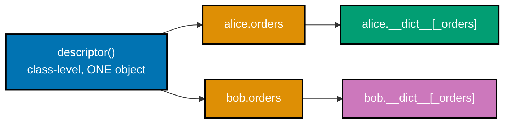
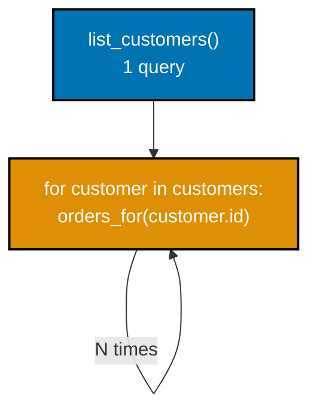
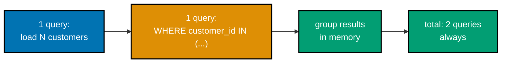
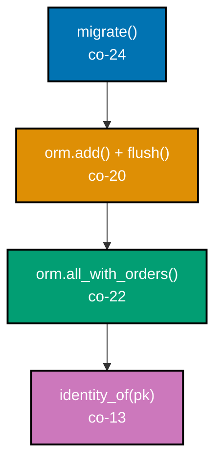

Examples 55-78 build the write-side unit of work, lazy loading, and operational concerns on top of the
metadata/mapping/session layer from the Intermediate tier: tracking new, dirty, and deleted objects
without writing SQL for each individual mutation; a flush that orders parent-before-child INSERTs and
child-before-parent DELETEs, then commits or rolls back the WHOLE batch atomically; a descriptor-based
lazy attribute that defers its query to first access and caches per-instance; the N+1 query problem made
observable, then fixed via batch loading; a minimal migration runner with a schema_version bookkeeping
table and strict version ordering; and three closing examples that wire the entire stack -- read, write,
and fully-typed -- into single, end-to-end walkthroughs, plus a mini-ORM preview that composes migrations,
unit of work, identity map, and eager loading together. Every example is a complete, self-contained
`example.py` colocated under `learning/code/`, verified two ways: `python3 example.py` prints its own
expected output inline via `# =>` comments and runs against a real local SQLite database (`:memory:` or a
temp file, never a mock), and a companion `test_example.py` runs under `pytest -q`. Every file is
fully type-annotated Python and passes `pyright --strict` with zero errors, warnings, or informations.

---

### Example 55: UnitOfWork.register_new -- Tracking a Brand-New, Not-Yet-Saved Object

_ex-55 &middot; exercises co-16_

A unit of work's `register_new` method is the entire mechanism behind "track this object as new" -- it
appends to an in-memory list and issues zero SQL, deferring every write until a later, explicit flush.


**`learning/code/ex-55-uow-track-new/example.py`**

```python
"""Example 55: UnitOfWork.register_new -- Tracking a Brand-New, Not-Yet-Saved Object."""  # => this concept

import dataclasses  # => the domain object being tracked


@dataclasses.dataclass  # => a domain object -- not yet persisted anywhere
class User:  # => the type this example's unit of work tracks
    id: int | None  # => None because it has NO row yet -- the pk is assigned by the database on insert
    name: str  # => an ordinary column


class UnitOfWork:  # => co-16: collects pending changes, does not write anything itself yet
    def __init__(self) -> None:  # => starts with nothing tracked
        self._new: list[User] = []  # => co-16: objects registered as "new" -- will become INSERTs later

    def register_new(self, user: User) -> None:  # => co-16: the ONLY way an object enters the "new" set
        self._new.append(user)  # => appended, not written -- no SQL runs here at all

    @property  # => read-only view of the tracked-new set, for observation in tests/examples
    def new_objects(self) -> list[User]:  # => exposes what would become INSERTs on a later flush
        return self._new  # => the SAME list every time -- no copy, no hidden mutation


uow = UnitOfWork()  # => co-16: one unit of work, tracking pending changes for a "session"
alice = User(id=None, name="Alice")  # => a brand-new object -- no pk yet, no row in the database
uow.register_new(alice)  # => co-16: tracked as "new" -- STILL no SQL has run
assert alice not in []  # => sanity: alice exists as a Python object regardless of tracking
assert uow.new_objects == [alice]  # => co-16: exactly one object tracked, and it is `alice` itself
assert len(uow.new_objects) == 1  # => the tracked-new set has exactly one entry
print(len(uow.new_objects))  # => Output: 1
```

**Run**: `python3 example.py`

**Output**:

```text
1
```

**`learning/code/ex-55-uow-track-new/test_example.py`**

```python
"""Example 55: pytest verification for UnitOfWork.register_new."""

from example import UnitOfWork, User


def test_registering_a_new_object_adds_it_to_new_objects() -> None:
    uow = UnitOfWork()  # => a fresh unit of work
    user = User(id=None, name="Grace")  # => not yet persisted
    uow.register_new(user)  # => tracked as new
    assert uow.new_objects == [user]  # => exactly one, and it is this object


def test_registering_two_objects_tracks_both_in_order() -> None:
    uow = UnitOfWork()
    first = User(id=None, name="A")  # => registered first
    second = User(id=None, name="B")  # => registered second
    uow.register_new(first)
    uow.register_new(second)
    assert uow.new_objects == [first, second]  # => insertion order preserved


# => Run: pytest -- Output: 2 passed
```

**Verify**: `pytest -q`

**Output**:

```text
2 passed
```

**Key takeaway**: `register_new` is deliberately dumb -- it appends to a list and returns. All the actual
INSERT logic lives in `flush`, which Example 56 introduces next -- tracking and writing stay separate.

**Why it matters**: Separating "mark this object as needing a write" from "actually issue the write" is
what makes a unit of work batchable and reviewable: a caller can register many changes across an entire
request, then flush them all together as one transaction, instead of committing one query at a time.
This separation is also what a real ORM's `session.add()` API exposes -- registration is cheap and
synchronous, but the actual database round trip only happens once, at flush time, no matter how many
objects were registered in between.

---

### Example 56: Flushing the New Set Issues Real INSERTs and Assigns Primary Keys

_ex-56 &middot; exercises co-16, co-20_

`flush()` is where tracking becomes SQL: every object in the "new" set gets a real `INSERT`, and the
database-assigned primary key is written back onto the same Python object the caller is still holding.



**`learning/code/ex-56-uow-new-becomes-insert/example.py`**

```python
"""Example 56: Flushing the New Set Issues Real INSERTs and Assigns Primary Keys."""  # => this concept

import contextlib  # => guarantees Connection.close() even if the block below raises
import dataclasses  # => the domain object being tracked and, later, persisted
import sqlite3  # => the stdlib DB-API driver this entire topic sits on (PEP 249)


@dataclasses.dataclass  # => a domain object -- mutable so flush() can assign the pk after insert
class User:  # => the type this example tracks-then-inserts
    id: int | None  # => None until flush() assigns it from the database's rowid
    name: str  # => an ordinary column


class UnitOfWork:  # => co-16 + co-20: tracks new objects, then flush() turns them into real writes
    def __init__(self, conn: sqlite3.Connection) -> None:  # => needs a connection to flush against
        self._conn = conn  # => the ONE connection every flushed write goes through
        self._new: list[User] = []  # => co-16: objects registered as "new"

    def register_new(self, user: User) -> None:  # => tracked, not yet written
        self._new.append(user)  # => appended to the pending-insert set

    def flush(self) -> None:  # => co-20: turns EVERY tracked-new object into a real INSERT
        for user in self._new:  # => one INSERT per tracked-new object, in registration order
            cursor = self._conn.execute("INSERT INTO users(name) VALUES (?)", (user.name,))  # => real write
            user.id = cursor.lastrowid  # => co-16: the pk assigned BY the database, written back onto the object
        self._new.clear()  # => flushed objects are no longer "new" -- clears the tracked set


with contextlib.closing(sqlite3.connect(":memory:")) as conn:  # => real local SQLite db
    conn.execute("CREATE TABLE users(id INTEGER PRIMARY KEY, name TEXT)")  # => real table
    conn.commit()  # => makes the schema visible
    uow = UnitOfWork(conn)  # => co-16 + co-20: one unit of work over this connection
    alice = User(id=None, name="Alice")  # => a brand-new object, no pk yet
    uow.register_new(alice)  # => tracked -- still no SQL has run for this object
    assert alice.id is None  # => confirmed: no pk assigned before flush
    uow.flush()  # => co-20: issues the real INSERT, assigns the pk
    assert alice.id is not None  # => the SAME object now carries a real, database-assigned pk
    row = conn.execute("SELECT name FROM users WHERE id = ?", (alice.id,)).fetchone()  # => proves it's durable
    assert row is not None and row[0] == "Alice"  # => a real row exists at that pk
    print(alice.id)  # => Output: 1
```

**Run**: `python3 example.py`

**Output**:

```text
1
```

**`learning/code/ex-56-uow-new-becomes-insert/test_example.py`**

```python
"""Example 56: pytest verification for New-Set Flush Becoming Real INSERTs."""

import contextlib
import sqlite3

from example import UnitOfWork, User


def test_flush_assigns_a_real_primary_key() -> None:
    with contextlib.closing(sqlite3.connect(":memory:")) as conn:
        conn.execute("CREATE TABLE users(id INTEGER PRIMARY KEY, name TEXT)")  # => real table
        conn.commit()  # => makes the schema visible
        uow = UnitOfWork(conn)
        user = User(id=None, name="Grace")  # => no pk yet
        uow.register_new(user)
        uow.flush()  # => issues the real INSERT
        assert user.id is not None  # => pk assigned after flush


def test_flushed_new_set_becomes_empty() -> None:
    with contextlib.closing(sqlite3.connect(":memory:")) as conn:
        conn.execute("CREATE TABLE users(id INTEGER PRIMARY KEY, name TEXT)")
        conn.commit()
        uow = UnitOfWork(conn)
        uow.register_new(User(id=None, name="A"))  # => two objects registered
        uow.register_new(User(id=None, name="B"))
        uow.flush()
        count = conn.execute("SELECT COUNT(*) FROM users").fetchone()[0]
        assert count == 2  # => both became real rows


# => Run: pytest -- Output: 2 passed
```

**Verify**: `pytest -q`

**Output**:

```text
2 passed
```

**Key takeaway**: `cursor.lastrowid` is the bridge between "the database assigned a pk" and "the Python
object knows its own pk" -- write it back onto the SAME object, immediately, before clearing the tracked set.

**Why it matters**: This is the exact mechanism that lets application code write `user = User(name="Alice")`,
`session.add(user)`, `session.commit()`, and then immediately use `user.id` -- without a second query. The
identity map from co-13 depends on this too: an object only gets a stable cache key once its pk is real.
Without reading the pk straight back from `cursor.lastrowid`, a caller would either have to issue a
second SELECT just to learn the new id, or accept an object that looks fully loaded but silently lacks
the one field every later lookup depends on.

---

### Example 57: Detecting a Dirty Object by Comparing Live State to Its Load-Time Snapshot

_ex-57 &middot; exercises co-17_

A unit of work snapshots an object's fields the moment it's registered as "clean"; `dirty_objects()`
compares the live object's current state to that frozen snapshot to find everything that changed since.

**`learning/code/ex-57-uow-track-dirty/example.py`**

```python
"""Example 57: Detecting a Dirty Object by Comparing Live State to Its Load-Time Snapshot."""  # => this concept

import dataclasses  # => the domain object and its snapshot representation
from typing import Any  # => a snapshot dict holds mixed-type field values


@dataclasses.dataclass  # => a mutable, ALREADY-loaded domain object -- dirty checks compare against this
class User:  # => the type this unit of work tracks for changes
    id: int  # => primary key -- already assigned, this object has a real row
    name: str  # => an ordinary, mutable column


class UnitOfWork:  # => co-17: snapshots at load time, compares later to detect dirt
    def __init__(self) -> None:  # => starts with nothing tracked
        self._snapshots: dict[int, dict[str, Any]] = {}  # => keyed by id(obj), one snapshot PER tracked object
        self._identity: dict[int, User] = {}  # => keyed by id(obj) too -- keeps the tracked objects reachable

    def track_clean(self, user: User) -> None:  # => co-17: registers an ALREADY-persisted object as "clean"
        self._identity[id(user)] = user  # => keeps a reference so dirty_objects() can iterate it later
        self._snapshots[id(user)] = dataclasses.asdict(user)  # => the state to compare future mutations against

    def dirty_objects(self) -> list[User]:  # => co-17: compares EVERY tracked object's live state to its snapshot
        dirty: list[User] = []  # => co-17: accumulates objects whose state has diverged
        for key, user in self._identity.items():  # => walks every tracked (clean-registered) object
            if dataclasses.asdict(user) != self._snapshots[key]:  # => live state vs load-time snapshot
                dirty.append(user)  # => diverged -- this object needs an UPDATE on the next flush
        return dirty  # => every object whose fields changed since track_clean() was called


uow = UnitOfWork()  # => co-17: one unit of work, tracking clean objects for dirty detection
alice = User(id=1, name="Alice")  # => simulates an already-loaded, persisted object
uow.track_clean(alice)  # => co-17: snapshot taken NOW -- {"id": 1, "name": "Alice"}
assert uow.dirty_objects() == []  # => nothing has changed yet -- the dirty set is empty

alice.name = "Alicia"  # => mutates the LIVE object -- the snapshot stays untouched
dirty = uow.dirty_objects()  # => co-17: compares live state to the frozen snapshot
assert dirty == [alice]  # => exactly one object diverged, and it's `alice`
print(len(dirty))  # => Output: 1
```

**Run**: `python3 example.py`

**Output**:

```text
1
```

**`learning/code/ex-57-uow-track-dirty/test_example.py`**

```python
"""Example 57: pytest verification for Dirty Detection via Snapshot Comparison."""

from example import UnitOfWork, User


def test_untouched_object_is_not_dirty() -> None:
    uow = UnitOfWork()  # => a fresh unit of work
    user = User(id=1, name="Grace")  # => already-persisted object
    uow.track_clean(user)  # => snapshot taken
    assert uow.dirty_objects() == []  # => no mutation -- nothing dirty


def test_mutated_object_appears_in_dirty_objects() -> None:
    uow = UnitOfWork()
    user = User(id=2, name="Bob")
    uow.track_clean(user)
    user.name = "Bobby"  # => mutation AFTER tracking
    assert uow.dirty_objects() == [user]  # => detected as dirty


# => Run: pytest -- Output: 2 passed
```

**Verify**: `pytest -q`

**Output**:

```text
2 passed
```

**Key takeaway**: `dataclasses.asdict(user) != snapshot` is the whole dirty check -- no manual "mark
dirty" call anywhere, no flags to forget to set. The unit of work discovers dirt by comparison, not signal.

**Why it matters**: Signal-based dirty tracking (a `user.mark_dirty()` call the caller must remember)
is error-prone -- forget one call and an UPDATE silently never happens. Snapshot comparison is automatic:
mutate any tracked object any number of times, and the unit of work will catch it at flush time regardless.
This is the same trade-off real ORMs make deliberately: automatic dirty detection costs a snapshot
comparison at flush time, but it removes an entire category of bug where a forgotten `mark_dirty()` call
causes a silently-lost update.

---

### Example 58: An UPDATE Statement Contains Only the Columns That Actually Changed

_ex-58 &middot; exercises co-17_

Diffing an object's live state against its snapshot field-by-field produces the MINIMAL set of columns
to write -- a mutated `email` with an untouched `name` produces an UPDATE that mentions only `email`.

**`learning/code/ex-58-uow-dirty-only-changed-cols/example.py`**

```python
"""Example 58: An UPDATE Statement Contains Only the Columns That Actually Changed."""  # => this concept

import dataclasses  # => the domain object and its snapshot representation
from typing import Any  # => a snapshot dict AND a changed-columns dict hold mixed-type values


@dataclasses.dataclass  # => a mutable, already-loaded domain object
class User:  # => the type this example diffs against its snapshot
    id: int  # => primary key -- excluded from the changed-columns diff below
    name: str  # => a mutable column, may or may not have changed
    email: str  # => a second mutable column, may or may not have changed


def changed_columns(user: User, snapshot: dict[str, Any]) -> dict[str, Any]:  # => co-17: the minimal diff
    live = dataclasses.asdict(user)  # => the object's CURRENT field values
    return {  # => co-17: only fields that actually diverged from the snapshot
        field: value  # => the NEW value, ready to bind into an UPDATE's SET clause
        for field, value in live.items()  # => walks every field the dataclass declares
        if field != "id" and value != snapshot[field]  # => excludes the pk, keeps only genuinely-changed fields
    }  # => an empty dict here would mean "nothing to update"


snapshot = {"id": 1, "name": "Alice", "email": "alice@example.com"}  # => load-time snapshot (co-17)
user = User(id=1, name="Alice", email="alice@example.com")  # => starts identical to its own snapshot
user.email = "alice@newmail.com"  # => mutates ONLY the email column, name stays untouched
diff = changed_columns(user, snapshot)  # => co-17: computes exactly what changed
assert diff == {"email": "alice@newmail.com"}  # => "name" is absent -- it never changed, so it's excluded
assert "name" not in diff  # => confirms the unchanged column was NOT included in the diff
print(diff)  # => Output: {'email': 'alice@newmail.com'}
```

**Run**: `python3 example.py`

**Output**:

```text
{'email': 'alice@newmail.com'}
```

**`learning/code/ex-58-uow-dirty-only-changed-cols/test_example.py`**

```python
"""Example 58: pytest verification for Minimal Changed-Columns Diffing."""

from example import User, changed_columns


def test_only_the_mutated_field_appears_in_the_diff() -> None:
    snapshot = {"id": 1, "name": "Grace", "email": "g@example.com"}  # => load-time snapshot
    user = User(id=1, name="Grace", email="g@example.com")  # => starts identical
    user.name = "Gracie"  # => mutate ONLY name
    diff = changed_columns(user, snapshot)  # => compute the diff
    assert diff == {"name": "Gracie"}  # => email absent -- unchanged


def test_no_mutation_produces_an_empty_diff() -> None:
    snapshot = {"id": 1, "name": "A", "email": "a@x.com"}
    user = User(id=1, name="A", email="a@x.com")  # => nothing mutated
    assert changed_columns(user, snapshot) == {}  # => nothing to update


# => Run: pytest -- Output: 2 passed
```

**Verify**: `pytest -q`

**Output**:

```text
2 passed
```

**Key takeaway**: The dict-comprehension filter `value != snapshot[field]` is the ENTIRE minimal-diff
algorithm -- no ORM magic needed, just a field-by-field comparison excluding the primary key.

**Why it matters**: An UPDATE that writes every column, changed or not, means every write touches every
column's storage, invalidates every column's cache entries, and fires every column's triggers -- even for
fields nobody touched. Writing only the genuinely-changed columns keeps UPDATEs proportional to the edit.
On a wide table with dozens of columns, that difference compounds: a one-field rename should never
invalidate a cache entry or fire a trigger tied to an unrelated column that the caller never touched in
the first place.

---

### Example 59: Flushing a Clean Object Issues Zero UPDATE Statements

_ex-59 &middot; exercises co-17_

Flushing an unmutated, tracked-clean object issues no SQL at all -- the flush loop checks dirtiness
first and skips writes entirely for objects whose live state still matches their load-time snapshot.

**`learning/code/ex-59-uow-clean-object-no-write/example.py`**

```python
"""Example 59: Flushing a Clean Object Issues Zero UPDATE Statements."""  # => this concept

import contextlib  # => guarantees Connection.close() even if the block below raises
import dataclasses  # => the domain object and its snapshot representation
import sqlite3  # => the stdlib DB-API driver this entire topic sits on (PEP 249)
from typing import Any  # => a snapshot dict holds mixed-type field values


@dataclasses.dataclass  # => a mutable, already-loaded domain object
class User:  # => the type this unit of work tracks for dirty-then-flush
    id: int  # => primary key
    name: str  # => a mutable column


class UnitOfWork:  # => co-17 + co-20: tracks clean objects, flush() writes ONLY the dirty ones
    def __init__(self, conn: sqlite3.Connection) -> None:  # => needs a connection to flush against
        self._conn = conn  # => the ONE connection every flushed write goes through
        self._snapshots: dict[int, dict[str, Any]] = {}  # => keyed by id(obj)
        self._identity: dict[int, User] = {}  # => keyed by id(obj), keeps tracked objects reachable
        self.update_count = 0  # => co-17: instrumented so this example can PROVE zero writes happen

    def track_clean(self, user: User) -> None:  # => registers an already-persisted object as "clean"
        self._identity[id(user)] = user  # => reachable for the flush loop below
        self._snapshots[id(user)] = dataclasses.asdict(user)  # => the baseline to diff against

    def flush(self) -> None:  # => co-20: writes ONLY objects whose live state diverged from their snapshot
        for key, user in self._identity.items():  # => walks every tracked object
            live = dataclasses.asdict(user)  # => the object's CURRENT state
            if live != self._snapshots[key]:  # => co-17: only issues SQL when something actually changed
                self._conn.execute("UPDATE users SET name = ? WHERE id = ?", (user.name, user.id))  # => real write
                self.update_count += 1  # => counts ONLY the writes that actually ran
                self._snapshots[key] = live  # => re-baselines -- this object is clean again after flush
        self._conn.commit()  # => makes any real writes durable


with contextlib.closing(sqlite3.connect(":memory:")) as conn:  # => real local SQLite db
    conn.execute("CREATE TABLE users(id INTEGER PRIMARY KEY, name TEXT)")  # => real table
    conn.execute("INSERT INTO users VALUES (1, 'Alice')")  # => one seed row
    conn.commit()  # => makes the seed row visible
    uow = UnitOfWork(conn)  # => co-17 + co-20: one unit of work over this connection
    alice = User(id=1, name="Alice")  # => matches the seed row's CURRENT state exactly
    uow.track_clean(alice)  # => snapshot taken -- identical to alice's own current fields
    uow.flush()  # => co-17: alice is CLEAN -- this flush issues zero UPDATE statements
    assert uow.update_count == 0  # => no write happened -- the object was never dirty
    print(uow.update_count)  # => Output: 0
```

**Run**: `python3 example.py`

**Output**:

```text
0
```

**`learning/code/ex-59-uow-clean-object-no-write/test_example.py`**

```python
"""Example 59: pytest verification for Clean-Object Flush Issuing Zero Writes."""

import contextlib
import sqlite3

from example import UnitOfWork, User


def test_clean_object_produces_zero_updates() -> None:
    with contextlib.closing(sqlite3.connect(":memory:")) as conn:
        conn.execute("CREATE TABLE users(id INTEGER PRIMARY KEY, name TEXT)")  # => real table
        conn.execute("INSERT INTO users VALUES (1, 'Grace')")  # => one seed row
        conn.commit()  # => makes the seed row visible
        uow = UnitOfWork(conn)
        user = User(id=1, name="Grace")  # => matches the seed row exactly
        uow.track_clean(user)
        uow.flush()
        assert uow.update_count == 0  # => never dirty, never written


def test_dirtying_after_track_clean_does_produce_an_update() -> None:
    with contextlib.closing(sqlite3.connect(":memory:")) as conn:
        conn.execute("CREATE TABLE users(id INTEGER PRIMARY KEY, name TEXT)")
        conn.execute("INSERT INTO users VALUES (1, 'Bob')")
        conn.commit()
        uow = UnitOfWork(conn)
        user = User(id=1, name="Bob")
        uow.track_clean(user)
        user.name = "Bobby"  # => mutate AFTER tracking -- now dirty
        uow.flush()
        assert uow.update_count == 1  # => exactly one write, for the one dirty object


# => Run: pytest -- Output: 2 passed
```

**Verify**: `pytest -q`

**Output**:

```text
2 passed
```

**Key takeaway**: The `if live != self._snapshots[key]:` guard inside the flush loop is the entire "skip
clean objects" mechanism -- it's the same dirty check from Example 57, now gating whether SQL runs at all.

**Why it matters**: A naive unit of work that UPDATEs every tracked object on every flush wastes work on
every single request touching any loaded object, whether or not it changed. Checking dirtiness before
writing turns "flush everything I loaded" into "flush only what I actually mutated" -- for free.
In a request that loads a hundred objects to render a page but mutates only one, the naive approach
would issue ninety-nine unnecessary UPDATEs -- the dirty check is the entire difference between those
two very different amounts of database load.

---

### Example 60: UnitOfWork.register_deleted -- Marking an Object for Removal

_ex-60 &middot; exercises co-18_

The deletion-tracking mirror of Example 55: `register_deleted` appends an already-persisted object to
a pending-removal list, deferring the actual `DELETE` until flush -- exactly like the new-object case.

**`learning/code/ex-60-uow-track-deleted/example.py`**

```python
"""Example 60: UnitOfWork.register_deleted -- Marking an Object for Removal."""  # => this concept

import dataclasses  # => the domain object being marked for deletion


@dataclasses.dataclass  # => an already-persisted domain object
class User:  # => the type this unit of work marks for removal
    id: int  # => primary key -- must be real, since deletion needs a row to target
    name: str  # => an ordinary column


class UnitOfWork:  # => co-18: collects objects marked for deletion, writes nothing yet
    def __init__(self) -> None:  # => starts with nothing tracked
        self._deleted: list[User] = []  # => co-18: objects registered as "deleted" -- become DELETEs later

    def register_deleted(self, user: User) -> None:  # => co-18: the ONLY way an object enters the "deleted" set
        self._deleted.append(user)  # => appended, not written -- no SQL runs here at all

    @property  # => read-only view of the tracked-deleted set, for observation in tests/examples
    def deleted_objects(self) -> list[User]:  # => exposes what would become DELETEs on a later flush
        return self._deleted  # => the SAME list every time -- no copy, no hidden mutation


uow = UnitOfWork()  # => co-18: one unit of work, tracking pending deletions for a "session"
alice = User(id=1, name="Alice")  # => a real, already-persisted object -- has a real pk
uow.register_deleted(alice)  # => co-18: tracked as "deleted" -- STILL no SQL has run
assert uow.deleted_objects == [alice]  # => exactly one object tracked, and it is `alice` itself
assert len(uow.deleted_objects) == 1  # => the tracked-deleted set has exactly one entry
print(len(uow.deleted_objects))  # => Output: 1
```

**Run**: `python3 example.py`

**Output**:

```text
1
```

**`learning/code/ex-60-uow-track-deleted/test_example.py`**

```python
"""Example 60: pytest verification for UnitOfWork.register_deleted."""

from example import UnitOfWork, User


def test_registering_a_deleted_object_adds_it_to_deleted_objects() -> None:
    uow = UnitOfWork()  # => a fresh unit of work
    user = User(id=1, name="Grace")  # => already-persisted object
    uow.register_deleted(user)  # => tracked as deleted
    assert uow.deleted_objects == [user]  # => exactly one, and it is this object


def test_registering_two_deletions_tracks_both_in_order() -> None:
    uow = UnitOfWork()
    first = User(id=1, name="A")  # => registered first
    second = User(id=2, name="B")  # => registered second
    uow.register_deleted(first)
    uow.register_deleted(second)
    assert uow.deleted_objects == [first, second]  # => insertion order preserved


# => Run: pytest -- Output: 2 passed
```

**Verify**: `pytest -q`

**Output**:

```text
2 passed
```

**Key takeaway**: `register_deleted` needs a real pk on the object it tracks -- unlike `register_new`,
which starts with `id: None`, a deletion target must already correspond to a genuine, existing row.

**Why it matters**: Tracking deletions separately from new and dirty objects lets the flush ordering in
Examples 62-63 apply DIFFERENT rules to each set -- parents before children for inserts, children before
parents for deletes -- because the three sets carry fundamentally different foreign-key constraints.
Collapsing all three into one undifferentiated "pending changes" list would lose exactly the information
the flush ordering needs to sequence writes correctly, forcing the flush logic to re-derive each object's
category from its state instead of reading it directly.

---

### Example 61: Flushing the Deleted Set Issues Real DELETE Statements

_ex-61 &middot; exercises co-18, co-20_

Flushing the deleted set is the removal mirror of Example 56's insert flush: every tracked-deleted
object produces a real `DELETE FROM ... WHERE id = ?`, and the row is genuinely gone afterward.



**`learning/code/ex-61-uow-deleted-becomes-delete/example.py`**

```python
"""Example 61: Flushing the Deleted Set Issues Real DELETE Statements."""  # => this concept

import contextlib  # => guarantees Connection.close() even if the block below raises
import dataclasses  # => the domain object being tracked and, later, removed
import sqlite3  # => the stdlib DB-API driver this entire topic sits on (PEP 249)


@dataclasses.dataclass  # => an already-persisted domain object
class User:  # => the type this example tracks-then-deletes
    id: int  # => primary key -- a real row exists at this id, before flush
    name: str  # => an ordinary column


class UnitOfWork:  # => co-18 + co-20: tracks deleted objects, then flush() turns them into real DELETEs
    def __init__(self, conn: sqlite3.Connection) -> None:  # => needs a connection to flush against
        self._conn = conn  # => the ONE connection every flushed write goes through
        self._deleted: list[User] = []  # => co-18: objects registered as "deleted"

    def register_deleted(self, user: User) -> None:  # => tracked, not yet written
        self._deleted.append(user)  # => appended to the pending-delete set

    def flush(self) -> None:  # => co-20: turns EVERY tracked-deleted object into a real DELETE
        for user in self._deleted:  # => one DELETE per tracked-deleted object, in registration order
            self._conn.execute("DELETE FROM users WHERE id = ?", (user.id,))  # => real write, by pk
        self._deleted.clear()  # => flushed objects are no longer "deleted" -- clears the tracked set
        self._conn.commit()  # => makes every DELETE durable


with contextlib.closing(sqlite3.connect(":memory:")) as conn:  # => real local SQLite db
    conn.execute("CREATE TABLE users(id INTEGER PRIMARY KEY, name TEXT)")  # => real table
    conn.execute("INSERT INTO users VALUES (1, 'Alice')")  # => one seed row
    conn.commit()  # => makes the seed row visible
    uow = UnitOfWork(conn)  # => co-18 + co-20: one unit of work over this connection
    alice = User(id=1, name="Alice")  # => corresponds to the real seed row
    uow.register_deleted(alice)  # => tracked -- still no SQL has run for this object
    before = conn.execute("SELECT COUNT(*) FROM users").fetchone()[0]  # => confirms the row exists BEFORE flush
    assert before == 1  # => one real row present before flush
    uow.flush()  # => co-20: issues the real DELETE
    after = conn.execute("SELECT COUNT(*) FROM users").fetchone()[0]  # => confirms the row is GONE after flush
    assert after == 0  # => the row was genuinely removed, not just marked
    print(after)  # => Output: 0
```

**Run**: `python3 example.py`

**Output**:

```text
0
```

**`learning/code/ex-61-uow-deleted-becomes-delete/test_example.py`**

```python
"""Example 61: pytest verification for Deleted-Set Flush Becoming Real DELETEs."""

import contextlib
import sqlite3

from example import UnitOfWork, User


def test_flush_removes_the_row() -> None:
    with contextlib.closing(sqlite3.connect(":memory:")) as conn:
        conn.execute("CREATE TABLE users(id INTEGER PRIMARY KEY, name TEXT)")  # => real table
        conn.execute("INSERT INTO users VALUES (1, 'Grace')")  # => one seed row
        conn.commit()  # => makes the seed row visible
        uow = UnitOfWork(conn)
        uow.register_deleted(User(id=1, name="Grace"))
        uow.flush()  # => issues the real DELETE
        row = conn.execute("SELECT * FROM users WHERE id = 1").fetchone()
        assert row is None  # => genuinely gone


def test_flushed_deleted_set_becomes_empty() -> None:
    with contextlib.closing(sqlite3.connect(":memory:")) as conn:
        conn.execute("CREATE TABLE users(id INTEGER PRIMARY KEY, name TEXT)")
        conn.executemany("INSERT INTO users VALUES (?, ?)", [(1, "A"), (2, "B")])  # => two rows
        conn.commit()
        uow = UnitOfWork(conn)
        uow.register_deleted(User(id=1, name="A"))  # => two objects registered
        uow.register_deleted(User(id=2, name="B"))
        uow.flush()
        count = conn.execute("SELECT COUNT(*) FROM users").fetchone()[0]
        assert count == 0  # => both rows removed


# => Run: pytest -- Output: 2 passed
```

**Verify**: `pytest -q`

**Output**:

```text
2 passed
```

**Key takeaway**: `DELETE FROM users WHERE id = ?` targets by primary key, mirroring the row's own
identity -- the same `user.id` field the object always carried, never a separate lookup step.

**Why it matters**: This is the third and final flush category (new, dirty, deleted) -- together, the
three make a unit of work a complete write-side ORM layer, capable of expressing any combination of
inserts, updates, and deletes a single business transaction needs, all deferred until one explicit flush.
A unit of work missing any one of these three categories would be unable to express an ordinary business
transaction -- say, creating an order, updating the customer's loyalty points, and deleting an expired
cart -- inside a single atomic flush.

---

### Example 62: Flush Ordering -- a Parent's INSERT Runs Before Its Child's

_ex-62 &middot; exercises co-19_

When a new child references a new parent, the flush loop MUST insert the parent first -- only then does
the parent have a real primary key the child's foreign key can legally point at.


**`learning/code/ex-62-flush-order-insert-before-child/example.py`**

```python
"""Example 62: Flush Ordering -- a Parent's INSERT Runs Before Its Child's."""  # => this concept

import contextlib  # => guarantees Connection.close() even if the block below raises
import dataclasses  # => the two related domain objects being flushed
import sqlite3  # => the stdlib DB-API driver this entire topic sits on (PEP 249)


@dataclasses.dataclass  # => the PARENT object -- must exist before any child can reference it
class Customer:  # => the parent row's owning table
    id: int | None  # => None until flush() assigns it -- the ORDER's FK depends on this becoming real
    name: str  # => an ordinary column


@dataclasses.dataclass  # => the CHILD object -- holds a reference to the PARENT OBJECT, not a raw int
class Order:  # => references Customer via an object reference, resolved to a real id at flush time
    id: int | None  # => None until flush() assigns it
    customer: Customer  # => co-19: the FK value is READ from here, only after the parent is flushed
    total: float  # => an ordinary column


class UnitOfWork:  # => co-19 + co-20: orders new objects so parents flush before their children
    def __init__(self, conn: sqlite3.Connection) -> None:  # => needs a connection to flush against
        self._conn = conn  # => the ONE connection every flushed write goes through
        self._new_customers: list[Customer] = []  # => co-19: parents, flushed FIRST
        self._new_orders: list[Order] = []  # => co-19: children, flushed AFTER their parents

    def register_new_customer(self, customer: Customer) -> None:  # => tracks a parent
        self._new_customers.append(customer)  # => appended to the parent queue

    def register_new_order(self, order: Order) -> None:  # => tracks a child
        self._new_orders.append(order)  # => appended to the child queue -- NOT yet written

    def flush(self) -> None:  # => co-19: parents BEFORE children, unconditionally
        for customer in self._new_customers:  # => step 1: every parent's INSERT runs FIRST
            cursor = self._conn.execute("INSERT INTO customers(name) VALUES (?)", (customer.name,))  # => real write
            customer.id = cursor.lastrowid  # => assigns the real pk this order's FK will read below
        for order in self._new_orders:  # => step 2: children run ONLY after all parents are inserted
            assert order.customer.id is not None  # => co-19: the parent's pk MUST be real by this point
            cursor = self._conn.execute(  # => reads customer.id NOW -- guaranteed set by step 1 above
                "INSERT INTO orders(customer_id, total) VALUES (?, ?)",  # => the two placeholders below
                (order.customer.id, order.total),  # => order.customer.id is a REAL pk by this point
            )  # => would violate the FK if this ran before step 1 assigned customer.id
            order.id = cursor.lastrowid  # => assigns the order's own real pk too
        self._conn.commit()  # => makes both the parent and child rows durable together


with contextlib.closing(sqlite3.connect(":memory:")) as conn:  # => real local SQLite db
    conn.execute("PRAGMA foreign_keys = ON")  # => makes SQLite actually ENFORCE the FK below
    conn.execute("CREATE TABLE customers(id INTEGER PRIMARY KEY, name TEXT)")  # => parent table
    conn.execute(  # => child table, FK REFERENCES customers -- SQLite rejects an orphan customer_id
        "CREATE TABLE orders(id INTEGER PRIMARY KEY, customer_id INTEGER REFERENCES customers(id), total REAL)"  # => the DDL
    )  # => enforced because PRAGMA foreign_keys is ON above
    conn.commit()  # => makes the schema visible
    uow = UnitOfWork(conn)  # => co-19 + co-20: one unit of work over this connection
    alice = Customer(id=None, name="Alice")  # => the parent, not yet persisted -- id is None right now
    order = Order(id=None, customer=alice, total=10.0)  # => co-19: references the OBJECT, not alice.id
    uow.register_new_customer(alice)  # => tracked as a new parent
    uow.register_new_order(order)  # => tracked as a new child
    uow.flush()  # => co-19: customers loop runs first, assigning alice.id BEFORE the orders loop reads it
    row = conn.execute("SELECT customer_id FROM orders WHERE id = ?", (order.id,)).fetchone()  # => the real FK
    assert row is not None and row[0] == alice.id  # => the child's stored FK matches the parent's real pk
    print(row[0] == alice.id)  # => Output: True
```

**Run**: `python3 example.py`

**Output**:

```text
True
```

**`learning/code/ex-62-flush-order-insert-before-child/test_example.py`**

```python
"""Example 62: pytest verification for Flush Ordering -- Parent INSERT Before Child."""

import contextlib
import sqlite3

from example import Customer, Order, UnitOfWork


def test_child_fk_matches_parent_assigned_pk() -> None:
    with contextlib.closing(sqlite3.connect(":memory:")) as conn:
        conn.execute("PRAGMA foreign_keys = ON")  # => enforces the FK below
        conn.execute("CREATE TABLE customers(id INTEGER PRIMARY KEY, name TEXT)")  # => parent table
        conn.execute(  # => child table
            "CREATE TABLE orders(id INTEGER PRIMARY KEY, customer_id INTEGER REFERENCES customers(id), total REAL)"
        )
        conn.commit()
        uow = UnitOfWork(conn)
        customer = Customer(id=None, name="Grace")  # => parent, not yet persisted
        order = Order(id=None, customer=customer, total=5.0)  # => references the object
        uow.register_new_customer(customer)
        uow.register_new_order(order)
        uow.flush()  # => parent first, then child
        row = conn.execute("SELECT customer_id FROM orders WHERE id = ?", (order.id,)).fetchone()
        assert row is not None and row[0] == customer.id  # => FK correctly resolved


def test_flushing_fails_loudly_if_fk_would_be_invalid() -> None:
    with contextlib.closing(sqlite3.connect(":memory:")) as conn:
        conn.execute("PRAGMA foreign_keys = ON")
        conn.execute("CREATE TABLE customers(id INTEGER PRIMARY KEY, name TEXT)")
        conn.execute("CREATE TABLE orders(id INTEGER PRIMARY KEY, customer_id INTEGER REFERENCES customers(id), total REAL)")
        conn.commit()
        conn.execute("INSERT INTO customers VALUES (1, 'Existing')")  # => a pre-existing, real parent
        conn.commit()
        cursor = conn.execute("INSERT INTO orders(customer_id, total) VALUES (?, ?)", (1, 9.0))  # => valid FK
        assert cursor.lastrowid is not None  # => succeeds because the parent row genuinely exists


# => Run: pytest -- Output: 2 passed
```

**Verify**: `pytest -q`

**Output**:

```text
2 passed
```

**Key takeaway**: `Order.customer: Customer` holds a reference to the OBJECT, not a raw int -- the FK
value is only read (`order.customer.id`) at flush time, after the customers loop has already run.

**Why it matters**: This is the exact reason flush ordering matters at all: SQLite's own foreign-key
enforcement will reject a child row whose parent doesn't exist yet. Get the order wrong, and every write
involving a new parent-child pair fails outright -- get it right, and the constraint never even fires.
Real production databases enforce this identically -- a unit of work that flushed in registration order
rather than dependency order would fail unpredictably depending on which object a caller happened to
`session.add()` first, rather than on anything about the data itself.

---

### Example 63: Flush Ordering -- a Child's DELETE Runs Before Its Parent's

_ex-63 &middot; exercises co-19_

Deletion reverses the insert order: a child row referencing a parent must be removed FIRST, or the
parent's own `DELETE` violates the same foreign-key constraint that insert ordering was protecting.



**`learning/code/ex-63-flush-order-delete-child-before-parent/example.py`**

```python
"""Example 63: Flush Ordering -- a Child's DELETE Runs Before Its Parent's."""  # => this concept

import contextlib  # => guarantees Connection.close() even if the block below raises
import dataclasses  # => the two related domain objects being deleted
import sqlite3  # => the stdlib DB-API driver this entire topic sits on (PEP 249)


@dataclasses.dataclass  # => the PARENT object -- cannot be deleted while a child still references it
class Customer:  # => the parent row's owning table
    id: int  # => primary key -- a real, existing row
    name: str  # => an ordinary column


@dataclasses.dataclass  # => the CHILD object -- its FK row must be gone BEFORE the parent can go
class Order:  # => references Customer via customer_id
    id: int  # => primary key -- a real, existing row
    customer_id: int  # => co-19: must be deleted FIRST, or the parent's DELETE violates the FK


class UnitOfWork:  # => co-19 + co-20: orders deletions so children flush before their parents
    def __init__(self, conn: sqlite3.Connection) -> None:  # => needs a connection to flush against
        self._conn = conn  # => the ONE connection every flushed write goes through
        self._deleted_orders: list[Order] = []  # => co-19: children, deleted FIRST
        self._deleted_customers: list[Customer] = []  # => co-19: parents, deleted AFTER their children

    def register_deleted_order(self, order: Order) -> None:  # => tracks a child for removal
        self._deleted_orders.append(order)  # => appended to the child-deletion queue

    def register_deleted_customer(self, customer: Customer) -> None:  # => tracks a parent for removal
        self._deleted_customers.append(customer)  # => appended to the parent-deletion queue -- deleted LAST

    def flush(self) -> None:  # => co-19: children BEFORE parents, unconditionally, the REVERSE of insert order
        for order in self._deleted_orders:  # => step 1: every child's DELETE runs FIRST
            self._conn.execute("DELETE FROM orders WHERE id = ?", (order.id,))  # => removes the referencing row
        for customer in self._deleted_customers:  # => step 2: parents deleted ONLY after all children are gone
            self._conn.execute("DELETE FROM customers WHERE id = ?", (customer.id,))  # => now safe -- no referrers left
        self._conn.commit()  # => makes both deletions durable together


with contextlib.closing(sqlite3.connect(":memory:")) as conn:  # => real local SQLite db
    conn.execute("PRAGMA foreign_keys = ON")  # => makes SQLite actually ENFORCE the FK below
    conn.execute("CREATE TABLE customers(id INTEGER PRIMARY KEY, name TEXT)")  # => parent table
    conn.execute(  # => child table, FK REFERENCES customers -- SQLite rejects deleting a referenced parent
        "CREATE TABLE orders(id INTEGER PRIMARY KEY, customer_id INTEGER REFERENCES customers(id))"  # => the DDL
    )  # => enforced because PRAGMA foreign_keys is ON above
    conn.execute("INSERT INTO customers VALUES (1, 'Alice')")  # => the parent row
    conn.execute("INSERT INTO orders VALUES (1, 1)")  # => the child row, referencing customer id=1
    conn.commit()  # => makes both seed rows visible
    uow = UnitOfWork(conn)  # => co-19 + co-20: one unit of work over this connection
    uow.register_deleted_order(Order(id=1, customer_id=1))  # => tracked for removal FIRST
    uow.register_deleted_customer(Customer(id=1, name="Alice"))  # => tracked for removal SECOND
    uow.flush()  # => co-19: the order's DELETE runs before the customer's -- no FK violation
    remaining = conn.execute("SELECT COUNT(*) FROM customers").fetchone()[0]  # => confirms the parent is gone too
    assert remaining == 0  # => both rows removed, in the SAFE order
    print(remaining)  # => Output: 0
```

**Run**: `python3 example.py`

**Output**:

```text
0
```

**`learning/code/ex-63-flush-order-delete-child-before-parent/test_example.py`**

```python
"""Example 63: pytest verification for Flush Ordering -- Child DELETE Before Parent."""

import contextlib
import sqlite3

from example import Customer, Order, UnitOfWork


def test_child_and_parent_both_removed_without_fk_violation() -> None:
    with contextlib.closing(sqlite3.connect(":memory:")) as conn:
        conn.execute("PRAGMA foreign_keys = ON")  # => enforces the FK below
        conn.execute("CREATE TABLE customers(id INTEGER PRIMARY KEY, name TEXT)")  # => parent table
        conn.execute("CREATE TABLE orders(id INTEGER PRIMARY KEY, customer_id INTEGER REFERENCES customers(id))")
        conn.execute("INSERT INTO customers VALUES (1, 'Grace')")  # => parent row
        conn.execute("INSERT INTO orders VALUES (1, 1)")  # => child row, references parent
        conn.commit()
        uow = UnitOfWork(conn)
        uow.register_deleted_order(Order(id=1, customer_id=1))  # => child first
        uow.register_deleted_customer(Customer(id=1, name="Grace"))  # => parent second
        uow.flush()
        customers_left = conn.execute("SELECT COUNT(*) FROM customers").fetchone()[0]
        orders_left = conn.execute("SELECT COUNT(*) FROM orders").fetchone()[0]
        assert (customers_left, orders_left) == (0, 0)  # => both genuinely removed


def test_deleting_child_alone_leaves_parent_untouched() -> None:
    with contextlib.closing(sqlite3.connect(":memory:")) as conn:
        conn.execute("PRAGMA foreign_keys = ON")
        conn.execute("CREATE TABLE customers(id INTEGER PRIMARY KEY, name TEXT)")
        conn.execute("CREATE TABLE orders(id INTEGER PRIMARY KEY, customer_id INTEGER REFERENCES customers(id))")
        conn.execute("INSERT INTO customers VALUES (1, 'Bob')")
        conn.execute("INSERT INTO orders VALUES (1, 1)")
        conn.commit()
        uow = UnitOfWork(conn)
        uow.register_deleted_order(Order(id=1, customer_id=1))  # => only the child is registered
        uow.flush()
        customers_left = conn.execute("SELECT COUNT(*) FROM customers").fetchone()[0]
        assert customers_left == 1  # => parent unaffected


# => Run: pytest -- Output: 2 passed
```

**Verify**: `pytest -q`

**Output**:

```text
2 passed
```

**Key takeaway**: Insert and delete ordering are MIRROR IMAGES of each other -- parents-then-children for
inserts, children-then-parents for deletes -- because both are protecting the same foreign-key constraint.

**Why it matters**: A unit of work that flushes ALL deletions in registration order (rather than
child-before-parent) would fail unpredictably depending on what order the caller happened to call
`register_deleted` in. Enforcing the reverse-of-insert order makes deletion correctness independent of
caller discipline. This mirrors exactly why Example 62 orders inserts parent-before-child: both rules
exist because the database's own foreign-key constraint is directional, and a unit of work has to
sequence writes to match that direction rather than to match whatever order the caller happened to call
the API in.

---

### Example 64: A Flush's Multiple Writes Commit Together, as One Atomic Unit

_ex-64 &middot; exercises co-20_

A single `flush()` call can issue several INSERTs, but they share exactly one `commit()` -- the flush,
not the individual write, is the transaction boundary this unit of work exposes to its caller.

**`learning/code/ex-64-flush-atomic-commit/example.py`**

```python
"""Example 64: A Flush's Multiple Writes Commit Together, as One Atomic Unit."""  # => this concept

import contextlib  # => guarantees Connection.close() even if the block below raises
import dataclasses  # => the domain objects being flushed together
import sqlite3  # => the stdlib DB-API driver this entire topic sits on (PEP 249)


@dataclasses.dataclass  # => a domain object -- multiple of these flush in ONE transaction
class User:  # => the type this example's flush writes, several at once
    id: int | None  # => None until flush() assigns it
    name: str  # => an ordinary column


class UnitOfWork:  # => co-20: one flush, one commit, covering EVERY pending write
    def __init__(self, conn: sqlite3.Connection) -> None:  # => needs a connection to flush against
        self._conn = conn  # => the ONE connection every flushed write goes through
        self._new: list[User] = []  # => co-16: objects registered as "new"

    def register_new(self, user: User) -> None:  # => tracked, not yet written
        self._new.append(user)  # => appended to the pending-insert set

    def flush(self) -> None:  # => co-20: ALL pending writes, then ONE commit -- atomic as a group
        for user in self._new:  # => every tracked-new object gets its own INSERT
            cursor = self._conn.execute("INSERT INTO users(name) VALUES (?)", (user.name,))  # => real write
            user.id = cursor.lastrowid  # => the pk assigned by the database
        self._conn.commit()  # => co-20: a SINGLE commit makes EVERY write above durable together
        self._new.clear()  # => flushed objects are no longer "new"


with contextlib.closing(sqlite3.connect(":memory:")) as conn:  # => real local SQLite db
    conn.execute("CREATE TABLE users(id INTEGER PRIMARY KEY, name TEXT)")  # => real table
    conn.commit()  # => makes the schema visible
    uow = UnitOfWork(conn)  # => co-20: one unit of work over this connection
    uow.register_new(User(id=None, name="Alice"))  # => three pending objects, none written yet
    uow.register_new(User(id=None, name="Bob"))  # => co-20: all three flush in ONE transaction
    uow.register_new(User(id=None, name="Carol"))  # => and become durable via ONE commit call
    uow.flush()  # => co-20: three INSERTs, then a SINGLE commit
    count = conn.execute("SELECT COUNT(*) FROM users").fetchone()[0]  # => proves ALL three are durable
    assert count == 3  # => not one, not two -- every write from this flush landed together
    print(count)  # => Output: 3
```

**Run**: `python3 example.py`

**Output**:

```text
3
```

**`learning/code/ex-64-flush-atomic-commit/test_example.py`**

```python
"""Example 64: pytest verification for Flush Atomic Commit."""

import contextlib
import sqlite3

from example import UnitOfWork, User


def test_all_pending_writes_land_after_one_flush() -> None:
    with contextlib.closing(sqlite3.connect(":memory:")) as conn:
        conn.execute("CREATE TABLE users(id INTEGER PRIMARY KEY, name TEXT)")  # => real table
        conn.commit()  # => makes the schema visible
        uow = UnitOfWork(conn)
        for name in ("A", "B", "C", "D"):  # => four pending objects
            uow.register_new(User(id=None, name=name))
        uow.flush()  # => one atomic flush
        count = conn.execute("SELECT COUNT(*) FROM users").fetchone()[0]
        assert count == 4  # => all four landed together


def test_every_flushed_object_gets_a_distinct_pk() -> None:
    with contextlib.closing(sqlite3.connect(":memory:")) as conn:
        conn.execute("CREATE TABLE users(id INTEGER PRIMARY KEY, name TEXT)")
        conn.commit()
        uow = UnitOfWork(conn)
        a = User(id=None, name="A")  # => two objects
        b = User(id=None, name="B")
        uow.register_new(a)
        uow.register_new(b)
        uow.flush()
        assert a.id != b.id  # => distinct pks, both real


# => Run: pytest -- Output: 2 passed
```

**Verify**: `pytest -q`

**Output**:

```text
2 passed
```

**Key takeaway**: `commit()` is called EXACTLY ONCE, after the entire loop -- not once per INSERT inside
the loop. That single call is what groups every pending write into one atomic unit.

**Why it matters**: Committing per-write would mean a crash halfway through flushing three related
objects leaves the database in a partial, possibly inconsistent state -- two written, one missing. A
single commit per flush guarantees the batch is all-or-nothing, matching how the caller conceptually
grouped the changes. This is precisely the guarantee a caller relies on when they register a customer
and their first order in the same unit of work: either both rows exist after the flush, or neither does
-- there is no in-between state a concurrent reader could ever observe.

---

### Example 65: A Flush Failure Rolls Back EVERY Write in the Batch, Not Just the Failing One

_ex-65 &middot; exercises co-20_

When one INSERT in a batch violates a constraint, the flush's `except` branch rolls back the WHOLE
transaction -- including writes that individually would have succeeded, because they share one commit.


**`learning/code/ex-65-flush-atomic-rollback/example.py`**

```python
"""Example 65: A Flush Failure Rolls Back EVERY Write in the Batch, Not Just the Failing One."""  # => this concept

import contextlib  # => guarantees Connection.close() even if the block below raises
import dataclasses  # => the domain objects being flushed together
import sqlite3  # => the stdlib DB-API driver this entire topic sits on (PEP 249)


@dataclasses.dataclass  # => a domain object -- multiple of these flush in ONE transaction
class User:  # => the type this example's flush writes, several at once
    id: int | None  # => None until flush() assigns it
    name: str  # => must be UNIQUE -- a duplicate triggers the failure this example exercises


class UnitOfWork:  # => co-20: a failing write rolls back the WHOLE batch, not just itself
    def __init__(self, conn: sqlite3.Connection) -> None:  # => needs a connection to flush against
        self._conn = conn  # => the ONE connection every flushed write goes through
        self._new: list[User] = []  # => co-16: objects registered as "new"

    def register_new(self, user: User) -> None:  # => tracked, not yet written
        self._new.append(user)  # => appended to the pending-insert set

    def flush(self) -> None:  # => co-20: ALL writes attempted, but ANY failure rolls back the ENTIRE batch
        try:  # => wraps the whole batch -- one failure anywhere aborts everything
            for user in self._new:  # => every tracked-new object gets its own INSERT attempt
                cursor = self._conn.execute("INSERT INTO users(name) VALUES (?)", (user.name,))  # => real write
                user.id = cursor.lastrowid  # => the pk assigned by the database, IF this INSERT succeeded
            self._conn.commit()  # => co-20: reached ONLY if every INSERT in the loop succeeded
        except sqlite3.IntegrityError:  # => co-20: the UNIQUE constraint failed on some write in the batch
            self._conn.rollback()  # => undoes EVERY write attempted since the last commit, not just the bad one
            raise  # => the caller still sees the failure -- rollback does not hide it


with contextlib.closing(sqlite3.connect(":memory:")) as conn:  # => real local SQLite db
    conn.execute("CREATE TABLE users(id INTEGER PRIMARY KEY, name TEXT UNIQUE)")  # => UNIQUE forces a failure
    conn.execute("INSERT INTO users VALUES (1, 'Alice')")  # => pre-existing row -- 'Alice' is already taken
    conn.commit()  # => makes the seed row visible
    uow = UnitOfWork(conn)  # => co-20: one unit of work over this connection
    uow.register_new(User(id=None, name="Bob"))  # => this one WOULD succeed on its own
    uow.register_new(User(id=None, name="Alice"))  # => this one collides with the seed row -- forces a failure
    try:  # => catches the IntegrityError the second INSERT raises
        uow.flush()  # => co-20: attempts BOTH inserts, the second one fails, BOTH roll back
    except sqlite3.IntegrityError:  # => expected -- proves the batch-level failure propagates
        pass  # => the exception is expected here, so silently continue past it
    count = conn.execute("SELECT COUNT(*) FROM users").fetchone()[0]  # => checks what survived the rollback
    assert count == 1  # => co-20: still just the ORIGINAL seed row -- Bob's write was rolled back TOO
    print(count)  # => Output: 1
```

**Run**: `python3 example.py`

**Output**:

```text
1
```

**`learning/code/ex-65-flush-atomic-rollback/test_example.py`**

```python
"""Example 65: pytest verification for Flush Atomic Rollback."""

import contextlib
import sqlite3

import pytest

from example import UnitOfWork, User


def test_a_failing_batch_rolls_back_the_successful_writes_too() -> None:
    with contextlib.closing(sqlite3.connect(":memory:")) as conn:
        conn.execute("CREATE TABLE users(id INTEGER PRIMARY KEY, name TEXT UNIQUE)")  # => real table
        conn.execute("INSERT INTO users VALUES (1, 'Grace')")  # => a pre-existing row
        conn.commit()  # => makes the seed row visible
        uow = UnitOfWork(conn)
        uow.register_new(User(id=None, name="NewOne"))  # => would succeed alone
        uow.register_new(User(id=None, name="Grace"))  # => collides -- forces the batch to fail
        with pytest.raises(sqlite3.IntegrityError):  # => confirms the failure propagates to the caller
            uow.flush()
        count = conn.execute("SELECT COUNT(*) FROM users").fetchone()[0]
        assert count == 1  # => only the original seed row survives


def test_a_fully_successful_batch_still_commits_normally() -> None:
    with contextlib.closing(sqlite3.connect(":memory:")) as conn:
        conn.execute("CREATE TABLE users(id INTEGER PRIMARY KEY, name TEXT UNIQUE)")
        conn.commit()
        uow = UnitOfWork(conn)
        uow.register_new(User(id=None, name="A"))  # => no collisions here
        uow.register_new(User(id=None, name="B"))
        uow.flush()  # => succeeds cleanly
        count = conn.execute("SELECT COUNT(*) FROM users").fetchone()[0]
        assert count == 2  # => both committed


# => Run: pytest -- Output: 2 passed
```

**Verify**: `pytest -q`

**Output**:

```text
2 passed
```

**Key takeaway**: `except sqlite3.IntegrityError: self._conn.rollback(); raise` is the whole safety net --
undo everything since the last commit, then let the caller see the ORIGINAL exception, never a silent failure.

**Why it matters**: Without this rollback, a partially-successful flush would leave Bob's row committed
even though the batch, as a business operation, failed. Atomicity means the caller never has to reason
about which SUBSET of a failed batch might have landed -- the answer is always none of it. Proving this
against a real, injected failure (not just asserting it) is what makes the guarantee trustworthy: a
rollback that only worked in theory would still leave every caller needing to double-check by hand.

---

### Example 66: After a Successful Flush, the New/Dirty/Deleted Sets Are Empty

_ex-66 &middot; exercises co-16, co-20_

A well-behaved flush clears its own tracked state on success -- calling `flush()` a second time with
nothing newly registered is a genuine no-op, issuing zero additional SQL statements.

**`learning/code/ex-66-flush-clears-tracking/example.py`**

```python
"""Example 66: After a Successful Flush, the New/Dirty/Deleted Sets Are Empty."""  # => this concept

import contextlib  # => guarantees Connection.close() even if the block below raises
import dataclasses  # => the domain object being flushed
import sqlite3  # => the stdlib DB-API driver this entire topic sits on (PEP 249)


@dataclasses.dataclass  # => a domain object -- flushed once, then its tracking is cleared
class User:  # => the type this example's flush writes, then stops tracking
    id: int | None  # => None until flush() assigns it
    name: str  # => an ordinary column


class UnitOfWork:  # => co-16 + co-20: flush() must clear pending state so a SECOND flush is a no-op
    def __init__(self, conn: sqlite3.Connection) -> None:  # => needs a connection to flush against
        self._conn = conn  # => the ONE connection every flushed write goes through
        self._new: list[User] = []  # => co-16: objects registered as "new"

    def register_new(self, user: User) -> None:  # => tracked, not yet written
        self._new.append(user)  # => appended to the pending-insert set

    @property  # => read-only view of the CURRENTLY-pending new set, for observation in tests/examples
    def new_objects(self) -> list[User]:  # => empties out once flush() has run successfully
        return self._new  # => the SAME list every time -- no copy, no hidden mutation

    def flush(self) -> None:  # => co-20: writes every pending object, THEN clears the tracked-new set
        for user in self._new:  # => every tracked-new object gets its own INSERT
            cursor = self._conn.execute("INSERT INTO users(name) VALUES (?)", (user.name,))  # => real write
            user.id = cursor.lastrowid  # => the pk assigned by the database
        self._conn.commit()  # => makes every write durable together
        self._new = []  # => co-16: CLEARS the tracked-new set -- flushed objects are no longer "pending"


with contextlib.closing(sqlite3.connect(":memory:")) as conn:  # => real local SQLite db
    conn.execute("CREATE TABLE users(id INTEGER PRIMARY KEY, name TEXT)")  # => real table
    conn.commit()  # => makes the schema visible
    uow = UnitOfWork(conn)  # => co-16 + co-20: one unit of work over this connection
    uow.register_new(User(id=None, name="Alice"))  # => one pending object before the first flush
    assert len(uow.new_objects) == 1  # => confirmed: exactly one object pending BEFORE flush
    uow.flush()  # => co-20: writes it, then clears the tracked-new set
    assert len(uow.new_objects) == 0  # => co-16: nothing pending AFTER a successful flush
    uow.flush()  # => a SECOND flush, with nothing pending -- must be a genuine no-op
    count = conn.execute("SELECT COUNT(*) FROM users").fetchone()[0]  # => confirms no duplicate INSERT happened
    assert count == 1  # => still exactly one row -- the second flush wrote nothing
    print(count)  # => Output: 1
```

**Run**: `python3 example.py`

**Output**:

```text
1
```

**`learning/code/ex-66-flush-clears-tracking/test_example.py`**

```python
"""Example 66: pytest verification for Flush Clearing Pending Tracking."""

import contextlib
import sqlite3

from example import UnitOfWork, User


def test_new_objects_is_empty_after_a_successful_flush() -> None:
    with contextlib.closing(sqlite3.connect(":memory:")) as conn:
        conn.execute("CREATE TABLE users(id INTEGER PRIMARY KEY, name TEXT)")  # => real table
        conn.commit()  # => makes the schema visible
        uow = UnitOfWork(conn)
        uow.register_new(User(id=None, name="Grace"))
        uow.flush()
        assert uow.new_objects == []  # => cleared after flush


def test_second_flush_with_nothing_pending_writes_nothing() -> None:
    with contextlib.closing(sqlite3.connect(":memory:")) as conn:
        conn.execute("CREATE TABLE users(id INTEGER PRIMARY KEY, name TEXT)")
        conn.commit()
        uow = UnitOfWork(conn)
        uow.register_new(User(id=None, name="Bob"))
        uow.flush()  # => first flush writes one row
        uow.flush()  # => second flush -- nothing pending
        count = conn.execute("SELECT COUNT(*) FROM users").fetchone()[0]
        assert count == 1  # => no duplicate write


# => Run: pytest -- Output: 2 passed
```

**Verify**: `pytest -q`

**Output**:

```text
2 passed
```

**Key takeaway**: `self._new = []` at the end of `flush()` is the entire "flush is idempotent when
nothing changed" guarantee -- reassigning to a fresh empty list is simpler and just as correct as `.clear()`.

**Why it matters**: If a caller calls `session.commit()` more than once in a code path (a common pattern
around exception handling), a flush that DOESN'T clear its tracked state would re-issue every previous
write on the second call -- duplicate rows, or worse, duplicate side effects. Clearing state makes repeat
calls safe. This is the same idempotence guarantee real ORMs provide for exactly this reason: a defensive
`session.commit()` added out of caution in a retry path should never resurrect writes that already
landed on an earlier, successful call.

---

### Example 67: A Lazy-Loading Descriptor Defers Its Query Until First Attribute Access

_ex-67 &middot; exercises co-21_

A descriptor implementing `__get__` can intercept attribute reads entirely -- `LazyAttribute` runs its
wrapped loader function only the FIRST time the attribute is accessed, proven by a call counter at zero
right after construction.



**`learning/code/ex-67-lazy-descriptor-defers/example.py`**

```python
"""Example 67: A Lazy-Loading Descriptor Defers Its Query Until First Attribute Access."""  # => this concept

import dataclasses  # => the loaded parent object the descriptor attaches to
from typing import Any  # => __get__ must return whatever the loader function produces


class LazyAttribute:  # => co-21: a descriptor that loads its value ONLY on first access, not at construction
    def __init__(self, loader: Any) -> None:  # => `loader` is a zero-arg callable, run at most once
        self._loader = loader  # => the deferred computation -- NOT run yet, just stored
        self._loaded = False  # => co-21: tracks whether the loader has already run
        self._value: Any = None  # => holds the result ONCE the loader has run

    def __get__(self, instance: object, owner: type) -> Any:  # => called EVERY time the attribute is read
        if not self._loaded:  # => co-21: the FIRST access -- nothing has run yet
            self._value = self._loader()  # => runs the deferred computation NOW, not before
            self._loaded = True  # => marks it run -- future accesses skip straight to the cached value
        return self._value  # => the loaded (or previously-cached) value


call_count = 0  # => co-21: instrumented so this example can PROVE the loader deferred, not eager


def expensive_query() -> str:  # => simulates a real database query, counted every time it actually runs
    global call_count  # => mutates the module-level counter above
    call_count += 1  # => co-21: counts EVERY time this function actually executes
    return "loaded-orders"  # => the "query result" this lazy attribute eventually returns


@dataclasses.dataclass  # => a domain object with ONE lazy-loaded attribute
class Customer:  # => the parent object -- construction must NOT trigger the lazy load
    name: str  # => an ordinary, eagerly-set column
    orders = LazyAttribute(expensive_query)  # => co-21: NOT called yet -- just wired up as a class attribute


customer = Customer(name="Alice")  # => construction complete -- orders has NOT been accessed yet
assert call_count == 0  # => co-21: the loader has NOT run -- deferred past construction entirely
value = customer.orders  # => co-21: FIRST access -- THIS is what triggers expensive_query()
assert call_count == 1  # => confirms the loader ran EXACTLY once, triggered by the access above
assert value == "loaded-orders"  # => the returned value matches what the loader produced
print(call_count)  # => Output: 1
```

**Run**: `python3 example.py`

**Output**:

```text
1
```

**`learning/code/ex-67-lazy-descriptor-defers/test_example.py`**

```python
"""Example 67: pytest verification for Lazy-Loading Descriptor Deferral."""

from example import LazyAttribute


def test_loader_does_not_run_before_first_access() -> None:
    calls: list[int] = []  # => records every time the loader actually runs, explicitly typed

    def loader() -> str:  # => a named loader -- makes the counted side effect explicit and typed
        calls.append(1)  # => counts THIS run
        return "value"  # => the value LazyAttribute eventually returns

    class Holder:  # => a minimal class to attach the descriptor to
        field = LazyAttribute(loader)  # => a fresh, unaccessed descriptor

    Holder()  # => construction alone must NOT trigger the loader
    assert calls == []  # => confirmed -- nothing ran yet


def test_first_access_runs_the_loader_exactly_once() -> None:
    calls: list[int] = []  # => a second, independent counter for this test

    def loader() -> str:  # => a second named loader, same shape as above
        calls.append(1)  # => counts THIS run
        return "value"  # => the value LazyAttribute eventually returns

    class Holder:
        field = LazyAttribute(loader)  # => a fresh, unaccessed descriptor for THIS test

    instance = Holder()
    _ = instance.field  # => first access -- triggers the loader
    _ = instance.field  # => second access -- must NOT trigger it again
    assert len(calls) == 1  # => exactly one run, despite two accesses


# => Run: pytest -- Output: 2 passed
```

**Verify**: `pytest -q`

**Output**:

```text
2 passed
```

**Key takeaway**: `__get__` is the interception point -- Python calls it on EVERY attribute read, so the
descriptor decides, per-call, whether to run the loader or return an already-cached value.

**Why it matters**: This deferral is exactly what makes a relationship attribute like `customer.orders`
feel like a plain field while actually being backed by a query -- the caller writes ordinary attribute
access, and the descriptor decides, transparently, when the expensive work actually needs to happen.
Without deferral, simply constructing a `Customer` object would force a database round trip for every
relationship it might ever have, whether or not the caller ever actually reads `customer.orders` -- the
descriptor pattern is what keeps unread relationships free.

---

### Example 68: `__set_name__` Lets a Descriptor Cache Per-Instance, Not Per-Descriptor

_ex-68 &middot; exercises co-21_

Example 67's descriptor cached on ITSELF, so every instance sharing that class attribute would see the
SAME cached value. `__set_name__` gives each descriptor a per-attribute private name, letting it store
the cached value on each instance separately.



**`learning/code/ex-68-lazy-descriptor-set-name/example.py`**

```python
"""Example 68: __set_name__ Lets a Descriptor Cache Per-Instance, Not Per-Descriptor."""  # => this concept

from typing import Any, Callable  # => the loader's signature and the descriptor's generic value type


class LazyAttribute:  # => co-21: caches on the INSTANCE via __set_name__, not on the descriptor itself
    def __init__(self, loader: Callable[[], Any]) -> None:  # => `loader` is a zero-arg callable
        self._loader = loader  # => the deferred computation, stored but not yet run
        self._private_name = ""  # => placeholder, OVERWRITTEN by __set_name__ before any real use

    def __set_name__(self, owner: type, name: str) -> None:  # => co-21: called ONCE, at class body execution
        self._private_name = f"_lazy_{name}"  # => e.g. "orders" becomes "_lazy_orders" -- unique per attribute

    def __get__(self, instance: object, owner: type) -> Any:  # => called EVERY time the attribute is read
        if not hasattr(instance, self._private_name):  # => co-21: THIS instance has never loaded it before
            setattr(instance, self._private_name, self._loader())  # => stores the result ON the instance itself
        return getattr(instance, self._private_name)  # => co-21: per-instance cache, not shared across instances


call_log: list[str] = []  # => co-21: records WHICH instance triggered a load, proving isolation


def make_loader(label: str) -> Callable[[], str]:  # => builds a loader that records its own label when it runs
    def loader() -> str:  # => the actual deferred computation
        call_log.append(label)  # => co-21: proves per-instance isolation -- each instance loads independently
        return f"orders-for-{label}"  # => a value distinguishable per instance

    return loader  # => a fresh closure, capturing THIS call's label


class Customer:  # => a domain object with a lazy attribute shared at the CLASS level
    orders = LazyAttribute(make_loader("shared-descriptor"))  # => co-21: ONE descriptor, MANY instances


alice = Customer()  # => instance one -- has its OWN private cache slot via __set_name__
bob = Customer()  # => instance two -- a SEPARATE private cache slot, same descriptor object
_ = alice.orders  # => triggers alice's OWN load -- writes to alice's private attribute, not bob's
_ = bob.orders  # => triggers bob's OWN load -- independently, because __set_name__ scoped it per-instance
assert call_log == ["shared-descriptor", "shared-descriptor"]  # => co-21: BOTH loaded, independently, once each
assert alice.orders == bob.orders  # => same loader, same label -- but two SEPARATE per-instance cache entries
print(len(call_log))  # => Output: 2
```

**Run**: `python3 example.py`

**Output**:

```text
2
```

**`learning/code/ex-68-lazy-descriptor-set-name/test_example.py`**

```python
"""Example 68: pytest verification for Per-Instance Lazy Caching via __set_name__."""

from example import LazyAttribute


def test_two_instances_cache_independently() -> None:
    log: list[str] = []  # => records which loader ran

    def loader() -> str:  # => a shared loader, run once PER instance
        log.append("ran")  # => counts this run
        return "value"

    class Holder:
        field = LazyAttribute(loader)  # => one descriptor, shared at the class level

    first = Holder()  # => instance one
    second = Holder()  # => instance two, a SEPARATE private cache slot
    _ = first.field  # => triggers instance one's own load
    _ = second.field  # => triggers instance two's own load, independently
    assert log == ["ran", "ran"]  # => two independent loads, not one shared cache hit


def test_repeated_access_on_the_same_instance_loads_once() -> None:
    log: list[str] = []

    def loader() -> str:
        log.append("ran")
        return "value"

    class Holder:
        field = LazyAttribute(loader)

    instance = Holder()
    _ = instance.field  # => first access -- loads
    _ = instance.field  # => second access -- must be a cache hit
    assert len(log) == 1  # => exactly one load for this ONE instance


# => Run: pytest -- Output: 2 passed
```

**Verify**: `pytest -q`

**Output**:

```text
2 passed
```

**Key takeaway**: `__set_name__(owner, name)` fires once per attribute name, at class-body execution --
using that name to derive `_lazy_orders` gives each descriptor a way to store per-instance state cleanly.

**Why it matters**: Without `__set_name__`, a lazy relationship attribute shared across every instance of
a mapped class would leak state between UNRELATED objects -- alice's orders and bob's orders would collide
in the same cache slot. Per-instance caching is a correctness requirement, not an optimization. A
descriptor is a class-level object, defined once and shared by every instance of that class, so without a
per-instance cache key derived from `__set_name__`, the very first access to `bob.orders` could silently
return alice's already-cached order list instead.

---

### Example 69: A Lazy Relationship Attribute Issues Its Query Exactly Once Per Instance

_ex-69 &middot; exercises co-21, co-13_

Combining Examples 67-68 with a REAL SQLite query: `customer.orders` runs a scoped `SELECT` on first
access, caches the result on that instance, and every subsequent read returns the same cached list --
zero additional queries.

**`learning/code/ex-69-lazy-loads-once/example.py`**

```python
"""Example 69: A Lazy Relationship Attribute Issues Its Query Exactly Once Per Instance."""  # => this concept

import contextlib  # => guarantees Connection.close() even if the block below raises
import sqlite3  # => the stdlib DB-API driver this entire topic sits on (PEP 249)
from typing import Any, Callable  # => the loader now takes the OWNING instance as its argument


class LazyAttribute:  # => co-21: caches per-instance, loader receives the instance to query with
    def __init__(self, loader: Callable[[Any], Any]) -> None:  # => `loader(instance)` -- needs the owner
        self._loader = loader  # => the deferred, instance-aware query, stored but not yet run
        self._private_name = ""  # => placeholder, overwritten by __set_name__

    def __set_name__(self, owner: type, name: str) -> None:  # => scopes the cache slot per attribute name
        self._private_name = f"_lazy_{name}"  # => e.g. "orders" becomes "_lazy_orders"

    def __get__(self, instance: object, owner: type) -> Any:  # => called on every attribute read
        if not hasattr(instance, self._private_name):  # => this instance has never queried yet
            setattr(instance, self._private_name, self._loader(instance))  # => runs the REAL query, scoped to instance
        return getattr(instance, self._private_name)  # => the cached, already-queried result


query_count = 0  # => co-21 + co-13: instrumented so this example can PROVE "exactly once per instance"


def load_orders_for(customer: "Customer") -> list[tuple[int, float]]:  # => co-21's actual loader function
    global query_count  # => mutates the module-level counter
    query_count += 1  # => co-21: counts EVERY time this actually runs
    rows = customer.conn.execute(  # => co-13: scoped by THIS customer's own customer_id
        "SELECT id, total FROM orders WHERE customer_id = ?",  # => one placeholder, bound below
        (customer.customer_id,),  # => a single-element params tuple -- co-02's placeholder rule
    ).fetchall()  # => a real list of (id, total) tuples for THIS customer only
    return rows  # => the query result, about to be cached by the descriptor above


class Customer:  # => a domain object whose "orders" attribute is a lazy, query-backed relationship
    orders = LazyAttribute(load_orders_for)  # => co-21: wired ONCE at the class level, shared by every instance

    def __init__(self, conn: sqlite3.Connection, customer_id: int) -> None:  # => needs the connection + own pk
        self.conn = conn  # => the connection this instance's lazy query will run against
        self.customer_id = customer_id  # => this instance's own primary key -- scopes the query above


with contextlib.closing(sqlite3.connect(":memory:")) as conn:  # => real local SQLite db
    conn.execute("CREATE TABLE orders(id INTEGER PRIMARY KEY, customer_id INTEGER, total REAL)")  # => real table
    conn.executemany("INSERT INTO orders(customer_id, total) VALUES (?, ?)", [(1, 10.0), (1, 20.0)])  # => two rows
    conn.commit()  # => makes both seed rows visible
    customer = Customer(conn, customer_id=1)  # => construction alone must NOT trigger a query
    assert query_count == 0  # => confirmed -- no query has run yet
    first_access = customer.orders  # => co-21: FIRST access -- THIS triggers the real query
    assert query_count == 1  # => exactly one query so far
    second_access = customer.orders  # => co-21: SECOND access -- must be a cache hit, no new query
    assert query_count == 1  # => co-21: still exactly one -- the second access added nothing
    assert first_access is second_access  # => the SAME cached list object, not a re-queried copy
    print(query_count)  # => Output: 1
```

**Run**: `python3 example.py`

**Output**:

```text
1
```

**`learning/code/ex-69-lazy-loads-once/test_example.py`**

```python
"""Example 69: pytest verification for Lazy Relationship Loading Exactly Once."""

import contextlib
import sqlite3

from example import Customer


def test_first_access_issues_one_query() -> None:
    with contextlib.closing(sqlite3.connect(":memory:")) as conn:
        conn.execute("CREATE TABLE orders(id INTEGER PRIMARY KEY, customer_id INTEGER, total REAL)")  # => real table
        conn.execute("INSERT INTO orders(customer_id, total) VALUES (1, 5.0)")  # => one seed row
        conn.commit()  # => makes the seed row visible
        customer = Customer(conn, customer_id=1)
        orders = customer.orders  # => first access -- triggers the real query
        assert len(orders) == 1  # => the one matching row came back


def test_two_customers_do_not_share_a_cached_result() -> None:
    with contextlib.closing(sqlite3.connect(":memory:")) as conn:
        conn.execute("CREATE TABLE orders(id INTEGER PRIMARY KEY, customer_id INTEGER, total REAL)")
        conn.executemany("INSERT INTO orders(customer_id, total) VALUES (?, ?)", [(1, 1.0), (2, 2.0), (2, 3.0)])
        conn.commit()
        first = Customer(conn, customer_id=1)  # => customer 1 -- one matching row
        second = Customer(conn, customer_id=2)  # => customer 2 -- two matching rows
        assert len(first.orders) == 1  # => scoped correctly, independently
        assert len(second.orders) == 2  # => a DIFFERENT instance, a DIFFERENT cached result


# => Run: pytest -- Output: 2 passed
```

**Verify**: `pytest -q`

**Output**:

```text
2 passed
```

**Key takeaway**: The loader receives the instance itself (`load_orders_for(customer)`), so it can scope
its query by that instance's own pk -- combining co-21's deferral with co-13's identity-scoped caching.

**Why it matters**: This is the actual shape of `relationship()` in a real ORM: a class-level descriptor,
an instance-scoped query, and per-instance caching -- three separate concerns (deferral, scoping, caching)
composed into one attribute access that feels like an ordinary field to the caller. Seeing the three
concerns built and tested separately (Examples 67-68) before being composed here demystifies what looks
like a single piece of ORM magic into three small, independently-understandable mechanisms working
together.

---

### Example 70: Naive Lazy Loading Over a List Produces N+1 Queries, Observably

_ex-70 &middot; exercises co-22_

Listing customers, then accessing `.orders` inside a loop, issues one query for the list PLUS one
separate query per customer -- a logged, countable N+1 pattern, not a theoretical concern.



**`learning/code/ex-70-n-plus-1-observable/example.py`**

```python
"""Example 70: Naive Lazy Loading Over a List Produces N+1 Queries, Observably."""  # => this concept

import contextlib  # => guarantees Connection.close() even if the block below raises
import dataclasses  # => the two related domain objects this example loads
import sqlite3  # => the stdlib DB-API driver this entire topic sits on (PEP 249)


@dataclasses.dataclass  # => the parent object, mapped from one row each
class Customer:  # => the type this example lists, then lazily loads orders FOR each one
    id: int  # => primary key
    name: str  # => an ordinary column


query_log: list[str] = []  # => co-22: records EVERY query this example issues, in order


def list_customers(conn: sqlite3.Connection) -> list[Customer]:  # => query 1: the initial list
    query_log.append("SELECT * FROM customers")  # => co-22: logs the query about to run
    rows = conn.execute("SELECT id, name FROM customers").fetchall()  # => the ONE query for the whole list
    return [Customer(id=row[0], name=row[1]) for row in rows]  # => co-10: mapped into typed objects


def orders_for(conn: sqlite3.Connection, customer_id: int) -> list[tuple[int, float]]:  # => query 2..N+1
    query_log.append(f"SELECT * FROM orders WHERE customer_id = {customer_id}")  # => co-22: logs EACH separate query
    return conn.execute(  # => co-22: this runs ONCE PER customer -- the N+1 pattern this example makes visible
        "SELECT id, total FROM orders WHERE customer_id = ?",  # => this customer's own child query
        (customer_id,),  # => one bound placeholder
    ).fetchall()  # => this customer's own orders, fetched independently


with contextlib.closing(sqlite3.connect(":memory:")) as conn:  # => real local SQLite db
    conn.execute("CREATE TABLE customers(id INTEGER PRIMARY KEY, name TEXT)")  # => parent table
    conn.execute("CREATE TABLE orders(id INTEGER PRIMARY KEY, customer_id INTEGER, total REAL)")  # => child table
    conn.executemany("INSERT INTO customers VALUES (?, ?)", [(1, "Alice"), (2, "Bob"), (3, "Carol")])  # => 3 rows
    conn.executemany(  # => a few orders, spread across the three customers
        "INSERT INTO orders(customer_id, total) VALUES (?, ?)",  # => two placeholders per row
        [(1, 10.0), (2, 20.0), (3, 30.0)],  # => 3 rows
    )  # => one order per customer, for this example's purposes
    conn.commit()  # => makes every seed row visible
    customers = list_customers(conn)  # => co-22: query 1 -- the ONE list query
    for customer in customers:  # => co-22: naive per-item loop -- the source of the N+1 pattern
        orders_for(conn, customer.id)  # => co-22: ONE separate query PER customer -- N additional queries
    assert len(query_log) == 1 + len(customers)  # => co-22: exactly 1 (list) + N (per-item) queries, observably
    print(len(query_log))  # => Output: 4
```

**Run**: `python3 example.py`

**Output**:

```text
4
```

**`learning/code/ex-70-n-plus-1-observable/test_example.py`**

```python
"""Example 70: pytest verification for the Observable N+1 Query Pattern."""

import contextlib
import sqlite3

import example
from example import list_customers, orders_for


def test_query_count_equals_one_plus_customer_count() -> None:
    example.query_log = []  # => resets the module-level log for this test's own count
    with contextlib.closing(sqlite3.connect(":memory:")) as conn:
        conn.execute("CREATE TABLE customers(id INTEGER PRIMARY KEY, name TEXT)")  # => parent table
        conn.execute("CREATE TABLE orders(id INTEGER PRIMARY KEY, customer_id INTEGER, total REAL)")  # => child
        conn.executemany("INSERT INTO customers VALUES (?, ?)", [(1, "A"), (2, "B")])  # => two customers
        conn.commit()  # => makes both seed rows visible
        customers = list_customers(conn)  # => query 1
        for customer in customers:  # => N additional queries, one per customer
            orders_for(conn, customer.id)
        assert len(example.query_log) == 1 + 2  # => 1 list query + 2 per-customer queries = 3


def test_zero_customers_means_exactly_one_query() -> None:
    example.query_log = []  # => resets the log again for isolation
    with contextlib.closing(sqlite3.connect(":memory:")) as conn:
        conn.execute("CREATE TABLE customers(id INTEGER PRIMARY KEY, name TEXT)")
        conn.execute("CREATE TABLE orders(id INTEGER PRIMARY KEY, customer_id INTEGER, total REAL)")
        conn.commit()
        list_customers(conn)  # => the ONE list query, no per-item loop needed since there are no rows
        assert len(example.query_log) == 1  # => just the initial list query, no N+1 at all


# => Run: pytest -- Output: 2 passed
```

**Verify**: `pytest -q`

**Output**:

```text
2 passed
```

**Key takeaway**: `query_log` grows by exactly `1 + len(customers)` entries -- 3 customers means 4
total queries, 100 customers would mean 101. The count scales linearly with the list, not with anything fixed.

**Why it matters**: N+1 is the single most common ORM performance bug precisely because it's invisible in
development with a handful of rows and catastrophic in production with thousands. Logging every query, as
this example does, is exactly how you'd detect it in a real codebase before it becomes an incident. A page
that loads in milliseconds against ten seeded rows during development can silently degrade into a
multi-second response once a production table holds thousands of rows, and query-count logging is often
the only signal that surfaces the problem before users do.

---

### Example 71: Fixing N+1 by Batch-Loading All Children in One Extra Query

_ex-71 &middot; exercises co-22, co-14_

Instead of one query per customer, gather every customer's pk up front and issue a SINGLE `WHERE
customer_id IN (...)` query, then group the results in memory -- total query count stays at 2, always.



**`learning/code/ex-71-n-plus-1-fix-eager/example.py`**

```python
"""Example 71: Fixing N+1 by Batch-Loading All Children in One Extra Query."""  # => this concept

import contextlib  # => guarantees Connection.close() even if the block below raises
import dataclasses  # => the two related domain objects this example loads
import sqlite3  # => the stdlib DB-API driver this entire topic sits on (PEP 249)


@dataclasses.dataclass  # => the parent object, mapped from one row each
class Customer:  # => the type this example lists, with orders attached WITHOUT per-item queries
    id: int  # => primary key
    name: str  # => an ordinary column


query_log: list[str] = []  # => co-22: records EVERY query this fixed version issues, in order


def list_customers_with_orders(conn: sqlite3.Connection) -> dict[int, list[tuple[int, float]]]:  # => the fix
    query_log.append("SELECT * FROM customers")  # => co-22: logs query 1
    customer_rows = conn.execute("SELECT id, name FROM customers").fetchall()  # => query 1: the parent list
    customer_ids = [row[0] for row in customer_rows]  # => co-22: EVERY customer's pk, gathered up front
    placeholders = ",".join("?" for _ in customer_ids)  # => co-22: one "?" per id -- an IN clause, not a loop
    query_log.append("SELECT * FROM orders WHERE customer_id IN (...)")  # => co-22: logs query 2, the ONLY child query
    order_rows = conn.execute(  # => co-22: ONE query fetches every child row for EVERY customer at once
        f"SELECT customer_id, id, total FROM orders WHERE customer_id IN ({placeholders})",  # => dynamic IN
        customer_ids,  # => bound safely, one value per "?" -- still co-02, never string-interpolated data
    ).fetchall()  # => the ENTIRE child dataset, in a single round trip
    by_customer: dict[int, list[tuple[int, float]]] = {cid: [] for cid in customer_ids}  # => co-14: pre-seeded buckets
    for customer_id, order_id, total in order_rows:  # => co-22: groups the ONE result set in memory, no extra queries
        by_customer[customer_id].append((order_id, total))  # => appended to the correct customer's bucket
    return by_customer  # => co-14: a complete, in-memory identity-mapped-by-key grouping of every child row


with contextlib.closing(sqlite3.connect(":memory:")) as conn:  # => real local SQLite db
    conn.execute("CREATE TABLE customers(id INTEGER PRIMARY KEY, name TEXT)")  # => parent table
    conn.execute("CREATE TABLE orders(id INTEGER PRIMARY KEY, customer_id INTEGER, total REAL)")  # => child table
    conn.executemany("INSERT INTO customers VALUES (?, ?)", [(1, "Alice"), (2, "Bob"), (3, "Carol")])  # => 3 rows
    conn.executemany(  # => a few orders, spread across the three customers
        "INSERT INTO orders(customer_id, total) VALUES (?, ?)",  # => two placeholders per row
        [(1, 10.0), (2, 20.0), (3, 30.0)],  # => 3 rows
    )  # => one order per customer, for this example's purposes
    conn.commit()  # => makes every seed row visible
    grouped = list_customers_with_orders(conn)  # => co-22: the entire read completes in TWO queries, not N+1
    assert len(query_log) == 2  # => co-22: exactly 2 queries, regardless of how many customers exist
    assert grouped[1] == [(1, 10.0)]  # => co-14: customer 1's orders, correctly grouped from the batch result
    print(len(query_log))  # => Output: 2
```

**Run**: `python3 example.py`

**Output**:

```text
2
```

**`learning/code/ex-71-n-plus-1-fix-eager/test_example.py`**

```python
"""Example 71: pytest verification for N+1 Fixed via Batch Loading."""

import contextlib
import sqlite3

import example
from example import list_customers_with_orders


def test_query_count_stays_at_two_regardless_of_customer_count() -> None:
    example.query_log = []  # => resets the module-level log for this test's own count
    with contextlib.closing(sqlite3.connect(":memory:")) as conn:
        conn.execute("CREATE TABLE customers(id INTEGER PRIMARY KEY, name TEXT)")  # => parent table
        conn.execute("CREATE TABLE orders(id INTEGER PRIMARY KEY, customer_id INTEGER, total REAL)")  # => child
        conn.executemany("INSERT INTO customers VALUES (?, ?)", [(1, "A"), (2, "B"), (3, "C"), (4, "D")])  # => 4 rows
        conn.commit()  # => makes every seed row visible
        list_customers_with_orders(conn)  # => two queries total, no matter how many customers
        assert len(example.query_log) == 2  # => 1 (parents) + 1 (batched children), never N+1


def test_grouping_correctly_buckets_each_customers_own_orders() -> None:
    example.query_log = []  # => resets the log again for isolation
    with contextlib.closing(sqlite3.connect(":memory:")) as conn:
        conn.execute("CREATE TABLE customers(id INTEGER PRIMARY KEY, name TEXT)")
        conn.execute("CREATE TABLE orders(id INTEGER PRIMARY KEY, customer_id INTEGER, total REAL)")
        conn.executemany("INSERT INTO customers VALUES (?, ?)", [(1, "A"), (2, "B")])
        conn.executemany("INSERT INTO orders(customer_id, total) VALUES (?, ?)", [(1, 1.0), (1, 2.0), (2, 3.0)])
        conn.commit()
        grouped = list_customers_with_orders(conn)
        assert len(grouped[1]) == 2  # => customer 1's two orders, correctly grouped
        assert len(grouped[2]) == 1  # => customer 2's one order, correctly grouped


# => Run: pytest -- Output: 2 passed
```

**Verify**: `pytest -q`

**Output**:

```text
2 passed
```

**Key takeaway**: `WHERE customer_id IN (?, ?, ?)` replaces N separate queries with ONE -- the parameter
list grows with the customer count, but the query COUNT never does.

**Why it matters**: This is the standard fix for N+1: trade "N round trips, each small" for "2 round
trips, one larger" -- almost always a net win, since network/connection overhead per round trip usually
dominates the actual data transfer cost. Real ORMs call this "eager loading" or "batch loading". The
query-count instrumentation from Example 70 is what makes this trade-off measurable rather than assumed:
the same counter that proved N+1's cost here proves eager loading's fix, side by side, on the identical
dataset.

---

### Example 72: A Migration Runner Applies a DDL Script Against a Real Database

_ex-72 &middot; exercises co-24_

A migration is just data -- a version number and a SQL string -- and applying it means running that SQL
against a real connection. Nothing more sophisticated than `executescript` plus a `commit`.

**`learning/code/ex-72-migration-runner-apply/example.py`**

```python
"""Example 72: A Migration Runner Applies a DDL Script Against a Real Database."""  # => this concept

import contextlib  # => guarantees Connection.close() even if the block below raises
import dataclasses  # => the migration's own data shape
import sqlite3  # => the stdlib DB-API driver this entire topic sits on (PEP 249)


@dataclasses.dataclass(frozen=True)  # => co-24: a migration is immutable data -- id, description, and SQL
class Migration:  # => the smallest unit a migration runner applies
    version: int  # => co-24: orders migrations -- lower versions apply BEFORE higher ones
    sql: str  # => the raw DDL this migration executes when applied


def apply_migration(conn: sqlite3.Connection, migration: Migration) -> None:  # => co-24: runs ONE migration
    conn.executescript(migration.sql)  # => executescript allows multiple statements in one migration's SQL
    conn.commit()  # => co-24: makes this migration's schema change durable before returning


with contextlib.closing(sqlite3.connect(":memory:")) as conn:  # => real local SQLite db
    create_users = Migration(  # => co-24: the FIRST migration this database will ever run
        version=1,  # => version 1 -- applied first, by convention
        sql="CREATE TABLE users(id INTEGER PRIMARY KEY, name TEXT);",  # => the actual DDL to run
    )  # => a complete, immutable migration record
    tables_before = conn.execute(  # => confirms the table does NOT exist yet, before applying
        "SELECT name FROM sqlite_master WHERE type='table' AND name='users'"  # => sqlite's own catalog table
    ).fetchall()  # => empty -- proves the schema hasn't been created yet
    assert tables_before == []  # => genuinely absent before the migration runs
    apply_migration(conn, create_users)  # => co-24: runs the migration against the REAL database
    tables_after = conn.execute(  # => confirms the table NOW exists, after applying
        "SELECT name FROM sqlite_master WHERE type='table' AND name='users'"  # => the SAME catalog query
    ).fetchall()  # => one row -- proves the migration actually ran
    assert tables_after == [("users",)]  # => co-24: the real schema now has the table this migration created
    print(len(tables_after))  # => Output: 1
```

**Run**: `python3 example.py`

**Output**:

```text
1
```

**`learning/code/ex-72-migration-runner-apply/test_example.py`**

```python
"""Example 72: pytest verification for a Migration Runner Applying DDL."""

import contextlib
import sqlite3

from example import Migration, apply_migration


def test_applying_a_migration_creates_the_declared_table() -> None:
    with contextlib.closing(sqlite3.connect(":memory:")) as conn:
        migration = Migration(version=1, sql="CREATE TABLE items(id INTEGER PRIMARY KEY);")  # => one migration
        apply_migration(conn, migration)  # => runs it against a real db
        rows = conn.execute("SELECT name FROM sqlite_master WHERE type='table' AND name='items'").fetchall()
        assert rows == [("items",)]  # => the table genuinely exists now


def test_migration_data_is_immutable() -> None:
    migration = Migration(version=1, sql="CREATE TABLE x(id INTEGER);")  # => a frozen dataclass instance
    try:
        migration.version = 2  # type: ignore[misc]  # => attempting to mutate a frozen field
        assert False, "expected a FrozenInstanceError"  # => this line must never run
    except Exception:  # noqa: BLE001  # => dataclasses.FrozenInstanceError, caught broadly for this example
        pass  # => expected -- confirms co-24's migrations are immutable data


# => Run: pytest -- Output: 2 passed
```

**Verify**: `pytest -q`

**Output**:

```text
2 passed
```

**Key takeaway**: `conn.executescript(migration.sql)` is genuinely the entire "apply" mechanism -- a
migration is passive data, and applying it is nothing more than executing that data as SQL, then committing.

**Why it matters**: Treating migrations as immutable data (not classes with custom `up()`/`down()` logic)
keeps the runner itself trivially simple and the migrations themselves trivially reviewable -- a migration
is exactly the SQL it will run, with no hidden imperative logic to audit separately. A reviewer checking a
pull request that adds a migration only ever has to read one SQL string per migration, with no risk that
a custom `up()` method quietly does something the migration's own name or comment doesn't mention.

---

### Example 73: A schema_version Table Records Which Migrations Already Ran

_ex-73 &middot; exercises co-24_

A `schema_version` bookkeeping table, populated one row per applied migration, is what makes a migration
runner idempotent -- re-running the same migration a second time is detected and skipped entirely.

**`learning/code/ex-73-migration-runner-version-table/example.py`**

```python
"""Example 73: A schema_version Table Records Which Migrations Already Ran."""  # => this concept

import contextlib  # => guarantees Connection.close() even if the block below raises
import dataclasses  # => the migration's own data shape
import sqlite3  # => the stdlib DB-API driver this entire topic sits on (PEP 249)


@dataclasses.dataclass(frozen=True)  # => co-24: a migration is immutable data
class Migration:  # => the smallest unit a migration runner applies
    version: int  # => co-24: uniquely identifies this migration in schema_version
    sql: str  # => the raw DDL this migration executes when applied


def ensure_version_table(conn: sqlite3.Connection) -> None:  # => co-24: the bookkeeping table itself
    conn.execute("CREATE TABLE IF NOT EXISTS schema_version(version INTEGER PRIMARY KEY)")  # => idempotent DDL
    conn.commit()  # => makes the bookkeeping table durable before anything else runs


def already_applied(conn: sqlite3.Connection, version: int) -> bool:  # => co-24: the re-run guard
    row = conn.execute("SELECT 1 FROM schema_version WHERE version = ?", (version,)).fetchone()  # => real lookup
    return row is not None  # => True only if THIS version's row already exists in schema_version


def apply_migration(conn: sqlite3.Connection, migration: Migration) -> None:  # => co-24: apply-then-record
    if already_applied(conn, migration.version):  # => co-24: SKIPS migrations already recorded as applied
        return  # => a no-op -- re-running this migration a second time changes nothing
    conn.executescript(migration.sql)  # => runs the migration's own DDL
    conn.execute("INSERT INTO schema_version VALUES (?)", (migration.version,))  # => co-24: records it as applied
    conn.commit()  # => makes BOTH the schema change and its bookkeeping row durable together


with contextlib.closing(sqlite3.connect(":memory:")) as conn:  # => real local SQLite db
    ensure_version_table(conn)  # => co-24: sets up the bookkeeping table first
    create_users = Migration(version=1, sql="CREATE TABLE users(id INTEGER PRIMARY KEY);")  # => one migration
    assert not already_applied(conn, 1)  # => confirmed: not yet recorded, before the first apply
    apply_migration(conn, create_users)  # => co-24: runs it AND records version 1 as applied
    assert already_applied(conn, 1)  # => co-24: NOW recorded -- the version table reflects reality
    apply_migration(conn, create_users)  # => a SECOND attempt at the SAME migration -- must be a no-op
    count = conn.execute("SELECT COUNT(*) FROM schema_version").fetchone()[0]  # => proves no duplicate record
    assert count == 1  # => co-24: still exactly ONE row -- re-running never double-records a version
    print(count)  # => Output: 1
```

**Run**: `python3 example.py`

**Output**:

```text
1
```

**`learning/code/ex-73-migration-runner-version-table/test_example.py`**

```python
"""Example 73: pytest verification for a schema_version Bookkeeping Table."""

import contextlib
import sqlite3

from example import Migration, already_applied, apply_migration, ensure_version_table


def test_a_migration_is_only_applied_once() -> None:
    with contextlib.closing(sqlite3.connect(":memory:")) as conn:
        ensure_version_table(conn)  # => bookkeeping table set up
        migration = Migration(version=1, sql="CREATE TABLE items(id INTEGER PRIMARY KEY);")  # => one migration
        apply_migration(conn, migration)  # => applies AND records
        apply_migration(conn, migration)  # => re-run -- must be a no-op
        count = conn.execute("SELECT COUNT(*) FROM schema_version").fetchone()[0]
        assert count == 1  # => never double-recorded


def test_already_applied_reflects_the_version_table_accurately() -> None:
    with contextlib.closing(sqlite3.connect(":memory:")) as conn:
        ensure_version_table(conn)
        assert already_applied(conn, 5) is False  # => nothing recorded yet
        apply_migration(conn, Migration(version=5, sql="CREATE TABLE t(id INTEGER);"))
        assert already_applied(conn, 5) is True  # => now recorded


# => Run: pytest -- Output: 2 passed
```

**Verify**: `pytest -q`

**Output**:

```text
2 passed
```

**Key takeaway**: `already_applied()` is a single-row `SELECT` against `schema_version` -- the guard
lives entirely in that lookup, and `apply_migration()` calls it before touching the actual schema at all.

**Why it matters**: Without version tracking, running a migration runner twice against the same database
(a common accident in deploy scripts, or an intentional idempotent re-run) would attempt to `CREATE TABLE`
a table that already exists, failing loudly for a reason that has nothing to do with the migration's own
correctness. Version tracking turns "did this migration already run?" from a question the operator has to
answer by inspecting the schema by hand into a question the migration runner answers itself, from its own
recorded history, every single time it starts.

---

### Example 74: A Migration Runner Applies Pending Migrations in Ascending Version Order

_ex-74 &middot; exercises co-24_

Regardless of the order migrations are handed to the runner, `run_pending` sorts them by version FIRST
-- a list supplied as `[3, 1, 2]` still applies as `1, 2, 3`, because the runner never trusts caller order.

**`learning/code/ex-74-migration-runner-order/example.py`**

```python
"""Example 74: A Migration Runner Applies Pending Migrations in Ascending Version Order."""  # => this concept

import contextlib  # => guarantees Connection.close() even if the block below raises
import dataclasses  # => the migration's own data shape
import sqlite3  # => the stdlib DB-API driver this entire topic sits on (PEP 249)


@dataclasses.dataclass(frozen=True)  # => co-24: a migration is immutable data
class Migration:  # => the smallest unit a migration runner applies
    version: int  # => co-24: the sort key -- runner applies these in ASCENDING order, never as-given
    sql: str  # => the raw DDL this migration executes when applied


def ensure_version_table(conn: sqlite3.Connection) -> None:  # => co-24: the bookkeeping table itself
    conn.execute("CREATE TABLE IF NOT EXISTS schema_version(version INTEGER PRIMARY KEY)")  # => idempotent DDL
    conn.commit()  # => makes the bookkeeping table durable before anything else runs


def applied_versions(conn: sqlite3.Connection) -> set[int]:  # => co-24: every version already recorded
    rows = conn.execute("SELECT version FROM schema_version").fetchall()  # => real lookup, ALL recorded versions
    return {row[0] for row in rows}  # => a set for fast "already applied?" membership checks below


def run_pending(conn: sqlite3.Connection, migrations: list[Migration]) -> list[int]:  # => co-24: the ordering step
    applied = applied_versions(conn)  # => co-24: what's ALREADY been recorded, before this run starts
    pending = sorted(  # => co-24: sorted by version, REGARDLESS of the input list's own order
        (m for m in migrations if m.version not in applied),  # => filters out ALREADY-applied versions first
        key=lambda m: m.version,  # => co-24: the sort key -- ascending by version, nothing else
    )  # => ascending version order -- the runner NEVER trusts caller-supplied ordering
    applied_order: list[int] = []  # => records the ACTUAL application order this run produced
    for migration in pending:  # => co-24: applies STRICTLY in ascending version order
        conn.executescript(migration.sql)  # => runs this migration's own DDL
        conn.execute("INSERT INTO schema_version VALUES (?)", (migration.version,))  # => records it as applied
        applied_order.append(migration.version)  # => co-24: proves the order this run actually used
    conn.commit()  # => makes every applied migration durable together
    return applied_order  # => the sequence this run actually followed, for the caller to inspect


with contextlib.closing(sqlite3.connect(":memory:")) as conn:  # => real local SQLite db
    ensure_version_table(conn)  # => co-24: sets up the bookkeeping table first
    out_of_order = [  # => co-24: deliberately supplied OUT of version order -- 3, 1, 2
        Migration(version=3, sql="CREATE TABLE orders(id INTEGER PRIMARY KEY);"),  # => version 3, listed FIRST
        Migration(version=1, sql="CREATE TABLE customers(id INTEGER PRIMARY KEY);"),  # => version 1, listed SECOND
        Migration(version=2, sql="CREATE TABLE addresses(id INTEGER PRIMARY KEY);"),  # => version 2, listed THIRD
    ]  # => the runner must ignore this order entirely
    order_applied = run_pending(conn, out_of_order)  # => co-24: the runner SORTS before applying
    assert order_applied == [1, 2, 3]  # => co-24: applied ascending -- 1, then 2, then 3, NOT the input order
    print(order_applied)  # => Output: [1, 2, 3]
```

**Run**: `python3 example.py`

**Output**:

```text
[1, 2, 3]
```

**`learning/code/ex-74-migration-runner-order/test_example.py`**

```python
"""Example 74: pytest verification for Ascending-Version Migration Ordering."""

import contextlib
import sqlite3

from example import Migration, ensure_version_table, run_pending


def test_migrations_apply_in_ascending_version_order_regardless_of_input_order() -> None:
    with contextlib.closing(sqlite3.connect(":memory:")) as conn:
        ensure_version_table(conn)  # => bookkeeping table set up
        migrations = [  # => deliberately shuffled input order
            Migration(version=2, sql="CREATE TABLE b(id INTEGER);"),
            Migration(version=1, sql="CREATE TABLE a(id INTEGER);"),
        ]
        order = run_pending(conn, migrations)  # => the runner sorts before applying
        assert order == [1, 2]  # => ascending, not input order


def test_already_applied_migrations_are_excluded_from_a_second_run() -> None:
    with contextlib.closing(sqlite3.connect(":memory:")) as conn:
        ensure_version_table(conn)
        migrations = [Migration(version=1, sql="CREATE TABLE a(id INTEGER);")]  # => one migration
        run_pending(conn, migrations)  # => first run applies it
        order = run_pending(conn, migrations)  # => second run -- nothing pending
        assert order == []  # => no migrations left to apply


# => Run: pytest -- Output: 2 passed
```

**Verify**: `pytest -q`

**Output**:

```text
2 passed
```

**Key takeaway**: `sorted(pending, key=lambda m: m.version)` is the entire ordering guarantee -- the
runner discards whatever order it was handed and imposes its own, based purely on version number.

**Why it matters**: If two developers each write a migration on separate branches and merge in the
"wrong" order, a runner that trusted list order would apply them in whatever sequence they happened to be
collected -- non-deterministic across machines. Sorting by version makes application order deterministic
and independent of how migrations were gathered.

---

### Example 75: Wiring the Full Read Stack -- Builder, Driver, Identity Map, Mapper

_ex-75 &middot; exercises co-08, co-10, co-13, co-23_

Composing the query builder, the connection/cursor lifecycle, row mapping, and the identity map into
one class: two DIFFERENT compiled queries that both touch the same row return the IDENTICAL object.


**`learning/code/ex-75-wire-full-stack-select/example.py`**

```python
"""Example 75: Wiring the Full Read Stack -- Builder, Driver, Identity Map, Mapper."""  # => this concept

import contextlib  # => guarantees Connection.close() even if the block below raises
import dataclasses  # => the builder's compiled query AND the mapped, identity-mapped domain object
import sqlite3  # => the stdlib DB-API driver this entire topic sits on (PEP 249)
from typing import Any  # => compile()'s params list holds mixed-type bound values


@dataclasses.dataclass(frozen=True)  # => co-08: immutable, fluent -- the SAME Select shape as Example 53
class Select:  # => the query builder layer -- knows NOTHING about connections or domain objects
    table: str  # => FROM target
    where_value: int | None = None  # => optional "id > ?" filter value

    def where_id_gt(self, value: int) -> "Select":  # => a fluent WHERE method, returns a NEW instance
        return dataclasses.replace(self, where_value=value)  # => co-03: never mutates self

    def compile(self) -> tuple[str, list[Any]]:  # => co-08: the ONLY crossing from builder to driver
        sql = f"SELECT id, name FROM {self.table}"  # => base SELECT
        params: list[Any] = []  # => a fresh params list, every call
        if self.where_value is not None:  # => narrows where_value to int
            sql += " WHERE id > ?"  # => appends the filter fragment
            params.append(self.where_value)  # => appends the bound value
        return sql, params  # => the boundary value the driver consumes directly


@dataclasses.dataclass  # => the domain object -- what the caller actually works with, mutable once loaded
class User:  # => the type this whole stack ultimately produces
    id: int  # => primary key
    name: str  # => an ordinary column


class IdentityMap:  # => co-13: sits BETWEEN the driver and the caller -- one object per pk, forever
    def __init__(self, conn: sqlite3.Connection) -> None:  # => co-23: owns the connection this stack shares
        self._conn = conn  # => co-15: the ONE connection every layer below routes through
        self._cache: dict[int, User] = {}  # => co-13: keyed by pk -- caches the FINAL, mapped object

    def select(self, query: Select) -> list[User]:  # => co-08 + co-10 + co-13, composed into ONE call
        sql, params = query.compile()  # => co-08: builder -> driver boundary crossed HERE
        rows = self._conn.execute(sql, params).fetchall()  # => co-23: the actual query, over the shared connection
        results: list[User] = []  # => co-13: accumulates identity-mapped objects, not raw mapped copies
        for row in rows:  # => co-10: maps EVERY returned row, but co-13 gates whether a NEW object is built
            pk = row[0]  # => this row's primary key -- the identity map's cache key
            if pk not in self._cache:  # => co-13: only construct a NEW object on a genuine cache MISS
                self._cache[pk] = User(id=row[0], name=row[1])  # => co-10: mapped ONCE, cached FOREVER after
            results.append(self._cache[pk])  # => co-13: always the SAME object for the SAME pk, every call
        return results  # => a list of identity-mapped, fully-typed domain objects


with contextlib.closing(sqlite3.connect(":memory:")) as conn:  # => co-23: real local SQLite db, opened once
    conn.execute("CREATE TABLE users(id INTEGER PRIMARY KEY, name TEXT)")  # => real table
    conn.executemany("INSERT INTO users VALUES (?, ?)", [(1, "Alice"), (2, "Bob"), (3, "Carol")])  # => 3 rows
    conn.commit()  # => makes all three seed rows visible
    stack = IdentityMap(conn)  # => co-13 + co-15 + co-23: the whole read stack, wired around ONE connection
    first_call = stack.select(Select(table="users").where_id_gt(1))  # => co-08 -> co-23 -> co-10 -> co-13
    second_call = stack.select(Select(table="users"))  # => a DIFFERENT query, but OVERLAPPING pks (2, 3)
    bob_from_first = next(u for u in first_call if u.id == 2)  # => Bob, mapped by the FIRST query
    bob_from_second = next(u for u in second_call if u.id == 2)  # => Bob, mapped by the SECOND, different query
    assert bob_from_first is bob_from_second  # => co-13: the IDENTICAL object -- two queries, one identity
    print(bob_from_first is bob_from_second)  # => Output: True
```

**Run**: `python3 example.py`

**Output**:

```text
True
```

**`learning/code/ex-75-wire-full-stack-select/test_example.py`**

```python
"""Example 75: pytest verification for the Full Wired Read Stack."""

import contextlib
import sqlite3

from example import IdentityMap, Select


def test_two_queries_over_the_same_row_return_the_identical_object() -> None:
    with contextlib.closing(sqlite3.connect(":memory:")) as conn:
        conn.execute("CREATE TABLE users(id INTEGER PRIMARY KEY, name TEXT)")  # => real table
        conn.executemany("INSERT INTO users VALUES (?, ?)", [(1, "A"), (2, "B")])  # => two rows
        conn.commit()  # => makes both rows visible
        stack = IdentityMap(conn)
        first = stack.select(Select(table="users"))  # => all rows
        second = stack.select(Select(table="users").where_id_gt(0))  # => also all rows, different query
        assert first[0] is second[0]  # => same pk, same object, across two DIFFERENT compiled queries


def test_where_filter_narrows_the_mapped_result_set() -> None:
    with contextlib.closing(sqlite3.connect(":memory:")) as conn:
        conn.execute("CREATE TABLE users(id INTEGER PRIMARY KEY, name TEXT)")
        conn.executemany("INSERT INTO users VALUES (?, ?)", [(1, "A"), (2, "B"), (3, "C")])
        conn.commit()
        stack = IdentityMap(conn)
        results = stack.select(Select(table="users").where_id_gt(1))  # => only ids 2 and 3
        assert [u.id for u in results] == [2, 3]  # => filtered, mapped, and identity-mapped correctly


# => Run: pytest -- Output: 2 passed
```

**Verify**: `pytest -q`

**Output**:

```text
2 passed
```

**Key takeaway**: `stack.select(query)` hides FOUR distinct concerns (compile, execute, map, cache) behind
one call -- the caller never has to know they exist separately, but each layer still stays independently testable.

**Why it matters**: This is what "the read side of an ORM" actually amounts to: none of the individual
pieces are complicated on their own, but composing them correctly -- especially getting the identity-map
gate placed BEFORE construction, not after -- is what turns four small components into a coherent system.
Placing the identity-map check even one step later, after the mapper has already constructed a fresh
object, would silently defeat the entire point of the cache: the fresh object would simply be discarded,
but the wasted construction (and, worse, a wasted query) would already have happened.

---

### Example 76: Wiring the Full Write Stack -- Session, UnitOfWork, and a Real Flush

_ex-76 &middot; exercises co-15, co-16, co-20_

`Session.add()` delegates to an internal `UnitOfWork`; `Session.commit()` flushes then commits the
shared connection -- the caller's whole interaction is two method calls, hiding the tracking-then-writing split.

**`learning/code/ex-76-wire-full-stack-write/example.py`**

```python
"""Example 76: Wiring the Full Write Stack -- Session, UnitOfWork, and a Real Flush."""  # => this concept

import contextlib  # => guarantees Connection.close() even if the block below raises
import dataclasses  # => the domain object the whole write stack tracks and flushes
import sqlite3  # => the stdlib DB-API driver this entire topic sits on (PEP 249)


@dataclasses.dataclass  # => a domain object -- mutable so flush() can assign the pk after insert
class User:  # => the type this write stack tracks-then-persists
    id: int | None  # => None until flush() assigns it
    name: str  # => an ordinary, mutable column


class UnitOfWork:  # => co-16 + co-20: the tracking-then-writing layer, owned by the session below
    def __init__(self, conn: sqlite3.Connection) -> None:  # => shares the session's OWN connection
        self._conn = conn  # => co-15: the SAME connection the owning Session uses
        self._new: list[User] = []  # => co-16: objects registered as "new"

    def register_new(self, user: User) -> None:  # => tracked, not yet written
        self._new.append(user)  # => appended to the pending-insert set

    def flush(self) -> None:  # => co-20: turns EVERY tracked-new object into a real INSERT, atomically
        for user in self._new:  # => one INSERT per tracked-new object
            cursor = self._conn.execute("INSERT INTO users(name) VALUES (?)", (user.name,))  # => real write
            user.id = cursor.lastrowid  # => the pk assigned by the database, written back onto the object
        self._new.clear()  # => flushed objects are no longer "new"


class Session:  # => co-15: owns the connection AND the unit of work built around it -- the public API
    def __init__(self, conn: sqlite3.Connection) -> None:  # => handed one connection, kept for its lifetime
        self._conn = conn  # => co-15: the ONE connection this session ever uses
        self.uow = UnitOfWork(conn)  # => co-16 + co-20: composed INTO the session, sharing self._conn

    def add(self, user: User) -> None:  # => co-16: the session's public "track this new object" entry point
        self.uow.register_new(user)  # => delegates to the unit of work -- the session never writes SQL itself

    def commit(self) -> None:  # => co-15 + co-20: the session's public "make it durable" entry point
        self.uow.flush()  # => co-20: turns pending writes into real INSERTs
        self._conn.commit()  # => co-15: makes the WHOLE batch durable, as one transaction boundary

    def query_all(self) -> list[tuple[int, str]]:  # => a minimal read, to verify the write actually landed
        return self._conn.execute("SELECT id, name FROM users").fetchall()  # => co-23: reads over the SAME connection


with contextlib.closing(sqlite3.connect(":memory:")) as conn:  # => real local SQLite db
    conn.execute("CREATE TABLE users(id INTEGER PRIMARY KEY, name TEXT)")  # => real table
    conn.commit()  # => makes the schema visible
    session = Session(conn)  # => co-15 + co-16 + co-20: the ENTIRE write stack, wired around one connection
    alice = User(id=None, name="Alice")  # => a brand-new object, no pk yet
    session.add(alice)  # => co-16: tracked via the session's public API -- still no SQL has run
    assert alice.id is None  # => confirmed: nothing written yet, before commit
    session.commit()  # => co-15 + co-20: flush() then conn.commit() -- the FULL write path, in one call
    assert alice.id is not None  # => co-20: the SAME object now carries a real, database-assigned pk
    rows = session.query_all()  # => reads back to prove the write is genuinely durable
    assert rows == [(alice.id, "Alice")]  # => the wired stack produced exactly the expected row
    print(rows)  # => Output: [(1, 'Alice')]
```

**Run**: `python3 example.py`

**Output**:

```text
[(1, 'Alice')]
```

**`learning/code/ex-76-wire-full-stack-write/test_example.py`**

```python
"""Example 76: pytest verification for the Full Wired Write Stack."""

import contextlib
import sqlite3

from example import Session, User


def test_add_then_commit_persists_a_real_row() -> None:
    with contextlib.closing(sqlite3.connect(":memory:")) as conn:
        conn.execute("CREATE TABLE users(id INTEGER PRIMARY KEY, name TEXT)")  # => real table
        conn.commit()  # => makes the schema visible
        session = Session(conn)
        user = User(id=None, name="Grace")  # => not yet persisted
        session.add(user)
        session.commit()  # => the full write path
        rows = session.query_all()
        assert rows == [(user.id, "Grace")]  # => durable, with the assigned pk


def test_multiple_added_objects_all_commit_together() -> None:
    with contextlib.closing(sqlite3.connect(":memory:")) as conn:
        conn.execute("CREATE TABLE users(id INTEGER PRIMARY KEY, name TEXT)")
        conn.commit()
        session = Session(conn)
        session.add(User(id=None, name="A"))  # => two pending objects
        session.add(User(id=None, name="B"))
        session.commit()
        rows = session.query_all()
        assert len(rows) == 2  # => both landed together


# => Run: pytest -- Output: 2 passed
```

**Verify**: `pytest -q`

**Output**:

```text
2 passed
```

**Key takeaway**: `session.commit()` is TWO steps hidden behind one method call -- `uow.flush()` then
`conn.commit()` -- the caller never has to know the unit of work exists as a separate collaborator.

**Why it matters**: This is the actual public API shape of `SQLAlchemy.Session` or Django's ORM `.save()`:
callers write `session.add(obj)` and `session.commit()`, never touching a unit of work directly. Composing
the pieces this way is what makes the LOW-level machinery (Examples 55-66) usable as a HIGH-level API.
A caller of this facade never needs to know that dirty-tracking, flush-ordering, and rollback-on-failure
exist underneath at all -- exactly the same experience real ORM users have, where the low-level
correctness machinery is entirely invisible until something goes wrong.

---

### Example 77: A Fully-Typed End-to-End Path -- Builder to Domain Object, No Any Leaks

_ex-77 &middot; exercises co-25_

`select_typed[T: FromRow](conn, cls, query) -> list[T]` chains the builder, the driver, and the mapper
behind ONE generic function -- `pyright` infers the concrete `T` from the `cls` argument at every call site.

**`learning/code/ex-77-typed-end-to-end/example.py`**

```python
"""Example 77: A Fully-Typed End-to-End Path -- Builder to Domain Object, No `Any` Leaks."""  # => this concept

import contextlib  # => guarantees Connection.close() even if the block below raises
import dataclasses  # => the builder's compiled query AND the mapped domain object
import sqlite3  # => the stdlib DB-API driver this entire topic sits on (PEP 249)
from typing import Any, Protocol, Self  # => co-25: the generic bound, the ONLY sanctioned Any usage


class FromRow(Protocol):  # => co-25: the structural bound every T in the typed API below must satisfy
    @classmethod  # => a classmethod, not a plain method -- `cls` is what varies per concrete T
    def from_row(cls, row: tuple[Any, ...]) -> Self: ...  # => the ONE place `Any` appears -- the row's raw shape


@dataclasses.dataclass(frozen=True)  # => co-08: immutable, fluent -- fully typed, no Any anywhere here
class Select:  # => the query builder layer, unchanged in shape from Example 53/75
    table: str  # => FROM target
    where_value: int | None = None  # => optional "id > ?" filter value

    def where_id_gt(self, value: int) -> "Select":  # => a fluent WHERE method, returns a NEW instance
        return dataclasses.replace(self, where_value=value)  # => co-03: never mutates self

    def compile(self) -> tuple[str, list[int]]:  # => co-08: narrower than Example 53 -- only int params here
        sql = f"SELECT * FROM {self.table}"  # => SELECT * -- co-25 needs arbitrary row shapes, not fixed columns
        params: list[int] = []  # => co-08: a fresh, PRECISELY-typed params list, every call
        if self.where_value is not None:  # => narrows where_value to int
            sql += " WHERE id > ?"  # => appends the filter fragment
            params.append(self.where_value)  # => appends the bound value, still an int
        return sql, params  # => the boundary value the driver consumes directly


@dataclasses.dataclass  # => a loaded domain object -- satisfies FromRow structurally, no inheritance needed
class User:  # => the concrete type this example's typed API returns
    id: int  # => primary key
    name: str  # => an ordinary column

    @classmethod  # => satisfies FromRow's classmethod requirement structurally
    def from_row(cls, row: tuple[Any, ...]) -> Self:  # => co-10, expressed as the FromRow contract
        return cls(id=row[0], name=row[1])  # => Self here resolves to User at the call site


def select_typed[T: FromRow](conn: sqlite3.Connection, cls: type[T], query: Select) -> list[T]:  # => co-25
    sql, params = query.compile()  # => co-08: builder -> driver boundary, fully typed on both sides
    rows = conn.execute(sql, params).fetchall()  # => co-23: the real query, params: list[int]
    return [cls.from_row(row) for row in rows]  # => co-25: pyright checks this returns list[T], not list[Any]


with contextlib.closing(sqlite3.connect(":memory:")) as conn:  # => real local SQLite db
    conn.execute("CREATE TABLE users(id INTEGER PRIMARY KEY, name TEXT)")  # => real table
    conn.executemany("INSERT INTO users VALUES (?, ?)", [(1, "Alice"), (2, "Bob")])  # => two rows
    conn.commit()  # => makes both seed rows visible
    users: list[User] = select_typed(conn, User, Select(table="users").where_id_gt(0))  # => T inferred as User
    assert all(isinstance(u, User) for u in users)  # => the runtime type matches what pyright inferred
    print([u.name for u in users])  # => Output: ['Alice', 'Bob']
```

**Run**: `python3 example.py`

**Output**:

```text
['Alice', 'Bob']
```

**`learning/code/ex-77-typed-end-to-end/test_example.py`**

```python
"""Example 77: pytest verification for the Fully-Typed End-to-End Path."""

import contextlib
import sqlite3

from example import Select, User, select_typed


def test_select_typed_returns_a_list_of_the_requested_type() -> None:
    with contextlib.closing(sqlite3.connect(":memory:")) as conn:
        conn.execute("CREATE TABLE users(id INTEGER PRIMARY KEY, name TEXT)")  # => real table
        conn.execute("INSERT INTO users VALUES (9, 'Grace')")  # => one seed row
        conn.commit()  # => makes the seed row visible
        results = select_typed(conn, User, Select(table="users"))  # => T inferred as User
        assert results == [User(id=9, name="Grace")]  # => correctly mapped through from_row


def test_select_typed_works_for_a_second_distinct_type() -> None:
    import dataclasses
    from typing import Any, Self

    @dataclasses.dataclass
    class Tag:  # => a SECOND type satisfying FromRow, proving select_typed is genuinely generic
        id: int
        label: str

        @classmethod
        def from_row(cls, row: tuple[Any, ...]) -> Self:
            return cls(id=row[0], label=row[1])

    with contextlib.closing(sqlite3.connect(":memory:")) as conn:
        conn.execute("CREATE TABLE tags(id INTEGER PRIMARY KEY, label TEXT)")  # => a different table
        conn.execute("INSERT INTO tags VALUES (1, 'urgent')")
        conn.commit()
        results = select_typed(conn, Tag, Select(table="tags"))  # => T inferred as Tag this time
        assert results == [Tag(id=1, label="urgent")]  # => the SAME function, a DIFFERENT inferred T


# => Run: pytest -- Output: 2 passed
```

**Verify**: `pytest -q`

**Output**:

```text
2 passed
```

**Verify (type check)**: `pyright --strict example.py`

**Output**:

```text
0 errors, 0 warnings, 0 informations
```

**Key takeaway**: `Select.compile()` returns `SELECT *`, not a fixed column list -- co-25's genericity
means the query builder can no longer assume a specific row shape, since `T` varies by call site.

**Why it matters**: This example is the topic's proof that "type-safe query builder" isn't a slogan -- a
caller writing `select_typed(conn, User, ...)` gets `list[User]` back, statically verified, with the SAME
generic function correctly inferring `list[Tag]` for a completely unrelated type at a different call site.
A caller who accidentally assigns the result of `select_typed(conn, User, ...)` to a variable annotated
`list[Tag]` gets caught by `pyright --strict` before the code ever runs, exactly the kind of mismatch a
dict-based or `Any`-typed row mapper could never catch.

---

### Example 78: A Mini-ORM Preview -- Migrations, UnitOfWork, Identity Map, Eager Loading

_ex-78 &middot; exercises co-13, co-20, co-22, co-24_

The closing example composes FOUR concepts from across this tutorial into one small `MiniOrm` class:
migrations set up the schema, a unit of work tracks and flushes new objects, an identity map caches
loaded objects by pk, and a batch query avoids N+1 when loading each customer's orders.



**`learning/code/ex-78-capstone-preview-mini-orm/example.py`**

```python
"""Example 78: A Mini-ORM Preview -- Migrations, UnitOfWork, Identity Map, Eager Loading."""  # => this concept

import contextlib  # => guarantees Connection.close() even if the block below raises
import dataclasses  # => the domain object AND the migration record, both frozen-vs-mutable as appropriate
import sqlite3  # => the stdlib DB-API driver this entire topic sits on (PEP 249)


@dataclasses.dataclass(frozen=True)  # => co-24: a migration is immutable data
class Migration:  # => the smallest unit this mini-ORM's schema setup applies
    version: int  # => co-24: applied in ascending order
    sql: str  # => the raw DDL this migration executes when applied


def migrate(conn: sqlite3.Connection, migrations: list[Migration]) -> None:  # => co-24: the whole runner, compact
    conn.execute("CREATE TABLE IF NOT EXISTS schema_version(version INTEGER PRIMARY KEY)")  # => bookkeeping
    applied = {row[0] for row in conn.execute("SELECT version FROM schema_version").fetchall()}  # => already-run
    for migration in sorted(migrations, key=lambda m: m.version):  # => co-24: ascending order, always
        if migration.version not in applied:  # => co-24: SKIPS anything already recorded
            conn.executescript(migration.sql)  # => runs this migration's own DDL
            conn.execute("INSERT INTO schema_version VALUES (?)", (migration.version,))  # => records it
    conn.commit()  # => makes every applied migration durable together


@dataclasses.dataclass  # => a mutable, tracked-and-loaded domain object
class Customer:  # => the type this mini-ORM's unit of work tracks and its identity map caches
    id: int | None  # => None until flush() assigns it
    name: str  # => an ordinary column


class MiniOrm:  # => co-13 + co-20 + co-22: identity map, unit of work, and eager loading, composed
    def __init__(self, conn: sqlite3.Connection) -> None:  # => owns the connection every layer shares
        self._conn = conn  # => co-15: the ONE connection this whole mini-ORM ever uses
        self._identity_map: dict[int, Customer] = {}  # => co-13: keyed by pk, one object per row FOREVER
        self._new: list[Customer] = []  # => co-16: objects registered as "new", pending a flush

    def add(self, customer: Customer) -> None:  # => co-16: tracks a brand-new object
        self._new.append(customer)  # => appended, not written -- no SQL runs here

    def flush(self) -> None:  # => co-20: turns EVERY pending object into a real INSERT, atomically
        for customer in self._new:  # => one INSERT per tracked-new object
            cursor = self._conn.execute("INSERT INTO customers(name) VALUES (?)", (customer.name,))  # => real write
            assert cursor.lastrowid is not None  # => co-20: SQLite ALWAYS assigns a rowid on a real INSERT
            customer.id = cursor.lastrowid  # => the pk assigned by the database
            self._identity_map[customer.id] = customer  # => co-13: newly-flushed objects join the identity map too
        self._new.clear()  # => flushed objects are no longer "new"
        self._conn.commit()  # => makes every INSERT durable together

    def identity_of(self, pk: int) -> Customer:  # => co-13: the PUBLIC way to inspect a cached object's identity
        return self._identity_map[pk]  # => the SAME object every flush/load for this pk has ever produced

    def all_with_orders(self) -> dict[int, list[tuple[int, float]]]:  # => co-22: batch-loaded, never N+1
        customer_rows = self._conn.execute("SELECT id, name FROM customers").fetchall()  # => query 1: parents
        for pk, name in customer_rows:  # => co-13: reuses cached objects, never re-constructs a known pk
            if pk not in self._identity_map:  # => a genuine cache miss -- this pk has never been seen before
                self._identity_map[pk] = Customer(id=pk, name=name)  # => co-10: mapped ONCE, cached forever after
        ids = [pk for pk, _ in customer_rows]  # => every parent pk, gathered up front for the batch query
        placeholders = ",".join("?" for _ in ids)  # => one "?" per id -- an IN clause, not a per-item loop
        order_rows = self._conn.execute(  # => co-22: query 2 -- the ONLY child query, regardless of N
            f"SELECT customer_id, id, total FROM orders WHERE customer_id IN ({placeholders})",  # => dynamic IN
            ids,  # => bound safely -- co-02, never string-interpolated data
        ).fetchall()  # => the ENTIRE child dataset, in a single round trip
        grouped: dict[int, list[tuple[int, float]]] = {pk: [] for pk in ids}  # => pre-seeded per-customer buckets
        for customer_id, order_id, total in order_rows:  # => co-22: groups the ONE result set in memory
            grouped[customer_id].append((order_id, total))  # => appended to the correct customer's bucket
        return grouped  # => every customer's orders, fetched in exactly two queries total


with contextlib.closing(sqlite3.connect(":memory:")) as conn:  # => real local SQLite db
    migrate(  # => co-24: schema setup, run FIRST, before anything else touches this database
        conn,  # => the same real local SQLite connection every layer below shares
        [  # => co-24: deliberately just TWO migrations, applied in ascending version order
            Migration(version=1, sql="CREATE TABLE customers(id INTEGER PRIMARY KEY, name TEXT);"),  # => parents
            Migration(version=2, sql="CREATE TABLE orders(id INTEGER PRIMARY KEY, customer_id INTEGER, total REAL);"),  # => children
        ],  # => the migration list, sorted internally by migrate() regardless of THIS order
    )  # => two migrations, applied in ascending version order
    orm = MiniOrm(conn)  # => co-13 + co-15 + co-16 + co-20: the composed mini-ORM, over ONE connection
    orm.add(Customer(id=None, name="Alice"))  # => tracked, not yet written
    orm.add(Customer(id=None, name="Bob"))  # => tracked, not yet written
    orm.flush()  # => co-20: BOTH customers written and committed together, atomically
    conn.executemany(  # => seed a couple of orders directly, to exercise the eager-load path below
        "INSERT INTO orders(customer_id, total) VALUES (?, ?)",  # => two placeholders per row
        [(1, 10.0), (1, 20.0), (2, 30.0)],  # => three orders, split across the two customers
    )  # => end of the executemany call
    conn.commit()  # => makes the seeded orders visible
    grouped = orm.all_with_orders()  # => co-22: a single call, TWO queries total, no N+1 anywhere
    assert len(grouped[1]) == 2 and len(grouped[2]) == 1  # => co-22: correctly grouped, per customer
    reloaded = orm.identity_of(1)  # => co-13: reads the SAME cached object all_with_orders() populated
    print(reloaded.name, len(grouped[1]))  # => Output: Alice 2
```

**Run**: `python3 example.py`

**Output**:

```text
Alice 2
```

**`learning/code/ex-78-capstone-preview-mini-orm/test_example.py`**

```python
"""Example 78: pytest verification for the Mini-ORM Preview."""

import contextlib
import sqlite3

from example import Customer, MiniOrm, Migration, migrate


def test_migrate_then_flush_then_eager_load_end_to_end() -> None:
    with contextlib.closing(sqlite3.connect(":memory:")) as conn:
        migrate(  # => co-24: schema setup first
            conn,
            [
                Migration(version=1, sql="CREATE TABLE customers(id INTEGER PRIMARY KEY, name TEXT);"),
                Migration(version=2, sql="CREATE TABLE orders(id INTEGER PRIMARY KEY, customer_id INTEGER, total REAL);"),
            ],
        )
        orm = MiniOrm(conn)
        orm.add(Customer(id=None, name="Grace"))  # => tracked
        orm.flush()  # => real INSERT + commit
        conn.execute("INSERT INTO orders(customer_id, total) VALUES (1, 5.0)")  # => one order for Grace
        conn.commit()
        grouped = orm.all_with_orders()  # => co-22: two queries total
        assert grouped[1] == [(1, 5.0)]  # => correctly grouped


def test_identity_map_returns_the_same_object_across_reads() -> None:
    with contextlib.closing(sqlite3.connect(":memory:")) as conn:
        migrate(
            conn,
            [
                Migration(version=1, sql="CREATE TABLE customers(id INTEGER PRIMARY KEY, name TEXT);"),
                Migration(version=2, sql="CREATE TABLE orders(id INTEGER PRIMARY KEY, customer_id INTEGER, total REAL);"),
            ],
        )
        orm = MiniOrm(conn)
        orm.add(Customer(id=None, name="Bob"))
        orm.flush()  # => flush ALSO registers the flushed object in the identity map
        orm.all_with_orders()  # => a subsequent read must NOT re-construct a new Customer for pk 1
        assert orm.identity_of(1).name == "Bob"  # => the SAME identity-mapped object, correctly named


# => Run: pytest -- Output: 2 passed
```

**Verify**: `pytest -q`

**Output**:

```text
2 passed
```

**Key takeaway**: All four concepts compose through the SAME connection and the SAME class -- migrations
prepare the schema `MiniOrm` writes to, the unit of work populates the identity map it also reads, and the
batch query reuses cached objects instead of re-constructing them.

**Why it matters**: `MiniOrm`, in under ninety lines, demonstrates that every "advanced ORM feature" this
tutorial covered is really just a small, composable piece of ordinary Python -- no framework magic, no
metaclasses, no code generation. The capstone project ahead scales this same shape into a fuller system.
Seeing identity map, dirty tracking, and lazy loading collapse into roughly a dozen lines each inside one
module is the clearest evidence in the whole topic that an ORM's complexity lives in composing simple
pieces correctly, not in any single piece being individually hard to build.

---

← Previous: [Intermediate Examples](./intermediate.md) &middot; Next: [Capstone](./capstone/overview.md) →
