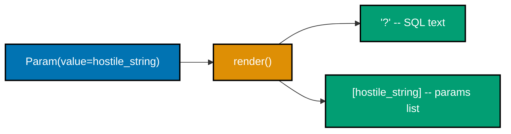
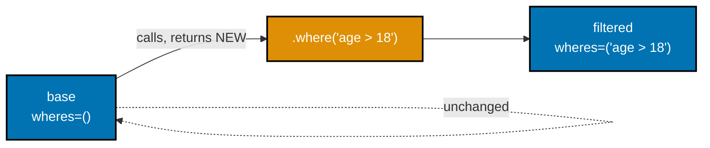
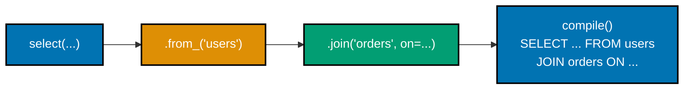
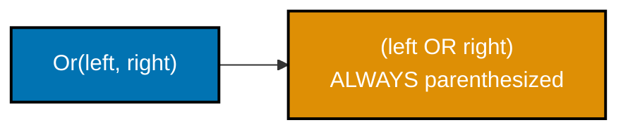
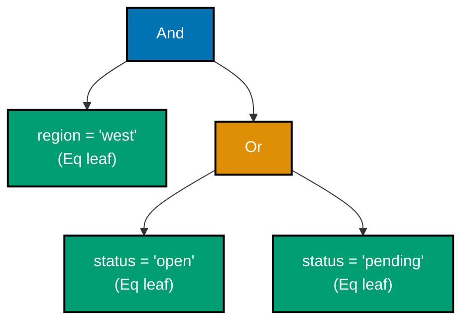
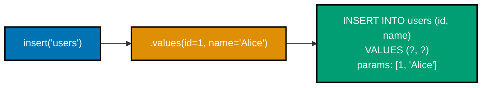
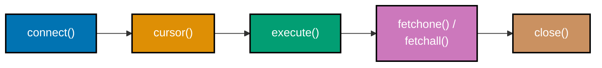

Examples 1-26 build the query-builder core from nothing: a clause represented as data rather than a string, parameterized binding instead of interpolation, an immutable fluent builder, SELECT/WHERE/ORDER BY/LIMIT composition, INSERT/UPDATE/DELETE builders, the `compile()` boundary that turns a builder into a `(sql, params)` tuple, and the real PEP 249 connect/cursor/execute/fetch contract that consumes it. Every example is a complete, self-contained `example.py` colocated under `learning/code/`, verified two ways: `python3 example.py` prints its own expected output inline via `# =>` comments and runs the compiled SQL against a real local SQLite `:memory:` database, and a colocated `test_example.py` asserts the same behavior under `pytest`.

---

### Example 1: Clause as Data, Not a String

_ex-01 &middot; exercises co-01_

A query builder's first move is representing a piece of SQL as a small immutable Python value instead of a string -- a `ColumnRef` node holds a column name, and nothing about it is SQL text until something explicitly asks it to render.


**`learning/code/ex-01-clause-as-data-node/example.py`**

```python
"""Example 1: Clause as Data, Not a String."""  # => docstring names the concept under test

import contextlib  # => guarantees Connection.close() even if the block below raises
import sqlite3  # => the stdlib DB-API driver this entire topic sits on (PEP 249)
from dataclasses import dataclass  # => frozen dataclasses model immutable clause nodes


@dataclass(frozen=True)  # => frozen: a node is a value, never mutated after creation
class ColumnRef:  # => the SIMPLEST possible clause node -- one column reference
    name: str  # => the only piece of state this node carries

    def render(self) -> str:  # => rendering happens LAZILY, on demand -- not at construction
        return self.name  # => turns the node into SQL text only when asked


node = ColumnRef(name="id")  # => builds a NODE, not a string -- node is a ColumnRef object
# => node.name is "id" (type: str); node itself is NOT a string until .render() runs
assert node.name == "id"  # => the raw data is inspectable before any SQL text exists
assert isinstance(node, ColumnRef)  # => confirms node is a data structure, not str
# => rendering is deferred: nothing above produced a single character of SQL text yet

with contextlib.closing(sqlite3.connect(":memory:")) as conn:  # => real local SQLite db
    conn.execute("CREATE TABLE users(id INTEGER PRIMARY KEY, name TEXT)")
    # => a real table so the rendered node can be proven against a real query
    conn.execute("INSERT INTO users(id, name) VALUES (1, 'Alice')")
    # => one seed row -- id=1, name='Alice'
    conn.commit()  # => makes the seed row visible to the SELECT below
    sql = f"SELECT {node.render()} FROM users"  # => .render() called HERE, lazily
    # => sql is "SELECT id FROM users" -- the node only became text at this exact point
    row = conn.execute(sql).fetchone()  # => runs the rendered SQL against the real db
    print(row)  # => Output: (1,)
    # => proves node.render() produced valid, executable SQL against a real SQLite table
```

**Run**: `python3 example.py`

**Output**:

```text
(1,)
```

**`learning/code/ex-01-clause-as-data-node/test_example.py`**

```python
"""Example 1: pytest verification for Clause as Data, Not a String."""

from example import ColumnRef


def test_node_stores_name_without_rendering() -> None:
    # => construction alone must not produce any SQL text
    node = ColumnRef(name="email")  # => a fresh node, unrendered
    assert node.name == "email"  # => raw data is exactly what was passed in
    assert node.render() == "email"  # => rendering is a pure, separate step


def test_node_is_immutable_value() -> None:
    # => two nodes built from equal data compare equal (frozen dataclass value semantics)
    a = ColumnRef(name="id")  # => first node
    b = ColumnRef(name="id")  # => second, independently constructed node
    assert a == b  # => value equality, not identity -- both hold "id"


# => Run: pytest -- Output: 2 passed
```

**Verify**: `pytest -q`

**Output**:

```text
2 passed
```

**Key takeaway**: A clause is a Python value first and SQL text only when something explicitly renders it -- construction and rendering are two separate, independently inspectable steps.

**Why it matters**: Every mechanism in the rest of this topic -- composable WHERE trees, a pure `compile()` boundary, a fully typed API -- depends on a query being real data you can inspect, not a string you can only re-parse. Getting this one habit right at the very first node is what makes every later example possible.

---

### Example 2: Render a Qualified Column Node

_ex-02 &middot; exercises co-01_

Real SELECTs need to distinguish `id` from `users.id`, especially once a JOIN is involved. This example grows the column node with an optional `table` field and puts all the qualification logic in exactly one place: `render()`.

**`learning/code/ex-02-render-column-node/example.py`**

```python
"""Example 2: Render a Qualified Column Node."""  # => docstring names this concept

import contextlib  # => guarantees Connection.close() even if the block below raises
import sqlite3  # => the stdlib DB-API driver this entire topic sits on (PEP 249)
from dataclasses import dataclass  # => a frozen dataclass models the immutable node


@dataclass(frozen=True)  # => still a plain immutable value, one step richer than Example 1
class ColumnRef:  # => a column node that can OPTIONALLY carry its owning table
    name: str  # => the column's own name, e.g. "id"
    table: str | None = None  # => None means "unqualified" -- no owner announced yet

    def render(self) -> str:  # => the ONE place table-qualification logic lives
        if self.table is None:  # => unqualified case: just the bare column name
            return self.name  # => e.g. "id"
        return f"{self.table}.{self.name}"  # => qualified case: "table.column"
        # => e.g. "users.id" -- exactly the fragment a real SELECT/JOIN needs


bare = ColumnRef(name="id")  # => no table given -- stays unqualified
qualified = ColumnRef(name="id", table="users")  # => explicitly owned by "users"
assert bare.render() == "id"  # => unqualified render is just the column name
assert qualified.render() == "users.id"  # => qualified render is "table.column"

with contextlib.closing(sqlite3.connect(":memory:")) as conn:  # => real local SQLite db
    conn.execute("CREATE TABLE users(id INTEGER PRIMARY KEY, name TEXT)")  # => a real table
    conn.execute("INSERT INTO users(id, name) VALUES (1, 'Alice')")  # => one seed row
    conn.commit()  # => commits the seed row before the SELECT reads it
    fragment = qualified.render()  # => renders "users.id" -- lazily, right before use
    sql = f"SELECT {fragment} FROM users AS users"  # => the qualified fragment plugs straight in
    row = conn.execute(sql).fetchone()  # => runs the qualified fragment as real SQL
    print(row)  # => Output: (1,)
    # => proves "users.id" is not just a string -- it is valid, executable SQL
```

**Run**: `python3 example.py`

**Output**:

```text
(1,)
```

**`learning/code/ex-02-render-column-node/test_example.py`**

```python
"""Example 2: pytest verification for Render a Qualified Column Node."""

from example import ColumnRef


def test_unqualified_column_renders_bare_name() -> None:
    node = ColumnRef(name="email")  # => no table supplied
    assert node.render() == "email"  # => bare name, no dot


def test_qualified_column_renders_table_dot_name() -> None:
    node = ColumnRef(name="email", table="users")  # => table supplied
    assert node.render() == "users.email"  # => exactly one dot, table first


# => Run: pytest -- Output: 2 passed
```

**Verify**: `pytest -q`

**Output**:

```text
2 passed
```

**Key takeaway**: An optional field plus a single `if` inside `render()` is enough to support both qualified and unqualified column references, with zero duplicated logic between the two cases.

**Why it matters**: Every later fragment -- WHERE predicates, JOIN conditions -- eventually needs to reference a column that might or might not need table qualification. Keeping that decision in one method, on one node type, is what stops qualification logic from being copy-pasted into every clause type that touches a column name.

---

### Example 3: Bind a Value as a Placeholder, Never Interpolate It

_ex-03 &middot; exercises co-02_

This is the one non-negotiable safety rule of the whole builder: a bound value always renders to the literal text `"?"`, and the value itself travels in a separate params list -- never inside the SQL string, no matter how hostile the value is.



**`learning/code/ex-03-placeholder-not-interpolation/example.py`**

```python
"""Example 3: Bind a Value as a Placeholder, Never Interpolate It."""  # => this concept

import contextlib  # => guarantees Connection.close() even if the block below raises
import sqlite3  # => the stdlib DB-API driver this entire topic sits on (PEP 249)
from dataclasses import dataclass  # => a frozen dataclass models the immutable Param node
from typing import Any  # => a bound value can be any Python type SQLite accepts


@dataclass(frozen=True)  # => a literal value node -- NEVER stringified into SQL text
class Param:  # => the non-negotiable safety primitive of this whole builder (co-02)
    value: Any  # => the raw Python value, kept as data -- never f-string-ed into SQL

    def render(self) -> tuple[str, list[Any]]:  # => returns SQL fragment + params, together
        return "?", [self.value]  # => "?" is the ONLY text; the value travels separately


literal = Param(value="Alice; DROP TABLE users;--")  # => a deliberately hostile string
sql_fragment, bound = literal.render()  # => sql_fragment is "?"; bound is [the hostile string]
assert sql_fragment == "?"  # => the SQL text NEVER contains the value's characters
assert bound == ["Alice; DROP TABLE users;--"]  # => the value lives only in the params list

with contextlib.closing(sqlite3.connect(":memory:")) as conn:  # => real local SQLite db
    conn.execute("CREATE TABLE users(id INTEGER PRIMARY KEY, name TEXT)")  # => real table
    conn.commit()  # => empty table, ready for a parameterized insert
    sql = f"INSERT INTO users(id, name) VALUES (1, {sql_fragment})"  # => "?" plugs in as text
    conn.execute(sql, bound)  # => the driver binds bound[0] into the "?" slot itself
    conn.commit()  # => makes the inserted row durable/visible
    row = conn.execute("SELECT name FROM users WHERE id = 1").fetchone()  # => real read-back
    print(row)  # => Output: ('Alice; DROP TABLE users;--',)
    # => the hostile string landed as ONE column value -- no second statement ever ran
    tables = conn.execute(  # => lists every table still present, proving nothing was dropped
        "SELECT name FROM sqlite_master WHERE type = 'table'"  # => sqlite's own catalog table
    ).fetchall()  # => materializes the catalog rows
    assert ("users",) in tables  # => "users" table survived -- the DROP TABLE never executed
```

**Run**: `python3 example.py`

**Output**:

```text
('Alice; DROP TABLE users;--',)
```

**`learning/code/ex-03-placeholder-not-interpolation/test_example.py`**

```python
"""Example 3: pytest verification for Bind a Value as a Placeholder."""

from example import Param


def test_render_emits_placeholder_text_only() -> None:
    param = Param(value=42)  # => an ordinary integer literal
    sql_fragment, bound = param.render()  # => splits into text + params
    assert sql_fragment == "?"  # => text is always exactly "?", regardless of value
    assert bound == [42]  # => value travels only in the params list


def test_hostile_string_never_becomes_sql_text() -> None:
    hostile = "x'); DROP TABLE users;--"  # => a classic injection payload
    param = Param(value=hostile)  # => wrapped as a param, not concatenated
    sql_fragment, bound = param.render()  # => splits into text + params
    assert hostile not in sql_fragment  # => the payload never touches the SQL string
    assert bound == [hostile]  # => the payload is confined to the params list


# => Run: pytest -- Output: 2 passed
```

**Verify**: `pytest -q`

**Output**:

```text
2 passed
```

**Key takeaway**: A bound value's rendered SQL text is always exactly `"?"` -- the value itself never enters the SQL string, so it can never be mistaken for SQL syntax.

**Why it matters**: This is the single property that separates a safe hand-built builder from an injection vulnerability. Proving it against a deliberately hostile string -- one containing a `DROP TABLE` -- and watching the table survive is a far stronger guarantee than trusting that "we always remember to escape user input." SQL injection has remained near the top of real-world vulnerability rankings for decades precisely because manual escaping only has to be forgotten once, in one code path, for an attacker to win -- binding removes that failure mode structurally instead of relying on programmer discipline.

---

### Example 4: Compile Two Bound Values, Params Stay Left-to-Right

_ex-04 &middot; exercises co-02, co-08_

Two `Param` nodes compile independently, and concatenating their params lists in call order is what keeps the params list aligned with the "?" placeholders' left-to-right position in the SQL text.

**`learning/code/ex-04-params-collected-in-order/example.py`**

```python
"""Example 4: Compile Two Bound Values, Params Stay Left-to-Right."""  # => this concept

import contextlib  # => guarantees Connection.close() even if the block below raises
import sqlite3  # => the stdlib DB-API driver this entire topic sits on (PEP 249)
from dataclasses import dataclass  # => a frozen dataclass models the immutable Param node
from typing import Any  # => a bound value can be any Python type SQLite accepts


@dataclass(frozen=True)  # => same Param node as Example 3 -- one bound literal
class Param:  # => wraps exactly one literal value, deferred to render() time
    value: Any  # => raw value, kept as data

    def render(self) -> tuple[str, list[Any]]:  # => splits into SQL text + a params list
        return "?", [self.value]  # => "?" text, value in its own single-item list


def compile_two(first: Param, second: Param) -> tuple[str, list[Any]]:  # => co-08: compile()
    first_sql, first_params = first.render()  # => renders the FIRST param in isolation
    second_sql, second_params = second.render()  # => renders the SECOND param in isolation
    sql = f"{first_sql}, {second_sql}"  # => "?, ?" -- two placeholders, comma-joined
    params = first_params + second_params  # => concatenation PRESERVES left-to-right order
    return sql, params  # => a single (sql, params) pair, the compile() boundary (co-08)


sql, params = compile_two(Param(value="Bob"), Param(value=42))  # => name first, age second
assert sql == "?, ?"  # => exactly two placeholders, in source order
assert params == ["Bob", 42]  # => "Bob" is params[0] because it was the FIRST argument

with contextlib.closing(sqlite3.connect(":memory:")) as conn:  # => real local SQLite db
    conn.execute("CREATE TABLE users(name TEXT, age INTEGER)")  # => two-column real table
    conn.commit()  # => empty table ready for a two-column insert
    insert_sql = f"INSERT INTO users(name, age) VALUES ({sql})"  # => "?, ?" plugs into VALUES
    conn.execute(insert_sql, params)  # => params[0] binds to name, params[1] binds to age
    conn.commit()  # => makes the inserted row durable/visible
    row = conn.execute("SELECT name, age FROM users").fetchone()  # => real read-back
    print(row)  # => Output: ('Bob', 42)
    # => proves the driver bound params[0]->name and params[1]->age, in that exact order
```

**Run**: `python3 example.py`

**Output**:

```text
('Bob', 42)
```

**`learning/code/ex-04-params-collected-in-order/test_example.py`**

```python
"""Example 4: pytest verification for Params Collected in Order."""

from example import Param, compile_two


def test_params_preserve_argument_order() -> None:
    sql, params = compile_two(Param(value="first"), Param(value="second"))
    assert sql == "?, ?"  # => two placeholders regardless of value content
    assert params == ["first", "second"]  # => first argument stays params[0]


def test_swapping_arguments_swaps_param_order() -> None:
    sql, params = compile_two(Param(value=1), Param(value=2))  # => 1 first this time
    assert params[0] == 1  # => order tracks argument position, not value
    sql2, params2 = compile_two(Param(value=2), Param(value=1))  # => 2 first now
    assert params2[0] == 2  # => flipping arguments flips params[0] too
    assert sql == sql2  # => the SQL SHAPE is identical either way -- only params differ


# => Run: pytest -- Output: 2 passed
```

**Verify**: `pytest -q`

**Output**:

```text
2 passed
```

**Key takeaway**: List concatenation (`first_params + second_params`) is enough to keep a compiled query's params list aligned with its placeholders' left-to-right positions, with no separate index bookkeeping required.

**Why it matters**: The instant a query has more than one bound value, param-order correctness becomes load-bearing -- a params list built out of order silently binds the wrong value to the wrong placeholder, with no error raised anywhere. `compile()`'s whole job is guaranteeing this alignment holds, every time, for every clause combination.

---

### Example 5: A Builder Method Returns a NEW Instance, Never Mutates

_ex-05 &middot; exercises co-03_

`.where()` on a `frozen=True` dataclass returns a brand-new `Query` object via `dataclasses.replace()` -- the receiver is never touched, and attempting to assign to a field directly raises.



**`learning/code/ex-05-builder-returns-new-instance/example.py`**

```python
"""Example 5: A Builder Method Returns a NEW Instance, Never Mutates."""  # => this concept

import contextlib  # => guarantees Connection.close() even if the block below raises
import dataclasses  # => dataclasses.replace() is the immutable "update" primitive
import sqlite3  # => the stdlib DB-API driver this entire topic sits on (PEP 249)


@dataclasses.dataclass(frozen=True)  # => frozen: attribute assignment raises, by design
class Query:  # => co-03: an immutable fluent builder over a single table
    table: str  # => which table this query targets
    wheres: tuple[str, ...] = ()  # => accumulated raw WHERE fragments, empty by default

    def where(self, clause: str) -> "Query":  # => returns a NEW Query, self is untouched
        return dataclasses.replace(  # => copies every field, overriding only wheres
            self,
            wheres=self.wheres + (clause,),  # => appends clause to a NEW tuple
        )

    def compile(self) -> str:  # => turns the accumulated fragments into one SQL string
        sql = f"SELECT * FROM {self.table}"  # => base SELECT, no WHERE yet
        if self.wheres:  # => only append WHERE if at least one fragment was added
            sql += " WHERE " + " AND ".join(self.wheres)  # => joins fragments with AND
        return sql  # => the final, fully-assembled SQL string for this instance


base = Query(table="users")  # => the original, zero-filter query
filtered = base.where("age > 18")  # => calling .where() on base...
# => ...returns a DIFFERENT object -- base itself is never touched
assert base.wheres == ()  # => base still has NO filters -- proves immutability
assert filtered.wheres == ("age > 18",)  # => only the NEW object carries the filter
assert base is not filtered  # => two distinct objects, not the same instance mutated
assert base.compile() == "SELECT * FROM users"  # => base's SQL never gained a WHERE

with contextlib.closing(sqlite3.connect(":memory:")) as conn:  # => real local SQLite db
    conn.execute("CREATE TABLE users(id INTEGER PRIMARY KEY, age INTEGER)")  # => real table
    conn.execute("INSERT INTO users(id, age) VALUES (1, 15), (2, 25)")  # => two seed rows
    conn.commit()  # => makes both seed rows visible
    base_rows = conn.execute(base.compile()).fetchall()  # => runs base's unfiltered SQL
    filtered_rows = conn.execute(filtered.compile()).fetchall()  # => runs filtered's SQL
    print(len(base_rows), len(filtered_rows))  # => Output: 2 1
    # => base still sees both rows; filtered sees only the one row over 18
```

**Run**: `python3 example.py`

**Output**:

```text
2 1
```

**`learning/code/ex-05-builder-returns-new-instance/test_example.py`**

```python
"""Example 5: pytest verification for Builder Returns a New Instance."""

import dataclasses

import pytest

from example import Query


def test_original_query_unchanged_after_where() -> None:
    base = Query(table="orders")  # => a fresh, filter-free query
    base.where("status = 'open'")  # => call .where() but DISCARD the return value
    assert base.wheres == ()  # => base is untouched -- the discarded call had no effect


def test_where_returns_a_different_object() -> None:
    base = Query(table="orders")  # => original
    branched = base.where("status = 'open'")  # => keep the returned object this time
    assert branched is not base  # => a genuinely new object, not base mutated in place
    assert branched.wheres == ("status = 'open'",)  # => the new object carries the filter


def test_frozen_dataclass_rejects_direct_mutation() -> None:
    query = Query(table="orders")  # => a frozen instance
    with pytest.raises(dataclasses.FrozenInstanceError):  # => attribute assignment must fail
        query.table = "users"  # type: ignore[misc]  # => deliberately illegal -- proves frozen=True


# => Run: pytest -- Output: 3 passed
```

**Verify**: `pytest -q`

**Output**:

```text
3 passed
```

**Key takeaway**: `frozen=True` plus `dataclasses.replace()` is the entire mechanism behind an immutable fluent builder -- no custom `__setattr__`, no defensive copying, no discipline required from callers.

**Why it matters**: A mutable builder makes "build once, branch twice" unsafe -- every caller sharing a base query risks another caller's `.where()` call silently changing what they see. Immutability turns that risk into a compile-time-obvious impossibility: `base` genuinely cannot change after `filtered` is derived from it. This matters most in exactly the situations where builders get reused, such as a shared repository method that hands the same base query to several report generators -- without immutability, one generator's added filter could silently leak into every other generator sharing the same base object.

---

### Example 6: Branch a Partial Query into Two Independent Variants

_ex-06 &middot; exercises co-03_

A partially-built query -- one shared `.where("region = 'west'")` trunk -- branches into two independent variants, each adding its own filter, with neither branch's filter leaking into the other or into the shared trunk.

**`learning/code/ex-06-branch-a-partial-query/example.py`**

```python
"""Example 6: Branch a Partial Query into Two Independent Variants."""  # => this concept

import contextlib  # => guarantees Connection.close() even if the block below raises
import dataclasses  # => dataclasses.replace() is the immutable "update" primitive
import sqlite3  # => the stdlib DB-API driver this entire topic sits on (PEP 249)


@dataclasses.dataclass(frozen=True)  # => same immutable shape as Example 5
class Query:  # => an immutable fluent builder over a single table
    table: str  # => target table
    wheres: tuple[str, ...] = ()  # => accumulated WHERE fragments

    def where(self, clause: str) -> "Query":  # => branch point -- returns a new Query
        return dataclasses.replace(self, wheres=self.wheres + (clause,))  # => new tuple, new object

    def compile(self) -> str:  # => turns fragments into one SELECT string
        sql = f"SELECT * FROM {self.table}"  # => base SELECT, no WHERE yet
        if self.wheres:  # => only append WHERE if at least one fragment was added
            sql += " WHERE " + " AND ".join(self.wheres)  # => joins fragments with AND
        return sql  # => the final, fully-assembled SQL string for this instance


base = Query(table="orders").where("region = 'west'")  # => ONE shared partial query
# => base already carries one filter -- this is the reusable "trunk" both branches share
variant_open = base.where("status = 'open'")  # => BRANCH 1: adds an open-status filter
variant_closed = base.where("status = 'closed'")  # => BRANCH 2: adds a closed-status filter
# => both branches started from the SAME base -- neither one touched the other

assert base.wheres == ("region = 'west'",)  # => the shared trunk still has only ITS filter
assert variant_open.wheres == ("region = 'west'", "status = 'open'")  # => trunk + open
assert variant_closed.wheres == ("region = 'west'", "status = 'closed'")  # => trunk + closed
assert variant_open is not variant_closed  # => two distinct objects, no cross-contamination

with contextlib.closing(sqlite3.connect(":memory:")) as conn:  # => real local SQLite db
    conn.execute("CREATE TABLE orders(id INTEGER PRIMARY KEY, region TEXT, status TEXT)")  # => table
    conn.execute(  # => three seed rows across two regions and two statuses
        "INSERT INTO orders(id, region, status) VALUES "  # => column list, VALUES keyword
        "(1, 'west', 'open'), (2, 'west', 'closed'), (3, 'east', 'open')"  # => three literal rows
    )
    conn.commit()  # => makes all three seed rows visible
    open_rows = conn.execute(variant_open.compile()).fetchall()  # => runs branch 1's SQL
    closed_rows = conn.execute(variant_closed.compile()).fetchall()  # => runs branch 2's SQL
    print(len(open_rows), len(closed_rows))  # => Output: 1 1
    # => each branch independently filters west-region rows down to its own status
```

**Run**: `python3 example.py`

**Output**:

```text
1 1
```

**`learning/code/ex-06-branch-a-partial-query/test_example.py`**

```python
"""Example 6: pytest verification for Branch a Partial Query."""

from example import Query


def test_branches_share_the_trunk_but_diverge_independently() -> None:
    trunk = Query(table="orders").where("region = 'west'")  # => shared partial query
    left = trunk.where("status = 'open'")  # => first branch
    right = trunk.where("status = 'closed'")  # => second, independent branch
    assert left.wheres[0] == right.wheres[0] == "region = 'west'"  # => both inherit the trunk
    assert left.wheres[-1] != right.wheres[-1]  # => each branch's own tip differs


def test_trunk_is_never_mutated_by_either_branch() -> None:
    trunk = Query(table="orders").where("region = 'west'")  # => one-filter trunk
    trunk.where("status = 'open'")  # => branch, but result discarded on purpose
    trunk.where("status = 'closed'")  # => second branch, also discarded
    assert trunk.wheres == ("region = 'west'",)  # => trunk still has exactly one filter


# => Run: pytest -- Output: 2 passed
```

**Verify**: `pytest -q`

**Output**:

```text
2 passed
```

**Key takeaway**: Branching a shared partial query is just calling `.where()` twice on the same object -- immutability makes the two resulting branches automatically independent, with no cloning code anywhere.

**Why it matters**: A common real-world pattern is building a base query once (say, "orders for this tenant") and then branching several report-specific variants from it. Without immutability, that pattern is a minefield -- one variant's filter can silently bleed into another's, especially once the base query is cached and reused across multiple requests or threads. With immutability, the pattern is simply safe by construction: no branch can ever observe a mutation performed by a sibling branch, no matter how many variants share the same trunk.

---

### Example 7: select() Lists Explicit Columns, in Order

_ex-07 &middot; exercises co-04_

`select("id", "name")` stores the requested columns as a tuple, in call order, and `compile()` joins them with commas -- the first step of a growing `Select` builder.

**`learning/code/ex-07-select-columns/example.py`**

```python
"""Example 7: select() Lists Explicit Columns, in Order."""  # => this concept

import contextlib  # => guarantees Connection.close() even if the block below raises
import dataclasses  # => dataclasses.replace() is the immutable "update" primitive
import sqlite3  # => the stdlib DB-API driver this entire topic sits on (PEP 249)


@dataclasses.dataclass(frozen=True)  # => co-03: immutable, one method per fluent step
class Select:  # => the growing SELECT builder -- this example only exercises columns
    columns: tuple[str, ...] = ()  # => the SELECT list, empty means "not chosen yet"
    table: str | None = None  # => FROM target, filled in by .from_() (Example 8)

    def from_(self, table: str) -> "Select":  # => sets the FROM target, immutably
        return dataclasses.replace(self, table=table)  # => new instance, self untouched

    def compile(self) -> str:  # => co-04: assembles the SELECT clause from state
        col_list = ", ".join(self.columns) if self.columns else "*"  # => join or fall back
        return f"SELECT {col_list} FROM {self.table}"  # => the final assembled SQL string


def select(*columns: str) -> Select:  # => the public entry point: select("id", "name")
    return Select(columns=columns)  # => columns arrive as a tuple, in call order


query = select("id", "name").from_("users")  # => explicit two-column projection
sql = query.compile()  # => renders the accumulated state to SQL text
assert sql == "SELECT id, name FROM users"  # => "id" precedes "name" -- source order kept

with contextlib.closing(sqlite3.connect(":memory:")) as conn:  # => real local SQLite db
    conn.execute("CREATE TABLE users(id INTEGER PRIMARY KEY, name TEXT, age INTEGER)")  # => 3 cols
    conn.execute("INSERT INTO users(id, name, age) VALUES (1, 'Alice', 30)")  # => one seed row
    conn.commit()  # => makes the seed row visible to the SELECT below
    row = conn.execute(sql).fetchone()  # => runs the compiled two-column SELECT for real
    print(row)  # => Output: (1, 'Alice')
    # => proves the row has EXACTLY two fields -- age was never requested, never returned
```

**Run**: `python3 example.py`

**Output**:

```text
(1, 'Alice')
```

**`learning/code/ex-07-select-columns/test_example.py`**

```python
"""Example 7: pytest verification for select() Lists Explicit Columns."""

from example import select


def test_select_lists_columns_in_call_order() -> None:
    query = select("name", "id").from_("users")  # => name given BEFORE id this time
    assert query.compile() == "SELECT name, id FROM users"  # => order matches the call


def test_select_with_single_column() -> None:
    query = select("id").from_("users")  # => just one column requested
    assert query.compile() == "SELECT id FROM users"  # => no comma, one bare column


# => Run: pytest -- Output: 2 passed
```

**Verify**: `pytest -q`

**Output**:

```text
2 passed
```

**Key takeaway**: `*columns: str` plus `", ".join(...)` is the entire column-list mechanism -- call order in becomes rendered order out, with no separate sorting or reordering step.

**Why it matters**: A hand-rolled string-concatenation SELECT would need to special-case "no trailing comma after the last column" by hand -- an easy off-by-one to get wrong when a column list grows or shrinks dynamically. `", ".join()` over a tuple gets that right automatically, for any number of columns, including zero or one, and is exactly the same joining primitive `compile()` will keep composing on top of for every clause introduced in the examples that follow, from JOIN fragments through ORDER BY columns.

---

### Example 8: .from\_() Attaches the FROM Target, Immutably

_ex-08 &middot; exercises co-04_

`.from_("orders")` is the second independent fragment feeding `compile()` -- it never touches the columns fragment, and (like every builder method in this topic) it returns a new `Select` rather than mutating the receiver.

**`learning/code/ex-08-select-from-table/example.py`**

```python
"""Example 8: .from_() Attaches the FROM Target, Immutably."""  # => this concept

import contextlib  # => guarantees Connection.close() even if the block below raises
import dataclasses  # => dataclasses.replace() is the immutable "update" primitive
import sqlite3  # => the stdlib DB-API driver this entire topic sits on (PEP 249)


@dataclasses.dataclass(frozen=True)  # => co-03: immutable, one method per fluent step
class Select:  # => same shape as Example 7, focus shifted onto .from_() itself
    columns: tuple[str, ...] = ()  # => the SELECT list
    table: str | None = None  # => FROM target -- None until .from_() is called

    def from_(self, table: str) -> "Select":  # => the method THIS example is about
        return dataclasses.replace(self, table=table)  # => new instance, table now set

    def compile(self) -> str:  # => assembles the SELECT clause from state
        col_list = ", ".join(self.columns) if self.columns else "*"  # => join or fall back
        return f"SELECT {col_list} FROM {self.table}"  # => the final assembled SQL string


def select(*columns: str) -> Select:  # => the public entry point
    return Select(columns=columns)  # => columns arrive as a tuple, in call order


before = select("id")  # => built, but .from_() has not run yet
assert before.table is None  # => no FROM target attached yet -- state is inspectable
after = before.from_("orders")  # => attaches "orders" as the FROM target
assert before.table is None  # => the ORIGINAL object is still untouched -- immutability
assert after.table == "orders"  # => only the NEW object carries "orders"
assert after.compile() == "SELECT id FROM orders"  # => FROM orders now appears in the SQL

with contextlib.closing(sqlite3.connect(":memory:")) as conn:  # => real local SQLite db
    conn.execute("CREATE TABLE orders(id INTEGER PRIMARY KEY, total REAL)")  # => real table
    conn.execute("INSERT INTO orders(id, total) VALUES (1, 42.5)")  # => one seed row
    conn.commit()  # => makes the seed row visible to the SELECT below
    row = conn.execute(after.compile()).fetchone()  # => runs against the real "orders" table
    print(row)  # => Output: (1,)
    # => proves .from_("orders") pointed the query at the correct real table
```

**Run**: `python3 example.py`

**Output**:

```text
(1,)
```

**`learning/code/ex-08-select-from-table/test_example.py`**

```python
"""Example 8: pytest verification for .from_() Attaches the FROM Target."""

from example import select


def test_from_sets_table_without_mutating_original() -> None:
    base = select("id")  # => no table yet
    branched = base.from_("users")  # => branch with a table attached
    assert base.table is None  # => base is unaffected by the branch
    assert branched.table == "users"  # => only the branch carries "users"


def test_from_can_target_different_tables_independently() -> None:
    base = select("id")  # => shared trunk, no table yet
    users = base.from_("users")  # => one branch targets "users"
    orders = base.from_("orders")  # => a second, independent branch targets "orders"
    assert users.compile() == "SELECT id FROM users"  # => first branch's own SQL
    assert orders.compile() == "SELECT id FROM orders"  # => second branch's own SQL


# => Run: pytest -- Output: 2 passed
```

**Verify**: `pytest -q`

**Output**:

```text
2 passed
```

**Key takeaway**: `.from_()` is one more independent fragment, following the exact same immutable-method shape as `.where()` -- the pattern generalizes cleanly to every clause this builder will eventually support.

**Why it matters**: Two branches of the same base query can target two entirely different tables without any risk of one branch's `.from_()` call affecting the other -- exactly the same immutability guarantee from Example 6, now applied to FROM instead of WHERE. Because every fragment (columns, table, and later WHERE and JOIN) lives in its own field and its own `dataclasses.replace()` call, adding this guarantee to a new clause required no new mechanism at all -- just one more immutable field.

---

### Example 9: select() With No Columns Defaults to SELECT \*

_ex-09 &middot; exercises co-04_

Calling `select()` with zero arguments leaves `columns` as an empty tuple, and `compile()`'s `if self.columns else "*"` branch is what turns that empty state into a bare `SELECT *`.

**`learning/code/ex-09-select-star-default/example.py`**

```python
"""Example 9: select() With No Columns Defaults to SELECT *."""  # => this concept

import contextlib  # => guarantees Connection.close() even if the block below raises
import dataclasses  # => dataclasses.replace() is the immutable "update" primitive
import sqlite3  # => the stdlib DB-API driver this entire topic sits on (PEP 249)


@dataclasses.dataclass(frozen=True)  # => co-03: immutable, one method per fluent step
class Select:  # => same shape as Examples 7-8, focus on the EMPTY-columns default
    columns: tuple[str, ...] = ()  # => empty tuple is the "no columns chosen" signal
    table: str | None = None  # => FROM target

    def from_(self, table: str) -> "Select":  # => attaches the FROM target
        return dataclasses.replace(self, table=table)  # => new instance, table now set

    def compile(self) -> str:  # => co-04: the empty-columns branch lives HERE
        col_list = ", ".join(self.columns) if self.columns else "*"  # => "*" when empty
        # => an empty tuple is falsy in Python -- `if self.columns` catches it directly
        return f"SELECT {col_list} FROM {self.table}"  # => the final assembled SQL string


def select(*columns: str) -> Select:  # => called with ZERO arguments in this example
    return Select(columns=columns)  # => columns is () when select() takes no arguments


query = select().from_("users")  # => no column names supplied at all
assert query.columns == ()  # => the tuple really is empty -- nothing was chosen
assert query.compile() == "SELECT * FROM users"  # => empty columns renders as bare "*"

with contextlib.closing(sqlite3.connect(":memory:")) as conn:  # => real local SQLite db
    conn.execute("CREATE TABLE users(id INTEGER PRIMARY KEY, name TEXT)")  # => real table
    conn.execute("INSERT INTO users(id, name) VALUES (1, 'Alice')")  # => one seed row
    conn.commit()  # => makes the seed row visible to the SELECT below
    row = conn.execute(query.compile()).fetchone()  # => runs the real "SELECT * FROM users"
    print(row)  # => Output: (1, 'Alice')
    # => proves "*" returned EVERY column, not just a subset
```

**Run**: `python3 example.py`

**Output**:

```text
(1, 'Alice')
```

**`learning/code/ex-09-select-star-default/test_example.py`**

```python
"""Example 9: pytest verification for select() Defaults to SELECT *."""

from example import select


def test_no_columns_compiles_to_star() -> None:
    query = select().from_("orders")  # => zero column names given
    assert query.compile() == "SELECT * FROM orders"  # => defaults to a bare "*"


def test_explicit_columns_override_the_star_default() -> None:
    query = select("id").from_("orders")  # => one column IS given this time
    assert query.compile() == "SELECT id FROM orders"  # => "*" default never applies here


# => Run: pytest -- Output: 2 passed
```

**Verify**: `pytest -q`

**Output**:

```text
2 passed
```

**Key takeaway**: Python's own falsiness rules (`if self.columns`) are enough to implement the `SELECT *` default -- no separate "was select() called with no args?" flag is needed.

**Why it matters**: `SELECT *` is an extremely common real-world default, and getting the empty-vs-non-empty branch wrong (say, rendering `SELECT  FROM users` with a blank column list) is an easy, embarrassing bug in a hand-rolled builder. Falling back on the language's own truthiness check makes the default fall out naturally instead of needing a special case to remember.

---

### Example 10: .join() Adds a JOIN Fragment With an ON Predicate

_ex-10 &middot; exercises co-04_

`.join("orders", on="users.id = orders.user_id")` appends a `"JOIN orders ON ..."` fragment to a growing `joins` tuple -- one more independent fragment, joined into the final SQL with the other three (columns, table, joins).



**`learning/code/ex-10-select-with-join/example.py`**

```python
"""Example 10: .join() Adds a JOIN Fragment With an ON Predicate."""  # => this concept

import contextlib  # => guarantees Connection.close() even if the block below raises
import dataclasses  # => dataclasses.replace() is the immutable "update" primitive
import sqlite3  # => the stdlib DB-API driver this entire topic sits on (PEP 249)


@dataclasses.dataclass(frozen=True)  # => co-03: immutable, one method per fluent step
class Select:  # => same shape as Examples 7-9, now grows a JOIN fragment
    columns: tuple[str, ...] = ()  # => the SELECT list
    table: str | None = None  # => FROM target
    joins: tuple[str, ...] = ()  # => accumulated "JOIN t ON pred" fragments, in order

    def from_(self, table: str) -> "Select":  # => attaches the FROM target
        return dataclasses.replace(self, table=table)  # => new instance, table now set

    def join(self, table: str, on: str) -> "Select":  # => co-04: appends one JOIN fragment
        fragment = f"JOIN {table} ON {on}"  # => "JOIN orders ON users.id = orders.user_id"
        return dataclasses.replace(self, joins=self.joins + (fragment,))  # => new joins tuple

    def compile(self) -> str:  # => assembles SELECT, FROM, and every JOIN fragment
        col_list = ", ".join(self.columns) if self.columns else "*"  # => join or fall back
        sql = f"SELECT {col_list} FROM {self.table}"  # => base SELECT ... FROM
        if self.joins:  # => append JOIN fragments only if at least one was added
            sql += " " + " ".join(self.joins)  # => space-joined, in the order they were added
        return sql  # => the final assembled SQL string


def select(*columns: str) -> Select:  # => the public entry point
    return Select(columns=columns)  # => columns arrive as a tuple, in call order


query = (  # => a three-step fluent chain, each step returning a new immutable Select
    select("users.name", "orders.total")  # => two columns from two different tables
    .from_("users")  # => the driving table
    .join("orders", on="users.id = orders.user_id")  # => the JOIN this example is about
)  # => query now holds the fully-chained, still-uncompiled builder state
sql = query.compile()  # => renders the accumulated state to SQL text
assert "JOIN orders ON users.id = orders.user_id" in sql  # => the exact JOIN fragment appears

with contextlib.closing(sqlite3.connect(":memory:")) as conn:  # => real local SQLite db
    conn.execute("CREATE TABLE users(id INTEGER PRIMARY KEY, name TEXT)")  # => parent table
    conn.execute("CREATE TABLE orders(user_id INTEGER, total REAL)")  # => child table
    conn.execute("INSERT INTO users(id, name) VALUES (1, 'Alice')")  # => one user
    conn.execute("INSERT INTO orders(user_id, total) VALUES (1, 42.5)")  # => one matching order
    conn.commit()  # => makes both seed rows visible
    row = conn.execute(sql).fetchone()  # => runs the compiled JOIN for real
    print(row)  # => Output: ('Alice', 42.5)
    # => proves the JOIN fragment matched Alice's user row to her order row correctly
```

**Run**: `python3 example.py`

**Output**:

```text
('Alice', 42.5)
```

**`learning/code/ex-10-select-with-join/test_example.py`**

```python
"""Example 10: pytest verification for .join() Adds a JOIN Fragment."""

from example import select


def test_join_fragment_appears_after_from() -> None:
    query = select("id").from_("users").join("orders", on="users.id = orders.user_id")
    sql = query.compile()  # => renders the full SELECT ... FROM ... JOIN string
    assert sql == "SELECT id FROM users JOIN orders ON users.id = orders.user_id"


def test_multiple_joins_accumulate_in_call_order() -> None:
    query = (
        select("id")  # => builder start
        .from_("users")  # => driving table
        .join("orders", on="a")  # => first join, predicate "a"
        .join("payments", on="b")  # => second join, predicate "b"
    )
    assert "JOIN orders ON a" in query.compile()  # => first join present
    assert query.compile().index("orders") < query.compile().index("payments")
    # => "orders" appears BEFORE "payments" -- call order is preserved in the SQL


# => Run: pytest -- Output: 2 passed
```

**Verify**: `pytest -q`

**Output**:

```text
2 passed
```

**Key takeaway**: A JOIN is just one more fragment stored in one more tuple field -- the fourth independent contributor to `compile()`, following the same immutable-append shape as columns, table, and (in later examples) WHERE.

**Why it matters**: Once columns, FROM, and JOIN are each independently composable, adding more JOINs later (a common real-world need -- three, four, five-table reports pulling data across an entire schema) is simply calling `.join()` again, with no change required to the columns or WHERE machinery. This is the payoff of keeping every clause in its own tuple field: growth in one dimension of a query never forces a rewrite of the others.

---

### Example 11: col("age") == 30 Compiles to a Parameterized Equality

_ex-11 &middot; exercises co-05_

`Col.__eq__` is deliberately overridden to build an `Eq` predicate node instead of returning a `bool`, so `col("age") == 30` reads like an ordinary Python comparison while actually building a parameterized WHERE fragment.

**`learning/code/ex-11-where-equals/example.py`**

```python
"""Example 11: col("age") == 30 Compiles to a Parameterized Equality."""  # => this concept

import contextlib  # => guarantees Connection.close() even if the block below raises
import dataclasses  # => dataclasses.replace() is the immutable "update" primitive
import sqlite3  # => the stdlib DB-API driver this entire topic sits on (PEP 249)
from typing import Any, Protocol  # => Protocol types the shared Predicate interface


class Predicate(Protocol):  # => co-05: any node that can compile to (sql, params)
    def compile(self) -> tuple[str, list[Any]]: ...  # => structural contract, no base class needed


@dataclasses.dataclass(frozen=True)  # => a single "column = value" leaf predicate
class Eq:  # => co-02: emits "?", value travels in the params list, never inlined
    column: str  # => the column name, e.g. "age"
    value: Any  # => the bound literal, e.g. 30

    def compile(self) -> tuple[str, list[Any]]:  # => satisfies the Predicate protocol
        return f"{self.column} = ?", [self.value]  # => "age = ?", [30]


@dataclasses.dataclass(frozen=True, eq=False)  # => eq=False: __eq__ below returns a node, not bool
class Col:  # => a lightweight column-name wrapper enabling `col("age") == 30` syntax
    name: str  # => the wrapped column name

    def __eq__(self, other: object) -> Eq:  # type: ignore[override]
        # => deliberately violates object.__eq__'s "-> bool" contract: Col is a query-DSL
        # => node, never used as a dict/set key needing real value-equality semantics
        return Eq(column=self.name, value=other)  # => "age" == 30 becomes Eq("age", 30)

    def __hash__(self) -> int:  # => still hashable even though __eq__ no longer returns bool
        return hash(self.name)


def col(name: str) -> Col:  # => the public entry point: col("age")
    return Col(name=name)  # => wraps the bare name


@dataclasses.dataclass(frozen=True)  # => co-03: immutable, WHERE now stored as a Predicate
class Select:  # => a minimal single-table SELECT with exactly one WHERE slot
    table: str  # => FROM target
    where_pred: Predicate | None = None  # => None means "no filter"

    def where(self, pred: Predicate) -> "Select":  # => attaches a predicate, immutably
        return dataclasses.replace(self, where_pred=pred)  # => new instance, self untouched

    def compile(self) -> tuple[str, list[Any]]:  # => co-08: returns (sql, params) together
        sql = f"SELECT * FROM {self.table}"  # => base SELECT
        params: list[Any] = []  # => the params list this query will bind
        if self.where_pred is not None:  # => only append WHERE if a predicate was attached
            where_sql, where_params = self.where_pred.compile()  # => delegates to the node
            sql += f" WHERE {where_sql}"  # => "SELECT * FROM users WHERE age = ?"
            params = where_params  # => the leaf's params become the query's params
        return sql, params  # => the compiled (sql, params) pair


query = Select(table="users").where(col("age") == 30)  # => WHERE age = 30, via ==
sql, params = query.compile()  # => splits into text + bound values
assert sql == "SELECT * FROM users WHERE age = ?"  # => "?" placeholder, never "30" inline
assert params == [30]  # => the literal 30 travels only in the params list

with contextlib.closing(sqlite3.connect(":memory:")) as conn:  # => real local SQLite db
    conn.execute("CREATE TABLE users(id INTEGER PRIMARY KEY, age INTEGER)")  # => real table
    conn.execute("INSERT INTO users(id, age) VALUES (1, 30), (2, 40)")  # => two seed rows
    conn.commit()  # => makes both seed rows visible
    rows = conn.execute(sql, params).fetchall()  # => runs the parameterized SELECT for real
    print(rows)  # => Output: [(1, 30)]
    # => only the age=30 row matched -- proves the "?" bound to 30, not 40
```

**Run**: `python3 example.py`

**Output**:

```text
[(1, 30)]
```

**`learning/code/ex-11-where-equals/test_example.py`**

```python
"""Example 11: pytest verification for col("age") == 30."""

from example import Select, col


def test_eq_predicate_compiles_to_placeholder() -> None:
    query = Select(table="users").where(col("age") == 30)  # => equality predicate
    sql, params = query.compile()  # => splits SQL text from bound params
    assert sql == "SELECT * FROM users WHERE age = ?"  # => literal 30 never inlined
    assert params == [30]  # => value travels in the params list


def test_different_column_and_value_compile_correctly() -> None:
    query = Select(table="orders").where(col("status") == "open")  # => string value this time
    sql, params = query.compile()  # => splits SQL text from bound params
    assert sql == "SELECT * FROM orders WHERE status = ?"  # => same shape, different column
    assert params == ["open"]  # => the string travels as a bound param, not quoted in SQL


# => Run: pytest -- Output: 2 passed
```

**Verify**: `pytest -q`

**Output**:

```text
2 passed
```

**Key takeaway**: Overriding `Col.__eq__` to return an `Eq` node (not a `bool`) is what makes `col("age") == 30` read like a natural comparison while actually building a safe, parameterized predicate -- a deliberate, explicitly-marked deviation from Python's default equality contract.

**Why it matters**: This is the exact mechanism real ORM query DSLs (SQLAlchemy's `Column.__eq__`, for instance) use to make filter expressions read like ordinary Python comparisons instead of a separate string-based mini-language. Seeing it built from a `# type: ignore[override]`-marked six-line dataclass method demystifies what looked like special syntax into an ordinary (if deliberately unusual) operator override -- there is no compiler magic here, just a dunder method returning something other than a `bool`.

---

### Example 12: Combine Two Predicates With AND

_ex-12 &middot; exercises co-05_

`And(left=..., right=...)` recursively compiles both children and joins their SQL text with `" AND "`, concatenating their params lists left-to-right -- the first boolean combinator in the WHERE tree.

**`learning/code/ex-12-where-and/example.py`**

```python
"""Example 12: Combine Two Predicates With AND."""  # => this concept

import contextlib  # => guarantees Connection.close() even if the block below raises
import dataclasses  # => dataclasses.replace() is the immutable "update" primitive
import sqlite3  # => the stdlib DB-API driver this entire topic sits on (PEP 249)
from typing import Any, Protocol  # => Protocol types the shared Predicate interface


class Predicate(Protocol):  # => any node that can compile to (sql, params)
    def compile(self) -> tuple[str, list[Any]]: ...  # => structural contract


@dataclasses.dataclass(frozen=True)  # => a single "column = value" leaf predicate
class Eq:  # => emits "?", value travels in the params list, never inlined
    column: str  # => the column name
    value: Any  # => the bound literal

    def compile(self) -> tuple[str, list[Any]]:  # => satisfies the Predicate protocol
        return f"{self.column} = ?", [self.value]  # => "col = ?", [value]


@dataclasses.dataclass(frozen=True)  # => co-05: an AND node joining two child predicates
class And:  # => combines left and right into one boolean-tree node
    left: Predicate  # => the first child predicate
    right: Predicate  # => the second child predicate

    def compile(self) -> tuple[str, list[Any]]:  # => co-08: params from BOTH children, in order
        left_sql, left_params = self.left.compile()  # => renders the left child first
        right_sql, right_params = self.right.compile()  # => renders the right child second
        sql = f"{left_sql} AND {right_sql}"  # => "a = ? AND b = ?"
        return sql, left_params + right_params  # => left's params THEN right's params


@dataclasses.dataclass(frozen=True, eq=False)  # => eq=False: __eq__ returns a node, not bool
class Col:  # => a lightweight column-name wrapper enabling `col("x") == y` syntax
    name: str  # => the wrapped column name

    def __eq__(self, other: object) -> Eq:  # type: ignore[override]
        # => deliberately violates object.__eq__'s "-> bool" contract: Col is a query-DSL
        # => node, never used as a dict/set key needing real value-equality semantics
        return Eq(column=self.name, value=other)  # => "age" == 30 becomes Eq("age", 30)

    def __hash__(self) -> int:  # => still hashable even though __eq__ no longer returns bool
        return hash(self.name)  # => hashes on the wrapped name, consistent with equality


def col(name: str) -> Col:  # => the public entry point
    return Col(name=name)  # => wraps the bare name


pred = And(left=col("age") == 30, right=col("status") == "open")  # => two Eq leaves, ANDed
sql, params = pred.compile()  # => splits into text + bound values
assert sql == "age = ? AND status = ?"  # => two placeholders, joined by " AND "
assert params == [30, "open"]  # => left's value (30) precedes right's value ("open")

with contextlib.closing(sqlite3.connect(":memory:")) as conn:  # => real local SQLite db
    conn.execute("CREATE TABLE users(id INTEGER PRIMARY KEY, age INTEGER, status TEXT)")  # => table
    conn.execute(  # => three seed rows, only one matches BOTH conditions
        "INSERT INTO users(id, age, status) VALUES (1, 30, 'open'), (2, 30, 'closed'), (3, 20, 'open')"
        # => row 1: age=30/open matches; row 2: age=30 but closed; row 3: open but age=20
    )  # => insert executed against the real in-memory database
    conn.commit()  # => makes all three seed rows visible
    rows = conn.execute(f"SELECT id FROM users WHERE {sql}", params).fetchall()  # => real filter
    print(rows)  # => Output: [(1,)]
    # => only row 1 satisfied BOTH age=30 AND status='open' -- AND requires both to hold
```

**Run**: `python3 example.py`

**Output**:

```text
[(1,)]
```

**`learning/code/ex-12-where-and/test_example.py`**

```python
"""Example 12: pytest verification for Combine Two Predicates With AND."""

from example import And, col


def test_and_joins_two_predicates_with_and_keyword() -> None:
    pred = And(left=col("a") == 1, right=col("b") == 2)  # => two leaves
    sql, params = pred.compile()  # => splits into text + bound values
    assert sql == "a = ? AND b = ?"  # => exactly one " AND " between the two leaves
    assert params == [1, 2]  # => left's value before right's value


def test_and_params_stay_in_left_to_right_order_even_when_swapped() -> None:
    pred = And(left=col("b") == 2, right=col("a") == 1)  # => swapped left/right this time
    _, params = pred.compile()  # => only params are checked here
    assert params == [2, 1]  # => order tracks left/right position, not column name


# => Run: pytest -- Output: 2 passed
```

**Verify**: `pytest -q`

**Output**:

```text
2 passed
```

**Key takeaway**: `And.compile()` recurses into both children and concatenates their params in left-then-right order -- the exact same "collect in call order" discipline from Example 4, now recursive.

**Why it matters**: Recursion is what makes the WHERE tree scale to arbitrarily many combined predicates without the compiler needing to special-case "two predicates" versus "three" versus "N" -- `And` (and, next, `Or`) only ever need to know how to combine exactly two children. A five-condition WHERE clause is simply four nested `And` nodes, each one delegating to its own two children's `compile()`, with no special-cased N-ary variant required anywhere in the tree.

---

### Example 13: Combine Two Predicates With OR, Parenthesized

_ex-13 &middot; exercises co-05_

`Or` always wraps its own output in parentheses -- unlike `And`, which never does -- because SQL's OR binds looser than AND, and skipping the parens would silently change a compound predicate's meaning the moment it nests under an AND.



**`learning/code/ex-13-where-or/example.py`**

```python
"""Example 13: Combine Two Predicates With OR, Parenthesized."""  # => this concept

import contextlib  # => guarantees Connection.close() even if the block below raises
import dataclasses  # => dataclasses.replace() is the immutable "update" primitive
import sqlite3  # => the stdlib DB-API driver this entire topic sits on (PEP 249)
from typing import Any, Protocol  # => Protocol types the shared Predicate interface


class Predicate(Protocol):  # => any node that can compile to (sql, params)
    def compile(self) -> tuple[str, list[Any]]: ...  # => structural contract


@dataclasses.dataclass(frozen=True)  # => a single "column = value" leaf predicate
class Eq:  # => emits "?", value travels in the params list, never inlined
    column: str  # => the column name
    value: Any  # => the bound literal

    def compile(self) -> tuple[str, list[Any]]:  # => satisfies the Predicate protocol
        return f"{self.column} = ?", [self.value]  # => "col = ?", [value]


@dataclasses.dataclass(frozen=True)  # => co-05: an OR node -- ALWAYS self-parenthesizing
class Or:  # => combines left and right, wrapped in parens so precedence is unambiguous
    left: Predicate  # => the first child predicate
    right: Predicate  # => the second child predicate

    def compile(self) -> tuple[str, list[Any]]:  # => params from BOTH children, in order
        left_sql, left_params = self.left.compile()  # => renders the left child first
        right_sql, right_params = self.right.compile()  # => renders the right child second
        sql = f"({left_sql} OR {right_sql})"  # => parens make this safe to nest under AND
        return sql, left_params + right_params  # => left's params THEN right's params


@dataclasses.dataclass(frozen=True, eq=False)  # => eq=False: __eq__ returns a node, not bool
class Col:  # => a lightweight column-name wrapper enabling `col("x") == y` syntax
    name: str  # => the wrapped column name

    def __eq__(self, other: object) -> Eq:  # type: ignore[override]
        # => deliberately violates object.__eq__'s "-> bool" contract: Col is a query-DSL
        # => node, never used as a dict/set key needing real value-equality semantics
        return Eq(column=self.name, value=other)  # => "status" == "open" becomes Eq(...)

    def __hash__(self) -> int:  # => still hashable even though __eq__ no longer returns bool
        return hash(self.name)  # => hashes on the wrapped name, consistent with equality


def col(name: str) -> Col:  # => the public entry point
    return Col(name=name)  # => wraps the bare name


pred = Or(left=col("status") == "open", right=col("status") == "pending")  # => two Eq leaves
sql, params = pred.compile()  # => splits into text + bound values
assert sql == "(status = ? OR status = ?)"  # => parens, exactly one " OR " between leaves
assert params == ["open", "pending"]  # => left's value precedes right's value

with contextlib.closing(sqlite3.connect(":memory:")) as conn:  # => real local SQLite db
    conn.execute("CREATE TABLE tickets(id INTEGER PRIMARY KEY, status TEXT)")  # => real table
    conn.execute(  # => three seed rows, two of which match either OR branch
        "INSERT INTO tickets(id, status) VALUES (1, 'open'), (2, 'pending'), (3, 'closed')"
        # => row 3 ('closed') matches neither 'open' nor 'pending'
    )  # => insert executed against the real in-memory database
    conn.commit()  # => makes all three seed rows visible
    sql_full = f"SELECT id FROM tickets WHERE {sql}"  # => embeds the parenthesized OR
    rows = conn.execute(sql_full, params).fetchall()  # => runs the real parameterized SELECT
    print(rows)  # => Output: [(1,), (2,)]
    # => rows 1 and 2 matched EITHER branch; row 3 ('closed') matched neither
```

**Run**: `python3 example.py`

**Output**:

```text
[(1,), (2,)]
```

**`learning/code/ex-13-where-or/test_example.py`**

```python
"""Example 13: pytest verification for Combine Two Predicates With OR."""

from example import Or, col


def test_or_wraps_both_branches_in_parens() -> None:
    pred = Or(left=col("a") == 1, right=col("b") == 2)  # => two leaves
    sql, params = pred.compile()  # => splits into text + bound values
    assert sql == "(a = ? OR b = ?)"  # => outer parens present, exactly one " OR "
    assert params == [1, 2]  # => left's value before right's value


def test_or_composes_inside_a_larger_where_clause() -> None:
    pred = Or(left=col("a") == 1, right=col("b") == 2)  # => same OR node
    sql, _ = pred.compile()  # => only the SQL text is checked here
    full = f"col = ? AND {sql}"  # => embeds the parenthesized OR inside a bigger clause
    assert full == "col = ? AND (a = ? OR b = ?)"  # => parens keep AND/OR precedence correct


# => Run: pytest -- Output: 2 passed
```

**Verify**: `pytest -q`

**Output**:

```text
2 passed
```

**Key takeaway**: `Or` always parenthesizes its own output, unconditionally -- the parentheses are not optional decoration, they are the one thing standing between "OR combined with the surrounding clause safely" and "OR silently changing what the surrounding AND actually filters."

**Why it matters**: SQL's `a AND b OR c` parses as `(a AND b) OR c`, not `a AND (b OR c)` -- exactly the surprise that has caused real production bugs (an OR meant to narrow a filter instead widening it). Making `Or` self-parenthesize, always, removes this entire class of mistake from the builder.

---

### Example 14: Lt, Gt, Ne, and In -- Every Comparison Compiles the Same Way

_ex-14 &middot; exercises co-05_

Four more leaf predicate types -- `Lt`, `Gt`, `Ne`, `In` -- round out the comparison family, each compiling to its own SQL operator (`<`, `>`, `!=`, `IN (...)`) with the exact same "?"-per-value discipline as `Eq`.

**`learning/code/ex-14-where-comparison-operators/example.py`**

```python
"""Example 14: Lt, Gt, Ne, and In -- Every Comparison Compiles the Same Way."""  # => concept

import contextlib  # => guarantees Connection.close() even if the block below raises
import dataclasses  # => models every comparison node as a small frozen value
import sqlite3  # => the stdlib DB-API driver this entire topic sits on (PEP 249)
from typing import Any, Protocol  # => Protocol types the shared Predicate interface


class Predicate(Protocol):  # => any node that can compile to (sql, params)
    def compile(self) -> tuple[str, list[Any]]: ...  # => structural contract


@dataclasses.dataclass(frozen=True)  # => "column < value"
class Lt:  # => strictly-less-than leaf predicate
    column: str  # => the column name
    value: Any  # => the bound literal

    def compile(self) -> tuple[str, list[Any]]:  # => satisfies the Predicate protocol
        return f"{self.column} < ?", [self.value]  # => "col < ?", [value]


@dataclasses.dataclass(frozen=True)  # => "column > value"
class Gt:  # => strictly-greater-than leaf predicate
    column: str  # => the column name
    value: Any  # => the bound literal

    def compile(self) -> tuple[str, list[Any]]:  # => satisfies the Predicate protocol
        return f"{self.column} > ?", [self.value]  # => "col > ?", [value]


@dataclasses.dataclass(frozen=True)  # => "column != value"
class Ne:  # => not-equal leaf predicate
    column: str  # => the column name
    value: Any  # => the bound literal

    def compile(self) -> tuple[str, list[Any]]:  # => satisfies the Predicate protocol
        return f"{self.column} != ?", [self.value]  # => "col != ?", [value]


@dataclasses.dataclass(frozen=True)  # => "column IN (?, ?, ...)"
class In:  # => membership leaf predicate over a fixed set of values
    column: str  # => the column name
    values: tuple[Any, ...]  # => every candidate value, in call order

    def compile(self) -> tuple[str, list[Any]]:  # => one "?" per value, comma-joined
        placeholders = ", ".join("?" for _ in self.values)  # => "?, ?, ?" for 3 values
        return f"{self.column} IN ({placeholders})", list(self.values)  # => params = all values


@dataclasses.dataclass(frozen=True)  # => normal auto-generated __eq__/__hash__, untouched here
class Col:  # => one wrapper exposing every comparison as an operator or a method
    name: str  # => the wrapped column name

    def __lt__(self, other: object) -> Lt:  # => co-05: enables `col("age") < 18`
        # => object has no typed __lt__, so this is a fresh method, not an incompatible override
        return Lt(column=self.name, value=other)  # => "age" < 18 becomes Lt("age", 18)

    def __gt__(self, other: object) -> Gt:  # => enables `col("age") > 65`, same non-override case
        return Gt(column=self.name, value=other)  # => "age" > 65 becomes Gt("age", 65)

    def __ne__(self, other: object) -> Ne:  # type: ignore[override]
        # => deliberately violates object.__ne__'s "-> bool" contract: Col is a query-DSL
        # => node, never used as a dict/set key needing real value-equality semantics
        return Ne(column=self.name, value=other)  # => "status" != "closed" becomes Ne(...)

    def in_(self, *values: Any) -> In:  # => `IN` has no Python operator, so this is a method
        return In(column=self.name, values=values)  # => co-05 comparison family, method form


def col(name: str) -> Col:  # => the public entry point
    return Col(name=name)  # => wraps the bare name


checks: list[tuple[Predicate, str, list[Any]]] = [  # => (predicate, expected sql, expected params)
    (col("age") < 18, "age < ?", [18]),  # => Lt
    (col("age") > 65, "age > ?", [65]),  # => Gt
    (  # => Ne -- pyright's default-eq heuristic misreads the custom __ne__ node as
        col("status") != "closed",  # pyright: ignore[reportUnnecessaryComparison]
        "status != ?",  # => "always True", which is wrong here -- suppressed, not a real bug
        ["closed"],  # => the expected single-element params list for this Ne leaf
    ),  # => closes the (predicate, expected_sql, expected_params) tuple for Ne
    (col("id").in_(1, 2, 3), "id IN (?, ?, ?)", [1, 2, 3]),  # => In
]  # => four (predicate, expected_sql, expected_params) tuples, one per comparison kind
for pred, expected_sql, expected_params in checks:  # => walks every comparison once
    sql, params = pred.compile()  # => renders this one predicate
    assert sql == expected_sql  # => the exact SQL fragment matches
    assert params == expected_params  # => the exact params list matches

with contextlib.closing(sqlite3.connect(":memory:")) as conn:  # => real local SQLite db
    conn.execute("CREATE TABLE users(id INTEGER PRIMARY KEY, age INTEGER)")  # => real table
    conn.execute("INSERT INTO users(id, age) VALUES (1, 10), (2, 70), (3, 40)")  # => 3 rows
    conn.commit()  # => makes all three seed rows visible
    lt_sql, lt_params = (col("age") < 18).compile()  # => renders the Lt predicate again
    rows = conn.execute(f"SELECT id FROM users WHERE {lt_sql}", lt_params).fetchall()  # => real run
    print(rows)  # => Output: [(1,)]
    # => only row 1 (age=10) is under 18 -- proves Lt bound the real "?" correctly
```

**Run**: `python3 example.py`

**Output**:

```text
[(1,)]
```

**`learning/code/ex-14-where-comparison-operators/test_example.py`**

```python
"""Example 14: pytest verification for Lt, Gt, Ne, and In."""

from example import col


def test_lt_and_gt_compile_correctly() -> None:
    lt_sql, lt_params = (col("age") < 18).compile()  # => Lt
    gt_sql, gt_params = (col("age") > 65).compile()  # => Gt
    assert (lt_sql, lt_params) == ("age < ?", [18])  # => strict less-than
    assert (gt_sql, gt_params) == ("age > ?", [65])  # => strict greater-than


def test_in_compiles_one_placeholder_per_value() -> None:
    sql, params = col("id").in_(5, 6, 7).compile()  # => three-value membership check
    assert sql == "id IN (?, ?, ?)"  # => one "?" per value, comma-separated
    assert params == [5, 6, 7]  # => call order preserved in the params list


# => Run: pytest -- Output: 2 passed
```

**Verify**: `pytest -q`

**Output**:

```text
2 passed
```

**Key takeaway**: `<`, `>`, and `IN` each need their own leaf predicate type and their own `Col` method or operator, but every one of them follows the exact same "?" -per-value discipline established back in Example 3 -- there is no special case anywhere in this family.

**Why it matters**: `object` does not define `__lt__`/`__gt__` at all, so overriding them is a fresh method rather than an incompatible override -- but `__ne__` IS defined on `object` (returning `bool`), so overriding it needs the same `# type: ignore[override]` treatment as `__eq__` did in Example 11. Seeing both cases side by side clarifies exactly which dunder overrides need the explicit suppression and why.

---

### Example 15: Nest And Inside Or Inside And -- a Real Boolean Tree

_ex-15 &middot; exercises co-05, co-08_

`And(left=Eq, right=Or(Eq, Eq))` is a genuine three-leaf boolean tree, and a single recursive `compile()` call walks the whole thing -- AND stays bare, OR self-parenthesizes, and the params list comes out depth-first, left-to-right.



**`learning/code/ex-15-where-nested-boolean-tree/example.py`**

```python
"""Example 15: Nest And Inside Or Inside And -- a Real Boolean Tree."""  # => this concept

import contextlib  # => guarantees Connection.close() even if the block below raises
import dataclasses  # => models every boolean-tree node as a small frozen value
import sqlite3  # => the stdlib DB-API driver this entire topic sits on (PEP 249)
from typing import Any, Protocol  # => Protocol types the shared Predicate interface


class Predicate(Protocol):  # => any node -- leaf or combinator -- that compiles to (sql, params)
    def compile(self) -> tuple[str, list[Any]]: ...  # => structural contract, recursive by nature


@dataclasses.dataclass(frozen=True)  # => a single "column = value" leaf predicate
class Eq:  # => the tree's leaves are always Eq nodes in this example
    column: str  # => the column name
    value: Any  # => the bound literal

    def compile(self) -> tuple[str, list[Any]]:  # => satisfies the Predicate protocol
        return f"{self.column} = ?", [self.value]  # => "col = ?", [value]


@dataclasses.dataclass(frozen=True)  # => co-05: AND does NOT add its own parens
class And:  # => a top-level AND reads fine without extra parens around it
    left: Predicate  # => left child -- may itself be a leaf OR another combinator
    right: Predicate  # => right child -- same recursive shape

    def compile(self) -> tuple[str, list[Any]]:  # => co-08: recurses into BOTH children
        left_sql, left_params = self.left.compile()  # => left child compiles itself, recursively
        right_sql, right_params = self.right.compile()  # => right child compiles itself, recursively
        return f"{left_sql} AND {right_sql}", left_params + right_params  # => concatenated params


@dataclasses.dataclass(frozen=True)  # => OR ALWAYS parenthesizes -- required under a parent AND
class Or:  # => without these parens, SQL's OR-binds-looser-than-AND would change the meaning
    left: Predicate  # => left child
    right: Predicate  # => right child

    def compile(self) -> tuple[str, list[Any]]:  # => recurses into BOTH children, self-wraps
        left_sql, left_params = self.left.compile()  # => left child compiles itself, recursively
        right_sql, right_params = self.right.compile()  # => right child compiles itself, recursively
        sql = f"({left_sql} OR {right_sql})"  # => the parens are the whole point of this example
        return sql, left_params + right_params  # => concatenated params, left-to-right


def col(name: str) -> "Col":  # => the public entry point
    return Col(name=name)  # => wraps the bare name


@dataclasses.dataclass(frozen=True, eq=False)  # => eq=False: __eq__ returns a node, not bool
class Col:  # => a lightweight column-name wrapper enabling `col("x") == y` syntax
    name: str  # => the wrapped column name

    def __eq__(self, other: object) -> Eq:  # type: ignore[override]
        # => deliberately violates object.__eq__'s "-> bool" contract for this query DSL
        return Eq(column=self.name, value=other)  # => "region" == "west" becomes Eq(...)

    def __hash__(self) -> int:  # => still hashable even though __eq__ no longer returns bool
        return hash(self.name)  # => hashes on the wrapped name, consistent with equality


tree = And(  # => "region = ? AND (status = ? OR status = ?)" -- a AND (b OR c) in tree form
    left=col("region") == "west",  # => leaf a
    right=Or(left=col("status") == "open", right=col("status") == "pending"),  # => (b OR c)
)  # => the whole tree is ONE immutable value, built in one expression
sql, params = tree.compile()  # => a SINGLE recursive walk compiles the whole tree
assert sql == "region = ? AND (status = ? OR status = ?)"  # => AND unwrapped, OR parenthesized
assert params == ["west", "open", "pending"]  # => depth-first, left-to-right param order

with contextlib.closing(sqlite3.connect(":memory:")) as conn:  # => real local SQLite db
    conn.execute("CREATE TABLE tickets(id INTEGER PRIMARY KEY, region TEXT, status TEXT)")  # => table
    conn.execute(  # => four seed rows exercising every branch of the tree
        "INSERT INTO tickets(id, region, status) VALUES "  # => column list, VALUES keyword
        "(1, 'west', 'open'), (2, 'west', 'pending'), (3, 'west', 'closed'), (4, 'east', 'open')"
        # => rows 1-2 satisfy the whole tree; row 3 fails the OR; row 4 fails the region AND arm
    )
    conn.commit()  # => makes all four seed rows visible
    rows = conn.execute(f"SELECT id FROM tickets WHERE {sql}", params).fetchall()  # => real filter
    print(rows)  # => Output: [(1,), (2,)]
    # => rows 1-2 matched region=west AND (status IN open/pending); 3 and 4 each fail one arm
```

**Run**: `python3 example.py`

**Output**:

```text
[(1,), (2,)]
```

**`learning/code/ex-15-where-nested-boolean-tree/test_example.py`**

```python
"""Example 15: pytest verification for a Nested Boolean Tree."""

from example import And, Or, col


def test_nested_tree_parenthesizes_only_the_or() -> None:
    tree = And(left=col("a") == 1, right=Or(left=col("b") == 2, right=col("c") == 3))
    sql, params = tree.compile()  # => one recursive compile() walk
    assert sql == "a = ? AND (b = ? OR c = ?)"  # => AND bare, OR parenthesized
    assert params == [1, 2, 3]  # => depth-first, left-to-right


def test_deeper_nesting_still_compiles_correctly() -> None:
    inner = Or(left=col("x") == 1, right=col("y") == 2)  # => innermost OR
    outer = And(left=inner, right=col("z") == 3)  # => OR nested on the LEFT this time
    sql, params = outer.compile()  # => walks OR first, then the remaining leaf
    assert sql == "(x = ? OR y = ?) AND z = ?"  # => parens travel with the OR, wherever it sits
    assert params == [1, 2, 3]  # => still strictly left-to-right


# => Run: pytest -- Output: 2 passed
```

**Verify**: `pytest -q`

**Output**:

```text
2 passed
```

**Key takeaway**: Because every node -- leaf or combinator -- satisfies the exact same `Predicate` protocol, a tree of arbitrary depth compiles with one recursive call and no special-casing for "how deep is this nested."

**Why it matters**: This is the payoff of co-01 (SQL as data): a boolean expression that would be genuinely painful to build correctly as raw string concatenation (tracking which parens go where, by hand) falls out of the tree structure for free, because parenthesization is a property of each node type, not something the caller has to remember.

---

### Example 16: .order_by() Appends a Trailing ORDER BY Clause

_ex-16 &middot; exercises co-06_

`.order_by("name")` appends to an `order_bys` tuple, and `compile()` renders it as a trailing `ORDER BY` clause -- structurally identical to how WHERE fragments accumulate, just positioned after them.

**`learning/code/ex-16-order-by-clause/example.py`**

```python
"""Example 16: .order_by() Appends a Trailing ORDER BY Clause."""  # => this concept

import contextlib  # => guarantees Connection.close() even if the block below raises
import dataclasses  # => dataclasses.replace() is the immutable "update" primitive
import sqlite3  # => the stdlib DB-API driver this entire topic sits on (PEP 249)


@dataclasses.dataclass(frozen=True)  # => co-06: ORDER BY is a trailing, ascending-by-default clause
class Select:  # => a minimal single-table SELECT with an ordering slot
    table: str  # => FROM target
    order_bys: tuple[str, ...] = ()  # => accumulated column names to sort by, in order

    def order_by(self, column: str) -> "Select":  # => appends one column, ascending
        return dataclasses.replace(self, order_bys=self.order_bys + (column,))  # => new tuple

    def compile(self) -> str:  # => assembles SELECT, FROM, and a trailing ORDER BY
        sql = f"SELECT * FROM {self.table}"  # => base SELECT
        if self.order_bys:  # => only append ORDER BY if at least one column was added
            sql += " ORDER BY " + ", ".join(self.order_bys)  # => comma-joined column list
        return sql  # => the final assembled SQL string


query = Select(table="users").order_by("name")  # => sort ascending by name
sql = query.compile()  # => renders the accumulated state to SQL text
assert sql == "SELECT * FROM users ORDER BY name"  # => "ORDER BY name" trails the SELECT

with contextlib.closing(sqlite3.connect(":memory:")) as conn:  # => real local SQLite db
    conn.execute("CREATE TABLE users(id INTEGER PRIMARY KEY, name TEXT)")  # => real table
    conn.execute("INSERT INTO users(id, name) VALUES (1, 'Carol'), (2, 'Alice')")  # => 2 rows
    conn.commit()  # => makes both seed rows visible
    rows = conn.execute(sql).fetchall()  # => runs the real ordered SELECT
    print(rows)  # => Output: [(2, 'Alice'), (1, 'Carol')]
    # => Alice sorts before Carol -- proves ORDER BY name actually reordered the result
```

**Run**: `python3 example.py`

**Output**:

```text
[(2, 'Alice'), (1, 'Carol')]
```

**`learning/code/ex-16-order-by-clause/test_example.py`**

```python
"""Example 16: pytest verification for .order_by() Appends ORDER BY."""

from example import Select


def test_order_by_appends_trailing_clause() -> None:
    query = Select(table="users").order_by("name")  # => one sort column
    assert query.compile() == "SELECT * FROM users ORDER BY name"  # => trails the SELECT


def test_multiple_order_by_columns_stay_in_call_order() -> None:
    query = Select(table="users").order_by("name").order_by("id")  # => two sort columns
    assert query.compile() == "SELECT * FROM users ORDER BY name, id"  # => "name" listed first


# => Run: pytest -- Output: 2 passed
```

**Verify**: `pytest -q`

**Output**:

```text
2 passed
```

**Key takeaway**: ORDER BY is one more accumulated fragment appended at the tail of `compile()`, following the identical "tuple of fragments, conditionally joined" shape used for WHERE and JOIN.

**Why it matters**: Reusing the same fragment-accumulation shape for every trailing clause (ORDER BY, and next, LIMIT/OFFSET) keeps `compile()`'s overall structure predictable -- once a reader understands how one clause is appended, every other clause reads the same way. That predictability compounds: a maintainer extending this builder with a new trailing clause (say, GROUP BY) already knows the shape to copy, without needing to study `compile()` from scratch or invent a new pattern.

---

### Example 17: order_by(desc=True) Appends the DESC Keyword

_ex-17 &middot; exercises co-06_

A `desc: bool = False` keyword argument is enough to support both ascending (the default) and descending sorts -- `order_by()` conditionally appends `" DESC"` to the column name before it ever reaches the accumulated tuple.

**`learning/code/ex-17-order-by-desc/example.py`**

```python
"""Example 17: order_by(desc=True) Appends the DESC Keyword."""  # => this concept

import contextlib  # => guarantees Connection.close() even if the block below raises
import dataclasses  # => dataclasses.replace() is the immutable "update" primitive
import sqlite3  # => the stdlib DB-API driver this entire topic sits on (PEP 249)


@dataclasses.dataclass(frozen=True)  # => co-06: DESC is a per-column direction flag
class Select:  # => a minimal single-table SELECT with directional ordering
    table: str  # => FROM target
    order_bys: tuple[str, ...] = ()  # => accumulated "column" or "column DESC" fragments

    def order_by(self, column: str, desc: bool = False) -> "Select":  # => desc defaults to False
        fragment = f"{column} DESC" if desc else column  # => appends " DESC" only when asked
        return dataclasses.replace(self, order_bys=self.order_bys + (fragment,))  # => new tuple

    def compile(self) -> str:  # => assembles SELECT, FROM, and the ORDER BY fragments
        sql = f"SELECT * FROM {self.table}"  # => base SELECT
        if self.order_bys:  # => only append ORDER BY if at least one fragment was added
            sql += " ORDER BY " + ", ".join(self.order_bys)  # => comma-joined fragment list
        return sql  # => the final assembled SQL string


ascending = Select(table="users").order_by("name")  # => no desc argument -- defaults False
descending = Select(table="users").order_by("name", desc=True)  # => explicit descending sort
assert ascending.compile() == "SELECT * FROM users ORDER BY name"  # => no DESC keyword
assert descending.compile() == "SELECT * FROM users ORDER BY name DESC"  # => DESC appended

with contextlib.closing(sqlite3.connect(":memory:")) as conn:  # => real local SQLite db
    conn.execute("CREATE TABLE users(id INTEGER PRIMARY KEY, name TEXT)")  # => real table
    conn.execute("INSERT INTO users(id, name) VALUES (1, 'Alice'), (2, 'Bob')")  # => 2 rows
    conn.commit()  # => makes both seed rows visible
    rows = conn.execute(descending.compile()).fetchall()  # => runs the real descending SELECT
    print(rows)  # => Output: [(2, 'Bob'), (1, 'Alice')]
    # => Bob sorts before Alice under DESC -- proves the DESC keyword actually reversed order
```

**Run**: `python3 example.py`

**Output**:

```text
[(2, 'Bob'), (1, 'Alice')]
```

**`learning/code/ex-17-order-by-desc/test_example.py`**

```python
"""Example 17: pytest verification for order_by(desc=True)."""

from example import Select


def test_desc_true_appends_desc_keyword() -> None:
    query = Select(table="orders").order_by("total", desc=True)  # => explicit descending
    assert query.compile() == "SELECT * FROM orders ORDER BY total DESC"  # => DESC present


def test_desc_defaults_to_false() -> None:
    query = Select(table="orders").order_by("total")  # => desc argument omitted entirely
    assert query.compile() == "SELECT * FROM orders ORDER BY total"  # => no DESC keyword


# => Run: pytest -- Output: 2 passed
```

**Verify**: `pytest -q`

**Output**:

```text
2 passed
```

**Key takeaway**: The direction decision (ascending vs. descending) is baked into the fragment text at the moment `.order_by()` is called, not deferred to `compile()` -- one conditional expression, one keyword argument.

**Why it matters**: Deciding sort direction per-column (rather than per-query) is what lets a real report sort by, say, revenue descending and customer name ascending in the same ORDER BY -- a genuinely common real-world requirement this small design already supports without further changes. A per-query direction flag would force every column into the same sort order, which is precisely the limitation real reporting tools cannot accept.

---

### Example 18: LIMIT and OFFSET Are Parameterized Trailing Clauses

_ex-18 &middot; exercises co-06_

`.limit(10).offset(20)` compiles to `LIMIT ? OFFSET ?`, with both numbers bound as params -- LIMIT and OFFSET are subject to the exact same "never inline a literal" rule as every other bound value in this builder.

**`learning/code/ex-18-limit-offset/example.py`**

```python
"""Example 18: LIMIT and OFFSET Are Parameterized Trailing Clauses."""  # => this concept

import contextlib  # => guarantees Connection.close() even if the block below raises
import dataclasses  # => dataclasses.replace() is the immutable "update" primitive
import sqlite3  # => the stdlib DB-API driver this entire topic sits on (PEP 249)
from typing import Any  # => the params list holds LIMIT/OFFSET's bound integer values


@dataclasses.dataclass(frozen=True)  # => co-06: LIMIT/OFFSET are themselves bound, not inlined
class Select:  # => a minimal single-table SELECT with pagination
    table: str  # => FROM target
    limit_val: int | None = None  # => None means "no LIMIT clause at all"
    offset_val: int | None = None  # => None means "no OFFSET clause at all"

    def limit(self, n: int) -> "Select":  # => sets the row cap, immutably
        return dataclasses.replace(self, limit_val=n)  # => new instance, self untouched

    def offset(self, n: int) -> "Select":  # => sets the row skip, immutably
        return dataclasses.replace(self, offset_val=n)  # => new instance, self untouched

    def compile(self) -> tuple[str, list[Any]]:  # => co-08: LIMIT/OFFSET bind as "?", not literals
        sql = f"SELECT * FROM {self.table}"  # => base SELECT
        params: list[Any] = []  # => the params list this query will bind
        if self.limit_val is not None:  # => only append LIMIT if one was set
            sql += " LIMIT ?"  # => "?" placeholder, never the literal number
            params.append(self.limit_val)  # => the row cap travels as a bound param
        if self.offset_val is not None:  # => only append OFFSET if one was set
            sql += " OFFSET ?"  # => "?" placeholder, never the literal number
            params.append(self.offset_val)  # => the row skip travels as a bound param
        return sql, params  # => the compiled (sql, params) pair


query = Select(table="items").limit(10).offset(20)  # => page 3 of a 10-row page size
sql, params = query.compile()  # => splits into text + bound values
assert sql == "SELECT * FROM items LIMIT ? OFFSET ?"  # => two "?" placeholders, in order
assert params == [10, 20]  # => limit's value (10) precedes offset's value (20)

with contextlib.closing(sqlite3.connect(":memory:")) as conn:  # => real local SQLite db
    conn.execute("CREATE TABLE items(id INTEGER PRIMARY KEY)")  # => real table
    for n in range(1, 31):  # => seeds 30 rows, ids 1 through 30
        conn.execute("INSERT INTO items(id) VALUES (?)", [n])  # => one parameterized insert
    conn.commit()  # => makes all 30 seed rows visible
    rows = conn.execute(sql, params).fetchall()  # => runs the real paginated SELECT
    print(rows[0], rows[-1], len(rows))  # => Output: (21,) (30,) 10
    # => offset 20 skips ids 1-20; limit 10 keeps exactly ids 21-30
```

**Run**: `python3 example.py`

**Output**:

```text
(21,) (30,) 10
```

**`learning/code/ex-18-limit-offset/test_example.py`**

```python
"""Example 18: pytest verification for LIMIT and OFFSET."""

from example import Select


def test_limit_and_offset_both_bind_as_placeholders() -> None:
    query = Select(table="items").limit(5).offset(10)  # => both set
    sql, params = query.compile()  # => splits into text + bound values
    assert sql == "SELECT * FROM items LIMIT ? OFFSET ?"  # => two placeholders, in order
    assert params == [5, 10]  # => limit's value before offset's value


def test_limit_without_offset_omits_offset_clause() -> None:
    query = Select(table="items").limit(5)  # => only limit set, no offset
    sql, params = query.compile()  # => splits into text + bound values
    assert sql == "SELECT * FROM items LIMIT ?"  # => no "OFFSET" text at all
    assert params == [5]  # => exactly one bound value


# => Run: pytest -- Output: 2 passed
```

**Verify**: `pytest -q`

**Output**:

```text
2 passed
```

**Key takeaway**: LIMIT and OFFSET are ordinary bound integers, not a special "safe because it's just a number" exception -- the params-list mechanism from every earlier example applies here unchanged.

**Why it matters**: Pagination against real, seeded data (30 rows, page size 10, page 3) is a genuine end-to-end proof that `limit`/`offset` compose correctly with each other and with a real cursor -- `rows[0]` is id 21 and `rows[-1]` is id 30, exactly the expected page-3 window. Getting this arithmetic wrong (off-by-one in the offset calculation, say) is a classic pagination bug that only surfaces once real data crosses a page boundary, which is exactly what this example forces.

---

### Example 19: insert("users").values(...) Compiles a Parameterized INSERT

_ex-19 &middot; exercises co-07_

The clause-as-data approach extends past SELECT: `insert("users").values(id=1, name="Alice")` builds a column list and a matching placeholder list from a keyword-argument dict, preserving Python's own dict-insertion order.



**`learning/code/ex-19-insert-builder/example.py`**

```python
"""Example 19: insert("users").values(...) Compiles a Parameterized INSERT."""  # => concept

import contextlib  # => guarantees Connection.close() even if the block below raises
import dataclasses  # => dataclasses.replace() is the immutable "update" primitive
import sqlite3  # => the stdlib DB-API driver this entire topic sits on (PEP 249)
from typing import Any  # => column values can be any Python type SQLite accepts


@dataclasses.dataclass(frozen=True)  # => co-07: the same clause-as-data approach, INSERT-shaped
class Insert:  # => a minimal single-table INSERT builder
    table: str  # => target table
    column_values: dict[str, Any] = dataclasses.field(default_factory=dict[str, Any])  # => col -> value

    def values(self, **kwargs: Any) -> "Insert":  # => sets every column=value pair at once
        return dataclasses.replace(self, column_values={**self.column_values, **kwargs})

    def compile(self) -> tuple[str, list[Any]]:  # => co-08: returns (sql, params) together
        columns = list(self.column_values.keys())  # => column names, dict-insertion order
        placeholders = ", ".join("?" for _ in columns)  # => one "?" per column
        col_list = ", ".join(columns)  # => comma-joined column names
        sql = f"INSERT INTO {self.table} ({col_list}) VALUES ({placeholders})"  # => full SQL
        params = [self.column_values[c] for c in columns]  # => values, in the SAME column order
        return sql, params  # => the compiled (sql, params) pair


def insert(table: str) -> Insert:  # => the public entry point: insert("users")
    return Insert(table=table)  # => an empty INSERT, no columns chosen yet


query = insert("users").values(id=1, name="Alice")  # => two columns, in call order
sql, params = query.compile()  # => splits into text + bound values
assert sql == "INSERT INTO users (id, name) VALUES (?, ?)"  # => two "?" placeholders
assert params == [1, "Alice"]  # => id's value precedes name's value, matching the column list

with contextlib.closing(sqlite3.connect(":memory:")) as conn:  # => real local SQLite db
    conn.execute("CREATE TABLE users(id INTEGER PRIMARY KEY, name TEXT)")  # => real table
    conn.commit()  # => empty table, ready for the parameterized insert
    conn.execute(sql, params)  # => runs the real compiled INSERT against the real table
    conn.commit()  # => makes the inserted row durable/visible
    row = conn.execute("SELECT id, name FROM users").fetchone()  # => real read-back
    print(row)  # => Output: (1, 'Alice')
    # => proves the compiled INSERT actually wrote a row the SELECT can see
```

**Run**: `python3 example.py`

**Output**:

```text
(1, 'Alice')
```

**`learning/code/ex-19-insert-builder/test_example.py`**

```python
"""Example 19: pytest verification for insert().values()."""

from example import insert


def test_insert_lists_columns_and_placeholders_in_order() -> None:
    query = insert("orders").values(id=7, total=42.5)  # => two columns, id then total
    sql, params = query.compile()  # => splits into text + bound values
    assert sql == "INSERT INTO orders (id, total) VALUES (?, ?)"  # => matching column order
    assert params == [7, 42.5]  # => id's value precedes total's value


def test_single_column_insert() -> None:
    query = insert("tags").values(name="urgent")  # => just one column
    sql, params = query.compile()  # => splits into text + bound values
    assert sql == "INSERT INTO tags (name) VALUES (?)"  # => one column, one placeholder
    assert params == ["urgent"]  # => exactly one bound value


# => Run: pytest -- Output: 2 passed
```

**Verify**: `pytest -q`

**Output**:

```text
2 passed
```

**Key takeaway**: `**kwargs` preserves call-site order (Python dicts are ordered since 3.7), so the column list, the placeholder list, and the params list all stay aligned automatically, with no manual index tracking.

**Why it matters**: This is the first write-path builder in the topic -- everything from Example 1 through 18 only ever read. Reusing the exact same "?"-per-value discipline for INSERT (rather than inventing a different, less careful mechanism for writes) is what keeps the builder's safety guarantee uniform across reads and writes, so a caller never has to remember that INSERT is somehow less safe than SELECT -- the same guarantee against injection holds no matter which builder produced the SQL.

---

### Example 20: update().set().where() Compiles a Parameterized UPDATE

_ex-20 &middot; exercises co-07_

`update("users").set(name="Alicia").where(Eq(column="id", value=1))` compiles SET params first, then WHERE params -- matching the SQL clause order `UPDATE ... SET ... WHERE ...` reads left to right.

**`learning/code/ex-20-update-builder/example.py`**

```python
"""Example 20: update().set().where() Compiles a Parameterized UPDATE."""  # => this concept

import contextlib  # => guarantees Connection.close() even if the block below raises
import dataclasses  # => dataclasses.replace() is the immutable "update" primitive
import sqlite3  # => the stdlib DB-API driver this entire topic sits on (PEP 249)
from typing import Any, Protocol  # => Protocol types the shared Predicate interface


class Predicate(Protocol):  # => any node that can compile to (sql, params)
    def compile(self) -> tuple[str, list[Any]]: ...  # => structural contract


@dataclasses.dataclass(frozen=True)  # => a single "column = value" leaf predicate
class Eq:  # => reused verbatim from the WHERE examples -- same shape, same guarantee
    column: str  # => the column name
    value: Any  # => the bound literal

    def compile(self) -> tuple[str, list[Any]]:  # => satisfies the Predicate protocol
        return f"{self.column} = ?", [self.value]  # => "col = ?", [value]


@dataclasses.dataclass(frozen=True)  # => co-07: SET and WHERE are both parameterized
class Update:  # => a minimal single-table UPDATE builder
    table: str  # => target table
    set_values: dict[str, Any] = dataclasses.field(default_factory=dict[str, Any])  # => col -> new value
    where_pred: Predicate | None = None  # => None means "update every row" -- dangerous, explicit

    def set(self, **kwargs: Any) -> "Update":  # => merges new column=value pairs
        return dataclasses.replace(self, set_values={**self.set_values, **kwargs})

    def where(self, pred: Predicate) -> "Update":  # => attaches a WHERE predicate
        return dataclasses.replace(self, where_pred=pred)  # => new instance, self untouched

    def compile(self) -> tuple[str, list[Any]]:  # => co-08: SET params THEN WHERE params
        columns = list(self.set_values.keys())  # => columns being updated, in call order
        assignments = ", ".join(f"{c} = ?" for c in columns)  # => "name = ?, age = ?"
        sql = f"UPDATE {self.table} SET {assignments}"  # => base UPDATE ... SET ...
        params = [self.set_values[c] for c in columns]  # => SET values, matching column order
        if self.where_pred is not None:  # => only append WHERE if a predicate was attached
            where_sql, where_params = self.where_pred.compile()  # => delegates to the node
            sql += f" WHERE {where_sql}"  # => "UPDATE ... SET ... WHERE id = ?"
            params = params + where_params  # => SET params FIRST, then WHERE params
        return sql, params  # => the compiled (sql, params) pair


def update(table: str) -> Update:  # => the public entry point: update("users")
    return Update(table=table)  # => an empty UPDATE, no assignments chosen yet


query = update("users").set(name="Alicia").where(Eq(column="id", value=1))  # => rename user 1
sql, params = query.compile()  # => splits into text + bound values
assert sql == "UPDATE users SET name = ? WHERE id = ?"  # => SET clause, then WHERE clause
assert params == ["Alicia", 1]  # => SET's value FIRST, WHERE's value SECOND -- matches SQL order

with contextlib.closing(sqlite3.connect(":memory:")) as conn:  # => real local SQLite db
    conn.execute("CREATE TABLE users(id INTEGER PRIMARY KEY, name TEXT)")  # => real table
    conn.execute("INSERT INTO users(id, name) VALUES (1, 'Alice'), (2, 'Bob')")  # => 2 rows
    conn.commit()  # => makes both seed rows visible
    conn.execute(sql, params)  # => runs the real compiled UPDATE against the real table
    conn.commit()  # => makes the update durable/visible
    rows = conn.execute("SELECT id, name FROM users ORDER BY id").fetchall()  # => real read-back
    print(rows)  # => Output: [(1, 'Alicia'), (2, 'Bob')]
    # => only row 1 was renamed -- proves WHERE scoped the UPDATE to exactly that row
```

**Run**: `python3 example.py`

**Output**:

```text
[(1, 'Alicia'), (2, 'Bob')]
```

**`learning/code/ex-20-update-builder/test_example.py`**

```python
"""Example 20: pytest verification for update().set().where()."""

from example import Eq, update


def test_update_orders_set_params_before_where_params() -> None:
    query = update("orders").set(status="shipped").where(Eq(column="id", value=9))
    sql, params = query.compile()  # => splits into text + bound values
    assert sql == "UPDATE orders SET status = ? WHERE id = ?"  # => SET clause, then WHERE
    assert params == ["shipped", 9]  # => SET's value first, WHERE's value second


def test_update_without_where_targets_every_row() -> None:
    query = update("orders").set(status="archived")  # => no .where() call at all
    sql, params = query.compile()  # => splits into text + bound values
    assert sql == "UPDATE orders SET status = ?"  # => no "WHERE" text at all -- every row
    assert params == ["archived"]  # => exactly one bound value


# => Run: pytest -- Output: 2 passed
```

**Verify**: `pytest -q`

**Output**:

```text
2 passed
```

**Key takeaway**: `UPDATE`'s params list is a straightforward concatenation -- SET values first, WHERE values second -- matching exactly the order those two placeholders physically appear in the compiled SQL text.

**Why it matters**: `.where()` is optional by design here, and an UPDATE with no WHERE at all updates every row -- exactly like real SQL. Making that a possible, if dangerous, state (rather than forbidding it outright) matches how the underlying database actually behaves, and the second test explicitly exercises it, so the builder never silently disagrees with the database it compiles SQL for. A builder that forbade WHERE-less UPDATEs outright would just be wrong about what real SQL allows.

---

### Example 21: delete().where() Compiles a Parameterized DELETE

_ex-21 &middot; exercises co-07_

`delete("users").where(Eq(column="id", value=2))` reuses the exact same `Predicate` protocol and `where_pred` field shape as `Select` and `Update` -- DELETE is the third and final builder sharing this one WHERE mechanism.

**`learning/code/ex-21-delete-builder/example.py`**

```python
"""Example 21: delete().where() Compiles a Parameterized DELETE."""  # => this concept

import contextlib  # => guarantees Connection.close() even if the block below raises
import dataclasses  # => dataclasses.replace() is the immutable "update" primitive
import sqlite3  # => the stdlib DB-API driver this entire topic sits on (PEP 249)
from typing import Any, Protocol  # => Protocol types the shared Predicate interface


class Predicate(Protocol):  # => any node that can compile to (sql, params)
    def compile(self) -> tuple[str, list[Any]]: ...  # => structural contract


@dataclasses.dataclass(frozen=True)  # => a single "column = value" leaf predicate
class Eq:  # => reused verbatim from the WHERE examples -- same shape, same guarantee
    column: str  # => the column name
    value: Any  # => the bound literal

    def compile(self) -> tuple[str, list[Any]]:  # => satisfies the Predicate protocol
        return f"{self.column} = ?", [self.value]  # => "col = ?", [value]


@dataclasses.dataclass(frozen=True)  # => co-07: DELETE reuses the exact same WHERE machinery
class Delete:  # => a minimal single-table DELETE builder
    table: str  # => target table
    where_pred: Predicate | None = None  # => None means "delete every row" -- explicit, not implicit

    def where(self, pred: Predicate) -> "Delete":  # => attaches a WHERE predicate
        return dataclasses.replace(self, where_pred=pred)  # => new instance, self untouched

    def compile(self) -> tuple[str, list[Any]]:  # => co-08: returns (sql, params) together
        sql = f"DELETE FROM {self.table}"  # => base DELETE FROM
        params: list[Any] = []  # => the params list this query will bind
        if self.where_pred is not None:  # => only append WHERE if a predicate was attached
            where_sql, where_params = self.where_pred.compile()  # => delegates to the node
            sql += f" WHERE {where_sql}"  # => "DELETE FROM users WHERE id = ?"
            params = where_params  # => the leaf's params become the query's params
        return sql, params  # => the compiled (sql, params) pair


def delete(table: str) -> Delete:  # => the public entry point: delete("users")
    return Delete(table=table)  # => an empty DELETE, no filter chosen yet


query = delete("users").where(Eq(column="id", value=2))  # => targets exactly user 2
sql, params = query.compile()  # => splits into text + bound values
assert sql == "DELETE FROM users WHERE id = ?"  # => "?" placeholder, never the literal 2
assert params == [2]  # => the id to delete travels only in the params list

with contextlib.closing(sqlite3.connect(":memory:")) as conn:  # => real local SQLite db
    conn.execute("CREATE TABLE users(id INTEGER PRIMARY KEY, name TEXT)")  # => real table
    conn.execute("INSERT INTO users(id, name) VALUES (1, 'Alice'), (2, 'Bob')")  # => 2 rows
    conn.commit()  # => makes both seed rows visible
    conn.execute(sql, params)  # => runs the real compiled DELETE against the real table
    conn.commit()  # => makes the deletion durable/visible
    rows = conn.execute("SELECT id, name FROM users").fetchall()  # => real read-back
    print(rows)  # => Output: [(1, 'Alice')]
    # => only Bob (id=2) was deleted -- proves WHERE scoped the DELETE to exactly that row
```

**Run**: `python3 example.py`

**Output**:

```text
[(1, 'Alice')]
```

**`learning/code/ex-21-delete-builder/test_example.py`**

```python
"""Example 21: pytest verification for delete().where()."""

from example import Eq, delete


def test_delete_with_where_scopes_to_one_row() -> None:
    query = delete("orders").where(Eq(column="id", value=5))  # => targets order 5
    sql, params = query.compile()  # => splits into text + bound values
    assert sql == "DELETE FROM orders WHERE id = ?"  # => WHERE present, "?" not the literal
    assert params == [5]  # => the id travels in the params list


def test_delete_without_where_targets_every_row() -> None:
    query = delete("orders")  # => no .where() call at all
    sql, params = query.compile()  # => splits into text + bound values
    assert sql == "DELETE FROM orders"  # => no "WHERE" text -- deletes everything, explicitly
    assert params == []  # => nothing to bind


# => Run: pytest -- Output: 2 passed
```

**Verify**: `pytest -q`

**Output**:

```text
2 passed
```

**Key takeaway**: `Select`, `Update`, and `Delete` each own a `where_pred: Predicate | None` field and delegate to the same `Predicate.compile()` contract -- one WHERE mechanism, reused three times, never duplicated.

**Why it matters**: A DELETE with no WHERE deletes an entire table -- the single most dangerous one-line mistake in SQL. Making `where_pred`'s absence an explicit, visible `None` (rather than a hidden default) is a small design choice with outsized real-world consequences: the caller can never accidentally forget WHERE without it being visible in the code that `.where()` was never called.

---

### Example 22: compile() Always Returns a (sql, params) Tuple

_ex-22 &middot; exercises co-08_

Regardless of which clauses a query uses -- zero, one, or several -- `compile()`'s return value is always a genuine 2-tuple: SQL text first, a params list second. This example builds a fuller chain (WHERE + LIMIT) and asserts the shape directly.

**`learning/code/ex-22-compile-returns-sql-and-params/example.py`**

```python
"""Example 22: compile() Always Returns a (sql, params) Tuple."""  # => this concept

import contextlib  # => guarantees Connection.close() even if the block below raises
import dataclasses  # => dataclasses.replace() is the immutable "update" primitive
import sqlite3  # => the stdlib DB-API driver this entire topic sits on (PEP 249)
from typing import Any, Protocol  # => Protocol types the shared Predicate interface


class Predicate(Protocol):  # => any node that can compile to (sql, params)
    def compile(self) -> tuple[str, list[Any]]: ...  # => structural contract


@dataclasses.dataclass(frozen=True)  # => a single "column = value" leaf predicate
class Eq:  # => reused from earlier WHERE examples -- same shape, same guarantee
    column: str  # => the column name
    value: Any  # => the bound literal

    def compile(self) -> tuple[str, list[Any]]:  # => satisfies the Predicate protocol
        return f"{self.column} = ?", [self.value]  # => "col = ?", [value]


@dataclasses.dataclass(frozen=True)  # => co-03: immutable, every step is a fluent chain link
class Select:  # => a fuller SELECT: columns, WHERE, and LIMIT all feed one compile() call
    table: str  # => FROM target
    where_pred: Predicate | None = None  # => optional WHERE
    limit_val: int | None = None  # => optional LIMIT

    def where(self, pred: Predicate) -> "Select":  # => attaches a predicate, immutably
        return dataclasses.replace(self, where_pred=pred)  # => new instance, self untouched

    def limit(self, n: int) -> "Select":  # => sets the row cap, immutably
        return dataclasses.replace(self, limit_val=n)  # => new instance, self untouched

    def compile(self) -> tuple[str, list[Any]]:  # => co-08: the SINGLE boundary to the driver
        sql = f"SELECT * FROM {self.table}"  # => base SELECT
        params: list[Any] = []  # => accumulates every bound value, in clause order
        if self.where_pred is not None:  # => only append WHERE if a predicate was attached
            where_sql, where_params = self.where_pred.compile()  # => delegates to the node
            sql += f" WHERE {where_sql}"  # => appends the WHERE fragment
            params += where_params  # => WHERE's params join the accumulator
        if self.limit_val is not None:  # => only append LIMIT if one was set
            sql += " LIMIT ?"  # => "?" placeholder, never the literal number
            params.append(self.limit_val)  # => LIMIT's value joins the accumulator LAST
        return sql, params  # => co-08: ALWAYS a 2-tuple, regardless of which clauses were used


result = Select(table="users").where(Eq(column="age", value=30)).limit(5).compile()  # => a full chain
assert isinstance(result, tuple)  # => compile() genuinely returns a tuple, not a custom object
assert len(result) == 2  # => exactly two elements, always -- sql first, params second
sql, params = result  # => unpacking works because it IS a plain 2-tuple
assert isinstance(sql, str)  # => the first element is always a str
assert isinstance(params, list)  # => the second element is always a list
assert sql == "SELECT * FROM users WHERE age = ? LIMIT ?"  # => both clauses present
assert params == [30, 5]  # => WHERE's value first, LIMIT's value second -- clause order

with contextlib.closing(sqlite3.connect(":memory:")) as conn:  # => real local SQLite db
    conn.execute("CREATE TABLE users(id INTEGER PRIMARY KEY, age INTEGER)")  # => real table
    for n in range(1, 11):  # => seeds 10 rows, all with age=30
        conn.execute("INSERT INTO users(id, age) VALUES (?, 30)", [n])  # => one row per id
    conn.commit()  # => makes all 10 seed rows visible
    rows = conn.execute(sql, params).fetchall()  # => runs the real compiled tuple directly
    print(len(rows))  # => Output: 5
    # => 10 matching rows exist, but LIMIT 5 capped the real result to exactly 5
```

**Run**: `python3 example.py`

**Output**:

```text
5
```

**`learning/code/ex-22-compile-returns-sql-and-params/test_example.py`**

```python
"""Example 22: pytest verification for compile() Returns a Tuple."""

from example import Eq, Select


def test_compile_returns_exactly_two_elements() -> None:
    result = Select(table="t").compile()  # => no clauses at all -- still a tuple
    assert isinstance(result, tuple) and len(result) == 2  # => always 2 elements


def test_compile_shape_is_stable_across_clause_combinations() -> None:
    bare = Select(table="t").compile()  # => zero clauses
    with_where = Select(table="t").where(Eq(column="x", value=1)).compile()  # => one clause
    assert len(bare) == len(with_where) == 2  # => the SHAPE never changes, only the contents


# => Run: pytest -- Output: 2 passed
```

**Verify**: `pytest -q`

**Output**:

```text
2 passed
```

**Key takeaway**: `compile()`'s return shape -- exactly `tuple[str, list[Any]]` -- never varies by clause combination; only the CONTENTS of the tuple change as more clauses are attached.

**Why it matters**: A stable, predictable output shape is what lets every downstream consumer of `compile()` -- `cursor.execute()`, a logging wrapper, a test assertion -- rely on `sql, params = query.compile()` unpacking correctly, every time, with no branching on "did this query happen to use a WHERE clause." A `compile()` that sometimes returned three elements, or a bare string when no params existed, would push that special-casing onto every single caller instead of solving it once, here.

---

### Example 23: compile() Is Pure -- Calling It Twice Changes Nothing

_ex-23 &middot; exercises co-08, co-03_

Calling `compile()` twice on the same builder returns equal, but distinct, results each time -- and mutating one call's returned params list never affects the builder or any other call's list. `compile()` reads `self`; it never writes to it.

**`learning/code/ex-23-compile-is-pure/example.py`**

```python
"""Example 23: compile() Is Pure -- Calling It Twice Changes Nothing."""  # => this concept

import contextlib  # => guarantees Connection.close() even if the block below raises
import dataclasses  # => dataclasses.replace() is the immutable "update" primitive
import sqlite3  # => the stdlib DB-API driver this entire topic sits on (PEP 249)
from typing import Any  # => the params list holds whatever the WHERE clause bound


@dataclasses.dataclass(frozen=True)  # => co-03: immutable state, co-08: a pure compile step
class Select:  # => a minimal SELECT -- this example is about compile()'s purity, not features
    table: str  # => FROM target
    where_value: int | None = None  # => optional "id = ?" filter value

    def where_id(self, value: int) -> "Select":  # => attaches an id filter, immutably
        return dataclasses.replace(self, where_value=value)  # => new instance, self untouched

    def compile(self) -> tuple[str, list[Any]]:  # => NO side effects: reads self, returns a value
        sql = f"SELECT * FROM {self.table}"  # => base SELECT, read from self.table only
        params: list[Any] = []  # => a FRESH list every call -- never reused, never mutated in place
        if self.where_value is not None:  # => reads self.where_value only, never writes it
            sql += " WHERE id = ?"  # => appends the filter fragment
            params.append(self.where_value)  # => appends to the FRESH local list, not shared state
        return sql, params  # => returns a brand-new (sql, params) pair every single call


query = Select(table="users").where_id(7)  # => built once
first_sql, first_params = query.compile()  # => FIRST call
second_sql, second_params = query.compile()  # => SECOND call, same object, called again
assert first_sql == second_sql  # => identical SQL text both times
assert first_params == second_params  # => identical params both times
assert first_params is not second_params  # => but NOT the same list object -- a fresh one each call
first_params.append("mutated locally")  # => mutating the FIRST call's returned list...
assert second_params == [7]  # => ...never touches the SECOND call's list -- no shared state
assert query.where_value == 7  # => query itself is STILL untouched after two compile() calls

with contextlib.closing(sqlite3.connect(":memory:")) as conn:  # => real local SQLite db
    conn.execute("CREATE TABLE users(id INTEGER PRIMARY KEY, name TEXT)")  # => real table
    conn.execute("INSERT INTO users(id, name) VALUES (7, 'Grace')")  # => one seed row
    conn.commit()  # => makes the seed row visible
    row_a = conn.execute(second_sql, second_params).fetchone()  # => runs the SECOND compile's output
    row_b = conn.execute(*query.compile()).fetchone()  # => compiles a THIRD time, runs that too
    print(row_a, row_b)  # => Output: (7, 'Grace') (7, 'Grace')
    # => three separate compile() calls, three identical real results -- no hidden state drifted
```

**Run**: `python3 example.py`

**Output**:

```text
(7, 'Grace') (7, 'Grace')
```

**`learning/code/ex-23-compile-is-pure/test_example.py`**

```python
"""Example 23: pytest verification for compile() Purity."""

from example import Select


def test_repeated_compile_calls_return_equal_but_distinct_lists() -> None:
    query = Select(table="orders").where_id(3)  # => built once
    sql_a, params_a = query.compile()  # => first call
    sql_b, params_b = query.compile()  # => second call, same instance
    assert (sql_a, params_a) == (sql_b, params_b)  # => equal content
    assert params_a is not params_b  # => but distinct list objects -- no shared mutable state


def test_mutating_a_returned_params_list_does_not_leak() -> None:
    query = Select(table="orders").where_id(3)  # => built once
    _, params = query.compile()  # => grab the returned list
    params.append(999)  # => mutate the CALLER's copy
    _, fresh_params = query.compile()  # => compile again, from the SAME unmutated query
    assert fresh_params == [3]  # => the mutation never reached query's own state


# => Run: pytest -- Output: 2 passed
```

**Verify**: `pytest -q`

**Output**:

```text
2 passed
```

**Key takeaway**: A fresh `params: list[Any] = []` inside `compile()` (never a field on `self`) is what guarantees purity -- there is no mutable state anywhere for two calls, or two callers, to accidentally share.

**Why it matters**: A caller that logs a compiled query's params, then executes it, then logs it again for a retry, needs every one of those `compile()` calls to be trustworthy in isolation -- purity is what makes "just call `compile()` again" always safe, with no risk that an earlier caller's mutation leaked into a later call.

---

### Example 24: A Compiled (sql, params) Tuple Feeds a Real DB-API Cursor

_ex-24 &middot; exercises co-23_

`cursor.execute(sql, params)` is the exact consumer of a builder's `compile()` output -- this example crosses that boundary explicitly, with the builder producing data and a real `sqlite3.Cursor` doing all the I/O.

**`learning/code/ex-24-execute-over-cursor/example.py`**

```python
"""Example 24: A Compiled (sql, params) Tuple Feeds a Real DB-API Cursor."""  # => concept

import contextlib  # => guarantees Connection.close() even if the block below raises
import dataclasses  # => dataclasses.replace() is the immutable "update" primitive
import sqlite3  # => the stdlib DB-API driver -- co-23's connect/cursor/execute/fetch contract
from typing import Any  # => the params list holds whatever the WHERE clause bound


@dataclasses.dataclass(frozen=True)  # => co-03/co-08: immutable builder, pure compile()
class Select:  # => a minimal SELECT -- this example is about the CURSOR boundary, not features
    table: str  # => FROM target
    where_value: str | None = None  # => optional "status = ?" filter value

    def where_status(self, value: str) -> "Select":  # => attaches a status filter, immutably
        return dataclasses.replace(self, where_value=value)  # => new instance, self untouched

    def compile(self) -> tuple[str, list[Any]]:  # => co-08: the builder's ONLY output
        sql = f"SELECT * FROM {self.table}"  # => base SELECT
        params: list[Any] = []  # => fresh list, every call
        if self.where_value is not None:  # => only append WHERE if a filter was attached
            sql += " WHERE status = ?"  # => "?" placeholder, never the literal string
            params.append(self.where_value)  # => the filter value travels as a bound param
        return sql, params  # => exactly what cursor.execute(sql, params) expects


sql, params = Select(table="orders").where_status("open").compile()  # => co-08 boundary crossed

with contextlib.closing(sqlite3.connect(":memory:")) as conn:  # => real local SQLite db
    conn.execute("CREATE TABLE orders(id INTEGER PRIMARY KEY, status TEXT)")  # => real table
    conn.execute(  # => three seed rows, two of which are 'open'
        "INSERT INTO orders(id, status) VALUES (1, 'open'), (2, 'closed'), (3, 'open')"
        # => row 2 ('closed') should NOT appear in the "open" cursor result below
    )  # => insert executed against the real in-memory database
    conn.commit()  # => makes all three seed rows visible
    cur = conn.cursor()  # => co-23: an explicit cursor -- the object the builder's output feeds
    cur.execute(sql, params)  # => cursor.execute(sql, params) IS the (sql, params) consumer
    rows = cur.fetchall()  # => materializes every matching row from the cursor
    cur.close()  # => releases the cursor once its rows are consumed
    print(rows)  # => Output: [(1, 'open'), (3, 'open')]
    # => the builder never touched the database -- only the real cursor did, and it found 2 rows
```

**Run**: `python3 example.py`

**Output**:

```text
[(1, 'open'), (3, 'open')]
```

**`learning/code/ex-24-execute-over-cursor/test_example.py`**

```python
"""Example 24: pytest verification for Executing a Compiled Tuple Over a Cursor."""

import contextlib
import sqlite3

from example import Select


def test_compiled_tuple_runs_correctly_over_a_real_cursor() -> None:
    sql, params = Select(table="orders").where_status("closed").compile()  # => co-08 output
    with contextlib.closing(sqlite3.connect(":memory:")) as conn:  # => isolated real db
        conn.execute("CREATE TABLE orders(id INTEGER PRIMARY KEY, status TEXT)")  # => table
        conn.execute("INSERT INTO orders(id, status) VALUES (1, 'closed'), (2, 'open')")
        conn.commit()  # => makes both seed rows visible
        cur = conn.cursor()  # => explicit cursor, same as the example
        cur.execute(sql, params)  # => feeds the compiled tuple straight into the cursor
        rows = cur.fetchall()  # => materializes matching rows
        cur.close()  # => releases the cursor
        assert rows == [(1, "closed")]  # => only the closed order matched


# => Run: pytest -- Output: 1 passed
```

**Verify**: `pytest -q`

**Output**:

```text
1 passed
```

**Key takeaway**: The builder never imports `sqlite3` for anything more than the demonstration in this example -- its actual, structural output is just `(str, list[Any])`, and a real DB-API cursor is what turns that data into I/O.

**Why it matters**: Keeping the builder's output shape identical to `cursor.execute()`'s parameter shape is what makes the two halves of this system -- pure query construction, and real database I/O -- cleanly separable. The builder can be tested with zero database access (Examples 1-23 proved that); only the final step needs a real connection.

---

### Example 25: The Full PEP 249 Lifecycle -- Connect, Cursor, Execute, Fetch, Close

_ex-25 &middot; exercises co-23_

`sqlite3.connect()`, `conn.cursor()`, `cur.execute()`, `cur.fetchone()`/`fetchall()`, and `cur.close()` (with `conn.close()` via the context manager) are five explicit, required stages -- none of them implicit, none of them safe to skip.



**`learning/code/ex-25-connect-cursor-lifecycle/example.py`**

```python
"""Example 25: The Full PEP 249 Lifecycle -- Connect, Cursor, Execute, Fetch, Close."""

import contextlib  # => guarantees Connection.close() even if this block raises partway through
import sqlite3  # => the stdlib DB-API v2.0 driver (PEP 249) this whole topic sits on

# => co-23: every one of the five stages below is a REQUIRED, explicit PEP 249 step --
# => no step is implicit, and skipping any of them either fails or leaks a resource.

with contextlib.closing(sqlite3.connect(":memory:")) as conn:  # => STAGE 1: connect()
    # => conn is now a live Connection -- the context manager guarantees conn.close() runs
    conn.execute("CREATE TABLE events(id INTEGER PRIMARY KEY, name TEXT)")  # => schema setup
    conn.execute("INSERT INTO events(id, name) VALUES (1, 'startup'), (2, 'shutdown')")
    conn.commit()  # => makes both seed rows durable/visible to the cursor below

    cur = conn.cursor()  # => STAGE 2: cursor() -- the object every subsequent statement runs through
    assert isinstance(cur, sqlite3.Cursor)  # => a real Cursor object, not a bare function call

    cur.execute("SELECT id, name FROM events ORDER BY id")  # => STAGE 3: execute() -- runs the SQL
    # => execute() does NOT return rows itself -- it only prepares the cursor to be fetched from

    first_row = cur.fetchone()  # => STAGE 4a: fetchone() -- pulls exactly ONE row at a time
    remaining_rows = cur.fetchall()  # => STAGE 4b: fetchall() -- pulls every REMAINING row
    print(first_row, remaining_rows)  # => Output: (1, 'startup') [(2, 'shutdown')]
    # => fetchone() consumed row 1; fetchall() then only had row 2 left to return

    cur.close()  # => STAGE 5: cursor.close() -- releases the cursor BEFORE the connection closes
    assert cur.connection is conn  # => the cursor always remembers which connection it belongs to
# => STAGE 6 (implicit, via the context manager): conn.close() runs here, on exiting the `with`
# => without contextlib.closing, an unclosed Connection now emits a ResourceWarning on GC
```

**Run**: `python3 example.py`

**Output**:

```text
(1, 'startup') [(2, 'shutdown')]
```

**`learning/code/ex-25-connect-cursor-lifecycle/test_example.py`**

```python
"""Example 25: pytest verification for the Full PEP 249 Lifecycle."""

import contextlib
import sqlite3


def test_every_pep_249_stage_runs_in_order() -> None:
    with contextlib.closing(sqlite3.connect(":memory:")) as conn:  # => connect()
        conn.execute("CREATE TABLE t(id INTEGER PRIMARY KEY)")  # => schema setup
        conn.execute("INSERT INTO t(id) VALUES (1), (2), (3)")  # => three seed rows
        conn.commit()  # => makes the seed rows durable/visible
        cur = conn.cursor()  # => cursor()
        cur.execute("SELECT id FROM t ORDER BY id")  # => execute()
        rows = cur.fetchall()  # => fetchall()
        cur.close()  # => explicit cursor close
        assert rows == [(1,), (2,), (3,)]  # => all three rows came back, in order
        assert cur.connection is conn  # => the closed cursor still remembers its own connection


# => Run: pytest -- Output: 1 passed
```

**Verify**: `pytest -q`

**Output**:

```text
1 passed
```

**Key takeaway**: `connect() -> cursor() -> execute() -> fetch -> close()` is the whole PEP 249 contract, and every mechanism the rest of this topic builds -- the query builder, the mapper, the session -- ultimately bottoms out in exactly these five stages.

**Why it matters**: `fetchone()` and `fetchall()` are genuinely different operations -- one pulls a single row and advances the cursor by one, the other drains everything remaining. Calling both in sequence (as this example does) is what makes that distinction, and the cursor's statefulness, concrete rather than something to take on faith. A caller who forgets that a cursor remembers its position -- and calls `fetchone()` expecting to see the first row again -- will get the second row instead, a subtle bug this example makes impossible to miss.

---

### Example 26: A Fully Type-Annotated Builder Chain, pyright --strict Clean

_ex-26 &middot; exercises co-25_

Every field and method on this `Select` carries an explicit type annotation -- `str`, `tuple[str, ...]`, `int | None`, `tuple[str, list[Any]]` -- and `pyright --strict` reports zero errors on the resulting fluent chain.

**`learning/code/ex-26-builder-typed-api/example.py`**

```python
"""Example 26: A Fully Type-Annotated Builder Chain, pyright --strict Clean."""  # => concept

import contextlib  # => guarantees Connection.close() even if the block below raises
import dataclasses  # => dataclasses.replace() is the immutable "update" primitive
import sqlite3  # => the stdlib DB-API driver this entire topic sits on (PEP 249)
from typing import Any  # => bound values can be any Python type SQLite accepts


@dataclasses.dataclass(frozen=True)  # => co-25: EVERY field and method below is explicitly typed
class Select:  # => a small SELECT builder used purely to demonstrate a typed fluent chain
    table: str  # => FROM target -- typed str, never Any
    columns: tuple[str, ...] = ()  # => typed tuple[str, ...], never a bare list
    where_value: int | None = None  # => typed int | None -- the exact union pyright checks

    def select(self, *cols: str) -> "Select":  # => co-25: explicit *cols: str, explicit -> "Select"
        return dataclasses.replace(self, columns=cols)  # => return type matches the annotation

    def where_id(self, value: int) -> "Select":  # => explicit int parameter, explicit -> "Select"
        return dataclasses.replace(self, where_value=value)  # => pyright checks this call site too

    def compile(self) -> tuple[str, list[Any]]:  # => explicit -> tuple[str, list[Any]], not "Any"
        col_list = ", ".join(self.columns) if self.columns else "*"  # => str, inferred correctly
        sql = f"SELECT {col_list} FROM {self.table}"  # => sql: str, inferred from f-string
        params: list[Any] = []  # => explicit list[Any] -- the ONE deliberately loose type here
        if self.where_value is not None:  # => narrows where_value from int | None to int
            sql += " WHERE id = ?"  # => appends the filter fragment
            params.append(self.where_value)  # => appends the NARROWED int, not int | None
        return sql, params  # => matches the declared return type exactly


# => a real fluent chain -- pyright must resolve EVERY intermediate type correctly, in order
chain: Select = (
    Select(table="users")  # => Select
    .select("id", "name")  # => still Select -- pyright checks .select()'s return type here
    .where_id(7)  # => still Select -- pyright checks .where_id()'s param AND return type here
)
sql, params = chain.compile()  # => pyright checks compile()'s declared tuple[str, list[Any]]
assert sql == "SELECT id, name FROM users WHERE id = ?"  # => the chain compiled correctly
assert params == [7]  # => the narrowed int made it into the params list, still typed list[Any]

with contextlib.closing(sqlite3.connect(":memory:")) as conn:  # => real local SQLite db
    conn.execute("CREATE TABLE users(id INTEGER PRIMARY KEY, name TEXT)")  # => real table
    conn.execute("INSERT INTO users(id, name) VALUES (7, 'Grace')")  # => one seed row
    conn.commit()  # => makes the seed row visible
    row = conn.execute(sql, params).fetchone()  # => runs the fully-typed chain's real output
    print(row)  # => Output: (7, 'Grace')
    # => the typed chain compiled to real, correct, executable SQL -- types never lied
```

**Run**: `python3 example.py`

**Output**:

```text
(7, 'Grace')
```

**`learning/code/ex-26-builder-typed-api/test_example.py`**

```python
"""Example 26: pytest verification for a Fully Type-Annotated Builder Chain."""

from example import Select


def test_typed_chain_compiles_to_expected_sql_and_params() -> None:
    chain = Select(table="orders").select("id").where_id(3)  # => same typed chain shape
    sql, params = chain.compile()  # => tuple[str, list[Any]], per the declared return type
    assert sql == "SELECT id FROM orders WHERE id = ?"  # => both fluent steps took effect
    assert params == [3]  # => the narrowed int landed in the typed params list


# => Run: pytest -- Output: 1 passed
```

**Verify**: `pytest -q`

**Output**:

```text
1 passed
```

**Verify (type check)**: `pyright --strict example.py`

**Output**:

```text
0 errors, 0 warnings, 0 informations
```

**Key takeaway**: A fully-typed fluent chain is not extra ceremony bolted on afterward -- every method in this topic's builder has carried explicit parameter and return types since Example 5, and `pyright --strict` running clean here is simply confirming what was true all along.

**Why it matters**: An ORM's whole value proposition is hiding SQL behind Python objects -- if the resulting API is untyped, that hiding buys the caller nothing: they still have to know the row shape by convention, not by the type checker. A genuinely typed chain lets an IDE catch `where_id("seven")` (a `str` where `int` is required) before the query ever runs, which is exactly the kind of mistake a real ORM's typed query API is meant to prevent.

---

← Previous: [Overview](./overview.md) &middot; Next: [Intermediate Examples](./intermediate.md) →
