## Goal

Build a working miniature ORM -- a fluent query builder, table metadata, row/object mapping with type
coercion, a weak-ref identity map, a session-scoped unit of work with an atomic flush, and
descriptor-based lazy loading -- entirely over the stdlib `sqlite3` driver (PEP 249), then use it to run
the same customers/orders scenario [27 · Data Access: ORMs & Query Builders](../../../data-access-orms-and-query-builders/learning/overview.md)
ran over a real framework. Every mechanism this capstone composes was already taught, individually,
somewhere in this topic's Beginner, Intermediate, or Advanced tiers -- Example 78 ("A Mini-ORM Preview")
previewed a compact, single-file version of this exact composition first. Example 78's own
`MiniOrm` class folds migrations, the identity map, and eager loading into one small class over
hand-written SQL strings, so it cannot host this capstone's two MANDATORY additions on top of that
preview: every write routed through `query_builder.py` (co-01..co-08, never a hand-written SQL string)
and a real dirty-tracking unit of work with parent-before-child flush ordering (co-16..co-20, which needs
a genuine FK relationship resolved at flush time, not `MiniOrm`'s single flat `customers` table). This
capstone therefore builds ten small, cleanly separated modules -- one per mechanism -- wired together in
`run_scenario.py`, rather than folding everything into one preview-sized class.

```mermaid
%% Color Palette: Blue #0173B2, Orange #DE8F05, Teal #029E73, Purple #CC78BC, Brown #CA9161
flowchart LR
    A["migrations.py + domain.py<br/>+ metadata.py<br/>schema, types, registry"]:::blue
    B["query_builder.py<br/>immutable fluent builder"]:::orange
    C["mapper.py +<br/>identity_map.py<br/>row&lt;-&gt;object, weak-ref cache"]:::teal
    D["session.py +<br/>unit_of_work.py<br/>transaction boundary, atomic flush"]:::purple
    E["lazy.py<br/>descriptor lazy load, N+1"]:::brown
    F["run_scenario.py<br/>wires all five, one scenario"]

    A --> B --> C --> D --> E --> F

    classDef blue fill:#0173B2,stroke:#000000,color:#FFFFFF,stroke-width:2px
    classDef orange fill:#DE8F05,stroke:#000000,color:#FFFFFF,stroke-width:2px
    classDef teal fill:#029E73,stroke:#000000,color:#FFFFFF,stroke-width:2px
    classDef purple fill:#CC78BC,stroke:#000000,color:#FFFFFF,stroke-width:2px
    classDef brown fill:#CA9161,stroke:#000000,color:#FFFFFF,stroke-width:2px
```



## Concepts exercised

- [x] a fluent query builder emitting parameterized SQL (co-01..co-08) -- `query_builder.py`'s `Select`/
      `Insert`/`Update`/`Delete` compile to `(sql, params)`, and every later step issues its SQL through
      it, never a hand-written string (Example 5's immutability + Example 22's `compile()` contract)
- [x] table metadata + row-to-object mapping with type coercion (co-09..co-12) -- `metadata.py` registers
      each table's columns and primary key once; `mapper.py` maps rows to `Customer`/`Order` and coerces
      `Order.placed_on` between SQLite TEXT and a real `datetime.date` (Example 27's registry + Example
      37's date coercion)
- [x] an identity map, weak-ref backed (co-13, co-14) -- `identity_map.py`'s `IdentityMap` returns the
      SAME `Customer` instance for the same `(table, pk)`, and drops the entry once nothing else
      references the object (Example 40's same-instance guarantee + Example 44's `WeakValueDictionary`)
- [x] a session transaction boundary + unit of work with a single-transaction atomic flush (co-15..co-20)
      -- `session.py`'s `Session` owns the one connection; `unit_of_work.py` tracks new/dirty/deleted
      objects, orders customer INSERTs before order INSERTs, and commits or rolls back the WHOLE batch
      together (Example 49's context-manager session + Example 62's flush ordering + Example 65's
      atomic rollback)
- [x] descriptor-based lazy loading and the N+1 it causes (co-21, co-22) -- `lazy.py`'s `LazyOrders`
      descriptor defers `Customer.orders` until first access, then `run_scenario.py` demonstrates BOTH
      the naive per-customer N+1 and the eager batch-load fix, over the SAME seeded data (Example 69's
      per-instance cache + Example 71's eager fix)
- [x] a schema migration runner (co-24) -- `migrations.py` applies two ordered, versioned migrations and
      records them in a `schema_version` table, so a second run against an already-migrated database is
      a safe no-op (Example 74's out-of-order-file safety, applied here to a from-scratch schema)
- [x] fully type-annotated Python end to end (co-23, co-25) -- every one of this capstone's ten files
      opens with `# pyright: strict`, and this page's final step runs `pyright` over the WHOLE
      `learning/capstone/code/` directory and confirms zero errors (Example 26's typed builder chain +
      Example 77's whole-stack check)

All colocated code lives under `learning/capstone/code/`: `domain.py`, `query_builder.py`, `metadata.py`,
`mapper.py`, `identity_map.py`, `migrations.py`, `session.py`, `unit_of_work.py`, `lazy.py`, and
`run_scenario.py`, which imports and wires the other nine into one runnable scenario. Every listing below
is the complete, verbatim file -- nothing on this page is truncated or paraphrased. Every printed line and
every `pyright`/`python3` transcript on this page is a genuine, captured run against Python 3.13.12 and a
real local SQLite database, never a fabricated one.

## Step 1: `domain.py` + `metadata.py` + `migrations.py` -- the schema, the types, the registry

_exercises co-09, co-12, co-24_

`domain.py` declares the two mapped types every later step shares -- `Customer` (the parent) and `Order`
(the child, via `customer_id`) -- as plain mutable dataclasses. `metadata.py` registers each table's
column order and primary key once (co-09) and the one date coercion this capstone needs (co-12):
`customer_order.placed_on` is SQLite TEXT on disk but a real `datetime.date` in the domain object.
`migrations.py` applies both tables as two ordered, versioned migrations (co-24), with `email TEXT NOT
NULL UNIQUE` on `customer` -- the constraint Step 4's atomic-rollback demonstration deliberately violates.

**`learning/capstone/code/domain.py`** (complete file)

```python
# pyright: strict
"""Capstone: domain.py -- the two mapped types every other module in this capstone shares:
Customer (the parent) and Order (the child, via customer_id). Plain mutable dataclasses --
mapper.py (co-10, co-11) reads and writes their fields; unit_of_work.py (co-16..co-19)
snapshots and tracks them; lazy.py (co-21) attaches a lazy relationship on top of Customer
without touching these two field definitions at all.
"""

import dataclasses
import datetime


@dataclasses.dataclass  # => mutable -- unit_of_work.py needs to mutate a LOADED object to detect co-17 dirt
class Customer:
    id: int | None  # => None until unit_of_work.py's flush() assigns a real primary key
    name: str
    email: str


@dataclasses.dataclass
class Order:
    id: int | None  # => None until flush() assigns a real primary key
    customer_id: int  # => the FK back to Customer.id -- co-19's flush ordering depends on this
    item: str
    amount: float
    placed_on: datetime.date  # => co-12: mapper.py coerces this to/from SQLite's TEXT storage
```

**`learning/capstone/code/metadata.py`** (complete file)

```python
# pyright: strict
"""Capstone: metadata.py -- a central table/column metadata registry (co-09), plus one
concrete type coercion (co-12) the mapper.py step reads from: customer_order.placed_on is
stored as SQLite TEXT (an ISO date string, since SQLite has no native DATE type) but the
domain object always sees a real datetime.date. This module is the ONE place that fact is
recorded -- both the builder and the mapper would drift apart silently without it.
"""

import dataclasses
import datetime


@dataclasses.dataclass(frozen=True)  # => co-09: metadata is itself immutable, read-only data
class TableMeta:
    name: str  # => the SQL table name
    columns: tuple[str, ...]  # => co-09: every column, in a fixed order -- the ONE source of truth
    primary_key: str  # => co-09: which column identity_map.py and unit_of_work.py key writes by


CUSTOMER = TableMeta(  # => co-09: registered once, read everywhere below
    name="customer",
    columns=("id", "name", "email"),
    primary_key="id",
)

CUSTOMER_ORDER = TableMeta(  # => co-09: the child table -- customer_id is its FK back to CUSTOMER
    name="customer_order",
    columns=("id", "customer_id", "item", "amount", "placed_on"),
    primary_key="id",
)


def coerce_date_on_load(raw: str) -> datetime.date:  # => co-12: driver TEXT -> domain date, on the way IN
    return datetime.date.fromisoformat(raw)  # => SQLite stores no native DATE type -- this IS the coercion


def coerce_date_on_store(value: datetime.date) -> str:  # => co-12: the INVERSE, on the way OUT
    return value.isoformat()  # => back to the ISO TEXT SQLite actually stores


if __name__ == "__main__":  # => guards against running the demo on `import metadata`
    print(CUSTOMER.columns)  # => Output: ('id', 'name', 'email')
    print(CUSTOMER.primary_key)  # => Output: id
    round_tripped = coerce_date_on_load(coerce_date_on_store(datetime.date(2026, 7, 18)))
    print(round_tripped)  # => Output: 2026-07-18
    assert round_tripped == datetime.date(2026, 7, 18)  # => co-12: a full round trip changes nothing
```

**`learning/capstone/code/migrations.py`** (complete file)

```python
# pyright: strict
"""Capstone: migrations.py -- an ordered, versioned migration runner (co-24). Applying it
twice is a safe no-op: a schema_version table records which migrations already ran, and this
file's own demo below proves the second call changes nothing.
"""

import dataclasses
import sqlite3


@dataclasses.dataclass(frozen=True)  # => co-24: a migration is immutable data, applied in ascending order
class Migration:
    version: int
    sql: str


MIGRATIONS: tuple[Migration, ...] = (
    Migration(
        version=1,
        sql="CREATE TABLE customer(id INTEGER PRIMARY KEY, name TEXT NOT NULL, email TEXT NOT NULL UNIQUE);",
    ),  # => co-24: the parent table, migration 1 -- UNIQUE email lets run_scenario.py force a REAL rollback (co-20)
    Migration(
        version=2,
        sql=(
            "CREATE TABLE customer_order(id INTEGER PRIMARY KEY, customer_id INTEGER NOT NULL REFERENCES customer(id), item TEXT NOT NULL, amount REAL NOT NULL, placed_on TEXT NOT NULL);"
        ),  # => co-24: the child table, migration 2 -- depends on customer already existing
    ),
)


def migrate(conn: sqlite3.Connection, migrations: tuple[Migration, ...] = MIGRATIONS) -> list[int]:
    conn.execute("CREATE TABLE IF NOT EXISTS schema_version(version INTEGER PRIMARY KEY)")  # => bookkeeping table
    applied = {row[0] for row in conn.execute("SELECT version FROM schema_version").fetchall()}  # => already-run
    newly_applied: list[int] = []  # => co-24: reported back so callers can prove a re-run is a no-op
    for migration in sorted(migrations, key=lambda m: m.version):  # => co-24: ascending order, always
        if migration.version not in applied:  # => co-24: SKIPS anything already recorded
            conn.executescript(migration.sql)  # => runs THIS migration's own DDL
            conn.execute("INSERT INTO schema_version VALUES (?)", (migration.version,))  # => records it
            newly_applied.append(migration.version)  # => tracked for the caller to inspect
    conn.commit()  # => makes every applied migration (and the bookkeeping row) durable together
    return newly_applied


if __name__ == "__main__":  # => guards against running the demo on `import migrations`
    import contextlib

    with contextlib.closing(sqlite3.connect(":memory:")) as conn:
        first = migrate(conn)
        print(first)  # => Output: [1, 2]
        second = migrate(conn)  # => co-24: re-running against an already-migrated database
        print(second)  # => Output: []
        assert second == []  # => co-24: a safe no-op -- nothing left to apply
        tables = {row[0] for row in conn.execute("SELECT name FROM sqlite_master WHERE type='table'").fetchall()}
        assert {"customer", "customer_order", "schema_version"} <= tables  # => every table genuinely exists
```

**Verify**

```text
$ python3 domain.py
$ python3 metadata.py
('id', 'name', 'email')
id
2026-07-18
$ python3 migrations.py
[1, 2]
[]
```

`domain.py` prints nothing (it declares types only); `metadata.py` confirms the registry and the date
round trip; `migrations.py` applies both migrations once (`[1, 2]`), then confirms a second run against
the same connection applies nothing (`[]`) -- the safe-no-op guarantee co-24 requires.

## Step 2: `query_builder.py` -- every later step's ONLY path to SQL text

_exercises co-01, co-02, co-03, co-05, co-07, co-08_

An immutable, frozen-dataclass builder: `Select`, `Insert`, `Update`, and `Delete` each compile to a
`(sql, params)` pair, with `Eq` predicates shared across every WHERE clause. Nothing downstream of this
module ever assembles a SQL string by hand.

**`learning/capstone/code/query_builder.py`** (complete file)

```python
# pyright: strict
"""Capstone: query_builder.py -- an immutable fluent query builder that compiles to
parameterized SQL, composed from co-01 (SQL as data), co-02 (parameterized SQL), co-03
(immutable fluent builder), co-05 (WHERE composition), co-07 (INSERT/UPDATE/DELETE
builders), and co-08 (compile() -> (sql, params)). This single module IS the capstone's
Step 1 deliverable: every later step (mapper.py, unit_of_work.py, lazy.py) issues its SQL
through this builder, never through a hand-written string.
"""

import dataclasses


@dataclasses.dataclass(frozen=True)  # => co-03: frozen -- every "mutation" returns a NEW instance
class Eq:  # => co-05: the one comparison this capstone's WHERE clauses need -- column = ?
    column: str  # => the column name, rendered verbatim (never a bound value)
    value: object  # => the bound value -- ALWAYS a parameter, never interpolated (co-02)


@dataclasses.dataclass(frozen=True)  # => co-03: a Select is itself immutable data, not a string
class Select:
    table: str  # => the FROM target
    _columns: tuple[str, ...] = ()  # => empty tuple means "SELECT *" (co-08's compile() decides)
    _wheres: tuple[Eq, ...] = ()  # => zero or more equality predicates, ANDed together

    def columns(self, *names: str) -> "Select":  # => co-03: returns a NEW Select, self is untouched
        return dataclasses.replace(self, _columns=self._columns + names)

    def where(self, column: str, value: object) -> "Select":  # => co-03 + co-05: branch immutably
        return dataclasses.replace(self, _wheres=self._wheres + (Eq(column, value),))

    def compile(self) -> tuple[str, list[object]]:  # => co-08: the ONE builder-to-driver boundary
        cols = ", ".join(self._columns) if self._columns else "*"  # => co-08: default SELECT *
        sql = f"SELECT {cols} FROM {self.table}"  # => the FROM clause, always present
        params: list[object] = []  # => co-02: every bound value collected here, in order
        if self._wheres:  # => co-05: WHERE is optional -- omitted entirely when there are none
            clauses = " AND ".join(f"{w.column} = ?" for w in self._wheres)  # => co-02: "?" placeholders only
            sql += f" WHERE {clauses}"  # => appended after FROM, never before
            params.extend(w.value for w in self._wheres)  # => co-02: values collected, never inlined
        return sql, params  # => co-08: ALWAYS a 2-tuple, (sql text, bound params list)


def select(table: str) -> Select:  # => a small factory -- reads better than Select(table) at call sites
    return Select(table)


@dataclasses.dataclass(frozen=True)  # => co-07: INSERT gets its own immutable builder shape
class Insert:
    table: str
    _values: tuple[tuple[str, object], ...] = ()  # => (column, value) pairs, in call order

    def values(self, **columns: object) -> "Insert":  # => co-03: returns a NEW Insert
        return dataclasses.replace(self, _values=self._values + tuple(columns.items()))

    def compile(self) -> tuple[str, list[object]]:  # => co-08: same compile() contract as Select
        cols = ", ".join(name for name, _ in self._values)  # => column list, in the order values() saw them
        placeholders = ", ".join("?" for _ in self._values)  # => co-02: one "?" per bound value, never a literal
        sql = f"INSERT INTO {self.table} ({cols}) VALUES ({placeholders})"
        params: list[object] = [value for _, value in self._values]  # => co-02: left-to-right, matching cols
        return sql, params


def insert(table: str) -> Insert:  # => factory, mirrors select()
    return Insert(table)


@dataclasses.dataclass(frozen=True)  # => co-07: UPDATE reuses Eq for its WHERE, exactly like Select
class Update:
    table: str
    _sets: tuple[tuple[str, object], ...] = ()  # => (column, new value) pairs -- co-17's dirty columns land here
    _wheres: tuple[Eq, ...] = ()

    def set(self, **columns: object) -> "Update":  # => co-03: returns a NEW Update
        return dataclasses.replace(self, _sets=self._sets + tuple(columns.items()))

    def where(self, column: str, value: object) -> "Update":  # => co-05: same WHERE machinery as Select
        return dataclasses.replace(self, _wheres=self._wheres + (Eq(column, value),))

    def compile(self) -> tuple[str, list[object]]:  # => co-08
        set_clause = ", ".join(f"{name} = ?" for name, _ in self._sets)  # => co-02: "?" per SET column
        sql = f"UPDATE {self.table} SET {set_clause}"
        params: list[object] = [value for _, value in self._sets]  # => SET params come first (co-08's order)
        if self._wheres:  # => co-05: WHERE is optional, but every UPDATE here always supplies one
            clauses = " AND ".join(f"{w.column} = ?" for w in self._wheres)
            sql += f" WHERE {clauses}"
            params.extend(w.value for w in self._wheres)  # => WHERE params come AFTER SET params
        return sql, params


def update(table: str) -> Update:  # => factory, mirrors select()/insert()
    return Update(table)


@dataclasses.dataclass(frozen=True)  # => co-07: DELETE is the smallest of the four builders
class Delete:
    table: str
    _wheres: tuple[Eq, ...] = ()

    def where(self, column: str, value: object) -> "Delete":  # => co-05
        return dataclasses.replace(self, _wheres=self._wheres + (Eq(column, value),))

    def compile(self) -> tuple[str, list[object]]:  # => co-08
        sql = f"DELETE FROM {self.table}"
        params: list[object] = []
        if self._wheres:  # => co-05: a DELETE with no WHERE would delete every row -- never used unguarded here
            clauses = " AND ".join(f"{w.column} = ?" for w in self._wheres)
            sql += f" WHERE {clauses}"
            params.extend(w.value for w in self._wheres)
        return sql, params


def delete(table: str) -> Delete:  # => factory, mirrors select()/insert()/update()
    return Delete(table)


if __name__ == "__main__":  # => guards against running the demo on `import query_builder`
    base = select("customer").columns("id", "name")  # => co-03: build once
    branch_a = base.where("id", 1)  # => co-03: branch A -- base is untouched by this call
    branch_b = base.where("id", 2)  # => co-03: branch B -- independent of branch A
    print(base.compile())  # => Output: ('SELECT id, name FROM customer', [])
    print(branch_a.compile())  # => Output: ('SELECT id, name FROM customer WHERE id = ?', [1])
    print(branch_b.compile())  # => Output: ('SELECT id, name FROM customer WHERE id = ?', [2])
    assert base.compile() == ("SELECT id, name FROM customer", [])  # => co-03: base never mutated
    hostile = "1; DROP TABLE customer;--"  # => a deliberately hostile string, never interpolated (co-02)
    sql, params = select("customer").where("name", hostile).compile()
    print(sql, params)  # => Output: SELECT * FROM customer WHERE name = ? ['1; DROP TABLE customer;--']
    assert "DROP TABLE" not in sql  # => co-02: the hostile text lives ONLY in params, never in the SQL text
```

**Verify**

```text
$ python3 query_builder.py
('SELECT id, name FROM customer', [])
('SELECT id, name FROM customer WHERE id = ?', [1])
('SELECT id, name FROM customer WHERE id = ?', [2])
SELECT * FROM customer WHERE name = ? ['1; DROP TABLE customer;--']
```

`base` stays `('SELECT id, name FROM customer', [])` even after branching two independent WHERE clauses
off it (co-03), and the hostile string lands ONLY in the params list -- `"DROP TABLE"` never appears in
the compiled SQL text itself (co-02).

## Step 3: `mapper.py` + `identity_map.py` -- rows become objects, one instance per primary key

_exercises co-10, co-11, co-13, co-14_

`mapper.py` maps driver row tuples to `Customer`/`Order` (co-10) and back to row-shaped dicts (co-11),
applying `metadata.py`'s date coercion. `identity_map.py` guarantees exactly one Python object per
`(table, pk)` for as long as something else still references it (co-13), backed by a
`weakref.WeakValueDictionary` so an unreferenced entry disappears on its own (co-14).

**`learning/capstone/code/mapper.py`** (complete file)

```python
# pyright: strict
"""Capstone: mapper.py -- row-to-object (co-10) and object-to-row (co-11) mapping for
Customer and Order, reading the column order metadata.py registered (co-09) and applying
metadata.py's date coercion (co-12) on Order.placed_on. This is the ONE place a schema
change to either table has to be updated -- unit_of_work.py never assembles a row by hand.
"""

from typing import Any

from domain import Customer, Order
from metadata import coerce_date_on_load, coerce_date_on_store


def load_customer(row: tuple[Any, ...]) -> Customer:  # => co-10: driver tuple -> typed object
    return Customer(id=row[0], name=row[1], email=row[2])  # => assignment BY COLUMN ORDER (metadata.CUSTOMER)


def load_order(row: tuple[Any, ...]) -> Order:  # => co-10 + co-12: driver tuple -> typed object, date coerced
    return Order(
        id=row[0],
        customer_id=row[1],
        item=row[2],
        amount=row[3],
        placed_on=coerce_date_on_load(row[4]),  # => co-12: TEXT -> date, ONLY here, never left to the caller
    )


def customer_to_values(customer: Customer) -> dict[str, Any]:  # => co-11: object -> INSERT/UPDATE-ready dict
    return {"name": customer.name, "email": customer.email}  # => pk excluded -- the database assigns it


def order_to_values(order: Order) -> dict[str, Any]:  # => co-11 + co-12: object -> row dict, date coerced back
    return {
        "customer_id": order.customer_id,
        "item": order.item,
        "amount": order.amount,
        "placed_on": coerce_date_on_store(order.placed_on),  # => co-12: date -> TEXT, the INVERSE of load_order
    }


if __name__ == "__main__":  # => guards against running the demo on `import mapper`
    import datetime

    customer = load_customer((1, "Ada", "ada@example.com"))
    print(customer)  # => Output: Customer(id=1, name='Ada', email='ada@example.com')
    order = load_order((10, 1, "Keyboard", 79.5, "2026-07-18"))
    print(order)  # => Output: Order(id=10, customer_id=1, item='Keyboard', amount=79.5, placed_on=datetime.date(2026, 7, 18))
    assert order.placed_on == datetime.date(2026, 7, 18)  # => co-12: the mapper coerced TEXT into a real date
    round_trip = order_to_values(order)
    print(round_trip)  # => Output: {'customer_id': 1, 'item': 'Keyboard', 'amount': 79.5, 'placed_on': '2026-07-18'}
    assert round_trip["placed_on"] == "2026-07-18"  # => co-12: coerced back to the driver-native TEXT form
```

**`learning/capstone/code/identity_map.py`** (complete file)

```python
# pyright: strict
"""Capstone: identity_map.py -- a per-session {(table, pk): object} cache (co-13), backed by
a weakref.WeakValueDictionary (co-14) so an unreferenced loaded object can be garbage
collected instead of leaking for the session's entire lifetime.
"""

import weakref
from typing import TypeVar

T = TypeVar("T")


class IdentityMap:
    def __init__(self) -> None:  # => starts empty -- nothing cached before any load
        self._cache: "weakref.WeakValueDictionary[tuple[str, int], object]" = weakref.WeakValueDictionary()  # => co-14: entries disappear on their own once nothing else references the object

    def get(self, table: str, pk: int, cls: type[T]) -> T | None:  # => co-13: keyed by (table, pk)
        found = self._cache.get((table, pk))  # => a cache MISS returns None, exactly like dict.get
        if found is None:
            return None
        assert isinstance(found, cls)  # => narrows `object` back to T for the caller, checked at runtime
        return found

    def put(self, table: str, pk: int, obj: object) -> None:  # => co-13: registers BEFORE the caller uses it
        self._cache[(table, pk)] = obj  # => co-14: a WEAK reference -- does not keep obj alive by itself


if __name__ == "__main__":  # => guards against running the demo on `import identity_map`
    import dataclasses
    import gc

    @dataclasses.dataclass
    class Customer:
        id: int
        name: str

    identity_map = IdentityMap()
    alice = Customer(id=1, name="Alice")
    identity_map.put("customer", 1, alice)
    same = identity_map.get("customer", 1, Customer)
    print(same is alice)  # => Output: True
    assert same is alice  # => co-13: the exact same object, not a second equal copy

    del alice, same
    gc.collect()  # => forces collection so the drop below is deterministic
    print(identity_map.get("customer", 1, Customer))  # => Output: None
    assert identity_map.get("customer", 1, Customer) is None  # => co-14: the entry dropped, nothing leaked
```

**Verify**

```text
$ python3 mapper.py
Customer(id=1, name='Ada', email='ada@example.com')
Order(id=10, customer_id=1, item='Keyboard', amount=79.5, placed_on=datetime.date(2026, 7, 18))
{'customer_id': 1, 'item': 'Keyboard', 'amount': 79.5, 'placed_on': '2026-07-18'}
$ python3 identity_map.py
True
None
```

`load_order`'s `placed_on` prints as a real `datetime.date`, not the driver's raw `'2026-07-18'` string
(co-12); `identity_map.py` confirms `same is alice` while `alice` is still referenced, then confirms the
entry drops to `None` on its own once the only strong reference is dropped and `gc.collect()` runs (co-14).

## Step 4: `session.py` + `unit_of_work.py` -- one transaction boundary, one atomic flush

_exercises co-15, co-16, co-17, co-18, co-19, co-20_

`session.py`'s `Session` is a context manager owning exactly one connection: clean exit commits, an
exception rolls back. `unit_of_work.py` tracks new/dirty/deleted objects and flushes them all through
`query_builder.py`, ordering customer INSERTs before the order INSERTs that reference them (co-19), and
wrapping the whole batch in one transaction that commits or rolls back together (co-20).

**`learning/capstone/code/session.py`** (complete file)

```python
# pyright: strict
"""Capstone: session.py -- co-15: the session owns exactly ONE connection and demarcates
ONE transaction; unit_of_work.py's flush() is the only thing that ever calls commit() or
rollback() on that connection, and only through this session.
"""

import sqlite3
import types

from identity_map import IdentityMap


class Session:
    def __init__(self, conn: sqlite3.Connection) -> None:
        self.conn = conn  # => co-15: the ONE connection this session (and everything below it) shares
        self.identity_map = IdentityMap()  # => co-13: one identity map, lives exactly as long as this session

    def __enter__(self) -> "Session":  # => co-15: `with Session(conn) as s:` -- commit/rollback on exit
        return self

    def __exit__(
        self,
        exc_type: type[BaseException] | None,
        exc: BaseException | None,
        tb: types.TracebackType | None,
    ) -> None:
        if exc_type is None:  # => co-15: clean exit -- no exception propagated through the `with` block
            self.conn.commit()
        else:  # => co-15: an exception propagated -- roll back instead of leaving a half-applied transaction
            self.conn.rollback()


if __name__ == "__main__":  # => guards against running the demo on `import session`
    import contextlib

    with contextlib.closing(sqlite3.connect(":memory:")) as conn:
        conn.execute("CREATE TABLE customer(id INTEGER PRIMARY KEY, name TEXT)")
        conn.commit()
        with Session(conn) as clean_session:  # => co-15: clean exit below -- COMMITs
            clean_session.conn.execute("INSERT INTO customer(name) VALUES ('Ada')")
        row = conn.execute("SELECT name FROM customer").fetchone()
        print(row)  # => Output: ('Ada',)
        assert row is not None and row[0] == "Ada"  # => co-15: the clean-exit commit made this durable

        try:
            with Session(conn) as failing_session:  # => co-15: an exception below -- ROLLS BACK instead
                failing_session.conn.execute("INSERT INTO customer(name) VALUES ('Bob')")
                raise RuntimeError("simulated failure mid-transaction")
        except RuntimeError:
            pass  # => expected -- the point is to observe what __exit__ did to the connection
        count = conn.execute("SELECT COUNT(*) FROM customer").fetchone()[0]
        print(count)  # => Output: 1
        assert count == 1  # => co-15: still just Ada -- Bob's insert rolled back with the failed session
```

**`learning/capstone/code/unit_of_work.py`** (complete file)

```python
# pyright: strict
"""Capstone: unit_of_work.py -- new/dirty/deleted tracking (co-16, co-17, co-18),
parent-before-child flush ordering (co-19), and one atomic transaction per flush (co-20).
Every write goes through query_builder.py (co-01..co-08) -- this module never assembles a
SQL string by hand.
"""

from typing import Any

import query_builder
from domain import Customer, Order
from mapper import customer_to_values, order_to_values
from session import Session


def _to_values(obj: Customer | Order) -> dict[str, Any]:  # => dispatches to the right co-11 mapping function
    if isinstance(obj, Customer):
        return customer_to_values(obj)
    return order_to_values(obj)


def _table_of(obj: Customer | Order) -> str:  # => which table a tracked object belongs to
    return "customer" if isinstance(obj, Customer) else "customer_order"


class UnitOfWork:
    def __init__(self, session: Session) -> None:
        self._session = session  # => co-15: every write below runs through this session's ONE connection
        self._new_customers: list[Customer] = []  # => co-16: parents, flushed FIRST
        self._new_orders: list[tuple[Order, Customer]] = []  # => co-19: each order paired with its NOT-YET-flushed parent
        self._deleted: list[Order] = []  # => co-18: objects registered for removal
        self._tracked: dict[int, Customer | Order] = {}  # => co-17: keyed by id(obj), for dirty comparison
        self._snapshots: dict[int, dict[str, Any]] = {}  # => co-17: the load-time state each tracked object started from

    def register_new_customer(self, customer: Customer) -> None:  # => co-16: tracked, no SQL runs yet
        self._new_customers.append(customer)

    def register_new_order(self, order: Order, customer: Customer) -> None:  # => co-19: parent may still lack a real id
        self._new_orders.append((order, customer))  # => `customer.id` is read again at flush time, once it's real

    def register_deleted(self, order: Order) -> None:  # => co-18: tracked, no SQL runs yet
        self._deleted.append(order)

    def track_clean(self, obj: Customer | Order) -> None:  # => co-17: registers an ALREADY-persisted object
        self._tracked[id(obj)] = obj  # => keeps a reference so dirty_objects() can walk it later
        self._snapshots[id(obj)] = _to_values(obj)  # => the coerced row-shape to compare future mutations against

    def dirty_objects(self) -> list[Customer | Order]:  # => co-17: live state vs load-time snapshot, for every tracked object
        dirty: list[Customer | Order] = []
        for key, obj in self._tracked.items():
            if _to_values(obj) != self._snapshots[key]:  # => co-17: diverged since track_clean() was called
                dirty.append(obj)
        return dirty

    def flush(self) -> None:  # => co-20: every pending write, ONE transaction, commit or roll back together
        conn = self._session.conn
        try:
            for customer in self._new_customers:  # => co-19 step 1: EVERY parent's INSERT runs first
                sql, params = query_builder.insert("customer").values(**customer_to_values(customer)).compile()
                cursor = conn.execute(sql, params)  # => co-08: compile()'s output feeds execute() directly
                assert cursor.lastrowid is not None  # => SQLite always assigns a rowid on a real INSERT
                customer.id = cursor.lastrowid  # => the pk THIS order's FK will read, one loop below
                self._session.identity_map.put("customer", customer.id, customer)  # => co-13: joins the map on flush too

            for order, customer in self._new_orders:  # => co-19 step 2: children run ONLY after their parent, above
                assert customer.id is not None  # => co-19: guaranteed real by this point -- step 1 already ran
                order.customer_id = customer.id  # => co-19: resolved NOW, not when register_new_order() was called
                sql, params = query_builder.insert("customer_order").values(**order_to_values(order)).compile()
                cursor = conn.execute(sql, params)
                assert cursor.lastrowid is not None
                order.id = cursor.lastrowid
                self._session.identity_map.put("customer_order", order.id, order)

            for obj in self.dirty_objects():  # => co-17: only genuinely-changed tracked objects reach here
                live = _to_values(obj)
                snapshot = self._snapshots[id(obj)]
                changed = {col: val for col, val in live.items() if val != snapshot[col]}  # => co-17: the minimal diff
                if changed:  # => an empty diff means nothing to write -- no UPDATE is issued at all
                    assert obj.id is not None  # => a tracked-clean object always has a real pk already
                    sql, params = query_builder.update(_table_of(obj)).set(**changed).where("id", obj.id).compile()
                    conn.execute(sql, params)  # => co-17: the UPDATE's SET clause contains ONLY the changed columns
                self._snapshots[id(obj)] = live  # => refreshes the snapshot so a second flush sees no more dirt

            for order in self._deleted:  # => co-18: every registered-deleted object becomes a real DELETE
                assert order.id is not None
                sql, params = query_builder.delete("customer_order").where("id", order.id).compile()
                conn.execute(sql, params)

            conn.commit()  # => co-20: reached ONLY if every write above succeeded -- all durable together
        except Exception:  # => co-20: ANY failure anywhere above rolls back the WHOLE batch, not just one write
            conn.rollback()
            raise  # => the caller still sees the failure -- rollback does not hide it

        self._new_customers = []  # => co-16: flushed objects are no longer "new"
        self._new_orders = []
        self._deleted = []  # => co-18: flushed deletions are no longer pending
```

**Verify**

```text
$ python3 session.py
('Ada',)
1
```

`session.py`'s own demo proves both halves of co-15's contract in one run: a clean `with` block commits
(`('Ada',)` survives), and a block that raises rolls back (`count` stays `1` -- Bob never landed).
`unit_of_work.py`'s own atomicity, flush ordering, and dirty-diff behaviors are exercised end to end by
`run_scenario.py` in Step 6 below, against the SAME `customer`/`customer_order` schema.

## Step 5: `lazy.py` -- a lazy relationship, its N+1, and the fix

_exercises co-21, co-22_

A `LazyOrders` descriptor caches per instance via `__set_name__`, deferring `Customer.orders`'s query
until first access. Looping naively over every customer and touching `.orders` on each one reproduces the
N+1 (co-22); `load_all_customers_with_orders_eager` collapses the SAME work to exactly two queries.

**`learning/capstone/code/lazy.py`** (complete file)

```python
# pyright: strict
"""Capstone: lazy.py -- a descriptor-based lazy relationship (co-21), attached ON TOP of
domain.py's plain Customer without changing that class at all, demonstrating both the N+1
it can cause (co-22) and the eager batch-load fix that collapses it to exactly 2 queries --
built on query_builder.py (co-01..co-08), the same builder every other step in this capstone
uses, not a hand-written SQL string.
"""

import sqlite3

import query_builder
from domain import Customer, Order
from mapper import load_order

QUERY_LOG: list[str] = []  # => co-22: records EVERY query this module issues, in the order it ran


class LazyOrders:  # => co-21: caches per-instance via __set_name__, the loader receives the owning instance
    def __init__(self) -> None:
        self._private_name = ""  # => placeholder, OVERWRITTEN by __set_name__ before any real use

    def __set_name__(self, owner: type, name: str) -> None:  # => called ONCE, at class body execution
        self._private_name = f"_lazy_{name}"  # => "orders" becomes "_lazy_orders" -- unique per attribute

    def __get__(self, instance: "CustomerWithOrders", owner: type) -> list[Order]:  # => called on every read
        if not hasattr(instance, self._private_name):  # => co-21: THIS instance has never loaded it before
            setattr(instance, self._private_name, _load_orders_for(instance))  # => stores the result ON the instance
        return getattr(instance, self._private_name)  # => co-21: a per-instance cache, not shared across instances


def _load_orders_for(customer: "CustomerWithOrders") -> list[Order]:  # => co-21's actual loader, co-01..co-08 built
    sql, params = query_builder.select("customer_order").where("customer_id", customer.id).compile()
    QUERY_LOG.append(sql)  # => co-22: logged so the scenario below can COUNT queries, not just eyeball code
    rows = customer.conn.execute(sql, params).fetchall()  # => the real query, scoped to THIS customer only
    return [load_order(row) for row in rows]  # => co-10: mapped into typed Order objects


class CustomerWithOrders(Customer):  # => adds the lazy relationship WITHOUT touching domain.Customer's fields
    orders = LazyOrders()  # => co-21: wired ONCE at the class level, shared by every instance

    def __init__(self, conn: sqlite3.Connection, id: int, name: str, email: str) -> None:
        super().__init__(id=id, name=name, email=email)  # => the plain Customer fields, untouched
        self.conn = conn  # => THIS instance's own connection -- what its lazy query will run against


def load_all_customers_naive(conn: sqlite3.Connection) -> list[CustomerWithOrders]:  # => query 1 only, per call
    sql, params = query_builder.select("customer").compile()
    QUERY_LOG.append(sql)
    rows = conn.execute(sql, params).fetchall()
    return [CustomerWithOrders(conn, id=row[0], name=row[1], email=row[2]) for row in rows]  # => co-10, mapped


def load_all_customers_with_orders_eager(conn: sqlite3.Connection) -> dict[int, list[Order]]:  # => co-22: THE fix
    sql, params = query_builder.select("customer").compile()  # => query 1: every parent, in one round trip
    QUERY_LOG.append(sql)
    customer_rows = conn.execute(sql, params).fetchall()
    ids = [row[0] for row in customer_rows]  # => co-22: every customer's pk, gathered up front for the batch below
    placeholders = ",".join("?" for _ in ids)  # => co-02: one "?" per id -- an IN clause, never a per-item loop
    order_sql = f"SELECT id, customer_id, item, amount, placed_on FROM customer_order WHERE customer_id IN ({placeholders})"  # => co-22: query 2 -- the ONLY child query, regardless of how many customers exist
    QUERY_LOG.append(order_sql)
    order_rows = conn.execute(order_sql, ids).fetchall()  # => the ENTIRE child dataset, in a single round trip
    grouped: dict[int, list[Order]] = {cid: [] for cid in ids}  # => co-22: pre-seeded per-customer buckets
    for row in order_rows:
        order = load_order(row)  # => co-10: mapped into a typed Order, exactly like the naive path
        grouped[order.customer_id].append(order)  # => appended to the correct customer's bucket
    return grouped  # => every customer's orders, fetched in exactly TWO queries total


if __name__ == "__main__":  # => guards against running the demo on `import lazy`
    import contextlib

    import migrations

    with contextlib.closing(sqlite3.connect(":memory:")) as conn:
        migrations.migrate(conn)
        conn.executemany(
            "INSERT INTO customer(name, email) VALUES (?, ?)",
            [("Ada", "ada@example.com"), ("Bob", "bob@example.com")],
        )
        conn.executemany(
            "INSERT INTO customer_order(customer_id, item, amount, placed_on) VALUES (?, ?, ?, ?)",
            [(1, "Keyboard", 79.5, "2026-07-18"), (1, "Mouse", 25.0, "2026-07-18"), (2, "Monitor", 199.0, "2026-07-18")],
        )
        conn.commit()

        QUERY_LOG.clear()  # => Phase 1 (co-21): per-instance caching -- a SECOND access must add NO query
        customers = load_all_customers_naive(conn)  # => query 1: the parent list
        first_access = customers[0].orders  # => co-21: FIRST access -- triggers the real query -- query 2
        second_access = customers[0].orders  # => co-21: SECOND access, SAME instance -- a cache hit, no new query
        print(len(QUERY_LOG))  # => Output: 2
        assert first_access is second_access  # => co-21: same cached list object, the second access added nothing
        assert len(QUERY_LOG) == 2  # => exactly query 1 (list) + query 2 (Ada's orders) -- Bob never touched here

        QUERY_LOG.clear()  # => Phase 2 (co-22): a NAIVE loop over every customer -- this is the N+1 pattern
        customers = load_all_customers_naive(conn)  # => query 1: the parent list, again
        for customer in customers:  # => co-22: one SEPARATE query PER customer -- the source of the N+1
            customer.orders  # => a fresh instance each time load_all_customers_naive() runs -- no cache carries over
        print(len(QUERY_LOG))  # => Output: 3
        assert len(QUERY_LOG) == 1 + len(customers)  # => co-22: 1 (list) + 2 (one per customer) = 3, observably

        QUERY_LOG.clear()  # => Phase 3 (co-22): the FIX -- batch-load every customer's orders in one extra query
        grouped = load_all_customers_with_orders_eager(conn)  # => co-22: collapses to exactly 2 queries, always
        print(len(QUERY_LOG))  # => Output: 2
        assert len(QUERY_LOG) == 2  # => co-22: exactly 2, regardless of how many customers existed
        assert len(grouped[1]) == 2 and len(grouped[2]) == 1  # => co-14: correctly grouped, per customer
```

**Verify**

```text
$ python3 lazy.py
2
3
2
```

Phase 1's two accesses on the same `Ada` instance cost exactly one query (`2` total: the list + one
orders query) -- co-21's per-instance cache holds. Phase 2's naive loop over both customers costs `3`
(`1 + 2`) -- observably the N+1. Phase 3's eager fix costs `2` regardless -- the same work, two queries,
every time.

## Step 6: `run_scenario.py` -- every mechanism, wired into one customers/orders scenario

_exercises co-13, co-15, co-16, co-17, co-18, co-19, co-20, co-21, co-22, co-23, co-24, co-25_

The final step: apply the migrations, insert three customers and three orders in one atomic flush
(proving parent-before-child ordering), prove the identity map returns the same loaded object twice,
mutate a loaded customer and flush only the changed column, delete one order, force a UNIQUE-email
collision and prove the ENTIRE flush rolls back (not just the failing row), then run the SAME naive-vs-
eager lazy-loading comparison Step 5 taught -- over the real, wired-together stack, not an isolated demo.

**`learning/capstone/code/run_scenario.py`** (complete file)

```python
# pyright: strict
"""Capstone: run_scenario.py -- wires every prior step into ONE mini-ORM and runs the same
customers/orders scenario topic 27 ran over a real framework: migrations.py creates the
schema (co-24); unit_of_work.py inserts three customers and their orders in dependency
order (co-16, co-19, co-20); session.py + identity_map.py prove one object per loaded
primary key (co-13, co-15); unit_of_work.py's dirty tracking updates only a changed column
(co-17) and deletes one order (co-18); a UNIQUE-email collision proves flush() rolls back
the ENTIRE batch, not just the failing row (co-20); lazy.py demonstrates the N+1 its own
descriptor can cause, then the eager fix that collapses it to 2 queries (co-21, co-22) --
proving the same result topic 27's real ORM produced, now with every mechanism visible and
hand-built.
"""

import contextlib
import datetime
import sqlite3

import lazy
import migrations
from domain import Customer, Order
from mapper import load_customer
from session import Session
from unit_of_work import UnitOfWork


def main() -> None:
    with contextlib.closing(sqlite3.connect(":memory:")) as conn:
        applied = migrations.migrate(conn)  # => co-24: schema created FIRST, before anything else touches it
        print(f"migrations applied: {applied}")  # => Output: migrations applied: [1, 2]

        # Step A -- co-16, co-19, co-20: three new customers, each with orders, ONE atomic flush.
        with Session(conn) as session:
            uow = UnitOfWork(session)
            ada = Customer(id=None, name="Ada", email="ada@example.com")
            bob = Customer(id=None, name="Bob", email="bob@example.com")
            carol = Customer(id=None, name="Carol", email="carol@example.com")
            for customer in (ada, bob, carol):
                uow.register_new_customer(customer)  # => co-16: tracked -- NO SQL runs yet
            today = datetime.date(2026, 7, 18)
            uow.register_new_order(Order(id=None, customer_id=-1, item="Keyboard", amount=79.5, placed_on=today), ada)
            uow.register_new_order(Order(id=None, customer_id=-1, item="Monitor", amount=199.0, placed_on=today), ada)
            uow.register_new_order(Order(id=None, customer_id=-1, item="Mouse", amount=25.0, placed_on=today), bob)
            # => co-19: every order above references its PARENT OBJECT -- customer_id=-1 is a placeholder,
            # resolved to the REAL pk only once flush() inserts the parent first.
            uow.flush()  # => co-20: 3 customers + 3 orders, ONE transaction, ONE commit
            print(f"ada.id={ada.id} bob.id={bob.id} carol.id={carol.id}")  # => Output: ada.id=1 bob.id=2 carol.id=3
            row_count = conn.execute("SELECT COUNT(*) FROM customer_order").fetchone()[0]
            print(f"orders after step A: {row_count}")  # => Output: orders after step A: 3

        # Step B -- co-13, co-15: the identity map returns the SAME object for the SAME pk, twice.
        assert ada.id is not None  # => real by now -- step A's flush() already assigned it
        with Session(conn) as session:
            row = conn.execute("SELECT id, name, email FROM customer WHERE id = ?", (ada.id,)).fetchone()
            first_load = load_customer(row)  # => co-10: mapped from the row
            session.identity_map.put("customer", ada.id, first_load)  # => co-13: registered
            cached = session.identity_map.get("customer", ada.id, Customer)  # => co-13: a cache HIT, no new query
            print(f"same instance: {cached is first_load}")  # => Output: same instance: True
            assert cached is first_load  # => co-13's core guarantee

        # Step C -- co-17: mutate a loaded customer's email, flush, UPDATE touches only that column.
        with Session(conn) as session:
            uow = UnitOfWork(session)
            row = conn.execute("SELECT id, name, email FROM customer WHERE id = ?", (bob.id,)).fetchone()
            loaded_bob = load_customer(row)
            uow.track_clean(loaded_bob)  # => co-17: snapshot taken NOW, at load time
            loaded_bob.email = "bob@newmail.com"  # => mutates the LIVE object -- name stays untouched
            dirty = uow.dirty_objects()
            print(f"dirty count: {len(dirty)}")  # => Output: dirty count: 1
            uow.flush()  # => co-17 + co-20: the UPDATE's SET clause contains ONLY the email column
            refreshed = conn.execute("SELECT name, email FROM customer WHERE id = ?", (bob.id,)).fetchone()
            print(f"bob after update: {refreshed}")  # => Output: bob after update: ('Bob', 'bob@newmail.com')
            assert refreshed == ("Bob", "bob@newmail.com")  # => name untouched -- only the changed column moved

        # Step D -- co-18: delete one of Ada's two orders.
        with Session(conn) as session:
            uow = UnitOfWork(session)
            deletable_row = conn.execute("SELECT id, customer_id, item, amount, placed_on FROM customer_order WHERE item = ?", ("Mouse",)).fetchone()
            mouse_order = Order(
                id=deletable_row[0],
                customer_id=deletable_row[1],
                item=deletable_row[2],
                amount=deletable_row[3],
                placed_on=datetime.date.fromisoformat(deletable_row[4]),
            )
            uow.register_deleted(mouse_order)  # => co-18: tracked -- NO SQL runs yet
            uow.flush()  # => co-18 + co-20: the DELETE runs, committed atomically
            remaining = conn.execute("SELECT COUNT(*) FROM customer_order").fetchone()[0]
            print(f"orders after step D: {remaining}")  # => Output: orders after step D: 2

        # Step E -- co-20: a UNIQUE-email collision rolls back the ENTIRE flush, not just the failing row.
        with Session(conn) as session:
            uow = UnitOfWork(session)
            dave = Customer(id=None, name="Dave", email="dave@example.com")  # => a genuinely new, non-colliding row
            eve = Customer(id=None, name="Eve", email="ada@example.com")  # => DELIBERATE: collides with Ada's email
            uow.register_new_customer(dave)  # => tracked alongside eve -- BOTH sit in the SAME flush() batch
            uow.register_new_customer(eve)
            try:
                uow.flush()  # => co-20: dave's INSERT succeeds first, then eve's hits the UNIQUE constraint
                raise AssertionError("expected an IntegrityError -- the UNIQUE constraint should have fired")
            except sqlite3.IntegrityError as exc:
                print(f"IntegrityError: {exc}")  # => Output: IntegrityError: UNIQUE constraint failed: customer.email
            # => co-20: the except branch above already ran conn.rollback() -- dave's successful INSERT was
            # undone TOO, together with eve's failing one, because both shared ONE transaction.
            customer_count = conn.execute("SELECT COUNT(*) FROM customer").fetchone()[0]
            print(f"customers after failed flush: {customer_count}")  # => Output: customers after failed flush: 3
            assert customer_count == 3  # => co-20: still just Ada/Bob/Carol -- dave never actually landed
            names = {row[0] for row in conn.execute("SELECT name FROM customer").fetchall()}
            assert "Dave" not in names and "Eve" not in names  # => co-20: neither row survived the rollback
            # => CAVEAT: dave.id was still mutated to a real int mid-flush, BEFORE eve's row failed -- the
            # database's rollback is atomic, but a tracked Python OBJECT's attributes are not automatically
            # rewound to match. Never trust an object's state after a flush() you just caught an exception from.
            print(f"dave.id after rollback (stale, do not trust): {dave.id}")  # => Output: dave.id after rollback (stale, do not trust): 4

        # Step F -- co-21, co-22: lazy loading's N+1, then the eager fix, over the SAME data.
        lazy.QUERY_LOG.clear()
        all_customers = lazy.load_all_customers_naive(conn)  # => query 1
        for customer in all_customers:  # => co-22: naive per-item loop
            customer.orders  # => one SEPARATE query per customer
        naive_query_count = len(lazy.QUERY_LOG)
        print(f"naive query count: {naive_query_count}")  # => Output: naive query count: 4

        lazy.QUERY_LOG.clear()
        grouped = lazy.load_all_customers_with_orders_eager(conn)  # => co-22: the fix
        eager_query_count = len(lazy.QUERY_LOG)
        print(f"eager query count: {eager_query_count}")  # => Output: eager query count: 2
        assert eager_query_count == 2  # => co-22: exactly 2, regardless of how many customers exist
        assert naive_query_count == 1 + len(all_customers)  # => co-22: 1 + N, observably worse than the fix

        total_orders = sum(len(orders) for orders in grouped.values())
        print(f"total orders across all customers: {total_orders}")  # => Output: total orders across all customers: 2
        assert total_orders == 2  # => matches step D's remaining count exactly -- both layers agree


if __name__ == "__main__":  # => guards against running the scenario on `import run_scenario`
    main()
```

**Verify**

```text
$ python3 run_scenario.py
migrations applied: [1, 2]
ada.id=1 bob.id=2 carol.id=3
orders after step A: 3
same instance: True
dirty count: 1
bob after update: ('Bob', 'bob@newmail.com')
orders after step D: 2
IntegrityError: UNIQUE constraint failed: customer.email
customers after failed flush: 3
dave.id after rollback (stale, do not trust): 4
naive query count: 4
eager query count: 2
total orders across all customers: 2
$ pyright .
0 errors, 0 warnings, 0 informations
```

Every printed line above is a genuine, captured run: three customers and three orders land in one atomic
flush with FK ordering intact (`orders after step A: 3`); the identity map returns the exact same `Ada`
instance twice (`same instance: True`); mutating and flushing Bob updates only his email (`bob after
update: ('Bob', 'bob@newmail.com')`, name untouched); deleting the Mouse order leaves exactly two
(`orders after step D: 2`); a deliberate UNIQUE-email collision (Dave's genuinely new row flushed
alongside Eve's row, which collides with Ada's email) raises a real `IntegrityError` and rolls back the
WHOLE batch -- `customers after failed flush: 3` proves Dave's own successful INSERT was undone too, not
just Eve's failing one, and `dave.id after rollback (stale, do not trust): 4` is a genuine, worth-knowing
caveat: the database's rollback is atomic, but the in-memory `dave` object's `.id` attribute, mutated
mid-flush before the failure, is never automatically rewound to match; and the SAME final state costs `4`
queries the naive way versus `2` the eager way, both agreeing on `total orders across all customers: 2`.
`pyright .` run against the whole `learning/capstone/code/` directory reports zero errors, zero warnings,
zero informations (co-23, co-25) -- the fully type-annotated guarantee holds across all ten files, not
just one.

## Acceptance criteria

- `query_builder.py` never lets a bound value reach the compiled SQL text: the deliberately hostile
  string in its own demo (`"1; DROP TABLE customer;--"`) appears ONLY in the returned params list, never
  in the SQL string itself.
- `identity_map.py`'s `IdentityMap.get()` returns the SAME object for the SAME `(table, pk)` while that
  object is still referenced, and returns `None` once nothing else references it and `gc.collect()` runs.
- `unit_of_work.py`'s `flush()` orders every new customer's INSERT before any new order's INSERT that
  references it, and a customer whose email collides with an existing UNIQUE row rolls back the ENTIRE
  batch, not just the failing INSERT.
- `unit_of_work.py`'s dirty-tracked UPDATE contains only the columns that actually changed since
  `track_clean()` was called -- `run_scenario.py`'s Step C changes only `email`, and `name` survives
  untouched.
- `lazy.py`'s `LazyOrders` descriptor issues exactly one query per instance regardless of how many times
  `.orders` is accessed, and the naive per-customer loop costs strictly more queries (`1 + N`) than the
  eager batch fix (exactly `2`), on the SAME data.
- `migrations.py`'s `migrate()` is idempotent: re-running it against an already-migrated connection
  returns an empty list and changes nothing.
- Every listing on this page is the complete file, runnable exactly as shown -- nothing here is a
  fragment that depends on code the page does not also show.
- `pyright` run against the whole `learning/capstone/code/` directory reports `0 errors, 0 warnings, 0
informations`.

---

← Previous: [Advanced Examples](../advanced.md) &middot; Next: [Drilling](../../drilling/overview.md) →
