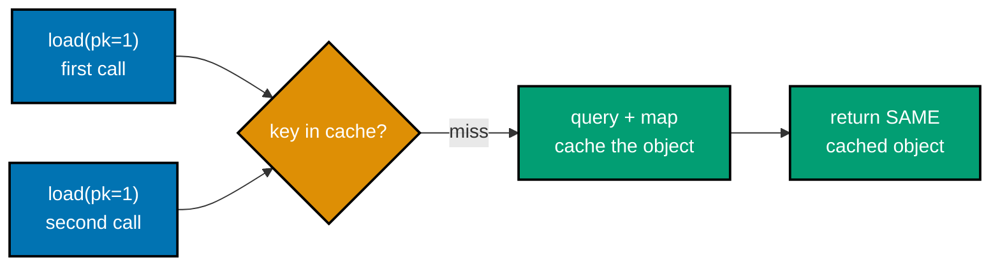
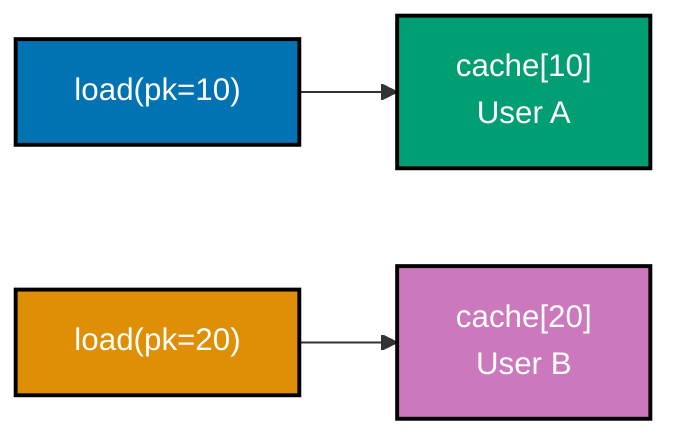
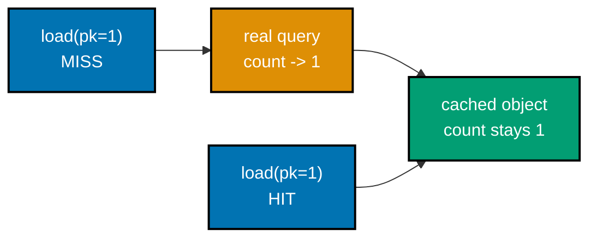
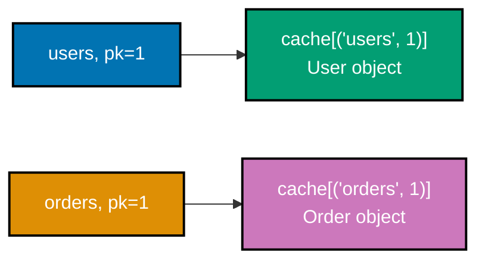
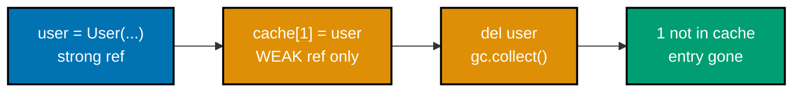
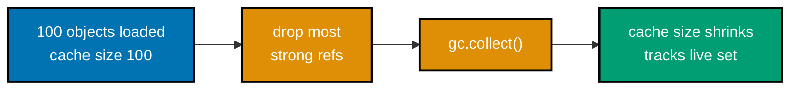
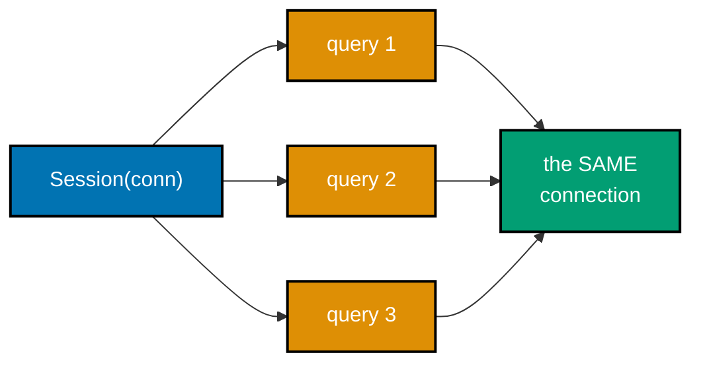
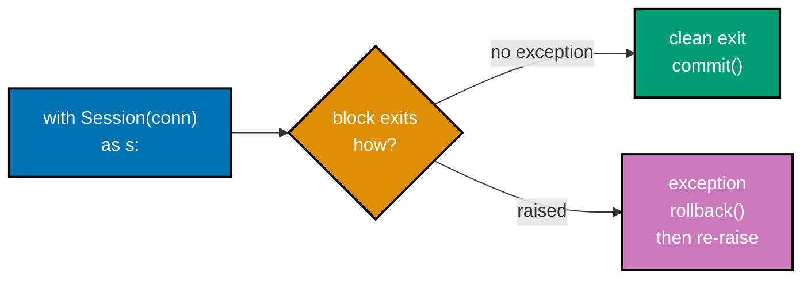
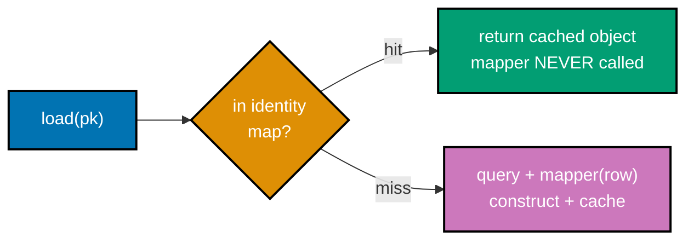
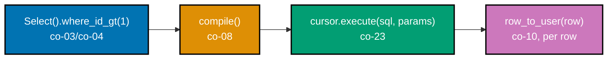

Examples 27-54 build the metadata, mapping, and session layer on top of the query builder core: a
central table/column metadata registry the builder and mapper both read from, row-to-object and
object-to-row mapping in both directions, per-column type coercion for the types SQLite has no native
storage for, an identity map that guarantees one in-memory object per primary key (weak-reference
backed, so it never leaks), and the session that owns a connection and demarcates a transaction. It
closes with a fully type-annotated `session.get[T](pk) -> T` generic API. Every example is a complete,
self-contained `example.py` colocated under `learning/code/`, verified two ways: `python3 example.py`
prints its own expected output inline via `# =>` comments and runs against a real local SQLite
`:memory:` database, and a colocated `test_example.py` asserts the same behavior under `pytest`.

---

### Example 27: Register Table Metadata

_ex-27 &middot; exercises co-09_

A central table/column metadata registry -- name, columns, primary key -- is the shared schema both
the query builder and the row mapper read from, registered once and looked up by name everywhere else.

**`learning/code/ex-27-register-table-metadata/example.py`**

```python
"""Example 27: Register Table Metadata."""  # => names the concept under test

import dataclasses  # => frozen dataclasses model immutable metadata records


@dataclasses.dataclass(frozen=True)  # => co-09: metadata is a value, registered once, read many times
class Column:  # => one column's name -- the builder and mapper both read from this
    name: str  # => the only field this minimal column record needs


@dataclasses.dataclass(frozen=True)  # => the shared schema record both builder and mapper consult
class TableMeta:  # => one table's full metadata: its columns and its primary key
    name: str  # => the table name, e.g. "users"
    columns: tuple[Column, ...]  # => ordered column list -- registration order is column order
    primary_key: str  # => the primary-key column name, read back out in Example 29


registry: dict[str, TableMeta] = {}  # => the CENTRAL registry -- one place, never duplicated per caller


def register_table(meta: TableMeta) -> None:  # => the single write path into the registry
    registry[meta.name] = meta  # => keyed by table name -- overwrites a stale re-registration


users_meta = TableMeta(  # => register "users" ONCE, with its full column list and pk
    name="users",  # => table name -- the registry key
    columns=(Column(name="id"), Column(name="name"), Column(name="email")),  # => 3 columns, in order
    primary_key="id",  # => which column is the pk -- Example 29 reads this back
)  # => TableMeta is frozen -- this literal is the ONLY way "users" metadata gets built
register_table(users_meta)  # => later readers look this up by name, not by re-declaring it

fetched = registry["users"]  # => a fresh lookup, simulating a caller elsewhere in the codebase
assert fetched is users_meta  # => the registry stores the SAME object
# => no copying happened on read -- registry[name] is a plain dict lookup, nothing more
column_names = [c.name for c in fetched.columns]  # => reads the column list back out
print(column_names)  # => Output: ['id', 'name', 'email']
```

**Run**: `python3 example.py`

**Output**:

```text
['id', 'name', 'email']
```

**`learning/code/ex-27-register-table-metadata/test_example.py`**

```python
"""Example 27: pytest verification for Register Table Metadata."""

from example import Column, TableMeta, register_table, registry


def test_registered_table_returns_its_column_list() -> None:
    # => a fresh table registered under a different name than the module-level example
    meta = TableMeta(name="orders", columns=(Column(name="id"), Column(name="total")), primary_key="id")
    register_table(meta)  # => writes into the SAME shared registry dict
    assert [c.name for c in registry["orders"].columns] == ["id", "total"]  # => order preserved


def test_registering_same_name_twice_overwrites() -> None:
    first = TableMeta(name="tags", columns=(Column(name="id"),), primary_key="id")
    second = TableMeta(name="tags", columns=(Column(name="id"), Column(name="label")), primary_key="id")
    register_table(first)  # => first registration
    register_table(second)  # => re-registration under the same name
    assert registry["tags"] is second  # => the registry holds the LATEST registration, not the first


# => Run: pytest -- Output: 2 passed
```

**Verify**: `pytest -q`

**Output**:

```text
2 passed
```

**Key takeaway**: A table's columns and primary key are declared exactly once, in one registry entry --
every later reader looks it up by name instead of re-declaring the schema.

**Why it matters**: Without a shared registry, the builder's idea of a table's columns and the mapper's
idea of the same table's columns can drift apart silently -- a renamed column updated in one place and
not the other becomes a runtime `KeyError` far from its actual cause. One registry means one place to
update, and every consumer stays in sync automatically.

---

### Example 28: Metadata Drives a SELECT's Column List

_ex-28 &middot; exercises co-09, co-04_

A `SELECT *`-equivalent column list is built directly from registered metadata rather than hand-typed,
so the column order in the compiled SQL always matches registration order, never an independent guess.

**`learning/code/ex-28-metadata-drives-select/example.py`**

```python
"""Example 28: Metadata Drives a SELECT's Column List."""  # => this concept

import contextlib  # => guarantees Connection.close() even if the block below raises
import dataclasses  # => frozen dataclasses model immutable metadata records
import sqlite3  # => the stdlib DB-API driver this entire topic sits on (PEP 249)


@dataclasses.dataclass(frozen=True)  # => co-09: a single registered column
class Column:  # => holds just a name -- enough to drive a SELECT's column list
    name: str  # => the column's name, in registration order


@dataclasses.dataclass(frozen=True)  # => co-09: the shared metadata record
class TableMeta:  # => a table's registered columns, nothing else needed here
    name: str  # => the table name
    columns: tuple[Column, ...]  # => ordered columns -- registration order, never re-sorted


def select_all_columns(meta: TableMeta) -> str:  # => co-04: builds SELECT from metadata, not a hand-typed list
    col_list = ", ".join(c.name for c in meta.columns)  # => joins in REGISTRATION order
    return f"SELECT {col_list} FROM {meta.name}"  # => co-09: metadata is the ONE source of truth here


users_meta = TableMeta(  # => registered once, columns declared in a deliberate order
    name="users",  # => table name
    columns=(Column(name="id"), Column(name="name"), Column(name="email")),  # => id, name, email -- in order
)  # => nothing about this metadata mentions SQL text yet
sql = select_all_columns(users_meta)  # => the ONLY place metadata turns into SQL text
assert sql == "SELECT id, name, email FROM users"  # => order matches registration exactly

with contextlib.closing(sqlite3.connect(":memory:")) as conn:  # => real local SQLite db
    conn.execute("CREATE TABLE users(id INTEGER PRIMARY KEY, name TEXT, email TEXT)")  # => real table
    conn.execute("INSERT INTO users(id, name, email) VALUES (1, 'Alice', 'alice@example.com')")  # => one row
    conn.commit()  # => makes the seed row visible
    row = conn.execute(sql).fetchone()  # => runs the metadata-derived SELECT for real
    print(row)  # => Output: (1, 'Alice', 'alice@example.com')
```

**Run**: `python3 example.py`

**Output**:

```text
(1, 'Alice', 'alice@example.com')
```

**`learning/code/ex-28-metadata-drives-select/test_example.py`**

```python
"""Example 28: pytest verification for Metadata-Driven SELECT."""

from example import Column, TableMeta, select_all_columns


def test_column_order_matches_registration_order() -> None:
    # => columns registered in a deliberately unusual order (not alphabetical)
    meta = TableMeta(name="orders", columns=(Column(name="total"), Column(name="id"), Column(name="status")))
    sql = select_all_columns(meta)  # => must preserve that exact order
    assert sql == "SELECT total, id, status FROM orders"  # => registration order, not alphabetical


def test_single_column_table() -> None:
    meta = TableMeta(name="flags", columns=(Column(name="enabled"),))  # => a one-column edge case
    assert select_all_columns(meta) == "SELECT enabled FROM flags"  # => no trailing comma, no join artifact


# => Run: pytest -- Output: 2 passed
```

**Verify**: `pytest -q`

**Output**:

```text
2 passed
```

**Key takeaway**: `SELECT`'s column list is derived from metadata, not duplicated as a separate
hand-typed list -- the two can never silently disagree.

**Why it matters**: A hand-typed column list next to a separately-maintained metadata registry is
exactly the kind of duplication that drifts: add a column to the registry and forget to add it to the
SELECT (or vice versa) and the mismatch surfaces far from where it was introduced. Deriving the column
list from metadata removes the duplication entirely.

---

### Example 29: Read a Table's Primary Key From Metadata

_ex-29 &middot; exercises co-09_

The mapper needs to know which column is the primary key without guessing from column position --
metadata carries that fact explicitly, so a table whose pk isn't its first column still works correctly.

**`learning/code/ex-29-primary-key-from-metadata/example.py`**

```python
"""Example 29: Read a Table's Primary Key From Metadata."""  # => this concept

import dataclasses  # => frozen dataclasses model immutable metadata records


@dataclasses.dataclass(frozen=True)  # => co-09: one registered table's metadata
class TableMeta:  # => holds columns AND which one is the primary key
    name: str  # => the table name
    columns: tuple[str, ...]  # => ordered column names
    primary_key: str  # => the pk column name -- a plain str, not re-derived by convention


def primary_key_of(meta: TableMeta) -> str:  # => co-09: the mapper reads THIS, never guesses "id"
    return meta.primary_key  # => a direct field read -- no "assume the first column" convention


orders_meta = TableMeta(  # => a table whose pk is NOT its first column, on purpose
    name="orders",  # => table name
    columns=("total", "customer_id", "id"),  # => "id" is registered LAST here
    primary_key="id",  # => explicit -- the mapper never has to guess from column position
)  # => the closing brace of a frozen, fully-specified metadata literal
pk = primary_key_of(orders_meta)  # => reads the pk back out, explicitly
assert pk == "id"  # => correct even though "id" is not columns[0]
assert orders_meta.columns.index(pk) == 2  # => proves position was NOT used to find the pk
print(pk)  # => Output: id
```

**Run**: `python3 example.py`

**Output**:

```text
id
```

**`learning/code/ex-29-primary-key-from-metadata/test_example.py`**

```python
"""Example 29: pytest verification for Primary Key From Metadata."""

from example import TableMeta, primary_key_of


def test_primary_key_read_explicitly_not_by_position() -> None:
    # => pk is registered FIRST here -- the opposite arrangement of the module example
    meta = TableMeta(name="tags", columns=("id", "label"), primary_key="id")
    assert primary_key_of(meta) == "id"  # => still correct regardless of column position


def test_two_tables_can_have_different_primary_keys() -> None:
    a = TableMeta(name="users", columns=("id", "email"), primary_key="id")
    b = TableMeta(name="settings", columns=("user_id", "key"), primary_key="user_id")
    assert primary_key_of(a) != primary_key_of(b)  # => each table's pk is independent metadata


# => Run: pytest -- Output: 2 passed
```

**Verify**: `pytest -q`

**Output**:

```text
2 passed
```

**Key takeaway**: The primary key is an explicit metadata field, read directly -- never inferred from
column position, so reordering a table's columns can never silently break pk lookups.

**Why it matters**: "Assume the pk is the first column" is a convention that works until the first table
that violates it, and then it fails silently and confusingly -- the mapper reads the wrong column as the
identifier and nothing raises an error to say so. An explicit `primary_key` field removes the convention
entirely -- there is nothing to violate, because the mapper never has to guess a table's shape from a
positional assumption in the first place.

---

### Example 30: Map a Result Tuple to a Typed Object

_ex-30 &middot; exercises co-10_

A mapper turns a driver result tuple into a typed domain object by assigning each column's value to the
matching attribute, in column order -- the step that turns "a database row" into "a real Python object."

**`learning/code/ex-30-row-tuple-to-object/example.py`**

```python
"""Example 30: Map a Result Tuple to a Typed Object."""  # => this concept

import contextlib  # => guarantees Connection.close() even if the block below raises
import dataclasses  # => the mapper's TARGET is a plain dataclass, not a dict
import sqlite3  # => the stdlib DB-API driver this entire topic sits on (PEP 249)


@dataclasses.dataclass  # => mutable is fine here -- a loaded domain object, not a builder node
class User:  # => the typed domain object rows get mapped INTO
    id: int  # => column 0 of the row tuple
    name: str  # => column 1 of the row tuple
    email: str  # => column 2 of the row tuple


def row_to_user(row: tuple[int, str, str]) -> User:  # => co-10: tuple in, typed object out
    return User(id=row[0], name=row[1], email=row[2])  # => assignment BY COLUMN ORDER, explicitly


with contextlib.closing(sqlite3.connect(":memory:")) as conn:  # => real local SQLite db
    conn.execute("CREATE TABLE users(id INTEGER PRIMARY KEY, name TEXT, email TEXT)")  # => real table
    conn.execute("INSERT INTO users(id, name, email) VALUES (1, 'Alice', 'alice@example.com')")  # => one row
    conn.commit()  # => makes the seed row visible
    raw_row = conn.execute("SELECT id, name, email FROM users").fetchone()  # => a plain tuple from the driver
    assert raw_row == (1, "Alice", "alice@example.com")  # => confirms the driver's raw shape
    user = row_to_user(raw_row)  # => THIS is the mapping step -- tuple becomes a User
    assert isinstance(user, User)  # => a real typed object now, not a tuple
    print(user)  # => Output: User(id=1, name='Alice', email='alice@example.com')
```

**Run**: `python3 example.py`

**Output**:

```text
User(id=1, name='Alice', email='alice@example.com')
```

**`learning/code/ex-30-row-tuple-to-object/test_example.py`**

```python
"""Example 30: pytest verification for Row Tuple to Object."""

from example import User, row_to_user


def test_tuple_columns_map_to_matching_attributes() -> None:
    user = row_to_user((7, "Grace", "grace@example.com"))  # => a fresh tuple, not from a live db
    assert (user.id, user.name, user.email) == (7, "Grace", "grace@example.com")  # => order preserved


def test_result_is_a_real_user_instance() -> None:
    user = row_to_user((1, "Alice", "alice@example.com"))
    assert isinstance(user, User)  # => not a tuple, not a dict -- a real typed object


# => Run: pytest -- Output: 2 passed
```

**Verify**: `pytest -q`

**Output**:

```text
2 passed
```

**Key takeaway**: A row-to-object mapper is a single, small, reusable function -- tuple in, typed object
out, by column position -- that every caller shares instead of re-deriving the mapping by hand.

**Why it matters**: Without a mapper, every caller that reads a row has to remember column order and
re-derive the mapping every time -- a fragile, easy-to-desync duplication that grows worse as more
callers accumulate across a codebase. Centralizing it in one function means a schema change (a reordered
or renamed column) is fixed in exactly one place, instead of hunting down every ad hoc `row[0]`,
`row[1]` access scattered across the application.

---

### Example 31: Map a Dict Row to a Typed Object by Column Name

_ex-31 &middot; exercises co-10_

When rows come back as dicts (via a custom `row_factory`) instead of tuples, mapping is by column name
rather than position -- so the SELECT's column order in the query text no longer matters at all.

**`learning/code/ex-31-row-dict-to-object/example.py`**

```python
"""Example 31: Map a Dict Row to a Typed Object by Column Name."""  # => this concept

import contextlib  # => guarantees Connection.close() even if the block below raises
import dataclasses  # => the mapper's target is still a plain dataclass
import sqlite3  # => the stdlib DB-API driver this entire topic sits on (PEP 249)
from typing import Any  # => a driver-produced dict row's values are dynamically typed


@dataclasses.dataclass  # => mutable, a loaded domain object
class User:  # => the typed domain object rows get mapped INTO
    id: int  # => must come from the "id" key, not position 0
    name: str  # => must come from the "name" key
    email: str  # => must come from the "email" key


def row_to_user(row: dict[str, Any]) -> User:  # => co-10: dict in, typed object out, BY NAME
    return User(id=row["id"], name=row["name"], email=row["email"])  # => key lookups, not positions


def dict_row_factory(cursor: sqlite3.Cursor, row: tuple[Any, ...]) -> dict[str, Any]:  # => turns tuples to dicts
    columns = [d[0] for d in cursor.description]  # => cursor.description names each column, in order
    return dict(zip(columns, row, strict=True))  # => zips column names to this row's values


with contextlib.closing(sqlite3.connect(":memory:")) as conn:  # => real local SQLite db
    conn.row_factory = dict_row_factory  # => every fetch below now returns a dict, not a tuple
    conn.execute("CREATE TABLE users(id INTEGER PRIMARY KEY, name TEXT, email TEXT)")  # => real table
    conn.execute("INSERT INTO users(id, name, email) VALUES (1, 'Alice', 'alice@example.com')")  # => one row
    conn.commit()  # => makes the seed row visible
    dict_row = conn.execute("SELECT email, id, name FROM users").fetchone()  # => columns SELECTED out of order
    assert dict_row == {"email": "alice@example.com", "id": 1, "name": "Alice"}  # => a real dict, not a tuple
    user = row_to_user(dict_row)  # => mapping is BY KEY, so column order in the SELECT never matters
    print(user)  # => Output: User(id=1, name='Alice', email='alice@example.com')
```

**Run**: `python3 example.py`

**Output**:

```text
User(id=1, name='Alice', email='alice@example.com')
```

**`learning/code/ex-31-row-dict-to-object/test_example.py`**

```python
"""Example 31: pytest verification for Row Dict to Object."""

from example import User, row_to_user


def test_dict_keys_map_to_matching_attributes_regardless_of_order() -> None:
    # => keys deliberately out of "id, name, email" order in the dict literal
    row = {"name": "Grace", "email": "grace@example.com", "id": 7}
    user = row_to_user(row)  # => mapping reads by key, so dict insertion order is irrelevant
    assert isinstance(user, User)  # => a real typed User instance, not the raw dict
    assert (user.id, user.name, user.email) == (7, "Grace", "grace@example.com")  # => correct regardless


def test_missing_key_raises_key_error() -> None:
    incomplete_row = {"id": 1, "name": "Alice"}  # => "email" key deliberately missing
    try:
        row_to_user(incomplete_row)  # => must fail loudly, never silently default the field
        assert False, "expected KeyError"  # => this line must never execute
    except KeyError as exc:
        assert exc.args[0] == "email"  # => the missing key is named in the error


# => Run: pytest -- Output: 2 passed
```

**Verify**: `pytest -q`

**Output**:

```text
2 passed
```

**Key takeaway**: Mapping by column name (not position) makes a mapper resilient to the SELECT's column
order -- `SELECT email, id, name` and `SELECT id, name, email` map to the identical object.

**Why it matters**: Tuple-position mapping (Example 30) silently breaks the moment a query's column list
is reordered -- a refactor that reorders a SELECT's columns with no other visible symptom until a field
gets swapped, and the resulting bug (a user's email landing in the name field, say) is a data-corrupting
kind of silent failure. Name-based mapping removes that entire failure mode, because the mapping no
longer depends on the SELECT's column order matching the object's field order.

---

### Example 32: Map a fetchall() Result to a List of Objects

_ex-32 &middot; exercises co-10_

Mapping a whole result set reuses the single-row mapper for every row, so the count and per-row field
values of the mapped list always match the underlying query result exactly.

**`learning/code/ex-32-map-multiple-rows/example.py`**

```python
"""Example 32: Map a fetchall() Result to a List of Objects."""  # => this concept

import contextlib  # => guarantees Connection.close() even if the block below raises
import dataclasses  # => the mapper's target is a plain dataclass
import sqlite3  # => the stdlib DB-API driver this entire topic sits on (PEP 249)


@dataclasses.dataclass  # => a loaded domain object, one per row
class User:  # => the typed object every row gets mapped into
    id: int  # => column 0
    name: str  # => column 1


def row_to_user(row: tuple[int, str]) -> User:  # => co-10: maps ONE row, reused per row below
    return User(id=row[0], name=row[1])  # => assignment by column order


def rows_to_users(rows: list[tuple[int, str]]) -> list[User]:  # => co-10: maps a WHOLE result set
    return [row_to_user(row) for row in rows]  # => reuses the single-row mapper for every row


with contextlib.closing(sqlite3.connect(":memory:")) as conn:  # => real local SQLite db
    conn.execute("CREATE TABLE users(id INTEGER PRIMARY KEY, name TEXT)")  # => real table
    conn.executemany(  # => seeds THREE rows in one call
        "INSERT INTO users(id, name) VALUES (?, ?)",  # => co-02: still parameterized, per row
        [(1, "Alice"), (2, "Bob"), (3, "Carol")],  # => three seed rows, in this exact order
    )  # => executemany() applies the same parameterized statement to each tuple in the list
    conn.commit()  # => makes all three seed rows visible
    raw_rows = conn.execute("SELECT id, name FROM users ORDER BY id").fetchall()  # => list[tuple] from the driver
    users = rows_to_users(raw_rows)  # => THIS is the mapping step -- 3 tuples become 3 Users
    assert len(users) == 3  # => count preserved -- no row silently dropped
    print([u.name for u in users])  # => Output: ['Alice', 'Bob', 'Carol']
```

**Run**: `python3 example.py`

**Output**:

```text
['Alice', 'Bob', 'Carol']
```

**`learning/code/ex-32-map-multiple-rows/test_example.py`**

```python
"""Example 32: pytest verification for Mapping Multiple Rows."""

from example import User, rows_to_users


def test_row_count_is_preserved() -> None:
    rows = [(1, "A"), (2, "B"), (3, "C"), (4, "D")]  # => four rows, none should be lost
    users = rows_to_users(rows)  # => maps all four in one call
    assert len(users) == 4  # => exact count preserved


def test_field_values_match_each_row_in_order() -> None:
    rows = [(10, "Xu"), (20, "Yara")]
    users = rows_to_users(rows)
    assert users[0] == User(id=10, name="Xu")  # => dataclass equality compares field values
    assert users[1] == User(id=20, name="Yara")  # => order preserved between input and output lists


# => Run: pytest -- Output: 2 passed
```

**Verify**: `pytest -q`

**Output**:

```text
2 passed
```

**Key takeaway**: Mapping a result set is just the single-row mapper applied per row -- no separate
"bulk" mapping logic to keep in sync with the single-row case.

**Why it matters**: A separate bulk-mapping code path that duplicates the single-row mapping logic is a
second place a schema change has to be applied, and the two implementations inevitably drift apart the
first time only one of them gets updated. Reusing the single-row mapper for every row in a comprehension
keeps there being exactly one mapping implementation, no matter how many rows come back -- one row or
ten thousand rows exercise the identical code path.

---

### Example 33: Read an Object's Attributes Into an INSERT-Ready Dict

_ex-33 &middot; exercises co-11_

The inverse mapping reads a domain object's attributes back into a column-to-value dict, ready for an
INSERT's parameter list -- co-10 run backwards: object in, row-shaped data out.

**`learning/code/ex-33-object-to-insert-values/example.py`**

```python
"""Example 33: Read an Object's Attributes Into an INSERT-Ready Dict."""  # => this concept

import contextlib  # => guarantees Connection.close() even if the block below raises
import dataclasses  # => the domain object being mapped back into row shape
import sqlite3  # => the stdlib DB-API driver this entire topic sits on (PEP 249)
from typing import Any  # => a column-to-value dict holds mixed value types


@dataclasses.dataclass  # => a loaded (or freshly-built) domain object
class User:  # => the typed object whose attrs become INSERT values
    id: int  # => maps to the "id" column
    name: str  # => maps to the "name" column
    email: str  # => maps to the "email" column


def user_to_insert_values(user: User) -> dict[str, Any]:  # => co-11: object in, row-shaped dict out
    return dataclasses.asdict(user)  # => reads EVERY field back into a column-name-keyed dict


user = User(id=1, name="Alice", email="alice@example.com")  # => a fresh object, not yet in the db
values = user_to_insert_values(user)  # => the inverse of Example 30's tuple-to-object mapping
assert values == {"id": 1, "name": "Alice", "email": "alice@example.com"}  # => matches every column

with contextlib.closing(sqlite3.connect(":memory:")) as conn:  # => real local SQLite db
    conn.execute("CREATE TABLE users(id INTEGER PRIMARY KEY, name TEXT, email TEXT)")  # => real table
    cols = ", ".join(values.keys())  # => "id, name, email" -- built from the dict's own keys
    placeholders = ", ".join("?" for _ in values)  # => one "?" per value -- co-02: never interpolated
    conn.execute(f"INSERT INTO users({cols}) VALUES ({placeholders})", list(values.values()))  # => runs it
    conn.commit()  # => makes the inserted row visible
    row = conn.execute("SELECT id, name, email FROM users").fetchone()  # => reads it back to prove it landed
    print(row)  # => Output: (1, 'Alice', 'alice@example.com')
```

**Run**: `python3 example.py`

**Output**:

```text
(1, 'Alice', 'alice@example.com')
```

**`learning/code/ex-33-object-to-insert-values/test_example.py`**

```python
"""Example 33: pytest verification for Object to INSERT Values."""

from example import User, user_to_insert_values


def test_dict_has_exactly_the_objects_columns() -> None:
    user = User(id=9, name="Grace", email="grace@example.com")  # => a fresh object
    values = user_to_insert_values(user)  # => maps it to a column-to-value dict
    assert set(values.keys()) == {"id", "name", "email"}  # => matches the dataclass's own field set


def test_dict_values_match_the_objects_current_attributes() -> None:
    user = User(id=2, name="Bob", email="bob@example.com")
    values = user_to_insert_values(user)
    assert values["name"] == "Bob"  # => value read straight from the object, not from a stale copy
    assert values["id"] == 2  # => including the pk, ready for an INSERT (unlike Example 34's UPDATE dict)


# => Run: pytest -- Output: 2 passed
```

**Verify**: `pytest -q`

**Output**:

```text
2 passed
```

**Key takeaway**: `dataclasses.asdict()` is the entire object-to-row mapping for a plain domain object --
every field, keyed by its own name, ready for an INSERT's column list and parameter list alike.

**Why it matters**: Symmetry between the row-to-object mapper (co-10) and the object-to-row mapper
(co-11) is what makes a full read-modify-write round trip trustworthy -- Example 35 proves this pair
composes without losing data. Without that symmetry, a field could silently vanish crossing one
direction and never the other, and the mismatch would only surface once real data made the round trip --
exactly the kind of bug that a quick manual test of either direction alone would miss entirely.

---

### Example 34: Build an UPDATE SET Dict From an Object, Excluding the PK

_ex-34 &middot; exercises co-11_

An UPDATE's SET dict is derived from an object's attributes minus its primary key -- the pk identifies
_which_ row to update (in the WHERE clause) and must never appear on the SET side.

**`learning/code/ex-34-object-to-update-set/example.py`**

```python
"""Example 34: Build an UPDATE SET Dict From an Object, Excluding the PK."""  # => this concept

import contextlib  # => guarantees Connection.close() even if the block below raises
import dataclasses  # => the domain object being mapped back into row shape
import sqlite3  # => the stdlib DB-API driver this entire topic sits on (PEP 249)
from typing import Any  # => a column-to-value dict holds mixed value types


@dataclasses.dataclass  # => a loaded domain object with a changed non-pk field
class User:  # => the typed object whose non-pk attrs become UPDATE SET values
    id: int  # => the PRIMARY KEY -- never belongs in a SET clause
    name: str  # => an ordinary, updatable column
    email: str  # => an ordinary, updatable column


def user_to_update_set(user: User, primary_key: str = "id") -> dict[str, Any]:  # => co-11, PK-aware
    all_values = dataclasses.asdict(user)  # => every field, pk included
    return {col: val for col, val in all_values.items() if col != primary_key}  # => drop ONLY the pk


user = User(id=7, name="Grace", email="grace-new@example.com")  # => an object with a changed email
set_values = user_to_update_set(user)  # => co-11: the SET dict for an UPDATE ... WHERE id = 7
assert set_values == {"name": "Grace", "email": "grace-new@example.com"}  # => "id" is NOT present
assert "id" not in set_values  # => explicit: the pk never appears on the SET side of an UPDATE

with contextlib.closing(sqlite3.connect(":memory:")) as conn:  # => real local SQLite db
    conn.execute("CREATE TABLE users(id INTEGER PRIMARY KEY, name TEXT, email TEXT)")  # => real table
    conn.execute("INSERT INTO users VALUES (7, 'Grace', 'grace@example.com')")  # => the row BEFORE update
    conn.commit()  # => makes the seed row visible
    set_clause = ", ".join(f"{col} = ?" for col in set_values)  # => "name = ?, email = ?"
    sql = f"UPDATE users SET {set_clause} WHERE id = ?"  # => WHERE targets the pk directly, by value
    conn.execute(sql, [*set_values.values(), user.id])  # => co-02: params, never interpolated
    conn.commit()  # => makes the update visible
    row = conn.execute("SELECT id, name, email FROM users WHERE id = 7").fetchone()  # => reads it back
    print(row)  # => Output: (7, 'Grace', 'grace-new@example.com')
```

**Run**: `python3 example.py`

**Output**:

```text
(7, 'Grace', 'grace-new@example.com')
```

**`learning/code/ex-34-object-to-update-set/test_example.py`**

```python
"""Example 34: pytest verification for Object to UPDATE SET Dict."""

from example import User, user_to_update_set


def test_primary_key_column_never_appears_in_set_dict() -> None:
    user = User(id=3, name="Xu", email="xu@example.com")  # => a fresh object
    set_values = user_to_update_set(user)  # => derives the SET dict
    assert "id" not in set_values  # => the one invariant this function guarantees


def test_set_dict_contains_every_other_column() -> None:
    user = User(id=1, name="Alice", email="alice@example.com")
    set_values = user_to_update_set(user)
    assert set_values == {"name": "Alice", "email": "alice@example.com"}  # => everything except the pk


# => Run: pytest -- Output: 2 passed
```

**Verify**: `pytest -q`

**Output**:

```text
2 passed
```

**Key takeaway**: An UPDATE's SET dict is the object-to-row mapping with exactly one column removed --
the primary key, which belongs in WHERE, never in SET.

**Why it matters**: Accidentally including the pk in a SET clause is usually harmless (`SET id = id`)
but is exactly the kind of accident that becomes a real bug the moment someone builds an UPDATE that
changes a different row's pk by mistake. Excluding it structurally, in the mapping function itself,
removes the possibility entirely.

---

### Example 35: Round-Trip an Object Through a Row and Back

_ex-35 &middot; exercises co-10, co-11_

Object to row to object, through a real INSERT and a real SELECT, proves co-10 and co-11 compose
without losing data -- the reloaded object equals the original, field for field.

**`learning/code/ex-35-roundtrip-object-row-object/example.py`**

```python
"""Example 35: Round-Trip an Object Through a Row and Back."""  # => this concept

import contextlib  # => guarantees Connection.close() even if the block below raises
import dataclasses  # => the round-tripped domain object
import sqlite3  # => the stdlib DB-API driver this entire topic sits on (PEP 249)


@dataclasses.dataclass  # => equality compares field values -- exactly what "equals original" needs
class User:  # => the type flowing through object -> row -> object
    id: int  # => column 0
    name: str  # => column 1
    email: str  # => column 2


def user_to_row(user: User) -> tuple[int, str, str]:  # => co-11: object -> row (the forward mapping)
    return (user.id, user.name, user.email)  # => a plain tuple, column order matches the schema


def row_to_user(row: tuple[int, str, str]) -> User:  # => co-10: row -> object (the inverse mapping)
    return User(id=row[0], name=row[1], email=row[2])  # => symmetric with user_to_row's column order


original = User(id=1, name="Alice", email="alice@example.com")  # => the STARTING object

with contextlib.closing(sqlite3.connect(":memory:")) as conn:  # => real local SQLite db
    conn.execute("CREATE TABLE users(id INTEGER PRIMARY KEY, name TEXT, email TEXT)")  # => real table
    conn.execute("INSERT INTO users VALUES (?, ?, ?)", user_to_row(original))  # => object -> row -> INSERT
    conn.commit()  # => makes the round-tripped row visible
    raw_row = conn.execute("SELECT id, name, email FROM users").fetchone()  # => a REAL row from the db
    reloaded = row_to_user(raw_row)  # => row -> object, completing the round trip
    assert reloaded == original  # => co-10 + co-11 together: the loop closes with no data lost
    print(reloaded == original)  # => Output: True
```

**Run**: `python3 example.py`

**Output**:

```text
True
```

**`learning/code/ex-35-roundtrip-object-row-object/test_example.py`**

```python
"""Example 35: pytest verification for Object-Row-Object Round Trip."""

from example import User, row_to_user, user_to_row


def test_object_to_row_to_object_equals_original() -> None:
    original = User(id=42, name="Grace", email="grace@example.com")  # => the starting object
    row = user_to_row(original)  # => object -> row
    reloaded = row_to_user(row)  # => row -> object
    assert reloaded == original  # => no field drifted across the round trip
    assert reloaded is not original  # => equal VALUE, but a genuinely distinct object instance


def test_row_shape_matches_the_schema_column_order() -> None:
    user = User(id=1, name="Bob", email="bob@example.com")
    row = user_to_row(user)
    assert row == (1, "Bob", "bob@example.com")  # => (id, name, email), matching CREATE TABLE order


# => Run: pytest -- Output: 2 passed
```

**Verify**: `pytest -q`

**Output**:

```text
2 passed
```

**Key takeaway**: `reloaded is not original` but `reloaded == original` -- a fresh instance, equal in
value, is exactly what a correct round trip through a real database should produce.

**Why it matters**: This is the composability guarantee co-10 and co-11 exist to provide: any caller
that loads an object, mutates it, and writes it back can trust that nothing besides the mutated fields
changes across the trip, because the same two small, symmetric functions handle every crossing of the
object/row boundary. A mapper pair that only worked in one direction, or lost precision on one leg of
the trip, would make every read-modify-write operation in the rest of this topic suspect.

---

### Example 36: Coerce a Driver 0/1 Integer to a Python bool on Load

_ex-36 &middot; exercises co-12_

SQLite has no native boolean storage type -- a "boolean" column is really an `INTEGER` storing `0` or
`1`, and a coercion step turns that raw integer into a real Python `bool` on load.

**`learning/code/ex-36-type-coerce-bool-on-load/example.py`**

```python
"""Example 36: Coerce a Driver 0/1 Integer to a Python bool on Load."""  # => this concept

import contextlib  # => guarantees Connection.close() even if the block below raises
import sqlite3  # => the stdlib DB-API driver this entire topic sits on (PEP 249)


def coerce_bool_on_load(raw: int) -> bool:  # => co-12: SQLite has NO native boolean type
    return raw != 0  # => the driver hands back a plain int -- 0 or 1 -- never a real bool


with contextlib.closing(sqlite3.connect(":memory:")) as conn:  # => real local SQLite db
    conn.execute("CREATE TABLE users(id INTEGER PRIMARY KEY, is_active INTEGER)")  # => INTEGER, not BOOLEAN
    conn.execute("INSERT INTO users VALUES (1, 1), (2, 0)")  # => stored as raw 1 and 0
    conn.commit()  # => makes both seed rows visible
    raw_active = conn.execute("SELECT is_active FROM users WHERE id = 1").fetchone()[0]  # => the RAW driver value
    raw_inactive = conn.execute("SELECT is_active FROM users WHERE id = 2").fetchone()[0]  # => also raw
    assert isinstance(raw_active, int) and not isinstance(raw_active, bool)  # => confirms it's a plain int
    coerced_active = coerce_bool_on_load(raw_active)  # => THIS is the coercion step
    coerced_inactive = coerce_bool_on_load(raw_inactive)  # => coerces the second row too
    assert coerced_active is True  # => a REAL Python bool now, not an int that happens to equal 1
    assert coerced_inactive is False  # => and a real False for the 0 row
    print(coerced_active, coerced_inactive)  # => Output: True False
```

**Run**: `python3 example.py`

**Output**:

```text
True False
```

**`learning/code/ex-36-type-coerce-bool-on-load/test_example.py`**

```python
"""Example 36: pytest verification for Bool Coercion on Load."""

from example import coerce_bool_on_load


def test_nonzero_int_coerces_to_true() -> None:
    assert coerce_bool_on_load(1) is True  # => the canonical "true" storage value


def test_zero_coerces_to_false() -> None:
    assert coerce_bool_on_load(0) is False  # => the canonical "false" storage value


def test_any_nonzero_int_still_coerces_to_true() -> None:
    assert coerce_bool_on_load(7) is True  # => SQLite never constrains this to exactly 0/1 -- coercion must too


# => Run: pytest -- Output: 3 passed
```

**Verify**: `pytest -q`

**Output**:

```text
3 passed
```

**Key takeaway**: `raw != 0`, not `raw == 1` -- the coercion must treat any nonzero integer as `True`,
because SQLite's `INTEGER` type never actually constrains a "boolean" column to exactly `0` or `1`.

**Why it matters**: Without a coercion step, every caller reading a "boolean" column would have to
remember it's actually an integer and compare it to `1` by hand, every single time -- an easy detail to
forget once, anywhere in a codebase, and get a subtly wrong truthiness check, since `bool(2)` is also
`True` but a hand-rolled `== 1` comparison would wrongly treat it as false. Centralizing coercion in one
function removes that whole class of mistake.

---

### Example 37: Coerce an ISO String to a date on Load

_ex-37 &middot; exercises co-12_

SQLite has no native date type either -- a date column is `TEXT` storing an ISO-8601 string, and
`date.fromisoformat()` is the coercion that turns it into a real `datetime.date` on load.

**`learning/code/ex-37-type-coerce-date-on-load/example.py`**

```python
"""Example 37: Coerce an ISO String to a date on Load."""  # => this concept

import contextlib  # => guarantees Connection.close() even if the block below raises
import datetime  # => date.fromisoformat() is the coercion target
import sqlite3  # => the stdlib DB-API driver this entire topic sits on (PEP 249)


def coerce_date_on_load(raw: str) -> datetime.date:  # => co-12: SQLite has NO native date type
    return datetime.date.fromisoformat(raw)  # => the driver hands back a plain str, e.g. "2026-01-15"


with contextlib.closing(sqlite3.connect(":memory:")) as conn:  # => real local SQLite db
    conn.execute("CREATE TABLE orders(id INTEGER PRIMARY KEY, placed_on TEXT)")  # => TEXT, not DATE
    conn.execute("INSERT INTO orders VALUES (1, '2026-01-15')")  # => stored as a plain ISO string
    conn.commit()  # => makes the seed row visible
    raw_date = conn.execute("SELECT placed_on FROM orders WHERE id = 1").fetchone()[0]  # => the RAW driver value
    assert isinstance(raw_date, str)  # => confirms it's still just text, not a date object
    coerced = coerce_date_on_load(raw_date)  # => THIS is the coercion step
    assert isinstance(coerced, datetime.date)  # => a REAL date object now
    assert coerced == datetime.date(2026, 1, 15)  # => the exact calendar date, correctly parsed
    print(coerced)  # => Output: 2026-01-15
```

**Run**: `python3 example.py`

**Output**:

```text
2026-01-15
```

**`learning/code/ex-37-type-coerce-date-on-load/test_example.py`**

```python
"""Example 37: pytest verification for Date Coercion on Load."""

import datetime

from example import coerce_date_on_load


def test_iso_string_coerces_to_date_instance() -> None:
    result = coerce_date_on_load("2026-07-04")  # => a well-formed ISO date string
    assert isinstance(result, datetime.date)  # => a real date object, not a string
    assert result == datetime.date(2026, 7, 4)  # => the exact calendar date


def test_year_month_day_fields_are_correct() -> None:
    result = coerce_date_on_load("1999-12-31")  # => an end-of-year edge case
    assert (result.year, result.month, result.day) == (1999, 12, 31)  # => every field parsed correctly


# => Run: pytest -- Output: 2 passed
```

**Verify**: `pytest -q`

**Output**:

```text
2 passed
```

**Key takeaway**: `date.fromisoformat()` is the entire coercion -- SQLite's `TEXT` storage class and
Python's ISO-8601 date format happen to agree exactly, so the conversion never needs custom parsing.

**Why it matters**: A caller comparing `placed_on < "2026-02-01"` against a raw string coerces correctly
by accident for ISO strings (lexical and calendar order agree) but only because of that coincidence --
coercing to a real `date` makes every downstream comparison and arithmetic operation actually type-safe,
and lets `pyright` catch a call site that mistakenly passes a raw string where a `date` is now required,
instead of that bug surfacing only at runtime.

---

### Example 38: Coerce bool and date Back to Driver-Native Types on Store

_ex-38 &middot; exercises co-12_

Coercion runs in both directions: before a `bool` or `date` ever reaches the driver, it's converted back
to the `INTEGER`/`TEXT` form SQLite actually stores -- the exact reverse of Examples 36 and 37.

**`learning/code/ex-38-type-coerce-on-store/example.py`**

```python
"""Example 38: Coerce bool and date Back to Driver-Native Types on Store."""  # => this concept

import contextlib  # => guarantees Connection.close() even if the block below raises
import datetime  # => date.isoformat() is the coercion target for storing
import sqlite3  # => the stdlib DB-API driver this entire topic sits on (PEP 249)


def coerce_bool_on_store(value: bool) -> int:  # => co-12: reverse of Example 36
    return 1 if value else 0  # => SQLite has no bool storage class -- store its INTEGER equivalent


def coerce_date_on_store(value: datetime.date) -> str:  # => co-12: reverse of Example 37
    return value.isoformat()  # => SQLite has no date storage class -- store its ISO TEXT equivalent


is_active = True  # => a Python bool the domain object carries
placed_on = datetime.date(2026, 3, 1)  # => a Python date the domain object carries
stored_active = coerce_bool_on_store(is_active)  # => coerced BEFORE it ever reaches the driver
stored_date = coerce_date_on_store(placed_on)  # => same coercion pattern, different type pair
assert stored_active == 1 and isinstance(stored_active, int)  # => a plain int, driver-native
assert stored_date == "2026-03-01" and isinstance(stored_date, str)  # => a plain str, driver-native

with contextlib.closing(sqlite3.connect(":memory:")) as conn:  # => real local SQLite db
    conn.execute("CREATE TABLE orders(id INTEGER PRIMARY KEY, is_active INTEGER, placed_on TEXT)")  # => real table
    conn.execute("INSERT INTO orders VALUES (?, ?, ?)", (1, stored_active, stored_date))  # => co-02: parameterized
    conn.commit()  # => makes the coerced-and-stored row visible
    row = conn.execute("SELECT is_active, placed_on FROM orders WHERE id = 1").fetchone()  # => reads it back raw
    print(row)  # => Output: (1, '2026-03-01')
```

**Run**: `python3 example.py`

**Output**:

```text
(1, '2026-03-01')
```

**`learning/code/ex-38-type-coerce-on-store/test_example.py`**

```python
"""Example 38: pytest verification for Coercion on Store."""

import datetime

from example import coerce_bool_on_store, coerce_date_on_store


def test_true_coerces_to_one() -> None:
    assert coerce_bool_on_store(True) == 1  # => driver-native int form


def test_false_coerces_to_zero() -> None:
    assert coerce_bool_on_store(False) == 0  # => driver-native int form


def test_date_coerces_to_iso_string() -> None:
    result = coerce_date_on_store(datetime.date(2026, 12, 25))  # => a fixed calendar date
    assert result == "2026-12-25"  # => driver-native TEXT form, ISO 8601


# => Run: pytest -- Output: 3 passed
```

**Verify**: `pytest -q`

**Output**:

```text
3 passed
```

**Key takeaway**: On-store coercion is the mirror image of on-load coercion -- `bool -> int` and
`date -> str`, run just before a parameter reaches `cursor.execute()`.

**Why it matters**: Passing a Python `bool` or `date` directly as a bound parameter would either fail or
(worse) silently store something other than what the caller intended, since the sqlite3 driver has no
built-in awareness of either type. Explicit store-side coercion, symmetric with load-side coercion, is
what keeps the domain object's types real on both ends of every read and write.

---

### Example 39: Register a Custom Type Converter for a JSON Column

_ex-39 &middot; exercises co-12_

A converter registry generalizes co-12 past the two built-in cases: adding a new custom type (here,
JSON) means adding one `(encode, decode)` entry, never touching the coercion functions themselves.

**`learning/code/ex-39-custom-type-converter/example.py`**

```python
"""Example 39: Register a Custom Type Converter for a JSON Column."""  # => this concept

import contextlib  # => guarantees Connection.close() even if the block below raises
import json  # => the JSON encode/decode pair backing this custom converter
import sqlite3  # => the stdlib DB-API driver this entire topic sits on (PEP 249)
from typing import Any  # => a decoded JSON value can be any JSON-representable Python type


CONVERTERS: dict[str, Any] = {  # => co-12: a per-column-type CONVERTER REGISTRY, not hardcoded logic
    "json": (json.dumps, json.loads),  # => (on_store, on_load) pair -- one entry per custom type
}  # => adding a new custom type means adding ONE entry here, never touching the coerce_* functions


def coerce_on_store(column_type: str, value: Any) -> Any:  # => looks up the registered encoder
    encode, _ = CONVERTERS[column_type]  # => picks the store-side half of the registered pair
    return encode(value)  # => runs it -- a dict becomes a JSON text string here


def coerce_on_load(column_type: str, raw: Any) -> Any:  # => looks up the registered decoder
    _, decode = CONVERTERS[column_type]  # => picks the load-side half of the registered pair
    return decode(raw)  # => runs it -- a JSON text string becomes a dict again here


settings = {"theme": "dark", "notifications": True}  # => a Python dict the app wants to persist
stored_text = coerce_on_store("json", settings)  # => encoded THROUGH the registry, not ad hoc
assert stored_text == '{"theme": "dark", "notifications": true}'  # => real JSON text, byte-for-byte

with contextlib.closing(sqlite3.connect(":memory:")) as conn:  # => real local SQLite db
    conn.execute("CREATE TABLE users(id INTEGER PRIMARY KEY, settings TEXT)")  # => TEXT column, plain
    conn.execute("INSERT INTO users VALUES (1, ?)", (stored_text,))  # => co-02: parameterized insert
    conn.commit()  # => makes the stored JSON text visible
    raw = conn.execute("SELECT settings FROM users WHERE id = 1").fetchone()[0]  # => raw driver TEXT
    reloaded = coerce_on_load("json", raw)  # => decoded THROUGH the same registry, symmetric with store
    assert reloaded == settings  # => the round trip preserves every key and value
    print(reloaded)  # => Output: {'theme': 'dark', 'notifications': True}
```

**Run**: `python3 example.py`

**Output**:

```text
{'theme': 'dark', 'notifications': True}
```

**`learning/code/ex-39-custom-type-converter/test_example.py`**

```python
"""Example 39: pytest verification for a Custom JSON Type Converter."""

from example import coerce_on_load, coerce_on_store


def test_dict_round_trips_through_json_conversion() -> None:
    original = {"a": 1, "b": [1, 2, 3]}  # => a dict with a nested list value
    stored = coerce_on_store("json", original)  # => dict -> JSON text
    reloaded = coerce_on_load("json", stored)  # => JSON text -> dict
    assert reloaded == original  # => nothing lost across the round trip


def test_stored_form_is_a_plain_string() -> None:
    stored = coerce_on_store("json", {"x": True})  # => encode a small dict
    assert isinstance(stored, str)  # => driver-native TEXT form, ready to bind as a parameter


# => Run: pytest -- Output: 2 passed
```

**Verify**: `pytest -q`

**Output**:

```text
2 passed
```

**Key takeaway**: A converter registry (one entry per column type, each a store/load pair) makes co-12
extensible -- new custom types are additive, never requiring changes to `coerce_on_store`/`coerce_on_load`
themselves.

**Why it matters**: Hardcoding `if column_type == "bool": ... elif column_type == "date": ...` grows an
ever-longer branch for every new custom type a real application needs (JSON, enums, money, UUIDs). A
registry keyed by type name turns "add a custom type" into "add one dict entry" -- open for extension,
closed for modification.

---

### Example 40: Identity Map -- Loading the Same PK Twice Returns the Same Instance

_ex-40 &middot; exercises co-13_

A per-session `{(table, pk): object}` cache guarantees exactly one in-memory object per primary key --
two loads of the same row, anywhere in the same session, return the identical instance, not two copies.



**`learning/code/ex-40-identity-map-same-instance/example.py`**

```python
"""Example 40: Identity Map -- Loading the Same PK Twice Returns the Same Instance."""  # => this concept

import contextlib  # => guarantees Connection.close() even if the block below raises
import dataclasses  # => the loaded domain object
import sqlite3  # => the stdlib DB-API driver this entire topic sits on (PEP 249)


@dataclasses.dataclass  # => a loaded domain object, cached by the identity map below
class User:  # => the type the identity map holds one instance of, per pk
    id: int  # => primary key
    name: str  # => an ordinary column


class IdentityMap:  # => co-13: a per-session {(table, pk): object} cache
    def __init__(self) -> None:  # => starts empty -- nothing cached before any load
        self._cache: dict[tuple[str, int], User] = {}  # => keyed by (table, pk), holds the SAME object

    def load(self, conn: sqlite3.Connection, pk: int) -> User:  # => co-13: cache-aware load
        key = ("users", pk)  # => co-13's key shape: table name plus pk
        if key in self._cache:  # => a CACHE HIT -- no query needed, return the SAME object
            return self._cache[key]  # => identical instance as the first load
        row = conn.execute("SELECT id, name FROM users WHERE id = ?", (pk,)).fetchone()  # => real query
        user = User(id=row[0], name=row[1])  # => maps the row (co-10)
        self._cache[key] = user  # => registers it BEFORE returning -- future loads hit this same object
        return user  # => the freshly-loaded, now-cached object


with contextlib.closing(sqlite3.connect(":memory:")) as conn:  # => real local SQLite db
    conn.execute("CREATE TABLE users(id INTEGER PRIMARY KEY, name TEXT)")  # => real table
    conn.execute("INSERT INTO users VALUES (1, 'Alice')")  # => one seed row
    conn.commit()  # => makes the seed row visible
    identity_map = IdentityMap()  # => one identity map for this "session"
    a = identity_map.load(conn, 1)  # => FIRST load of pk 1 -- a real query runs
    b = identity_map.load(conn, 1)  # => SECOND load of the SAME pk -- a cache hit, no query
    assert a is b  # => co-13's core guarantee: the identical object, not two equal copies
    print(a is b)  # => Output: True
```

**Run**: `python3 example.py`

**Output**:

```text
True
```

**`learning/code/ex-40-identity-map-same-instance/test_example.py`**

```python
"""Example 40: pytest verification for Identity Map Same-Instance Guarantee."""

import contextlib
import sqlite3

from example import IdentityMap


def test_two_loads_of_same_pk_return_identical_instance() -> None:
    with contextlib.closing(sqlite3.connect(":memory:")) as conn:
        conn.execute("CREATE TABLE users(id INTEGER PRIMARY KEY, name TEXT)")  # => real table
        conn.execute("INSERT INTO users VALUES (5, 'Grace')")  # => one seed row
        conn.commit()  # => makes the seed row visible
        identity_map = IdentityMap()  # => a fresh map for this test
        first = identity_map.load(conn, 5)  # => first load
        second = identity_map.load(conn, 5)  # => second load, same pk
        assert first is second  # => the core co-13 guarantee


def test_mutating_the_cached_instance_is_visible_on_next_load() -> None:
    with contextlib.closing(sqlite3.connect(":memory:")) as conn:
        conn.execute("CREATE TABLE users(id INTEGER PRIMARY KEY, name TEXT)")
        conn.execute("INSERT INTO users VALUES (1, 'Bob')")
        conn.commit()
        identity_map = IdentityMap()
        first = identity_map.load(conn, 1)  # => load once
        first.name = "Bobby"  # => mutate the cached instance in place
        second = identity_map.load(conn, 1)  # => load again -- must be the SAME mutated object
        assert second.name == "Bobby"  # => proves it's the same object, not a fresh reload


# => Run: pytest -- Output: 2 passed
```

**Verify**: `pytest -q`

**Output**:

```text
2 passed
```

**Key takeaway**: `a is b`, not `a == b` -- the identity map's guarantee is object identity, achieved by
caching the constructed object BEFORE returning it, so every subsequent load of the same key reuses it.

**Why it matters**: Without an identity map, loading the same row twice produces two independent Python
objects; mutating one and forgetting the other leaves the session holding two different "truths" about
the same row, with no way to tell which is stale. This guarantee is also the precondition for dirty
tracking (co-17) even being coherent -- there must be exactly one object to compare against a snapshot.

---

### Example 41: Identity Map -- Different Primary Keys Yield Distinct Instances

_ex-41 &middot; exercises co-13_

The flip side of Example 40: two DIFFERENT primary keys never share a cache slot -- each gets its own
object, holding its own row's data, with no accidental aliasing between unrelated rows.



**`learning/code/ex-41-identity-map-different-keys/example.py`**

```python
"""Example 41: Identity Map -- Different Primary Keys Yield Distinct Instances."""  # => this concept

import contextlib  # => guarantees Connection.close() even if the block below raises
import dataclasses  # => the loaded domain object
import sqlite3  # => the stdlib DB-API driver this entire topic sits on (PEP 249)


@dataclasses.dataclass  # => a loaded domain object, cached by the identity map below
class User:  # => the type the identity map holds one instance of, per pk
    id: int  # => primary key
    name: str  # => an ordinary column


class IdentityMap:  # => co-13: a per-session {(table, pk): object} cache
    def __init__(self) -> None:  # => starts empty
        self._cache: dict[tuple[str, int], User] = {}  # => keyed by (table, pk)

    def load(self, conn: sqlite3.Connection, pk: int) -> User:  # => cache-aware load
        key = ("users", pk)  # => the identity key for THIS pk
        if key in self._cache:  # => hit -- same object as before
            return self._cache[key]  # => never re-queries for an already-cached key
        row = conn.execute("SELECT id, name FROM users WHERE id = ?", (pk,)).fetchone()  # => real query
        user = User(id=row[0], name=row[1])  # => maps the row
        self._cache[key] = user  # => caches under THIS pk's own key
        return user  # => a fresh object, distinct from every other pk's cached object


with contextlib.closing(sqlite3.connect(":memory:")) as conn:  # => real local SQLite db
    conn.execute("CREATE TABLE users(id INTEGER PRIMARY KEY, name TEXT)")  # => real table
    conn.execute("INSERT INTO users VALUES (1, 'Alice'), (2, 'Bob')")  # => two distinct rows
    conn.commit()  # => makes both seed rows visible
    identity_map = IdentityMap()  # => one identity map for this "session"
    user1 = identity_map.load(conn, 1)  # => loads pk 1
    user2 = identity_map.load(conn, 2)  # => loads pk 2 -- a DIFFERENT key
    assert user1 is not user2  # => two different pks NEVER share a cache slot
    assert user1.name == "Alice" and user2.name == "Bob"  # => each object holds its OWN row's data
    print(user1 is not user2)  # => Output: True
```

**Run**: `python3 example.py`

**Output**:

```text
True
```

**`learning/code/ex-41-identity-map-different-keys/test_example.py`**

```python
"""Example 41: pytest verification for Identity Map Distinct-Keys Behavior."""

import contextlib
import sqlite3

from example import IdentityMap


def test_distinct_pks_produce_distinct_instances() -> None:
    with contextlib.closing(sqlite3.connect(":memory:")) as conn:
        conn.execute("CREATE TABLE users(id INTEGER PRIMARY KEY, name TEXT)")  # => real table
        conn.execute("INSERT INTO users VALUES (10, 'Xu'), (20, 'Yara')")  # => two seed rows
        conn.commit()  # => makes both rows visible
        identity_map = IdentityMap()  # => a fresh map
        a = identity_map.load(conn, 10)  # => loads pk 10
        b = identity_map.load(conn, 20)  # => loads pk 20
        assert a is not b  # => distinct keys, distinct objects
        assert (a.id, b.id) == (10, 20)  # => each holds its own correct data


def test_each_pk_still_caches_independently() -> None:
    with contextlib.closing(sqlite3.connect(":memory:")) as conn:
        conn.execute("CREATE TABLE users(id INTEGER PRIMARY KEY, name TEXT)")
        conn.execute("INSERT INTO users VALUES (1, 'A'), (2, 'B')")
        conn.commit()
        identity_map = IdentityMap()
        first_load_of_1 = identity_map.load(conn, 1)  # => populates pk 1's cache slot
        identity_map.load(conn, 2)  # => populates pk 2's cache slot -- must not disturb pk 1's
        second_load_of_1 = identity_map.load(conn, 1)  # => re-load pk 1
        assert first_load_of_1 is second_load_of_1  # => pk 1's identity survived pk 2's load


# => Run: pytest -- Output: 2 passed
```

**Verify**: `pytest -q`

**Output**:

```text
2 passed
```

**Key takeaway**: The identity map's cache slot is keyed by the pk value itself -- two distinct pks are
two distinct dict keys, so caching one row can never accidentally return another row's object.

**Why it matters**: A correct identity map has to be selective, not just "cache everything under one
slot" -- Example 40 proves it correctly reuses for the SAME key, and this example proves it correctly
does NOT reuse across DIFFERENT keys. Both properties together are what "identity map" actually means:
an implementation that passed only one of these two tests would either never share objects at all, or
(worse) silently return the wrong row's object for a completely different pk.

---

### Example 42: Identity Map -- a Miss Then a Hit Issues Exactly One Query

_ex-42 &middot; exercises co-13_

Instrumenting the identity map with a query counter makes the caching behavior observable, not just
inferable: a first load issues one real query, and every subsequent load of the same key issues zero.



**`learning/code/ex-42-identity-map-miss-then-hit/example.py`**

```python
"""Example 42: Identity Map -- a Miss Then a Hit Issues Exactly One Query."""  # => this concept

import contextlib  # => guarantees Connection.close() even if the block below raises
import dataclasses  # => the loaded domain object
import sqlite3  # => the stdlib DB-API driver this entire topic sits on (PEP 249)


@dataclasses.dataclass  # => a loaded domain object
class User:  # => cached by pk in the identity map below
    id: int  # => primary key
    name: str  # => an ordinary column


class IdentityMap:  # => co-13, instrumented to COUNT real queries for this example
    def __init__(self) -> None:  # => starts empty, zero queries issued so far
        self._cache: dict[tuple[str, int], User] = {}  # => keyed by (table, pk)
        self.query_count = 0  # => co-13: proves a cache HIT issues no additional query

    def load(self, conn: sqlite3.Connection, pk: int) -> User:  # => cache-aware, counted load
        key = ("users", pk)  # => this pk's identity key
        if key in self._cache:  # => a HIT -- return immediately, query_count untouched
            return self._cache[key]  # => no query below runs on this path
        self.query_count += 1  # => a MISS -- about to issue a real query, count it
        row = conn.execute("SELECT id, name FROM users WHERE id = ?", (pk,)).fetchone()  # => the real query
        user = User(id=row[0], name=row[1])  # => maps the row
        self._cache[key] = user  # => caches it so the NEXT load of this pk is a hit
        return user  # => the newly-loaded, now-counted, now-cached object


with contextlib.closing(sqlite3.connect(":memory:")) as conn:  # => real local SQLite db
    conn.execute("CREATE TABLE users(id INTEGER PRIMARY KEY, name TEXT)")  # => real table
    conn.execute("INSERT INTO users VALUES (1, 'Alice')")  # => one seed row
    conn.commit()  # => makes the seed row visible
    identity_map = IdentityMap()  # => a fresh, instrumented map
    identity_map.load(conn, 1)  # => FIRST load -- a miss, issues one real query
    assert identity_map.query_count == 1  # => confirms exactly one query so far
    identity_map.load(conn, 1)  # => SECOND load, same pk -- a hit, issues NO query
    assert identity_map.query_count == 1  # => still exactly one -- the hit added nothing
    print(identity_map.query_count)  # => Output: 1
```

**Run**: `python3 example.py`

**Output**:

```text
1
```

**`learning/code/ex-42-identity-map-miss-then-hit/test_example.py`**

```python
"""Example 42: pytest verification for Identity Map Miss-Then-Hit."""

import contextlib
import sqlite3

from example import IdentityMap


def test_first_load_counts_as_one_query() -> None:
    with contextlib.closing(sqlite3.connect(":memory:")) as conn:
        conn.execute("CREATE TABLE users(id INTEGER PRIMARY KEY, name TEXT)")  # => real table
        conn.execute("INSERT INTO users VALUES (7, 'Grace')")  # => one seed row
        conn.commit()  # => makes the seed row visible
        identity_map = IdentityMap()
        identity_map.load(conn, 7)  # => a miss -- issues one query
        assert identity_map.query_count == 1  # => exactly one


def test_repeated_loads_never_add_further_queries() -> None:
    with contextlib.closing(sqlite3.connect(":memory:")) as conn:
        conn.execute("CREATE TABLE users(id INTEGER PRIMARY KEY, name TEXT)")
        conn.execute("INSERT INTO users VALUES (1, 'A')")
        conn.commit()
        identity_map = IdentityMap()
        for _ in range(5):  # => load the SAME pk five times in a row
            identity_map.load(conn, 1)  # => only the FIRST of these is a miss
        assert identity_map.query_count == 1  # => four hits added zero additional queries


# => Run: pytest -- Output: 2 passed
```

**Verify**: `pytest -q`

**Output**:

```text
2 passed
```

**Key takeaway**: The query counter increments ONLY on the miss branch, right before the real query --
making "a hit issues no query" a directly observable, testable fact instead of an inferred property.

**Why it matters**: An identity map's whole performance benefit is fewer round trips to the database --
this example is the concrete proof of that claim, and the same instrumentation technique (a counter
incremented at the exact point a real query is issued) is exactly how Example 70 later measures the N+1.
Without a counter making the query count observable, the performance claim would rest on trusting the
implementation rather than on a test that fails loudly if caching ever regresses.

---

### Example 43: Identity Map -- Keyed by (table, pk), Never Conflated Across Tables

_ex-43 &middot; exercises co-13_

The identity map's key is `(table, pk)`, not a bare pk -- so a `users` row with pk 1 and an `orders`
row with pk 1 (the same integer, different tables) are never confused for the same cached object.



**`learning/code/ex-43-identity-map-key-shape/example.py`**

```python
"""Example 43: Identity Map -- Keyed by (table, pk), Never Conflated Across Tables."""  # => this concept

import contextlib  # => guarantees Connection.close() even if the block below raises
import dataclasses  # => the two loaded domain object types
import sqlite3  # => the stdlib DB-API driver this entire topic sits on (PEP 249)
from typing import Any  # => the cache holds objects of more than one type


@dataclasses.dataclass  # => one domain type
class User:  # => rows from "users"
    id: int  # => primary key, same VALUE space as Order.id below
    name: str  # => an ordinary column


@dataclasses.dataclass  # => a second, unrelated domain type
class Order:  # => rows from "orders" -- a DIFFERENT table, same pk VALUE
    id: int  # => primary key -- deliberately the SAME integer as a User's pk
    total: float  # => an ordinary column


class IdentityMap:  # => co-13: keyed by (table, pk), not by pk alone
    def __init__(self) -> None:  # => starts empty
        self._cache: dict[tuple[str, int], Any] = {}  # => the TABLE NAME is part of the key

    def load_user(self, conn: sqlite3.Connection, pk: int) -> User:  # => loads from "users"
        key = ("users", pk)  # => "users" is part of the key, not just the bare pk
        if key in self._cache:  # => hit
            return self._cache[key]  # => same object as any earlier load_user(pk) call
        row = conn.execute("SELECT id, name FROM users WHERE id = ?", (pk,)).fetchone()  # => real query
        user = User(id=row[0], name=row[1])  # => maps the row
        self._cache[key] = user  # => cached under ("users", pk)
        return user  # => a User, never confused with an Order at the same pk

    def load_order(self, conn: sqlite3.Connection, pk: int) -> Order:  # => loads from "orders"
        key = ("orders", pk)  # => "orders" is part of the key -- a DIFFERENT slot even if pk matches
        if key in self._cache:  # => hit
            return self._cache[key]  # => same object as any earlier load_order(pk) call
        row = conn.execute("SELECT id, total FROM orders WHERE id = ?", (pk,)).fetchone()  # => real query
        order = Order(id=row[0], total=row[1])  # => maps the row
        self._cache[key] = order  # => cached under ("orders", pk) -- NOT the same slot as ("users", pk)
        return order  # => an Order, never confused with a User at the same pk


with contextlib.closing(sqlite3.connect(":memory:")) as conn:  # => real local SQLite db
    conn.execute("CREATE TABLE users(id INTEGER PRIMARY KEY, name TEXT)")  # => first table
    conn.execute("CREATE TABLE orders(id INTEGER PRIMARY KEY, total REAL)")  # => second table
    conn.execute("INSERT INTO users VALUES (1, 'Alice')")  # => user pk=1
    conn.execute("INSERT INTO orders VALUES (1, 99.5)")  # => order pk=1 -- the SAME integer, on purpose
    conn.commit()  # => makes both seed rows visible
    identity_map = IdentityMap()  # => one shared map across BOTH tables
    user = identity_map.load_user(conn, 1)  # => loads users pk=1
    order = identity_map.load_order(conn, 1)  # => loads orders pk=1 -- same pk value, different table
    assert user is not order  # => co-13: (table, pk) keeps them from being conflated
    print(type(user).__name__, type(order).__name__)  # => Output: User Order
```

**Run**: `python3 example.py`

**Output**:

```text
User Order
```

**`learning/code/ex-43-identity-map-key-shape/test_example.py`**

```python
"""Example 43: pytest verification for Identity Map Key Shape."""

import contextlib
import sqlite3

from example import IdentityMap, Order, User


def test_same_pk_value_across_two_tables_stays_distinct() -> None:
    with contextlib.closing(sqlite3.connect(":memory:")) as conn:
        conn.execute("CREATE TABLE users(id INTEGER PRIMARY KEY, name TEXT)")  # => first table
        conn.execute("CREATE TABLE orders(id INTEGER PRIMARY KEY, total REAL)")  # => second table
        conn.execute("INSERT INTO users VALUES (5, 'Bob')")  # => user pk=5
        conn.execute("INSERT INTO orders VALUES (5, 10.0)")  # => order pk=5 -- same integer
        conn.commit()  # => makes both rows visible
        identity_map = IdentityMap()
        user = identity_map.load_user(conn, 5)  # => loads users pk=5
        order = identity_map.load_order(conn, 5)  # => loads orders pk=5
        assert isinstance(user, User)  # => correctly typed as User
        assert isinstance(order, Order)  # => correctly typed as Order, not conflated with user


def test_users_identity_survives_a_same_pk_orders_load() -> None:
    with contextlib.closing(sqlite3.connect(":memory:")) as conn:
        conn.execute("CREATE TABLE users(id INTEGER PRIMARY KEY, name TEXT)")
        conn.execute("CREATE TABLE orders(id INTEGER PRIMARY KEY, total REAL)")
        conn.execute("INSERT INTO users VALUES (1, 'A')")
        conn.execute("INSERT INTO orders VALUES (1, 1.0)")
        conn.commit()
        identity_map = IdentityMap()
        first_user = identity_map.load_user(conn, 1)  # => caches ("users", 1)
        identity_map.load_order(conn, 1)  # => caches ("orders", 1) -- must not touch ("users", 1)
        second_user = identity_map.load_user(conn, 1)  # => re-load users pk=1
        assert first_user is second_user  # => users identity untouched by the orders load


# => Run: pytest -- Output: 2 passed
```

**Verify**: `pytest -q`

**Output**:

```text
2 passed
```

**Key takeaway**: `(table, pk)` is the whole key -- an integer pk is not globally unique across a
database, only unique within its own table, so the identity map's key must reflect that scoping.

**Why it matters**: A naive `{pk: object}` cache (keyed by pk alone) would silently return a `users` row
when a caller actually wanted the `orders` row with the same integer pk -- a bug that stays invisible
until two tables happen to share overlapping id ranges, which is common (autoincrementing ids starting
from 1 in every table) rather than rare.

---

### Example 44: Back the Identity Map With a WeakValueDictionary

_ex-44 &middot; exercises co-14_

Backing the identity map with `weakref.WeakValueDictionary` lets an unreferenced loaded object be
garbage-collected instead of leaking for the session's lifetime -- the cache entry disappears the moment
nothing else holds the object.



**`learning/code/ex-44-weak-value-identity-map/example.py`**

```python
"""Example 44: Back the Identity Map With a WeakValueDictionary."""  # => this concept

import dataclasses  # => the loaded domain object, held ONLY weakly by the map
import gc  # => forces a collection cycle so this example is deterministic
import weakref  # => co-14: WeakValueDictionary is the whole mechanism


@dataclasses.dataclass  # => must NOT be frozen/slotted in a way that blocks weak references
class User:  # => the type the weak identity map holds -- garbage-collectable when unreferenced
    id: int  # => primary key
    name: str  # => an ordinary column


cache: weakref.WeakValueDictionary[int, User] = weakref.WeakValueDictionary()  # => co-14: the weak map itself
user = User(id=1, name="Alice")  # => the ONLY strong reference to this object right now
cache[1] = user  # => the map holds a WEAK reference -- this line does NOT keep user alive by itself
assert 1 in cache  # => while `user` is still referenced, the entry is present
assert cache[1] is user  # => and it's the exact same object

del user  # => drops the ONLY strong reference anywhere in this program
gc.collect()  # => forces collection so the drop is deterministic in this example
assert 1 not in cache  # => co-14: the entry disappeared -- nothing kept it alive after the strong ref went
print(1 in cache)  # => Output: False
```

**Run**: `python3 example.py`

**Output**:

```text
False
```

**`learning/code/ex-44-weak-value-identity-map/test_example.py`**

```python
"""Example 44: pytest verification for a Weak-Value Identity Map."""

import gc
import weakref

from example import User


def test_entry_present_while_strong_reference_exists() -> None:
    cache: weakref.WeakValueDictionary[int, User] = weakref.WeakValueDictionary()  # => a fresh weak map
    user = User(id=9, name="Grace")  # => a strong reference held by this local variable
    cache[9] = user  # => weakly referenced by the map
    assert cache[9] is user  # => present and correct while `user` is alive


def test_entry_disappears_after_the_last_strong_reference_drops() -> None:
    cache: weakref.WeakValueDictionary[int, User] = weakref.WeakValueDictionary()
    cache[1] = User(id=1, name="Temp")  # => NO local variable holds a strong reference at all
    gc.collect()  # => forces collection so the drop is deterministic here too
    assert 1 not in cache  # => nothing kept the object alive past this statement


# => Run: pytest -- Output: 2 passed
```

**Verify**: `pytest -q`

**Output**:

```text
2 passed
```

**Key takeaway**: `WeakValueDictionary`'s entries do not count as strong references -- the cache tracks
whatever else in the program is still holding an object, and disappears in sync with the last real owner.

**Why it matters**: A session that stays open for a long time and loads many rows would otherwise
accumulate every object it ever loaded, forever, even after the caller finished with all of them -- a
slow, silent memory leak. Weak references let the identity map's cache size track the program's actual
live working set, not its full load history.

---

### Example 45: A Weak Identity Map Shrinks Under GC Instead of Leaking

_ex-45 &middot; exercises co-14_

At scale (100 loaded objects, not just one), dropping most of the strong references and collecting
proves the weak map's size tracks exactly the live set -- it shrinks, it does not merely stop growing.



**`learning/code/ex-45-weak-map-no-leak/example.py`**

```python
"""Example 45: A Weak Identity Map Shrinks Under GC Instead of Leaking."""  # => this concept

import dataclasses  # => the loaded domain objects
import gc  # => forces a collection cycle so this example is deterministic
import weakref  # => co-14: the same WeakValueDictionary mechanism as Example 44, at scale


@dataclasses.dataclass  # => a loaded domain object
class User:  # => held only weakly by the cache below
    id: int  # => primary key
    name: str  # => an ordinary column


def fill_cache(cache: weakref.WeakValueDictionary[int, User], count: int) -> list[User]:  # => co-14 helper
    users = [User(id=i, name=f"user-{i}") for i in range(count)]  # => `count` STRONG references, in a list
    for u in users:  # => `u` is LOCAL to this function -- it does not leak into the caller's scope
        cache[u.id] = u  # => each cached weakly -- the LIST is what keeps them alive, not the cache
    return users  # => the caller now holds the ONLY strong references, via this returned list


cache: weakref.WeakValueDictionary[int, User] = weakref.WeakValueDictionary()  # => co-14: the weak map
loaded_users = fill_cache(cache, 100)  # => loads 100 rows, simulating a session that touched 100 objects
assert len(cache) == 100  # => every one of the 100 objects is currently alive and cached

loaded_users = loaded_users[:10]  # => drops the STRONG references to 90 of the 100 objects
gc.collect()  # => forces collection so the shrink is deterministic in this example
assert len(cache) == 10  # => co-14: exactly the 10 still strongly-referenced objects remain cached
print(len(cache))  # => Output: 10
```

**Run**: `python3 example.py`

**Output**:

```text
10
```

**`learning/code/ex-45-weak-map-no-leak/test_example.py`**

```python
"""Example 45: pytest verification for a Weak Map Shrinking Under GC."""

import gc
import weakref

from example import User, fill_cache


def test_cache_size_matches_live_strong_references() -> None:
    cache: weakref.WeakValueDictionary[int, User] = weakref.WeakValueDictionary()  # => a fresh weak map
    live = fill_cache(cache, 20)  # => 20 strongly-referenced objects, all cached weakly
    assert len(cache) == 20  # => all 20 alive and cached
    assert len(live) == 20  # => the returned list is what's keeping them alive


def test_dropping_all_strong_references_empties_the_cache() -> None:
    cache: weakref.WeakValueDictionary[int, User] = weakref.WeakValueDictionary()  # => a fresh weak map
    live = fill_cache(cache, 5)  # => 5 strongly-referenced objects
    live: list[User] = []  # => drops every strong reference in one assignment, type kept explicit
    gc.collect()  # => deterministic collection for the test
    assert len(live) == 0  # => confirms the reassignment took effect
    assert len(cache) == 0  # => the cache tracks the live set exactly, down to zero


# => Run: pytest -- Output: 2 passed
```

**Verify**: `pytest -q`

**Output**:

```text
2 passed
```

**Key takeaway**: The identity map shrank from 100 entries to exactly 10 -- matching the live set, not
merely plateauing -- because `WeakValueDictionary` never counts its own entries as keeping anything alive.

**Why it matters**: "Doesn't grow forever" and "actually shrinks with the live set" are different
guarantees -- a cache that merely stops adding new entries once full would still leak everything already
in it. A weak-value map provides the stronger guarantee: its size is always bounded by the program's
actual current working set, automatically, with no manual eviction policy to write or tune.

---

### Example 46: The Session Owns One Connection -- Every Query Shares It

_ex-46 &middot; exercises co-15_

The session holds exactly one connection for its entire lifetime -- every query issued through the
session, no matter how many, routes through that same object, never opening a second one.



**`learning/code/ex-46-session-owns-connection/example.py`**

```python
"""Example 46: The Session Owns One Connection -- Every Query Shares It."""  # => this concept

import contextlib  # => guarantees Connection.close() even if the block below raises
import sqlite3  # => the stdlib DB-API driver this entire topic sits on (PEP 249)


class Session:  # => co-15: owns exactly ONE connection, for its entire lifetime
    def __init__(self, conn: sqlite3.Connection) -> None:  # => the connection is handed in ONCE
        self._conn = conn  # => the ONE connection this session will ever use

    @property  # => read-only on purpose -- no setter, so this connection can never be swapped after init
    def connection(self) -> sqlite3.Connection:  # => exposes it for observation, never for reassignment
        return self._conn  # => always the SAME object, every time this property is read

    def execute(self, sql: str, params: tuple[object, ...] = ()) -> sqlite3.Cursor:  # => every query goes through here
        return self._conn.execute(sql, params)  # => routes through self._conn -- never opens a second one


with contextlib.closing(sqlite3.connect(":memory:")) as conn:  # => real local SQLite db
    session = Session(conn)  # => co-15: one session, wrapping this one connection
    session.execute("CREATE TABLE users(id INTEGER PRIMARY KEY, name TEXT)")  # => query 1, through the session
    session.execute("INSERT INTO users VALUES (1, 'Alice')")  # => query 2, through the SAME session
    conn.commit()  # => makes the seed row visible
    conn_before = session.connection  # => observed BEFORE the third query
    row = session.execute("SELECT name FROM users WHERE id = 1").fetchone()  # => query 3
    conn_after = session.connection  # => observed AFTER the third query
    assert conn_before is conn_after is conn  # => co-15: the SAME connection, every single query
    print(row[0])  # => Output: Alice
```

**Run**: `python3 example.py`

**Output**:

```text
Alice
```

**`learning/code/ex-46-session-owns-connection/test_example.py`**

```python
"""Example 46: pytest verification for Session-Owns-Connection."""

import contextlib
import sqlite3

from example import Session


def test_every_query_uses_the_same_connection_object() -> None:
    with contextlib.closing(sqlite3.connect(":memory:")) as conn:
        session = Session(conn)  # => wraps this one connection
        session.execute("CREATE TABLE t(x INTEGER)")  # => first query
        seen_first = session.connection  # => observed after the first query
        session.execute("INSERT INTO t VALUES (1)")  # => second query
        seen_second = session.connection  # => observed after the second query
        assert seen_first is seen_second is conn  # => identical object across every call


def test_session_never_opens_a_second_connection() -> None:
    with contextlib.closing(sqlite3.connect(":memory:")) as conn:
        session = Session(conn)
        for _ in range(5):  # => five separate queries through the same session
            session.execute("SELECT 1")
        assert session.connection is conn  # => still the ONE connection handed in at construction


# => Run: pytest -- Output: 2 passed
```

**Verify**: `pytest -q`

**Output**:

```text
2 passed
```

**Key takeaway**: A session's identity IS its connection -- `session.connection` returns the exact same
object no matter how many queries ran between two reads of it.

**Why it matters**: A session that silently opened a new connection per query would break every
transaction guarantee this topic builds on top of it (co-16 through co-20) -- a pending write on one
connection is invisible to a `SELECT` issued on a different connection. Owning exactly one connection is
the foundation every later session feature depends on.

---

### Example 47: Session begin/write/commit -- the Row Persists After Commit

_ex-47 &middot; exercises co-15_

An INSERT issued through the session implicitly opens a transaction; `session.commit()` is what makes
that pending write durable -- read back after the commit, the row is there.

**`learning/code/ex-47-session-begin-commit/example.py`**

```python
"""Example 47: Session begin/write/commit -- the Row Persists After Commit."""  # => this concept

import contextlib  # => guarantees Connection.close() even if the block below raises
import sqlite3  # => the stdlib DB-API driver this entire topic sits on (PEP 249)


class Session:  # => co-15: owns the connection, demarcates the transaction
    def __init__(self, conn: sqlite3.Connection) -> None:  # => handed one connection, kept for its lifetime
        self._conn = conn  # => the ONE connection this session ever uses

    def execute(self, sql: str, params: tuple[object, ...] = ()) -> sqlite3.Cursor:  # => routes every query
        return self._conn.execute(sql, params)  # => an INSERT/UPDATE/DELETE here implicitly opens a transaction

    def commit(self) -> None:  # => co-15: the session is the ONLY thing that ever calls commit
        self._conn.commit()  # => makes everything since the implicit "begin" durable, together


with contextlib.closing(sqlite3.connect(":memory:")) as conn:  # => real local SQLite db
    conn.execute("CREATE TABLE users(id INTEGER PRIMARY KEY, name TEXT)")  # => schema setup, outside the session
    conn.commit()  # => the schema itself is committed before the session's own transaction starts
    session = Session(conn)  # => co-15: one session, one transaction boundary
    session.execute("INSERT INTO users VALUES (1, 'Alice')")  # => "begin": the write is pending, not yet durable
    session.commit()  # => "commit": the pending write becomes durable
    row = session.execute("SELECT name FROM users WHERE id = 1").fetchone()  # => reads it back
    assert row is not None and row[0] == "Alice"  # => the row persisted PAST the commit boundary
    print(row[0])  # => Output: Alice
```

**Run**: `python3 example.py`

**Output**:

```text
Alice
```

**`learning/code/ex-47-session-begin-commit/test_example.py`**

```python
"""Example 47: pytest verification for Session begin/write/commit."""

import contextlib
import sqlite3

from example import Session


def test_row_is_present_after_commit() -> None:
    with contextlib.closing(sqlite3.connect(":memory:")) as conn:
        conn.execute("CREATE TABLE items(id INTEGER PRIMARY KEY, label TEXT)")  # => schema
        conn.commit()  # => schema committed before the session's transaction starts
        session = Session(conn)
        session.execute("INSERT INTO items VALUES (1, 'widget')")  # => pending write
        session.commit()  # => makes it durable
        row = session.execute("SELECT label FROM items WHERE id = 1").fetchone()
        assert row is not None and row[0] == "widget"  # => present after commit


def test_multiple_writes_before_one_commit_all_persist() -> None:
    with contextlib.closing(sqlite3.connect(":memory:")) as conn:
        conn.execute("CREATE TABLE items(id INTEGER PRIMARY KEY)")
        conn.commit()
        session = Session(conn)
        session.execute("INSERT INTO items VALUES (1)")  # => two writes, one shared transaction
        session.execute("INSERT INTO items VALUES (2)")
        session.commit()  # => a SINGLE commit makes both durable
        count = session.execute("SELECT COUNT(*) FROM items").fetchone()[0]
        assert count == 2  # => both rows survived


# => Run: pytest -- Output: 2 passed
```

**Verify**: `pytest -q`

**Output**:

```text
2 passed
```

**Key takeaway**: `commit()` is the ONLY thing that turns a pending write into a durable one -- everything
between the implicit "begin" and the explicit `commit()` call is one atomic unit.

**Why it matters**: Scattering `commit()` calls across many unrelated functions makes it impossible to
reason about what is actually atomic -- two writes that should succeed or fail together can end up split
across two separate implicit transactions if nothing owns the boundary explicitly. A session that owns
both the connection and the commit call is the one place transaction scope is decided.

---

### Example 48: Session begin/write/rollback -- the Row Is Absent After Rollback

_ex-48 &middot; exercises co-15_

The mirror image of Example 47: `session.rollback()` undoes everything since the implicit "begin" --
even though the write was visible within the same connection before the rollback, it is genuinely absent
after.

**`learning/code/ex-48-session-rollback/example.py`**

```python
"""Example 48: Session begin/write/rollback -- the Row Is Absent After Rollback."""  # => this concept

import contextlib  # => guarantees Connection.close() even if the block below raises
import sqlite3  # => the stdlib DB-API driver this entire topic sits on (PEP 249)


class Session:  # => co-15: owns the connection, demarcates the transaction
    def __init__(self, conn: sqlite3.Connection) -> None:  # => handed one connection
        self._conn = conn  # => the ONE connection this session ever uses

    def execute(self, sql: str, params: tuple[object, ...] = ()) -> sqlite3.Cursor:  # => routes every query
        return self._conn.execute(sql, params)  # => an INSERT here implicitly opens a transaction

    def rollback(self) -> None:  # => co-15: undoes everything since the implicit "begin"
        self._conn.rollback()  # => the pending write never becomes durable


with contextlib.closing(sqlite3.connect(":memory:")) as conn:  # => real local SQLite db
    conn.execute("CREATE TABLE users(id INTEGER PRIMARY KEY, name TEXT)")  # => schema setup
    conn.commit()  # => schema committed before the session's own transaction starts
    session = Session(conn)  # => co-15: one session, one transaction boundary
    session.execute("INSERT INTO users VALUES (1, 'Alice')")  # => "begin": pending, visible only in-session
    pending_count = session.execute("SELECT COUNT(*) FROM users").fetchone()[0]  # => visible BEFORE rollback
    assert pending_count == 1  # => the same connection sees its own uncommitted write
    session.rollback()  # => "rollback": undoes the pending write entirely
    row = session.execute("SELECT * FROM users WHERE id = 1").fetchone()  # => reads again, AFTER rollback
    assert row is None  # => the row never became durable -- it is genuinely absent now
    print(row)  # => Output: None
```

**Run**: `python3 example.py`

**Output**:

```text
None
```

**`learning/code/ex-48-session-rollback/test_example.py`**

```python
"""Example 48: pytest verification for Session begin/write/rollback."""

import contextlib
import sqlite3

from example import Session


def test_row_is_absent_after_rollback() -> None:
    with contextlib.closing(sqlite3.connect(":memory:")) as conn:
        conn.execute("CREATE TABLE items(id INTEGER PRIMARY KEY, label TEXT)")  # => schema
        conn.commit()  # => schema committed before the session's transaction starts
        session = Session(conn)
        session.execute("INSERT INTO items VALUES (1, 'widget')")  # => pending write
        session.rollback()  # => undoes it
        row = session.execute("SELECT * FROM items WHERE id = 1").fetchone()
        assert row is None  # => absent after rollback


def test_rollback_undoes_multiple_pending_writes_together() -> None:
    with contextlib.closing(sqlite3.connect(":memory:")) as conn:
        conn.execute("CREATE TABLE items(id INTEGER PRIMARY KEY)")
        conn.commit()
        session = Session(conn)
        session.execute("INSERT INTO items VALUES (1)")  # => two pending writes
        session.execute("INSERT INTO items VALUES (2)")
        session.rollback()  # => a SINGLE rollback undoes BOTH
        count = session.execute("SELECT COUNT(*) FROM items").fetchone()[0]
        assert count == 0  # => neither row survived


# => Run: pytest -- Output: 2 passed
```

**Verify**: `pytest -q`

**Output**:

```text
2 passed
```

**Key takeaway**: The row was visible to a `SELECT` on the SAME connection before the rollback (a
connection always sees its own uncommitted writes) -- but `rollback()` undoes it as if it never happened.

**Why it matters**: This is what makes a transaction boundary meaningful in the first place: work can be
attempted, observed even, and still be safely undone in its entirety if something goes wrong before
`commit()`. Example 65 builds on exactly this mechanism to make a multi-object flush atomic -- if
inserting the third of five related objects fails, the first two must vanish too, and rollback is the
primitive that guarantees they do.

---

### Example 49: `with Session() as s:` -- Commit on Clean Exit, Rollback on Exception

_ex-49 &middot; exercises co-15_

Wrapping the session in `__enter__`/`__exit__` turns "remember to commit or rollback" into "the `with`
block decides for you" -- a clean exit commits, any exception rolls back, and the exception still
propagates.



**`learning/code/ex-49-session-scope-context-manager/example.py`**

```python
"""Example 49: `with Session() as s:` -- Commit on Clean Exit, Rollback on Exception."""  # => this concept

import contextlib  # => guarantees Connection.close() even if the block below raises
import sqlite3  # => the stdlib DB-API driver this entire topic sits on (PEP 249)
from types import TracebackType  # => the exact type __exit__'s traceback parameter needs


class Session:  # => co-15: the transaction boundary, now expressed as a context manager
    def __init__(self, conn: sqlite3.Connection) -> None:  # => handed one connection
        self._conn = conn  # => the ONE connection this session ever uses

    def execute(self, sql: str, params: tuple[object, ...] = ()) -> sqlite3.Cursor:  # => routes every query
        return self._conn.execute(sql, params)  # => runs against self._conn only

    def __enter__(self) -> "Session":  # => `with Session(conn) as s:` -- s is this same session
        return self  # => no separate setup needed -- the connection was already handed in

    def __exit__(  # => decides commit vs rollback based on HOW the block exited
        self,  # => this session instance
        exc_type: type[BaseException] | None,  # => None on a clean exit, an exception TYPE otherwise
        exc: BaseException | None,  # => the actual exception INSTANCE, or None
        tb: TracebackType | None,  # => its traceback, or None -- unused here, but part of the protocol
    ) -> bool:  # => False means "never swallow the exception"
        if exc_type is None:  # => the block exited CLEANLY -- no exception propagated out of it
            self._conn.commit()  # => co-15: a clean exit commits the pending transaction
        else:  # => the block raised SOMETHING
            self._conn.rollback()  # => co-15: any exception rolls back the pending transaction
        return False  # => re-raise the original exception (if any) -- never hide it


with contextlib.closing(sqlite3.connect(":memory:")) as conn:  # => real local SQLite db
    conn.execute("CREATE TABLE users(id INTEGER PRIMARY KEY, name TEXT)")  # => schema
    conn.commit()  # => schema committed before any session-scoped transaction

    with Session(conn) as clean_session:  # => a CLEAN block -- expects a commit on exit
        clean_session.execute("INSERT INTO users VALUES (1, 'Alice')")  # => pending write
    row = conn.execute("SELECT name FROM users WHERE id = 1").fetchone()  # => checked AFTER the `with` exits
    assert row is not None and row[0] == "Alice"  # => committed -- the row survived

    try:  # => catches the exception the block below deliberately raises
        with Session(conn) as failing_session:  # => a block that WILL raise -- expects a rollback on exit
            failing_session.execute("INSERT INTO users VALUES (2, 'Bob')")  # => pending write
            raise ValueError("simulated failure")  # => triggers __exit__'s exception branch
    except ValueError:  # => the exception propagates OUT, exactly as __exit__ returning False intends
        pass  # => expected here -- catching it proves __exit__ never silently swallowed it itself
    row = conn.execute("SELECT * FROM users WHERE id = 2").fetchone()  # => checked AFTER the `with` exits
    assert row is None  # => rolled back -- the row never became durable
    print("committed on success, rolled back on exception")  # => Output: committed on success, rolled back on exception
```

**Run**: `python3 example.py`

**Output**:

```text
committed on success, rolled back on exception
```

**`learning/code/ex-49-session-scope-context-manager/test_example.py`**

```python
"""Example 49: pytest verification for Session as a Scoped Context Manager."""

import contextlib
import sqlite3

import pytest

from example import Session


def test_clean_exit_commits() -> None:
    with contextlib.closing(sqlite3.connect(":memory:")) as conn:
        conn.execute("CREATE TABLE t(id INTEGER PRIMARY KEY)")  # => schema
        conn.commit()
        with Session(conn) as session:
            session.execute("INSERT INTO t VALUES (1)")  # => pending, no exception in this block
        row = conn.execute("SELECT * FROM t WHERE id = 1").fetchone()
        assert row is not None  # => committed on clean exit


def test_exception_exit_rolls_back_and_still_propagates() -> None:
    with contextlib.closing(sqlite3.connect(":memory:")) as conn:
        conn.execute("CREATE TABLE t(id INTEGER PRIMARY KEY)")  # => schema
        conn.commit()
        with pytest.raises(RuntimeError):  # => confirms __exit__ returns False -- the error still propagates
            with Session(conn) as session:
                session.execute("INSERT INTO t VALUES (1)")  # => pending write
                raise RuntimeError("boom")  # => triggers the rollback branch
        row = conn.execute("SELECT * FROM t WHERE id = 1").fetchone()
        assert row is None  # => rolled back, not committed


# => Run: pytest -- Output: 2 passed
```

**Verify**: `pytest -q`

**Output**:

```text
2 passed
```

**Key takeaway**: `__exit__` returning `False` is what keeps the exception real -- the context manager
decides commit-vs-rollback but never hides the underlying failure from the caller.

**Why it matters**: `with Session(conn) as s:` is the idiom every later multi-step write in this topic
uses (the unit of work's flush, Examples 64-66) -- wrapping the transaction boundary in `__enter__`/
`__exit__` means a caller can never forget to commit, and can never accidentally swallow the exception
that should have triggered a rollback.

---

### Example 50: Snapshot an Object's Attributes at Load Time, for Later Dirty Checks

_ex-50 &middot; exercises co-17_

The moment an object is loaded, its attribute values are copied into a snapshot dict, keyed by the
object's own identity -- later mutations change the live object but leave the snapshot untouched.

**`learning/code/ex-50-load-snapshot-for-dirty/example.py`**

```python
"""Example 50: Snapshot an Object's Attributes at Load Time, for Later Dirty Checks."""  # => this concept

import dataclasses  # => the loaded domain object AND its snapshot representation
from typing import Any  # => a snapshot dict holds mixed-type field values


@dataclasses.dataclass  # => a loaded, mutable domain object -- dirty checks compare against THIS
class User:  # => the type this example snapshots
    id: int  # => primary key
    name: str  # => an ordinary, mutable column


class Session:  # => co-17: takes a snapshot the MOMENT an object is loaded
    def __init__(self) -> None:  # => starts with no snapshots recorded
        self._snapshots: dict[int, dict[str, Any]] = {}  # => keyed by id(obj) -- one snapshot PER object

    def load(self, user: User) -> User:  # => simulates "just finished mapping this row into `user`"
        self._snapshots[id(user)] = dataclasses.asdict(user)  # => co-17: snapshot taken AT LOAD TIME
        return user  # => the caller gets the same object back, now tracked

    def snapshot_of(self, user: User) -> dict[str, Any]:  # => reads a previously-taken snapshot back
        return self._snapshots[id(user)]  # => keyed by THIS object's identity, not its pk value


session = Session()  # => one session, tracking snapshots for every object it loads
user = User(id=1, name="Alice")  # => simulates a freshly-mapped row (co-10 already ran)
session.load(user)  # => co-17: records {"id": 1, "name": "Alice"} as the snapshot for THIS object
snapshot = session.snapshot_of(user)  # => reads the snapshot back out
assert snapshot == {"id": 1, "name": "Alice"}  # => matches the object's state AT LOAD TIME, exactly

user.name = "Alicia"  # => mutates the object AFTER the snapshot was taken
assert user.name == "Alicia"  # => the LIVE object reflects the mutation
assert session.snapshot_of(user)["name"] == "Alice"  # => the SNAPSHOT does not -- it's frozen at load time
print(session.snapshot_of(user))  # => Output: {'id': 1, 'name': 'Alice'}
```

**Run**: `python3 example.py`

**Output**:

```text
{'id': 1, 'name': 'Alice'}
```

**`learning/code/ex-50-load-snapshot-for-dirty/test_example.py`**

```python
"""Example 50: pytest verification for Load-Time Snapshotting."""

from example import Session, User


def test_snapshot_matches_object_state_at_load_time() -> None:
    session = Session()  # => a fresh session
    user = User(id=7, name="Grace")  # => a freshly-mapped object
    session.load(user)  # => snapshots it immediately
    assert session.snapshot_of(user) == {"id": 7, "name": "Grace"}  # => exact match at load time


def test_each_object_gets_its_own_independent_snapshot() -> None:
    session = Session()
    alice = User(id=1, name="Alice")  # => object one
    bob = User(id=2, name="Bob")  # => object two, distinct identity
    session.load(alice)
    session.load(bob)
    assert session.snapshot_of(alice) != session.snapshot_of(bob)  # => two DIFFERENT snapshots
    assert session.snapshot_of(alice)["name"] == "Alice"  # => alice's own snapshot, untouched by bob's


# => Run: pytest -- Output: 2 passed
```

**Verify**: `pytest -q`

**Output**:

```text
2 passed
```

**Key takeaway**: `dataclasses.asdict(user)` taken at load time is a plain, independent dict -- mutating
`user` afterward can never reach back and change the snapshot, because they no longer share any state.

**Why it matters**: This snapshot is the entire mechanism co-17's dirty tracking (Examples 57-59) later
compares against: "is this object dirty?" becomes "does `dataclasses.asdict(user)` still equal
`snapshot_of(user)`?" -- a simple, precise comparison that only the load-time copy makes possible.
Without a snapshot taken at exactly the right moment, a session would have no ground truth to compare a
live object's current state against, and could not tell a genuinely-mutated object from an untouched one.

---

### Example 51: The Mapper Checks the Identity Map Before Constructing a New Object

_ex-51 &middot; exercises co-13, co-10_

Composing co-13 and co-10: on a cache hit, the mapper is never even called -- construction is skipped
entirely, not just the query, proven by an instrumented mapper that counts its own invocations.



**`learning/code/ex-51-identity-map-feeds-mapper/example.py`**

```python
"""Example 51: The Mapper Checks the Identity Map Before Constructing a New Object."""  # => this concept

import contextlib  # => guarantees Connection.close() even if the block below raises
import dataclasses  # => the loaded domain object
import sqlite3  # => the stdlib DB-API driver this entire topic sits on (PEP 249)


@dataclasses.dataclass  # => a loaded domain object, mapped from a row (co-10)
class User:  # => the type the identity map holds one instance of, per pk
    id: int  # => primary key
    name: str  # => an ordinary column


class Mapper:  # => co-10, instrumented to COUNT how many times it actually constructs a User
    def __init__(self) -> None:  # => starts with zero constructions
        self.construct_count = 0  # => co-13: proves a cache hit skips construction, not just the query

    def row_to_user(self, row: tuple[int, str]) -> User:  # => co-10: the mapping step, now counted
        self.construct_count += 1  # => counts EVERY time a new User actually gets built
        return User(id=row[0], name=row[1])  # => the real construction


class IdentityMap:  # => co-13: consults the map BEFORE ever calling the mapper
    def __init__(self, mapper: Mapper) -> None:  # => holds a reference to the shared, counted mapper
        self._mapper = mapper  # => the SAME mapper instance every load routes through
        self._cache: dict[tuple[str, int], User] = {}  # => keyed by (table, pk)

    def load(self, conn: sqlite3.Connection, pk: int) -> User:  # => co-13 + co-10, composed
        key = ("users", pk)  # => this pk's identity key
        if key in self._cache:  # => a HIT -- the mapper is NEVER called on this path
            return self._cache[key]  # => reused object, mapper.construct_count untouched
        row = conn.execute("SELECT id, name FROM users WHERE id = ?", (pk,)).fetchone()  # => real query
        user = self._mapper.row_to_user(row)  # => a MISS -- the mapper constructs a fresh object
        self._cache[key] = user  # => caches it so the NEXT load of this pk is a hit
        return user  # => a fresh, newly-constructed, now-cached object


with contextlib.closing(sqlite3.connect(":memory:")) as conn:  # => real local SQLite db
    conn.execute("CREATE TABLE users(id INTEGER PRIMARY KEY, name TEXT)")  # => real table
    conn.execute("INSERT INTO users VALUES (1, 'Alice')")  # => one seed row
    conn.commit()  # => makes the seed row visible
    mapper = Mapper()  # => the shared, instrumented mapper
    identity_map = IdentityMap(mapper)  # => co-13 + co-10 wired together
    first = identity_map.load(conn, 1)  # => MISS -- constructs a User, count becomes 1
    second = identity_map.load(conn, 1)  # => HIT -- reuses `first`, count STAYS at 1
    assert first is second  # => the identity guarantee still holds
    assert mapper.construct_count == 1  # => co-13: the cached path skipped the mapper entirely
    print(mapper.construct_count)  # => Output: 1
```

**Run**: `python3 example.py`

**Output**:

```text
1
```

**`learning/code/ex-51-identity-map-feeds-mapper/test_example.py`**

```python
"""Example 51: pytest verification for Identity-Map-Feeds-Mapper."""

import contextlib
import sqlite3

from example import IdentityMap, Mapper


def test_second_load_of_same_pk_does_not_call_the_mapper() -> None:
    with contextlib.closing(sqlite3.connect(":memory:")) as conn:
        conn.execute("CREATE TABLE users(id INTEGER PRIMARY KEY, name TEXT)")  # => real table
        conn.execute("INSERT INTO users VALUES (9, 'Grace')")  # => one seed row
        conn.commit()  # => makes the seed row visible
        mapper = Mapper()
        identity_map = IdentityMap(mapper)
        identity_map.load(conn, 9)  # => first load, a miss
        identity_map.load(conn, 9)  # => second load, a hit
        assert mapper.construct_count == 1  # => the mapper ran exactly once


def test_different_pks_each_trigger_one_construction() -> None:
    with contextlib.closing(sqlite3.connect(":memory:")) as conn:
        conn.execute("CREATE TABLE users(id INTEGER PRIMARY KEY, name TEXT)")
        conn.execute("INSERT INTO users VALUES (1, 'A'), (2, 'B')")
        conn.commit()
        mapper = Mapper()
        identity_map = IdentityMap(mapper)
        identity_map.load(conn, 1)  # => miss for pk 1
        identity_map.load(conn, 2)  # => miss for pk 2 -- a DIFFERENT key
        assert mapper.construct_count == 2  # => two distinct pks, two constructions


# => Run: pytest -- Output: 2 passed
```

**Verify**: `pytest -q`

**Output**:

```text
2 passed
```

**Key takeaway**: The identity map check happens BEFORE the query and BEFORE the mapper call -- a cache
hit short-circuits the entire load pipeline, not just the final construction step.

**Why it matters**: This is the real shape of "the mapper checks the identity map" in a production ORM --
the identity map is not a cache bolted on AFTER mapping, it's a gate the mapper's own call sits behind.
Getting this order right is what makes Example 42's "zero additional queries" claim true.

---

### Example 52: A Column's Registered Python Type Drives Its Coercer

_ex-52 &middot; exercises co-12, co-09_

Extending Example 27's `Column` with a `python_type` field lets the SAME metadata that drives the
builder's SELECT also select the right type coercer -- one shared source of truth, not two.

**`learning/code/ex-52-metadata-typed-columns/example.py`**

```python
"""Example 52: A Column's Registered Python Type Drives Its Coercer."""  # => this concept

import dataclasses  # => frozen dataclasses model immutable metadata records
from typing import Any, Callable  # => the coercer registry maps types to explicitly-typed converters


@dataclasses.dataclass(frozen=True)  # => co-09: a column now ALSO carries its Python type
class Column:  # => extends Example 27's Column with a type annotation
    name: str  # => the column name, as before
    python_type: type  # => co-12: THIS is what selects the coercer -- not a separate lookup table


def _coerce_bool(raw: Any) -> bool:  # => matches Example 36's bool coercion, now a named, typed function
    return raw != 0  # => nonzero driver ints coerce to True


def _coerce_str(raw: Any) -> str:  # => TEXT columns need no conversion at all
    return raw  # => passed through unchanged


COERCERS: dict[type, Callable[[Any], Any]] = {  # => co-12: one converter PER Python type, keyed by that type
    bool: _coerce_bool,  # => explicitly-typed callables -- no untyped lambda anywhere
    str: _coerce_str,  # => same registry shape as Example 39, fully typed this time
}  # => adding a new Python type means adding ONE entry here


def coerce_by_column_type(column: Column, raw: Any) -> Any:  # => co-12 + co-09: metadata DRIVES the coercer
    coercer = COERCERS[column.python_type]  # => picks the converter using the column's OWN declared type
    return coercer(raw)  # => runs it -- no separate "is this a bool column" check anywhere else


is_active_column = Column(name="is_active", python_type=bool)  # => registered with python_type=bool
name_column = Column(name="name", python_type=str)  # => registered with python_type=str
coerced_bool = coerce_by_column_type(is_active_column, 1)  # => routed to the bool coercer, via metadata
coerced_str = coerce_by_column_type(name_column, "Alice")  # => routed to the str coercer, via metadata
assert coerced_bool is True  # => the bool column's raw 1 became a real True
assert coerced_str == "Alice"  # => the str column passed through untouched
print(coerced_bool, coerced_str)  # => Output: True Alice
```

**Run**: `python3 example.py`

**Output**:

```text
True Alice
```

**`learning/code/ex-52-metadata-typed-columns/test_example.py`**

```python
"""Example 52: pytest verification for Metadata-Typed Column Coercion."""

from example import Column, coerce_by_column_type


def test_bool_typed_column_routes_to_the_bool_coercer() -> None:
    column = Column(name="enabled", python_type=bool)  # => a bool-typed column
    assert coerce_by_column_type(column, 1) is True  # => nonzero coerces to True
    assert coerce_by_column_type(column, 0) is False  # => zero coerces to False


def test_str_typed_column_routes_to_the_str_coercer() -> None:
    column = Column(name="label", python_type=str)  # => a str-typed column
    assert coerce_by_column_type(column, "hello") == "hello"  # => TEXT passes through unchanged


# => Run: pytest -- Output: 2 passed
```

**Verify**: `pytest -q`

**Output**:

```text
2 passed
```

**Key takeaway**: `column.python_type` is the lookup key into the coercer registry -- the SAME metadata
record that drives Example 28's column list also now drives Example 39's coercion, unified into one field.

**Why it matters**: Without this unification, a codebase would need to keep a column's declared type and
its coercer selection in sync by hand, in two separate places. Deriving the coercer FROM the metadata
means there is only ever one fact ("this column is a bool") to get right, not two that can drift apart.

---

### Example 53: Compose a Builder Query, Execute It, Map Every Row to a Typed Object

_ex-53 &middot; exercises co-08, co-10_

The full read path in miniature: a fluent builder compiles to `(sql, params)`, the driver executes it,
and every returned row maps to a typed object -- three small, independently-tested pieces, composed.



**`learning/code/ex-53-builder-plus-mapper-select/example.py`**

```python
"""Example 53: Compose a Builder Query, Execute It, Map Every Row to a Typed Object."""  # => this concept

import contextlib  # => guarantees Connection.close() even if the block below raises
import dataclasses  # => the builder's compiled query AND the mapped domain object
import sqlite3  # => the stdlib DB-API driver this entire topic sits on (PEP 249)
from typing import Any  # => compile()'s params list holds mixed-type bound values


@dataclasses.dataclass(frozen=True)  # => co-03: immutable, fluent
class Select:  # => a minimal SELECT builder -- just enough to compose with the mapper below
    table: str  # => FROM target
    where_value: int | None = None  # => optional "id > ?" filter value

    def where_id_gt(self, value: int) -> "Select":  # => a fluent WHERE method, returns a NEW instance
        return dataclasses.replace(self, where_value=value)  # => co-03: never mutates self

    def compile(self) -> tuple[str, list[Any]]:  # => co-08: the builder/driver boundary
        sql = f"SELECT id, name FROM {self.table}"  # => base SELECT
        params: list[Any] = []  # => co-08: a fresh params list, every call
        if self.where_value is not None:  # => narrows where_value to int
            sql += " WHERE id > ?"  # => appends the filter fragment
            params.append(self.where_value)  # => appends the bound value
        return sql, params  # => the boundary value the driver consumes directly


@dataclasses.dataclass  # => a loaded domain object
class User:  # => the type every mapped row becomes
    id: int  # => column 0
    name: str  # => column 1


def row_to_user(row: tuple[int, str]) -> User:  # => co-10: tuple in, typed object out
    return User(id=row[0], name=row[1])  # => assignment by column order


with contextlib.closing(sqlite3.connect(":memory:")) as conn:  # => real local SQLite db
    conn.execute("CREATE TABLE users(id INTEGER PRIMARY KEY, name TEXT)")  # => real table
    conn.executemany("INSERT INTO users VALUES (?, ?)", [(1, "Alice"), (2, "Bob"), (3, "Carol")])  # => 3 rows
    conn.commit()  # => makes all three seed rows visible
    query = Select(table="users").where_id_gt(1)  # => co-03 + co-04: composed fluently
    sql, params = query.compile()  # => co-08: the ONE crossing from builder to driver
    raw_rows = conn.execute(sql, params).fetchall()  # => the driver runs it, params bound safely (co-02)
    users = [row_to_user(row) for row in raw_rows]  # => co-10: every returned row becomes a typed User
    assert all(isinstance(u, User) for u in users)  # => a list of REAL User objects, not raw tuples
    print([u.name for u in users])  # => Output: ['Bob', 'Carol']
```

**Run**: `python3 example.py`

**Output**:

```text
['Bob', 'Carol']
```

**`learning/code/ex-53-builder-plus-mapper-select/test_example.py`**

```python
"""Example 53: pytest verification for Builder-Plus-Mapper SELECT."""

import contextlib
import sqlite3

from example import Select, User, row_to_user


def test_compiled_builder_query_maps_to_a_list_of_typed_objects() -> None:
    with contextlib.closing(sqlite3.connect(":memory:")) as conn:
        conn.execute("CREATE TABLE items(id INTEGER PRIMARY KEY, name TEXT)")  # => real table
        conn.executemany("INSERT INTO items VALUES (?, ?)", [(1, "a"), (2, "b")])  # => two rows
        conn.commit()  # => makes both rows visible
        sql, params = Select(table="items").compile()  # => no filter -- both rows should come back
        rows = conn.execute(sql, params).fetchall()  # => runs the compiled query
        items = [row_to_user(row) for row in rows]  # => maps every row
        assert len(items) == 2  # => count matches the seeded rows
        assert all(isinstance(x, User) for x in items)  # => every element is a real typed object


def test_where_filter_narrows_which_rows_get_mapped() -> None:
    with contextlib.closing(sqlite3.connect(":memory:")) as conn:
        conn.execute("CREATE TABLE items(id INTEGER PRIMARY KEY, name TEXT)")
        conn.executemany("INSERT INTO items VALUES (?, ?)", [(1, "a"), (2, "b"), (3, "c")])
        conn.commit()
        sql, params = Select(table="items").where_id_gt(1).compile()  # => filters to id > 1
        rows = conn.execute(sql, params).fetchall()
        items = [row_to_user(row) for row in rows]
        assert [i.id for i in items] == [2, 3]  # => only the filtered rows were mapped


# => Run: pytest -- Output: 2 passed
```

**Verify**: `pytest -q`

**Output**:

```text
2 passed
```

**Key takeaway**: `compile()` -> `cursor.execute()` -> `[row_to_user(r) for r in rows]` is the entire
read path -- three independently-testable pieces (Examples 1-23, 24-25, 30-32) composed with no glue
code beyond a list comprehension.

**Why it matters**: This is the shape every ORM's `session.query(...).all()`-style call has underneath:
a builder that never touches the driver, a driver call that never knows about domain objects, and a
mapper that never knows how the SQL was constructed. Keeping the three cleanly separated is what makes
each one independently testable, exactly as this topic has tested them since Example 1.

---

### Example 54: A Generic `session.get[T](pk) -> T` API

_ex-54 &middot; exercises co-25_

A `Session.get` method generic over `T` (bound to a `FromRow` protocol) lets one method serve every
domain type -- `pyright` infers the concrete return type from the `cls` argument alone, at every call
site.

**`learning/code/ex-54-typed-session-api/example.py`**

```python
"""Example 54: A Generic session.get[T](pk) -> T API."""  # => this concept

import contextlib  # => guarantees Connection.close() even if the block below raises
import dataclasses  # => the loaded domain object
import sqlite3  # => the stdlib DB-API driver this entire topic sits on (PEP 249)
from typing import Any, Protocol, Self  # => co-25: the generic bound and the classmethod's own return type


class FromRow(Protocol):  # => co-25: the bound every type T passed to session.get must satisfy
    @classmethod  # => a classmethod, not a plain method -- `cls` is what varies per concrete T
    def from_row(cls, row: tuple[Any, ...]) -> Self: ...  # => structural requirement, checked at call sites


@dataclasses.dataclass  # => a loaded domain object -- satisfies FromRow structurally, no inheritance needed
class User:  # => the concrete type this example passes as T
    id: int  # => primary key
    name: str  # => an ordinary column

    @classmethod  # => satisfies FromRow's classmethod requirement structurally
    def from_row(cls, row: tuple[Any, ...]) -> Self:  # => co-10, expressed as the FromRow contract
        return cls(id=row[0], name=row[1])  # => Self here resolves to User at the call site


class Session:  # => co-25: a fully-typed generic get, one method for every FromRow-satisfying type
    def __init__(self, conn: sqlite3.Connection) -> None:  # => handed one connection
        self._conn = conn  # => the ONE connection this session ever uses

    def get[T: FromRow](self, cls: type[T], table: str, pk: int) -> T:  # => T INFERRED from `cls`, PEP 695
        row = self._conn.execute(f"SELECT * FROM {table} WHERE id = ?", (pk,)).fetchone()  # => any row shape
        return cls.from_row(row)  # => pyright checks this returns EXACTLY T, not FromRow


with contextlib.closing(sqlite3.connect(":memory:")) as conn:  # => real local SQLite db
    conn.execute("CREATE TABLE users(id INTEGER PRIMARY KEY, name TEXT)")  # => real table
    conn.execute("INSERT INTO users VALUES (1, 'Alice')")  # => one seed row
    conn.commit()  # => makes the seed row visible
    session = Session(conn)  # => co-15 + co-25: a typed session over the one connection
    user: User = session.get(User, "users", 1)  # => pyright infers T=User from the `User` argument alone
    assert isinstance(user, User)  # => the runtime type matches what pyright inferred
    print(user)  # => Output: User(id=1, name='Alice')
```

**Run**: `python3 example.py`

**Output**:

```text
User(id=1, name='Alice')
```

**`learning/code/ex-54-typed-session-api/test_example.py`**

```python
"""Example 54: pytest verification for a Generic Typed Session API."""

import contextlib
import sqlite3

from example import Session, User


def test_get_returns_a_correctly_typed_instance() -> None:
    with contextlib.closing(sqlite3.connect(":memory:")) as conn:
        conn.execute("CREATE TABLE users(id INTEGER PRIMARY KEY, name TEXT)")  # => real table
        conn.execute("INSERT INTO users VALUES (9, 'Grace')")  # => one seed row
        conn.commit()  # => makes the seed row visible
        session = Session(conn)
        user = session.get(User, "users", 9)  # => T inferred as User
        assert isinstance(user, User)  # => runtime confirms the static inference
        assert (user.id, user.name) == (9, "Grace")  # => correct row mapped through from_row


def test_get_works_for_a_second_distinct_type() -> None:
    import dataclasses
    from typing import Any, Self

    @dataclasses.dataclass
    class Tag:  # => a SECOND type satisfying FromRow, proving `get` is genuinely generic
        id: int
        label: str

        @classmethod
        def from_row(cls, row: tuple[Any, ...]) -> Self:
            return cls(id=row[0], label=row[1])

    with contextlib.closing(sqlite3.connect(":memory:")) as conn:
        conn.execute("CREATE TABLE tags(id INTEGER PRIMARY KEY, label TEXT)")  # => a different table
        conn.execute("INSERT INTO tags VALUES (1, 'urgent')")
        conn.commit()
        session = Session(conn)
        tag = session.get(Tag, "tags", 1)  # => T inferred as Tag this time, same `get` method
        assert isinstance(tag, Tag)  # => the SAME generic method, a DIFFERENT inferred T


# => Run: pytest -- Output: 2 passed
```

**Verify**: `pytest -q`

**Output**:

```text
2 passed
```

**Verify (type check)**: `pyright --strict example.py`

**Output**:

```text
0 errors, 0 warnings, 0 informations
```

**Key takeaway**: `get[T: FromRow](self, cls: type[T], ...) -> T` (PEP 695 syntax) is what lets ONE method
serve `User`, `Tag`, or any other type satisfying `FromRow`, with `pyright` inferring the exact return
type from whichever class the caller passes in.

**Why it matters**: An ORM's whole value proposition is hiding SQL behind Python objects -- if the
resulting API is untyped (or typed as `Any`), that hiding buys the caller nothing: they still have to
know the row shape by convention, not by the type checker. A genuinely generic, typed `get` lets a
caller's IDE and type checker catch `session.get(User, ...).nonexistent_field` before the query ever
runs.

---

← Previous: [Beginner Examples](./beginner.md) &middot; Next: [Advanced Examples](./advanced.md) →
