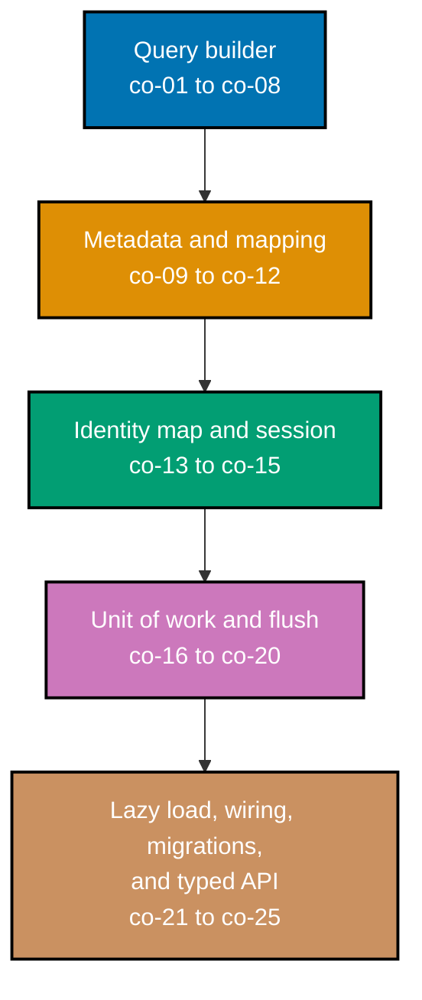

## Prerequisites

- **Prior topics**: [27 · Data Access: ORMs & Query Builders](../../data-access-orms-and-query-builders/learning/overview.md) -- this topic re-implements the mechanisms that topic used as a black box (identity map, unit of work, lazy load, the N+1); [10 · SQL Essentials](../../sql-essentials/learning/overview.md) and [26 · Advanced SQL & Query Performance](../../advanced-sql-and-query-performance/learning/overview.md) cover the parameterized SQL and joins this builder compiles down to; [4 · Just Enough Python](../../just-enough-python/learning/overview.md) covers the base language syntax used throughout.
- **Tools & environment**: a macOS/Linux terminal; **Python 3.13.12**; a local SQLite database reached through the stdlib `sqlite3` module (PEP 249) -- no third-party ORM library anywhere in this topic; `pytest` (9.1.1) installed for running every example's locking test; `pyright` (1.1.411, strict mode) for the fully type-annotated public API. `sqlite3.connect()`'s optional keyword arguments (`timeout`, `detect_types`, `isolation_level`, `check_same_thread`, `factory`, `cached_statements`, `uri`, `autocommit`) are deprecated as positional on recent Python -- every example that sets one passes it by keyword. Every connection in this topic opens through `contextlib.closing()`, because an unclosed `Connection` now emits a `ResourceWarning` on garbage collection.
- **Assumed knowledge**: the three data-access tiers and the patterns they use -- identity map, unit of work, lazy load, the N+1 (topic 27, owned there -- this topic rebuilds the mechanisms, not the vocabulary); parameterized SQL and joins (topics 10, 26); reading and writing fully type-annotated Python, including `dataclasses`, `Protocol`, and generics (topic 04).

## Why this exists -- the big idea

**The problem before the solution**: an ORM feels like magic until it surprises you -- a silent N+1, a stale object, a write that didn't persist -- and you can't debug what you can't picture, so the fastest way to demystify the abstraction is to rebuild its core. **Keep this if you forget everything else**: an ORM is a handful of small, comprehensible mechanisms -- a query built as data, rows mapped to typed objects, one object per identity, changes tracked and flushed in a single transaction -- none of which is magic once you've written it.

**Cross-cutting big idea**: `abstraction-and-its-cost` -- building the query builder, the identity map, and lazy loading yourself makes their cost concrete. You feel exactly what an immutable fluent builder buys (co-03) and what it costs to allocate a new object per call. You feel exactly what lazy loading buys (co-21) and exactly what it charges when it fans out into an N+1 you triggered yourself and can now see in a query log (co-22).

**Scope note**: this is the build-your-own tier of topic 27 -- it does not re-teach identity map, unit of work, lazy load, or the N+1 as concepts (topic 27 owns that vocabulary); it rebuilds the mechanisms behind each one, from the stdlib `sqlite3` driver up, so the abstraction stops being magic.

## How verification works in this topic

Every one of this topic's 78 worked examples is a complete, self-contained `example.py` colocated under `learning/code/ex-NN-slug/`, runnable in isolation with `python3 example.py` against a real local SQLite database (`:memory:` for every example -- fast, isolated, and automatically discarded when the connection closes). Its expected output is shown two ways: inline, as a `# => Output: ...` comment directly beneath the `print()` call that produces it, and as a captured, verbatim `python3 example.py` run in this page's **Output** block. Every example also ships a colocated `test_example.py`, verified with `pytest -q` and shown the same way. Nothing on the following pages is a guessed comment -- every claim was independently run against Python 3.13.12 and a real SQLite database, and every code/test pair is fully type-annotated to a standard `pyright --strict` accepts with zero errors.

## Concepts

Every worked example in this topic's follow-up pages cites the `co-NN` concept it exercises -- this section is the 1:1 reference those citations point back to. Read it in order: the query builder core first (a query as an immutable data structure that compiles to parameterized SQL), then table metadata and row/object mapping, then the identity map and the session that owns a transaction, then the unit of work that tracks and flushes changes atomically, and finally lazy loading, full-stack wiring, a schema migration runner, and the fully type-annotated public API that ties every mechanism together.

### co-01 &middot; SQL as Data

Representing a query as a data structure (a clause tree of small immutable nodes) rather than a raw string is what makes it safely composable and inspectable before it ever touches a database. A `ColumnRef` node holds a column name; nothing about it is SQL text until something explicitly asks it to render.

**Why it matters**: A string-built query can only be inspected by re-parsing it -- there is no structure to walk, branch, or validate before execution. A clause tree is a real Python value: you can read its fields, compare two trees, and compile the same tree twice, all before any SQL text exists.

**Verify it**: Example 1 represents a single column reference as a data node and proves rendering is deferred; Example 2 extends it to a table-qualified node.

### co-02 &middot; Parameterized SQL

Emitting `?` placeholders with a separate bound-parameter list -- never interpolating a value directly into the SQL string -- is the one non-negotiable safety property of a hand-built builder. A `Param` node always renders to the literal text `"?"`, no matter what value it wraps.

**Why it matters**: String interpolation of untrusted values into SQL is the textbook injection vulnerability -- a value containing `'; DROP TABLE users;--` becomes a second statement if it is ever concatenated into the query text. Binding it as a parameter instead means the driver treats it as pure data, never as SQL syntax, regardless of its contents.

**Verify it**: Example 3 binds a deliberately hostile string as a parameter and proves the table it targets survives; Example 4 compiles two bound values and verifies the params list stays left-to-right.

### co-03 &middot; Immutable Fluent Builder

Each builder method returns a brand-new builder instance rather than mutating the receiver in place, so a partially-built query can be branched, reused, and passed around without aliasing bugs. A `frozen=True` dataclass plus `dataclasses.replace()` is enough to get this for free.

**Why it matters**: A mutable builder makes `.where()` on a shared base query a landmine -- every caller that branches from the same base risks silently corrupting every other branch's filters. Immutability makes "build a base query once, then branch two independent variants" completely safe by construction, with no defensive copying required anywhere.

**Verify it**: Example 5 proves calling `.where()` never changes the original builder; Example 6 branches one shared base query into two independent variants and proves neither branch leaks into the other.

### co-04 &middot; SELECT-Clause Composition

A SELECT is assembled from independent columns/FROM/JOIN fragments that each contribute their own piece of SQL text (and, later, their own parameters) to the final compile. Each fragment is added by its own fluent method -- `.select()`, `.from_()`, `.join()` -- and none of them needs to know about the others.

**Why it matters**: Composing a SELECT from small independent fragments means adding a JOIN never requires touching the code that renders columns, and changing the column list never requires touching FROM. Each fragment is independently testable and independently correct.

**Verify it**: Example 7 lists explicit columns in call order; Example 8 attaches the FROM target; Example 9 shows the `SELECT *` default when no columns are given; Example 10 adds a JOIN fragment with its ON predicate.

### co-05 &middot; WHERE-Clause Composition

Predicates combine into a boolean tree -- `Eq`, `Lt`, `Gt`, `Ne`, `In` as leaves, `And`/`Or` as combinators -- that compiles recursively to a parameterized WHERE clause, with every leaf contributing exactly one placeholder (or one per value, for `IN`). `col("age") == 30` reads like a comparison because `Col.__eq__` is deliberately overridden to build a predicate node instead of returning a bare `bool`.

**Why it matters**: A boolean tree is exactly as composable as the rest of the builder -- two predicates AND together, an AND can nest inside an OR (or vice versa), and the whole tree compiles with a single recursive walk. Building WHERE clauses as strings loses this: you would be hand-managing parenthesization and parameter order yourself, for every combination.

**Verify it**: Example 11 compiles `col("age") == 30` to a parameterized equality; Example 12 combines two predicates with AND; Example 13 combines two with OR, self-parenthesizing; Example 14 covers `<`, `>`, `!=`, and `IN`; Example 15 nests AND and OR into a real three-leaf tree.

### co-06 &middot; ORDER BY / LIMIT Composition

ORDER BY, LIMIT, and OFFSET are trailing clauses appended after WHERE, with LIMIT and OFFSET themselves parameterized rather than inlined as literal numbers. `.order_by()` accepts an optional `desc` flag; `.limit()` and `.offset()` each set one bound integer.

**Why it matters**: Treating LIMIT and OFFSET as ordinary bound parameters -- not as an exception to the "always parameterize" rule -- keeps the builder's safety guarantee uniform across every clause, with no special-cased "this literal is safe because it's just a number" carve-out to remember or get wrong later.

**Verify it**: Example 16 appends a trailing `ORDER BY`; Example 17 adds the `DESC` keyword; Example 18 parameterizes `LIMIT` and `OFFSET` together and proves the real pagination window against seeded rows.

### co-07 &middot; INSERT / UPDATE / DELETE Builders

The same clause-as-data approach extends past SELECT: `insert(table).values(...)`, `update(table).set(...).where(...)`, and `delete(table).where(...)` each emit their own parameterized statement shape, reusing the exact same WHERE machinery SELECT uses.

**Why it matters**: Reusing one `Predicate` protocol across SELECT's WHERE, UPDATE's WHERE, and DELETE's WHERE means the safety guarantee (co-02) and the composability guarantee (co-05) apply uniformly to every write path, not just to reads -- there is no separate, easier-to-get-wrong code path for mutations.

**Verify it**: Example 19 builds a parameterized INSERT; Example 20 builds an UPDATE whose SET params precede its WHERE params; Example 21 builds a DELETE scoped by a WHERE predicate.

### co-08 &middot; Compile to SQL and Params

A single `compile()` walk turns the clause tree into a `(sql, params)` pair -- the one boundary between the builder (pure data and pure functions) and the driver (`cursor.execute(sql, params)`). `compile()` never touches a database; it only reads `self` and returns a value.

**Why it matters**: A hard boundary between "building a query" and "running a query" means the builder can be tested completely in isolation, with no database required, and the same compiled tuple can be logged, cached, or replayed exactly as it was produced, deterministically, every time.

**Verify it**: Example 4 shows two bound values compiling in order; Example 15 shows a nested boolean tree compiling in one recursive walk; Example 22 asserts `compile()`'s return value is genuinely a 2-tuple, always; Example 23 proves `compile()` is pure -- calling it twice on the same builder never mutates the builder and never shares mutable state between the two returned params lists.

### co-09 &middot; Table Metadata Registration

A central table/column metadata registry -- name, columns, types, primary key -- is the shared schema both the query builder and the row mapper read from, so the column list and the primary key are defined exactly once, not duplicated between the two.

**Why it matters**: Without a shared registry, the builder's idea of a table's columns and the mapper's idea of the same table's columns can drift apart silently -- a renamed column updated in one place and not the other becomes a runtime `KeyError` far from its actual cause. One registry means one place to update.

**Verify it**: Example 27 registers a `users` table's columns and primary key; Example 28 builds a `SELECT *` whose column order matches registration; Example 29 reads a table's primary-key column back out of the registry.

### co-10 &middot; Row-to-Object Mapping

A mapper turns a driver result row -- a plain tuple or dict from `cursor.fetchone()`/`fetchall()` -- into a typed domain object, assigning each column's value to the matching attribute. This is the step that makes "a database row" into "a Python object with real attributes and real types."

**Why it matters**: Without a mapper, every caller that reads a row has to remember column order (or column names) and re-derive the mapping by hand, every time -- a fragile, easy-to-desync duplication. Centralizing the mapping in one function means a schema change is fixed in exactly one place.

**Verify it**: Example 30 maps a result tuple to a `User` object by column order; Example 31 maps a dict row by column name; Example 32 maps a whole `fetchall()` result to a list of objects.

### co-11 &middot; Object-to-Row Mapping

The inverse mapping reads a domain object's attributes back into a column-to-value dict, ready for an INSERT's `.values()` or an UPDATE's `.set()`. This is co-10 run backwards: object in, row-shaped data out.

**Why it matters**: Symmetry between co-10 and co-11 is what makes a full read-modify-write round trip trustworthy -- load an object, mutate one field, map it back to a row, and only that one field's column should differ from what was originally loaded.

**Verify it**: Example 33 reads a `User` object's attributes into an INSERT-ready column-to-value dict; Example 34 builds an UPDATE SET dict containing only a changed object's fields; Example 35 round-trips object to row to object and proves the result equals the original.

### co-12 &middot; Type Coercion on Load

Per-column type converters coerce raw driver values on load (SQLite's `0`/`1` integers to Python `bool`, an ISO-format string to a `date`) and coerce back on store, so the domain object always sees the type it declared, never SQLite's raw storage representation.

**Why it matters**: SQLite has a genuinely small set of native storage types (`NULL`, `INTEGER`, `REAL`, `TEXT`, `BLOB`) -- there is no native boolean or date type at all. Without a coercion step, every caller reading a "boolean" column would have to remember it is actually an integer and compare it to `1` by hand, every single time.

**Verify it**: Example 36 coerces a driver `0`/`1` to a Python `bool` on load; Example 37 coerces an ISO string to a `date`; Example 38 coerces both back to their driver-native forms on store; Example 39 registers a custom converter for a JSON column.

### co-13 &middot; Identity Map

A per-session `{(table, pk): object}` cache guarantees exactly one in-memory object per primary key, so two loads of the same row -- anywhere in the same session -- return the identical object instance, not two separate copies that can silently drift apart.

**Why it matters**: Without an identity map, loading the same row twice produces two independent Python objects; mutating one and forgetting the other leaves the session holding two different "truths" about the same row, with no way to tell which one is stale. `a is b` for two loads of the same primary key is the guarantee that makes a unit of work's dirty tracking (co-17) even possible.

**Verify it**: Example 40 loads primary key 1 twice and asserts `a is b`; Example 41 loads two different keys and asserts they are distinct instances; Example 42 shows a cache miss then a cache hit that issues no second query; Example 43 keys by `(table, pk)` and proves the same pk across two different tables is not conflated.

### co-14 &middot; Weak-Reference Identity Map

Backing the identity map with a `weakref.WeakValueDictionary` lets an unreferenced loaded object be garbage-collected instead of leaking for the entire session's lifetime -- the cache entry disappears the moment nothing else in the program still holds the object.

**Why it matters**: A session that stays open for a long time (a long-running worker, a REPL) and loads many rows would otherwise accumulate every object it ever loaded, forever, even after the caller has finished with all of them -- a slow, silent memory leak. Weak references let the identity map's cache size track the program's actual live working set, not its full load history.

**Verify it**: Example 44 backs the identity map with a `WeakValueDictionary` and proves an entry drops after its object is garbage-collected; Example 45 loads many rows, drops every reference, and proves the map shrinks under GC.

### co-15 &middot; Session as Transaction Boundary

The session owns exactly one connection and demarcates one transaction: everything between `begin` and `commit`/`rollback` is one atomic unit, and the session is the only object that ever calls `commit()` or `rollback()` on that connection.

**Why it matters**: Scattering `commit()` calls across many unrelated functions makes it impossible to reason about what is actually atomic -- two writes that should succeed or fail together can end up split across two separate implicit transactions if nothing owns the boundary explicitly. A session that owns the connection is the one place transaction scope is decided.

**Verify it**: Example 46 shows the session's connection shared across every query issued through it; Example 47 begins, writes, and commits, proving the row persists; Example 48 begins, writes, and rolls back, proving the row is absent; Example 49 uses the session as a context manager -- commit on clean exit, rollback on exception.

### co-16 &middot; Unit of Work -- New Tracking

The session records every object added via `session.add(obj)` in a "new" set, so each one becomes exactly one INSERT when the unit of work flushes -- the caller never writes SQL for the insert directly.

**Why it matters**: Tracking "new" objects as a set (not issuing an INSERT immediately on `.add()`) is what lets the unit of work batch every pending write into a single flush -- and, combined with co-19's flush ordering, insert a parent before the child row that references it, in one transaction.

**Verify it**: Example 55 calls `session.add(obj)` and asserts the object lands in the new-set; Example 56 flushes a new object and asserts exactly one INSERT was emitted.

### co-17 &middot; Unit of Work -- Dirty Tracking

Comparing an object's current attribute values against a snapshot taken at load time detects which loaded objects are "dirty" -- changed since load -- so only genuinely modified rows are written, and only the columns that actually changed are included in the UPDATE.

**Why it matters**: Without dirty tracking, "save changes" means either re-writing every loaded object on every flush (wasteful, and prone to clobbering concurrent changes to columns you never touched) or the caller manually tracking which objects it modified (error-prone, and easy to forget). Comparing against a load-time snapshot makes dirty detection automatic and precise.

**Verify it**: Example 50 takes a load-time attribute snapshot per object; Example 57 mutates a loaded object and detects it as dirty against that snapshot; Example 58 changes one field and proves the UPDATE sets only that column; Example 59 flushes an unmodified object and proves no UPDATE is emitted at all.

### co-18 &middot; Unit of Work -- Deleted Tracking

Objects marked via `session.delete(obj)` are recorded in a distinct "deleted" set, so they become DELETEs at flush time -- clearly distinguished from merely dropping the last Python reference to an object, which does nothing to the underlying row.

**Why it matters**: In a garbage-collected language, letting go of a reference is not the same operation as deleting a database row, and conflating the two is a common source of "why is this row still here" bugs. An explicit deleted-set makes deletion a first-class, trackable intent, not an accident of reference counting.

**Verify it**: Example 60 calls `session.delete(obj)` and asserts it lands in the deleted-set; Example 61 flushes a deleted object and proves exactly one DELETE was emitted.

### co-19 &middot; Flush Ordering

The unit of work orders its pending writes so INSERTs of parent rows happen before INSERTs of rows that reference them by foreign key, and DELETEs of child rows happen before DELETEs of the parents they reference -- so a flush never violates a foreign-key constraint that the database would otherwise reject.

**Why it matters**: Flushing new/dirty/deleted objects in an arbitrary order (say, insertion order into the tracked sets) would frequently violate foreign-key constraints -- inserting a child row before its parent exists, or deleting a parent row while a child still references it. Ordering by dependency is what makes "just call flush" safe regardless of the order objects were added or deleted in.

**Verify it**: Example 62 inserts a parent then its FK-dependent child and proves the parent's INSERT precedes the child's; Example 63 deletes a child before its parent and proves the order respects the FK.

### co-20 &middot; Atomic Transaction Flush

A flush wraps every new/dirty/deleted write in one transaction that commits together or rolls back together on any error -- the unit of work never leaves the database in a state where only some of a flush's writes succeeded.

**Why it matters**: A flush that commits some writes and fails partway through the rest would leave the database in a state no application logic ever intended -- half an order's line items persisted, the order header not. Wrapping the whole flush in one transaction makes "all or nothing" the only possible outcome.

**Verify it**: Example 64 flushes a mixed new/dirty/deleted batch and proves one transaction commits all of it; Example 65 injects an error mid-flush and proves the entire flush rolls back with no partial write; Example 66 proves a successful flush clears the new/dirty/deleted tracking sets afterward.

### co-21 &middot; Descriptor-Protocol Lazy Load

A Python descriptor -- implementing `__set_name__` (PEP 487) to learn its own attribute name, and `__get__` to run the deferred query -- attached to a relationship attribute defers the child query until that attribute is first accessed, not when the parent object is loaded.

**Why it matters**: Eagerly loading every relationship on every load wastes work for the (common) case where the caller never actually touches that relationship. A descriptor defers the cost to exactly the moment it is needed, and (co-13) caches the result so a second access on the same object is free.

**Verify it**: Example 67 defines a relationship as a descriptor and proves the child query is not issued until the attribute is actually accessed; Example 68 uses `__set_name__` to bind the descriptor to its own attribute name; Example 69 accesses the lazy attribute twice and proves only one query runs.

### co-22 &middot; N+1 from Lazy Loading

Iterating N parent objects and touching a lazy relationship on each one issues N additional queries on top of the one that loaded the parents -- the classic N+1 pattern, and with a hand-built lazy loader, one you triggered yourself and can watch happen in a query log.

**Why it matters**: The N+1 is topic 27's headline failure mode viewed from the outside; rebuilding lazy loading yourself is what makes it stop being a mysterious performance cliff and start being an arithmetic consequence you can predict, reproduce, and fix (typically by batching the child load, collapsing N+1 queries into 2).

**Verify it**: Example 70 iterates N parents, touches the lazy child on each, and counts N+1 real queries in the log; Example 71 adds an eager batch load and proves the same scenario collapses to exactly 2 queries.

### co-23 &middot; Connection/Cursor Wiring

The whole layer sits on the PEP 249 connect &rarr; cursor &rarr; execute &rarr; fetch contract: the builder's `compile()` output is exactly the `(sql, params)` pair `cursor.execute(sql, params)` consumes, and nothing in the builder ever imports or calls into the driver directly.

**Why it matters**: Keeping the builder's output shape identical to the driver's input shape is what makes the two layers -- pure query construction, and real I/O against a database -- cleanly separable and independently testable, with the driver boundary crossed in exactly one place per query.

**Verify it**: Example 24 feeds a compiled tuple straight into a real cursor's `execute()`; Example 25 walks the full connect/cursor/execute/fetch/close lifecycle explicitly, stage by stage.

### co-24 &middot; Schema Migration Runner

A small migration runner applies ordered, versioned schema-change scripts in sequence and records which ones have already run (typically in their own tracking table), so re-running the migration runner against an already-migrated database is a safe no-op.

**Why it matters**: A hand-built stack still needs its schema to evolve over time -- a migration runner is what lets that evolution be scripted, ordered, and idempotent, instead of "someone remembers to run this one ALTER TABLE by hand before deploying."

**Verify it**: Example 72 applies a sequence of ordered migration scripts and proves the schema actually changed; Example 73 records applied versions in a tracking table and proves a re-run skips them; Example 74 applies out-of-order migration files and proves they still run in version order.

### co-25 &middot; Fully Typed Builder API

Generics and explicit return-type annotations give the builder, the mapper, and the session a fully type-annotated public API -- one `pyright --strict` can verify end to end, including the deliberate, explicitly `# type: ignore[override]`-marked exceptions where the query DSL intentionally violates `object.__eq__`'s "always returns `bool`" contract.

**Why it matters**: An ORM's whole value proposition is hiding SQL behind Python objects -- if the resulting API is untyped (or typed as `Any` everywhere), that hiding buys nothing: every caller still has to know the underlying row shape by convention, not by the type checker. A genuinely typed builder API lets a caller's IDE and type checker catch a mismatched column type before the query ever runs.

**Verify it**: Example 26 builds a fully-typed fluent chain and confirms `pyright --strict` reports zero errors on it; Example 54 types `session.get[T](pk) -> T` generically; Example 77 runs `pyright --strict` over the whole hand-built stack and confirms zero errors.

## Tensions & trade-offs -- when NOT to reach for this

- **Hand-built vs. a real ORM**: this topic exists to demystify the abstraction, not to recommend replacing SQLAlchemy or peewee with a hand-rolled equivalent in production -- a mature ORM has solved edge cases (connection pooling, dialect differences, migration tooling maturity) this minimal build deliberately does not attempt.
- **Identity map vs. simplicity**: an identity map is worth its complexity only when the same row is genuinely likely to be loaded more than once in a session; a script that loads each row exactly once gets no benefit from it and pays the bookkeeping cost for nothing.
- **Lazy loading vs. the N+1 it enables**: co-21's whole benefit (defer work until needed) is also exactly co-22's whole cost (defer work until it happens N times in a loop) -- reach for eager loading whenever you already know you will touch every relationship.

## Examples by Level

### Beginner (Examples 1–26)

- [Example 1: Clause as Data, Not a String](/en/c/learn/fundamentally-strong/software-engineer/build-your-own-orm-and-query-builder/learning/beginner#example-1-clause-as-data-not-a-string)
- [Example 2: Render a Qualified Column Node](/en/c/learn/fundamentally-strong/software-engineer/build-your-own-orm-and-query-builder/learning/beginner#example-2-render-a-qualified-column-node)
- [Example 3: Bind a Value as a Placeholder, Never Interpolate It](/en/c/learn/fundamentally-strong/software-engineer/build-your-own-orm-and-query-builder/learning/beginner#example-3-bind-a-value-as-a-placeholder-never-interpolate-it)
- [Example 4: Compile Two Bound Values, Params Stay Left-to-Right](/en/c/learn/fundamentally-strong/software-engineer/build-your-own-orm-and-query-builder/learning/beginner#example-4-compile-two-bound-values-params-stay-left-to-right)
- [Example 5: A Builder Method Returns a NEW Instance, Never Mutates](/en/c/learn/fundamentally-strong/software-engineer/build-your-own-orm-and-query-builder/learning/beginner#example-5-a-builder-method-returns-a-new-instance-never-mutates)
- [Example 6: Branch a Partial Query into Two Independent Variants](/en/c/learn/fundamentally-strong/software-engineer/build-your-own-orm-and-query-builder/learning/beginner#example-6-branch-a-partial-query-into-two-independent-variants)
- [Example 7: select() Lists Explicit Columns, in Order](/en/c/learn/fundamentally-strong/software-engineer/build-your-own-orm-and-query-builder/learning/beginner#example-7-select-lists-explicit-columns-in-order)
- [Example 8: .from\_() Attaches the FROM Target, Immutably](/en/c/learn/fundamentally-strong/software-engineer/build-your-own-orm-and-query-builder/learning/beginner#example-8-from_-attaches-the-from-target-immutably)
- [Example 9: select() With No Columns Defaults to SELECT \*](/en/c/learn/fundamentally-strong/software-engineer/build-your-own-orm-and-query-builder/learning/beginner#example-9-select-with-no-columns-defaults-to-select-)
- [Example 10: .join() Adds a JOIN Fragment With an ON Predicate](/en/c/learn/fundamentally-strong/software-engineer/build-your-own-orm-and-query-builder/learning/beginner#example-10-join-adds-a-join-fragment-with-an-on-predicate)
- [Example 11: col("age") == 30 Compiles to a Parameterized Equality](/en/c/learn/fundamentally-strong/software-engineer/build-your-own-orm-and-query-builder/learning/beginner#example-11-colage--30-compiles-to-a-parameterized-equality)
- [Example 12: Combine Two Predicates With AND](/en/c/learn/fundamentally-strong/software-engineer/build-your-own-orm-and-query-builder/learning/beginner#example-12-combine-two-predicates-with-and)
- [Example 13: Combine Two Predicates With OR, Parenthesized](/en/c/learn/fundamentally-strong/software-engineer/build-your-own-orm-and-query-builder/learning/beginner#example-13-combine-two-predicates-with-or-parenthesized)
- [Example 14: Lt, Gt, Ne, and In -- Every Comparison Compiles the Same Way](/en/c/learn/fundamentally-strong/software-engineer/build-your-own-orm-and-query-builder/learning/beginner#example-14-lt-gt-ne-and-in----every-comparison-compiles-the-same-way)
- [Example 15: Nest And Inside Or Inside And -- a Real Boolean Tree](/en/c/learn/fundamentally-strong/software-engineer/build-your-own-orm-and-query-builder/learning/beginner#example-15-nest-and-inside-or-inside-and----a-real-boolean-tree)
- [Example 16: .order_by() Appends a Trailing ORDER BY Clause](/en/c/learn/fundamentally-strong/software-engineer/build-your-own-orm-and-query-builder/learning/beginner#example-16-order_by-appends-a-trailing-order-by-clause)
- [Example 17: order_by(desc=True) Appends the DESC Keyword](/en/c/learn/fundamentally-strong/software-engineer/build-your-own-orm-and-query-builder/learning/beginner#example-17-order_bydesctrue-appends-the-desc-keyword)
- [Example 18: LIMIT and OFFSET Are Parameterized Trailing Clauses](/en/c/learn/fundamentally-strong/software-engineer/build-your-own-orm-and-query-builder/learning/beginner#example-18-limit-and-offset-are-parameterized-trailing-clauses)
- [Example 19: insert("users").values(...) Compiles a Parameterized INSERT](/en/c/learn/fundamentally-strong/software-engineer/build-your-own-orm-and-query-builder/learning/beginner#example-19-insertusersvalues-compiles-a-parameterized-insert)
- [Example 20: update().set().where() Compiles a Parameterized UPDATE](/en/c/learn/fundamentally-strong/software-engineer/build-your-own-orm-and-query-builder/learning/beginner#example-20-updatesetwhere-compiles-a-parameterized-update)
- [Example 21: delete().where() Compiles a Parameterized DELETE](/en/c/learn/fundamentally-strong/software-engineer/build-your-own-orm-and-query-builder/learning/beginner#example-21-deletewhere-compiles-a-parameterized-delete)
- [Example 22: compile() Always Returns a (sql, params) Tuple](/en/c/learn/fundamentally-strong/software-engineer/build-your-own-orm-and-query-builder/learning/beginner#example-22-compile-always-returns-a-sql-params-tuple)
- [Example 23: compile() Is Pure -- Calling It Twice Changes Nothing](/en/c/learn/fundamentally-strong/software-engineer/build-your-own-orm-and-query-builder/learning/beginner#example-23-compile-is-pure----calling-it-twice-changes-nothing)
- [Example 24: A Compiled (sql, params) Tuple Feeds a Real DB-API Cursor](/en/c/learn/fundamentally-strong/software-engineer/build-your-own-orm-and-query-builder/learning/beginner#example-24-a-compiled-sql-params-tuple-feeds-a-real-db-api-cursor)
- [Example 25: The Full PEP 249 Lifecycle -- Connect, Cursor, Execute, Fetch, Close](/en/c/learn/fundamentally-strong/software-engineer/build-your-own-orm-and-query-builder/learning/beginner#example-25-the-full-pep-249-lifecycle----connect-cursor-execute-fetch-close)
- [Example 26: A Fully Type-Annotated Builder Chain, pyright --strict Clean](/en/c/learn/fundamentally-strong/software-engineer/build-your-own-orm-and-query-builder/learning/beginner#example-26-a-fully-type-annotated-builder-chain-pyright---strict-clean)

### Intermediate (Examples 27–54)

- [Example 27: Register Table Metadata](/en/c/learn/fundamentally-strong/software-engineer/build-your-own-orm-and-query-builder/learning/intermediate#example-27-register-table-metadata)
- [Example 28: Metadata Drives a SELECT's Column List](/en/c/learn/fundamentally-strong/software-engineer/build-your-own-orm-and-query-builder/learning/intermediate#example-28-metadata-drives-a-selects-column-list)
- [Example 29: Read a Table's Primary Key From Metadata](/en/c/learn/fundamentally-strong/software-engineer/build-your-own-orm-and-query-builder/learning/intermediate#example-29-read-a-tables-primary-key-from-metadata)
- [Example 30: Map a Result Tuple to a Typed Object](/en/c/learn/fundamentally-strong/software-engineer/build-your-own-orm-and-query-builder/learning/intermediate#example-30-map-a-result-tuple-to-a-typed-object)
- [Example 31: Map a Dict Row to a Typed Object by Column Name](/en/c/learn/fundamentally-strong/software-engineer/build-your-own-orm-and-query-builder/learning/intermediate#example-31-map-a-dict-row-to-a-typed-object-by-column-name)
- [Example 32: Map a fetchall() Result to a List of Objects](/en/c/learn/fundamentally-strong/software-engineer/build-your-own-orm-and-query-builder/learning/intermediate#example-32-map-a-fetchall-result-to-a-list-of-objects)
- [Example 33: Read an Object's Attributes Into an INSERT-Ready Dict](/en/c/learn/fundamentally-strong/software-engineer/build-your-own-orm-and-query-builder/learning/intermediate#example-33-read-an-objects-attributes-into-an-insert-ready-dict)
- [Example 34: Build an UPDATE SET Dict From an Object, Excluding the PK](/en/c/learn/fundamentally-strong/software-engineer/build-your-own-orm-and-query-builder/learning/intermediate#example-34-build-an-update-set-dict-from-an-object-excluding-the-pk)
- [Example 35: Round-Trip an Object Through a Row and Back](/en/c/learn/fundamentally-strong/software-engineer/build-your-own-orm-and-query-builder/learning/intermediate#example-35-round-trip-an-object-through-a-row-and-back)
- [Example 36: Coerce a Driver 0/1 Integer to a Python bool on Load](/en/c/learn/fundamentally-strong/software-engineer/build-your-own-orm-and-query-builder/learning/intermediate#example-36-coerce-a-driver-01-integer-to-a-python-bool-on-load)
- [Example 37: Coerce an ISO String to a date on Load](/en/c/learn/fundamentally-strong/software-engineer/build-your-own-orm-and-query-builder/learning/intermediate#example-37-coerce-an-iso-string-to-a-date-on-load)
- [Example 38: Coerce bool and date Back to Driver-Native Types on Store](/en/c/learn/fundamentally-strong/software-engineer/build-your-own-orm-and-query-builder/learning/intermediate#example-38-coerce-bool-and-date-back-to-driver-native-types-on-store)
- [Example 39: Register a Custom Type Converter for a JSON Column](/en/c/learn/fundamentally-strong/software-engineer/build-your-own-orm-and-query-builder/learning/intermediate#example-39-register-a-custom-type-converter-for-a-json-column)
- [Example 40: Identity Map -- Loading the Same PK Twice Returns the Same Instance](/en/c/learn/fundamentally-strong/software-engineer/build-your-own-orm-and-query-builder/learning/intermediate#example-40-identity-map----loading-the-same-pk-twice-returns-the-same-instance)
- [Example 41: Identity Map -- Different Primary Keys Yield Distinct Instances](/en/c/learn/fundamentally-strong/software-engineer/build-your-own-orm-and-query-builder/learning/intermediate#example-41-identity-map----different-primary-keys-yield-distinct-instances)
- [Example 42: Identity Map -- a Miss Then a Hit Issues Exactly One Query](/en/c/learn/fundamentally-strong/software-engineer/build-your-own-orm-and-query-builder/learning/intermediate#example-42-identity-map----a-miss-then-a-hit-issues-exactly-one-query)
- [Example 43: Identity Map -- Keyed by (table, pk), Never Conflated Across Tables](/en/c/learn/fundamentally-strong/software-engineer/build-your-own-orm-and-query-builder/learning/intermediate#example-43-identity-map----keyed-by-table-pk-never-conflated-across-tables)
- [Example 44: Back the Identity Map With a WeakValueDictionary](/en/c/learn/fundamentally-strong/software-engineer/build-your-own-orm-and-query-builder/learning/intermediate#example-44-back-the-identity-map-with-a-weakvaluedictionary)
- [Example 45: A Weak Identity Map Shrinks Under GC Instead of Leaking](/en/c/learn/fundamentally-strong/software-engineer/build-your-own-orm-and-query-builder/learning/intermediate#example-45-a-weak-identity-map-shrinks-under-gc-instead-of-leaking)
- [Example 46: The Session Owns One Connection -- Every Query Shares It](/en/c/learn/fundamentally-strong/software-engineer/build-your-own-orm-and-query-builder/learning/intermediate#example-46-the-session-owns-one-connection----every-query-shares-it)
- [Example 47: Session begin/write/commit -- the Row Persists After Commit](/en/c/learn/fundamentally-strong/software-engineer/build-your-own-orm-and-query-builder/learning/intermediate#example-47-session-beginwritecommit----the-row-persists-after-commit)
- [Example 48: Session begin/write/rollback -- the Row Is Absent After Rollback](/en/c/learn/fundamentally-strong/software-engineer/build-your-own-orm-and-query-builder/learning/intermediate#example-48-session-beginwriterollback----the-row-is-absent-after-rollback)
- [Example 49: `with Session() as s:` -- Commit on Clean Exit, Rollback on Exception](/en/c/learn/fundamentally-strong/software-engineer/build-your-own-orm-and-query-builder/learning/intermediate#example-49-with-session-as-s----commit-on-clean-exit-rollback-on-exception)
- [Example 50: Snapshot an Object's Attributes at Load Time, for Later Dirty Checks](/en/c/learn/fundamentally-strong/software-engineer/build-your-own-orm-and-query-builder/learning/intermediate#example-50-snapshot-an-objects-attributes-at-load-time-for-later-dirty-checks)
- [Example 51: The Mapper Checks the Identity Map Before Constructing a New Object](/en/c/learn/fundamentally-strong/software-engineer/build-your-own-orm-and-query-builder/learning/intermediate#example-51-the-mapper-checks-the-identity-map-before-constructing-a-new-object)
- [Example 52: A Column's Registered Python Type Drives Its Coercer](/en/c/learn/fundamentally-strong/software-engineer/build-your-own-orm-and-query-builder/learning/intermediate#example-52-a-columns-registered-python-type-drives-its-coercer)
- [Example 53: Compose a Builder Query, Execute It, Map Every Row to a Typed Object](/en/c/learn/fundamentally-strong/software-engineer/build-your-own-orm-and-query-builder/learning/intermediate#example-53-compose-a-builder-query-execute-it-map-every-row-to-a-typed-object)
- [Example 54: A Generic `session.get[T](pk) -> T` API](/en/c/learn/fundamentally-strong/software-engineer/build-your-own-orm-and-query-builder/learning/intermediate#example-54-a-generic-sessiongettpk---t-api)

### Advanced (Examples 55–78)

- [Example 55: UnitOfWork.register_new -- Tracking a Brand-New, Not-Yet-Saved Object](/en/c/learn/fundamentally-strong/software-engineer/build-your-own-orm-and-query-builder/learning/advanced#example-55-unitofworkregister_new----tracking-a-brand-new-not-yet-saved-object)
- [Example 56: Flushing the New Set Issues Real INSERTs and Assigns Primary Keys](/en/c/learn/fundamentally-strong/software-engineer/build-your-own-orm-and-query-builder/learning/advanced#example-56-flushing-the-new-set-issues-real-inserts-and-assigns-primary-keys)
- [Example 57: Detecting a Dirty Object by Comparing Live State to Its Load-Time Snapshot](/en/c/learn/fundamentally-strong/software-engineer/build-your-own-orm-and-query-builder/learning/advanced#example-57-detecting-a-dirty-object-by-comparing-live-state-to-its-load-time-snapshot)
- [Example 58: An UPDATE Statement Contains Only the Columns That Actually Changed](/en/c/learn/fundamentally-strong/software-engineer/build-your-own-orm-and-query-builder/learning/advanced#example-58-an-update-statement-contains-only-the-columns-that-actually-changed)
- [Example 59: Flushing a Clean Object Issues Zero UPDATE Statements](/en/c/learn/fundamentally-strong/software-engineer/build-your-own-orm-and-query-builder/learning/advanced#example-59-flushing-a-clean-object-issues-zero-update-statements)
- [Example 60: UnitOfWork.register_deleted -- Marking an Object for Removal](/en/c/learn/fundamentally-strong/software-engineer/build-your-own-orm-and-query-builder/learning/advanced#example-60-unitofworkregister_deleted----marking-an-object-for-removal)
- [Example 61: Flushing the Deleted Set Issues Real DELETE Statements](/en/c/learn/fundamentally-strong/software-engineer/build-your-own-orm-and-query-builder/learning/advanced#example-61-flushing-the-deleted-set-issues-real-delete-statements)
- [Example 62: Flush Ordering -- a Parent's INSERT Runs Before Its Child's](/en/c/learn/fundamentally-strong/software-engineer/build-your-own-orm-and-query-builder/learning/advanced#example-62-flush-ordering----a-parents-insert-runs-before-its-childs)
- [Example 63: Flush Ordering -- a Child's DELETE Runs Before Its Parent's](/en/c/learn/fundamentally-strong/software-engineer/build-your-own-orm-and-query-builder/learning/advanced#example-63-flush-ordering----a-childs-delete-runs-before-its-parents)
- [Example 64: A Flush's Multiple Writes Commit Together, as One Atomic Unit](/en/c/learn/fundamentally-strong/software-engineer/build-your-own-orm-and-query-builder/learning/advanced#example-64-a-flushs-multiple-writes-commit-together-as-one-atomic-unit)
- [Example 65: A Flush Failure Rolls Back EVERY Write in the Batch, Not Just the Failing One](/en/c/learn/fundamentally-strong/software-engineer/build-your-own-orm-and-query-builder/learning/advanced#example-65-a-flush-failure-rolls-back-every-write-in-the-batch-not-just-the-failing-one)
- [Example 66: After a Successful Flush, the New/Dirty/Deleted Sets Are Empty](/en/c/learn/fundamentally-strong/software-engineer/build-your-own-orm-and-query-builder/learning/advanced#example-66-after-a-successful-flush-the-newdirtydeleted-sets-are-empty)
- [Example 67: A Lazy-Loading Descriptor Defers Its Query Until First Attribute Access](/en/c/learn/fundamentally-strong/software-engineer/build-your-own-orm-and-query-builder/learning/advanced#example-67-a-lazy-loading-descriptor-defers-its-query-until-first-attribute-access)
- [Example 68: `__set_name__` Lets a Descriptor Cache Per-Instance, Not Per-Descriptor](/en/c/learn/fundamentally-strong/software-engineer/build-your-own-orm-and-query-builder/learning/advanced#example-68-__set_name__-lets-a-descriptor-cache-per-instance-not-per-descriptor)
- [Example 69: A Lazy Relationship Attribute Issues Its Query Exactly Once Per Instance](/en/c/learn/fundamentally-strong/software-engineer/build-your-own-orm-and-query-builder/learning/advanced#example-69-a-lazy-relationship-attribute-issues-its-query-exactly-once-per-instance)
- [Example 70: Naive Lazy Loading Over a List Produces N+1 Queries, Observably](/en/c/learn/fundamentally-strong/software-engineer/build-your-own-orm-and-query-builder/learning/advanced#example-70-naive-lazy-loading-over-a-list-produces-n1-queries-observably)
- [Example 71: Fixing N+1 by Batch-Loading All Children in One Extra Query](/en/c/learn/fundamentally-strong/software-engineer/build-your-own-orm-and-query-builder/learning/advanced#example-71-fixing-n1-by-batch-loading-all-children-in-one-extra-query)
- [Example 72: A Migration Runner Applies a DDL Script Against a Real Database](/en/c/learn/fundamentally-strong/software-engineer/build-your-own-orm-and-query-builder/learning/advanced#example-72-a-migration-runner-applies-a-ddl-script-against-a-real-database)
- [Example 73: A schema_version Table Records Which Migrations Already Ran](/en/c/learn/fundamentally-strong/software-engineer/build-your-own-orm-and-query-builder/learning/advanced#example-73-a-schema_version-table-records-which-migrations-already-ran)
- [Example 74: A Migration Runner Applies Pending Migrations in Ascending Version Order](/en/c/learn/fundamentally-strong/software-engineer/build-your-own-orm-and-query-builder/learning/advanced#example-74-a-migration-runner-applies-pending-migrations-in-ascending-version-order)
- [Example 75: Wiring the Full Read Stack -- Builder, Driver, Identity Map, Mapper](/en/c/learn/fundamentally-strong/software-engineer/build-your-own-orm-and-query-builder/learning/advanced#example-75-wiring-the-full-read-stack----builder-driver-identity-map-mapper)
- [Example 76: Wiring the Full Write Stack -- Session, UnitOfWork, and a Real Flush](/en/c/learn/fundamentally-strong/software-engineer/build-your-own-orm-and-query-builder/learning/advanced#example-76-wiring-the-full-write-stack----session-unitofwork-and-a-real-flush)
- [Example 77: A Fully-Typed End-to-End Path -- Builder to Domain Object, No Any Leaks](/en/c/learn/fundamentally-strong/software-engineer/build-your-own-orm-and-query-builder/learning/advanced#example-77-a-fully-typed-end-to-end-path----builder-to-domain-object-no-any-leaks)
- [Example 78: A Mini-ORM Preview -- Migrations, UnitOfWork, Identity Map, Eager Loading](/en/c/learn/fundamentally-strong/software-engineer/build-your-own-orm-and-query-builder/learning/advanced#example-78-a-mini-orm-preview----migrations-unitofwork-identity-map-eager-loading)

---

← Previous: [27 · Data Access: ORMs & Query Builders Drilling](../../data-access-orms-and-query-builders/drilling/overview.md) &middot; Next: [Beginner Examples](./beginner.md) →
