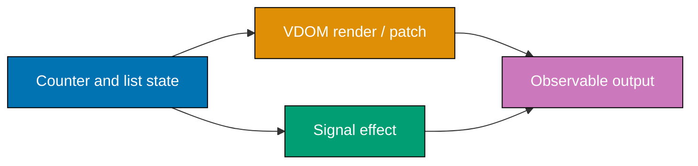

## Goal

Build the same small counter/list interaction with a typed virtual-DOM runtime and a fine-grained
signals runtime. The two programs deliberately expose their work counters: the virtual-DOM path
counts tree renders while the signals path counts only dependent effects.

## Concepts exercised

- [x] typed hyperscript and virtual nodes (co-02, co-04)
- [x] render, diff, patch, and stable list keys (co-05, co-06, co-07, co-11)
- [x] signal, computed value, and dependency-tracked effect (co-13 through co-17)
- [x] cleanup and a concrete work comparison (co-19, co-32)

## Run it

Run `npx tsx learning/capstone/code/run.ts` from this course directory. It executes both
implementations, verifies their user-visible state, verifies the keyed virtual-node identity, and
prints a measured work comparison. All source is strict TypeScript and has no `any`.

## Evidence

`code/vdom.ts` preserves identities for keyed tasks while changing only the counter text.
`code/signals.ts` proves that updating the counter does not re-run the unrelated task-list effect.
`code/run.ts` is the end-to-end executable; `code/compare.md` records what its counters mean.
