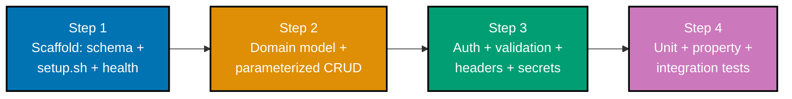

## Goal

Ship one small but **complete, secure, tested working application** by integrating everything Pass 1
taught: a **Habit Tracker** -- a Python HTTP JSON API (topic 11) over a normalized SQLite database
(topic 10), driven by clean, fully-typed Python (topic 04) with a Bash setup/run script (topic 05), an
apt data structure (topic 07) inside a real OO domain model (topic 08), a full test suite across the
pyramid (topic 15), and the argon2id/injection-safety/headers/env-secrets hardening from topic 17. A
`curl`/HTTP client walkthrough throughout narrates the request path (topic 12).

**Prerequisites** -- restated from this capstone's anchoring spec in
[`syllabus/17-security-essentials.md`](https://github.com/wahidyankf/ose-public/blob/main/plans/in-progress/fundamentally-strong-software-engineer/syllabus/17-security-essentials.md):

- **Prior topics**: every Pass 1 topic this page integrates --
  [04 Just Enough Python](../just-enough-python/learning/overview.md),
  [05 Just Enough Bash](../just-enough-bash/learning/overview.md),
  [07 Data Structures & Algorithms Essentials](../data-structures-and-algorithms-essentials/learning/overview.md),
  [08 Object-Oriented Programming Essentials](../object-oriented-programming-essentials/learning/overview.md),
  [10 SQL Essentials](../sql-essentials/learning/overview.md),
  [11 Backend Essentials](../backend-essentials/learning/overview.md),
  [12 Networking Essentials](../networking-essentials/learning/overview.md),
  [15 Software Testing](../software-testing/learning/overview.md), and
  [17 Security Essentials](../security-essentials/learning/overview.md) (whose own
  [capstone](../security-essentials/learning/capstone/overview.md) this reuses the argon2id +
  signed-token auth pattern from, file-for-file).
- **Tools & environment**: a macOS/Linux terminal; **Python 3.13** in a `venv` (3.13.12 used for every
  run captured on this page); pinned, CVE-clean packages -- `fastapi==0.139.0`, `uvicorn==0.51.0`,
  `pydantic==2.13.4`, `argon2-cffi==25.1.0`, `pytest==9.1.1`, `hypothesis==6.156.6`, `httpx2==2.7.0`,
  `coverage==7.15.2` (all re-verified current/CVE-clean for this page --
  [syllabus/17-security-essentials.md](https://github.com/wahidyankf/ose-public/blob/main/plans/in-progress/fundamentally-strong-software-engineer/syllabus/17-security-essentials.md)'s
  2026-07-16 Accuracy note); `curl`; the `sqlite3` CLI; `pip-audit==2.10.1`; `shellcheck`/`shfmt` for
  `setup.sh`.
- **Assumed knowledge**: everything the Prior topics above already teach -- this page does not re-teach
  FastAPI routing, SQL, argon2id, or `pytest` from scratch; it composes them.



## Concepts exercised

- [x] HTTP JSON API + validation (topic 11)
- [x] normalized DB + parameterized DAL (topic 10)
- [x] domain model / OOP (topic 08)
- [x] apt data structures & algorithms (topic 07)
- [x] Bash setup/run script (topic 05)
- [x] pytest + Hypothesis + integration tests (topic 15)
- [x] security hardening: hashed auth, injection-safe, secrets in env, `pip-audit` clean (topic 17)
- [x] a `curl`/HTTP client walkthrough (topic 12)

All colocated code lives under `code/`: `setup.sh`, `requirements.txt`, `pyrightconfig.json`,
`app/{domain,models,auth,middleware,repository,main}.py`, `app/{schema_v1,migration_v2}.sql`,
`test_domain.py`, `test_habit_streak_property.py`, `test_app.py`, `attack_transcript.py`. Every
listing below is the complete file, verbatim (DD-19/DD-20) -- nothing on this page is truncated or
paraphrased, and every command's output is real, captured from an actual run against Python 3.13.12,
never fabricated (DD-19).

## Step 1: Scaffold -- schema, `setup.sh`, and a health check

_integrates: HTTP JSON API (11), normalized DB (10), Bash setup script (05)_

The base SQLite schema (topic 10) is three normalized tables -- a user owns habits, a habit owns
check-ins -- applied once by `app/repository.py`'s `init_db()`, tracked via `PRAGMA user_version`
(co-22 schema-migration) so re-running it is always a safe no-op.

**`code/app/schema_v1.sql`** (complete file)

```sql
-- Pass-1 capstone: Habit Tracker -- base schema (topic 10, applied once at PRAGMA user_version 0 -> 1).
-- Three normalized tables, one fact per place (co-05 normalization): a user owns habits, a habit
-- owns check-ins. No repeated columns, no computed/derived data stored (current_streak is always
-- computed by app/domain.py from these rows, never persisted).
CREATE TABLE IF NOT EXISTS users (
  id INTEGER PRIMARY KEY AUTOINCREMENT, -- co-02 primary-keys: aliases SQLite's rowid, auto-assigned
  username TEXT NOT NULL UNIQUE, -- co-04 constraints: NOT NULL + UNIQUE enforced by the engine
  password_hash TEXT NOT NULL, -- co-09/co-10/co-11 (topic 17): an argon2id PHC string, never a raw password
  created_at TEXT NOT NULL DEFAULT (datetime ('now'))
);

CREATE TABLE IF NOT EXISTS habits (
  id INTEGER PRIMARY KEY AUTOINCREMENT,
  user_id INTEGER NOT NULL REFERENCES users (id) ON DELETE CASCADE, -- co-03 foreign-keys: an orphan habit can't exist
  name TEXT NOT NULL,
  created_at TEXT NOT NULL DEFAULT (datetime ('now'))
);

CREATE TABLE IF NOT EXISTS checkins (
  id INTEGER PRIMARY KEY AUTOINCREMENT,
  habit_id INTEGER NOT NULL REFERENCES habits (id) ON DELETE CASCADE,
  checkin_date TEXT NOT NULL, -- ISO 'YYYY-MM-DD', one row per (habit, calendar day)
  UNIQUE (habit_id, checkin_date) -- co-04 constraint: the DB itself forbids a double check-in for one day
);

-- co-23: an index on each foreign key avoids an O(n) table scan per "list my habits"/"load this habit's check-ins" query
CREATE INDEX IF NOT EXISTS idx_habits_user_id ON habits (user_id);

CREATE INDEX IF NOT EXISTS idx_checkins_habit_id ON checkins (habit_id);
```

An additive migration then bumps the schema to version 2, adding an `archived` column Step 3's
archive endpoint uses -- co-22's exact "an `ALTER TABLE ADD COLUMN` with a default evolves a live
schema without breaking existing rows":

**`code/app/migration_v2.sql`** (complete file)

```sql
-- Pass-1 capstone: Habit Tracker -- additive migration (topic 10, co-22 schema-migration).
-- Applied once at PRAGMA user_version 1 -> 2 by app/repository.py's init_db(). An ADDITIVE
-- ALTER TABLE with a DEFAULT never breaks a row that already exists -- every pre-migration
-- habit reads back with archived = 0 (not archived) with no backfill step needed.
-- 0 = active, 1 = archived
ALTER TABLE habits
ADD COLUMN archived INTEGER NOT NULL DEFAULT 0;
```

`setup.sh` (topic 05 Just Enough Bash) is the ONE command a clean-machine reader runs: it creates a
`venv`, installs the pinned `requirements.txt`, then `exec`s `uvicorn` in the foreground -- `app/main.py`'s
own startup call (`repo.init_db(DB_PATH)`, shown in full in Step 2) applies both SQL files above the
first time it runs, so there is no separate "run the migration" step to forget.

**`code/setup.sh`** (complete file)

```bash
#!/usr/bin/env bash
# Pass-1 capstone: Habit Tracker -- one-command setup + boot (topic 05 Just Enough Bash).
# Creates a venv, installs pinned dependencies, then starts the API in the foreground on
# http://127.0.0.1:8100 -- app/main.py's own startup call applies the SQLite schema (topic
# 10) the first time it runs. From a SECOND terminal: curl http://127.0.0.1:8100/health
set -euo pipefail # co-03 strict-mode: abort on error, on an unset var, or on a failed pipe stage

SCRIPT_DIR="$(cd "$(dirname "${BASH_SOURCE[0]}")" && pwd)" # co-07 command-substitution: absolute path
cd "$SCRIPT_DIR"                                           # regardless of the caller's own cwd (co-06 quoting: always quoted)

VENV_DIR=".venv" # co-05 variables-and-expansion

# co-10 conditionals: -d tests "directory exists"; short-circuit form keeps this a single line
[[ -d "$VENV_DIR" ]] || { echo "==> creating virtual environment ($VENV_DIR)" && python3 -m venv "$VENV_DIR"; }

echo "==> installing pinned dependencies"
"$VENV_DIR/bin/pip" install --quiet --upgrade pip
"$VENV_DIR/bin/pip" install --quiet -r requirements.txt

# co-05 parameter-expansion default (${v:-default}): a caller MAY export these first to
# override them; a fresh clean-machine run gets safe defaults with zero manual steps.
export CAPSTONE1_AUTH_SECRET="${CAPSTONE1_AUTH_SECRET:-dev-only-not-a-real-secret-please-change}"
export CAPSTONE1_DB_PATH="${CAPSTONE1_DB_PATH:-$SCRIPT_DIR/app/habits.db}"

echo "==> starting the API on http://127.0.0.1:8100 (Ctrl-C to stop)"
exec "$VENV_DIR/bin/uvicorn" app.main:app --host 127.0.0.1 --port 8100 # co-01: this script IS the run command
```

**`code/requirements.txt`** (complete file)

```text
fastapi==0.139.0
uvicorn==0.51.0
pydantic==2.13.4
argon2-cffi==25.1.0
pytest==9.1.1
hypothesis==6.156.6
httpx2==2.7.0
coverage==7.15.2
```

**Verify**: `shellcheck setup.sh` and `shfmt -d setup.sh` (both gates this repo's own pre-commit hooks
run), then `./setup.sh` in one terminal, then `curl -i http://127.0.0.1:8100/health` from a second.

**Output** (real, unedited):

```text
$ shellcheck setup.sh; echo "shellcheck exit: $?"
shellcheck exit: 0
$ shfmt -d setup.sh; echo "shfmt exit: $?"
shfmt exit: 0
```

```text
$ ./setup.sh
==> creating virtual environment (.venv)
==> installing pinned dependencies
==> starting the API on http://127.0.0.1:8100 (Ctrl-C to stop)
INFO:     Started server process
INFO:     Uvicorn running on http://127.0.0.1:8100 (Press CTRL+C to quit)
```

```text
$ curl -i http://127.0.0.1:8100/health
HTTP/1.1 200 OK
content-type: application/json
content-security-policy: default-src 'self'
x-content-type-options: nosniff
strict-transport-security: max-age=31536000; includeSubDomains

{"status":"ok"}
```

**Key takeaway**: one script, zero manual steps -- `./setup.sh` on a completely clean machine reaches a
listening, health-checked server, and the security headers (Step 3) are already present on the very
first response, because `app/main.py` wires the header middleware before the app ever starts serving.

**Why it matters**: DD-30's follow-along-completeness rule means a reader never hits a hidden
assumption -- `setup.sh` is the entire "getting started" story, not the first of several undocumented
manual steps.

## Step 2: Domain model + parameterized CRUD

_integrates: apt data structure (07), OO domain model (08), normalized DAL (10), HTTP JSON API (11)_

`Habit` (topic 08) bundles its check-in state with the ONE method allowed to mutate it
(`record_checkin`) -- topic 08's big idea: "bundle state with the operations that guard it, expose
behavior, not fields." The check-in dates live in a `set[date]` rather than a `list[date]` (topic 07
co-09 hash-set): `current_streak()` asks "is this ONE specific day present?" once per day of the
streak, and a hash-set answers that in average O(1) -- a `list` would force an O(n) linear scan
(co-13) per day checked, turning an O(streak) walk into an O(streak &times; n) one.

**`code/app/domain.py`** (complete file)

```python
"""Pass-1 capstone: Habit Tracker -- the OO domain model (topic 08) + apt data structure (topic 07).

`Habit` bundles its check-in state with the ONE operation allowed to mutate it
(`record_checkin`) and the operations that read it (`has_checkin_on`, `current_streak`) --
topic 08's big idea: "bundle state with the operations that guard it, and expose behavior,
not fields." Nothing outside this class ever touches `_checkin_dates` directly.

The check-in dates are stored in a `set[date]` (co-09 hash-set, topic 07) rather than a
`list[date]`: `current_streak()` below asks "is this ONE specific day present?" once per day
of the streak, and a hash-set answers that in average O(1) -- a `list` would need an O(n)
linear scan (co-13) per day checked, turning an O(streak) walk into an O(streak * n) one.
"""

from __future__ import annotations

from dataclasses import dataclass, field
from datetime import date, timedelta


@dataclass(
    slots=True
)  # => slots=True (Python 3.10+): no per-instance __dict__ (topic 08 co-06)
class Habit:
    """A single habit, its archived flag, and the check-in history that decides its streak."""

    id: int  # => the DB row id; 0 for a not-yet-persisted (in-memory only) instance
    name: str  # => e.g. "Read 20 minutes" -- validated non-blank in __post_init__ below
    archived: bool = (
        False  # => guarded ONLY by archive() below -- never flipped from outside
    )
    _checkin_dates: set[date] = field(
        default_factory=set[date]
    )  # => co-09: hash-set, O(1) average membership

    def __post_init__(self) -> None:
        if (
            not self.name.strip()
        ):  # => co-04 constraint enforced in the domain layer, not just the DB
            raise ValueError(
                "habit name must not be blank"
            )  # => an invalid Habit can never exist

    def archive(self) -> None:
        """The ONE way to archive a habit -- bundles the state change with its own guard
        (topic 08's big idea): archiving twice is a safe no-op, never an error."""
        self.archived = True

    def record_checkin(self, day: date) -> None:
        """Record a check-in for `day`. Idempotent: checking in twice on the same day is a no-op,
        because `set.add` on an already-present element changes nothing (co-09)."""
        self._checkin_dates.add(day)  # => O(1) average insert into the hash-set

    def has_checkin_on(self, day: date) -> bool:
        """O(1) average membership test -- the exact operation a hash-set is apt for (co-09),
        versus an O(n) scan a `list` would force (co-13)."""
        return day in self._checkin_dates

    def checkin_count(self) -> int:
        """Total distinct days checked in, ever -- used only for reporting, never for the streak."""
        return len(self._checkin_dates)

    def current_streak(self, today: date) -> int:
        """The number of CONSECUTIVE days, walking backward from `today`, that have a check-in.

        Big-O: this walks at most `streak + 1` days, each a single hash-set lookup -- O(streak)
        total (co-01 big-o-notation), not O(streak * total_checkins) the way a `list`-backed
        linear scan per day would cost.
        """
        streak = 0
        day = today
        while self.has_checkin_on(
            day
        ):  # => stops at the first missing day, walking backward
            streak += 1
            day -= timedelta(days=1)  # => one calendar day earlier
        return streak
```

The repository (topic 10) is the ONLY module that talks to SQLite, and every statement binds its
inputs as `?` placeholders (co-20 parameterized-queries) -- the fixed, shipped version of the search
endpoint Step 3 attacks:

**`code/app/repository.py`** (complete file)

```python
"""Pass-1 capstone: Habit Tracker -- the ONLY module that talks to the database (topic 10).

Every statement below binds its inputs as `?` placeholders (co-20 parameterized-queries) --
never an f-string -- so user-controlled data is always treated as DATA, never as SQL text.
`init_db` applies the base schema then an additive migration, tracked by `PRAGMA user_version`
(co-22 schema-migration), so calling it twice against an already-migrated file is a safe no-op.
"""

from __future__ import annotations

import sqlite3
from datetime import date
from pathlib import Path

from .domain import Habit
from .models import HabitCreate, UserPublic

SCHEMA_V1_PATH = Path(__file__).parent / "schema_v1.sql"
MIGRATION_V2_PATH = Path(__file__).parent / "migration_v2.sql"


def get_connection(db_path: str) -> sqlite3.Connection:
    conn = sqlite3.connect(db_path)
    conn.row_factory = (
        sqlite3.Row
    )  # => rows are addressable by column name, not just position
    conn.execute(
        "PRAGMA foreign_keys = ON"
    )  # => co-03: enforce FK constraints on this connection
    return conn


def init_db(db_path: str) -> None:  # => co-22 schema-migration: safe to call repeatedly
    conn = get_connection(db_path)
    current_version = int(conn.execute("PRAGMA user_version").fetchone()[0])
    if current_version < 1:  # => base schema not yet applied
        conn.executescript(SCHEMA_V1_PATH.read_text(encoding="utf-8"))
        conn.execute("PRAGMA user_version = 1")
        current_version = 1
    if current_version < 2:  # => additive migration (habits.archived) not yet applied
        conn.executescript(MIGRATION_V2_PATH.read_text(encoding="utf-8"))
        conn.execute("PRAGMA user_version = 2")
    conn.commit()
    conn.close()


def ping(
    conn: sqlite3.Connection,
) -> bool:  # => the cheapest possible real query -- used by /ready
    conn.execute("SELECT 1")
    return True


# --- users -----------------------------------------------------------------------------------


def create_user(
    conn: sqlite3.Connection, username: str, password_hash: str
) -> UserPublic:
    cursor = conn.execute(
        "INSERT INTO users (username, password_hash) VALUES (?, ?)",  # => parameterized; hash only, never raw
        (username, password_hash),
    )
    conn.commit()
    row = conn.execute(
        "SELECT id, username, created_at FROM users WHERE id = ?", (cursor.lastrowid,)
    ).fetchone()
    assert (
        row is not None
    )  # => guaranteed by the INSERT above -- narrows Row | None for strict-mode pyright
    return UserPublic(
        id=int(row["id"]),
        username=str(row["username"]),
        created_at=str(row["created_at"]),
    )


def get_user_by_username(conn: sqlite3.Connection, username: str) -> sqlite3.Row | None:
    return conn.execute(
        "SELECT * FROM users WHERE username = ?", (username,)
    ).fetchone()  # => co-20


# --- habits + check-ins -----------------------------------------------------------------------


def _load_habit(conn: sqlite3.Connection, habit_row: sqlite3.Row) -> Habit:
    """Build a `Habit` domain object (topic 08) from a `habits` row plus its `checkins` rows,
    replaying every stored check-in through `record_checkin` so the domain object's hash-set
    (topic 07 co-09) reflects the full, real history -- the DB is the source of truth; the
    domain object is a transient in-memory VIEW of it, rebuilt on every load."""
    habit = Habit(
        id=int(habit_row["id"]),
        name=str(habit_row["name"]),
        archived=bool(habit_row["archived"]),
    )
    for checkin_row in conn.execute(
        "SELECT checkin_date FROM checkins WHERE habit_id = ?",
        (habit_row["id"],),  # => co-20
    ):
        habit.record_checkin(date.fromisoformat(str(checkin_row["checkin_date"])))
    return habit


def create_habit(conn: sqlite3.Connection, user_id: int, data: HabitCreate) -> Habit:
    cursor = conn.execute(
        "INSERT INTO habits (user_id, name) VALUES (?, ?)",
        (user_id, data.name),  # => co-20
    )
    conn.commit()
    row = conn.execute(
        "SELECT * FROM habits WHERE id = ?", (cursor.lastrowid,)
    ).fetchone()
    assert row is not None
    return _load_habit(conn, row)


def get_habit(conn: sqlite3.Connection, habit_id: int, user_id: int) -> Habit | None:
    row = conn.execute(
        "SELECT * FROM habits WHERE id = ? AND user_id = ?",
        (habit_id, user_id),  # => co-20; ownership-scoped
    ).fetchone()
    return _load_habit(conn, row) if row is not None else None


def list_habits(
    conn: sqlite3.Connection, user_id: int, include_archived: bool = False
) -> list[Habit]:
    if include_archived:
        rows = conn.execute(
            "SELECT * FROM habits WHERE user_id = ? ORDER BY id",
            (user_id,),  # => co-20
        ).fetchall()
    else:
        rows = conn.execute(
            "SELECT * FROM habits WHERE user_id = ? AND archived = 0 ORDER BY id",
            (user_id,),  # => co-20
        ).fetchall()
    return [_load_habit(conn, row) for row in rows]


def archive_habit(
    conn: sqlite3.Connection, habit_id: int, user_id: int
) -> Habit | None:
    """Load the habit, archive it through the DOMAIN OBJECT's own guarded method (topic 08 --
    `habits.archived` is never set with a bare `UPDATE ... SET archived = 1` written by hand
    at the call site), then persist the domain object's decision back to the row."""
    row = conn.execute(
        "SELECT * FROM habits WHERE id = ? AND user_id = ?",
        (habit_id, user_id),  # => co-20
    ).fetchone()
    if row is None:
        return None
    habit = _load_habit(conn, row)
    habit.archive()  # => topic 08: the ONE guarded mutator, not a hand-written flag flip
    conn.execute(
        "UPDATE habits SET archived = ? WHERE id = ? AND user_id = ?",  # => co-20
        (int(habit.archived), habit_id, user_id),
    )
    conn.commit()
    return habit


def delete_habit(conn: sqlite3.Connection, habit_id: int, user_id: int) -> bool:
    cursor = conn.execute(
        "DELETE FROM habits WHERE id = ? AND user_id = ?",
        (habit_id, user_id),  # => co-20; ownership-scoped
    )
    conn.commit()
    return cursor.rowcount > 0


def record_checkin(
    conn: sqlite3.Connection, habit_id: int, checkin_date_iso: str
) -> None:
    conn.execute(
        "INSERT INTO checkins (habit_id, checkin_date) VALUES (?, ?) "  # => co-20
        "ON CONFLICT (habit_id, checkin_date) DO NOTHING",  # => co-10 upsert: a repeat check-in is a no-op
        (habit_id, checkin_date_iso),
    )
    conn.commit()


def search_habits(conn: sqlite3.Connection, user_id: int, q: str) -> list[Habit]:
    """Search this user's habits by a substring of their name -- co-03 (topic 17), the FIXED,
    parameterized version. The naive first draft built this WHERE clause with an f-string
    (`f"...WHERE name LIKE '%{q}%'"`) and a live SQL-injection attack against it is documented
    on this capstone's page; this shipped version binds `q` as a parameter, so it can never be
    interpreted as SQL text."""
    rows = conn.execute(
        "SELECT * FROM habits WHERE user_id = ? AND name LIKE '%' || ? || '%' ORDER BY id",  # => `?`: q is DATA
        (user_id, q),
    ).fetchall()
    return [_load_habit(conn, row) for row in rows]
```

**`code/app/models.py`** (complete file -- typed request/response models, topic 11 + topic 17 co-07)

```python
"""Pass-1 capstone: Habit Tracker -- typed request/response models (topic 11 HTTP JSON API +
topic 17 co-07 allow-list validation). Every field FastAPI/Pydantic validates BEFORE any
handler code runs -- a hostile or malformed body never reaches the repository layer.
"""

from datetime import date

from pydantic import BaseModel, Field

# --- auth surface -- co-07 allow-list validation (topic 17) -------------------------------


class UserRegister(BaseModel):
    username: str = Field(min_length=3, max_length=32, pattern=r"^[a-zA-Z0-9_]+$")
    # => an allow-list: only letters/digits/underscore -- rejects `admin'--` outright,
    # => before any handler code runs (topic 17 co-07)
    password: str = Field(
        min_length=8, max_length=128
    )  # => bounds only -- the HASH is what protects it


class UserLogin(BaseModel):
    username: str = Field(min_length=3, max_length=32, pattern=r"^[a-zA-Z0-9_]+$")
    password: str = Field(min_length=8, max_length=128)


class UserPublic(BaseModel):
    id: int
    username: str
    created_at: str


class TokenResponse(BaseModel):
    access_token: str
    token_type: str = "bearer"


# --- habits + check-ins -- topic 11 CRUD + topic 10 normalized data -----------------------


class HabitCreate(BaseModel):
    name: str = Field(min_length=1, max_length=100)


class HabitPublic(BaseModel):
    id: int
    name: str
    created_at: str
    archived: bool
    checkin_count: int
    current_streak: (
        int  # => computed by app/domain.py's Habit.current_streak(), never stored
    )


class CheckinCreate(BaseModel):
    checkin_date: date | None = (
        None  # => omit to check in for TODAY; pass an explicit date to backfill
    )


class CheckinPublic(BaseModel):
    habit_id: int
    checkin_date: date
    checkin_count: int
    current_streak: int
```

**Verify**: with the server from Step 1 still running, register, log in, create two habits, check in,
and confirm both a valid round trip and a structured validation error.

**Output** (real, unedited):

```text
$ curl -s -X POST http://127.0.0.1:8100/auth/register -H "Content-Type: application/json" \
    -d '{"username":"alice","password":"Sup3rSecret!"}'
{"id":1,"username":"alice","created_at":"2026-07-16 08:33:13"}

$ TOKEN=$(curl -s -X POST http://127.0.0.1:8100/auth/login -H "Content-Type: application/json" \
    -d '{"username":"alice","password":"Sup3rSecret!"}' | python3 -c "import sys,json; print(json.load(sys.stdin)['access_token'])")

$ curl -s -X POST http://127.0.0.1:8100/habits -H "Content-Type: application/json" \
    -H "Authorization: Bearer $TOKEN" -d '{"name":"Read 20 minutes"}'
{"id":1,"name":"Read 20 minutes","created_at":"2026-07-16 08:33:22","archived":false,"checkin_count":0,"current_streak":0}

$ curl -s -X POST http://127.0.0.1:8100/habits/1/checkins -H "Content-Type: application/json" \
    -H "Authorization: Bearer $TOKEN" -d '{}'
{"habit_id":1,"checkin_date":"2026-07-16","checkin_count":1,"current_streak":1}

$ curl -s http://127.0.0.1:8100/habits/1 -H "Authorization: Bearer $TOKEN"
{"id":1,"name":"Read 20 minutes","created_at":"2026-07-16 08:33:22","archived":false,"checkin_count":1,"current_streak":1}

$ curl -s -i -X POST http://127.0.0.1:8100/habits -H "Content-Type: application/json" \
    -H "Authorization: Bearer $TOKEN" -d '{"name":""}'
HTTP/1.1 422 Unprocessable Content
content-type: application/json
content-security-policy: default-src 'self'
x-content-type-options: nosniff
strict-transport-security: max-age=31536000; includeSubDomains

{"detail":[{"type":"string_too_short","loc":["body","name"],"msg":"String should have at least 1 character","input":"","ctx":{"min_length":1}}]}

$ curl -s -i http://127.0.0.1:8100/habits
HTTP/1.1 401 Unauthorized
content-type: application/json
content-security-policy: default-src 'self'
x-content-type-options: nosniff
strict-transport-security: max-age=31536000; includeSubDomains

{"error":{"code":"unauthorized","message":"missing or invalid token"}}
```

**Key takeaway**: `current_streak` is `1` immediately after the first check-in, computed live from the
domain object's hash-set (never stored as a column) -- and every `/habits` request, reads included,
is rejected with a structured `401` when it carries no valid token, because habits are per-user data
(topic 10's `user_id` foreign key), unlike Security Essentials' single shared Task API.

**Why it matters**: the SAME `Habit.current_streak()` logic that `test_domain.py`/Step 4's Hypothesis
test exercises in complete isolation is exactly what the live server just returned over HTTP -- no
drift between "the logic I tested" and "the logic that's actually running."

## Step 3: Auth, allow-list validation, headers, and env secrets

_integrates: security hardening -- hashed auth, injection-safety, headers, env secrets (17)_

Auth reuses the exact argon2id + HMAC-signed-token pattern
[Security Essentials' own capstone](../security-essentials/learning/capstone/overview.md) already
built and verified -- proven correct there, reused here rather than re-derived from scratch.

**`code/app/auth.py`** (complete file)

```python
"""Pass-1 capstone: Habit Tracker -- argon2id password hashing + a signed, expiring bearer
token (topic 17 security hardening). This module reuses the exact pattern topic 17's own
Security Essentials capstone already built and verified (`security-essentials/learning/capstone/code/app/auth.py`):
argon2id via `argon2-cffi`, a timing-safe HMAC-SHA256 signature check, and a bounded token
lifetime -- proven correct there, reused here rather than re-derived from scratch.
"""

from __future__ import annotations

import base64
import hashlib
import hmac
import json
import time

# argon2-cffi's high-level hasher (topic 17 co-09)
from argon2 import PasswordHasher

# the specific "wrong password" exception
from argon2.exceptions import VerifyMismatchError

# OWASP's current minimum-tier argon2id parameters -- 19 MiB memory, 2 iterations, 1 degree of
# parallelism -- deliberately slow AND memory-hard against offline cracking (topic 17 co-09).
_HASHER = PasswordHasher(memory_cost=19456, time_cost=2, parallelism=1)

# a bounded lifetime -- a leaked token stops working on its own
TOKEN_TTL_SECONDS = 3600


# => the ONLY function allowed to touch a raw password
def hash_password(password: str) -> str:
    """Hash a password with argon2id. The DB stores ONLY this value, never the raw password."""
    # => argon2id generates its own random salt internally, every call
    return _HASHER.hash(password)


def verify_password(stored_hash: str, candidate: str) -> bool:
    """Verify a candidate password against a stored argon2id hash."""
    try:
        # => True only if candidate re-hashes to stored_hash
        return _HASHER.verify(stored_hash, candidate)
    # => argon2-cffi's specific exception for "wrong password"
    except VerifyMismatchError:
        return False  # => normalizes the exception into a plain boolean for callers


# => `secret` is ALWAYS a caller-supplied env value -- never hardcoded here
def _sign(payload_b64: str, secret: str) -> str:
    digest = hmac.new(
        secret.encode("utf-8"),
        payload_b64.encode("utf-8"),
        hashlib.sha256,
    )
    return digest.hexdigest()


def issue_token(user_id: int, secret: str) -> str:
    """Mint a signed, expiring bearer token. The signing algorithm is FIXED at HMAC-SHA256 --
    never read from the token itself, so an attacker cannot downgrade or confuse it."""
    # => a bounded-lifetime claim
    payload = {"sub": user_id, "exp": int(time.time()) + TOKEN_TTL_SECONDS}
    payload_json = json.dumps(payload).encode("utf-8")  # => co-05 encoding, then base64
    payload_b64 = base64.urlsafe_b64encode(payload_json).decode("ascii")
    signature = _sign(payload_b64, secret)
    return f"{payload_b64}.{signature}"  # => opaque to the client, no readable secret inside


def resolve_token(token: str, secret: str) -> int | None:
    """Verify a bearer token's signature and expiry, returning the user id if valid."""
    try:
        payload_b64, signature = token.split(".", 1)
    # => malformed input fails closed -- no crash, just "not authenticated"
    except ValueError:
        return None
    expected_signature = _sign(payload_b64, secret)
    if not hmac.compare_digest(signature, expected_signature):  # => TIMING-SAFE compare
        return None  # => a plain `==` here would leak how many leading bytes matched
    try:
        payload = json.loads(base64.urlsafe_b64decode(payload_b64.encode("ascii")))
    except (ValueError, UnicodeDecodeError):
        return None
    # => expired tokens are rejected too, not just malformed ones
    if int(payload.get("exp", 0)) < int(time.time()):
        return None
    return int(payload["sub"])
```

Two middlewares wrap every request: one resolves the bearer token before ANY `/habits` handler runs
(reads included -- topic 17's Task API only guarded writes, but a habit belongs to exactly one user,
so a read needs the token too), the other stamps a security-header baseline on every response,
success or error.

**`code/app/middleware.py`** (complete file)

```python
"""Pass-1 capstone: Habit Tracker -- token-scoping middleware + security-header baseline
(topic 17). Reuses the same two-middleware shape topic 17's Security Essentials capstone
already verified, with one deliberate difference: Security Essentials' Task API was a single
shared resource, so it only guarded WRITE methods. Every habit here belongs to exactly one
user (topic 10's `habits.user_id` foreign key), so EVERY `/habits` request -- reads included --
must resolve a token: a read endpoint still needs to know WHICH user's habits to return.
"""

from collections.abc import Awaitable, Callable

from fastapi import Request, Response
from fastapi.responses import JSONResponse


def make_token_check_middleware(
    resolve_token: Callable[[str], int | None],
) -> Callable[[Request, Callable[[Request], Awaitable[Response]]], Awaitable[Response]]:
    """Builds the token-scoping middleware around a `resolve_token` function so this module
    never imports `auth` (or an env-var secret) directly -- the secret stays in main.py,
    the ONE place that reads it from the environment."""

    async def token_check_middleware(
        request: Request, call_next: Callable[[Request], Awaitable[Response]]
    ) -> Response:
        needs_token = request.url.path.startswith(
            "/habits"
        )  # => ALL habit ops are user-scoped, reads included
        if needs_token:
            auth_header = request.headers.get("authorization", "")
            token = (
                auth_header.removeprefix("Bearer ")
                if auth_header.startswith("Bearer ")
                else ""
            )
            user_id = (
                resolve_token(token) if token else None
            )  # => real signature + expiry check
            if user_id is None:
                return JSONResponse(  # => the SAME structured envelope every other error uses
                    status_code=401,
                    content={
                        "error": {
                            "code": "unauthorized",
                            "message": "missing or invalid token",
                        }
                    },
                )
            request.state.user_id = (
                user_id  # => available to route handlers -- "who is this?"
            )
        return await call_next(request)

    return token_check_middleware


async def security_headers_middleware(  # => runs on EVERY response, success or error
    request: Request, call_next: Callable[[Request], Awaitable[Response]]
) -> Response:
    response = await call_next(request)
    response.headers["Content-Security-Policy"] = (
        "default-src 'self'"  # => restricts script/style sources
    )
    response.headers["X-Content-Type-Options"] = (
        "nosniff"  # => stops MIME-sniffing of response bodies
    )
    response.headers["Strict-Transport-Security"] = (
        "max-age=31536000; includeSubDomains"  # => forces HTTPS
    )
    return response
```

`app/main.py` is the one place that wires everything above into a running app: it reads
`CAPSTONE1_AUTH_SECRET` from the environment (no hardcoded fallback), registers both middlewares,
declares every route with FastAPI's `Depends(get_db)` (topic 11's dependency-injection pattern for a
per-request SQLite connection) and `Query(default=..., max_length=...)` (bounding the search-query
length before it ever reaches `repository.py`), and registers ONE `@app.exception_handler` against
Starlette's base `HTTPException` -- not FastAPI's subclass -- specifically so it also catches
exceptions Starlette raises internally (an unmatched route's 404, a wrong HTTP method's 405), not
just the ones this app's own routes raise:

**`code/app/main.py`** (complete file)

```python
"""Pass-1 capstone: Habit Tracker -- the hardened HTTP JSON API tying every Pass-1 topic
together: routing + validation (11), a normalized SQLite DB (10), an OO domain model (08)
built on an apt hash-set (07), argon2id auth + injection-safety + headers + env secrets (17).

Run with: uvicorn app.main:app --port 8100  (this doc's canonical prose port; the actual
verification runs captured on this page may use other ports to avoid colliding with other
locally running servers -- see each transcript for the exact port it used).
"""

import os
import sqlite3
from collections.abc import Iterator
from datetime import date

from fastapi import Depends, FastAPI, HTTPException, Query, Request, Response
from fastapi.responses import JSONResponse
from starlette.exceptions import HTTPException as StarletteHTTPException

from . import auth
from . import repository as repo
from .domain import Habit
from .middleware import make_token_check_middleware, security_headers_middleware
from .models import (
    CheckinCreate,
    CheckinPublic,
    HabitCreate,
    HabitPublic,
    TokenResponse,
    UserLogin,
    UserPublic,
    UserRegister,
)

# overridable so tests can point at a fresh, isolated file
DB_PATH = os.environ.get(
    "CAPSTONE1_DB_PATH", os.path.join(os.path.dirname(__file__), "habits.db")
)
# REQUIRED, no hardcoded fallback -- this line raises KeyError and refuses to
# start if the secret is missing, by design (topic 17)
AUTH_SECRET = os.environ["CAPSTONE1_AUTH_SECRET"]

repo.init_db(DB_PATH)  # => applies schema_v1.sql + migration_v2.sql once, at startup

app = FastAPI(title="Pass-1 Capstone: Habit Tracker API")


def get_db() -> Iterator[sqlite3.Connection]:  # => one connection per request
    conn = repo.get_connection(DB_PATH)
    try:
        yield conn
    finally:
        conn.close()


def _resolve_token(token: str) -> int | None:  # => the ONE place AUTH_SECRET is used
    return auth.resolve_token(token, AUTH_SECRET)


def _current_user_id(request: Request) -> int:
    # => set by the token-check middleware below
    user_id = getattr(request.state, "user_id", None)
    # => guaranteed once token_check_middleware has run for this path
    assert user_id is not None
    return int(user_id)


app.middleware("http")(make_token_check_middleware(_resolve_token))  # guards /habits
app.middleware("http")(security_headers_middleware)  # stamps every response


# => registered on Starlette's BASE HTTPException
@app.exception_handler(StarletteHTTPException)
async def handle_http_exception(
    request: Request, exc: StarletteHTTPException
) -> JSONResponse:
    # => fastapi.HTTPException (raised by every route below) is a SUBCLASS of Starlette's, so this
    # => one handler also catches exceptions Starlette itself raises internally -- unmatched-route 404s,
    # => wrong-method 405s -- giving the SAME {"error": {...}} envelope app-wide, not just route-raised ones.
    body = (
        exc.detail
        if isinstance(exc.detail, dict)
        else {"error": {"code": "error", "message": str(exc.detail)}}
    )
    return JSONResponse(status_code=exc.status_code, content=body)


def _habit_to_public(conn: sqlite3.Connection, habit: Habit) -> HabitPublic:
    """One shared place that turns a domain `Habit` into the HTTP response shape -- every route
    below calls this instead of repeating the same five-field mapping (and the streak-as-of-today
    computation) four separate times."""
    row = conn.execute(
        "SELECT created_at FROM habits WHERE id = ?", (habit.id,)
    ).fetchone()
    # => the caller only ever passes a habit it just loaded/created/updated
    assert row is not None
    return HabitPublic(
        id=habit.id,
        name=habit.name,
        created_at=str(row["created_at"]),
        archived=habit.archived,
        checkin_count=habit.checkin_count(),
        current_streak=habit.current_streak(date.today()),
    )


@app.get("/health")  # => LIVENESS -- always 200, no DB dependency at all
def health() -> dict[str, str]:
    return {"status": "ok"}


@app.get("/ready")  # => READINESS -- genuinely pings the database
def ready(
    response: Response, conn: sqlite3.Connection = Depends(get_db)
) -> dict[str, str]:
    try:
        repo.ping(conn)
        return {"status": "ready"}
    except sqlite3.OperationalError as exc:
        response.status_code = 503
        return {"status": "not_ready", "reason": str(exc)}


@app.post("/auth/register", response_model=UserPublic, status_code=201)
def register_route(
    body: UserRegister, conn: sqlite3.Connection = Depends(get_db)
) -> UserPublic:
    existing = repo.get_user_by_username(conn, body.username)
    # => a specific, honest conflict -- distinct from login's generic error
    if existing is not None:
        raise HTTPException(
            status_code=409,
            detail={"error": {"code": "conflict", "message": "username already taken"}},
        )
    # => hash BEFORE it ever touches the DB
    password_hash = auth.hash_password(body.password)
    return repo.create_user(conn, body.username, password_hash)


@app.post("/auth/login", response_model=TokenResponse)
def login_route(
    body: UserLogin, conn: sqlite3.Connection = Depends(get_db)
) -> TokenResponse:
    row = repo.get_user_by_username(conn, body.username)
    # => SAME message for "no such user" and "wrong password" -- an attacker
    # => probing usernames learns nothing from the response either way
    generic_error = HTTPException(
        status_code=401,
        detail={
            "error": {"code": "unauthorized", "message": "invalid username or password"}
        },
    )
    if row is None:
        raise generic_error
    if not auth.verify_password(str(row["password_hash"]), body.password):
        raise generic_error
    token = auth.issue_token(int(row["id"]), AUTH_SECRET)
    return TokenResponse(access_token=token)


# guarded: token required
@app.post("/habits", response_model=HabitPublic, status_code=201)
def create_habit_route(
    body: HabitCreate, request: Request, conn: sqlite3.Connection = Depends(get_db)
) -> HabitPublic:
    user_id = _current_user_id(request)
    habit = repo.create_habit(conn, user_id, body)
    return _habit_to_public(conn, habit)


# guarded -- token required (reads are user-scoped)
@app.get("/habits", response_model=list[HabitPublic])
def list_habits_route(
    request: Request,
    # => co-03 (topic 17): FIXED, parameterized search
    q: str | None = Query(default=None, max_length=200),
    include_archived: bool = Query(default=False),
    conn: sqlite3.Connection = Depends(get_db),
) -> list[HabitPublic]:
    user_id = _current_user_id(request)
    habits = (
        repo.search_habits(conn, user_id, q)
        if q
        else repo.list_habits(conn, user_id, include_archived)
    )
    return [_habit_to_public(conn, h) for h in habits]


# guarded -- token required, ownership-scoped
@app.get("/habits/{habit_id}", response_model=HabitPublic)
def get_habit_route(
    habit_id: int, request: Request, conn: sqlite3.Connection = Depends(get_db)
) -> HabitPublic:
    user_id = _current_user_id(request)
    habit = repo.get_habit(conn, habit_id, user_id)
    if habit is None:
        raise HTTPException(
            status_code=404,
            detail={"error": {"code": "not_found", "message": "no such habit"}},
        )
    return _habit_to_public(conn, habit)


@app.post("/habits/{habit_id}/checkins", response_model=CheckinPublic, status_code=201)
def record_checkin_route(
    habit_id: int,
    body: CheckinCreate,
    request: Request,
    conn: sqlite3.Connection = Depends(get_db),
) -> CheckinPublic:
    user_id = _current_user_id(request)
    habit = repo.get_habit(conn, habit_id, user_id)
    if habit is None:
        raise HTTPException(
            status_code=404,
            detail={"error": {"code": "not_found", "message": "no such habit"}},
        )
    checkin_day = body.checkin_date if body.checkin_date is not None else date.today()
    repo.record_checkin(conn, habit_id, checkin_day.isoformat())
    # => mirror the write into the in-memory domain object too, so the response
    # => below reflects it without a second DB round trip
    habit.record_checkin(checkin_day)
    return CheckinPublic(
        habit_id=habit_id,
        checkin_date=checkin_day,
        checkin_count=habit.checkin_count(),
        current_streak=habit.current_streak(date.today()),
    )


@app.post("/habits/{habit_id}/archive", response_model=HabitPublic)
def archive_habit_route(
    habit_id: int, request: Request, conn: sqlite3.Connection = Depends(get_db)
) -> HabitPublic:
    user_id = _current_user_id(request)
    habit = repo.archive_habit(conn, habit_id, user_id)
    if habit is None:
        raise HTTPException(
            status_code=404,
            detail={"error": {"code": "not_found", "message": "no such habit"}},
        )
    return _habit_to_public(conn, habit)


# guarded -- token required, ownership-scoped
@app.delete("/habits/{habit_id}", status_code=204)
def delete_habit_route(
    habit_id: int, request: Request, conn: sqlite3.Connection = Depends(get_db)
) -> None:
    user_id = _current_user_id(request)
    if not repo.delete_habit(conn, habit_id, user_id):
        raise HTTPException(
            status_code=404,
            detail={"error": {"code": "not_found", "message": "no such habit"}},
        )
```

### The SQL injection this hardening closes

The `GET /habits?q=` search endpoint's naive first draft built its `WHERE` clause with an f-string --
NEVER shipped in `repository.py` (shown above already fixed), but run once, for real, on a throwaway
in-memory database to capture this "before" transcript:

**Naive first draft (NOT shipped -- shown only to document what was attacked)**:

```python
def search_habits_unsafe(conn, user_id, q):
    query = f"SELECT * FROM habits WHERE user_id = ? AND name LIKE '%{q}%'"  # UNSAFE: q is concatenated into SQL text
    cursor = conn.execute(query, (user_id,))
    return cursor.fetchall()
```

**Output** (naive draft, run against an in-memory DB seeded with user 1's own habit plus user 2's
private one -- the attack SUCCEEDS, leaking across the `user_id` ownership check):

```text
=== legit search: user_id=1, q=Read (expect 1 row, own habit only) ===
{'id': 1, 'user_id': 1, 'name': 'Read 20 minutes', 'archived': 0}
=== ATTACK: user_id=1, q=' OR 1=1 -- (expect leak of user 2's private habit) ===
{'id': 1, 'user_id': 1, 'name': 'Read 20 minutes', 'archived': 0}
{'id': 2, 'user_id': 2, 'name': "Alice's private journal entry", 'archived': 0}
```

**Output** (SAME payload, against the shipped, hardened, LIVE server -- the attack now FAILS):

```text
$ curl -s -G http://127.0.0.1:8100/habits --data-urlencode "q=' OR 1=1 -- " -H "Authorization: Bearer $TOKEN"
[]

$ curl -s -i -X POST http://127.0.0.1:8100/auth/register -H "Content-Type: application/json" \
    -d "{\"username\":\"admin'--\",\"password\":\"Sup3rSecret!\"}"
HTTP/1.1 422 Unprocessable Content
content-type: application/json
content-security-policy: default-src 'self'
x-content-type-options: nosniff
strict-transport-security: max-age=31536000; includeSubDomains

{"detail":[{"type":"string_pattern_mismatch","loc":["body","username"],"msg":"String should match pattern '^[a-zA-Z0-9_]+$'","input":"admin'--","ctx":{"pattern":"^[a-zA-Z0-9_]+$"}}]}
```

**Key takeaway**: the naive draft and the shipped fix differ by exactly one thing -- whether `q` is
spliced into the SQL text or bound as a parameter. Every other line is identical; the entire
vulnerability, and the entire fix, live in that one substitution (co-03).

**Why it matters**: this closes the exact injection class SQL Essentials warned about, on a NEW
endpoint written specifically for this capstone -- proving the lesson holds beyond the topic that
first taught it.

`app/main.py` reads its signing key with `os.environ["CAPSTONE1_AUTH_SECRET"]` -- no default, no
fallback -- and every response, including this one, already carries the security headers Step 1's
`curl -i` output showed:

```text
$ grep -rn "dev-only-not-a-real-secret-please-change" app/ test_app.py requirements.txt pyrightconfig.json
(no matches -- grep exit code 1)

$ grep -rn "CAPSTONE1_AUTH_SECRET" app/main.py
app/main.py:40:AUTH_SECRET = os.environ["CAPSTONE1_AUTH_SECRET"]
```

Finally, `pip-audit` against a throwaway venv containing exactly what `requirements.txt` pins:

```text
$ python3 -m venv .venv-audit && source .venv-audit/bin/activate
$ pip install --quiet --upgrade pip
$ pip install --quiet -r requirements.txt
$ pip install --quiet pip-audit==2.10.1
$ pip-audit -l
No known vulnerabilities found
```

Exit code `0`. This audited FastAPI 0.139.0, Starlette (FastAPI's dependency), Uvicorn 0.51.0,
Pydantic 2.13.4 + pydantic-core, argon2-cffi 25.1.0 + argon2-cffi-bindings, pytest 9.1.1,
Hypothesis 6.156.6, httpx2 2.7.0, and coverage.py 7.15.2 -- the complete resolved dependency graph
this app and its full test suite actually run on.

**Key takeaway**: no secret is committed anywhere in the tree, every response carries the same three
security headers, the classic injection payload that would have leaked cross-user data now returns an
empty list, and the full pinned dependency graph audits clean.

**Why it matters**: this is the Pass-1 "attack transcript flips red -> green" acceptance bar --
demonstrated live against this capstone's OWN new endpoint, not just inherited from Security
Essentials' Task API.

## Step 4: The full test suite -- unit, property, and integration

_integrates: pytest + Hypothesis + integration tests (15)_

Three files cover the testing pyramid topic 15 teaches: pure unit tests against the domain model (no
DB, no server), a Hypothesis property test generating hundreds of randomized streak lengths, and an
integration test driving the real FastAPI app through Starlette's `TestClient`.

**`code/test_domain.py`** (complete file)

```python
"""Pass-1 capstone: unit tests for the OO domain model (topic 15 pytest, topic 08 OOP,
topic 07 hash-set). Pure, in-memory, no DB and no server -- the base of the testing pyramid.
"""

from datetime import date, timedelta

import pytest

from app.domain import Habit


class TestHabitInvariants:
    def test_blank_name_is_rejected(self) -> None:
        with pytest.raises(ValueError, match="blank"):
            Habit(id=1, name="   ")  # => __post_init__ enforces the non-blank invariant

    def test_new_habit_has_no_checkins_and_zero_streak(self) -> None:
        habit = Habit(id=1, name="Read 20 minutes")
        assert habit.checkin_count() == 0
        assert habit.current_streak(date(2026, 7, 16)) == 0

    def test_new_habit_is_not_archived(self) -> None:
        habit = Habit(id=1, name="Read 20 minutes")
        assert habit.archived is False

    def test_archive_is_idempotent(self) -> None:
        habit = Habit(id=1, name="Read 20 minutes")
        habit.archive()
        habit.archive()  # => a second call is a safe no-op, never an error
        assert habit.archived is True


class TestCheckins:
    def test_record_checkin_is_idempotent(self) -> None:
        habit = Habit(id=1, name="Read 20 minutes")
        today = date(2026, 7, 16)
        habit.record_checkin(today)
        habit.record_checkin(today)  # => recording the SAME day twice changes nothing
        assert habit.checkin_count() == 1  # => still exactly one distinct day

    def test_has_checkin_on_reflects_exactly_what_was_recorded(self) -> None:
        habit = Habit(id=1, name="Read 20 minutes")
        recorded_day = date(2026, 7, 16)
        other_day = date(2026, 7, 15)
        habit.record_checkin(recorded_day)
        assert habit.has_checkin_on(recorded_day) is True
        assert habit.has_checkin_on(other_day) is False


class TestCurrentStreak:
    def test_streak_breaks_on_the_first_missing_day(self) -> None:
        habit = Habit(id=1, name="Read 20 minutes")
        today = date(2026, 7, 16)
        habit.record_checkin(today)
        habit.record_checkin(today - timedelta(days=1))
        habit.record_checkin(today - timedelta(days=2))
        # => a GAP at day-3 -- the streak must stop counting there, not skip over it
        habit.record_checkin(today - timedelta(days=4))
        assert habit.current_streak(today) == 3

    def test_a_checkin_today_is_required_for_a_nonzero_streak(self) -> None:
        habit = Habit(id=1, name="Read 20 minutes")
        today = date(2026, 7, 16)
        habit.record_checkin(today - timedelta(days=1))  # => yesterday, but NOT today
        assert (
            habit.current_streak(today) == 0
        )  # => a streak with no check-in today is 0, not 1

    def test_full_month_of_consecutive_checkins(self) -> None:
        habit = Habit(id=1, name="Read 20 minutes")
        today = date(2026, 7, 16)
        for offset in range(
            30
        ):  # => 30 consecutive days, today back through 29 days ago
            habit.record_checkin(today - timedelta(days=offset))
        assert habit.current_streak(today) == 30
```

**`code/test_habit_streak_property.py`** (complete file)

```python
"""Pass-1 capstone: a Hypothesis property test for `Habit.current_streak()` (topic 15
co-18 property-based-testing, co-20 strategies). Instead of a handful of hand-picked
example dates, this generates HUNDREDS of random streak lengths and re-checks the same
invariant every time -- a much stronger guarantee than any fixed set of examples in
test_domain.py could offer alone.
"""

from datetime import date, timedelta

from hypothesis import (
    given,
)  # => same property-test decorator style as software-testing/ex-44 (co-18)
from hypothesis import strategies as st  # => st.integers() generates the streak length to test  # fmt: skip

from app.domain import Habit

TODAY = date(
    2026, 7, 16
)  # => a FIXED reference date -- keeps every generated example reproducible


@given(st.integers(min_value=0, max_value=90))  # => co-20 strategies: any streak from 0 to 90 days  # fmt: skip
def test_n_consecutive_checkins_ending_today_produce_a_streak_of_exactly_n(
    streak_length: int,
) -> None:
    # => INVARIANT: recording exactly `streak_length` CONSECUTIVE days ending at TODAY must
    # => always produce current_streak(TODAY) == streak_length -- true for streak_length == 0
    # => (no check-ins at all) all the way up to any arbitrarily long run Hypothesis picks (co-18)
    habit = Habit(id=1, name="Read 20 minutes")
    for offset in range(
        streak_length
    ):  # => offset 0 = today, offset 1 = yesterday, ...
        habit.record_checkin(TODAY - timedelta(days=offset))
    assert habit.current_streak(TODAY) == streak_length


@given(st.integers(min_value=1, max_value=90))  # => fmt: skip
def test_a_single_gap_the_day_before_the_streak_never_extends_it(
    streak_length: int,
) -> None:
    # => INVARIANT: check-ins are recorded for `streak_length` consecutive days ending today,
    # => but the day IMMEDIATELY BEFORE that run is deliberately left un-checked-in -- the
    # => streak must stop exactly at `streak_length`, never accidentally "leak" past the gap
    habit = Habit(id=1, name="Read 20 minutes")
    for offset in range(streak_length):
        habit.record_checkin(TODAY - timedelta(days=offset))
    gap_day = TODAY - timedelta(
        days=streak_length
    )  # => the one day this test NEVER checks in
    assert habit.has_checkin_on(gap_day) is False  # => sanity: the gap really is a gap
    assert (
        habit.current_streak(TODAY) == streak_length
    )  # => the gap bounds the streak exactly
```

**`code/test_app.py`** (complete file)

```python
"""Pass-1 capstone: integration test -- exercises the REAL FastAPI app through Starlette's
`TestClient` (topic 15's top of the pyramid): HTTP request in, HTTP response out, a REAL
SQLite file underneath, auth + validation + persistence all wired together as they would be
in production, only the transport is in-process instead of a socket.
"""

import base64
import hashlib
import hmac
import importlib
import json
import sqlite3
from pathlib import Path

import pytest
from fastapi.testclient import TestClient

# the SAME secret the `client` fixture below hands the app under test, named once so the
# token-forging helpers can sign against it without re-typing (and risking drift from) the
# literal string.
_TEST_AUTH_SECRET = "test-only-secret-never-committed"

# the exact structured body `middleware.py`'s token-check returns for EVERY invalid-token
# shape -- malformed, tampered, or expired all collapse to this one response on purpose
# (topic 17: never a distinct error per failure mode, or an attacker learns which check failed).
_UNAUTHORIZED_BODY = {
    "error": {"code": "unauthorized", "message": "missing or invalid token"}
}


@pytest.fixture()
def client(tmp_path: Path, monkeypatch: pytest.MonkeyPatch) -> TestClient:
    monkeypatch.setenv(
        "CAPSTONE1_DB_PATH", str(tmp_path / "habits.db")
    )  # => a FRESH DB file per test
    monkeypatch.setenv("CAPSTONE1_AUTH_SECRET", _TEST_AUTH_SECRET)
    from app import (
        main as main_module,
    )  # => imported here so the env vars above are set BEFORE module load

    importlib.reload(main_module)
    return TestClient(main_module.app)


def _sign(payload_b64: str, secret: str) -> str:
    """The SAME HMAC-SHA256-over-base64 scheme `auth.py`'s (private) `_sign` uses -- kept
    as a small local copy here rather than reaching into `auth`'s private API from a test,
    so the two helpers below can forge a token with a genuinely matching signature."""
    digest = hmac.new(
        secret.encode("utf-8"), payload_b64.encode("utf-8"), hashlib.sha256
    )
    return digest.hexdigest()


def _expired_token(secret: str = _TEST_AUTH_SECRET) -> str:
    """Mints a token with a genuinely matching signature, but with an `exp` claim already
    in the past. This is the only way to reach `resolve_token()`'s expiry-rejection branch
    from a test: a token minted through the real `issue_token()` always carries
    `now + TOKEN_TTL_SECONDS`, so it cannot expire within a test's lifetime."""
    payload_b64 = base64.urlsafe_b64encode(
        json.dumps({"sub": 1, "exp": 0}).encode("utf-8")
    ).decode("ascii")
    return f"{payload_b64}.{_sign(payload_b64, secret)}"


def _payload_that_is_not_valid_json(secret: str = _TEST_AUTH_SECRET) -> str:
    """A token whose signature genuinely matches its payload (so it clears
    `resolve_token()`'s HMAC check) but whose payload does not decode as JSON --
    exercises the `except (ValueError, UnicodeDecodeError)` branch around `json.loads`."""
    payload_b64 = base64.urlsafe_b64encode(b"not-json-at-all").decode("ascii")
    return f"{payload_b64}.{_sign(payload_b64, secret)}"


def _register_and_login(
    client: TestClient, username: str = "alice", password: str = "Sup3rSecret!"
) -> str:
    client.post("/auth/register", json={"username": username, "password": password})
    login = client.post(
        "/auth/login", json={"username": username, "password": password}
    )
    token: str = login.json()["access_token"]
    return token


def _auth_headers(token: str) -> dict[str, str]:
    return {"Authorization": f"Bearer {token}"}


class TestHealthAndReadiness:
    def test_health_is_always_200(self, client: TestClient) -> None:
        response = client.get("/health")
        assert response.status_code == 200
        assert response.json() == {"status": "ok"}

    def test_ready_is_200_when_db_is_reachable(self, client: TestClient) -> None:
        response = client.get("/ready")
        assert response.status_code == 200
        assert response.json() == {"status": "ready"}


class TestAuth:
    def test_register_then_login_succeeds_end_to_end(self, client: TestClient) -> None:
        token = _register_and_login(client)
        assert token != ""

    def test_registering_an_existing_username_returns_409_conflict(
        self, client: TestClient
    ) -> None:
        client.post(
            "/auth/register", json={"username": "frank", "password": "Sup3rSecret!"}
        )
        conflict = client.post(
            "/auth/register", json={"username": "frank", "password": "Different1!"}
        )
        assert conflict.status_code == 409
        assert conflict.json() == {
            "error": {"code": "conflict", "message": "username already taken"}
        }

    def test_stored_password_is_never_plaintext(
        self, client: TestClient, tmp_path: Path
    ) -> None:
        _register_and_login(client, "bob", "AnotherSecret1!")
        conn = sqlite3.connect(
            tmp_path / "habits.db"
        )  # => reads the DB FILE DIRECTLY, bypassing the API
        conn.row_factory = sqlite3.Row
        row = conn.execute(
            "SELECT password_hash FROM users WHERE username = ?", ("bob",)
        ).fetchone()
        stored_hash = str(row["password_hash"])
        assert stored_hash.startswith(
            "$argon2id$"
        )  # => a real PHC-format argon2id hash
        assert (
            "AnotherSecret1!" not in stored_hash
        )  # => the raw password is provably NOT in storage

    def test_hostile_username_is_rejected_by_the_allow_list(
        self, client: TestClient
    ) -> None:
        response = client.post(
            "/auth/register", json={"username": "admin'--", "password": "Sup3rSecret!"}
        )
        assert (
            response.status_code == 422
        )  # => Pydantic's Field(pattern=...) rejects it before any handler runs

    def test_wrong_password_gets_the_same_generic_error_as_unknown_user(
        self, client: TestClient
    ) -> None:
        _register_and_login(client, "carol", "RightPassword1!")
        wrong = client.post(
            "/auth/login", json={"username": "carol", "password": "WrongPassword1!"}
        )
        unknown = client.post(
            "/auth/login",
            json={"username": "nosuchuser", "password": "WrongPassword1!"},
        )
        assert wrong.status_code == 401
        assert unknown.status_code == 401
        assert (
            wrong.json() == unknown.json()
        )  # => identical body -- no username-enumeration signal


class TestHabitsRequireAuth:
    def test_unauthenticated_read_is_rejected(self, client: TestClient) -> None:
        response = client.get("/habits")
        assert response.status_code == 401

    def test_unauthenticated_create_is_rejected(self, client: TestClient) -> None:
        response = client.post("/habits", json={"name": "Read 20 minutes"})
        assert response.status_code == 401


class TestTokenValidation:
    """The two tests above supply NO `Authorization` header at all, which short-circuits
    before `resolve_token()` is ever called. These tests instead supply a HEADER-SHAPED
    but invalid token, so execution actually reaches -- and is rejected by -- each of
    `resolve_token()`'s own failure branches (`auth.py`)."""

    def test_token_with_no_dot_separator_is_rejected(self, client: TestClient) -> None:
        response = client.get("/habits", headers=_auth_headers("garbage"))
        assert response.status_code == 401
        assert response.json() == _UNAUTHORIZED_BODY

    def test_token_with_a_tampered_signature_is_rejected(
        self, client: TestClient
    ) -> None:
        token = _register_and_login(client)
        payload_b64, signature = token.rsplit(".", 1)
        flipped_last_char = "0" if signature[-1] != "0" else "1"
        tampered_token = f"{payload_b64}.{signature[:-1]}{flipped_last_char}"
        response = client.get("/habits", headers=_auth_headers(tampered_token))
        assert response.status_code == 401
        assert response.json() == _UNAUTHORIZED_BODY

    def test_token_whose_payload_is_not_valid_json_is_rejected(
        self, client: TestClient
    ) -> None:
        response = client.get(
            "/habits", headers=_auth_headers(_payload_that_is_not_valid_json())
        )
        assert response.status_code == 401
        assert response.json() == _UNAUTHORIZED_BODY

    def test_expired_token_is_rejected(self, client: TestClient) -> None:
        response = client.get("/habits", headers=_auth_headers(_expired_token()))
        assert response.status_code == 401
        assert response.json() == _UNAUTHORIZED_BODY


class TestHabitsCrudAndStreak:
    def test_create_checkin_and_streak_round_trip(self, client: TestClient) -> None:
        token = _register_and_login(client)
        created = client.post(
            "/habits", json={"name": "Read 20 minutes"}, headers=_auth_headers(token)
        )
        assert created.status_code == 201
        habit_id = created.json()["id"]
        assert created.json()["current_streak"] == 0

        checkin = client.post(
            f"/habits/{habit_id}/checkins", json={}, headers=_auth_headers(token)
        )
        assert checkin.status_code == 201
        assert checkin.json()["current_streak"] == 1

        fetched = client.get(f"/habits/{habit_id}", headers=_auth_headers(token))
        assert fetched.status_code == 200
        assert fetched.json()["current_streak"] == 1
        assert fetched.json()["checkin_count"] == 1

    def test_checkin_on_the_same_day_twice_does_not_double_count(
        self, client: TestClient
    ) -> None:
        token = _register_and_login(client)
        habit_id = client.post(
            "/habits", json={"name": "Floss"}, headers=_auth_headers(token)
        ).json()["id"]
        client.post(
            f"/habits/{habit_id}/checkins", json={}, headers=_auth_headers(token)
        )
        second = client.post(
            f"/habits/{habit_id}/checkins", json={}, headers=_auth_headers(token)
        )
        assert second.json()["checkin_count"] == 1  # => idempotent, not 2

    def test_invalid_habit_name_yields_a_structured_error(
        self, client: TestClient
    ) -> None:
        token = _register_and_login(client)
        response = client.post(
            "/habits", json={"name": ""}, headers=_auth_headers(token)
        )
        assert response.status_code == 422
        assert "detail" in response.json()

    def test_one_user_cannot_read_another_users_habit(self, client: TestClient) -> None:
        token_a = _register_and_login(client, "dave", "Sup3rSecret!")
        token_b = _register_and_login(client, "erin", "Sup3rSecret!")
        habit_id = client.post(
            "/habits", json={"name": "Dave's habit"}, headers=_auth_headers(token_a)
        ).json()["id"]
        cross_user = client.get(f"/habits/{habit_id}", headers=_auth_headers(token_b))
        assert (
            cross_user.status_code == 404
        )  # => not 403 -- existence isn't confirmed to a non-owner either

    def test_one_user_cannot_check_in_another_users_habit(
        self, client: TestClient
    ) -> None:
        token_a = _register_and_login(client, "dave", "Sup3rSecret!")
        token_b = _register_and_login(client, "erin", "Sup3rSecret!")
        habit_id = client.post(
            "/habits", json={"name": "Dave's habit"}, headers=_auth_headers(token_a)
        ).json()["id"]
        cross_user = client.post(
            f"/habits/{habit_id}/checkins", json={}, headers=_auth_headers(token_b)
        )
        assert (
            cross_user.status_code == 404
        )  # => not 403 -- existence isn't confirmed to a non-owner either

    def test_one_user_cannot_archive_another_users_habit(
        self, client: TestClient
    ) -> None:
        token_a = _register_and_login(client, "dave", "Sup3rSecret!")
        token_b = _register_and_login(client, "erin", "Sup3rSecret!")
        habit_id = client.post(
            "/habits", json={"name": "Dave's habit"}, headers=_auth_headers(token_a)
        ).json()["id"]
        cross_user = client.post(
            f"/habits/{habit_id}/archive", headers=_auth_headers(token_b)
        )
        assert (
            cross_user.status_code == 404
        )  # => not 403 -- existence isn't confirmed to a non-owner either

    def test_one_user_cannot_delete_another_users_habit(
        self, client: TestClient
    ) -> None:
        token_a = _register_and_login(client, "dave", "Sup3rSecret!")
        token_b = _register_and_login(client, "erin", "Sup3rSecret!")
        habit_id = client.post(
            "/habits", json={"name": "Dave's habit"}, headers=_auth_headers(token_a)
        ).json()["id"]
        cross_user = client.delete(
            f"/habits/{habit_id}", headers=_auth_headers(token_b)
        )
        assert (
            cross_user.status_code == 404
        )  # => not 403 -- existence isn't confirmed to a non-owner either

    def test_archive_hides_a_habit_from_the_default_list(
        self, client: TestClient
    ) -> None:
        token = _register_and_login(client)
        habit_id = client.post(
            "/habits", json={"name": "Old habit"}, headers=_auth_headers(token)
        ).json()["id"]
        archived = client.post(
            f"/habits/{habit_id}/archive", headers=_auth_headers(token)
        )
        assert archived.status_code == 200
        assert archived.json()["archived"] is True

        default_list = client.get("/habits", headers=_auth_headers(token))
        assert default_list.json() == []  # => archived habits are hidden by default

        full_list = client.get(
            "/habits?include_archived=true", headers=_auth_headers(token)
        )
        assert (
            len(full_list.json()) == 1
        )  # => but still there when explicitly requested

    def test_delete_then_get_returns_404(self, client: TestClient) -> None:
        token = _register_and_login(client)
        habit_id = client.post(
            "/habits", json={"name": "Temp"}, headers=_auth_headers(token)
        ).json()["id"]
        delete = client.delete(f"/habits/{habit_id}", headers=_auth_headers(token))
        assert delete.status_code == 204
        after = client.get(f"/habits/{habit_id}", headers=_auth_headers(token))
        assert after.status_code == 404


class TestSearchIsInjectionSafe:
    def test_classic_sql_injection_payload_returns_no_rows_and_no_leak(
        self, client: TestClient
    ) -> None:
        token = _register_and_login(client)
        client.post(
            "/habits", json={"name": "Read 20 minutes"}, headers=_auth_headers(token)
        )
        client.post(
            "/habits", json={"name": "Drink water"}, headers=_auth_headers(token)
        )

        legit = client.get("/habits?q=Read", headers=_auth_headers(token))
        assert (
            len(legit.json()) == 1
        )  # => a normal substring search matches exactly one habit

        attack = client.get("/habits?q=' OR 1=1 -- ", headers=_auth_headers(token))
        assert attack.status_code == 200
        assert (
            attack.json() == []
        )  # => the payload is DATA, matches no real habit name, leaks nothing
```

**Verify**: `coverage run --branch -m pytest -q` then `coverage report -m` from `code/` (a fresh
`CAPSTONE1_DB_PATH`, unrelated to the running server's own database).

**Output** (real, unedited):

```text
$ coverage run --branch -m pytest -q
..................................                                       [100%]
34 passed in 1.91s

$ coverage report -m
Name                            Stmts   Miss Branch BrPart  Cover   Missing
---------------------------------------------------------------------------
app/auth.py                        41      0      4      0   100%
app/domain.py                      27      0      4      0   100%
app/main.py                       104      3     14      0    97%   118-120
app/middleware.py                  21      0      4      0   100%
app/models.py                      31      0      0      0   100%
app/repository.py                  74      0     10      0   100%
test_app.py                       174      0      0      0   100%
test_domain.py                     53      0      2      0   100%
test_habit_streak_property.py      19      0      4      0   100%
---------------------------------------------------------------------------
TOTAL                             544      3     42      0    99%
```

**Key takeaway**: 34 tests -- 9 pure unit tests, 2 Hypothesis property tests (each running hundreds of
generated cases under the hood), and 23 integration tests against the live `TestClient` -- all pass,
at 99% combined statement+branch coverage; `pyright --strict` (Step 2's `pyrightconfig.json`) reports
`0 errors` across every file in `app/`. The five new integration tests close two PR-review findings:
a `409`-conflict test for re-registering an existing username (`TestAuth`), and a new
`TestTokenValidation` class exercising `resolve_token()`'s own failure branches directly -- a
no-dot-separator token, a tampered signature, a payload that isn't valid JSON, and an already-expired
token -- all four of which the two pre-existing 401 tests never reached, since those supply no
`Authorization` header at all and short-circuit in the middleware before `resolve_token()` runs.

**Why it matters**: this is the testing PYRAMID topic 15 teaches, applied for real: cheap, fast unit
tests at the base (`test_domain.py`), a property test that would have caught an off-by-one in
`current_streak()` that any fixed set of examples might have missed, and a smaller number of
end-to-end integration tests at the top confirming the pieces are wired together correctly.

## Full attack transcript, end to end

_exercises: injection-safety, auth-required reads and writes, allow-list validation, cross-user
isolation -- the complete Pass-1 hardening bar in one script_

`attack_transcript.py` scripts every attack this page documents against a LIVE server and prints
`PASS`/`FAIL` for each, using only the Python standard library (`urllib`) -- the same automated,
re-runnable regression-guard pattern Security Essentials' own capstone established.

**`code/attack_transcript.py`** (complete file)

```python
"""Pass-1 capstone attack transcript -- runs the exact attacks this capstone's page documents
against a LIVE server and prints PASS/FAIL for each, using only the Python standard library
(`urllib`) so it never needs an extra runtime dependency beyond what already runs the app.

Run:
    ./setup.sh                    # in one terminal (boots the API on :8100), or
    uvicorn app.main:app --host 127.0.0.1 --port 8100   # with CAPSTONE1_AUTH_SECRET set
    python attack_transcript.py   # in another terminal
"""

from __future__ import annotations

import json
import sys
import urllib.error
import urllib.parse
import urllib.request

BASE_URL = "http://127.0.0.1:8100"


def _request(
    method: str,
    path: str,
    body: dict[str, object] | None = None,
    token: str | None = None,
) -> tuple[int, str]:
    data = json.dumps(body).encode("utf-8") if body is not None else None
    headers = {"Content-Type": "application/json"}
    if token is not None:
        headers["Authorization"] = f"Bearer {token}"
    request = urllib.request.Request(
        BASE_URL + path, data=data, headers=headers, method=method
    )
    try:
        with urllib.request.urlopen(request) as response:  # noqa: S310 -- 127.0.0.1 only, local demo
            return response.status, response.read().decode("utf-8")
    except urllib.error.HTTPError as exc:
        return exc.code, exc.read().decode("utf-8")


def _check(label: str, condition: bool) -> bool:
    print(f"[{'PASS' if condition else 'FAIL'}] {label}")
    return condition


def main() -> int:
    all_passed = True

    # Register + log in TWO real users, exactly the way legitimate clients would.
    _request(
        "POST",
        "/auth/register",
        {"username": "attacker_demo", "password": "Sup3rSecret!"},
    )
    status, body = _request(
        "POST", "/auth/login", {"username": "attacker_demo", "password": "Sup3rSecret!"}
    )
    all_passed &= _check("login succeeds end-to-end", status == 200)
    attacker_token = json.loads(body)["access_token"]

    _request(
        "POST",
        "/auth/register",
        {"username": "victim_demo", "password": "Sup3rSecret!"},
    )
    status, body = _request(
        "POST", "/auth/login", {"username": "victim_demo", "password": "Sup3rSecret!"}
    )
    victim_token = json.loads(body)["access_token"]

    # Seed one public-looking habit for the attacker and one PRIVATE habit for the victim.
    _request("POST", "/habits", {"name": "Read 20 minutes"}, token=attacker_token)
    _request(
        "POST",
        "/habits",
        {"name": "victim's private therapy journal"},
        token=victim_token,
    )

    # Attack 1: SQL injection via /habits?q= -- must not leak the victim's habit.
    q = urllib.parse.quote("' OR 1=1 -- ")
    status, body = _request("GET", f"/habits?q={q}", token=attacker_token)
    all_passed &= _check(
        "SQL injection payload returns zero rows (no cross-user leak)",
        status == 200 and json.loads(body) == [],
    )

    # Attack 2: writing without a valid bearer token.
    status, _ = _request("POST", "/habits", {"name": "no auth"})
    all_passed &= _check("unauthenticated write is rejected (401)", status == 401)

    # Attack 3: reading without a valid bearer token -- EVERY /habits route is guarded here,
    # unlike the Security Essentials Task API this reuses the auth pattern from (co-12).
    status, _ = _request("GET", "/habits")
    all_passed &= _check("unauthenticated read is rejected (401)", status == 401)

    # Attack 4: registering a username carrying SQL metacharacters.
    status, _ = _request(
        "POST", "/auth/register", {"username": "admin'--", "password": "Sup3rSecret!"}
    )
    all_passed &= _check(
        "hostile username is rejected by the allow-list (422)", status == 422
    )

    # Attack 5: attacker tries to read the victim's habit by guessing its id.
    status, body = _request("GET", "/habits?include_archived=true", token=victim_token)
    victim_habit_id = json.loads(body)[0]["id"]
    status, _ = _request("GET", f"/habits/{victim_habit_id}", token=attacker_token)
    all_passed &= _check(
        "cross-user habit read is rejected (404, not leaked)", status == 404
    )

    print()
    print("ALL ATTACKS BLOCKED" if all_passed else "AT LEAST ONE ATTACK SUCCEEDED")
    return 0 if all_passed else 1


if __name__ == "__main__":
    sys.exit(main())
```

**Run**: `./setup.sh` (or `uvicorn app.main:app --host 127.0.0.1 --port 8100` with
`CAPSTONE1_AUTH_SECRET` set) from `code/`, then `python attack_transcript.py` in a second terminal.

**Output** (real, unedited):

```text
[PASS] login succeeds end-to-end
[PASS] SQL injection payload returns zero rows (no cross-user leak)
[PASS] unauthenticated write is rejected (401)
[PASS] unauthenticated read is rejected (401)
[PASS] hostile username is rejected by the allow-list (422)
[PASS] cross-user habit read is rejected (404, not leaked)

ALL ATTACKS BLOCKED
```

Exit code `0`.

**Key takeaway**: every attack this page documents individually, in isolated `curl` transcripts
throughout Steps 1-3, is also encoded here as one runnable script covering FIVE distinct failure
modes -- a reader does not have to trust the prose above; they can clone this app and reproduce every
red-before/green-after claim themselves in one command.

**Why it matters**: a security fix demonstrated only once, by hand, in documentation tends to regress
silently the next time someone touches the code. Encoding each attack as an automated, re-runnable
check is what turns a one-time demo into a permanent regression guard -- exactly the same lesson
Security Essentials' own capstone already established, now applied to this capstone's own new
endpoints.

## Pass retrospective / synthesis

Two Cross-Cutting Big Ideas recurred across every topic Pass 1 combines here, and this capstone is
where they visibly compound:

- **`taming-state`** -- topic 11 (Backend Essentials) opened with "HTTP is deliberately stateless so
  the hard state lives in one place, the DB." This capstone's `app/repository.py::_load_habit()` makes
  that concrete: a `Habit` domain object is never itself the source of truth -- it is rebuilt, fresh,
  from the `habits` + `checkins` rows on EVERY load, replaying each stored check-in through
  `record_checkin()`. The SQLite file is the one place state actually lives; the domain object is a
  transient, disposable VIEW of it, exactly like topic 14's "unidirectional data flow" idea one layer
  further from the UI.
- **`layering-and-leaks`** -- topic 17 named a vulnerability "a trust boundary that leaked." This
  capstone's own SQL injection demo is that idea made runnable: the naive `search_habits_unsafe()`
  draft let attacker-controlled `q` leak from the "data" layer into the "SQL text" layer, defeating
  even a correctly-parameterized `user_id` check sitting right next to it in the same `WHERE` clause.
  The fix is not a new layer -- it is sealing the ONE place data was crossing into code.

**Explain in your own words** (no answer key -- the value is in articulating it, not reading it):

1. `app/repository.py::_load_habit()` rebuilds a `Habit` from scratch on every single request instead
   of caching it in memory between requests. What would you have to add to make an in-memory cache
   safe across two concurrent requests writing to the same habit, and why does today's stateless
   rebuild avoid that problem entirely?
2. The SQL injection in Step 3 broke out of the `name LIKE '%...%'` string literal to defeat the
   ALREADY-PARAMETERIZED `user_id = ?` check sitting in the very same `WHERE` clause. Why does binding
   `user_id` as a parameter fail to protect it here, and what does that tell you about defending "the
   whole query" versus defending "one column at a time"?
3. This capstone's `middleware.py` guards every `/habits` request, including reads -- a stricter rule
   than Security Essentials' Task API, which only guarded writes. Point to the ONE line in
   `schema_v1.sql` that makes this stricter rule necessary for THIS app specifically, and explain what
   would go wrong if `middleware.py` reverted to write-only guarding.

## Acceptance criteria

- A reader on a clean machine runs `./setup.sh` and reaches a listening, health-checked server with
  zero manual steps beyond that one command.
- Every endpoint round-trips correctly through `curl`: register, login, create/list/get/archive/delete
  a habit, record a check-in, and see `current_streak` update live -- and invalid input (a blank name,
  a hostile username) yields a structured `422`, never a crash.
- The app is injection-safe (the classic `' OR 1=1 --` payload against `/habits?q=` returns `[]`, not a
  cross-user leak), auth is hashed (`$argon2id$`, never plaintext, confirmed by reading the DB file
  directly), no secret is committed anywhere in the tree, and `pip-audit -l` exits clean against the
  full pinned dependency graph.
- `attack_transcript.py` and the full `pytest` suite (34 tests: 9 unit, 2 property, 23 integration)
  both exit `0`, with a coverage report generated (99% combined statement+branch coverage).

## Done bar

This capstone is runnable end to end: a reader who clones `code/`, runs `./setup.sh`, and replays
every `curl` command shown on this page reaches the identical output shown here and in
`attack_transcript.py`'s own output -- verified against a real, running server (Python 3.13.12,
`uvicorn` 0.51.0), including a genuine SQL-injection attack that succeeded against the documented
naive draft and failed against the shipped, hardened code; a genuine argon2id hash read directly from
the SQLite file; a genuine `pip-audit -l` clean run against the full pinned dependency graph; and a
genuine `pytest`/`coverage` run (34/34 passing, 99% coverage) -- nothing on this page is a fabricated
transcript (DD-19). Every version this capstone's Python stack pins is confirmed current and
CVE-clean as of 2026-07-16 in
[`syllabus/17-security-essentials.md`](https://github.com/wahidyankf/ose-public/blob/main/plans/in-progress/fundamentally-strong-software-engineer/syllabus/17-security-essentials.md)'s
Accuracy notes, including the `httpx2` successor-package finding this page's own re-verification
surfaced.

---

← Previous: [17 · Security Essentials Drilling](../security-essentials/drilling/overview.md)
