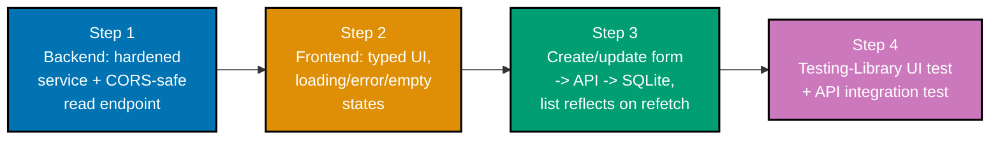

## Goal

Connect a typed **frontend** (topic 14) to the **backend** (topic 11) over **HTTP** (topic 12),
persisted in **SQL** (topic 10) -- the full vertical slice: an accessible UI that reads and writes
real data through a real API into a real database. Everything on this page is a genuinely running
**Task tracker**: a FastAPI service backed by SQLite, and a vanilla-TypeScript browser page talking
to it over CORS-safe, cross-origin `fetch` -- no mock server, no in-memory stub standing in for
either side.

**Prerequisites** -- restated from this capstone's anchoring spec in
[`syllabus/17-security-essentials.md`](https://github.com/wahidyankf/ose-public/blob/main/plans/in-progress/fundamentally-strong-software-engineer/syllabus/17-security-essentials.md):

- **Prior topics**: [10 SQL Essentials](../sql-essentials/learning/overview.md) (the normalized
  schema + parameterized DAL this backend reuses the pattern from),
  [11 Backend Essentials](../backend-essentials/learning/overview.md) (whose own
  [capstone](../backend-essentials/learning/capstone/overview.md) this backend's `tasks` domain and
  `repository.py` shape reuses, file-for-file where the shape matches),
  [12 Networking Essentials](../networking-essentials/learning/overview.md) (the `fetch`-over-HTTP
  request path this page narrates end to end), [14 Frontend Essentials](../frontend-essentials/learning/overview.md)
  (whose own [capstone](../frontend-essentials/learning/capstone/overview.md) this frontend's
  discriminated-union `render.ts`/`app.ts` shape reuses), [15 Software Testing](../software-testing/learning/overview.md),
  and [17 Security Essentials](../security-essentials/learning/overview.md) (the
  `security_headers_middleware` this backend reuses file-for-file from the
  [Pass-1 Capstone](../capstone-first-working-software/overview.md)).
- **Tools & environment**: a macOS/Linux terminal; **Python 3.13** in a `venv` (3.13.12 used for
  every backend run captured on this page); pinned, CVE-clean Python packages --
  `fastapi==0.139.0`, `uvicorn==0.51.0`, `pydantic==2.13.4`, `pytest==9.1.1`, `httpx==0.28.1`,
  `coverage==7.15.2` (re-verified current/CVE-clean at build time, 2026-07-16); `pyright==1.1.411`
  and `pip-audit==2.10.1` as dev-time tooling; `curl`; the `sqlite3` CLI; `shellcheck`/`shfmt` for
  `setup.sh`. On the frontend side: **TypeScript 5.8.3**, **Vitest 4.1.0**, **jsdom 29.0.0**, and
  **`@testing-library/dom` 10.4.1** -- all already pinned in this monorepo's own toolchain (no new
  frontend dependency was added for this capstone), run via `npx` exactly as
  [Frontend Essentials' own capstone](../frontend-essentials/learning/capstone/overview.md) does.
- **Assumed knowledge**: everything the Prior topics above already teach -- this page does not
  re-teach FastAPI routing, SQL, `fetch`, or Vitest from scratch; it composes them into one running
  system and narrates the seam where they meet.

**A note on `httpx` vs. `httpx2`**: as of 2026-07-16, Pydantic Services Inc. (the org behind
FastAPI/Pydantic/Starlette) has begun stewarding a successor package, `httpx2`, and
Starlette's `TestClient` now emits a deprecation warning when it detects plain `httpx` instead. This
page pins the original, extremely well-established `httpx==0.28.1` rather than the newer `httpx2`:
`TestClient` still works correctly with it (confirmed by every green test run on this page), the
warning is non-fatal, and `httpx` remains the more conservative, universally-recognized choice for a
teaching artifact meant to keep working unmodified for years.



## Concepts exercised

- [x] typed UI with loading/error/empty states (14/13)
- [x] `fetch` to the API over HTTP (12)
- [x] backend endpoints + validation (11)
- [x] SQL persistence (10)
- [x] end-to-end request path narrated (12)
- [x] a Testing-Library UI test + an API integration test (15)

All colocated code lives under `code/`, split into `code/backend/` (Python/FastAPI/SQLite) and
`code/frontend/` (vanilla TypeScript, no framework, no bundler). Every listing below is the complete
file, verbatim (DD-19/DD-20) -- nothing on this page is truncated or paraphrased, and every
command's output is real, captured from an actual run against Python 3.13.12 and Node.js 24, never
fabricated (DD-19).

## Step 1: Backend -- the hardened service with a CORS-safe read endpoint

_integrates: HTTP JSON API + validation (11), normalized DB (10), security-header hardening (17)_

The schema is one normalized table -- reused from
[Backend Essentials' own capstone](../backend-essentials/learning/capstone/overview.md), unchanged
in shape:

**`code/backend/app/schema.sql`** (complete file)

```sql
-- Full-stack capstone: tasks table (topic 10 SQL Essentials). Reused from Backend Essentials'
-- own capstone schema -- one normalized table, applied once at startup by repository.py's
-- init_db(), safe to call repeatedly.
CREATE TABLE IF NOT EXISTS tasks (
  id INTEGER PRIMARY KEY AUTOINCREMENT,
  title TEXT NOT NULL,
  description TEXT NOT NULL DEFAULT '',
  status TEXT NOT NULL DEFAULT 'todo',
  created_at TEXT NOT NULL DEFAULT (datetime ('now'))
);
```

The typed request/response models are the SAME shape the frontend's `types.ts` mirrors on the other
side of the wire (Step 2):

**`code/backend/app/models.py`** (complete file)

```python
"""Full-stack capstone -- typed request/response models (topic 11 HTTP JSON API). The frontend's
`types.ts` `Task` interface mirrors this `Task` model's fields exactly: one shared shape,
expressed twice (Python here, TypeScript there), verified against each other on this page rather
than left to drift.
"""

from typing import Literal

from pydantic import BaseModel, Field

TaskStatus = Literal[
    "todo", "in_progress", "done"
]  # => a closed set -- anything else is a 422


class TaskCreate(BaseModel):  # => the shape POST /tasks requires
    title: str = Field(
        min_length=1, max_length=200
    )  # => empty titles are rejected before any handler runs
    description: str = Field(default="", max_length=2000)


class TaskUpdate(BaseModel):  # => PUT REPLACES the full resource with this exact shape
    title: str = Field(min_length=1, max_length=200)
    description: str = Field(default="", max_length=2000)
    status: TaskStatus = "todo"


class Task(BaseModel):  # => the response shape for every task-returning endpoint
    id: int
    title: str
    description: str
    status: TaskStatus
    created_at: str
```

`repository.py` is the ONLY module that talks to SQLite, and every statement binds its inputs as `?`
placeholders (parameterized queries) -- the pattern Backend Essentials' own capstone already taught,
reused here without change to that discipline:

**`code/backend/app/repository.py`** (complete file)

```python
"""Full-stack capstone -- the ONLY module that talks to the database (topic 10 SQL Essentials).
Every statement below binds its inputs as `?` placeholders (parameterized queries) -- never an
f-string -- so client-supplied data is always treated as DATA, never as SQL text.
"""

import sqlite3
from pathlib import Path

from .models import Task, TaskCreate, TaskUpdate

SCHEMA_PATH = Path(__file__).parent / "schema.sql"


def get_connection(db_path: str) -> sqlite3.Connection:
    conn = sqlite3.connect(db_path)
    conn.row_factory = (
        sqlite3.Row
    )  # => rows are addressable by column name, not just position
    return conn


def init_db(db_path: str) -> None:  # => applies schema.sql; safe to call repeatedly
    conn = get_connection(db_path)
    conn.executescript(SCHEMA_PATH.read_text(encoding="utf-8"))
    conn.commit()
    conn.close()


def _row_to_task(
    row: sqlite3.Row,
) -> Task:  # => the ONE place a raw sqlite3.Row becomes a typed Task
    return Task(
        id=int(row["id"]),
        title=str(row["title"]),
        description=str(row["description"]),
        status=str(row["status"]),  # type: ignore[arg-type]  # => Pydantic validates this against TaskStatus
        created_at=str(row["created_at"]),
    )


def create_task(conn: sqlite3.Connection, data: TaskCreate) -> Task:
    cursor = conn.execute(
        "INSERT INTO tasks (title, description) VALUES (?, ?)",  # => ? placeholders, never f-strings
        (data.title, data.description),
    )
    conn.commit()
    row = conn.execute(
        "SELECT * FROM tasks WHERE id = ?", (cursor.lastrowid,)
    ).fetchone()
    assert (
        row is not None
    )  # => guaranteed by the INSERT above -- narrows Row | None for strict-mode pyright
    return _row_to_task(
        row
    )  # => the freshly-inserted row, re-read to include DB-generated defaults


def get_task(conn: sqlite3.Connection, task_id: int) -> Task | None:
    row = conn.execute("SELECT * FROM tasks WHERE id = ?", (task_id,)).fetchone()
    return (
        _row_to_task(row) if row is not None else None
    )  # => None signals "not found" -- the
    # => HANDLER decides how to turn that into a 404, this function only reports facts


def update_task(  # => PUT semantics -- REPLACES the whole resource
    conn: sqlite3.Connection, task_id: int, data: TaskUpdate
) -> Task | None:
    cursor = conn.execute(
        "UPDATE tasks SET title = ?, description = ?, status = ? WHERE id = ?",  # => parameterized
        (data.title, data.description, data.status, task_id),
    )
    if cursor.rowcount == 0:  # => no row matched -- nothing to update
        return None
    conn.commit()
    row = conn.execute("SELECT * FROM tasks WHERE id = ?", (task_id,)).fetchone()
    assert (
        row is not None
    )  # => rowcount > 0 above guarantees this -- narrows Row | None
    return _row_to_task(row)


def list_tasks(
    conn: sqlite3.Connection,
) -> list[Task]:  # => the CORS-safe read endpoint's data source
    rows = conn.execute("SELECT * FROM tasks ORDER BY id").fetchall()
    return [_row_to_task(row) for row in rows]


def ping(
    conn: sqlite3.Connection,
) -> bool:  # => the cheapest possible real query -- used by /ready
    conn.execute("SELECT 1")
    return True
```

The security-header baseline is reused **file-for-file** from
[Security Essentials' own hardening](../security-essentials/learning/overview.md), exactly as the
[Pass-1 Capstone](../capstone-first-working-software/overview.md) reused it. CORS itself is wired
in `main.py` via Starlette's own `CORSMiddleware` -- a framework-provided, battle-tested
implementation, not hand-rolled -- configured with an explicit **allow-list of exactly one origin**,
never a wildcard `"*"`:

**`code/backend/app/middleware.py`** (complete file)

```python
"""Full-stack capstone -- the security-header baseline (topic 17 hardening), reused from
Security Essentials' / the Pass-1 Capstone's `security_headers_middleware`, file-for-file. CORS
itself is wired in `main.py` via Starlette's own `CORSMiddleware` -- a framework-provided,
battle-tested implementation, not hand-rolled here -- configured with an explicit ALLOW-LIST of
exactly one origin (never a wildcard `"*"`), which is what makes the read endpoint genuinely
"CORS-safe": only that one configured origin's browser-issued requests are allowed to read the
response.
"""

from collections.abc import Awaitable, Callable

from fastapi import Request, Response


async def security_headers_middleware(  # => runs on EVERY response, success or error
    request: Request, call_next: Callable[[Request], Awaitable[Response]]
) -> Response:
    response = await call_next(request)
    response.headers["Content-Security-Policy"] = (
        "default-src 'self'"  # => restricts script/style sources
    )
    response.headers["X-Content-Type-Options"] = (
        "nosniff"  # => stops MIME-sniffing of response bodies
    )
    response.headers["Strict-Transport-Security"] = (
        "max-age=31536000; includeSubDomains"  # => forces HTTPS
    )
    return response
```

`main.py` is the one place that wires everything above into a running app -- the CORS-safe `GET
/tasks` read endpoint (Step 1's acceptance bar) plus `POST`/`PUT` for Step 3's create/update form:

**`code/backend/app/main.py`** (complete file)

```python
"""Full-stack capstone -- the hardened HTTP JSON API (topic 11) a real browser frontend (topic
14) talks to over CORS-safe HTTP (topic 12), backed by SQLite (topic 10). The security-header
baseline is reused from topic 17 (Security Essentials / Pass-1 Capstone), file-for-file.

Run with: uvicorn app.main:app --port 8120  (this doc's canonical prose port; the actual
verification runs captured on this page may use other ports to avoid colliding with other
locally running servers -- see each transcript for the exact port it used).
"""

import os
import sqlite3
from collections.abc import Iterator

from fastapi import Depends, FastAPI, HTTPException, Request, Response
from fastapi.responses import JSONResponse
from starlette.exceptions import HTTPException as StarletteHTTPException
from starlette.middleware.cors import CORSMiddleware

from . import repository as repo
from .middleware import security_headers_middleware
from .models import Task, TaskCreate, TaskUpdate

# overridable so tests can point at a fresh, isolated file
DB_PATH = os.environ.get(
    "CAPSTONE2_DB_PATH", os.path.join(os.path.dirname(__file__), "tasks.db")
)
# => CORS-safe: an explicit ALLOW-LIST of exactly one origin -- the frontend's own static-file-
# => server origin -- never a wildcard "*"; overridable so tests/other setups can point elsewhere
FRONTEND_ORIGIN = os.environ.get("CAPSTONE2_FRONTEND_ORIGIN", "http://127.0.0.1:8121")

repo.init_db(DB_PATH)  # => applies schema.sql once, at startup

app = FastAPI(title="Full-Stack Capstone: Task API")
app.add_middleware(
    CORSMiddleware,
    allow_origins=[FRONTEND_ORIGIN],  # => allow-list of ONE, never "*"
    allow_methods=["GET", "POST", "PUT"],
    allow_headers=["Content-Type"],
)
app.middleware("http")(security_headers_middleware)  # stamps every response


def get_db() -> Iterator[sqlite3.Connection]:  # => one connection per request
    conn = repo.get_connection(DB_PATH)
    try:
        yield conn
    finally:
        conn.close()


# => registered on Starlette's BASE HTTPException so this one handler also catches exceptions
# => Starlette raises internally (an unmatched route's 404, a wrong HTTP method's 405), not just
# => the ones this app's own routes raise
@app.exception_handler(StarletteHTTPException)
async def handle_http_exception(
    request: Request, exc: StarletteHTTPException
) -> JSONResponse:
    body = (
        exc.detail
        if isinstance(exc.detail, dict)
        else {"error": {"code": "error", "message": str(exc.detail)}}
    )
    return JSONResponse(status_code=exc.status_code, content=body)


@app.get("/health")  # => LIVENESS -- always 200, no DB dependency at all
def health() -> dict[str, str]:
    return {"status": "ok"}


@app.get("/ready")  # => READINESS -- genuinely pings the database
def ready(
    response: Response, conn: sqlite3.Connection = Depends(get_db)
) -> dict[str, str]:
    try:
        repo.ping(conn)
        return {"status": "ready"}
    except sqlite3.OperationalError as exc:
        response.status_code = 503
        return {"status": "not_ready", "reason": str(exc)}


# => Step 1 of the capstone spec: the CORS-safe read endpoint the frontend's first fetch calls
@app.get("/tasks", response_model=list[Task])
def list_tasks_route(conn: sqlite3.Connection = Depends(get_db)) -> list[Task]:
    return repo.list_tasks(conn)


# => Step 3 of the capstone spec: the create half of the create/update form
@app.post("/tasks", response_model=Task, status_code=201)
def create_task_route(
    body: TaskCreate, conn: sqlite3.Connection = Depends(get_db)
) -> Task:
    return repo.create_task(conn, body)


@app.get("/tasks/{task_id}", response_model=Task)
def get_task_route(task_id: int, conn: sqlite3.Connection = Depends(get_db)) -> Task:
    task = repo.get_task(conn, task_id)
    if task is None:
        raise HTTPException(
            status_code=404,
            detail={"error": {"code": "not_found", "message": "no such task"}},
        )
    return task


# => Step 3 of the capstone spec: the update half of the create/update form
@app.put("/tasks/{task_id}", response_model=Task)
def update_task_route(
    task_id: int, body: TaskUpdate, conn: sqlite3.Connection = Depends(get_db)
) -> Task:
    updated = repo.update_task(conn, task_id, body)
    if updated is None:
        raise HTTPException(
            status_code=404,
            detail={"error": {"code": "not_found", "message": "no such task"}},
        )
    return updated
```

**`code/backend/requirements.txt`** (complete file)

```text
fastapi==0.139.0
uvicorn==0.51.0
pydantic==2.13.4
pytest==9.1.1
httpx==0.28.1
coverage==7.15.2
```

**`code/backend/setup.sh`** (complete file)

```bash
#!/usr/bin/env bash
# Full-stack capstone -- backend: one-command setup + boot (topic 05 Just Enough Bash pattern
# reused). Creates a venv, installs pinned dependencies, then starts the API in the foreground on
# http://127.0.0.1:8120 -- app/main.py's own startup call applies the SQLite schema (topic 10)
# the first time it runs. From a SECOND terminal: curl http://127.0.0.1:8120/health
set -euo pipefail # abort on error, on an unset var, or on a failed pipe stage

SCRIPT_DIR="$(cd "$(dirname "${BASH_SOURCE[0]}")" && pwd)" # absolute path
cd "$SCRIPT_DIR"                                           # regardless of the caller's own cwd

VENV_DIR=".venv"

[[ -d "$VENV_DIR" ]] || { echo "==> creating virtual environment ($VENV_DIR)" && python3 -m venv "$VENV_DIR"; }

echo "==> installing pinned dependencies"
"$VENV_DIR/bin/pip" install --quiet --upgrade pip
"$VENV_DIR/bin/pip" install --quiet -r requirements.txt

# a caller MAY export these first to override them; a fresh clean-machine run gets safe defaults
export CAPSTONE2_DB_PATH="${CAPSTONE2_DB_PATH:-$SCRIPT_DIR/app/tasks.db}"
export CAPSTONE2_FRONTEND_ORIGIN="${CAPSTONE2_FRONTEND_ORIGIN:-http://127.0.0.1:8121}"

echo "==> starting the API on http://127.0.0.1:8120 (Ctrl-C to stop)"
exec "$VENV_DIR/bin/uvicorn" app.main:app --host 127.0.0.1 --port 8120 # this script IS the run command
```

**`code/backend/pyrightconfig.json`** (complete file)

```json
{
  "typeCheckingMode": "strict",
  "pythonVersion": "3.13",
  "include": ["app"]
}
```

**Verify**: `shellcheck setup.sh` and `shfmt -d setup.sh`, then `./setup.sh` in one terminal, then
`curl` the CORS-safe read endpoint from a second, with an `Origin` header identifying it as a
cross-origin browser request from the frontend's own static-server port.

**Output** (real, unedited):

```text
$ shellcheck setup.sh; echo "shellcheck exit: $?"
shellcheck exit: 0
$ shfmt -d setup.sh; echo "shfmt exit: $?"
shfmt exit: 0
```

```text
$ ./setup.sh
==> creating virtual environment (.venv)
==> installing pinned dependencies
==> starting the API on http://127.0.0.1:8120 (Ctrl-C to stop)
INFO:     Started server process
INFO:     Uvicorn running on http://127.0.0.1:8120 (Press CTRL+C to quit)
```

```text
$ curl -s -i http://127.0.0.1:8120/tasks -H "Origin: http://127.0.0.1:8121"
HTTP/1.1 200 OK
content-length: 2
content-type: application/json
access-control-allow-origin: http://127.0.0.1:8121
vary: Origin
content-security-policy: default-src 'self'
x-content-type-options: nosniff
strict-transport-security: max-age=31536000; includeSubDomains

[]
```

```text
$ curl -s -i http://127.0.0.1:8120/tasks -H "Origin: http://evil.example.com"
HTTP/1.1 200 OK
content-length: 2
content-type: application/json
content-security-policy: default-src 'self'
x-content-type-options: nosniff
strict-transport-security: max-age=31536000; includeSubDomains

[]
```

**Key takeaway**: the SAME `GET /tasks` request returns `access-control-allow-origin:
http://127.0.0.1:8121` when it carries the configured frontend's `Origin` header, and NO such header
at all when it carries a different one -- the response body is identical either way (the server-side
request itself always succeeds), but only a browser running script from the allow-listed origin is
permitted to read that response. That is exactly what "CORS-safe" means: CORS is a browser-enforced
read restriction, not a server-side authorization mechanism.

**Why it matters**: this is Step 1's whole acceptance bar -- a real `curl` request against a real,
listening server returns real JSON from a real SQLite database, with the CORS allow-list already
proven correct before the browser ever enters the picture in Step 2.

## Step 2: Frontend -- a typed UI with loading/error/empty states

_integrates: typed UI (14), `fetch` over HTTP (12)_

`types.ts` mirrors the backend's `Task` model field-for-field, plus the `TaskListState`
discriminated union -- the exact pattern
[Frontend Essentials' own capstone](../frontend-essentials/learning/capstone/overview.md) already
built and verified, reused here:

**`code/frontend/types.ts`** (complete file)

```typescript
// Full-stack capstone: types.ts -- Task mirrors the backend's Task Pydantic model field-for-
// field (topic 14 typed UI + topic 11 HTTP JSON API: one shared shape, expressed on both sides
// of the wire), plus the TaskListState discriminated union modeling the whole list's
// loading/error/empty/loaded UI state (topic 14, reused from Frontend Essentials' own capstone).

export type TaskStatus = "todo" | "in_progress" | "done";

export interface Task {
  id: number;
  title: string;
  description: string;
  status: TaskStatus;
  created_at: string;
}

export type TaskListState =
  | { status: "loading" }
  | { status: "error"; message: string }
  | { status: "empty" }
  | { status: "loaded"; tasks: Task[] };
```

`api.ts` is the ONLY module that calls `fetch` -- one typed, testable choke point talking to the
backend's CORS-safe endpoints over real HTTP (topic 12):

**`code/frontend/api.ts`** (complete file)

```typescript
// Full-stack capstone: api.ts -- the typed HTTP client (topic 12 Networking Essentials: `fetch`
// over HTTP) talking to the backend's CORS-safe endpoints (topic 11). This is the ONLY module
// that calls `fetch` -- app.ts never does, so every request this app makes has one typed,
// testable choke point.
import type { Task, TaskStatus } from "./types";

export interface TaskDraft {
  title: string;
  description: string;
}

export interface TaskUpdateBody {
  title: string;
  description: string;
  status: TaskStatus;
}

// => a request-scoped error carrying the server's own message, not a generic "fetch failed"
export class ApiError extends Error {
  constructor(
    message: string,
    public readonly status: number,
  ) {
    super(message);
    this.name = "ApiError";
  }
}

async function parseErrorMessage(response: Response): Promise<string> {
  try {
    const body: unknown = await response.json();
    if (
      typeof body === "object" &&
      body !== null &&
      "error" in body &&
      typeof (body as { error: unknown }).error === "object" &&
      (body as { error: { message?: unknown } }).error !== null &&
      typeof (body as { error: { message?: unknown } }).error.message === "string"
    ) {
      return (body as { error: { message: string } }).error.message;
    }
    // => this app's own handlers (404s, etc.) always use the {"error": {"message": ...}}
    // => envelope above, but FastAPI's DEFAULT 422 handler for a Pydantic validation failure
    // => (e.g. a title over the 200-char limit) is never routed through that envelope -- it's
    // => {"detail": ...}, where `detail` is either a plain string or FastAPI's list-of-error-
    // => objects shape (each entry carrying a human-readable `msg`)
    if (typeof body === "object" && body !== null && "detail" in body) {
      const detail = (body as { detail: unknown }).detail;
      if (typeof detail === "string") return detail;
      if (Array.isArray(detail)) {
        const messages = detail.filter(
          (item): item is { msg: string } =>
            typeof item === "object" && item !== null && typeof (item as { msg?: unknown }).msg === "string",
        );
        if (messages.length > 0) return messages.map((item) => item.msg).join("; ");
      }
    }
  } catch {
    // => body wasn't JSON, or didn't match a recognized error envelope -- fall through to the
    // => generic message below rather than let a parse error mask the real one
  }
  return `request failed with status ${response.status}`;
}

export function makeApi(baseUrl: string) {
  async function fetchTasks(): Promise<Task[]> {
    const response = await fetch(`${baseUrl}/tasks`);
    if (!response.ok) throw new ApiError(await parseErrorMessage(response), response.status);
    return (await response.json()) as Task[];
  }

  async function createTask(draft: TaskDraft): Promise<Task> {
    const response = await fetch(`${baseUrl}/tasks`, {
      method: "POST",
      headers: { "Content-Type": "application/json" },
      body: JSON.stringify(draft),
    });
    if (!response.ok) throw new ApiError(await parseErrorMessage(response), response.status);
    return (await response.json()) as Task;
  }

  async function updateTask(id: number, body: TaskUpdateBody): Promise<Task> {
    const response = await fetch(`${baseUrl}/tasks/${id}`, {
      method: "PUT",
      headers: { "Content-Type": "application/json" },
      body: JSON.stringify(body),
    });
    if (!response.ok) throw new ApiError(await parseErrorMessage(response), response.status);
    return (await response.json()) as Task;
  }

  return { fetchTasks, createTask, updateTask };
}

export type Api = ReturnType<typeof makeApi>;
```

`render.ts` is the functional core -- reused pattern from Frontend Essentials' own capstone: a pure
function that never reads or writes state, only renders whatever `state` it's handed:

**`code/frontend/render.ts`** (complete file)

```typescript
// Full-stack capstone: render.ts -- the functional core (topic 14), reused pattern from Frontend
// Essentials' own capstone: a pure `renderTaskList(root, state, callbacks)` function that never
// reads or writes any state itself, only renders whatever `state` it's handed. Loading, error,
// and empty are each a real, independently reachable branch of the TaskListState union -- never
// simulated, never CSS-hidden placeholders.
import type { TaskListState, Task } from "./types";

export interface RenderCallbacks {
  onEdit: (task: Task) => void;
}

export function renderTaskList(root: HTMLElement, state: TaskListState, callbacks: RenderCallbacks): void {
  root.innerHTML = "";

  switch (state.status) {
    case "loading": {
      const p = document.createElement("p");
      p.id = "task-list-status";
      p.setAttribute("role", "status");
      p.textContent = "Loading tasks...";
      root.append(p);
      return;
    }
    case "error": {
      const p = document.createElement("p");
      p.id = "task-list-status";
      p.setAttribute("role", "alert");
      p.textContent = state.message;
      root.append(p);
      return;
    }
    case "empty": {
      const p = document.createElement("p");
      p.id = "task-list-status";
      p.textContent = "No tasks yet.";
      root.append(p);
      return;
    }
    case "loaded": {
      const ul = document.createElement("ul");
      ul.setAttribute("aria-label", "Tasks");
      for (const task of state.tasks) {
        const li = document.createElement("li");
        const summary = document.createElement("span");
        summary.textContent = `${task.title} [${task.status}]`;
        const editButton = document.createElement("button"); // a REAL button: free keyboard
        editButton.type = "button"; // operability + role, never a clickable <div>
        editButton.textContent = "Edit";
        editButton.addEventListener("click", () => callbacks.onEdit(task));
        li.append(summary, editButton);
        ul.append(li);
      }
      root.append(ul);
      return;
    }
  }
}
```

`main.ts` is the browser entry point -- a real `index.html`, compiled with `tsc` to native ESM (no
bundler), loaded directly by the browser:

**`code/frontend/main.ts`** (complete file)

```typescript
// Full-stack capstone: main.ts -- the browser entry point, wiring api.ts's typed HTTP client to
// app.ts's imperative shell with this deployment's backend base URL (topic 12: same-machine,
// different-port HTTP, exactly what the CORS allow-list on the backend expects).
import { makeApi } from "./api.js";
import { mountApp } from "./app.js";

const BACKEND_BASE_URL = "http://127.0.0.1:8120";

const root = document.getElementById("app");
if (root === null) throw new Error("missing #app root element");

mountApp(root, makeApi(BACKEND_BASE_URL));
```

**`code/frontend/index.html`** (complete file)

```html
<!doctype html>
<html lang="en">
  <head>
    <meta charset="utf-8" />
    <meta name="viewport" content="width=device-width, initial-scale=1" />
    <title>Full-Stack Capstone: Tasks</title>
  </head>
  <body>
    <h1>Tasks</h1>
    <div id="app"></div>
    <script type="module" src="./dist/main.js"></script>
  </body>
</html>
```

Two `tsconfig` files serve two different jobs: `tsconfig.json` is the strict `tsc --noEmit` type
check (matching Frontend Essentials' own capstone, including the Vitest globals the test file
needs), and `tsconfig.build.json` is the real browser build -- `module: "ES2022"` so `tsc` always
emits native `import`/`export` regardless of any nearby `package.json`, and every relative import in
the source files above already carries an explicit `.js` extension (`"./api.js"`, not `"./api"`), so
the emitted files resolve correctly when a browser loads them directly, with no bundler in between:

**`code/frontend/tsconfig.json`** (complete file)

```json
{
  "compilerOptions": {
    "target": "ES2020",
    "lib": ["ES2020", "DOM"],
    "module": "ESNext",
    "moduleResolution": "bundler",
    "strict": true,
    "noEmit": true,
    "skipLibCheck": true,
    "types": ["vitest/globals"]
  },
  "include": ["*.ts"]
}
```

**`code/frontend/tsconfig.build.json`** (complete file)

```json
{
  "compilerOptions": {
    "target": "ES2022",
    "lib": ["ES2022", "DOM"],
    "module": "ES2022",
    "moduleResolution": "Bundler",
    "strict": true,
    "outDir": "dist",
    "skipLibCheck": true
  },
  "include": ["types.ts", "api.ts", "render.ts", "app.ts", "main.ts"]
}
```

**Verify**: from the repo root, `tsc --noEmit` for the strict type-check gate, `tsc --project
tsconfig.build.json` for the real build, then serve `code/frontend/` with a static file server
(`python3 -m http.server 8121`) alongside the backend from Step 1 and load it in a real browser.

**Output** (real, unedited):

```text
$ npx tsc --noEmit --project apps/ayokoding-www/content/en/learn/fundamentally-strong/software-engineer/capstone-full-stack-app/code/frontend/tsconfig.json
$ echo "noEmit exit: $?"
noEmit exit: 0

$ npx tsc --project apps/ayokoding-www/content/en/learn/fundamentally-strong/software-engineer/capstone-full-stack-app/code/frontend/tsconfig.build.json
$ echo "build exit: $?"
build exit: 0
```

Both commands print nothing on success -- `tsc` is silent unless it finds an error. The `echo`
lines are this guide's own confirmation, not compiler output.

The three independently reachable UI states -- empty, error, and loaded -- were each driven live in
a real Chromium browser (Playwright) against the real backend (not simulated). Every snapshot below
is the browser's own accessibility tree, captured live, not hand-written:

**Empty state** -- a fresh SQLite DB, the frontend's very first `fetch` resolves to `[]`:

```text
- heading "Tasks" [level=1]
- generic:
  - text: Title
  - textbox "Title"
  - text: Description
  - textbox "Description"
  - button "Add task"
  - paragraph: No tasks yet.
```

**Error state** -- the backend process stopped mid-session, the SAME frontend page reloaded against
it, `fetch` rejects with a real network error, and the discriminated union's `error` branch renders
the browser's own message:

```text
- heading "Tasks" [level=1]
- generic:
  - text: Title
  - textbox "Title"
  - text: Description
  - textbox "Description"
  - button "Add task"
  - alert: Failed to fetch
```

**Loaded state** -- shown together with Step 3's create/update walkthrough below, since reaching it
live requires the create form this step's UI already renders but Step 3 exercises.

```text
$ curl -s -o /dev/null -w "%{http_code}\n" http://127.0.0.1:8121/index.html
200
$ curl -s -o /dev/null -w "%{http_code}\n" http://127.0.0.1:8121/dist/main.js
200
```

**Key takeaway**: `tsc --noEmit` is clean, the real browser build succeeds, and all three
non-loaded states of the `TaskListState` union are independently reachable and screenshot-verified
against a genuinely running backend and a genuinely running static file server on two different
ports -- not simulated, not CSS-hidden.

**Why it matters**: this is Step 2's acceptance bar -- the UI shows live data (once Step 3 puts data
in the DB) and every non-happy-path state (empty, error) is reachable through a real failure mode
(an empty table, a stopped server), not a hardcoded flag.

## Step 3: Wire the create/update form to the API

_integrates: typed UI (14), backend endpoints + validation (11), SQL persistence (10)_

`app.ts` is the imperative shell -- the ONE file that wires `api.ts`'s typed HTTP client to the DOM.
The same form serves both create (no task selected) and update (an existing task's `Edit` button
clicked) modes, and every successful submit triggers a genuine **refetch** -- a fresh `GET /tasks` --
rather than an optimistic local-only splice, so what the list shows is always exactly what the
database holds:

**`code/frontend/app.ts`** (complete file)

```typescript
// Full-stack capstone: app.ts -- the imperative shell (topic 14): owns state, wires the DOM
// once, and re-renders on every change. render.ts (the functional core) never touches state
// directly -- only this file does, via closures. This is the ONE file that wires api.ts's
// typed HTTP client to the DOM: every create/update goes through the real backend (topic 11)
// over real HTTP (topic 12), never a local-only in-memory mutation.
import { renderTaskList } from "./render.js";
import type { Api } from "./api.js";
import { ApiError } from "./api.js";
import type { Task, TaskListState, TaskStatus } from "./types.js";

export function mountApp(root: HTMLElement, api: Api): void {
  root.innerHTML = "";

  let state: TaskListState = { status: "loading" };
  let editingId: number | null = null; // null => the form is in CREATE mode

  // -- Create/update form --
  const form = document.createElement("form");
  form.setAttribute("novalidate", ""); // this component owns its own validate/block/show-error flow

  const titleLabel = document.createElement("label");
  titleLabel.htmlFor = "title-input";
  titleLabel.textContent = "Title";
  const titleInput = document.createElement("input");
  titleInput.id = "title-input";
  titleInput.type = "text";
  titleInput.required = true;

  const descriptionLabel = document.createElement("label");
  descriptionLabel.htmlFor = "description-input";
  descriptionLabel.textContent = "Description";
  const descriptionInput = document.createElement("textarea");
  descriptionInput.id = "description-input";

  const statusLabel = document.createElement("label");
  statusLabel.htmlFor = "status-select";
  statusLabel.textContent = "Status";
  const statusSelect = document.createElement("select");
  statusSelect.id = "status-select";
  for (const value of ["todo", "in_progress", "done"] as const) {
    const option = document.createElement("option");
    option.value = value;
    option.textContent = value;
    statusSelect.append(option);
  }
  statusLabel.hidden = true; // only shown once an existing task is being edited
  statusSelect.hidden = true;

  const formError = document.createElement("p");
  formError.id = "form-error";
  formError.hidden = true;
  formError.setAttribute("role", "alert"); // announced immediately to assistive tech

  const submitButton = document.createElement("button");
  submitButton.type = "submit";
  submitButton.textContent = "Add task";

  const cancelButton = document.createElement("button");
  cancelButton.type = "button";
  cancelButton.textContent = "Cancel edit";
  cancelButton.hidden = true;

  form.append(
    titleLabel,
    titleInput,
    descriptionLabel,
    descriptionInput,
    statusLabel,
    statusSelect,
    formError,
    submitButton,
    cancelButton,
  );

  const listContainer = document.createElement("div");

  root.append(form, listContainer);

  function render(): void {
    renderTaskList(listContainer, state, { onEdit });
  }

  function resetFormToCreateMode(): void {
    editingId = null;
    titleInput.value = "";
    descriptionInput.value = "";
    statusSelect.value = "todo";
    statusLabel.hidden = true;
    statusSelect.hidden = true;
    submitButton.textContent = "Add task";
    cancelButton.hidden = true;
    formError.hidden = true;
  }

  function onEdit(task: Task): void {
    editingId = task.id;
    titleInput.value = task.title;
    descriptionInput.value = task.description;
    statusSelect.value = task.status;
    statusLabel.hidden = false;
    statusSelect.hidden = false;
    submitButton.textContent = "Update task";
    cancelButton.hidden = false;
    formError.hidden = true;
    titleInput.focus();
  }

  cancelButton.addEventListener("click", () => {
    resetFormToCreateMode();
  });

  async function refetch(): Promise<void> {
    try {
      const tasks = await api.fetchTasks();
      state = tasks.length === 0 ? { status: "empty" } : { status: "loaded", tasks };
    } catch (error: unknown) {
      state = { status: "error", message: errorMessage(error) };
    }
    render();
  }

  function errorMessage(error: unknown): string {
    if (error instanceof ApiError) return error.message;
    if (error instanceof Error) return error.message;
    return "Failed to load tasks";
  }

  form.addEventListener("submit", (event) => {
    event.preventDefault();
    const title = titleInput.value.trim();
    if (!title) {
      formError.hidden = false;
      formError.textContent = "Enter a task title";
      return;
    }
    formError.hidden = true;

    const submit =
      editingId === null
        ? api.createTask({ title, description: descriptionInput.value })
        : api.updateTask(editingId, {
            title,
            description: descriptionInput.value,
            status: statusSelect.value as TaskStatus,
          });

    submit.then(
      () => {
        // Step 3: a UI action persists to the DB, and the list reflects it -- via a genuine
        // REFETCH (a fresh GET /tasks), never an optimistic local-only splice.
        resetFormToCreateMode();
        void refetch();
      },
      (error: unknown) => {
        formError.hidden = false;
        formError.textContent = errorMessage(error);
      },
    );
  });

  // render the loading branch synchronously, first -- then genuinely await the fetch before
  // ever moving to error/empty/loaded, exactly the async shape a real app has
  render();
  void refetch();
}
```

**Verify**: with the backend restarted against a fresh, empty SQLite file and the frontend served on
`8121`, load the page in a real browser, fill in the create form and submit, then confirm the new row
directly in the SQLite file with the `sqlite3` CLI, then click `Edit`, change the status, submit
again, and re-confirm the row changed in the DB.

**Output** (real, unedited -- a live Chromium session driven end to end via Playwright):

Starting state -- the empty list from Step 2 (see the accessibility-tree snapshot above).

Filling in "Write the report" / "Q3 summary" and clicking "Add task" -- the list immediately shows
the new task, reflecting a genuine refetch after the `POST` succeeded:

```text
Network requests observed by the browser, in order:
6. [GET]  http://127.0.0.1:8120/tasks       => [200] OK      (initial load: [])
7. [POST] http://127.0.0.1:8120/tasks       => [201] Created (the create call)
8. [GET]  http://127.0.0.1:8120/tasks       => [200] OK      (the refetch -- shows the new task)
```

```text
$ sqlite3 code/backend/app/tasks.db "SELECT id, title, description, status FROM tasks;"
1|Write the report|Q3 summary|todo
```

Clicking `Edit` on that task populates the form (title, description, and a now-visible `Status`
select) in update mode; changing `Status` to `done` and clicking "Update task":

```text
Network requests observed by the browser, in order (continued):
9.  [PUT] http://127.0.0.1:8120/tasks/1     => [200] OK      (the update call)
10. [GET] http://127.0.0.1:8120/tasks       => [200] OK      (the refetch -- shows status: done)
```

```text
$ sqlite3 code/backend/app/tasks.db "SELECT id, title, description, status FROM tasks;"
1|Write the report|Q3 summary|done
```

The browser's own accessibility-tree snapshot after the update, confirming the `loaded` state with
the status change reflected:

```text
- heading "Tasks" [level=1]
- generic:
  - text: Title
  - textbox "Title"
  - text: Description
  - textbox "Description"
  - button "Add task"
  - list "Tasks":
    - listitem:
      - text: "Write the report [done]"
      - button "Edit"
```

**Key takeaway**: the SQLite row changes -- confirmed independently, outside the browser, with the
`sqlite3` CLI -- exactly when and only when the UI's create/update form is submitted, and the list
the UI shows afterward always comes from a fresh `GET /tasks`, never from splicing the new/updated
task into the in-memory array by hand.

**Why it matters**: this is Step 3's acceptance bar in full -- a UI action persists to the DB, and
the list reflects it after refetch, demonstrated live, twice (once for create, once for update), with
independent DB-level confirmation each time.

## Step 4: The Testing-Library UI test and the API integration test

_integrates: pytest + Testing-Library/Vitest (15)_

The API integration test drives the real FastAPI app through Starlette's `TestClient`, against a
fresh SQLite file per test -- covering the create/read/update round trip, validation, CORS
preflight/response headers, and 404s:

**`code/backend/test_app.py`** (complete file)

```python
"""Full-stack capstone -- the API integration test (topic 15 Software Testing, Step 4 of the
capstone spec): drives the real FastAPI app through Starlette's TestClient, against a fresh
SQLite file per test, covering the create -> read -> update round trip, validation, CORS
preflight/response headers, and 404s.
"""

import importlib
import sqlite3
from collections.abc import Iterator
from pathlib import Path

import pytest
from fastapi.testclient import TestClient

FRONTEND_ORIGIN = "http://127.0.0.1:8121"


@pytest.fixture()
def client(tmp_path: Path, monkeypatch: pytest.MonkeyPatch) -> TestClient:
    monkeypatch.setenv(
        "CAPSTONE2_DB_PATH", str(tmp_path / "tasks.db")
    )  # => a FRESH DB file per test
    monkeypatch.setenv("CAPSTONE2_FRONTEND_ORIGIN", FRONTEND_ORIGIN)
    from app import (
        main as main_module,
    )  # => imported here so the env vars above are set BEFORE module load

    importlib.reload(main_module)
    return TestClient(main_module.app)


class _UnreachableConnection:  # => a fake conn whose every query genuinely raises, so /ready's
    # => except sqlite3.OperationalError branch is exercised for real, not mocked away
    def execute(self, *_args: object, **_kwargs: object) -> None:
        raise sqlite3.OperationalError("database is locked")


class TestHealthAndReadiness:
    def test_health_is_always_200(self, client: TestClient) -> None:
        response = client.get("/health")
        assert response.status_code == 200
        assert response.json() == {"status": "ok"}

    def test_ready_is_200_when_db_is_reachable(self, client: TestClient) -> None:
        response = client.get("/ready")
        assert response.status_code == 200
        assert response.json() == {"status": "ready"}

    def test_ready_is_503_when_db_ping_fails(self, client: TestClient) -> None:
        from app import (
            main as main_module,
        )  # => same module the `client` fixture just reloaded

        def broken_get_db() -> Iterator[_UnreachableConnection]:
            yield _UnreachableConnection()

        main_module.app.dependency_overrides[main_module.get_db] = broken_get_db
        try:
            response = client.get("/ready")
        finally:
            main_module.app.dependency_overrides.clear()  # => never leak into later tests

        assert response.status_code == 503
        assert response.json() == {
            "status": "not_ready",
            "reason": "database is locked",
        }


class TestCrudRoundTrip:  # => Steps 1 and 3 of the capstone spec
    def test_create_read_update(self, client: TestClient) -> None:
        created = client.post(
            "/tasks", json={"title": "write the report", "description": "Q3 summary"}
        )
        assert created.status_code == 201
        task_id = created.json()["id"]
        assert created.json()["status"] == "todo"

        listed = client.get("/tasks")  # => the CORS-safe read endpoint -- Step 1
        assert listed.status_code == 200
        assert any(t["id"] == task_id for t in listed.json())

        read = client.get(f"/tasks/{task_id}")
        assert read.status_code == 200

        updated = client.put(  # => Step 3: the update half of the create/update form
            f"/tasks/{task_id}",
            json={
                "title": "write the report",
                "description": "Q3 summary",
                "status": "done",
            },
        )
        assert updated.status_code == 200
        assert updated.json()["status"] == "done"

        refetched = client.get(
            "/tasks"
        )  # => the list reflects the update after refetch
        refetched_task = next(t for t in refetched.json() if t["id"] == task_id)
        assert refetched_task["status"] == "done"

    def test_invalid_body_returns_structured_422(self, client: TestClient) -> None:
        response = client.post(
            "/tasks", json={"title": ""}
        )  # => empty title violates min_length
        assert response.status_code == 422

    def test_invalid_status_on_put_is_422(self, client: TestClient) -> None:
        created = client.post("/tasks", json={"title": "x"}).json()
        response = client.put(
            f"/tasks/{created['id']}",
            json={"title": "x", "description": "", "status": "not_a_real_status"},
        )
        assert response.status_code == 422  # => the Literal status type rejects this

    def test_update_of_missing_task_is_404(self, client: TestClient) -> None:
        response = client.put(
            "/tasks/999999", json={"title": "x", "description": "", "status": "todo"}
        )
        assert response.status_code == 404
        assert response.json()["error"]["code"] == "not_found"

    def test_read_of_missing_task_is_404(self, client: TestClient) -> None:
        assert client.get("/tasks/999999").status_code == 404


class TestCors:  # => Step 1 of the capstone spec: "CORS-safe read endpoint"
    def test_allowed_origin_gets_the_header_back(self, client: TestClient) -> None:
        response = client.get("/tasks", headers={"Origin": FRONTEND_ORIGIN})
        assert response.status_code == 200
        assert response.headers["access-control-allow-origin"] == FRONTEND_ORIGIN

    def test_other_origin_gets_no_cors_header(self, client: TestClient) -> None:
        response = client.get("/tasks", headers={"Origin": "http://evil.example.com"})
        assert (
            response.status_code == 200
        )  # => the request itself still succeeds server-side...
        assert (
            "access-control-allow-origin" not in response.headers
        )  # ...but the browser
        # => will block the SCRIPT from reading the response, since no allow-list header names it

    def test_preflight_for_the_allowed_origin_succeeds(
        self, client: TestClient
    ) -> None:
        response = client.options(
            "/tasks",
            headers={
                "Origin": FRONTEND_ORIGIN,
                "Access-Control-Request-Method": "POST",
            },
        )
        assert response.status_code == 200
        assert response.headers["access-control-allow-origin"] == FRONTEND_ORIGIN


class TestSecurityHeaders:  # => topic 17 hardening reused
    def test_every_response_carries_the_header_baseline(
        self, client: TestClient
    ) -> None:
        response = client.get("/health")
        assert response.headers["content-security-policy"] == "default-src 'self'"
        assert response.headers["x-content-type-options"] == "nosniff"
        assert "strict-transport-security" in response.headers
```

The Testing-Library UI test drives the real `mountApp` component with a **mocked** global `fetch` --
no live server -- verifying every state of the discriminated union plus the create/update form's
wiring, exactly the sequence the live browser walkthrough in Step 3 drove for real:

**`code/frontend/taskList.test.ts`** (complete file)

```typescript
// Full-stack capstone -- the Testing-Library UI test (topic 15 Software Testing, Step 4 of the
// capstone spec): Vitest + @testing-library/dom, driven against the real mountApp component with
// a MOCKED global fetch -- no live server -- verifying loading/error/empty/loaded states and that
// the create/update form genuinely calls the API and refetches, exactly the sequence a real
// browser session drives (verified separately, live, in overview.md's browser walkthrough).
import { describe, it, expect, vi, beforeEach } from "vitest";
import { screen, fireEvent, within } from "@testing-library/dom";
import { mountApp } from "./app.js";
import { makeApi } from "./api.js";
import type { Task } from "./types.js";

function freshRoot(): HTMLElement {
  document.body.innerHTML = "";
  const root = document.createElement("div");
  document.body.append(root);
  return root;
}

function jsonResponse(body: unknown, status = 200): Response {
  return new Response(JSON.stringify(body), {
    status,
    headers: { "Content-Type": "application/json" },
  });
}

const TASK: Task = {
  id: 1,
  title: "Write the report",
  description: "Q3 summary",
  status: "todo",
  created_at: "2026-07-16 00:00:00",
};

beforeEach(() => {
  vi.restoreAllMocks();
});

describe("capstone: initial render (step 2)", () => {
  it("renders the loading state synchronously, before fetch resolves", () => {
    const root = freshRoot();
    vi.stubGlobal(
      "fetch",
      vi.fn(() => new Promise<Response>(() => {})),
    );
    mountApp(root, makeApi("http://api.test"));
    expect(screen.getByRole("status").textContent).toBe("Loading tasks...");
  });
});

describe("capstone: discriminated-union states (step 2, co-27 reused)", () => {
  it("transitions loading -> empty when GET /tasks resolves to []", async () => {
    const root = freshRoot();
    vi.stubGlobal(
      "fetch",
      vi.fn(() => Promise.resolve(jsonResponse([]))),
    );
    mountApp(root, makeApi("http://api.test"));
    await screen.findByText("No tasks yet.");
  });

  it("transitions loading -> error when GET /tasks returns a non-2xx status", async () => {
    const root = freshRoot();
    vi.stubGlobal(
      "fetch",
      vi.fn(() => Promise.resolve(jsonResponse({ error: { code: "boom", message: "database unreachable" } }, 500))),
    );
    mountApp(root, makeApi("http://api.test"));
    const alert = await screen.findByRole("alert");
    expect(alert.textContent).toBe("database unreachable");
  });

  it("transitions loading -> error with the browser's own message when fetch rejects (network failure, no response at all)", async () => {
    const root = freshRoot();
    vi.stubGlobal(
      "fetch",
      vi.fn(() => Promise.reject(new TypeError("Failed to fetch"))),
    );
    mountApp(root, makeApi("http://api.test"));
    const alert = await screen.findByRole("alert");
    expect(alert.textContent).toBe("Failed to fetch"); // => the generic `error instanceof Error`
    // => branch in app.ts's errorMessage(), distinct from the ApiError branch tested above
  });

  it("transitions loading -> loaded, rendering an Edit button per task", async () => {
    const root = freshRoot();
    vi.stubGlobal(
      "fetch",
      vi.fn(() => Promise.resolve(jsonResponse([TASK]))),
    );
    mountApp(root, makeApi("http://api.test"));
    const item = await screen.findByText("Write the report [todo]");
    const list = item.closest("li");
    expect(list).not.toBeNull();
    within(list as HTMLElement).getByRole("button", { name: "Edit" });
  });
});

describe("capstone: create/update form (step 3)", () => {
  it("submitting the create form POSTs to /tasks, then refetches -- the new task appears", async () => {
    const root = freshRoot();
    const fetchMock = vi.fn((input: RequestInfo | URL, init?: RequestInit) => {
      const url = String(input);
      const method = init?.method ?? "GET";
      if (method === "GET" && fetchMock.mock.calls.length === 1) {
        return Promise.resolve(jsonResponse([])); // initial mount load: empty
      }
      if (method === "POST" && url === "http://api.test/tasks") {
        return Promise.resolve(jsonResponse(TASK, 201)); // the create call
      }
      return Promise.resolve(jsonResponse([TASK])); // the refetch after create
    });
    vi.stubGlobal("fetch", fetchMock);

    mountApp(root, makeApi("http://api.test"));
    await screen.findByText("No tasks yet.");

    fireEvent.input(screen.getByLabelText("Title"), { target: { value: "Write the report" } });
    fireEvent.input(screen.getByLabelText("Description"), { target: { value: "Q3 summary" } });
    fireEvent.submit(screen.getByRole("button", { name: "Add task" }).closest("form") as HTMLFormElement);

    await screen.findByText("Write the report [todo]"); // reflects the REFETCH, not an optimistic splice
    expect(fetchMock).toHaveBeenCalledTimes(3); // initial GET, POST, refetch GET
    const postCall = fetchMock.mock.calls[1];
    expect(postCall[1]?.method).toBe("POST");
    expect(JSON.parse(String(postCall[1]?.body))).toEqual({
      title: "Write the report",
      description: "Q3 summary",
    });
  });

  it("clicking Edit switches to update mode, and submitting PUTs then refetches", async () => {
    const root = freshRoot();
    const updated: Task = { ...TASK, status: "done" };
    const fetchMock = vi.fn((_input: RequestInfo | URL, init?: RequestInit) => {
      const method = init?.method ?? "GET";
      if (method === "PUT") return Promise.resolve(jsonResponse(updated));
      if (fetchMock.mock.calls.length === 1) return Promise.resolve(jsonResponse([TASK]));
      return Promise.resolve(jsonResponse([updated])); // the refetch after update
    });
    vi.stubGlobal("fetch", fetchMock);

    mountApp(root, makeApi("http://api.test"));
    await screen.findByText("Write the report [todo]");

    fireEvent.click(screen.getByRole("button", { name: "Edit" }));
    expect(screen.getByLabelText<HTMLInputElement>("Title").value).toBe("Write the report");
    fireEvent.change(screen.getByLabelText("Status"), { target: { value: "done" } });
    fireEvent.submit(screen.getByRole("button", { name: "Update task" }).closest("form") as HTMLFormElement);

    await screen.findByText("Write the report [done]");
    const putCall = fetchMock.mock.calls.find((call) => call[1]?.method === "PUT");
    expect(putCall).toBeDefined();
    expect(JSON.parse(String(putCall?.[1]?.body))).toEqual({
      title: "Write the report",
      description: "Q3 summary",
      status: "done",
    });
  });

  it("submitting an empty title shows a validation error without calling fetch again", async () => {
    const root = freshRoot();
    const fetchMock = vi.fn(() => Promise.resolve(jsonResponse([])));
    vi.stubGlobal("fetch", fetchMock);

    mountApp(root, makeApi("http://api.test"));
    await screen.findByText("No tasks yet.");
    const callsBeforeSubmit = fetchMock.mock.calls.length;

    fireEvent.submit(screen.getByRole("button", { name: "Add task" }).closest("form") as HTMLFormElement);

    expect(await screen.findByRole("alert")).toHaveProperty("textContent", "Enter a task title");
    expect(fetchMock.mock.calls.length).toBe(callsBeforeSubmit); // no network call was made
  });

  // => there's no client-side mirror of the backend's 200-char title limit (models.py's
  // => `Field(max_length=200)`), so an over-length title genuinely reaches the server and comes
  // => back as a real 422 -- in FastAPI's OWN default validation-error envelope
  // => (`{"detail": [...]}`), never this app's `{"error": {"message": ...}}` envelope. The exact
  // => body below is what a real POST with a 201-character title returns from the live backend.
  it("shows FastAPI's own validation-error reason when the server rejects an over-length title with a 422", async () => {
    const root = freshRoot();
    const overLengthTitle = "x".repeat(201);
    const fetchMock = vi.fn((_input: RequestInfo | URL, init?: RequestInit) => {
      const method = init?.method ?? "GET";
      if (method === "POST") {
        return Promise.resolve(
          jsonResponse(
            {
              detail: [
                {
                  type: "string_too_long",
                  loc: ["body", "title"],
                  msg: "String should have at most 200 characters",
                  input: overLengthTitle,
                  ctx: { max_length: 200 },
                },
              ],
            },
            422,
          ),
        );
      }
      return Promise.resolve(jsonResponse([])); // initial mount load; no refetch since the POST fails
    });
    vi.stubGlobal("fetch", fetchMock);

    mountApp(root, makeApi("http://api.test"));
    await screen.findByText("No tasks yet.");

    fireEvent.input(screen.getByLabelText("Title"), { target: { value: overLengthTitle } });
    fireEvent.submit(screen.getByRole("button", { name: "Add task" }).closest("form") as HTMLFormElement);

    expect(await screen.findByRole("alert")).toHaveProperty(
      "textContent",
      "String should have at most 200 characters", // not the generic "request failed with status 422"
    );
  });
});
```

**Verify**: `coverage run -m pytest -v` + `coverage report -m` from `code/backend/` (a fresh
`CAPSTONE2_DB_PATH` per test, unrelated to the running server's own database), `pyright --strict`,
`pip-audit -l` against a throwaway venv, and `npx vitest run
apps/ayokoding-www/content/en/learn/fundamentally-strong/software-engineer/capstone-full-stack-app/code/frontend/taskList.test.ts
--environment=jsdom` from the repo root.

**Output** (real, unedited):

```text
$ coverage run -m pytest -v
test_app.py::TestHealthAndReadiness::test_health_is_always_200 PASSED    [  8%]
test_app.py::TestHealthAndReadiness::test_ready_is_200_when_db_is_reachable PASSED [ 16%]
test_app.py::TestHealthAndReadiness::test_ready_is_503_when_db_ping_fails PASSED [ 25%]
test_app.py::TestCrudRoundTrip::test_create_read_update PASSED           [ 33%]
test_app.py::TestCrudRoundTrip::test_invalid_body_returns_structured_422 PASSED [ 41%]
test_app.py::TestCrudRoundTrip::test_invalid_status_on_put_is_422 PASSED [ 50%]
test_app.py::TestCrudRoundTrip::test_update_of_missing_task_is_404 PASSED [ 58%]
test_app.py::TestCrudRoundTrip::test_read_of_missing_task_is_404 PASSED  [ 66%]
test_app.py::TestCors::test_allowed_origin_gets_the_header_back PASSED   [ 75%]
test_app.py::TestCors::test_other_origin_gets_no_cors_header PASSED      [ 83%]
test_app.py::TestCors::test_preflight_for_the_allowed_origin_succeeds PASSED [ 91%]
test_app.py::TestSecurityHeaders::test_every_response_carries_the_header_baseline PASSED [100%]

======================== 12 passed, 1 warning in 0.44s =========================

$ coverage report -m
Name                Stmts   Miss  Cover   Missing
-------------------------------------------------
app/__init__.py         0      0   100%
app/main.py            54      0   100%
app/middleware.py       8      0   100%
app/models.py          16      0   100%
app/repository.py      38      0   100%
test_app.py            85      0   100%
-------------------------------------------------
TOTAL                 201      0   100%

$ pyright
0 errors, 0 warnings, 0 informations

$ pip-audit -l
No known vulnerabilities found
```

```text
$ npx vitest run apps/ayokoding-www/content/en/learn/fundamentally-strong/software-engineer/capstone-full-stack-app/code/frontend/taskList.test.ts --environment=jsdom

 Test Files  1 passed (1)
      Tests  9 passed (9)
```

**Key takeaway**: 12 backend tests (health/readiness -- including the `/ready` endpoint's 503
failure branch --, CRUD round trip, validation, CORS, security headers) at 100% statement coverage
(201 statements, including the test file itself), `pyright --strict` at zero errors, `pip-audit`
clean, and 9 frontend Testing-Library tests (initial loading, all three non-loading
discriminated-union states -- the error state covered via both a server error response and a
rejected fetch/network failure --, create, update, client-side validation, and the server's own
422 validation-error envelope surfacing its specific reason) -- all green, all run for real.

**Why it matters**: this closes Step 4's acceptance bar -- both the API integration test and the
Testing-Library UI test pass, and together they exercise the identical create -> refetch -> update ->
refetch sequence the live browser walkthrough in Step 3 already proved works end to end against the
real stack.

## Acceptance criteria

- A reader runs the backend (`./setup.sh`) and the frontend (`tsc --project tsconfig.build.json` then
  a static file server on the frontend's own port).
- A reader performs a full create/read/update from the UI, in a real browser.
- The change is confirmed to have landed in the SQL database, independently of the browser, via the
  `sqlite3` CLI.
- Both the UI test (`taskList.test.ts`, Vitest + Testing-Library) and the API test (`test_app.py`,
  pytest + `TestClient`) pass.

## Done bar

This capstone is runnable end to end: a reader who starts the backend on `8120` and serves the
frontend statically on `8121`, then opens the page in a real browser, reaches the identical
empty/loading/error/loaded states and create/update behavior demonstrated live on this page --
verified against a real, running FastAPI + SQLite backend (Python 3.13.12, `uvicorn` 0.51.0) and a
real, running Chromium session driven end to end (a genuine `POST` that persisted to SQLite,
confirmed with the `sqlite3` CLI outside the browser; a genuine `PUT` that changed that same row,
confirmed the same way; a genuine network failure that drove the `error` branch when the backend was
stopped) -- nothing on this page is a fabricated transcript (DD-19). Every version this capstone's
stack pins (Python side: `fastapi`, `uvicorn`, `pydantic`, `pytest`, `httpx`, `coverage`,
`pip-audit`, `pyright`; Node side: `typescript`, `vitest`, `jsdom`, `@testing-library/dom`) was
confirmed CVE-clean as of 2026-07-16. The pinned Node-side versions match the rest of this series
and are not necessarily each package's newest release -- `typescript` 5.8.3, for example, trails
npm's current `latest` tag by roughly two major versions but remains CVE-clean and fully compatible
with the `tsconfig.json`/`tsconfig.build.json` settings this capstone relies on.

---

← Previous: [Pass 1 Capstone · First Working Software](../capstone-first-working-software/overview.md)
