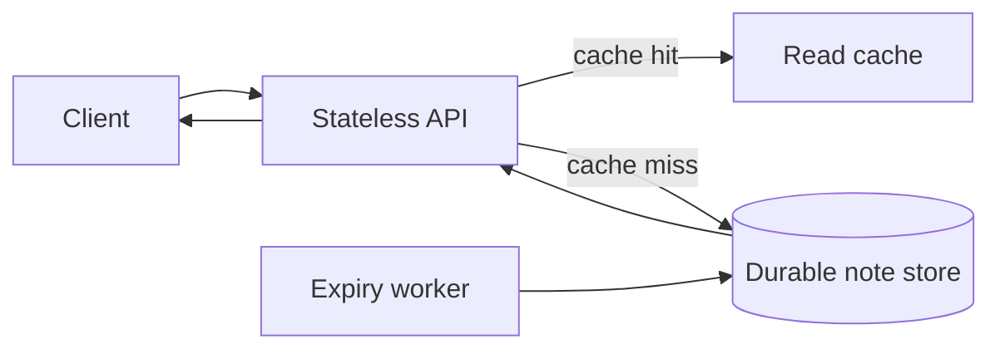

# System-design interview walkthrough

## Prompt and clarified scope

Design a service that accepts a short text note and returns it by a stable short identifier. Clarify
whether notes are public, their maximum size, retention, expected read/write mix, and availability
target. For this rehearsal: notes are public, bounded in size, retained for 30 days, read-heavy, and
need a clear degraded mode. These are interview assumptions, not a production specification.

## Round spine

1. **Functional and non-functional requirements:** create a note, retrieve it, tolerate read-heavy
   traffic, and make the expiration rule explicit.
2. **Capacity estimate:** say the assumed writes, reads, average note size, and retention window;
   use the numbers to justify a read path and storage choice instead of precision theater.
3. **High-level design:** client, API tier, cache, durable note store, and expiry worker.
4. **API and data outline:** `POST /notes` returns an id; `GET /notes/{id}` returns a note or expiry.
   Store id, content, created time, and expiration time.
5. **Deep dive:** explain cache-aside reads, including the cache miss and expiry behavior.
6. **Bottleneck:** a hot note can concentrate reads on one key and overload its cache or origin.
7. **Trade-offs:** a cache lowers read latency but can serve stale content briefly; a 30-day expiry
   limits storage but rejects a request to preserve a note indefinitely.
8. **Close:** restate the assumed constraints, the bottleneck mitigation, and which measurement would
   cause a design revision.

## Diagram

## Self-check

- [ ] I stated scope and a measurable non-functional goal before naming components.
- [ ] I used the capacity estimate to justify a decision.
- [ ] I explained one deep dive rather than listing technologies.
- [ ] I named the hot-key bottleneck and a response.
- [ ] I made both trade-offs explicit and closed with a summary.
