## Concept Flow Diagrams

### Flow 0: Blue green switch

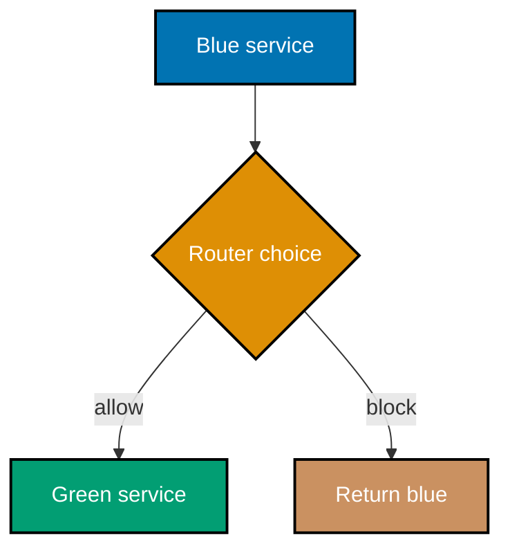

### Flow 1: Canary rollout

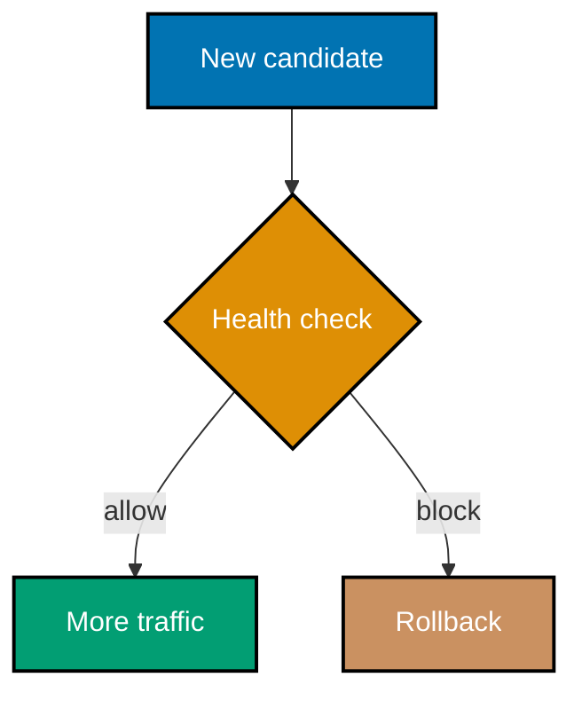

### Flow 2: Feature release

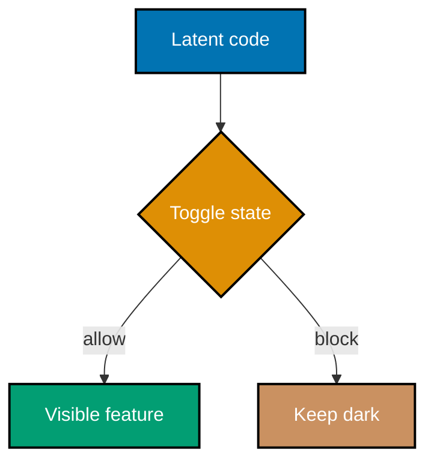

### Flow 3: Supply chain

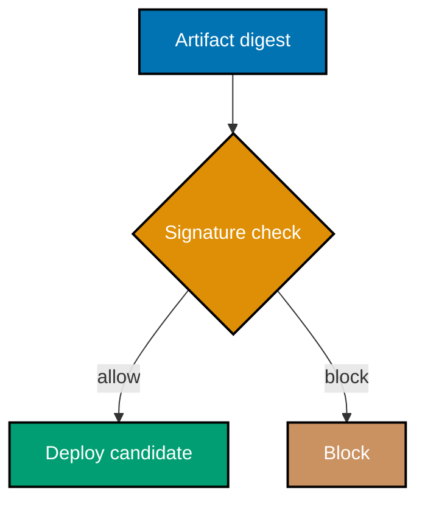

### Flow 4: Provenance gate

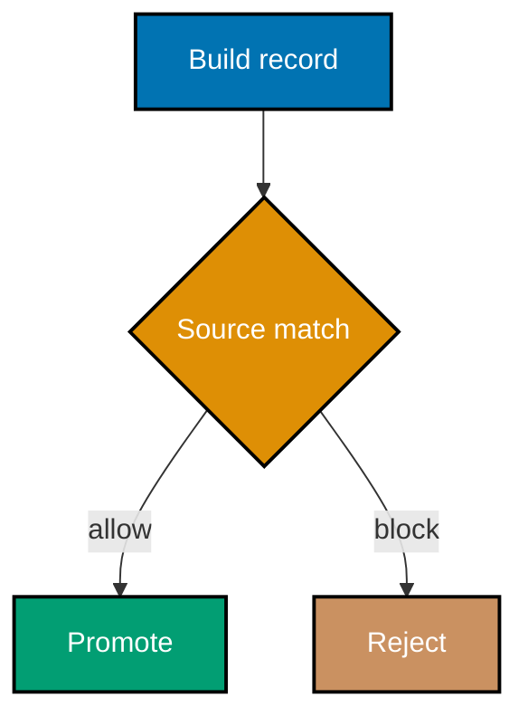

### Flow 5: DORA report

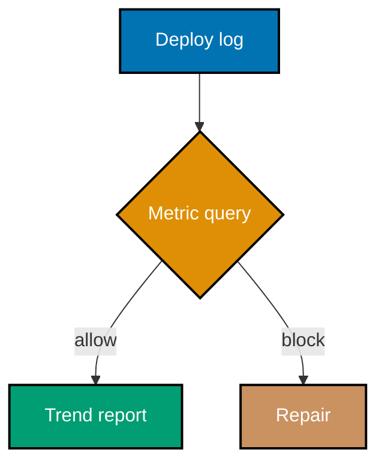

### Flow 6: Artifact promotion

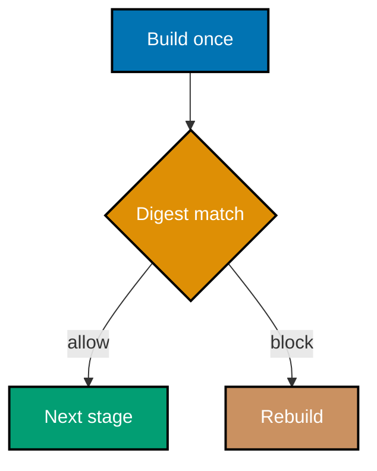

### Flow 7: Full pipeline

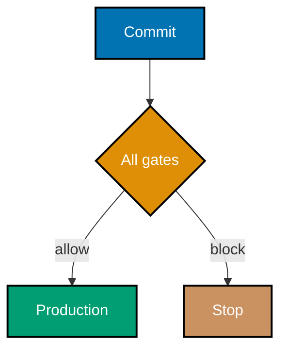

### Flow 8: Gate tradeoff

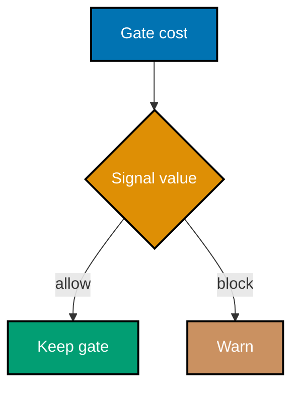

### Flow 9: Argo analysis

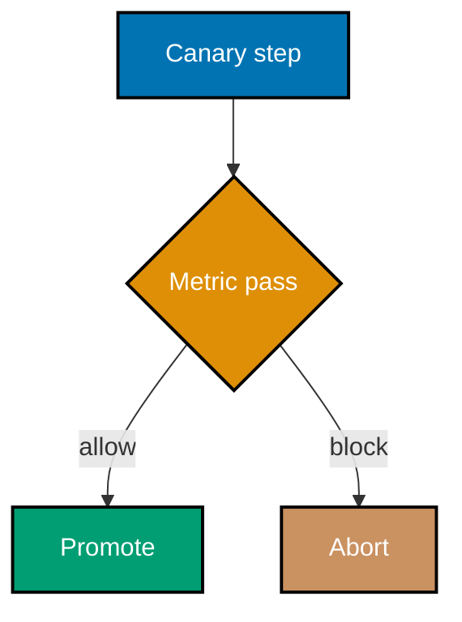

### Flow 10: Flagger analysis

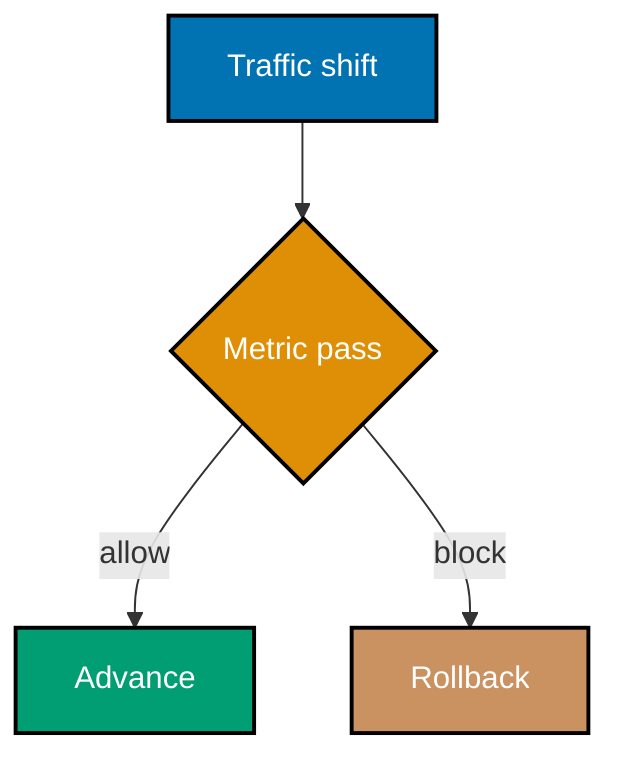

### Flow 11: Strategy choice

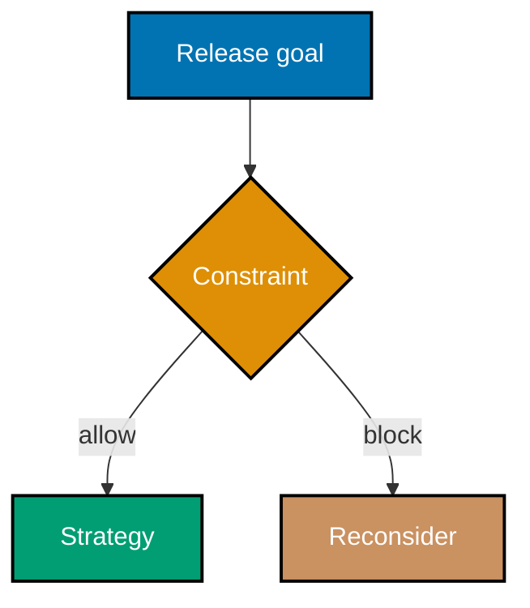

### Flow 12: Rollback decision

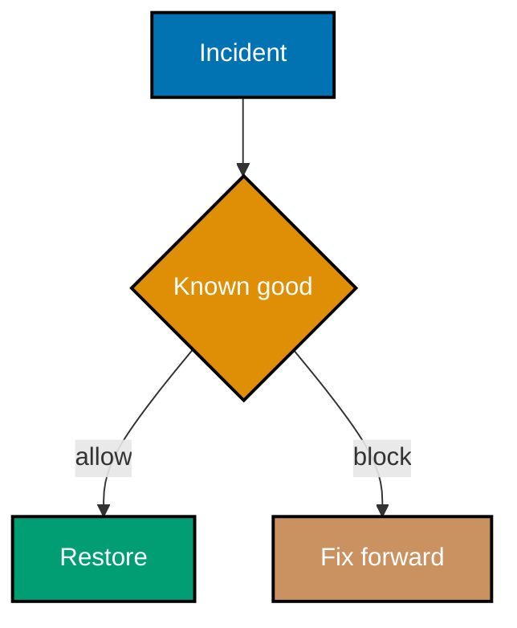

### Flow 13: Protected deploy

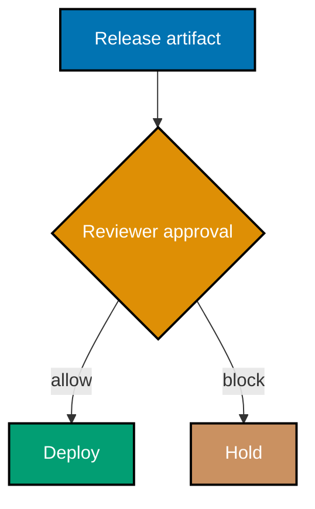

Examples 56-83 extend the evidence chain through advanced release engineering. Every lesson links to complete, dedicated YAML and typed Python artifacts that use no real credential.

---

### Example 56: Switch Blue-Green Traffic

_ex-56 · exercises co-23_

**Brief explanation**: blue-green deployment keeps two comparable environments and moves traffic in one deliberate router switch. Verify that the modeled active color changes in a single operation.

**Runnable artifact**: [workflow.yml](./code/ex-56-blue-green-switch/workflow.yml) and [automation.py](./code/ex-56-blue-green-switch/automation.py) are complete, dedicated files for this example.

```yaml
# => This label names the standalone workflow that verifies Example 56.
# => The full workflow and typed program are linked immediately above.
name: "Example 56: Switch Blue-Green Traffic"
on: workflow_dispatch
```

**Verify**: Verify that the modeled active color changes in a single operation.

**Key takeaway**: blue-green deployment keeps two comparable environments and moves traffic in one deliberate router switch.

**Why it matters**: A reliable delivery practice must remain inspectable when a release is under pressure. This focused artifact supplies a small, deterministic proof for the lesson's policy without contacting a cloud account or exposing a credential. Use the same pattern in production: state the expected condition, make its evidence machine-readable, and let a failed check prevent promotion until a human can understand and repair the cause.

---

### Example 57: Roll Back Blue-Green Traffic

_ex-57 · exercises co-23, co-26_

**Brief explanation**: blue-green rollback returns the router to the prior healthy environment, preserving a simple recovery path. Verify that the modeled router can switch back without rebuilding an artifact.

**Runnable artifact**: [workflow.yml](./code/ex-57-blue-green-rollback/workflow.yml) and [automation.py](./code/ex-57-blue-green-rollback/automation.py) are complete, dedicated files for this example.

```yaml
# => This label names the standalone workflow that verifies Example 57.
# => The full workflow and typed program are linked immediately above.
name: "Example 57: Roll Back Blue-Green Traffic"
on: workflow_dispatch
```

**Verify**: Verify that the modeled router can switch back without rebuilding an artifact.

**Key takeaway**: blue-green rollback returns the router to the prior healthy environment, preserving a simple recovery path.

**Why it matters**: A reliable delivery practice must remain inspectable when a release is under pressure. This focused artifact supplies a small, deterministic proof for the lesson's policy without contacting a cloud account or exposing a credential. Use the same pattern in production: state the expected condition, make its evidence machine-readable, and let a failed check prevent promotion until a human can understand and repair the cause.

---

### Example 58: Shift Canary Traffic Gradually

_ex-58 · exercises co-24_

**Brief explanation**: a canary release begins with a small audience and advances only after each health observation supports the next step. Verify that the first traffic weight is smaller than the final weight.

**Runnable artifact**: [workflow.yml](./code/ex-58-canary-gradual/workflow.yml) and [automation.py](./code/ex-58-canary-gradual/automation.py) are complete, dedicated files for this example.

```yaml
# => This label names the standalone workflow that verifies Example 58.
# => The full workflow and typed program are linked immediately above.
name: "Example 58: Shift Canary Traffic Gradually"
on: workflow_dispatch
```

**Verify**: Verify that the first traffic weight is smaller than the final weight.

**Key takeaway**: a canary release begins with a small audience and advances only after each health observation supports the next step.

**Why it matters**: A reliable delivery practice must remain inspectable when a release is under pressure. This focused artifact supplies a small, deterministic proof for the lesson's policy without contacting a cloud account or exposing a credential. Use the same pattern in production: state the expected condition, make its evidence machine-readable, and let a failed check prevent promotion until a human can understand and repair the cause.

---

### Example 59: Target a Canary Cohort

_ex-59 · exercises co-24_

**Brief explanation**: a cohort or percentage rule defines who sees a canary, making the blast radius deliberate instead of accidental. Verify that a stable cohort key produces a consistent route.

**Runnable artifact**: [workflow.yml](./code/ex-59-canary-cohort/workflow.yml) and [automation.py](./code/ex-59-canary-cohort/automation.py) are complete, dedicated files for this example.

```yaml
# => This label names the standalone workflow that verifies Example 59.
# => The full workflow and typed program are linked immediately above.
name: "Example 59: Target a Canary Cohort"
on: workflow_dispatch
```

**Verify**: Verify that a stable cohort key produces a consistent route.

**Key takeaway**: a cohort or percentage rule defines who sees a canary, making the blast radius deliberate instead of accidental.

**Why it matters**: A reliable delivery practice must remain inspectable when a release is under pressure. This focused artifact supplies a small, deterministic proof for the lesson's policy without contacting a cloud account or exposing a credential. Use the same pattern in production: state the expected condition, make its evidence machine-readable, and let a failed check prevent promotion until a human can understand and repair the cause.

---

### Example 60: Roll Back a Bad Canary Automatically

_ex-60 · exercises co-24, co-26_

**Brief explanation**: an automated watcher turns a failed health signal into a rollback decision before a bad candidate reaches the full audience. Verify that an unhealthy metric produces rollback.

**Runnable artifact**: [workflow.yml](./code/ex-60-canary-auto-rollback/workflow.yml) and [automation.py](./code/ex-60-canary-auto-rollback/automation.py) are complete, dedicated files for this example.

```yaml
# => This label names the standalone workflow that verifies Example 60.
# => The full workflow and typed program are linked immediately above.
name: "Example 60: Roll Back a Bad Canary Automatically"
on: workflow_dispatch
```

**Verify**: Verify that an unhealthy metric produces rollback.

**Key takeaway**: an automated watcher turns a failed health signal into a rollback decision before a bad candidate reaches the full audience.

**Why it matters**: A reliable delivery practice must remain inspectable when a release is under pressure. This focused artifact supplies a small, deterministic proof for the lesson's policy without contacting a cloud account or exposing a credential. Use the same pattern in production: state the expected condition, make its evidence machine-readable, and let a failed check prevent promotion until a human can understand and repair the cause.

---

### Example 61: Practice Progressive Delivery

_ex-61 · exercises co-24_

**Brief explanation**: progressive delivery combines staged exposure, measured health, and automatic response so deploy and release are separate decisions. Verify that the model promotes only after every staged check passes.

**Runnable artifact**: [workflow.yml](./code/ex-61-progressive-delivery/workflow.yml) and [automation.py](./code/ex-61-progressive-delivery/automation.py) are complete, dedicated files for this example.

```yaml
# => This label names the standalone workflow that verifies Example 61.
# => The full workflow and typed program are linked immediately above.
name: "Example 61: Practice Progressive Delivery"
on: workflow_dispatch
```

**Verify**: Verify that the model promotes only after every staged check passes.

**Key takeaway**: progressive delivery combines staged exposure, measured health, and automatic response so deploy and release are separate decisions.

**Why it matters**: A reliable delivery practice must remain inspectable when a release is under pressure. This focused artifact supplies a small, deterministic proof for the lesson's policy without contacting a cloud account or exposing a credential. Use the same pattern in production: state the expected condition, make its evidence machine-readable, and let a failed check prevent promotion until a human can understand and repair the cause.

---

### Example 62: Choose Rollback or Fix Forward

_ex-62 · exercises co-26_

**Brief explanation**: rollback favors rapid restoration when a known-good version exists, while fix forward fits a small, contained correction that safely preserves progress. Verify that the decision table records the recovery condition.

**Runnable artifact**: [workflow.yml](./code/ex-62-rollback-vs-fix-forward/workflow.yml) and [automation.py](./code/ex-62-rollback-vs-fix-forward/automation.py) are complete, dedicated files for this example.

```yaml
# => This label names the standalone workflow that verifies Example 62.
# => The full workflow and typed program are linked immediately above.
name: "Example 62: Choose Rollback or Fix Forward"
on: workflow_dispatch
```

**Verify**: Verify that the decision table records the recovery condition.

**Key takeaway**: rollback favors rapid restoration when a known-good version exists, while fix forward fits a small, contained correction that safely preserves progress.

**Why it matters**: A reliable delivery practice must remain inspectable when a release is under pressure. This focused artifact supplies a small, deterministic proof for the lesson's policy without contacting a cloud account or exposing a credential. Use the same pattern in production: state the expected condition, make its evidence machine-readable, and let a failed check prevent promotion until a human can understand and repair the cause.

---

### Example 63: Use a Release Toggle

_ex-63 · exercises co-25_

**Brief explanation**: a release toggle lets a team deploy latent code without exposing it until the code and operational context are ready. Verify that the toggle keeps the unfinished path dark.

**Runnable artifact**: [workflow.yml](./code/ex-63-feature-toggle-release/workflow.yml) and [automation.py](./code/ex-63-feature-toggle-release/automation.py) are complete, dedicated files for this example.

```yaml
# => This label names the standalone workflow that verifies Example 63.
# => The full workflow and typed program are linked immediately above.
name: "Example 63: Use a Release Toggle"
on: workflow_dispatch
```

**Verify**: Verify that the toggle keeps the unfinished path dark.

**Key takeaway**: a release toggle lets a team deploy latent code without exposing it until the code and operational context are ready.

**Why it matters**: A reliable delivery practice must remain inspectable when a release is under pressure. This focused artifact supplies a small, deterministic proof for the lesson's policy without contacting a cloud account or exposing a credential. Use the same pattern in production: state the expected condition, make its evidence machine-readable, and let a failed check prevent promotion until a human can understand and repair the cause.

---

### Example 64: Use an Experiment Toggle

_ex-64 · exercises co-25_

**Brief explanation**: an experiment toggle routes a stable cohort into a variant so results can be compared without changing every user's experience. Verify that the same user key selects the same cohort.

**Runnable artifact**: [workflow.yml](./code/ex-64-feature-toggle-experiment/workflow.yml) and [automation.py](./code/ex-64-feature-toggle-experiment/automation.py) are complete, dedicated files for this example.

```yaml
# => This label names the standalone workflow that verifies Example 64.
# => The full workflow and typed program are linked immediately above.
name: "Example 64: Use an Experiment Toggle"
on: workflow_dispatch
```

**Verify**: Verify that the same user key selects the same cohort.

**Key takeaway**: an experiment toggle routes a stable cohort into a variant so results can be compared without changing every user's experience.

**Why it matters**: A reliable delivery practice must remain inspectable when a release is under pressure. This focused artifact supplies a small, deterministic proof for the lesson's policy without contacting a cloud account or exposing a credential. Use the same pattern in production: state the expected condition, make its evidence machine-readable, and let a failed check prevent promotion until a human can understand and repair the cause.

---

### Example 65: Use an Operations Toggle

_ex-65 · exercises co-25_

**Brief explanation**: an operations toggle acts as a kill switch that disables an expensive or risky behavior at runtime. Verify that the disabled state avoids the guarded feature path.

**Runnable artifact**: [workflow.yml](./code/ex-65-feature-toggle-ops/workflow.yml) and [automation.py](./code/ex-65-feature-toggle-ops/automation.py) are complete, dedicated files for this example.

```yaml
# => This label names the standalone workflow that verifies Example 65.
# => The full workflow and typed program are linked immediately above.
name: "Example 65: Use an Operations Toggle"
on: workflow_dispatch
```

**Verify**: Verify that the disabled state avoids the guarded feature path.

**Key takeaway**: an operations toggle acts as a kill switch that disables an expensive or risky behavior at runtime.

**Why it matters**: A reliable delivery practice must remain inspectable when a release is under pressure. This focused artifact supplies a small, deterministic proof for the lesson's policy without contacting a cloud account or exposing a credential. Use the same pattern in production: state the expected condition, make its evidence machine-readable, and let a failed check prevent promotion until a human can understand and repair the cause.

---

### Example 66: Use a Permission Toggle

_ex-66 · exercises co-25_

**Brief explanation**: a permission toggle grants a capability to users who meet an explicit entitlement rule instead of a random rollout rule. Verify that a non-entitled user is denied the path.

**Runnable artifact**: [workflow.yml](./code/ex-66-feature-toggle-permission/workflow.yml) and [automation.py](./code/ex-66-feature-toggle-permission/automation.py) are complete, dedicated files for this example.

```yaml
# => This label names the standalone workflow that verifies Example 66.
# => The full workflow and typed program are linked immediately above.
name: "Example 66: Use a Permission Toggle"
on: workflow_dispatch
```

**Verify**: Verify that a non-entitled user is denied the path.

**Key takeaway**: a permission toggle grants a capability to users who meet an explicit entitlement rule instead of a random rollout rule.

**Why it matters**: A reliable delivery practice must remain inspectable when a release is under pressure. This focused artifact supplies a small, deterministic proof for the lesson's policy without contacting a cloud account or exposing a credential. Use the same pattern in production: state the expected condition, make its evidence machine-readable, and let a failed check prevent promotion until a human can understand and repair the cause.

---

### Example 67: Route Toggles in Typed Python

_ex-67 · exercises co-25_

**Brief explanation**: a typed toggle router makes the flag name, audience input, and selected code path explicit and testable. Verify that the Python program selects a deterministic path.

**Runnable artifact**: [workflow.yml](./code/ex-67-toggle-router-python/workflow.yml) and [automation.py](./code/ex-67-toggle-router-python/automation.py) are complete, dedicated files for this example.

```yaml
# => This label names the standalone workflow that verifies Example 67.
# => The full workflow and typed program are linked immediately above.
name: "Example 67: Route Toggles in Typed Python"
on: workflow_dispatch
```

**Verify**: Verify that the Python program selects a deterministic path.

**Key takeaway**: a typed toggle router makes the flag name, audience input, and selected code path explicit and testable.

**Why it matters**: A reliable delivery practice must remain inspectable when a release is under pressure. This focused artifact supplies a small, deterministic proof for the lesson's policy without contacting a cloud account or exposing a credential. Use the same pattern in production: state the expected condition, make its evidence machine-readable, and let a failed check prevent promotion until a human can understand and repair the cause.

---

### Example 68: Record SLSA Provenance

_ex-68 · exercises co-29_

**Brief explanation**: provenance binds an artifact to build metadata such as source revision and builder identity, enabling later verification. Verify that the modeled attestation contains an artifact digest and source revision.

**Runnable artifact**: [workflow.yml](./code/ex-68-slsa-provenance/workflow.yml) and [automation.py](./code/ex-68-slsa-provenance/automation.py) are complete, dedicated files for this example.

```yaml
# => This label names the standalone workflow that verifies Example 68.
# => The full workflow and typed program are linked immediately above.
name: "Example 68: Record SLSA Provenance"
on: workflow_dispatch
```

**Verify**: Verify that the modeled attestation contains an artifact digest and source revision.

**Key takeaway**: provenance binds an artifact to build metadata such as source revision and builder identity, enabling later verification.

**Why it matters**: A reliable delivery practice must remain inspectable when a release is under pressure. This focused artifact supplies a small, deterministic proof for the lesson's policy without contacting a cloud account or exposing a credential. Use the same pattern in production: state the expected condition, make its evidence machine-readable, and let a failed check prevent promotion until a human can understand and repair the cause.

---

### Example 69: Sign a Container Image

_ex-69 · exercises co-29_

**Brief explanation**: cosign signing adds a verifiable signature to an image reference so consumers can distinguish an approved artifact from an arbitrary tag. Verify that the signing model records a signature for the digest.

**Runnable artifact**: [workflow.yml](./code/ex-69-cosign-sign/workflow.yml) and [automation.py](./code/ex-69-cosign-sign/automation.py) are complete, dedicated files for this example.

```yaml
# => This label names the standalone workflow that verifies Example 69.
# => The full workflow and typed program are linked immediately above.
name: "Example 69: Sign a Container Image"
on: workflow_dispatch
```

**Verify**: Verify that the signing model records a signature for the digest.

**Key takeaway**: cosign signing adds a verifiable signature to an image reference so consumers can distinguish an approved artifact from an arbitrary tag.

**Why it matters**: A reliable delivery practice must remain inspectable when a release is under pressure. This focused artifact supplies a small, deterministic proof for the lesson's policy without contacting a cloud account or exposing a credential. Use the same pattern in production: state the expected condition, make its evidence machine-readable, and let a failed check prevent promotion until a human can understand and repair the cause.

---

### Example 70: Verify a Container Signature

_ex-70 · exercises co-29_

**Brief explanation**: verification rejects an unsigned image before deployment, moving supply-chain trust into a concrete gate. Verify that an unsigned artifact is rejected.

**Runnable artifact**: [workflow.yml](./code/ex-70-cosign-verify/workflow.yml) and [automation.py](./code/ex-70-cosign-verify/automation.py) are complete, dedicated files for this example.

```yaml
# => This label names the standalone workflow that verifies Example 70.
# => The full workflow and typed program are linked immediately above.
name: "Example 70: Verify a Container Signature"
on: workflow_dispatch
```

**Verify**: Verify that an unsigned artifact is rejected.

**Key takeaway**: verification rejects an unsigned image before deployment, moving supply-chain trust into a concrete gate.

**Why it matters**: A reliable delivery practice must remain inspectable when a release is under pressure. This focused artifact supplies a small, deterministic proof for the lesson's policy without contacting a cloud account or exposing a credential. Use the same pattern in production: state the expected condition, make its evidence machine-readable, and let a failed check prevent promotion until a human can understand and repair the cause.

---

### Example 71: Gate on Provenance Verification

_ex-71 · exercises co-29, co-28_

**Brief explanation**: a deploy gate requires both a valid signature and provenance before it promotes an artifact into an environment. Verify that either missing evidence blocks promotion.

**Runnable artifact**: [workflow.yml](./code/ex-71-provenance-verify-gate/workflow.yml) and [automation.py](./code/ex-71-provenance-verify-gate/automation.py) are complete, dedicated files for this example.

```yaml
# => This label names the standalone workflow that verifies Example 71.
# => The full workflow and typed program are linked immediately above.
name: "Example 71: Gate on Provenance Verification"
on: workflow_dispatch
```

**Verify**: Verify that either missing evidence blocks promotion.

**Key takeaway**: a deploy gate requires both a valid signature and provenance before it promotes an artifact into an environment.

**Why it matters**: A reliable delivery practice must remain inspectable when a release is under pressure. This focused artifact supplies a small, deterministic proof for the lesson's policy without contacting a cloud account or exposing a credential. Use the same pattern in production: state the expected condition, make its evidence machine-readable, and let a failed check prevent promotion until a human can understand and repair the cause.

---

### Example 72: Measure Deployment Frequency

_ex-72 · exercises co-30_

**Brief explanation**: deployment frequency counts successful production deployments over a stated period; it describes delivery cadence, not individual developer worth. Verify that the report counts production deployment records.

**Runnable artifact**: [workflow.yml](./code/ex-72-dora-deploy-frequency/workflow.yml) and [automation.py](./code/ex-72-dora-deploy-frequency/automation.py) are complete, dedicated files for this example.

```yaml
# => This label names the standalone workflow that verifies Example 72.
# => The full workflow and typed program are linked immediately above.
name: "Example 72: Measure Deployment Frequency"
on: workflow_dispatch
```

**Verify**: Verify that the report counts production deployment records.

**Key takeaway**: deployment frequency counts successful production deployments over a stated period; it describes delivery cadence, not individual developer worth.

**Why it matters**: A reliable delivery practice must remain inspectable when a release is under pressure. This focused artifact supplies a small, deterministic proof for the lesson's policy without contacting a cloud account or exposing a credential. Use the same pattern in production: state the expected condition, make its evidence machine-readable, and let a failed check prevent promotion until a human can understand and repair the cause.

---

### Example 73: Measure Change Lead Time

_ex-73 · exercises co-30_

**Brief explanation**: change lead time measures the path from commit to production, showing how long a completed change waits before delivering value. Verify that the model subtracts commit time from production time.

**Runnable artifact**: [workflow.yml](./code/ex-73-dora-lead-time/workflow.yml) and [automation.py](./code/ex-73-dora-lead-time/automation.py) are complete, dedicated files for this example.

```yaml
# => This label names the standalone workflow that verifies Example 73.
# => The full workflow and typed program are linked immediately above.
name: "Example 73: Measure Change Lead Time"
on: workflow_dispatch
```

**Verify**: Verify that the model subtracts commit time from production time.

**Key takeaway**: change lead time measures the path from commit to production, showing how long a completed change waits before delivering value.

**Why it matters**: A reliable delivery practice must remain inspectable when a release is under pressure. This focused artifact supplies a small, deterministic proof for the lesson's policy without contacting a cloud account or exposing a credential. Use the same pattern in production: state the expected condition, make its evidence machine-readable, and let a failed check prevent promotion until a human can understand and repair the cause.

---

### Example 74: Measure Change Failure Rate

_ex-74 · exercises co-30_

**Brief explanation**: change failure rate is the share of deployments requiring immediate intervention, so it makes release risk observable. Verify that the model divides failed deployments by total deployments.

**Runnable artifact**: [workflow.yml](./code/ex-74-dora-change-failure-rate/workflow.yml) and [automation.py](./code/ex-74-dora-change-failure-rate/automation.py) are complete, dedicated files for this example.

```yaml
# => This label names the standalone workflow that verifies Example 74.
# => The full workflow and typed program are linked immediately above.
name: "Example 74: Measure Change Failure Rate"
on: workflow_dispatch
```

**Verify**: Verify that the model divides failed deployments by total deployments.

**Key takeaway**: change failure rate is the share of deployments requiring immediate intervention, so it makes release risk observable.

**Why it matters**: A reliable delivery practice must remain inspectable when a release is under pressure. This focused artifact supplies a small, deterministic proof for the lesson's policy without contacting a cloud account or exposing a credential. Use the same pattern in production: state the expected condition, make its evidence machine-readable, and let a failed check prevent promotion until a human can understand and repair the cause.

---

### Example 75: Measure Failed-Deployment Recovery Time

_ex-75 · exercises co-30_

**Brief explanation**: failed-deployment recovery time measures the interval from incident recognition to restored service, emphasizing recovery rather than blame. Verify that the model reports a recovery duration.

**Runnable artifact**: [workflow.yml](./code/ex-75-dora-mttr/workflow.yml) and [automation.py](./code/ex-75-dora-mttr/automation.py) are complete, dedicated files for this example.

```yaml
# => This label names the standalone workflow that verifies Example 75.
# => The full workflow and typed program are linked immediately above.
name: "Example 75: Measure Failed-Deployment Recovery Time"
on: workflow_dispatch
```

**Verify**: Verify that the model reports a recovery duration.

**Key takeaway**: failed-deployment recovery time measures the interval from incident recognition to restored service, emphasizing recovery rather than blame.

**Why it matters**: A reliable delivery practice must remain inspectable when a release is under pressure. This focused artifact supplies a small, deterministic proof for the lesson's policy without contacting a cloud account or exposing a credential. Use the same pattern in production: state the expected condition, make its evidence machine-readable, and let a failed check prevent promotion until a human can understand and repair the cause.

---

### Example 76: Report DORA Metrics in Python

_ex-76 · exercises co-30_

**Brief explanation**: typed automation can compute the four delivery metrics from a small, explicit deployment log rather than an unexplained dashboard number. Verify that the report emits all four named measures.

**Runnable artifact**: [workflow.yml](./code/ex-76-dora-python-report/workflow.yml) and [automation.py](./code/ex-76-dora-python-report/automation.py) are complete, dedicated files for this example.

```yaml
# => This label names the standalone workflow that verifies Example 76.
# => The full workflow and typed program are linked immediately above.
name: "Example 76: Report DORA Metrics in Python"
on: workflow_dispatch
```

**Verify**: Verify that the report emits all four named measures.

**Key takeaway**: typed automation can compute the four delivery metrics from a small, explicit deployment log rather than an unexplained dashboard number.

**Why it matters**: A reliable delivery practice must remain inspectable when a release is under pressure. This focused artifact supplies a small, deterministic proof for the lesson's policy without contacting a cloud account or exposing a credential. Use the same pattern in production: state the expected condition, make its evidence machine-readable, and let a failed check prevent promotion until a human can understand and repair the cause.

---

### Example 77: Promote One Immutable Artifact

_ex-77 · exercises co-04_

**Brief explanation**: build once and promote the same immutable artifact through stages so test and production do not accidentally evaluate different candidates. Verify that every stage refers to the same digest.

**Runnable artifact**: [workflow.yml](./code/ex-77-promotable-artifact/workflow.yml) and [automation.py](./code/ex-77-promotable-artifact/automation.py) are complete, dedicated files for this example.

```yaml
# => This label names the standalone workflow that verifies Example 77.
# => The full workflow and typed program are linked immediately above.
name: "Example 77: Promote One Immutable Artifact"
on: workflow_dispatch
```

**Verify**: Verify that every stage refers to the same digest.

**Key takeaway**: build once and promote the same immutable artifact through stages so test and production do not accidentally evaluate different candidates.

**Why it matters**: A reliable delivery practice must remain inspectable when a release is under pressure. This focused artifact supplies a small, deterministic proof for the lesson's policy without contacting a cloud account or exposing a credential. Use the same pattern in production: state the expected condition, make its evidence machine-readable, and let a failed check prevent promotion until a human can understand and repair the cause.

---

### Example 78: Wire a Commit-to-Production Pipeline

_ex-78 · exercises co-04, co-09_

**Brief explanation**: a complete pipeline connects commit verification, artifact handling, acceptance evidence, approval, and deployment in a traceable order. Verify that every stage has a visible dependency.

**Runnable artifact**: [workflow.yml](./code/ex-78-commit-to-prod-pipeline/workflow.yml) and [automation.py](./code/ex-78-commit-to-prod-pipeline/automation.py) are complete, dedicated files for this example.

```yaml
# => This label names the standalone workflow that verifies Example 78.
# => The full workflow and typed program are linked immediately above.
name: "Example 78: Wire a Commit-to-Production Pipeline"
on: workflow_dispatch
```

**Verify**: Verify that every stage has a visible dependency.

**Key takeaway**: a complete pipeline connects commit verification, artifact handling, acceptance evidence, approval, and deployment in a traceable order.

**Why it matters**: A reliable delivery practice must remain inspectable when a release is under pressure. This focused artifact supplies a small, deterministic proof for the lesson's policy without contacting a cloud account or exposing a credential. Use the same pattern in production: state the expected condition, make its evidence machine-readable, and let a failed check prevent promotion until a human can understand and repair the cause.

---

### Example 79: Evaluate Gate Cost

_ex-79 · exercises co-28_

**Brief explanation**: a gate must catch enough meaningful risk to justify the delay it imposes on every change; redundant gates can become warnings. Verify that the decision records both the tax and the safety signal.

**Runnable artifact**: [workflow.yml](./code/ex-79-gates-cost-tradeoff/workflow.yml) and [automation.py](./code/ex-79-gates-cost-tradeoff/automation.py) are complete, dedicated files for this example.

```yaml
# => This label names the standalone workflow that verifies Example 79.
# => The full workflow and typed program are linked immediately above.
name: "Example 79: Evaluate Gate Cost"
on: workflow_dispatch
```

**Verify**: Verify that the decision records both the tax and the safety signal.

**Key takeaway**: a gate must catch enough meaningful risk to justify the delay it imposes on every change; redundant gates can become warnings.

**Why it matters**: A reliable delivery practice must remain inspectable when a release is under pressure. This focused artifact supplies a small, deterministic proof for the lesson's policy without contacting a cloud account or exposing a credential. Use the same pattern in production: state the expected condition, make its evidence machine-readable, and let a failed check prevent promotion until a human can understand and repair the cause.

---

### Example 80: Preview the CI/CD Capstone

_ex-80 · exercises co-09, co-13, co-15, co-18, co-24, co-29_

**Brief explanation**: the capstone combines matrix CI, cache, artifacts, protected environments, reusable automation, canary rollout, signing, and provenance into one evidence chain. Verify that a simulated bad canary reports rollback while a verified artifact remains promotable.

**Runnable artifact**: [workflow.yml](./code/ex-80-cicd-capstone/workflow.yml) and [automation.py](./code/ex-80-cicd-capstone/automation.py) are complete, dedicated files for this example.

```yaml
# => This label names the standalone workflow that verifies Example 80.
# => The full workflow and typed program are linked immediately above.
name: "Example 80: Preview the CI/CD Capstone"
on: workflow_dispatch
```

**Verify**: Verify that a simulated bad canary reports rollback while a verified artifact remains promotable.

**Key takeaway**: the capstone combines matrix CI, cache, artifacts, protected environments, reusable automation, canary rollout, signing, and provenance into one evidence chain.

**Why it matters**: A reliable delivery practice must remain inspectable when a release is under pressure. This focused artifact supplies a small, deterministic proof for the lesson's policy without contacting a cloud account or exposing a credential. Use the same pattern in production: state the expected condition, make its evidence machine-readable, and let a failed check prevent promotion until a human can understand and repair the cause.

---

### Example 81: Analyze an Argo Rollouts Canary

_ex-81 · exercises co-34, co-24_

**Brief explanation**: Argo Rollouts can bind canary steps to an AnalysisTemplate so a metric breach aborts and rolls back without a human promotion click. Verify that the manifest names a success-rate analysis gate and an abort condition.

**Runnable artifact**: [workflow.yml](./code/ex-81-argo-rollouts-canary-analysis/workflow.yml) and [automation.py](./code/ex-81-argo-rollouts-canary-analysis/automation.py) are complete, dedicated files for this example.

**Controller manifests**: [rollout.yaml](./code/ex-81-argo-rollouts-canary-analysis/rollout.yaml) and [analysis-template.yaml](./code/ex-81-argo-rollouts-canary-analysis/analysis-template.yaml) require an installed Argo Rollouts controller and an authorized metrics endpoint; a failed metric aborts the canary.

```yaml
# => This label names the standalone workflow that verifies Example 81.
# => The full workflow and typed program are linked immediately above.
name: "Example 81: Analyze an Argo Rollouts Canary"
on: workflow_dispatch
```

**Verify**: Verify that the manifest names a success-rate analysis gate and an abort condition.

**Key takeaway**: Argo Rollouts can bind canary steps to an AnalysisTemplate so a metric breach aborts and rolls back without a human promotion click.

**Why it matters**: A reliable delivery practice must remain inspectable when a release is under pressure. This focused artifact supplies a small, deterministic proof for the lesson's policy without contacting a cloud account or exposing a credential. Use the same pattern in production: state the expected condition, make its evidence machine-readable, and let a failed check prevent promotion until a human can understand and repair the cause.

---

### Example 82: Drive a Flagger Progressive Delivery

_ex-82 · exercises co-34, co-33_

**Brief explanation**: Flagger can advance weighted traffic only while success-rate and latency checks remain healthy, then halt or roll back on a breach. Verify that the manifest records weighted steps and metric thresholds.

**Runnable artifact**: [workflow.yml](./code/ex-82-flagger-progressive-delivery/workflow.yml) and [automation.py](./code/ex-82-flagger-progressive-delivery/automation.py) are complete, dedicated files for this example.

**Controller manifests**: [canary.yaml](./code/ex-82-flagger-progressive-delivery/canary.yaml), [success-rate-template.yaml](./code/ex-82-flagger-progressive-delivery/success-rate-template.yaml), and [duration-template.yaml](./code/ex-82-flagger-progressive-delivery/duration-template.yaml) require Flagger, its ingress provider, and Prometheus before the controller can shift traffic.

```yaml
# => This label names the standalone workflow that verifies Example 82.
# => The full workflow and typed program are linked immediately above.
name: "Example 82: Drive a Flagger Progressive Delivery"
on: workflow_dispatch
```

**Verify**: Verify that the manifest records weighted steps and metric thresholds.

**Key takeaway**: Flagger can advance weighted traffic only while success-rate and latency checks remain healthy, then halt or roll back on a breach.

**Why it matters**: A reliable delivery practice must remain inspectable when a release is under pressure. This focused artifact supplies a small, deterministic proof for the lesson's policy without contacting a cloud account or exposing a credential. Use the same pattern in production: state the expected condition, make its evidence machine-readable, and let a failed check prevent promotion until a human can understand and repair the cause.

---

### Example 83: Choose a Progressive Delivery Strategy

_ex-83 · exercises co-33, co-23, co-24, co-25_

**Brief explanation**: blue-green, canary, and feature flags solve different release constraints: instant cutover, gradual blast-radius control, and per-user targeting. Verify that the decision artifact records each strategy and its trade-off.

**Runnable artifact**: [workflow.yml](./code/ex-83-progressive-delivery-strategy-decision/workflow.yml) and [automation.py](./code/ex-83-progressive-delivery-strategy-decision/automation.py) are complete, dedicated files for this example.

```yaml
# => This label names the standalone workflow that verifies Example 83.
# => The full workflow and typed program are linked immediately above.
name: "Example 83: Choose a Progressive Delivery Strategy"
on: workflow_dispatch
```

**Verify**: Verify that the decision artifact records each strategy and its trade-off.

**Key takeaway**: blue-green, canary, and feature flags solve different release constraints: instant cutover, gradual blast-radius control, and per-user targeting.

**Why it matters**: A reliable delivery practice must remain inspectable when a release is under pressure. This focused artifact supplies a small, deterministic proof for the lesson's policy without contacting a cloud account or exposing a credential. Use the same pattern in production: state the expected condition, make its evidence machine-readable, and let a failed check prevent promotion until a human can understand and repair the cause.

---
