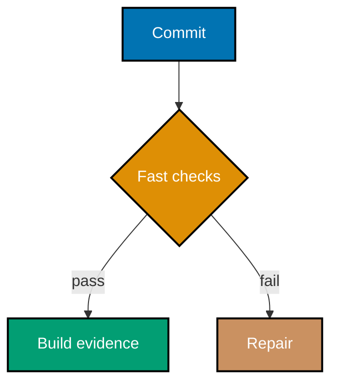
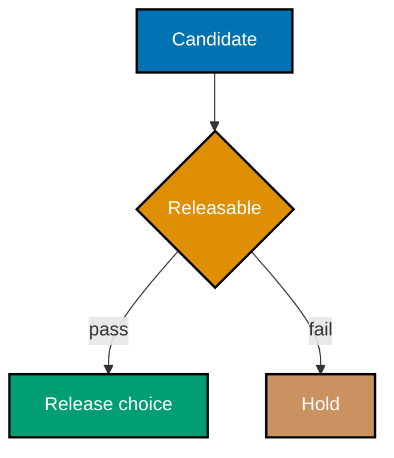
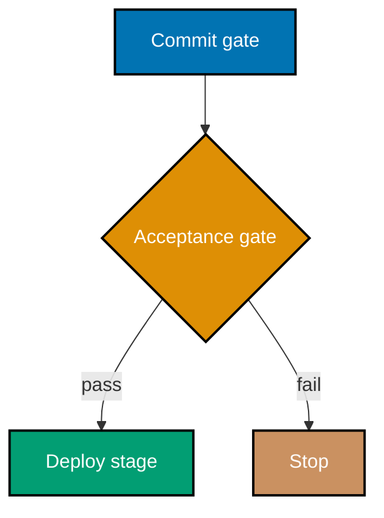
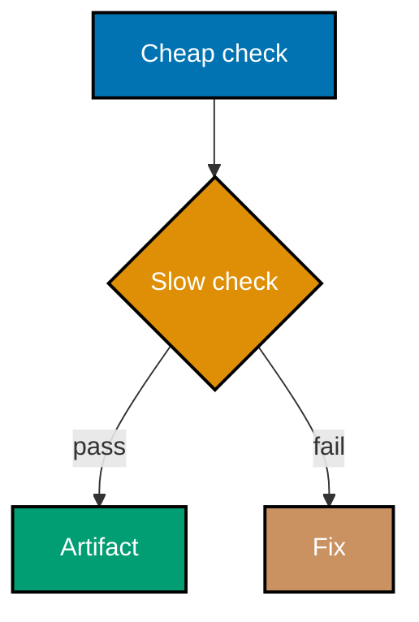
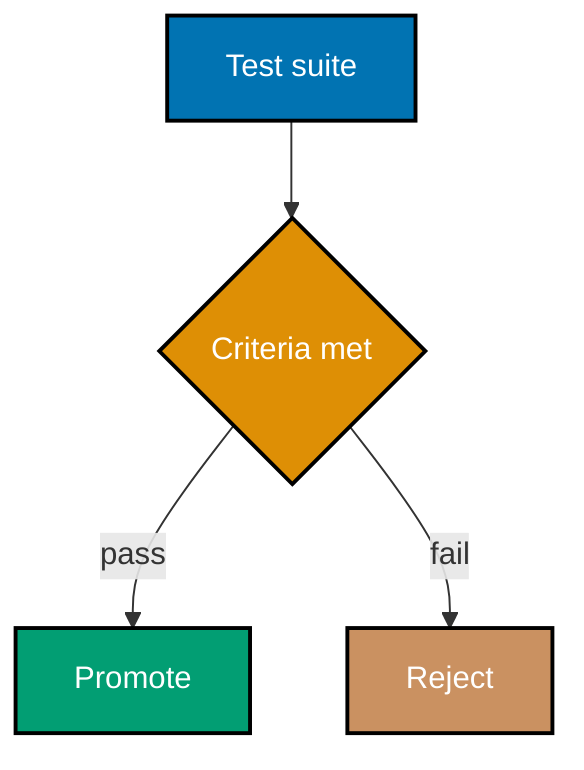
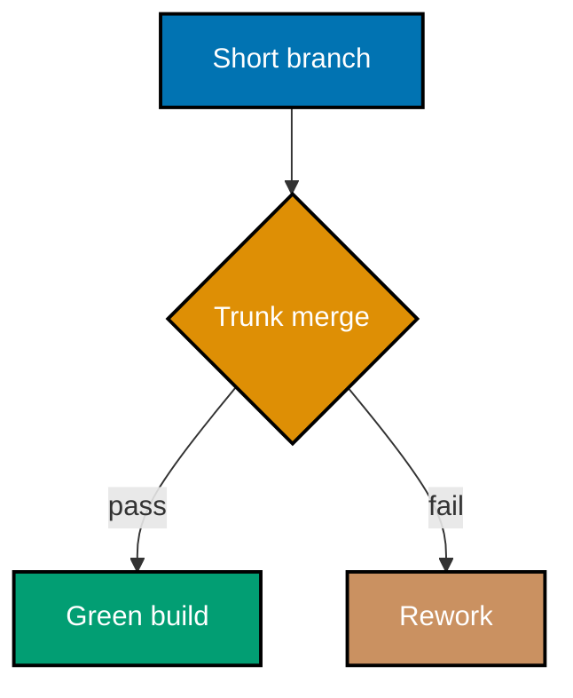
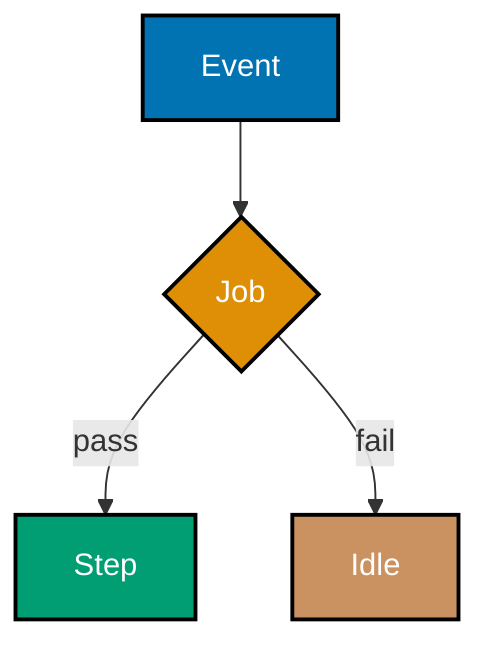
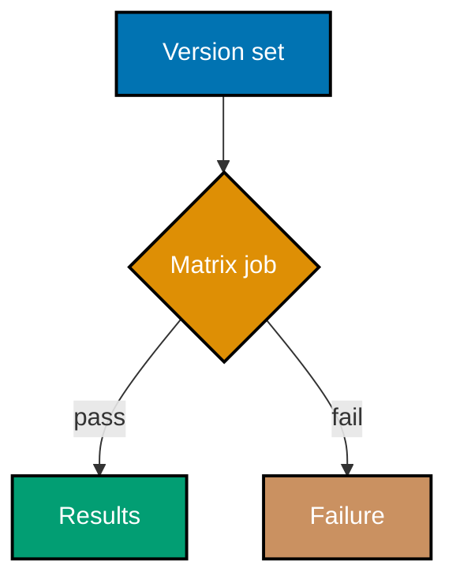
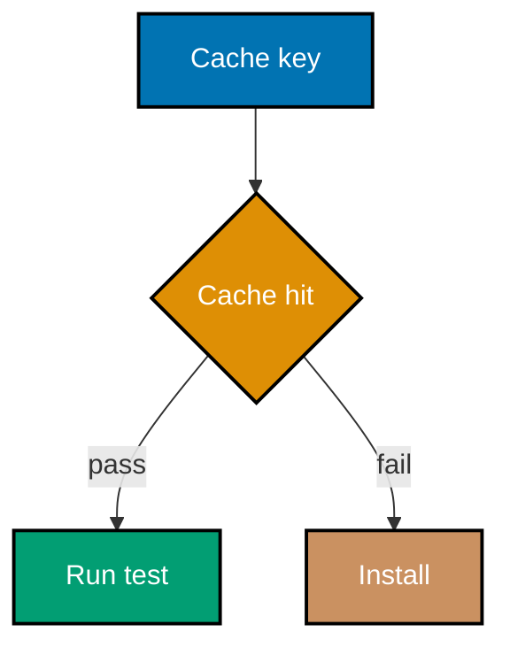
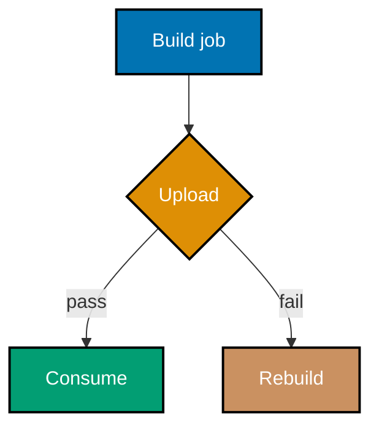

## Concept Flow Diagrams

### Flow 1: Daily integration



### Flow 2: Delivery decision



### Flow 3: Pipeline order



### Flow 4: Fail fast



### Flow 5: Acceptance gate



### Flow 6: Branch flow



### Flow 7: Workflow shape



### Flow 8: Matrix build



### Flow 9: Cache control



### Flow 10: Artifact handoff



Examples 1-28 introduce the delivery system from continuous integration through
Conventional Commits. Each lesson links to a complete, course-owned GitHub Actions workflow and a
fully type-annotated Python program; run the Python program locally with `python automation.py` from
its own example directory.

---

### Example 1: Daily Merge and Self-Testing Build

_ex-01 · exercises co-01_

**Brief explanation**: continuous integration names both frequent integration into a shared mainline and automated verification of every integration. Confirm the artifact records a shared mainline and a self-testing build before it reports success.

**Runnable artifact**: [workflow.yml](./code/ex-01-ci-daily-merge/workflow.yml) and [automation.py](./code/ex-01-ci-daily-merge/automation.py) are complete, dedicated files for this example.

```yaml
# => This label names the runnable workflow artifact for Example 1.
# => The complete workflow and typed automation are linked immediately above.
name: "Example 1: Daily Merge and Self-Testing Build"
on: workflow_dispatch
```

**Verify**: Confirm the artifact records a shared mainline and a self-testing build before it reports success.

**Key takeaway**: continuous integration names both frequent integration into a shared mainline and automated verification of every integration.

**Why it matters**: Delivery systems become trustworthy when a team can point to concrete evidence instead of relying on a release ritual. This small, runnable artifact isolates one decision, records the condition that makes it safe, and produces deterministic output without a cloud account or a credential. Carry the same evidence-first habit into larger pipelines: make the gate visible, automate the check, and preserve the result that justified promotion.

---

### Example 2: Keep the Mainline Green

_ex-02 · exercises co-01_

**Brief explanation**: a red self-testing build is a stop signal: repair the build before the next merge adds another unknown. Confirm the verification result is false for a red build and that the published outcome says merges pause.

**Runnable artifact**: [workflow.yml](./code/ex-02-ci-broken-build-fix/workflow.yml) and [automation.py](./code/ex-02-ci-broken-build-fix/automation.py) are complete, dedicated files for this example.

```yaml
# => This label names the runnable workflow artifact for Example 2.
# => The complete workflow and typed automation are linked immediately above.
name: "Example 2: Keep the Mainline Green"
on: workflow_dispatch
```

**Verify**: Confirm the verification result is false for a red build and that the published outcome says merges pause.

**Key takeaway**: a red self-testing build is a stop signal: repair the build before the next merge adds another unknown.

**Why it matters**: Delivery systems become trustworthy when a team can point to concrete evidence instead of relying on a release ritual. This small, runnable artifact isolates one decision, records the condition that makes it safe, and produces deterministic output without a cloud account or a credential. Carry the same evidence-first habit into larger pipelines: make the gate visible, automate the check, and preserve the result that justified promotion.

---

### Example 3: Keep Software Releasable

_ex-03 · exercises co-02_

**Brief explanation**: continuous delivery is the capability to release the current change safely at any point, not a promise to deploy it immediately. Confirm the artifact treats releasability as a continuously checked state.

**Runnable artifact**: [workflow.yml](./code/ex-03-cd-always-releasable/workflow.yml) and [automation.py](./code/ex-03-cd-always-releasable/automation.py) are complete, dedicated files for this example.

```yaml
# => This label names the runnable workflow artifact for Example 3.
# => The complete workflow and typed automation are linked immediately above.
name: "Example 3: Keep Software Releasable"
on: workflow_dispatch
```

**Verify**: Confirm the artifact treats releasability as a continuously checked state.

**Key takeaway**: continuous delivery is the capability to release the current change safely at any point, not a promise to deploy it immediately.

**Why it matters**: Delivery systems become trustworthy when a team can point to concrete evidence instead of relying on a release ritual. This small, runnable artifact isolates one decision, records the condition that makes it safe, and produces deterministic output without a cloud account or a credential. Carry the same evidence-first habit into larger pipelines: make the gate visible, automate the check, and preserve the result that justified promotion.

---

### Example 4: Continuous Delivery Versus Deployment

_ex-04 · exercises co-02, co-03_

**Brief explanation**: continuous delivery keeps a release decision available, while continuous deployment is the policy that makes every green change live. Confirm the artifact distinguishes the capability from the automatic-production policy.

**Runnable artifact**: [workflow.yml](./code/ex-04-cd-vs-continuous-deployment/workflow.yml) and [automation.py](./code/ex-04-cd-vs-continuous-deployment/automation.py) are complete, dedicated files for this example.

```yaml
# => This label names the runnable workflow artifact for Example 4.
# => The complete workflow and typed automation are linked immediately above.
name: "Example 4: Continuous Delivery Versus Deployment"
on: workflow_dispatch
```

**Verify**: Confirm the artifact distinguishes the capability from the automatic-production policy.

**Key takeaway**: continuous delivery keeps a release decision available, while continuous deployment is the policy that makes every green change live.

**Why it matters**: Delivery systems become trustworthy when a team can point to concrete evidence instead of relying on a release ritual. This small, runnable artifact isolates one decision, records the condition that makes it safe, and produces deterministic output without a cloud account or a credential. Carry the same evidence-first habit into larger pipelines: make the gate visible, automate the check, and preserve the result that justified promotion.

---

### Example 5: Automatic Deployment After Green

_ex-05 · exercises co-03_

**Brief explanation**: continuous deployment removes a manual release gate only after every required pipeline gate reports green. Confirm the workflow has no approval step between a green verification and deployment.

**Runnable artifact**: [workflow.yml](./code/ex-05-continuous-deployment-auto/workflow.yml) and [automation.py](./code/ex-05-continuous-deployment-auto/automation.py) are complete, dedicated files for this example.

```yaml
# => This label names the runnable workflow artifact for Example 5.
# => The complete workflow and typed automation are linked immediately above.
name: "Example 5: Automatic Deployment After Green"
on: workflow_dispatch
```

**Verify**: Confirm the workflow has no approval step between a green verification and deployment.

**Key takeaway**: continuous deployment removes a manual release gate only after every required pipeline gate reports green.

**Why it matters**: Delivery systems become trustworthy when a team can point to concrete evidence instead of relying on a release ritual. This small, runnable artifact isolates one decision, records the condition that makes it safe, and produces deterministic output without a cloud account or a credential. Carry the same evidence-first habit into larger pipelines: make the gate visible, automate the check, and preserve the result that justified promotion.

---

### Example 6: Order a Deployment Pipeline

_ex-06 · exercises co-04_

**Brief explanation**: a deployment pipeline raises confidence through ordered commit, test, acceptance, and deploy gates around one candidate. Confirm the automation preserves the stage order rather than skipping directly to deployment.

**Runnable artifact**: [workflow.yml](./code/ex-06-deployment-pipeline-stages/workflow.yml) and [automation.py](./code/ex-06-deployment-pipeline-stages/automation.py) are complete, dedicated files for this example.

```yaml
# => This label names the runnable workflow artifact for Example 6.
# => The complete workflow and typed automation are linked immediately above.
name: "Example 6: Order a Deployment Pipeline"
on: workflow_dispatch
```

**Verify**: Confirm the automation preserves the stage order rather than skipping directly to deployment.

**Key takeaway**: a deployment pipeline raises confidence through ordered commit, test, acceptance, and deploy gates around one candidate.

**Why it matters**: Delivery systems become trustworthy when a team can point to concrete evidence instead of relying on a release ritual. This small, runnable artifact isolates one decision, records the condition that makes it safe, and produces deterministic output without a cloud account or a credential. Carry the same evidence-first habit into larger pipelines: make the gate visible, automate the check, and preserve the result that justified promotion.

---

### Example 7: Fail Fast in the Commit Stage

_ex-07 · exercises co-05_

**Brief explanation**: the cheapest high-signal checks run first so an invalid change fails before scarce resources run slow tests. Confirm the recorded order puts quick validation before an expensive acceptance check.

**Runnable artifact**: [workflow.yml](./code/ex-07-commit-stage-fail-fast/workflow.yml) and [automation.py](./code/ex-07-commit-stage-fail-fast/automation.py) are complete, dedicated files for this example.

```yaml
# => This label names the runnable workflow artifact for Example 7.
# => The complete workflow and typed automation are linked immediately above.
name: "Example 7: Fail Fast in the Commit Stage"
on: workflow_dispatch
```

**Verify**: Confirm the recorded order puts quick validation before an expensive acceptance check.

**Key takeaway**: the cheapest high-signal checks run first so an invalid change fails before scarce resources run slow tests.

**Why it matters**: Delivery systems become trustworthy when a team can point to concrete evidence instead of relying on a release ritual. This small, runnable artifact isolates one decision, records the condition that makes it safe, and produces deterministic output without a cloud account or a credential. Carry the same evidence-first habit into larger pipelines: make the gate visible, automate the check, and preserve the result that justified promotion.

---

### Example 8: Block Promotion on Acceptance Failure

_ex-08 · exercises co-06_

**Brief explanation**: acceptance tests decide whether a release candidate can move beyond verification into an environment. Confirm a failed acceptance result prevents the promotion outcome.

**Runnable artifact**: [workflow.yml](./code/ex-08-acceptance-gate/workflow.yml) and [automation.py](./code/ex-08-acceptance-gate/automation.py) are complete, dedicated files for this example.

```yaml
# => This label names the runnable workflow artifact for Example 8.
# => The complete workflow and typed automation are linked immediately above.
name: "Example 8: Block Promotion on Acceptance Failure"
on: workflow_dispatch
```

**Verify**: Confirm a failed acceptance result prevents the promotion outcome.

**Key takeaway**: acceptance tests decide whether a release candidate can move beyond verification into an environment.

**Why it matters**: Delivery systems become trustworthy when a team can point to concrete evidence instead of relying on a release ritual. This small, runnable artifact isolates one decision, records the condition that makes it safe, and produces deterministic output without a cloud account or a credential. Carry the same evidence-first habit into larger pipelines: make the gate visible, automate the check, and preserve the result that justified promotion.

---

### Example 9: Use a Single Trunk

_ex-09 · exercises co-07_

**Brief explanation**: trunk-based development keeps collaboration centered on one shared branch and avoids long-lived divergence. Confirm the modeled branch policy permits short-lived changes but rejects long-lived branches.

**Runnable artifact**: [workflow.yml](./code/ex-09-tbd-single-trunk/workflow.yml) and [automation.py](./code/ex-09-tbd-single-trunk/automation.py) are complete, dedicated files for this example.

```yaml
# => This label names the runnable workflow artifact for Example 9.
# => The complete workflow and typed automation are linked immediately above.
name: "Example 9: Use a Single Trunk"
on: workflow_dispatch
```

**Verify**: Confirm the modeled branch policy permits short-lived changes but rejects long-lived branches.

**Key takeaway**: trunk-based development keeps collaboration centered on one shared branch and avoids long-lived divergence.

**Why it matters**: Delivery systems become trustworthy when a team can point to concrete evidence instead of relying on a release ritual. This small, runnable artifact isolates one decision, records the condition that makes it safe, and produces deterministic output without a cloud account or a credential. Carry the same evidence-first habit into larger pipelines: make the gate visible, automate the check, and preserve the result that justified promotion.

---

### Example 10: Identify GitFlow Branch Roles

_ex-10 · exercises co-08_

**Brief explanation**: GitFlow assigns distinct develop, release, and hotfix branches; it is a workflow model rather than a default for continuous delivery. Confirm the artifact names the responsibility of each branch role.

**Runnable artifact**: [workflow.yml](./code/ex-10-gitflow-branches/workflow.yml) and [automation.py](./code/ex-10-gitflow-branches/automation.py) are complete, dedicated files for this example.

```yaml
# => This label names the runnable workflow artifact for Example 10.
# => The complete workflow and typed automation are linked immediately above.
name: "Example 10: Identify GitFlow Branch Roles"
on: workflow_dispatch
```

**Verify**: Confirm the artifact names the responsibility of each branch role.

**Key takeaway**: GitFlow assigns distinct develop, release, and hotfix branches; it is a workflow model rather than a default for continuous delivery.

**Why it matters**: Delivery systems become trustworthy when a team can point to concrete evidence instead of relying on a release ritual. This small, runnable artifact isolates one decision, records the condition that makes it safe, and produces deterministic output without a cloud account or a credential. Carry the same evidence-first habit into larger pipelines: make the gate visible, automate the check, and preserve the result that justified promotion.

---

### Example 11: Apply the GitFlow Continuous-Delivery Caveat

_ex-11 · exercises co-08_

**Brief explanation**: GitFlow can add coordination cost when a team needs continuous delivery, so a simpler flow often fits that goal better. Confirm the artifact records the caveat alongside the GitFlow model.

**Runnable artifact**: [workflow.yml](./code/ex-11-gitflow-cd-caveat/workflow.yml) and [automation.py](./code/ex-11-gitflow-cd-caveat/automation.py) are complete, dedicated files for this example.

```yaml
# => This label names the runnable workflow artifact for Example 11.
# => The complete workflow and typed automation are linked immediately above.
name: "Example 11: Apply the GitFlow Continuous-Delivery Caveat"
on: workflow_dispatch
```

**Verify**: Confirm the artifact records the caveat alongside the GitFlow model.

**Key takeaway**: GitFlow can add coordination cost when a team needs continuous delivery, so a simpler flow often fits that goal better.

**Why it matters**: Delivery systems become trustworthy when a team can point to concrete evidence instead of relying on a release ritual. This small, runnable artifact isolates one decision, records the condition that makes it safe, and produces deterministic output without a cloud account or a credential. Carry the same evidence-first habit into larger pipelines: make the gate visible, automate the check, and preserve the result that justified promotion.

---

### Example 12: Run a Minimal GitHub Actions Workflow

_ex-12 · exercises co-09_

**Brief explanation**: a GitHub Actions workflow declares an event, a job, a runner, and steps that execute repository automation. Confirm the workflow contains a push trigger and one runnable job.

**Runnable artifact**: [workflow.yml](./code/ex-12-gha-hello-workflow/workflow.yml) and [automation.py](./code/ex-12-gha-hello-workflow/automation.py) are complete, dedicated files for this example.

```yaml
# => This label names the runnable workflow artifact for Example 12.
# => The complete workflow and typed automation are linked immediately above.
name: "Example 12: Run a Minimal GitHub Actions Workflow"
on: workflow_dispatch
```

**Verify**: Confirm the workflow contains a push trigger and one runnable job.

**Key takeaway**: a GitHub Actions workflow declares an event, a job, a runner, and steps that execute repository automation.

**Why it matters**: Delivery systems become trustworthy when a team can point to concrete evidence instead of relying on a release ritual. This small, runnable artifact isolates one decision, records the condition that makes it safe, and produces deterministic output without a cloud account or a credential. Carry the same evidence-first habit into larger pipelines: make the gate visible, automate the check, and preserve the result that justified promotion.

---

### Example 13: Use Push and Pull-Request Triggers

_ex-13 · exercises co-09_

**Brief explanation**: workflow triggers declare which repository events should request the same automated verification. Confirm the workflow listens to both push and pull_request events.

**Runnable artifact**: [workflow.yml](./code/ex-13-gha-on-triggers/workflow.yml) and [automation.py](./code/ex-13-gha-on-triggers/automation.py) are complete, dedicated files for this example.

```yaml
# => This label names the runnable workflow artifact for Example 13.
# => The complete workflow and typed automation are linked immediately above.
name: "Example 13: Use Push and Pull-Request Triggers"
on: workflow_dispatch
```

**Verify**: Confirm the workflow listens to both push and pull_request events.

**Key takeaway**: workflow triggers declare which repository events should request the same automated verification.

**Why it matters**: Delivery systems become trustworthy when a team can point to concrete evidence instead of relying on a release ritual. This small, runnable artifact isolates one decision, records the condition that makes it safe, and produces deterministic output without a cloud account or a credential. Carry the same evidence-first habit into larger pipelines: make the gate visible, automate the check, and preserve the result that justified promotion.

---

### Example 14: Choose Run or Uses

_ex-14 · exercises co-09_

**Brief explanation**: a run step executes a command, while a uses step invokes a versioned action maintained as reusable automation. Confirm the complete artifact contains both a command step and an action step.

**Runnable artifact**: [workflow.yml](./code/ex-14-gha-run-vs-uses/workflow.yml) and [automation.py](./code/ex-14-gha-run-vs-uses/automation.py) are complete, dedicated files for this example.

```yaml
# => This label names the runnable workflow artifact for Example 14.
# => The complete workflow and typed automation are linked immediately above.
name: "Example 14: Choose Run or Uses"
on: workflow_dispatch
```

**Verify**: Confirm the complete artifact contains both a command step and an action step.

**Key takeaway**: a run step executes a command, while a uses step invokes a versioned action maintained as reusable automation.

**Why it matters**: Delivery systems become trustworthy when a team can point to concrete evidence instead of relying on a release ritual. This small, runnable artifact isolates one decision, records the condition that makes it safe, and produces deterministic output without a cloud account or a credential. Carry the same evidence-first habit into larger pipelines: make the gate visible, automate the check, and preserve the result that justified promotion.

---

### Example 15: Select a Hosted Runner

_ex-15 · exercises co-09_

**Brief explanation**: runs-on selects the execution environment for a job, so the runner label is a visible part of pipeline behavior. Confirm the workflow selects ubuntu-latest for its verification job.

**Runnable artifact**: [workflow.yml](./code/ex-15-gha-runs-on/workflow.yml) and [automation.py](./code/ex-15-gha-runs-on/automation.py) are complete, dedicated files for this example.

```yaml
# => This label names the runnable workflow artifact for Example 15.
# => The complete workflow and typed automation are linked immediately above.
name: "Example 15: Select a Hosted Runner"
on: workflow_dispatch
```

**Verify**: Confirm the workflow selects ubuntu-latest for its verification job.

**Key takeaway**: runs-on selects the execution environment for a job, so the runner label is a visible part of pipeline behavior.

**Why it matters**: Delivery systems become trustworthy when a team can point to concrete evidence instead of relying on a release ritual. This small, runnable artifact isolates one decision, records the condition that makes it safe, and produces deterministic output without a cloud account or a credential. Carry the same evidence-first habit into larger pipelines: make the gate visible, automate the check, and preserve the result that justified promotion.

---

### Example 16: Set Up Python Before Tests

_ex-16 · exercises co-09_

**Brief explanation**: a setup action makes the chosen Python runtime explicit before a workflow invokes typed automation or tests. Confirm the workflow configures Python and then runs the course-owned script.

**Runnable artifact**: [workflow.yml](./code/ex-16-gha-python-setup/workflow.yml) and [automation.py](./code/ex-16-gha-python-setup/automation.py) are complete, dedicated files for this example.

```yaml
# => This label names the runnable workflow artifact for Example 16.
# => The complete workflow and typed automation are linked immediately above.
name: "Example 16: Set Up Python Before Tests"
on: workflow_dispatch
```

**Verify**: Confirm the workflow configures Python and then runs the course-owned script.

**Key takeaway**: a setup action makes the chosen Python runtime explicit before a workflow invokes typed automation or tests.

**Why it matters**: Delivery systems become trustworthy when a team can point to concrete evidence instead of relying on a release ritual. This small, runnable artifact isolates one decision, records the condition that makes it safe, and produces deterministic output without a cloud account or a credential. Carry the same evidence-first habit into larger pipelines: make the gate visible, automate the check, and preserve the result that justified promotion.

---

### Example 17: Test a Python Version Matrix

_ex-17 · exercises co-10_

**Brief explanation**: a matrix expands one job definition across several supported runtime values without copying the job body. Confirm the matrix lists more than one Python version.

**Runnable artifact**: [workflow.yml](./code/ex-17-matrix-python-versions/workflow.yml) and [automation.py](./code/ex-17-matrix-python-versions/automation.py) are complete, dedicated files for this example.

```yaml
# => This label names the runnable workflow artifact for Example 17.
# => The complete workflow and typed automation are linked immediately above.
name: "Example 17: Test a Python Version Matrix"
on: workflow_dispatch
```

**Verify**: Confirm the matrix lists more than one Python version.

**Key takeaway**: a matrix expands one job definition across several supported runtime values without copying the job body.

**Why it matters**: Delivery systems become trustworthy when a team can point to concrete evidence instead of relying on a release ritual. This small, runnable artifact isolates one decision, records the condition that makes it safe, and produces deterministic output without a cloud account or a credential. Carry the same evidence-first habit into larger pipelines: make the gate visible, automate the check, and preserve the result that justified promotion.

---

### Example 18: Control Matrix Fail-Fast Behavior

_ex-18 · exercises co-10_

**Brief explanation**: matrix fail-fast and max-parallel control how quickly a matrix stops after a failure and how many jobs it starts together. Confirm the workflow explicitly sets both controls.

**Runnable artifact**: [workflow.yml](./code/ex-18-matrix-fail-fast/workflow.yml) and [automation.py](./code/ex-18-matrix-fail-fast/automation.py) are complete, dedicated files for this example.

```yaml
# => This label names the runnable workflow artifact for Example 18.
# => The complete workflow and typed automation are linked immediately above.
name: "Example 18: Control Matrix Fail-Fast Behavior"
on: workflow_dispatch
```

**Verify**: Confirm the workflow explicitly sets both controls.

**Key takeaway**: matrix fail-fast and max-parallel control how quickly a matrix stops after a failure and how many jobs it starts together.

**Why it matters**: Delivery systems become trustworthy when a team can point to concrete evidence instead of relying on a release ritual. This small, runnable artifact isolates one decision, records the condition that makes it safe, and produces deterministic output without a cloud account or a credential. Carry the same evidence-first habit into larger pipelines: make the gate visible, automate the check, and preserve the result that justified promotion.

---

### Example 19: Sequence Jobs with Needs

_ex-19 · exercises co-11_

**Brief explanation**: jobs run independently unless needs declares a dependency, which makes a deployment wait for verification. Confirm the deploy job names the test job in needs.

**Runnable artifact**: [workflow.yml](./code/ex-19-job-needs/workflow.yml) and [automation.py](./code/ex-19-job-needs/automation.py) are complete, dedicated files for this example.

```yaml
# => This label names the runnable workflow artifact for Example 19.
# => The complete workflow and typed automation are linked immediately above.
name: "Example 19: Sequence Jobs with Needs"
on: workflow_dispatch
```

**Verify**: Confirm the deploy job names the test job in needs.

**Key takeaway**: jobs run independently unless needs declares a dependency, which makes a deployment wait for verification.

**Why it matters**: Delivery systems become trustworthy when a team can point to concrete evidence instead of relying on a release ritual. This small, runnable artifact isolates one decision, records the condition that makes it safe, and produces deterministic output without a cloud account or a credential. Carry the same evidence-first habit into larger pipelines: make the gate visible, automate the check, and preserve the result that justified promotion.

---

### Example 20: Cache Dependency Inputs

_ex-20 · exercises co-12_

**Brief explanation**: a cache key ties restored dependencies to the files that describe them, so stale installs do not masquerade as valid ones. Confirm the cache key hashes dependency inputs.

**Runnable artifact**: [workflow.yml](./code/ex-20-cache-deps/workflow.yml) and [automation.py](./code/ex-20-cache-deps/automation.py) are complete, dedicated files for this example.

```yaml
# => This label names the runnable workflow artifact for Example 20.
# => The complete workflow and typed automation are linked immediately above.
name: "Example 20: Cache Dependency Inputs"
on: workflow_dispatch
```

**Verify**: Confirm the cache key hashes dependency inputs.

**Key takeaway**: a cache key ties restored dependencies to the files that describe them, so stale installs do not masquerade as valid ones.

**Why it matters**: Delivery systems become trustworthy when a team can point to concrete evidence instead of relying on a release ritual. This small, runnable artifact isolates one decision, records the condition that makes it safe, and produces deterministic output without a cloud account or a credential. Carry the same evidence-first habit into larger pipelines: make the gate visible, automate the check, and preserve the result that justified promotion.

---

### Example 21: Branch on a Cache Hit

_ex-21 · exercises co-12_

**Brief explanation**: the cache action exposes whether it restored an exact key, letting a workflow avoid unnecessary installation work. Confirm the install step runs only when the cache-hit output is not true.

**Runnable artifact**: [workflow.yml](./code/ex-21-cache-hit-output/workflow.yml) and [automation.py](./code/ex-21-cache-hit-output/automation.py) are complete, dedicated files for this example.

```yaml
# => This label names the runnable workflow artifact for Example 21.
# => The complete workflow and typed automation are linked immediately above.
name: "Example 21: Branch on a Cache Hit"
on: workflow_dispatch
```

**Verify**: Confirm the install step runs only when the cache-hit output is not true.

**Key takeaway**: the cache action exposes whether it restored an exact key, letting a workflow avoid unnecessary installation work.

**Why it matters**: Delivery systems become trustworthy when a team can point to concrete evidence instead of relying on a release ritual. This small, runnable artifact isolates one decision, records the condition that makes it safe, and produces deterministic output without a cloud account or a credential. Carry the same evidence-first habit into larger pipelines: make the gate visible, automate the check, and preserve the result that justified promotion.

---

### Example 22: Upload a Build Artifact

_ex-22 · exercises co-13_

**Brief explanation**: an artifact preserves the exact build output produced by a successful job for later jobs or human inspection. Confirm the workflow uploads a named build artifact.

**Runnable artifact**: [workflow.yml](./code/ex-22-upload-artifact/workflow.yml) and [automation.py](./code/ex-22-upload-artifact/automation.py) are complete, dedicated files for this example.

```yaml
# => This label names the runnable workflow artifact for Example 22.
# => The complete workflow and typed automation are linked immediately above.
name: "Example 22: Upload a Build Artifact"
on: workflow_dispatch
```

**Verify**: Confirm the workflow uploads a named build artifact.

**Key takeaway**: an artifact preserves the exact build output produced by a successful job for later jobs or human inspection.

**Why it matters**: Delivery systems become trustworthy when a team can point to concrete evidence instead of relying on a release ritual. This small, runnable artifact isolates one decision, records the condition that makes it safe, and produces deterministic output without a cloud account or a credential. Carry the same evidence-first habit into larger pipelines: make the gate visible, automate the check, and preserve the result that justified promotion.

---

### Example 23: Download a Build Artifact

_ex-23 · exercises co-13_

**Brief explanation**: a later job consumes an uploaded artifact instead of rebuilding a different candidate from source. Confirm the consuming job downloads the artifact after the producing job.

**Runnable artifact**: [workflow.yml](./code/ex-23-download-artifact/workflow.yml) and [automation.py](./code/ex-23-download-artifact/automation.py) are complete, dedicated files for this example.

```yaml
# => This label names the runnable workflow artifact for Example 23.
# => The complete workflow and typed automation are linked immediately above.
name: "Example 23: Download a Build Artifact"
on: workflow_dispatch
```

**Verify**: Confirm the consuming job downloads the artifact after the producing job.

**Key takeaway**: a later job consumes an uploaded artifact instead of rebuilding a different candidate from source.

**Why it matters**: Delivery systems become trustworthy when a team can point to concrete evidence instead of relying on a release ritual. This small, runnable artifact isolates one decision, records the condition that makes it safe, and produces deterministic output without a cloud account or a credential. Carry the same evidence-first habit into larger pipelines: make the gate visible, automate the check, and preserve the result that justified promotion.

---

### Example 24: Require a Green Status Check

_ex-24 · exercises co-14_

**Brief explanation**: branch protection turns a named status check into a merge gate so a red result blocks integration. Confirm the automation rejects an unsuccessful required check.

**Runnable artifact**: [workflow.yml](./code/ex-24-required-check/workflow.yml) and [automation.py](./code/ex-24-required-check/automation.py) are complete, dedicated files for this example.

```yaml
# => This label names the runnable workflow artifact for Example 24.
# => The complete workflow and typed automation are linked immediately above.
name: "Example 24: Require a Green Status Check"
on: workflow_dispatch
```

**Verify**: Confirm the automation rejects an unsuccessful required check.

**Key takeaway**: branch protection turns a named status check into a merge gate so a red result blocks integration.

**Why it matters**: Delivery systems become trustworthy when a team can point to concrete evidence instead of relying on a release ritual. This small, runnable artifact isolates one decision, records the condition that makes it safe, and produces deterministic output without a cloud account or a credential. Carry the same evidence-first habit into larger pipelines: make the gate visible, automate the check, and preserve the result that justified promotion.

---

### Example 25: Choose a Semantic Version Increment

_ex-25 · exercises co-19_

**Brief explanation**: semantic versioning maps incompatible changes to MAJOR, additive compatible changes to MINOR, and compatible fixes to PATCH. Confirm the artifact maps all three change kinds to their version component.

**Runnable artifact**: [workflow.yml](./code/ex-25-semver-increment/workflow.yml) and [automation.py](./code/ex-25-semver-increment/automation.py) are complete, dedicated files for this example.

```yaml
# => This label names the runnable workflow artifact for Example 25.
# => The complete workflow and typed automation are linked immediately above.
name: "Example 25: Choose a Semantic Version Increment"
on: workflow_dispatch
```

**Verify**: Confirm the artifact maps all three change kinds to their version component.

**Key takeaway**: semantic versioning maps incompatible changes to MAJOR, additive compatible changes to MINOR, and compatible fixes to PATCH.

**Why it matters**: Delivery systems become trustworthy when a team can point to concrete evidence instead of relying on a release ritual. This small, runnable artifact isolates one decision, records the condition that makes it safe, and produces deterministic output without a cloud account or a credential. Carry the same evidence-first habit into larger pipelines: make the gate visible, automate the check, and preserve the result that justified promotion.

---

### Example 26: Compare Pre-release Precedence

_ex-26 · exercises co-19_

**Brief explanation**: a normal release has higher precedence than the corresponding pre-release, so 1.0.0-alpha sorts below 1.0.0. Confirm the comparison reports the pre-release as lower precedence.

**Runnable artifact**: [workflow.yml](./code/ex-26-semver-precedence/workflow.yml) and [automation.py](./code/ex-26-semver-precedence/automation.py) are complete, dedicated files for this example.

```yaml
# => This label names the runnable workflow artifact for Example 26.
# => The complete workflow and typed automation are linked immediately above.
name: "Example 26: Compare Pre-release Precedence"
on: workflow_dispatch
```

**Verify**: Confirm the comparison reports the pre-release as lower precedence.

**Key takeaway**: a normal release has higher precedence than the corresponding pre-release, so 1.

**Why it matters**: Delivery systems become trustworthy when a team can point to concrete evidence instead of relying on a release ritual. This small, runnable artifact isolates one decision, records the condition that makes it safe, and produces deterministic output without a cloud account or a credential. Carry the same evidence-first habit into larger pipelines: make the gate visible, automate the check, and preserve the result that justified promotion.

---

### Example 27: Write a Conventional Commit

_ex-27 · exercises co-20_

**Brief explanation**: a conventional commit uses type, optional scope, and description so release tooling can interpret the change consistently. Confirm the example commit follows the feat(scope): description shape.

**Runnable artifact**: [workflow.yml](./code/ex-27-conventional-commit/workflow.yml) and [automation.py](./code/ex-27-conventional-commit/automation.py) are complete, dedicated files for this example.

```yaml
# => This label names the runnable workflow artifact for Example 27.
# => The complete workflow and typed automation are linked immediately above.
name: "Example 27: Write a Conventional Commit"
on: workflow_dispatch
```

**Verify**: Confirm the example commit follows the feat(scope): description shape.

**Key takeaway**: a conventional commit uses type, optional scope, and description so release tooling can interpret the change consistently.

**Why it matters**: Delivery systems become trustworthy when a team can point to concrete evidence instead of relying on a release ritual. This small, runnable artifact isolates one decision, records the condition that makes it safe, and produces deterministic output without a cloud account or a credential. Carry the same evidence-first habit into larger pipelines: make the gate visible, automate the check, and preserve the result that justified promotion.

---

### Example 28: Mark a Breaking Conventional Commit

_ex-28 · exercises co-20_

**Brief explanation**: a breaking conventional commit uses an exclamation mark or BREAKING CHANGE footer so automation can select a major release. Confirm the recorded message contains an explicit breaking-change marker.

**Runnable artifact**: [workflow.yml](./code/ex-28-conventional-commit-breaking/workflow.yml) and [automation.py](./code/ex-28-conventional-commit-breaking/automation.py) are complete, dedicated files for this example.

```yaml
# => This label names the runnable workflow artifact for Example 28.
# => The complete workflow and typed automation are linked immediately above.
name: "Example 28: Mark a Breaking Conventional Commit"
on: workflow_dispatch
```

**Verify**: Confirm the recorded message contains an explicit breaking-change marker.

**Key takeaway**: a breaking conventional commit uses an exclamation mark or BREAKING CHANGE footer so automation can select a major release.

**Why it matters**: Delivery systems become trustworthy when a team can point to concrete evidence instead of relying on a release ritual. This small, runnable artifact isolates one decision, records the condition that makes it safe, and produces deterministic output without a cloud account or a credential. Carry the same evidence-first habit into larger pipelines: make the gate visible, automate the check, and preserve the result that justified promotion.

---
