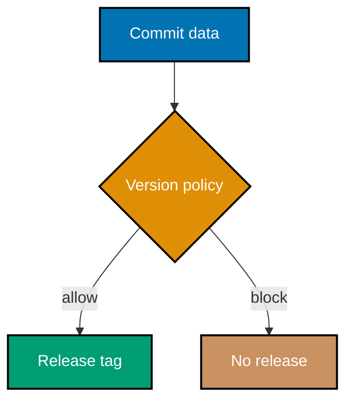
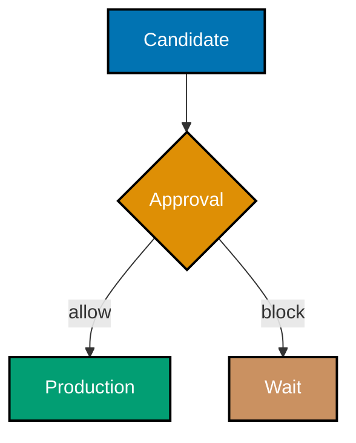
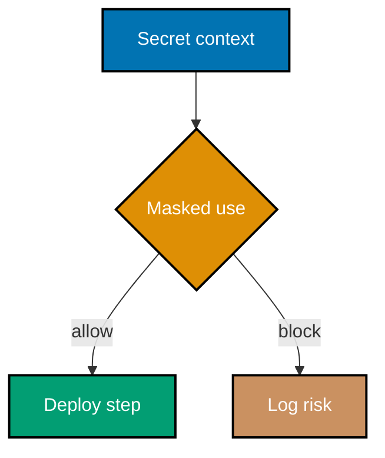
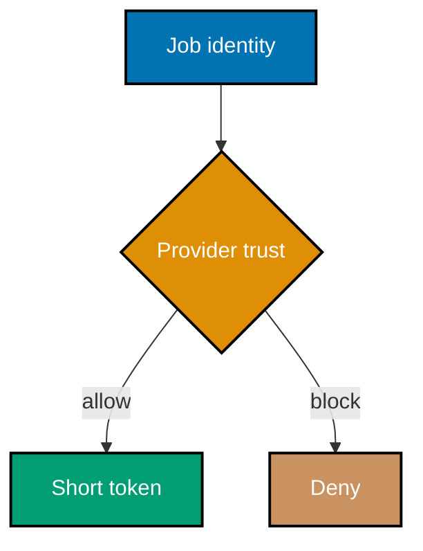
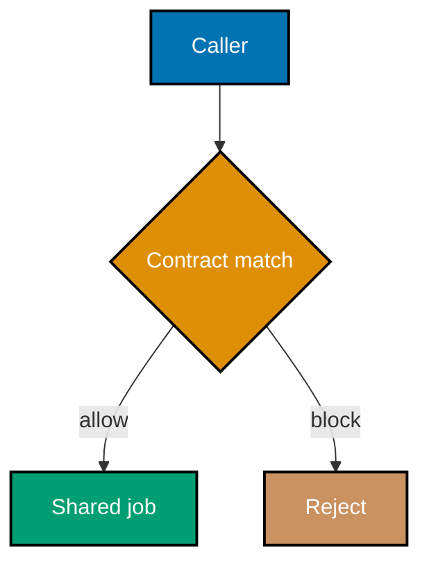
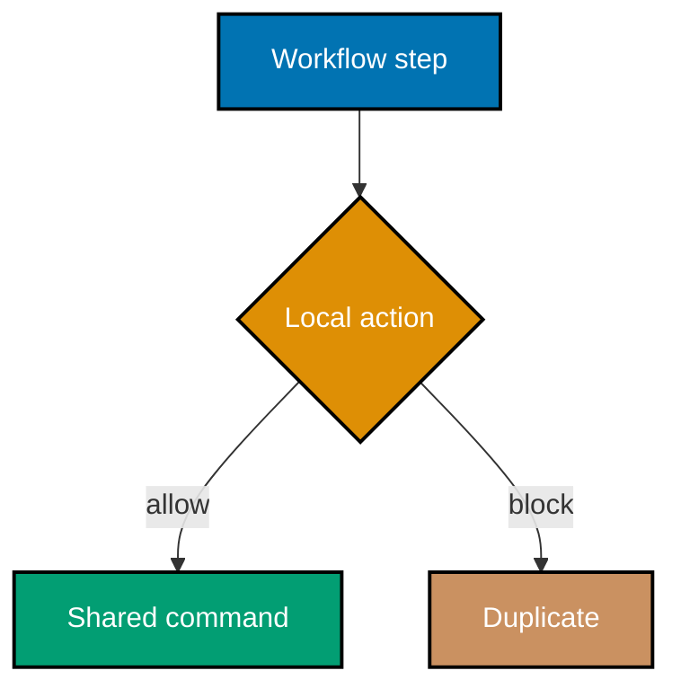
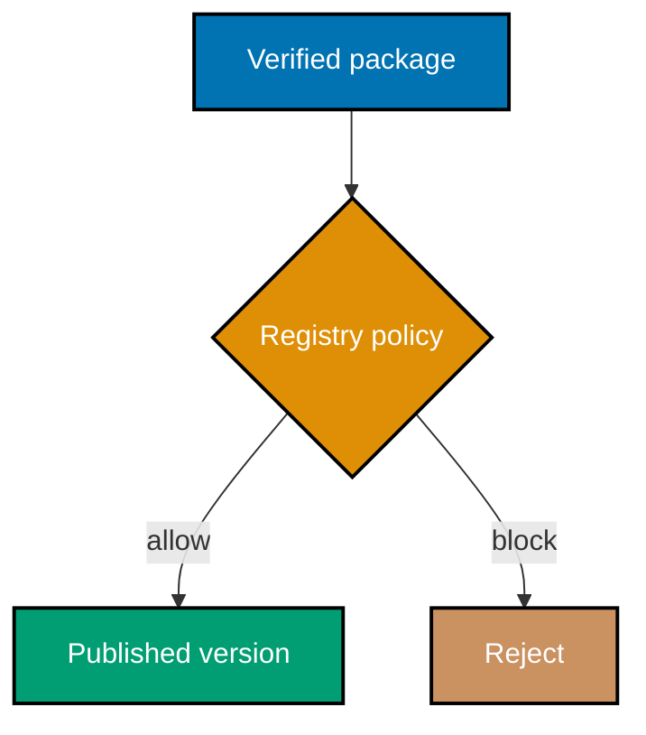
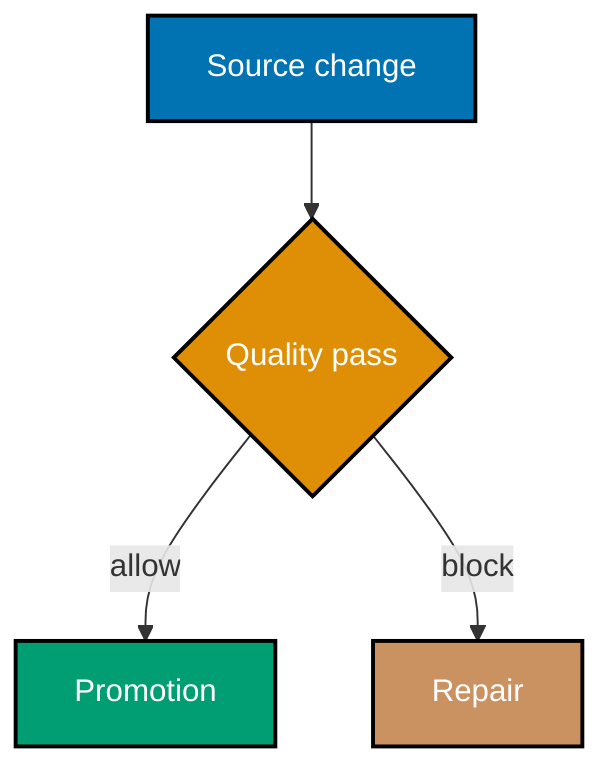
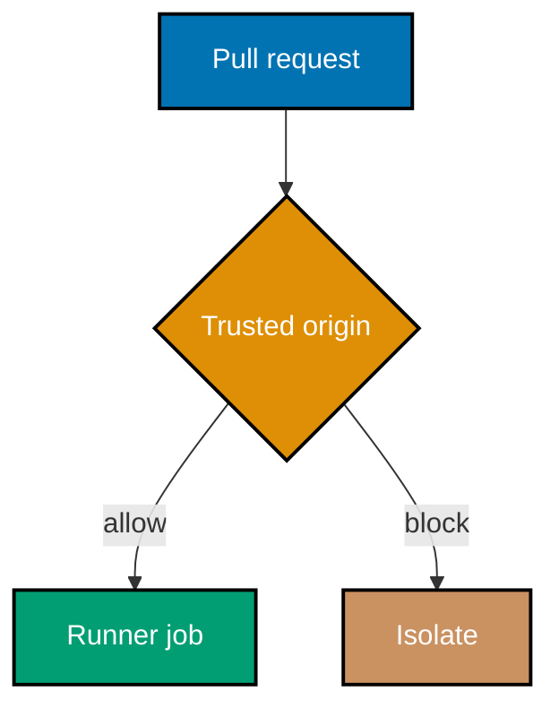
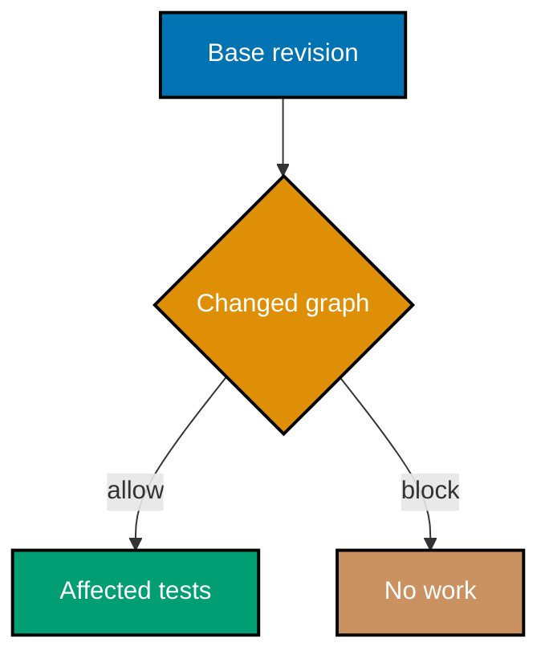

## Concept Flow Diagrams

### Flow 0: Commit release



### Flow 1: Environment gate



### Flow 2: Secret boundary



### Flow 3: OIDC exchange



### Flow 4: Workflow reuse



### Flow 5: Composite action



### Flow 6: Publish package



### Flow 7: Quality gate



### Flow 8: Runner trust



### Flow 9: Affected CI



Examples 29-55 extend the evidence chain through intermediate release engineering. Every lesson links to complete, dedicated YAML and typed Python artifacts that use no real credential.

---

### Example 29: Map Conventional Commits to SemVer

_ex-29 · exercises co-19, co-20_

**Brief explanation**: conventional commit types provide structured evidence for a release decision: feat maps to MINOR, fix maps to PATCH, and a breaking marker maps to MAJOR. Verify that each representative commit produces the expected version category.

**Runnable artifact**: [workflow.yml](./code/ex-29-conventional-to-semver/workflow.yml) and [automation.py](./code/ex-29-conventional-to-semver/automation.py) are complete, dedicated files for this example.

```yaml
# => This label names the standalone workflow that verifies Example 29.
# => The full workflow and typed program are linked immediately above.
name: "Example 29: Map Conventional Commits to SemVer"
on: workflow_dispatch
```

**Verify**: Verify that each representative commit produces the expected version category.

**Key takeaway**: conventional commit types provide structured evidence for a release decision: feat maps to MINOR, fix maps to PATCH, and a breaking marker maps to MAJOR.

**Why it matters**: A reliable delivery practice must remain inspectable when a release is under pressure. This focused artifact supplies a small, deterministic proof for the lesson's policy without contacting a cloud account or exposing a credential. Use the same pattern in production: state the expected condition, make its evidence machine-readable, and let a failed check prevent promotion until a human can understand and repair the cause.

---

### Example 30: Protect a Production Environment

_ex-30 · exercises co-15_

**Brief explanation**: a GitHub Actions environment applies deployment protection rules before its job receives environment-scoped access. Verify that the deploy job names the production environment.

**Runnable artifact**: [workflow.yml](./code/ex-30-protected-environment/workflow.yml) and [automation.py](./code/ex-30-protected-environment/automation.py) are complete, dedicated files for this example.

```yaml
# => This label names the standalone workflow that verifies Example 30.
# => The full workflow and typed program are linked immediately above.
name: "Example 30: Protect a Production Environment"
on: workflow_dispatch
```

**Verify**: Verify that the deploy job names the production environment.

**Key takeaway**: a GitHub Actions environment applies deployment protection rules before its job receives environment-scoped access.

**Why it matters**: A reliable delivery practice must remain inspectable when a release is under pressure. This focused artifact supplies a small, deterministic proof for the lesson's policy without contacting a cloud account or exposing a credential. Use the same pattern in production: state the expected condition, make its evidence machine-readable, and let a failed check prevent promotion until a human can understand and repair the cause.

---

### Example 31: Wait for Deployment Approval

_ex-31 · exercises co-15_

**Brief explanation**: a protected environment pauses a deployment at an explicit human review boundary instead of hiding that decision in a script. Verify that the workflow describes approval before the deploy command.

**Runnable artifact**: [workflow.yml](./code/ex-31-approval-wait/workflow.yml) and [automation.py](./code/ex-31-approval-wait/automation.py) are complete, dedicated files for this example.

```yaml
# => This label names the standalone workflow that verifies Example 31.
# => The full workflow and typed program are linked immediately above.
name: "Example 31: Wait for Deployment Approval"
on: workflow_dispatch
```

**Verify**: Verify that the workflow describes approval before the deploy command.

**Key takeaway**: a protected environment pauses a deployment at an explicit human review boundary instead of hiding that decision in a script.

**Why it matters**: A reliable delivery practice must remain inspectable when a release is under pressure. This focused artifact supplies a small, deterministic proof for the lesson's policy without contacting a cloud account or exposing a credential. Use the same pattern in production: state the expected condition, make its evidence machine-readable, and let a failed check prevent promotion until a human can understand and repair the cause.

---

### Example 32: Inject a Secret Safely

_ex-32 · exercises co-16_

**Brief explanation**: a workflow reads a secret from the secrets context at runtime and never stores its value in source control. Verify that the artifact references a placeholder secret name and never supplies a value.

**Runnable artifact**: [workflow.yml](./code/ex-32-secret-injection/workflow.yml) and [automation.py](./code/ex-32-secret-injection/automation.py) are complete, dedicated files for this example.

```yaml
# => This label names the standalone workflow that verifies Example 32.
# => The full workflow and typed program are linked immediately above.
name: "Example 32: Inject a Secret Safely"
on: workflow_dispatch
```

**Verify**: Verify that the artifact references a placeholder secret name and never supplies a value.

**Key takeaway**: a workflow reads a secret from the secrets context at runtime and never stores its value in source control.

**Why it matters**: A reliable delivery practice must remain inspectable when a release is under pressure. This focused artifact supplies a small, deterministic proof for the lesson's policy without contacting a cloud account or exposing a credential. Use the same pattern in production: state the expected condition, make its evidence machine-readable, and let a failed check prevent promotion until a human can understand and repair the cause.

---

### Example 33: Mask a Sensitive Value

_ex-33 · exercises co-16_

**Brief explanation**: log masking reduces accidental disclosure, but it cannot make a value safe if it was never a secret or was already emitted. Verify that the artifact calls add-mask only for a supplied placeholder value.

**Runnable artifact**: [workflow.yml](./code/ex-33-secret-masking/workflow.yml) and [automation.py](./code/ex-33-secret-masking/automation.py) are complete, dedicated files for this example.

```yaml
# => This label names the standalone workflow that verifies Example 33.
# => The full workflow and typed program are linked immediately above.
name: "Example 33: Mask a Sensitive Value"
on: workflow_dispatch
```

**Verify**: Verify that the artifact calls add-mask only for a supplied placeholder value.

**Key takeaway**: log masking reduces accidental disclosure, but it cannot make a value safe if it was never a secret or was already emitted.

**Why it matters**: A reliable delivery practice must remain inspectable when a release is under pressure. This focused artifact supplies a small, deterministic proof for the lesson's policy without contacting a cloud account or exposing a credential. Use the same pattern in production: state the expected condition, make its evidence machine-readable, and let a failed check prevent promotion until a human can understand and repair the cause.

---

### Example 34: Request a Short-Lived OIDC Token

_ex-34 · exercises co-17_

**Brief explanation**: OIDC exchanges a trusted workflow identity for a short-lived cloud token, removing the need to store a long-lived cloud credential. Verify that id-token permission is present and the model uses a per-job token.

**Runnable artifact**: [workflow.yml](./code/ex-34-oidc-cloud-token/workflow.yml) and [automation.py](./code/ex-34-oidc-cloud-token/automation.py) are complete, dedicated files for this example.

```yaml
# => This label names the standalone workflow that verifies Example 34.
# => The full workflow and typed program are linked immediately above.
name: "Example 34: Request a Short-Lived OIDC Token"
on: workflow_dispatch
```

**Verify**: Verify that id-token permission is present and the model uses a per-job token.

**Key takeaway**: OIDC exchanges a trusted workflow identity for a short-lived cloud token, removing the need to store a long-lived cloud credential.

**Why it matters**: A reliable delivery practice must remain inspectable when a release is under pressure. This focused artifact supplies a small, deterministic proof for the lesson's policy without contacting a cloud account or exposing a credential. Use the same pattern in production: state the expected condition, make its evidence machine-readable, and let a failed check prevent promotion until a human can understand and repair the cause.

---

### Example 35: Call a Reusable Workflow

_ex-35 · exercises co-18_

**Brief explanation**: a workflow_call trigger packages reviewed jobs so callers can reuse them without copying pipeline logic. Verify that the caller uses a reusable-workflow reference.

**Runnable artifact**: [workflow.yml](./code/ex-35-reusable-workflow/workflow.yml) and [automation.py](./code/ex-35-reusable-workflow/automation.py) are complete, dedicated files for this example.

```yaml
# => This label names the standalone workflow that verifies Example 35.
# => The full workflow and typed program are linked immediately above.
name: "Example 35: Call a Reusable Workflow"
on: workflow_dispatch
```

**Verify**: Verify that the caller uses a reusable-workflow reference.

**Key takeaway**: a workflow_call trigger packages reviewed jobs so callers can reuse them without copying pipeline logic.

**Why it matters**: A reliable delivery practice must remain inspectable when a release is under pressure. This focused artifact supplies a small, deterministic proof for the lesson's policy without contacting a cloud account or exposing a credential. Use the same pattern in production: state the expected condition, make its evidence machine-readable, and let a failed check prevent promotion until a human can understand and repair the cause.

---

### Example 36: Factor a Composite Action

_ex-36 · exercises co-18_

**Brief explanation**: a composite action groups repeated steps behind a local action interface while leaving its implementation versioned with the repository. Verify that the artifact runs the shared action rather than duplicating its command.

**Runnable artifact**: [workflow.yml](./code/ex-36-composite-action/workflow.yml) and [automation.py](./code/ex-36-composite-action/automation.py) are complete, dedicated files for this example.

```yaml
# => This label names the standalone workflow that verifies Example 36.
# => The full workflow and typed program are linked immediately above.
name: "Example 36: Factor a Composite Action"
on: workflow_dispatch
```

**Verify**: Verify that the artifact runs the shared action rather than duplicating its command.

**Key takeaway**: a composite action groups repeated steps behind a local action interface while leaving its implementation versioned with the repository.

**Why it matters**: A reliable delivery practice must remain inspectable when a release is under pressure. This focused artifact supplies a small, deterministic proof for the lesson's policy without contacting a cloud account or exposing a credential. Use the same pattern in production: state the expected condition, make its evidence machine-readable, and let a failed check prevent promotion until a human can understand and repair the cause.

---

### Example 37: Pass a Secret to a Reusable Workflow

_ex-37 · exercises co-18, co-16_

**Brief explanation**: a caller passes only the secret a reusable workflow needs, so the callee contract stays narrow and reviewable. Verify that the example uses a named placeholder secret mapping.

**Runnable artifact**: [workflow.yml](./code/ex-37-reusable-secrets/workflow.yml) and [automation.py](./code/ex-37-reusable-secrets/automation.py) are complete, dedicated files for this example.

```yaml
# => This label names the standalone workflow that verifies Example 37.
# => The full workflow and typed program are linked immediately above.
name: "Example 37: Pass a Secret to a Reusable Workflow"
on: workflow_dispatch
```

**Verify**: Verify that the example uses a named placeholder secret mapping.

**Key takeaway**: a caller passes only the secret a reusable workflow needs, so the callee contract stays narrow and reviewable.

**Why it matters**: A reliable delivery practice must remain inspectable when a release is under pressure. This focused artifact supplies a small, deterministic proof for the lesson's policy without contacting a cloud account or exposing a credential. Use the same pattern in production: state the expected condition, make its evidence machine-readable, and let a failed check prevent promotion until a human can understand and repair the cause.

---

### Example 38: Publish a Release Tag

_ex-38 · exercises co-21_

**Brief explanation**: a release tag identifies the immutable source revision a release represents and gives downstream consumers a stable reference. Verify that the artifact records a version-shaped tag before publishing.

**Runnable artifact**: [workflow.yml](./code/ex-38-release-tag/workflow.yml) and [automation.py](./code/ex-38-release-tag/automation.py) are complete, dedicated files for this example.

```yaml
# => This label names the standalone workflow that verifies Example 38.
# => The full workflow and typed program are linked immediately above.
name: "Example 38: Publish a Release Tag"
on: workflow_dispatch
```

**Verify**: Verify that the artifact records a version-shaped tag before publishing.

**Key takeaway**: a release tag identifies the immutable source revision a release represents and gives downstream consumers a stable reference.

**Why it matters**: A reliable delivery practice must remain inspectable when a release is under pressure. This focused artifact supplies a small, deterministic proof for the lesson's policy without contacting a cloud account or exposing a credential. Use the same pattern in production: state the expected condition, make its evidence machine-readable, and let a failed check prevent promotion until a human can understand and repair the cause.

---

### Example 39: Generate a Changelog

_ex-39 · exercises co-21_

**Brief explanation**: a changelog groups meaningful changes by their conventional commit intent so release notes explain what actually changed. Verify that feature and fix entries appear in separate groups.

**Runnable artifact**: [workflow.yml](./code/ex-39-changelog-gen/workflow.yml) and [automation.py](./code/ex-39-changelog-gen/automation.py) are complete, dedicated files for this example.

```yaml
# => This label names the standalone workflow that verifies Example 39.
# => The full workflow and typed program are linked immediately above.
name: "Example 39: Generate a Changelog"
on: workflow_dispatch
```

**Verify**: Verify that feature and fix entries appear in separate groups.

**Key takeaway**: a changelog groups meaningful changes by their conventional commit intent so release notes explain what actually changed.

**Why it matters**: A reliable delivery practice must remain inspectable when a release is under pressure. This focused artifact supplies a small, deterministic proof for the lesson's policy without contacting a cloud account or exposing a credential. Use the same pattern in production: state the expected condition, make its evidence machine-readable, and let a failed check prevent promotion until a human can understand and repair the cause.

---

### Example 40: Automate the Release Decision

_ex-40 · exercises co-21_

**Brief explanation**: semantic-release derives the next version, release notes, and publication work from commits instead of trusting a manually remembered checklist. Verify that the artifact connects commit analysis to release output.

**Runnable artifact**: [workflow.yml](./code/ex-40-semantic-release/workflow.yml) and [automation.py](./code/ex-40-semantic-release/automation.py) are complete, dedicated files for this example.

```yaml
# => This label names the standalone workflow that verifies Example 40.
# => The full workflow and typed program are linked immediately above.
name: "Example 40: Automate the Release Decision"
on: workflow_dispatch
```

**Verify**: Verify that the artifact connects commit analysis to release output.

**Key takeaway**: semantic-release derives the next version, release notes, and publication work from commits instead of trusting a manually remembered checklist.

**Why it matters**: A reliable delivery practice must remain inspectable when a release is under pressure. This focused artifact supplies a small, deterministic proof for the lesson's policy without contacting a cloud account or exposing a credential. Use the same pattern in production: state the expected condition, make its evidence machine-readable, and let a failed check prevent promotion until a human can understand and repair the cause.

---

### Example 41: Publish an npm Package

_ex-41 · exercises co-22_

**Brief explanation**: npm publishing transfers a verified package artifact to a registry under an explicit package name and version. Verify that the example uses a non-secret registry placeholder and a publish command.

**Runnable artifact**: [workflow.yml](./code/ex-41-npm-publish/workflow.yml) and [automation.py](./code/ex-41-npm-publish/automation.py) are complete, dedicated files for this example.

```yaml
# => This label names the standalone workflow that verifies Example 41.
# => The full workflow and typed program are linked immediately above.
name: "Example 41: Publish an npm Package"
on: workflow_dispatch
```

**Verify**: Verify that the example uses a non-secret registry placeholder and a publish command.

**Key takeaway**: npm publishing transfers a verified package artifact to a registry under an explicit package name and version.

**Why it matters**: A reliable delivery practice must remain inspectable when a release is under pressure. This focused artifact supplies a small, deterministic proof for the lesson's policy without contacting a cloud account or exposing a credential. Use the same pattern in production: state the expected condition, make its evidence machine-readable, and let a failed check prevent promotion until a human can understand and repair the cause.

---

### Example 42: Push a Container Image

_ex-42 · exercises co-22_

**Brief explanation**: a container registry receives an image only after the build and verification evidence identifies the exact tag to promote. Verify that the artifact models login as an external secret boundary and names a non-real image.

**Runnable artifact**: [workflow.yml](./code/ex-42-docker-push/workflow.yml) and [automation.py](./code/ex-42-docker-push/automation.py) are complete, dedicated files for this example.

```yaml
# => This label names the standalone workflow that verifies Example 42.
# => The full workflow and typed program are linked immediately above.
name: "Example 42: Push a Container Image"
on: workflow_dispatch
```

**Verify**: Verify that the artifact models login as an external secret boundary and names a non-real image.

**Key takeaway**: a container registry receives an image only after the build and verification evidence identifies the exact tag to promote.

**Why it matters**: A reliable delivery practice must remain inspectable when a release is under pressure. This focused artifact supplies a small, deterministic proof for the lesson's policy without contacting a cloud account or exposing a credential. Use the same pattern in production: state the expected condition, make its evidence machine-readable, and let a failed check prevent promotion until a human can understand and repair the cause.

---

### Example 43: Gate on Lint

_ex-43 · exercises co-28_

**Brief explanation**: a lint job converts style and static-quality rules into a visible merge gate rather than a convention people may forget. Verify that a failed lint result prevents the modeled promotion.

**Runnable artifact**: [workflow.yml](./code/ex-43-lint-gate/workflow.yml) and [automation.py](./code/ex-43-lint-gate/automation.py) are complete, dedicated files for this example.

```yaml
# => This label names the standalone workflow that verifies Example 43.
# => The full workflow and typed program are linked immediately above.
name: "Example 43: Gate on Lint"
on: workflow_dispatch
```

**Verify**: Verify that a failed lint result prevents the modeled promotion.

**Key takeaway**: a lint job converts style and static-quality rules into a visible merge gate rather than a convention people may forget.

**Why it matters**: A reliable delivery practice must remain inspectable when a release is under pressure. This focused artifact supplies a small, deterministic proof for the lesson's policy without contacting a cloud account or exposing a credential. Use the same pattern in production: state the expected condition, make its evidence machine-readable, and let a failed check prevent promotion until a human can understand and repair the cause.

---

### Example 44: Gate on Pyright

_ex-44 · exercises co-28_

**Brief explanation**: a type-check gate uses pyright to reject incompatible Python contracts before a change reaches a deployment stage. Verify that the workflow invokes pyright against typed source.

**Runnable artifact**: [workflow.yml](./code/ex-44-typecheck-gate/workflow.yml) and [automation.py](./code/ex-44-typecheck-gate/automation.py) are complete, dedicated files for this example.

```yaml
# => This label names the standalone workflow that verifies Example 44.
# => The full workflow and typed program are linked immediately above.
name: "Example 44: Gate on Pyright"
on: workflow_dispatch
```

**Verify**: Verify that the workflow invokes pyright against typed source.

**Key takeaway**: a type-check gate uses pyright to reject incompatible Python contracts before a change reaches a deployment stage.

**Why it matters**: A reliable delivery practice must remain inspectable when a release is under pressure. This focused artifact supplies a small, deterministic proof for the lesson's policy without contacting a cloud account or exposing a credential. Use the same pattern in production: state the expected condition, make its evidence machine-readable, and let a failed check prevent promotion until a human can understand and repair the cause.

---

### Example 45: Gate on Coverage

_ex-45 · exercises co-28_

**Brief explanation**: a coverage threshold makes the desired minimum test evidence explicit, while still requiring teams to avoid gaming the number. Verify that a below-threshold result is modeled as a failing gate.

**Runnable artifact**: [workflow.yml](./code/ex-45-coverage-gate/workflow.yml) and [automation.py](./code/ex-45-coverage-gate/automation.py) are complete, dedicated files for this example.

```yaml
# => This label names the standalone workflow that verifies Example 45.
# => The full workflow and typed program are linked immediately above.
name: "Example 45: Gate on Coverage"
on: workflow_dispatch
```

**Verify**: Verify that a below-threshold result is modeled as a failing gate.

**Key takeaway**: a coverage threshold makes the desired minimum test evidence explicit, while still requiring teams to avoid gaming the number.

**Why it matters**: A reliable delivery practice must remain inspectable when a release is under pressure. This focused artifact supplies a small, deterministic proof for the lesson's policy without contacting a cloud account or exposing a credential. Use the same pattern in production: state the expected condition, make its evidence machine-readable, and let a failed check prevent promotion until a human can understand and repair the cause.

---

### Example 46: Scan with CodeQL

_ex-46 · exercises co-28_

**Brief explanation**: CodeQL performs static analysis over source code and reports security findings that deserve review before release. Verify that the workflow includes a CodeQL analysis job.

**Runnable artifact**: [workflow.yml](./code/ex-46-sast-codeql/workflow.yml) and [automation.py](./code/ex-46-sast-codeql/automation.py) are complete, dedicated files for this example.

```yaml
# => This label names the standalone workflow that verifies Example 46.
# => The full workflow and typed program are linked immediately above.
name: "Example 46: Scan with CodeQL"
on: workflow_dispatch
```

**Verify**: Verify that the workflow includes a CodeQL analysis job.

**Key takeaway**: CodeQL performs static analysis over source code and reports security findings that deserve review before release.

**Why it matters**: A reliable delivery practice must remain inspectable when a release is under pressure. This focused artifact supplies a small, deterministic proof for the lesson's policy without contacting a cloud account or exposing a credential. Use the same pattern in production: state the expected condition, make its evidence machine-readable, and let a failed check prevent promotion until a human can understand and repair the cause.

---

### Example 47: Review Dependency Updates

_ex-47 · exercises co-28_

**Brief explanation**: Dependabot separates alerting, security updates, and version updates so dependency work has an explicit safety path. Verify that the artifact names all three update kinds.

**Runnable artifact**: [workflow.yml](./code/ex-47-dependency-scan/workflow.yml) and [automation.py](./code/ex-47-dependency-scan/automation.py) are complete, dedicated files for this example.

```yaml
# => This label names the standalone workflow that verifies Example 47.
# => The full workflow and typed program are linked immediately above.
name: "Example 47: Review Dependency Updates"
on: workflow_dispatch
```

**Verify**: Verify that the artifact names all three update kinds.

**Key takeaway**: Dependabot separates alerting, security updates, and version updates so dependency work has an explicit safety path.

**Why it matters**: A reliable delivery practice must remain inspectable when a release is under pressure. This focused artifact supplies a small, deterministic proof for the lesson's policy without contacting a cloud account or exposing a credential. Use the same pattern in production: state the expected condition, make its evidence machine-readable, and let a failed check prevent promotion until a human can understand and repair the cause.

---

### Example 48: Review Pipeline as Code

_ex-48 · exercises co-27_

**Brief explanation**: pipeline definitions belong in version control so a team can diff, test, and review delivery policy like any other change. Verify that the complete workflow is a tracked YAML file.

**Runnable artifact**: [workflow.yml](./code/ex-48-pipeline-as-code/workflow.yml) and [automation.py](./code/ex-48-pipeline-as-code/automation.py) are complete, dedicated files for this example.

```yaml
# => This label names the standalone workflow that verifies Example 48.
# => The full workflow and typed program are linked immediately above.
name: "Example 48: Review Pipeline as Code"
on: workflow_dispatch
```

**Verify**: Verify that the complete workflow is a tracked YAML file.

**Key takeaway**: pipeline definitions belong in version control so a team can diff, test, and review delivery policy like any other change.

**Why it matters**: A reliable delivery practice must remain inspectable when a release is under pressure. This focused artifact supplies a small, deterministic proof for the lesson's policy without contacting a cloud account or exposing a credential. Use the same pattern in production: state the expected condition, make its evidence machine-readable, and let a failed check prevent promotion until a human can understand and repair the cause.

---

### Example 49: Compare a Jenkinsfile

_ex-49 · exercises co-27_

**Brief explanation**: a Jenkinsfile and a GitHub Actions workflow differ in syntax but share pipeline-as-code's reviewable, versioned delivery intent. Verify that the comparison names the common version-control property.

**Runnable artifact**: [workflow.yml](./code/ex-49-jenkinsfile-compare/workflow.yml) and [automation.py](./code/ex-49-jenkinsfile-compare/automation.py) are complete, dedicated files for this example.

```yaml
# => This label names the standalone workflow that verifies Example 49.
# => The full workflow and typed program are linked immediately above.
name: "Example 49: Compare a Jenkinsfile"
on: workflow_dispatch
```

**Verify**: Verify that the comparison names the common version-control property.

**Key takeaway**: a Jenkinsfile and a GitHub Actions workflow differ in syntax but share pipeline-as-code's reviewable, versioned delivery intent.

**Why it matters**: A reliable delivery practice must remain inspectable when a release is under pressure. This focused artifact supplies a small, deterministic proof for the lesson's policy without contacting a cloud account or exposing a credential. Use the same pattern in production: state the expected condition, make its evidence machine-readable, and let a failed check prevent promotion until a human can understand and repair the cause.

---

### Example 50: Assess a Self-Hosted Runner

_ex-50 · exercises co-31_

**Brief explanation**: self-hosted runners give teams control over hardware and installed tools, but they also impose patching and isolation responsibilities. Verify that the artifact records both control and upkeep.

**Runnable artifact**: [workflow.yml](./code/ex-50-self-hosted-runner/workflow.yml) and [automation.py](./code/ex-50-self-hosted-runner/automation.py) are complete, dedicated files for this example.

```yaml
# => This label names the standalone workflow that verifies Example 50.
# => The full workflow and typed program are linked immediately above.
name: "Example 50: Assess a Self-Hosted Runner"
on: workflow_dispatch
```

**Verify**: Verify that the artifact records both control and upkeep.

**Key takeaway**: self-hosted runners give teams control over hardware and installed tools, but they also impose patching and isolation responsibilities.

**Why it matters**: A reliable delivery practice must remain inspectable when a release is under pressure. This focused artifact supplies a small, deterministic proof for the lesson's policy without contacting a cloud account or exposing a credential. Use the same pattern in production: state the expected condition, make its evidence machine-readable, and let a failed check prevent promotion until a human can understand and repair the cause.

---

### Example 51: Avoid Public-Repository Runner Exposure

_ex-51 · exercises co-31_

**Brief explanation**: untrusted pull-request code can compromise a self-hosted runner, so public repositories require especially strong isolation or hosted runners. Verify that the modeled policy rejects fork pull requests on a sensitive runner.

**Runnable artifact**: [workflow.yml](./code/ex-51-self-hosted-public-repo-risk/workflow.yml) and [automation.py](./code/ex-51-self-hosted-public-repo-risk/automation.py) are complete, dedicated files for this example.

```yaml
# => This label names the standalone workflow that verifies Example 51.
# => The full workflow and typed program are linked immediately above.
name: "Example 51: Avoid Public-Repository Runner Exposure"
on: workflow_dispatch
```

**Verify**: Verify that the modeled policy rejects fork pull requests on a sensitive runner.

**Key takeaway**: untrusted pull-request code can compromise a self-hosted runner, so public repositories require especially strong isolation or hosted runners.

**Why it matters**: A reliable delivery practice must remain inspectable when a release is under pressure. This focused artifact supplies a small, deterministic proof for the lesson's policy without contacting a cloud account or exposing a credential. Use the same pattern in production: state the expected condition, make its evidence machine-readable, and let a failed check prevent promotion until a human can understand and repair the cause.

---

### Example 52: Run Affected Monorepo CI

_ex-52 · exercises co-32_

**Brief explanation**: an affected graph limits CI work to projects influenced by a change, preserving feedback speed without pretending unrelated projects changed. Verify that the workflow runs nx affected for a named task.

**Runnable artifact**: [workflow.yml](./code/ex-52-monorepo-affected/workflow.yml) and [automation.py](./code/ex-52-monorepo-affected/automation.py) are complete, dedicated files for this example.

```yaml
# => This label names the standalone workflow that verifies Example 52.
# => The full workflow and typed program are linked immediately above.
name: "Example 52: Run Affected Monorepo CI"
on: workflow_dispatch
```

**Verify**: Verify that the workflow runs nx affected for a named task.

**Key takeaway**: an affected graph limits CI work to projects influenced by a change, preserving feedback speed without pretending unrelated projects changed.

**Why it matters**: A reliable delivery practice must remain inspectable when a release is under pressure. This focused artifact supplies a small, deterministic proof for the lesson's policy without contacting a cloud account or exposing a credential. Use the same pattern in production: state the expected condition, make its evidence machine-readable, and let a failed check prevent promotion until a human can understand and repair the cause.

---

### Example 53: Select Affected Base and Head

_ex-53 · exercises co-32_

**Brief explanation**: affected CI compares a base revision with a head revision, so both ends of the diff must be explicit and trustworthy. Verify that the artifact records a base and a head revision.

**Runnable artifact**: [workflow.yml](./code/ex-53-affected-base-head/workflow.yml) and [automation.py](./code/ex-53-affected-base-head/automation.py) are complete, dedicated files for this example.

```yaml
# => This label names the standalone workflow that verifies Example 53.
# => The full workflow and typed program are linked immediately above.
name: "Example 53: Select Affected Base and Head"
on: workflow_dispatch
```

**Verify**: Verify that the artifact records a base and a head revision.

**Key takeaway**: affected CI compares a base revision with a head revision, so both ends of the diff must be explicit and trustworthy.

**Why it matters**: A reliable delivery practice must remain inspectable when a release is under pressure. This focused artifact supplies a small, deterministic proof for the lesson's policy without contacting a cloud account or exposing a credential. Use the same pattern in production: state the expected condition, make its evidence machine-readable, and let a failed check prevent promotion until a human can understand and repair the cause.

---

### Example 54: Assert Required Checks in Python

_ex-54 · exercises co-14_

**Brief explanation**: typed automation can turn a required-check policy into a deterministic assertion over named check results. Verify that one failed required status makes the script report false.

**Runnable artifact**: [workflow.yml](./code/ex-54-required-checks-script/workflow.yml) and [automation.py](./code/ex-54-required-checks-script/automation.py) are complete, dedicated files for this example.

```yaml
# => This label names the standalone workflow that verifies Example 54.
# => The full workflow and typed program are linked immediately above.
name: "Example 54: Assert Required Checks in Python"
on: workflow_dispatch
```

**Verify**: Verify that one failed required status makes the script report false.

**Key takeaway**: typed automation can turn a required-check policy into a deterministic assertion over named check results.

**Why it matters**: A reliable delivery practice must remain inspectable when a release is under pressure. This focused artifact supplies a small, deterministic proof for the lesson's policy without contacting a cloud account or exposing a credential. Use the same pattern in production: state the expected condition, make its evidence machine-readable, and let a failed check prevent promotion until a human can understand and repair the cause.

---

### Example 55: Order Gates for Fast Feedback

_ex-55 · exercises co-05_

**Brief explanation**: cheap, deterministic checks should run before expensive or scarce checks so failures return useful feedback with less waste. Verify that the ordering puts format and type checks before an end-to-end stage.

**Runnable artifact**: [workflow.yml](./code/ex-55-fail-fast-ordering/workflow.yml) and [automation.py](./code/ex-55-fail-fast-ordering/automation.py) are complete, dedicated files for this example.

```yaml
# => This label names the standalone workflow that verifies Example 55.
# => The full workflow and typed program are linked immediately above.
name: "Example 55: Order Gates for Fast Feedback"
on: workflow_dispatch
```

**Verify**: Verify that the ordering puts format and type checks before an end-to-end stage.

**Key takeaway**: cheap, deterministic checks should run before expensive or scarce checks so failures return useful feedback with less waste.

**Why it matters**: A reliable delivery practice must remain inspectable when a release is under pressure. This focused artifact supplies a small, deterministic proof for the lesson's policy without contacting a cloud account or exposing a credential. Use the same pattern in production: state the expected condition, make its evidence machine-readable, and let a failed check prevent promotion until a human can understand and repair the cause.

---
