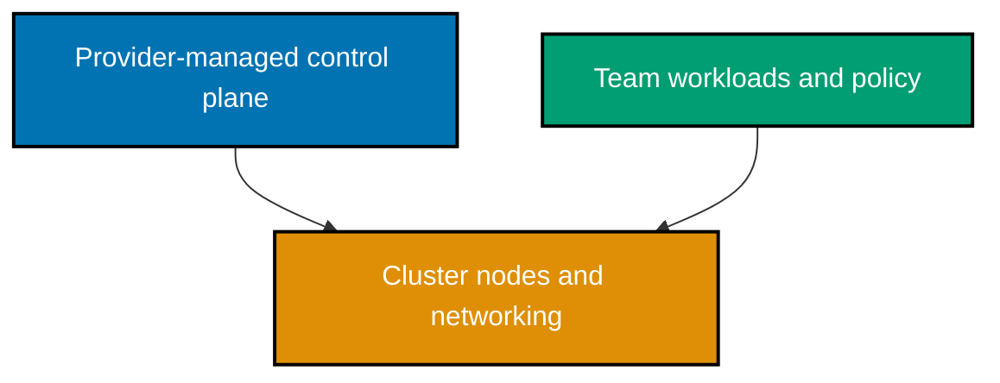
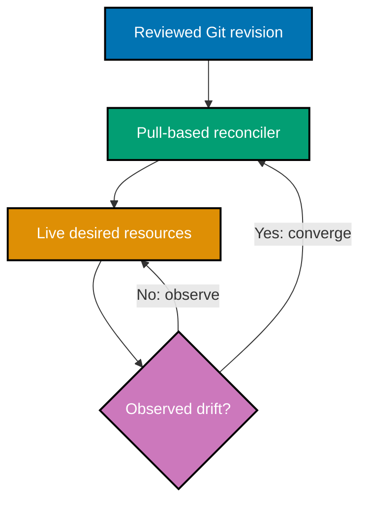

## Managed compute choices

### Worked Example 39: Serverless function

**Context**: A function-as-a-service deployment declares event-driven code without declaring a server fleet.

```yaml
# => Names a function workload whose platform supplies invocation runtime capacity.
function: thumbnail-created
# => Connects a storage event to the function's declared handler.
trigger: object-created
# => Keeps the execution role separate from source code and deployment configuration.
role: thumbnail-created-role
```

Complete serverless artifact: [`ex-39-lambda/template.yaml`](./code/ex-39-lambda/template.yaml).

**Key takeaway**: Serverless removes server management, not design responsibility for code and dependencies.

**Why It Matters**: Functions suit bounded event work, variable traffic, and integrations where server lifecycle would distract from the outcome. They still need least-privilege roles, retry policies, observability, and idempotent handlers. Long-running or highly predictable workloads may fit an always-running service better. _ex-39 · co-26_

### Worked Example 40: Cold-start budget

**Context**: Separate first-invocation initialization from steady-state handler work.

| Phase       | Observation                      | Response                               |
| ----------- | -------------------------------- | -------------------------------------- |
| Init        | Runtime and dependencies load    | Reduce package and initialization work |
| Invoke      | Handler processes event          | Measure normal latency separately      |
| Warm invoke | Reused environment may skip init | Do not assume reuse forever            |

**Key takeaway**: Cold starts are an initialization cost that needs measurement, not folklore.

**Why It Matters**: A slow first request can violate an interactive latency budget even when average handler work is fast. Package size, runtime initialization, network calls, and concurrency behavior all influence it. Measure cold and warm paths independently before buying a platform feature or redesigning an otherwise suitable function. _ex-40 · co-26_

### Worked Example 41: Managed database boundary

**Context**: A managed database offloads control-plane operations while the customer retains data responsibility.

| Responsibility                    | Managed database provider | Customer                         |
| --------------------------------- | ------------------------- | -------------------------------- |
| Hardware and engine patch process | Operates                  | Chooses maintenance policy       |
| Backups mechanism                 | Provides                  | Sets retention and tests restore |
| Schema and data access            | No                        | Owns                             |

**Key takeaway**: Managed service reduces operations, but does not transfer accountability for data use.

**Why It Matters**: Managed database decisions should include restore testing, performance limits, encryption configuration, and data residency. “Managed” does not mean application queries, schema migrations, or access policies become safe automatically. Clarify the provider/customer split before incident response or compliance review needs it. _ex-41 · co-27_

### Worked Example 42: Managed Kubernetes control plane

**Context**: EKS, GKE, and AKS manage the Kubernetes control plane; teams still operate workloads and policies.



**Key takeaway**: Managed Kubernetes is a control-plane service, not an application-operations outsourcing contract.

**Why It Matters**: A managed control plane can remove upgrade and availability work at one layer, while networking, worker capacity, RBAC, admission policy, and workload security remain shared responsibilities. Evaluate whether Kubernetes complexity is justified for the workload before treating it as a default platform. _ex-42 · co-27_

## Security and secret boundaries

### Worked Example 43: Least-privilege policy

**Context**: Grant only the exact actions and resource scope a workload needs.

```json
{
  "Version": "2012-10-17",
  "Statement": [{ "Effect": "Allow", "Action": ["s3:GetObject"], "Resource": "arn:aws:s3:::service-assets/*" }]
}
```

Complete policy artifact: [`ex-43-iam-least-privilege/policy.json`](./code/ex-43-iam-least-privilege/policy.json).

**Key takeaway**: An allow list for one action and one resource is easier to audit than a wildcard.

**Why It Matters**: Wildcard permissions turn a small compromise into a larger blast radius. Start from observed workload operations, scope both action and resource, then test access-denied behavior intentionally. Least privilege needs maintenance: new features can require new permissions, and stale permissions should be removed. _ex-43 · co-28_

### Worked Example 44: Workload role

**Context**: Let a workload receive temporary credentials through an attached role rather than embedded keys.

| Decision            | Recorded choice                                     |
| ------------------- | --------------------------------------------------- |
| Workload identity   | `service-reader` role mapped by the target platform |
| Credential lifetime | Provider-issued temporary credentials               |
| Static access keys  | Prohibited in code, images, and manifests           |

Complete non-code decision artifact:
[`ex-44-iam-role-workload/workload-role.md`](./code/ex-44-iam-role-workload/workload-role.md).

**Key takeaway**: Workload identity removes the distribution and rotation burden of long-lived keys.

**Why It Matters**: A committed or baked-in key can be copied into images, logs, developer machines, and backups. Temporary role credentials narrow lifetime and allow central revocation, though the role's permissions still need review. Verify the actual workload identity at runtime, not only the manifest. _ex-44 · co-28_

### Worked Example 45: Runtime secret retrieval

**Context**: Pass a secret reference to an application and resolve its value through an approved runtime identity.

| Decision            | Recorded choice                                |
| ------------------- | ---------------------------------------------- |
| Configuration value | A provider-specific secret reference only      |
| Retrieval identity  | `service-reader-role` workload identity        |
| Secret value        | Retrieved at runtime; never committed or shown |

Complete non-code decision artifact:
[`ex-45-secrets-manager/runtime-secret.md`](./code/ex-45-secrets-manager/runtime-secret.md).

**Key takeaway**: A secret manager reference is safer than a secret literal, but access policy still matters.

**Why It Matters**: Secret managers centralize rotation, audit events, and access policy, reducing copies of a credential. They cannot protect a value that an application writes into logs or returns to a caller. Design redaction, rotation behavior, and failure handling together with the retrieval integration. _ex-45 · co-29_

### Worked Example 46: State-safe secret architecture

**Context**: Prefer resource references and runtime lookup over resource arguments that preserve plaintext in state.

| Design                                 | State exposure risk | Preferred action                     |
| -------------------------------------- | ------------------- | ------------------------------------ |
| `password = "literal"`                 | High                | Reject                               |
| `secret_arn = "..."`                   | Lower               | Retrieve at runtime                  |
| Generated password managed by provider | May be high         | Restrict backend and evaluate design |

**Key takeaway**: State protection and secret-management design reinforce each other.

**Why It Matters**: A sensitive output mask only changes display behavior; it does not guarantee storage behavior. Review each provider resource's state model before assuming a value is absent. Use short-lived credentials where possible and make backend access, encryption, backups, and logging part of the threat model. _ex-46 · co-29_

## Cost, delivery, and observation

### Worked Example 47: Tagging strategy

**Context**: Apply consistent metadata that links resources to an owner, environment, and cost purpose.

```hcl
# => Defines mandatory tags once so every module can apply the same accountability vocabulary.
locals { required_tags = { Environment = var.environment, Owner = "learning-team", ManagedBy = "iac", CostCenter = "training" } }
# => Merges required tags with a resource's specific name without dropping the common controls.
tags = merge(local.required_tags, { Name = "service-assets" })
```

Complete tag artifact: [`ex-47-tagging-strategy/main.tf`](./code/ex-47-tagging-strategy/main.tf).

**Key takeaway**: Tags make cost, ownership, and operational inventory queryable across resources.

**Why It Matters**: Untagged infrastructure becomes unallocated spend and unowned operational risk. Standard keys enable budget reports and incident contact lists, while free-form values quickly fragment those reports. Enforce required tags through modules or policy and make exceptions explicit rather than silently accepting missing metadata. _ex-47 · co-30_

### Worked Example 48: Right-sizing decision

**Context**: Compare measured demand with requested capacity before changing a resource class.

| Metric window | Observed    | Requested | Decision                          |
| ------------- | ----------- | --------- | --------------------------------- |
| CPU p95       | 8%          | 2 vCPU    | Test smaller class                |
| Memory p99    | 480 MiB     | 512 MiB   | Keep headroom; investigate spikes |
| Disk growth   | 2 GiB/month | 500 GiB   | Reduce after retention review     |

**Key takeaway**: Right-sizing uses demand data and safety margins, not a lowest-cost reflex.

**Why It Matters**: Oversizing wastes money, but undersizing can create latency, throttling, and outages. Use percentiles, growth forecasts, resilience requirements, and load tests before reducing capacity. Record the decision and observe the result so FinOps becomes a feedback loop instead of a periodic cost-cutting event. _ex-48 · co-30_

### Worked Example 49: FinOps maturity

**Context**: Use Crawl, Walk, and Run as a maturity conversation, separate from the Inform, Optimize, Operate framework phases.

| Maturity | Evidence                                              |
| -------- | ----------------------------------------------------- |
| Crawl    | Owners and basic allocation tags exist.               |
| Walk     | Teams act on recurring cost reports.                  |
| Run      | Engineering, finance, and business optimize together. |

**Key takeaway**: FinOps is a collaborative operating practice, not a finance-only dashboard.

**Why It Matters**: Maturity language helps a team choose the next sustainable practice instead of copying an advanced program prematurely. Reliable allocation and ownership are prerequisites for optimization. Keep the maturity model distinct from the FinOps framework's operating phases so reports and goals remain unambiguous. _ex-49 · co-30_

### Worked Example 50: OpenGitOps principles

**Context**: Make deployment intent declarative, versioned, pulled automatically, and continuously reconciled.

| Principle               | Artifact                                 |
| ----------------------- | ---------------------------------------- |
| Declarative             | YAML or HCL declares desired state.      |
| Versioned and immutable | Reviewed Git commit identifies intent.   |
| Pulled automatically    | Agent reads the approved source.         |
| Continuously reconciled | Agent compares and converges live state. |

**Key takeaway**: GitOps turns a reviewed repository into a delivery source of truth.

**Why It Matters**: GitOps is valuable when the repository, identities, review rules, and reconciler are all trustworthy. A push script alone does not satisfy the pull and reconcile properties. Protect the repository and reconciler credentials carefully because each becomes part of the production change-control boundary. _ex-50 · co-31_

### Worked Example 51: Continuous reconciliation

**Context**: A reconciler detects live drift and drives it back to a signed-off Git revision.



**Key takeaway**: Reconciliation is a repeated comparison loop, not a one-time deployment.

**Why It Matters**: Automatic correction can restore known good state quickly, but it can also undo a legitimate emergency change. Pair the reconciler with a documented break-glass path that records and rapidly codifies exceptions. Monitor reconciliation failures because silent non-convergence leaves an attractive but false source of truth. _ex-51 · co-31_

### Worked Example 52: OpenTelemetry signals

**Context**: Use distinct signals to observe infrastructure and service behavior.

| Signal  | Question it answers            | Example                        |
| ------- | ------------------------------ | ------------------------------ |
| Metrics | How much or how often?         | Queue depth or CPU utilization |
| Logs    | What event occurred?           | Policy denial with request ID  |
| Traces  | Which path did a request take? | API to function to database    |

**Key takeaway**: Metrics, logs, and traces answer related but different operational questions.

**Why It Matters**: A metric can alert on a latency spike, logs can explain an error, and a trace can locate the slow dependency. Collecting all three without cardinality limits, retention decisions, and access controls creates cost and privacy risk. Instrument the user-important paths first. _ex-52 · co-32_

### Worked Example 53: Capstone readiness review

**Context**: Confirm the integrated local design before running its lifecycle.

| Required evidence        | Capstone artifact                       |
| ------------------------ | --------------------------------------- |
| Reusable module          | `capstone/modules/service/`             |
| Two environments         | `capstone/environments/dev` and `stage` |
| Least privilege and tags | Role policy plus `required_tags`        |
| Secret boundary          | Reference only, no plaintext input      |
| Drift check              | Apply then re-plan reports no changes   |

**Key takeaway**: A capstone is complete only when the lifecycle, security, cost, and verification boundaries work together.

**Why It Matters**: Individual IaC features are easy to demonstrate in isolation but are valuable only when composed safely. The local capstone exercises reviewable declarations, parameterized reuse, and a clean teardown without a paid account. Use its constraints as habits before adding provider-specific production complexity. _ex-53 · co-16, co-17, co-19, co-28, co-29, co-30_

Next: [Capstone](./capstone/overview.md) →
