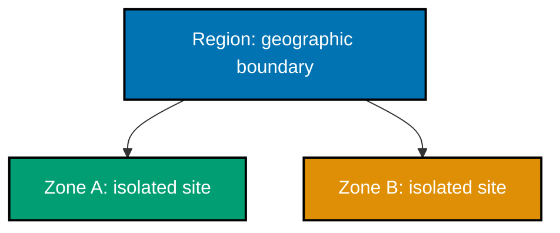

## Cloud mental models

### Worked Example 1: NIST cloud characteristics

**Context**: Use the five characteristics to distinguish cloud computing from a hosted server.

| Characteristic         | LocalStack learning service evidence                   |
| ---------------------- | ------------------------------------------------------ |
| On-demand self-service | A command creates a bucket without an operator ticket. |
| Broad network access   | Clients use the HTTP endpoint.                         |
| Resource pooling       | The runtime shares a provider-managed pool.            |
| Rapid elasticity       | Desired capacity can change from configuration.        |
| Measured service       | Usage can be metered by the provider.                  |

**Key takeaway**: Cloud is a service model with five properties, not a synonym for someone else's computer.

**Why It Matters**: Naming the properties prevents marketing labels from replacing architecture reasoning. A VM at a hosting provider may offer remote access but not self-service, pooling, elasticity, and metering together. Ask which characteristics your platform actually supplies before assuming it has cloud operational properties. _ex-01 · co-01_

### Worked Example 2: IaaS, PaaS, and SaaS control boundary

**Context**: Select a service model by the operational control your team needs.

| Model | You operate               | Provider operates                           |
| ----- | ------------------------- | ------------------------------------------- |
| IaaS  | OS through application    | Physical infrastructure                     |
| PaaS  | Application and data      | Runtime through physical infrastructure     |
| SaaS  | Data and account settings | Application through physical infrastructure |

**Key takeaway**: Moving from IaaS to SaaS trades control for operated capability.

**Why It Matters**: The service-model choice changes patching, incident ownership, compliance evidence, and team skills. A database platform can remove operating-system work, while an IaaS VM permits unusual runtime choices. Treat the boundary as an explicit trade-off rather than a maturity ladder. _ex-02 · co-02_

### Worked Example 3: Deployment models

**Context**: Deployment model describes who owns and shares the cloud environment.

| Model     | Decision artifact                                              |
| --------- | -------------------------------------------------------------- |
| Public    | Use a provider's multi-tenant platform.                        |
| Private   | Operate dedicated infrastructure for one organization.         |
| Community | Share infrastructure among organizations with common concerns. |
| Hybrid    | Integrate two or more distinct deployment models.              |

**Key takeaway**: Hybrid means an integrated boundary, not merely using two vendors.

**Why It Matters**: Deployment labels do not guarantee security or lower cost. A private environment can still be poorly controlled, and a public cloud can meet stringent requirements with appropriate design. Start from data, resilience, and operating constraints, then choose the model that addresses them. _ex-03 · co-03_

### Worked Example 4: Shared responsibility matrix

**Context**: Capture ownership before an incident reveals an unowned control.

| Control                   | IaaS     | PaaS     | SaaS            |
| ------------------------- | -------- | -------- | --------------- |
| Physical data center      | Provider | Provider | Provider        |
| Guest OS patching         | Customer | Provider | Provider        |
| Application configuration | Customer | Customer | Shared/customer |
| Identity and data access  | Customer | Customer | Customer        |

**Key takeaway**: The customer always owns data access decisions, even as provider operations grow.

**Why It Matters**: “The cloud provider handles security” obscures the controls that remain with the customer: identities, data classification, configuration, and legal use. A visible matrix makes an audit question answerable and gives an incident responder an owner for each corrective action. _ex-04 · co-04_

### Worked Example 5: Virtual compute

**Context**: A virtual machine is on-demand virtual-server capacity, not a physical server assignment.

```hcl
# => Declares the desired virtual-server-like object through the local AWS-compatible provider.
resource "aws_instance" "api" {
  # => Uses a placeholder image identifier accepted only by a configured local test provider.
  ami = "ami-00000000"
  # => Requests a small named capacity class rather than purchasing host hardware.
  instance_type = "t3.micro"
}
```

Complete LocalStack artifact: [`ex-05-compute-vm/main.tf`](./code/ex-05-compute-vm/main.tf).

**Key takeaway**: Compute capacity is requested as an API resource and should remain replaceable.

**Why It Matters**: Virtual compute lets a team describe capacity alongside its networking and identity constraints. It does not remove capacity planning, image hygiene, or operating-system responsibility in IaaS. Prefer immutable images and replacement over manually repairing one special server. _ex-05 · co-05_

### Worked Example 6: Object storage bucket

**Context**: Object storage addresses an object by a bucket and key rather than a mounted filesystem path.

```hcl
# => Declares the container namespace that holds objects addressed by key.
resource "aws_s3_bucket" "assets" {
  # => Uses a unique, disposable local-learning bucket name.
  bucket = "cloud-iac-learning-assets"
}
```

Complete LocalStack artifact: [`ex-06-object-storage-bucket/main.tf`](./code/ex-06-object-storage-bucket/main.tf).

**Key takeaway**: A bucket groups objects; an object key identifies one stored value.

**Why It Matters**: Object storage excels at durable blobs, static assets, backups, and event sources, but it is not a drop-in POSIX disk. Its key-oriented model changes rename, locking, and latency expectations. Model object names, lifecycle rules, and access policies deliberately. _ex-06 · co-06_

### Worked Example 7: Block storage volume

**Context**: Block storage attaches to a compute instance and behaves more like a disk.

| Property     | Object storage     | Block storage                 |
| ------------ | ------------------ | ----------------------------- |
| Access model | API by key         | Attached block device         |
| Typical use  | Assets and backups | Filesystem or database volume |
| Attachment   | Not required       | Attached to compute           |

**Key takeaway**: Choose storage by access semantics, not by the word “storage.”

**Why It Matters**: A database that expects filesystem ordering and low-latency blocks has different needs from an archive of uploaded documents. Selecting block storage also introduces attachment, availability-zone, backup, and replacement concerns. Keep state external to ephemeral compute and recover it through tested snapshots. _ex-07 · co-07_

### Worked Example 8: Regions and availability zones

**Context**: A region contains isolated availability zones that represent failure domains.



**Key takeaway**: A region is not one failure domain; availability zones provide the smaller boundary.

**Why It Matters**: Resilience planning starts by identifying what can fail together. Two instances in one zone can protect against a process crash but not a zonal disruption. Spanning zones adds cost and network design work, so apply it to availability requirements rather than every disposable workload. _ex-08 · co-08_

### Worked Example 9: High availability across zones

**Context**: Design a service that remains available when one zone is lost.

| Failure            | Desired response  | Design choice                  |
| ------------------ | ----------------- | ------------------------------ |
| One instance fails | Replace it        | Health check and desired count |
| One zone fails     | Route elsewhere   | Targets in at least two zones  |
| One region fails   | Recover elsewhere | Separate, explicit DR design   |

**Key takeaway**: Multi-zone availability handles a zonal failure, not every disaster.

**Why It Matters**: “Highly available” needs a named failure model and a measurable recovery expectation. A load balancer with healthy targets in different zones can remove a failed zone from service, but databases, DNS, and deployments must also support the outcome. Verify failure behavior rather than relying on topology diagrams. _ex-09 · co-08_

## Declarative infrastructure

### Worked Example 10: Desired state versus steps

**Context**: Contrast an end-state declaration with an operator runbook.

| Declarative IaC                     | Imperative procedure                  |
| ----------------------------------- | ------------------------------------- |
| “Ensure two tagged buckets exist.”  | “Click create, then enter this name.” |
| Tool calculates actions from state. | Operator determines each next action. |
| Review focuses on the outcome.      | Review focuses on a sequence.         |

**Key takeaway**: IaC states what should exist; the engine works out how to converge.

**Why It Matters**: Declarative configuration is repeatable because its outcome can be evaluated repeatedly. It does not eliminate operational knowledge: dependencies, providers, and state still determine what the engine can safely do. Keep one-off remediation separate from the source of truth or it becomes hidden drift. _ex-10 · co-12_

### Worked Example 11: Idempotent convergence

**Context**: Reapplying unchanged configuration should not create a second copy.

```text
# => The first apply compares absent reality with the declared bucket and creates it.
apply(configuration, empty-state) -> one bucket
# => The second apply compares matching reality with the same declaration and makes no changes.
apply(configuration, matching-state) -> no changes
```

Complete runnable artifact: [`ex-11-idempotency/run.sh`](./code/ex-11-idempotency/run.sh).

**Key takeaway**: Idempotency means repeated convergence to the same desired result.

**Why It Matters**: Retries are normal in automation, deployments, and incident response. An idempotent operation makes a retry safer because it does not multiply resources or accidentally re-run a destructive step. It still requires correct state and provider semantics; inspect plans when either has changed. _ex-11 · co-13_

### Worked Example 12: Provider block

**Context**: A provider plugin maps HCL resource types to an API; this configuration points AWS calls at LocalStack.

```hcl
# => Selects the AWS provider plugin that implements aws_s3_bucket and related resource types.
provider "aws" {
  # => Routes S3 requests to the local emulator instead of a paid cloud endpoint.
  endpoints { s3 = "http://localhost:4566" }
  # => Supplies non-secret test values required by the provider's local request signer.
  access_key = "test"; secret_key = "test"; region = "us-east-1"
}
```

Complete LocalStack artifact: [`ex-12-provider/main.tf`](./code/ex-12-provider/main.tf).

**Key takeaway**: A provider is an implementation plugin, while a resource is a declared object type.

**Why It Matters**: Providers isolate cloud API details behind a consistent configuration workflow, but they do not make vendors identical. Pin provider versions, read upgrade notes, and test plans against representative environments. The LocalStack endpoint makes this lesson safe without implying all AWS behavior is emulated. _ex-12 · co-14_

### Worked Example 13: Resource block

**Context**: A resource block declares one managed object of a provider-implemented type.

```hcl
# => Chooses the AWS provider's bucket resource type and a local name for references.
resource "aws_s3_bucket" "logs" {
  # => Gives the real object a disposable name for the local emulator.
  bucket = "cloud-iac-learning-logs"
  # => Adds cost and ownership metadata as part of the desired state.
  tags = { Environment = "learning", ManagedBy = "iac" }
}
```

Complete LocalStack artifact: [`ex-13-resource/main.tf`](./code/ex-13-resource/main.tf).

**Key takeaway**: The address `aws_s3_bucket.logs` is configuration identity, not the cloud object's name.

**Why It Matters**: A stable resource address lets state map source configuration to a real object through renames and updates. Changing that address without a state move can cause Terraform to propose replacement. Give addresses meaningful, durable roles and make identity changes explicit in code review. _ex-13 · co-14_

### Worked Example 14: HCL arguments and blocks

**Context**: HCL uses arguments for values and blocks for structured nested configuration.

```hcl
# => Declares a resource block, which opens a structured configuration container.
resource "aws_s3_bucket" "example" {
  # => `bucket` is an argument: a name equals a value.
  bucket = "cloud-iac-hcl-example"
  # => `lifecycle_rule` is a nested block with related arguments.
  lifecycle_rule { enabled = true }
}
```

Complete parseable HCL artifact: [`ex-14-hcl-arguments-blocks/main.tf`](./code/ex-14-hcl-arguments-blocks/main.tf).

**Key takeaway**: Read HCL by first locating the block, then its arguments and nested blocks.

**Why It Matters**: This small grammar makes unfamiliar provider documentation easier to translate into source. Blocks communicate grouping and repetition, while arguments express values. Formatting a long one-line nested block is valid but less reviewable, so prefer expanded structures in production configuration. _ex-14 · co-15_

### Worked Example 15: Initialize a working directory

**Context**: Initialization installs providers and configures the backend before planning.

```bash
# => Enters the example with its provider and backend declarations.
cd learning/code/ex-12-provider
# => Initializes the directory without applying any infrastructure changes.
terraform init
# => Records the installed provider selections in the local working directory.
terraform providers
```

Complete runnable artifact: [`ex-15-tf-init/run.sh`](./code/ex-15-tf-init/run.sh).

**Key takeaway**: `init` prepares a configuration directory; it does not create resources.

**Why It Matters**: Initialization is intentionally separate from planning so a team can inspect provider and backend changes before any apply. Commit a lock file where appropriate, but never mistake a downloaded plugin for an approved infrastructure change. Re-run initialization after changing providers or backend configuration. _ex-15 · co-16_

### Worked Example 16: Preview a plan

**Context**: Planning calculates proposed changes without executing them.

```bash
# => Refreshes known state and computes proposed changes without changing remote objects.
terraform plan
# => Writes the reviewed proposal to a local binary file for a later explicit apply.
terraform plan -out=learning.tfplan
# => Shows the human-readable actions in the saved proposal.
terraform show learning.tfplan
```

Complete runnable artifact: [`ex-16-tf-plan/run.sh`](./code/ex-16-tf-plan/run.sh).

**Key takeaway**: A plan is a proposed change set that must still be reviewed.

**Why It Matters**: The plan exposes replacement, deletion, and unexpected dependency effects before an API call happens. It is a critical review boundary, especially when state or provider versions changed. A saved plan also reduces the gap between reviewed intent and applied operations, but it can become stale. _ex-16 · co-16_

### Worked Example 17: Apply a reviewed plan

**Context**: Applying executes the operations proposed by a saved plan.

```bash
# => Applies only the proposal that was produced and reviewed in the preceding step.
terraform apply learning.tfplan
# => Queries the local endpoint to make the created bucket visible outside Terraform state.
aws --endpoint-url=http://localhost:4566 s3 ls
```

Complete runnable artifact: [`ex-17-tf-apply/run.sh`](./code/ex-17-tf-apply/run.sh).

**Key takeaway**: `apply` changes real infrastructure; a successful command deserves external verification.

**Why It Matters**: State tracks what Terraform believes it manages, while an API query provides an independent observation of the provider. Production pipelines should preserve the review evidence, identity, and policy checks around apply. Never use an automatic approval flag as a substitute for an approved change. _ex-17 · co-16_

### Worked Example 18: Destroy managed objects

**Context**: Destroy removes resources tracked by the configuration and state.

```bash
# => Previews deletion of every managed object before making the local environment empty.
terraform plan -destroy
# => Removes the managed local-learning objects after reviewing the destruction plan.
terraform destroy
```

Complete runnable artifact: [`ex-18-tf-destroy/run.sh`](./code/ex-18-tf-destroy/run.sh).

**Key takeaway**: Destruction is an explicit lifecycle operation, not cleanup to assume away.

**Why It Matters**: A reliable destroy proves that a configuration is reproducible and avoids leaving billable or confusing test infrastructure behind. In production, deletion may need backups, retention rules, approvals, and break-glass procedures. Treat a destroy plan as carefully as a creation plan. _ex-18 · co-16_

Next: [State, Networks, and Operations](./intermediate.md) →
