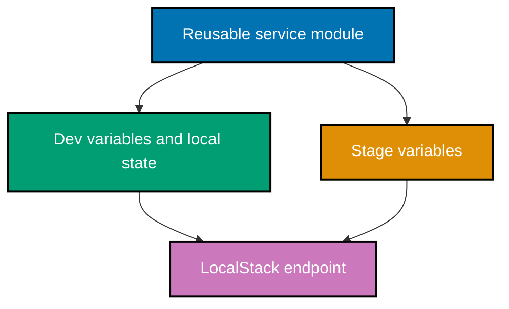

## Goal

Provision a small backend-service infrastructure definition against LocalStack. The same module creates
a tagged object bucket and a narrowly scoped policy document for dev and stage. It uses no paid-cloud
account, no real credential, and no secret value. Its only state is local and ignored by Git.

## Architecture



## Run locally

Start LocalStack in a separate terminal from the course root:

```bash
# => Starts a disposable AWS-compatible endpoint on the local machine only.
docker run --rm --name cloud-iac-localstack -p 4566:4566 localstack/localstack:4.10
# => Keep the endpoint running while the dev and stage Terraform commands execute.
```

In another terminal, execute the lifecycle for each environment. `terraform` can be replaced with
`tofu`; neither command uses a real cloud credential because the provider configuration uses only
the documented LocalStack test values.

```bash
# => Initializes provider plugins and the local backend for the dev environment.
cd environments/dev && terraform init && terraform plan
# => Creates the dev resources, then verifies converged state has no proposed changes.
terraform apply && terraform plan
# => Repeats the same reviewed lifecycle with only stage variable values changed.
cd ../stage && terraform init && terraform apply && terraform plan
# => Removes stage resources before returning to dev to remove its resources too.
terraform destroy && cd ../dev && terraform destroy
```

## Acceptance checklist

- `init`, `plan`, `apply`, re-`plan`, and `destroy` run for both environments against LocalStack.
- Dev and stage use one module and differ only through environment input values.
- Each created resource includes environment, owner, cost-center, and IaC-management tags.
- The generated policy permits only object reads in that environment's bucket.
- No real secret exists in source, variable files, local state, or a committed environment file.

The tracked [`.env.example`](./.env.example) is informational only; it contains no credential and
does not need copying. Do not create a real `.env` file for this capstone.

← Previous: [Secure, Observable Cloud Systems](../advanced.md) · Next: [Drilling](../../drilling/overview.md) →
